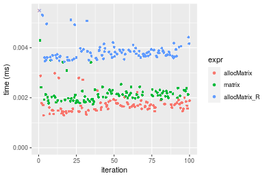
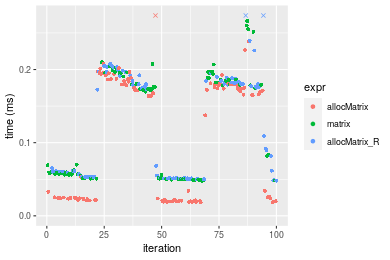
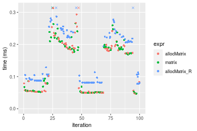
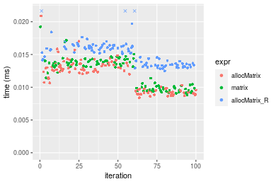
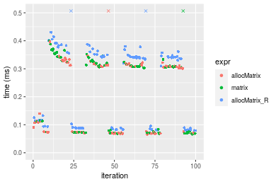
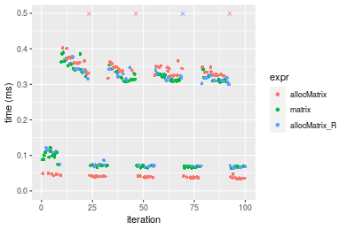

[matrixStats]: Benchmark report

---------------------------------------


# allocMatrix() benchmarks

This report benchmark the performance of allocMatrix() against alternative methods.

## Alternative methods

* matrix()
* matrix() special trick for NA

where
```r
> allocMatrix_R <- function(nrow, ncol, value = NA) {
+     if (is.na(value) && !is.nan(value)) {
+         matrix(data = value[c()], nrow = nrow, ncol = ncol)
+     }     else {
+         matrix(data = value, nrow = nrow, ncol = ncol)
+     }
+ }
```


## Data type "integer"
### Data
```r
> rmatrix <- function(nrow, ncol, mode = c("logical", "double", "integer", "index"), range = c(-100, 
+     +100), na_prob = 0) {
+     mode <- match.arg(mode)
+     n <- nrow * ncol
+     if (mode == "logical") {
+         x <- sample(c(FALSE, TRUE), size = n, replace = TRUE)
+     }     else if (mode == "index") {
+         x <- seq_len(n)
+         mode <- "integer"
+     }     else {
+         x <- runif(n, min = range[1], max = range[2])
+     }
+     storage.mode(x) <- mode
+     if (na_prob > 0) 
+         x[sample(n, size = na_prob * n)] <- NA
+     dim(x) <- c(nrow, ncol)
+     x
+ }
> rmatrices <- function(scale = 10, seed = 1, ...) {
+     set.seed(seed)
+     data <- list()
+     data[[1]] <- rmatrix(nrow = scale * 1, ncol = scale * 1, ...)
+     data[[2]] <- rmatrix(nrow = scale * 10, ncol = scale * 10, ...)
+     data[[3]] <- rmatrix(nrow = scale * 100, ncol = scale * 1, ...)
+     data[[4]] <- t(data[[3]])
+     data[[5]] <- rmatrix(nrow = scale * 10, ncol = scale * 100, ...)
+     data[[6]] <- t(data[[5]])
+     names(data) <- sapply(data, FUN = function(x) paste(dim(x), collapse = "x"))
+     data
+ }
> data <- rmatrices(mode = mode)
> values <- list(zero = 0, one = 1, `NA` = NA_real_)
> if (mode != "double") 
+     values <- lapply(values, FUN = function(x) {
+         storage.mode(x) <- mode
+         x
+     })
```

### Results

### 10x10 matrix


```r
> dim <- dim(data[["10x10"]])
> nrow <- dim[1L]
> ncol <- dim[2L]
> str(value)
 int 0
```

```r
> stats <- microbenchmark(allocMatrix = allocMatrix(nrow = nrow, ncol = ncol, value = value), matrix = matrix(data = value, 
+     nrow = nrow, ncol = ncol), allocMatrix_R = allocMatrix_R(nrow = nrow, ncol = ncol, value = value), 
+     unit = "ms")
```

_Table: Benchmarking of allocMatrix(), matrix() and allocMatrix_R() on integer+10x10+0 data. The top panel shows times in milliseconds and the bottom panel shows relative times._


|   |expr          |      min|        lq|      mean|    median|        uq|      max|
|:--|:-------------|--------:|---------:|---------:|---------:|---------:|--------:|
|1  |allocMatrix   | 0.001444| 0.0017585| 0.0026522| 0.0018485| 0.0019570| 0.079317|
|2  |matrix        | 0.002027| 0.0022750| 0.0024266| 0.0023640| 0.0024990| 0.004648|
|3  |allocMatrix_R | 0.003197| 0.0034655| 0.0038071| 0.0035920| 0.0037125| 0.023252|


|   |expr          |      min|       lq|      mean|   median|       uq|       max|
|:--|:-------------|--------:|--------:|---------:|--------:|--------:|---------:|
|1  |allocMatrix   | 1.000000| 1.000000| 1.0000000| 1.000000| 1.000000| 1.0000000|
|2  |matrix        | 1.403740| 1.293716| 0.9149272| 1.278875| 1.276954| 0.0586003|
|3  |allocMatrix_R | 2.213989| 1.970714| 1.4354574| 1.943197| 1.897036| 0.2931528|

_Figure: Benchmarking of allocMatrix(), matrix() and allocMatrix_R() on integer+10x10+0 data.  Outliers are displayed as crosses.  Times are in milliseconds._


```r
> dim <- dim(data[["10x10"]])
> nrow <- dim[1L]
> ncol <- dim[2L]
> str(value)
 int 1
```

```r
> stats <- microbenchmark(allocMatrix = allocMatrix(nrow = nrow, ncol = ncol, value = value), matrix = matrix(data = value, 
+     nrow = nrow, ncol = ncol), allocMatrix_R = allocMatrix_R(nrow = nrow, ncol = ncol, value = value), 
+     unit = "ms")
```

_Table: Benchmarking of allocMatrix(), matrix() and allocMatrix_R() on integer+10x10+1 data. The top panel shows times in milliseconds and the bottom panel shows relative times._


|   |expr          |      min|        lq|      mean|    median|        uq|      max|
|:--|:-------------|--------:|---------:|---------:|---------:|---------:|--------:|
|1  |allocMatrix   | 0.001402| 0.0015590| 0.0018605| 0.0016520| 0.0018575| 0.008567|
|2  |matrix        | 0.001947| 0.0020285| 0.0022532| 0.0021215| 0.0022770| 0.003681|
|3  |allocMatrix_R | 0.003047| 0.0031840| 0.0035366| 0.0033205| 0.0034455| 0.016133|


|   |expr          |      min|       lq|     mean|   median|       uq|      max|
|:--|:-------------|--------:|--------:|--------:|--------:|--------:|--------:|
|1  |allocMatrix   | 1.000000| 1.000000| 1.000000| 1.000000| 1.000000| 1.000000|
|2  |matrix        | 1.388730| 1.301155| 1.211057| 1.284201| 1.225841| 0.429672|
|3  |allocMatrix_R | 2.173324| 2.042335| 1.900892| 2.009988| 1.854912| 1.883156|

_Figure: Benchmarking of allocMatrix(), matrix() and allocMatrix_R() on integer+10x10+1 data.  Outliers are displayed as crosses.  Times are in milliseconds._


```r
> dim <- dim(data[["10x10"]])
> nrow <- dim[1L]
> ncol <- dim[2L]
> str(value)
 int NA
```

```r
> stats <- microbenchmark(allocMatrix = allocMatrix(nrow = nrow, ncol = ncol, value = value), matrix = matrix(data = value, 
+     nrow = nrow, ncol = ncol), allocMatrix_R = allocMatrix_R(nrow = nrow, ncol = ncol, value = value), 
+     unit = "ms")
```

_Table: Benchmarking of allocMatrix(), matrix() and allocMatrix_R() on integer+10x10+NA data. The top panel shows times in milliseconds and the bottom panel shows relative times._


|   |expr          |      min|        lq|      mean|    median|        uq|      max|
|:--|:-------------|--------:|---------:|---------:|---------:|---------:|--------:|
|1  |allocMatrix   | 0.001458| 0.0016235| 0.0019302| 0.0017110| 0.0018450| 0.012816|
|2  |matrix        | 0.001954| 0.0021350| 0.0023728| 0.0022345| 0.0023605| 0.004130|
|3  |allocMatrix_R | 0.003764| 0.0039755| 0.0045568| 0.0040835| 0.0042735| 0.021474|


|   |expr          |      min|       lq|     mean|   median|       uq|       max|
|:--|:-------------|--------:|--------:|--------:|--------:|--------:|---------:|
|1  |allocMatrix   | 1.000000| 1.000000| 1.000000| 1.000000| 1.000000| 1.0000000|
|2  |matrix        | 1.340192| 1.315060| 1.229345| 1.305961| 1.279404| 0.3222534|
|3  |allocMatrix_R | 2.581619| 2.448722| 2.360848| 2.386616| 2.316260| 1.6755618|

_Figure: Benchmarking of allocMatrix(), matrix() and allocMatrix_R() on integer+10x10+NA data.  Outliers are displayed as crosses.  Times are in milliseconds._




### 100x100 matrix


```r
> dim <- dim(data[["100x100"]])
> nrow <- dim[1L]
> ncol <- dim[2L]
> str(value)
 int 0
```

```r
> stats <- microbenchmark(allocMatrix = allocMatrix(nrow = nrow, ncol = ncol, value = value), matrix = matrix(data = value, 
+     nrow = nrow, ncol = ncol), allocMatrix_R = allocMatrix_R(nrow = nrow, ncol = ncol, value = value), 
+     unit = "ms")
```

_Table: Benchmarking of allocMatrix(), matrix() and allocMatrix_R() on integer+100x100+0 data. The top panel shows times in milliseconds and the bottom panel shows relative times._


|   |expr          |      min|       lq|      mean|    median|        uq|      max|
|:--|:-------------|--------:|--------:|---------:|---------:|---------:|--------:|
|1  |allocMatrix   | 0.003344| 0.003613| 0.0038357| 0.0037615| 0.0039020| 0.011244|
|2  |matrix        | 0.007113| 0.007495| 0.0077696| 0.0076225| 0.0078245| 0.014495|
|3  |allocMatrix_R | 0.008424| 0.008739| 0.0090276| 0.0088740| 0.0090545| 0.020808|


|   |expr          |      min|       lq|     mean|   median|       uq|      max|
|:--|:-------------|--------:|--------:|--------:|--------:|--------:|--------:|
|1  |allocMatrix   | 1.000000| 1.000000| 1.000000| 1.000000| 1.000000| 1.000000|
|2  |matrix        | 2.127093| 2.074453| 2.025567| 2.026452| 2.005254| 1.289132|
|3  |allocMatrix_R | 2.519139| 2.418766| 2.353549| 2.359165| 2.320477| 1.850587|

_Figure: Benchmarking of allocMatrix(), matrix() and allocMatrix_R() on integer+100x100+0 data.  Outliers are displayed as crosses.  Times are in milliseconds._


```r
> dim <- dim(data[["100x100"]])
> nrow <- dim[1L]
> ncol <- dim[2L]
> str(value)
 int 1
```

```r
> stats <- microbenchmark(allocMatrix = allocMatrix(nrow = nrow, ncol = ncol, value = value), matrix = matrix(data = value, 
+     nrow = nrow, ncol = ncol), allocMatrix_R = allocMatrix_R(nrow = nrow, ncol = ncol, value = value), 
+     unit = "ms")
```

_Table: Benchmarking of allocMatrix(), matrix() and allocMatrix_R() on integer+100x100+1 data. The top panel shows times in milliseconds and the bottom panel shows relative times._


|   |expr          |      min|        lq|      mean|   median|        uq|      max|
|:--|:-------------|--------:|---------:|---------:|--------:|---------:|--------:|
|1  |allocMatrix   | 0.006652| 0.0072345| 0.0077251| 0.007472| 0.0078555| 0.014201|
|2  |matrix        | 0.006969| 0.0075420| 0.0083164| 0.007883| 0.0082405| 0.038674|
|3  |allocMatrix_R | 0.008071| 0.0088120| 0.0093429| 0.009063| 0.0094130| 0.023420|


|   |expr          |      min|       lq|     mean|   median|       uq|      max|
|:--|:-------------|--------:|--------:|--------:|--------:|--------:|--------:|
|1  |allocMatrix   | 1.000000| 1.000000| 1.000000| 1.000000| 1.000000| 1.000000|
|2  |matrix        | 1.047655| 1.042505| 1.076537| 1.055005| 1.049010| 2.723329|
|3  |allocMatrix_R | 1.213319| 1.218052| 1.209421| 1.212928| 1.198269| 1.649180|

_Figure: Benchmarking of allocMatrix(), matrix() and allocMatrix_R() on integer+100x100+1 data.  Outliers are displayed as crosses.  Times are in milliseconds._


```r
> dim <- dim(data[["100x100"]])
> nrow <- dim[1L]
> ncol <- dim[2L]
> str(value)
 int NA
```

```r
> stats <- microbenchmark(allocMatrix = allocMatrix(nrow = nrow, ncol = ncol, value = value), matrix = matrix(data = value, 
+     nrow = nrow, ncol = ncol), allocMatrix_R = allocMatrix_R(nrow = nrow, ncol = ncol, value = value), 
+     unit = "ms")
```

_Table: Benchmarking of allocMatrix(), matrix() and allocMatrix_R() on integer+100x100+NA data. The top panel shows times in milliseconds and the bottom panel shows relative times._


|   |expr          |      min|        lq|      mean|    median|       uq|      max|
|:--|:-------------|--------:|---------:|---------:|---------:|--------:|--------:|
|1  |allocMatrix   | 0.006546| 0.0070445| 0.0074553| 0.0073475| 0.007595| 0.014664|
|2  |matrix        | 0.006784| 0.0074185| 0.0079395| 0.0078410| 0.008054| 0.018708|
|3  |allocMatrix_R | 0.012078| 0.0125205| 0.0132855| 0.0126590| 0.012888| 0.044332|


|   |expr          |      min|       lq|     mean|   median|       uq|      max|
|:--|:-------------|--------:|--------:|--------:|--------:|--------:|--------:|
|1  |allocMatrix   | 1.000000| 1.000000| 1.000000| 1.000000| 1.000000| 1.000000|
|2  |matrix        | 1.036358| 1.053091| 1.064950| 1.067166| 1.060434| 1.275777|
|3  |allocMatrix_R | 1.845096| 1.777344| 1.782024| 1.722899| 1.696906| 3.023186|

_Figure: Benchmarking of allocMatrix(), matrix() and allocMatrix_R() on integer+100x100+NA data.  Outliers are displayed as crosses.  Times are in milliseconds._


### 1000x10 matrix


```r
> dim <- dim(data[["1000x10"]])
> nrow <- dim[1L]
> ncol <- dim[2L]
> str(value)
 int 0
```

```r
> stats <- microbenchmark(allocMatrix = allocMatrix(nrow = nrow, ncol = ncol, value = value), matrix = matrix(data = value, 
+     nrow = nrow, ncol = ncol), allocMatrix_R = allocMatrix_R(nrow = nrow, ncol = ncol, value = value), 
+     unit = "ms")
```

_Table: Benchmarking of allocMatrix(), matrix() and allocMatrix_R() on integer+1000x10+0 data. The top panel shows times in milliseconds and the bottom panel shows relative times._


|   |expr          |      min|        lq|      mean|   median|        uq|      max|
|:--|:-------------|--------:|---------:|---------:|--------:|---------:|--------:|
|1  |allocMatrix   | 0.003047| 0.0034250| 0.0038639| 0.003585| 0.0037765| 0.016670|
|2  |matrix        | 0.006800| 0.0071965| 0.0076025| 0.007412| 0.0075365| 0.022611|
|3  |allocMatrix_R | 0.007989| 0.0083950| 0.0089028| 0.008576| 0.0088195| 0.024020|


|   |expr          |      min|       lq|     mean|   median|       uq|      max|
|:--|:-------------|--------:|--------:|--------:|--------:|--------:|--------:|
|1  |allocMatrix   | 1.000000| 1.000000| 1.000000| 1.000000| 1.000000| 1.000000|
|2  |matrix        | 2.231703| 2.101168| 1.967569| 2.067503| 1.995631| 1.356389|
|3  |allocMatrix_R | 2.621923| 2.451095| 2.304111| 2.392190| 2.335363| 1.440912|

_Figure: Benchmarking of allocMatrix(), matrix() and allocMatrix_R() on integer+1000x10+0 data.  Outliers are displayed as crosses.  Times are in milliseconds._


```r
> dim <- dim(data[["1000x10"]])
> nrow <- dim[1L]
> ncol <- dim[2L]
> str(value)
 int 1
```

```r
> stats <- microbenchmark(allocMatrix = allocMatrix(nrow = nrow, ncol = ncol, value = value), matrix = matrix(data = value, 
+     nrow = nrow, ncol = ncol), allocMatrix_R = allocMatrix_R(nrow = nrow, ncol = ncol, value = value), 
+     unit = "ms")
```

_Table: Benchmarking of allocMatrix(), matrix() and allocMatrix_R() on integer+1000x10+1 data. The top panel shows times in milliseconds and the bottom panel shows relative times._


|   |expr          |      min|        lq|      mean|    median|        uq|      max|
|:--|:-------------|--------:|---------:|---------:|---------:|---------:|--------:|
|1  |allocMatrix   | 0.006907| 0.0074840| 0.0081193| 0.0076625| 0.0078475| 0.038753|
|2  |matrix        | 0.007510| 0.0078645| 0.0082114| 0.0081100| 0.0082540| 0.013505|
|3  |allocMatrix_R | 0.008780| 0.0092065| 0.0094595| 0.0093585| 0.0096060| 0.014650|


|   |expr          |      min|       lq|     mean|   median|       uq|       max|
|:--|:-------------|--------:|--------:|--------:|--------:|--------:|---------:|
|1  |allocMatrix   | 1.000000| 1.000000| 1.000000| 1.000000| 1.000000| 1.0000000|
|2  |matrix        | 1.087303| 1.050842| 1.011341| 1.058401| 1.051800| 0.3484891|
|3  |allocMatrix_R | 1.271174| 1.230158| 1.165062| 1.221338| 1.224084| 0.3780352|

_Figure: Benchmarking of allocMatrix(), matrix() and allocMatrix_R() on integer+1000x10+1 data.  Outliers are displayed as crosses.  Times are in milliseconds._


```r
> dim <- dim(data[["1000x10"]])
> nrow <- dim[1L]
> ncol <- dim[2L]
> str(value)
 int NA
```

```r
> stats <- microbenchmark(allocMatrix = allocMatrix(nrow = nrow, ncol = ncol, value = value), matrix = matrix(data = value, 
+     nrow = nrow, ncol = ncol), allocMatrix_R = allocMatrix_R(nrow = nrow, ncol = ncol, value = value), 
+     unit = "ms")
```

_Table: Benchmarking of allocMatrix(), matrix() and allocMatrix_R() on integer+1000x10+NA data. The top panel shows times in milliseconds and the bottom panel shows relative times._


|   |expr          |      min|        lq|      mean|    median|        uq|      max|
|:--|:-------------|--------:|---------:|---------:|---------:|---------:|--------:|
|1  |allocMatrix   | 0.006687| 0.0072875| 0.0077001| 0.0075755| 0.0077670| 0.014447|
|2  |matrix        | 0.007211| 0.0076900| 0.0085268| 0.0079515| 0.0081915| 0.039559|
|3  |allocMatrix_R | 0.012216| 0.0127450| 0.0131186| 0.0130110| 0.0132095| 0.023516|


|   |expr          |      min|       lq|     mean|   median|       uq|      max|
|:--|:-------------|--------:|--------:|--------:|--------:|--------:|--------:|
|1  |allocMatrix   | 1.000000| 1.000000| 1.000000| 1.000000| 1.000000| 1.000000|
|2  |matrix        | 1.078361| 1.055232| 1.107362| 1.049634| 1.054654| 2.738215|
|3  |allocMatrix_R | 1.826828| 1.748885| 1.703695| 1.717510| 1.700721| 1.627743|

_Figure: Benchmarking of allocMatrix(), matrix() and allocMatrix_R() on integer+1000x10+NA data.  Outliers are displayed as crosses.  Times are in milliseconds._


### 10x1000 matrix


```r
> dim <- dim(data[["10x1000"]])
> nrow <- dim[1L]
> ncol <- dim[2L]
> str(value)
 int 0
```

```r
> stats <- microbenchmark(allocMatrix = allocMatrix(nrow = nrow, ncol = ncol, value = value), matrix = matrix(data = value, 
+     nrow = nrow, ncol = ncol), allocMatrix_R = allocMatrix_R(nrow = nrow, ncol = ncol, value = value), 
+     unit = "ms")
```

_Table: Benchmarking of allocMatrix(), matrix() and allocMatrix_R() on integer+10x1000+0 data. The top panel shows times in milliseconds and the bottom panel shows relative times._


|   |expr          |      min|        lq|      mean|    median|        uq|      max|
|:--|:-------------|--------:|---------:|---------:|---------:|---------:|--------:|
|1  |allocMatrix   | 0.003232| 0.0035010| 0.0039770| 0.0036905| 0.0038975| 0.015517|
|2  |matrix        | 0.006814| 0.0073825| 0.0076456| 0.0075195| 0.0077160| 0.013365|
|3  |allocMatrix_R | 0.008043| 0.0086720| 0.0093450| 0.0088050| 0.0090080| 0.039382|


|   |expr          |      min|       lq|     mean|   median|       uq|       max|
|:--|:-------------|--------:|--------:|--------:|--------:|--------:|---------:|
|1  |allocMatrix   | 1.000000| 1.000000| 1.000000| 1.000000| 1.000000| 1.0000000|
|2  |matrix        | 2.108292| 2.108683| 1.922473| 2.037529| 1.979731| 0.8613134|
|3  |allocMatrix_R | 2.488552| 2.477007| 2.349778| 2.385856| 2.311225| 2.5379906|

_Figure: Benchmarking of allocMatrix(), matrix() and allocMatrix_R() on integer+10x1000+0 data.  Outliers are displayed as crosses.  Times are in milliseconds._


```r
> dim <- dim(data[["10x1000"]])
> nrow <- dim[1L]
> ncol <- dim[2L]
> str(value)
 int 1
```

```r
> stats <- microbenchmark(allocMatrix = allocMatrix(nrow = nrow, ncol = ncol, value = value), matrix = matrix(data = value, 
+     nrow = nrow, ncol = ncol), allocMatrix_R = allocMatrix_R(nrow = nrow, ncol = ncol, value = value), 
+     unit = "ms")
```

_Table: Benchmarking of allocMatrix(), matrix() and allocMatrix_R() on integer+10x1000+1 data. The top panel shows times in milliseconds and the bottom panel shows relative times._


|   |expr          |      min|        lq|      mean|    median|        uq|      max|
|:--|:-------------|--------:|---------:|---------:|---------:|---------:|--------:|
|1  |allocMatrix   | 0.006569| 0.0072600| 0.0082994| 0.0075250| 0.0077485| 0.037961|
|2  |matrix        | 0.007051| 0.0077255| 0.0081236| 0.0079730| 0.0081450| 0.023069|
|3  |allocMatrix_R | 0.008237| 0.0088375| 0.0092796| 0.0092185| 0.0095005| 0.019836|


|   |expr          |      min|       lq|      mean|   median|       uq|       max|
|:--|:-------------|--------:|--------:|---------:|--------:|--------:|---------:|
|1  |allocMatrix   | 1.000000| 1.000000| 1.0000000| 1.000000| 1.000000| 1.0000000|
|2  |matrix        | 1.073375| 1.064118| 0.9788129| 1.059535| 1.051171| 0.6077026|
|3  |allocMatrix_R | 1.253920| 1.217286| 1.1181099| 1.225050| 1.226108| 0.5225363|

_Figure: Benchmarking of allocMatrix(), matrix() and allocMatrix_R() on integer+10x1000+1 data.  Outliers are displayed as crosses.  Times are in milliseconds._


```r
> dim <- dim(data[["10x1000"]])
> nrow <- dim[1L]
> ncol <- dim[2L]
> str(value)
 int NA
```

```r
> stats <- microbenchmark(allocMatrix = allocMatrix(nrow = nrow, ncol = ncol, value = value), matrix = matrix(data = value, 
+     nrow = nrow, ncol = ncol), allocMatrix_R = allocMatrix_R(nrow = nrow, ncol = ncol, value = value), 
+     unit = "ms")
```

_Table: Benchmarking of allocMatrix(), matrix() and allocMatrix_R() on integer+10x1000+NA data. The top panel shows times in milliseconds and the bottom panel shows relative times._


|   |expr          |      min|        lq|      mean|    median|        uq|      max|
|:--|:-------------|--------:|---------:|---------:|---------:|---------:|--------:|
|1  |allocMatrix   | 0.006336| 0.0072395| 0.0076560| 0.0073910| 0.0076075| 0.023078|
|2  |matrix        | 0.006969| 0.0077375| 0.0082975| 0.0079055| 0.0080645| 0.037693|
|3  |allocMatrix_R | 0.011965| 0.0124845| 0.0128040| 0.0126635| 0.0129015| 0.023415|


|   |expr          |      min|       lq|     mean|   median|       uq|      max|
|:--|:-------------|--------:|--------:|--------:|--------:|--------:|--------:|
|1  |allocMatrix   | 1.000000| 1.000000| 1.000000| 1.000000| 1.000000| 1.000000|
|2  |matrix        | 1.099905| 1.068789| 1.083781| 1.069612| 1.060072| 1.633287|
|3  |allocMatrix_R | 1.888415| 1.724498| 1.672411| 1.713368| 1.695892| 1.014603|

_Figure: Benchmarking of allocMatrix(), matrix() and allocMatrix_R() on integer+10x1000+NA data.  Outliers are displayed as crosses.  Times are in milliseconds._


### 100x1000 matrix


```r
> dim <- dim(data[["100x1000"]])
> nrow <- dim[1L]
> ncol <- dim[2L]
> str(value)
 int 0
```

```r
> stats <- microbenchmark(allocMatrix = allocMatrix(nrow = nrow, ncol = ncol, value = value), matrix = matrix(data = value, 
+     nrow = nrow, ncol = ncol), allocMatrix_R = allocMatrix_R(nrow = nrow, ncol = ncol, value = value), 
+     unit = "ms")
```

_Table: Benchmarking of allocMatrix(), matrix() and allocMatrix_R() on integer+100x1000+0 data. The top panel shows times in milliseconds and the bottom panel shows relative times._


|   |expr          |      min|        lq|      mean|    median|        uq|      max|
|:--|:-------------|--------:|---------:|---------:|---------:|---------:|--------:|
|1  |allocMatrix   | 0.017248| 0.0259215| 0.1985659| 0.1691010| 0.1821155| 6.459704|
|2  |matrix        | 0.046030| 0.1164915| 0.1544247| 0.1801485| 0.1913855| 0.256826|
|3  |allocMatrix_R | 0.047916| 0.0604255| 0.1503565| 0.1802480| 0.1889805| 0.216235|


|   |expr          |      min|       lq|      mean|   median|       uq|       max|
|:--|:-------------|--------:|--------:|---------:|--------:|--------:|---------:|
|1  |allocMatrix   | 1.000000| 1.000000| 1.0000000| 1.000000| 1.000000| 1.0000000|
|2  |matrix        | 2.668715| 4.494011| 0.7777003| 1.065331| 1.050902| 0.0397582|
|3  |allocMatrix_R | 2.778061| 2.331096| 0.7572123| 1.065919| 1.037696| 0.0334744|

_Figure: Benchmarking of allocMatrix(), matrix() and allocMatrix_R() on integer+100x1000+0 data.  Outliers are displayed as crosses.  Times are in milliseconds._


```r
> dim <- dim(data[["100x1000"]])
> nrow <- dim[1L]
> ncol <- dim[2L]
> str(value)
 int 1
```

```r
> stats <- microbenchmark(allocMatrix = allocMatrix(nrow = nrow, ncol = ncol, value = value), matrix = matrix(data = value, 
+     nrow = nrow, ncol = ncol), allocMatrix_R = allocMatrix_R(nrow = nrow, ncol = ncol, value = value), 
+     unit = "ms")
```

_Table: Benchmarking of allocMatrix(), matrix() and allocMatrix_R() on integer+100x1000+1 data. The top panel shows times in milliseconds and the bottom panel shows relative times._


|   |expr          |      min|        lq|      mean|    median|        uq|      max|
|:--|:-------------|--------:|---------:|---------:|---------:|---------:|--------:|
|1  |allocMatrix   | 0.045227| 0.0588485| 0.2098703| 0.1766920| 0.1852365| 7.039305|
|2  |matrix        | 0.046004| 0.1283250| 0.1525111| 0.1778505| 0.1861035| 0.217709|
|3  |allocMatrix_R | 0.047053| 0.1733815| 0.1557750| 0.1793155| 0.1885845| 0.216124|


|   |expr          |      min|       lq|      mean|   median|       uq|       max|
|:--|:-------------|--------:|--------:|---------:|--------:|--------:|---------:|
|1  |allocMatrix   | 1.000000| 1.000000| 1.0000000| 1.000000| 1.000000| 1.0000000|
|2  |matrix        | 1.017180| 2.180599| 0.7266923| 1.006557| 1.004681| 0.0309276|
|3  |allocMatrix_R | 1.040374| 2.946235| 0.7422442| 1.014848| 1.018074| 0.0307025|

_Figure: Benchmarking of allocMatrix(), matrix() and allocMatrix_R() on integer+100x1000+1 data.  Outliers are displayed as crosses.  Times are in milliseconds._


```r
> dim <- dim(data[["100x1000"]])
> nrow <- dim[1L]
> ncol <- dim[2L]
> str(value)
 int NA
```

```r
> stats <- microbenchmark(allocMatrix = allocMatrix(nrow = nrow, ncol = ncol, value = value), matrix = matrix(data = value, 
+     nrow = nrow, ncol = ncol), allocMatrix_R = allocMatrix_R(nrow = nrow, ncol = ncol, value = value), 
+     unit = "ms")
```

_Table: Benchmarking of allocMatrix(), matrix() and allocMatrix_R() on integer+100x1000+NA data. The top panel shows times in milliseconds and the bottom panel shows relative times._


|   |expr          |      min|        lq|      mean|    median|        uq|      max|
|:--|:-------------|--------:|---------:|---------:|---------:|---------:|--------:|
|1  |allocMatrix   | 0.045952| 0.1702405| 0.2208919| 0.1754250| 0.1872075| 6.946527|
|2  |matrix        | 0.046085| 0.0666490| 0.1497342| 0.1765765| 0.1831355| 0.233921|
|3  |allocMatrix_R | 0.074752| 0.0923920| 0.1821928| 0.2114685| 0.2184855| 0.344086|


|   |expr          |      min|        lq|      mean|   median|        uq|       max|
|:--|:-------------|--------:|---------:|---------:|--------:|---------:|---------:|
|1  |allocMatrix   | 1.000000| 1.0000000| 1.0000000| 1.000000| 1.0000000| 1.0000000|
|2  |matrix        | 1.002894| 0.3914991| 0.6778619| 1.006564| 0.9782487| 0.0336745|
|3  |allocMatrix_R | 1.626741| 0.5427146| 0.8248051| 1.205464| 1.1670766| 0.0495335|

_Figure: Benchmarking of allocMatrix(), matrix() and allocMatrix_R() on integer+100x1000+NA data.  Outliers are displayed as crosses.  Times are in milliseconds._


### 1000x100 matrix


```r
> dim <- dim(data[["1000x100"]])
> nrow <- dim[1L]
> ncol <- dim[2L]
> str(value)
 int 0
```

```r
> stats <- microbenchmark(allocMatrix = allocMatrix(nrow = nrow, ncol = ncol, value = value), matrix = matrix(data = value, 
+     nrow = nrow, ncol = ncol), allocMatrix_R = allocMatrix_R(nrow = nrow, ncol = ncol, value = value), 
+     unit = "ms")
```

_Table: Benchmarking of allocMatrix(), matrix() and allocMatrix_R() on integer+1000x100+0 data. The top panel shows times in milliseconds and the bottom panel shows relative times._


|   |expr          |      min|        lq|      mean|    median|        uq|      max|
|:--|:-------------|--------:|---------:|---------:|---------:|---------:|--------:|
|1  |allocMatrix   | 0.017476| 0.1645325| 0.1472708| 0.1717595| 0.1801260| 0.214881|
|2  |matrix        | 0.046132| 0.0594650| 0.1363707| 0.1767200| 0.1853785| 0.222860|
|3  |allocMatrix_R | 0.047018| 0.1735705| 0.2309249| 0.1820670| 0.1965380| 6.906145|


|   |expr          |      min|       lq|      mean|   median|       uq|       max|
|:--|:-------------|--------:|--------:|---------:|--------:|--------:|---------:|
|1  |allocMatrix   | 1.000000| 1.000000| 1.0000000| 1.000000| 1.000000|  1.000000|
|2  |matrix        | 2.639734| 0.361418| 0.9259861| 1.028881| 1.029160|  1.037132|
|3  |allocMatrix_R | 2.690433| 1.054931| 1.5680292| 1.060011| 1.091114| 32.139393|

_Figure: Benchmarking of allocMatrix(), matrix() and allocMatrix_R() on integer+1000x100+0 data.  Outliers are displayed as crosses.  Times are in milliseconds._




```r
> dim <- dim(data[["1000x100"]])
> nrow <- dim[1L]
> ncol <- dim[2L]
> str(value)
 int 1
```

```r
> stats <- microbenchmark(allocMatrix = allocMatrix(nrow = nrow, ncol = ncol, value = value), matrix = matrix(data = value, 
+     nrow = nrow, ncol = ncol), allocMatrix_R = allocMatrix_R(nrow = nrow, ncol = ncol, value = value), 
+     unit = "ms")
```

_Table: Benchmarking of allocMatrix(), matrix() and allocMatrix_R() on integer+1000x100+1 data. The top panel shows times in milliseconds and the bottom panel shows relative times._


|   |expr          |      min|        lq|      mean|    median|        uq|       max|
|:--|:-------------|--------:|---------:|---------:|---------:|---------:|---------:|
|3  |allocMatrix_R | 0.045810| 0.0876560| 0.1556143| 0.1778885| 0.1920500|  0.304030|
|1  |allocMatrix   | 0.044896| 0.1160530| 0.2768022| 0.1790075| 0.2021385| 11.555563|
|2  |matrix        | 0.045173| 0.1705785| 0.1640528| 0.1791710| 0.1955300|  0.280207|


|   |expr          |       min|       lq|     mean|  median|       uq|        max|
|:--|:-------------|---------:|--------:|--------:|-------:|--------:|----------:|
|3  |allocMatrix_R | 1.0000000| 1.000000| 1.000000| 1.00000| 1.000000|  1.0000000|
|1  |allocMatrix   | 0.9800480| 1.323960| 1.778771| 1.00629| 1.052531| 38.0079696|
|2  |matrix        | 0.9860947| 1.945999| 1.054227| 1.00721| 1.018120|  0.9216426|

_Figure: Benchmarking of allocMatrix(), matrix() and allocMatrix_R() on integer+1000x100+1 data.  Outliers are displayed as crosses.  Times are in milliseconds._


```r
> dim <- dim(data[["1000x100"]])
> nrow <- dim[1L]
> ncol <- dim[2L]
> str(value)
 int NA
```

```r
> stats <- microbenchmark(allocMatrix = allocMatrix(nrow = nrow, ncol = ncol, value = value), matrix = matrix(data = value, 
+     nrow = nrow, ncol = ncol), allocMatrix_R = allocMatrix_R(nrow = nrow, ncol = ncol, value = value), 
+     unit = "ms")
```

_Table: Benchmarking of allocMatrix(), matrix() and allocMatrix_R() on integer+1000x100+NA data. The top panel shows times in milliseconds and the bottom panel shows relative times._


|   |expr          |      min|        lq|      mean|    median|       uq|      max|
|:--|:-------------|--------:|---------:|---------:|---------:|--------:|--------:|
|1  |allocMatrix   | 0.045534| 0.0623275| 0.1542708| 0.1807530| 0.198212| 0.262389|
|2  |matrix        | 0.045837| 0.1200095| 0.1578366| 0.1811220| 0.198593| 0.231619|
|3  |allocMatrix_R | 0.075464| 0.1067270| 0.2610339| 0.2152235| 0.243829| 6.714080|


|   |expr          |      min|       lq|     mean|   median|       uq|        max|
|:--|:-------------|--------:|--------:|--------:|--------:|--------:|----------:|
|1  |allocMatrix   | 1.000000| 1.000000| 1.000000| 1.000000| 1.000000|  1.0000000|
|2  |matrix        | 1.006654| 1.925466| 1.023114| 1.002042| 1.001922|  0.8827314|
|3  |allocMatrix_R | 1.657311| 1.712358| 1.692050| 1.190705| 1.230142| 25.5882678|

_Figure: Benchmarking of allocMatrix(), matrix() and allocMatrix_R() on integer+1000x100+NA data.  Outliers are displayed as crosses.  Times are in milliseconds._




## Data type "double"
### Data
```r
> rmatrix <- function(nrow, ncol, mode = c("logical", "double", "integer", "index"), range = c(-100, 
+     +100), na_prob = 0) {
+     mode <- match.arg(mode)
+     n <- nrow * ncol
+     if (mode == "logical") {
+         x <- sample(c(FALSE, TRUE), size = n, replace = TRUE)
+     }     else if (mode == "index") {
+         x <- seq_len(n)
+         mode <- "integer"
+     }     else {
+         x <- runif(n, min = range[1], max = range[2])
+     }
+     storage.mode(x) <- mode
+     if (na_prob > 0) 
+         x[sample(n, size = na_prob * n)] <- NA
+     dim(x) <- c(nrow, ncol)
+     x
+ }
> rmatrices <- function(scale = 10, seed = 1, ...) {
+     set.seed(seed)
+     data <- list()
+     data[[1]] <- rmatrix(nrow = scale * 1, ncol = scale * 1, ...)
+     data[[2]] <- rmatrix(nrow = scale * 10, ncol = scale * 10, ...)
+     data[[3]] <- rmatrix(nrow = scale * 100, ncol = scale * 1, ...)
+     data[[4]] <- t(data[[3]])
+     data[[5]] <- rmatrix(nrow = scale * 10, ncol = scale * 100, ...)
+     data[[6]] <- t(data[[5]])
+     names(data) <- sapply(data, FUN = function(x) paste(dim(x), collapse = "x"))
+     data
+ }
> data <- rmatrices(mode = mode)
> values <- list(zero = 0, one = 1, `NA` = NA_real_)
> if (mode != "double") 
+     values <- lapply(values, FUN = function(x) {
+         storage.mode(x) <- mode
+         x
+     })
```

### Results

### 10x10 matrix


```r
> dim <- dim(data[["10x10"]])
> nrow <- dim[1L]
> ncol <- dim[2L]
> str(value)
 num 0
```

```r
> stats <- microbenchmark(allocMatrix = allocMatrix(nrow = nrow, ncol = ncol, value = value), matrix = matrix(data = value, 
+     nrow = nrow, ncol = ncol), allocMatrix_R = allocMatrix_R(nrow = nrow, ncol = ncol, value = value), 
+     unit = "ms")
```

_Table: Benchmarking of allocMatrix(), matrix() and allocMatrix_R() on double+10x10+0 data. The top panel shows times in milliseconds and the bottom panel shows relative times._


|   |expr          |      min|        lq|      mean|    median|        uq|      max|
|:--|:-------------|--------:|---------:|---------:|---------:|---------:|--------:|
|1  |allocMatrix   | 0.001466| 0.0017865| 0.0019612| 0.0018650| 0.0019600| 0.009292|
|2  |matrix        | 0.002188| 0.0023370| 0.0024315| 0.0024225| 0.0024940| 0.003478|
|3  |allocMatrix_R | 0.003390| 0.0034840| 0.0037066| 0.0035895| 0.0036695| 0.014425|


|   |expr          |      min|       lq|     mean|   median|       uq|       max|
|:--|:-------------|--------:|--------:|--------:|--------:|--------:|---------:|
|1  |allocMatrix   | 1.000000| 1.000000| 1.000000| 1.000000| 1.000000| 1.0000000|
|2  |matrix        | 1.492497| 1.308144| 1.239788| 1.298928| 1.272449| 0.3743005|
|3  |allocMatrix_R | 2.312415| 1.950182| 1.889980| 1.924665| 1.872194| 1.5524107|

_Figure: Benchmarking of allocMatrix(), matrix() and allocMatrix_R() on double+10x10+0 data.  Outliers are displayed as crosses.  Times are in milliseconds._


```r
> dim <- dim(data[["10x10"]])
> nrow <- dim[1L]
> ncol <- dim[2L]
> str(value)
 num 1
```

```r
> stats <- microbenchmark(allocMatrix = allocMatrix(nrow = nrow, ncol = ncol, value = value), matrix = matrix(data = value, 
+     nrow = nrow, ncol = ncol), allocMatrix_R = allocMatrix_R(nrow = nrow, ncol = ncol, value = value), 
+     unit = "ms")
```

_Table: Benchmarking of allocMatrix(), matrix() and allocMatrix_R() on double+10x10+1 data. The top panel shows times in milliseconds and the bottom panel shows relative times._


|   |expr          |      min|        lq|      mean|    median|        uq|      max|
|:--|:-------------|--------:|---------:|---------:|---------:|---------:|--------:|
|1  |allocMatrix   | 0.001494| 0.0018280| 0.0019908| 0.0019155| 0.0020240| 0.008917|
|2  |matrix        | 0.002126| 0.0023315| 0.0024174| 0.0023820| 0.0024690| 0.003336|
|3  |allocMatrix_R | 0.003406| 0.0035160| 0.0038136| 0.0035760| 0.0036965| 0.020451|


|   |expr          |      min|       lq|     mean|   median|       uq|       max|
|:--|:-------------|--------:|--------:|--------:|--------:|--------:|---------:|
|1  |allocMatrix   | 1.000000| 1.000000| 1.000000| 1.000000| 1.000000| 1.0000000|
|2  |matrix        | 1.423025| 1.275438| 1.214292| 1.243540| 1.219862| 0.3741169|
|3  |allocMatrix_R | 2.279786| 1.923414| 1.915598| 1.866875| 1.826334| 2.2934844|

_Figure: Benchmarking of allocMatrix(), matrix() and allocMatrix_R() on double+10x10+1 data.  Outliers are displayed as crosses.  Times are in milliseconds._


```r
> dim <- dim(data[["10x10"]])
> nrow <- dim[1L]
> ncol <- dim[2L]
> str(value)
 num NA
```

```r
> stats <- microbenchmark(allocMatrix = allocMatrix(nrow = nrow, ncol = ncol, value = value), matrix = matrix(data = value, 
+     nrow = nrow, ncol = ncol), allocMatrix_R = allocMatrix_R(nrow = nrow, ncol = ncol, value = value), 
+     unit = "ms")
```

_Table: Benchmarking of allocMatrix(), matrix() and allocMatrix_R() on double+10x10+NA data. The top panel shows times in milliseconds and the bottom panel shows relative times._


|   |expr          |      min|       lq|      mean|    median|        uq|      max|
|:--|:-------------|--------:|--------:|---------:|---------:|---------:|--------:|
|1  |allocMatrix   | 0.001523| 0.001900| 0.0022601| 0.0019880| 0.0020800| 0.028143|
|2  |matrix        | 0.002110| 0.002431| 0.0025475| 0.0025285| 0.0026115| 0.005112|
|3  |allocMatrix_R | 0.004081| 0.004250| 0.0046078| 0.0043670| 0.0044670| 0.025279|


|   |expr          |      min|       lq|     mean|   median|       uq|       max|
|:--|:-------------|--------:|--------:|--------:|--------:|--------:|---------:|
|1  |allocMatrix   | 1.000000| 1.000000| 1.000000| 1.000000| 1.000000| 1.0000000|
|2  |matrix        | 1.385423| 1.279474| 1.127151| 1.271881| 1.255529| 0.1816437|
|3  |allocMatrix_R | 2.679580| 2.236842| 2.038710| 2.196680| 2.147596| 0.8982340|

_Figure: Benchmarking of allocMatrix(), matrix() and allocMatrix_R() on double+10x10+NA data.  Outliers are displayed as crosses.  Times are in milliseconds._


### 100x100 matrix


```r
> dim <- dim(data[["100x100"]])
> nrow <- dim[1L]
> ncol <- dim[2L]
> str(value)
 num 0
```

```r
> stats <- microbenchmark(allocMatrix = allocMatrix(nrow = nrow, ncol = ncol, value = value), matrix = matrix(data = value, 
+     nrow = nrow, ncol = ncol), allocMatrix_R = allocMatrix_R(nrow = nrow, ncol = ncol, value = value), 
+     unit = "ms")
```

_Table: Benchmarking of allocMatrix(), matrix() and allocMatrix_R() on double+100x100+0 data. The top panel shows times in milliseconds and the bottom panel shows relative times._


|   |expr          |      min|        lq|      mean|    median|        uq|      max|
|:--|:-------------|--------:|---------:|---------:|---------:|---------:|--------:|
|1  |allocMatrix   | 0.004778| 0.0051825| 0.0070050| 0.0054255| 0.0059000| 0.039162|
|2  |matrix        | 0.008346| 0.0087825| 0.0119201| 0.0094185| 0.0129065| 0.049924|
|3  |allocMatrix_R | 0.009289| 0.0100860| 0.0135788| 0.0104975| 0.0142385| 0.046794|


|   |expr          |      min|       lq|     mean|   median|       uq|      max|
|:--|:-------------|--------:|--------:|--------:|--------:|--------:|--------:|
|1  |allocMatrix   | 1.000000| 1.000000| 1.000000| 1.000000| 1.000000| 1.000000|
|2  |matrix        | 1.746756| 1.694645| 1.701639| 1.735969| 2.187542| 1.274807|
|3  |allocMatrix_R | 1.944119| 1.946165| 1.938423| 1.934845| 2.413305| 1.194883|

_Figure: Benchmarking of allocMatrix(), matrix() and allocMatrix_R() on double+100x100+0 data.  Outliers are displayed as crosses.  Times are in milliseconds._


```r
> dim <- dim(data[["100x100"]])
> nrow <- dim[1L]
> ncol <- dim[2L]
> str(value)
 num 1
```

```r
> stats <- microbenchmark(allocMatrix = allocMatrix(nrow = nrow, ncol = ncol, value = value), matrix = matrix(data = value, 
+     nrow = nrow, ncol = ncol), allocMatrix_R = allocMatrix_R(nrow = nrow, ncol = ncol, value = value), 
+     unit = "ms")
```

_Table: Benchmarking of allocMatrix(), matrix() and allocMatrix_R() on double+100x100+1 data. The top panel shows times in milliseconds and the bottom panel shows relative times._


|   |expr          |      min|       lq|      mean|    median|        uq|      max|
|:--|:-------------|--------:|--------:|---------:|---------:|---------:|--------:|
|1  |allocMatrix   | 0.008440| 0.009216| 0.0118492| 0.0123005| 0.0127465| 0.040288|
|2  |matrix        | 0.008717| 0.009595| 0.0116660| 0.0127125| 0.0131885| 0.016581|
|3  |allocMatrix_R | 0.010102| 0.011008| 0.0133178| 0.0141460| 0.0147195| 0.018789|


|   |expr          |      min|       lq|      mean|   median|       uq|       max|
|:--|:-------------|--------:|--------:|---------:|--------:|--------:|---------:|
|1  |allocMatrix   | 1.000000| 1.000000| 1.0000000| 1.000000| 1.000000| 1.0000000|
|2  |matrix        | 1.032820| 1.041124| 0.9845457| 1.033495| 1.034676| 0.4115618|
|3  |allocMatrix_R | 1.196919| 1.194444| 1.1239480| 1.150035| 1.154788| 0.4663672|

_Figure: Benchmarking of allocMatrix(), matrix() and allocMatrix_R() on double+100x100+1 data.  Outliers are displayed as crosses.  Times are in milliseconds._


```r
> dim <- dim(data[["100x100"]])
> nrow <- dim[1L]
> ncol <- dim[2L]
> str(value)
 num NA
```

```r
> stats <- microbenchmark(allocMatrix = allocMatrix(nrow = nrow, ncol = ncol, value = value), matrix = matrix(data = value, 
+     nrow = nrow, ncol = ncol), allocMatrix_R = allocMatrix_R(nrow = nrow, ncol = ncol, value = value), 
+     unit = "ms")
```

_Table: Benchmarking of allocMatrix(), matrix() and allocMatrix_R() on double+100x100+NA data. The top panel shows times in milliseconds and the bottom panel shows relative times._


|   |expr          |      min|        lq|      mean|    median|       uq|      max|
|:--|:-------------|--------:|---------:|---------:|---------:|--------:|--------:|
|1  |allocMatrix   | 0.007900| 0.0096850| 0.0122356| 0.0118750| 0.012723| 0.040845|
|2  |matrix        | 0.008431| 0.0092305| 0.0121946| 0.0121220| 0.013129| 0.047793|
|3  |allocMatrix_R | 0.011128| 0.0120050| 0.0157770| 0.0151705| 0.018194| 0.038010|


|   |expr          |      min|        lq|      mean|   median|       uq|       max|
|:--|:-------------|--------:|---------:|---------:|--------:|--------:|---------:|
|1  |allocMatrix   | 1.000000| 1.0000000| 1.0000000| 1.000000| 1.000000| 1.0000000|
|2  |matrix        | 1.067215| 0.9530718| 0.9966491| 1.020800| 1.031911| 1.1701065|
|3  |allocMatrix_R | 1.408608| 1.2395457| 1.2894314| 1.277516| 1.430009| 0.9305913|

_Figure: Benchmarking of allocMatrix(), matrix() and allocMatrix_R() on double+100x100+NA data.  Outliers are displayed as crosses.  Times are in milliseconds._




### 1000x10 matrix


```r
> dim <- dim(data[["1000x10"]])
> nrow <- dim[1L]
> ncol <- dim[2L]
> str(value)
 num 0
```

```r
> stats <- microbenchmark(allocMatrix = allocMatrix(nrow = nrow, ncol = ncol, value = value), matrix = matrix(data = value, 
+     nrow = nrow, ncol = ncol), allocMatrix_R = allocMatrix_R(nrow = nrow, ncol = ncol, value = value), 
+     unit = "ms")
```

_Table: Benchmarking of allocMatrix(), matrix() and allocMatrix_R() on double+1000x10+0 data. The top panel shows times in milliseconds and the bottom panel shows relative times._


|   |expr          |      min|        lq|      mean|    median|        uq|      max|
|:--|:-------------|--------:|---------:|---------:|---------:|---------:|--------:|
|1  |allocMatrix   | 0.005120| 0.0055475| 0.0059565| 0.0058560| 0.0060740| 0.013084|
|2  |matrix        | 0.008959| 0.0101725| 0.0116233| 0.0116505| 0.0123290| 0.015765|
|3  |allocMatrix_R | 0.010107| 0.0113885| 0.0133794| 0.0131310| 0.0139435| 0.046104|


|   |expr          |      min|       lq|     mean|   median|       uq|      max|
|:--|:-------------|--------:|--------:|--------:|--------:|--------:|--------:|
|1  |allocMatrix   | 1.000000| 1.000000| 1.000000| 1.000000| 1.000000| 1.000000|
|2  |matrix        | 1.749805| 1.833709| 1.951369| 1.989498| 2.029799| 1.204907|
|3  |allocMatrix_R | 1.974023| 2.052907| 2.246183| 2.242316| 2.295604| 3.523693|

_Figure: Benchmarking of allocMatrix(), matrix() and allocMatrix_R() on double+1000x10+0 data.  Outliers are displayed as crosses.  Times are in milliseconds._


```r
> dim <- dim(data[["1000x10"]])
> nrow <- dim[1L]
> ncol <- dim[2L]
> str(value)
 num 1
```

```r
> stats <- microbenchmark(allocMatrix = allocMatrix(nrow = nrow, ncol = ncol, value = value), matrix = matrix(data = value, 
+     nrow = nrow, ncol = ncol), allocMatrix_R = allocMatrix_R(nrow = nrow, ncol = ncol, value = value), 
+     unit = "ms")
```

_Table: Benchmarking of allocMatrix(), matrix() and allocMatrix_R() on double+1000x10+1 data. The top panel shows times in milliseconds and the bottom panel shows relative times._


|   |expr          |      min|        lq|      mean|    median|        uq|      max|
|:--|:-------------|--------:|---------:|---------:|---------:|---------:|--------:|
|2  |matrix        | 0.008648| 0.0092315| 0.0112453| 0.0105440| 0.0130135| 0.023241|
|1  |allocMatrix   | 0.008463| 0.0089840| 0.0108942| 0.0110450| 0.0125215| 0.019234|
|3  |allocMatrix_R | 0.009976| 0.0105925| 0.0127907| 0.0114125| 0.0142895| 0.045265|


|   |expr          |       min|        lq|      mean|   median|        uq|       max|
|:--|:-------------|---------:|---------:|---------:|--------:|---------:|---------:|
|2  |matrix        | 1.0000000| 1.0000000| 1.0000000| 1.000000| 1.0000000| 1.0000000|
|1  |allocMatrix   | 0.9786078| 0.9731896| 0.9687728| 1.047515| 0.9621931| 0.8275892|
|3  |allocMatrix_R | 1.1535615| 1.1474300| 1.1374208| 1.082369| 1.0980520| 1.9476356|

_Figure: Benchmarking of allocMatrix(), matrix() and allocMatrix_R() on double+1000x10+1 data.  Outliers are displayed as crosses.  Times are in milliseconds._


```r
> dim <- dim(data[["1000x10"]])
> nrow <- dim[1L]
> ncol <- dim[2L]
> str(value)
 num NA
```

```r
> stats <- microbenchmark(allocMatrix = allocMatrix(nrow = nrow, ncol = ncol, value = value), matrix = matrix(data = value, 
+     nrow = nrow, ncol = ncol), allocMatrix_R = allocMatrix_R(nrow = nrow, ncol = ncol, value = value), 
+     unit = "ms")
```

_Table: Benchmarking of allocMatrix(), matrix() and allocMatrix_R() on double+1000x10+NA data. The top panel shows times in milliseconds and the bottom panel shows relative times._


|   |expr          |      min|        lq|      mean|    median|        uq|      max|
|:--|:-------------|--------:|---------:|---------:|---------:|---------:|--------:|
|2  |matrix        | 0.008513| 0.0093765| 0.0114845| 0.0117575| 0.0130490| 0.023077|
|1  |allocMatrix   | 0.008235| 0.0089165| 0.0110230| 0.0121230| 0.0125595| 0.016890|
|3  |allocMatrix_R | 0.012416| 0.0132135| 0.0148427| 0.0149300| 0.0154105| 0.044969|


|   |expr          |       min|        lq|      mean|   median|        uq|       max|
|:--|:-------------|---------:|---------:|---------:|--------:|---------:|---------:|
|2  |matrix        | 1.0000000| 1.0000000| 1.0000000| 1.000000| 1.0000000| 1.0000000|
|1  |allocMatrix   | 0.9673441| 0.9509412| 0.9598136| 1.031087| 0.9624875| 0.7318976|
|3  |allocMatrix_R | 1.4584753| 1.4092145| 1.2924131| 1.269828| 1.1809717| 1.9486502|

_Figure: Benchmarking of allocMatrix(), matrix() and allocMatrix_R() on double+1000x10+NA data.  Outliers are displayed as crosses.  Times are in milliseconds._


### 10x1000 matrix


```r
> dim <- dim(data[["10x1000"]])
> nrow <- dim[1L]
> ncol <- dim[2L]
> str(value)
 num 0
```

```r
> stats <- microbenchmark(allocMatrix = allocMatrix(nrow = nrow, ncol = ncol, value = value), matrix = matrix(data = value, 
+     nrow = nrow, ncol = ncol), allocMatrix_R = allocMatrix_R(nrow = nrow, ncol = ncol, value = value), 
+     unit = "ms")
```

_Table: Benchmarking of allocMatrix(), matrix() and allocMatrix_R() on double+10x1000+0 data. The top panel shows times in milliseconds and the bottom panel shows relative times._


|   |expr          |      min|        lq|      mean|    median|        uq|      max|
|:--|:-------------|--------:|---------:|---------:|---------:|---------:|--------:|
|1  |allocMatrix   | 0.005147| 0.0055185| 0.0061607| 0.0057485| 0.0061005| 0.020912|
|2  |matrix        | 0.008385| 0.0109585| 0.0118931| 0.0118565| 0.0122875| 0.042127|
|3  |allocMatrix_R | 0.010101| 0.0119315| 0.0127991| 0.0132705| 0.0136695| 0.020608|


|   |expr          |      min|       lq|     mean|   median|       uq|       max|
|:--|:-------------|--------:|--------:|--------:|--------:|--------:|---------:|
|1  |allocMatrix   | 1.000000| 1.000000| 1.000000| 1.000000| 1.000000| 1.0000000|
|2  |matrix        | 1.629104| 1.985775| 1.930468| 2.062538| 2.014179| 2.0144893|
|3  |allocMatrix_R | 1.962502| 2.162091| 2.077533| 2.308515| 2.240718| 0.9854629|

_Figure: Benchmarking of allocMatrix(), matrix() and allocMatrix_R() on double+10x1000+0 data.  Outliers are displayed as crosses.  Times are in milliseconds._


```r
> dim <- dim(data[["10x1000"]])
> nrow <- dim[1L]
> ncol <- dim[2L]
> str(value)
 num 1
```

```r
> stats <- microbenchmark(allocMatrix = allocMatrix(nrow = nrow, ncol = ncol, value = value), matrix = matrix(data = value, 
+     nrow = nrow, ncol = ncol), allocMatrix_R = allocMatrix_R(nrow = nrow, ncol = ncol, value = value), 
+     unit = "ms")
```

_Table: Benchmarking of allocMatrix(), matrix() and allocMatrix_R() on double+10x1000+1 data. The top panel shows times in milliseconds and the bottom panel shows relative times._


|   |expr          |      min|        lq|      mean|    median|        uq|      max|
|:--|:-------------|--------:|---------:|---------:|---------:|---------:|--------:|
|1  |allocMatrix   | 0.008370| 0.0088660| 0.0106881| 0.0093590| 0.0125395| 0.027512|
|2  |matrix        | 0.008872| 0.0093795| 0.0113718| 0.0098600| 0.0130025| 0.040871|
|3  |allocMatrix_R | 0.009975| 0.0106920| 0.0124360| 0.0111895| 0.0143770| 0.021446|


|   |expr          |      min|       lq|     mean|   median|       uq|       max|
|:--|:-------------|--------:|--------:|--------:|--------:|--------:|---------:|
|1  |allocMatrix   | 1.000000| 1.000000| 1.000000| 1.000000| 1.000000| 1.0000000|
|2  |matrix        | 1.059976| 1.057918| 1.063967| 1.053531| 1.036923| 1.4855699|
|3  |allocMatrix_R | 1.191756| 1.205955| 1.163536| 1.195587| 1.146537| 0.7795144|

_Figure: Benchmarking of allocMatrix(), matrix() and allocMatrix_R() on double+10x1000+1 data.  Outliers are displayed as crosses.  Times are in milliseconds._


```r
> dim <- dim(data[["10x1000"]])
> nrow <- dim[1L]
> ncol <- dim[2L]
> str(value)
 num NA
```

```r
> stats <- microbenchmark(allocMatrix = allocMatrix(nrow = nrow, ncol = ncol, value = value), matrix = matrix(data = value, 
+     nrow = nrow, ncol = ncol), allocMatrix_R = allocMatrix_R(nrow = nrow, ncol = ncol, value = value), 
+     unit = "ms")
```

_Table: Benchmarking of allocMatrix(), matrix() and allocMatrix_R() on double+10x1000+NA data. The top panel shows times in milliseconds and the bottom panel shows relative times._


|   |expr          |      min|        lq|      mean|    median|       uq|      max|
|:--|:-------------|--------:|---------:|---------:|---------:|--------:|--------:|
|1  |allocMatrix   | 0.008334| 0.0089865| 0.0114192| 0.0121410| 0.012617| 0.043378|
|2  |matrix        | 0.008923| 0.0095945| 0.0118780| 0.0125695| 0.013178| 0.027722|
|3  |allocMatrix_R | 0.012579| 0.0133820| 0.0149072| 0.0149970| 0.015617| 0.025340|


|   |expr          |      min|       lq|     mean|   median|       uq|       max|
|:--|:-------------|--------:|--------:|--------:|--------:|--------:|---------:|
|1  |allocMatrix   | 1.000000| 1.000000| 1.000000| 1.000000| 1.000000| 1.0000000|
|2  |matrix        | 1.070674| 1.067657| 1.040176| 1.035294| 1.044464| 0.6390797|
|3  |allocMatrix_R | 1.509359| 1.489123| 1.305454| 1.235236| 1.237774| 0.5841671|

_Figure: Benchmarking of allocMatrix(), matrix() and allocMatrix_R() on double+10x1000+NA data.  Outliers are displayed as crosses.  Times are in milliseconds._


### 100x1000 matrix


```r
> dim <- dim(data[["100x1000"]])
> nrow <- dim[1L]
> ncol <- dim[2L]
> str(value)
 num 0
```

```r
> stats <- microbenchmark(allocMatrix = allocMatrix(nrow = nrow, ncol = ncol, value = value), matrix = matrix(data = value, 
+     nrow = nrow, ncol = ncol), allocMatrix_R = allocMatrix_R(nrow = nrow, ncol = ncol, value = value), 
+     unit = "ms")
```

_Table: Benchmarking of allocMatrix(), matrix() and allocMatrix_R() on double+100x1000+0 data. The top panel shows times in milliseconds and the bottom panel shows relative times._


|   |expr          |      min|        lq|      mean|    median|        uq|      max|
|:--|:-------------|--------:|---------:|---------:|---------:|---------:|--------:|
|1  |allocMatrix   | 0.034820| 0.0388305| 0.1159389| 0.0422675| 0.0491460| 0.433481|
|2  |matrix        | 0.065728| 0.0698985| 0.1934646| 0.0719360| 0.3221095| 5.061675|
|3  |allocMatrix_R | 0.066635| 0.0711555| 0.2402701| 0.0740785| 0.3269115| 5.175605|


|   |expr          |      min|       lq|     mean|   median|       uq|      max|
|:--|:-------------|--------:|--------:|--------:|--------:|--------:|--------:|
|1  |allocMatrix   | 1.000000| 1.000000| 1.000000| 1.000000| 1.000000|  1.00000|
|2  |matrix        | 1.887651| 1.800093| 1.668677| 1.701922| 6.554135| 11.67681|
|3  |allocMatrix_R | 1.913699| 1.832464| 2.072385| 1.752611| 6.651844| 11.93964|

_Figure: Benchmarking of allocMatrix(), matrix() and allocMatrix_R() on double+100x1000+0 data.  Outliers are displayed as crosses.  Times are in milliseconds._


```r
> dim <- dim(data[["100x1000"]])
> nrow <- dim[1L]
> ncol <- dim[2L]
> str(value)
 num 1
```

```r
> stats <- microbenchmark(allocMatrix = allocMatrix(nrow = nrow, ncol = ncol, value = value), matrix = matrix(data = value, 
+     nrow = nrow, ncol = ncol), allocMatrix_R = allocMatrix_R(nrow = nrow, ncol = ncol, value = value), 
+     unit = "ms")
```

_Table: Benchmarking of allocMatrix(), matrix() and allocMatrix_R() on double+100x1000+1 data. The top panel shows times in milliseconds and the bottom panel shows relative times._


|   |expr          |      min|       lq|      mean|    median|        uq|      max|
|:--|:-------------|--------:|--------:|---------:|---------:|---------:|--------:|
|1  |allocMatrix   | 0.067116| 0.069467| 0.1306154| 0.0709325| 0.1106365| 0.357135|
|2  |matrix        | 0.068211| 0.069942| 0.1903355| 0.0723300| 0.3144460| 4.891409|
|3  |allocMatrix_R | 0.069240| 0.071388| 0.2363683| 0.0729175| 0.3120680| 5.097503|


|   |expr          |      min|       lq|     mean|   median|       uq|      max|
|:--|:-------------|--------:|--------:|--------:|--------:|--------:|--------:|
|1  |allocMatrix   | 1.000000| 1.000000| 1.000000| 1.000000| 1.000000|  1.00000|
|2  |matrix        | 1.016315| 1.006838| 1.457221| 1.019702| 2.842154| 13.69625|
|3  |allocMatrix_R | 1.031647| 1.027653| 1.809651| 1.027984| 2.820660| 14.27332|

_Figure: Benchmarking of allocMatrix(), matrix() and allocMatrix_R() on double+100x1000+1 data.  Outliers are displayed as crosses.  Times are in milliseconds._


```r
> dim <- dim(data[["100x1000"]])
> nrow <- dim[1L]
> ncol <- dim[2L]
> str(value)
 num NA
```

```r
> stats <- microbenchmark(allocMatrix = allocMatrix(nrow = nrow, ncol = ncol, value = value), matrix = matrix(data = value, 
+     nrow = nrow, ncol = ncol), allocMatrix_R = allocMatrix_R(nrow = nrow, ncol = ncol, value = value), 
+     unit = "ms")
```

_Table: Benchmarking of allocMatrix(), matrix() and allocMatrix_R() on double+100x1000+NA data. The top panel shows times in milliseconds and the bottom panel shows relative times._


|   |expr          |      min|        lq|      mean|    median|        uq|      max|
|:--|:-------------|--------:|---------:|---------:|---------:|---------:|--------:|
|2  |matrix        | 0.067681| 0.0707415| 0.1237168| 0.0721545| 0.0887010| 0.361259|
|1  |allocMatrix   | 0.067556| 0.0705760| 0.1527577| 0.0725920| 0.3162000| 0.369833|
|3  |allocMatrix_R | 0.078089| 0.0825040| 0.3048704| 0.0893795| 0.3342565| 5.175753|


|   |expr          |       min|        lq|     mean|   median|       uq|       max|
|:--|:-------------|---------:|---------:|--------:|--------:|--------:|---------:|
|2  |matrix        | 1.0000000| 1.0000000| 1.000000| 1.000000| 1.000000|  1.000000|
|1  |allocMatrix   | 0.9981531| 0.9976605| 1.234737| 1.006063| 3.564785|  1.023734|
|3  |allocMatrix_R | 1.1537802| 1.1662744| 2.464261| 1.238724| 3.768351| 14.326987|

_Figure: Benchmarking of allocMatrix(), matrix() and allocMatrix_R() on double+100x1000+NA data.  Outliers are displayed as crosses.  Times are in milliseconds._




### 1000x100 matrix


```r
> dim <- dim(data[["1000x100"]])
> nrow <- dim[1L]
> ncol <- dim[2L]
> str(value)
 num 0
```

```r
> stats <- microbenchmark(allocMatrix = allocMatrix(nrow = nrow, ncol = ncol, value = value), matrix = matrix(data = value, 
+     nrow = nrow, ncol = ncol), allocMatrix_R = allocMatrix_R(nrow = nrow, ncol = ncol, value = value), 
+     unit = "ms")
```

_Table: Benchmarking of allocMatrix(), matrix() and allocMatrix_R() on double+1000x100+0 data. The top panel shows times in milliseconds and the bottom panel shows relative times._


|   |expr          |      min|        lq|      mean|    median|       uq|      max|
|:--|:-------------|--------:|---------:|---------:|---------:|--------:|--------:|
|1  |allocMatrix   | 0.034673| 0.0387085| 0.1880385| 0.0419085| 0.347431| 5.132764|
|2  |matrix        | 0.065189| 0.0698305| 0.2107786| 0.0713155| 0.091505| 5.089152|
|3  |allocMatrix_R | 0.066412| 0.0715075| 0.1541024| 0.0739525| 0.332725| 0.391408|


|   |expr          |      min|       lq|      mean|   median|        uq|       max|
|:--|:-------------|--------:|--------:|---------:|--------:|---------:|---------:|
|1  |allocMatrix   | 1.000000| 1.000000| 1.0000000| 1.000000| 1.0000000| 1.0000000|
|2  |matrix        | 1.880108| 1.804010| 1.1209330| 1.701695| 0.2633760| 0.9915032|
|3  |allocMatrix_R | 1.915381| 1.847333| 0.8195256| 1.764618| 0.9576722| 0.0762568|

_Figure: Benchmarking of allocMatrix(), matrix() and allocMatrix_R() on double+1000x100+0 data.  Outliers are displayed as crosses.  Times are in milliseconds._




```r
> dim <- dim(data[["1000x100"]])
> nrow <- dim[1L]
> ncol <- dim[2L]
> str(value)
 num 1
```

```r
> stats <- microbenchmark(allocMatrix = allocMatrix(nrow = nrow, ncol = ncol, value = value), matrix = matrix(data = value, 
+     nrow = nrow, ncol = ncol), allocMatrix_R = allocMatrix_R(nrow = nrow, ncol = ncol, value = value), 
+     unit = "ms")
```

_Table: Benchmarking of allocMatrix(), matrix() and allocMatrix_R() on double+1000x100+1 data. The top panel shows times in milliseconds and the bottom panel shows relative times._


|   |expr          |      min|        lq|      mean|    median|       uq|      max|
|:--|:-------------|--------:|---------:|---------:|---------:|--------:|--------:|
|1  |allocMatrix   | 0.067093| 0.0695095| 0.1765768| 0.0706465| 0.110459| 5.083203|
|2  |matrix        | 0.067138| 0.0699390| 0.1601597| 0.0722910| 0.320173| 0.387812|
|3  |allocMatrix_R | 0.069230| 0.0711180| 0.2188403| 0.0727265| 0.094331| 5.069462|


|   |expr          |      min|       lq|      mean|   median|        uq|       max|
|:--|:-------------|--------:|--------:|---------:|--------:|---------:|---------:|
|1  |allocMatrix   | 1.000000| 1.000000| 1.0000000| 1.000000| 1.0000000| 1.0000000|
|2  |matrix        | 1.000671| 1.006179| 0.9070258| 1.023278| 2.8985687| 0.0762928|
|3  |allocMatrix_R | 1.031851| 1.023141| 1.2393493| 1.029442| 0.8539911| 0.9972968|

_Figure: Benchmarking of allocMatrix(), matrix() and allocMatrix_R() on double+1000x100+1 data.  Outliers are displayed as crosses.  Times are in milliseconds._


```r
> dim <- dim(data[["1000x100"]])
> nrow <- dim[1L]
> ncol <- dim[2L]
> str(value)
 num NA
```

```r
> stats <- microbenchmark(allocMatrix = allocMatrix(nrow = nrow, ncol = ncol, value = value), matrix = matrix(data = value, 
+     nrow = nrow, ncol = ncol), allocMatrix_R = allocMatrix_R(nrow = nrow, ncol = ncol, value = value), 
+     unit = "ms")
```

_Table: Benchmarking of allocMatrix(), matrix() and allocMatrix_R() on double+1000x100+NA data. The top panel shows times in milliseconds and the bottom panel shows relative times._


|   |expr          |      min|       lq|      mean|    median|       uq|      max|
|:--|:-------------|--------:|--------:|---------:|---------:|--------:|--------:|
|1  |allocMatrix   | 0.068159| 0.070179| 0.1346549| 0.0720215| 0.114406| 0.379628|
|2  |matrix        | 0.067320| 0.071113| 0.2009354| 0.0735365| 0.327084| 5.215454|
|3  |allocMatrix_R | 0.076496| 0.084014| 0.2613563| 0.0919210| 0.246988| 5.230273|


|   |expr          |       min|       lq|     mean|   median|       uq|      max|
|:--|:-------------|---------:|--------:|--------:|--------:|--------:|--------:|
|1  |allocMatrix   | 1.0000000| 1.000000| 1.000000| 1.000000| 1.000000|  1.00000|
|2  |matrix        | 0.9876905| 1.013309| 1.492224| 1.021035| 2.858976| 13.73833|
|3  |allocMatrix_R | 1.1223169| 1.197139| 1.940934| 1.276299| 2.158873| 13.77736|

_Figure: Benchmarking of allocMatrix(), matrix() and allocMatrix_R() on double+1000x100+NA data.  Outliers are displayed as crosses.  Times are in milliseconds._


## Appendix

### Session information
```r
R version 4.1.1 Patched (2021-08-10 r80727)
Platform: x86_64-pc-linux-gnu (64-bit)
Running under: Ubuntu 18.04.5 LTS

Matrix products: default
BLAS:   /home/hb/software/R-devel/R-4-1-branch/lib/R/lib/libRblas.so
LAPACK: /home/hb/software/R-devel/R-4-1-branch/lib/R/lib/libRlapack.so

locale:
 [1] LC_CTYPE=en_US.UTF-8       LC_NUMERIC=C              
 [3] LC_TIME=en_US.UTF-8        LC_COLLATE=en_US.UTF-8    
 [5] LC_MONETARY=en_US.UTF-8    LC_MESSAGES=en_US.UTF-8   
 [7] LC_PAPER=en_US.UTF-8       LC_NAME=C                 
 [9] LC_ADDRESS=C               LC_TELEPHONE=C            
[11] LC_MEASUREMENT=en_US.UTF-8 LC_IDENTIFICATION=C       

attached base packages:
[1] stats     graphics  grDevices utils     datasets  methods   base     

other attached packages:
[1] microbenchmark_1.4-7   matrixStats_0.60.0     ggplot2_3.3.5         
[4] knitr_1.33             R.devices_2.17.0       R.utils_2.10.1        
[7] R.oo_1.24.0            R.methodsS3_1.8.1-9001

loaded via a namespace (and not attached):
 [1] Biobase_2.52.0          httr_1.4.2              splines_4.1.1          
 [4] bit64_4.0.5             network_1.17.1          assertthat_0.2.1       
 [7] highr_0.9               stats4_4.1.1            blob_1.2.2             
[10] GenomeInfoDbData_1.2.6  robustbase_0.93-8       pillar_1.6.2           
[13] RSQLite_2.2.8           lattice_0.20-44         glue_1.4.2             
[16] digest_0.6.27           XVector_0.32.0          colorspace_2.0-2       
[19] Matrix_1.3-4            XML_3.99-0.7            pkgconfig_2.0.3        
[22] zlibbioc_1.38.0         genefilter_1.74.0       purrr_0.3.4            
[25] ergm_4.1.2              xtable_1.8-4            scales_1.1.1           
[28] tibble_3.1.4            annotate_1.70.0         KEGGREST_1.32.0        
[31] farver_2.1.0            generics_0.1.0          IRanges_2.26.0         
[34] ellipsis_0.3.2          cachem_1.0.6            withr_2.4.2            
[37] BiocGenerics_0.38.0     survival_3.2-13         magrittr_2.0.1         
[40] crayon_1.4.1            statnet.common_4.5.0    memoise_2.0.0          
[43] laeken_0.5.1            fansi_0.5.0             R.cache_0.15.0         
[46] MASS_7.3-54             R.rsp_0.44.0            tools_4.1.1            
[49] lifecycle_1.0.0         S4Vectors_0.30.0        trust_0.1-8            
[52] munsell_0.5.0           AnnotationDbi_1.54.1    Biostrings_2.60.2      
[55] compiler_4.1.1          GenomeInfoDb_1.28.1     rlang_0.4.11           
[58] grid_4.1.1              RCurl_1.98-1.4          cwhmisc_6.6            
[61] rappdirs_0.3.3          labeling_0.4.2          bitops_1.0-7           
[64] base64enc_0.1-3         boot_1.3-28             gtable_0.3.0           
[67] DBI_1.1.1               R6_2.5.1                lpSolveAPI_5.5.2.0-17.7
[70] rle_0.9.2               dplyr_1.0.7             fastmap_1.1.0          
[73] bit_4.0.4               utf8_1.2.2              parallel_4.1.1         
[76] Rcpp_1.0.7              vctrs_0.3.8             png_0.1-7              
[79] DEoptimR_1.0-9          tidyselect_1.1.1        xfun_0.25              
[82] coda_0.19-4            
```
Total processing time was 34.29 secs.


### Reproducibility
To reproduce this report, do:
```r
html <- matrixStats:::benchmark('allocMatrix')
```

[RSP]: https://cran.r-project.org/package=R.rsp
[matrixStats]: https://cran.r-project.org/package=matrixStats

[StackOverflow:colMins?]: https://stackoverflow.com/questions/13676878 "Stack Overflow: fastest way to get Min from every column in a matrix?"
[StackOverflow:colSds?]: https://stackoverflow.com/questions/17549762 "Stack Overflow: Is there such 'colsd' in R?"
[StackOverflow:rowProds?]: https://stackoverflow.com/questions/20198801/ "Stack Overflow: Row product of matrix and column sum of matrix"

---------------------------------------
Copyright Henrik Bengtsson. Last updated on 2021-08-25 17:29:34 (+0200 UTC). Powered by [RSP].

<script>
 var link = document.createElement('link');
 link.rel = 'icon';
 link.href = "data:image/png;base64,iVBORw0KGgoAAAANSUhEUgAAACAAAAAgCAMAAABEpIrGAAAA21BMVEUAAAAAAP8AAP8AAP8AAP8AAP8AAP8AAP8AAP8AAP8AAP8AAP8AAP8AAP8AAP8AAP8AAP8AAP8AAP8AAP8AAP8AAP8AAP8AAP8AAP8AAP8AAP8AAP8AAP8AAP8AAP8AAP8AAP8AAP8AAP8AAP8AAP8AAP8AAP8AAP8AAP8AAP8BAf4CAv0DA/wdHeIeHuEfH+AgIN8hId4lJdomJtknJ9g+PsE/P8BAQL9yco10dIt1dYp3d4h4eIeVlWqWlmmXl2iYmGeZmWabm2Tn5xjo6Bfp6Rb39wj4+Af//wA2M9hbAAAASXRSTlMAAQIJCgsMJSYnKD4/QGRlZmhpamtsbautrrCxuru8y8zN5ebn6Pn6+///////////////////////////////////////////LsUNcQAAAS9JREFUOI29k21XgkAQhVcFytdSMqMETU26UVqGmpaiFbL//xc1cAhhwVNf6n5i5z67M2dmYOyfJZUqlVLhkKucG7cgmUZTybDz6g0iDeq51PUr37Ds2cy2/C9NeES5puDjxuUk1xnToZsg8pfA3avHQ3lLIi7iWRrkv/OYtkScxBIMgDee0ALoyxHQBJ68JLCjOtQIMIANF7QG9G9fNnHvisCHBVMKgSJgiz7nE+AoBKrAPA3MgepvgR9TSCasrCKH0eB1wBGBFdCO+nAGjMVGPcQb5bd6mQRegN6+1axOs9nGfYcCtfi4NQosdtH7dB+txFIpXQqN1p9B/asRHToyS0jRgpV7nk4nwcq1BJ+x3Gl/v7S9Wmpp/aGquum7w3ZDyrADFYrl8vHBH+ev9AUASW1dmU4h4wAAAABJRU5ErkJggg=="
 document.getElementsByTagName('head')[0].appendChild(link);
</script>


