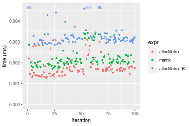
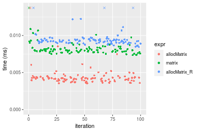
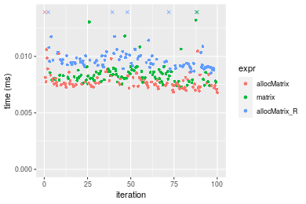

[matrixStats]: Benchmark report

---------------------------------------


# allocMatrix() benchmarks

This report benchmark the performance of allocMatrix() against alternative methods.

## Alternative methods

* matrix()
* matrix() special trick for NA

where
```r
> allocMatrix_R <- function(nrow, ncol, value = NA) {
+     if (is.na(value) && !is.nan(value)) {
+         matrix(data = value[c()], nrow = nrow, ncol = ncol)
+     }     else {
+         matrix(data = value, nrow = nrow, ncol = ncol)
+     }
+ }
```


## Data type "integer"
### Data
```r
> rmatrix <- function(nrow, ncol, mode = c("logical", "double", "integer", "index"), range = c(-100, 
+     +100), na_prob = 0) {
+     mode <- match.arg(mode)
+     n <- nrow * ncol
+     if (mode == "logical") {
+         x <- sample(c(FALSE, TRUE), size = n, replace = TRUE)
+     }     else if (mode == "index") {
+         x <- seq_len(n)
+         mode <- "integer"
+     }     else {
+         x <- runif(n, min = range[1], max = range[2])
+     }
+     storage.mode(x) <- mode
+     if (na_prob > 0) 
+         x[sample(n, size = na_prob * n)] <- NA
+     dim(x) <- c(nrow, ncol)
+     x
+ }
> rmatrices <- function(scale = 10, seed = 1, ...) {
+     set.seed(seed)
+     data <- list()
+     data[[1]] <- rmatrix(nrow = scale * 1, ncol = scale * 1, ...)
+     data[[2]] <- rmatrix(nrow = scale * 10, ncol = scale * 10, ...)
+     data[[3]] <- rmatrix(nrow = scale * 100, ncol = scale * 1, ...)
+     data[[4]] <- t(data[[3]])
+     data[[5]] <- rmatrix(nrow = scale * 10, ncol = scale * 100, ...)
+     data[[6]] <- t(data[[5]])
+     names(data) <- sapply(data, FUN = function(x) paste(dim(x), collapse = "x"))
+     data
+ }
> data <- rmatrices(mode = mode)
> values <- list(zero = 0, one = 1, `NA` = NA_real_)
> if (mode != "double") 
+     values <- lapply(values, FUN = function(x) {
+         storage.mode(x) <- mode
+         x
+     })
```

### Results

### 10x10 matrix


```r
> dim <- dim(data[["10x10"]])
> nrow <- dim[1L]
> ncol <- dim[2L]
> str(value)
 int 0
```

```r
> stats <- microbenchmark(allocMatrix = allocMatrix(nrow = nrow, ncol = ncol, value = value), matrix = matrix(data = value, 
+     nrow = nrow, ncol = ncol), allocMatrix_R = allocMatrix_R(nrow = nrow, ncol = ncol, value = value), 
+     unit = "ms")
```

_Table: Benchmarking of allocMatrix(), matrix() and allocMatrix_R() on integer+10x10+0 data. The top panel shows times in milliseconds and the bottom panel shows relative times._


|   |expr          |      min|        lq|      mean|    median|        uq|      max|
|:--|:-------------|--------:|---------:|---------:|---------:|---------:|--------:|
|1  |allocMatrix   | 0.001448| 0.0016640| 0.0025898| 0.0017960| 0.0019500| 0.077360|
|2  |matrix        | 0.002029| 0.0023095| 0.0024605| 0.0023985| 0.0025870| 0.004218|
|3  |allocMatrix_R | 0.003200| 0.0034510| 0.0038613| 0.0035695| 0.0036845| 0.029245|


|   |expr          |      min|       lq|      mean|   median|       uq|       max|
|:--|:-------------|--------:|--------:|---------:|--------:|--------:|---------:|
|1  |allocMatrix   | 1.000000| 1.000000| 1.0000000| 1.000000| 1.000000| 1.0000000|
|2  |matrix        | 1.401243| 1.387921| 0.9500471| 1.335468| 1.326667| 0.0545243|
|3  |allocMatrix_R | 2.209945| 2.073918| 1.4909492| 1.987472| 1.889487| 0.3780377|

_Figure: Benchmarking of allocMatrix(), matrix() and allocMatrix_R() on integer+10x10+0 data.  Outliers are displayed as crosses.  Times are in milliseconds._


```r
> dim <- dim(data[["10x10"]])
> nrow <- dim[1L]
> ncol <- dim[2L]
> str(value)
 int 1
```

```r
> stats <- microbenchmark(allocMatrix = allocMatrix(nrow = nrow, ncol = ncol, value = value), matrix = matrix(data = value, 
+     nrow = nrow, ncol = ncol), allocMatrix_R = allocMatrix_R(nrow = nrow, ncol = ncol, value = value), 
+     unit = "ms")
```

_Table: Benchmarking of allocMatrix(), matrix() and allocMatrix_R() on integer+10x10+1 data. The top panel shows times in milliseconds and the bottom panel shows relative times._


|   |expr          |      min|        lq|      mean|    median|        uq|      max|
|:--|:-------------|--------:|---------:|---------:|---------:|---------:|--------:|
|1  |allocMatrix   | 0.001274| 0.0014780| 0.0018879| 0.0016845| 0.0018500| 0.009461|
|2  |matrix        | 0.001716| 0.0019715| 0.0021898| 0.0020535| 0.0022090| 0.003557|
|3  |allocMatrix_R | 0.002850| 0.0030580| 0.0037334| 0.0031730| 0.0033425| 0.035492|


|   |expr          |      min|       lq|     mean|   median|       uq|       max|
|:--|:-------------|--------:|--------:|--------:|--------:|--------:|---------:|
|1  |allocMatrix   | 1.000000| 1.000000| 1.000000| 1.000000| 1.000000| 1.0000000|
|2  |matrix        | 1.346939| 1.333897| 1.159878| 1.219056| 1.194054| 0.3759645|
|3  |allocMatrix_R | 2.237049| 2.069012| 1.977489| 1.883645| 1.806757| 3.7514005|

_Figure: Benchmarking of allocMatrix(), matrix() and allocMatrix_R() on integer+10x10+1 data.  Outliers are displayed as crosses.  Times are in milliseconds._




```r
> dim <- dim(data[["10x10"]])
> nrow <- dim[1L]
> ncol <- dim[2L]
> str(value)
 int NA
```

```r
> stats <- microbenchmark(allocMatrix = allocMatrix(nrow = nrow, ncol = ncol, value = value), matrix = matrix(data = value, 
+     nrow = nrow, ncol = ncol), allocMatrix_R = allocMatrix_R(nrow = nrow, ncol = ncol, value = value), 
+     unit = "ms")
```

_Table: Benchmarking of allocMatrix(), matrix() and allocMatrix_R() on integer+10x10+NA data. The top panel shows times in milliseconds and the bottom panel shows relative times._


|   |expr          |      min|       lq|      mean|    median|        uq|      max|
|:--|:-------------|--------:|--------:|---------:|---------:|---------:|--------:|
|1  |allocMatrix   | 0.001298| 0.001530| 0.0019437| 0.0016660| 0.0017975| 0.024871|
|2  |matrix        | 0.001742| 0.001938| 0.0021533| 0.0020895| 0.0022535| 0.004293|
|3  |allocMatrix_R | 0.003435| 0.003639| 0.0040764| 0.0037755| 0.0039200| 0.026303|


|   |expr          |      min|       lq|     mean|   median|       uq|       max|
|:--|:-------------|--------:|--------:|--------:|--------:|--------:|---------:|
|1  |allocMatrix   | 1.000000| 1.000000| 1.000000| 1.000000| 1.000000| 1.0000000|
|2  |matrix        | 1.342065| 1.266667| 1.107868| 1.254202| 1.253686| 0.1726107|
|3  |allocMatrix_R | 2.646379| 2.378431| 2.097254| 2.266207| 2.180807| 1.0575771|

_Figure: Benchmarking of allocMatrix(), matrix() and allocMatrix_R() on integer+10x10+NA data.  Outliers are displayed as crosses.  Times are in milliseconds._


### 100x100 matrix


```r
> dim <- dim(data[["100x100"]])
> nrow <- dim[1L]
> ncol <- dim[2L]
> str(value)
 int 0
```

```r
> stats <- microbenchmark(allocMatrix = allocMatrix(nrow = nrow, ncol = ncol, value = value), matrix = matrix(data = value, 
+     nrow = nrow, ncol = ncol), allocMatrix_R = allocMatrix_R(nrow = nrow, ncol = ncol, value = value), 
+     unit = "ms")
```

_Table: Benchmarking of allocMatrix(), matrix() and allocMatrix_R() on integer+100x100+0 data. The top panel shows times in milliseconds and the bottom panel shows relative times._


|   |expr          |      min|       lq|      mean|    median|       uq|      max|
|:--|:-------------|--------:|--------:|---------:|---------:|--------:|--------:|
|1  |allocMatrix   | 0.003411| 0.003887| 0.0043562| 0.0040845| 0.004372| 0.011978|
|2  |matrix        | 0.007401| 0.007811| 0.0081727| 0.0080165| 0.008244| 0.011254|
|3  |allocMatrix_R | 0.008616| 0.009111| 0.0099560| 0.0093295| 0.009587| 0.028301|


|   |expr          |      min|       lq|     mean|   median|       uq|       max|
|:--|:-------------|--------:|--------:|--------:|--------:|--------:|---------:|
|1  |allocMatrix   | 1.000000| 1.000000| 1.000000| 1.000000| 1.000000| 1.0000000|
|2  |matrix        | 2.169745| 2.009519| 1.876098| 1.962664| 1.885636| 0.9395559|
|3  |allocMatrix_R | 2.525946| 2.343967| 2.285480| 2.284123| 2.192818| 2.3627484|

_Figure: Benchmarking of allocMatrix(), matrix() and allocMatrix_R() on integer+100x100+0 data.  Outliers are displayed as crosses.  Times are in milliseconds._


```r
> dim <- dim(data[["100x100"]])
> nrow <- dim[1L]
> ncol <- dim[2L]
> str(value)
 int 1
```

```r
> stats <- microbenchmark(allocMatrix = allocMatrix(nrow = nrow, ncol = ncol, value = value), matrix = matrix(data = value, 
+     nrow = nrow, ncol = ncol), allocMatrix_R = allocMatrix_R(nrow = nrow, ncol = ncol, value = value), 
+     unit = "ms")
```

_Table: Benchmarking of allocMatrix(), matrix() and allocMatrix_R() on integer+100x100+1 data. The top panel shows times in milliseconds and the bottom panel shows relative times._


|   |expr          |      min|        lq|      mean|    median|        uq|      max|
|:--|:-------------|--------:|---------:|---------:|---------:|---------:|--------:|
|1  |allocMatrix   | 0.006351| 0.0065825| 0.0069510| 0.0067895| 0.0069815| 0.015715|
|2  |matrix        | 0.006848| 0.0070225| 0.0076476| 0.0072860| 0.0075340| 0.030767|
|3  |allocMatrix_R | 0.008052| 0.0083305| 0.0087980| 0.0085105| 0.0087440| 0.016906|


|   |expr          |      min|       lq|     mean|   median|       uq|      max|
|:--|:-------------|--------:|--------:|--------:|--------:|--------:|--------:|
|1  |allocMatrix   | 1.000000| 1.000000| 1.000000| 1.000000| 1.000000| 1.000000|
|2  |matrix        | 1.078255| 1.066844| 1.100216| 1.073128| 1.079138| 1.957811|
|3  |allocMatrix_R | 1.267832| 1.265553| 1.265719| 1.253480| 1.252453| 1.075787|

_Figure: Benchmarking of allocMatrix(), matrix() and allocMatrix_R() on integer+100x100+1 data.  Outliers are displayed as crosses.  Times are in milliseconds._


```r
> dim <- dim(data[["100x100"]])
> nrow <- dim[1L]
> ncol <- dim[2L]
> str(value)
 int NA
```

```r
> stats <- microbenchmark(allocMatrix = allocMatrix(nrow = nrow, ncol = ncol, value = value), matrix = matrix(data = value, 
+     nrow = nrow, ncol = ncol), allocMatrix_R = allocMatrix_R(nrow = nrow, ncol = ncol, value = value), 
+     unit = "ms")
```

_Table: Benchmarking of allocMatrix(), matrix() and allocMatrix_R() on integer+100x100+NA data. The top panel shows times in milliseconds and the bottom panel shows relative times._


|   |expr          |      min|        lq|      mean|   median|        uq|      max|
|:--|:-------------|--------:|---------:|---------:|--------:|---------:|--------:|
|1  |allocMatrix   | 0.006841| 0.0074550| 0.0079802| 0.007700| 0.0080590| 0.015584|
|2  |matrix        | 0.007474| 0.0080180| 0.0085109| 0.008256| 0.0085495| 0.020083|
|3  |allocMatrix_R | 0.012765| 0.0131685| 0.0141097| 0.013508| 0.0138895| 0.049166|


|   |expr          |      min|       lq|     mean|   median|       uq|      max|
|:--|:-------------|--------:|--------:|--------:|--------:|--------:|--------:|
|1  |allocMatrix   | 1.000000| 1.000000| 1.000000| 1.000000| 1.000000| 1.000000|
|2  |matrix        | 1.092530| 1.075520| 1.066498| 1.072208| 1.060864| 1.288693|
|3  |allocMatrix_R | 1.865955| 1.766398| 1.768081| 1.754286| 1.723477| 3.154902|

_Figure: Benchmarking of allocMatrix(), matrix() and allocMatrix_R() on integer+100x100+NA data.  Outliers are displayed as crosses.  Times are in milliseconds._


### 1000x10 matrix


```r
> dim <- dim(data[["1000x10"]])
> nrow <- dim[1L]
> ncol <- dim[2L]
> str(value)
 int 0
```

```r
> stats <- microbenchmark(allocMatrix = allocMatrix(nrow = nrow, ncol = ncol, value = value), matrix = matrix(data = value, 
+     nrow = nrow, ncol = ncol), allocMatrix_R = allocMatrix_R(nrow = nrow, ncol = ncol, value = value), 
+     unit = "ms")
```

_Table: Benchmarking of allocMatrix(), matrix() and allocMatrix_R() on integer+1000x10+0 data. The top panel shows times in milliseconds and the bottom panel shows relative times._


|   |expr          |      min|        lq|      mean|    median|        uq|      max|
|:--|:-------------|--------:|---------:|---------:|---------:|---------:|--------:|
|1  |allocMatrix   | 0.003550| 0.0039295| 0.0044064| 0.0041925| 0.0043985| 0.014954|
|2  |matrix        | 0.007361| 0.0078105| 0.0083108| 0.0080100| 0.0083135| 0.021450|
|3  |allocMatrix_R | 0.008458| 0.0090340| 0.0097641| 0.0092800| 0.0094715| 0.041340|


|   |expr          |      min|       lq|     mean|   median|       uq|      max|
|:--|:-------------|--------:|--------:|--------:|--------:|--------:|--------:|
|1  |allocMatrix   | 1.000000| 1.000000| 1.000000| 1.000000| 1.000000| 1.000000|
|2  |matrix        | 2.073521| 1.987658| 1.886078| 1.910555| 1.890076| 1.434399|
|3  |allocMatrix_R | 2.382535| 2.299020| 2.215883| 2.213476| 2.153348| 2.764478|

_Figure: Benchmarking of allocMatrix(), matrix() and allocMatrix_R() on integer+1000x10+0 data.  Outliers are displayed as crosses.  Times are in milliseconds._




```r
> dim <- dim(data[["1000x10"]])
> nrow <- dim[1L]
> ncol <- dim[2L]
> str(value)
 int 1
```

```r
> stats <- microbenchmark(allocMatrix = allocMatrix(nrow = nrow, ncol = ncol, value = value), matrix = matrix(data = value, 
+     nrow = nrow, ncol = ncol), allocMatrix_R = allocMatrix_R(nrow = nrow, ncol = ncol, value = value), 
+     unit = "ms")
```

_Table: Benchmarking of allocMatrix(), matrix() and allocMatrix_R() on integer+1000x10+1 data. The top panel shows times in milliseconds and the bottom panel shows relative times._


|   |expr          |      min|       lq|      mean|   median|        uq|      max|
|:--|:-------------|--------:|--------:|---------:|--------:|---------:|--------:|
|1  |allocMatrix   | 0.006907| 0.007534| 0.0080022| 0.007772| 0.0080485| 0.020347|
|2  |matrix        | 0.007450| 0.007983| 0.0084510| 0.008233| 0.0085365| 0.015048|
|3  |allocMatrix_R | 0.008656| 0.009398| 0.0100540| 0.009539| 0.0098610| 0.040452|


|   |expr          |      min|       lq|     mean|   median|       uq|       max|
|:--|:-------------|--------:|--------:|--------:|--------:|--------:|---------:|
|1  |allocMatrix   | 1.000000| 1.000000| 1.000000| 1.000000| 1.000000| 1.0000000|
|2  |matrix        | 1.078616| 1.059597| 1.056083| 1.059316| 1.060632| 0.7395685|
|3  |allocMatrix_R | 1.253221| 1.247412| 1.256401| 1.227355| 1.225197| 1.9881064|

_Figure: Benchmarking of allocMatrix(), matrix() and allocMatrix_R() on integer+1000x10+1 data.  Outliers are displayed as crosses.  Times are in milliseconds._


```r
> dim <- dim(data[["1000x10"]])
> nrow <- dim[1L]
> ncol <- dim[2L]
> str(value)
 int NA
```

```r
> stats <- microbenchmark(allocMatrix = allocMatrix(nrow = nrow, ncol = ncol, value = value), matrix = matrix(data = value, 
+     nrow = nrow, ncol = ncol), allocMatrix_R = allocMatrix_R(nrow = nrow, ncol = ncol, value = value), 
+     unit = "ms")
```

_Table: Benchmarking of allocMatrix(), matrix() and allocMatrix_R() on integer+1000x10+NA data. The top panel shows times in milliseconds and the bottom panel shows relative times._


|   |expr          |      min|       lq|      mean|    median|        uq|      max|
|:--|:-------------|--------:|--------:|---------:|---------:|---------:|--------:|
|1  |allocMatrix   | 0.006890| 0.007271| 0.0081656| 0.0076480| 0.0080525| 0.038914|
|2  |matrix        | 0.007431| 0.007795| 0.0085203| 0.0080530| 0.0084235| 0.030412|
|3  |allocMatrix_R | 0.012760| 0.013192| 0.0139413| 0.0134745| 0.0137235| 0.026540|


|   |expr          |      min|       lq|     mean|   median|       uq|       max|
|:--|:-------------|--------:|--------:|--------:|--------:|--------:|---------:|
|1  |allocMatrix   | 1.000000| 1.000000| 1.000000| 1.000000| 1.000000| 1.0000000|
|2  |matrix        | 1.078520| 1.072067| 1.043441| 1.052955| 1.046073| 0.7815182|
|3  |allocMatrix_R | 1.851959| 1.814331| 1.707317| 1.761833| 1.704253| 0.6820168|

_Figure: Benchmarking of allocMatrix(), matrix() and allocMatrix_R() on integer+1000x10+NA data.  Outliers are displayed as crosses.  Times are in milliseconds._


### 10x1000 matrix


```r
> dim <- dim(data[["10x1000"]])
> nrow <- dim[1L]
> ncol <- dim[2L]
> str(value)
 int 0
```

```r
> stats <- microbenchmark(allocMatrix = allocMatrix(nrow = nrow, ncol = ncol, value = value), matrix = matrix(data = value, 
+     nrow = nrow, ncol = ncol), allocMatrix_R = allocMatrix_R(nrow = nrow, ncol = ncol, value = value), 
+     unit = "ms")
```

_Table: Benchmarking of allocMatrix(), matrix() and allocMatrix_R() on integer+10x1000+0 data. The top panel shows times in milliseconds and the bottom panel shows relative times._


|   |expr          |      min|        lq|      mean|    median|        uq|      max|
|:--|:-------------|--------:|---------:|---------:|---------:|---------:|--------:|
|1  |allocMatrix   | 0.003302| 0.0039805| 0.0053976| 0.0050515| 0.0060185| 0.019499|
|2  |matrix        | 0.007109| 0.0080415| 0.0116265| 0.0096015| 0.0154585| 0.031072|
|3  |allocMatrix_R | 0.008372| 0.0091940| 0.0133690| 0.0110080| 0.0172700| 0.021906|


|   |expr          |      min|       lq|     mean|   median|       uq|      max|
|:--|:-------------|--------:|--------:|--------:|--------:|--------:|--------:|
|1  |allocMatrix   | 1.000000| 1.000000| 1.000000| 1.000000| 1.000000| 1.000000|
|2  |matrix        | 2.152938| 2.020224| 2.154031| 1.900723| 2.568497| 1.593518|
|3  |allocMatrix_R | 2.535433| 2.309760| 2.476857| 2.179155| 2.869486| 1.123442|

_Figure: Benchmarking of allocMatrix(), matrix() and allocMatrix_R() on integer+10x1000+0 data.  Outliers are displayed as crosses.  Times are in milliseconds._


```r
> dim <- dim(data[["10x1000"]])
> nrow <- dim[1L]
> ncol <- dim[2L]
> str(value)
 int 1
```

```r
> stats <- microbenchmark(allocMatrix = allocMatrix(nrow = nrow, ncol = ncol, value = value), matrix = matrix(data = value, 
+     nrow = nrow, ncol = ncol), allocMatrix_R = allocMatrix_R(nrow = nrow, ncol = ncol, value = value), 
+     unit = "ms")
```

_Table: Benchmarking of allocMatrix(), matrix() and allocMatrix_R() on integer+10x1000+1 data. The top panel shows times in milliseconds and the bottom panel shows relative times._


|   |expr          |      min|        lq|      mean|    median|        uq|      max|
|:--|:-------------|--------:|---------:|---------:|---------:|---------:|--------:|
|1  |allocMatrix   | 0.006815| 0.0073705| 0.0079227| 0.0076085| 0.0080265| 0.021806|
|2  |matrix        | 0.007297| 0.0079135| 0.0084572| 0.0081910| 0.0086340| 0.014578|
|3  |allocMatrix_R | 0.008513| 0.0091230| 0.0102696| 0.0094655| 0.0100450| 0.040763|


|   |expr          |      min|       lq|     mean|   median|       uq|       max|
|:--|:-------------|--------:|--------:|--------:|--------:|--------:|---------:|
|1  |allocMatrix   | 1.000000| 1.000000| 1.000000| 1.000000| 1.000000| 1.0000000|
|2  |matrix        | 1.070726| 1.073672| 1.067470| 1.076559| 1.075687| 0.6685316|
|3  |allocMatrix_R | 1.249156| 1.237772| 1.296223| 1.244069| 1.251480| 1.8693479|

_Figure: Benchmarking of allocMatrix(), matrix() and allocMatrix_R() on integer+10x1000+1 data.  Outliers are displayed as crosses.  Times are in milliseconds._




```r
> dim <- dim(data[["10x1000"]])
> nrow <- dim[1L]
> ncol <- dim[2L]
> str(value)
 int NA
```

```r
> stats <- microbenchmark(allocMatrix = allocMatrix(nrow = nrow, ncol = ncol, value = value), matrix = matrix(data = value, 
+     nrow = nrow, ncol = ncol), allocMatrix_R = allocMatrix_R(nrow = nrow, ncol = ncol, value = value), 
+     unit = "ms")
```

_Table: Benchmarking of allocMatrix(), matrix() and allocMatrix_R() on integer+10x1000+NA data. The top panel shows times in milliseconds and the bottom panel shows relative times._


|   |expr          |      min|        lq|      mean|    median|       uq|      max|
|:--|:-------------|--------:|---------:|---------:|---------:|--------:|--------:|
|1  |allocMatrix   | 0.006431| 0.0070585| 0.0076706| 0.0075010| 0.007912| 0.014560|
|2  |matrix        | 0.007081| 0.0076155| 0.0081192| 0.0080455| 0.008306| 0.015418|
|3  |allocMatrix_R | 0.012309| 0.0128055| 0.0139109| 0.0131620| 0.013540| 0.043787|


|   |expr          |      min|       lq|     mean|   median|       uq|      max|
|:--|:-------------|--------:|--------:|--------:|--------:|--------:|--------:|
|1  |allocMatrix   | 1.000000| 1.000000| 1.000000| 1.000000| 1.000000| 1.000000|
|2  |matrix        | 1.101073| 1.078912| 1.058476| 1.072590| 1.049798| 1.058929|
|3  |allocMatrix_R | 1.914010| 1.814196| 1.813535| 1.754699| 1.711325| 3.007349|

_Figure: Benchmarking of allocMatrix(), matrix() and allocMatrix_R() on integer+10x1000+NA data.  Outliers are displayed as crosses.  Times are in milliseconds._


### 100x1000 matrix


```r
> dim <- dim(data[["100x1000"]])
> nrow <- dim[1L]
> ncol <- dim[2L]
> str(value)
 int 0
```

```r
> stats <- microbenchmark(allocMatrix = allocMatrix(nrow = nrow, ncol = ncol, value = value), matrix = matrix(data = value, 
+     nrow = nrow, ncol = ncol), allocMatrix_R = allocMatrix_R(nrow = nrow, ncol = ncol, value = value), 
+     unit = "ms")
```

_Table: Benchmarking of allocMatrix(), matrix() and allocMatrix_R() on integer+100x1000+0 data. The top panel shows times in milliseconds and the bottom panel shows relative times._


|   |expr          |      min|        lq|      mean|   median|        uq|      max|
|:--|:-------------|--------:|---------:|---------:|--------:|---------:|--------:|
|1  |allocMatrix   | 0.018195| 0.0222325| 0.1385829| 0.025421| 0.1747350| 5.191896|
|3  |allocMatrix_R | 0.047737| 0.0605130| 0.1852318| 0.172733| 0.1997235| 5.016253|
|2  |matrix        | 0.046857| 0.0585660| 0.1444706| 0.175918| 0.1967650| 0.303404|


|   |expr          |      min|       lq|     mean|   median|       uq|       max|
|:--|:-------------|--------:|--------:|--------:|--------:|--------:|---------:|
|1  |allocMatrix   | 1.000000| 1.000000| 1.000000| 1.000000| 1.000000| 1.0000000|
|3  |allocMatrix_R | 2.623633| 2.721826| 1.336614| 6.794894| 1.143008| 0.9661698|
|2  |matrix        | 2.575268| 2.634252| 1.042485| 6.920184| 1.126077| 0.0584380|

_Figure: Benchmarking of allocMatrix(), matrix() and allocMatrix_R() on integer+100x1000+0 data.  Outliers are displayed as crosses.  Times are in milliseconds._


```r
> dim <- dim(data[["100x1000"]])
> nrow <- dim[1L]
> ncol <- dim[2L]
> str(value)
 int 1
```

```r
> stats <- microbenchmark(allocMatrix = allocMatrix(nrow = nrow, ncol = ncol, value = value), matrix = matrix(data = value, 
+     nrow = nrow, ncol = ncol), allocMatrix_R = allocMatrix_R(nrow = nrow, ncol = ncol, value = value), 
+     unit = "ms")
```

_Table: Benchmarking of allocMatrix(), matrix() and allocMatrix_R() on integer+100x1000+1 data. The top panel shows times in milliseconds and the bottom panel shows relative times._


|   |expr          |      min|        lq|      mean|    median|        uq|      max|
|:--|:-------------|--------:|---------:|---------:|---------:|---------:|--------:|
|2  |matrix        | 0.046820| 0.0525615| 0.1613850| 0.0589165| 0.1805510| 4.812541|
|1  |allocMatrix   | 0.046546| 0.0516115| 0.1224808| 0.1712130| 0.1834835| 0.228610|
|3  |allocMatrix_R | 0.047823| 0.0530625| 0.1829958| 0.1765270| 0.1889490| 5.592455|


|   |expr          |       min|        lq|     mean|   median|       uq|      max|
|:--|:-------------|---------:|---------:|--------:|--------:|--------:|--------:|
|2  |matrix        | 1.0000000| 1.0000000| 1.000000| 1.000000| 1.000000| 1.000000|
|1  |allocMatrix   | 0.9941478| 0.9819259| 0.758935| 2.906028| 1.016242| 0.047503|
|3  |allocMatrix_R | 1.0214225| 1.0095317| 1.133908| 2.996224| 1.046513| 1.162059|

_Figure: Benchmarking of allocMatrix(), matrix() and allocMatrix_R() on integer+100x1000+1 data.  Outliers are displayed as crosses.  Times are in milliseconds._


```r
> dim <- dim(data[["100x1000"]])
> nrow <- dim[1L]
> ncol <- dim[2L]
> str(value)
 int NA
```

```r
> stats <- microbenchmark(allocMatrix = allocMatrix(nrow = nrow, ncol = ncol, value = value), matrix = matrix(data = value, 
+     nrow = nrow, ncol = ncol), allocMatrix_R = allocMatrix_R(nrow = nrow, ncol = ncol, value = value), 
+     unit = "ms")
```

_Table: Benchmarking of allocMatrix(), matrix() and allocMatrix_R() on integer+100x1000+NA data. The top panel shows times in milliseconds and the bottom panel shows relative times._


|   |expr          |      min|        lq|      mean|    median|        uq|      max|
|:--|:-------------|--------:|---------:|---------:|---------:|---------:|--------:|
|1  |allocMatrix   | 0.046322| 0.0520500| 0.1189115| 0.1661990| 0.1785575| 0.213776|
|2  |matrix        | 0.046489| 0.0519965| 0.1706100| 0.1684770| 0.1786830| 5.419817|
|3  |allocMatrix_R | 0.075182| 0.0797355| 0.2062054| 0.2022095| 0.2136685| 5.434947|


|   |expr          |      min|        lq|     mean|   median|       uq|      max|
|:--|:-------------|--------:|---------:|--------:|--------:|--------:|--------:|
|1  |allocMatrix   | 1.000000| 1.0000000| 1.000000| 1.000000| 1.000000|  1.00000|
|2  |matrix        | 1.003605| 0.9989721| 1.434764| 1.013707| 1.000703| 25.35279|
|3  |allocMatrix_R | 1.623030| 1.5319020| 1.734109| 1.216671| 1.196637| 25.42356|

_Figure: Benchmarking of allocMatrix(), matrix() and allocMatrix_R() on integer+100x1000+NA data.  Outliers are displayed as crosses.  Times are in milliseconds._


### 1000x100 matrix


```r
> dim <- dim(data[["1000x100"]])
> nrow <- dim[1L]
> ncol <- dim[2L]
> str(value)
 int 0
```

```r
> stats <- microbenchmark(allocMatrix = allocMatrix(nrow = nrow, ncol = ncol, value = value), matrix = matrix(data = value, 
+     nrow = nrow, ncol = ncol), allocMatrix_R = allocMatrix_R(nrow = nrow, ncol = ncol, value = value), 
+     unit = "ms")
```

_Table: Benchmarking of allocMatrix(), matrix() and allocMatrix_R() on integer+1000x100+0 data. The top panel shows times in milliseconds and the bottom panel shows relative times._


|   |expr          |      min|        lq|      mean|    median|        uq|      max|
|:--|:-------------|--------:|---------:|---------:|---------:|---------:|--------:|
|2  |matrix        | 0.047961| 0.0518165| 0.1209312| 0.0759905| 0.1853220| 0.266259|
|3  |allocMatrix_R | 0.048024| 0.0522910| 0.2121506| 0.1407865| 0.1841975| 9.042372|
|1  |allocMatrix   | 0.018524| 0.0225095| 0.1661506| 0.1659215| 0.1806420| 5.593055|


|   |expr          |       min|       lq|     mean|   median|        uq|      max|
|:--|:-------------|---------:|--------:|--------:|--------:|---------:|--------:|
|2  |matrix        | 1.0000000| 1.000000| 1.000000| 1.000000| 1.0000000|  1.00000|
|3  |allocMatrix_R | 1.0013136| 1.009157| 1.754308| 1.852685| 0.9939322| 33.96081|
|1  |allocMatrix   | 0.3862305| 0.434408| 1.373926| 2.183451| 0.9747467| 21.00607|

_Figure: Benchmarking of allocMatrix(), matrix() and allocMatrix_R() on integer+1000x100+0 data.  Outliers are displayed as crosses.  Times are in milliseconds._


```r
> dim <- dim(data[["1000x100"]])
> nrow <- dim[1L]
> ncol <- dim[2L]
> str(value)
 int 1
```

```r
> stats <- microbenchmark(allocMatrix = allocMatrix(nrow = nrow, ncol = ncol, value = value), matrix = matrix(data = value, 
+     nrow = nrow, ncol = ncol), allocMatrix_R = allocMatrix_R(nrow = nrow, ncol = ncol, value = value), 
+     unit = "ms")
```

_Table: Benchmarking of allocMatrix(), matrix() and allocMatrix_R() on integer+1000x100+1 data. The top panel shows times in milliseconds and the bottom panel shows relative times._


|   |expr          |      min|        lq|      mean|   median|       uq|      max|
|:--|:-------------|--------:|---------:|---------:|--------:|--------:|--------:|
|3  |allocMatrix_R | 0.046637| 0.0500700| 0.1084039| 0.063562| 0.181088| 0.224056|
|1  |allocMatrix   | 0.045115| 0.0522435| 0.1226139| 0.166599| 0.181704| 0.222297|
|2  |matrix        | 0.045653| 0.0529400| 0.2307557| 0.173530| 0.183156| 5.445768|


|   |expr          |       min|       lq|     mean|   median|       uq|        max|
|:--|:-------------|---------:|--------:|--------:|--------:|--------:|----------:|
|3  |allocMatrix_R | 1.0000000| 1.000000| 1.000000| 1.000000| 1.000000|  1.0000000|
|1  |allocMatrix   | 0.9673650| 1.043409| 1.131085| 2.621047| 1.003402|  0.9921493|
|2  |matrix        | 0.9789009| 1.057320| 2.128667| 2.730090| 1.011420| 24.3053879|

_Figure: Benchmarking of allocMatrix(), matrix() and allocMatrix_R() on integer+1000x100+1 data.  Outliers are displayed as crosses.  Times are in milliseconds._


```r
> dim <- dim(data[["1000x100"]])
> nrow <- dim[1L]
> ncol <- dim[2L]
> str(value)
 int NA
```

```r
> stats <- microbenchmark(allocMatrix = allocMatrix(nrow = nrow, ncol = ncol, value = value), matrix = matrix(data = value, 
+     nrow = nrow, ncol = ncol), allocMatrix_R = allocMatrix_R(nrow = nrow, ncol = ncol, value = value), 
+     unit = "ms")
```

_Table: Benchmarking of allocMatrix(), matrix() and allocMatrix_R() on integer+1000x100+NA data. The top panel shows times in milliseconds and the bottom panel shows relative times._


|   |expr          |      min|        lq|      mean|    median|       uq|      max|
|:--|:-------------|--------:|---------:|---------:|---------:|--------:|--------:|
|3  |allocMatrix_R | 0.077507| 0.0871955| 0.2106748| 0.1108355| 0.235091| 5.016970|
|1  |allocMatrix   | 0.046450| 0.0524495| 0.1876490| 0.1368740| 0.195029| 5.982023|
|2  |matrix        | 0.047139| 0.0533020| 0.1418738| 0.1731355| 0.198120| 0.364736|


|   |expr          |       min|        lq|      mean|   median|        uq|       max|
|:--|:-------------|---------:|---------:|---------:|--------:|---------:|---------:|
|3  |allocMatrix_R | 1.0000000| 1.0000000| 1.0000000| 1.000000| 1.0000000| 1.0000000|
|1  |allocMatrix   | 0.5993007| 0.6015161| 0.8907043| 1.234929| 0.8295894| 1.1923577|
|2  |matrix        | 0.6081902| 0.6112930| 0.6734254| 1.562094| 0.8427375| 0.0727005|

_Figure: Benchmarking of allocMatrix(), matrix() and allocMatrix_R() on integer+1000x100+NA data.  Outliers are displayed as crosses.  Times are in milliseconds._


## Data type "double"
### Data
```r
> rmatrix <- function(nrow, ncol, mode = c("logical", "double", "integer", "index"), range = c(-100, 
+     +100), na_prob = 0) {
+     mode <- match.arg(mode)
+     n <- nrow * ncol
+     if (mode == "logical") {
+         x <- sample(c(FALSE, TRUE), size = n, replace = TRUE)
+     }     else if (mode == "index") {
+         x <- seq_len(n)
+         mode <- "integer"
+     }     else {
+         x <- runif(n, min = range[1], max = range[2])
+     }
+     storage.mode(x) <- mode
+     if (na_prob > 0) 
+         x[sample(n, size = na_prob * n)] <- NA
+     dim(x) <- c(nrow, ncol)
+     x
+ }
> rmatrices <- function(scale = 10, seed = 1, ...) {
+     set.seed(seed)
+     data <- list()
+     data[[1]] <- rmatrix(nrow = scale * 1, ncol = scale * 1, ...)
+     data[[2]] <- rmatrix(nrow = scale * 10, ncol = scale * 10, ...)
+     data[[3]] <- rmatrix(nrow = scale * 100, ncol = scale * 1, ...)
+     data[[4]] <- t(data[[3]])
+     data[[5]] <- rmatrix(nrow = scale * 10, ncol = scale * 100, ...)
+     data[[6]] <- t(data[[5]])
+     names(data) <- sapply(data, FUN = function(x) paste(dim(x), collapse = "x"))
+     data
+ }
> data <- rmatrices(mode = mode)
> values <- list(zero = 0, one = 1, `NA` = NA_real_)
> if (mode != "double") 
+     values <- lapply(values, FUN = function(x) {
+         storage.mode(x) <- mode
+         x
+     })
```

### Results

### 10x10 matrix


```r
> dim <- dim(data[["10x10"]])
> nrow <- dim[1L]
> ncol <- dim[2L]
> str(value)
 num 0
```

```r
> stats <- microbenchmark(allocMatrix = allocMatrix(nrow = nrow, ncol = ncol, value = value), matrix = matrix(data = value, 
+     nrow = nrow, ncol = ncol), allocMatrix_R = allocMatrix_R(nrow = nrow, ncol = ncol, value = value), 
+     unit = "ms")
```

_Table: Benchmarking of allocMatrix(), matrix() and allocMatrix_R() on double+10x10+0 data. The top panel shows times in milliseconds and the bottom panel shows relative times._


|   |expr          |      min|        lq|      mean|    median|        uq|      max|
|:--|:-------------|--------:|---------:|---------:|---------:|---------:|--------:|
|1  |allocMatrix   | 0.001585| 0.0018840| 0.0030424| 0.0020560| 0.0029215| 0.036657|
|2  |matrix        | 0.002284| 0.0024715| 0.0031829| 0.0026560| 0.0036360| 0.005946|
|3  |allocMatrix_R | 0.003437| 0.0036975| 0.0053181| 0.0039705| 0.0048815| 0.086448|


|   |expr          |      min|       lq|     mean|   median|       uq|       max|
|:--|:-------------|--------:|--------:|--------:|--------:|--------:|---------:|
|1  |allocMatrix   | 1.000000| 1.000000| 1.000000| 1.000000| 1.000000| 1.0000000|
|2  |matrix        | 1.441010| 1.311837| 1.046157| 1.291829| 1.244566| 0.1622064|
|3  |allocMatrix_R | 2.168454| 1.962580| 1.747990| 1.931177| 1.670888| 2.3582945|

_Figure: Benchmarking of allocMatrix(), matrix() and allocMatrix_R() on double+10x10+0 data.  Outliers are displayed as crosses.  Times are in milliseconds._


```r
> dim <- dim(data[["10x10"]])
> nrow <- dim[1L]
> ncol <- dim[2L]
> str(value)
 num 1
```

```r
> stats <- microbenchmark(allocMatrix = allocMatrix(nrow = nrow, ncol = ncol, value = value), matrix = matrix(data = value, 
+     nrow = nrow, ncol = ncol), allocMatrix_R = allocMatrix_R(nrow = nrow, ncol = ncol, value = value), 
+     unit = "ms")
```

_Table: Benchmarking of allocMatrix(), matrix() and allocMatrix_R() on double+10x10+1 data. The top panel shows times in milliseconds and the bottom panel shows relative times._


|   |expr          |      min|        lq|      mean|    median|        uq|      max|
|:--|:-------------|--------:|---------:|---------:|---------:|---------:|--------:|
|1  |allocMatrix   | 0.001513| 0.0017765| 0.0019611| 0.0018610| 0.0019345| 0.010277|
|2  |matrix        | 0.002007| 0.0022915| 0.0023763| 0.0023585| 0.0024380| 0.003266|
|3  |allocMatrix_R | 0.003267| 0.0034805| 0.0039440| 0.0035560| 0.0036835| 0.035712|


|   |expr          |      min|       lq|     mean|   median|       uq|      max|
|:--|:-------------|--------:|--------:|--------:|--------:|--------:|--------:|
|1  |allocMatrix   | 1.000000| 1.000000| 1.000000| 1.000000| 1.000000| 1.000000|
|2  |matrix        | 1.326504| 1.289896| 1.211704| 1.267329| 1.260274| 0.317797|
|3  |allocMatrix_R | 2.159286| 1.959189| 2.011101| 1.910801| 1.904110| 3.474944|

_Figure: Benchmarking of allocMatrix(), matrix() and allocMatrix_R() on double+10x10+1 data.  Outliers are displayed as crosses.  Times are in milliseconds._


```r
> dim <- dim(data[["10x10"]])
> nrow <- dim[1L]
> ncol <- dim[2L]
> str(value)
 num NA
```

```r
> stats <- microbenchmark(allocMatrix = allocMatrix(nrow = nrow, ncol = ncol, value = value), matrix = matrix(data = value, 
+     nrow = nrow, ncol = ncol), allocMatrix_R = allocMatrix_R(nrow = nrow, ncol = ncol, value = value), 
+     unit = "ms")
```

_Table: Benchmarking of allocMatrix(), matrix() and allocMatrix_R() on double+10x10+NA data. The top panel shows times in milliseconds and the bottom panel shows relative times._


|   |expr          |      min|        lq|      mean|    median|        uq|      max|
|:--|:-------------|--------:|---------:|---------:|---------:|---------:|--------:|
|1  |allocMatrix   | 0.001535| 0.0020415| 0.0034746| 0.0029960| 0.0035355| 0.046115|
|2  |matrix        | 0.001912| 0.0029865| 0.0040360| 0.0037705| 0.0042845| 0.024676|
|3  |allocMatrix_R | 0.003554| 0.0061695| 0.0077345| 0.0073445| 0.0083615| 0.035924|


|   |expr          |      min|       lq|     mean|   median|       uq|      max|
|:--|:-------------|--------:|--------:|--------:|--------:|--------:|--------:|
|1  |allocMatrix   | 1.000000| 1.000000| 1.000000| 1.000000| 1.000000| 1.000000|
|2  |matrix        | 1.245603| 1.462895| 1.161570| 1.258511| 1.211851| 0.535097|
|3  |allocMatrix_R | 2.315309| 3.022043| 2.226006| 2.451435| 2.365012| 0.779009|

_Figure: Benchmarking of allocMatrix(), matrix() and allocMatrix_R() on double+10x10+NA data.  Outliers are displayed as crosses.  Times are in milliseconds._


### 100x100 matrix


```r
> dim <- dim(data[["100x100"]])
> nrow <- dim[1L]
> ncol <- dim[2L]
> str(value)
 num 0
```

```r
> stats <- microbenchmark(allocMatrix = allocMatrix(nrow = nrow, ncol = ncol, value = value), matrix = matrix(data = value, 
+     nrow = nrow, ncol = ncol), allocMatrix_R = allocMatrix_R(nrow = nrow, ncol = ncol, value = value), 
+     unit = "ms")
```

_Table: Benchmarking of allocMatrix(), matrix() and allocMatrix_R() on double+100x100+0 data. The top panel shows times in milliseconds and the bottom panel shows relative times._


|   |expr          |      min|        lq|      mean|    median|        uq|      max|
|:--|:-------------|--------:|---------:|---------:|---------:|---------:|--------:|
|1  |allocMatrix   | 0.004949| 0.0055870| 0.0061887| 0.0058835| 0.0062295| 0.017901|
|2  |matrix        | 0.008467| 0.0093770| 0.0110810| 0.0112415| 0.0121420| 0.026045|
|3  |allocMatrix_R | 0.009511| 0.0107405| 0.0130282| 0.0125240| 0.0136460| 0.043152|


|   |expr          |      min|       lq|     mean|   median|       uq|      max|
|:--|:-------------|--------:|--------:|--------:|--------:|--------:|--------:|
|1  |allocMatrix   | 1.000000| 1.000000| 1.000000| 1.000000| 1.000000| 1.000000|
|2  |matrix        | 1.710851| 1.678360| 1.790509| 1.910682| 1.949113| 1.454947|
|3  |allocMatrix_R | 1.921802| 1.922409| 2.105152| 2.128665| 2.190545| 2.410592|

_Figure: Benchmarking of allocMatrix(), matrix() and allocMatrix_R() on double+100x100+0 data.  Outliers are displayed as crosses.  Times are in milliseconds._


```r
> dim <- dim(data[["100x100"]])
> nrow <- dim[1L]
> ncol <- dim[2L]
> str(value)
 num 1
```

```r
> stats <- microbenchmark(allocMatrix = allocMatrix(nrow = nrow, ncol = ncol, value = value), matrix = matrix(data = value, 
+     nrow = nrow, ncol = ncol), allocMatrix_R = allocMatrix_R(nrow = nrow, ncol = ncol, value = value), 
+     unit = "ms")
```

_Table: Benchmarking of allocMatrix(), matrix() and allocMatrix_R() on double+100x100+1 data. The top panel shows times in milliseconds and the bottom panel shows relative times._


|   |expr          |      min|        lq|      mean|    median|        uq|      max|
|:--|:-------------|--------:|---------:|---------:|---------:|---------:|--------:|
|1  |allocMatrix   | 0.007808| 0.0085005| 0.0091886| 0.0088755| 0.0094375| 0.021502|
|2  |matrix        | 0.008458| 0.0090275| 0.0096667| 0.0092375| 0.0096645| 0.033331|
|3  |allocMatrix_R | 0.009341| 0.0102525| 0.0108400| 0.0105795| 0.0109545| 0.024375|


|   |expr          |      min|       lq|     mean|   median|       uq|      max|
|:--|:-------------|--------:|--------:|--------:|--------:|--------:|--------:|
|1  |allocMatrix   | 1.000000| 1.000000| 1.000000| 1.000000| 1.000000| 1.000000|
|2  |matrix        | 1.083248| 1.061996| 1.052028| 1.040786| 1.024053| 1.550135|
|3  |allocMatrix_R | 1.196337| 1.206106| 1.179722| 1.191989| 1.160742| 1.133616|

_Figure: Benchmarking of allocMatrix(), matrix() and allocMatrix_R() on double+100x100+1 data.  Outliers are displayed as crosses.  Times are in milliseconds._


```r
> dim <- dim(data[["100x100"]])
> nrow <- dim[1L]
> ncol <- dim[2L]
> str(value)
 num NA
```

```r
> stats <- microbenchmark(allocMatrix = allocMatrix(nrow = nrow, ncol = ncol, value = value), matrix = matrix(data = value, 
+     nrow = nrow, ncol = ncol), allocMatrix_R = allocMatrix_R(nrow = nrow, ncol = ncol, value = value), 
+     unit = "ms")
```

_Table: Benchmarking of allocMatrix(), matrix() and allocMatrix_R() on double+100x100+NA data. The top panel shows times in milliseconds and the bottom panel shows relative times._


|   |expr          |      min|       lq|      mean|   median|        uq|      max|
|:--|:-------------|--------:|--------:|---------:|--------:|---------:|--------:|
|1  |allocMatrix   | 0.008388| 0.009414| 0.0117857| 0.012381| 0.0133490| 0.020894|
|2  |matrix        | 0.008846| 0.009864| 0.0122597| 0.013193| 0.0139255| 0.019238|
|3  |allocMatrix_R | 0.012482| 0.013430| 0.0155517| 0.015339| 0.0163010| 0.045200|


|   |expr          |      min|       lq|     mean|   median|       uq|       max|
|:--|:-------------|--------:|--------:|--------:|--------:|--------:|---------:|
|1  |allocMatrix   | 1.000000| 1.000000| 1.000000| 1.000000| 1.000000| 1.0000000|
|2  |matrix        | 1.054602| 1.047801| 1.040215| 1.065584| 1.043187| 0.9207428|
|3  |allocMatrix_R | 1.488078| 1.426599| 1.319541| 1.238914| 1.221140| 2.1633005|

_Figure: Benchmarking of allocMatrix(), matrix() and allocMatrix_R() on double+100x100+NA data.  Outliers are displayed as crosses.  Times are in milliseconds._


### 1000x10 matrix


```r
> dim <- dim(data[["1000x10"]])
> nrow <- dim[1L]
> ncol <- dim[2L]
> str(value)
 num 0
```

```r
> stats <- microbenchmark(allocMatrix = allocMatrix(nrow = nrow, ncol = ncol, value = value), matrix = matrix(data = value, 
+     nrow = nrow, ncol = ncol), allocMatrix_R = allocMatrix_R(nrow = nrow, ncol = ncol, value = value), 
+     unit = "ms")
```

_Table: Benchmarking of allocMatrix(), matrix() and allocMatrix_R() on double+1000x10+0 data. The top panel shows times in milliseconds and the bottom panel shows relative times._


|   |expr          |      min|       lq|      mean|    median|        uq|      max|
|:--|:-------------|--------:|--------:|---------:|---------:|---------:|--------:|
|1  |allocMatrix   | 0.005057| 0.005736| 0.0076880| 0.0063770| 0.0082540| 0.044611|
|3  |allocMatrix_R | 0.009650| 0.010955| 0.0145061| 0.0119185| 0.0166140| 0.040787|
|2  |matrix        | 0.008378| 0.009840| 0.0148882| 0.0130940| 0.0182375| 0.058953|


|   |expr          |      min|       lq|     mean|   median|       uq|       max|
|:--|:-------------|--------:|--------:|--------:|--------:|--------:|---------:|
|1  |allocMatrix   | 1.000000| 1.000000| 1.000000| 1.000000| 1.000000| 1.0000000|
|3  |allocMatrix_R | 1.908246| 1.909868| 1.886842| 1.868982| 2.012842| 0.9142812|
|2  |matrix        | 1.656713| 1.715481| 1.936552| 2.053317| 2.209535| 1.3214902|

_Figure: Benchmarking of allocMatrix(), matrix() and allocMatrix_R() on double+1000x10+0 data.  Outliers are displayed as crosses.  Times are in milliseconds._


```r
> dim <- dim(data[["1000x10"]])
> nrow <- dim[1L]
> ncol <- dim[2L]
> str(value)
 num 1
```

```r
> stats <- microbenchmark(allocMatrix = allocMatrix(nrow = nrow, ncol = ncol, value = value), matrix = matrix(data = value, 
+     nrow = nrow, ncol = ncol), allocMatrix_R = allocMatrix_R(nrow = nrow, ncol = ncol, value = value), 
+     unit = "ms")
```

_Table: Benchmarking of allocMatrix(), matrix() and allocMatrix_R() on double+1000x10+1 data. The top panel shows times in milliseconds and the bottom panel shows relative times._


|   |expr          |      min|        lq|      mean|    median|        uq|      max|
|:--|:-------------|--------:|---------:|---------:|---------:|---------:|--------:|
|1  |allocMatrix   | 0.008235| 0.0097530| 0.0116499| 0.0121455| 0.0128385| 0.027389|
|2  |matrix        | 0.008418| 0.0095580| 0.0122272| 0.0127845| 0.0135555| 0.041526|
|3  |allocMatrix_R | 0.009796| 0.0108485| 0.0131687| 0.0139365| 0.0148415| 0.020145|


|   |expr          |      min|        lq|     mean|   median|       uq|       max|
|:--|:-------------|--------:|---------:|--------:|--------:|--------:|---------:|
|1  |allocMatrix   | 1.000000| 1.0000000| 1.000000| 1.000000| 1.000000| 1.0000000|
|2  |matrix        | 1.022222| 0.9800062| 1.049555| 1.052612| 1.055848| 1.5161561|
|3  |allocMatrix_R | 1.189557| 1.1123244| 1.130375| 1.147462| 1.156015| 0.7355143|

_Figure: Benchmarking of allocMatrix(), matrix() and allocMatrix_R() on double+1000x10+1 data.  Outliers are displayed as crosses.  Times are in milliseconds._


```r
> dim <- dim(data[["1000x10"]])
> nrow <- dim[1L]
> ncol <- dim[2L]
> str(value)
 num NA
```

```r
> stats <- microbenchmark(allocMatrix = allocMatrix(nrow = nrow, ncol = ncol, value = value), matrix = matrix(data = value, 
+     nrow = nrow, ncol = ncol), allocMatrix_R = allocMatrix_R(nrow = nrow, ncol = ncol, value = value), 
+     unit = "ms")
```

_Table: Benchmarking of allocMatrix(), matrix() and allocMatrix_R() on double+1000x10+NA data. The top panel shows times in milliseconds and the bottom panel shows relative times._


|   |expr          |      min|        lq|      mean|    median|        uq|      max|
|:--|:-------------|--------:|---------:|---------:|---------:|---------:|--------:|
|1  |allocMatrix   | 0.008582| 0.0095490| 0.0116630| 0.0123205| 0.0130560| 0.019537|
|2  |matrix        | 0.009041| 0.0100005| 0.0125355| 0.0128610| 0.0140485| 0.039084|
|3  |allocMatrix_R | 0.013356| 0.0145565| 0.0160547| 0.0154915| 0.0163015| 0.047047|


|   |expr          |      min|       lq|     mean|   median|       uq|      max|
|:--|:-------------|--------:|--------:|--------:|--------:|--------:|--------:|
|1  |allocMatrix   | 1.000000| 1.000000| 1.000000| 1.000000| 1.000000| 1.000000|
|2  |matrix        | 1.053484| 1.047282| 1.074806| 1.043870| 1.076019| 2.000512|
|3  |allocMatrix_R | 1.556281| 1.524401| 1.376547| 1.257376| 1.248583| 2.408097|

_Figure: Benchmarking of allocMatrix(), matrix() and allocMatrix_R() on double+1000x10+NA data.  Outliers are displayed as crosses.  Times are in milliseconds._


### 10x1000 matrix


```r
> dim <- dim(data[["10x1000"]])
> nrow <- dim[1L]
> ncol <- dim[2L]
> str(value)
 num 0
```

```r
> stats <- microbenchmark(allocMatrix = allocMatrix(nrow = nrow, ncol = ncol, value = value), matrix = matrix(data = value, 
+     nrow = nrow, ncol = ncol), allocMatrix_R = allocMatrix_R(nrow = nrow, ncol = ncol, value = value), 
+     unit = "ms")
```

_Table: Benchmarking of allocMatrix(), matrix() and allocMatrix_R() on double+10x1000+0 data. The top panel shows times in milliseconds and the bottom panel shows relative times._


|   |expr          |      min|        lq|      mean|    median|        uq|      max|
|:--|:-------------|--------:|---------:|---------:|---------:|---------:|--------:|
|1  |allocMatrix   | 0.005412| 0.0059245| 0.0065421| 0.0063155| 0.0067060| 0.020415|
|2  |matrix        | 0.009188| 0.0100430| 0.0120108| 0.0120025| 0.0133005| 0.022162|
|3  |allocMatrix_R | 0.010548| 0.0116715| 0.0136441| 0.0135505| 0.0145345| 0.043294|


|   |expr          |      min|       lq|     mean|   median|       uq|      max|
|:--|:-------------|--------:|--------:|--------:|--------:|--------:|--------:|
|1  |allocMatrix   | 1.000000| 1.000000| 1.000000| 1.000000| 1.000000| 1.000000|
|2  |matrix        | 1.697709| 1.695164| 1.835919| 1.900483| 1.983373| 1.085574|
|3  |allocMatrix_R | 1.949002| 1.970040| 2.085576| 2.145594| 2.167387| 2.120696|

_Figure: Benchmarking of allocMatrix(), matrix() and allocMatrix_R() on double+10x1000+0 data.  Outliers are displayed as crosses.  Times are in milliseconds._


```r
> dim <- dim(data[["10x1000"]])
> nrow <- dim[1L]
> ncol <- dim[2L]
> str(value)
 num 1
```

```r
> stats <- microbenchmark(allocMatrix = allocMatrix(nrow = nrow, ncol = ncol, value = value), matrix = matrix(data = value, 
+     nrow = nrow, ncol = ncol), allocMatrix_R = allocMatrix_R(nrow = nrow, ncol = ncol, value = value), 
+     unit = "ms")
```

_Table: Benchmarking of allocMatrix(), matrix() and allocMatrix_R() on double+10x1000+1 data. The top panel shows times in milliseconds and the bottom panel shows relative times._


|   |expr          |      min|        lq|      mean|    median|        uq|      max|
|:--|:-------------|--------:|---------:|---------:|---------:|---------:|--------:|
|1  |allocMatrix   | 0.008301| 0.0092825| 0.0109210| 0.0098470| 0.0124750| 0.026631|
|2  |matrix        | 0.008974| 0.0098150| 0.0117544| 0.0104330| 0.0132365| 0.043284|
|3  |allocMatrix_R | 0.010225| 0.0111835| 0.0130230| 0.0118615| 0.0147635| 0.023901|


|   |expr          |      min|       lq|     mean|   median|       uq|       max|
|:--|:-------------|--------:|--------:|--------:|--------:|--------:|---------:|
|1  |allocMatrix   | 1.000000| 1.000000| 1.000000| 1.000000| 1.000000| 1.0000000|
|2  |matrix        | 1.081075| 1.057366| 1.076303| 1.059511| 1.061042| 1.6253239|
|3  |allocMatrix_R | 1.231779| 1.204794| 1.192467| 1.204580| 1.183447| 0.8974879|

_Figure: Benchmarking of allocMatrix(), matrix() and allocMatrix_R() on double+10x1000+1 data.  Outliers are displayed as crosses.  Times are in milliseconds._


```r
> dim <- dim(data[["10x1000"]])
> nrow <- dim[1L]
> ncol <- dim[2L]
> str(value)
 num NA
```

```r
> stats <- microbenchmark(allocMatrix = allocMatrix(nrow = nrow, ncol = ncol, value = value), matrix = matrix(data = value, 
+     nrow = nrow, ncol = ncol), allocMatrix_R = allocMatrix_R(nrow = nrow, ncol = ncol, value = value), 
+     unit = "ms")
```

_Table: Benchmarking of allocMatrix(), matrix() and allocMatrix_R() on double+10x1000+NA data. The top panel shows times in milliseconds and the bottom panel shows relative times._


|   |expr          |      min|        lq|      mean|    median|        uq|      max|
|:--|:-------------|--------:|---------:|---------:|---------:|---------:|--------:|
|1  |allocMatrix   | 0.008524| 0.0094095| 0.0113736| 0.0100385| 0.0128535| 0.043693|
|2  |matrix        | 0.008907| 0.0097660| 0.0113957| 0.0102705| 0.0131300| 0.017067|
|3  |allocMatrix_R | 0.013156| 0.0139745| 0.0152347| 0.0149395| 0.0159595| 0.028209|


|   |expr          |      min|       lq|     mean|   median|       uq|       max|
|:--|:-------------|--------:|--------:|--------:|--------:|--------:|---------:|
|1  |allocMatrix   | 1.000000| 1.000000| 1.000000| 1.000000| 1.000000| 1.0000000|
|2  |matrix        | 1.044932| 1.037887| 1.001948| 1.023111| 1.021512| 0.3906118|
|3  |allocMatrix_R | 1.543407| 1.485148| 1.339478| 1.488220| 1.241646| 0.6456183|

_Figure: Benchmarking of allocMatrix(), matrix() and allocMatrix_R() on double+10x1000+NA data.  Outliers are displayed as crosses.  Times are in milliseconds._


### 100x1000 matrix


```r
> dim <- dim(data[["100x1000"]])
> nrow <- dim[1L]
> ncol <- dim[2L]
> str(value)
 num 0
```

```r
> stats <- microbenchmark(allocMatrix = allocMatrix(nrow = nrow, ncol = ncol, value = value), matrix = matrix(data = value, 
+     nrow = nrow, ncol = ncol), allocMatrix_R = allocMatrix_R(nrow = nrow, ncol = ncol, value = value), 
+     unit = "ms")
```

_Table: Benchmarking of allocMatrix(), matrix() and allocMatrix_R() on double+100x1000+0 data. The top panel shows times in milliseconds and the bottom panel shows relative times._


|   |expr          |      min|        lq|      mean|    median|        uq|      max|
|:--|:-------------|--------:|---------:|---------:|---------:|---------:|--------:|
|3  |allocMatrix_R | 0.064921| 0.0718620| 0.2540681| 0.2107430| 0.3213915| 5.234302|
|2  |matrix        | 0.065602| 0.0714770| 0.3208140| 0.3075490| 0.3225895| 5.430003|
|1  |allocMatrix   | 0.035362| 0.0422275| 0.2766638| 0.3257345| 0.3469525| 5.538367|


|   |expr          |       min|        lq|     mean|   median|       uq|      max|
|:--|:-------------|---------:|---------:|--------:|--------:|--------:|--------:|
|3  |allocMatrix_R | 1.0000000| 1.0000000| 1.000000| 1.000000| 1.000000| 1.000000|
|2  |matrix        | 1.0104897| 0.9946425| 1.262708| 1.459356| 1.003728| 1.037388|
|1  |allocMatrix   | 0.5446928| 0.5876193| 1.088936| 1.545648| 1.079532| 1.058091|

_Figure: Benchmarking of allocMatrix(), matrix() and allocMatrix_R() on double+100x1000+0 data.  Outliers are displayed as crosses.  Times are in milliseconds._


```r
> dim <- dim(data[["100x1000"]])
> nrow <- dim[1L]
> ncol <- dim[2L]
> str(value)
 num 1
```

```r
> stats <- microbenchmark(allocMatrix = allocMatrix(nrow = nrow, ncol = ncol, value = value), matrix = matrix(data = value, 
+     nrow = nrow, ncol = ncol), allocMatrix_R = allocMatrix_R(nrow = nrow, ncol = ncol, value = value), 
+     unit = "ms")
```

_Table: Benchmarking of allocMatrix(), matrix() and allocMatrix_R() on double+100x1000+1 data. The top panel shows times in milliseconds and the bottom panel shows relative times._


|   |expr          |      min|        lq|      mean|    median|        uq|      max|
|:--|:-------------|--------:|---------:|---------:|---------:|---------:|--------:|
|2  |matrix        | 0.068200| 0.0719105| 0.2622136| 0.3064355| 0.3179015| 5.731292|
|1  |allocMatrix   | 0.066682| 0.0719535| 0.2720804| 0.3076740| 0.3178365| 5.309507|
|3  |allocMatrix_R | 0.069095| 0.0737530| 0.3093317| 0.3096100| 0.3218795| 4.914369|


|   |expr          |       min|       lq|     mean|   median|        uq|       max|
|:--|:-------------|---------:|--------:|--------:|--------:|---------:|---------:|
|2  |matrix        | 1.0000000| 1.000000| 1.000000| 1.000000| 1.0000000| 1.0000000|
|1  |allocMatrix   | 0.9777419| 1.000598| 1.037629| 1.004042| 0.9997955| 0.9264066|
|3  |allocMatrix_R | 1.0131232| 1.025622| 1.179694| 1.010359| 1.0125133| 0.8574627|

_Figure: Benchmarking of allocMatrix(), matrix() and allocMatrix_R() on double+100x1000+1 data.  Outliers are displayed as crosses.  Times are in milliseconds._


```r
> dim <- dim(data[["100x1000"]])
> nrow <- dim[1L]
> ncol <- dim[2L]
> str(value)
 num NA
```

```r
> stats <- microbenchmark(allocMatrix = allocMatrix(nrow = nrow, ncol = ncol, value = value), matrix = matrix(data = value, 
+     nrow = nrow, ncol = ncol), allocMatrix_R = allocMatrix_R(nrow = nrow, ncol = ncol, value = value), 
+     unit = "ms")
```

_Table: Benchmarking of allocMatrix(), matrix() and allocMatrix_R() on double+100x1000+NA data. The top panel shows times in milliseconds and the bottom panel shows relative times._


|   |expr          |      min|        lq|      mean|    median|        uq|      max|
|:--|:-------------|--------:|---------:|---------:|---------:|---------:|--------:|
|1  |allocMatrix   | 0.065926| 0.0715965| 0.2511258| 0.3016935| 0.3143690| 5.387141|
|2  |matrix        | 0.066325| 0.0718785| 0.2707839| 0.3066210| 0.3239570| 5.234148|
|3  |allocMatrix_R | 0.079111| 0.0885815| 0.3493736| 0.3387680| 0.3515995| 5.617906|


|   |expr          |      min|       lq|     mean|   median|       uq|       max|
|:--|:-------------|--------:|--------:|--------:|--------:|--------:|---------:|
|1  |allocMatrix   | 1.000000| 1.000000| 1.000000| 1.000000| 1.000000| 1.0000000|
|2  |matrix        | 1.006052| 1.003939| 1.078280| 1.016333| 1.030499| 0.9716003|
|3  |allocMatrix_R | 1.199997| 1.237232| 1.391229| 1.122888| 1.118429| 1.0428363|

_Figure: Benchmarking of allocMatrix(), matrix() and allocMatrix_R() on double+100x1000+NA data.  Outliers are displayed as crosses.  Times are in milliseconds._


### 1000x100 matrix


```r
> dim <- dim(data[["1000x100"]])
> nrow <- dim[1L]
> ncol <- dim[2L]
> str(value)
 num 0
```

```r
> stats <- microbenchmark(allocMatrix = allocMatrix(nrow = nrow, ncol = ncol, value = value), matrix = matrix(data = value, 
+     nrow = nrow, ncol = ncol), allocMatrix_R = allocMatrix_R(nrow = nrow, ncol = ncol, value = value), 
+     unit = "ms")
```

_Table: Benchmarking of allocMatrix(), matrix() and allocMatrix_R() on double+1000x100+0 data. The top panel shows times in milliseconds and the bottom panel shows relative times._


|   |expr          |      min|        lq|      mean|    median|       uq|      max|
|:--|:-------------|--------:|---------:|---------:|---------:|--------:|--------:|
|2  |matrix        | 0.063275| 0.0708785| 0.2103157| 0.3072135| 0.319865| 0.389493|
|3  |allocMatrix_R | 0.063570| 0.0720110| 0.2703309| 0.3097320| 0.325722| 5.256226|
|1  |allocMatrix   | 0.033570| 0.0405345| 0.3580392| 0.3254795| 0.347529| 5.459805|


|   |expr          |       min|        lq|     mean|   median|       uq|      max|
|:--|:-------------|---------:|---------:|--------:|--------:|--------:|--------:|
|2  |matrix        | 1.0000000| 1.0000000| 1.000000| 1.000000| 1.000000|  1.00000|
|3  |allocMatrix_R | 1.0046622| 1.0159780| 1.285358| 1.008198| 1.018311| 13.49505|
|1  |allocMatrix   | 0.5305413| 0.5718871| 1.702390| 1.059457| 1.086486| 14.01772|

_Figure: Benchmarking of allocMatrix(), matrix() and allocMatrix_R() on double+1000x100+0 data.  Outliers are displayed as crosses.  Times are in milliseconds._


```r
> dim <- dim(data[["1000x100"]])
> nrow <- dim[1L]
> ncol <- dim[2L]
> str(value)
 num 1
```

```r
> stats <- microbenchmark(allocMatrix = allocMatrix(nrow = nrow, ncol = ncol, value = value), matrix = matrix(data = value, 
+     nrow = nrow, ncol = ncol), allocMatrix_R = allocMatrix_R(nrow = nrow, ncol = ncol, value = value), 
+     unit = "ms")
```

_Table: Benchmarking of allocMatrix(), matrix() and allocMatrix_R() on double+1000x100+1 data. The top panel shows times in milliseconds and the bottom panel shows relative times._


|   |expr          |      min|        lq|      mean|    median|        uq|      max|
|:--|:-------------|--------:|---------:|---------:|---------:|---------:|--------:|
|2  |matrix        | 0.067016| 0.0761700| 0.3090076| 0.3039075| 0.3108040| 5.260457|
|3  |allocMatrix_R | 0.069564| 0.0744480| 0.2651395| 0.3039485| 0.3166690| 5.421525|
|1  |allocMatrix   | 0.066568| 0.0728625| 0.2701209| 0.3055060| 0.3171215| 5.258883|


|   |expr          |      min|        lq|      mean|   median|       uq|       max|
|:--|:-------------|--------:|---------:|---------:|--------:|--------:|---------:|
|2  |matrix        | 1.000000| 1.0000000| 1.0000000| 1.000000| 1.000000| 1.0000000|
|3  |allocMatrix_R | 1.038021| 0.9773927| 0.8580358| 1.000135| 1.018870| 1.0306186|
|1  |allocMatrix   | 0.993315| 0.9565774| 0.8741562| 1.005260| 1.020326| 0.9997008|

_Figure: Benchmarking of allocMatrix(), matrix() and allocMatrix_R() on double+1000x100+1 data.  Outliers are displayed as crosses.  Times are in milliseconds._


```r
> dim <- dim(data[["1000x100"]])
> nrow <- dim[1L]
> ncol <- dim[2L]
> str(value)
 num NA
```

```r
> stats <- microbenchmark(allocMatrix = allocMatrix(nrow = nrow, ncol = ncol, value = value), matrix = matrix(data = value, 
+     nrow = nrow, ncol = ncol), allocMatrix_R = allocMatrix_R(nrow = nrow, ncol = ncol, value = value), 
+     unit = "ms")
```

_Table: Benchmarking of allocMatrix(), matrix() and allocMatrix_R() on double+1000x100+NA data. The top panel shows times in milliseconds and the bottom panel shows relative times._


|   |expr          |      min|        lq|      mean|    median|       uq|      max|
|:--|:-------------|--------:|---------:|---------:|---------:|--------:|--------:|
|1  |allocMatrix   | 0.067364| 0.0716220| 0.2112774| 0.2988155| 0.310120| 0.373895|
|2  |matrix        | 0.066557| 0.0708965| 0.3020821| 0.3005430| 0.311621| 5.112225|
|3  |allocMatrix_R | 0.076113| 0.0845335| 0.3286843| 0.3325165| 0.350639| 5.301227|


|   |expr          |       min|        lq|    mean|   median|       uq|      max|
|:--|:-------------|---------:|---------:|-------:|--------:|--------:|--------:|
|1  |allocMatrix   | 1.0000000| 1.0000000| 1.00000| 1.000000| 1.000000|  1.00000|
|2  |matrix        | 0.9880203| 0.9898704| 1.42979| 1.005781| 1.004840| 13.67289|
|3  |allocMatrix_R | 1.1298765| 1.1802728| 1.55570| 1.112782| 1.130656| 14.17838|

_Figure: Benchmarking of allocMatrix(), matrix() and allocMatrix_R() on double+1000x100+NA data.  Outliers are displayed as crosses.  Times are in milliseconds._


## Appendix

### Session information
```r
R version 4.1.1 Patched (2021-08-10 r80727)
Platform: x86_64-pc-linux-gnu (64-bit)
Running under: Ubuntu 18.04.5 LTS

Matrix products: default
BLAS:   /home/hb/software/R-devel/R-4-1-branch/lib/R/lib/libRblas.so
LAPACK: /home/hb/software/R-devel/R-4-1-branch/lib/R/lib/libRlapack.so

locale:
 [1] LC_CTYPE=en_US.UTF-8       LC_NUMERIC=C              
 [3] LC_TIME=en_US.UTF-8        LC_COLLATE=en_US.UTF-8    
 [5] LC_MONETARY=en_US.UTF-8    LC_MESSAGES=en_US.UTF-8   
 [7] LC_PAPER=en_US.UTF-8       LC_NAME=C                 
 [9] LC_ADDRESS=C               LC_TELEPHONE=C            
[11] LC_MEASUREMENT=en_US.UTF-8 LC_IDENTIFICATION=C       

attached base packages:
[1] stats     graphics  grDevices utils     datasets  methods   base     

other attached packages:
[1] microbenchmark_1.4-7   matrixStats_0.60.0     ggplot2_3.3.5         
[4] knitr_1.33             R.devices_2.17.0       R.utils_2.10.1        
[7] R.oo_1.24.0            R.methodsS3_1.8.1-9001 history_0.0.1-9000    

loaded via a namespace (and not attached):
 [1] Biobase_2.52.0          httr_1.4.2              splines_4.1.1          
 [4] bit64_4.0.5             network_1.17.1          assertthat_0.2.1       
 [7] highr_0.9               stats4_4.1.1            blob_1.2.2             
[10] GenomeInfoDbData_1.2.6  robustbase_0.93-8       pillar_1.6.2           
[13] RSQLite_2.2.8           lattice_0.20-44         glue_1.4.2             
[16] digest_0.6.27           XVector_0.32.0          colorspace_2.0-2       
[19] Matrix_1.3-4            XML_3.99-0.7            pkgconfig_2.0.3        
[22] zlibbioc_1.38.0         genefilter_1.74.0       purrr_0.3.4            
[25] ergm_4.1.2              xtable_1.8-4            scales_1.1.1           
[28] tibble_3.1.4            annotate_1.70.0         KEGGREST_1.32.0        
[31] farver_2.1.0            generics_0.1.0          IRanges_2.26.0         
[34] ellipsis_0.3.2          cachem_1.0.6            withr_2.4.2            
[37] BiocGenerics_0.38.0     survival_3.2-13         magrittr_2.0.1         
[40] crayon_1.4.1            statnet.common_4.5.0    memoise_2.0.0          
[43] laeken_0.5.1            fansi_0.5.0             R.cache_0.15.0         
[46] MASS_7.3-54             R.rsp_0.44.0            progressr_0.8.0        
[49] tools_4.1.1             lifecycle_1.0.0         S4Vectors_0.30.0       
[52] trust_0.1-8             munsell_0.5.0           tabby_0.0.1-9001       
[55] AnnotationDbi_1.54.1    Biostrings_2.60.2       compiler_4.1.1         
[58] GenomeInfoDb_1.28.1     rlang_0.4.11            grid_4.1.1             
[61] RCurl_1.98-1.4          cwhmisc_6.6             rstudioapi_0.13        
[64] rappdirs_0.3.3          startup_0.15.0          labeling_0.4.2         
[67] bitops_1.0-7            base64enc_0.1-3         boot_1.3-28            
[70] gtable_0.3.0            DBI_1.1.1               R6_2.5.1               
[73] lpSolveAPI_5.5.2.0-17.7 rle_0.9.2               dplyr_1.0.7            
[76] fastmap_1.1.0           bit_4.0.4               utf8_1.2.2             
[79] parallel_4.1.1          Rcpp_1.0.7              vctrs_0.3.8            
[82] png_0.1-7               DEoptimR_1.0-9          tidyselect_1.1.1       
[85] xfun_0.25               coda_0.19-4            
```
Total processing time was 35.78 secs.


### Reproducibility
To reproduce this report, do:
```r
html <- matrixStats:::benchmark('allocMatrix')
```

[RSP]: https://cran.r-project.org/package=R.rsp
[matrixStats]: https://cran.r-project.org/package=matrixStats

[StackOverflow:colMins?]: https://stackoverflow.com/questions/13676878 "Stack Overflow: fastest way to get Min from every column in a matrix?"
[StackOverflow:colSds?]: https://stackoverflow.com/questions/17549762 "Stack Overflow: Is there such 'colsd' in R?"
[StackOverflow:rowProds?]: https://stackoverflow.com/questions/20198801/ "Stack Overflow: Row product of matrix and column sum of matrix"

---------------------------------------
Copyright Henrik Bengtsson. Last updated on 2021-08-25 22:04:57 (+0200 UTC). Powered by [RSP].

<script>
 var link = document.createElement('link');
 link.rel = 'icon';
 link.href = "data:image/png;base64,iVBORw0KGgoAAAANSUhEUgAAACAAAAAgCAMAAABEpIrGAAAA21BMVEUAAAAAAP8AAP8AAP8AAP8AAP8AAP8AAP8AAP8AAP8AAP8AAP8AAP8AAP8AAP8AAP8AAP8AAP8AAP8AAP8AAP8AAP8AAP8AAP8AAP8AAP8AAP8AAP8AAP8AAP8AAP8AAP8AAP8AAP8AAP8AAP8AAP8AAP8AAP8AAP8AAP8AAP8BAf4CAv0DA/wdHeIeHuEfH+AgIN8hId4lJdomJtknJ9g+PsE/P8BAQL9yco10dIt1dYp3d4h4eIeVlWqWlmmXl2iYmGeZmWabm2Tn5xjo6Bfp6Rb39wj4+Af//wA2M9hbAAAASXRSTlMAAQIJCgsMJSYnKD4/QGRlZmhpamtsbautrrCxuru8y8zN5ebn6Pn6+///////////////////////////////////////////LsUNcQAAAS9JREFUOI29k21XgkAQhVcFytdSMqMETU26UVqGmpaiFbL//xc1cAhhwVNf6n5i5z67M2dmYOyfJZUqlVLhkKucG7cgmUZTybDz6g0iDeq51PUr37Ds2cy2/C9NeES5puDjxuUk1xnToZsg8pfA3avHQ3lLIi7iWRrkv/OYtkScxBIMgDee0ALoyxHQBJ68JLCjOtQIMIANF7QG9G9fNnHvisCHBVMKgSJgiz7nE+AoBKrAPA3MgepvgR9TSCasrCKH0eB1wBGBFdCO+nAGjMVGPcQb5bd6mQRegN6+1axOs9nGfYcCtfi4NQosdtH7dB+txFIpXQqN1p9B/asRHToyS0jRgpV7nk4nwcq1BJ+x3Gl/v7S9Wmpp/aGquum7w3ZDyrADFYrl8vHBH+ev9AUASW1dmU4h4wAAAABJRU5ErkJggg=="
 document.getElementsByTagName('head')[0].appendChild(link);
</script>


