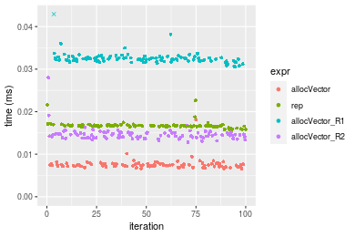
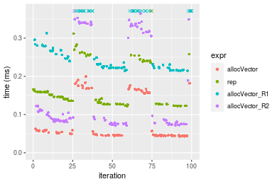
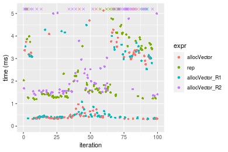

[matrixStats]: Benchmark report

---------------------------------------


# allocVector() benchmarks

This report benchmark the performance of allocVector() against alternative methods.

## Alternative methods

* vector() + assignment
* rep()
* matrix() + as.vector()

where
```r
> allocVector_R1 <- function(length, value = NA) {
+     x <- vector(mode = typeof(value), length = length)
+     if (!is.finite(value) || value != 0) 
+         x[] <- value
+     x
+ }
> allocVector_R2 <- function(length, value = NA) {
+     x <- matrix(data = value, nrow = length, ncol = 1L)
+     as.vector(x)
+ }
```


## Data type "integer"
### Data
```r
> rvector <- function(n, mode = c("logical", "double", "integer"), range = c(-100, +100), na_prob = 0) {
+     mode <- match.arg(mode)
+     if (mode == "logical") {
+         x <- sample(c(FALSE, TRUE), size = n, replace = TRUE)
+     }     else {
+         x <- runif(n, min = range[1], max = range[2])
+     }
+     storage.mode(x) <- mode
+     if (na_prob > 0) 
+         x[sample(n, size = na_prob * n)] <- NA
+     x
+ }
> rvectors <- function(scale = 10, seed = 1, ...) {
+     set.seed(seed)
+     data <- list()
+     data[[1]] <- rvector(n = scale * 100, ...)
+     data[[2]] <- rvector(n = scale * 1000, ...)
+     data[[3]] <- rvector(n = scale * 10000, ...)
+     data[[4]] <- rvector(n = scale * 1e+05, ...)
+     data[[5]] <- rvector(n = scale * 1e+06, ...)
+     names(data) <- sprintf("n = %d", sapply(data, FUN = length))
+     data
+ }
> data <- rvectors(mode = mode)
> values <- list(zero = 0, one = 1, `NA` = NA_real_)
> if (mode != "double") 
+     values <- lapply(values, FUN = function(x) {
+         storage.mode(x) <- mode
+         x
+     })
```

### Results

### n = 1000 matrix


```r
> n <- length(data[["n = 1000"]])
> str(value)
 int 0
```

```r
> stats <- microbenchmark(allocVector = allocVector(length = n, value = value), rep = rep(value, times = n), 
+     allocVector_R1 = allocVector_R1(length = n, value = value), allocVector_R2 = allocVector_R2(length = n, 
+         value = value), unit = "ms")
```

_Table: Benchmarking of allocVector(), rep(), allocVector_R1() and allocVector_R2() on integer+n = 1000+0 data. The top panel shows times in milliseconds and the bottom panel shows relative times._


|   |expr           |      min|        lq|      mean|    median|        uq|      max|
|:--|:--------------|--------:|---------:|---------:|---------:|---------:|--------:|
|1  |allocVector    | 0.001518| 0.0016860| 0.0025870| 0.0017745| 0.0019065| 0.073864|
|2  |rep            | 0.002220| 0.0023590| 0.0025642| 0.0024255| 0.0025610| 0.008502|
|3  |allocVector_R1 | 0.002945| 0.0032195| 0.0035491| 0.0033550| 0.0035065| 0.018109|
|4  |allocVector_R2 | 0.004784| 0.0052885| 0.0057674| 0.0055375| 0.0058905| 0.018900|


|   |expr           |      min|       lq|      mean|   median|       uq|       max|
|:--|:--------------|--------:|--------:|---------:|--------:|--------:|---------:|
|1  |allocVector    | 1.000000| 1.000000| 1.0000000| 1.000000| 1.000000| 1.0000000|
|2  |rep            | 1.462451| 1.399170| 0.9911789| 1.366864| 1.343299| 0.1151034|
|3  |allocVector_R1 | 1.940053| 1.909549| 1.3719033| 1.890673| 1.839234| 0.2451668|
|4  |allocVector_R2 | 3.151515| 3.136714| 2.2294017| 3.120597| 3.089693| 0.2558757|

_Figure: Benchmarking of allocVector(), rep(), allocVector_R1() and allocVector_R2() on integer+n = 1000+0 data.  Outliers are displayed as crosses.  Times are in milliseconds._


```r
> n <- length(data[["n = 1000"]])
> str(value)
 int 1
```

```r
> stats <- microbenchmark(allocVector = allocVector(length = n, value = value), rep = rep(value, times = n), 
+     allocVector_R1 = allocVector_R1(length = n, value = value), allocVector_R2 = allocVector_R2(length = n, 
+         value = value), unit = "ms")
```

_Table: Benchmarking of allocVector(), rep(), allocVector_R1() and allocVector_R2() on integer+n = 1000+1 data. The top panel shows times in milliseconds and the bottom panel shows relative times._


|   |expr           |      min|        lq|      mean|    median|       uq|      max|
|:--|:--------------|--------:|---------:|---------:|---------:|--------:|--------:|
|1  |allocVector    | 0.001854| 0.0020785| 0.0023679| 0.0022355| 0.002422| 0.009179|
|2  |rep            | 0.002197| 0.0023960| 0.0025502| 0.0024770| 0.002642| 0.004039|
|4  |allocVector_R2 | 0.004855| 0.0053530| 0.0059651| 0.0056770| 0.006006| 0.025110|
|3  |allocVector_R1 | 0.006442| 0.0069770| 0.0074965| 0.0072370| 0.007544| 0.021564|


|   |expr           |      min|       lq|     mean|   median|       uq|       max|
|:--|:--------------|--------:|--------:|--------:|--------:|--------:|---------:|
|1  |allocVector    | 1.000000| 1.000000| 1.000000| 1.000000| 1.000000| 1.0000000|
|2  |rep            | 1.185005| 1.152754| 1.077010| 1.108030| 1.090834| 0.4400261|
|4  |allocVector_R2 | 2.618662| 2.575415| 2.519180| 2.539477| 2.479769| 2.7355921|
|3  |allocVector_R1 | 3.474649| 3.356748| 3.165921| 3.237307| 3.114781| 2.3492755|

_Figure: Benchmarking of allocVector(), rep(), allocVector_R1() and allocVector_R2() on integer+n = 1000+1 data.  Outliers are displayed as crosses.  Times are in milliseconds._


```r
> n <- length(data[["n = 1000"]])
> str(value)
 int NA
```

```r
> stats <- microbenchmark(allocVector = allocVector(length = n, value = value), rep = rep(value, times = n), 
+     allocVector_R1 = allocVector_R1(length = n, value = value), allocVector_R2 = allocVector_R2(length = n, 
+         value = value), unit = "ms")
```

_Table: Benchmarking of allocVector(), rep(), allocVector_R1() and allocVector_R2() on integer+n = 1000+NA data. The top panel shows times in milliseconds and the bottom panel shows relative times._


|   |expr           |      min|        lq|      mean|   median|        uq|      max|
|:--|:--------------|--------:|---------:|---------:|--------:|---------:|--------:|
|1  |allocVector    | 0.001782| 0.0021000| 0.0025504| 0.002250| 0.0024565| 0.009499|
|2  |rep            | 0.002169| 0.0024245| 0.0027425| 0.002546| 0.0026690| 0.012130|
|4  |allocVector_R2 | 0.004935| 0.0054915| 0.0064555| 0.005792| 0.0062700| 0.016971|
|3  |allocVector_R1 | 0.006308| 0.0067395| 0.0077678| 0.007005| 0.0075180| 0.024316|


|   |expr           |      min|       lq|     mean|   median|       uq|      max|
|:--|:--------------|--------:|--------:|--------:|--------:|--------:|--------:|
|1  |allocVector    | 1.000000| 1.000000| 1.000000| 1.000000| 1.000000| 1.000000|
|2  |rep            | 1.217172| 1.154524| 1.075323| 1.131556| 1.086505| 1.276976|
|4  |allocVector_R2 | 2.769360| 2.615000| 2.531219| 2.574222| 2.552412| 1.786609|
|3  |allocVector_R1 | 3.539843| 3.209286| 3.045766| 3.113333| 3.060452| 2.559848|

_Figure: Benchmarking of allocVector(), rep(), allocVector_R1() and allocVector_R2() on integer+n = 1000+NA data.  Outliers are displayed as crosses.  Times are in milliseconds._


### n = 10000 matrix


```r
> n <- length(data[["n = 10000"]])
> str(value)
 int 0
```

```r
> stats <- microbenchmark(allocVector = allocVector(length = n, value = value), rep = rep(value, times = n), 
+     allocVector_R1 = allocVector_R1(length = n, value = value), allocVector_R2 = allocVector_R2(length = n, 
+         value = value), unit = "ms")
```

_Table: Benchmarking of allocVector(), rep(), allocVector_R1() and allocVector_R2() on integer+n = 10000+0 data. The top panel shows times in milliseconds and the bottom panel shows relative times._


|   |expr           |      min|        lq|      mean|    median|        uq|      max|
|:--|:--------------|--------:|---------:|---------:|---------:|---------:|--------:|
|1  |allocVector    | 0.002971| 0.0033965| 0.0041715| 0.0036500| 0.0039480| 0.035086|
|3  |allocVector_R1 | 0.004599| 0.0050030| 0.0053396| 0.0051740| 0.0054855| 0.013440|
|4  |allocVector_R2 | 0.012167| 0.0128765| 0.0138471| 0.0134340| 0.0140955| 0.031948|
|2  |rep            | 0.015703| 0.0159030| 0.0164054| 0.0160085| 0.0165830| 0.029819|


|   |expr           |      min|       lq|     mean|   median|       uq|       max|
|:--|:--------------|--------:|--------:|--------:|--------:|--------:|---------:|
|1  |allocVector    | 1.000000| 1.000000| 1.000000| 1.000000| 1.000000| 1.0000000|
|3  |allocVector_R1 | 1.547964| 1.472987| 1.280027| 1.417534| 1.389438| 0.3830588|
|4  |allocVector_R2 | 4.095254| 3.791108| 3.319469| 3.680548| 3.570289| 0.9105626|
|2  |rep            | 5.285426| 4.682173| 3.932743| 4.385890| 4.200355| 0.8498831|

_Figure: Benchmarking of allocVector(), rep(), allocVector_R1() and allocVector_R2() on integer+n = 10000+0 data.  Outliers are displayed as crosses.  Times are in milliseconds._


```r
> n <- length(data[["n = 10000"]])
> str(value)
 int 1
```

```r
> stats <- microbenchmark(allocVector = allocVector(length = n, value = value), rep = rep(value, times = n), 
+     allocVector_R1 = allocVector_R1(length = n, value = value), allocVector_R2 = allocVector_R2(length = n, 
+         value = value), unit = "ms")
```

_Table: Benchmarking of allocVector(), rep(), allocVector_R1() and allocVector_R2() on integer+n = 10000+1 data. The top panel shows times in milliseconds and the bottom panel shows relative times._


|   |expr           |      min|        lq|      mean|    median|        uq|      max|
|:--|:--------------|--------:|---------:|---------:|---------:|---------:|--------:|
|1  |allocVector    | 0.006593| 0.0071480| 0.0074384| 0.0073870| 0.0076185| 0.013727|
|4  |allocVector_R2 | 0.012359| 0.0136625| 0.0143866| 0.0144065| 0.0148405| 0.025253|
|2  |rep            | 0.016375| 0.0165425| 0.0168098| 0.0166150| 0.0166915| 0.022745|
|3  |allocVector_R1 | 0.031419| 0.0319475| 0.0324017| 0.0321915| 0.0325640| 0.044414|


|   |expr           |      min|       lq|     mean|   median|       uq|      max|
|:--|:--------------|--------:|--------:|--------:|--------:|--------:|--------:|
|1  |allocVector    | 1.000000| 1.000000| 1.000000| 1.000000| 1.000000| 1.000000|
|4  |allocVector_R2 | 1.874564| 1.911374| 1.934105| 1.950250| 1.947956| 1.839659|
|2  |rep            | 2.483695| 2.314284| 2.259879| 2.249222| 2.190917| 1.656953|
|3  |allocVector_R1 | 4.765509| 4.469432| 4.356021| 4.357858| 4.274332| 3.235521|

_Figure: Benchmarking of allocVector(), rep(), allocVector_R1() and allocVector_R2() on integer+n = 10000+1 data.  Outliers are displayed as crosses.  Times are in milliseconds._




```r
> n <- length(data[["n = 10000"]])
> str(value)
 int NA
```

```r
> stats <- microbenchmark(allocVector = allocVector(length = n, value = value), rep = rep(value, times = n), 
+     allocVector_R1 = allocVector_R1(length = n, value = value), allocVector_R2 = allocVector_R2(length = n, 
+         value = value), unit = "ms")
```

_Table: Benchmarking of allocVector(), rep(), allocVector_R1() and allocVector_R2() on integer+n = 10000+NA data. The top panel shows times in milliseconds and the bottom panel shows relative times._


|   |expr           |      min|        lq|      mean|    median|        uq|      max|
|:--|:--------------|--------:|---------:|---------:|---------:|---------:|--------:|
|1  |allocVector    | 0.006476| 0.0070090| 0.0073421| 0.0072405| 0.0075960| 0.014520|
|4  |allocVector_R2 | 0.012299| 0.0132750| 0.0141292| 0.0137570| 0.0144345| 0.035035|
|2  |rep            | 0.016395| 0.0165705| 0.0168861| 0.0166525| 0.0167250| 0.034268|
|3  |allocVector_R1 | 0.031291| 0.0318370| 0.0329889| 0.0321250| 0.0323930| 0.064145|


|   |expr           |      min|       lq|     mean|   median|       uq|      max|
|:--|:--------------|--------:|--------:|--------:|--------:|--------:|--------:|
|1  |allocVector    | 1.000000| 1.000000| 1.000000| 1.000000| 1.000000| 1.000000|
|4  |allocVector_R2 | 1.899166| 1.893993| 1.924407| 1.900007| 1.900276| 2.412879|
|2  |rep            | 2.531655| 2.364175| 2.299908| 2.299910| 2.201817| 2.360055|
|3  |allocVector_R1 | 4.831841| 4.542303| 4.493117| 4.436848| 4.264481| 4.417700|

_Figure: Benchmarking of allocVector(), rep(), allocVector_R1() and allocVector_R2() on integer+n = 10000+NA data.  Outliers are displayed as crosses.  Times are in milliseconds._


### n = 100000 matrix


```r
> n <- length(data[["n = 100000"]])
> str(value)
 int 0
```

```r
> stats <- microbenchmark(allocVector = allocVector(length = n, value = value), rep = rep(value, times = n), 
+     allocVector_R1 = allocVector_R1(length = n, value = value), allocVector_R2 = allocVector_R2(length = n, 
+         value = value), unit = "ms")
```

_Table: Benchmarking of allocVector(), rep(), allocVector_R1() and allocVector_R2() on integer+n = 100000+0 data. The top panel shows times in milliseconds and the bottom panel shows relative times._


|   |expr           |      min|        lq|      mean|    median|        uq|      max|
|:--|:--------------|--------:|---------:|---------:|---------:|---------:|--------:|
|1  |allocVector    | 0.017693| 0.0210755| 0.0369593| 0.0224480| 0.0246825| 0.208953|
|3  |allocVector_R1 | 0.019640| 0.0225560| 0.0390096| 0.0245915| 0.0270995| 0.211096|
|4  |allocVector_R2 | 0.079508| 0.0903955| 0.1630268| 0.0936455| 0.1014580| 4.365906|
|2  |rep            | 0.135486| 0.1464540| 0.2034897| 0.1581030| 0.1585740| 4.437409|


|   |expr           |      min|       lq|     mean|   median|       uq|       max|
|:--|:--------------|--------:|--------:|--------:|--------:|--------:|---------:|
|1  |allocVector    | 1.000000| 1.000000| 1.000000| 1.000000| 1.000000|  1.000000|
|3  |allocVector_R1 | 1.110043| 1.070247| 1.055474| 1.095487| 1.097924|  1.010256|
|4  |allocVector_R2 | 4.493755| 4.289127| 4.410977| 4.171663| 4.110524| 20.894201|
|2  |rep            | 7.657605| 6.949017| 5.505772| 7.043077| 6.424552| 21.236398|

_Figure: Benchmarking of allocVector(), rep(), allocVector_R1() and allocVector_R2() on integer+n = 100000+0 data.  Outliers are displayed as crosses.  Times are in milliseconds._


```r
> n <- length(data[["n = 100000"]])
> str(value)
 int 1
```

```r
> stats <- microbenchmark(allocVector = allocVector(length = n, value = value), rep = rep(value, times = n), 
+     allocVector_R1 = allocVector_R1(length = n, value = value), allocVector_R2 = allocVector_R2(length = n, 
+         value = value), unit = "ms")
```

_Table: Benchmarking of allocVector(), rep(), allocVector_R1() and allocVector_R2() on integer+n = 100000+1 data. The top panel shows times in milliseconds and the bottom panel shows relative times._


|   |expr           |      min|        lq|      mean|    median|        uq|      max|
|:--|:--------------|--------:|---------:|---------:|---------:|---------:|--------:|
|1  |allocVector    | 0.043526| 0.0455715| 0.0892542| 0.0470950| 0.0507515| 4.113463|
|4  |allocVector_R2 | 0.073211| 0.0777220| 0.1276984| 0.0848515| 0.0900470| 4.284599|
|2  |rep            | 0.122736| 0.1270030| 0.1387709| 0.1358380| 0.1466075| 0.166546|
|3  |allocVector_R1 | 0.214639| 0.2235790| 0.2410781| 0.2309005| 0.2563920| 0.311664|


|   |expr           |      min|       lq|     mean|   median|       uq|       max|
|:--|:--------------|--------:|--------:|--------:|--------:|--------:|---------:|
|1  |allocVector    | 1.000000| 1.000000| 1.000000| 1.000000| 1.000000| 1.0000000|
|4  |allocVector_R2 | 1.682006| 1.705496| 1.430727| 1.801709| 1.774273| 1.0416039|
|2  |rep            | 2.819832| 2.786895| 1.554784| 2.884340| 2.888732| 0.0404880|
|3  |allocVector_R1 | 4.931283| 4.906115| 2.701029| 4.902867| 5.051910| 0.0757668|

_Figure: Benchmarking of allocVector(), rep(), allocVector_R1() and allocVector_R2() on integer+n = 100000+1 data.  Outliers are displayed as crosses.  Times are in milliseconds._


```r
> n <- length(data[["n = 100000"]])
> str(value)
 int NA
```

```r
> stats <- microbenchmark(allocVector = allocVector(length = n, value = value), rep = rep(value, times = n), 
+     allocVector_R1 = allocVector_R1(length = n, value = value), allocVector_R2 = allocVector_R2(length = n, 
+         value = value), unit = "ms")
```

_Table: Benchmarking of allocVector(), rep(), allocVector_R1() and allocVector_R2() on integer+n = 100000+NA data. The top panel shows times in milliseconds and the bottom panel shows relative times._


|   |expr           |      min|        lq|      mean|    median|        uq|      max|
|:--|:--------------|--------:|---------:|---------:|---------:|---------:|--------:|
|1  |allocVector    | 0.042298| 0.0448200| 0.0475494| 0.0461860| 0.0490465| 0.062967|
|4  |allocVector_R2 | 0.070752| 0.0771825| 0.0842838| 0.0834360| 0.0863795| 0.113799|
|2  |rep            | 0.122592| 0.1270135| 0.1782057| 0.1356965| 0.1459635| 4.174790|
|3  |allocVector_R1 | 0.214728| 0.2231715| 0.2791072| 0.2304505| 0.2477315| 4.410627|


|   |expr           |      min|       lq|     mean|   median|       uq|      max|
|:--|:--------------|--------:|--------:|--------:|--------:|--------:|--------:|
|1  |allocVector    | 1.000000| 1.000000| 1.000000| 1.000000| 1.000000|  1.00000|
|4  |allocVector_R2 | 1.672703| 1.722055| 1.772551| 1.806521| 1.761176|  1.80728|
|2  |rep            | 2.898293| 2.833858| 3.747799| 2.938044| 2.976023| 66.30124|
|3  |allocVector_R1 | 5.076552| 4.979284| 5.869831| 4.989618| 5.050952| 70.04664|

_Figure: Benchmarking of allocVector(), rep(), allocVector_R1() and allocVector_R2() on integer+n = 100000+NA data.  Outliers are displayed as crosses.  Times are in milliseconds._




### n = 1000000 matrix


```r
> n <- length(data[["n = 1000000"]])
> str(value)
 int 0
```

```r
> stats <- microbenchmark(allocVector = allocVector(length = n, value = value), rep = rep(value, times = n), 
+     allocVector_R1 = allocVector_R1(length = n, value = value), allocVector_R2 = allocVector_R2(length = n, 
+         value = value), unit = "ms")
```

_Table: Benchmarking of allocVector(), rep(), allocVector_R1() and allocVector_R2() on integer+n = 1000000+0 data. The top panel shows times in milliseconds and the bottom panel shows relative times._


|   |expr           |      min|        lq|      mean|    median|        uq|      max|
|:--|:--------------|--------:|---------:|---------:|---------:|---------:|--------:|
|1  |allocVector    | 0.162457| 0.1846675| 0.5974276| 0.1964390| 0.2075010| 6.857949|
|3  |allocVector_R1 | 0.171402| 0.1900710| 0.4075998| 0.1992925| 0.2123175| 4.423007|
|4  |allocVector_R2 | 0.846030| 0.9164435| 1.4054922| 0.9492425| 0.9891645| 6.930228|
|2  |rep            | 1.258918| 1.3594545| 1.8296455| 1.4169985| 1.4701365| 8.299755|


|   |expr           |      min|       lq|      mean|   median|       uq|      max|
|:--|:--------------|--------:|--------:|---------:|--------:|--------:|--------:|
|1  |allocVector    | 1.000000| 1.000000| 1.0000000| 1.000000| 1.000000| 1.000000|
|3  |allocVector_R1 | 1.055061| 1.029261| 0.6822581| 1.014526| 1.023212| 0.644946|
|4  |allocVector_R2 | 5.207717| 4.962668| 2.3525732| 4.832251| 4.767035| 1.010539|
|2  |rep            | 7.749238| 7.361634| 3.0625393| 7.213428| 7.084961| 1.210239|

_Figure: Benchmarking of allocVector(), rep(), allocVector_R1() and allocVector_R2() on integer+n = 1000000+0 data.  Outliers are displayed as crosses.  Times are in milliseconds._


```r
> n <- length(data[["n = 1000000"]])
> str(value)
 int 1
```

```r
> stats <- microbenchmark(allocVector = allocVector(length = n, value = value), rep = rep(value, times = n), 
+     allocVector_R1 = allocVector_R1(length = n, value = value), allocVector_R2 = allocVector_R2(length = n, 
+         value = value), unit = "ms")
```

_Table: Benchmarking of allocVector(), rep(), allocVector_R1() and allocVector_R2() on integer+n = 1000000+1 data. The top panel shows times in milliseconds and the bottom panel shows relative times._


|   |expr           |      min|        lq|      mean|    median|        uq|      max|
|:--|:--------------|--------:|---------:|---------:|---------:|---------:|--------:|
|1  |allocVector    | 0.415911| 0.4315480| 0.9303666| 0.4376260| 0.4577405| 6.695182|
|4  |allocVector_R2 | 0.827412| 0.8500915| 1.5281491| 0.8788775| 0.9283185| 7.289555|
|2  |rep            | 1.218601| 1.2493340| 1.6564838| 1.2663505| 1.3515470| 7.503794|
|3  |allocVector_R1 | 2.168172| 2.2557855| 3.0575516| 2.2790955| 2.4614110| 8.591361|


|   |expr           |      min|       lq|     mean|   median|       uq|      max|
|:--|:--------------|--------:|--------:|--------:|--------:|--------:|--------:|
|1  |allocVector    | 1.000000| 1.000000| 1.000000| 1.000000| 1.000000| 1.000000|
|4  |allocVector_R2 | 1.989397| 1.969866| 1.642524| 2.008284| 2.028045| 1.088776|
|2  |rep            | 2.929956| 2.895006| 1.780463| 2.893682| 2.952649| 1.120775|
|3  |allocVector_R1 | 5.213067| 5.227195| 3.286394| 5.207861| 5.377307| 1.283216|

_Figure: Benchmarking of allocVector(), rep(), allocVector_R1() and allocVector_R2() on integer+n = 1000000+1 data.  Outliers are displayed as crosses.  Times are in milliseconds._


```r
> n <- length(data[["n = 1000000"]])
> str(value)
 int NA
```

```r
> stats <- microbenchmark(allocVector = allocVector(length = n, value = value), rep = rep(value, times = n), 
+     allocVector_R1 = allocVector_R1(length = n, value = value), allocVector_R2 = allocVector_R2(length = n, 
+         value = value), unit = "ms")
```

_Table: Benchmarking of allocVector(), rep(), allocVector_R1() and allocVector_R2() on integer+n = 1000000+NA data. The top panel shows times in milliseconds and the bottom panel shows relative times._


|   |expr           |      min|       lq|      mean|   median|        uq|      max|
|:--|:--------------|--------:|--------:|---------:|--------:|---------:|--------:|
|1  |allocVector    | 0.418810| 0.431447| 0.8478858| 0.436385| 0.4561745| 6.828464|
|4  |allocVector_R2 | 0.814958| 0.854781| 1.4358679| 0.870346| 0.9170595| 6.468931|
|2  |rep            | 1.216573| 1.258700| 1.6390074| 1.268943| 1.3113730| 7.509662|
|3  |allocVector_R1 | 2.122158| 2.257796| 2.9265695| 2.271187| 2.3437075| 8.759849|


|   |expr           |      min|       lq|     mean|   median|       uq|       max|
|:--|:--------------|--------:|--------:|--------:|--------:|--------:|---------:|
|1  |allocVector    | 1.000000| 1.000000| 1.000000| 1.000000| 1.000000| 1.0000000|
|4  |allocVector_R2 | 1.945890| 1.981196| 1.693469| 1.994445| 2.010326| 0.9473479|
|2  |rep            | 2.904833| 2.917391| 1.933052| 2.907851| 2.874718| 1.0997586|
|3  |allocVector_R1 | 5.067114| 5.233079| 3.451608| 5.204549| 5.137743| 1.2828433|

_Figure: Benchmarking of allocVector(), rep(), allocVector_R1() and allocVector_R2() on integer+n = 1000000+NA data.  Outliers are displayed as crosses.  Times are in milliseconds._


### n = 10000000 matrix


```r
> n <- length(data[["n = 10000000"]])
> str(value)
 int 0
```

```r
> stats <- microbenchmark(allocVector = allocVector(length = n, value = value), rep = rep(value, times = n), 
+     allocVector_R1 = allocVector_R1(length = n, value = value), allocVector_R2 = allocVector_R2(length = n, 
+         value = value), unit = "ms")
```

_Table: Benchmarking of allocVector(), rep(), allocVector_R1() and allocVector_R2() on integer+n = 10000000+0 data. The top panel shows times in milliseconds and the bottom panel shows relative times._


|   |expr           |      min|       lq|     mean|   median|       uq|       max|
|:--|:--------------|--------:|--------:|--------:|--------:|--------:|---------:|
|1  |allocVector    | 13.12883| 14.13322| 18.69097| 15.44152| 24.65586|  26.50526|
|3  |allocVector_R1 | 13.14729| 14.36625| 21.95907| 15.44537| 24.71707| 368.89826|
|2  |rep            | 20.74601| 22.29838| 34.57272| 24.50593| 33.88686| 376.63248|
|4  |allocVector_R2 | 31.66078| 40.15614| 44.65285| 42.06090| 44.83257| 383.13988|


|   |expr           |      min|       lq|     mean|   median|       uq|      max|
|:--|:--------------|--------:|--------:|--------:|--------:|--------:|--------:|
|1  |allocVector    | 1.000000| 1.000000| 1.000000| 1.000000| 1.000000|  1.00000|
|3  |allocVector_R1 | 1.001406| 1.016488| 1.174849| 1.000249| 1.002482| 13.91792|
|2  |rep            | 1.580188| 1.577727| 1.849701| 1.587015| 1.374394| 14.20972|
|4  |allocVector_R2 | 2.411547| 2.841258| 2.389006| 2.723884| 1.818333| 14.45524|

_Figure: Benchmarking of allocVector(), rep(), allocVector_R1() and allocVector_R2() on integer+n = 10000000+0 data.  Outliers are displayed as crosses.  Times are in milliseconds._


```r
> n <- length(data[["n = 10000000"]])
> str(value)
 int 1
```

```r
> stats <- microbenchmark(allocVector = allocVector(length = n, value = value), rep = rep(value, times = n), 
+     allocVector_R1 = allocVector_R1(length = n, value = value), allocVector_R2 = allocVector_R2(length = n, 
+         value = value), unit = "ms")
```

_Table: Benchmarking of allocVector(), rep(), allocVector_R1() and allocVector_R2() on integer+n = 10000000+1 data. The top panel shows times in milliseconds and the bottom panel shows relative times._


|   |expr           |      min|       lq|     mean|   median|       uq|       max|
|:--|:--------------|--------:|--------:|--------:|--------:|--------:|---------:|
|1  |allocVector    | 13.44220| 14.14742| 19.37172| 15.62161| 25.53986|  32.15858|
|2  |rep            | 20.62366| 21.33114| 39.39440| 22.48790| 32.52835| 379.09843|
|4  |allocVector_R2 | 30.14339| 39.66646| 47.36188| 41.19321| 43.91951| 385.21673|
|3  |allocVector_R1 | 40.49829| 52.05428| 55.36500| 53.63425| 55.45646| 398.03203|


|   |expr           |      min|       lq|     mean|   median|       uq|      max|
|:--|:--------------|--------:|--------:|--------:|--------:|--------:|--------:|
|1  |allocVector    | 1.000000| 1.000000| 1.000000| 1.000000| 1.000000|  1.00000|
|2  |rep            | 1.534247| 1.507776| 2.033604| 1.439538| 1.273630| 11.78841|
|4  |allocVector_R2 | 2.242445| 2.803795| 2.444899| 2.636938| 1.719645| 11.97866|
|3  |allocVector_R1 | 3.012773| 3.679419| 2.858033| 3.433338| 2.171369| 12.37717|

_Figure: Benchmarking of allocVector(), rep(), allocVector_R1() and allocVector_R2() on integer+n = 10000000+1 data.  Outliers are displayed as crosses.  Times are in milliseconds._


```r
> n <- length(data[["n = 10000000"]])
> str(value)
 int NA
```

```r
> stats <- microbenchmark(allocVector = allocVector(length = n, value = value), rep = rep(value, times = n), 
+     allocVector_R1 = allocVector_R1(length = n, value = value), allocVector_R2 = allocVector_R2(length = n, 
+         value = value), unit = "ms")
```

_Table: Benchmarking of allocVector(), rep(), allocVector_R1() and allocVector_R2() on integer+n = 10000000+NA data. The top panel shows times in milliseconds and the bottom panel shows relative times._


|   |expr           |      min|       lq|     mean|   median|       uq|       max|
|:--|:--------------|--------:|--------:|--------:|--------:|--------:|---------:|
|1  |allocVector    | 13.48472| 13.93090| 21.55082| 14.56780| 24.85070| 362.94960|
|2  |rep            | 20.56492| 20.88502| 32.36561| 21.94536| 32.53723| 363.85498|
|4  |allocVector_R2 | 29.93323| 31.70021| 41.56325| 39.81350| 43.94229| 367.11107|
|3  |allocVector_R1 | 40.40279| 42.20473| 49.62134| 52.29232| 54.76779|  59.02027|


|   |expr           |      min|       lq|     mean|   median|       uq|       max|
|:--|:--------------|--------:|--------:|--------:|--------:|--------:|---------:|
|1  |allocVector    | 1.000000| 1.000000| 1.000000| 1.000000| 1.000000| 1.0000000|
|2  |rep            | 1.525053| 1.499186| 1.501827| 1.506429| 1.309308| 1.0024945|
|4  |allocVector_R2 | 2.219788| 2.275532| 1.928615| 2.732979| 1.768252| 1.0114657|
|3  |allocVector_R1 | 2.996189| 3.029576| 2.302527| 3.589581| 2.203873| 0.1626129|

_Figure: Benchmarking of allocVector(), rep(), allocVector_R1() and allocVector_R2() on integer+n = 10000000+NA data.  Outliers are displayed as crosses.  Times are in milliseconds._


## Data type "double"
### Data
```r
> rvector <- function(n, mode = c("logical", "double", "integer"), range = c(-100, +100), na_prob = 0) {
+     mode <- match.arg(mode)
+     if (mode == "logical") {
+         x <- sample(c(FALSE, TRUE), size = n, replace = TRUE)
+     }     else {
+         x <- runif(n, min = range[1], max = range[2])
+     }
+     storage.mode(x) <- mode
+     if (na_prob > 0) 
+         x[sample(n, size = na_prob * n)] <- NA
+     x
+ }
> rvectors <- function(scale = 10, seed = 1, ...) {
+     set.seed(seed)
+     data <- list()
+     data[[1]] <- rvector(n = scale * 100, ...)
+     data[[2]] <- rvector(n = scale * 1000, ...)
+     data[[3]] <- rvector(n = scale * 10000, ...)
+     data[[4]] <- rvector(n = scale * 1e+05, ...)
+     data[[5]] <- rvector(n = scale * 1e+06, ...)
+     names(data) <- sprintf("n = %d", sapply(data, FUN = length))
+     data
+ }
> data <- rvectors(mode = mode)
> values <- list(zero = 0, one = 1, `NA` = NA_real_)
> if (mode != "double") 
+     values <- lapply(values, FUN = function(x) {
+         storage.mode(x) <- mode
+         x
+     })
```

### Results

### n = 1000 matrix


```r
> n <- length(data[["n = 1000"]])
> str(value)
 num 0
```

```r
> stats <- microbenchmark(allocVector = allocVector(length = n, value = value), rep = rep(value, times = n), 
+     allocVector_R1 = allocVector_R1(length = n, value = value), allocVector_R2 = allocVector_R2(length = n, 
+         value = value), unit = "ms")
```

_Table: Benchmarking of allocVector(), rep(), allocVector_R1() and allocVector_R2() on double+n = 1000+0 data. The top panel shows times in milliseconds and the bottom panel shows relative times._


|   |expr           |      min|        lq|      mean|    median|        uq|      max|
|:--|:--------------|--------:|---------:|---------:|---------:|---------:|--------:|
|1  |allocVector    | 0.001415| 0.0016210| 0.0021016| 0.0016795| 0.0018100| 0.030282|
|2  |rep            | 0.002063| 0.0021160| 0.0022142| 0.0021550| 0.0022220| 0.004506|
|3  |allocVector_R1 | 0.002816| 0.0030795| 0.0034380| 0.0031995| 0.0033535| 0.012070|
|4  |allocVector_R2 | 0.004728| 0.0050600| 0.0054833| 0.0052190| 0.0054175| 0.017109|


|   |expr           |      min|       lq|     mean|   median|       uq|       max|
|:--|:--------------|--------:|--------:|--------:|--------:|--------:|---------:|
|1  |allocVector    | 1.000000| 1.000000| 1.000000| 1.000000| 1.000000| 1.0000000|
|2  |rep            | 1.457950| 1.305367| 1.053554| 1.283120| 1.227624| 0.1488013|
|3  |allocVector_R1 | 1.990106| 1.899753| 1.635887| 1.905031| 1.852762| 0.3985866|
|4  |allocVector_R2 | 3.341343| 3.121530| 2.609084| 3.107473| 2.993094| 0.5649891|

_Figure: Benchmarking of allocVector(), rep(), allocVector_R1() and allocVector_R2() on double+n = 1000+0 data.  Outliers are displayed as crosses.  Times are in milliseconds._


```r
> n <- length(data[["n = 1000"]])
> str(value)
 num 1
```

```r
> stats <- microbenchmark(allocVector = allocVector(length = n, value = value), rep = rep(value, times = n), 
+     allocVector_R1 = allocVector_R1(length = n, value = value), allocVector_R2 = allocVector_R2(length = n, 
+         value = value), unit = "ms")
```

_Table: Benchmarking of allocVector(), rep(), allocVector_R1() and allocVector_R2() on double+n = 1000+1 data. The top panel shows times in milliseconds and the bottom panel shows relative times._


|   |expr           |      min|        lq|      mean|   median|        uq|      max|
|:--|:--------------|--------:|---------:|---------:|--------:|---------:|--------:|
|2  |rep            | 0.001985| 0.0020765| 0.0022344| 0.002154| 0.0022200| 0.005733|
|1  |allocVector    | 0.001873| 0.0021055| 0.0024417| 0.002227| 0.0024010| 0.009498|
|4  |allocVector_R2 | 0.004602| 0.0050655| 0.0055863| 0.005238| 0.0054325| 0.028996|
|3  |allocVector_R1 | 0.005864| 0.0061580| 0.0066647| 0.006341| 0.0065770| 0.027308|


|   |expr           |       min|       lq|     mean|   median|       uq|      max|
|:--|:--------------|---------:|--------:|--------:|--------:|--------:|--------:|
|2  |rep            | 1.0000000| 1.000000| 1.000000| 1.000000| 1.000000| 1.000000|
|1  |allocVector    | 0.9435768| 1.013966| 1.092777| 1.033890| 1.081532| 1.656724|
|4  |allocVector_R2 | 2.3183879| 2.439441| 2.500166| 2.431755| 2.447072| 5.057736|
|3  |allocVector_R1 | 2.9541562| 2.965567| 2.982774| 2.943825| 2.962613| 4.763300|

_Figure: Benchmarking of allocVector(), rep(), allocVector_R1() and allocVector_R2() on double+n = 1000+1 data.  Outliers are displayed as crosses.  Times are in milliseconds._


```r
> n <- length(data[["n = 1000"]])
> str(value)
 num NA
```

```r
> stats <- microbenchmark(allocVector = allocVector(length = n, value = value), rep = rep(value, times = n), 
+     allocVector_R1 = allocVector_R1(length = n, value = value), allocVector_R2 = allocVector_R2(length = n, 
+         value = value), unit = "ms")
```

_Table: Benchmarking of allocVector(), rep(), allocVector_R1() and allocVector_R2() on double+n = 1000+NA data. The top panel shows times in milliseconds and the bottom panel shows relative times._


|   |expr           |      min|        lq|      mean|   median|        uq|      max|
|:--|:--------------|--------:|---------:|---------:|--------:|---------:|--------:|
|2  |rep            | 0.002157| 0.0022360| 0.0024485| 0.002301| 0.0023905| 0.014683|
|1  |allocVector    | 0.001899| 0.0021860| 0.0025060| 0.002361| 0.0025315| 0.010954|
|4  |allocVector_R2 | 0.004948| 0.0054020| 0.0059757| 0.005597| 0.0058115| 0.020338|
|3  |allocVector_R1 | 0.006253| 0.0065715| 0.0072598| 0.006780| 0.0070095| 0.036693|


|   |expr           |       min|        lq|     mean|   median|       uq|       max|
|:--|:--------------|---------:|---------:|--------:|--------:|--------:|---------:|
|2  |rep            | 1.0000000| 1.0000000| 1.000000| 1.000000| 1.000000| 1.0000000|
|1  |allocVector    | 0.8803894| 0.9776386| 1.023500| 1.026076| 1.058984| 0.7460328|
|4  |allocVector_R2 | 2.2939268| 2.4159213| 2.440557| 2.432421| 2.431081| 1.3851393|
|3  |allocVector_R1 | 2.8989337| 2.9389535| 2.965007| 2.946545| 2.932232| 2.4990125|

_Figure: Benchmarking of allocVector(), rep(), allocVector_R1() and allocVector_R2() on double+n = 1000+NA data.  Outliers are displayed as crosses.  Times are in milliseconds._


### n = 10000 matrix


```r
> n <- length(data[["n = 10000"]])
> str(value)
 num 0
```

```r
> stats <- microbenchmark(allocVector = allocVector(length = n, value = value), rep = rep(value, times = n), 
+     allocVector_R1 = allocVector_R1(length = n, value = value), allocVector_R2 = allocVector_R2(length = n, 
+         value = value), unit = "ms")
```

_Table: Benchmarking of allocVector(), rep(), allocVector_R1() and allocVector_R2() on double+n = 10000+0 data. The top panel shows times in milliseconds and the bottom panel shows relative times._


|   |expr           |      min|        lq|      mean|    median|        uq|      max|
|:--|:--------------|--------:|---------:|---------:|---------:|---------:|--------:|
|1  |allocVector    | 0.004856| 0.0052355| 0.0061298| 0.0055845| 0.0059345| 0.036818|
|3  |allocVector_R1 | 0.006136| 0.0066575| 0.0072737| 0.0071190| 0.0075165| 0.016316|
|2  |rep            | 0.015224| 0.0155010| 0.0160722| 0.0159205| 0.0161270| 0.036376|
|4  |allocVector_R2 | 0.016142| 0.0179415| 0.0197855| 0.0185910| 0.0211115| 0.035365|


|   |expr           |      min|       lq|     mean|   median|       uq|       max|
|:--|:--------------|--------:|--------:|--------:|--------:|--------:|---------:|
|1  |allocVector    | 1.000000| 1.000000| 1.000000| 1.000000| 1.000000| 1.0000000|
|3  |allocVector_R1 | 1.263591| 1.271607| 1.186613| 1.274778| 1.266577| 0.4431528|
|2  |rep            | 3.135091| 2.960749| 2.621966| 2.850837| 2.717499| 0.9879950|
|4  |allocVector_R2 | 3.324135| 3.426893| 3.227740| 3.329036| 3.557418| 0.9605356|

_Figure: Benchmarking of allocVector(), rep(), allocVector_R1() and allocVector_R2() on double+n = 10000+0 data.  Outliers are displayed as crosses.  Times are in milliseconds._


```r
> n <- length(data[["n = 10000"]])
> str(value)
 num 1
```

```r
> stats <- microbenchmark(allocVector = allocVector(length = n, value = value), rep = rep(value, times = n), 
+     allocVector_R1 = allocVector_R1(length = n, value = value), allocVector_R2 = allocVector_R2(length = n, 
+         value = value), unit = "ms")
```

_Table: Benchmarking of allocVector(), rep(), allocVector_R1() and allocVector_R2() on double+n = 10000+1 data. The top panel shows times in milliseconds and the bottom panel shows relative times._


|   |expr           |      min|        lq|      mean|    median|        uq|      max|
|:--|:--------------|--------:|---------:|---------:|---------:|---------:|--------:|
|1  |allocVector    | 0.007754| 0.0084925| 0.0089265| 0.0087975| 0.0090070| 0.019554|
|2  |rep            | 0.014766| 0.0153080| 0.0161754| 0.0156390| 0.0164720| 0.029737|
|4  |allocVector_R2 | 0.015811| 0.0176900| 0.0185086| 0.0181840| 0.0186950| 0.036682|
|3  |allocVector_R1 | 0.027445| 0.0291985| 0.0306737| 0.0302490| 0.0312965| 0.046313|


|   |expr           |      min|       lq|     mean|   median|       uq|      max|
|:--|:--------------|--------:|--------:|--------:|--------:|--------:|--------:|
|1  |allocVector    | 1.000000| 1.000000| 1.000000| 1.000000| 1.000000| 1.000000|
|2  |rep            | 1.904308| 1.802532| 1.812063| 1.777664| 1.828800| 1.520763|
|4  |allocVector_R2 | 2.039077| 2.083014| 2.073439| 2.066951| 2.075608| 1.875933|
|3  |allocVector_R1 | 3.539464| 3.438151| 3.436247| 3.438363| 3.474686| 2.368467|

_Figure: Benchmarking of allocVector(), rep(), allocVector_R1() and allocVector_R2() on double+n = 10000+1 data.  Outliers are displayed as crosses.  Times are in milliseconds._


```r
> n <- length(data[["n = 10000"]])
> str(value)
 num NA
```

```r
> stats <- microbenchmark(allocVector = allocVector(length = n, value = value), rep = rep(value, times = n), 
+     allocVector_R1 = allocVector_R1(length = n, value = value), allocVector_R2 = allocVector_R2(length = n, 
+         value = value), unit = "ms")
```

_Table: Benchmarking of allocVector(), rep(), allocVector_R1() and allocVector_R2() on double+n = 10000+NA data. The top panel shows times in milliseconds and the bottom panel shows relative times._


|   |expr           |      min|        lq|      mean|    median|        uq|      max|
|:--|:--------------|--------:|---------:|---------:|---------:|---------:|--------:|
|1  |allocVector    | 0.007720| 0.0084065| 0.0095950| 0.0087495| 0.0106345| 0.026217|
|2  |rep            | 0.014786| 0.0153455| 0.0157679| 0.0155780| 0.0161765| 0.024223|
|4  |allocVector_R2 | 0.015986| 0.0178945| 0.0193303| 0.0183450| 0.0195715| 0.032874|
|3  |allocVector_R1 | 0.027434| 0.0285950| 0.0297843| 0.0292150| 0.0301520| 0.060182|


|   |expr           |      min|       lq|     mean|   median|       uq|       max|
|:--|:--------------|--------:|--------:|--------:|--------:|--------:|---------:|
|1  |allocVector    | 1.000000| 1.000000| 1.000000| 1.000000| 1.000000| 1.0000000|
|2  |rep            | 1.915285| 1.825433| 1.643337| 1.780445| 1.521134| 0.9239425|
|4  |allocVector_R2 | 2.070725| 2.128650| 2.014615| 2.096691| 1.840378| 1.2539192|
|3  |allocVector_R1 | 3.553627| 3.401534| 3.104138| 3.339048| 2.835300| 2.2955334|

_Figure: Benchmarking of allocVector(), rep(), allocVector_R1() and allocVector_R2() on double+n = 10000+NA data.  Outliers are displayed as crosses.  Times are in milliseconds._


### n = 100000 matrix


```r
> n <- length(data[["n = 100000"]])
> str(value)
 num 0
```

```r
> stats <- microbenchmark(allocVector = allocVector(length = n, value = value), rep = rep(value, times = n), 
+     allocVector_R1 = allocVector_R1(length = n, value = value), allocVector_R2 = allocVector_R2(length = n, 
+         value = value), unit = "ms")
```

_Table: Benchmarking of allocVector(), rep(), allocVector_R1() and allocVector_R2() on double+n = 100000+0 data. The top panel shows times in milliseconds and the bottom panel shows relative times._


|   |expr           |      min|        lq|      mean|    median|        uq|      max|
|:--|:--------------|--------:|---------:|---------:|---------:|---------:|--------:|
|1  |allocVector    | 0.031753| 0.0400815| 0.1979257| 0.2677035| 0.2985765| 0.362564|
|3  |allocVector_R1 | 0.032818| 0.0423800| 0.2957776| 0.2728825| 0.3020785| 9.450652|
|2  |rep            | 0.123452| 0.1477290| 0.3786352| 0.3329160| 0.3842010| 9.681222|
|4  |allocVector_R2 | 0.132115| 0.1755290| 0.4665871| 0.5484390| 0.6119265| 0.749973|


|   |expr           |      min|       lq|     mean|   median|       uq|       max|
|:--|:--------------|--------:|--------:|--------:|--------:|--------:|---------:|
|1  |allocVector    | 1.000000| 1.000000| 1.000000| 1.000000| 1.000000|  1.000000|
|3  |allocVector_R1 | 1.033540| 1.057346| 1.494387| 1.019346| 1.011729| 26.066162|
|2  |rep            | 3.887885| 3.685715| 1.913017| 1.243600| 1.286776| 26.702105|
|4  |allocVector_R2 | 4.160709| 4.379302| 2.357385| 2.048681| 2.049480|  2.068526|

_Figure: Benchmarking of allocVector(), rep(), allocVector_R1() and allocVector_R2() on double+n = 100000+0 data.  Outliers are displayed as crosses.  Times are in milliseconds._


```r
> n <- length(data[["n = 100000"]])
> str(value)
 num 1
```

```r
> stats <- microbenchmark(allocVector = allocVector(length = n, value = value), rep = rep(value, times = n), 
+     allocVector_R1 = allocVector_R1(length = n, value = value), allocVector_R2 = allocVector_R2(length = n, 
+         value = value), unit = "ms")
```

_Table: Benchmarking of allocVector(), rep(), allocVector_R1() and allocVector_R2() on double+n = 100000+1 data. The top panel shows times in milliseconds and the bottom panel shows relative times._


|   |expr           |      min|        lq|      mean|    median|        uq|      max|
|:--|:--------------|--------:|---------:|---------:|---------:|---------:|--------:|
|2  |rep            | 0.114863| 0.1277565| 0.2414923| 0.2388275| 0.3421085| 0.442325|
|1  |allocVector    | 0.058663| 0.0676875| 0.1855347| 0.2484150| 0.2730845| 0.330693|
|4  |allocVector_R2 | 0.127156| 0.1520525| 0.5317896| 0.5297005| 0.5935980| 9.588027|
|3  |allocVector_R1 | 0.189340| 0.2421205| 0.4504779| 0.5302370| 0.5757470| 0.704068|


|   |expr           |       min|        lq|      mean|   median|        uq|        max|
|:--|:--------------|---------:|---------:|---------:|--------:|---------:|----------:|
|2  |rep            | 1.0000000| 1.0000000| 1.0000000| 1.000000| 1.0000000|  1.0000000|
|1  |allocVector    | 0.5107215| 0.5298165| 0.7682844| 1.040144| 0.7982394|  0.7476245|
|4  |allocVector_R2 | 1.1070231| 1.1901743| 2.2020978| 2.217921| 1.7351162| 21.6764302|
|3  |allocVector_R1 | 1.6483985| 1.8951717| 1.8653925| 2.220167| 1.6829368|  1.5917436|

_Figure: Benchmarking of allocVector(), rep(), allocVector_R1() and allocVector_R2() on double+n = 100000+1 data.  Outliers are displayed as crosses.  Times are in milliseconds._


```r
> n <- length(data[["n = 100000"]])
> str(value)
 num NA
```

```r
> stats <- microbenchmark(allocVector = allocVector(length = n, value = value), rep = rep(value, times = n), 
+     allocVector_R1 = allocVector_R1(length = n, value = value), allocVector_R2 = allocVector_R2(length = n, 
+         value = value), unit = "ms")
```

_Table: Benchmarking of allocVector(), rep(), allocVector_R1() and allocVector_R2() on double+n = 100000+NA data. The top panel shows times in milliseconds and the bottom panel shows relative times._


|   |expr           |      min|        lq|      mean|    median|        uq|      max|
|:--|:--------------|--------:|---------:|---------:|---------:|---------:|--------:|
|1  |allocVector    | 0.063584| 0.0726205| 0.1937615| 0.2480150| 0.2622015| 0.354847|
|2  |rep            | 0.109122| 0.1416075| 0.3487406| 0.3163755| 0.3548640| 9.543889|
|3  |allocVector_R1 | 0.190645| 0.2280800| 0.4288895| 0.5166095| 0.5692445| 0.716040|
|4  |allocVector_R2 | 0.123525| 0.1556300| 0.4464154| 0.5300885| 0.5901395| 4.589299|


|   |expr           |      min|       lq|     mean|   median|       uq|       max|
|:--|:--------------|--------:|--------:|--------:|--------:|--------:|---------:|
|1  |allocVector    | 1.000000| 1.000000| 1.000000| 1.000000| 1.000000|  1.000000|
|2  |rep            | 1.716187| 1.949966| 1.799845| 1.275630| 1.353402| 26.895786|
|3  |allocVector_R1 | 2.998317| 3.140711| 2.213492| 2.082977| 2.171019|  2.017884|
|4  |allocVector_R2 | 1.942706| 2.143059| 2.303943| 2.137324| 2.250710| 12.933177|

_Figure: Benchmarking of allocVector(), rep(), allocVector_R1() and allocVector_R2() on double+n = 100000+NA data.  Outliers are displayed as crosses.  Times are in milliseconds._


### n = 1000000 matrix


```r
> n <- length(data[["n = 1000000"]])
> str(value)
 num 0
```

```r
> stats <- microbenchmark(allocVector = allocVector(length = n, value = value), rep = rep(value, times = n), 
+     allocVector_R1 = allocVector_R1(length = n, value = value), allocVector_R2 = allocVector_R2(length = n, 
+         value = value), unit = "ms")
```

_Table: Benchmarking of allocVector(), rep(), allocVector_R1() and allocVector_R2() on double+n = 1000000+0 data. The top panel shows times in milliseconds and the bottom panel shows relative times._


|   |expr           |      min|       lq|     mean|    median|       uq|        max|
|:--|:--------------|--------:|--------:|--------:|---------:|--------:|----------:|
|1  |allocVector    | 0.276656| 0.324585| 1.383308| 0.3452760| 2.622874|  11.067871|
|3  |allocVector_R1 | 0.308160| 0.337477| 4.887865| 0.3539815| 2.670946| 333.764642|
|2  |rep            | 1.090648| 1.268565| 1.960724| 1.2971045| 3.097875|  11.975005|
|4  |allocVector_R2 | 1.291026| 1.353662| 2.904061| 1.3824995| 5.493466|   7.960634|


|   |expr           |      min|       lq|     mean|   median|       uq|        max|
|:--|:--------------|--------:|--------:|--------:|--------:|--------:|----------:|
|1  |allocVector    | 1.000000| 1.000000| 1.000000| 1.000000| 1.000000|  1.0000000|
|3  |allocVector_R1 | 1.113874| 1.039718| 3.533461| 1.025213| 1.018328| 30.1561738|
|2  |rep            | 3.942253| 3.908266| 1.417416| 3.756718| 1.181099|  1.0819610|
|4  |allocVector_R2 | 4.666539| 4.170441| 2.099359| 4.004042| 2.094445|  0.7192561|

_Figure: Benchmarking of allocVector(), rep(), allocVector_R1() and allocVector_R2() on double+n = 1000000+0 data.  Outliers are displayed as crosses.  Times are in milliseconds._




```r
> n <- length(data[["n = 1000000"]])
> str(value)
 num 1
```

```r
> stats <- microbenchmark(allocVector = allocVector(length = n, value = value), rep = rep(value, times = n), 
+     allocVector_R1 = allocVector_R1(length = n, value = value), allocVector_R2 = allocVector_R2(length = n, 
+         value = value), unit = "ms")
```

_Table: Benchmarking of allocVector(), rep(), allocVector_R1() and allocVector_R2() on double+n = 1000000+1 data. The top panel shows times in milliseconds and the bottom panel shows relative times._


|   |expr           |      min|        lq|     mean|   median|       uq|       max|
|:--|:--------------|--------:|---------:|--------:|--------:|--------:|---------:|
|1  |allocVector    | 0.622359| 0.6474165| 1.487266| 0.660478| 1.712003| 10.115689|
|2  |rep            | 1.131264| 1.2294450| 1.826937| 1.245230| 1.296121|  5.269655|
|4  |allocVector_R2 | 1.281058| 1.3466025| 2.855033| 1.389291| 5.497266|  7.936525|
|3  |allocVector_R1 | 2.008797| 2.1270930| 3.059172| 2.179692| 4.063796| 13.163976|


|   |expr           |      min|       lq|     mean|   median|       uq|       max|
|:--|:--------------|--------:|--------:|--------:|--------:|--------:|---------:|
|1  |allocVector    | 1.000000| 1.000000| 1.000000| 1.000000| 1.000000| 1.0000000|
|2  |rep            | 1.817703| 1.899002| 1.228386| 1.885347| 0.757079| 0.5209388|
|4  |allocVector_R2 | 2.058391| 2.079963| 1.919651| 2.103463| 3.211014| 0.7845758|
|3  |allocVector_R1 | 3.227714| 3.285509| 2.056910| 3.300173| 2.373708| 1.3013425|

_Figure: Benchmarking of allocVector(), rep(), allocVector_R1() and allocVector_R2() on double+n = 1000000+1 data.  Outliers are displayed as crosses.  Times are in milliseconds._


```r
> n <- length(data[["n = 1000000"]])
> str(value)
 num NA
```

```r
> stats <- microbenchmark(allocVector = allocVector(length = n, value = value), rep = rep(value, times = n), 
+     allocVector_R1 = allocVector_R1(length = n, value = value), allocVector_R2 = allocVector_R2(length = n, 
+         value = value), unit = "ms")
```

_Table: Benchmarking of allocVector(), rep(), allocVector_R1() and allocVector_R2() on double+n = 1000000+NA data. The top panel shows times in milliseconds and the bottom panel shows relative times._


|   |expr           |      min|        lq|     mean|    median|       uq|      max|
|:--|:--------------|--------:|---------:|--------:|---------:|--------:|--------:|
|1  |allocVector    | 0.616853| 0.6448995| 1.789290| 0.6733745| 2.495284| 11.04315|
|4  |allocVector_R2 | 1.275864| 1.3472870| 3.419430| 1.4125630| 5.605982| 10.79893|
|3  |allocVector_R1 | 1.911619| 2.0646615| 3.126536| 2.1739125| 4.171086| 11.99246|
|2  |rep            | 1.064026| 1.2055270| 2.620018| 3.0973020| 3.159729| 13.13328|


|   |expr           |      min|       lq|     mean|   median|       uq|       max|
|:--|:--------------|--------:|--------:|--------:|--------:|--------:|---------:|
|1  |allocVector    | 1.000000| 1.000000| 1.000000| 1.000000| 1.000000| 1.0000000|
|4  |allocVector_R2 | 2.068344| 2.089143| 1.911054| 2.097738| 2.246630| 0.9778856|
|3  |allocVector_R1 | 3.098986| 3.201524| 1.747361| 3.228385| 1.671587| 1.0859645|
|2  |rep            | 1.724926| 1.869325| 1.464278| 4.599672| 1.266280| 1.1892698|

_Figure: Benchmarking of allocVector(), rep(), allocVector_R1() and allocVector_R2() on double+n = 1000000+NA data.  Outliers are displayed as crosses.  Times are in milliseconds._


### n = 10000000 matrix


```r
> n <- length(data[["n = 10000000"]])
> str(value)
 num 0
```

```r
> stats <- microbenchmark(allocVector = allocVector(length = n, value = value), rep = rep(value, times = n), 
+     allocVector_R1 = allocVector_R1(length = n, value = value), allocVector_R2 = allocVector_R2(length = n, 
+         value = value), unit = "ms")
```

_Table: Benchmarking of allocVector(), rep(), allocVector_R1() and allocVector_R2() on double+n = 10000000+0 data. The top panel shows times in milliseconds and the bottom panel shows relative times._


|   |expr           |      min|       lq|     mean|   median|       uq|       max|
|:--|:--------------|--------:|--------:|--------:|--------:|--------:|---------:|
|3  |allocVector_R1 | 25.36124| 26.00919| 35.13591| 26.25713| 41.78473| 366.49560|
|1  |allocVector    | 25.30065| 26.05041| 31.34543| 26.28230| 39.72706|  46.71844|
|2  |rep            | 31.16543| 31.66275| 39.11745| 32.07019| 47.65240|  51.06206|
|4  |allocVector_R2 | 56.24784| 57.54343| 72.83744| 68.79517| 73.37428| 411.87768|


|   |expr           |       min|       lq|      mean|   median|        uq|       max|
|:--|:--------------|---------:|--------:|---------:|--------:|---------:|---------:|
|3  |allocVector_R1 | 1.0000000| 1.000000| 1.0000000| 1.000000| 1.0000000| 1.0000000|
|1  |allocVector    | 0.9976111| 1.001585| 0.8921197| 1.000959| 0.9507553| 0.1274734|
|2  |rep            | 1.2288611| 1.217368| 1.1133184| 1.221390| 1.1404261| 0.1393252|
|4  |allocVector_R2 | 2.2178666| 2.212426| 2.0730201| 2.620056| 1.7560068| 1.1238271|

_Figure: Benchmarking of allocVector(), rep(), allocVector_R1() and allocVector_R2() on double+n = 10000000+0 data.  Outliers are displayed as crosses.  Times are in milliseconds._


```r
> n <- length(data[["n = 10000000"]])
> str(value)
 num 1
```

```r
> stats <- microbenchmark(allocVector = allocVector(length = n, value = value), rep = rep(value, times = n), 
+     allocVector_R1 = allocVector_R1(length = n, value = value), allocVector_R2 = allocVector_R2(length = n, 
+         value = value), unit = "ms")
```

_Table: Benchmarking of allocVector(), rep(), allocVector_R1() and allocVector_R2() on double+n = 10000000+1 data. The top panel shows times in milliseconds and the bottom panel shows relative times._


|   |expr           |      min|       lq|     mean|   median|       uq|       max|
|:--|:--------------|--------:|--------:|--------:|--------:|--------:|---------:|
|1  |allocVector    | 23.98098| 24.64024| 29.98306| 24.85985| 37.61476|  44.09431|
|2  |rep            | 31.17967| 31.84093| 40.80177| 32.07173| 45.23451| 381.42350|
|3  |allocVector_R1 | 52.34282| 53.13156| 65.61220| 65.96737| 68.65852| 408.09494|
|4  |allocVector_R2 | 56.60710| 65.69820| 74.82023| 70.09419| 72.72726| 413.37866|


|   |expr           |      min|       lq|     mean|   median|       uq|      max|
|:--|:--------------|--------:|--------:|--------:|--------:|--------:|--------:|
|1  |allocVector    | 1.000000| 1.000000| 1.000000| 1.000000| 1.000000| 1.000000|
|2  |rep            | 1.300183| 1.292233| 1.360827| 1.290102| 1.202573| 8.650174|
|3  |allocVector_R1 | 2.182680| 2.156293| 2.188309| 2.653570| 1.825308| 9.255047|
|4  |allocVector_R2 | 2.360499| 2.666297| 2.495417| 2.819574| 1.933477| 9.374875|

_Figure: Benchmarking of allocVector(), rep(), allocVector_R1() and allocVector_R2() on double+n = 10000000+1 data.  Outliers are displayed as crosses.  Times are in milliseconds._


```r
> n <- length(data[["n = 10000000"]])
> str(value)
 num NA
```

```r
> stats <- microbenchmark(allocVector = allocVector(length = n, value = value), rep = rep(value, times = n), 
+     allocVector_R1 = allocVector_R1(length = n, value = value), allocVector_R2 = allocVector_R2(length = n, 
+         value = value), unit = "ms")
```

_Table: Benchmarking of allocVector(), rep(), allocVector_R1() and allocVector_R2() on double+n = 10000000+NA data. The top panel shows times in milliseconds and the bottom panel shows relative times._


|   |expr           |      min|       lq|     mean|   median|       uq|       max|
|:--|:--------------|--------:|--------:|--------:|--------:|--------:|---------:|
|1  |allocVector    | 23.92634| 24.47683| 32.80254| 24.69519| 38.24274| 376.33989|
|2  |rep            | 31.25641| 31.63641| 38.58371| 31.94786| 47.85870|  50.80633|
|3  |allocVector_R1 | 51.24915| 52.89774| 63.66329| 55.41129| 68.83393| 398.43051|
|4  |allocVector_R2 | 56.21016| 57.68506| 71.28181| 70.63712| 74.28468| 410.92808|


|   |expr           |      min|       lq|     mean|   median|       uq|       max|
|:--|:--------------|--------:|--------:|--------:|--------:|--------:|---------:|
|1  |allocVector    | 1.000000| 1.000000| 1.000000| 1.000000| 1.000000| 1.0000000|
|2  |rep            | 1.306360| 1.292504| 1.176242| 1.293687| 1.251445| 0.1350012|
|3  |allocVector_R1 | 2.141955| 2.161135| 1.940804| 2.243809| 1.799922| 1.0586986|
|4  |allocVector_R2 | 2.349301| 2.356721| 2.173058| 2.860359| 1.942452| 1.0919068|

_Figure: Benchmarking of allocVector(), rep(), allocVector_R1() and allocVector_R2() on double+n = 10000000+NA data.  Outliers are displayed as crosses.  Times are in milliseconds._


## Appendix

### Session information
```r
R version 4.1.1 Patched (2021-08-10 r80727)
Platform: x86_64-pc-linux-gnu (64-bit)
Running under: Ubuntu 18.04.5 LTS

Matrix products: default
BLAS:   /home/hb/software/R-devel/R-4-1-branch/lib/R/lib/libRblas.so
LAPACK: /home/hb/software/R-devel/R-4-1-branch/lib/R/lib/libRlapack.so

locale:
 [1] LC_CTYPE=en_US.UTF-8       LC_NUMERIC=C              
 [3] LC_TIME=en_US.UTF-8        LC_COLLATE=en_US.UTF-8    
 [5] LC_MONETARY=en_US.UTF-8    LC_MESSAGES=en_US.UTF-8   
 [7] LC_PAPER=en_US.UTF-8       LC_NAME=C                 
 [9] LC_ADDRESS=C               LC_TELEPHONE=C            
[11] LC_MEASUREMENT=en_US.UTF-8 LC_IDENTIFICATION=C       

attached base packages:
[1] stats     graphics  grDevices utils     datasets  methods   base     

other attached packages:
[1] microbenchmark_1.4-7   matrixStats_0.60.0     ggplot2_3.3.5         
[4] knitr_1.33             R.devices_2.17.0       R.utils_2.10.1        
[7] R.oo_1.24.0            R.methodsS3_1.8.1-9001

loaded via a namespace (and not attached):
 [1] Biobase_2.52.0          httr_1.4.2              splines_4.1.1          
 [4] bit64_4.0.5             network_1.17.1          assertthat_0.2.1       
 [7] highr_0.9               stats4_4.1.1            blob_1.2.2             
[10] GenomeInfoDbData_1.2.6  robustbase_0.93-8       pillar_1.6.2           
[13] RSQLite_2.2.8           lattice_0.20-44         glue_1.4.2             
[16] digest_0.6.27           XVector_0.32.0          colorspace_2.0-2       
[19] Matrix_1.3-4            XML_3.99-0.7            pkgconfig_2.0.3        
[22] zlibbioc_1.38.0         genefilter_1.74.0       purrr_0.3.4            
[25] ergm_4.1.2              xtable_1.8-4            scales_1.1.1           
[28] tibble_3.1.4            annotate_1.70.0         KEGGREST_1.32.0        
[31] farver_2.1.0            generics_0.1.0          IRanges_2.26.0         
[34] ellipsis_0.3.2          cachem_1.0.6            withr_2.4.2            
[37] BiocGenerics_0.38.0     mime_0.11               survival_3.2-13        
[40] magrittr_2.0.1          crayon_1.4.1            statnet.common_4.5.0   
[43] memoise_2.0.0           laeken_0.5.1            fansi_0.5.0            
[46] R.cache_0.15.0          MASS_7.3-54             R.rsp_0.44.0           
[49] tools_4.1.1             lifecycle_1.0.0         S4Vectors_0.30.0       
[52] trust_0.1-8             munsell_0.5.0           AnnotationDbi_1.54.1   
[55] Biostrings_2.60.2       compiler_4.1.1          GenomeInfoDb_1.28.1    
[58] rlang_0.4.11            grid_4.1.1              RCurl_1.98-1.4         
[61] cwhmisc_6.6             rappdirs_0.3.3          labeling_0.4.2         
[64] bitops_1.0-7            base64enc_0.1-3         boot_1.3-28            
[67] gtable_0.3.0            DBI_1.1.1               markdown_1.1           
[70] R6_2.5.1                lpSolveAPI_5.5.2.0-17.7 rle_0.9.2              
[73] dplyr_1.0.7             fastmap_1.1.0           bit_4.0.4              
[76] utf8_1.2.2              parallel_4.1.1          Rcpp_1.0.7             
[79] vctrs_0.3.8             png_0.1-7               DEoptimR_1.0-9         
[82] tidyselect_1.1.1        xfun_0.25               coda_0.19-4            
```
Total processing time was 2.29 mins.


### Reproducibility
To reproduce this report, do:
```r
html <- matrixStats:::benchmark('allocVector')
```

[RSP]: https://cran.r-project.org/package=R.rsp
[matrixStats]: https://cran.r-project.org/package=matrixStats

[StackOverflow:colMins?]: https://stackoverflow.com/questions/13676878 "Stack Overflow: fastest way to get Min from every column in a matrix?"
[StackOverflow:colSds?]: https://stackoverflow.com/questions/17549762 "Stack Overflow: Is there such 'colsd' in R?"
[StackOverflow:rowProds?]: https://stackoverflow.com/questions/20198801/ "Stack Overflow: Row product of matrix and column sum of matrix"

---------------------------------------
Copyright Henrik Bengtsson. Last updated on 2021-08-25 17:31:53 (+0200 UTC). Powered by [RSP].

<script>
 var link = document.createElement('link');
 link.rel = 'icon';
 link.href = "data:image/png;base64,iVBORw0KGgoAAAANSUhEUgAAACAAAAAgCAMAAABEpIrGAAAA21BMVEUAAAAAAP8AAP8AAP8AAP8AAP8AAP8AAP8AAP8AAP8AAP8AAP8AAP8AAP8AAP8AAP8AAP8AAP8AAP8AAP8AAP8AAP8AAP8AAP8AAP8AAP8AAP8AAP8AAP8AAP8AAP8AAP8AAP8AAP8AAP8AAP8AAP8AAP8AAP8AAP8AAP8AAP8BAf4CAv0DA/wdHeIeHuEfH+AgIN8hId4lJdomJtknJ9g+PsE/P8BAQL9yco10dIt1dYp3d4h4eIeVlWqWlmmXl2iYmGeZmWabm2Tn5xjo6Bfp6Rb39wj4+Af//wA2M9hbAAAASXRSTlMAAQIJCgsMJSYnKD4/QGRlZmhpamtsbautrrCxuru8y8zN5ebn6Pn6+///////////////////////////////////////////LsUNcQAAAS9JREFUOI29k21XgkAQhVcFytdSMqMETU26UVqGmpaiFbL//xc1cAhhwVNf6n5i5z67M2dmYOyfJZUqlVLhkKucG7cgmUZTybDz6g0iDeq51PUr37Ds2cy2/C9NeES5puDjxuUk1xnToZsg8pfA3avHQ3lLIi7iWRrkv/OYtkScxBIMgDee0ALoyxHQBJ68JLCjOtQIMIANF7QG9G9fNnHvisCHBVMKgSJgiz7nE+AoBKrAPA3MgepvgR9TSCasrCKH0eB1wBGBFdCO+nAGjMVGPcQb5bd6mQRegN6+1axOs9nGfYcCtfi4NQosdtH7dB+txFIpXQqN1p9B/asRHToyS0jRgpV7nk4nwcq1BJ+x3Gl/v7S9Wmpp/aGquum7w3ZDyrADFYrl8vHBH+ev9AUASW1dmU4h4wAAAABJRU5ErkJggg=="
 document.getElementsByTagName('head')[0].appendChild(link);
</script>


