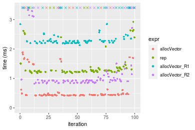
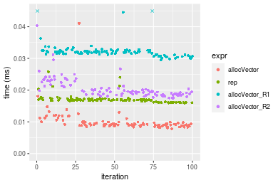

[matrixStats]: Benchmark report

---------------------------------------


# allocVector() benchmarks

This report benchmark the performance of allocVector() against alternative methods.

## Alternative methods

* vector() + assignment
* rep()
* matrix() + as.vector()

where
```r
> allocVector_R1 <- function(length, value = NA) {
+     x <- vector(mode = typeof(value), length = length)
+     if (!is.finite(value) || value != 0) 
+         x[] <- value
+     x
+ }
> allocVector_R2 <- function(length, value = NA) {
+     x <- matrix(data = value, nrow = length, ncol = 1L)
+     as.vector(x)
+ }
```


## Data type "integer"
### Data
```r
> rvector <- function(n, mode = c("logical", "double", "integer"), range = c(-100, +100), na_prob = 0) {
+     mode <- match.arg(mode)
+     if (mode == "logical") {
+         x <- sample(c(FALSE, TRUE), size = n, replace = TRUE)
+     }     else {
+         x <- runif(n, min = range[1], max = range[2])
+     }
+     storage.mode(x) <- mode
+     if (na_prob > 0) 
+         x[sample(n, size = na_prob * n)] <- NA
+     x
+ }
> rvectors <- function(scale = 10, seed = 1, ...) {
+     set.seed(seed)
+     data <- list()
+     data[[1]] <- rvector(n = scale * 100, ...)
+     data[[2]] <- rvector(n = scale * 1000, ...)
+     data[[3]] <- rvector(n = scale * 10000, ...)
+     data[[4]] <- rvector(n = scale * 1e+05, ...)
+     data[[5]] <- rvector(n = scale * 1e+06, ...)
+     names(data) <- sprintf("n = %d", sapply(data, FUN = length))
+     data
+ }
> data <- rvectors(mode = mode)
> values <- list(zero = 0, one = 1, `NA` = NA_real_)
> if (mode != "double") 
+     values <- lapply(values, FUN = function(x) {
+         storage.mode(x) <- mode
+         x
+     })
```

### Results

### n = 1000 matrix


```r
> n <- length(data[["n = 1000"]])
> str(value)
 int 0
```

```r
> stats <- microbenchmark(allocVector = allocVector(length = n, value = value), rep = rep(value, times = n), 
+     allocVector_R1 = allocVector_R1(length = n, value = value), allocVector_R2 = allocVector_R2(length = n, 
+         value = value), unit = "ms")
```

_Table: Benchmarking of allocVector(), rep(), allocVector_R1() and allocVector_R2() on integer+n = 1000+0 data. The top panel shows times in milliseconds and the bottom panel shows relative times._


|   |expr           |      min|        lq|      mean|    median|        uq|      max|
|:--|:--------------|--------:|---------:|---------:|---------:|---------:|--------:|
|1  |allocVector    | 0.001207| 0.0015755| 0.0024554| 0.0017380| 0.0019005| 0.070186|
|2  |rep            | 0.002024| 0.0022360| 0.0024954| 0.0023425| 0.0024865| 0.009744|
|3  |allocVector_R1 | 0.002680| 0.0030830| 0.0035664| 0.0033290| 0.0035985| 0.017822|
|4  |allocVector_R2 | 0.004625| 0.0050665| 0.0055169| 0.0052575| 0.0055825| 0.020414|


|   |expr           |      min|       lq|     mean|   median|       uq|       max|
|:--|:--------------|--------:|--------:|--------:|--------:|--------:|---------:|
|1  |allocVector    | 1.000000| 1.000000| 1.000000| 1.000000| 1.000000| 1.0000000|
|2  |rep            | 1.676885| 1.419232| 1.016286| 1.347814| 1.308340| 0.1388311|
|3  |allocVector_R1 | 2.220381| 1.956839| 1.452458| 1.915420| 1.893449| 0.2539253|
|4  |allocVector_R2 | 3.831814| 3.215804| 2.246833| 3.025029| 2.937385| 0.2908557|

_Figure: Benchmarking of allocVector(), rep(), allocVector_R1() and allocVector_R2() on integer+n = 1000+0 data.  Outliers are displayed as crosses.  Times are in milliseconds._


```r
> n <- length(data[["n = 1000"]])
> str(value)
 int 1
```

```r
> stats <- microbenchmark(allocVector = allocVector(length = n, value = value), rep = rep(value, times = n), 
+     allocVector_R1 = allocVector_R1(length = n, value = value), allocVector_R2 = allocVector_R2(length = n, 
+         value = value), unit = "ms")
```

_Table: Benchmarking of allocVector(), rep(), allocVector_R1() and allocVector_R2() on integer+n = 1000+1 data. The top panel shows times in milliseconds and the bottom panel shows relative times._


|   |expr           |      min|        lq|      mean|    median|        uq|      max|
|:--|:--------------|--------:|---------:|---------:|---------:|---------:|--------:|
|1  |allocVector    | 0.001494| 0.0018995| 0.0021898| 0.0020030| 0.0022105| 0.009982|
|2  |rep            | 0.002167| 0.0023285| 0.0026053| 0.0025065| 0.0026485| 0.008874|
|4  |allocVector_R2 | 0.004711| 0.0052180| 0.0059140| 0.0055500| 0.0059060| 0.033372|
|3  |allocVector_R1 | 0.006308| 0.0068715| 0.0073591| 0.0071210| 0.0075000| 0.021515|


|   |expr           |      min|       lq|     mean|   median|       uq|       max|
|:--|:--------------|--------:|--------:|--------:|--------:|--------:|---------:|
|1  |allocVector    | 1.000000| 1.000000| 1.000000| 1.000000| 1.000000| 1.0000000|
|2  |rep            | 1.450468| 1.225849| 1.189758| 1.251373| 1.198145| 0.8890002|
|4  |allocVector_R2 | 3.153280| 2.747039| 2.700697| 2.770844| 2.671794| 3.3432178|
|3  |allocVector_R1 | 4.222222| 3.617531| 3.360637| 3.555167| 3.392898| 2.1553797|

_Figure: Benchmarking of allocVector(), rep(), allocVector_R1() and allocVector_R2() on integer+n = 1000+1 data.  Outliers are displayed as crosses.  Times are in milliseconds._


```r
> n <- length(data[["n = 1000"]])
> str(value)
 int NA
```

```r
> stats <- microbenchmark(allocVector = allocVector(length = n, value = value), rep = rep(value, times = n), 
+     allocVector_R1 = allocVector_R1(length = n, value = value), allocVector_R2 = allocVector_R2(length = n, 
+         value = value), unit = "ms")
```

_Table: Benchmarking of allocVector(), rep(), allocVector_R1() and allocVector_R2() on integer+n = 1000+NA data. The top panel shows times in milliseconds and the bottom panel shows relative times._


|   |expr           |      min|        lq|      mean|   median|        uq|      max|
|:--|:--------------|--------:|---------:|---------:|--------:|---------:|--------:|
|1  |allocVector    | 0.001601| 0.0018860| 0.0022406| 0.002098| 0.0023700| 0.009687|
|2  |rep            | 0.002125| 0.0022880| 0.0026007| 0.002435| 0.0025570| 0.015160|
|4  |allocVector_R2 | 0.004699| 0.0051900| 0.0057627| 0.005567| 0.0059280| 0.016872|
|3  |allocVector_R1 | 0.006213| 0.0067775| 0.0073564| 0.006959| 0.0072925| 0.035589|


|   |expr           |      min|       lq|     mean|   median|       uq|      max|
|:--|:--------------|--------:|--------:|--------:|--------:|--------:|--------:|
|1  |allocVector    | 1.000000| 1.000000| 1.000000| 1.000000| 1.000000| 1.000000|
|2  |rep            | 1.327295| 1.213150| 1.160740| 1.160629| 1.078903| 1.564984|
|4  |allocVector_R2 | 2.935041| 2.751856| 2.571993| 2.653479| 2.501266| 1.741716|
|3  |allocVector_R1 | 3.880700| 3.593584| 3.283294| 3.316969| 3.077004| 3.673893|

_Figure: Benchmarking of allocVector(), rep(), allocVector_R1() and allocVector_R2() on integer+n = 1000+NA data.  Outliers are displayed as crosses.  Times are in milliseconds._


### n = 10000 matrix


```r
> n <- length(data[["n = 10000"]])
> str(value)
 int 0
```

```r
> stats <- microbenchmark(allocVector = allocVector(length = n, value = value), rep = rep(value, times = n), 
+     allocVector_R1 = allocVector_R1(length = n, value = value), allocVector_R2 = allocVector_R2(length = n, 
+         value = value), unit = "ms")
```

_Table: Benchmarking of allocVector(), rep(), allocVector_R1() and allocVector_R2() on integer+n = 10000+0 data. The top panel shows times in milliseconds and the bottom panel shows relative times._


|   |expr           |      min|        lq|      mean|    median|        uq|      max|
|:--|:--------------|--------:|---------:|---------:|---------:|---------:|--------:|
|1  |allocVector    | 0.003097| 0.0036030| 0.0039692| 0.0037665| 0.0040225| 0.011831|
|3  |allocVector_R1 | 0.004596| 0.0051095| 0.0055898| 0.0054600| 0.0058380| 0.014070|
|4  |allocVector_R2 | 0.012145| 0.0134350| 0.0145650| 0.0139685| 0.0146185| 0.046007|
|2  |rep            | 0.016329| 0.0164995| 0.0167631| 0.0166105| 0.0167380| 0.023181|


|   |expr           |      min|       lq|     mean|   median|       uq|      max|
|:--|:--------------|--------:|--------:|--------:|--------:|--------:|--------:|
|1  |allocVector    | 1.000000| 1.000000| 1.000000| 1.000000| 1.000000| 1.000000|
|3  |allocVector_R1 | 1.484017| 1.418124| 1.408302| 1.449622| 1.451336| 1.189249|
|4  |allocVector_R2 | 3.921537| 3.728837| 3.669525| 3.708615| 3.634183| 3.888682|
|2  |rep            | 5.272522| 4.579378| 4.223321| 4.410062| 4.161094| 1.959344|

_Figure: Benchmarking of allocVector(), rep(), allocVector_R1() and allocVector_R2() on integer+n = 10000+0 data.  Outliers are displayed as crosses.  Times are in milliseconds._


```r
> n <- length(data[["n = 10000"]])
> str(value)
 int 1
```

```r
> stats <- microbenchmark(allocVector = allocVector(length = n, value = value), rep = rep(value, times = n), 
+     allocVector_R1 = allocVector_R1(length = n, value = value), allocVector_R2 = allocVector_R2(length = n, 
+         value = value), unit = "ms")
```

_Table: Benchmarking of allocVector(), rep(), allocVector_R1() and allocVector_R2() on integer+n = 10000+1 data. The top panel shows times in milliseconds and the bottom panel shows relative times._


|   |expr           |      min|        lq|      mean|    median|        uq|      max|
|:--|:--------------|--------:|---------:|---------:|---------:|---------:|--------:|
|1  |allocVector    | 0.006589| 0.0071495| 0.0076573| 0.0073930| 0.0077470| 0.018073|
|4  |allocVector_R2 | 0.012832| 0.0139145| 0.0146466| 0.0144695| 0.0150000| 0.027984|
|2  |rep            | 0.015819| 0.0165415| 0.0167551| 0.0166530| 0.0167985| 0.022610|
|3  |allocVector_R1 | 0.030526| 0.0319380| 0.0325804| 0.0323585| 0.0327435| 0.045655|


|   |expr           |      min|       lq|     mean|   median|       uq|      max|
|:--|:--------------|--------:|--------:|--------:|--------:|--------:|--------:|
|1  |allocVector    | 1.000000| 1.000000| 1.000000| 1.000000| 1.000000| 1.000000|
|4  |allocVector_R2 | 1.947488| 1.946220| 1.912753| 1.957189| 1.936233| 1.548387|
|2  |rep            | 2.400819| 2.313658| 2.188110| 2.252536| 2.168388| 1.251038|
|3  |allocVector_R1 | 4.632873| 4.467166| 4.254805| 4.376911| 4.226604| 2.526144|

_Figure: Benchmarking of allocVector(), rep(), allocVector_R1() and allocVector_R2() on integer+n = 10000+1 data.  Outliers are displayed as crosses.  Times are in milliseconds._


```r
> n <- length(data[["n = 10000"]])
> str(value)
 int NA
```

```r
> stats <- microbenchmark(allocVector = allocVector(length = n, value = value), rep = rep(value, times = n), 
+     allocVector_R1 = allocVector_R1(length = n, value = value), allocVector_R2 = allocVector_R2(length = n, 
+         value = value), unit = "ms")
```

_Table: Benchmarking of allocVector(), rep(), allocVector_R1() and allocVector_R2() on integer+n = 10000+NA data. The top panel shows times in milliseconds and the bottom panel shows relative times._


|   |expr           |      min|        lq|      mean|    median|        uq|      max|
|:--|:--------------|--------:|---------:|---------:|---------:|---------:|--------:|
|1  |allocVector    | 0.006206| 0.0069575| 0.0073615| 0.0072990| 0.0075975| 0.014405|
|4  |allocVector_R2 | 0.011756| 0.0138505| 0.0150380| 0.0143845| 0.0149755| 0.044435|
|2  |rep            | 0.015812| 0.0165340| 0.0167107| 0.0166510| 0.0167925| 0.020548|
|3  |allocVector_R1 | 0.030063| 0.0319225| 0.0323812| 0.0322610| 0.0326025| 0.044110|


|   |expr           |      min|       lq|     mean|   median|       uq|      max|
|:--|:--------------|--------:|--------:|--------:|--------:|--------:|--------:|
|1  |allocVector    | 1.000000| 1.000000| 1.000000| 1.000000| 1.000000| 1.000000|
|4  |allocVector_R2 | 1.894296| 1.990729| 2.042782| 1.970749| 1.971109| 3.084693|
|2  |rep            | 2.547857| 2.376428| 2.269999| 2.281271| 2.210266| 1.426449|
|3  |allocVector_R1 | 4.844183| 4.588214| 4.398700| 4.419920| 4.291214| 3.062131|

_Figure: Benchmarking of allocVector(), rep(), allocVector_R1() and allocVector_R2() on integer+n = 10000+NA data.  Outliers are displayed as crosses.  Times are in milliseconds._


### n = 100000 matrix


```r
> n <- length(data[["n = 100000"]])
> str(value)
 int 0
```

```r
> stats <- microbenchmark(allocVector = allocVector(length = n, value = value), rep = rep(value, times = n), 
+     allocVector_R1 = allocVector_R1(length = n, value = value), allocVector_R2 = allocVector_R2(length = n, 
+         value = value), unit = "ms")
```

_Table: Benchmarking of allocVector(), rep(), allocVector_R1() and allocVector_R2() on integer+n = 100000+0 data. The top panel shows times in milliseconds and the bottom panel shows relative times._


|   |expr           |      min|        lq|      mean|    median|        uq|      max|
|:--|:--------------|--------:|---------:|---------:|---------:|---------:|--------:|
|1  |allocVector    | 0.017219| 0.0200070| 0.0759101| 0.0227995| 0.1609475| 0.205651|
|3  |allocVector_R1 | 0.018154| 0.0212425| 0.0719590| 0.0241340| 0.1597315| 0.233512|
|4  |allocVector_R2 | 0.073308| 0.0864205| 0.2441712| 0.0978160| 0.3415975| 5.458121|
|2  |rep            | 0.126543| 0.1362765| 0.2448996| 0.1584245| 0.2594165| 5.544453|


|   |expr           |      min|       lq|      mean|   median|        uq|       max|
|:--|:--------------|--------:|--------:|---------:|--------:|---------:|---------:|
|1  |allocVector    | 1.000000| 1.000000| 1.0000000| 1.000000| 1.0000000|  1.000000|
|3  |allocVector_R1 | 1.054301| 1.061753| 0.9479505| 1.058532| 0.9924447|  1.135477|
|4  |allocVector_R2 | 4.257390| 4.319513| 3.2165851| 4.290269| 2.1224157| 26.540698|
|2  |rep            | 7.349033| 6.811441| 3.2261800| 6.948595| 1.6118082| 26.960496|

_Figure: Benchmarking of allocVector(), rep(), allocVector_R1() and allocVector_R2() on integer+n = 100000+0 data.  Outliers are displayed as crosses.  Times are in milliseconds._


```r
> n <- length(data[["n = 100000"]])
> str(value)
 int 1
```

```r
> stats <- microbenchmark(allocVector = allocVector(length = n, value = value), rep = rep(value, times = n), 
+     allocVector_R1 = allocVector_R1(length = n, value = value), allocVector_R2 = allocVector_R2(length = n, 
+         value = value), unit = "ms")
```

_Table: Benchmarking of allocVector(), rep(), allocVector_R1() and allocVector_R2() on integer+n = 100000+1 data. The top panel shows times in milliseconds and the bottom panel shows relative times._


|   |expr           |      min|        lq|      mean|    median|        uq|      max|
|:--|:--------------|--------:|---------:|---------:|---------:|---------:|--------:|
|1  |allocVector    | 0.043335| 0.0456530| 0.1437595| 0.0517275| 0.1675860| 5.353385|
|4  |allocVector_R2 | 0.069954| 0.0774700| 0.2085445| 0.0855720| 0.3296740| 5.208113|
|2  |rep            | 0.122660| 0.1270560| 0.1738057| 0.1463460| 0.2482715| 0.306157|
|3  |allocVector_R1 | 0.214804| 0.2252585| 0.3433585| 0.2660250| 0.4863515| 0.592387|


|   |expr           |      min|       lq|     mean|   median|       uq|       max|
|:--|:--------------|--------:|--------:|--------:|--------:|--------:|---------:|
|1  |allocVector    | 1.000000| 1.000000| 1.000000| 1.000000| 1.000000| 1.0000000|
|4  |allocVector_R2 | 1.614261| 1.696931| 1.450649| 1.654284| 1.967193| 0.9728635|
|2  |rep            | 2.830506| 2.783081| 1.209003| 2.829172| 1.481457| 0.0571894|
|3  |allocVector_R1 | 4.956825| 4.934145| 2.388423| 5.142816| 2.902101| 0.1106565|

_Figure: Benchmarking of allocVector(), rep(), allocVector_R1() and allocVector_R2() on integer+n = 100000+1 data.  Outliers are displayed as crosses.  Times are in milliseconds._


```r
> n <- length(data[["n = 100000"]])
> str(value)
 int NA
```

```r
> stats <- microbenchmark(allocVector = allocVector(length = n, value = value), rep = rep(value, times = n), 
+     allocVector_R1 = allocVector_R1(length = n, value = value), allocVector_R2 = allocVector_R2(length = n, 
+         value = value), unit = "ms")
```

_Table: Benchmarking of allocVector(), rep(), allocVector_R1() and allocVector_R2() on integer+n = 100000+NA data. The top panel shows times in milliseconds and the bottom panel shows relative times._


|   |expr           |      min|        lq|      mean|    median|        uq|      max|
|:--|:--------------|--------:|---------:|---------:|---------:|---------:|--------:|
|1  |allocVector    | 0.042508| 0.0449285| 0.0811267| 0.0481785| 0.1560825| 0.199457|
|4  |allocVector_R2 | 0.071047| 0.0784890| 0.1667413| 0.0899735| 0.3270300| 0.387363|
|2  |rep            | 0.122501| 0.1268385| 0.2188964| 0.1407625| 0.1653190| 5.556213|
|3  |allocVector_R1 | 0.214654| 0.2226760| 0.3780174| 0.2542545| 0.4858145| 5.622163|


|   |expr           |      min|       lq|     mean|   median|       uq|       max|
|:--|:--------------|--------:|--------:|--------:|--------:|--------:|---------:|
|1  |allocVector    | 1.000000| 1.000000| 1.000000| 1.000000| 1.000000|  1.000000|
|4  |allocVector_R2 | 1.671380| 1.746976| 2.055319| 1.867503| 2.095238|  1.942088|
|2  |rep            | 2.881834| 2.823119| 2.698203| 2.921687| 1.059177| 27.856696|
|3  |allocVector_R1 | 5.049732| 4.956231| 4.659590| 5.277344| 3.112550| 28.187344|

_Figure: Benchmarking of allocVector(), rep(), allocVector_R1() and allocVector_R2() on integer+n = 100000+NA data.  Outliers are displayed as crosses.  Times are in milliseconds._


### n = 1000000 matrix


```r
> n <- length(data[["n = 1000000"]])
> str(value)
 int 0
```

```r
> stats <- microbenchmark(allocVector = allocVector(length = n, value = value), rep = rep(value, times = n), 
+     allocVector_R1 = allocVector_R1(length = n, value = value), allocVector_R2 = allocVector_R2(length = n, 
+         value = value), unit = "ms")
```

_Table: Benchmarking of allocVector(), rep(), allocVector_R1() and allocVector_R2() on integer+n = 1000000+0 data. The top panel shows times in milliseconds and the bottom panel shows relative times._


|   |expr           |      min|        lq|      mean|    median|       uq|      max|
|:--|:--------------|--------:|---------:|---------:|---------:|--------:|--------:|
|1  |allocVector    | 0.161781| 0.1808590| 0.6202326| 0.1942385| 0.208862| 6.246709|
|3  |allocVector_R1 | 0.170806| 0.1900815| 0.5925710| 0.2023540| 0.232190| 4.052854|
|4  |allocVector_R2 | 0.839776| 0.9285695| 1.5797688| 0.9736050| 1.024361| 6.547366|
|2  |rep            | 1.257761| 1.3129645| 1.8984884| 1.3857345| 1.463321| 7.256379|


|   |expr           |      min|       lq|      mean|   median|       uq|       max|
|:--|:--------------|--------:|--------:|---------:|--------:|--------:|---------:|
|1  |allocVector    | 1.000000| 1.000000| 1.0000000| 1.000000| 1.000000| 1.0000000|
|3  |allocVector_R1 | 1.055785| 1.050993| 0.9554013| 1.041781| 1.111691| 0.6487983|
|4  |allocVector_R2 | 5.190820| 5.134218| 2.5470585| 5.012420| 4.904490| 1.0481305|
|2  |rep            | 7.774467| 7.259603| 3.0609296| 7.134191| 7.006164| 1.1616323|

_Figure: Benchmarking of allocVector(), rep(), allocVector_R1() and allocVector_R2() on integer+n = 1000000+0 data.  Outliers are displayed as crosses.  Times are in milliseconds._


```r
> n <- length(data[["n = 1000000"]])
> str(value)
 int 1
```

```r
> stats <- microbenchmark(allocVector = allocVector(length = n, value = value), rep = rep(value, times = n), 
+     allocVector_R1 = allocVector_R1(length = n, value = value), allocVector_R2 = allocVector_R2(length = n, 
+         value = value), unit = "ms")
```

_Table: Benchmarking of allocVector(), rep(), allocVector_R1() and allocVector_R2() on integer+n = 1000000+1 data. The top panel shows times in milliseconds and the bottom panel shows relative times._


|   |expr           |      min|       lq|     mean|    median|       uq|        max|
|:--|:--------------|--------:|--------:|--------:|---------:|--------:|----------:|
|1  |allocVector    | 0.408741| 0.428375| 4.308654| 0.4384040| 0.528319| 333.321278|
|4  |allocVector_R2 | 0.820420| 0.872034| 1.700392| 0.9274495| 3.033707|   6.748338|
|2  |rep            | 1.144560| 1.225901| 1.559570| 1.2619730| 1.305289|   6.854616|
|3  |allocVector_R1 | 2.082066| 2.208751| 3.002041| 2.2696910| 2.731126|   7.881858|


|   |expr           |      min|       lq|      mean|   median|       uq|       max|
|:--|:--------------|--------:|--------:|---------:|--------:|--------:|---------:|
|1  |allocVector    | 1.000000| 1.000000| 1.0000000| 1.000000| 1.000000| 1.0000000|
|4  |allocVector_R2 | 2.007188| 2.035679| 0.3946458| 2.115513| 5.742187| 0.0202457|
|2  |rep            | 2.800208| 2.861746| 0.3619622| 2.878562| 2.470646| 0.0205646|
|3  |allocVector_R1 | 5.093852| 5.156117| 0.6967469| 5.177168| 5.169463| 0.0236464|

_Figure: Benchmarking of allocVector(), rep(), allocVector_R1() and allocVector_R2() on integer+n = 1000000+1 data.  Outliers are displayed as crosses.  Times are in milliseconds._


```r
> n <- length(data[["n = 1000000"]])
> str(value)
 int NA
```

```r
> stats <- microbenchmark(allocVector = allocVector(length = n, value = value), rep = rep(value, times = n), 
+     allocVector_R1 = allocVector_R1(length = n, value = value), allocVector_R2 = allocVector_R2(length = n, 
+         value = value), unit = "ms")
```

_Table: Benchmarking of allocVector(), rep(), allocVector_R1() and allocVector_R2() on integer+n = 1000000+NA data. The top panel shows times in milliseconds and the bottom panel shows relative times._


|   |expr           |      min|       lq|      mean|   median|        uq|      max|
|:--|:--------------|--------:|--------:|---------:|--------:|---------:|--------:|
|1  |allocVector    | 0.413900| 0.432972| 0.9158277| 0.442799| 0.5179325| 6.271777|
|4  |allocVector_R2 | 0.820146| 0.877243| 1.6536557| 0.933258| 1.3049465| 6.882525|
|2  |rep            | 1.179737| 1.223618| 1.5982229| 1.262436| 1.3497245| 7.009429|
|3  |allocVector_R1 | 2.131479| 2.217995| 3.1299068| 2.279055| 3.2363245| 8.883135|


|   |expr           |      min|       lq|     mean|   median|       uq|      max|
|:--|:--------------|--------:|--------:|--------:|--------:|--------:|--------:|
|1  |allocVector    | 1.000000| 1.000000| 1.000000| 1.000000| 1.000000| 1.000000|
|4  |allocVector_R2 | 1.981508| 2.026096| 1.805640| 2.107633| 2.519530| 1.097380|
|2  |rep            | 2.850295| 2.826091| 1.745113| 2.851036| 2.605985| 1.117614|
|3  |allocVector_R1 | 5.149744| 5.122720| 3.417572| 5.146929| 6.248545| 1.416367|

_Figure: Benchmarking of allocVector(), rep(), allocVector_R1() and allocVector_R2() on integer+n = 1000000+NA data.  Outliers are displayed as crosses.  Times are in milliseconds._




### n = 10000000 matrix


```r
> n <- length(data[["n = 10000000"]])
> str(value)
 int 0
```

```r
> stats <- microbenchmark(allocVector = allocVector(length = n, value = value), rep = rep(value, times = n), 
+     allocVector_R1 = allocVector_R1(length = n, value = value), allocVector_R2 = allocVector_R2(length = n, 
+         value = value), unit = "ms")
```

_Table: Benchmarking of allocVector(), rep(), allocVector_R1() and allocVector_R2() on integer+n = 10000000+0 data. The top panel shows times in milliseconds and the bottom panel shows relative times._


|   |expr           |      min|       lq|     mean|   median|       uq|       max|
|:--|:--------------|--------:|--------:|--------:|--------:|--------:|---------:|
|3  |allocVector_R1 | 12.48484| 12.87243| 16.07658| 13.38199| 20.99177|  24.23849|
|1  |allocVector    | 12.46579| 12.89216| 20.49525| 15.28668| 21.44455| 344.06724|
|2  |rep            | 20.30834| 20.78174| 35.41318| 24.65478| 29.38401| 383.14429|
|4  |allocVector_R2 | 29.53574| 34.97074| 36.49151| 37.35883| 38.83788|  45.86025|


|   |expr           |       min|       lq|     mean|   median|       uq|       max|
|:--|:--------------|---------:|--------:|--------:|--------:|--------:|---------:|
|3  |allocVector_R1 | 1.0000000| 1.000000| 1.000000| 1.000000| 1.000000|  1.000000|
|1  |allocVector    | 0.9984744| 1.001533| 1.274851| 1.142332| 1.021570| 14.195078|
|2  |rep            | 1.6266410| 1.614438| 2.202780| 1.842385| 1.399788| 15.807269|
|4  |allocVector_R2 | 2.3657296| 2.716717| 2.269855| 2.791724| 1.850148|  1.892043|

_Figure: Benchmarking of allocVector(), rep(), allocVector_R1() and allocVector_R2() on integer+n = 10000000+0 data.  Outliers are displayed as crosses.  Times are in milliseconds._


```r
> n <- length(data[["n = 10000000"]])
> str(value)
 int 1
```

```r
> stats <- microbenchmark(allocVector = allocVector(length = n, value = value), rep = rep(value, times = n), 
+     allocVector_R1 = allocVector_R1(length = n, value = value), allocVector_R2 = allocVector_R2(length = n, 
+         value = value), unit = "ms")
```

_Table: Benchmarking of allocVector(), rep(), allocVector_R1() and allocVector_R2() on integer+n = 10000000+1 data. The top panel shows times in milliseconds and the bottom panel shows relative times._


|   |expr           |      min|       lq|     mean|   median|       uq|       max|
|:--|:--------------|--------:|--------:|--------:|--------:|--------:|---------:|
|1  |allocVector    | 13.19570| 14.10907| 32.13831| 16.68228| 22.69588| 390.66040|
|2  |rep            | 20.22937| 21.27525| 26.23988| 26.99304| 30.48453|  35.37265|
|4  |allocVector_R2 | 29.60304| 38.12044| 43.35905| 39.91478| 42.12181| 377.14408|
|3  |allocVector_R1 | 40.16599| 49.48983| 62.32039| 51.47486| 55.76479| 397.89815|


|   |expr           |      min|       lq|      mean|   median|       uq|       max|
|:--|:--------------|--------:|--------:|---------:|--------:|--------:|---------:|
|1  |allocVector    | 1.000000| 1.000000| 1.0000000| 1.000000| 1.000000| 1.0000000|
|2  |rep            | 1.533027| 1.507913| 0.8164672| 1.618067| 1.343174| 0.0905458|
|4  |allocVector_R2 | 2.243386| 2.701840| 1.3491389| 2.392646| 1.855923| 0.9654013|
|3  |allocVector_R1 | 3.043870| 3.507662| 1.9391307| 3.085602| 2.457044| 1.0185270|

_Figure: Benchmarking of allocVector(), rep(), allocVector_R1() and allocVector_R2() on integer+n = 10000000+1 data.  Outliers are displayed as crosses.  Times are in milliseconds._


```r
> n <- length(data[["n = 10000000"]])
> str(value)
 int NA
```

```r
> stats <- microbenchmark(allocVector = allocVector(length = n, value = value), rep = rep(value, times = n), 
+     allocVector_R1 = allocVector_R1(length = n, value = value), allocVector_R2 = allocVector_R2(length = n, 
+         value = value), unit = "ms")
```

_Table: Benchmarking of allocVector(), rep(), allocVector_R1() and allocVector_R2() on integer+n = 10000000+NA data. The top panel shows times in milliseconds and the bottom panel shows relative times._


|   |expr           |      min|       lq|     mean|   median|       uq|       max|
|:--|:--------------|--------:|--------:|--------:|--------:|--------:|---------:|
|1  |allocVector    | 13.14410| 16.99748| 25.64399| 21.39350| 26.83883| 379.44009|
|2  |rep            | 20.42353| 25.48343| 44.73435| 28.64958| 34.08759| 415.55887|
|4  |allocVector_R2 | 31.17431| 40.19437| 45.05834| 44.76693| 50.02818|  63.26161|
|3  |allocVector_R1 | 45.79004| 54.37136| 73.01122| 60.67593| 67.26059| 423.91220|


|   |expr           |      min|       lq|     mean|   median|       uq|       max|
|:--|:--------------|--------:|--------:|--------:|--------:|--------:|---------:|
|1  |allocVector    | 1.000000| 1.000000| 1.000000| 1.000000| 1.000000| 1.0000000|
|2  |rep            | 1.553817| 1.499247| 1.744438| 1.339172| 1.270085| 1.0951897|
|4  |allocVector_R2 | 2.371733| 2.364725| 1.757072| 2.092548| 1.864023| 0.1667236|
|3  |allocVector_R1 | 3.483695| 3.198790| 2.847108| 2.836186| 2.506093| 1.1172045|

_Figure: Benchmarking of allocVector(), rep(), allocVector_R1() and allocVector_R2() on integer+n = 10000000+NA data.  Outliers are displayed as crosses.  Times are in milliseconds._


## Data type "double"
### Data
```r
> rvector <- function(n, mode = c("logical", "double", "integer"), range = c(-100, +100), na_prob = 0) {
+     mode <- match.arg(mode)
+     if (mode == "logical") {
+         x <- sample(c(FALSE, TRUE), size = n, replace = TRUE)
+     }     else {
+         x <- runif(n, min = range[1], max = range[2])
+     }
+     storage.mode(x) <- mode
+     if (na_prob > 0) 
+         x[sample(n, size = na_prob * n)] <- NA
+     x
+ }
> rvectors <- function(scale = 10, seed = 1, ...) {
+     set.seed(seed)
+     data <- list()
+     data[[1]] <- rvector(n = scale * 100, ...)
+     data[[2]] <- rvector(n = scale * 1000, ...)
+     data[[3]] <- rvector(n = scale * 10000, ...)
+     data[[4]] <- rvector(n = scale * 1e+05, ...)
+     data[[5]] <- rvector(n = scale * 1e+06, ...)
+     names(data) <- sprintf("n = %d", sapply(data, FUN = length))
+     data
+ }
> data <- rvectors(mode = mode)
> values <- list(zero = 0, one = 1, `NA` = NA_real_)
> if (mode != "double") 
+     values <- lapply(values, FUN = function(x) {
+         storage.mode(x) <- mode
+         x
+     })
```

### Results

### n = 1000 matrix


```r
> n <- length(data[["n = 1000"]])
> str(value)
 num 0
```

```r
> stats <- microbenchmark(allocVector = allocVector(length = n, value = value), rep = rep(value, times = n), 
+     allocVector_R1 = allocVector_R1(length = n, value = value), allocVector_R2 = allocVector_R2(length = n, 
+         value = value), unit = "ms")
```

_Table: Benchmarking of allocVector(), rep(), allocVector_R1() and allocVector_R2() on double+n = 1000+0 data. The top panel shows times in milliseconds and the bottom panel shows relative times._


|   |expr           |      min|        lq|      mean|    median|        uq|      max|
|:--|:--------------|--------:|---------:|---------:|---------:|---------:|--------:|
|1  |allocVector    | 0.001259| 0.0014825| 0.0023722| 0.0017395| 0.0029765| 0.021729|
|2  |rep            | 0.001810| 0.0019070| 0.0026352| 0.0021055| 0.0034560| 0.006048|
|3  |allocVector_R1 | 0.002546| 0.0029835| 0.0045033| 0.0033035| 0.0063625| 0.016274|
|4  |allocVector_R2 | 0.004289| 0.0048775| 0.0072078| 0.0051745| 0.0101200| 0.026711|


|   |expr           |      min|       lq|     mean|   median|       uq|       max|
|:--|:--------------|--------:|--------:|--------:|--------:|--------:|---------:|
|1  |allocVector    | 1.000000| 1.000000| 1.000000| 1.000000| 1.000000| 1.0000000|
|2  |rep            | 1.437649| 1.286341| 1.110840| 1.210405| 1.161095| 0.2783377|
|3  |allocVector_R1 | 2.022240| 2.012479| 1.898337| 1.899109| 2.137578| 0.7489530|
|4  |allocVector_R2 | 3.406672| 3.290051| 3.038403| 2.974705| 3.399966| 1.2292788|

_Figure: Benchmarking of allocVector(), rep(), allocVector_R1() and allocVector_R2() on double+n = 1000+0 data.  Outliers are displayed as crosses.  Times are in milliseconds._


```r
> n <- length(data[["n = 1000"]])
> str(value)
 num 1
```

```r
> stats <- microbenchmark(allocVector = allocVector(length = n, value = value), rep = rep(value, times = n), 
+     allocVector_R1 = allocVector_R1(length = n, value = value), allocVector_R2 = allocVector_R2(length = n, 
+         value = value), unit = "ms")
```

_Table: Benchmarking of allocVector(), rep(), allocVector_R1() and allocVector_R2() on double+n = 1000+1 data. The top panel shows times in milliseconds and the bottom panel shows relative times._


|   |expr           |      min|       lq|      mean|    median|        uq|      max|
|:--|:--------------|--------:|--------:|---------:|---------:|---------:|--------:|
|1  |allocVector    | 0.001422| 0.001743| 0.0021571| 0.0018840| 0.0021275| 0.014491|
|2  |rep            | 0.001687| 0.001808| 0.0020665| 0.0019280| 0.0020655| 0.004987|
|4  |allocVector_R2 | 0.004030| 0.004550| 0.0056235| 0.0047575| 0.0050425| 0.045010|
|3  |allocVector_R1 | 0.005145| 0.005460| 0.0064151| 0.0057040| 0.0060510| 0.024704|


|   |expr           |      min|       lq|      mean|   median|        uq|       max|
|:--|:--------------|--------:|--------:|---------:|--------:|---------:|---------:|
|1  |allocVector    | 1.000000| 1.000000| 1.0000000| 1.000000| 1.0000000| 1.0000000|
|2  |rep            | 1.186357| 1.037292| 0.9579905| 1.023355| 0.9708578| 0.3441446|
|4  |allocVector_R2 | 2.834037| 2.610442| 2.6069129| 2.525212| 2.3701528| 3.1060658|
|3  |allocVector_R1 | 3.618143| 3.132530| 2.9738820| 3.027601| 2.8441833| 1.7047823|

_Figure: Benchmarking of allocVector(), rep(), allocVector_R1() and allocVector_R2() on double+n = 1000+1 data.  Outliers are displayed as crosses.  Times are in milliseconds._


```r
> n <- length(data[["n = 1000"]])
> str(value)
 num NA
```

```r
> stats <- microbenchmark(allocVector = allocVector(length = n, value = value), rep = rep(value, times = n), 
+     allocVector_R1 = allocVector_R1(length = n, value = value), allocVector_R2 = allocVector_R2(length = n, 
+         value = value), unit = "ms")
```

_Table: Benchmarking of allocVector(), rep(), allocVector_R1() and allocVector_R2() on double+n = 1000+NA data. The top panel shows times in milliseconds and the bottom panel shows relative times._


|   |expr           |      min|       lq|      mean|    median|        uq|      max|
|:--|:--------------|--------:|--------:|---------:|---------:|---------:|--------:|
|2  |rep            | 0.002137| 0.002257| 0.0025928| 0.0023560| 0.0025325| 0.015994|
|1  |allocVector    | 0.001857| 0.002189| 0.0025469| 0.0023780| 0.0025890| 0.016976|
|4  |allocVector_R2 | 0.005103| 0.005568| 0.0061317| 0.0058410| 0.0062185| 0.025025|
|3  |allocVector_R1 | 0.006296| 0.006648| 0.0072987| 0.0068505| 0.0071515| 0.041025|


|   |expr           |       min|        lq|      mean|   median|       uq|      max|
|:--|:--------------|---------:|---------:|---------:|--------:|--------:|--------:|
|2  |rep            | 1.0000000| 1.0000000| 1.0000000| 1.000000| 1.000000| 1.000000|
|1  |allocVector    | 0.8689752| 0.9698715| 0.9822627| 1.009338| 1.022310| 1.061398|
|4  |allocVector_R2 | 2.3879270| 2.4669916| 2.3648663| 2.479202| 2.455479| 1.564649|
|3  |allocVector_R1 | 2.9461862| 2.9455029| 2.8149327| 2.907682| 2.823889| 2.565024|

_Figure: Benchmarking of allocVector(), rep(), allocVector_R1() and allocVector_R2() on double+n = 1000+NA data.  Outliers are displayed as crosses.  Times are in milliseconds._


### n = 10000 matrix


```r
> n <- length(data[["n = 10000"]])
> str(value)
 num 0
```

```r
> stats <- microbenchmark(allocVector = allocVector(length = n, value = value), rep = rep(value, times = n), 
+     allocVector_R1 = allocVector_R1(length = n, value = value), allocVector_R2 = allocVector_R2(length = n, 
+         value = value), unit = "ms")
```

_Table: Benchmarking of allocVector(), rep(), allocVector_R1() and allocVector_R2() on double+n = 10000+0 data. The top panel shows times in milliseconds and the bottom panel shows relative times._


|   |expr           |      min|        lq|      mean|    median|        uq|      max|
|:--|:--------------|--------:|---------:|---------:|---------:|---------:|--------:|
|1  |allocVector    | 0.005278| 0.0059925| 0.0071286| 0.0063065| 0.0076170| 0.022418|
|3  |allocVector_R1 | 0.007145| 0.0082195| 0.0096153| 0.0092150| 0.0104980| 0.016950|
|2  |rep            | 0.016506| 0.0168900| 0.0194588| 0.0171165| 0.0207635| 0.048388|
|4  |allocVector_R2 | 0.018069| 0.0223440| 0.0245975| 0.0235805| 0.0263385| 0.042436|


|   |expr           |      min|       lq|     mean|   median|       uq|       max|
|:--|:--------------|--------:|--------:|--------:|--------:|--------:|---------:|
|1  |allocVector    | 1.000000| 1.000000| 1.000000| 1.000000| 1.000000| 1.0000000|
|3  |allocVector_R1 | 1.353733| 1.371631| 1.348826| 1.461191| 1.378233| 0.7560889|
|2  |rep            | 3.127321| 2.818523| 2.729672| 2.714104| 2.725942| 2.1584441|
|4  |allocVector_R2 | 3.423456| 3.728661| 3.450517| 3.739079| 3.457857| 1.8929432|

_Figure: Benchmarking of allocVector(), rep(), allocVector_R1() and allocVector_R2() on double+n = 10000+0 data.  Outliers are displayed as crosses.  Times are in milliseconds._


```r
> n <- length(data[["n = 10000"]])
> str(value)
 num 1
```

```r
> stats <- microbenchmark(allocVector = allocVector(length = n, value = value), rep = rep(value, times = n), 
+     allocVector_R1 = allocVector_R1(length = n, value = value), allocVector_R2 = allocVector_R2(length = n, 
+         value = value), unit = "ms")
```

_Table: Benchmarking of allocVector(), rep(), allocVector_R1() and allocVector_R2() on double+n = 10000+1 data. The top panel shows times in milliseconds and the bottom panel shows relative times._


|   |expr           |      min|        lq|      mean|    median|        uq|      max|
|:--|:--------------|--------:|---------:|---------:|---------:|---------:|--------:|
|1  |allocVector    | 0.008135| 0.0089675| 0.0099416| 0.0094730| 0.0105050| 0.016818|
|2  |rep            | 0.016543| 0.0167100| 0.0171143| 0.0168565| 0.0171865| 0.024020|
|4  |allocVector_R2 | 0.017665| 0.0190135| 0.0207219| 0.0195470| 0.0226105| 0.037304|
|3  |allocVector_R1 | 0.031283| 0.0319630| 0.0336748| 0.0323975| 0.0333210| 0.064274|


|   |expr           |      min|       lq|     mean|   median|       uq|      max|
|:--|:--------------|--------:|--------:|--------:|--------:|--------:|--------:|
|1  |allocVector    | 1.000000| 1.000000| 1.000000| 1.000000| 1.000000| 1.000000|
|2  |rep            | 2.033559| 1.863396| 1.721486| 1.779426| 1.636030| 1.428232|
|4  |allocVector_R2 | 2.171481| 2.120268| 2.084357| 2.063443| 2.152356| 2.218100|
|3  |allocVector_R1 | 3.845483| 3.564316| 3.387263| 3.419983| 3.171918| 3.821739|

_Figure: Benchmarking of allocVector(), rep(), allocVector_R1() and allocVector_R2() on double+n = 10000+1 data.  Outliers are displayed as crosses.  Times are in milliseconds._


```r
> n <- length(data[["n = 10000"]])
> str(value)
 num NA
```

```r
> stats <- microbenchmark(allocVector = allocVector(length = n, value = value), rep = rep(value, times = n), 
+     allocVector_R1 = allocVector_R1(length = n, value = value), allocVector_R2 = allocVector_R2(length = n, 
+         value = value), unit = "ms")
```

_Table: Benchmarking of allocVector(), rep(), allocVector_R1() and allocVector_R2() on double+n = 10000+NA data. The top panel shows times in milliseconds and the bottom panel shows relative times._


|   |expr           |      min|        lq|      mean|    median|        uq|      max|
|:--|:--------------|--------:|---------:|---------:|---------:|---------:|--------:|
|1  |allocVector    | 0.007814| 0.0088285| 0.0100072| 0.0092185| 0.0099435| 0.041077|
|2  |rep            | 0.015961| 0.0166460| 0.0170889| 0.0168560| 0.0171340| 0.025815|
|4  |allocVector_R2 | 0.017514| 0.0186930| 0.0205903| 0.0194995| 0.0214825| 0.040296|
|3  |allocVector_R1 | 0.029559| 0.0314550| 0.0322915| 0.0320290| 0.0325030| 0.046611|


|   |expr           |      min|       lq|     mean|   median|       uq|       max|
|:--|:--------------|--------:|--------:|--------:|--------:|--------:|---------:|
|1  |allocVector    | 1.000000| 1.000000| 1.000000| 1.000000| 1.000000| 1.0000000|
|2  |rep            | 2.042616| 1.885485| 1.707663| 1.828497| 1.723136| 0.6284539|
|4  |allocVector_R2 | 2.241362| 2.117347| 2.057551| 2.115257| 2.160457| 0.9809869|
|3  |allocVector_R1 | 3.782826| 3.562893| 3.226831| 3.474426| 3.268769| 1.1347226|

_Figure: Benchmarking of allocVector(), rep(), allocVector_R1() and allocVector_R2() on double+n = 10000+NA data.  Outliers are displayed as crosses.  Times are in milliseconds._




### n = 100000 matrix


```r
> n <- length(data[["n = 100000"]])
> str(value)
 num 0
```

```r
> stats <- microbenchmark(allocVector = allocVector(length = n, value = value), rep = rep(value, times = n), 
+     allocVector_R1 = allocVector_R1(length = n, value = value), allocVector_R2 = allocVector_R2(length = n, 
+         value = value), unit = "ms")
```

_Table: Benchmarking of allocVector(), rep(), allocVector_R1() and allocVector_R2() on double+n = 100000+0 data. The top panel shows times in milliseconds and the bottom panel shows relative times._


|   |expr           |      min|        lq|      mean|    median|        uq|      max|
|:--|:--------------|--------:|---------:|---------:|---------:|---------:|--------:|
|1  |allocVector    | 0.032975| 0.0445010| 0.2552944| 0.3371345| 0.3607805| 0.515925|
|3  |allocVector_R1 | 0.033665| 0.0496920| 0.2560893| 0.3381810| 0.3662975| 0.474873|
|2  |rep            | 0.126966| 0.1615215| 0.5220916| 0.4098125| 0.4410205| 9.735218|
|4  |allocVector_R2 | 0.138870| 0.1877330| 0.5510740| 0.6731745| 0.7102845| 0.884302|


|   |expr           |      min|       lq|     mean|   median|       uq|        max|
|:--|:--------------|--------:|--------:|--------:|--------:|--------:|----------:|
|1  |allocVector    | 1.000000| 1.000000| 1.000000| 1.000000| 1.000000|  1.0000000|
|3  |allocVector_R1 | 1.020925| 1.116649| 1.003113| 1.003104| 1.015292|  0.9204303|
|2  |rep            | 3.850372| 3.629615| 2.045057| 1.215576| 1.222407| 18.8694442|
|4  |allocVector_R2 | 4.211372| 4.218624| 2.158582| 1.996754| 1.968744|  1.7140127|

_Figure: Benchmarking of allocVector(), rep(), allocVector_R1() and allocVector_R2() on double+n = 100000+0 data.  Outliers are displayed as crosses.  Times are in milliseconds._


```r
> n <- length(data[["n = 100000"]])
> str(value)
 num 1
```

```r
> stats <- microbenchmark(allocVector = allocVector(length = n, value = value), rep = rep(value, times = n), 
+     allocVector_R1 = allocVector_R1(length = n, value = value), allocVector_R2 = allocVector_R2(length = n, 
+         value = value), unit = "ms")
```

_Table: Benchmarking of allocVector(), rep(), allocVector_R1() and allocVector_R2() on double+n = 100000+1 data. The top panel shows times in milliseconds and the bottom panel shows relative times._


|   |expr           |      min|        lq|      mean|    median|        uq|      max|
|:--|:--------------|--------:|---------:|---------:|---------:|---------:|--------:|
|1  |allocVector    | 0.062230| 0.0700165| 0.1309885| 0.0767860| 0.1001945| 0.445361|
|2  |rep            | 0.119678| 0.1283640| 0.2241331| 0.1420500| 0.3334435| 0.566131|
|4  |allocVector_R2 | 0.132306| 0.1610060| 0.3878265| 0.1777770| 0.3559725| 4.469379|
|3  |allocVector_R1 | 0.211214| 0.2219980| 0.3977451| 0.2336005| 0.5315830| 4.103197|


|   |expr           |      min|       lq|     mean|   median|       uq|       max|
|:--|:--------------|--------:|--------:|--------:|--------:|--------:|---------:|
|1  |allocVector    | 1.000000| 1.000000| 1.000000| 1.000000| 1.000000|  1.000000|
|2  |rep            | 1.923156| 1.833339| 1.711091| 1.849947| 3.327962|  1.271173|
|4  |allocVector_R2 | 2.126081| 2.299544| 2.960769| 2.315227| 3.552815| 10.035407|
|3  |allocVector_R1 | 3.394086| 3.170653| 3.036490| 3.042228| 5.305511|  9.213193|

_Figure: Benchmarking of allocVector(), rep(), allocVector_R1() and allocVector_R2() on double+n = 100000+1 data.  Outliers are displayed as crosses.  Times are in milliseconds._


```r
> n <- length(data[["n = 100000"]])
> str(value)
 num NA
```

```r
> stats <- microbenchmark(allocVector = allocVector(length = n, value = value), rep = rep(value, times = n), 
+     allocVector_R1 = allocVector_R1(length = n, value = value), allocVector_R2 = allocVector_R2(length = n, 
+         value = value), unit = "ms")
```

_Table: Benchmarking of allocVector(), rep(), allocVector_R1() and allocVector_R2() on double+n = 100000+NA data. The top panel shows times in milliseconds and the bottom panel shows relative times._


|   |expr           |      min|        lq|      mean|    median|        uq|      max|
|:--|:--------------|--------:|---------:|---------:|---------:|---------:|--------:|
|1  |allocVector    | 0.060898| 0.0705405| 0.3723784| 0.2894075| 0.3151010| 8.264352|
|2  |rep            | 0.127419| 0.1590620| 0.3073524| 0.3701820| 0.4051885| 0.544962|
|3  |allocVector_R1 | 0.216292| 0.2265175| 0.5392802| 0.5762815| 0.6383735| 7.983009|
|4  |allocVector_R2 | 0.129893| 0.1579815| 0.4931727| 0.6243855| 0.6631820| 0.876573|


|   |expr           |      min|       lq|      mean|   median|       uq|       max|
|:--|:--------------|--------:|--------:|---------:|--------:|--------:|---------:|
|1  |allocVector    | 1.000000| 1.000000| 1.0000000| 1.000000| 1.000000| 1.0000000|
|2  |rep            | 2.092335| 2.254903| 0.8253765| 1.279103| 1.285900| 0.0659413|
|3  |allocVector_R1 | 3.551709| 3.211170| 1.4482049| 1.991246| 2.025933| 0.9659570|
|4  |allocVector_R2 | 2.132960| 2.239586| 1.3243860| 2.157461| 2.104665| 0.1060668|

_Figure: Benchmarking of allocVector(), rep(), allocVector_R1() and allocVector_R2() on double+n = 100000+NA data.  Outliers are displayed as crosses.  Times are in milliseconds._


### n = 1000000 matrix


```r
> n <- length(data[["n = 1000000"]])
> str(value)
 num 0
```

```r
> stats <- microbenchmark(allocVector = allocVector(length = n, value = value), rep = rep(value, times = n), 
+     allocVector_R1 = allocVector_R1(length = n, value = value), allocVector_R2 = allocVector_R2(length = n, 
+         value = value), unit = "ms")
```

_Table: Benchmarking of allocVector(), rep(), allocVector_R1() and allocVector_R2() on double+n = 1000000+0 data. The top panel shows times in milliseconds and the bottom panel shows relative times._


|   |expr           |      min|        lq|     mean|    median|       uq|       max|
|:--|:--------------|--------:|---------:|--------:|---------:|--------:|---------:|
|3  |allocVector_R1 | 0.321378| 0.4081640| 1.545236| 0.4848415| 3.088989|  7.951424|
|1  |allocVector    | 0.314506| 0.3781115| 1.726715| 0.4936290| 3.144486|  9.375319|
|2  |rep            | 1.193094| 1.3386675| 2.806585| 1.6701390| 3.652778| 20.428340|
|4  |allocVector_R2 | 1.352299| 1.5610275| 4.029003| 2.3514385| 7.009819| 10.039261|


|   |expr           |       min|        lq|     mean|   median|       uq|      max|
|:--|:--------------|---------:|---------:|--------:|--------:|--------:|--------:|
|3  |allocVector_R1 | 1.0000000| 1.0000000| 1.000000| 1.000000| 1.000000| 1.000000|
|1  |allocVector    | 0.9786171| 0.9263715| 1.117444| 1.018125| 1.017966| 1.179074|
|2  |rep            | 3.7124321| 3.2797295| 1.816282| 3.444711| 1.182516| 2.569142|
|4  |allocVector_R2 | 4.2078145| 3.8245105| 2.607371| 4.849912| 2.269293| 1.262574|

_Figure: Benchmarking of allocVector(), rep(), allocVector_R1() and allocVector_R2() on double+n = 1000000+0 data.  Outliers are displayed as crosses.  Times are in milliseconds._


```r
> n <- length(data[["n = 1000000"]])
> str(value)
 num 1
```

```r
> stats <- microbenchmark(allocVector = allocVector(length = n, value = value), rep = rep(value, times = n), 
+     allocVector_R1 = allocVector_R1(length = n, value = value), allocVector_R2 = allocVector_R2(length = n, 
+         value = value), unit = "ms")
```

_Table: Benchmarking of allocVector(), rep(), allocVector_R1() and allocVector_R2() on double+n = 1000000+1 data. The top panel shows times in milliseconds and the bottom panel shows relative times._


|   |expr           |      min|       lq|     mean|    median|       uq|        max|
|:--|:--------------|--------:|--------:|--------:|---------:|--------:|----------:|
|1  |allocVector    | 0.640098| 0.664248| 1.514574| 0.6993095| 2.704990|   9.212924|
|2  |rep            | 1.155785| 1.237724| 2.213403| 1.2760855| 3.440713|  12.252703|
|4  |allocVector_R2 | 1.335175| 1.398490| 6.586466| 1.4785205| 6.331370| 329.164961|
|3  |allocVector_R1 | 2.105089| 2.247377| 3.778901| 2.2781760| 5.742554|  10.931701|


|   |expr           |      min|       lq|     mean|   median|       uq|       max|
|:--|:--------------|--------:|--------:|--------:|--------:|--------:|---------:|
|1  |allocVector    | 1.000000| 1.000000| 1.000000| 1.000000| 1.000000|  1.000000|
|2  |rep            | 1.805638| 1.863346| 1.461403| 1.824779| 1.271987|  1.329947|
|4  |allocVector_R2 | 2.085891| 2.105373| 4.348725| 2.114258| 2.340626| 35.728609|
|3  |allocVector_R1 | 3.288698| 3.383340| 2.495025| 3.257751| 2.122948|  1.186562|

_Figure: Benchmarking of allocVector(), rep(), allocVector_R1() and allocVector_R2() on double+n = 1000000+1 data.  Outliers are displayed as crosses.  Times are in milliseconds._


```r
> n <- length(data[["n = 1000000"]])
> str(value)
 num NA
```

```r
> stats <- microbenchmark(allocVector = allocVector(length = n, value = value), rep = rep(value, times = n), 
+     allocVector_R1 = allocVector_R1(length = n, value = value), allocVector_R2 = allocVector_R2(length = n, 
+         value = value), unit = "ms")
```

_Table: Benchmarking of allocVector(), rep(), allocVector_R1() and allocVector_R2() on double+n = 1000000+NA data. The top panel shows times in milliseconds and the bottom panel shows relative times._


|   |expr           |      min|        lq|     mean|   median|       uq|       max|
|:--|:--------------|--------:|---------:|--------:|--------:|--------:|---------:|
|1  |allocVector    | 0.643766| 0.6671845| 1.318058| 0.683923| 0.788271|  8.101824|
|2  |rep            | 1.157254| 1.2346510| 1.660541| 1.275901| 1.361646|  5.398941|
|4  |allocVector_R2 | 1.302117| 1.3870670| 2.476507| 1.440087| 2.239600| 10.112007|
|3  |allocVector_R1 | 2.059051| 2.2200330| 2.681154| 2.262782| 2.441831|  7.953408|


|   |expr           |      min|       lq|     mean|   median|       uq|       max|
|:--|:--------------|--------:|--------:|--------:|--------:|--------:|---------:|
|1  |allocVector    | 1.000000| 1.000000| 1.000000| 1.000000| 1.000000| 1.0000000|
|2  |rep            | 1.797631| 1.850539| 1.259840| 1.865562| 1.727383| 0.6663859|
|4  |allocVector_R2 | 2.022656| 2.078986| 1.878907| 2.105627| 2.841154| 1.2481149|
|3  |allocVector_R1 | 3.198446| 3.327465| 2.034171| 3.308533| 3.097704| 0.9816812|

_Figure: Benchmarking of allocVector(), rep(), allocVector_R1() and allocVector_R2() on double+n = 1000000+NA data.  Outliers are displayed as crosses.  Times are in milliseconds._


### n = 10000000 matrix


```r
> n <- length(data[["n = 10000000"]])
> str(value)
 num 0
```

```r
> stats <- microbenchmark(allocVector = allocVector(length = n, value = value), rep = rep(value, times = n), 
+     allocVector_R1 = allocVector_R1(length = n, value = value), allocVector_R2 = allocVector_R2(length = n, 
+         value = value), unit = "ms")
```

_Table: Benchmarking of allocVector(), rep(), allocVector_R1() and allocVector_R2() on double+n = 10000000+0 data. The top panel shows times in milliseconds and the bottom panel shows relative times._


|   |expr           |      min|       lq|     mean|   median|       uq|       max|
|:--|:--------------|--------:|--------:|--------:|--------:|--------:|---------:|
|1  |allocVector    | 25.53924| 26.31628| 36.88158| 29.63464| 41.07488| 409.94440|
|3  |allocVector_R1 | 25.22212| 26.29911| 40.92258| 29.96420| 42.05531| 388.95371|
|2  |rep            | 31.20185| 32.24085| 47.36722| 42.58038| 47.38334| 384.88675|
|4  |allocVector_R2 | 56.96028| 67.86871| 71.98907| 73.29372| 76.68337|  94.41727|


|   |expr           |       min|        lq|     mean|   median|       uq|       max|
|:--|:--------------|---------:|---------:|--------:|--------:|--------:|---------:|
|1  |allocVector    | 1.0000000| 1.0000000| 1.000000| 1.000000| 1.000000| 1.0000000|
|3  |allocVector_R1 | 0.9875831| 0.9993475| 1.109567| 1.011121| 1.023869| 0.9487962|
|2  |rep            | 1.2217221| 1.2251294| 1.284306| 1.436845| 1.153584| 0.9388755|
|4  |allocVector_R2 | 2.2303049| 2.5789630| 1.951898| 2.473245| 1.866916| 0.2303172|

_Figure: Benchmarking of allocVector(), rep(), allocVector_R1() and allocVector_R2() on double+n = 10000000+0 data.  Outliers are displayed as crosses.  Times are in milliseconds._


```r
> n <- length(data[["n = 10000000"]])
> str(value)
 num 1
```

```r
> stats <- microbenchmark(allocVector = allocVector(length = n, value = value), rep = rep(value, times = n), 
+     allocVector_R1 = allocVector_R1(length = n, value = value), allocVector_R2 = allocVector_R2(length = n, 
+         value = value), unit = "ms")
```

_Table: Benchmarking of allocVector(), rep(), allocVector_R1() and allocVector_R2() on double+n = 10000000+1 data. The top panel shows times in milliseconds and the bottom panel shows relative times._


|   |expr           |      min|       lq|     mean|   median|       uq|      max|
|:--|:--------------|--------:|--------:|--------:|--------:|--------:|--------:|
|1  |allocVector    | 23.86580| 24.80692| 39.34795| 30.88632| 39.53323| 383.2569|
|2  |rep            | 31.15383| 32.37567| 44.60568| 40.18790| 47.33339| 385.3664|
|3  |allocVector_R1 | 51.98065| 63.37773| 74.32429| 67.24214| 72.40544| 411.2283|
|4  |allocVector_R2 | 56.99035| 69.27100| 80.79715| 73.64805| 79.10371| 429.5774|


|   |expr           |      min|       lq|     mean|   median|       uq|      max|
|:--|:--------------|--------:|--------:|--------:|--------:|--------:|--------:|
|1  |allocVector    | 1.000000| 1.000000| 1.000000| 1.000000| 1.000000| 1.000000|
|2  |rep            | 1.305375| 1.305106| 1.133622| 1.301155| 1.197307| 1.005504|
|3  |allocVector_R1 | 2.178040| 2.554841| 1.888899| 2.177085| 1.831508| 1.072983|
|4  |allocVector_R2 | 2.387951| 2.792406| 2.053402| 2.384488| 2.000942| 1.120860|

_Figure: Benchmarking of allocVector(), rep(), allocVector_R1() and allocVector_R2() on double+n = 10000000+1 data.  Outliers are displayed as crosses.  Times are in milliseconds._


```r
> n <- length(data[["n = 10000000"]])
> str(value)
 num NA
```

```r
> stats <- microbenchmark(allocVector = allocVector(length = n, value = value), rep = rep(value, times = n), 
+     allocVector_R1 = allocVector_R1(length = n, value = value), allocVector_R2 = allocVector_R2(length = n, 
+         value = value), unit = "ms")
```

_Table: Benchmarking of allocVector(), rep(), allocVector_R1() and allocVector_R2() on double+n = 10000000+NA data. The top panel shows times in milliseconds and the bottom panel shows relative times._


|   |expr           |      min|       lq|     mean|   median|       uq|      max|
|:--|:--------------|--------:|--------:|--------:|--------:|--------:|--------:|
|1  |allocVector    | 23.95989| 25.90227| 43.90854| 31.04191| 40.65225| 387.8995|
|2  |rep            | 31.63185| 33.35264| 45.92046| 40.45574| 49.01193| 411.6979|
|3  |allocVector_R1 | 52.54272| 64.85379| 74.94758| 68.04997| 72.06090| 416.6914|
|4  |allocVector_R2 | 57.28902| 71.93656| 79.57958| 75.60285| 80.23777| 410.3189|


|   |expr           |      min|       lq|     mean|   median|       uq|      max|
|:--|:--------------|--------:|--------:|--------:|--------:|--------:|--------:|
|1  |allocVector    | 1.000000| 1.000000| 1.000000| 1.000000| 1.000000| 1.000000|
|2  |rep            | 1.320200| 1.287634| 1.045821| 1.303262| 1.205639| 1.061352|
|3  |allocVector_R1 | 2.192945| 2.503788| 1.706902| 2.192197| 1.772618| 1.074225|
|4  |allocVector_R2 | 2.391038| 2.777230| 1.812394| 2.435509| 1.973760| 1.057797|

_Figure: Benchmarking of allocVector(), rep(), allocVector_R1() and allocVector_R2() on double+n = 10000000+NA data.  Outliers are displayed as crosses.  Times are in milliseconds._


## Appendix

### Session information
```r
R version 4.1.1 Patched (2021-08-10 r80727)
Platform: x86_64-pc-linux-gnu (64-bit)
Running under: Ubuntu 18.04.5 LTS

Matrix products: default
BLAS:   /home/hb/software/R-devel/R-4-1-branch/lib/R/lib/libRblas.so
LAPACK: /home/hb/software/R-devel/R-4-1-branch/lib/R/lib/libRlapack.so

locale:
 [1] LC_CTYPE=en_US.UTF-8       LC_NUMERIC=C              
 [3] LC_TIME=en_US.UTF-8        LC_COLLATE=en_US.UTF-8    
 [5] LC_MONETARY=en_US.UTF-8    LC_MESSAGES=en_US.UTF-8   
 [7] LC_PAPER=en_US.UTF-8       LC_NAME=C                 
 [9] LC_ADDRESS=C               LC_TELEPHONE=C            
[11] LC_MEASUREMENT=en_US.UTF-8 LC_IDENTIFICATION=C       

attached base packages:
[1] stats     graphics  grDevices utils     datasets  methods   base     

other attached packages:
[1] microbenchmark_1.4-7   matrixStats_0.60.0     ggplot2_3.3.5         
[4] knitr_1.33             R.devices_2.17.0       R.utils_2.10.1        
[7] R.oo_1.24.0            R.methodsS3_1.8.1-9001 history_0.0.1-9000    

loaded via a namespace (and not attached):
 [1] Biobase_2.52.0          httr_1.4.2              splines_4.1.1          
 [4] bit64_4.0.5             network_1.17.1          assertthat_0.2.1       
 [7] highr_0.9               stats4_4.1.1            blob_1.2.2             
[10] GenomeInfoDbData_1.2.6  robustbase_0.93-8       pillar_1.6.2           
[13] RSQLite_2.2.8           lattice_0.20-44         glue_1.4.2             
[16] digest_0.6.27           XVector_0.32.0          colorspace_2.0-2       
[19] Matrix_1.3-4            XML_3.99-0.7            pkgconfig_2.0.3        
[22] zlibbioc_1.38.0         genefilter_1.74.0       purrr_0.3.4            
[25] ergm_4.1.2              xtable_1.8-4            scales_1.1.1           
[28] tibble_3.1.4            annotate_1.70.0         KEGGREST_1.32.0        
[31] farver_2.1.0            generics_0.1.0          IRanges_2.26.0         
[34] ellipsis_0.3.2          cachem_1.0.6            withr_2.4.2            
[37] BiocGenerics_0.38.0     mime_0.11               survival_3.2-13        
[40] magrittr_2.0.1          crayon_1.4.1            statnet.common_4.5.0   
[43] memoise_2.0.0           laeken_0.5.1            fansi_0.5.0            
[46] R.cache_0.15.0          MASS_7.3-54             R.rsp_0.44.0           
[49] progressr_0.8.0         tools_4.1.1             lifecycle_1.0.0        
[52] S4Vectors_0.30.0        trust_0.1-8             munsell_0.5.0          
[55] tabby_0.0.1-9001        AnnotationDbi_1.54.1    Biostrings_2.60.2      
[58] compiler_4.1.1          GenomeInfoDb_1.28.1     rlang_0.4.11           
[61] grid_4.1.1              RCurl_1.98-1.4          cwhmisc_6.6            
[64] rstudioapi_0.13         rappdirs_0.3.3          startup_0.15.0         
[67] labeling_0.4.2          bitops_1.0-7            base64enc_0.1-3        
[70] boot_1.3-28             gtable_0.3.0            DBI_1.1.1              
[73] markdown_1.1            R6_2.5.1                lpSolveAPI_5.5.2.0-17.7
[76] rle_0.9.2               dplyr_1.0.7             fastmap_1.1.0          
[79] bit_4.0.4               utf8_1.2.2              parallel_4.1.1         
[82] Rcpp_1.0.7              vctrs_0.3.8             png_0.1-7              
[85] DEoptimR_1.0-9          tidyselect_1.1.1        xfun_0.25              
[88] coda_0.19-4            
```
Total processing time was 2.51 mins.


### Reproducibility
To reproduce this report, do:
```r
html <- matrixStats:::benchmark('allocVector')
```

[RSP]: https://cran.r-project.org/package=R.rsp
[matrixStats]: https://cran.r-project.org/package=matrixStats

[StackOverflow:colMins?]: https://stackoverflow.com/questions/13676878 "Stack Overflow: fastest way to get Min from every column in a matrix?"
[StackOverflow:colSds?]: https://stackoverflow.com/questions/17549762 "Stack Overflow: Is there such 'colsd' in R?"
[StackOverflow:rowProds?]: https://stackoverflow.com/questions/20198801/ "Stack Overflow: Row product of matrix and column sum of matrix"

---------------------------------------
Copyright Henrik Bengtsson. Last updated on 2021-08-25 22:07:29 (+0200 UTC). Powered by [RSP].

<script>
 var link = document.createElement('link');
 link.rel = 'icon';
 link.href = "data:image/png;base64,iVBORw0KGgoAAAANSUhEUgAAACAAAAAgCAMAAABEpIrGAAAA21BMVEUAAAAAAP8AAP8AAP8AAP8AAP8AAP8AAP8AAP8AAP8AAP8AAP8AAP8AAP8AAP8AAP8AAP8AAP8AAP8AAP8AAP8AAP8AAP8AAP8AAP8AAP8AAP8AAP8AAP8AAP8AAP8AAP8AAP8AAP8AAP8AAP8AAP8AAP8AAP8AAP8AAP8AAP8BAf4CAv0DA/wdHeIeHuEfH+AgIN8hId4lJdomJtknJ9g+PsE/P8BAQL9yco10dIt1dYp3d4h4eIeVlWqWlmmXl2iYmGeZmWabm2Tn5xjo6Bfp6Rb39wj4+Af//wA2M9hbAAAASXRSTlMAAQIJCgsMJSYnKD4/QGRlZmhpamtsbautrrCxuru8y8zN5ebn6Pn6+///////////////////////////////////////////LsUNcQAAAS9JREFUOI29k21XgkAQhVcFytdSMqMETU26UVqGmpaiFbL//xc1cAhhwVNf6n5i5z67M2dmYOyfJZUqlVLhkKucG7cgmUZTybDz6g0iDeq51PUr37Ds2cy2/C9NeES5puDjxuUk1xnToZsg8pfA3avHQ3lLIi7iWRrkv/OYtkScxBIMgDee0ALoyxHQBJ68JLCjOtQIMIANF7QG9G9fNnHvisCHBVMKgSJgiz7nE+AoBKrAPA3MgepvgR9TSCasrCKH0eB1wBGBFdCO+nAGjMVGPcQb5bd6mQRegN6+1axOs9nGfYcCtfi4NQosdtH7dB+txFIpXQqN1p9B/asRHToyS0jRgpV7nk4nwcq1BJ+x3Gl/v7S9Wmpp/aGquum7w3ZDyrADFYrl8vHBH+ev9AUASW1dmU4h4wAAAABJRU5ErkJggg=="
 document.getElementsByTagName('head')[0].appendChild(link);
</script>


