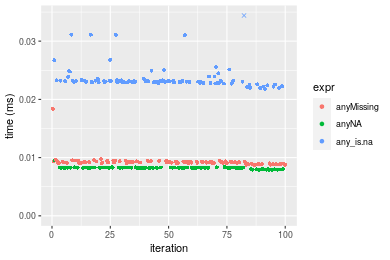
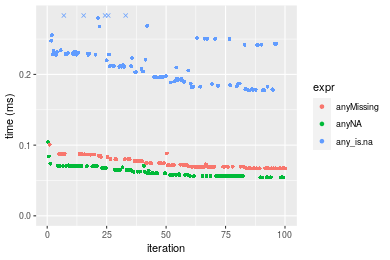

[matrixStats]: Benchmark report

---------------------------------------


# anyMissing() benchmarks

This report benchmark the performance of anyMissing() against alternative methods.

## Alternative methods

* anyNA()
* any() + is.na()

as below

```r
> any_is.na <- function(x) {
+     any(is.na(x))
+ }
```


## Data type "integer"
### Data
```r
> rvector <- function(n, mode = c("logical", "double", "integer"), range = c(-100, +100), na_prob = 0) {
+     mode <- match.arg(mode)
+     if (mode == "logical") {
+         x <- sample(c(FALSE, TRUE), size = n, replace = TRUE)
+     }     else {
+         x <- runif(n, min = range[1], max = range[2])
+     }
+     storage.mode(x) <- mode
+     if (na_prob > 0) 
+         x[sample(n, size = na_prob * n)] <- NA
+     x
+ }
> rvectors <- function(scale = 10, seed = 1, ...) {
+     set.seed(seed)
+     data <- list()
+     data[[1]] <- rvector(n = scale * 100, ...)
+     data[[2]] <- rvector(n = scale * 1000, ...)
+     data[[3]] <- rvector(n = scale * 10000, ...)
+     data[[4]] <- rvector(n = scale * 1e+05, ...)
+     data[[5]] <- rvector(n = scale * 1e+06, ...)
+     names(data) <- sprintf("n = %d", sapply(data, FUN = length))
+     data
+ }
> data <- rvectors(mode = mode)
```

### Results

### n = 1000 vector

```r
> x <- data[["n = 1000"]]
> gc()
           used  (Mb) gc trigger  (Mb) max used  (Mb)
Ncells  5163671 275.8    7916910 422.9  7916910 422.9
Vcells 36206829 276.3   64826470 494.6 53339345 407.0
> stats <- microbenchmark(anyMissing = anyMissing(x), anyNA = anyNA(x), any_is.na = any_is.na(x), unit = "ms")
```

_Table: Benchmarking of anyMissing(), anyNA() and any_is.na() on integer+n = 1000 data. The top panel shows times in milliseconds and the bottom panel shows relative times._


|   |expr       |      min|        lq|      mean|    median|        uq|      max|
|:--|:----------|--------:|---------:|---------:|---------:|---------:|--------:|
|2  |anyNA      | 0.000972| 0.0009930| 0.0010744| 0.0009990| 0.0010035| 0.008498|
|1  |anyMissing | 0.001612| 0.0016695| 0.0018263| 0.0017375| 0.0018010| 0.009970|
|3  |any_is.na  | 0.003324| 0.0034300| 0.0035909| 0.0035045| 0.0035825| 0.010350|


|   |expr       |      min|       lq|     mean|   median|       uq|      max|
|:--|:----------|--------:|--------:|--------:|--------:|--------:|--------:|
|2  |anyNA      | 1.000000| 1.000000| 1.000000| 1.000000| 1.000000| 1.000000|
|1  |anyMissing | 1.658436| 1.681269| 1.699766| 1.739239| 1.794719| 1.173217|
|3  |any_is.na  | 3.419753| 3.454179| 3.342126| 3.508008| 3.570005| 1.217934|

_Figure: Benchmarking of anyMissing(), anyNA() and any_is.na() on integer+n = 1000 data.  Outliers are displayed as crosses.  Times are in milliseconds._


### n = 10000 vector

```r
> x <- data[["n = 10000"]]
> gc()
           used  (Mb) gc trigger  (Mb) max used  (Mb)
Ncells  5148952 275.0    7916910 422.9  7916910 422.9
Vcells 14530232 110.9   51861176 395.7 53339345 407.0
> stats <- microbenchmark(anyMissing = anyMissing(x), anyNA = anyNA(x), any_is.na = any_is.na(x), unit = "ms")
```

_Table: Benchmarking of anyMissing(), anyNA() and any_is.na() on integer+n = 10000 data. The top panel shows times in milliseconds and the bottom panel shows relative times._


|   |expr       |      min|       lq|      mean|    median|       uq|      max|
|:--|:----------|--------:|--------:|---------:|---------:|--------:|--------:|
|2  |anyNA      | 0.007916| 0.008230| 0.0082227| 0.0082540| 0.008288| 0.009485|
|1  |anyMissing | 0.008685| 0.009058| 0.0092577| 0.0091685| 0.009296| 0.018353|
|3  |any_is.na  | 0.021791| 0.022941| 0.0236603| 0.0230715| 0.023256| 0.037433|


|   |expr       |      min|       lq|     mean|   median|       uq|      max|
|:--|:----------|--------:|--------:|--------:|--------:|--------:|--------:|
|2  |anyNA      | 1.000000| 1.000000| 1.000000| 1.000000| 1.000000| 1.000000|
|1  |anyMissing | 1.097145| 1.100607| 1.125864| 1.110795| 1.121622| 1.934950|
|3  |any_is.na  | 2.752779| 2.787485| 2.877425| 2.795190| 2.805985| 3.946547|

_Figure: Benchmarking of anyMissing(), anyNA() and any_is.na() on integer+n = 10000 data.  Outliers are displayed as crosses.  Times are in milliseconds._



### n = 100000 vector

```r
> x <- data[["n = 100000"]]
> gc()
           used  (Mb) gc trigger  (Mb) max used  (Mb)
Ncells  5149024 275.0    7916910 422.9  7916910 422.9
Vcells 14530792 110.9   51861176 395.7 53339345 407.0
> stats <- microbenchmark(anyMissing = anyMissing(x), anyNA = anyNA(x), any_is.na = any_is.na(x), unit = "ms")
```

_Table: Benchmarking of anyMissing(), anyNA() and any_is.na() on integer+n = 100000 data. The top panel shows times in milliseconds and the bottom panel shows relative times._


|   |expr       |      min|        lq|      mean|   median|        uq|      max|
|:--|:----------|--------:|---------:|---------:|--------:|---------:|--------:|
|1  |anyMissing | 0.061841| 0.0640520| 0.0681089| 0.066161| 0.0692500| 0.089427|
|2  |anyNA      | 0.061046| 0.0629745| 0.0685628| 0.067154| 0.0719905| 0.093012|
|3  |any_is.na  | 0.166982| 0.1773790| 0.1887365| 0.183707| 0.1999245| 0.232223|


|   |expr       |       min|        lq|     mean|   median|       uq|      max|
|:--|:----------|---------:|---------:|--------:|--------:|--------:|--------:|
|1  |anyMissing | 1.0000000| 1.0000000| 1.000000| 1.000000| 1.000000| 1.000000|
|2  |anyNA      | 0.9871445| 0.9831777| 1.006664| 1.015009| 1.039574| 1.040089|
|3  |any_is.na  | 2.7001827| 2.7692968| 2.771099| 2.776666| 2.886996| 2.596788|

_Figure: Benchmarking of anyMissing(), anyNA() and any_is.na() on integer+n = 100000 data.  Outliers are displayed as crosses.  Times are in milliseconds._


### n = 1000000 vector

```r
> x <- data[["n = 1000000"]]
> gc()
           used  (Mb) gc trigger  (Mb) max used  (Mb)
Ncells  5149096 275.0    7916910 422.9  7916910 422.9
Vcells 14530841 110.9   51861176 395.7 53339345 407.0
> stats <- microbenchmark(anyMissing = anyMissing(x), anyNA = anyNA(x), any_is.na = any_is.na(x), unit = "ms")
```

_Table: Benchmarking of anyMissing(), anyNA() and any_is.na() on integer+n = 1000000 data. The top panel shows times in milliseconds and the bottom panel shows relative times._


|   |expr       |      min|        lq|      mean|   median|        uq|       max|
|:--|:----------|--------:|---------:|---------:|--------:|---------:|---------:|
|1  |anyMissing | 0.515029| 0.5219540| 0.5792179| 0.553552| 0.5985170|  0.951800|
|2  |anyNA      | 0.514339| 0.5227355| 0.5769336| 0.561902| 0.6034585|  0.940549|
|3  |any_is.na  | 1.521723| 2.6115725| 2.6934416| 2.670834| 2.7072815| 16.097313|


|   |expr       |       min|       lq|      mean|   median|       uq|        max|
|:--|:----------|---------:|--------:|---------:|--------:|--------:|----------:|
|1  |anyMissing | 1.0000000| 1.000000| 1.0000000| 1.000000| 1.000000|  1.0000000|
|2  |anyNA      | 0.9986603| 1.001497| 0.9960563| 1.015084| 1.008256|  0.9881792|
|3  |any_is.na  | 2.9546356| 5.003453| 4.6501355| 4.824901| 4.523316| 16.9124953|

_Figure: Benchmarking of anyMissing(), anyNA() and any_is.na() on integer+n = 1000000 data.  Outliers are displayed as crosses.  Times are in milliseconds._


### n = 10000000 vector

```r
> x <- data[["n = 10000000"]]
> gc()
           used  (Mb) gc trigger  (Mb) max used  (Mb)
Ncells  5149168 275.0    7916910 422.9  7916910 422.9
Vcells 14530889 110.9   51861176 395.7 53339345 407.0
> stats <- microbenchmark(anyMissing = anyMissing(x), anyNA = anyNA(x), any_is.na = any_is.na(x), unit = "ms")
```

_Table: Benchmarking of anyMissing(), anyNA() and any_is.na() on integer+n = 10000000 data. The top panel shows times in milliseconds and the bottom panel shows relative times._


|   |expr       |       min|        lq|      mean|    median|        uq|       max|
|:--|:----------|---------:|---------:|---------:|---------:|---------:|---------:|
|1  |anyMissing |  5.848424|  5.865406|  6.048396|  5.882955|  6.068394|  8.021888|
|2  |anyNA      |  5.844971|  5.857822|  6.027307|  5.894444|  6.105414|  8.685206|
|3  |any_is.na  | 26.199254| 26.274106| 29.676210| 26.781044| 28.138399| 47.873792|


|   |expr       |       min|        lq|      mean|   median|       uq|      max|
|:--|:----------|---------:|---------:|---------:|--------:|--------:|--------:|
|1  |anyMissing | 1.0000000| 1.0000000| 1.0000000| 1.000000| 1.000000| 1.000000|
|2  |anyNA      | 0.9994096| 0.9987068| 0.9965133| 1.001953| 1.006100| 1.082688|
|3  |any_is.na  | 4.4797118| 4.4795031| 4.9064596| 4.552312| 4.636877| 5.967896|

_Figure: Benchmarking of anyMissing(), anyNA() and any_is.na() on integer+n = 10000000 data.  Outliers are displayed as crosses.  Times are in milliseconds._


## Data type "double"
### Data
```r
> rvector <- function(n, mode = c("logical", "double", "integer"), range = c(-100, +100), na_prob = 0) {
+     mode <- match.arg(mode)
+     if (mode == "logical") {
+         x <- sample(c(FALSE, TRUE), size = n, replace = TRUE)
+     }     else {
+         x <- runif(n, min = range[1], max = range[2])
+     }
+     storage.mode(x) <- mode
+     if (na_prob > 0) 
+         x[sample(n, size = na_prob * n)] <- NA
+     x
+ }
> rvectors <- function(scale = 10, seed = 1, ...) {
+     set.seed(seed)
+     data <- list()
+     data[[1]] <- rvector(n = scale * 100, ...)
+     data[[2]] <- rvector(n = scale * 1000, ...)
+     data[[3]] <- rvector(n = scale * 10000, ...)
+     data[[4]] <- rvector(n = scale * 1e+05, ...)
+     data[[5]] <- rvector(n = scale * 1e+06, ...)
+     names(data) <- sprintf("n = %d", sapply(data, FUN = length))
+     data
+ }
> data <- rvectors(mode = mode)
```

### Results

### n = 1000 vector

```r
> x <- data[["n = 1000"]]
> gc()
           used  (Mb) gc trigger  (Mb) max used  (Mb)
Ncells  5149249 275.0    7916910 422.9  7916910 422.9
Vcells 20086917 153.3   51861176 395.7 53339345 407.0
> stats <- microbenchmark(anyMissing = anyMissing(x), anyNA = anyNA(x), any_is.na = any_is.na(x), unit = "ms")
```

_Table: Benchmarking of anyMissing(), anyNA() and any_is.na() on double+n = 1000 data. The top panel shows times in milliseconds and the bottom panel shows relative times._


|   |expr       |      min|       lq|      mean|    median|       uq|      max|
|:--|:----------|--------:|--------:|---------:|---------:|--------:|--------:|
|2  |anyNA      | 0.000793| 0.000831| 0.0008824| 0.0008540| 0.000877| 0.003541|
|1  |anyMissing | 0.001611| 0.001701| 0.0018396| 0.0017520| 0.001788| 0.010478|
|3  |any_is.na  | 0.003313| 0.003404| 0.0035686| 0.0034675| 0.003555| 0.011881|


|   |expr       |      min|       lq|     mean|   median|       uq|      max|
|:--|:----------|--------:|--------:|--------:|--------:|--------:|--------:|
|2  |anyNA      | 1.000000| 1.000000| 1.000000| 1.000000| 1.000000| 1.000000|
|1  |anyMissing | 2.031526| 2.046931| 2.084802| 2.051522| 2.038769| 2.959051|
|3  |any_is.na  | 4.177806| 4.096270| 4.044141| 4.060304| 4.053592| 3.355267|

_Figure: Benchmarking of anyMissing(), anyNA() and any_is.na() on double+n = 1000 data.  Outliers are displayed as crosses.  Times are in milliseconds._


### n = 10000 vector

```r
> x <- data[["n = 10000"]]
> gc()
           used  (Mb) gc trigger  (Mb) max used  (Mb)
Ncells  5149312 275.1    7916910 422.9  7916910 422.9
Vcells 20086949 153.3   51861176 395.7 53339345 407.0
> stats <- microbenchmark(anyMissing = anyMissing(x), anyNA = anyNA(x), any_is.na = any_is.na(x), unit = "ms")
```

_Table: Benchmarking of anyMissing(), anyNA() and any_is.na() on double+n = 10000 data. The top panel shows times in milliseconds and the bottom panel shows relative times._


|   |expr       |      min|        lq|      mean|    median|        uq|      max|
|:--|:----------|--------:|---------:|---------:|---------:|---------:|--------:|
|2  |anyNA      | 0.006867| 0.0069195| 0.0069878| 0.0069675| 0.0070210| 0.008277|
|1  |anyMissing | 0.009443| 0.0095595| 0.0098173| 0.0096610| 0.0098070| 0.023121|
|3  |any_is.na  | 0.023518| 0.0238790| 0.0249262| 0.0240365| 0.0243365| 0.032825|


|   |expr       |      min|       lq|     mean|   median|       uq|      max|
|:--|:----------|--------:|--------:|--------:|--------:|--------:|--------:|
|2  |anyNA      | 1.000000| 1.000000| 1.000000| 1.000000| 1.000000| 1.000000|
|1  |anyMissing | 1.375127| 1.381530| 1.404934| 1.386581| 1.396810| 2.793403|
|3  |any_is.na  | 3.424785| 3.450972| 3.567128| 3.449803| 3.466244| 3.965809|

_Figure: Benchmarking of anyMissing(), anyNA() and any_is.na() on double+n = 10000 data.  Outliers are displayed as crosses.  Times are in milliseconds._


### n = 100000 vector

```r
> x <- data[["n = 100000"]]
> gc()
           used  (Mb) gc trigger  (Mb) max used  (Mb)
Ncells  5149384 275.1    7916910 422.9  7916910 422.9
Vcells 20087301 153.3   51861176 395.7 53339345 407.0
> stats <- microbenchmark(anyMissing = anyMissing(x), anyNA = anyNA(x), any_is.na = any_is.na(x), unit = "ms")
```

_Table: Benchmarking of anyMissing(), anyNA() and any_is.na() on double+n = 100000 data. The top panel shows times in milliseconds and the bottom panel shows relative times._


|   |expr       |      min|        lq|      mean|    median|        uq|      max|
|:--|:----------|--------:|---------:|---------:|---------:|---------:|--------:|
|2  |anyNA      | 0.054290| 0.0562365| 0.0626705| 0.0603040| 0.0699925| 0.104676|
|1  |anyMissing | 0.066935| 0.0674195| 0.0741177| 0.0696535| 0.0801185| 0.100784|
|3  |any_is.na  | 0.177212| 0.1890785| 0.2157648| 0.2116110| 0.2306565| 0.315970|


|   |expr       |      min|       lq|     mean|   median|       uq|       max|
|:--|:----------|--------:|--------:|--------:|--------:|--------:|---------:|
|2  |anyNA      | 1.000000| 1.000000| 1.000000| 1.000000| 1.000000| 1.0000000|
|1  |anyMissing | 1.232916| 1.198857| 1.182657| 1.155039| 1.144673| 0.9628186|
|3  |any_is.na  | 3.264174| 3.362202| 3.442843| 3.509071| 3.295446| 3.0185525|

_Figure: Benchmarking of anyMissing(), anyNA() and any_is.na() on double+n = 100000 data.  Outliers are displayed as crosses.  Times are in milliseconds._



### n = 1000000 vector

```r
> x <- data[["n = 1000000"]]
> gc()
           used  (Mb) gc trigger  (Mb) max used  (Mb)
Ncells  5149456 275.1    7916910 422.9  7916910 422.9
Vcells 20087711 153.3   51861176 395.7 53339345 407.0
> stats <- microbenchmark(anyMissing = anyMissing(x), anyNA = anyNA(x), any_is.na = any_is.na(x), unit = "ms")
```

_Table: Benchmarking of anyMissing(), anyNA() and any_is.na() on double+n = 1000000 data. The top panel shows times in milliseconds and the bottom panel shows relative times._


|   |expr       |      min|        lq|      mean|    median|        uq|        max|
|:--|:----------|--------:|---------:|---------:|---------:|---------:|----------:|
|2  |anyNA      | 0.503375| 0.6143685| 0.6559521| 0.6444355| 0.6954275|   1.006697|
|1  |anyMissing | 0.596418| 0.6815280| 0.7438912| 0.7286160| 0.7760745|   1.093139|
|3  |any_is.na  | 1.996976| 2.7094350| 6.3041081| 2.8472080| 3.0822495| 345.290288|


|   |expr       |      min|       lq|     mean|   median|       uq|        max|
|:--|:----------|--------:|--------:|--------:|--------:|--------:|----------:|
|2  |anyNA      | 1.000000| 1.000000| 1.000000| 1.000000| 1.000000|   1.000000|
|1  |anyMissing | 1.184838| 1.109315| 1.134063| 1.130627| 1.115968|   1.085867|
|3  |any_is.na  | 3.967174| 4.410114| 9.610623| 4.418143| 4.432165| 342.993262|

_Figure: Benchmarking of anyMissing(), anyNA() and any_is.na() on double+n = 1000000 data.  Outliers are displayed as crosses.  Times are in milliseconds._


### n = 10000000 vector

```r
> x <- data[["n = 10000000"]]
> gc()
           used  (Mb) gc trigger  (Mb) max used  (Mb)
Ncells  5149528 275.1    7916910 422.9  7916910 422.9
Vcells 20087759 153.3   51861176 395.7 53339345 407.0
> stats <- microbenchmark(anyMissing = anyMissing(x), anyNA = anyNA(x), any_is.na = any_is.na(x), unit = "ms")
```

_Table: Benchmarking of anyMissing(), anyNA() and any_is.na() on double+n = 10000000 data. The top panel shows times in milliseconds and the bottom panel shows relative times._


|   |expr       |       min|        lq|      mean|    median|        uq|       max|
|:--|:----------|---------:|---------:|---------:|---------:|---------:|---------:|
|2  |anyNA      |  6.393673|  6.873240|  7.116991|  7.101120|  7.292291|  9.152997|
|1  |anyMissing |  7.086472|  7.780927|  7.996667|  8.033691|  8.175902|  9.866361|
|3  |any_is.na  | 27.671734| 29.550325| 33.280614| 30.928559| 32.484887| 53.175226|


|   |expr       |      min|       lq|     mean|   median|       uq|      max|
|:--|:----------|--------:|--------:|--------:|--------:|--------:|--------:|
|2  |anyNA      | 1.000000| 1.000000| 1.000000| 1.000000| 1.000000| 1.000000|
|1  |anyMissing | 1.108357| 1.132061| 1.123602| 1.131327| 1.121171| 1.077938|
|3  |any_is.na  | 4.327987| 4.299330| 4.676220| 4.355448| 4.454689| 5.809597|

_Figure: Benchmarking of anyMissing(), anyNA() and any_is.na() on double+n = 10000000 data.  Outliers are displayed as crosses.  Times are in milliseconds._


## Appendix

### Session information
```r
R version 4.1.1 Patched (2021-08-10 r80727)
Platform: x86_64-pc-linux-gnu (64-bit)
Running under: Ubuntu 18.04.5 LTS

Matrix products: default
BLAS:   /home/hb/software/R-devel/R-4-1-branch/lib/R/lib/libRblas.so
LAPACK: /home/hb/software/R-devel/R-4-1-branch/lib/R/lib/libRlapack.so

locale:
 [1] LC_CTYPE=en_US.UTF-8       LC_NUMERIC=C              
 [3] LC_TIME=en_US.UTF-8        LC_COLLATE=en_US.UTF-8    
 [5] LC_MONETARY=en_US.UTF-8    LC_MESSAGES=en_US.UTF-8   
 [7] LC_PAPER=en_US.UTF-8       LC_NAME=C                 
 [9] LC_ADDRESS=C               LC_TELEPHONE=C            
[11] LC_MEASUREMENT=en_US.UTF-8 LC_IDENTIFICATION=C       

attached base packages:
[1] stats     graphics  grDevices utils     datasets  methods   base     

other attached packages:
[1] microbenchmark_1.4-7   matrixStats_0.60.0     ggplot2_3.3.5         
[4] knitr_1.33             R.devices_2.17.0       R.utils_2.10.1        
[7] R.oo_1.24.0            R.methodsS3_1.8.1-9001 history_0.0.1-9000    

loaded via a namespace (and not attached):
 [1] Biobase_2.52.0          httr_1.4.2              splines_4.1.1          
 [4] bit64_4.0.5             network_1.17.1          assertthat_0.2.1       
 [7] highr_0.9               stats4_4.1.1            blob_1.2.2             
[10] GenomeInfoDbData_1.2.6  robustbase_0.93-8       pillar_1.6.2           
[13] RSQLite_2.2.8           lattice_0.20-44         glue_1.4.2             
[16] digest_0.6.27           XVector_0.32.0          colorspace_2.0-2       
[19] Matrix_1.3-4            XML_3.99-0.7            pkgconfig_2.0.3        
[22] zlibbioc_1.38.0         genefilter_1.74.0       purrr_0.3.4            
[25] ergm_4.1.2              xtable_1.8-4            scales_1.1.1           
[28] tibble_3.1.4            annotate_1.70.0         KEGGREST_1.32.0        
[31] farver_2.1.0            generics_0.1.0          IRanges_2.26.0         
[34] ellipsis_0.3.2          cachem_1.0.6            withr_2.4.2            
[37] BiocGenerics_0.38.0     mime_0.11               survival_3.2-13        
[40] magrittr_2.0.1          crayon_1.4.1            statnet.common_4.5.0   
[43] memoise_2.0.0           laeken_0.5.1            fansi_0.5.0            
[46] R.cache_0.15.0          MASS_7.3-54             R.rsp_0.44.0           
[49] progressr_0.8.0         tools_4.1.1             lifecycle_1.0.0        
[52] S4Vectors_0.30.0        trust_0.1-8             munsell_0.5.0          
[55] tabby_0.0.1-9001        AnnotationDbi_1.54.1    Biostrings_2.60.2      
[58] compiler_4.1.1          GenomeInfoDb_1.28.1     rlang_0.4.11           
[61] grid_4.1.1              RCurl_1.98-1.4          cwhmisc_6.6            
[64] rstudioapi_0.13         rappdirs_0.3.3          startup_0.15.0         
[67] labeling_0.4.2          bitops_1.0-7            base64enc_0.1-3        
[70] boot_1.3-28             gtable_0.3.0            DBI_1.1.1              
[73] markdown_1.1            R6_2.5.1                lpSolveAPI_5.5.2.0-17.7
[76] rle_0.9.2               dplyr_1.0.7             fastmap_1.1.0          
[79] bit_4.0.4               utf8_1.2.2              parallel_4.1.1         
[82] Rcpp_1.0.7              vctrs_0.3.8             png_0.1-7              
[85] DEoptimR_1.0-9          tidyselect_1.1.1        xfun_0.25              
[88] coda_0.19-4            
```
Total processing time was 19.11 secs.


### Reproducibility
To reproduce this report, do:
```r
html <- matrixStats:::benchmark('anyMissing')
```

[RSP]: https://cran.r-project.org/package=R.rsp
[matrixStats]: https://cran.r-project.org/package=matrixStats

[StackOverflow:colMins?]: https://stackoverflow.com/questions/13676878 "Stack Overflow: fastest way to get Min from every column in a matrix?"
[StackOverflow:colSds?]: https://stackoverflow.com/questions/17549762 "Stack Overflow: Is there such 'colsd' in R?"
[StackOverflow:rowProds?]: https://stackoverflow.com/questions/20198801/ "Stack Overflow: Row product of matrix and column sum of matrix"

---------------------------------------
Copyright Henrik Bengtsson. Last updated on 2021-08-25 22:09:06 (+0200 UTC). Powered by [RSP].

<script>
 var link = document.createElement('link');
 link.rel = 'icon';
 link.href = "data:image/png;base64,iVBORw0KGgoAAAANSUhEUgAAACAAAAAgCAMAAABEpIrGAAAA21BMVEUAAAAAAP8AAP8AAP8AAP8AAP8AAP8AAP8AAP8AAP8AAP8AAP8AAP8AAP8AAP8AAP8AAP8AAP8AAP8AAP8AAP8AAP8AAP8AAP8AAP8AAP8AAP8AAP8AAP8AAP8AAP8AAP8AAP8AAP8AAP8AAP8AAP8AAP8AAP8AAP8AAP8AAP8BAf4CAv0DA/wdHeIeHuEfH+AgIN8hId4lJdomJtknJ9g+PsE/P8BAQL9yco10dIt1dYp3d4h4eIeVlWqWlmmXl2iYmGeZmWabm2Tn5xjo6Bfp6Rb39wj4+Af//wA2M9hbAAAASXRSTlMAAQIJCgsMJSYnKD4/QGRlZmhpamtsbautrrCxuru8y8zN5ebn6Pn6+///////////////////////////////////////////LsUNcQAAAS9JREFUOI29k21XgkAQhVcFytdSMqMETU26UVqGmpaiFbL//xc1cAhhwVNf6n5i5z67M2dmYOyfJZUqlVLhkKucG7cgmUZTybDz6g0iDeq51PUr37Ds2cy2/C9NeES5puDjxuUk1xnToZsg8pfA3avHQ3lLIi7iWRrkv/OYtkScxBIMgDee0ALoyxHQBJ68JLCjOtQIMIANF7QG9G9fNnHvisCHBVMKgSJgiz7nE+AoBKrAPA3MgepvgR9TSCasrCKH0eB1wBGBFdCO+nAGjMVGPcQb5bd6mQRegN6+1axOs9nGfYcCtfi4NQosdtH7dB+txFIpXQqN1p9B/asRHToyS0jRgpV7nk4nwcq1BJ+x3Gl/v7S9Wmpp/aGquum7w3ZDyrADFYrl8vHBH+ev9AUASW1dmU4h4wAAAABJRU5ErkJggg=="
 document.getElementsByTagName('head')[0].appendChild(link);
</script>


