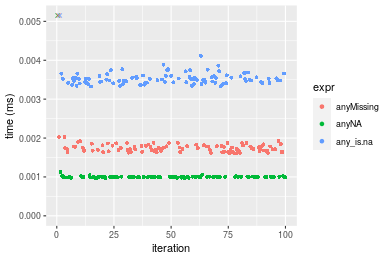
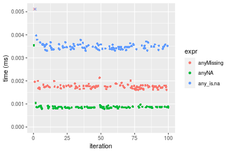

[matrixStats]: Benchmark report

---------------------------------------


# anyMissing() benchmarks

This report benchmark the performance of anyMissing() against alternative methods.

## Alternative methods

* anyNA()
* any() + is.na()

as below

```r
> any_is.na <- function(x) {
+     any(is.na(x))
+ }
```


## Data type "integer"
### Data
```r
> rvector <- function(n, mode = c("logical", "double", "integer"), range = c(-100, +100), na_prob = 0) {
+     mode <- match.arg(mode)
+     if (mode == "logical") {
+         x <- sample(c(FALSE, TRUE), size = n, replace = TRUE)
+     }     else {
+         x <- runif(n, min = range[1], max = range[2])
+     }
+     storage.mode(x) <- mode
+     if (na_prob > 0) 
+         x[sample(n, size = na_prob * n)] <- NA
+     x
+ }
> rvectors <- function(scale = 10, seed = 1, ...) {
+     set.seed(seed)
+     data <- list()
+     data[[1]] <- rvector(n = scale * 100, ...)
+     data[[2]] <- rvector(n = scale * 1000, ...)
+     data[[3]] <- rvector(n = scale * 10000, ...)
+     data[[4]] <- rvector(n = scale * 1e+05, ...)
+     data[[5]] <- rvector(n = scale * 1e+06, ...)
+     names(data) <- sprintf("n = %d", sapply(data, FUN = length))
+     data
+ }
> data <- rvectors(mode = mode)
```

### Results

### n = 1000 vector

```r
> x <- data[["n = 1000"]]
> gc()
           used  (Mb) gc trigger  (Mb) max used  (Mb)
Ncells  5141016 274.6    7554717 403.5  7554717 403.5
Vcells 36079187 275.3   62096248 473.8 60508962 461.7
> stats <- microbenchmark(anyMissing = anyMissing(x), anyNA = anyNA(x), any_is.na = any_is.na(x), unit = "ms")
```

_Table: Benchmarking of anyMissing(), anyNA() and any_is.na() on integer+n = 1000 data. The top panel shows times in milliseconds and the bottom panel shows relative times._


|   |expr       |      min|        lq|      mean|    median|        uq|      max|
|:--|:----------|--------:|---------:|---------:|---------:|---------:|--------:|
|2  |anyNA      | 0.000932| 0.0009525| 0.0010318| 0.0009590| 0.0009630| 0.007838|
|1  |anyMissing | 0.001580| 0.0016495| 0.0018018| 0.0017275| 0.0017710| 0.009327|
|3  |any_is.na  | 0.003187| 0.0032840| 0.0034622| 0.0033505| 0.0034375| 0.010593|


|   |expr       |      min|       lq|     mean|   median|       uq|      max|
|:--|:----------|--------:|--------:|--------:|--------:|--------:|--------:|
|2  |anyNA      | 1.000000| 1.000000| 1.000000| 1.000000| 1.000000| 1.000000|
|1  |anyMissing | 1.695279| 1.731758| 1.746252| 1.801356| 1.839045| 1.189972|
|3  |any_is.na  | 3.419528| 3.447769| 3.355463| 3.493743| 3.569574| 1.351493|

_Figure: Benchmarking of anyMissing(), anyNA() and any_is.na() on integer+n = 1000 data.  Outliers are displayed as crosses.  Times are in milliseconds._



### n = 10000 vector

```r
> x <- data[["n = 10000"]]
> gc()
           used  (Mb) gc trigger  (Mb) max used  (Mb)
Ncells  5138697 274.5    7554717 403.5  7554717 403.5
Vcells 14462896 110.4   49676999 379.1 60508962 461.7
> stats <- microbenchmark(anyMissing = anyMissing(x), anyNA = anyNA(x), any_is.na = any_is.na(x), unit = "ms")
```

_Table: Benchmarking of anyMissing(), anyNA() and any_is.na() on integer+n = 10000 data. The top panel shows times in milliseconds and the bottom panel shows relative times._


|   |expr       |      min|        lq|      mean|    median|        uq|      max|
|:--|:----------|--------:|---------:|---------:|---------:|---------:|--------:|
|2  |anyNA      | 0.008215| 0.0082560| 0.0084587| 0.0083575| 0.0086220| 0.009859|
|1  |anyMissing | 0.009090| 0.0093215| 0.0096898| 0.0095680| 0.0098200| 0.019653|
|3  |any_is.na  | 0.022686| 0.0230555| 0.0241736| 0.0237540| 0.0240565| 0.043329|


|   |expr       |      min|       lq|     mean|   median|       uq|      max|
|:--|:----------|--------:|--------:|--------:|--------:|--------:|--------:|
|2  |anyNA      | 1.000000| 1.000000| 1.000000| 1.000000| 1.000000| 1.000000|
|1  |anyMissing | 1.106513| 1.129058| 1.145540| 1.144840| 1.138947| 1.993407|
|3  |any_is.na  | 2.761534| 2.792575| 2.857825| 2.842237| 2.790130| 4.394868|

_Figure: Benchmarking of anyMissing(), anyNA() and any_is.na() on integer+n = 10000 data.  Outliers are displayed as crosses.  Times are in milliseconds._


### n = 100000 vector

```r
> x <- data[["n = 100000"]]
> gc()
           used  (Mb) gc trigger  (Mb) max used  (Mb)
Ncells  5138769 274.5    7554717 403.5  7554717 403.5
Vcells 14463456 110.4   49676999 379.1 60508962 461.7
> stats <- microbenchmark(anyMissing = anyMissing(x), anyNA = anyNA(x), any_is.na = any_is.na(x), unit = "ms")
```

_Table: Benchmarking of anyMissing(), anyNA() and any_is.na() on integer+n = 100000 data. The top panel shows times in milliseconds and the bottom panel shows relative times._


|   |expr       |      min|        lq|      mean|    median|        uq|      max|
|:--|:----------|--------:|---------:|---------:|---------:|---------:|--------:|
|1  |anyMissing | 0.066023| 0.0666535| 0.0702758| 0.0686415| 0.0710525| 0.093471|
|2  |anyNA      | 0.064970| 0.0671620| 0.0708709| 0.0694480| 0.0746080| 0.095391|
|3  |any_is.na  | 0.178035| 0.1838700| 0.1950726| 0.1897075| 0.2040080| 0.239236|


|   |expr       |      min|       lq|     mean|   median|       uq|      max|
|:--|:----------|--------:|--------:|--------:|--------:|--------:|--------:|
|1  |anyMissing | 1.000000| 1.000000| 1.000000| 1.000000| 1.000000| 1.000000|
|2  |anyNA      | 0.984051| 1.007629| 1.008469| 1.011750| 1.050040| 1.020541|
|3  |any_is.na  | 2.696560| 2.758595| 2.775816| 2.763743| 2.871229| 2.559468|

_Figure: Benchmarking of anyMissing(), anyNA() and any_is.na() on integer+n = 100000 data.  Outliers are displayed as crosses.  Times are in milliseconds._


### n = 1000000 vector

```r
> x <- data[["n = 1000000"]]
> gc()
           used  (Mb) gc trigger  (Mb) max used  (Mb)
Ncells  5138841 274.5    7554717 403.5  7554717 403.5
Vcells 14463505 110.4   49676999 379.1 60508962 461.7
> stats <- microbenchmark(anyMissing = anyMissing(x), anyNA = anyNA(x), any_is.na = any_is.na(x), unit = "ms")
```

_Table: Benchmarking of anyMissing(), anyNA() and any_is.na() on integer+n = 1000000 data. The top panel shows times in milliseconds and the bottom panel shows relative times._


|   |expr       |      min|       lq|      mean|    median|        uq|       max|
|:--|:----------|--------:|--------:|---------:|---------:|---------:|---------:|
|2  |anyNA      | 0.514275| 0.518547| 0.5642649| 0.5440435| 0.5807950|  0.924993|
|1  |anyMissing | 0.515185| 0.518091| 0.5692186| 0.5444945| 0.5859165|  0.937705|
|3  |any_is.na  | 1.465245| 1.928379| 2.5035786| 2.6341605| 2.6686555| 15.123326|


|   |expr       |      min|        lq|     mean|   median|       uq|       max|
|:--|:----------|--------:|---------:|--------:|--------:|--------:|---------:|
|2  |anyNA      | 1.000000| 1.0000000| 1.000000| 1.000000| 1.000000|  1.000000|
|1  |anyMissing | 1.001769| 0.9991206| 1.008779| 1.000829| 1.008818|  1.013743|
|3  |any_is.na  | 2.849147| 3.7188124| 4.436885| 4.841820| 4.594832| 16.349665|

_Figure: Benchmarking of anyMissing(), anyNA() and any_is.na() on integer+n = 1000000 data.  Outliers are displayed as crosses.  Times are in milliseconds._


### n = 10000000 vector

```r
> x <- data[["n = 10000000"]]
> gc()
           used  (Mb) gc trigger  (Mb) max used  (Mb)
Ncells  5138913 274.5    7554717 403.5  7554717 403.5
Vcells 14463553 110.4   49676999 379.1 60508962 461.7
> stats <- microbenchmark(anyMissing = anyMissing(x), anyNA = anyNA(x), any_is.na = any_is.na(x), unit = "ms")
```

_Table: Benchmarking of anyMissing(), anyNA() and any_is.na() on integer+n = 10000000 data. The top panel shows times in milliseconds and the bottom panel shows relative times._


|   |expr       |       min|        lq|      mean|    median|        uq|       max|
|:--|:----------|---------:|---------:|---------:|---------:|---------:|---------:|
|2  |anyNA      |  5.842845|  5.855958|  5.982816|  5.863521|  5.981532|  8.801755|
|1  |anyMissing |  5.843110|  5.862911|  5.982810|  5.876239|  6.008984|  8.159616|
|3  |any_is.na  | 26.119474| 26.397007| 29.512692| 26.430464| 27.458759| 46.960310|


|   |expr       |      min|       lq|     mean|   median|      uq|       max|
|:--|:----------|--------:|--------:|--------:|--------:|-------:|---------:|
|2  |anyNA      | 1.000000| 1.000000| 1.000000| 1.000000| 1.00000| 1.0000000|
|1  |anyMissing | 1.000045| 1.001187| 0.999999| 1.002169| 1.00459| 0.9270442|
|3  |any_is.na  | 4.470335| 4.507718| 4.932910| 4.507610| 4.59059| 5.3353348|

_Figure: Benchmarking of anyMissing(), anyNA() and any_is.na() on integer+n = 10000000 data.  Outliers are displayed as crosses.  Times are in milliseconds._


## Data type "double"
### Data
```r
> rvector <- function(n, mode = c("logical", "double", "integer"), range = c(-100, +100), na_prob = 0) {
+     mode <- match.arg(mode)
+     if (mode == "logical") {
+         x <- sample(c(FALSE, TRUE), size = n, replace = TRUE)
+     }     else {
+         x <- runif(n, min = range[1], max = range[2])
+     }
+     storage.mode(x) <- mode
+     if (na_prob > 0) 
+         x[sample(n, size = na_prob * n)] <- NA
+     x
+ }
> rvectors <- function(scale = 10, seed = 1, ...) {
+     set.seed(seed)
+     data <- list()
+     data[[1]] <- rvector(n = scale * 100, ...)
+     data[[2]] <- rvector(n = scale * 1000, ...)
+     data[[3]] <- rvector(n = scale * 10000, ...)
+     data[[4]] <- rvector(n = scale * 1e+05, ...)
+     data[[5]] <- rvector(n = scale * 1e+06, ...)
+     names(data) <- sprintf("n = %d", sapply(data, FUN = length))
+     data
+ }
> data <- rvectors(mode = mode)
```

### Results

### n = 1000 vector

```r
> x <- data[["n = 1000"]]
> gc()
           used  (Mb) gc trigger  (Mb) max used  (Mb)
Ncells  5138994 274.5    7554717 403.5  7554717 403.5
Vcells 20019582 152.8   49676999 379.1 60508962 461.7
> stats <- microbenchmark(anyMissing = anyMissing(x), anyNA = anyNA(x), any_is.na = any_is.na(x), unit = "ms")
```

_Table: Benchmarking of anyMissing(), anyNA() and any_is.na() on double+n = 1000 data. The top panel shows times in milliseconds and the bottom panel shows relative times._


|   |expr       |      min|        lq|      mean|    median|        uq|      max|
|:--|:----------|--------:|---------:|---------:|---------:|---------:|--------:|
|2  |anyNA      | 0.000761| 0.0007945| 0.0008405| 0.0008090| 0.0008280| 0.003556|
|1  |anyMissing | 0.001584| 0.0016880| 0.0019895| 0.0017640| 0.0018250| 0.024104|
|3  |any_is.na  | 0.003185| 0.0032950| 0.0034871| 0.0033695| 0.0034585| 0.011913|


|   |expr       |      min|       lq|     mean|   median|       uq|      max|
|:--|:----------|--------:|--------:|--------:|--------:|--------:|--------:|
|2  |anyNA      | 1.000000| 1.000000| 1.000000| 1.000000| 1.000000| 1.000000|
|1  |anyMissing | 2.081472| 2.124607| 2.367091| 2.180470| 2.204106| 6.778403|
|3  |any_is.na  | 4.185282| 4.147262| 4.148888| 4.165019| 4.176932| 3.350112|

_Figure: Benchmarking of anyMissing(), anyNA() and any_is.na() on double+n = 1000 data.  Outliers are displayed as crosses.  Times are in milliseconds._



### n = 10000 vector

```r
> x <- data[["n = 10000"]]
> gc()
           used  (Mb) gc trigger  (Mb) max used  (Mb)
Ncells  5139057 274.5    7554717 403.5  7554717 403.5
Vcells 20019614 152.8   49676999 379.1 60508962 461.7
> stats <- microbenchmark(anyMissing = anyMissing(x), anyNA = anyNA(x), any_is.na = any_is.na(x), unit = "ms")
```

_Table: Benchmarking of anyMissing(), anyNA() and any_is.na() on double+n = 10000 data. The top panel shows times in milliseconds and the bottom panel shows relative times._


|   |expr       |      min|        lq|      mean|   median|       uq|      max|
|:--|:----------|--------:|---------:|---------:|--------:|--------:|--------:|
|2  |anyNA      | 0.006334| 0.0064525| 0.0065983| 0.006557| 0.006728| 0.008134|
|1  |anyMissing | 0.008783| 0.0089710| 0.0093156| 0.009184| 0.009462| 0.019927|
|3  |any_is.na  | 0.021782| 0.0221210| 0.0237176| 0.022804| 0.023314| 0.041985|


|   |expr       |      min|       lq|     mean|  median|       uq|      max|
|:--|:----------|--------:|--------:|--------:|-------:|--------:|--------:|
|2  |anyNA      | 1.000000| 1.000000| 1.000000| 1.00000| 1.000000| 1.000000|
|1  |anyMissing | 1.386643| 1.390314| 1.411820| 1.40064| 1.406362| 2.449840|
|3  |any_is.na  | 3.438901| 3.428284| 3.594515| 3.47781| 3.465220| 5.161667|

_Figure: Benchmarking of anyMissing(), anyNA() and any_is.na() on double+n = 10000 data.  Outliers are displayed as crosses.  Times are in milliseconds._


### n = 100000 vector

```r
> x <- data[["n = 100000"]]
> gc()
           used  (Mb) gc trigger  (Mb) max used  (Mb)
Ncells  5139129 274.5    7554717 403.5  7554717 403.5
Vcells 20019964 152.8   49676999 379.1 60508962 461.7
> stats <- microbenchmark(anyMissing = anyMissing(x), anyNA = anyNA(x), any_is.na = any_is.na(x), unit = "ms")
```

_Table: Benchmarking of anyMissing(), anyNA() and any_is.na() on double+n = 100000 data. The top panel shows times in milliseconds and the bottom panel shows relative times._


|   |expr       |      min|        lq|      mean|   median|        uq|      max|
|:--|:----------|--------:|---------:|---------:|--------:|---------:|--------:|
|2  |anyNA      | 0.049606| 0.0528705| 0.0581679| 0.056372| 0.0624215| 0.099473|
|1  |anyMissing | 0.061199| 0.0653640| 0.0695352| 0.067544| 0.0725370| 0.091714|
|3  |any_is.na  | 0.164416| 0.1783195| 0.2011054| 0.191613| 0.2199450| 0.289780|


|   |expr       |      min|       lq|     mean|   median|       uq|       max|
|:--|:----------|--------:|--------:|--------:|--------:|--------:|---------:|
|2  |anyNA      | 1.000000| 1.000000| 1.000000| 1.000000| 1.000000| 1.0000000|
|1  |anyMissing | 1.233702| 1.236304| 1.195423| 1.198184| 1.162052| 0.9219989|
|3  |any_is.na  | 3.314438| 3.372760| 3.457326| 3.399081| 3.523546| 2.9131523|

_Figure: Benchmarking of anyMissing(), anyNA() and any_is.na() on double+n = 100000 data.  Outliers are displayed as crosses.  Times are in milliseconds._


### n = 1000000 vector

```r
> x <- data[["n = 1000000"]]
> gc()
           used  (Mb) gc trigger  (Mb) max used  (Mb)
Ncells  5139201 274.5    7554717 403.5  7554717 403.5
Vcells 20020373 152.8   49676999 379.1 60508962 461.7
> stats <- microbenchmark(anyMissing = anyMissing(x), anyNA = anyNA(x), any_is.na = any_is.na(x), unit = "ms")
```

_Table: Benchmarking of anyMissing(), anyNA() and any_is.na() on double+n = 1000000 data. The top panel shows times in milliseconds and the bottom panel shows relative times._


|   |expr       |      min|        lq|      mean|    median|        uq|       max|
|:--|:----------|--------:|---------:|---------:|---------:|---------:|---------:|
|2  |anyNA      | 0.487668| 0.5512765| 0.6011896| 0.5987780| 0.6290655|  0.957132|
|1  |anyMissing | 0.575719| 0.6167405| 0.6780884| 0.6690375| 0.6963880|  1.035305|
|3  |any_is.na  | 1.681125| 2.0274250| 2.6076032| 2.7228080| 2.7617915| 13.714425|


|   |expr       |      min|       lq|     mean|   median|       uq|       max|
|:--|:----------|--------:|--------:|--------:|--------:|--------:|---------:|
|2  |anyNA      | 1.000000| 1.000000| 1.000000| 1.000000| 1.000000|  1.000000|
|1  |anyMissing | 1.180555| 1.118750| 1.127911| 1.117338| 1.107020|  1.081674|
|3  |any_is.na  | 3.447274| 3.677692| 4.337406| 4.547275| 4.390308| 14.328666|

_Figure: Benchmarking of anyMissing(), anyNA() and any_is.na() on double+n = 1000000 data.  Outliers are displayed as crosses.  Times are in milliseconds._


### n = 10000000 vector

```r
> x <- data[["n = 10000000"]]
> gc()
           used  (Mb) gc trigger  (Mb) max used  (Mb)
Ncells  5139273 274.5    7554717 403.5  7554717 403.5
Vcells 20020421 152.8   49676999 379.1 60508962 461.7
> stats <- microbenchmark(anyMissing = anyMissing(x), anyNA = anyNA(x), any_is.na = any_is.na(x), unit = "ms")
```

_Table: Benchmarking of anyMissing(), anyNA() and any_is.na() on double+n = 10000000 data. The top panel shows times in milliseconds and the bottom panel shows relative times._


|   |expr       |       min|        lq|      mean|    median|        uq|       max|
|:--|:----------|---------:|---------:|---------:|---------:|---------:|---------:|
|2  |anyNA      |  6.323672|  6.575435|  6.830069|  6.841031|  7.022868|  8.268138|
|1  |anyMissing |  6.862550|  7.352603|  7.600620|  7.656812|  7.870972|  8.502758|
|3  |any_is.na  | 27.025922| 28.323738| 32.071603| 29.361263| 30.960706| 46.329896|


|   |expr       |      min|       lq|     mean|   median|       uq|      max|
|:--|:----------|--------:|--------:|--------:|--------:|--------:|--------:|
|2  |anyNA      | 1.000000| 1.000000| 1.000000| 1.000000| 1.000000| 1.000000|
|1  |anyMissing | 1.085216| 1.118193| 1.112818| 1.119248| 1.120763| 1.028376|
|3  |any_is.na  | 4.273770| 4.307508| 4.695648| 4.291935| 4.408556| 5.603426|

_Figure: Benchmarking of anyMissing(), anyNA() and any_is.na() on double+n = 10000000 data.  Outliers are displayed as crosses.  Times are in milliseconds._


## Appendix

### Session information
```r
R version 4.1.1 Patched (2021-08-10 r80727)
Platform: x86_64-pc-linux-gnu (64-bit)
Running under: Ubuntu 18.04.5 LTS

Matrix products: default
BLAS:   /home/hb/software/R-devel/R-4-1-branch/lib/R/lib/libRblas.so
LAPACK: /home/hb/software/R-devel/R-4-1-branch/lib/R/lib/libRlapack.so

locale:
 [1] LC_CTYPE=en_US.UTF-8       LC_NUMERIC=C              
 [3] LC_TIME=en_US.UTF-8        LC_COLLATE=en_US.UTF-8    
 [5] LC_MONETARY=en_US.UTF-8    LC_MESSAGES=en_US.UTF-8   
 [7] LC_PAPER=en_US.UTF-8       LC_NAME=C                 
 [9] LC_ADDRESS=C               LC_TELEPHONE=C            
[11] LC_MEASUREMENT=en_US.UTF-8 LC_IDENTIFICATION=C       

attached base packages:
[1] stats     graphics  grDevices utils     datasets  methods   base     

other attached packages:
[1] microbenchmark_1.4-7   matrixStats_0.60.0     ggplot2_3.3.5         
[4] knitr_1.33             R.devices_2.17.0       R.utils_2.10.1        
[7] R.oo_1.24.0            R.methodsS3_1.8.1-9001

loaded via a namespace (and not attached):
 [1] Biobase_2.52.0          httr_1.4.2              splines_4.1.1          
 [4] bit64_4.0.5             network_1.17.1          assertthat_0.2.1       
 [7] highr_0.9               stats4_4.1.1            blob_1.2.2             
[10] GenomeInfoDbData_1.2.6  robustbase_0.93-8       pillar_1.6.2           
[13] RSQLite_2.2.8           lattice_0.20-44         glue_1.4.2             
[16] digest_0.6.27           XVector_0.32.0          colorspace_2.0-2       
[19] Matrix_1.3-4            XML_3.99-0.7            pkgconfig_2.0.3        
[22] zlibbioc_1.38.0         genefilter_1.74.0       purrr_0.3.4            
[25] ergm_4.1.2              xtable_1.8-4            scales_1.1.1           
[28] tibble_3.1.4            annotate_1.70.0         KEGGREST_1.32.0        
[31] farver_2.1.0            generics_0.1.0          IRanges_2.26.0         
[34] ellipsis_0.3.2          cachem_1.0.6            withr_2.4.2            
[37] BiocGenerics_0.38.0     mime_0.11               survival_3.2-13        
[40] magrittr_2.0.1          crayon_1.4.1            statnet.common_4.5.0   
[43] memoise_2.0.0           laeken_0.5.1            fansi_0.5.0            
[46] R.cache_0.15.0          MASS_7.3-54             R.rsp_0.44.0           
[49] tools_4.1.1             lifecycle_1.0.0         S4Vectors_0.30.0       
[52] trust_0.1-8             munsell_0.5.0           AnnotationDbi_1.54.1   
[55] Biostrings_2.60.2       compiler_4.1.1          GenomeInfoDb_1.28.1    
[58] rlang_0.4.11            grid_4.1.1              RCurl_1.98-1.4         
[61] cwhmisc_6.6             rappdirs_0.3.3          labeling_0.4.2         
[64] bitops_1.0-7            base64enc_0.1-3         boot_1.3-28            
[67] gtable_0.3.0            DBI_1.1.1               markdown_1.1           
[70] R6_2.5.1                lpSolveAPI_5.5.2.0-17.7 rle_0.9.2              
[73] dplyr_1.0.7             fastmap_1.1.0           bit_4.0.4              
[76] utf8_1.2.2              parallel_4.1.1          Rcpp_1.0.7             
[79] vctrs_0.3.8             png_0.1-7               DEoptimR_1.0-9         
[82] tidyselect_1.1.1        xfun_0.25               coda_0.19-4            
```
Total processing time was 18.28 secs.


### Reproducibility
To reproduce this report, do:
```r
html <- matrixStats:::benchmark('anyMissing')
```

[RSP]: https://cran.r-project.org/package=R.rsp
[matrixStats]: https://cran.r-project.org/package=matrixStats

[StackOverflow:colMins?]: https://stackoverflow.com/questions/13676878 "Stack Overflow: fastest way to get Min from every column in a matrix?"
[StackOverflow:colSds?]: https://stackoverflow.com/questions/17549762 "Stack Overflow: Is there such 'colsd' in R?"
[StackOverflow:rowProds?]: https://stackoverflow.com/questions/20198801/ "Stack Overflow: Row product of matrix and column sum of matrix"

---------------------------------------
Copyright Henrik Bengtsson. Last updated on 2021-08-25 17:33:28 (+0200 UTC). Powered by [RSP].

<script>
 var link = document.createElement('link');
 link.rel = 'icon';
 link.href = "data:image/png;base64,iVBORw0KGgoAAAANSUhEUgAAACAAAAAgCAMAAABEpIrGAAAA21BMVEUAAAAAAP8AAP8AAP8AAP8AAP8AAP8AAP8AAP8AAP8AAP8AAP8AAP8AAP8AAP8AAP8AAP8AAP8AAP8AAP8AAP8AAP8AAP8AAP8AAP8AAP8AAP8AAP8AAP8AAP8AAP8AAP8AAP8AAP8AAP8AAP8AAP8AAP8AAP8AAP8AAP8AAP8BAf4CAv0DA/wdHeIeHuEfH+AgIN8hId4lJdomJtknJ9g+PsE/P8BAQL9yco10dIt1dYp3d4h4eIeVlWqWlmmXl2iYmGeZmWabm2Tn5xjo6Bfp6Rb39wj4+Af//wA2M9hbAAAASXRSTlMAAQIJCgsMJSYnKD4/QGRlZmhpamtsbautrrCxuru8y8zN5ebn6Pn6+///////////////////////////////////////////LsUNcQAAAS9JREFUOI29k21XgkAQhVcFytdSMqMETU26UVqGmpaiFbL//xc1cAhhwVNf6n5i5z67M2dmYOyfJZUqlVLhkKucG7cgmUZTybDz6g0iDeq51PUr37Ds2cy2/C9NeES5puDjxuUk1xnToZsg8pfA3avHQ3lLIi7iWRrkv/OYtkScxBIMgDee0ALoyxHQBJ68JLCjOtQIMIANF7QG9G9fNnHvisCHBVMKgSJgiz7nE+AoBKrAPA3MgepvgR9TSCasrCKH0eB1wBGBFdCO+nAGjMVGPcQb5bd6mQRegN6+1axOs9nGfYcCtfi4NQosdtH7dB+txFIpXQqN1p9B/asRHToyS0jRgpV7nk4nwcq1BJ+x3Gl/v7S9Wmpp/aGquum7w3ZDyrADFYrl8vHBH+ev9AUASW1dmU4h4wAAAABJRU5ErkJggg=="
 document.getElementsByTagName('head')[0].appendChild(link);
</script>


