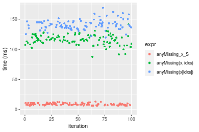
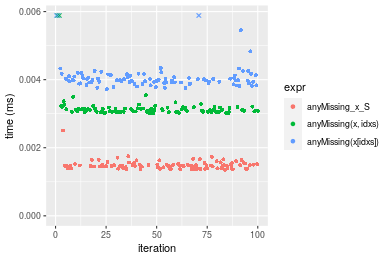

[matrixStats]: Benchmark report

---------------------------------------


# anyMissing() benchmarks on subsetted computation

This report benchmark the performance of anyMissing() on subsetted computation.


## Data type "integer"

### Data
```r
> rvector <- function(n, mode = c("logical", "double", "integer"), range = c(-100, +100), na_prob = 0) {
+     mode <- match.arg(mode)
+     if (mode == "logical") {
+         x <- sample(c(FALSE, TRUE), size = n, replace = TRUE)
+     }     else {
+         x <- runif(n, min = range[1], max = range[2])
+     }
+     storage.mode(x) <- mode
+     if (na_prob > 0) 
+         x[sample(n, size = na_prob * n)] <- NA
+     x
+ }
> rvectors <- function(scale = 10, seed = 1, ...) {
+     set.seed(seed)
+     data <- list()
+     data[[1]] <- rvector(n = scale * 100, ...)
+     data[[2]] <- rvector(n = scale * 1000, ...)
+     data[[3]] <- rvector(n = scale * 10000, ...)
+     data[[4]] <- rvector(n = scale * 1e+05, ...)
+     data[[5]] <- rvector(n = scale * 1e+06, ...)
+     names(data) <- sprintf("n = %d", sapply(data, FUN = length))
+     data
+ }
> data <- rvectors(mode = mode)
```

### Results

### n = 1000 vector

```r
> x <- data[["n = 1000"]]
> idxs <- sample.int(length(x), size = length(x) * 0.7)
> x_S <- x[idxs]
> gc()
           used  (Mb) gc trigger  (Mb) max used  (Mb)
Ncells  5140303 274.6    7554717 403.5  7554717 403.5
Vcells 25581056 195.2   64600258 492.9 60508962 461.7
> stats <- microbenchmark(anyMissing_x_S = anyMissing(x_S), `anyMissing(x, idxs)` = anyMissing(x, idxs = idxs), 
+     `anyMissing(x[idxs])` = anyMissing(x[idxs]), unit = "ms")
```

_Table: Benchmarking of anyMissing_x_S(), anyMissing(x, idxs)() and anyMissing(x[idxs])() on integer+n = 1000 data. The top panel shows times in milliseconds and the bottom panel shows relative times._


|   |expr                |      min|        lq|      mean|    median|        uq|      max|
|:--|:-------------------|--------:|---------:|---------:|---------:|---------:|--------:|
|1  |anyMissing_x_S      | 0.001327| 0.0013615| 0.0014276| 0.0014210| 0.0014515| 0.002049|
|2  |anyMissing(x, idxs) | 0.002927| 0.0029710| 0.0030389| 0.0030065| 0.0030520| 0.004198|
|3  |anyMissing(x[idxs]) | 0.003938| 0.0040710| 0.0051453| 0.0041525| 0.0042375| 0.101906|


|   |expr                |      min|       lq|     mean|   median|       uq|       max|
|:--|:-------------------|--------:|--------:|--------:|--------:|--------:|---------:|
|1  |anyMissing_x_S      | 1.000000| 1.000000| 1.000000| 1.000000| 1.000000|  1.000000|
|2  |anyMissing(x, idxs) | 2.205727| 2.182152| 2.128721| 2.115763| 2.102652|  2.048804|
|3  |anyMissing(x[idxs]) | 2.967596| 2.990085| 3.604239| 2.922238| 2.919394| 49.734505|

_Figure: Benchmarking of anyMissing_x_S(), anyMissing(x, idxs)() and anyMissing(x[idxs])() on integer+n = 1000 data.  Outliers are displayed as crosses.  Times are in milliseconds._


### n = 10000 vector

```r
> x <- data[["n = 10000"]]
> idxs <- sample.int(length(x), size = length(x) * 0.7)
> x_S <- x[idxs]
> gc()
           used  (Mb) gc trigger  (Mb) max used  (Mb)
Ncells  5137897 274.4    7554717 403.5  7554717 403.5
Vcells 14469459 110.4   51680207 394.3 60508962 461.7
> stats <- microbenchmark(anyMissing_x_S = anyMissing(x_S), `anyMissing(x, idxs)` = anyMissing(x, idxs = idxs), 
+     `anyMissing(x[idxs])` = anyMissing(x[idxs]), unit = "ms")
```

_Table: Benchmarking of anyMissing_x_S(), anyMissing(x, idxs)() and anyMissing(x[idxs])() on integer+n = 10000 data. The top panel shows times in milliseconds and the bottom panel shows relative times._


|   |expr                |      min|        lq|      mean|    median|        uq|      max|
|:--|:-------------------|--------:|---------:|---------:|---------:|---------:|--------:|
|1  |anyMissing_x_S      | 0.006163| 0.0065100| 0.0066384| 0.0066270| 0.0067740| 0.008303|
|2  |anyMissing(x, idxs) | 0.019662| 0.0204755| 0.0208237| 0.0206255| 0.0212635| 0.023060|
|3  |anyMissing(x[idxs]) | 0.025390| 0.0267540| 0.0279973| 0.0275520| 0.0282160| 0.046383|


|   |expr                |      min|       lq|     mean|   median|       uq|      max|
|:--|:-------------------|--------:|--------:|--------:|--------:|--------:|--------:|
|1  |anyMissing_x_S      | 1.000000| 1.000000| 1.000000| 1.000000| 1.000000| 1.000000|
|2  |anyMissing(x, idxs) | 3.190329| 3.145238| 3.136852| 3.112343| 3.138987| 2.777309|
|3  |anyMissing(x[idxs]) | 4.119747| 4.109677| 4.217464| 4.157537| 4.165338| 5.586294|

_Figure: Benchmarking of anyMissing_x_S(), anyMissing(x, idxs)() and anyMissing(x[idxs])() on integer+n = 10000 data.  Outliers are displayed as crosses.  Times are in milliseconds._


### n = 100000 vector

```r
> x <- data[["n = 100000"]]
> idxs <- sample.int(length(x), size = length(x) * 0.7)
> x_S <- x[idxs]
> gc()
           used  (Mb) gc trigger  (Mb) max used  (Mb)
Ncells  5137969 274.4    7554717 403.5  7554717 403.5
Vcells 14533019 110.9   51680207 394.3 60508962 461.7
> stats <- microbenchmark(anyMissing_x_S = anyMissing(x_S), `anyMissing(x, idxs)` = anyMissing(x, idxs = idxs), 
+     `anyMissing(x[idxs])` = anyMissing(x[idxs]), unit = "ms")
```

_Table: Benchmarking of anyMissing_x_S(), anyMissing(x, idxs)() and anyMissing(x[idxs])() on integer+n = 100000 data. The top panel shows times in milliseconds and the bottom panel shows relative times._


|   |expr                |      min|        lq|      mean|    median|        uq|      max|
|:--|:-------------------|--------:|---------:|---------:|---------:|---------:|--------:|
|1  |anyMissing_x_S      | 0.038997| 0.0404510| 0.0472189| 0.0465865| 0.0517335| 0.074773|
|2  |anyMissing(x, idxs) | 0.163357| 0.1728070| 0.1920446| 0.1894745| 0.2022090| 0.259642|
|3  |anyMissing(x[idxs]) | 0.194488| 0.2165725| 0.2375825| 0.2312910| 0.2568565| 0.387467|


|   |expr                |      min|       lq|     mean|   median|       uq|      max|
|:--|:-------------------|--------:|--------:|--------:|--------:|--------:|--------:|
|1  |anyMissing_x_S      | 1.000000| 1.000000| 1.000000| 1.000000| 1.000000| 1.000000|
|2  |anyMissing(x, idxs) | 4.188963| 4.272008| 4.067115| 4.067155| 3.908666| 3.472403|
|3  |anyMissing(x[idxs]) | 4.987255| 5.353947| 5.031516| 4.964765| 4.964994| 5.181911|

_Figure: Benchmarking of anyMissing_x_S(), anyMissing(x, idxs)() and anyMissing(x[idxs])() on integer+n = 100000 data.  Outliers are displayed as crosses.  Times are in milliseconds._


### n = 1000000 vector

```r
> x <- data[["n = 1000000"]]
> idxs <- sample.int(length(x), size = length(x) * 0.7)
> x_S <- x[idxs]
> gc()
           used  (Mb) gc trigger  (Mb) max used  (Mb)
Ncells  5138041 274.5    7554717 403.5  7554717 403.5
Vcells 15163068 115.7   51680207 394.3 60508962 461.7
> stats <- microbenchmark(anyMissing_x_S = anyMissing(x_S), `anyMissing(x, idxs)` = anyMissing(x, idxs = idxs), 
+     `anyMissing(x[idxs])` = anyMissing(x[idxs]), unit = "ms")
```

_Table: Benchmarking of anyMissing_x_S(), anyMissing(x, idxs)() and anyMissing(x[idxs])() on integer+n = 1000000 data. The top panel shows times in milliseconds and the bottom panel shows relative times._


|   |expr                |      min|       lq|      mean|   median|       uq|      max|
|:--|:-------------------|--------:|--------:|---------:|--------:|--------:|--------:|
|1  |anyMissing_x_S      | 0.426673| 0.485420| 0.5038016| 0.500727| 0.513361| 0.801380|
|2  |anyMissing(x, idxs) | 2.216429| 2.432800| 2.5897703| 2.570868| 2.653917| 4.301883|
|3  |anyMissing(x[idxs]) | 2.980059| 4.042264| 4.1752017| 4.250540| 4.441886| 4.807413|


|   |expr                |      min|       lq|     mean|   median|       uq|      max|
|:--|:-------------------|--------:|--------:|--------:|--------:|--------:|--------:|
|1  |anyMissing_x_S      | 1.000000| 1.000000| 1.000000| 1.000000| 1.000000| 1.000000|
|2  |anyMissing(x, idxs) | 5.194678| 5.011742| 5.140457| 5.134271| 5.169690| 5.368094|
|3  |anyMissing(x[idxs]) | 6.984410| 8.327355| 8.287393| 8.488736| 8.652558| 5.998918|

_Figure: Benchmarking of anyMissing_x_S(), anyMissing(x, idxs)() and anyMissing(x[idxs])() on integer+n = 1000000 data.  Outliers are displayed as crosses.  Times are in milliseconds._


### n = 10000000 vector

```r
> x <- data[["n = 10000000"]]
> idxs <- sample.int(length(x), size = length(x) * 0.7)
> x_S <- x[idxs]
> gc()
           used  (Mb) gc trigger  (Mb) max used  (Mb)
Ncells  5138107 274.5    7554717 403.5  7554717 403.5
Vcells 21463311 163.8   51680207 394.3 60508962 461.7
> stats <- microbenchmark(anyMissing_x_S = anyMissing(x_S), `anyMissing(x, idxs)` = anyMissing(x, idxs = idxs), 
+     `anyMissing(x[idxs])` = anyMissing(x[idxs]), unit = "ms")
```

_Table: Benchmarking of anyMissing_x_S(), anyMissing(x, idxs)() and anyMissing(x[idxs])() on integer+n = 10000000 data. The top panel shows times in milliseconds and the bottom panel shows relative times._


|   |expr                |        min|         lq|       mean|     median|        uq|       max|
|:--|:-------------------|----------:|----------:|----------:|----------:|---------:|---------:|
|1  |anyMissing_x_S      |   6.464153|   7.753406|   9.161021|   8.867178|  11.19263|  11.80728|
|2  |anyMissing(x, idxs) | 100.388399| 113.965239| 117.622991| 116.606566| 120.83405| 130.42449|
|3  |anyMissing(x[idxs]) | 121.444221| 135.327861| 143.207631| 136.883026| 145.15309| 490.72584|


|   |expr                |      min|       lq|     mean|   median|       uq|      max|
|:--|:-------------------|--------:|--------:|--------:|--------:|--------:|--------:|
|1  |anyMissing_x_S      |  1.00000|  1.00000|  1.00000|  1.00000|  1.00000|  1.00000|
|2  |anyMissing(x, idxs) | 15.53002| 14.69873| 12.83951| 13.15036| 10.79586| 11.04611|
|3  |anyMissing(x[idxs]) | 18.78734| 17.45399| 15.63228| 15.43705| 12.96863| 41.56129|

_Figure: Benchmarking of anyMissing_x_S(), anyMissing(x, idxs)() and anyMissing(x[idxs])() on integer+n = 10000000 data.  Outliers are displayed as crosses.  Times are in milliseconds._




## Data type "double"

### Data
```r
> rvector <- function(n, mode = c("logical", "double", "integer"), range = c(-100, +100), na_prob = 0) {
+     mode <- match.arg(mode)
+     if (mode == "logical") {
+         x <- sample(c(FALSE, TRUE), size = n, replace = TRUE)
+     }     else {
+         x <- runif(n, min = range[1], max = range[2])
+     }
+     storage.mode(x) <- mode
+     if (na_prob > 0) 
+         x[sample(n, size = na_prob * n)] <- NA
+     x
+ }
> rvectors <- function(scale = 10, seed = 1, ...) {
+     set.seed(seed)
+     data <- list()
+     data[[1]] <- rvector(n = scale * 100, ...)
+     data[[2]] <- rvector(n = scale * 1000, ...)
+     data[[3]] <- rvector(n = scale * 10000, ...)
+     data[[4]] <- rvector(n = scale * 1e+05, ...)
+     data[[5]] <- rvector(n = scale * 1e+06, ...)
+     names(data) <- sprintf("n = %d", sapply(data, FUN = length))
+     data
+ }
> data <- rvectors(mode = mode)
```

### Results

### n = 1000 vector

```r
> x <- data[["n = 1000"]]
> idxs <- sample.int(length(x), size = length(x) * 0.7)
> x_S <- x[idxs]
> gc()
           used  (Mb) gc trigger  (Mb) max used  (Mb)
Ncells  5138194 274.5    7554717 403.5  7554717 403.5
Vcells 20020187 152.8   51680207 394.3 60508962 461.7
> stats <- microbenchmark(anyMissing_x_S = anyMissing(x_S), `anyMissing(x, idxs)` = anyMissing(x, idxs = idxs), 
+     `anyMissing(x[idxs])` = anyMissing(x[idxs]), unit = "ms")
```

_Table: Benchmarking of anyMissing_x_S(), anyMissing(x, idxs)() and anyMissing(x[idxs])() on double+n = 1000 data. The top panel shows times in milliseconds and the bottom panel shows relative times._


|   |expr                |      min|        lq|      mean|    median|        uq|      max|
|:--|:-------------------|--------:|---------:|---------:|---------:|---------:|--------:|
|1  |anyMissing_x_S      | 0.001341| 0.0014345| 0.0014952| 0.0014645| 0.0015315| 0.002608|
|2  |anyMissing(x, idxs) | 0.002939| 0.0030245| 0.0030954| 0.0030640| 0.0031505| 0.004242|
|3  |anyMissing(x[idxs]) | 0.003628| 0.0037765| 0.0040082| 0.0038525| 0.0039725| 0.015499|


|   |expr                |      min|       lq|     mean|   median|       uq|      max|
|:--|:-------------------|--------:|--------:|--------:|--------:|--------:|--------:|
|1  |anyMissing_x_S      | 1.000000| 1.000000| 1.000000| 1.000000| 1.000000| 1.000000|
|2  |anyMissing(x, idxs) | 2.191648| 2.108400| 2.070197| 2.092182| 2.057133| 1.626534|
|3  |anyMissing(x[idxs]) | 2.705444| 2.632625| 2.680642| 2.630591| 2.593862| 5.942868|

_Figure: Benchmarking of anyMissing_x_S(), anyMissing(x, idxs)() and anyMissing(x[idxs])() on double+n = 1000 data.  Outliers are displayed as crosses.  Times are in milliseconds._



### n = 10000 vector

```r
> x <- data[["n = 10000"]]
> idxs <- sample.int(length(x), size = length(x) * 0.7)
> x_S <- x[idxs]
> gc()
           used  (Mb) gc trigger  (Mb) max used  (Mb)
Ncells  5138257 274.5    7554717 403.5  7554717 403.5
Vcells 20029977 152.9   51680207 394.3 60508962 461.7
> stats <- microbenchmark(anyMissing_x_S = anyMissing(x_S), `anyMissing(x, idxs)` = anyMissing(x, idxs = idxs), 
+     `anyMissing(x[idxs])` = anyMissing(x[idxs]), unit = "ms")
```

_Table: Benchmarking of anyMissing_x_S(), anyMissing(x, idxs)() and anyMissing(x[idxs])() on double+n = 10000 data. The top panel shows times in milliseconds and the bottom panel shows relative times._


|   |expr                |      min|        lq|      mean|    median|        uq|      max|
|:--|:-------------------|--------:|---------:|---------:|---------:|---------:|--------:|
|1  |anyMissing_x_S      | 0.006196| 0.0064660| 0.0070112| 0.0066955| 0.0069295| 0.021459|
|2  |anyMissing(x, idxs) | 0.020214| 0.0208585| 0.0215437| 0.0215805| 0.0222285| 0.024264|
|3  |anyMissing(x[idxs]) | 0.023090| 0.0246035| 0.0255807| 0.0251715| 0.0259005| 0.048884|


|   |expr                |      min|       lq|     mean|   median|       uq|      max|
|:--|:-------------------|--------:|--------:|--------:|--------:|--------:|--------:|
|1  |anyMissing_x_S      | 1.000000| 1.000000| 1.000000| 1.000000| 1.000000| 1.000000|
|2  |anyMissing(x, idxs) | 3.262427| 3.225874| 3.072729| 3.223135| 3.207807| 1.130714|
|3  |anyMissing(x[idxs]) | 3.726598| 3.805057| 3.648529| 3.759465| 3.737716| 2.278018|

_Figure: Benchmarking of anyMissing_x_S(), anyMissing(x, idxs)() and anyMissing(x[idxs])() on double+n = 10000 data.  Outliers are displayed as crosses.  Times are in milliseconds._


### n = 100000 vector

```r
> x <- data[["n = 100000"]]
> idxs <- sample.int(length(x), size = length(x) * 0.7)
> x_S <- x[idxs]
> gc()
           used  (Mb) gc trigger  (Mb) max used  (Mb)
Ncells  5138329 274.5    7554717 403.5  7554717 403.5
Vcells 20124892 153.6   51680207 394.3 60508962 461.7
> stats <- microbenchmark(anyMissing_x_S = anyMissing(x_S), `anyMissing(x, idxs)` = anyMissing(x, idxs = idxs), 
+     `anyMissing(x[idxs])` = anyMissing(x[idxs]), unit = "ms")
```

_Table: Benchmarking of anyMissing_x_S(), anyMissing(x, idxs)() and anyMissing(x[idxs])() on double+n = 100000 data. The top panel shows times in milliseconds and the bottom panel shows relative times._


|   |expr                |      min|        lq|      mean|    median|        uq|      max|
|:--|:-------------------|--------:|---------:|---------:|---------:|---------:|--------:|
|1  |anyMissing_x_S      | 0.037624| 0.0408995| 0.0473138| 0.0461260| 0.0519580| 0.083511|
|2  |anyMissing(x, idxs) | 0.168429| 0.1777740| 0.1994929| 0.1951085| 0.2137245| 0.257943|
|3  |anyMissing(x[idxs]) | 0.229641| 0.2531110| 0.2783283| 0.2781095| 0.2921920| 0.515543|


|   |expr                |      min|       lq|     mean|   median|       uq|      max|
|:--|:-------------------|--------:|--------:|--------:|--------:|--------:|--------:|
|1  |anyMissing_x_S      | 1.000000| 1.000000| 1.000000| 1.000000| 1.000000| 1.000000|
|2  |anyMissing(x, idxs) | 4.476637| 4.346606| 4.216382| 4.229903| 4.113409| 3.088731|
|3  |anyMissing(x[idxs]) | 6.103578| 6.188609| 5.882607| 6.029344| 5.623619| 6.173354|

_Figure: Benchmarking of anyMissing_x_S(), anyMissing(x, idxs)() and anyMissing(x[idxs])() on double+n = 100000 data.  Outliers are displayed as crosses.  Times are in milliseconds._


### n = 1000000 vector

```r
> x <- data[["n = 1000000"]]
> idxs <- sample.int(length(x), size = length(x) * 0.7)
> x_S <- x[idxs]
> gc()
           used  (Mb) gc trigger  (Mb) max used  (Mb)
Ncells  5138401 274.5    7554717 403.5  7554717 403.5
Vcells 21069941 160.8   51680207 394.3 60508962 461.7
> stats <- microbenchmark(anyMissing_x_S = anyMissing(x_S), `anyMissing(x, idxs)` = anyMissing(x, idxs = idxs), 
+     `anyMissing(x[idxs])` = anyMissing(x[idxs]), unit = "ms")
```

_Table: Benchmarking of anyMissing_x_S(), anyMissing(x, idxs)() and anyMissing(x[idxs])() on double+n = 1000000 data. The top panel shows times in milliseconds and the bottom panel shows relative times._


|   |expr                |      min|        lq|      mean|   median|        uq|       max|
|:--|:-------------------|--------:|---------:|---------:|--------:|---------:|---------:|
|1  |anyMissing_x_S      | 0.600300| 0.7144645| 0.7250892| 0.726865| 0.7457135|  0.820312|
|2  |anyMissing(x, idxs) | 5.023077| 5.1314840| 5.2410905| 5.203080| 5.2903465|  6.302668|
|3  |anyMissing(x[idxs]) | 6.530380| 9.3744010| 9.4388623| 9.552219| 9.7520410| 22.154733|


|   |expr                |       min|       lq|      mean|    median|        uq|       max|
|:--|:-------------------|---------:|--------:|---------:|---------:|---------:|---------:|
|1  |anyMissing_x_S      |  1.000000|  1.00000|  1.000000|  1.000000|  1.000000|  1.000000|
|2  |anyMissing(x, idxs) |  8.367611|  7.18228|  7.228201|  7.158247|  7.094342|  7.683257|
|3  |anyMissing(x[idxs]) | 10.878527| 13.12088| 13.017519| 13.141668| 13.077463| 27.007691|

_Figure: Benchmarking of anyMissing_x_S(), anyMissing(x, idxs)() and anyMissing(x[idxs])() on double+n = 1000000 data.  Outliers are displayed as crosses.  Times are in milliseconds._


### n = 10000000 vector

```r
> x <- data[["n = 10000000"]]
> idxs <- sample.int(length(x), size = length(x) * 0.7)
> x_S <- x[idxs]
> gc()
           used  (Mb) gc trigger  (Mb) max used  (Mb)
Ncells  5138473 274.5    7554717 403.5  7554717 403.5
Vcells 30520423 232.9   51680207 394.3 60508962 461.7
> stats <- microbenchmark(anyMissing_x_S = anyMissing(x_S), `anyMissing(x, idxs)` = anyMissing(x, idxs = idxs), 
+     `anyMissing(x[idxs])` = anyMissing(x[idxs]), unit = "ms")
```

_Table: Benchmarking of anyMissing_x_S(), anyMissing(x, idxs)() and anyMissing(x[idxs])() on double+n = 10000000 data. The top panel shows times in milliseconds and the bottom panel shows relative times._


|   |expr                |       min|         lq|      mean|     median|        uq|       max|
|:--|:-------------------|---------:|----------:|---------:|----------:|---------:|---------:|
|1  |anyMissing_x_S      |   7.12606|   8.358239|  10.34582|   9.904466|  13.06794|  14.05714|
|2  |anyMissing(x, idxs) | 109.35108| 143.128878| 149.19289| 148.965075| 159.09753| 173.11788|
|3  |anyMissing(x[idxs]) | 155.76093| 169.543543| 177.67001| 176.808220| 184.03351| 198.40736|


|   |expr                |      min|       lq|     mean|   median|       uq|      max|
|:--|:-------------------|--------:|--------:|--------:|--------:|--------:|--------:|
|1  |anyMissing_x_S      |  1.00000|  1.00000|  1.00000|  1.00000|  1.00000|  1.00000|
|2  |anyMissing(x, idxs) | 15.34524| 17.12429| 14.42059| 15.04019| 12.17465| 12.31530|
|3  |anyMissing(x[idxs]) | 21.85793| 20.28460| 17.17312| 17.85136| 14.08283| 14.11435|

_Figure: Benchmarking of anyMissing_x_S(), anyMissing(x, idxs)() and anyMissing(x[idxs])() on double+n = 10000000 data.  Outliers are displayed as crosses.  Times are in milliseconds._


## Appendix

### Session information
```r
R version 4.1.1 Patched (2021-08-10 r80727)
Platform: x86_64-pc-linux-gnu (64-bit)
Running under: Ubuntu 18.04.5 LTS

Matrix products: default
BLAS:   /home/hb/software/R-devel/R-4-1-branch/lib/R/lib/libRblas.so
LAPACK: /home/hb/software/R-devel/R-4-1-branch/lib/R/lib/libRlapack.so

locale:
 [1] LC_CTYPE=en_US.UTF-8       LC_NUMERIC=C              
 [3] LC_TIME=en_US.UTF-8        LC_COLLATE=en_US.UTF-8    
 [5] LC_MONETARY=en_US.UTF-8    LC_MESSAGES=en_US.UTF-8   
 [7] LC_PAPER=en_US.UTF-8       LC_NAME=C                 
 [9] LC_ADDRESS=C               LC_TELEPHONE=C            
[11] LC_MEASUREMENT=en_US.UTF-8 LC_IDENTIFICATION=C       

attached base packages:
[1] stats     graphics  grDevices utils     datasets  methods   base     

other attached packages:
[1] microbenchmark_1.4-7   matrixStats_0.60.0     ggplot2_3.3.5         
[4] knitr_1.33             R.devices_2.17.0       R.utils_2.10.1        
[7] R.oo_1.24.0            R.methodsS3_1.8.1-9001

loaded via a namespace (and not attached):
 [1] Biobase_2.52.0          httr_1.4.2              splines_4.1.1          
 [4] bit64_4.0.5             network_1.17.1          assertthat_0.2.1       
 [7] highr_0.9               stats4_4.1.1            blob_1.2.2             
[10] GenomeInfoDbData_1.2.6  robustbase_0.93-8       pillar_1.6.2           
[13] RSQLite_2.2.8           lattice_0.20-44         glue_1.4.2             
[16] digest_0.6.27           XVector_0.32.0          colorspace_2.0-2       
[19] Matrix_1.3-4            XML_3.99-0.7            pkgconfig_2.0.3        
[22] zlibbioc_1.38.0         genefilter_1.74.0       purrr_0.3.4            
[25] ergm_4.1.2              xtable_1.8-4            scales_1.1.1           
[28] tibble_3.1.4            annotate_1.70.0         KEGGREST_1.32.0        
[31] farver_2.1.0            generics_0.1.0          IRanges_2.26.0         
[34] ellipsis_0.3.2          cachem_1.0.6            withr_2.4.2            
[37] BiocGenerics_0.38.0     mime_0.11               survival_3.2-13        
[40] magrittr_2.0.1          crayon_1.4.1            statnet.common_4.5.0   
[43] memoise_2.0.0           laeken_0.5.1            fansi_0.5.0            
[46] R.cache_0.15.0          MASS_7.3-54             R.rsp_0.44.0           
[49] tools_4.1.1             lifecycle_1.0.0         S4Vectors_0.30.0       
[52] trust_0.1-8             munsell_0.5.0           AnnotationDbi_1.54.1   
[55] Biostrings_2.60.2       compiler_4.1.1          GenomeInfoDb_1.28.1    
[58] rlang_0.4.11            grid_4.1.1              RCurl_1.98-1.4         
[61] cwhmisc_6.6             rappdirs_0.3.3          labeling_0.4.2         
[64] bitops_1.0-7            base64enc_0.1-3         boot_1.3-28            
[67] gtable_0.3.0            DBI_1.1.1               markdown_1.1           
[70] R6_2.5.1                lpSolveAPI_5.5.2.0-17.7 rle_0.9.2              
[73] dplyr_1.0.7             fastmap_1.1.0           bit_4.0.4              
[76] utf8_1.2.2              parallel_4.1.1          Rcpp_1.0.7             
[79] vctrs_0.3.8             png_0.1-7               DEoptimR_1.0-9         
[82] tidyselect_1.1.1        xfun_0.25               coda_0.19-4            
```
Total processing time was 1.24 mins.


### Reproducibility
To reproduce this report, do:
```r
html <- matrixStats:::benchmark('anyMissing_subset')
```

[RSP]: https://cran.r-project.org/package=R.rsp
[matrixStats]: https://cran.r-project.org/package=matrixStats

[StackOverflow:colMins?]: https://stackoverflow.com/questions/13676878 "Stack Overflow: fastest way to get Min from every column in a matrix?"
[StackOverflow:colSds?]: https://stackoverflow.com/questions/17549762 "Stack Overflow: Is there such 'colsd' in R?"
[StackOverflow:rowProds?]: https://stackoverflow.com/questions/20198801/ "Stack Overflow: Row product of matrix and column sum of matrix"

---------------------------------------
Copyright Dongcan Jiang. Last updated on 2021-08-25 17:33:09 (+0200 UTC). Powered by [RSP].

<script>
 var link = document.createElement('link');
 link.rel = 'icon';
 link.href = "data:image/png;base64,iVBORw0KGgoAAAANSUhEUgAAACAAAAAgCAMAAABEpIrGAAAA21BMVEUAAAAAAP8AAP8AAP8AAP8AAP8AAP8AAP8AAP8AAP8AAP8AAP8AAP8AAP8AAP8AAP8AAP8AAP8AAP8AAP8AAP8AAP8AAP8AAP8AAP8AAP8AAP8AAP8AAP8AAP8AAP8AAP8AAP8AAP8AAP8AAP8AAP8AAP8AAP8AAP8AAP8AAP8BAf4CAv0DA/wdHeIeHuEfH+AgIN8hId4lJdomJtknJ9g+PsE/P8BAQL9yco10dIt1dYp3d4h4eIeVlWqWlmmXl2iYmGeZmWabm2Tn5xjo6Bfp6Rb39wj4+Af//wA2M9hbAAAASXRSTlMAAQIJCgsMJSYnKD4/QGRlZmhpamtsbautrrCxuru8y8zN5ebn6Pn6+///////////////////////////////////////////LsUNcQAAAS9JREFUOI29k21XgkAQhVcFytdSMqMETU26UVqGmpaiFbL//xc1cAhhwVNf6n5i5z67M2dmYOyfJZUqlVLhkKucG7cgmUZTybDz6g0iDeq51PUr37Ds2cy2/C9NeES5puDjxuUk1xnToZsg8pfA3avHQ3lLIi7iWRrkv/OYtkScxBIMgDee0ALoyxHQBJ68JLCjOtQIMIANF7QG9G9fNnHvisCHBVMKgSJgiz7nE+AoBKrAPA3MgepvgR9TSCasrCKH0eB1wBGBFdCO+nAGjMVGPcQb5bd6mQRegN6+1axOs9nGfYcCtfi4NQosdtH7dB+txFIpXQqN1p9B/asRHToyS0jRgpV7nk4nwcq1BJ+x3Gl/v7S9Wmpp/aGquum7w3ZDyrADFYrl8vHBH+ev9AUASW1dmU4h4wAAAABJRU5ErkJggg=="
 document.getElementsByTagName('head')[0].appendChild(link);
</script>


