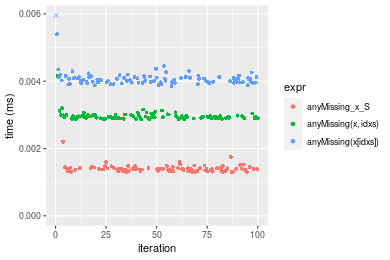
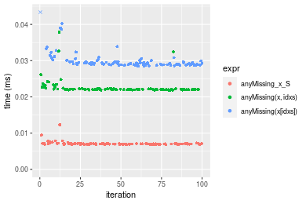

[matrixStats]: Benchmark report

---------------------------------------


# anyMissing() benchmarks on subsetted computation

This report benchmark the performance of anyMissing() on subsetted computation.


## Data type "integer"

### Data
```r
> rvector <- function(n, mode = c("logical", "double", "integer"), range = c(-100, +100), na_prob = 0) {
+     mode <- match.arg(mode)
+     if (mode == "logical") {
+         x <- sample(c(FALSE, TRUE), size = n, replace = TRUE)
+     }     else {
+         x <- runif(n, min = range[1], max = range[2])
+     }
+     storage.mode(x) <- mode
+     if (na_prob > 0) 
+         x[sample(n, size = na_prob * n)] <- NA
+     x
+ }
> rvectors <- function(scale = 10, seed = 1, ...) {
+     set.seed(seed)
+     data <- list()
+     data[[1]] <- rvector(n = scale * 100, ...)
+     data[[2]] <- rvector(n = scale * 1000, ...)
+     data[[3]] <- rvector(n = scale * 10000, ...)
+     data[[4]] <- rvector(n = scale * 1e+05, ...)
+     data[[5]] <- rvector(n = scale * 1e+06, ...)
+     names(data) <- sprintf("n = %d", sapply(data, FUN = length))
+     data
+ }
> data <- rvectors(mode = mode)
```

### Results

### n = 1000 vector

```r
> x <- data[["n = 1000"]]
> idxs <- sample.int(length(x), size = length(x) * 0.7)
> x_S <- x[idxs]
> gc()
           used  (Mb) gc trigger  (Mb) max used  (Mb)
Ncells  5162916 275.8    7916910 422.9  7916910 422.9
Vcells 25710602 196.2   53955392 411.7 50098692 382.3
> stats <- microbenchmark(anyMissing_x_S = anyMissing(x_S), `anyMissing(x, idxs)` = anyMissing(x, idxs = idxs), 
+     `anyMissing(x[idxs])` = anyMissing(x[idxs]), unit = "ms")
```

_Table: Benchmarking of anyMissing_x_S(), anyMissing(x, idxs)() and anyMissing(x[idxs])() on integer+n = 1000 data. The top panel shows times in milliseconds and the bottom panel shows relative times._


|   |expr                |      min|        lq|      mean|    median|        uq|      max|
|:--|:-------------------|--------:|---------:|---------:|---------:|---------:|--------:|
|1  |anyMissing_x_S      | 0.001299| 0.0013310| 0.0014001| 0.0013850| 0.0014175| 0.002203|
|2  |anyMissing(x, idxs) | 0.002861| 0.0029085| 0.0029626| 0.0029380| 0.0029755| 0.004156|
|3  |anyMissing(x[idxs]) | 0.003853| 0.0039675| 0.0052384| 0.0040435| 0.0041210| 0.121189|


|   |expr                |      min|       lq|     mean|   median|       uq|       max|
|:--|:-------------------|--------:|--------:|--------:|--------:|--------:|---------:|
|1  |anyMissing_x_S      | 1.000000| 1.000000| 1.000000| 1.000000| 1.000000|  1.000000|
|2  |anyMissing(x, idxs) | 2.202463| 2.185199| 2.116021| 2.121300| 2.099118|  1.886518|
|3  |anyMissing(x[idxs]) | 2.966128| 2.980841| 3.741459| 2.919495| 2.907231| 55.010894|

_Figure: Benchmarking of anyMissing_x_S(), anyMissing(x, idxs)() and anyMissing(x[idxs])() on integer+n = 1000 data.  Outliers are displayed as crosses.  Times are in milliseconds._



### n = 10000 vector

```r
> x <- data[["n = 10000"]]
> idxs <- sample.int(length(x), size = length(x) * 0.7)
> x_S <- x[idxs]
> gc()
           used (Mb) gc trigger  (Mb) max used  (Mb)
Ncells  5148112  275    7916910 422.9  7916910 422.9
Vcells 14536728  111   53955392 411.7 50098692 382.3
> stats <- microbenchmark(anyMissing_x_S = anyMissing(x_S), `anyMissing(x, idxs)` = anyMissing(x, idxs = idxs), 
+     `anyMissing(x[idxs])` = anyMissing(x[idxs]), unit = "ms")
```

_Table: Benchmarking of anyMissing_x_S(), anyMissing(x, idxs)() and anyMissing(x[idxs])() on integer+n = 10000 data. The top panel shows times in milliseconds and the bottom panel shows relative times._


|   |expr                |      min|       lq|      mean|    median|        uq|      max|
|:--|:-------------------|--------:|--------:|---------:|---------:|---------:|--------:|
|1  |anyMissing_x_S      | 0.006821| 0.006938| 0.0071182| 0.0070145| 0.0071065| 0.012310|
|2  |anyMissing(x, idxs) | 0.021872| 0.021980| 0.0226106| 0.0220715| 0.0222115| 0.037837|
|3  |anyMissing(x[idxs]) | 0.028426| 0.028889| 0.0302136| 0.0292280| 0.0297295| 0.067615|


|   |expr                |      min|      lq|     mean|   median|       uq|      max|
|:--|:-------------------|--------:|-------:|--------:|--------:|--------:|--------:|
|1  |anyMissing_x_S      | 1.000000| 1.00000| 1.000000| 1.000000| 1.000000| 1.000000|
|2  |anyMissing(x, idxs) | 3.206568| 3.16806| 3.176452| 3.146554| 3.125519| 3.073680|
|3  |anyMissing(x[idxs]) | 4.167424| 4.16388| 4.244565| 4.166797| 4.183424| 5.492689|

_Figure: Benchmarking of anyMissing_x_S(), anyMissing(x, idxs)() and anyMissing(x[idxs])() on integer+n = 10000 data.  Outliers are displayed as crosses.  Times are in milliseconds._



### n = 100000 vector

```r
> x <- data[["n = 100000"]]
> idxs <- sample.int(length(x), size = length(x) * 0.7)
> x_S <- x[idxs]
> gc()
           used  (Mb) gc trigger  (Mb) max used  (Mb)
Ncells  5148184 275.0    7916910 422.9  7916910 422.9
Vcells 14600288 111.4   53955392 411.7 50098692 382.3
> stats <- microbenchmark(anyMissing_x_S = anyMissing(x_S), `anyMissing(x, idxs)` = anyMissing(x, idxs = idxs), 
+     `anyMissing(x[idxs])` = anyMissing(x[idxs]), unit = "ms")
```

_Table: Benchmarking of anyMissing_x_S(), anyMissing(x, idxs)() and anyMissing(x[idxs])() on integer+n = 100000 data. The top panel shows times in milliseconds and the bottom panel shows relative times._


|   |expr                |      min|       lq|      mean|   median|        uq|      max|
|:--|:-------------------|--------:|--------:|---------:|--------:|---------:|--------:|
|1  |anyMissing_x_S      | 0.045269| 0.047030| 0.0565744| 0.055161| 0.0605690| 0.097646|
|2  |anyMissing(x, idxs) | 0.189848| 0.196721| 0.2237074| 0.210139| 0.2433385| 0.385652|
|3  |anyMissing(x[idxs]) | 0.222029| 0.238814| 0.2838194| 0.268992| 0.2986360| 0.765679|


|   |expr                |      min|       lq|     mean|   median|       uq|      max|
|:--|:-------------------|--------:|--------:|--------:|--------:|--------:|--------:|
|1  |anyMissing_x_S      | 1.000000| 1.000000| 1.000000| 1.000000| 1.000000| 1.000000|
|2  |anyMissing(x, idxs) | 4.193775| 4.182883| 3.954212| 3.809557| 4.017542| 3.949491|
|3  |anyMissing(x[idxs]) | 4.904659| 5.077908| 5.016743| 4.876489| 4.930509| 7.841376|

_Figure: Benchmarking of anyMissing_x_S(), anyMissing(x, idxs)() and anyMissing(x[idxs])() on integer+n = 100000 data.  Outliers are displayed as crosses.  Times are in milliseconds._


### n = 1000000 vector

```r
> x <- data[["n = 1000000"]]
> idxs <- sample.int(length(x), size = length(x) * 0.7)
> x_S <- x[idxs]
> gc()
           used  (Mb) gc trigger  (Mb) max used  (Mb)
Ncells  5148256 275.0    7916910 422.9  7916910 422.9
Vcells 15230337 116.2   53955392 411.7 50098692 382.3
> stats <- microbenchmark(anyMissing_x_S = anyMissing(x_S), `anyMissing(x, idxs)` = anyMissing(x, idxs = idxs), 
+     `anyMissing(x[idxs])` = anyMissing(x[idxs]), unit = "ms")
```

_Table: Benchmarking of anyMissing_x_S(), anyMissing(x, idxs)() and anyMissing(x[idxs])() on integer+n = 1000000 data. The top panel shows times in milliseconds and the bottom panel shows relative times._


|   |expr                |      min|        lq|      mean|    median|        uq|       max|
|:--|:-------------------|--------:|---------:|---------:|---------:|---------:|---------:|
|1  |anyMissing_x_S      | 0.454448| 0.5216525| 0.5786677| 0.5436835| 0.5899715|  1.079747|
|2  |anyMissing(x, idxs) | 2.487519| 2.7614475| 3.4705498| 3.3085560| 3.8648375|  7.685493|
|3  |anyMissing(x[idxs]) | 3.827613| 4.4859705| 5.4221502| 4.9909670| 5.9684330| 10.399041|


|   |expr                |      min|       lq|     mean|   median|        uq|      max|
|:--|:-------------------|--------:|--------:|--------:|--------:|---------:|--------:|
|1  |anyMissing_x_S      | 1.000000| 1.000000| 1.000000| 1.000000|  1.000000| 1.000000|
|2  |anyMissing(x, idxs) | 5.473715| 5.293653| 5.997483| 6.085445|  6.550889| 7.117865|
|3  |anyMissing(x[idxs]) | 8.422554| 8.599538| 9.370058| 9.179913| 10.116477| 9.630998|

_Figure: Benchmarking of anyMissing_x_S(), anyMissing(x, idxs)() and anyMissing(x[idxs])() on integer+n = 1000000 data.  Outliers are displayed as crosses.  Times are in milliseconds._


### n = 10000000 vector

```r
> x <- data[["n = 10000000"]]
> idxs <- sample.int(length(x), size = length(x) * 0.7)
> x_S <- x[idxs]
> gc()
           used  (Mb) gc trigger  (Mb) max used  (Mb)
Ncells  5148328 275.0    7916910 422.9  7916910 422.9
Vcells 21530590 164.3   53955392 411.7 50658010 386.5
> stats <- microbenchmark(anyMissing_x_S = anyMissing(x_S), `anyMissing(x, idxs)` = anyMissing(x, idxs = idxs), 
+     `anyMissing(x[idxs])` = anyMissing(x[idxs]), unit = "ms")
```

_Table: Benchmarking of anyMissing_x_S(), anyMissing(x, idxs)() and anyMissing(x[idxs])() on integer+n = 10000000 data. The top panel shows times in milliseconds and the bottom panel shows relative times._


|   |expr                |        min|         lq|       mean|     median|        uq|       max|
|:--|:-------------------|----------:|----------:|----------:|----------:|---------:|---------:|
|1  |anyMissing_x_S      |   6.390179|   7.663246|   8.921722|   8.455134|  10.36377|  13.00473|
|2  |anyMissing(x, idxs) |  87.748499| 111.039786| 115.822160| 115.685753| 122.27734| 141.40928|
|3  |anyMissing(x[idxs]) | 119.607946| 135.674981| 140.726406| 139.743561| 144.71224| 168.76377|


|   |expr                |      min|       lq|     mean|   median|       uq|      max|
|:--|:-------------------|--------:|--------:|--------:|--------:|--------:|--------:|
|1  |anyMissing_x_S      |  1.00000|  1.00000|  1.00000|  1.00000|  1.00000|  1.00000|
|2  |anyMissing(x, idxs) | 13.73177| 14.48992| 12.98204| 13.68231| 11.79853| 10.87368|
|3  |anyMissing(x[idxs]) | 18.71746| 17.70464| 15.77346| 16.52766| 13.96328| 12.97711|

_Figure: Benchmarking of anyMissing_x_S(), anyMissing(x, idxs)() and anyMissing(x[idxs])() on integer+n = 10000000 data.  Outliers are displayed as crosses.  Times are in milliseconds._


## Data type "double"

### Data
```r
> rvector <- function(n, mode = c("logical", "double", "integer"), range = c(-100, +100), na_prob = 0) {
+     mode <- match.arg(mode)
+     if (mode == "logical") {
+         x <- sample(c(FALSE, TRUE), size = n, replace = TRUE)
+     }     else {
+         x <- runif(n, min = range[1], max = range[2])
+     }
+     storage.mode(x) <- mode
+     if (na_prob > 0) 
+         x[sample(n, size = na_prob * n)] <- NA
+     x
+ }
> rvectors <- function(scale = 10, seed = 1, ...) {
+     set.seed(seed)
+     data <- list()
+     data[[1]] <- rvector(n = scale * 100, ...)
+     data[[2]] <- rvector(n = scale * 1000, ...)
+     data[[3]] <- rvector(n = scale * 10000, ...)
+     data[[4]] <- rvector(n = scale * 1e+05, ...)
+     data[[5]] <- rvector(n = scale * 1e+06, ...)
+     names(data) <- sprintf("n = %d", sapply(data, FUN = length))
+     data
+ }
> data <- rvectors(mode = mode)
```

### Results

### n = 1000 vector

```r
> x <- data[["n = 1000"]]
> idxs <- sample.int(length(x), size = length(x) * 0.7)
> x_S <- x[idxs]
> gc()
           used  (Mb) gc trigger  (Mb) max used  (Mb)
Ncells  5148409 275.0    7916910 422.9  7916910 422.9
Vcells 20087457 153.3   53955392 411.7 53032641 404.7
> stats <- microbenchmark(anyMissing_x_S = anyMissing(x_S), `anyMissing(x, idxs)` = anyMissing(x, idxs = idxs), 
+     `anyMissing(x[idxs])` = anyMissing(x[idxs]), unit = "ms")
```

_Table: Benchmarking of anyMissing_x_S(), anyMissing(x, idxs)() and anyMissing(x[idxs])() on double+n = 1000 data. The top panel shows times in milliseconds and the bottom panel shows relative times._


|   |expr                |      min|        lq|      mean|    median|        uq|      max|
|:--|:-------------------|--------:|---------:|---------:|---------:|---------:|--------:|
|1  |anyMissing_x_S      | 0.001356| 0.0014020| 0.0014909| 0.0014710| 0.0015125| 0.002507|
|2  |anyMissing(x, idxs) | 0.003008| 0.0030575| 0.0032146| 0.0030975| 0.0031555| 0.009546|
|3  |anyMissing(x[idxs]) | 0.003724| 0.0039190| 0.0047963| 0.0039910| 0.0041330| 0.049398|


|   |expr                |      min|       lq|     mean|  median|       uq|       max|
|:--|:-------------------|--------:|--------:|--------:|-------:|--------:|---------:|
|1  |anyMissing_x_S      | 1.000000| 1.000000| 1.000000| 1.00000| 1.000000|  1.000000|
|2  |anyMissing(x, idxs) | 2.218289| 2.180813| 2.156126| 2.10571| 2.086281|  3.807738|
|3  |anyMissing(x[idxs]) | 2.746313| 2.795292| 3.217042| 2.71312| 2.732562| 19.704029|

_Figure: Benchmarking of anyMissing_x_S(), anyMissing(x, idxs)() and anyMissing(x[idxs])() on double+n = 1000 data.  Outliers are displayed as crosses.  Times are in milliseconds._


### n = 10000 vector

```r
> x <- data[["n = 10000"]]
> idxs <- sample.int(length(x), size = length(x) * 0.7)
> x_S <- x[idxs]
> gc()
           used  (Mb) gc trigger  (Mb) max used  (Mb)
Ncells  5148472 275.0    7916910 422.9  7916910 422.9
Vcells 20097246 153.4   53955392 411.7 53032641 404.7
> stats <- microbenchmark(anyMissing_x_S = anyMissing(x_S), `anyMissing(x, idxs)` = anyMissing(x, idxs = idxs), 
+     `anyMissing(x[idxs])` = anyMissing(x[idxs]), unit = "ms")
```

_Table: Benchmarking of anyMissing_x_S(), anyMissing(x, idxs)() and anyMissing(x[idxs])() on double+n = 10000 data. The top panel shows times in milliseconds and the bottom panel shows relative times._


|   |expr                |      min|        lq|      mean|    median|        uq|      max|
|:--|:-------------------|--------:|---------:|---------:|---------:|---------:|--------:|
|1  |anyMissing_x_S      | 0.006850| 0.0072490| 0.0094397| 0.0075730| 0.0132905| 0.016769|
|2  |anyMissing(x, idxs) | 0.023116| 0.0235495| 0.0286511| 0.0238020| 0.0282000| 0.049185|
|3  |anyMissing(x[idxs]) | 0.026394| 0.0276825| 0.0337686| 0.0282005| 0.0330330| 0.065500|


|   |expr                |      min|       lq|     mean|   median|       uq|      max|
|:--|:-------------------|--------:|--------:|--------:|--------:|--------:|--------:|
|1  |anyMissing_x_S      | 1.000000| 1.000000| 1.000000| 1.000000| 1.000000| 1.000000|
|2  |anyMissing(x, idxs) | 3.374598| 3.248655| 3.035167| 3.143008| 2.121816| 2.933091|
|3  |anyMissing(x[idxs]) | 3.853139| 3.818803| 3.577295| 3.723822| 2.485460| 3.906017|

_Figure: Benchmarking of anyMissing_x_S(), anyMissing(x, idxs)() and anyMissing(x[idxs])() on double+n = 10000 data.  Outliers are displayed as crosses.  Times are in milliseconds._


### n = 100000 vector

```r
> x <- data[["n = 100000"]]
> idxs <- sample.int(length(x), size = length(x) * 0.7)
> x_S <- x[idxs]
> gc()
           used  (Mb) gc trigger  (Mb) max used  (Mb)
Ncells  5148544 275.0    7916910 422.9  7916910 422.9
Vcells 20192161 154.1   53955392 411.7 53032641 404.7
> stats <- microbenchmark(anyMissing_x_S = anyMissing(x_S), `anyMissing(x, idxs)` = anyMissing(x, idxs = idxs), 
+     `anyMissing(x[idxs])` = anyMissing(x[idxs]), unit = "ms")
```

_Table: Benchmarking of anyMissing_x_S(), anyMissing(x, idxs)() and anyMissing(x[idxs])() on double+n = 100000 data. The top panel shows times in milliseconds and the bottom panel shows relative times._


|   |expr                |      min|        lq|      mean|    median|        uq|      max|
|:--|:-------------------|--------:|---------:|---------:|---------:|---------:|--------:|
|1  |anyMissing_x_S      | 0.040801| 0.0458760| 0.0535020| 0.0495030| 0.0560180| 0.115687|
|2  |anyMissing(x, idxs) | 0.177440| 0.1994325| 0.2273533| 0.2125495| 0.2316585| 0.549579|
|3  |anyMissing(x[idxs]) | 0.263107| 0.2803375| 0.3378248| 0.2959000| 0.3937720| 1.195971|


|   |expr                |      min|       lq|     mean|   median|       uq|       max|
|:--|:-------------------|--------:|--------:|--------:|--------:|--------:|---------:|
|1  |anyMissing_x_S      | 1.000000| 1.000000| 1.000000| 1.000000| 1.000000|  1.000000|
|2  |anyMissing(x, idxs) | 4.348913| 4.347208| 4.249433| 4.293669| 4.135430|  4.750568|
|3  |anyMissing(x[idxs]) | 6.448543| 6.110766| 6.314242| 5.977416| 7.029383| 10.337990|

_Figure: Benchmarking of anyMissing_x_S(), anyMissing(x, idxs)() and anyMissing(x[idxs])() on double+n = 100000 data.  Outliers are displayed as crosses.  Times are in milliseconds._


### n = 1000000 vector

```r
> x <- data[["n = 1000000"]]
> idxs <- sample.int(length(x), size = length(x) * 0.7)
> x_S <- x[idxs]
> gc()
           used  (Mb) gc trigger  (Mb) max used  (Mb)
Ncells  5148616 275.0    7916910 422.9  7916910 422.9
Vcells 21137210 161.3   53955392 411.7 53032641 404.7
> stats <- microbenchmark(anyMissing_x_S = anyMissing(x_S), `anyMissing(x, idxs)` = anyMissing(x, idxs = idxs), 
+     `anyMissing(x[idxs])` = anyMissing(x[idxs]), unit = "ms")
```

_Table: Benchmarking of anyMissing_x_S(), anyMissing(x, idxs)() and anyMissing(x[idxs])() on double+n = 1000000 data. The top panel shows times in milliseconds and the bottom panel shows relative times._


|   |expr                |      min|       lq|       mean|    median|        uq|       max|
|:--|:-------------------|--------:|--------:|----------:|---------:|---------:|---------:|
|1  |anyMissing_x_S      | 0.635010| 0.746746|  0.7843915|  0.762187|  0.786418|  1.741441|
|2  |anyMissing(x, idxs) | 5.124992| 5.398494|  6.3265125|  5.801729|  6.654898| 11.951174|
|3  |anyMissing(x[idxs]) | 6.766017| 9.684119| 10.3313381| 10.067975| 10.829647| 22.629365|


|   |expr                |       min|        lq|      mean|   median|        uq|       max|
|:--|:-------------------|---------:|---------:|---------:|--------:|---------:|---------:|
|1  |anyMissing_x_S      |  1.000000|  1.000000|  1.000000|  1.00000|  1.000000|  1.000000|
|2  |anyMissing(x, idxs) |  8.070726|  7.229358|  8.065504|  7.61195|  8.462292|  6.862807|
|3  |anyMissing(x[idxs]) | 10.654977| 12.968425| 13.171150| 13.20932| 13.770853| 12.994620|

_Figure: Benchmarking of anyMissing_x_S(), anyMissing(x, idxs)() and anyMissing(x[idxs])() on double+n = 1000000 data.  Outliers are displayed as crosses.  Times are in milliseconds._


### n = 10000000 vector

```r
> x <- data[["n = 10000000"]]
> idxs <- sample.int(length(x), size = length(x) * 0.7)
> x_S <- x[idxs]
> gc()
           used  (Mb) gc trigger  (Mb) max used  (Mb)
Ncells  5148688 275.0    7916910 422.9  7916910 422.9
Vcells 30587693 233.4   53955392 411.7 53339345 407.0
> stats <- microbenchmark(anyMissing_x_S = anyMissing(x_S), `anyMissing(x, idxs)` = anyMissing(x, idxs = idxs), 
+     `anyMissing(x[idxs])` = anyMissing(x[idxs]), unit = "ms")
```

_Table: Benchmarking of anyMissing_x_S(), anyMissing(x, idxs)() and anyMissing(x[idxs])() on double+n = 10000000 data. The top panel shows times in milliseconds and the bottom panel shows relative times._


|   |expr                |        min|         lq|      mean|    median|        uq|       max|
|:--|:-------------------|----------:|----------:|---------:|---------:|---------:|---------:|
|1  |anyMissing_x_S      |   6.503693|   8.108895|  10.21231|   9.51436|  12.53715|  16.24656|
|2  |anyMissing(x, idxs) |  96.152599| 132.862656| 148.87533| 149.98104| 165.32895| 194.07407|
|3  |anyMissing(x[idxs]) | 138.857610| 172.913414| 180.78766| 181.79698| 187.64958| 222.23205|


|   |expr                |      min|       lq|     mean|   median|       uq|      max|
|:--|:-------------------|--------:|--------:|--------:|--------:|--------:|--------:|
|1  |anyMissing_x_S      |  1.00000|  1.00000|  1.00000|  1.00000|  1.00000|  1.00000|
|2  |anyMissing(x, idxs) | 14.78431| 16.38480| 14.57803| 15.76365| 13.18712| 11.94555|
|3  |anyMissing(x[idxs]) | 21.35058| 21.32392| 17.70292| 19.10764| 14.96748| 13.67872|

_Figure: Benchmarking of anyMissing_x_S(), anyMissing(x, idxs)() and anyMissing(x[idxs])() on double+n = 10000000 data.  Outliers are displayed as crosses.  Times are in milliseconds._


## Appendix

### Session information
```r
R version 4.1.1 Patched (2021-08-10 r80727)
Platform: x86_64-pc-linux-gnu (64-bit)
Running under: Ubuntu 18.04.5 LTS

Matrix products: default
BLAS:   /home/hb/software/R-devel/R-4-1-branch/lib/R/lib/libRblas.so
LAPACK: /home/hb/software/R-devel/R-4-1-branch/lib/R/lib/libRlapack.so

locale:
 [1] LC_CTYPE=en_US.UTF-8       LC_NUMERIC=C              
 [3] LC_TIME=en_US.UTF-8        LC_COLLATE=en_US.UTF-8    
 [5] LC_MONETARY=en_US.UTF-8    LC_MESSAGES=en_US.UTF-8   
 [7] LC_PAPER=en_US.UTF-8       LC_NAME=C                 
 [9] LC_ADDRESS=C               LC_TELEPHONE=C            
[11] LC_MEASUREMENT=en_US.UTF-8 LC_IDENTIFICATION=C       

attached base packages:
[1] stats     graphics  grDevices utils     datasets  methods   base     

other attached packages:
[1] microbenchmark_1.4-7   matrixStats_0.60.0     ggplot2_3.3.5         
[4] knitr_1.33             R.devices_2.17.0       R.utils_2.10.1        
[7] R.oo_1.24.0            R.methodsS3_1.8.1-9001 history_0.0.1-9000    

loaded via a namespace (and not attached):
 [1] Biobase_2.52.0          httr_1.4.2              splines_4.1.1          
 [4] bit64_4.0.5             network_1.17.1          assertthat_0.2.1       
 [7] highr_0.9               stats4_4.1.1            blob_1.2.2             
[10] GenomeInfoDbData_1.2.6  robustbase_0.93-8       pillar_1.6.2           
[13] RSQLite_2.2.8           lattice_0.20-44         glue_1.4.2             
[16] digest_0.6.27           XVector_0.32.0          colorspace_2.0-2       
[19] Matrix_1.3-4            XML_3.99-0.7            pkgconfig_2.0.3        
[22] zlibbioc_1.38.0         genefilter_1.74.0       purrr_0.3.4            
[25] ergm_4.1.2              xtable_1.8-4            scales_1.1.1           
[28] tibble_3.1.4            annotate_1.70.0         KEGGREST_1.32.0        
[31] farver_2.1.0            generics_0.1.0          IRanges_2.26.0         
[34] ellipsis_0.3.2          cachem_1.0.6            withr_2.4.2            
[37] BiocGenerics_0.38.0     mime_0.11               survival_3.2-13        
[40] magrittr_2.0.1          crayon_1.4.1            statnet.common_4.5.0   
[43] memoise_2.0.0           laeken_0.5.1            fansi_0.5.0            
[46] R.cache_0.15.0          MASS_7.3-54             R.rsp_0.44.0           
[49] progressr_0.8.0         tools_4.1.1             lifecycle_1.0.0        
[52] S4Vectors_0.30.0        trust_0.1-8             munsell_0.5.0          
[55] tabby_0.0.1-9001        AnnotationDbi_1.54.1    Biostrings_2.60.2      
[58] compiler_4.1.1          GenomeInfoDb_1.28.1     rlang_0.4.11           
[61] grid_4.1.1              RCurl_1.98-1.4          cwhmisc_6.6            
[64] rstudioapi_0.13         rappdirs_0.3.3          startup_0.15.0         
[67] labeling_0.4.2          bitops_1.0-7            base64enc_0.1-3        
[70] boot_1.3-28             gtable_0.3.0            DBI_1.1.1              
[73] markdown_1.1            R6_2.5.1                lpSolveAPI_5.5.2.0-17.7
[76] rle_0.9.2               dplyr_1.0.7             fastmap_1.1.0          
[79] bit_4.0.4               utf8_1.2.2              parallel_4.1.1         
[82] Rcpp_1.0.7              vctrs_0.3.8             png_0.1-7              
[85] DEoptimR_1.0-9          tidyselect_1.1.1        xfun_0.25              
[88] coda_0.19-4            
```
Total processing time was 1.26 mins.


### Reproducibility
To reproduce this report, do:
```r
html <- matrixStats:::benchmark('anyMissing_subset')
```

[RSP]: https://cran.r-project.org/package=R.rsp
[matrixStats]: https://cran.r-project.org/package=matrixStats

[StackOverflow:colMins?]: https://stackoverflow.com/questions/13676878 "Stack Overflow: fastest way to get Min from every column in a matrix?"
[StackOverflow:colSds?]: https://stackoverflow.com/questions/17549762 "Stack Overflow: Is there such 'colsd' in R?"
[StackOverflow:rowProds?]: https://stackoverflow.com/questions/20198801/ "Stack Overflow: Row product of matrix and column sum of matrix"

---------------------------------------
Copyright Dongcan Jiang. Last updated on 2021-08-25 22:08:46 (+0200 UTC). Powered by [RSP].

<script>
 var link = document.createElement('link');
 link.rel = 'icon';
 link.href = "data:image/png;base64,iVBORw0KGgoAAAANSUhEUgAAACAAAAAgCAMAAABEpIrGAAAA21BMVEUAAAAAAP8AAP8AAP8AAP8AAP8AAP8AAP8AAP8AAP8AAP8AAP8AAP8AAP8AAP8AAP8AAP8AAP8AAP8AAP8AAP8AAP8AAP8AAP8AAP8AAP8AAP8AAP8AAP8AAP8AAP8AAP8AAP8AAP8AAP8AAP8AAP8AAP8AAP8AAP8AAP8AAP8BAf4CAv0DA/wdHeIeHuEfH+AgIN8hId4lJdomJtknJ9g+PsE/P8BAQL9yco10dIt1dYp3d4h4eIeVlWqWlmmXl2iYmGeZmWabm2Tn5xjo6Bfp6Rb39wj4+Af//wA2M9hbAAAASXRSTlMAAQIJCgsMJSYnKD4/QGRlZmhpamtsbautrrCxuru8y8zN5ebn6Pn6+///////////////////////////////////////////LsUNcQAAAS9JREFUOI29k21XgkAQhVcFytdSMqMETU26UVqGmpaiFbL//xc1cAhhwVNf6n5i5z67M2dmYOyfJZUqlVLhkKucG7cgmUZTybDz6g0iDeq51PUr37Ds2cy2/C9NeES5puDjxuUk1xnToZsg8pfA3avHQ3lLIi7iWRrkv/OYtkScxBIMgDee0ALoyxHQBJ68JLCjOtQIMIANF7QG9G9fNnHvisCHBVMKgSJgiz7nE+AoBKrAPA3MgepvgR9TSCasrCKH0eB1wBGBFdCO+nAGjMVGPcQb5bd6mQRegN6+1axOs9nGfYcCtfi4NQosdtH7dB+txFIpXQqN1p9B/asRHToyS0jRgpV7nk4nwcq1BJ+x3Gl/v7S9Wmpp/aGquum7w3ZDyrADFYrl8vHBH+ev9AUASW1dmU4h4wAAAABJRU5ErkJggg=="
 document.getElementsByTagName('head')[0].appendChild(link);
</script>


