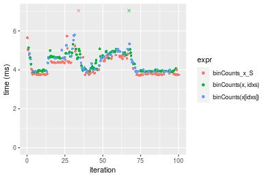

[matrixStats]: Benchmark report

---------------------------------------


# binCounts() benchmarks on subsetted computation

This report benchmark the performance of binCounts() on subsetted computation.


## Data type "integer"

### Non-sorted simulated data
```r
> set.seed(48879)
> nx <- 1e+05
> xmax <- 0.01 * nx
> x <- runif(nx, min = 0, max = xmax)
> storage.mode(x) <- mode
> str(x)
 int [1:100000] 722 285 591 3 349 509 216 91 150 383 ...
> nb <- 10000
> bx <- seq(from = 0, to = xmax, length.out = nb + 1L)
> bx <- c(-1, bx, xmax + 1)
> idxs <- sample.int(length(x), size = length(x) * 0.7)
```

### Results


```r
> x_S <- x[idxs]
> gc()
           used  (Mb) gc trigger  (Mb) max used  (Mb)
Ncells  5163985 275.8    7916910 422.9  7916910 422.9
Vcells 20278435 154.8   51861176 395.7 53339345 407.0
> stats <- microbenchmark(binCounts_x_S = binCounts(x_S, bx = bx), `binCounts(x, idxs)` = binCounts(x, 
+     idxs = idxs, bx = bx), `binCounts(x[idxs])` = binCounts(x[idxs], bx = bx), unit = "ms")
```

_Table: Benchmarking of binCounts_x_S(), binCounts(x, idxs)() and binCounts(x[idxs])() on integer+unsorted data. The top panel shows times in milliseconds and the bottom panel shows relative times._


|   |expr               |      min|       lq|     mean|   median|       uq|       max|
|:--|:------------------|--------:|--------:|--------:|--------:|--------:|---------:|
|1  |binCounts_x_S      | 3.719853| 3.763632| 4.208897| 3.880740| 4.545130|  9.346291|
|2  |binCounts(x, idxs) | 3.874295| 3.943125| 4.437107| 4.300498| 4.783243| 10.224092|
|3  |binCounts(x[idxs]) | 3.857082| 3.923934| 4.395350| 4.358210| 4.763532|  5.781915|


|   |expr               |      min|       lq|     mean|   median|       uq|      max|
|:--|:------------------|--------:|--------:|--------:|--------:|--------:|--------:|
|1  |binCounts_x_S      | 1.000000| 1.000000| 1.000000| 1.000000| 1.000000| 1.000000|
|2  |binCounts(x, idxs) | 1.041518| 1.047691| 1.054221| 1.108164| 1.052388| 1.093920|
|3  |binCounts(x[idxs]) | 1.036891| 1.042592| 1.044300| 1.123036| 1.048052| 0.618632|

_Figure: Benchmarking of binCounts_x_S(), binCounts(x, idxs)() and binCounts(x[idxs])() on integer+unsorted data.  Outliers are displayed as crosses.  Times are in milliseconds._




### Sorted simulated data
```r
> x <- sort(x)
> idxs <- sort(idxs)
```
```r
> x_S <- x[idxs]
> gc()
          used  (Mb) gc trigger  (Mb) max used  (Mb)
Ncells 5149669 275.1    7916910 422.9  7916910 422.9
Vcells 9102809  69.5   41488941 316.6 53339345 407.0
> stats <- microbenchmark(binCounts_x_S = binCounts(x_S, bx = bx), `binCounts(x, idxs)` = binCounts(x, 
+     idxs = idxs, bx = bx), `binCounts(x[idxs])` = binCounts(x[idxs], bx = bx), unit = "ms")
```

_Table: Benchmarking of binCounts_x_S(), binCounts(x, idxs)() and binCounts(x[idxs])() on integer+sorted data. The top panel shows times in milliseconds and the bottom panel shows relative times._


|   |expr               |      min|        lq|      mean|    median|        uq|      max|
|:--|:------------------|--------:|---------:|---------:|---------:|---------:|--------:|
|1  |binCounts_x_S      | 0.389301| 0.4274690| 0.5977605| 0.4648495| 0.7413460| 1.116528|
|3  |binCounts(x[idxs]) | 0.525772| 0.5964815| 0.7913820| 0.6167385| 0.7711025| 4.826845|
|2  |binCounts(x, idxs) | 0.524227| 0.5948650| 0.8445269| 0.6219030| 0.9775805| 4.338583|


|   |expr               |      min|       lq|     mean|   median|       uq|      max|
|:--|:------------------|--------:|--------:|--------:|--------:|--------:|--------:|
|1  |binCounts_x_S      | 1.000000| 1.000000| 1.000000| 1.000000| 1.000000| 1.000000|
|3  |binCounts(x[idxs]) | 1.350554| 1.395379| 1.323911| 1.326749| 1.040139| 4.323085|
|2  |binCounts(x, idxs) | 1.346585| 1.391598| 1.412818| 1.337859| 1.318656| 3.885781|

_Figure: Benchmarking of binCounts_x_S(), binCounts(x, idxs)() and binCounts(x[idxs])() on integer+sorted data.  Outliers are displayed as crosses.  Times are in milliseconds._


## Data type "double"

### Non-sorted simulated data
```r
> set.seed(48879)
> nx <- 1e+05
> xmax <- 0.01 * nx
> x <- runif(nx, min = 0, max = xmax)
> storage.mode(x) <- mode
> str(x)
 num [1:100000] 722.11 285.54 591.33 3.42 349.14 ...
> nb <- 10000
> bx <- seq(from = 0, to = xmax, length.out = nb + 1L)
> bx <- c(-1, bx, xmax + 1)
> idxs <- sample.int(length(x), size = length(x) * 0.7)
```

### Results


```r
> x_S <- x[idxs]
> gc()
          used  (Mb) gc trigger  (Mb) max used  (Mb)
Ncells 5149745 275.1    7916910 422.9  7916910 422.9
Vcells 9188378  70.2   33191153 253.3 53339345 407.0
> stats <- microbenchmark(binCounts_x_S = binCounts(x_S, bx = bx), `binCounts(x, idxs)` = binCounts(x, 
+     idxs = idxs, bx = bx), `binCounts(x[idxs])` = binCounts(x[idxs], bx = bx), unit = "ms")
```

_Table: Benchmarking of binCounts_x_S(), binCounts(x, idxs)() and binCounts(x[idxs])() on double+unsorted data. The top panel shows times in milliseconds and the bottom panel shows relative times._


|   |expr               |      min|       lq|     mean|   median|       uq|       max|
|:--|:------------------|--------:|--------:|--------:|--------:|--------:|---------:|
|1  |binCounts_x_S      | 5.087195| 5.127521| 5.369601| 5.169205| 5.219648| 10.126321|
|3  |binCounts(x[idxs]) | 5.305073| 5.358559| 5.534258| 5.390321| 5.502022| 10.321932|
|2  |binCounts(x, idxs) | 5.273486| 5.362463| 5.528350| 5.401738| 5.526019|  7.389614|


|   |expr               |      min|       lq|     mean|   median|       uq|       max|
|:--|:------------------|--------:|--------:|--------:|--------:|--------:|---------:|
|1  |binCounts_x_S      | 1.000000| 1.000000| 1.000000| 1.000000| 1.000000| 1.0000000|
|3  |binCounts(x[idxs]) | 1.042829| 1.045058| 1.030665| 1.042776| 1.054098| 1.0193171|
|2  |binCounts(x, idxs) | 1.036620| 1.045820| 1.029564| 1.044984| 1.058696| 0.7297432|

_Figure: Benchmarking of binCounts_x_S(), binCounts(x, idxs)() and binCounts(x[idxs])() on double+unsorted data.  Outliers are displayed as crosses.  Times are in milliseconds._


### Sorted simulated data
```r
> x <- sort(x)
> idxs <- sort(idxs)
```
```r
> x_S <- x[idxs]
> gc()
          used  (Mb) gc trigger  (Mb) max used  (Mb)
Ncells 5149819 275.1    7916910 422.9  7916910 422.9
Vcells 9188427  70.2   33191153 253.3 53339345 407.0
> stats <- microbenchmark(binCounts_x_S = binCounts(x_S, bx = bx), `binCounts(x, idxs)` = binCounts(x, 
+     idxs = idxs, bx = bx), `binCounts(x[idxs])` = binCounts(x[idxs], bx = bx), unit = "ms")
```

_Table: Benchmarking of binCounts_x_S(), binCounts(x, idxs)() and binCounts(x[idxs])() on double+sorted data. The top panel shows times in milliseconds and the bottom panel shows relative times._


|   |expr               |      min|       lq|     mean|   median|       uq|      max|
|:--|:------------------|--------:|--------:|--------:|--------:|--------:|--------:|
|1  |binCounts_x_S      | 1.087128| 1.129077| 1.216472| 1.161497| 1.242320| 1.891193|
|3  |binCounts(x[idxs]) | 1.242649| 1.278549| 1.428190| 1.299653| 1.403714| 4.931474|
|2  |binCounts(x, idxs) | 1.239881| 1.283872| 1.407194| 1.301867| 1.436963| 4.894416|


|   |expr               |      min|       lq|     mean|   median|       uq|      max|
|:--|:------------------|--------:|--------:|--------:|--------:|--------:|--------:|
|1  |binCounts_x_S      | 1.000000| 1.000000| 1.000000| 1.000000| 1.000000| 1.000000|
|3  |binCounts(x[idxs]) | 1.143057| 1.132384| 1.174042| 1.118946| 1.129913| 2.607600|
|2  |binCounts(x, idxs) | 1.140511| 1.137099| 1.156783| 1.120853| 1.156677| 2.588004|

_Figure: Benchmarking of binCounts_x_S(), binCounts(x, idxs)() and binCounts(x[idxs])() on double+sorted data.  Outliers are displayed as crosses.  Times are in milliseconds._


## Appendix

### Session information
```r
R version 4.1.1 Patched (2021-08-10 r80727)
Platform: x86_64-pc-linux-gnu (64-bit)
Running under: Ubuntu 18.04.5 LTS

Matrix products: default
BLAS:   /home/hb/software/R-devel/R-4-1-branch/lib/R/lib/libRblas.so
LAPACK: /home/hb/software/R-devel/R-4-1-branch/lib/R/lib/libRlapack.so

locale:
 [1] LC_CTYPE=en_US.UTF-8       LC_NUMERIC=C              
 [3] LC_TIME=en_US.UTF-8        LC_COLLATE=en_US.UTF-8    
 [5] LC_MONETARY=en_US.UTF-8    LC_MESSAGES=en_US.UTF-8   
 [7] LC_PAPER=en_US.UTF-8       LC_NAME=C                 
 [9] LC_ADDRESS=C               LC_TELEPHONE=C            
[11] LC_MEASUREMENT=en_US.UTF-8 LC_IDENTIFICATION=C       

attached base packages:
[1] stats     graphics  grDevices utils     datasets  methods   base     

other attached packages:
[1] microbenchmark_1.4-7   matrixStats_0.60.0     ggplot2_3.3.5         
[4] knitr_1.33             R.devices_2.17.0       R.utils_2.10.1        
[7] R.oo_1.24.0            R.methodsS3_1.8.1-9001 history_0.0.1-9000    

loaded via a namespace (and not attached):
 [1] Biobase_2.52.0          httr_1.4.2              splines_4.1.1          
 [4] bit64_4.0.5             network_1.17.1          assertthat_0.2.1       
 [7] highr_0.9               stats4_4.1.1            blob_1.2.2             
[10] GenomeInfoDbData_1.2.6  robustbase_0.93-8       pillar_1.6.2           
[13] RSQLite_2.2.8           lattice_0.20-44         glue_1.4.2             
[16] digest_0.6.27           XVector_0.32.0          colorspace_2.0-2       
[19] Matrix_1.3-4            XML_3.99-0.7            pkgconfig_2.0.3        
[22] zlibbioc_1.38.0         genefilter_1.74.0       purrr_0.3.4            
[25] ergm_4.1.2              xtable_1.8-4            scales_1.1.1           
[28] tibble_3.1.4            annotate_1.70.0         KEGGREST_1.32.0        
[31] farver_2.1.0            generics_0.1.0          IRanges_2.26.0         
[34] ellipsis_0.3.2          cachem_1.0.6            withr_2.4.2            
[37] BiocGenerics_0.38.0     mime_0.11               survival_3.2-13        
[40] magrittr_2.0.1          crayon_1.4.1            statnet.common_4.5.0   
[43] memoise_2.0.0           laeken_0.5.1            fansi_0.5.0            
[46] R.cache_0.15.0          MASS_7.3-54             R.rsp_0.44.0           
[49] progressr_0.8.0         tools_4.1.1             lifecycle_1.0.0        
[52] S4Vectors_0.30.0        trust_0.1-8             munsell_0.5.0          
[55] tabby_0.0.1-9001        AnnotationDbi_1.54.1    Biostrings_2.60.2      
[58] compiler_4.1.1          GenomeInfoDb_1.28.1     rlang_0.4.11           
[61] grid_4.1.1              RCurl_1.98-1.4          cwhmisc_6.6            
[64] rstudioapi_0.13         rappdirs_0.3.3          startup_0.15.0         
[67] labeling_0.4.2          bitops_1.0-7            base64enc_0.1-3        
[70] boot_1.3-28             gtable_0.3.0            DBI_1.1.1              
[73] markdown_1.1            R6_2.5.1                lpSolveAPI_5.5.2.0-17.7
[76] rle_0.9.2               dplyr_1.0.7             fastmap_1.1.0          
[79] bit_4.0.4               utf8_1.2.2              parallel_4.1.1         
[82] Rcpp_1.0.7              vctrs_0.3.8             png_0.1-7              
[85] DEoptimR_1.0-9          tidyselect_1.1.1        xfun_0.25              
[88] coda_0.19-4            
```
Total processing time was 7.05 secs.


### Reproducibility
To reproduce this report, do:
```r
html <- matrixStats:::benchmark('binCounts_subset')
```

[RSP]: https://cran.r-project.org/package=R.rsp
[matrixStats]: https://cran.r-project.org/package=matrixStats

[StackOverflow:colMins?]: https://stackoverflow.com/questions/13676878 "Stack Overflow: fastest way to get Min from every column in a matrix?"
[StackOverflow:colSds?]: https://stackoverflow.com/questions/17549762 "Stack Overflow: Is there such 'colsd' in R?"
[StackOverflow:rowProds?]: https://stackoverflow.com/questions/20198801/ "Stack Overflow: Row product of matrix and column sum of matrix"

---------------------------------------
Copyright Dongcan Jiang. Last updated on 2021-08-25 22:09:14 (+0200 UTC). Powered by [RSP].

<script>
 var link = document.createElement('link');
 link.rel = 'icon';
 link.href = "data:image/png;base64,iVBORw0KGgoAAAANSUhEUgAAACAAAAAgCAMAAABEpIrGAAAA21BMVEUAAAAAAP8AAP8AAP8AAP8AAP8AAP8AAP8AAP8AAP8AAP8AAP8AAP8AAP8AAP8AAP8AAP8AAP8AAP8AAP8AAP8AAP8AAP8AAP8AAP8AAP8AAP8AAP8AAP8AAP8AAP8AAP8AAP8AAP8AAP8AAP8AAP8AAP8AAP8AAP8AAP8AAP8BAf4CAv0DA/wdHeIeHuEfH+AgIN8hId4lJdomJtknJ9g+PsE/P8BAQL9yco10dIt1dYp3d4h4eIeVlWqWlmmXl2iYmGeZmWabm2Tn5xjo6Bfp6Rb39wj4+Af//wA2M9hbAAAASXRSTlMAAQIJCgsMJSYnKD4/QGRlZmhpamtsbautrrCxuru8y8zN5ebn6Pn6+///////////////////////////////////////////LsUNcQAAAS9JREFUOI29k21XgkAQhVcFytdSMqMETU26UVqGmpaiFbL//xc1cAhhwVNf6n5i5z67M2dmYOyfJZUqlVLhkKucG7cgmUZTybDz6g0iDeq51PUr37Ds2cy2/C9NeES5puDjxuUk1xnToZsg8pfA3avHQ3lLIi7iWRrkv/OYtkScxBIMgDee0ALoyxHQBJ68JLCjOtQIMIANF7QG9G9fNnHvisCHBVMKgSJgiz7nE+AoBKrAPA3MgepvgR9TSCasrCKH0eB1wBGBFdCO+nAGjMVGPcQb5bd6mQRegN6+1axOs9nGfYcCtfi4NQosdtH7dB+txFIpXQqN1p9B/asRHToyS0jRgpV7nk4nwcq1BJ+x3Gl/v7S9Wmpp/aGquum7w3ZDyrADFYrl8vHBH+ev9AUASW1dmU4h4wAAAABJRU5ErkJggg=="
 document.getElementsByTagName('head')[0].appendChild(link);
</script>


