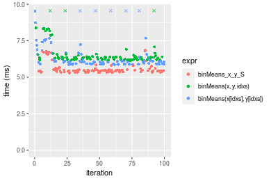
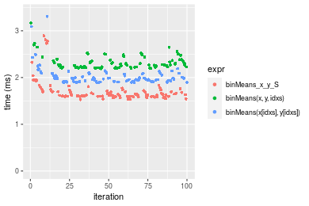

[matrixStats]: Benchmark report

---------------------------------------


# binMeans() benchmarks on subsetted computation

This report benchmark the performance of binMeans() on subsetted computation.


## Results

### Non-sorted simulated data
```r
> nx <- 1e+05
> set.seed(48879)
> x <- runif(nx, min = 0, max = 1)
> y <- runif(nx, min = 0, max = 1)
> nb <- 1000
> bx <- seq(from = 0, to = 1, length.out = nb + 1L)
> bx <- c(-1, bx, 2)
> idxs <- sample.int(length(x), size = length(x) * 0.7)
```


```r
> x_S <- x[idxs]
> y_S <- y[idxs]
> gc()
          used  (Mb) gc trigger  (Mb) max used  (Mb)
Ncells 5144098 274.8    7554717 403.5  7554717 403.5
Vcells 9400573  71.8   31793280 242.6 60508962 461.7
> stats <- microbenchmark(binMeans_x_y_S = binMeans(x = x_S, y = y_S, bx = bx, count = TRUE), `binMeans(x, y, idxs)` = binMeans(x = x, 
+     y = y, idxs = idxs, bx = bx, count = TRUE), `binMeans(x[idxs], y[idxs])` = binMeans(x = x[idxs], 
+     y = y[idxs], bx = bx, count = TRUE), unit = "ms")
```

_Table: Benchmarking of binMeans_x_y_S(), binMeans(x, y, idxs)() and binMeans(x[idxs], y[idxs])() on unsorted data. The top panel shows times in milliseconds and the bottom panel shows relative times._


|   |expr                       |      min|       lq|     mean|   median|       uq|      max|
|:--|:--------------------------|--------:|--------:|--------:|--------:|--------:|--------:|
|1  |binMeans_x_y_S             | 5.295053| 5.371904| 5.768867| 5.422460| 5.482106| 10.97979|
|3  |binMeans(x[idxs], y[idxs]) | 5.834003| 5.881608| 6.254281| 5.991166| 6.121510| 13.60957|
|2  |binMeans(x, y, idxs)       | 6.132473| 6.185350| 6.532740| 6.279776| 6.371736| 11.80808|


|   |expr                       |      min|       lq|     mean|   median|       uq|      max|
|:--|:--------------------------|--------:|--------:|--------:|--------:|--------:|--------:|
|1  |binMeans_x_y_S             | 1.000000| 1.000000| 1.000000| 1.000000| 1.000000| 1.000000|
|3  |binMeans(x[idxs], y[idxs]) | 1.101784| 1.094883| 1.084144| 1.104880| 1.116635| 1.239511|
|2  |binMeans(x, y, idxs)       | 1.158151| 1.151426| 1.132413| 1.158104| 1.162279| 1.075437|

_Figure: Benchmarking of binMeans_x_y_S(), binMeans(x, y, idxs)() and binMeans(x[idxs], y[idxs])() on unsorted data.  Outliers are displayed as crosses.  Times are in milliseconds._




### Sorted simulated data
```r
> x <- sort(x)
> idxs <- sort(idxs)
```
```r
> x_S <- x[idxs]
> y_S <- y[idxs]
> gc()
          used  (Mb) gc trigger  (Mb) max used  (Mb)
Ncells 5142598 274.7    7554717 403.5  7554717 403.5
Vcells 9289410  70.9   31793280 242.6 60508962 461.7
> stats <- microbenchmark(binMeans_x_y_S = binMeans(x = x_S, y = y_S, bx = bx, count = TRUE), `binMeans(x, y, idxs)` = binMeans(x = x, 
+     y = y, idxs = idxs, bx = bx, count = TRUE), `binMeans(x[idxs], y[idxs])` = binMeans(x = x[idxs], 
+     y = y[idxs], bx = bx, count = TRUE), unit = "ms")
```

_Table: Benchmarking of binMeans_x_y_S(), binMeans(x, y, idxs)() and binMeans(x[idxs], y[idxs])() on sorted data. The top panel shows times in milliseconds and the bottom panel shows relative times._


|   |expr                       |      min|       lq|     mean|   median|       uq|        max|
|:--|:--------------------------|--------:|--------:|--------:|--------:|--------:|----------:|
|1  |binMeans_x_y_S             | 1.493885| 1.571170| 5.056606| 1.671286| 1.867169| 325.362192|
|3  |binMeans(x[idxs], y[idxs]) | 1.854640| 1.915593| 2.224514| 2.005399| 2.148793|   6.082207|
|2  |binMeans(x, y, idxs)       | 2.143081| 2.214783| 2.650789| 2.328994| 2.625373|   7.874453|


|   |expr                       |      min|       lq|      mean|   median|       uq|       max|
|:--|:--------------------------|--------:|--------:|---------:|--------:|--------:|---------:|
|1  |binMeans_x_y_S             | 1.000000| 1.000000| 1.0000000| 1.000000| 1.000000| 1.0000000|
|3  |binMeans(x[idxs], y[idxs]) | 1.241488| 1.219215| 0.4399224| 1.199914| 1.150829| 0.0186937|
|2  |binMeans(x, y, idxs)       | 1.434569| 1.409640| 0.5242230| 1.393534| 1.406071| 0.0242021|

_Figure: Benchmarking of binMeans_x_y_S(), binMeans(x, y, idxs)() and binMeans(x[idxs], y[idxs])() on sorted data.  Outliers are displayed as crosses.  Times are in milliseconds._




## Appendix

### Session information
```r
R version 4.1.1 Patched (2021-08-10 r80727)
Platform: x86_64-pc-linux-gnu (64-bit)
Running under: Ubuntu 18.04.5 LTS

Matrix products: default
BLAS:   /home/hb/software/R-devel/R-4-1-branch/lib/R/lib/libRblas.so
LAPACK: /home/hb/software/R-devel/R-4-1-branch/lib/R/lib/libRlapack.so

locale:
 [1] LC_CTYPE=en_US.UTF-8       LC_NUMERIC=C              
 [3] LC_TIME=en_US.UTF-8        LC_COLLATE=en_US.UTF-8    
 [5] LC_MONETARY=en_US.UTF-8    LC_MESSAGES=en_US.UTF-8   
 [7] LC_PAPER=en_US.UTF-8       LC_NAME=C                 
 [9] LC_ADDRESS=C               LC_TELEPHONE=C            
[11] LC_MEASUREMENT=en_US.UTF-8 LC_IDENTIFICATION=C       

attached base packages:
[1] stats     graphics  grDevices utils     datasets  methods   base     

other attached packages:
[1] microbenchmark_1.4-7   matrixStats_0.60.0     ggplot2_3.3.5         
[4] knitr_1.33             R.devices_2.17.0       R.utils_2.10.1        
[7] R.oo_1.24.0            R.methodsS3_1.8.1-9001

loaded via a namespace (and not attached):
 [1] Biobase_2.52.0          httr_1.4.2              splines_4.1.1          
 [4] bit64_4.0.5             network_1.17.1          assertthat_0.2.1       
 [7] highr_0.9               stats4_4.1.1            blob_1.2.2             
[10] GenomeInfoDbData_1.2.6  robustbase_0.93-8       pillar_1.6.2           
[13] RSQLite_2.2.8           lattice_0.20-44         glue_1.4.2             
[16] digest_0.6.27           XVector_0.32.0          colorspace_2.0-2       
[19] Matrix_1.3-4            XML_3.99-0.7            pkgconfig_2.0.3        
[22] zlibbioc_1.38.0         genefilter_1.74.0       purrr_0.3.4            
[25] ergm_4.1.2              xtable_1.8-4            scales_1.1.1           
[28] tibble_3.1.4            annotate_1.70.0         KEGGREST_1.32.0        
[31] farver_2.1.0            generics_0.1.0          IRanges_2.26.0         
[34] ellipsis_0.3.2          cachem_1.0.6            withr_2.4.2            
[37] BiocGenerics_0.38.0     mime_0.11               survival_3.2-13        
[40] magrittr_2.0.1          crayon_1.4.1            statnet.common_4.5.0   
[43] memoise_2.0.0           laeken_0.5.1            fansi_0.5.0            
[46] R.cache_0.15.0          MASS_7.3-54             R.rsp_0.44.0           
[49] tools_4.1.1             lifecycle_1.0.0         S4Vectors_0.30.0       
[52] trust_0.1-8             munsell_0.5.0           AnnotationDbi_1.54.1   
[55] Biostrings_2.60.2       compiler_4.1.1          GenomeInfoDb_1.28.1    
[58] rlang_0.4.11            grid_4.1.1              RCurl_1.98-1.4         
[61] cwhmisc_6.6             rappdirs_0.3.3          labeling_0.4.2         
[64] bitops_1.0-7            base64enc_0.1-3         boot_1.3-28            
[67] gtable_0.3.0            DBI_1.1.1               markdown_1.1           
[70] R6_2.5.1                lpSolveAPI_5.5.2.0-17.7 rle_0.9.2              
[73] dplyr_1.0.7             fastmap_1.1.0           bit_4.0.4              
[76] utf8_1.2.2              parallel_4.1.1          Rcpp_1.0.7             
[79] vctrs_0.3.8             png_0.1-7               DEoptimR_1.0-9         
[82] tidyselect_1.1.1        xfun_0.25               coda_0.19-4            
```
Total processing time was 4.49 secs.


### Reproducibility
To reproduce this report, do:
```r
html <- matrixStats:::benchmark('binMeans')
```

[RSP]: https://cran.r-project.org/package=R.rsp
[matrixStats]: https://cran.r-project.org/package=matrixStats

[StackOverflow:colMins?]: https://stackoverflow.com/questions/13676878 "Stack Overflow: fastest way to get Min from every column in a matrix?"
[StackOverflow:colSds?]: https://stackoverflow.com/questions/17549762 "Stack Overflow: Is there such 'colsd' in R?"
[StackOverflow:rowProds?]: https://stackoverflow.com/questions/20198801/ "Stack Overflow: Row product of matrix and column sum of matrix"

---------------------------------------
Copyright Dongcan Jiang. Last updated on 2021-08-25 17:33:50 (+0200 UTC). Powered by [RSP].

<script>
 var link = document.createElement('link');
 link.rel = 'icon';
 link.href = "data:image/png;base64,iVBORw0KGgoAAAANSUhEUgAAACAAAAAgCAMAAABEpIrGAAAA21BMVEUAAAAAAP8AAP8AAP8AAP8AAP8AAP8AAP8AAP8AAP8AAP8AAP8AAP8AAP8AAP8AAP8AAP8AAP8AAP8AAP8AAP8AAP8AAP8AAP8AAP8AAP8AAP8AAP8AAP8AAP8AAP8AAP8AAP8AAP8AAP8AAP8AAP8AAP8AAP8AAP8AAP8AAP8BAf4CAv0DA/wdHeIeHuEfH+AgIN8hId4lJdomJtknJ9g+PsE/P8BAQL9yco10dIt1dYp3d4h4eIeVlWqWlmmXl2iYmGeZmWabm2Tn5xjo6Bfp6Rb39wj4+Af//wA2M9hbAAAASXRSTlMAAQIJCgsMJSYnKD4/QGRlZmhpamtsbautrrCxuru8y8zN5ebn6Pn6+///////////////////////////////////////////LsUNcQAAAS9JREFUOI29k21XgkAQhVcFytdSMqMETU26UVqGmpaiFbL//xc1cAhhwVNf6n5i5z67M2dmYOyfJZUqlVLhkKucG7cgmUZTybDz6g0iDeq51PUr37Ds2cy2/C9NeES5puDjxuUk1xnToZsg8pfA3avHQ3lLIi7iWRrkv/OYtkScxBIMgDee0ALoyxHQBJ68JLCjOtQIMIANF7QG9G9fNnHvisCHBVMKgSJgiz7nE+AoBKrAPA3MgepvgR9TSCasrCKH0eB1wBGBFdCO+nAGjMVGPcQb5bd6mQRegN6+1axOs9nGfYcCtfi4NQosdtH7dB+txFIpXQqN1p9B/asRHToyS0jRgpV7nk4nwcq1BJ+x3Gl/v7S9Wmpp/aGquum7w3ZDyrADFYrl8vHBH+ev9AUASW1dmU4h4wAAAABJRU5ErkJggg=="
 document.getElementsByTagName('head')[0].appendChild(link);
</script>


