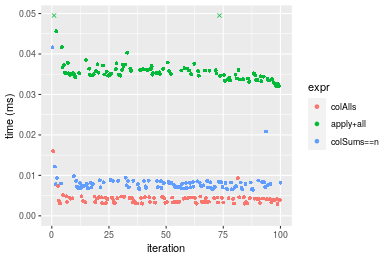
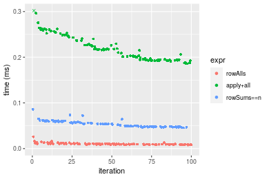
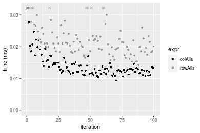
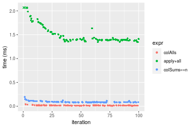
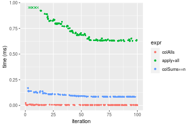

[matrixStats]: Benchmark report

---------------------------------------


# colAlls() and rowAlls() benchmarks

This report benchmark the performance of colAlls() and rowAlls() against alternative methods.

## Alternative methods

* apply() + all()
* colSums() == n or rowSums() == n


## Data
```r
> rmatrix <- function(nrow, ncol, mode = c("logical", "double", "integer", "index"), range = c(-100, 
+     +100), na_prob = 0) {
+     mode <- match.arg(mode)
+     n <- nrow * ncol
+     if (mode == "logical") {
+         x <- sample(c(FALSE, TRUE), size = n, replace = TRUE)
+     }     else if (mode == "index") {
+         x <- seq_len(n)
+         mode <- "integer"
+     }     else {
+         x <- runif(n, min = range[1], max = range[2])
+     }
+     storage.mode(x) <- mode
+     if (na_prob > 0) 
+         x[sample(n, size = na_prob * n)] <- NA
+     dim(x) <- c(nrow, ncol)
+     x
+ }
> rmatrices <- function(scale = 10, seed = 1, ...) {
+     set.seed(seed)
+     data <- list()
+     data[[1]] <- rmatrix(nrow = scale * 1, ncol = scale * 1, ...)
+     data[[2]] <- rmatrix(nrow = scale * 10, ncol = scale * 10, ...)
+     data[[3]] <- rmatrix(nrow = scale * 100, ncol = scale * 1, ...)
+     data[[4]] <- t(data[[3]])
+     data[[5]] <- rmatrix(nrow = scale * 10, ncol = scale * 100, ...)
+     data[[6]] <- t(data[[5]])
+     names(data) <- sapply(data, FUN = function(x) paste(dim(x), collapse = "x"))
+     data
+ }
> data <- rmatrices(mode = "logical")
```

## Results

### 10x10 matrix


```r
> X <- data[["10x10"]]
> gc()
          used  (Mb) gc trigger  (Mb) max used  (Mb)
Ncells 5178000 276.6    7916910 422.9  7916910 422.9
Vcells 9439896  72.1   33191153 253.3 53339345 407.0
> colStats <- microbenchmark(colAlls = colAlls(X), `apply+all` = apply(X, MARGIN = 2L, FUN = all), 
+     `colSums==n` = (colSums(X) == nrow(X)), unit = "ms")
> X <- t(X)
> gc()
          used  (Mb) gc trigger  (Mb) max used  (Mb)
Ncells 5164311 275.9    7916910 422.9  7916910 422.9
Vcells 9394591  71.7   33191153 253.3 53339345 407.0
> rowStats <- microbenchmark(rowAlls = rowAlls(X), `apply+all` = apply(X, MARGIN = 1L, FUN = all), 
+     `rowSums==n` = (rowSums(X) == ncol(X)), unit = "ms")
```

_Table: Benchmarking of colAlls(), apply+all() and colSums==n() on 10x10 data. The top panel shows times in milliseconds and the bottom panel shows relative times._


|   |expr       |      min|        lq|      mean|    median|       uq|      max|
|:--|:----------|--------:|---------:|---------:|---------:|--------:|--------:|
|1  |colAlls    | 0.002918| 0.0033165| 0.0040829| 0.0040155| 0.004426| 0.015997|
|3  |colSums==n | 0.006390| 0.0069745| 0.0081633| 0.0076470| 0.008282| 0.041658|
|2  |apply+all  | 0.032027| 0.0346345| 0.0360910| 0.0352475| 0.036222| 0.086653|


|   |expr       |       min|       lq|     mean|   median|       uq|      max|
|:--|:----------|---------:|--------:|--------:|--------:|--------:|--------:|
|1  |colAlls    |  1.000000|  1.00000| 1.000000| 1.000000| 1.000000| 1.000000|
|3  |colSums==n |  2.189856|  2.10297| 1.999383| 1.904371| 1.871215| 2.604113|
|2  |apply+all  | 10.975668| 10.44309| 8.839505| 8.777861| 8.183913| 5.416828|

_Table: Benchmarking of rowAlls(), apply+all() and rowSums==n() on 10x10 data (transposed). The top panel shows times in milliseconds and the bottom panel shows relative times._


|   |expr       |      min|        lq|      mean|    median|        uq|      max|
|:--|:----------|--------:|---------:|---------:|---------:|---------:|--------:|
|1  |rowAlls    | 0.002918| 0.0032065| 0.0039516| 0.0039845| 0.0042960| 0.017575|
|3  |rowSums==n | 0.006662| 0.0073095| 0.0084375| 0.0079800| 0.0085190| 0.053558|
|2  |apply+all  | 0.030570| 0.0324275| 0.0341682| 0.0330865| 0.0341165| 0.081091|


|   |expr       |       min|        lq|     mean|   median|       uq|      max|
|:--|:----------|---------:|---------:|--------:|--------:|--------:|--------:|
|1  |rowAlls    |  1.000000|  1.000000| 1.000000| 1.000000| 1.000000| 1.000000|
|3  |rowSums==n |  2.283071|  2.279588| 2.135227| 2.002761| 1.983007| 3.047397|
|2  |apply+all  | 10.476354| 10.113052| 8.646735| 8.303802| 7.941457| 4.613997|

_Figure: Benchmarking of colAlls(), apply+all() and colSums==n() on 10x10 data  as well as rowAlls(), apply+all() and rowSums==n() on the same data transposed.  Outliers are displayed as crosses.  Times are in milliseconds._





_Table: Benchmarking of colAlls() and rowAlls() on 10x10 data (original and transposed).  The top panel shows times in milliseconds and the bottom panel shows relative times._


|   |expr    |   min|     lq|    mean| median|    uq|    max|
|:--|:-------|-----:|------:|-------:|------:|-----:|------:|
|2  |rowAlls | 2.918| 3.2065| 3.95157| 3.9845| 4.296| 17.575|
|1  |colAlls | 2.918| 3.3165| 4.08292| 4.0155| 4.426| 15.997|


|   |expr    | min|       lq|    mean|  median|       uq|       max|
|:--|:-------|---:|--------:|-------:|-------:|--------:|---------:|
|2  |rowAlls |   1| 1.000000| 1.00000| 1.00000| 1.000000| 1.0000000|
|1  |colAlls |   1| 1.034305| 1.03324| 1.00778| 1.030261| 0.9102134|

_Figure: Benchmarking of colAlls() and rowAlls() on 10x10 data (original and transposed).  Outliers are displayed as crosses. Times are in milliseconds._


### 100x100 matrix


```r
> X <- data[["100x100"]]
> gc()
          used  (Mb) gc trigger  (Mb) max used  (Mb)
Ncells 5162874 275.8    7916910 422.9  7916910 422.9
Vcells 9200790  70.2   33191153 253.3 53339345 407.0
> colStats <- microbenchmark(colAlls = colAlls(X), `apply+all` = apply(X, MARGIN = 2L, FUN = all), 
+     `colSums==n` = (colSums(X) == nrow(X)), unit = "ms")
> X <- t(X)
> gc()
          used  (Mb) gc trigger  (Mb) max used  (Mb)
Ncells 5162868 275.8    7916910 422.9  7916910 422.9
Vcells 9205833  70.3   33191153 253.3 53339345 407.0
> rowStats <- microbenchmark(rowAlls = rowAlls(X), `apply+all` = apply(X, MARGIN = 1L, FUN = all), 
+     `rowSums==n` = (rowSums(X) == ncol(X)), unit = "ms")
```

_Table: Benchmarking of colAlls(), apply+all() and colSums==n() on 100x100 data. The top panel shows times in milliseconds and the bottom panel shows relative times._


|   |expr       |      min|        lq|      mean|    median|       uq|      max|
|:--|:----------|--------:|---------:|---------:|---------:|--------:|--------:|
|1  |colAlls    | 0.002933| 0.0038555| 0.0049758| 0.0047205| 0.005187| 0.025572|
|3  |colSums==n | 0.015744| 0.0178695| 0.0200639| 0.0191665| 0.021673| 0.048562|
|2  |apply+all  | 0.194001| 0.2085905| 0.2306413| 0.2294020| 0.250898| 0.341773|


|   |expr       |       min|        lq|      mean|    median|       uq|      max|
|:--|:----------|---------:|---------:|---------:|---------:|--------:|--------:|
|1  |colAlls    |  1.000000|  1.000000|  1.000000|  1.000000|  1.00000|  1.00000|
|3  |colSums==n |  5.367883|  4.634807|  4.032323|  4.060269|  4.17833|  1.89903|
|2  |apply+all  | 66.144221| 54.102062| 46.352981| 48.596971| 48.37054| 13.36513|

_Table: Benchmarking of rowAlls(), apply+all() and rowSums==n() on 100x100 data (transposed). The top panel shows times in milliseconds and the bottom panel shows relative times._


|   |expr       |      min|        lq|      mean|    median|        uq|      max|
|:--|:----------|--------:|---------:|---------:|---------:|---------:|--------:|
|1  |rowAlls    | 0.007883| 0.0091750| 0.0103561| 0.0098445| 0.0107805| 0.025822|
|3  |rowSums==n | 0.045572| 0.0481485| 0.0536306| 0.0524420| 0.0584220| 0.085888|
|2  |apply+all  | 0.185799| 0.1944955| 0.2200996| 0.2165005| 0.2421380| 0.335716|


|   |expr       |       min|        lq|      mean|    median|        uq|       max|
|:--|:----------|---------:|---------:|---------:|---------:|---------:|---------:|
|1  |rowAlls    |  1.000000|  1.000000|  1.000000|  1.000000|  1.000000|  1.000000|
|3  |rowSums==n |  5.781048|  5.247793|  5.178666|  5.327035|  5.419229|  3.326156|
|2  |apply+all  | 23.569580| 21.198420| 21.253200| 21.992026| 22.460739| 13.001162|

_Figure: Benchmarking of colAlls(), apply+all() and colSums==n() on 100x100 data  as well as rowAlls(), apply+all() and rowSums==n() on the same data transposed.  Outliers are displayed as crosses.  Times are in milliseconds._



_Table: Benchmarking of colAlls() and rowAlls() on 100x100 data (original and transposed).  The top panel shows times in milliseconds and the bottom panel shows relative times._


|   |expr    |   min|     lq|     mean| median|      uq|    max|
|:--|:-------|-----:|------:|--------:|------:|-------:|------:|
|1  |colAlls | 2.933| 3.8555|  4.97576| 4.7205|  5.1870| 25.572|
|2  |rowAlls | 7.883| 9.1750| 10.35607| 9.8445| 10.7805| 25.822|


|   |expr    |      min|       lq|     mean|   median|       uq|      max|
|:--|:-------|--------:|--------:|--------:|--------:|--------:|--------:|
|1  |colAlls | 1.000000| 1.000000| 1.000000| 1.000000| 1.000000| 1.000000|
|2  |rowAlls | 2.687692| 2.379717| 2.081304| 2.085478| 2.078369| 1.009776|

_Figure: Benchmarking of colAlls() and rowAlls() on 100x100 data (original and transposed).  Outliers are displayed as crosses. Times are in milliseconds._


### 1000x10 matrix


```r
> X <- data[["1000x10"]]
> gc()
          used  (Mb) gc trigger  (Mb) max used  (Mb)
Ncells 5163624 275.8    7916910 422.9  7916910 422.9
Vcells 9204309  70.3   33191153 253.3 53339345 407.0
> colStats <- microbenchmark(colAlls = colAlls(X), `apply+all` = apply(X, MARGIN = 2L, FUN = all), 
+     `colSums==n` = (colSums(X) == nrow(X)), unit = "ms")
> X <- t(X)
> gc()
          used  (Mb) gc trigger  (Mb) max used  (Mb)
Ncells 5163618 275.8    7916910 422.9  7916910 422.9
Vcells 9209352  70.3   33191153 253.3 53339345 407.0
> rowStats <- microbenchmark(rowAlls = rowAlls(X), `apply+all` = apply(X, MARGIN = 1L, FUN = all), 
+     `rowSums==n` = (rowSums(X) == ncol(X)), unit = "ms")
```

_Table: Benchmarking of colAlls(), apply+all() and colSums==n() on 1000x10 data. The top panel shows times in milliseconds and the bottom panel shows relative times._


|   |expr       |      min|        lq|      mean|    median|        uq|      max|
|:--|:----------|--------:|---------:|---------:|---------:|---------:|--------:|
|1  |colAlls    | 0.002853| 0.0035520| 0.0043257| 0.0041145| 0.0047010| 0.017084|
|3  |colSums==n | 0.017351| 0.0194050| 0.0207849| 0.0201080| 0.0213510| 0.038464|
|2  |apply+all  | 0.106709| 0.1122245| 0.1243842| 0.1259220| 0.1296695| 0.202048|


|   |expr       |       min|        lq|      mean|    median|       uq|       max|
|:--|:----------|---------:|---------:|---------:|---------:|--------:|---------:|
|1  |colAlls    |  1.000000|  1.000000|  1.000000|  1.000000|  1.00000|  1.000000|
|3  |colSums==n |  6.081668|  5.463119|  4.805017|  4.887107|  4.54180|  2.251463|
|2  |apply+all  | 37.402383| 31.594735| 28.754896| 30.604448| 27.58339| 11.826738|

_Table: Benchmarking of rowAlls(), apply+all() and rowSums==n() on 1000x10 data (transposed). The top panel shows times in milliseconds and the bottom panel shows relative times._


|   |expr       |      min|        lq|      mean|    median|        uq|      max|
|:--|:----------|--------:|---------:|---------:|---------:|---------:|--------:|
|1  |rowAlls    | 0.008121| 0.0095930| 0.0124842| 0.0107530| 0.0134965| 0.025416|
|2  |apply+all  | 0.096428| 0.1016105| 0.1246757| 0.1089125| 0.1305395| 0.250102|
|3  |rowSums==n | 0.167941| 0.1753380| 0.1949295| 0.1870195| 0.2103385| 0.262439|


|   |expr       |      min|       lq|      mean|   median|       uq|       max|
|:--|:----------|--------:|--------:|---------:|--------:|--------:|---------:|
|1  |rowAlls    |  1.00000|  1.00000|  1.000000|  1.00000|  1.00000|  1.000000|
|2  |apply+all  | 11.87391| 10.59215|  9.986648| 10.12857|  9.67210|  9.840337|
|3  |rowSums==n | 20.67984| 18.27770| 15.614044| 17.39231| 15.58467| 10.325740|

_Figure: Benchmarking of colAlls(), apply+all() and colSums==n() on 1000x10 data  as well as rowAlls(), apply+all() and rowSums==n() on the same data transposed.  Outliers are displayed as crosses.  Times are in milliseconds._


_Table: Benchmarking of colAlls() and rowAlls() on 1000x10 data (original and transposed).  The top panel shows times in milliseconds and the bottom panel shows relative times._


|   |expr    |   min|    lq|     mean|  median|      uq|    max|
|:--|:-------|-----:|-----:|--------:|-------:|-------:|------:|
|1  |colAlls | 2.853| 3.552|  4.32567|  4.1145|  4.7010| 17.084|
|2  |rowAlls | 8.121| 9.593| 12.48424| 10.7530| 13.4965| 25.416|


|   |expr    |      min|       lq|     mean|  median|       uq|      max|
|:--|:-------|--------:|--------:|--------:|-------:|--------:|--------:|
|1  |colAlls | 1.000000| 1.000000| 1.000000| 1.00000| 1.000000| 1.000000|
|2  |rowAlls | 2.846477| 2.700732| 2.886082| 2.61344| 2.870985| 1.487708|

_Figure: Benchmarking of colAlls() and rowAlls() on 1000x10 data (original and transposed).  Outliers are displayed as crosses. Times are in milliseconds._


### 10x1000 matrix


```r
> X <- data[["10x1000"]]
> gc()
          used  (Mb) gc trigger  (Mb) max used  (Mb)
Ncells 5163838 275.8    7916910 422.9  7916910 422.9
Vcells 9205044  70.3   33191153 253.3 53339345 407.0
> colStats <- microbenchmark(colAlls = colAlls(X), `apply+all` = apply(X, MARGIN = 2L, FUN = all), 
+     `colSums==n` = (colSums(X) == nrow(X)), unit = "ms")
> X <- t(X)
> gc()
          used  (Mb) gc trigger  (Mb) max used  (Mb)
Ncells 5163832 275.8    7916910 422.9  7916910 422.9
Vcells 9210087  70.3   33191153 253.3 53339345 407.0
> rowStats <- microbenchmark(rowAlls = rowAlls(X), `apply+all` = apply(X, MARGIN = 1L, FUN = all), 
+     `rowSums==n` = (rowSums(X) == ncol(X)), unit = "ms")
```

_Table: Benchmarking of colAlls(), apply+all() and colSums==n() on 10x1000 data. The top panel shows times in milliseconds and the bottom panel shows relative times._


|   |expr       |      min|        lq|      mean|    median|        uq|      max|
|:--|:----------|--------:|---------:|---------:|---------:|---------:|--------:|
|1  |colAlls    | 0.009408| 0.0118870| 0.0140773| 0.0128055| 0.0148165| 0.035856|
|3  |colSums==n | 0.013396| 0.0143105| 0.0170158| 0.0159030| 0.0184325| 0.039828|
|2  |apply+all  | 0.858664| 0.8714435| 1.0008542| 0.9282170| 1.0878390| 1.492602|


|   |expr       |       min|        lq|      mean|    median|        uq|       max|
|:--|:----------|---------:|---------:|---------:|---------:|---------:|---------:|
|1  |colAlls    |  1.000000|  1.000000|  1.000000|  1.000000|  1.000000|  1.000000|
|3  |colSums==n |  1.423895|  1.203878|  1.208737|  1.241888|  1.244052|  1.110776|
|2  |apply+all  | 91.269558| 73.310633| 71.096930| 72.485807| 73.420781| 41.627677|

_Table: Benchmarking of rowAlls(), apply+all() and rowSums==n() on 10x1000 data (transposed). The top panel shows times in milliseconds and the bottom panel shows relative times._


|   |expr       |      min|        lq|      mean|    median|        uq|      max|
|:--|:----------|--------:|---------:|---------:|---------:|---------:|--------:|
|1  |rowAlls    | 0.014285| 0.0186485| 0.0226967| 0.0210525| 0.0241460| 0.067273|
|3  |rowSums==n | 0.028580| 0.0311925| 0.0361926| 0.0347380| 0.0387395| 0.062046|
|2  |apply+all  | 0.859912| 0.8921850| 1.0275150| 0.9945310| 1.1099595| 1.457040|


|   |expr       |      min|        lq|     mean|    median|        uq|        max|
|:--|:----------|--------:|---------:|--------:|---------:|---------:|----------:|
|1  |rowAlls    |  1.00000|  1.000000|  1.00000|  1.000000|  1.000000|  1.0000000|
|3  |rowSums==n |  2.00070|  1.672655|  1.59462|  1.650065|  1.604386|  0.9223017|
|2  |apply+all  | 60.19685| 47.842186| 45.27160| 47.240518| 45.968670| 21.6586149|

_Figure: Benchmarking of colAlls(), apply+all() and colSums==n() on 10x1000 data  as well as rowAlls(), apply+all() and rowSums==n() on the same data transposed.  Outliers are displayed as crosses.  Times are in milliseconds._


_Table: Benchmarking of colAlls() and rowAlls() on 10x1000 data (original and transposed).  The top panel shows times in milliseconds and the bottom panel shows relative times._


|   |expr    |    min|      lq|     mean|  median|      uq|    max|
|:--|:-------|------:|-------:|--------:|-------:|-------:|------:|
|1  |colAlls |  9.408| 11.8870| 14.07732| 12.8055| 14.8165| 35.856|
|2  |rowAlls | 14.285| 18.6485| 22.69668| 21.0525| 24.1460| 67.273|


|   |expr    |      min|       lq|     mean|  median|      uq|      max|
|:--|:-------|--------:|--------:|--------:|-------:|-------:|--------:|
|1  |colAlls | 1.000000| 1.000000| 1.000000| 1.00000| 1.00000| 1.000000|
|2  |rowAlls | 1.518389| 1.568815| 1.612287| 1.64402| 1.62967| 1.876199|

_Figure: Benchmarking of colAlls() and rowAlls() on 10x1000 data (original and transposed).  Outliers are displayed as crosses. Times are in milliseconds._




### 100x1000 matrix


```r
> X <- data[["100x1000"]]
> gc()
          used  (Mb) gc trigger  (Mb) max used  (Mb)
Ncells 5164047 275.8    7916910 422.9  7916910 422.9
Vcells 9205557  70.3   33191153 253.3 53339345 407.0
> colStats <- microbenchmark(colAlls = colAlls(X), `apply+all` = apply(X, MARGIN = 2L, FUN = all), 
+     `colSums==n` = (colSums(X) == nrow(X)), unit = "ms")
> X <- t(X)
> gc()
          used  (Mb) gc trigger  (Mb) max used  (Mb)
Ncells 5164035 275.8    7916910 422.9  7916910 422.9
Vcells 9255590  70.7   33191153 253.3 53339345 407.0
> rowStats <- microbenchmark(rowAlls = rowAlls(X), `apply+all` = apply(X, MARGIN = 1L, FUN = all), 
+     `rowSums==n` = (rowSums(X) == ncol(X)), unit = "ms")
```

_Table: Benchmarking of colAlls(), apply+all() and colSums==n() on 100x1000 data. The top panel shows times in milliseconds and the bottom panel shows relative times._


|   |expr       |      min|        lq|      mean|    median|       uq|      max|
|:--|:----------|--------:|---------:|---------:|---------:|--------:|--------:|
|1  |colAlls    | 0.011273| 0.0132780| 0.0157696| 0.0147690| 0.016544| 0.040375|
|3  |colSums==n | 0.081055| 0.0825335| 0.0932127| 0.0871075| 0.095800| 0.193283|
|2  |apply+all  | 1.347308| 1.3854070| 1.5263032| 1.3998815| 1.611465| 2.504890|


|   |expr       |        min|         lq|     mean|    median|        uq|       max|
|:--|:----------|----------:|----------:|--------:|---------:|---------:|---------:|
|1  |colAlls    |   1.000000|   1.000000|  1.00000|  1.000000|  1.000000|  1.000000|
|3  |colSums==n |   7.190189|   6.215808|  5.91093|  5.897996|  5.790619|  4.787195|
|2  |apply+all  | 119.516367| 104.338530| 96.78800| 94.785124| 97.404769| 62.040619|

_Table: Benchmarking of rowAlls(), apply+all() and rowSums==n() on 100x1000 data (transposed). The top panel shows times in milliseconds and the bottom panel shows relative times._


|   |expr       |      min|        lq|      mean|    median|        uq|      max|
|:--|:----------|--------:|---------:|---------:|---------:|---------:|--------:|
|1  |rowAlls    | 0.036765| 0.0383855| 0.0443383| 0.0407925| 0.0451965| 0.108958|
|3  |rowSums==n | 0.224237| 0.2258145| 0.2543480| 0.2275955| 0.2768195| 0.412877|
|2  |apply+all  | 1.350284| 1.3681070| 1.4806585| 1.3936725| 1.5038460| 2.501126|


|   |expr       |       min|        lq|      mean|    median|        uq|       max|
|:--|:----------|---------:|---------:|---------:|---------:|---------:|---------:|
|1  |rowAlls    |  1.000000|  1.000000|  1.000000|  1.000000|  1.000000|  1.000000|
|3  |rowSums==n |  6.099198|  5.882807|  5.736533|  5.579347|  6.124799|  3.789322|
|2  |apply+all  | 36.727431| 35.641245| 33.394586| 34.164920| 33.273506| 22.954955|

_Figure: Benchmarking of colAlls(), apply+all() and colSums==n() on 100x1000 data  as well as rowAlls(), apply+all() and rowSums==n() on the same data transposed.  Outliers are displayed as crosses.  Times are in milliseconds._





_Table: Benchmarking of colAlls() and rowAlls() on 100x1000 data (original and transposed).  The top panel shows times in milliseconds and the bottom panel shows relative times._


|   |expr    |    min|      lq|     mean|  median|      uq|     max|
|:--|:-------|------:|-------:|--------:|-------:|-------:|-------:|
|1  |colAlls | 11.273| 13.2780| 15.76955| 14.7690| 16.5440|  40.375|
|2  |rowAlls | 36.765| 38.3855| 44.33828| 40.7925| 45.1965| 108.958|


|   |expr    |      min|      lq|     mean|   median|       uq|     max|
|:--|:-------|--------:|-------:|--------:|--------:|--------:|-------:|
|1  |colAlls | 1.000000| 1.00000| 1.000000| 1.000000| 1.000000| 1.00000|
|2  |rowAlls | 3.261332| 2.89091| 2.811639| 2.762035| 2.731897| 2.69865|

_Figure: Benchmarking of colAlls() and rowAlls() on 100x1000 data (original and transposed).  Outliers are displayed as crosses. Times are in milliseconds._


### 1000x100 matrix


```r
> X <- data[["1000x100"]]
> gc()
          used  (Mb) gc trigger  (Mb) max used  (Mb)
Ncells 5164253 275.9    7916910 422.9  7916910 422.9
Vcells 9206220  70.3   33191153 253.3 53339345 407.0
> colStats <- microbenchmark(colAlls = colAlls(X), `apply+all` = apply(X, MARGIN = 2L, FUN = all), 
+     `colSums==n` = (colSums(X) == nrow(X)), unit = "ms")
> X <- t(X)
> gc()
          used  (Mb) gc trigger  (Mb) max used  (Mb)
Ncells 5164241 275.9    7916910 422.9  7916910 422.9
Vcells 9256253  70.7   33191153 253.3 53339345 407.0
> rowStats <- microbenchmark(rowAlls = rowAlls(X), `apply+all` = apply(X, MARGIN = 1L, FUN = all), 
+     `rowSums==n` = (rowSums(X) == ncol(X)), unit = "ms")
```

_Table: Benchmarking of colAlls(), apply+all() and colSums==n() on 1000x100 data. The top panel shows times in milliseconds and the bottom panel shows relative times._


|   |expr       |      min|        lq|      mean|    median|        uq|      max|
|:--|:----------|--------:|---------:|---------:|---------:|---------:|--------:|
|1  |colAlls    | 0.002754| 0.0036585| 0.0047849| 0.0042275| 0.0053800| 0.022840|
|3  |colSums==n | 0.082708| 0.0839100| 0.0986052| 0.0910275| 0.1086585| 0.168674|
|2  |apply+all  | 0.624761| 0.6350055| 0.7332335| 0.6904375| 0.7986980| 1.114454|


|   |expr       |       min|        lq|      mean|    median|        uq|       max|
|:--|:----------|---------:|---------:|---------:|---------:|---------:|---------:|
|1  |colAlls    |   1.00000|   1.00000|   1.00000|   1.00000|   1.00000|  1.000000|
|3  |colSums==n |  30.03195|  22.93563|  20.60766|  21.53223|  20.19675|  7.385026|
|2  |apply+all  | 226.85585| 173.56991| 153.23969| 163.32052| 148.45688| 48.793958|

_Table: Benchmarking of rowAlls(), apply+all() and rowSums==n() on 1000x100 data (transposed). The top panel shows times in milliseconds and the bottom panel shows relative times._


|   |expr       |      min|        lq|      mean|    median|        uq|      max|
|:--|:----------|--------:|---------:|---------:|---------:|---------:|--------:|
|1  |rowAlls    | 0.040793| 0.0419205| 0.0475654| 0.0435670| 0.0531445| 0.082903|
|3  |rowSums==n | 0.324184| 0.3255680| 0.3669326| 0.3330525| 0.4075610| 0.550911|
|2  |apply+all  | 0.628847| 0.6355465| 0.7025238| 0.6401720| 0.7288735| 1.145160|


|   |expr       |      min|       lq|      mean|    median|        uq|       max|
|:--|:----------|--------:|--------:|---------:|---------:|---------:|---------:|
|1  |rowAlls    |  1.00000|  1.00000|  1.000000|  1.000000|  1.000000|  1.000000|
|3  |rowSums==n |  7.94705|  7.76632|  7.714273|  7.644605|  7.668921|  6.645248|
|2  |apply+all  | 15.41556| 15.16076| 14.769633| 14.693966| 13.714938| 13.813252|

_Figure: Benchmarking of colAlls(), apply+all() and colSums==n() on 1000x100 data  as well as rowAlls(), apply+all() and rowSums==n() on the same data transposed.  Outliers are displayed as crosses.  Times are in milliseconds._





_Table: Benchmarking of colAlls() and rowAlls() on 1000x100 data (original and transposed).  The top panel shows times in milliseconds and the bottom panel shows relative times._


|   |expr    |    min|      lq|     mean|  median|      uq|    max|
|:--|:-------|------:|-------:|--------:|-------:|-------:|------:|
|1  |colAlls |  2.754|  3.6585|  4.78488|  4.2275|  5.3800| 22.840|
|2  |rowAlls | 40.793| 41.9205| 47.56542| 43.5670| 53.1445| 82.903|


|   |expr    |      min|       lq|     mean|   median|      uq|      max|
|:--|:-------|--------:|--------:|--------:|--------:|-------:|--------:|
|1  |colAlls |  1.00000|  1.00000| 1.000000|  1.00000| 1.00000| 1.000000|
|2  |rowAlls | 14.81227| 11.45838| 9.940776| 10.30562| 9.87816| 3.629729|

_Figure: Benchmarking of colAlls() and rowAlls() on 1000x100 data (original and transposed).  Outliers are displayed as crosses. Times are in milliseconds._


## Appendix

### Session information
```r
R version 4.1.1 Patched (2021-08-10 r80727)
Platform: x86_64-pc-linux-gnu (64-bit)
Running under: Ubuntu 18.04.5 LTS

Matrix products: default
BLAS:   /home/hb/software/R-devel/R-4-1-branch/lib/R/lib/libRblas.so
LAPACK: /home/hb/software/R-devel/R-4-1-branch/lib/R/lib/libRlapack.so

locale:
 [1] LC_CTYPE=en_US.UTF-8       LC_NUMERIC=C              
 [3] LC_TIME=en_US.UTF-8        LC_COLLATE=en_US.UTF-8    
 [5] LC_MONETARY=en_US.UTF-8    LC_MESSAGES=en_US.UTF-8   
 [7] LC_PAPER=en_US.UTF-8       LC_NAME=C                 
 [9] LC_ADDRESS=C               LC_TELEPHONE=C            
[11] LC_MEASUREMENT=en_US.UTF-8 LC_IDENTIFICATION=C       

attached base packages:
[1] stats     graphics  grDevices utils     datasets  methods   base     

other attached packages:
[1] microbenchmark_1.4-7   matrixStats_0.60.0     ggplot2_3.3.5         
[4] knitr_1.33             R.devices_2.17.0       R.utils_2.10.1        
[7] R.oo_1.24.0            R.methodsS3_1.8.1-9001 history_0.0.1-9000    

loaded via a namespace (and not attached):
 [1] Biobase_2.52.0          httr_1.4.2              splines_4.1.1          
 [4] bit64_4.0.5             network_1.17.1          assertthat_0.2.1       
 [7] highr_0.9               stats4_4.1.1            blob_1.2.2             
[10] GenomeInfoDbData_1.2.6  robustbase_0.93-8       pillar_1.6.2           
[13] RSQLite_2.2.8           lattice_0.20-44         glue_1.4.2             
[16] digest_0.6.27           XVector_0.32.0          colorspace_2.0-2       
[19] Matrix_1.3-4            XML_3.99-0.7            pkgconfig_2.0.3        
[22] zlibbioc_1.38.0         genefilter_1.74.0       purrr_0.3.4            
[25] ergm_4.1.2              xtable_1.8-4            scales_1.1.1           
[28] tibble_3.1.4            annotate_1.70.0         KEGGREST_1.32.0        
[31] farver_2.1.0            generics_0.1.0          IRanges_2.26.0         
[34] ellipsis_0.3.2          cachem_1.0.6            withr_2.4.2            
[37] BiocGenerics_0.38.0     mime_0.11               survival_3.2-13        
[40] magrittr_2.0.1          crayon_1.4.1            statnet.common_4.5.0   
[43] memoise_2.0.0           laeken_0.5.1            fansi_0.5.0            
[46] R.cache_0.15.0          MASS_7.3-54             R.rsp_0.44.0           
[49] progressr_0.8.0         tools_4.1.1             lifecycle_1.0.0        
[52] S4Vectors_0.30.0        trust_0.1-8             munsell_0.5.0          
[55] tabby_0.0.1-9001        AnnotationDbi_1.54.1    Biostrings_2.60.2      
[58] compiler_4.1.1          GenomeInfoDb_1.28.1     rlang_0.4.11           
[61] grid_4.1.1              RCurl_1.98-1.4          cwhmisc_6.6            
[64] rstudioapi_0.13         rappdirs_0.3.3          startup_0.15.0         
[67] labeling_0.4.2          bitops_1.0-7            base64enc_0.1-3        
[70] boot_1.3-28             gtable_0.3.0            DBI_1.1.1              
[73] markdown_1.1            R6_2.5.1                lpSolveAPI_5.5.2.0-17.7
[76] rle_0.9.2               dplyr_1.0.7             fastmap_1.1.0          
[79] bit_4.0.4               utf8_1.2.2              parallel_4.1.1         
[82] Rcpp_1.0.7              vctrs_0.3.8             png_0.1-7              
[85] DEoptimR_1.0-9          tidyselect_1.1.1        xfun_0.25              
[88] coda_0.19-4            
```
Total processing time was 11.79 secs.


### Reproducibility
To reproduce this report, do:
```r
html <- matrixStats:::benchmark('colAlls')
```

[RSP]: https://cran.r-project.org/package=R.rsp
[matrixStats]: https://cran.r-project.org/package=matrixStats

[StackOverflow:colMins?]: https://stackoverflow.com/questions/13676878 "Stack Overflow: fastest way to get Min from every column in a matrix?"
[StackOverflow:colSds?]: https://stackoverflow.com/questions/17549762 "Stack Overflow: Is there such 'colsd' in R?"
[StackOverflow:rowProds?]: https://stackoverflow.com/questions/20198801/ "Stack Overflow: Row product of matrix and column sum of matrix"

---------------------------------------
Copyright Henrik Bengtsson. Last updated on 2021-08-25 22:10:11 (+0200 UTC). Powered by [RSP].

<script>
 var link = document.createElement('link');
 link.rel = 'icon';
 link.href = "data:image/png;base64,iVBORw0KGgoAAAANSUhEUgAAACAAAAAgCAMAAABEpIrGAAAA21BMVEUAAAAAAP8AAP8AAP8AAP8AAP8AAP8AAP8AAP8AAP8AAP8AAP8AAP8AAP8AAP8AAP8AAP8AAP8AAP8AAP8AAP8AAP8AAP8AAP8AAP8AAP8AAP8AAP8AAP8AAP8AAP8AAP8AAP8AAP8AAP8AAP8AAP8AAP8AAP8AAP8AAP8AAP8BAf4CAv0DA/wdHeIeHuEfH+AgIN8hId4lJdomJtknJ9g+PsE/P8BAQL9yco10dIt1dYp3d4h4eIeVlWqWlmmXl2iYmGeZmWabm2Tn5xjo6Bfp6Rb39wj4+Af//wA2M9hbAAAASXRSTlMAAQIJCgsMJSYnKD4/QGRlZmhpamtsbautrrCxuru8y8zN5ebn6Pn6+///////////////////////////////////////////LsUNcQAAAS9JREFUOI29k21XgkAQhVcFytdSMqMETU26UVqGmpaiFbL//xc1cAhhwVNf6n5i5z67M2dmYOyfJZUqlVLhkKucG7cgmUZTybDz6g0iDeq51PUr37Ds2cy2/C9NeES5puDjxuUk1xnToZsg8pfA3avHQ3lLIi7iWRrkv/OYtkScxBIMgDee0ALoyxHQBJ68JLCjOtQIMIANF7QG9G9fNnHvisCHBVMKgSJgiz7nE+AoBKrAPA3MgepvgR9TSCasrCKH0eB1wBGBFdCO+nAGjMVGPcQb5bd6mQRegN6+1axOs9nGfYcCtfi4NQosdtH7dB+txFIpXQqN1p9B/asRHToyS0jRgpV7nk4nwcq1BJ+x3Gl/v7S9Wmpp/aGquum7w3ZDyrADFYrl8vHBH+ev9AUASW1dmU4h4wAAAABJRU5ErkJggg=="
 document.getElementsByTagName('head')[0].appendChild(link);
</script>


