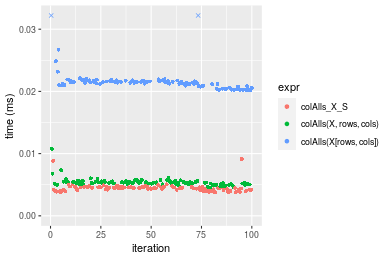
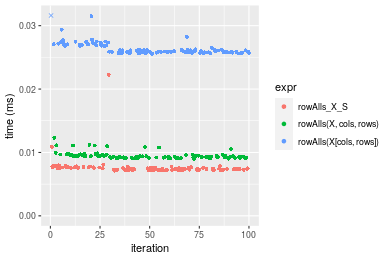

[matrixStats]: Benchmark report

---------------------------------------


# colAlls() and rowAlls() benchmarks on subsetted computation

This report benchmark the performance of colAlls() and rowAlls() on subsetted computation.


## Data
```r
> rmatrix <- function(nrow, ncol, mode = c("logical", "double", "integer", "index"), range = c(-100, 
+     +100), na_prob = 0) {
+     mode <- match.arg(mode)
+     n <- nrow * ncol
+     if (mode == "logical") {
+         x <- sample(c(FALSE, TRUE), size = n, replace = TRUE)
+     }     else if (mode == "index") {
+         x <- seq_len(n)
+         mode <- "integer"
+     }     else {
+         x <- runif(n, min = range[1], max = range[2])
+     }
+     storage.mode(x) <- mode
+     if (na_prob > 0) 
+         x[sample(n, size = na_prob * n)] <- NA
+     dim(x) <- c(nrow, ncol)
+     x
+ }
> rmatrices <- function(scale = 10, seed = 1, ...) {
+     set.seed(seed)
+     data <- list()
+     data[[1]] <- rmatrix(nrow = scale * 1, ncol = scale * 1, ...)
+     data[[2]] <- rmatrix(nrow = scale * 10, ncol = scale * 10, ...)
+     data[[3]] <- rmatrix(nrow = scale * 100, ncol = scale * 1, ...)
+     data[[4]] <- t(data[[3]])
+     data[[5]] <- rmatrix(nrow = scale * 10, ncol = scale * 100, ...)
+     data[[6]] <- t(data[[5]])
+     names(data) <- sapply(data, FUN = function(x) paste(dim(x), collapse = "x"))
+     data
+ }
> data <- rmatrices(mode = "logical")
```

## Results

### 10x10 matrix


```r
> X <- data[["10x10"]]
> rows <- sample.int(nrow(X), size = nrow(X) * 0.7)
> cols <- sample.int(ncol(X), size = ncol(X) * 0.7)
> X_S <- X[rows, cols]
> gc()
          used  (Mb) gc trigger  (Mb) max used  (Mb)
Ncells 5146688 274.9    7554717 403.5  7554717 403.5
Vcells 9060107  69.2   31793280 242.6 60508962 461.7
> colStats <- microbenchmark(colAlls_X_S = colAlls(X_S), `colAlls(X, rows, cols)` = colAlls(X, rows = rows, 
+     cols = cols), `colAlls(X[rows, cols])` = colAlls(X[rows, cols]), unit = "ms")
> X <- t(X)
> X_S <- t(X_S)
> gc()
          used  (Mb) gc trigger  (Mb) max used  (Mb)
Ncells 5146176 274.9    7554717 403.5  7554717 403.5
Vcells 9058568  69.2   31793280 242.6 60508962 461.7
> rowStats <- microbenchmark(rowAlls_X_S = rowAlls(X_S), `rowAlls(X, cols, rows)` = rowAlls(X, rows = cols, 
+     cols = rows), `rowAlls(X[cols, rows])` = rowAlls(X[cols, rows]), unit = "ms")
```

_Table: Benchmarking of colAlls_X_S(), colAlls(X, rows, cols)() and colAlls(X[rows, cols])() on 10x10 data. The top panel shows times in milliseconds and the bottom panel shows relative times._


|   |expr                   |      min|        lq|      mean|    median|       uq|      max|
|:--|:----------------------|--------:|---------:|---------:|---------:|--------:|--------:|
|1  |colAlls_X_S            | 0.002985| 0.0030730| 0.0059044| 0.0031525| 0.003271| 0.273390|
|2  |colAlls(X, rows, cols) | 0.003353| 0.0034860| 0.0036076| 0.0035475| 0.003672| 0.005915|
|3  |colAlls(X[rows, cols]) | 0.003879| 0.0040465| 0.0043083| 0.0042070| 0.004375| 0.008515|


|   |expr                   |      min|       lq|      mean|   median|       uq|       max|
|:--|:----------------------|--------:|--------:|---------:|--------:|--------:|---------:|
|1  |colAlls_X_S            | 1.000000| 1.000000| 1.0000000| 1.000000| 1.000000| 1.0000000|
|2  |colAlls(X, rows, cols) | 1.123283| 1.134396| 0.6110003| 1.125297| 1.122593| 0.0216358|
|3  |colAlls(X[rows, cols]) | 1.299497| 1.316791| 0.7296779| 1.334496| 1.337511| 0.0311460|

_Table: Benchmarking of rowAlls_X_S(), rowAlls(X, cols, rows)() and rowAlls(X[cols, rows])() on 10x10 data (transposed). The top panel shows times in milliseconds and the bottom panel shows relative times._


|   |expr                   |      min|        lq|      mean|    median|        uq|      max|
|:--|:----------------------|--------:|---------:|---------:|---------:|---------:|--------:|
|1  |rowAlls_X_S            | 0.002939| 0.0030645| 0.0032287| 0.0031515| 0.0032860| 0.005565|
|2  |rowAlls(X, cols, rows) | 0.003288| 0.0034205| 0.0064889| 0.0034935| 0.0036150| 0.294378|
|3  |rowAlls(X[cols, rows]) | 0.003867| 0.0041175| 0.0044310| 0.0042705| 0.0044285| 0.011646|


|   |expr                   |      min|       lq|     mean|   median|       uq|       max|
|:--|:----------------------|--------:|--------:|--------:|--------:|--------:|---------:|
|1  |rowAlls_X_S            | 1.000000| 1.000000| 1.000000| 1.000000| 1.000000|  1.000000|
|2  |rowAlls(X, cols, rows) | 1.118748| 1.116169| 2.009756| 1.108520| 1.100122| 52.898113|
|3  |rowAlls(X[cols, rows]) | 1.315754| 1.343612| 1.372377| 1.355069| 1.347687|  2.092722|

_Figure: Benchmarking of colAlls_X_S(), colAlls(X, rows, cols)() and colAlls(X[rows, cols])() on 10x10 data  as well as rowAlls_X_S(), rowAlls(X, cols, rows)() and rowAlls(X[cols, rows])() on the same data transposed.  Outliers are displayed as crosses.  Times are in milliseconds._


_Table: Benchmarking of colAlls_X_S() and rowAlls_X_S() on 10x10 data (original and transposed).  The top panel shows times in milliseconds and the bottom panel shows relative times._


|   |expr        |   min|     lq|    mean| median|    uq|     max|
|:--|:-----------|-----:|------:|-------:|------:|-----:|-------:|
|2  |rowAlls_X_S | 2.939| 3.0645| 3.22872| 3.1515| 3.286|   5.565|
|1  |colAlls_X_S | 2.985| 3.0730| 5.90440| 3.1525| 3.271| 273.390|


|   |expr        |      min|       lq|     mean|   median|        uq|      max|
|:--|:-----------|--------:|--------:|--------:|--------:|---------:|--------:|
|2  |rowAlls_X_S | 1.000000| 1.000000| 1.000000| 1.000000| 1.0000000|  1.00000|
|1  |colAlls_X_S | 1.015652| 1.002774| 1.828712| 1.000317| 0.9954352| 49.12668|

_Figure: Benchmarking of colAlls_X_S() and rowAlls_X_S() on 10x10 data (original and transposed).  Outliers are displayed as crosses. Times are in milliseconds._


### 100x100 matrix


```r
> X <- data[["100x100"]]
> rows <- sample.int(nrow(X), size = nrow(X) * 0.7)
> cols <- sample.int(ncol(X), size = ncol(X) * 0.7)
> X_S <- X[rows, cols]
> gc()
          used  (Mb) gc trigger  (Mb) max used  (Mb)
Ncells 5146355 274.9    7554717 403.5  7554717 403.5
Vcells 9043596  69.0   31793280 242.6 60508962 461.7
> colStats <- microbenchmark(colAlls_X_S = colAlls(X_S), `colAlls(X, rows, cols)` = colAlls(X, rows = rows, 
+     cols = cols), `colAlls(X[rows, cols])` = colAlls(X[rows, cols]), unit = "ms")
> X <- t(X)
> X_S <- t(X_S)
> gc()
          used  (Mb) gc trigger  (Mb) max used  (Mb)
Ncells 5146349 274.9    7554717 403.5  7554717 403.5
Vcells 9048679  69.1   31793280 242.6 60508962 461.7
> rowStats <- microbenchmark(rowAlls_X_S = rowAlls(X_S), `rowAlls(X, cols, rows)` = rowAlls(X, rows = cols, 
+     cols = rows), `rowAlls(X[cols, rows])` = rowAlls(X[cols, rows]), unit = "ms")
```

_Table: Benchmarking of colAlls_X_S(), colAlls(X, rows, cols)() and colAlls(X[rows, cols])() on 100x100 data. The top panel shows times in milliseconds and the bottom panel shows relative times._


|   |expr                   |      min|        lq|      mean|    median|        uq|      max|
|:--|:----------------------|--------:|---------:|---------:|---------:|---------:|--------:|
|1  |colAlls_X_S            | 0.003730| 0.0043265| 0.0044705| 0.0044225| 0.0046005| 0.008323|
|2  |colAlls(X, rows, cols) | 0.004757| 0.0051810| 0.0055787| 0.0053720| 0.0055305| 0.020869|
|3  |colAlls(X[rows, cols]) | 0.018682| 0.0197775| 0.0203325| 0.0200420| 0.0201835| 0.044674|


|   |expr                   |      min|       lq|     mean|   median|       uq|      max|
|:--|:----------------------|--------:|--------:|--------:|--------:|--------:|--------:|
|1  |colAlls_X_S            | 1.000000| 1.000000| 1.000000| 1.000000| 1.000000| 1.000000|
|2  |colAlls(X, rows, cols) | 1.275335| 1.197504| 1.247884| 1.214698| 1.202152| 2.507389|
|3  |colAlls(X[rows, cols]) | 5.008579| 4.571247| 4.548126| 4.531826| 4.387240| 5.367536|

_Table: Benchmarking of rowAlls_X_S(), rowAlls(X, cols, rows)() and rowAlls(X[cols, rows])() on 100x100 data (transposed). The top panel shows times in milliseconds and the bottom panel shows relative times._


|   |expr                   |      min|        lq|      mean|    median|        uq|      max|
|:--|:----------------------|--------:|---------:|---------:|---------:|---------:|--------:|
|1  |rowAlls_X_S            | 0.005614| 0.0059920| 0.0065277| 0.0061490| 0.0063190| 0.012259|
|2  |rowAlls(X, cols, rows) | 0.006384| 0.0068285| 0.0077920| 0.0070705| 0.0073185| 0.028524|
|3  |rowAlls(X[cols, rows]) | 0.020214| 0.0213315| 0.0232461| 0.0218530| 0.0222415| 0.036950|


|   |expr                   |      min|       lq|     mean|   median|       uq|      max|
|:--|:----------------------|--------:|--------:|--------:|--------:|--------:|--------:|
|1  |rowAlls_X_S            | 1.000000| 1.000000| 1.000000| 1.000000| 1.000000| 1.000000|
|2  |rowAlls(X, cols, rows) | 1.137157| 1.139603| 1.193689| 1.149862| 1.158174| 2.326780|
|3  |rowAlls(X[cols, rows]) | 3.600641| 3.559997| 3.561153| 3.553911| 3.519782| 3.014112|

_Figure: Benchmarking of colAlls_X_S(), colAlls(X, rows, cols)() and colAlls(X[rows, cols])() on 100x100 data  as well as rowAlls_X_S(), rowAlls(X, cols, rows)() and rowAlls(X[cols, rows])() on the same data transposed.  Outliers are displayed as crosses.  Times are in milliseconds._





_Table: Benchmarking of colAlls_X_S() and rowAlls_X_S() on 100x100 data (original and transposed).  The top panel shows times in milliseconds and the bottom panel shows relative times._


|   |expr        |   min|     lq|    mean| median|     uq|    max|
|:--|:-----------|-----:|------:|-------:|------:|------:|------:|
|1  |colAlls_X_S | 3.730| 4.3265| 4.47052| 4.4225| 4.6005|  8.323|
|2  |rowAlls_X_S | 5.614| 5.9920| 6.52769| 6.1490| 6.3190| 12.259|


|   |expr        |      min|       lq|     mean|  median|       uq|      max|
|:--|:-----------|--------:|--------:|--------:|-------:|--------:|--------:|
|1  |colAlls_X_S | 1.000000| 1.000000| 1.000000| 1.00000| 1.000000| 1.000000|
|2  |rowAlls_X_S | 1.505094| 1.384953| 1.460163| 1.39039| 1.373546| 1.472906|

_Figure: Benchmarking of colAlls_X_S() and rowAlls_X_S() on 100x100 data (original and transposed).  Outliers are displayed as crosses. Times are in milliseconds._


### 1000x10 matrix


```r
> X <- data[["1000x10"]]
> rows <- sample.int(nrow(X), size = nrow(X) * 0.7)
> cols <- sample.int(ncol(X), size = ncol(X) * 0.7)
> X_S <- X[rows, cols]
> gc()
          used  (Mb) gc trigger  (Mb) max used  (Mb)
Ncells 5147040 274.9    7554717 403.5  7554717 403.5
Vcells 9046740  69.1   31793280 242.6 60508962 461.7
> colStats <- microbenchmark(colAlls_X_S = colAlls(X_S), `colAlls(X, rows, cols)` = colAlls(X, rows = rows, 
+     cols = cols), `colAlls(X[rows, cols])` = colAlls(X[rows, cols]), unit = "ms")
> X <- t(X)
> X_S <- t(X_S)
> gc()
          used  (Mb) gc trigger  (Mb) max used  (Mb)
Ncells 5147028 274.9    7554717 403.5  7554717 403.5
Vcells 9051813  69.1   31793280 242.6 60508962 461.7
> rowStats <- microbenchmark(rowAlls_X_S = rowAlls(X_S), `rowAlls(X, cols, rows)` = rowAlls(X, rows = cols, 
+     cols = rows), `rowAlls(X[cols, rows])` = rowAlls(X[cols, rows]), unit = "ms")
```

_Table: Benchmarking of colAlls_X_S(), colAlls(X, rows, cols)() and colAlls(X[rows, cols])() on 1000x10 data. The top panel shows times in milliseconds and the bottom panel shows relative times._


|   |expr                   |      min|        lq|      mean|    median|        uq|      max|
|:--|:----------------------|--------:|---------:|---------:|---------:|---------:|--------:|
|1  |colAlls_X_S            | 0.003049| 0.0032165| 0.0033408| 0.0032890| 0.0033995| 0.005780|
|2  |colAlls(X, rows, cols) | 0.004862| 0.0051040| 0.0052971| 0.0052415| 0.0054095| 0.008982|
|3  |colAlls(X[rows, cols]) | 0.019030| 0.0202255| 0.0207787| 0.0203825| 0.0205255| 0.046235|


|   |expr                   |      min|       lq|     mean|   median|       uq|      max|
|:--|:----------------------|--------:|--------:|--------:|--------:|--------:|--------:|
|1  |colAlls_X_S            | 1.000000| 1.000000| 1.000000| 1.000000| 1.000000| 1.000000|
|2  |colAlls(X, rows, cols) | 1.594621| 1.586818| 1.585565| 1.593646| 1.591263| 1.553979|
|3  |colAlls(X[rows, cols]) | 6.241391| 6.288046| 6.219603| 6.197172| 6.037800| 7.999135|

_Table: Benchmarking of rowAlls_X_S(), rowAlls(X, cols, rows)() and rowAlls(X[cols, rows])() on 1000x10 data (transposed). The top panel shows times in milliseconds and the bottom panel shows relative times._


|   |expr                   |      min|        lq|      mean|    median|        uq|      max|
|:--|:----------------------|--------:|---------:|---------:|---------:|---------:|--------:|
|1  |rowAlls_X_S            | 0.006609| 0.0069940| 0.0074145| 0.0072530| 0.0075290| 0.021619|
|2  |rowAlls(X, cols, rows) | 0.008412| 0.0087285| 0.0089843| 0.0088925| 0.0090985| 0.011609|
|3  |rowAlls(X[cols, rows]) | 0.023182| 0.0238070| 0.0248485| 0.0248065| 0.0250555| 0.055386|


|   |expr                   |      min|       lq|     mean|   median|       uq|       max|
|:--|:----------------------|--------:|--------:|--------:|--------:|--------:|---------:|
|1  |rowAlls_X_S            | 1.000000| 1.000000| 1.000000| 1.000000| 1.000000| 1.0000000|
|2  |rowAlls(X, cols, rows) | 1.272810| 1.247998| 1.211716| 1.226044| 1.208461| 0.5369814|
|3  |rowAlls(X[cols, rows]) | 3.507641| 3.403918| 3.351314| 3.420171| 3.327866| 2.5619131|

_Figure: Benchmarking of colAlls_X_S(), colAlls(X, rows, cols)() and colAlls(X[rows, cols])() on 1000x10 data  as well as rowAlls_X_S(), rowAlls(X, cols, rows)() and rowAlls(X[cols, rows])() on the same data transposed.  Outliers are displayed as crosses.  Times are in milliseconds._



_Table: Benchmarking of colAlls_X_S() and rowAlls_X_S() on 1000x10 data (original and transposed).  The top panel shows times in milliseconds and the bottom panel shows relative times._


|   |expr        |   min|     lq|    mean| median|     uq|    max|
|:--|:-----------|-----:|------:|-------:|------:|------:|------:|
|1  |colAlls_X_S | 3.049| 3.2165| 3.34084|  3.289| 3.3995|  5.780|
|2  |rowAlls_X_S | 6.609| 6.9940| 7.41454|  7.253| 7.5290| 21.619|


|   |expr        |      min|       lq|     mean|  median|       uq|      max|
|:--|:-----------|--------:|--------:|--------:|-------:|--------:|--------:|
|1  |colAlls_X_S | 1.000000| 1.000000| 1.000000| 1.00000| 1.000000| 1.000000|
|2  |rowAlls_X_S | 2.167596| 2.174413| 2.219364| 2.20523| 2.214738| 3.740311|

_Figure: Benchmarking of colAlls_X_S() and rowAlls_X_S() on 1000x10 data (original and transposed).  Outliers are displayed as crosses. Times are in milliseconds._


### 10x1000 matrix


```r
> X <- data[["10x1000"]]
> rows <- sample.int(nrow(X), size = nrow(X) * 0.7)
> cols <- sample.int(ncol(X), size = ncol(X) * 0.7)
> X_S <- X[rows, cols]
> gc()
          used  (Mb) gc trigger  (Mb) max used  (Mb)
Ncells 5147239 274.9    7554717 403.5  7554717 403.5
Vcells 9047532  69.1   31793280 242.6 60508962 461.7
> colStats <- microbenchmark(colAlls_X_S = colAlls(X_S), `colAlls(X, rows, cols)` = colAlls(X, rows = rows, 
+     cols = cols), `colAlls(X[rows, cols])` = colAlls(X[rows, cols]), unit = "ms")
> X <- t(X)
> X_S <- t(X_S)
> gc()
          used  (Mb) gc trigger  (Mb) max used  (Mb)
Ncells 5147233 274.9    7554717 403.5  7554717 403.5
Vcells 9052615  69.1   31793280 242.6 60508962 461.7
> rowStats <- microbenchmark(rowAlls_X_S = rowAlls(X_S), `rowAlls(X, cols, rows)` = rowAlls(X, rows = cols, 
+     cols = rows), `rowAlls(X[cols, rows])` = rowAlls(X[cols, rows]), unit = "ms")
```

_Table: Benchmarking of colAlls_X_S(), colAlls(X, rows, cols)() and colAlls(X[rows, cols])() on 10x1000 data. The top panel shows times in milliseconds and the bottom panel shows relative times._


|   |expr                   |      min|        lq|      mean|    median|        uq|      max|
|:--|:----------------------|--------:|---------:|---------:|---------:|---------:|--------:|
|1  |colAlls_X_S            | 0.007846| 0.0083490| 0.0090719| 0.0086190| 0.0090755| 0.034413|
|2  |colAlls(X, rows, cols) | 0.014779| 0.0159280| 0.0170400| 0.0164795| 0.0170440| 0.032645|
|3  |colAlls(X[rows, cols]) | 0.024688| 0.0255175| 0.0268277| 0.0264435| 0.0271525| 0.042672|


|   |expr                   |      min|       lq|     mean|   median|       uq|       max|
|:--|:----------------------|--------:|--------:|--------:|--------:|--------:|---------:|
|1  |colAlls_X_S            | 1.000000| 1.000000| 1.000000| 1.000000| 1.000000| 1.0000000|
|2  |colAlls(X, rows, cols) | 1.883635| 1.907773| 1.878323| 1.911997| 1.878023| 0.9486241|
|3  |colAlls(X[rows, cols]) | 3.146571| 3.056354| 2.957224| 3.068047| 2.991846| 1.2399965|

_Table: Benchmarking of rowAlls_X_S(), rowAlls(X, cols, rows)() and rowAlls(X[cols, rows])() on 10x1000 data (transposed). The top panel shows times in milliseconds and the bottom panel shows relative times._


|   |expr                   |      min|        lq|      mean|    median|        uq|      max|
|:--|:----------------------|--------:|---------:|---------:|---------:|---------:|--------:|
|1  |rowAlls_X_S            | 0.008783| 0.0096465| 0.0108360| 0.0103405| 0.0111145| 0.026874|
|2  |rowAlls(X, cols, rows) | 0.015116| 0.0169345| 0.0185325| 0.0177825| 0.0192395| 0.048063|
|3  |rowAlls(X[cols, rows]) | 0.024614| 0.0259540| 0.0272003| 0.0267295| 0.0277745| 0.040850|


|   |expr                   |      min|       lq|     mean|   median|       uq|      max|
|:--|:----------------------|--------:|--------:|--------:|--------:|--------:|--------:|
|1  |rowAlls_X_S            | 1.000000| 1.000000| 1.000000| 1.000000| 1.000000| 1.000000|
|2  |rowAlls(X, cols, rows) | 1.721052| 1.755507| 1.710277| 1.719694| 1.731027| 1.788457|
|3  |rowAlls(X[cols, rows]) | 2.802459| 2.690510| 2.510183| 2.584933| 2.498943| 1.520057|

_Figure: Benchmarking of colAlls_X_S(), colAlls(X, rows, cols)() and colAlls(X[rows, cols])() on 10x1000 data  as well as rowAlls_X_S(), rowAlls(X, cols, rows)() and rowAlls(X[cols, rows])() on the same data transposed.  Outliers are displayed as crosses.  Times are in milliseconds._


_Table: Benchmarking of colAlls_X_S() and rowAlls_X_S() on 10x1000 data (original and transposed).  The top panel shows times in milliseconds and the bottom panel shows relative times._


|   |expr        |   min|     lq|     mean|  median|      uq|    max|
|:--|:-----------|-----:|------:|--------:|-------:|-------:|------:|
|1  |colAlls_X_S | 7.846| 8.3490|  9.07191|  8.6190|  9.0755| 34.413|
|2  |rowAlls_X_S | 8.783| 9.6465| 10.83598| 10.3405| 11.1145| 26.874|


|   |expr        |      min|       lq|     mean|   median|       uq|       max|
|:--|:-----------|--------:|--------:|--------:|--------:|--------:|---------:|
|1  |colAlls_X_S | 1.000000| 1.000000| 1.000000| 1.000000| 1.000000| 1.0000000|
|2  |rowAlls_X_S | 1.119424| 1.155408| 1.194454| 1.199733| 1.224671| 0.7809258|

_Figure: Benchmarking of colAlls_X_S() and rowAlls_X_S() on 10x1000 data (original and transposed).  Outliers are displayed as crosses. Times are in milliseconds._


### 100x1000 matrix


```r
> X <- data[["100x1000"]]
> rows <- sample.int(nrow(X), size = nrow(X) * 0.7)
> cols <- sample.int(ncol(X), size = ncol(X) * 0.7)
> X_S <- X[rows, cols]
> gc()
          used  (Mb) gc trigger  (Mb) max used  (Mb)
Ncells 5147449 275.0    7554717 403.5  7554717 403.5
Vcells 9070188  69.3   31793280 242.6 60508962 461.7
> colStats <- microbenchmark(colAlls_X_S = colAlls(X_S), `colAlls(X, rows, cols)` = colAlls(X, rows = rows, 
+     cols = cols), `colAlls(X[rows, cols])` = colAlls(X[rows, cols]), unit = "ms")
> X <- t(X)
> X_S <- t(X_S)
> gc()
          used  (Mb) gc trigger  (Mb) max used  (Mb)
Ncells 5147443 275.0    7554717 403.5  7554717 403.5
Vcells 9120271  69.6   31793280 242.6 60508962 461.7
> rowStats <- microbenchmark(rowAlls_X_S = rowAlls(X_S), `rowAlls(X, cols, rows)` = rowAlls(X, rows = cols, 
+     cols = rows), `rowAlls(X[cols, rows])` = rowAlls(X[cols, rows]), unit = "ms")
```

_Table: Benchmarking of colAlls_X_S(), colAlls(X, rows, cols)() and colAlls(X[rows, cols])() on 100x1000 data. The top panel shows times in milliseconds and the bottom panel shows relative times._


|   |expr                   |      min|        lq|      mean|   median|        uq|      max|
|:--|:----------------------|--------:|---------:|---------:|--------:|---------:|--------:|
|1  |colAlls_X_S            | 0.008030| 0.0089035| 0.0098953| 0.009347| 0.0098795| 0.041048|
|2  |colAlls(X, rows, cols) | 0.016271| 0.0179065| 0.0195999| 0.018834| 0.0199220| 0.053665|
|3  |colAlls(X[rows, cols]) | 0.127174| 0.1319805| 0.1401490| 0.137510| 0.1472545| 0.186702|


|   |expr                   |       min|        lq|      mean|    median|        uq|      max|
|:--|:----------------------|---------:|---------:|---------:|---------:|---------:|--------:|
|1  |colAlls_X_S            |  1.000000|  1.000000|  1.000000|  1.000000|  1.000000| 1.000000|
|2  |colAlls(X, rows, cols) |  2.026276|  2.011175|  1.980734|  2.014978|  2.016499| 1.307372|
|3  |colAlls(X[rows, cols]) | 15.837360| 14.823440| 14.163213| 14.711672| 14.905056| 4.548382|

_Table: Benchmarking of rowAlls_X_S(), rowAlls(X, cols, rows)() and rowAlls(X[cols, rows])() on 100x1000 data (transposed). The top panel shows times in milliseconds and the bottom panel shows relative times._


|   |expr                   |      min|        lq|      mean|    median|        uq|      max|
|:--|:----------------------|--------:|---------:|---------:|---------:|---------:|--------:|
|1  |rowAlls_X_S            | 0.024066| 0.0263735| 0.0287088| 0.0273165| 0.0299640| 0.070461|
|2  |rowAlls(X, cols, rows) | 0.030160| 0.0326170| 0.0360288| 0.0339755| 0.0377715| 0.056858|
|3  |rowAlls(X[cols, rows]) | 0.140188| 0.1458770| 0.1581584| 0.1503825| 0.1678940| 0.227504|


|   |expr                   |      min|       lq|     mean|   median|       uq|       max|
|:--|:----------------------|--------:|--------:|--------:|--------:|--------:|---------:|
|1  |rowAlls_X_S            | 1.000000| 1.000000| 1.000000| 1.000000| 1.000000| 1.0000000|
|2  |rowAlls(X, cols, rows) | 1.253220| 1.236734| 1.254971| 1.243772| 1.260563| 0.8069428|
|3  |rowAlls(X[cols, rows]) | 5.825147| 5.531196| 5.509050| 5.505189| 5.603191| 3.2287932|

_Figure: Benchmarking of colAlls_X_S(), colAlls(X, rows, cols)() and colAlls(X[rows, cols])() on 100x1000 data  as well as rowAlls_X_S(), rowAlls(X, cols, rows)() and rowAlls(X[cols, rows])() on the same data transposed.  Outliers are displayed as crosses.  Times are in milliseconds._


_Table: Benchmarking of colAlls_X_S() and rowAlls_X_S() on 100x1000 data (original and transposed).  The top panel shows times in milliseconds and the bottom panel shows relative times._


|   |expr        |    min|      lq|     mean|  median|      uq|    max|
|:--|:-----------|------:|-------:|--------:|-------:|-------:|------:|
|1  |colAlls_X_S |  8.030|  8.9035|  9.89528|  9.3470|  9.8795| 41.048|
|2  |rowAlls_X_S | 24.066| 26.3735| 28.70884| 27.3165| 29.9640| 70.461|


|   |expr        |      min|      lq|     mean|   median|       uq|      max|
|:--|:-----------|--------:|-------:|--------:|--------:|--------:|--------:|
|1  |colAlls_X_S | 1.000000| 1.00000| 1.000000| 1.000000| 1.000000| 1.000000|
|2  |rowAlls_X_S | 2.997011| 2.96215| 2.901266| 2.922489| 3.032947| 1.716551|

_Figure: Benchmarking of colAlls_X_S() and rowAlls_X_S() on 100x1000 data (original and transposed).  Outliers are displayed as crosses. Times are in milliseconds._


### 1000x100 matrix


```r
> X <- data[["1000x100"]]
> rows <- sample.int(nrow(X), size = nrow(X) * 0.7)
> cols <- sample.int(ncol(X), size = ncol(X) * 0.7)
> X_S <- X[rows, cols]
> gc()
          used  (Mb) gc trigger  (Mb) max used  (Mb)
Ncells 5147662 275.0    7554717 403.5  7554717 403.5
Vcells 9070853  69.3   31793280 242.6 60508962 461.7
> colStats <- microbenchmark(colAlls_X_S = colAlls(X_S), `colAlls(X, rows, cols)` = colAlls(X, rows = rows, 
+     cols = cols), `colAlls(X[rows, cols])` = colAlls(X[rows, cols]), unit = "ms")
> X <- t(X)
> X_S <- t(X_S)
> gc()
          used  (Mb) gc trigger  (Mb) max used  (Mb)
Ncells 5147656 275.0    7554717 403.5  7554717 403.5
Vcells 9120936  69.6   31793280 242.6 60508962 461.7
> rowStats <- microbenchmark(rowAlls_X_S = rowAlls(X_S), `rowAlls(X, cols, rows)` = rowAlls(X, rows = cols, 
+     cols = rows), `rowAlls(X[cols, rows])` = rowAlls(X[cols, rows]), unit = "ms")
```

_Table: Benchmarking of colAlls_X_S(), colAlls(X, rows, cols)() and colAlls(X[rows, cols])() on 1000x100 data. The top panel shows times in milliseconds and the bottom panel shows relative times._


|   |expr                   |      min|        lq|      mean|    median|        uq|      max|
|:--|:----------------------|--------:|---------:|---------:|---------:|---------:|--------:|
|1  |colAlls_X_S            | 0.003180| 0.0038335| 0.0043673| 0.0040995| 0.0043170| 0.023917|
|2  |colAlls(X, rows, cols) | 0.005084| 0.0057485| 0.0061797| 0.0060380| 0.0063945| 0.013627|
|3  |colAlls(X[rows, cols]) | 0.122060| 0.1227765| 0.1308783| 0.1272970| 0.1362765| 0.197021|


|   |expr                   |       min|        lq|      mean|    median|        uq|       max|
|:--|:----------------------|---------:|---------:|---------:|---------:|---------:|---------:|
|1  |colAlls_X_S            |  1.000000|  1.000000|  1.000000|  1.000000|  1.000000| 1.0000000|
|2  |colAlls(X, rows, cols) |  1.598742|  1.499543|  1.414987|  1.472862|  1.481237| 0.5697621|
|3  |colAlls(X[rows, cols]) | 38.383648| 32.027260| 29.967856| 31.051836| 31.567408| 8.2376970|

_Table: Benchmarking of rowAlls_X_S(), rowAlls(X, cols, rows)() and rowAlls(X[cols, rows])() on 1000x100 data (transposed). The top panel shows times in milliseconds and the bottom panel shows relative times._


|   |expr                   |      min|        lq|      mean|    median|        uq|      max|
|:--|:----------------------|--------:|---------:|---------:|---------:|---------:|--------:|
|1  |rowAlls_X_S            | 0.021020| 0.0219790| 0.0236210| 0.0231925| 0.0248710| 0.038929|
|2  |rowAlls(X, cols, rows) | 0.023216| 0.0247165| 0.0264102| 0.0259720| 0.0273825| 0.050690|
|3  |rowAlls(X[cols, rows]) | 0.136313| 0.1408495| 0.1521484| 0.1508415| 0.1621920| 0.229405|


|   |expr                   |      min|       lq|     mean|   median|       uq|      max|
|:--|:----------------------|--------:|--------:|--------:|--------:|--------:|--------:|
|1  |rowAlls_X_S            | 1.000000| 1.000000| 1.000000| 1.000000| 1.000000| 1.000000|
|2  |rowAlls(X, cols, rows) | 1.104472| 1.124551| 1.118083| 1.119845| 1.100981| 1.302114|
|3  |rowAlls(X[cols, rows]) | 6.484919| 6.408367| 6.441247| 6.503891| 6.521330| 5.892908|

_Figure: Benchmarking of colAlls_X_S(), colAlls(X, rows, cols)() and colAlls(X[rows, cols])() on 1000x100 data  as well as rowAlls_X_S(), rowAlls(X, cols, rows)() and rowAlls(X[cols, rows])() on the same data transposed.  Outliers are displayed as crosses.  Times are in milliseconds._


_Table: Benchmarking of colAlls_X_S() and rowAlls_X_S() on 1000x100 data (original and transposed).  The top panel shows times in milliseconds and the bottom panel shows relative times._


|   |expr        |   min|      lq|     mean|  median|     uq|    max|
|:--|:-----------|-----:|-------:|--------:|-------:|------:|------:|
|1  |colAlls_X_S |  3.18|  3.8335|  4.36729|  4.0995|  4.317| 23.917|
|2  |rowAlls_X_S | 21.02| 21.9790| 23.62095| 23.1925| 24.871| 38.929|


|   |expr        |      min|       lq|     mean|   median|       uq|      max|
|:--|:-----------|--------:|--------:|--------:|--------:|--------:|--------:|
|1  |colAlls_X_S | 1.000000| 1.000000| 1.000000| 1.000000| 1.000000| 1.000000|
|2  |rowAlls_X_S | 6.610063| 5.733403| 5.408606| 5.657397| 5.761177| 1.627671|

_Figure: Benchmarking of colAlls_X_S() and rowAlls_X_S() on 1000x100 data (original and transposed).  Outliers are displayed as crosses. Times are in milliseconds._


## Appendix

### Session information
```r
R version 4.1.1 Patched (2021-08-10 r80727)
Platform: x86_64-pc-linux-gnu (64-bit)
Running under: Ubuntu 18.04.5 LTS

Matrix products: default
BLAS:   /home/hb/software/R-devel/R-4-1-branch/lib/R/lib/libRblas.so
LAPACK: /home/hb/software/R-devel/R-4-1-branch/lib/R/lib/libRlapack.so

locale:
 [1] LC_CTYPE=en_US.UTF-8       LC_NUMERIC=C              
 [3] LC_TIME=en_US.UTF-8        LC_COLLATE=en_US.UTF-8    
 [5] LC_MONETARY=en_US.UTF-8    LC_MESSAGES=en_US.UTF-8   
 [7] LC_PAPER=en_US.UTF-8       LC_NAME=C                 
 [9] LC_ADDRESS=C               LC_TELEPHONE=C            
[11] LC_MEASUREMENT=en_US.UTF-8 LC_IDENTIFICATION=C       

attached base packages:
[1] stats     graphics  grDevices utils     datasets  methods   base     

other attached packages:
[1] microbenchmark_1.4-7   matrixStats_0.60.0     ggplot2_3.3.5         
[4] knitr_1.33             R.devices_2.17.0       R.utils_2.10.1        
[7] R.oo_1.24.0            R.methodsS3_1.8.1-9001

loaded via a namespace (and not attached):
 [1] Biobase_2.52.0          httr_1.4.2              splines_4.1.1          
 [4] bit64_4.0.5             network_1.17.1          assertthat_0.2.1       
 [7] highr_0.9               stats4_4.1.1            blob_1.2.2             
[10] GenomeInfoDbData_1.2.6  robustbase_0.93-8       pillar_1.6.2           
[13] RSQLite_2.2.8           lattice_0.20-44         glue_1.4.2             
[16] digest_0.6.27           XVector_0.32.0          colorspace_2.0-2       
[19] Matrix_1.3-4            XML_3.99-0.7            pkgconfig_2.0.3        
[22] zlibbioc_1.38.0         genefilter_1.74.0       purrr_0.3.4            
[25] ergm_4.1.2              xtable_1.8-4            scales_1.1.1           
[28] tibble_3.1.4            annotate_1.70.0         KEGGREST_1.32.0        
[31] farver_2.1.0            generics_0.1.0          IRanges_2.26.0         
[34] ellipsis_0.3.2          cachem_1.0.6            withr_2.4.2            
[37] BiocGenerics_0.38.0     mime_0.11               survival_3.2-13        
[40] magrittr_2.0.1          crayon_1.4.1            statnet.common_4.5.0   
[43] memoise_2.0.0           laeken_0.5.1            fansi_0.5.0            
[46] R.cache_0.15.0          MASS_7.3-54             R.rsp_0.44.0           
[49] tools_4.1.1             lifecycle_1.0.0         S4Vectors_0.30.0       
[52] trust_0.1-8             munsell_0.5.0           AnnotationDbi_1.54.1   
[55] Biostrings_2.60.2       compiler_4.1.1          GenomeInfoDb_1.28.1    
[58] rlang_0.4.11            grid_4.1.1              RCurl_1.98-1.4         
[61] cwhmisc_6.6             rappdirs_0.3.3          labeling_0.4.2         
[64] bitops_1.0-7            base64enc_0.1-3         boot_1.3-28            
[67] gtable_0.3.0            DBI_1.1.1               markdown_1.1           
[70] R6_2.5.1                lpSolveAPI_5.5.2.0-17.7 rle_0.9.2              
[73] dplyr_1.0.7             fastmap_1.1.0           bit_4.0.4              
[76] utf8_1.2.2              parallel_4.1.1          Rcpp_1.0.7             
[79] vctrs_0.3.8             png_0.1-7               DEoptimR_1.0-9         
[82] tidyselect_1.1.1        xfun_0.25               coda_0.19-4            
```
Total processing time was 10.64 secs.


### Reproducibility
To reproduce this report, do:
```r
html <- matrixStats:::benchmark('colRowAlls_subset')
```

[RSP]: https://cran.r-project.org/package=R.rsp
[matrixStats]: https://cran.r-project.org/package=matrixStats

[StackOverflow:colMins?]: https://stackoverflow.com/questions/13676878 "Stack Overflow: fastest way to get Min from every column in a matrix?"
[StackOverflow:colSds?]: https://stackoverflow.com/questions/17549762 "Stack Overflow: Is there such 'colsd' in R?"
[StackOverflow:rowProds?]: https://stackoverflow.com/questions/20198801/ "Stack Overflow: Row product of matrix and column sum of matrix"

---------------------------------------
Copyright Dongcan Jiang. Last updated on 2021-08-25 17:34:20 (+0200 UTC). Powered by [RSP].

<script>
 var link = document.createElement('link');
 link.rel = 'icon';
 link.href = "data:image/png;base64,iVBORw0KGgoAAAANSUhEUgAAACAAAAAgCAMAAABEpIrGAAAA21BMVEUAAAAAAP8AAP8AAP8AAP8AAP8AAP8AAP8AAP8AAP8AAP8AAP8AAP8AAP8AAP8AAP8AAP8AAP8AAP8AAP8AAP8AAP8AAP8AAP8AAP8AAP8AAP8AAP8AAP8AAP8AAP8AAP8AAP8AAP8AAP8AAP8AAP8AAP8AAP8AAP8AAP8AAP8BAf4CAv0DA/wdHeIeHuEfH+AgIN8hId4lJdomJtknJ9g+PsE/P8BAQL9yco10dIt1dYp3d4h4eIeVlWqWlmmXl2iYmGeZmWabm2Tn5xjo6Bfp6Rb39wj4+Af//wA2M9hbAAAASXRSTlMAAQIJCgsMJSYnKD4/QGRlZmhpamtsbautrrCxuru8y8zN5ebn6Pn6+///////////////////////////////////////////LsUNcQAAAS9JREFUOI29k21XgkAQhVcFytdSMqMETU26UVqGmpaiFbL//xc1cAhhwVNf6n5i5z67M2dmYOyfJZUqlVLhkKucG7cgmUZTybDz6g0iDeq51PUr37Ds2cy2/C9NeES5puDjxuUk1xnToZsg8pfA3avHQ3lLIi7iWRrkv/OYtkScxBIMgDee0ALoyxHQBJ68JLCjOtQIMIANF7QG9G9fNnHvisCHBVMKgSJgiz7nE+AoBKrAPA3MgepvgR9TSCasrCKH0eB1wBGBFdCO+nAGjMVGPcQb5bd6mQRegN6+1axOs9nGfYcCtfi4NQosdtH7dB+txFIpXQqN1p9B/asRHToyS0jRgpV7nk4nwcq1BJ+x3Gl/v7S9Wmpp/aGquum7w3ZDyrADFYrl8vHBH+ev9AUASW1dmU4h4wAAAABJRU5ErkJggg=="
 document.getElementsByTagName('head')[0].appendChild(link);
</script>


