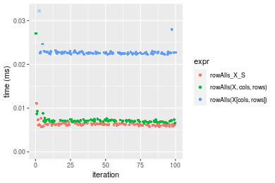
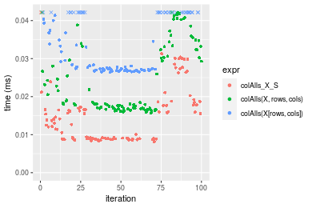

[matrixStats]: Benchmark report

---------------------------------------


# colAlls() and rowAlls() benchmarks on subsetted computation

This report benchmark the performance of colAlls() and rowAlls() on subsetted computation.


## Data
```r
> rmatrix <- function(nrow, ncol, mode = c("logical", "double", "integer", "index"), range = c(-100, 
+     +100), na_prob = 0) {
+     mode <- match.arg(mode)
+     n <- nrow * ncol
+     if (mode == "logical") {
+         x <- sample(c(FALSE, TRUE), size = n, replace = TRUE)
+     }     else if (mode == "index") {
+         x <- seq_len(n)
+         mode <- "integer"
+     }     else {
+         x <- runif(n, min = range[1], max = range[2])
+     }
+     storage.mode(x) <- mode
+     if (na_prob > 0) 
+         x[sample(n, size = na_prob * n)] <- NA
+     dim(x) <- c(nrow, ncol)
+     x
+ }
> rmatrices <- function(scale = 10, seed = 1, ...) {
+     set.seed(seed)
+     data <- list()
+     data[[1]] <- rmatrix(nrow = scale * 1, ncol = scale * 1, ...)
+     data[[2]] <- rmatrix(nrow = scale * 10, ncol = scale * 10, ...)
+     data[[3]] <- rmatrix(nrow = scale * 100, ncol = scale * 1, ...)
+     data[[4]] <- t(data[[3]])
+     data[[5]] <- rmatrix(nrow = scale * 10, ncol = scale * 100, ...)
+     data[[6]] <- t(data[[5]])
+     names(data) <- sapply(data, FUN = function(x) paste(dim(x), collapse = "x"))
+     data
+ }
> data <- rmatrices(mode = "logical")
```

## Results

### 10x10 matrix


```r
> X <- data[["10x10"]]
> rows <- sample.int(nrow(X), size = nrow(X) * 0.7)
> cols <- sample.int(ncol(X), size = ncol(X) * 0.7)
> X_S <- X[rows, cols]
> gc()
          used  (Mb) gc trigger  (Mb) max used  (Mb)
Ncells 5172271 276.3    7916910 422.9  7916910 422.9
Vcells 9253005  70.6   33191153 253.3 53339345 407.0
> colStats <- microbenchmark(colAlls_X_S = colAlls(X_S), `colAlls(X, rows, cols)` = colAlls(X, rows = rows, 
+     cols = cols), `colAlls(X[rows, cols])` = colAlls(X[rows, cols]), unit = "ms")
> X <- t(X)
> X_S <- t(X_S)
> gc()
          used  (Mb) gc trigger  (Mb) max used  (Mb)
Ncells 5160349 275.6    7916910 422.9  7916910 422.9
Vcells 9213104  70.3   33191153 253.3 53339345 407.0
> rowStats <- microbenchmark(rowAlls_X_S = rowAlls(X_S), `rowAlls(X, cols, rows)` = rowAlls(X, rows = cols, 
+     cols = rows), `rowAlls(X[cols, rows])` = rowAlls(X[cols, rows]), unit = "ms")
```

_Table: Benchmarking of colAlls_X_S(), colAlls(X, rows, cols)() and colAlls(X[rows, cols])() on 10x10 data. The top panel shows times in milliseconds and the bottom panel shows relative times._


|   |expr                   |      min|        lq|      mean|    median|        uq|      max|
|:--|:----------------------|--------:|---------:|---------:|---------:|---------:|--------:|
|1  |colAlls_X_S            | 0.002956| 0.0030380| 0.0060737| 0.0031095| 0.0032130| 0.293207|
|2  |colAlls(X, rows, cols) | 0.003204| 0.0034110| 0.0036873| 0.0034655| 0.0035900| 0.018075|
|3  |colAlls(X[rows, cols]) | 0.003909| 0.0041325| 0.0043477| 0.0042550| 0.0044005| 0.009081|


|   |expr                   |      min|       lq|      mean|   median|       uq|       max|
|:--|:----------------------|--------:|--------:|---------:|--------:|--------:|---------:|
|1  |colAlls_X_S            | 1.000000| 1.000000| 1.0000000| 1.000000| 1.000000| 1.0000000|
|2  |colAlls(X, rows, cols) | 1.083897| 1.122778| 0.6070975| 1.114488| 1.117336| 0.0616459|
|3  |colAlls(X[rows, cols]) | 1.322395| 1.360270| 0.7158150| 1.368387| 1.369592| 0.0309713|

_Table: Benchmarking of rowAlls_X_S(), rowAlls(X, cols, rows)() and rowAlls(X[cols, rows])() on 10x10 data (transposed). The top panel shows times in milliseconds and the bottom panel shows relative times._


|   |expr                   |      min|        lq|      mean|    median|        uq|      max|
|:--|:----------------------|--------:|---------:|---------:|---------:|---------:|--------:|
|1  |rowAlls_X_S            | 0.002998| 0.0031620| 0.0032910| 0.0032705| 0.0033315| 0.005903|
|2  |rowAlls(X, cols, rows) | 0.003362| 0.0035325| 0.0070570| 0.0036250| 0.0037780| 0.327844|
|3  |rowAlls(X[cols, rows]) | 0.004040| 0.0042070| 0.0044239| 0.0043525| 0.0044915| 0.007800|


|   |expr                   |      min|       lq|     mean|   median|       uq|       max|
|:--|:----------------------|--------:|--------:|--------:|--------:|--------:|---------:|
|1  |rowAlls_X_S            | 1.000000| 1.000000| 1.000000| 1.000000| 1.000000|  1.000000|
|2  |rowAlls(X, cols, rows) | 1.121414| 1.117173| 2.144329| 1.108393| 1.134024| 55.538540|
|3  |rowAlls(X[cols, rows]) | 1.347565| 1.330487| 1.344225| 1.330836| 1.348191|  1.321362|

_Figure: Benchmarking of colAlls_X_S(), colAlls(X, rows, cols)() and colAlls(X[rows, cols])() on 10x10 data  as well as rowAlls_X_S(), rowAlls(X, cols, rows)() and rowAlls(X[cols, rows])() on the same data transposed.  Outliers are displayed as crosses.  Times are in milliseconds._


_Table: Benchmarking of colAlls_X_S() and rowAlls_X_S() on 10x10 data (original and transposed).  The top panel shows times in milliseconds and the bottom panel shows relative times._


|   |expr        |   min|    lq|    mean| median|     uq|     max|
|:--|:-----------|-----:|-----:|-------:|------:|------:|-------:|
|1  |colAlls_X_S | 2.956| 3.038| 6.07372| 3.1095| 3.2130| 293.207|
|2  |rowAlls_X_S | 2.998| 3.162| 3.29102| 3.2705| 3.3315|   5.903|


|   |expr        |      min|       lq|      mean|   median|       uq|       max|
|:--|:-----------|--------:|--------:|---------:|--------:|--------:|---------:|
|1  |colAlls_X_S | 1.000000| 1.000000| 1.0000000| 1.000000| 1.000000| 1.0000000|
|2  |rowAlls_X_S | 1.014208| 1.040816| 0.5418459| 1.051777| 1.036881| 0.0201325|

_Figure: Benchmarking of colAlls_X_S() and rowAlls_X_S() on 10x10 data (original and transposed).  Outliers are displayed as crosses. Times are in milliseconds._


### 100x100 matrix


```r
> X <- data[["100x100"]]
> rows <- sample.int(nrow(X), size = nrow(X) * 0.7)
> cols <- sample.int(ncol(X), size = ncol(X) * 0.7)
> X_S <- X[rows, cols]
> gc()
          used  (Mb) gc trigger  (Mb) max used  (Mb)
Ncells 5160069 275.6    7916910 422.9  7916910 422.9
Vcells 9177921  70.1   33191153 253.3 53339345 407.0
> colStats <- microbenchmark(colAlls_X_S = colAlls(X_S), `colAlls(X, rows, cols)` = colAlls(X, rows = rows, 
+     cols = cols), `colAlls(X[rows, cols])` = colAlls(X[rows, cols]), unit = "ms")
> X <- t(X)
> X_S <- t(X_S)
> gc()
          used  (Mb) gc trigger  (Mb) max used  (Mb)
Ncells 5160063 275.6    7916910 422.9  7916910 422.9
Vcells 9183004  70.1   33191153 253.3 53339345 407.0
> rowStats <- microbenchmark(rowAlls_X_S = rowAlls(X_S), `rowAlls(X, cols, rows)` = rowAlls(X, rows = cols, 
+     cols = rows), `rowAlls(X[cols, rows])` = rowAlls(X[cols, rows]), unit = "ms")
```

_Table: Benchmarking of colAlls_X_S(), colAlls(X, rows, cols)() and colAlls(X[rows, cols])() on 100x100 data. The top panel shows times in milliseconds and the bottom panel shows relative times._


|   |expr                   |      min|        lq|      mean|    median|        uq|      max|
|:--|:----------------------|--------:|---------:|---------:|---------:|---------:|--------:|
|1  |colAlls_X_S            | 0.003750| 0.0041885| 0.0044965| 0.0044500| 0.0046240| 0.009132|
|2  |colAlls(X, rows, cols) | 0.004547| 0.0051200| 0.0053845| 0.0053185| 0.0054985| 0.010758|
|3  |colAlls(X[rows, cols]) | 0.020162| 0.0210095| 0.0217871| 0.0214610| 0.0216935| 0.047257|


|   |expr                   |      min|       lq|     mean|   median|       uq|      max|
|:--|:----------------------|--------:|--------:|--------:|--------:|--------:|--------:|
|1  |colAlls_X_S            | 1.000000| 1.000000| 1.000000| 1.000000| 1.000000| 1.000000|
|2  |colAlls(X, rows, cols) | 1.212533| 1.222395| 1.197499| 1.195169| 1.189122| 1.178055|
|3  |colAlls(X[rows, cols]) | 5.376533| 5.015996| 4.845379| 4.822697| 4.691501| 5.174880|

_Table: Benchmarking of rowAlls_X_S(), rowAlls(X, cols, rows)() and rowAlls(X[cols, rows])() on 100x100 data (transposed). The top panel shows times in milliseconds and the bottom panel shows relative times._


|   |expr                   |      min|       lq|      mean|    median|        uq|      max|
|:--|:----------------------|--------:|--------:|---------:|---------:|---------:|--------:|
|1  |rowAlls_X_S            | 0.005668| 0.006093| 0.0063049| 0.0062395| 0.0063885| 0.011094|
|2  |rowAlls(X, cols, rows) | 0.006547| 0.006895| 0.0073086| 0.0070700| 0.0072275| 0.027045|
|3  |rowAlls(X[cols, rows]) | 0.022228| 0.022485| 0.0227867| 0.0225935| 0.0227655| 0.032418|


|   |expr                   |      min|       lq|     mean|   median|       uq|      max|
|:--|:----------------------|--------:|--------:|--------:|--------:|--------:|--------:|
|1  |rowAlls_X_S            | 1.000000| 1.000000| 1.000000| 1.000000| 1.000000| 1.000000|
|2  |rowAlls(X, cols, rows) | 1.155081| 1.131627| 1.159194| 1.133104| 1.131330| 2.437804|
|3  |rowAlls(X[cols, rows]) | 3.921666| 3.690300| 3.614110| 3.621043| 3.563513| 2.922120|

_Figure: Benchmarking of colAlls_X_S(), colAlls(X, rows, cols)() and colAlls(X[rows, cols])() on 100x100 data  as well as rowAlls_X_S(), rowAlls(X, cols, rows)() and rowAlls(X[cols, rows])() on the same data transposed.  Outliers are displayed as crosses.  Times are in milliseconds._



_Table: Benchmarking of colAlls_X_S() and rowAlls_X_S() on 100x100 data (original and transposed).  The top panel shows times in milliseconds and the bottom panel shows relative times._


|   |expr        |   min|     lq|    mean| median|     uq|    max|
|:--|:-----------|-----:|------:|-------:|------:|------:|------:|
|1  |colAlls_X_S | 3.750| 4.1885| 4.49647| 4.4500| 4.6240|  9.132|
|2  |rowAlls_X_S | 5.668| 6.0930| 6.30493| 6.2395| 6.3885| 11.094|


|   |expr        |      min|       lq|     mean|   median|       uq|      max|
|:--|:-----------|--------:|--------:|--------:|--------:|--------:|--------:|
|1  |colAlls_X_S | 1.000000| 1.000000| 1.000000| 1.000000| 1.000000| 1.000000|
|2  |rowAlls_X_S | 1.511467| 1.454697| 1.402195| 1.402135| 1.381596| 1.214849|

_Figure: Benchmarking of colAlls_X_S() and rowAlls_X_S() on 100x100 data (original and transposed).  Outliers are displayed as crosses. Times are in milliseconds._


### 1000x10 matrix


```r
> X <- data[["1000x10"]]
> rows <- sample.int(nrow(X), size = nrow(X) * 0.7)
> cols <- sample.int(ncol(X), size = ncol(X) * 0.7)
> X_S <- X[rows, cols]
> gc()
          used  (Mb) gc trigger  (Mb) max used  (Mb)
Ncells 5161054 275.7    7916910 422.9  7916910 422.9
Vcells 9182428  70.1   33191153 253.3 53339345 407.0
> colStats <- microbenchmark(colAlls_X_S = colAlls(X_S), `colAlls(X, rows, cols)` = colAlls(X, rows = rows, 
+     cols = cols), `colAlls(X[rows, cols])` = colAlls(X[rows, cols]), unit = "ms")
> X <- t(X)
> X_S <- t(X_S)
> gc()
          used  (Mb) gc trigger  (Mb) max used  (Mb)
Ncells 5161048 275.7    7916910 422.9  7916910 422.9
Vcells 9187511  70.1   33191153 253.3 53339345 407.0
> rowStats <- microbenchmark(rowAlls_X_S = rowAlls(X_S), `rowAlls(X, cols, rows)` = rowAlls(X, rows = cols, 
+     cols = rows), `rowAlls(X[cols, rows])` = rowAlls(X[cols, rows]), unit = "ms")
```

_Table: Benchmarking of colAlls_X_S(), colAlls(X, rows, cols)() and colAlls(X[rows, cols])() on 1000x10 data. The top panel shows times in milliseconds and the bottom panel shows relative times._


|   |expr                   |      min|        lq|      mean|   median|        uq|      max|
|:--|:----------------------|--------:|---------:|---------:|--------:|---------:|--------:|
|1  |colAlls_X_S            | 0.003014| 0.0031925| 0.0034670| 0.003287| 0.0033905| 0.005824|
|2  |colAlls(X, rows, cols) | 0.004734| 0.0050375| 0.0055046| 0.005180| 0.0053820| 0.010640|
|3  |colAlls(X[rows, cols]) | 0.020060| 0.0205445| 0.0220699| 0.021066| 0.0212610| 0.052467|


|   |expr                   |      min|       lq|     mean|   median|       uq|      max|
|:--|:----------------------|--------:|--------:|--------:|--------:|--------:|--------:|
|1  |colAlls_X_S            | 1.000000| 1.000000| 1.000000| 1.000000| 1.000000| 1.000000|
|2  |colAlls(X, rows, cols) | 1.570670| 1.577917| 1.587707| 1.575905| 1.587376| 1.826923|
|3  |colAlls(X[rows, cols]) | 6.655607| 6.435239| 6.365708| 6.408883| 6.270757| 9.008757|

_Table: Benchmarking of rowAlls_X_S(), rowAlls(X, cols, rows)() and rowAlls(X[cols, rows])() on 1000x10 data (transposed). The top panel shows times in milliseconds and the bottom panel shows relative times._


|   |expr                   |      min|        lq|      mean|    median|        uq|      max|
|:--|:----------------------|--------:|---------:|---------:|---------:|---------:|--------:|
|1  |rowAlls_X_S            | 0.007138| 0.0072560| 0.0076136| 0.0073890| 0.0075935| 0.022234|
|2  |rowAlls(X, cols, rows) | 0.009022| 0.0091825| 0.0095088| 0.0093540| 0.0095750| 0.012307|
|3  |rowAlls(X[cols, rows]) | 0.025563| 0.0258000| 0.0267082| 0.0259975| 0.0268810| 0.062221|


|   |expr                   |      min|       lq|     mean|   median|       uq|       max|
|:--|:----------------------|--------:|--------:|--------:|--------:|--------:|---------:|
|1  |rowAlls_X_S            | 1.000000| 1.000000| 1.000000| 1.000000| 1.000000| 1.0000000|
|2  |rowAlls(X, cols, rows) | 1.263939| 1.265504| 1.248916| 1.265936| 1.260947| 0.5535216|
|3  |rowAlls(X[cols, rows]) | 3.581255| 3.555678| 3.507962| 3.518406| 3.540001| 2.7984618|

_Figure: Benchmarking of colAlls_X_S(), colAlls(X, rows, cols)() and colAlls(X[rows, cols])() on 1000x10 data  as well as rowAlls_X_S(), rowAlls(X, cols, rows)() and rowAlls(X[cols, rows])() on the same data transposed.  Outliers are displayed as crosses.  Times are in milliseconds._


_Table: Benchmarking of colAlls_X_S() and rowAlls_X_S() on 1000x10 data (original and transposed).  The top panel shows times in milliseconds and the bottom panel shows relative times._


|   |expr        |   min|     lq|   mean| median|     uq|    max|
|:--|:-----------|-----:|------:|------:|------:|------:|------:|
|1  |colAlls_X_S | 3.014| 3.1925| 3.4670|  3.287| 3.3905|  5.824|
|2  |rowAlls_X_S | 7.138| 7.2560| 7.6136|  7.389| 7.5935| 22.234|


|   |expr        |      min|       lq|    mean|   median|      uq|      max|
|:--|:-----------|--------:|--------:|-------:|--------:|-------:|--------:|
|1  |colAlls_X_S | 1.000000| 1.000000| 1.00000| 1.000000| 1.00000| 1.000000|
|2  |rowAlls_X_S | 2.368281| 2.272827| 2.19602| 2.247946| 2.23964| 3.817651|

_Figure: Benchmarking of colAlls_X_S() and rowAlls_X_S() on 1000x10 data (original and transposed).  Outliers are displayed as crosses. Times are in milliseconds._


### 10x1000 matrix


```r
> X <- data[["10x1000"]]
> rows <- sample.int(nrow(X), size = nrow(X) * 0.7)
> cols <- sample.int(ncol(X), size = ncol(X) * 0.7)
> X_S <- X[rows, cols]
> gc()
          used  (Mb) gc trigger  (Mb) max used  (Mb)
Ncells 5161291 275.7    7916910 422.9  7916910 422.9
Vcells 9183261  70.1   33191153 253.3 53339345 407.0
> colStats <- microbenchmark(colAlls_X_S = colAlls(X_S), `colAlls(X, rows, cols)` = colAlls(X, rows = rows, 
+     cols = cols), `colAlls(X[rows, cols])` = colAlls(X[rows, cols]), unit = "ms")
> X <- t(X)
> X_S <- t(X_S)
> gc()
          used  (Mb) gc trigger  (Mb) max used  (Mb)
Ncells 5161285 275.7    7916910 422.9  7916910 422.9
Vcells 9188344  70.2   33191153 253.3 53339345 407.0
> rowStats <- microbenchmark(rowAlls_X_S = rowAlls(X_S), `rowAlls(X, cols, rows)` = rowAlls(X, rows = cols, 
+     cols = rows), `rowAlls(X[cols, rows])` = rowAlls(X[cols, rows]), unit = "ms")
```

_Table: Benchmarking of colAlls_X_S(), colAlls(X, rows, cols)() and colAlls(X[rows, cols])() on 10x1000 data. The top panel shows times in milliseconds and the bottom panel shows relative times._


|   |expr                   |      min|       lq|      mean|   median|        uq|      max|
|:--|:----------------------|--------:|--------:|---------:|--------:|---------:|--------:|
|1  |colAlls_X_S            | 0.008170| 0.008902| 0.0159932| 0.013339| 0.0177990| 0.132226|
|2  |colAlls(X, rows, cols) | 0.015708| 0.016890| 0.0246443| 0.018383| 0.0327495| 0.062799|
|3  |colAlls(X[rows, cols]) | 0.026395| 0.027087| 0.0389926| 0.030673| 0.0514955| 0.076142|


|   |expr                   |      min|       lq|     mean|   median|       uq|       max|
|:--|:----------------------|--------:|--------:|--------:|--------:|--------:|---------:|
|1  |colAlls_X_S            | 1.000000| 1.000000| 1.000000| 1.000000| 1.000000| 1.0000000|
|2  |colAlls(X, rows, cols) | 1.922644| 1.897326| 1.540927| 1.378139| 1.839963| 0.4749369|
|3  |colAlls(X[rows, cols]) | 3.230722| 3.042799| 2.438077| 2.299498| 2.893168| 0.5758474|

_Table: Benchmarking of rowAlls_X_S(), rowAlls(X, cols, rows)() and rowAlls(X[cols, rows])() on 10x1000 data (transposed). The top panel shows times in milliseconds and the bottom panel shows relative times._


|   |expr                   |      min|        lq|      mean|    median|        uq|      max|
|:--|:----------------------|--------:|---------:|---------:|---------:|---------:|--------:|
|1  |rowAlls_X_S            | 0.009084| 0.0104245| 0.0114272| 0.0111400| 0.0118735| 0.027885|
|2  |rowAlls(X, cols, rows) | 0.015078| 0.0177890| 0.0194490| 0.0189195| 0.0204300| 0.049381|
|3  |rowAlls(X[cols, rows]) | 0.026531| 0.0274885| 0.0286498| 0.0280920| 0.0291910| 0.042547|


|   |expr                   |      min|       lq|     mean|   median|       uq|      max|
|:--|:----------------------|--------:|--------:|--------:|--------:|--------:|--------:|
|1  |rowAlls_X_S            | 1.000000| 1.000000| 1.000000| 1.000000| 1.000000| 1.000000|
|2  |rowAlls(X, cols, rows) | 1.659841| 1.706461| 1.701987| 1.698339| 1.720638| 1.770880|
|3  |rowAlls(X[cols, rows]) | 2.920630| 2.636913| 2.507158| 2.521723| 2.458500| 1.525802|

_Figure: Benchmarking of colAlls_X_S(), colAlls(X, rows, cols)() and colAlls(X[rows, cols])() on 10x1000 data  as well as rowAlls_X_S(), rowAlls(X, cols, rows)() and rowAlls(X[cols, rows])() on the same data transposed.  Outliers are displayed as crosses.  Times are in milliseconds._





_Table: Benchmarking of colAlls_X_S() and rowAlls_X_S() on 10x1000 data (original and transposed).  The top panel shows times in milliseconds and the bottom panel shows relative times._


|   |expr        |   min|      lq|     mean| median|      uq|     max|
|:--|:-----------|-----:|-------:|--------:|------:|-------:|-------:|
|2  |rowAlls_X_S | 9.084| 10.4245| 11.42721| 11.140| 11.8735|  27.885|
|1  |colAlls_X_S | 8.170|  8.9020| 15.99319| 13.339| 17.7990| 132.226|


|   |expr        |       min|        lq|     mean|   median|       uq|      max|
|:--|:-----------|---------:|---------:|--------:|--------:|--------:|--------:|
|2  |rowAlls_X_S | 1.0000000| 1.0000000| 1.000000| 1.000000| 1.000000| 1.000000|
|1  |colAlls_X_S | 0.8993835| 0.8539498| 1.399571| 1.197397| 1.499052| 4.741833|

_Figure: Benchmarking of colAlls_X_S() and rowAlls_X_S() on 10x1000 data (original and transposed).  Outliers are displayed as crosses. Times are in milliseconds._


### 100x1000 matrix


```r
> X <- data[["100x1000"]]
> rows <- sample.int(nrow(X), size = nrow(X) * 0.7)
> cols <- sample.int(ncol(X), size = ncol(X) * 0.7)
> X_S <- X[rows, cols]
> gc()
          used  (Mb) gc trigger  (Mb) max used  (Mb)
Ncells 5161513 275.7    7916910 422.9  7916910 422.9
Vcells 9205928  70.3   33191153 253.3 53339345 407.0
> colStats <- microbenchmark(colAlls_X_S = colAlls(X_S), `colAlls(X, rows, cols)` = colAlls(X, rows = rows, 
+     cols = cols), `colAlls(X[rows, cols])` = colAlls(X[rows, cols]), unit = "ms")
> X <- t(X)
> X_S <- t(X_S)
> gc()
          used  (Mb) gc trigger  (Mb) max used  (Mb)
Ncells 5161507 275.7    7916910 422.9  7916910 422.9
Vcells 9256011  70.7   33191153 253.3 53339345 407.0
> rowStats <- microbenchmark(rowAlls_X_S = rowAlls(X_S), `rowAlls(X, cols, rows)` = rowAlls(X, rows = cols, 
+     cols = rows), `rowAlls(X[cols, rows])` = rowAlls(X[cols, rows]), unit = "ms")
```

_Table: Benchmarking of colAlls_X_S(), colAlls(X, rows, cols)() and colAlls(X[rows, cols])() on 100x1000 data. The top panel shows times in milliseconds and the bottom panel shows relative times._


|   |expr                   |      min|        lq|      mean|    median|        uq|      max|
|:--|:----------------------|--------:|---------:|---------:|---------:|---------:|--------:|
|1  |colAlls_X_S            | 0.007357| 0.0085510| 0.0104021| 0.0097815| 0.0106425| 0.055342|
|2  |colAlls(X, rows, cols) | 0.017228| 0.0181445| 0.0204397| 0.0196645| 0.0207660| 0.056603|
|3  |colAlls(X[rows, cols]) | 0.130260| 0.1408425| 0.1490012| 0.1481745| 0.1588430| 0.191139|


|   |expr                   |       min|        lq|      mean|    median|        uq|      max|
|:--|:----------------------|---------:|---------:|---------:|---------:|---------:|--------:|
|1  |colAlls_X_S            |  1.000000|  1.000000|  1.000000|  1.000000|  1.000000| 1.000000|
|2  |colAlls(X, rows, cols) |  2.341715|  2.121916|  1.964965|  2.010377|  1.951233| 1.022786|
|3  |colAlls(X[rows, cols]) | 17.705586| 16.470881| 14.324202| 15.148444| 14.925346| 3.453778|

_Table: Benchmarking of rowAlls_X_S(), rowAlls(X, cols, rows)() and rowAlls(X[cols, rows])() on 100x1000 data (transposed). The top panel shows times in milliseconds and the bottom panel shows relative times._


|   |expr                   |      min|       lq|      mean|    median|        uq|      max|
|:--|:----------------------|--------:|--------:|---------:|---------:|---------:|--------:|
|1  |rowAlls_X_S            | 0.024087| 0.026607| 0.0289235| 0.0279065| 0.0300425| 0.060435|
|2  |rowAlls(X, cols, rows) | 0.030601| 0.032826| 0.0360491| 0.0347675| 0.0382620| 0.056998|
|3  |rowAlls(X[cols, rows]) | 0.143706| 0.146069| 0.1604577| 0.1546995| 0.1733410| 0.230073|


|   |expr                   |      min|       lq|     mean|   median|       uq|      max|
|:--|:----------------------|--------:|--------:|--------:|--------:|--------:|--------:|
|1  |rowAlls_X_S            | 1.000000| 1.000000| 1.000000| 1.000000| 1.000000| 1.000000|
|2  |rowAlls(X, cols, rows) | 1.270436| 1.233736| 1.246359| 1.245857| 1.273596| 0.943129|
|3  |rowAlls(X[cols, rows]) | 5.966123| 5.489871| 5.547660| 5.543494| 5.769859| 3.806950|

_Figure: Benchmarking of colAlls_X_S(), colAlls(X, rows, cols)() and colAlls(X[rows, cols])() on 100x1000 data  as well as rowAlls_X_S(), rowAlls(X, cols, rows)() and rowAlls(X[cols, rows])() on the same data transposed.  Outliers are displayed as crosses.  Times are in milliseconds._


_Table: Benchmarking of colAlls_X_S() and rowAlls_X_S() on 100x1000 data (original and transposed).  The top panel shows times in milliseconds and the bottom panel shows relative times._


|   |expr        |    min|     lq|     mean|  median|      uq|    max|
|:--|:-----------|------:|------:|--------:|-------:|-------:|------:|
|1  |colAlls_X_S |  7.357|  8.551| 10.40206|  9.7815| 10.6425| 55.342|
|2  |rowAlls_X_S | 24.087| 26.607| 28.92350| 27.9065| 30.0425| 60.435|


|   |expr        |      min|       lq|     mean|   median|      uq|      max|
|:--|:-----------|--------:|--------:|--------:|--------:|-------:|--------:|
|1  |colAlls_X_S | 1.000000| 1.000000| 1.000000| 1.000000| 1.00000| 1.000000|
|2  |rowAlls_X_S | 3.274025| 3.111566| 2.780555| 2.852988| 2.82288| 1.092028|

_Figure: Benchmarking of colAlls_X_S() and rowAlls_X_S() on 100x1000 data (original and transposed).  Outliers are displayed as crosses. Times are in milliseconds._


### 1000x100 matrix


```r
> X <- data[["1000x100"]]
> rows <- sample.int(nrow(X), size = nrow(X) * 0.7)
> cols <- sample.int(ncol(X), size = ncol(X) * 0.7)
> X_S <- X[rows, cols]
> gc()
          used  (Mb) gc trigger  (Mb) max used  (Mb)
Ncells 5161729 275.7    7916910 422.9  7916910 422.9
Vcells 9206596  70.3   33191153 253.3 53339345 407.0
> colStats <- microbenchmark(colAlls_X_S = colAlls(X_S), `colAlls(X, rows, cols)` = colAlls(X, rows = rows, 
+     cols = cols), `colAlls(X[rows, cols])` = colAlls(X[rows, cols]), unit = "ms")
> X <- t(X)
> X_S <- t(X_S)
> gc()
          used  (Mb) gc trigger  (Mb) max used  (Mb)
Ncells 5161723 275.7    7916910 422.9  7916910 422.9
Vcells 9256679  70.7   33191153 253.3 53339345 407.0
> rowStats <- microbenchmark(rowAlls_X_S = rowAlls(X_S), `rowAlls(X, cols, rows)` = rowAlls(X, rows = cols, 
+     cols = rows), `rowAlls(X[cols, rows])` = rowAlls(X[cols, rows]), unit = "ms")
```

_Table: Benchmarking of colAlls_X_S(), colAlls(X, rows, cols)() and colAlls(X[rows, cols])() on 1000x100 data. The top panel shows times in milliseconds and the bottom panel shows relative times._


|   |expr                   |      min|        lq|      mean|    median|        uq|      max|
|:--|:----------------------|--------:|---------:|---------:|---------:|---------:|--------:|
|1  |colAlls_X_S            | 0.003326| 0.0039155| 0.0045337| 0.0042120| 0.0045445| 0.024890|
|2  |colAlls(X, rows, cols) | 0.005185| 0.0059210| 0.0065720| 0.0062450| 0.0067195| 0.021305|
|3  |colAlls(X[rows, cols]) | 0.125968| 0.1355105| 0.1432898| 0.1412175| 0.1520975| 0.205071|


|   |expr                   |      min|        lq|      mean|    median|       uq|       max|
|:--|:----------------------|--------:|---------:|---------:|---------:|--------:|---------:|
|1  |colAlls_X_S            |  1.00000|  1.000000|  1.000000|  1.000000|  1.00000| 1.0000000|
|2  |colAlls(X, rows, cols) |  1.55893|  1.512195|  1.449581|  1.482669|  1.47860| 0.8559663|
|3  |colAlls(X[rows, cols]) | 37.87372| 34.608734| 31.605268| 33.527422| 33.46848| 8.2390920|

_Table: Benchmarking of rowAlls_X_S(), rowAlls(X, cols, rows)() and rowAlls(X[cols, rows])() on 1000x100 data (transposed). The top panel shows times in milliseconds and the bottom panel shows relative times._


|   |expr                   |      min|        lq|      mean|    median|        uq|      max|
|:--|:----------------------|--------:|---------:|---------:|---------:|---------:|--------:|
|1  |rowAlls_X_S            | 0.021149| 0.0216690| 0.0236387| 0.0231610| 0.0248480| 0.034273|
|2  |rowAlls(X, cols, rows) | 0.023540| 0.0246015| 0.0267711| 0.0259440| 0.0278365| 0.049886|
|3  |rowAlls(X[cols, rows]) | 0.140070| 0.1408635| 0.1542066| 0.1504155| 0.1622935| 0.238308|


|   |expr                   |      min|       lq|     mean|   median|       uq|      max|
|:--|:----------------------|--------:|--------:|--------:|--------:|--------:|--------:|
|1  |rowAlls_X_S            | 1.000000| 1.000000| 1.000000| 1.000000| 1.000000| 1.000000|
|2  |rowAlls(X, cols, rows) | 1.113055| 1.135332| 1.132512| 1.120159| 1.120271| 1.455548|
|3  |rowAlls(X[cols, rows]) | 6.623008| 6.500692| 6.523493| 6.494344| 6.531451| 6.953228|

_Figure: Benchmarking of colAlls_X_S(), colAlls(X, rows, cols)() and colAlls(X[rows, cols])() on 1000x100 data  as well as rowAlls_X_S(), rowAlls(X, cols, rows)() and rowAlls(X[cols, rows])() on the same data transposed.  Outliers are displayed as crosses.  Times are in milliseconds._


_Table: Benchmarking of colAlls_X_S() and rowAlls_X_S() on 1000x100 data (original and transposed).  The top panel shows times in milliseconds and the bottom panel shows relative times._


|   |expr        |    min|      lq|     mean| median|      uq|    max|
|:--|:-----------|------:|-------:|--------:|------:|-------:|------:|
|1  |colAlls_X_S |  3.326|  3.9155|  4.53373|  4.212|  4.5445| 24.890|
|2  |rowAlls_X_S | 21.149| 21.6690| 23.63865| 23.161| 24.8480| 34.273|


|   |expr        |      min|       lq|     mean|   median|       uq|      max|
|:--|:-----------|--------:|--------:|--------:|--------:|--------:|--------:|
|1  |colAlls_X_S | 1.000000| 1.000000| 1.000000| 1.000000| 1.000000| 1.000000|
|2  |rowAlls_X_S | 6.358689| 5.534159| 5.213952| 5.498813| 5.467708| 1.376979|

_Figure: Benchmarking of colAlls_X_S() and rowAlls_X_S() on 1000x100 data (original and transposed).  Outliers are displayed as crosses. Times are in milliseconds._


## Appendix

### Session information
```r
R version 4.1.1 Patched (2021-08-10 r80727)
Platform: x86_64-pc-linux-gnu (64-bit)
Running under: Ubuntu 18.04.5 LTS

Matrix products: default
BLAS:   /home/hb/software/R-devel/R-4-1-branch/lib/R/lib/libRblas.so
LAPACK: /home/hb/software/R-devel/R-4-1-branch/lib/R/lib/libRlapack.so

locale:
 [1] LC_CTYPE=en_US.UTF-8       LC_NUMERIC=C              
 [3] LC_TIME=en_US.UTF-8        LC_COLLATE=en_US.UTF-8    
 [5] LC_MONETARY=en_US.UTF-8    LC_MESSAGES=en_US.UTF-8   
 [7] LC_PAPER=en_US.UTF-8       LC_NAME=C                 
 [9] LC_ADDRESS=C               LC_TELEPHONE=C            
[11] LC_MEASUREMENT=en_US.UTF-8 LC_IDENTIFICATION=C       

attached base packages:
[1] stats     graphics  grDevices utils     datasets  methods   base     

other attached packages:
[1] microbenchmark_1.4-7   matrixStats_0.60.0     ggplot2_3.3.5         
[4] knitr_1.33             R.devices_2.17.0       R.utils_2.10.1        
[7] R.oo_1.24.0            R.methodsS3_1.8.1-9001 history_0.0.1-9000    

loaded via a namespace (and not attached):
 [1] Biobase_2.52.0          httr_1.4.2              splines_4.1.1          
 [4] bit64_4.0.5             network_1.17.1          assertthat_0.2.1       
 [7] highr_0.9               stats4_4.1.1            blob_1.2.2             
[10] GenomeInfoDbData_1.2.6  robustbase_0.93-8       pillar_1.6.2           
[13] RSQLite_2.2.8           lattice_0.20-44         glue_1.4.2             
[16] digest_0.6.27           XVector_0.32.0          colorspace_2.0-2       
[19] Matrix_1.3-4            XML_3.99-0.7            pkgconfig_2.0.3        
[22] zlibbioc_1.38.0         genefilter_1.74.0       purrr_0.3.4            
[25] ergm_4.1.2              xtable_1.8-4            scales_1.1.1           
[28] tibble_3.1.4            annotate_1.70.0         KEGGREST_1.32.0        
[31] farver_2.1.0            generics_0.1.0          IRanges_2.26.0         
[34] ellipsis_0.3.2          cachem_1.0.6            withr_2.4.2            
[37] BiocGenerics_0.38.0     mime_0.11               survival_3.2-13        
[40] magrittr_2.0.1          crayon_1.4.1            statnet.common_4.5.0   
[43] memoise_2.0.0           laeken_0.5.1            fansi_0.5.0            
[46] R.cache_0.15.0          MASS_7.3-54             R.rsp_0.44.0           
[49] progressr_0.8.0         tools_4.1.1             lifecycle_1.0.0        
[52] S4Vectors_0.30.0        trust_0.1-8             munsell_0.5.0          
[55] tabby_0.0.1-9001        AnnotationDbi_1.54.1    Biostrings_2.60.2      
[58] compiler_4.1.1          GenomeInfoDb_1.28.1     rlang_0.4.11           
[61] grid_4.1.1              RCurl_1.98-1.4          cwhmisc_6.6            
[64] rstudioapi_0.13         rappdirs_0.3.3          startup_0.15.0         
[67] labeling_0.4.2          bitops_1.0-7            base64enc_0.1-3        
[70] boot_1.3-28             gtable_0.3.0            DBI_1.1.1              
[73] markdown_1.1            R6_2.5.1                lpSolveAPI_5.5.2.0-17.7
[76] rle_0.9.2               dplyr_1.0.7             fastmap_1.1.0          
[79] bit_4.0.4               utf8_1.2.2              parallel_4.1.1         
[82] Rcpp_1.0.7              vctrs_0.3.8             png_0.1-7              
[85] DEoptimR_1.0-9          tidyselect_1.1.1        xfun_0.25              
[88] coda_0.19-4            
```
Total processing time was 11.36 secs.


### Reproducibility
To reproduce this report, do:
```r
html <- matrixStats:::benchmark('colRowAlls_subset')
```

[RSP]: https://cran.r-project.org/package=R.rsp
[matrixStats]: https://cran.r-project.org/package=matrixStats

[StackOverflow:colMins?]: https://stackoverflow.com/questions/13676878 "Stack Overflow: fastest way to get Min from every column in a matrix?"
[StackOverflow:colSds?]: https://stackoverflow.com/questions/17549762 "Stack Overflow: Is there such 'colsd' in R?"
[StackOverflow:rowProds?]: https://stackoverflow.com/questions/20198801/ "Stack Overflow: Row product of matrix and column sum of matrix"

---------------------------------------
Copyright Dongcan Jiang. Last updated on 2021-08-25 22:09:58 (+0200 UTC). Powered by [RSP].

<script>
 var link = document.createElement('link');
 link.rel = 'icon';
 link.href = "data:image/png;base64,iVBORw0KGgoAAAANSUhEUgAAACAAAAAgCAMAAABEpIrGAAAA21BMVEUAAAAAAP8AAP8AAP8AAP8AAP8AAP8AAP8AAP8AAP8AAP8AAP8AAP8AAP8AAP8AAP8AAP8AAP8AAP8AAP8AAP8AAP8AAP8AAP8AAP8AAP8AAP8AAP8AAP8AAP8AAP8AAP8AAP8AAP8AAP8AAP8AAP8AAP8AAP8AAP8AAP8AAP8BAf4CAv0DA/wdHeIeHuEfH+AgIN8hId4lJdomJtknJ9g+PsE/P8BAQL9yco10dIt1dYp3d4h4eIeVlWqWlmmXl2iYmGeZmWabm2Tn5xjo6Bfp6Rb39wj4+Af//wA2M9hbAAAASXRSTlMAAQIJCgsMJSYnKD4/QGRlZmhpamtsbautrrCxuru8y8zN5ebn6Pn6+///////////////////////////////////////////LsUNcQAAAS9JREFUOI29k21XgkAQhVcFytdSMqMETU26UVqGmpaiFbL//xc1cAhhwVNf6n5i5z67M2dmYOyfJZUqlVLhkKucG7cgmUZTybDz6g0iDeq51PUr37Ds2cy2/C9NeES5puDjxuUk1xnToZsg8pfA3avHQ3lLIi7iWRrkv/OYtkScxBIMgDee0ALoyxHQBJ68JLCjOtQIMIANF7QG9G9fNnHvisCHBVMKgSJgiz7nE+AoBKrAPA3MgepvgR9TSCasrCKH0eB1wBGBFdCO+nAGjMVGPcQb5bd6mQRegN6+1axOs9nGfYcCtfi4NQosdtH7dB+txFIpXQqN1p9B/asRHToyS0jRgpV7nk4nwcq1BJ+x3Gl/v7S9Wmpp/aGquum7w3ZDyrADFYrl8vHBH+ev9AUASW1dmU4h4wAAAABJRU5ErkJggg=="
 document.getElementsByTagName('head')[0].appendChild(link);
</script>


