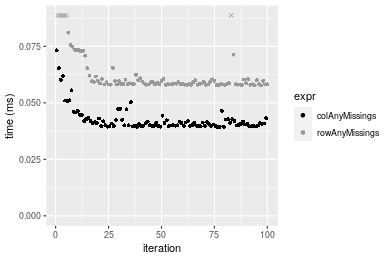
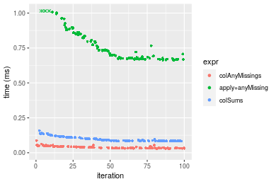
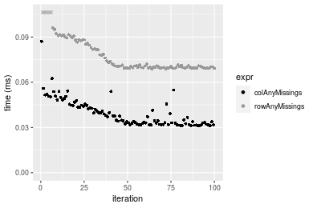
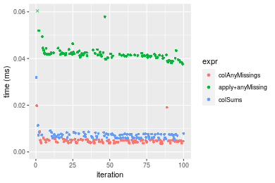
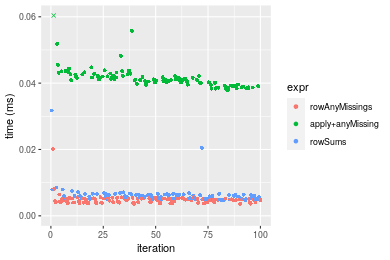
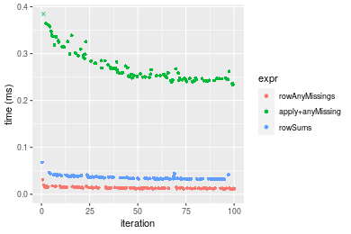
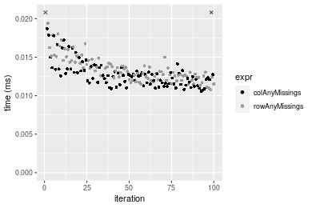
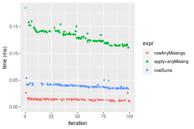
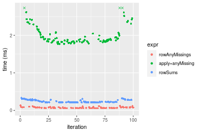
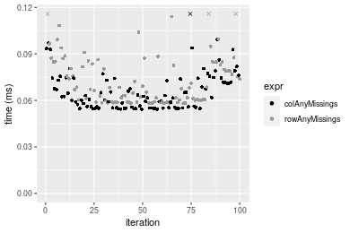

[matrixStats]: Benchmark report

---------------------------------------


# colAnyMissings() and rowAnyMissings() benchmarks

This report benchmark the performance of colAnyMissings() and rowAnyMissings() against alternative methods.

## Alternative methods

* colAnyMissings() and rowAnyMissings()
* apply() + anyMissing()
* colSums() + is.na() and rowSums() + is.na()

where

```r
> colAnyMissings <- function(x, ...) colAnys(x, value = NA)
```

and

```r
> rowAnyMissings <- function(x, ...) rowAnys(x, value = NA)
```


## Data type "integer"

### Data
```r
> rmatrix <- function(nrow, ncol, mode = c("logical", "double", "integer", "index"), range = c(-100, 
+     +100), na_prob = 0) {
+     mode <- match.arg(mode)
+     n <- nrow * ncol
+     if (mode == "logical") {
+         x <- sample(c(FALSE, TRUE), size = n, replace = TRUE)
+     }     else if (mode == "index") {
+         x <- seq_len(n)
+         mode <- "integer"
+     }     else {
+         x <- runif(n, min = range[1], max = range[2])
+     }
+     storage.mode(x) <- mode
+     if (na_prob > 0) 
+         x[sample(n, size = na_prob * n)] <- NA
+     dim(x) <- c(nrow, ncol)
+     x
+ }
> rmatrices <- function(scale = 10, seed = 1, ...) {
+     set.seed(seed)
+     data <- list()
+     data[[1]] <- rmatrix(nrow = scale * 1, ncol = scale * 1, ...)
+     data[[2]] <- rmatrix(nrow = scale * 10, ncol = scale * 10, ...)
+     data[[3]] <- rmatrix(nrow = scale * 100, ncol = scale * 1, ...)
+     data[[4]] <- t(data[[3]])
+     data[[5]] <- rmatrix(nrow = scale * 10, ncol = scale * 100, ...)
+     data[[6]] <- t(data[[5]])
+     names(data) <- sapply(data, FUN = function(x) paste(dim(x), collapse = "x"))
+     data
+ }
> data <- rmatrices(mode = mode)
```

## Results

### 10x10 matrix


```r
> X <- data[["10x10"]]
> gc()
          used (Mb) gc trigger  (Mb) max used  (Mb)
Ncells 5186058  277    7916910 422.9  7916910 422.9
Vcells 9686828   74   33191153 253.3 53339345 407.0
> colStats <- microbenchmark(colAnyMissings = colAnyMissings(X), `apply+anyMissing` = apply(X, MARGIN = 2L, 
+     FUN = anyMissing), colSums = is.na(colSums(X, na.rm = FALSE)), unit = "ms")
> X <- t(X)
> gc()
          used  (Mb) gc trigger  (Mb) max used  (Mb)
Ncells 5172353 276.3    7916910 422.9  7916910 422.9
Vcells 9641495  73.6   33191153 253.3 53339345 407.0
> rowStats <- microbenchmark(rowAnyMissings = rowAnyMissings(X), `apply+anyMissing` = apply(X, MARGIN = 1L, 
+     FUN = anyMissing), rowSums = is.na(rowSums(X, na.rm = FALSE)), unit = "ms")
```

_Table: Benchmarking of colAnyMissings(), apply+anyMissing() and colSums() on integer+10x10 data. The top panel shows times in milliseconds and the bottom panel shows relative times._


|   |expr             |      min|        lq|      mean|    median|       uq|      max|
|:--|:----------------|--------:|---------:|---------:|---------:|--------:|--------:|
|1  |colAnyMissings   | 0.003809| 0.0072100| 0.0086075| 0.0083990| 0.010001| 0.023819|
|3  |colSums          | 0.006060| 0.0110605| 0.0131979| 0.0123710| 0.014875| 0.049497|
|2  |apply+anyMissing | 0.042024| 0.0748170| 0.0769931| 0.0806825| 0.086153| 0.105722|


|   |expr             |       min|       lq|     mean|   median|       uq|      max|
|:--|:----------------|---------:|--------:|--------:|--------:|--------:|--------:|
|1  |colAnyMissings   |  1.000000|  1.00000| 1.000000| 1.000000| 1.000000| 1.000000|
|3  |colSums          |  1.590969|  1.53405| 1.533312| 1.472913| 1.487351| 2.078047|
|2  |apply+anyMissing | 11.032817| 10.37684| 8.944930| 9.606203| 8.614439| 4.438557|

_Table: Benchmarking of rowAnyMissings(), apply+anyMissing() and rowSums() on integer+10x10 data (transposed). The top panel shows times in milliseconds and the bottom panel shows relative times._


|   |expr             |      min|        lq|      mean|    median|        uq|      max|
|:--|:----------------|--------:|---------:|---------:|---------:|---------:|--------:|
|1  |rowAnyMissings   | 0.003602| 0.0041560| 0.0049236| 0.0048900| 0.0052365| 0.021287|
|3  |rowSums          | 0.006268| 0.0069095| 0.0079021| 0.0074495| 0.0082510| 0.029873|
|2  |apply+anyMissing | 0.038887| 0.0411740| 0.0431419| 0.0420480| 0.0432080| 0.096701|


|   |expr             |       min|       lq|     mean|   median|       uq|      max|
|:--|:----------------|---------:|--------:|--------:|--------:|--------:|--------:|
|1  |rowAnyMissings   |  1.000000| 1.000000| 1.000000| 1.000000| 1.000000| 1.000000|
|3  |rowSums          |  1.740144| 1.662536| 1.604952| 1.523415| 1.575671| 1.403345|
|2  |apply+anyMissing | 10.795947| 9.907122| 8.762293| 8.598773| 8.251313| 4.542726|

_Figure: Benchmarking of colAnyMissings(), apply+anyMissing() and colSums() on integer+10x10 data  as well as rowAnyMissings(), apply+anyMissing() and rowSums() on the same data transposed.  Outliers are displayed as crosses.  Times are in milliseconds._


_Table: Benchmarking of colAnyMissings() and rowAnyMissings() on integer+10x10 data (original and transposed).  The top panel shows times in milliseconds and the bottom panel shows relative times._


|   |expr           |   min|    lq|    mean| median|      uq|    max|
|:--|:--------------|-----:|-----:|-------:|------:|-------:|------:|
|2  |rowAnyMissings | 3.602| 4.156| 4.92358|  4.890|  5.2365| 21.287|
|1  |colAnyMissings | 3.809| 7.210| 8.60746|  8.399| 10.0010| 23.819|


|   |expr           |      min|       lq|     mean|   median|       uq|      max|
|:--|:--------------|--------:|--------:|--------:|--------:|--------:|--------:|
|2  |rowAnyMissings | 1.000000| 1.000000| 1.000000| 1.000000| 1.000000| 1.000000|
|1  |colAnyMissings | 1.057468| 1.734841| 1.748212| 1.717587| 1.909863| 1.118946|

_Figure: Benchmarking of colAnyMissings() and rowAnyMissings() on integer+10x10 data (original and transposed).  Outliers are displayed as crosses. Times are in milliseconds._


### 100x100 matrix


```r
> X <- data[["100x100"]]
> gc()
          used  (Mb) gc trigger  (Mb) max used  (Mb)
Ncells 5170912 276.2    7916910 422.9  7916910 422.9
Vcells 9258133  70.7   33191153 253.3 53339345 407.0
> colStats <- microbenchmark(colAnyMissings = colAnyMissings(X), `apply+anyMissing` = apply(X, MARGIN = 2L, 
+     FUN = anyMissing), colSums = is.na(colSums(X, na.rm = FALSE)), unit = "ms")
> X <- t(X)
> gc()
          used  (Mb) gc trigger  (Mb) max used  (Mb)
Ncells 5170906 276.2    7916910 422.9  7916910 422.9
Vcells 9263176  70.7   33191153 253.3 53339345 407.0
> rowStats <- microbenchmark(rowAnyMissings = rowAnyMissings(X), `apply+anyMissing` = apply(X, MARGIN = 1L, 
+     FUN = anyMissing), rowSums = is.na(rowSums(X, na.rm = FALSE)), unit = "ms")
```

_Table: Benchmarking of colAnyMissings(), apply+anyMissing() and colSums() on integer+100x100 data. The top panel shows times in milliseconds and the bottom panel shows relative times._


|   |expr             |      min|       lq|      mean|    median|        uq|      max|
|:--|:----------------|--------:|--------:|---------:|---------:|---------:|--------:|
|1  |colAnyMissings   | 0.007478| 0.008555| 0.0097983| 0.0094525| 0.0103845| 0.030946|
|3  |colSums          | 0.016013| 0.017199| 0.0190291| 0.0182335| 0.0201185| 0.043141|
|2  |apply+anyMissing | 0.233762| 0.253799| 0.2714024| 0.2593775| 0.2846385| 0.408694|


|   |expr             |       min|        lq|      mean|    median|        uq|       max|
|:--|:----------------|---------:|---------:|---------:|---------:|---------:|---------:|
|1  |colAnyMissings   |  1.000000|  1.000000|  1.000000|  1.000000|  1.000000|  1.000000|
|3  |colSums          |  2.141348|  2.010403|  1.942086|  1.928961|  1.937359|  1.394073|
|2  |apply+anyMissing | 31.259963| 29.666745| 27.698985| 27.440095| 27.409938| 13.206683|

_Table: Benchmarking of rowAnyMissings(), apply+anyMissing() and rowSums() on integer+100x100 data (transposed). The top panel shows times in milliseconds and the bottom panel shows relative times._


|   |expr             |      min|        lq|      mean|    median|        uq|      max|
|:--|:----------------|--------:|---------:|---------:|---------:|---------:|--------:|
|1  |rowAnyMissings   | 0.010866| 0.0124065| 0.0136336| 0.0132000| 0.0142105| 0.029364|
|3  |rowSums          | 0.042151| 0.0453000| 0.0493053| 0.0474800| 0.0518395| 0.078197|
|2  |apply+anyMissing | 0.229116| 0.2461195| 0.2647529| 0.2541975| 0.2768255| 0.383094|


|   |expr             |       min|        lq|      mean|   median|        uq|       max|
|:--|:----------------|---------:|---------:|---------:|--------:|---------:|---------:|
|1  |rowAnyMissings   |  1.000000|  1.000000|  1.000000|  1.00000|  1.000000|  1.000000|
|3  |rowSums          |  3.879164|  3.651312|  3.616455|  3.59697|  3.647972|  2.663023|
|2  |apply+anyMissing | 21.085588| 19.837948| 19.419133| 19.25739| 19.480349| 13.046383|

_Figure: Benchmarking of colAnyMissings(), apply+anyMissing() and colSums() on integer+100x100 data  as well as rowAnyMissings(), apply+anyMissing() and rowSums() on the same data transposed.  Outliers are displayed as crosses.  Times are in milliseconds._


_Table: Benchmarking of colAnyMissings() and rowAnyMissings() on integer+100x100 data (original and transposed).  The top panel shows times in milliseconds and the bottom panel shows relative times._


|   |expr           |    min|      lq|     mean|  median|      uq|    max|
|:--|:--------------|------:|-------:|--------:|-------:|-------:|------:|
|1  |colAnyMissings |  7.478|  8.5550|  9.79828|  9.4525| 10.3845| 30.946|
|2  |rowAnyMissings | 10.866| 12.4065| 13.63361| 13.2000| 14.2105| 29.364|


|   |expr           |      min|       lq|     mean|   median|       uq|       max|
|:--|:--------------|--------:|--------:|--------:|--------:|--------:|---------:|
|1  |colAnyMissings | 1.000000| 1.000000| 1.000000| 1.000000| 1.000000| 1.0000000|
|2  |rowAnyMissings | 1.453062| 1.450205| 1.391429| 1.396456| 1.368434| 0.9488787|

_Figure: Benchmarking of colAnyMissings() and rowAnyMissings() on integer+100x100 data (original and transposed).  Outliers are displayed as crosses. Times are in milliseconds._


### 1000x10 matrix


```r
> X <- data[["1000x10"]]
> gc()
          used  (Mb) gc trigger  (Mb) max used  (Mb)
Ncells 5171665 276.2    7916910 422.9  7916910 422.9
Vcells 9261909  70.7   33191153 253.3 53339345 407.0
> colStats <- microbenchmark(colAnyMissings = colAnyMissings(X), `apply+anyMissing` = apply(X, MARGIN = 2L, 
+     FUN = anyMissing), colSums = is.na(colSums(X, na.rm = FALSE)), unit = "ms")
> X <- t(X)
> gc()
          used  (Mb) gc trigger  (Mb) max used  (Mb)
Ncells 5171659 276.2    7916910 422.9  7916910 422.9
Vcells 9266952  70.8   33191153 253.3 53339345 407.0
> rowStats <- microbenchmark(rowAnyMissings = rowAnyMissings(X), `apply+anyMissing` = apply(X, MARGIN = 1L, 
+     FUN = anyMissing), rowSums = is.na(rowSums(X, na.rm = FALSE)), unit = "ms")
```

_Table: Benchmarking of colAnyMissings(), apply+anyMissing() and colSums() on integer+1000x10 data. The top panel shows times in milliseconds and the bottom panel shows relative times._


|   |expr             |      min|        lq|      mean|   median|        uq|      max|
|:--|:----------------|--------:|---------:|---------:|--------:|---------:|--------:|
|1  |colAnyMissings   | 0.007049| 0.0080435| 0.0088473| 0.008437| 0.0090805| 0.021892|
|3  |colSums          | 0.015188| 0.0170840| 0.0183648| 0.017961| 0.0188000| 0.034795|
|2  |apply+anyMissing | 0.105127| 0.1106220| 0.1197459| 0.118856| 0.1252275| 0.198053|


|   |expr             |       min|        lq|      mean|    median|        uq|      max|
|:--|:----------------|---------:|---------:|---------:|---------:|---------:|--------:|
|1  |colAnyMissings   |  1.000000|  1.000000|  1.000000|  1.000000|  1.000000| 1.000000|
|3  |colSums          |  2.154632|  2.123951|  2.075755|  2.128837|  2.070371| 1.589393|
|2  |apply+anyMissing | 14.913747| 13.752968| 13.534738| 14.087472| 13.790816| 9.046821|

_Table: Benchmarking of rowAnyMissings(), apply+anyMissing() and rowSums() on integer+1000x10 data (transposed). The top panel shows times in milliseconds and the bottom panel shows relative times._


|   |expr             |      min|       lq|      mean|    median|        uq|      max|
|:--|:----------------|--------:|--------:|---------:|---------:|---------:|--------:|
|1  |rowAnyMissings   | 0.009904| 0.011500| 0.0124859| 0.0121255| 0.0130485| 0.025463|
|2  |apply+anyMissing | 0.095213| 0.103436| 0.1126797| 0.1071910| 0.1202915| 0.208917|
|3  |rowSums          | 0.158646| 0.168908| 0.1791885| 0.1743620| 0.1866530| 0.220276|


|   |expr             |       min|        lq|      mean|   median|        uq|      max|
|:--|:----------------|---------:|---------:|---------:|--------:|---------:|--------:|
|1  |rowAnyMissings   |  1.000000|  1.000000|  1.000000|  1.00000|  1.000000| 1.000000|
|2  |apply+anyMissing |  9.613591|  8.994435|  9.024575|  8.84013|  9.218799| 8.204728|
|3  |rowSums          | 16.018376| 14.687652| 14.351304| 14.37978| 14.304556| 8.650827|

_Figure: Benchmarking of colAnyMissings(), apply+anyMissing() and colSums() on integer+1000x10 data  as well as rowAnyMissings(), apply+anyMissing() and rowSums() on the same data transposed.  Outliers are displayed as crosses.  Times are in milliseconds._


_Table: Benchmarking of colAnyMissings() and rowAnyMissings() on integer+1000x10 data (original and transposed).  The top panel shows times in milliseconds and the bottom panel shows relative times._


|   |expr           |   min|      lq|     mean|  median|      uq|    max|
|:--|:--------------|-----:|-------:|--------:|-------:|-------:|------:|
|1  |colAnyMissings | 7.049|  8.0435|  8.84730|  8.4370|  9.0805| 21.892|
|2  |rowAnyMissings | 9.904| 11.5000| 12.48587| 12.1255| 13.0485| 25.463|


|   |expr           |      min|       lq|     mean|   median|      uq|      max|
|:--|:--------------|--------:|--------:|--------:|--------:|-------:|--------:|
|1  |colAnyMissings | 1.000000| 1.000000| 1.000000| 1.000000| 1.00000| 1.000000|
|2  |rowAnyMissings | 1.405022| 1.429726| 1.411263| 1.437181| 1.43698| 1.163119|

_Figure: Benchmarking of colAnyMissings() and rowAnyMissings() on integer+1000x10 data (original and transposed).  Outliers are displayed as crosses. Times are in milliseconds._


### 10x1000 matrix


```r
> X <- data[["10x1000"]]
> gc()
          used  (Mb) gc trigger  (Mb) max used  (Mb)
Ncells 5171879 276.3    7916910 422.9  7916910 422.9
Vcells 9262714  70.7   33191153 253.3 53339345 407.0
> colStats <- microbenchmark(colAnyMissings = colAnyMissings(X), `apply+anyMissing` = apply(X, MARGIN = 2L, 
+     FUN = anyMissing), colSums = is.na(colSums(X, na.rm = FALSE)), unit = "ms")
> X <- t(X)
> gc()
          used  (Mb) gc trigger  (Mb) max used  (Mb)
Ncells 5171873 276.3    7916910 422.9  7916910 422.9
Vcells 9267757  70.8   33191153 253.3 53339345 407.0
> rowStats <- microbenchmark(rowAnyMissings = rowAnyMissings(X), `apply+anyMissing` = apply(X, MARGIN = 1L, 
+     FUN = anyMissing), rowSums = is.na(rowSums(X, na.rm = FALSE)), unit = "ms")
```

_Table: Benchmarking of colAnyMissings(), apply+anyMissing() and colSums() on integer+10x1000 data. The top panel shows times in milliseconds and the bottom panel shows relative times._


|   |expr             |      min|        lq|      mean|   median|        uq|      max|
|:--|:----------------|--------:|---------:|---------:|--------:|---------:|--------:|
|1  |colAnyMissings   | 0.008279| 0.0089980| 0.0104391| 0.009740| 0.0108185| 0.024007|
|3  |colSums          | 0.014411| 0.0150095| 0.0172416| 0.016228| 0.0174725| 0.049457|
|2  |apply+anyMissing | 1.223089| 1.2735145| 1.3670440| 1.289249| 1.4162525| 2.011674|


|   |expr             |        min|         lq|       mean|     median|         uq|       max|
|:--|:----------------|----------:|----------:|----------:|----------:|----------:|---------:|
|1  |colAnyMissings   |   1.000000|   1.000000|   1.000000|   1.000000|   1.000000|  1.000000|
|3  |colSums          |   1.740669|   1.668093|   1.651645|   1.666119|   1.615058|  2.060107|
|2  |apply+anyMissing | 147.733905| 141.533063| 130.954580| 132.366427| 130.910246| 83.795310|

_Table: Benchmarking of rowAnyMissings(), apply+anyMissing() and rowSums() on integer+10x1000 data (transposed). The top panel shows times in milliseconds and the bottom panel shows relative times._


|   |expr             |      min|        lq|      mean|   median|        uq|      max|
|:--|:----------------|--------:|---------:|---------:|--------:|---------:|--------:|
|1  |rowAnyMissings   | 0.009444| 0.0106160| 0.0121598| 0.011230| 0.0125085| 0.040141|
|3  |rowSums          | 0.026942| 0.0277665| 0.0302508| 0.028774| 0.0302270| 0.052397|
|2  |apply+anyMissing | 1.229076| 1.2678990| 1.3675467| 1.286207| 1.4201360| 2.021531|


|   |expr             |        min|         lq|       mean|     median|         uq|       max|
|:--|:----------------|----------:|----------:|----------:|----------:|----------:|---------:|
|1  |rowAnyMissings   |   1.000000|   1.000000|   1.000000|   1.000000|   1.000000|  1.000000|
|3  |rowSums          |   2.852817|   2.615533|   2.487785|   2.562244|   2.416517|  1.305324|
|2  |apply+anyMissing | 130.143583| 119.432837| 112.465031| 114.533170| 113.533677| 50.360753|

_Figure: Benchmarking of colAnyMissings(), apply+anyMissing() and colSums() on integer+10x1000 data  as well as rowAnyMissings(), apply+anyMissing() and rowSums() on the same data transposed.  Outliers are displayed as crosses.  Times are in milliseconds._


_Table: Benchmarking of colAnyMissings() and rowAnyMissings() on integer+10x1000 data (original and transposed).  The top panel shows times in milliseconds and the bottom panel shows relative times._


|   |expr           |   min|     lq|     mean| median|      uq|    max|
|:--|:--------------|-----:|------:|--------:|------:|-------:|------:|
|1  |colAnyMissings | 8.279|  8.998| 10.43907|   9.74| 10.8185| 24.007|
|2  |rowAnyMissings | 9.444| 10.616| 12.15975|  11.23| 12.5085| 40.141|


|   |expr           |      min|       lq|     mean|   median|       uq|      max|
|:--|:--------------|--------:|--------:|--------:|--------:|--------:|--------:|
|1  |colAnyMissings | 1.000000| 1.000000| 1.000000| 1.000000| 1.000000| 1.000000|
|2  |rowAnyMissings | 1.140718| 1.179818| 1.164831| 1.152977| 1.156214| 1.672054|

_Figure: Benchmarking of colAnyMissings() and rowAnyMissings() on integer+10x1000 data (original and transposed).  Outliers are displayed as crosses. Times are in milliseconds._


### 100x1000 matrix


```r
> X <- data[["100x1000"]]
> gc()
          used  (Mb) gc trigger  (Mb) max used  (Mb)
Ncells 5172093 276.3    7916910 422.9  7916910 422.9
Vcells 9263307  70.7   33191153 253.3 53339345 407.0
> colStats <- microbenchmark(colAnyMissings = colAnyMissings(X), `apply+anyMissing` = apply(X, MARGIN = 2L, 
+     FUN = anyMissing), colSums = is.na(colSums(X, na.rm = FALSE)), unit = "ms")
> X <- t(X)
> gc()
          used  (Mb) gc trigger  (Mb) max used  (Mb)
Ncells 5172075 276.3    7916910 422.9  7916910 422.9
Vcells 9313330  71.1   33191153 253.3 53339345 407.0
> rowStats <- microbenchmark(rowAnyMissings = rowAnyMissings(X), `apply+anyMissing` = apply(X, MARGIN = 1L, 
+     FUN = anyMissing), rowSums = is.na(rowSums(X, na.rm = FALSE)), unit = "ms")
```

_Table: Benchmarking of colAnyMissings(), apply+anyMissing() and colSums() on integer+100x1000 data. The top panel shows times in milliseconds and the bottom panel shows relative times._


|   |expr             |      min|       lq|      mean|   median|        uq|      max|
|:--|:----------------|--------:|--------:|---------:|--------:|---------:|--------:|
|1  |colAnyMissings   | 0.039274| 0.039847| 0.0427368| 0.040893| 0.0426735| 0.073255|
|3  |colSums          | 0.090102| 0.090739| 0.0973042| 0.092236| 0.0944665| 0.156048|
|2  |apply+anyMissing | 1.768765| 1.810264| 1.9352011| 1.823029| 1.8750790| 3.187346|


|   |expr             |       min|        lq|      mean|    median|        uq|       max|
|:--|:----------------|---------:|---------:|---------:|---------:|---------:|---------:|
|1  |colAnyMissings   |  1.000000|  1.000000|  1.000000|  1.000000|  1.000000|  1.000000|
|3  |colSums          |  2.294189|  2.277185|  2.276822|  2.255545|  2.213704|  2.130203|
|2  |apply+anyMissing | 45.036538| 45.430384| 45.281812| 44.580466| 43.940127| 43.510286|

_Table: Benchmarking of rowAnyMissings(), apply+anyMissing() and rowSums() on integer+100x1000 data (transposed). The top panel shows times in milliseconds and the bottom panel shows relative times._


|   |expr             |      min|        lq|      mean|   median|        uq|      max|
|:--|:----------------|--------:|---------:|---------:|--------:|---------:|--------:|
|1  |rowAnyMissings   | 0.057653| 0.0581690| 0.0635540| 0.058692| 0.0604780| 0.148521|
|3  |rowSums          | 0.222719| 0.2236545| 0.2482212| 0.224808| 0.2523015| 0.383250|
|2  |apply+anyMissing | 1.771039| 1.8009920| 1.9164027| 1.825411| 1.8692320| 3.141921|


|   |expr             |       min|        lq|      mean|    median|       uq|       max|
|:--|:----------------|---------:|---------:|---------:|---------:|--------:|---------:|
|1  |rowAnyMissings   |  1.000000|  1.000000|  1.000000|  1.000000|  1.00000|  1.000000|
|3  |rowSums          |  3.863095|  3.844909|  3.905674|  3.830301|  4.17179|  2.580443|
|2  |apply+anyMissing | 30.718939| 30.961371| 30.153922| 31.101530| 30.90764| 21.154726|

_Figure: Benchmarking of colAnyMissings(), apply+anyMissing() and colSums() on integer+100x1000 data  as well as rowAnyMissings(), apply+anyMissing() and rowSums() on the same data transposed.  Outliers are displayed as crosses.  Times are in milliseconds._


_Table: Benchmarking of colAnyMissings() and rowAnyMissings() on integer+100x1000 data (original and transposed).  The top panel shows times in milliseconds and the bottom panel shows relative times._


|   |expr           |    min|     lq|     mean| median|      uq|     max|
|:--|:--------------|------:|------:|--------:|------:|-------:|-------:|
|1  |colAnyMissings | 39.274| 39.847| 42.73683| 40.893| 42.6735|  73.255|
|2  |rowAnyMissings | 57.653| 58.169| 63.55401| 58.692| 60.4780| 148.521|


|   |expr           |      min|       lq|     mean|   median|       uq|      max|
|:--|:--------------|--------:|--------:|--------:|--------:|--------:|--------:|
|1  |colAnyMissings | 1.000000| 1.000000| 1.000000| 1.000000| 1.000000| 1.000000|
|2  |rowAnyMissings | 1.467969| 1.459809| 1.487102| 1.435258| 1.417226| 2.027452|

_Figure: Benchmarking of colAnyMissings() and rowAnyMissings() on integer+100x1000 data (original and transposed).  Outliers are displayed as crosses. Times are in milliseconds._




### 1000x100 matrix


```r
> X <- data[["1000x100"]]
> gc()
          used  (Mb) gc trigger  (Mb) max used  (Mb)
Ncells 5172299 276.3    7916910 422.9  7916910 422.9
Vcells 9263970  70.7   33191153 253.3 53339345 407.0
> colStats <- microbenchmark(colAnyMissings = colAnyMissings(X), `apply+anyMissing` = apply(X, MARGIN = 2L, 
+     FUN = anyMissing), colSums = is.na(colSums(X, na.rm = FALSE)), unit = "ms")
> X <- t(X)
> gc()
          used  (Mb) gc trigger  (Mb) max used  (Mb)
Ncells 5172281 276.3    7916910 422.9  7916910 422.9
Vcells 9313993  71.1   33191153 253.3 53339345 407.0
> rowStats <- microbenchmark(rowAnyMissings = rowAnyMissings(X), `apply+anyMissing` = apply(X, MARGIN = 1L, 
+     FUN = anyMissing), rowSums = is.na(rowSums(X, na.rm = FALSE)), unit = "ms")
```

_Table: Benchmarking of colAnyMissings(), apply+anyMissing() and colSums() on integer+1000x100 data. The top panel shows times in milliseconds and the bottom panel shows relative times._


|   |expr             |      min|        lq|      mean|    median|        uq|      max|
|:--|:----------------|--------:|---------:|---------:|---------:|---------:|--------:|
|1  |colAnyMissings   | 0.031041| 0.0322385| 0.0394072| 0.0358605| 0.0446895| 0.087170|
|3  |colSums          | 0.083186| 0.0844970| 0.0982269| 0.0909645| 0.1089015| 0.158834|
|2  |apply+anyMissing | 0.663584| 0.6760930| 0.7758048| 0.7308360| 0.8508990| 1.197154|


|   |expr             |       min|        lq|      mean|    median|        uq|       max|
|:--|:----------------|---------:|---------:|---------:|---------:|---------:|---------:|
|1  |colAnyMissings   |  1.000000|  1.000000|  1.000000|  1.000000|  1.000000|  1.000000|
|3  |colSums          |  2.679875|  2.620997|  2.492617|  2.536621|  2.436848|  1.822118|
|2  |apply+anyMissing | 21.377662| 20.971602| 19.686904| 20.379972| 19.040244| 13.733555|

_Table: Benchmarking of rowAnyMissings(), apply+anyMissing() and rowSums() on integer+1000x100 data (transposed). The top panel shows times in milliseconds and the bottom panel shows relative times._


|   |expr             |      min|        lq|      mean|    median|        uq|      max|
|:--|:----------------|--------:|---------:|---------:|---------:|---------:|--------:|
|1  |rowAnyMissings   | 0.068845| 0.0697250| 0.0782112| 0.0708675| 0.0862475| 0.146025|
|3  |rowSums          | 0.322388| 0.3238260| 0.3631519| 0.3298095| 0.4000005| 0.539408|
|2  |apply+anyMissing | 0.671254| 0.6773885| 0.7446619| 0.6828805| 0.7592760| 1.256254|


|   |expr             |      min|       lq|     mean|   median|       uq|      max|
|:--|:----------------|--------:|--------:|--------:|--------:|--------:|--------:|
|1  |rowAnyMissings   | 1.000000| 1.000000| 1.000000| 1.000000| 1.000000| 1.000000|
|3  |rowSums          | 4.682809| 4.644331| 4.643219| 4.653889| 4.637821| 3.693943|
|2  |apply+anyMissing | 9.750222| 9.715145| 9.521162| 9.636018| 8.803455| 8.603006|

_Figure: Benchmarking of colAnyMissings(), apply+anyMissing() and colSums() on integer+1000x100 data  as well as rowAnyMissings(), apply+anyMissing() and rowSums() on the same data transposed.  Outliers are displayed as crosses.  Times are in milliseconds._





_Table: Benchmarking of colAnyMissings() and rowAnyMissings() on integer+1000x100 data (original and transposed).  The top panel shows times in milliseconds and the bottom panel shows relative times._


|   |expr           |    min|      lq|     mean|  median|      uq|     max|
|:--|:--------------|------:|-------:|--------:|-------:|-------:|-------:|
|1  |colAnyMissings | 31.041| 32.2385| 39.40715| 35.8605| 44.6895|  87.170|
|2  |rowAnyMissings | 68.845| 69.7250| 78.21124| 70.8675| 86.2475| 146.025|


|   |expr           |      min|       lq|     mean|   median|       uq|      max|
|:--|:--------------|--------:|--------:|--------:|--------:|--------:|--------:|
|1  |colAnyMissings | 1.000000| 1.000000| 1.000000| 1.000000| 1.000000| 1.000000|
|2  |rowAnyMissings | 2.217873| 2.162787| 1.984697| 1.976199| 1.929928| 1.675175|

_Figure: Benchmarking of colAnyMissings() and rowAnyMissings() on integer+1000x100 data (original and transposed).  Outliers are displayed as crosses. Times are in milliseconds._





## Data type "double"

### Data
```r
> rmatrix <- function(nrow, ncol, mode = c("logical", "double", "integer", "index"), range = c(-100, 
+     +100), na_prob = 0) {
+     mode <- match.arg(mode)
+     n <- nrow * ncol
+     if (mode == "logical") {
+         x <- sample(c(FALSE, TRUE), size = n, replace = TRUE)
+     }     else if (mode == "index") {
+         x <- seq_len(n)
+         mode <- "integer"
+     }     else {
+         x <- runif(n, min = range[1], max = range[2])
+     }
+     storage.mode(x) <- mode
+     if (na_prob > 0) 
+         x[sample(n, size = na_prob * n)] <- NA
+     dim(x) <- c(nrow, ncol)
+     x
+ }
> rmatrices <- function(scale = 10, seed = 1, ...) {
+     set.seed(seed)
+     data <- list()
+     data[[1]] <- rmatrix(nrow = scale * 1, ncol = scale * 1, ...)
+     data[[2]] <- rmatrix(nrow = scale * 10, ncol = scale * 10, ...)
+     data[[3]] <- rmatrix(nrow = scale * 100, ncol = scale * 1, ...)
+     data[[4]] <- t(data[[3]])
+     data[[5]] <- rmatrix(nrow = scale * 10, ncol = scale * 100, ...)
+     data[[6]] <- t(data[[5]])
+     names(data) <- sapply(data, FUN = function(x) paste(dim(x), collapse = "x"))
+     data
+ }
> data <- rmatrices(mode = mode)
```

## Results

### 10x10 matrix


```r
> X <- data[["10x10"]]
> gc()
          used  (Mb) gc trigger  (Mb) max used  (Mb)
Ncells 5172503 276.3    7916910 422.9  7916910 422.9
Vcells 9379776  71.6   33191153 253.3 53339345 407.0
> colStats <- microbenchmark(colAnyMissings = colAnyMissings(X), `apply+anyMissing` = apply(X, MARGIN = 2L, 
+     FUN = anyMissing), colSums = is.na(colSums(X, na.rm = FALSE)), unit = "ms")
> X <- t(X)
> gc()
          used  (Mb) gc trigger  (Mb) max used  (Mb)
Ncells 5172488 276.3    7916910 422.9  7916910 422.9
Vcells 9379904  71.6   33191153 253.3 53339345 407.0
> rowStats <- microbenchmark(rowAnyMissings = rowAnyMissings(X), `apply+anyMissing` = apply(X, MARGIN = 1L, 
+     FUN = anyMissing), rowSums = is.na(rowSums(X, na.rm = FALSE)), unit = "ms")
```

_Table: Benchmarking of colAnyMissings(), apply+anyMissing() and colSums() on double+10x10 data. The top panel shows times in milliseconds and the bottom panel shows relative times._


|   |expr             |      min|        lq|      mean|    median|        uq|      max|
|:--|:----------------|--------:|---------:|---------:|---------:|---------:|--------:|
|1  |colAnyMissings   | 0.003581| 0.0041315| 0.0049224| 0.0046810| 0.0050555| 0.019806|
|3  |colSums          | 0.005513| 0.0060460| 0.0071663| 0.0068855| 0.0075965| 0.031905|
|2  |apply+anyMissing | 0.037558| 0.0410005| 0.0423185| 0.0416070| 0.0423830| 0.093578|


|   |expr             |       min|       lq|     mean|   median|       uq|      max|
|:--|:----------------|---------:|--------:|--------:|--------:|--------:|--------:|
|1  |colAnyMissings   |  1.000000| 1.000000| 1.000000| 1.000000| 1.000000| 1.000000|
|3  |colSums          |  1.539514| 1.463391| 1.455853| 1.470946| 1.502621| 1.610875|
|2  |apply+anyMissing | 10.488132| 9.923877| 8.597086| 8.888485| 8.383543| 4.724730|

_Table: Benchmarking of rowAnyMissings(), apply+anyMissing() and rowSums() on double+10x10 data (transposed). The top panel shows times in milliseconds and the bottom panel shows relative times._


|   |expr             |      min|        lq|      mean|    median|        uq|      max|
|:--|:----------------|--------:|---------:|---------:|---------:|---------:|--------:|
|1  |rowAnyMissings   | 0.003654| 0.0040280| 0.0048360| 0.0047425| 0.0051905| 0.020096|
|3  |rowSums          | 0.004608| 0.0051185| 0.0062236| 0.0058080| 0.0064145| 0.031750|
|2  |apply+anyMissing | 0.037789| 0.0396555| 0.0418397| 0.0410250| 0.0422060| 0.096883|


|   |expr             |       min|      lq|     mean|   median|       uq|      max|
|:--|:----------------|---------:|-------:|--------:|--------:|--------:|--------:|
|1  |rowAnyMissings   |  1.000000| 1.00000| 1.000000| 1.000000| 1.000000| 1.000000|
|3  |rowSums          |  1.261084| 1.27073| 1.286945| 1.224670| 1.235815| 1.579916|
|2  |apply+anyMissing | 10.341817| 9.84496| 8.651758| 8.650501| 8.131394| 4.821009|

_Figure: Benchmarking of colAnyMissings(), apply+anyMissing() and colSums() on double+10x10 data  as well as rowAnyMissings(), apply+anyMissing() and rowSums() on the same data transposed.  Outliers are displayed as crosses.  Times are in milliseconds._





_Table: Benchmarking of colAnyMissings() and rowAnyMissings() on double+10x10 data (original and transposed).  The top panel shows times in milliseconds and the bottom panel shows relative times._


|   |expr           |   min|     lq|    mean| median|     uq|    max|
|:--|:--------------|-----:|------:|-------:|------:|------:|------:|
|1  |colAnyMissings | 3.581| 4.1315| 4.92242| 4.6810| 5.0555| 19.806|
|2  |rowAnyMissings | 3.654| 4.0280| 4.83598| 4.7425| 5.1905| 20.096|


|   |expr           |      min|        lq|      mean|   median|       uq|      max|
|:--|:--------------|--------:|---------:|---------:|--------:|--------:|--------:|
|1  |colAnyMissings | 1.000000| 1.0000000| 1.0000000| 1.000000| 1.000000| 1.000000|
|2  |rowAnyMissings | 1.020385| 0.9749486| 0.9824395| 1.013138| 1.026704| 1.014642|

_Figure: Benchmarking of colAnyMissings() and rowAnyMissings() on double+10x10 data (original and transposed).  Outliers are displayed as crosses. Times are in milliseconds._


### 100x100 matrix


```r
> X <- data[["100x100"]]
> gc()
          used  (Mb) gc trigger  (Mb) max used  (Mb)
Ncells 5172696 276.3    7916910 422.9  7916910 422.9
Vcells 9380684  71.6   33191153 253.3 53339345 407.0
> colStats <- microbenchmark(colAnyMissings = colAnyMissings(X), `apply+anyMissing` = apply(X, MARGIN = 2L, 
+     FUN = anyMissing), colSums = is.na(colSums(X, na.rm = FALSE)), unit = "ms")
> X <- t(X)
> gc()
          used  (Mb) gc trigger  (Mb) max used  (Mb)
Ncells 5172690 276.3    7916910 422.9  7916910 422.9
Vcells 9390727  71.7   33191153 253.3 53339345 407.0
> rowStats <- microbenchmark(rowAnyMissings = rowAnyMissings(X), `apply+anyMissing` = apply(X, MARGIN = 1L, 
+     FUN = anyMissing), rowSums = is.na(rowSums(X, na.rm = FALSE)), unit = "ms")
```

_Table: Benchmarking of colAnyMissings(), apply+anyMissing() and colSums() on double+100x100 data. The top panel shows times in milliseconds and the bottom panel shows relative times._


|   |expr             |      min|        lq|      mean|    median|        uq|      max|
|:--|:----------------|--------:|---------:|---------:|---------:|---------:|--------:|
|1  |colAnyMissings   | 0.010568| 0.0116260| 0.0132199| 0.0126215| 0.0134595| 0.046017|
|3  |colSums          | 0.014621| 0.0158655| 0.0179084| 0.0170930| 0.0183270| 0.048197|
|2  |apply+anyMissing | 0.268224| 0.2804840| 0.2967699| 0.2848725| 0.3034100| 0.430302|


|   |expr             |       min|        lq|      mean|    median|        uq|      max|
|:--|:----------------|---------:|---------:|---------:|---------:|---------:|--------:|
|1  |colAnyMissings   |  1.000000|  1.000000|  1.000000|  1.000000|  1.000000| 1.000000|
|3  |colSums          |  1.383516|  1.364657|  1.354652|  1.354276|  1.361641| 1.047374|
|2  |apply+anyMissing | 25.380772| 24.125581| 22.448639| 22.570416| 22.542442| 9.350936|

_Table: Benchmarking of rowAnyMissings(), apply+anyMissing() and rowSums() on double+100x100 data (transposed). The top panel shows times in milliseconds and the bottom panel shows relative times._


|   |expr             |      min|        lq|      mean|    median|        uq|      max|
|:--|:----------------|--------:|---------:|---------:|---------:|---------:|--------:|
|1  |rowAnyMissings   | 0.010763| 0.0123595| 0.0136147| 0.0130415| 0.0143355| 0.030891|
|3  |rowSums          | 0.031449| 0.0327610| 0.0357766| 0.0340155| 0.0377875| 0.067907|
|2  |apply+anyMissing | 0.233782| 0.2465895| 0.2714195| 0.2567235| 0.2849800| 0.407697|


|   |expr             |       min|        lq|      mean|    median|        uq|       max|
|:--|:----------------|---------:|---------:|---------:|---------:|---------:|---------:|
|1  |rowAnyMissings   |  1.000000|  1.000000|  1.000000|  1.000000|  1.000000|  1.000000|
|3  |rowSums          |  2.921955|  2.650674|  2.627789|  2.608251|  2.635939|  2.198278|
|2  |apply+anyMissing | 21.720896| 19.951414| 19.935750| 19.685121| 19.879321| 13.197922|

_Figure: Benchmarking of colAnyMissings(), apply+anyMissing() and colSums() on double+100x100 data  as well as rowAnyMissings(), apply+anyMissing() and rowSums() on the same data transposed.  Outliers are displayed as crosses.  Times are in milliseconds._



_Table: Benchmarking of colAnyMissings() and rowAnyMissings() on double+100x100 data (original and transposed).  The top panel shows times in milliseconds and the bottom panel shows relative times._


|   |expr           |    min|      lq|     mean|  median|      uq|    max|
|:--|:--------------|------:|-------:|--------:|-------:|-------:|------:|
|1  |colAnyMissings | 10.568| 11.6260| 13.21995| 12.6215| 13.4595| 46.017|
|2  |rowAnyMissings | 10.763| 12.3595| 13.61471| 13.0415| 14.3355| 30.891|


|   |expr           |      min|       lq|     mean|   median|       uq|       max|
|:--|:--------------|--------:|--------:|--------:|--------:|--------:|---------:|
|1  |colAnyMissings | 1.000000| 1.000000| 1.000000| 1.000000| 1.000000| 1.0000000|
|2  |rowAnyMissings | 1.018452| 1.063091| 1.029861| 1.033277| 1.065084| 0.6712954|

_Figure: Benchmarking of colAnyMissings() and rowAnyMissings() on double+100x100 data (original and transposed).  Outliers are displayed as crosses. Times are in milliseconds._




### 1000x10 matrix


```r
> X <- data[["1000x10"]]
> gc()
          used  (Mb) gc trigger  (Mb) max used  (Mb)
Ncells 5172907 276.3    7916910 422.9  7916910 422.9
Vcells 9381734  71.6   33191153 253.3 53339345 407.0
> colStats <- microbenchmark(colAnyMissings = colAnyMissings(X), `apply+anyMissing` = apply(X, MARGIN = 2L, 
+     FUN = anyMissing), colSums = is.na(colSums(X, na.rm = FALSE)), unit = "ms")
> X <- t(X)
> gc()
          used  (Mb) gc trigger  (Mb) max used  (Mb)
Ncells 5172901 276.3    7916910 422.9  7916910 422.9
Vcells 9391777  71.7   33191153 253.3 53339345 407.0
> rowStats <- microbenchmark(rowAnyMissings = rowAnyMissings(X), `apply+anyMissing` = apply(X, MARGIN = 1L, 
+     FUN = anyMissing), rowSums = is.na(rowSums(X, na.rm = FALSE)), unit = "ms")
```

_Table: Benchmarking of colAnyMissings(), apply+anyMissing() and colSums() on double+1000x10 data. The top panel shows times in milliseconds and the bottom panel shows relative times._


|   |expr             |      min|        lq|      mean|    median|       uq|      max|
|:--|:----------------|--------:|---------:|---------:|---------:|--------:|--------:|
|1  |colAnyMissings   | 0.009523| 0.0111850| 0.0119533| 0.0117325| 0.012410| 0.026042|
|3  |colSums          | 0.016357| 0.0184395| 0.0194881| 0.0190915| 0.020452| 0.035045|
|2  |apply+anyMissing | 0.117981| 0.1244735| 0.1356701| 0.1348180| 0.141845| 0.223501|


|   |expr             |       min|        lq|      mean|    median|        uq|      max|
|:--|:----------------|---------:|---------:|---------:|---------:|---------:|--------:|
|1  |colAnyMissings   |  1.000000|  1.000000|  1.000000|  1.000000|  1.000000| 1.000000|
|3  |colSums          |  1.717631|  1.648592|  1.630347|  1.627232|  1.648026| 1.345711|
|2  |apply+anyMissing | 12.389058| 11.128610| 11.349992| 11.490987| 11.429895| 8.582328|

_Table: Benchmarking of rowAnyMissings(), apply+anyMissing() and rowSums() on double+1000x10 data (transposed). The top panel shows times in milliseconds and the bottom panel shows relative times._


|   |expr             |      min|        lq|      mean|    median|        uq|      max|
|:--|:----------------|--------:|---------:|---------:|---------:|---------:|--------:|
|1  |rowAnyMissings   | 0.010802| 0.0128360| 0.0138888| 0.0135210| 0.0148770| 0.026792|
|3  |rowSums          | 0.033736| 0.0368030| 0.0393192| 0.0393355| 0.0413700| 0.054038|
|2  |apply+anyMissing | 0.110934| 0.1212575| 0.1318602| 0.1309920| 0.1411225| 0.217518|


|   |expr             |       min|       lq|     mean|   median|       uq|      max|
|:--|:----------------|---------:|--------:|--------:|--------:|--------:|--------:|
|1  |rowAnyMissings   |  1.000000| 1.000000| 1.000000| 1.000000| 1.000000| 1.000000|
|3  |rowSums          |  3.123125| 2.867170| 2.831011| 2.909215| 2.780803| 2.016945|
|2  |apply+anyMissing | 10.269765| 9.446673| 9.494031| 9.688041| 9.485952| 8.118767|

_Figure: Benchmarking of colAnyMissings(), apply+anyMissing() and colSums() on double+1000x10 data  as well as rowAnyMissings(), apply+anyMissing() and rowSums() on the same data transposed.  Outliers are displayed as crosses.  Times are in milliseconds._



_Table: Benchmarking of colAnyMissings() and rowAnyMissings() on double+1000x10 data (original and transposed).  The top panel shows times in milliseconds and the bottom panel shows relative times._


|   |expr           |    min|     lq|     mean|  median|     uq|    max|
|:--|:--------------|------:|------:|--------:|-------:|------:|------:|
|1  |colAnyMissings |  9.523| 11.185| 11.95332| 11.7325| 12.410| 26.042|
|2  |rowAnyMissings | 10.802| 12.836| 13.88875| 13.5210| 14.877| 26.792|


|   |expr           |      min|       lq|     mean|  median|       uq|    max|
|:--|:--------------|--------:|--------:|--------:|-------:|--------:|------:|
|1  |colAnyMissings | 1.000000| 1.000000| 1.000000| 1.00000| 1.000000| 1.0000|
|2  |rowAnyMissings | 1.134306| 1.147608| 1.161916| 1.15244| 1.198791| 1.0288|

_Figure: Benchmarking of colAnyMissings() and rowAnyMissings() on double+1000x10 data (original and transposed).  Outliers are displayed as crosses. Times are in milliseconds._


### 10x1000 matrix


```r
> X <- data[["10x1000"]]
> gc()
          used  (Mb) gc trigger  (Mb) max used  (Mb)
Ncells 5173121 276.3    7916910 422.9  7916910 422.9
Vcells 9381879  71.6   33191153 253.3 53339345 407.0
> colStats <- microbenchmark(colAnyMissings = colAnyMissings(X), `apply+anyMissing` = apply(X, MARGIN = 2L, 
+     FUN = anyMissing), colSums = is.na(colSums(X, na.rm = FALSE)), unit = "ms")
> X <- t(X)
> gc()
          used  (Mb) gc trigger  (Mb) max used  (Mb)
Ncells 5173115 276.3    7916910 422.9  7916910 422.9
Vcells 9391922  71.7   33191153 253.3 53339345 407.0
> rowStats <- microbenchmark(rowAnyMissings = rowAnyMissings(X), `apply+anyMissing` = apply(X, MARGIN = 1L, 
+     FUN = anyMissing), rowSums = is.na(rowSums(X, na.rm = FALSE)), unit = "ms")
```

_Table: Benchmarking of colAnyMissings(), apply+anyMissing() and colSums() on double+10x1000 data. The top panel shows times in milliseconds and the bottom panel shows relative times._


|   |expr             |      min|        lq|      mean|    median|        uq|      max|
|:--|:----------------|--------:|---------:|---------:|---------:|---------:|--------:|
|1  |colAnyMissings   | 0.008927| 0.0099830| 0.0125789| 0.0111975| 0.0125595| 0.068952|
|3  |colSums          | 0.011348| 0.0121525| 0.0144350| 0.0132575| 0.0146240| 0.036569|
|2  |apply+anyMissing | 1.200840| 1.2472740| 1.3499939| 1.2682735| 1.4201865| 1.980458|


|   |expr             |      min|         lq|       mean|    median|         uq|        max|
|:--|:----------------|--------:|----------:|----------:|---------:|----------:|----------:|
|1  |colAnyMissings   |   1.0000|   1.000000|   1.000000|   1.00000|   1.000000|  1.0000000|
|3  |colSums          |   1.2712|   1.217319|   1.147559|   1.18397|   1.164378|  0.5303544|
|2  |apply+anyMissing | 134.5178| 124.939798| 107.321923| 113.26399| 113.076675| 28.7222706|

_Table: Benchmarking of rowAnyMissings(), apply+anyMissing() and rowSums() on double+10x1000 data (transposed). The top panel shows times in milliseconds and the bottom panel shows relative times._


|   |expr             |      min|        lq|      mean|   median|        uq|      max|
|:--|:----------------|--------:|---------:|---------:|--------:|---------:|--------:|
|1  |rowAnyMissings   | 0.009502| 0.0107415| 0.0131113| 0.011807| 0.0138640| 0.046459|
|3  |rowSums          | 0.025936| 0.0270980| 0.0305283| 0.028370| 0.0308415| 0.073159|
|2  |apply+anyMissing | 1.187766| 1.2390640| 1.3551333| 1.280582| 1.4261220| 2.035022|


|   |expr             |        min|         lq|       mean|     median|         uq|      max|
|:--|:----------------|----------:|----------:|----------:|----------:|----------:|--------:|
|1  |rowAnyMissings   |   1.000000|   1.000000|   1.000000|   1.000000|   1.000000|  1.00000|
|3  |rowSums          |   2.729531|   2.522739|   2.328389|   2.402812|   2.224574|  1.57470|
|2  |apply+anyMissing | 125.001684| 115.352977| 103.355744| 108.459515| 102.865118| 43.80254|

_Figure: Benchmarking of colAnyMissings(), apply+anyMissing() and colSums() on double+10x1000 data  as well as rowAnyMissings(), apply+anyMissing() and rowSums() on the same data transposed.  Outliers are displayed as crosses.  Times are in milliseconds._


_Table: Benchmarking of colAnyMissings() and rowAnyMissings() on double+10x1000 data (original and transposed).  The top panel shows times in milliseconds and the bottom panel shows relative times._


|   |expr           |   min|      lq|     mean|  median|      uq|    max|
|:--|:--------------|-----:|-------:|--------:|-------:|-------:|------:|
|1  |colAnyMissings | 8.927|  9.9830| 12.57892| 11.1975| 12.5595| 68.952|
|2  |rowAnyMissings | 9.502| 10.7415| 13.11135| 11.8070| 13.8640| 46.459|


|   |expr           |      min|       lq|     mean|   median|       uq|       max|
|:--|:--------------|--------:|--------:|--------:|--------:|--------:|---------:|
|1  |colAnyMissings | 1.000000| 1.000000| 1.000000| 1.000000| 1.000000| 1.0000000|
|2  |rowAnyMissings | 1.064411| 1.075979| 1.042327| 1.054432| 1.103866| 0.6737876|

_Figure: Benchmarking of colAnyMissings() and rowAnyMissings() on double+10x1000 data (original and transposed).  Outliers are displayed as crosses. Times are in milliseconds._


### 100x1000 matrix


```r
> X <- data[["100x1000"]]
> gc()
          used  (Mb) gc trigger  (Mb) max used  (Mb)
Ncells 5173336 276.3    7916910 422.9  7916910 422.9
Vcells 9383128  71.6   33191153 253.3 53339345 407.0
> colStats <- microbenchmark(colAnyMissings = colAnyMissings(X), `apply+anyMissing` = apply(X, MARGIN = 2L, 
+     FUN = anyMissing), colSums = is.na(colSums(X, na.rm = FALSE)), unit = "ms")
> X <- t(X)
> gc()
          used  (Mb) gc trigger  (Mb) max used  (Mb)
Ncells 5173318 276.3    7916910 422.9  7916910 422.9
Vcells 9483151  72.4   33191153 253.3 53339345 407.0
> rowStats <- microbenchmark(rowAnyMissings = rowAnyMissings(X), `apply+anyMissing` = apply(X, MARGIN = 1L, 
+     FUN = anyMissing), rowSums = is.na(rowSums(X, na.rm = FALSE)), unit = "ms")
```

_Table: Benchmarking of colAnyMissings(), apply+anyMissing() and colSums() on double+100x1000 data. The top panel shows times in milliseconds and the bottom panel shows relative times._


|   |expr             |      min|       lq|      mean|    median|        uq|       max|
|:--|:----------------|--------:|--------:|---------:|---------:|---------:|---------:|
|1  |colAnyMissings   | 0.054339| 0.055505| 0.0661051| 0.0625085| 0.0739490|  0.120282|
|3  |colSums          | 0.066439| 0.067155| 0.0799080| 0.0749915| 0.0865195|  0.143436|
|2  |apply+anyMissing | 1.760925| 1.805524| 2.2101087| 1.8913905| 2.2497235| 18.045320|


|   |expr             |       min|        lq|      mean|    median|        uq|        max|
|:--|:----------------|---------:|---------:|---------:|---------:|---------:|----------:|
|1  |colAnyMissings   |  1.000000|  1.000000|  1.000000|  1.000000|  1.000000|   1.000000|
|3  |colSums          |  1.222676|  1.209891|  1.208801|  1.199701|  1.169989|   1.192498|
|2  |apply+anyMissing | 32.406283| 32.529033| 33.433240| 30.258133| 30.422636| 150.025108|

_Table: Benchmarking of rowAnyMissings(), apply+anyMissing() and rowSums() on double+100x1000 data (transposed). The top panel shows times in milliseconds and the bottom panel shows relative times._


|   |expr             |      min|        lq|      mean|    median|        uq|       max|
|:--|:----------------|--------:|---------:|---------:|---------:|---------:|---------:|
|1  |rowAnyMissings   | 0.058057| 0.0599710| 0.0732221| 0.0678525| 0.0846755|  0.134703|
|3  |rowSums          | 0.212298| 0.2148315| 0.2461261| 0.2273010| 0.2784615|  0.333167|
|2  |apply+anyMissing | 1.769613| 1.8313000| 2.1574124| 1.8940445| 2.0682460| 18.275419|


|   |expr             |       min|        lq|      mean|    median|        uq|        max|
|:--|:----------------|---------:|---------:|---------:|---------:|---------:|----------:|
|1  |rowAnyMissings   |  1.000000|  1.000000|  1.000000|  1.000000|  1.000000|   1.000000|
|3  |rowSums          |  3.656717|  3.582256|  3.361364|  3.349928|  3.288572|   2.473345|
|2  |apply+anyMissing | 30.480614| 30.536426| 29.463956| 27.914145| 24.425554| 135.671952|

_Figure: Benchmarking of colAnyMissings(), apply+anyMissing() and colSums() on double+100x1000 data  as well as rowAnyMissings(), apply+anyMissing() and rowSums() on the same data transposed.  Outliers are displayed as crosses.  Times are in milliseconds._



_Table: Benchmarking of colAnyMissings() and rowAnyMissings() on double+100x1000 data (original and transposed).  The top panel shows times in milliseconds and the bottom panel shows relative times._


|   |expr           |    min|     lq|     mean|  median|      uq|     max|
|:--|:--------------|------:|------:|--------:|-------:|-------:|-------:|
|1  |colAnyMissings | 54.339| 55.505| 66.10513| 62.5085| 73.9490| 120.282|
|2  |rowAnyMissings | 58.057| 59.971| 73.22209| 67.8525| 84.6755| 134.703|


|   |expr           |      min|       lq|     mean|   median|       uq|      max|
|:--|:--------------|--------:|--------:|--------:|--------:|--------:|--------:|
|1  |colAnyMissings | 1.000000| 1.000000| 1.000000| 1.000000| 1.000000| 1.000000|
|2  |rowAnyMissings | 1.068422| 1.080461| 1.107661| 1.085492| 1.145053| 1.119893|

_Figure: Benchmarking of colAnyMissings() and rowAnyMissings() on double+100x1000 data (original and transposed).  Outliers are displayed as crosses. Times are in milliseconds._




### 1000x100 matrix


```r
> X <- data[["1000x100"]]
> gc()
          used  (Mb) gc trigger  (Mb) max used  (Mb)
Ncells 5173530 276.3    7916910 422.9  7916910 422.9
Vcells 9383245  71.6   33191153 253.3 53339345 407.0
> colStats <- microbenchmark(colAnyMissings = colAnyMissings(X), `apply+anyMissing` = apply(X, MARGIN = 2L, 
+     FUN = anyMissing), colSums = is.na(colSums(X, na.rm = FALSE)), unit = "ms")
> X <- t(X)
> gc()
          used  (Mb) gc trigger  (Mb) max used  (Mb)
Ncells 5173524 276.3    7916910 422.9  7916910 422.9
Vcells 9483288  72.4   33191153 253.3 53339345 407.0
> rowStats <- microbenchmark(rowAnyMissings = rowAnyMissings(X), `apply+anyMissing` = apply(X, MARGIN = 1L, 
+     FUN = anyMissing), rowSums = is.na(rowSums(X, na.rm = FALSE)), unit = "ms")
```

_Table: Benchmarking of colAnyMissings(), apply+anyMissing() and colSums() on double+1000x100 data. The top panel shows times in milliseconds and the bottom panel shows relative times._


|   |expr             |      min|        lq|      mean|    median|        uq|      max|
|:--|:----------------|--------:|---------:|---------:|---------:|---------:|--------:|
|1  |colAnyMissings   | 0.047434| 0.0507065| 0.0623801| 0.0612045| 0.0710025| 0.133226|
|3  |colSums          | 0.080218| 0.0832945| 0.0992983| 0.0973190| 0.1113380| 0.157986|
|2  |apply+anyMissing | 0.694111| 0.7165185| 0.8960841| 0.8045915| 0.9224660| 6.548673|


|   |expr             |      min|        lq|      mean|    median|        uq|      max|
|:--|:----------------|--------:|---------:|---------:|---------:|---------:|--------:|
|1  |colAnyMissings   |  1.00000|  1.000000|  1.000000|  1.000000|  1.000000|  1.00000|
|3  |colSums          |  1.69115|  1.642679|  1.591827|  1.590063|  1.568086|  1.18585|
|2  |apply+anyMissing | 14.63320| 14.130703| 14.364906| 13.145953| 12.992021| 49.15462|

_Table: Benchmarking of rowAnyMissings(), apply+anyMissing() and rowSums() on double+1000x100 data (transposed). The top panel shows times in milliseconds and the bottom panel shows relative times._


|   |expr             |      min|        lq|      mean|    median|        uq|      max|
|:--|:----------------|--------:|---------:|---------:|---------:|---------:|--------:|
|1  |rowAnyMissings   | 0.065476| 0.0664530| 0.0787625| 0.0750730| 0.0858680| 0.128460|
|3  |rowSums          | 0.217432| 0.2191375| 0.2580663| 0.2529185| 0.2794245| 0.366757|
|2  |apply+anyMissing | 0.717454| 0.7312975| 0.9005127| 0.7565085| 0.9377745| 6.505789|


|   |expr             |       min|        lq|      mean|    median|        uq|       max|
|:--|:----------------|---------:|---------:|---------:|---------:|---------:|---------:|
|1  |rowAnyMissings   |  1.000000|  1.000000|  1.000000|  1.000000|  1.000000|  1.000000|
|3  |rowSums          |  3.320789|  3.297631|  3.276513|  3.368968|  3.254117|  2.855029|
|2  |apply+anyMissing | 10.957511| 11.004733| 11.433269| 10.076972| 10.921117| 50.644473|

_Figure: Benchmarking of colAnyMissings(), apply+anyMissing() and colSums() on double+1000x100 data  as well as rowAnyMissings(), apply+anyMissing() and rowSums() on the same data transposed.  Outliers are displayed as crosses.  Times are in milliseconds._


_Table: Benchmarking of colAnyMissings() and rowAnyMissings() on double+1000x100 data (original and transposed).  The top panel shows times in milliseconds and the bottom panel shows relative times._


|   |expr           |    min|      lq|     mean|  median|      uq|     max|
|:--|:--------------|------:|-------:|--------:|-------:|-------:|-------:|
|1  |colAnyMissings | 47.434| 50.7065| 62.38009| 61.2045| 71.0025| 133.226|
|2  |rowAnyMissings | 65.476| 66.4530| 78.76248| 75.0730| 85.8680| 128.460|


|   |expr           |     min|       lq|     mean|   median|       uq|       max|
|:--|:--------------|-------:|--------:|--------:|--------:|--------:|---------:|
|1  |colAnyMissings | 1.00000| 1.000000| 1.000000| 1.000000| 1.000000| 1.0000000|
|2  |rowAnyMissings | 1.38036| 1.310542| 1.262622| 1.226593| 1.209366| 0.9642262|

_Figure: Benchmarking of colAnyMissings() and rowAnyMissings() on double+1000x100 data (original and transposed).  Outliers are displayed as crosses. Times are in milliseconds._


## Appendix

### Session information
```r
R version 4.1.1 Patched (2021-08-10 r80727)
Platform: x86_64-pc-linux-gnu (64-bit)
Running under: Ubuntu 18.04.5 LTS

Matrix products: default
BLAS:   /home/hb/software/R-devel/R-4-1-branch/lib/R/lib/libRblas.so
LAPACK: /home/hb/software/R-devel/R-4-1-branch/lib/R/lib/libRlapack.so

locale:
 [1] LC_CTYPE=en_US.UTF-8       LC_NUMERIC=C              
 [3] LC_TIME=en_US.UTF-8        LC_COLLATE=en_US.UTF-8    
 [5] LC_MONETARY=en_US.UTF-8    LC_MESSAGES=en_US.UTF-8   
 [7] LC_PAPER=en_US.UTF-8       LC_NAME=C                 
 [9] LC_ADDRESS=C               LC_TELEPHONE=C            
[11] LC_MEASUREMENT=en_US.UTF-8 LC_IDENTIFICATION=C       

attached base packages:
[1] stats     graphics  grDevices utils     datasets  methods   base     

other attached packages:
[1] microbenchmark_1.4-7   matrixStats_0.60.0     ggplot2_3.3.5         
[4] knitr_1.33             R.devices_2.17.0       R.utils_2.10.1        
[7] R.oo_1.24.0            R.methodsS3_1.8.1-9001 history_0.0.1-9000    

loaded via a namespace (and not attached):
 [1] Biobase_2.52.0          httr_1.4.2              splines_4.1.1          
 [4] bit64_4.0.5             network_1.17.1          assertthat_0.2.1       
 [7] highr_0.9               stats4_4.1.1            blob_1.2.2             
[10] GenomeInfoDbData_1.2.6  robustbase_0.93-8       pillar_1.6.2           
[13] RSQLite_2.2.8           lattice_0.20-44         glue_1.4.2             
[16] digest_0.6.27           XVector_0.32.0          colorspace_2.0-2       
[19] Matrix_1.3-4            XML_3.99-0.7            pkgconfig_2.0.3        
[22] zlibbioc_1.38.0         genefilter_1.74.0       purrr_0.3.4            
[25] ergm_4.1.2              xtable_1.8-4            scales_1.1.1           
[28] tibble_3.1.4            annotate_1.70.0         KEGGREST_1.32.0        
[31] farver_2.1.0            generics_0.1.0          IRanges_2.26.0         
[34] ellipsis_0.3.2          cachem_1.0.6            withr_2.4.2            
[37] BiocGenerics_0.38.0     mime_0.11               survival_3.2-13        
[40] magrittr_2.0.1          crayon_1.4.1            statnet.common_4.5.0   
[43] memoise_2.0.0           laeken_0.5.1            fansi_0.5.0            
[46] R.cache_0.15.0          MASS_7.3-54             R.rsp_0.44.0           
[49] progressr_0.8.0         tools_4.1.1             lifecycle_1.0.0        
[52] S4Vectors_0.30.0        trust_0.1-8             munsell_0.5.0          
[55] tabby_0.0.1-9001        AnnotationDbi_1.54.1    Biostrings_2.60.2      
[58] compiler_4.1.1          GenomeInfoDb_1.28.1     rlang_0.4.11           
[61] grid_4.1.1              RCurl_1.98-1.4          cwhmisc_6.6            
[64] rstudioapi_0.13         rappdirs_0.3.3          startup_0.15.0         
[67] labeling_0.4.2          bitops_1.0-7            base64enc_0.1-3        
[70] boot_1.3-28             gtable_0.3.0            DBI_1.1.1              
[73] markdown_1.1            R6_2.5.1                lpSolveAPI_5.5.2.0-17.7
[76] rle_0.9.2               dplyr_1.0.7             fastmap_1.1.0          
[79] bit_4.0.4               utf8_1.2.2              parallel_4.1.1         
[82] Rcpp_1.0.7              vctrs_0.3.8             png_0.1-7              
[85] DEoptimR_1.0-9          tidyselect_1.1.1        xfun_0.25              
[88] coda_0.19-4            
```
Total processing time was 23.61 secs.


### Reproducibility
To reproduce this report, do:
```r
html <- matrixStats:::benchmark('colAnyMissings')
```

[RSP]: https://cran.r-project.org/package=R.rsp
[matrixStats]: https://cran.r-project.org/package=matrixStats

[StackOverflow:colMins?]: https://stackoverflow.com/questions/13676878 "Stack Overflow: fastest way to get Min from every column in a matrix?"
[StackOverflow:colSds?]: https://stackoverflow.com/questions/17549762 "Stack Overflow: Is there such 'colsd' in R?"
[StackOverflow:rowProds?]: https://stackoverflow.com/questions/20198801/ "Stack Overflow: Row product of matrix and column sum of matrix"

---------------------------------------
Copyright Henrik Bengtsson. Last updated on 2021-08-25 22:10:59 (+0200 UTC). Powered by [RSP].

<script>
 var link = document.createElement('link');
 link.rel = 'icon';
 link.href = "data:image/png;base64,iVBORw0KGgoAAAANSUhEUgAAACAAAAAgCAMAAABEpIrGAAAA21BMVEUAAAAAAP8AAP8AAP8AAP8AAP8AAP8AAP8AAP8AAP8AAP8AAP8AAP8AAP8AAP8AAP8AAP8AAP8AAP8AAP8AAP8AAP8AAP8AAP8AAP8AAP8AAP8AAP8AAP8AAP8AAP8AAP8AAP8AAP8AAP8AAP8AAP8AAP8AAP8AAP8AAP8AAP8BAf4CAv0DA/wdHeIeHuEfH+AgIN8hId4lJdomJtknJ9g+PsE/P8BAQL9yco10dIt1dYp3d4h4eIeVlWqWlmmXl2iYmGeZmWabm2Tn5xjo6Bfp6Rb39wj4+Af//wA2M9hbAAAASXRSTlMAAQIJCgsMJSYnKD4/QGRlZmhpamtsbautrrCxuru8y8zN5ebn6Pn6+///////////////////////////////////////////LsUNcQAAAS9JREFUOI29k21XgkAQhVcFytdSMqMETU26UVqGmpaiFbL//xc1cAhhwVNf6n5i5z67M2dmYOyfJZUqlVLhkKucG7cgmUZTybDz6g0iDeq51PUr37Ds2cy2/C9NeES5puDjxuUk1xnToZsg8pfA3avHQ3lLIi7iWRrkv/OYtkScxBIMgDee0ALoyxHQBJ68JLCjOtQIMIANF7QG9G9fNnHvisCHBVMKgSJgiz7nE+AoBKrAPA3MgepvgR9TSCasrCKH0eB1wBGBFdCO+nAGjMVGPcQb5bd6mQRegN6+1axOs9nGfYcCtfi4NQosdtH7dB+txFIpXQqN1p9B/asRHToyS0jRgpV7nk4nwcq1BJ+x3Gl/v7S9Wmpp/aGquum7w3ZDyrADFYrl8vHBH+ev9AUASW1dmU4h4wAAAABJRU5ErkJggg=="
 document.getElementsByTagName('head')[0].appendChild(link);
</script>


