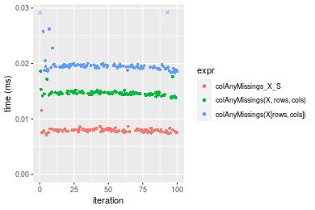
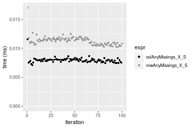
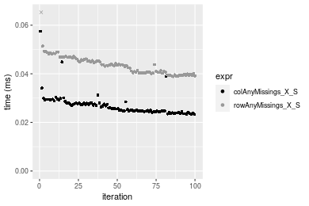
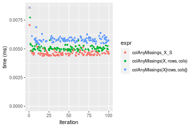
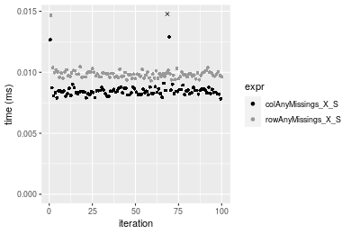
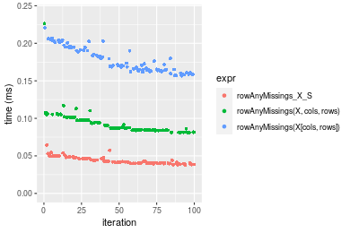
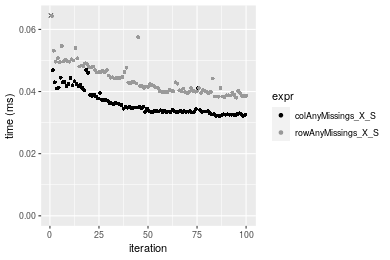

[matrixStats]: Benchmark report

---------------------------------------


# colAnyMissings() and rowAnyMissings() benchmarks  on subsetted computation

This report benchmark the performance of colAnyMissings() and rowAnyMissings() on subsetted computation.


## Data type "integer"

### Data
```r
> rmatrix <- function(nrow, ncol, mode = c("logical", "double", "integer", "index"), range = c(-100, 
+     +100), na_prob = 0) {
+     mode <- match.arg(mode)
+     n <- nrow * ncol
+     if (mode == "logical") {
+         x <- sample(c(FALSE, TRUE), size = n, replace = TRUE)
+     }     else if (mode == "index") {
+         x <- seq_len(n)
+         mode <- "integer"
+     }     else {
+         x <- runif(n, min = range[1], max = range[2])
+     }
+     storage.mode(x) <- mode
+     if (na_prob > 0) 
+         x[sample(n, size = na_prob * n)] <- NA
+     dim(x) <- c(nrow, ncol)
+     x
+ }
> rmatrices <- function(scale = 10, seed = 1, ...) {
+     set.seed(seed)
+     data <- list()
+     data[[1]] <- rmatrix(nrow = scale * 1, ncol = scale * 1, ...)
+     data[[2]] <- rmatrix(nrow = scale * 10, ncol = scale * 10, ...)
+     data[[3]] <- rmatrix(nrow = scale * 100, ncol = scale * 1, ...)
+     data[[4]] <- t(data[[3]])
+     data[[5]] <- rmatrix(nrow = scale * 10, ncol = scale * 100, ...)
+     data[[6]] <- t(data[[5]])
+     names(data) <- sapply(data, FUN = function(x) paste(dim(x), collapse = "x"))
+     data
+ }
> data <- rmatrices(mode = mode)
```

## Results

### 10x10 matrix


```r
> X <- data[["10x10"]]
> rows <- sample.int(nrow(X), size = nrow(X) * 0.7)
> cols <- sample.int(ncol(X), size = ncol(X) * 0.7)
> X_S <- X[rows, cols]
> gc()
          used  (Mb) gc trigger  (Mb) max used  (Mb)
Ncells 5179685 276.7    7916910 422.9  7916910 422.9
Vcells 9438286  72.1   33191153 253.3 53339345 407.0
> colStats <- microbenchmark(colAnyMissings_X_S = colAnyMissings(X_S), `colAnyMissings(X, rows, cols)` = colAnyMissings(X, 
+     rows = rows, cols = cols), `colAnyMissings(X[rows, cols])` = colAnyMissings(X[rows, cols]), unit = "ms")
> X <- t(X)
> X_S <- t(X_S)
> gc()
          used  (Mb) gc trigger  (Mb) max used  (Mb)
Ncells 5167805 276.0    7916910 422.9  7916910 422.9
Vcells 9398484  71.8   33191153 253.3 53339345 407.0
> rowStats <- microbenchmark(rowAnyMissings_X_S = rowAnyMissings(X_S), `rowAnyMissings(X, cols, rows)` = rowAnyMissings(X, 
+     rows = cols, cols = rows), `rowAnyMissings(X[cols, rows])` = rowAnyMissings(X[cols, rows]), unit = "ms")
```

_Table: Benchmarking of colAnyMissings_X_S(), colAnyMissings(X, rows, cols)() and colAnyMissings(X[rows, cols])() on integer+10x10 data. The top panel shows times in milliseconds and the bottom panel shows relative times._


|   |expr                          |      min|        lq|      mean|    median|        uq|      max|
|:--|:-----------------------------|--------:|---------:|---------:|---------:|---------:|--------:|
|1  |colAnyMissings_X_S            | 0.004148| 0.0043350| 0.0080678| 0.0044310| 0.0045380| 0.328684|
|2  |colAnyMissings(X, rows, cols) | 0.004449| 0.0046215| 0.0049160| 0.0047235| 0.0048575| 0.018754|
|3  |colAnyMissings(X[rows, cols]) | 0.005104| 0.0053415| 0.0055997| 0.0054735| 0.0056145| 0.012662|


|   |expr                          |      min|      lq|      mean|   median|       uq|       max|
|:--|:-----------------------------|--------:|-------:|---------:|--------:|--------:|---------:|
|1  |colAnyMissings_X_S            | 1.000000| 1.00000| 1.0000000| 1.000000| 1.000000| 1.0000000|
|2  |colAnyMissings(X, rows, cols) | 1.072565| 1.06609| 0.6093399| 1.066012| 1.070405| 0.0570578|
|3  |colAnyMissings(X[rows, cols]) | 1.230473| 1.23218| 0.6940856| 1.235274| 1.237219| 0.0385233|

_Table: Benchmarking of rowAnyMissings_X_S(), rowAnyMissings(X, cols, rows)() and rowAnyMissings(X[cols, rows])() on integer+10x10 data (transposed). The top panel shows times in milliseconds and the bottom panel shows relative times._


|   |expr                          |      min|        lq|      mean|    median|        uq|      max|
|:--|:-----------------------------|--------:|---------:|---------:|---------:|---------:|--------:|
|1  |rowAnyMissings_X_S            | 0.004460| 0.0045710| 0.0047036| 0.0046575| 0.0047450| 0.007701|
|2  |rowAnyMissings(X, cols, rows) | 0.004767| 0.0049695| 0.0083557| 0.0050895| 0.0052170| 0.327541|
|3  |rowAnyMissings(X[cols, rows]) | 0.005499| 0.0056820| 0.0058936| 0.0058300| 0.0059525| 0.008993|


|   |expr                          |      min|       lq|     mean|   median|       uq|      max|
|:--|:-----------------------------|--------:|--------:|--------:|--------:|--------:|--------:|
|1  |rowAnyMissings_X_S            | 1.000000| 1.000000| 1.000000| 1.000000| 1.000000|  1.00000|
|2  |rowAnyMissings(X, cols, rows) | 1.068834| 1.087180| 1.776434| 1.092754| 1.099473| 42.53227|
|3  |rowAnyMissings(X[cols, rows]) | 1.232960| 1.243054| 1.252996| 1.251745| 1.254478|  1.16777|

_Figure: Benchmarking of colAnyMissings_X_S(), colAnyMissings(X, rows, cols)() and colAnyMissings(X[rows, cols])() on integer+10x10 data  as well as rowAnyMissings_X_S(), rowAnyMissings(X, cols, rows)() and rowAnyMissings(X[cols, rows])() on the same data transposed.  Outliers are displayed as crosses.  Times are in milliseconds._


_Table: Benchmarking of colAnyMissings_X_S() and rowAnyMissings_X_S() on integer+10x10 data (original and transposed).  The top panel shows times in milliseconds and the bottom panel shows relative times._


|   |expr               |   min|    lq|    mean| median|    uq|     max|
|:--|:------------------|-----:|-----:|-------:|------:|-----:|-------:|
|1  |colAnyMissings_X_S | 4.148| 4.335| 8.06778| 4.4310| 4.538| 328.684|
|2  |rowAnyMissings_X_S | 4.460| 4.571| 4.70363| 4.6575| 4.745|   7.701|


|   |expr               |      min|       lq|      mean|   median|       uq|       max|
|:--|:------------------|--------:|--------:|---------:|--------:|--------:|---------:|
|1  |colAnyMissings_X_S | 1.000000| 1.000000| 1.0000000| 1.000000| 1.000000| 1.0000000|
|2  |rowAnyMissings_X_S | 1.075217| 1.054441| 0.5830142| 1.051117| 1.045615| 0.0234298|

_Figure: Benchmarking of colAnyMissings_X_S() and rowAnyMissings_X_S() on integer+10x10 data (original and transposed).  Outliers are displayed as crosses. Times are in milliseconds._


### 100x100 matrix


```r
> X <- data[["100x100"]]
> rows <- sample.int(nrow(X), size = nrow(X) * 0.7)
> cols <- sample.int(ncol(X), size = ncol(X) * 0.7)
> X_S <- X[rows, cols]
> gc()
          used  (Mb) gc trigger  (Mb) max used  (Mb)
Ncells 5166984 276.0    7916910 422.9  7916910 422.9
Vcells 9233416  70.5   33191153 253.3 53339345 407.0
> colStats <- microbenchmark(colAnyMissings_X_S = colAnyMissings(X_S), `colAnyMissings(X, rows, cols)` = colAnyMissings(X, 
+     rows = rows, cols = cols), `colAnyMissings(X[rows, cols])` = colAnyMissings(X[rows, cols]), unit = "ms")
> X <- t(X)
> X_S <- t(X_S)
> gc()
          used  (Mb) gc trigger  (Mb) max used  (Mb)
Ncells 5166978 276.0    7916910 422.9  7916910 422.9
Vcells 9238499  70.5   33191153 253.3 53339345 407.0
> rowStats <- microbenchmark(rowAnyMissings_X_S = rowAnyMissings(X_S), `rowAnyMissings(X, cols, rows)` = rowAnyMissings(X, 
+     rows = cols, cols = rows), `rowAnyMissings(X[cols, rows])` = rowAnyMissings(X[cols, rows]), unit = "ms")
```

_Table: Benchmarking of colAnyMissings_X_S(), colAnyMissings(X, rows, cols)() and colAnyMissings(X[rows, cols])() on integer+100x100 data. The top panel shows times in milliseconds and the bottom panel shows relative times._


|   |expr                          |      min|        lq|      mean|    median|        uq|      max|
|:--|:-----------------------------|--------:|---------:|---------:|---------:|---------:|--------:|
|1  |colAnyMissings_X_S            | 0.007100| 0.0077060| 0.0079425| 0.0079700| 0.0080495| 0.011545|
|2  |colAnyMissings(X, rows, cols) | 0.013799| 0.0144120| 0.0146853| 0.0145945| 0.0147980| 0.018575|
|3  |colAnyMissings(X[rows, cols]) | 0.018313| 0.0192085| 0.0199999| 0.0194345| 0.0197345| 0.048600|


|   |expr                          |      min|       lq|     mean|   median|       uq|      max|
|:--|:-----------------------------|--------:|--------:|--------:|--------:|--------:|--------:|
|1  |colAnyMissings_X_S            | 1.000000| 1.000000| 1.000000| 1.000000| 1.000000| 1.000000|
|2  |colAnyMissings(X, rows, cols) | 1.943521| 1.870231| 1.848942| 1.831179| 1.838375| 1.608922|
|3  |colAnyMissings(X[rows, cols]) | 2.579296| 2.492668| 2.518074| 2.438457| 2.451643| 4.209615|

_Table: Benchmarking of rowAnyMissings_X_S(), rowAnyMissings(X, cols, rows)() and rowAnyMissings(X[cols, rows])() on integer+100x100 data (transposed). The top panel shows times in milliseconds and the bottom panel shows relative times._


|   |expr                          |      min|       lq|      mean|    median|       uq|      max|
|:--|:-----------------------------|--------:|--------:|---------:|---------:|--------:|--------:|
|1  |rowAnyMissings_X_S            | 0.010208| 0.010779| 0.0112918| 0.0113265| 0.011609| 0.017024|
|2  |rowAnyMissings(X, cols, rows) | 0.011866| 0.012345| 0.0141362| 0.0130385| 0.013595| 0.067164|
|3  |rowAnyMissings(X[cols, rows]) | 0.021455| 0.022036| 0.0233730| 0.0231360| 0.023595| 0.034190|


|   |expr                          |      min|       lq|     mean|   median|       uq|      max|
|:--|:-----------------------------|--------:|--------:|--------:|--------:|--------:|--------:|
|1  |rowAnyMissings_X_S            | 1.000000| 1.000000| 1.000000| 1.000000| 1.000000| 1.000000|
|2  |rowAnyMissings(X, cols, rows) | 1.162422| 1.145282| 1.251892| 1.151150| 1.171074| 3.945254|
|3  |rowAnyMissings(X[cols, rows]) | 2.101783| 2.044345| 2.069908| 2.042643| 2.032475| 2.008341|

_Figure: Benchmarking of colAnyMissings_X_S(), colAnyMissings(X, rows, cols)() and colAnyMissings(X[rows, cols])() on integer+100x100 data  as well as rowAnyMissings_X_S(), rowAnyMissings(X, cols, rows)() and rowAnyMissings(X[cols, rows])() on the same data transposed.  Outliers are displayed as crosses.  Times are in milliseconds._





_Table: Benchmarking of colAnyMissings_X_S() and rowAnyMissings_X_S() on integer+100x100 data (original and transposed).  The top panel shows times in milliseconds and the bottom panel shows relative times._


|   |expr               |    min|     lq|     mean|  median|      uq|    max|
|:--|:------------------|------:|------:|--------:|-------:|-------:|------:|
|1  |colAnyMissings_X_S |  7.100|  7.706|  7.94254|  7.9700|  8.0495| 11.545|
|2  |rowAnyMissings_X_S | 10.208| 10.779| 11.29183| 11.3265| 11.6090| 17.024|


|   |expr               |      min|      lq|    mean|   median|       uq|      max|
|:--|:------------------|--------:|-------:|-------:|--------:|--------:|--------:|
|1  |colAnyMissings_X_S | 1.000000| 1.00000| 1.00000| 1.000000| 1.000000| 1.000000|
|2  |rowAnyMissings_X_S | 1.437747| 1.39878| 1.42169| 1.421142| 1.442201| 1.474578|

_Figure: Benchmarking of colAnyMissings_X_S() and rowAnyMissings_X_S() on integer+100x100 data (original and transposed).  Outliers are displayed as crosses. Times are in milliseconds._




### 1000x10 matrix


```r
> X <- data[["1000x10"]]
> rows <- sample.int(nrow(X), size = nrow(X) * 0.7)
> cols <- sample.int(ncol(X), size = ncol(X) * 0.7)
> X_S <- X[rows, cols]
> gc()
          used  (Mb) gc trigger  (Mb) max used  (Mb)
Ncells 5167726 276.0    7916910 422.9  7916910 422.9
Vcells 9237476  70.5   33191153 253.3 53339345 407.0
> colStats <- microbenchmark(colAnyMissings_X_S = colAnyMissings(X_S), `colAnyMissings(X, rows, cols)` = colAnyMissings(X, 
+     rows = rows, cols = cols), `colAnyMissings(X[rows, cols])` = colAnyMissings(X[rows, cols]), unit = "ms")
> X <- t(X)
> X_S <- t(X_S)
> gc()
          used  (Mb) gc trigger  (Mb) max used  (Mb)
Ncells 5167720 276.0    7916910 422.9  7916910 422.9
Vcells 9242559  70.6   33191153 253.3 53339345 407.0
> rowStats <- microbenchmark(rowAnyMissings_X_S = rowAnyMissings(X_S), `rowAnyMissings(X, cols, rows)` = rowAnyMissings(X, 
+     rows = cols, cols = rows), `rowAnyMissings(X[cols, rows])` = rowAnyMissings(X[cols, rows]), unit = "ms")
```

_Table: Benchmarking of colAnyMissings_X_S(), colAnyMissings(X, rows, cols)() and colAnyMissings(X[rows, cols])() on integer+1000x10 data. The top panel shows times in milliseconds and the bottom panel shows relative times._


|   |expr                          |      min|        lq|      mean|    median|        uq|      max|
|:--|:-----------------------------|--------:|---------:|---------:|---------:|---------:|--------:|
|1  |colAnyMissings_X_S            | 0.006233| 0.0065435| 0.0067138| 0.0066620| 0.0068175| 0.009651|
|2  |colAnyMissings(X, rows, cols) | 0.013542| 0.0141010| 0.0146592| 0.0142715| 0.0144655| 0.029932|
|3  |colAnyMissings(X[rows, cols]) | 0.017324| 0.0178665| 0.0186964| 0.0184085| 0.0187205| 0.046222|


|   |expr                          |     min|       lq|     mean|   median|       uq|      max|
|:--|:-----------------------------|-------:|--------:|--------:|--------:|--------:|--------:|
|1  |colAnyMissings_X_S            | 1.00000| 1.000000| 1.000000| 1.000000| 1.000000| 1.000000|
|2  |colAnyMissings(X, rows, cols) | 2.17263| 2.154963| 2.183439| 2.142225| 2.121819| 3.101440|
|3  |colAnyMissings(X[rows, cols]) | 2.77940| 2.730419| 2.784765| 2.763209| 2.745948| 4.789348|

_Table: Benchmarking of rowAnyMissings_X_S(), rowAnyMissings(X, cols, rows)() and rowAnyMissings(X[cols, rows])() on integer+1000x10 data (transposed). The top panel shows times in milliseconds and the bottom panel shows relative times._


|   |expr                          |      min|        lq|      mean|    median|       uq|      max|
|:--|:-----------------------------|--------:|---------:|---------:|---------:|--------:|--------:|
|1  |rowAnyMissings_X_S            | 0.008717| 0.0090315| 0.0092624| 0.0092160| 0.009361| 0.013308|
|2  |rowAnyMissings(X, cols, rows) | 0.013408| 0.0138710| 0.0142628| 0.0141980| 0.014468| 0.023882|
|3  |rowAnyMissings(X[cols, rows]) | 0.021336| 0.0219555| 0.0230095| 0.0225535| 0.022883| 0.053611|


|   |expr                          |      min|       lq|     mean|   median|       uq|      max|
|:--|:-----------------------------|--------:|--------:|--------:|--------:|--------:|--------:|
|1  |rowAnyMissings_X_S            | 1.000000| 1.000000| 1.000000| 1.000000| 1.000000| 1.000000|
|2  |rowAnyMissings(X, cols, rows) | 1.538144| 1.535847| 1.539863| 1.540582| 1.545561| 1.794560|
|3  |rowAnyMissings(X[cols, rows]) | 2.447631| 2.430992| 2.484182| 2.447211| 2.444504| 4.028479|

_Figure: Benchmarking of colAnyMissings_X_S(), colAnyMissings(X, rows, cols)() and colAnyMissings(X[rows, cols])() on integer+1000x10 data  as well as rowAnyMissings_X_S(), rowAnyMissings(X, cols, rows)() and rowAnyMissings(X[cols, rows])() on the same data transposed.  Outliers are displayed as crosses.  Times are in milliseconds._


_Table: Benchmarking of colAnyMissings_X_S() and rowAnyMissings_X_S() on integer+1000x10 data (original and transposed).  The top panel shows times in milliseconds and the bottom panel shows relative times._


|   |expr               |   min|     lq|    mean| median|     uq|    max|
|:--|:------------------|-----:|------:|-------:|------:|------:|------:|
|1  |colAnyMissings_X_S | 6.233| 6.5435| 6.71382|  6.662| 6.8175|  9.651|
|2  |rowAnyMissings_X_S | 8.717| 9.0315| 9.26241|  9.216| 9.3610| 13.308|


|   |expr               |      min|       lq|     mean|   median|       uq|      max|
|:--|:------------------|--------:|--------:|--------:|--------:|--------:|--------:|
|1  |colAnyMissings_X_S | 1.000000| 1.000000| 1.000000| 1.000000| 1.000000| 1.000000|
|2  |rowAnyMissings_X_S | 1.398524| 1.380225| 1.379604| 1.383368| 1.373084| 1.378925|

_Figure: Benchmarking of colAnyMissings_X_S() and rowAnyMissings_X_S() on integer+1000x10 data (original and transposed).  Outliers are displayed as crosses. Times are in milliseconds._


### 10x1000 matrix


```r
> X <- data[["10x1000"]]
> rows <- sample.int(nrow(X), size = nrow(X) * 0.7)
> cols <- sample.int(ncol(X), size = ncol(X) * 0.7)
> X_S <- X[rows, cols]
> gc()
          used  (Mb) gc trigger  (Mb) max used  (Mb)
Ncells 5167931 276.0    7916910 422.9  7916910 422.9
Vcells 9238388  70.5   33191153 253.3 53339345 407.0
> colStats <- microbenchmark(colAnyMissings_X_S = colAnyMissings(X_S), `colAnyMissings(X, rows, cols)` = colAnyMissings(X, 
+     rows = rows, cols = cols), `colAnyMissings(X[rows, cols])` = colAnyMissings(X[rows, cols]), unit = "ms")
> X <- t(X)
> X_S <- t(X_S)
> gc()
          used  (Mb) gc trigger  (Mb) max used  (Mb)
Ncells 5167925 276.0    7916910 422.9  7916910 422.9
Vcells 9243471  70.6   33191153 253.3 53339345 407.0
> rowStats <- microbenchmark(rowAnyMissings_X_S = rowAnyMissings(X_S), `rowAnyMissings(X, cols, rows)` = rowAnyMissings(X, 
+     rows = cols, cols = rows), `rowAnyMissings(X[cols, rows])` = rowAnyMissings(X[cols, rows]), unit = "ms")
```

_Table: Benchmarking of colAnyMissings_X_S(), colAnyMissings(X, rows, cols)() and colAnyMissings(X[rows, cols])() on integer+10x1000 data. The top panel shows times in milliseconds and the bottom panel shows relative times._


|   |expr                          |      min|        lq|      mean|    median|        uq|      max|
|:--|:-----------------------------|--------:|---------:|---------:|---------:|---------:|--------:|
|1  |colAnyMissings_X_S            | 0.009493| 0.0106625| 0.0131547| 0.0112745| 0.0149760| 0.032852|
|2  |colAnyMissings(X, rows, cols) | 0.016530| 0.0176355| 0.0213137| 0.0180620| 0.0275785| 0.039499|
|3  |colAnyMissings(X[rows, cols]) | 0.022830| 0.0242240| 0.0283903| 0.0249665| 0.0278665| 0.049946|


|   |expr                          |      min|       lq|     mean|   median|       uq|      max|
|:--|:-----------------------------|--------:|--------:|--------:|--------:|--------:|--------:|
|1  |colAnyMissings_X_S            | 1.000000| 1.000000| 1.000000| 1.000000| 1.000000| 1.000000|
|2  |colAnyMissings(X, rows, cols) | 1.741283| 1.653974| 1.620238| 1.602022| 1.841513| 1.202332|
|3  |colAnyMissings(X[rows, cols]) | 2.404930| 2.271888| 2.158188| 2.214422| 1.860744| 1.520334|

_Table: Benchmarking of rowAnyMissings_X_S(), rowAnyMissings(X, cols, rows)() and rowAnyMissings(X[cols, rows])() on integer+10x1000 data (transposed). The top panel shows times in milliseconds and the bottom panel shows relative times._


|   |expr                          |      min|        lq|      mean|    median|        uq|      max|
|:--|:-----------------------------|--------:|---------:|---------:|---------:|---------:|--------:|
|1  |rowAnyMissings_X_S            | 0.009684| 0.0101370| 0.0106166| 0.0106480| 0.0108780| 0.015548|
|2  |rowAnyMissings(X, cols, rows) | 0.013278| 0.0138390| 0.0146774| 0.0144085| 0.0148805| 0.041930|
|3  |rowAnyMissings(X[cols, rows]) | 0.020517| 0.0211985| 0.0225933| 0.0220840| 0.0231025| 0.037550|


|   |expr                          |      min|       lq|     mean|   median|       uq|      max|
|:--|:-----------------------------|--------:|--------:|--------:|--------:|--------:|--------:|
|1  |rowAnyMissings_X_S            | 1.000000| 1.000000| 1.000000| 1.000000| 1.000000| 1.000000|
|2  |rowAnyMissings(X, cols, rows) | 1.371128| 1.365197| 1.382499| 1.353165| 1.367944| 2.696810|
|3  |rowAnyMissings(X[cols, rows]) | 2.118649| 2.091201| 2.128116| 2.074005| 2.123782| 2.415102|

_Figure: Benchmarking of colAnyMissings_X_S(), colAnyMissings(X, rows, cols)() and colAnyMissings(X[rows, cols])() on integer+10x1000 data  as well as rowAnyMissings_X_S(), rowAnyMissings(X, cols, rows)() and rowAnyMissings(X[cols, rows])() on the same data transposed.  Outliers are displayed as crosses.  Times are in milliseconds._


_Table: Benchmarking of colAnyMissings_X_S() and rowAnyMissings_X_S() on integer+10x1000 data (original and transposed).  The top panel shows times in milliseconds and the bottom panel shows relative times._


|   |expr               |   min|      lq|     mean|  median|     uq|    max|
|:--|:------------------|-----:|-------:|--------:|-------:|------:|------:|
|2  |rowAnyMissings_X_S | 9.684| 10.1370| 10.61658| 10.6480| 10.878| 15.548|
|1  |colAnyMissings_X_S | 9.493| 10.6625| 13.15470| 11.2745| 14.976| 32.852|


|   |expr               |       min|      lq|     mean|   median|       uq|      max|
|:--|:------------------|---------:|-------:|--------:|--------:|--------:|--------:|
|2  |rowAnyMissings_X_S | 1.0000000| 1.00000| 1.000000| 1.000000| 1.000000| 1.000000|
|1  |colAnyMissings_X_S | 0.9802767| 1.05184| 1.239071| 1.058837| 1.376724| 2.112941|

_Figure: Benchmarking of colAnyMissings_X_S() and rowAnyMissings_X_S() on integer+10x1000 data (original and transposed).  Outliers are displayed as crosses. Times are in milliseconds._


### 100x1000 matrix


```r
> X <- data[["100x1000"]]
> rows <- sample.int(nrow(X), size = nrow(X) * 0.7)
> cols <- sample.int(ncol(X), size = ncol(X) * 0.7)
> X_S <- X[rows, cols]
> gc()
          used  (Mb) gc trigger  (Mb) max used  (Mb)
Ncells 5168142 276.1    7916910 422.9  7916910 422.9
Vcells 9261079  70.7   33191153 253.3 53339345 407.0
> colStats <- microbenchmark(colAnyMissings_X_S = colAnyMissings(X_S), `colAnyMissings(X, rows, cols)` = colAnyMissings(X, 
+     rows = rows, cols = cols), `colAnyMissings(X[rows, cols])` = colAnyMissings(X[rows, cols]), unit = "ms")
> X <- t(X)
> X_S <- t(X_S)
> gc()
          used  (Mb) gc trigger  (Mb) max used  (Mb)
Ncells 5168136 276.1    7916910 422.9  7916910 422.9
Vcells 9311162  71.1   33191153 253.3 53339345 407.0
> rowStats <- microbenchmark(rowAnyMissings_X_S = rowAnyMissings(X_S), `rowAnyMissings(X, cols, rows)` = rowAnyMissings(X, 
+     rows = cols, cols = rows), `rowAnyMissings(X[cols, rows])` = rowAnyMissings(X[cols, rows]), unit = "ms")
```

_Table: Benchmarking of colAnyMissings_X_S(), colAnyMissings(X, rows, cols)() and colAnyMissings(X[rows, cols])() on integer+100x1000 data. The top panel shows times in milliseconds and the bottom panel shows relative times._


|   |expr                          |      min|        lq|      mean|    median|        uq|      max|
|:--|:-----------------------------|--------:|---------:|---------:|---------:|---------:|--------:|
|1  |colAnyMissings_X_S            | 0.023285| 0.0245495| 0.0268781| 0.0256835| 0.0279530| 0.057528|
|2  |colAnyMissings(X, rows, cols) | 0.071859| 0.0744675| 0.0797039| 0.0774855| 0.0838680| 0.151345|
|3  |colAnyMissings(X[rows, cols]) | 0.105668| 0.1101715| 0.1181411| 0.1176285| 0.1263425| 0.138540|


|   |expr                          |      min|       lq|     mean|   median|       uq|      max|
|:--|:-----------------------------|--------:|--------:|--------:|--------:|--------:|--------:|
|1  |colAnyMissings_X_S            | 1.000000| 1.000000| 1.000000| 1.000000| 1.000000| 1.000000|
|2  |colAnyMissings(X, rows, cols) | 3.086064| 3.033361| 2.965382| 3.016937| 3.000322| 2.630806|
|3  |colAnyMissings(X[rows, cols]) | 4.538029| 4.487729| 4.395438| 4.579925| 4.519819| 2.408219|

_Table: Benchmarking of rowAnyMissings_X_S(), rowAnyMissings(X, cols, rows)() and rowAnyMissings(X[cols, rows])() on integer+100x1000 data (transposed). The top panel shows times in milliseconds and the bottom panel shows relative times._


|   |expr                          |      min|        lq|      mean|   median|        uq|      max|
|:--|:-----------------------------|--------:|---------:|---------:|--------:|---------:|--------:|
|1  |rowAnyMissings_X_S            | 0.038863| 0.0404100| 0.0436557| 0.043490| 0.0460685| 0.073559|
|2  |rowAnyMissings(X, cols, rows) | 0.060459| 0.0623870| 0.0667166| 0.063631| 0.0707165| 0.122293|
|3  |rowAnyMissings(X[cols, rows]) | 0.117589| 0.1219315| 0.1313749| 0.126885| 0.1405105| 0.198744|


|   |expr                          |      min|       lq|     mean|   median|       uq|      max|
|:--|:-----------------------------|--------:|--------:|--------:|--------:|--------:|--------:|
|1  |rowAnyMissings_X_S            | 1.000000| 1.000000| 1.000000| 1.000000| 1.000000| 1.000000|
|2  |rowAnyMissings(X, cols, rows) | 1.555696| 1.543851| 1.528246| 1.463118| 1.535029| 1.662516|
|3  |rowAnyMissings(X[cols, rows]) | 3.025731| 3.017360| 3.009344| 2.917567| 3.050034| 2.701831|

_Figure: Benchmarking of colAnyMissings_X_S(), colAnyMissings(X, rows, cols)() and colAnyMissings(X[rows, cols])() on integer+100x1000 data  as well as rowAnyMissings_X_S(), rowAnyMissings(X, cols, rows)() and rowAnyMissings(X[cols, rows])() on the same data transposed.  Outliers are displayed as crosses.  Times are in milliseconds._


_Table: Benchmarking of colAnyMissings_X_S() and rowAnyMissings_X_S() on integer+100x1000 data (original and transposed).  The top panel shows times in milliseconds and the bottom panel shows relative times._


|   |expr               |    min|      lq|     mean|  median|      uq|    max|
|:--|:------------------|------:|-------:|--------:|-------:|-------:|------:|
|1  |colAnyMissings_X_S | 23.285| 24.5495| 26.87811| 25.6835| 27.9530| 57.528|
|2  |rowAnyMissings_X_S | 38.863| 40.4100| 43.65567| 43.4900| 46.0685| 73.559|


|   |expr               |      min|       lq|     mean|   median|      uq|      max|
|:--|:------------------|--------:|--------:|--------:|--------:|-------:|--------:|
|1  |colAnyMissings_X_S | 1.000000| 1.000000| 1.000000| 1.000000| 1.00000| 1.000000|
|2  |rowAnyMissings_X_S | 1.669014| 1.646062| 1.624209| 1.693305| 1.64807| 1.278664|

_Figure: Benchmarking of colAnyMissings_X_S() and rowAnyMissings_X_S() on integer+100x1000 data (original and transposed).  Outliers are displayed as crosses. Times are in milliseconds._




### 1000x100 matrix


```r
> X <- data[["1000x100"]]
> rows <- sample.int(nrow(X), size = nrow(X) * 0.7)
> cols <- sample.int(ncol(X), size = ncol(X) * 0.7)
> X_S <- X[rows, cols]
> gc()
          used  (Mb) gc trigger  (Mb) max used  (Mb)
Ncells 5168352 276.1    7916910 422.9  7916910 422.9
Vcells 9261885  70.7   33191153 253.3 53339345 407.0
> colStats <- microbenchmark(colAnyMissings_X_S = colAnyMissings(X_S), `colAnyMissings(X, rows, cols)` = colAnyMissings(X, 
+     rows = rows, cols = cols), `colAnyMissings(X[rows, cols])` = colAnyMissings(X[rows, cols]), unit = "ms")
> X <- t(X)
> X_S <- t(X_S)
> gc()
          used  (Mb) gc trigger  (Mb) max used  (Mb)
Ncells 5168346 276.1    7916910 422.9  7916910 422.9
Vcells 9311968  71.1   33191153 253.3 53339345 407.0
> rowStats <- microbenchmark(rowAnyMissings_X_S = rowAnyMissings(X_S), `rowAnyMissings(X, cols, rows)` = rowAnyMissings(X, 
+     rows = cols, cols = rows), `rowAnyMissings(X[cols, rows])` = rowAnyMissings(X[cols, rows]), unit = "ms")
```

_Table: Benchmarking of colAnyMissings_X_S(), colAnyMissings(X, rows, cols)() and colAnyMissings(X[rows, cols])() on integer+1000x100 data. The top panel shows times in milliseconds and the bottom panel shows relative times._


|   |expr                          |      min|        lq|      mean|    median|        uq|      max|
|:--|:-----------------------------|--------:|---------:|---------:|---------:|---------:|--------:|
|1  |colAnyMissings_X_S            | 0.022629| 0.0238365| 0.0264090| 0.0253955| 0.0279665| 0.058075|
|2  |colAnyMissings(X, rows, cols) | 0.073222| 0.0763880| 0.0835409| 0.0845805| 0.0888955| 0.104431|
|3  |colAnyMissings(X[rows, cols]) | 0.104353| 0.1086115| 0.1188780| 0.1206140| 0.1263750| 0.187801|


|   |expr                          |      min|       lq|     mean|   median|       uq|      max|
|:--|:-----------------------------|--------:|--------:|--------:|--------:|--------:|--------:|
|1  |colAnyMissings_X_S            | 1.000000| 1.000000| 1.000000| 1.000000| 1.000000| 1.000000|
|2  |colAnyMissings(X, rows, cols) | 3.235759| 3.204665| 3.163352| 3.330531| 3.178642| 1.798209|
|3  |colAnyMissings(X[rows, cols]) | 4.611472| 4.556521| 4.501424| 4.749424| 4.518799| 3.233767|

_Table: Benchmarking of rowAnyMissings_X_S(), rowAnyMissings(X, cols, rows)() and rowAnyMissings(X[cols, rows])() on integer+1000x100 data (transposed). The top panel shows times in milliseconds and the bottom panel shows relative times._


|   |expr                          |      min|        lq|      mean|    median|       uq|      max|
|:--|:-----------------------------|--------:|---------:|---------:|---------:|--------:|--------:|
|1  |rowAnyMissings_X_S            | 0.048362| 0.0503265| 0.0550694| 0.0540670| 0.058532| 0.068993|
|2  |rowAnyMissings(X, cols, rows) | 0.063893| 0.0665080| 0.0732756| 0.0712745| 0.076519| 0.170742|
|3  |rowAnyMissings(X[cols, rows]) | 0.131056| 0.1360320| 0.1489086| 0.1457050| 0.162942| 0.183731|


|   |expr                          |      min|      lq|     mean|   median|       uq|      max|
|:--|:-----------------------------|--------:|-------:|--------:|--------:|--------:|--------:|
|1  |rowAnyMissings_X_S            | 1.000000| 1.00000| 1.000000| 1.000000| 1.000000| 1.000000|
|2  |rowAnyMissings(X, cols, rows) | 1.321141| 1.32153| 1.330604| 1.318262| 1.307302| 2.474773|
|3  |rowAnyMissings(X[cols, rows]) | 2.709896| 2.70299| 2.704016| 2.694897| 2.783811| 2.663038|

_Figure: Benchmarking of colAnyMissings_X_S(), colAnyMissings(X, rows, cols)() and colAnyMissings(X[rows, cols])() on integer+1000x100 data  as well as rowAnyMissings_X_S(), rowAnyMissings(X, cols, rows)() and rowAnyMissings(X[cols, rows])() on the same data transposed.  Outliers are displayed as crosses.  Times are in milliseconds._


_Table: Benchmarking of colAnyMissings_X_S() and rowAnyMissings_X_S() on integer+1000x100 data (original and transposed).  The top panel shows times in milliseconds and the bottom panel shows relative times._


|   |expr               |    min|      lq|     mean|  median|      uq|    max|
|:--|:------------------|------:|-------:|--------:|-------:|-------:|------:|
|1  |colAnyMissings_X_S | 22.629| 23.8365| 26.40899| 25.3955| 27.9665| 58.075|
|2  |rowAnyMissings_X_S | 48.362| 50.3265| 55.06940| 54.0670| 58.5320| 68.993|


|   |expr               |      min|       lq|     mean|   median|       uq|      max|
|:--|:------------------|--------:|--------:|--------:|--------:|--------:|--------:|
|1  |colAnyMissings_X_S | 1.000000| 1.000000| 1.000000| 1.000000| 1.000000| 1.000000|
|2  |rowAnyMissings_X_S | 2.137169| 2.111321| 2.085252| 2.128999| 2.092933| 1.187998|

_Figure: Benchmarking of colAnyMissings_X_S() and rowAnyMissings_X_S() on integer+1000x100 data (original and transposed).  Outliers are displayed as crosses. Times are in milliseconds._


## Data type "double"

### Data
```r
> rmatrix <- function(nrow, ncol, mode = c("logical", "double", "integer", "index"), range = c(-100, 
+     +100), na_prob = 0) {
+     mode <- match.arg(mode)
+     n <- nrow * ncol
+     if (mode == "logical") {
+         x <- sample(c(FALSE, TRUE), size = n, replace = TRUE)
+     }     else if (mode == "index") {
+         x <- seq_len(n)
+         mode <- "integer"
+     }     else {
+         x <- runif(n, min = range[1], max = range[2])
+     }
+     storage.mode(x) <- mode
+     if (na_prob > 0) 
+         x[sample(n, size = na_prob * n)] <- NA
+     dim(x) <- c(nrow, ncol)
+     x
+ }
> rmatrices <- function(scale = 10, seed = 1, ...) {
+     set.seed(seed)
+     data <- list()
+     data[[1]] <- rmatrix(nrow = scale * 1, ncol = scale * 1, ...)
+     data[[2]] <- rmatrix(nrow = scale * 10, ncol = scale * 10, ...)
+     data[[3]] <- rmatrix(nrow = scale * 100, ncol = scale * 1, ...)
+     data[[4]] <- t(data[[3]])
+     data[[5]] <- rmatrix(nrow = scale * 10, ncol = scale * 100, ...)
+     data[[6]] <- t(data[[5]])
+     names(data) <- sapply(data, FUN = function(x) paste(dim(x), collapse = "x"))
+     data
+ }
> data <- rmatrices(mode = mode)
```

## Results

### 10x10 matrix


```r
> X <- data[["10x10"]]
> rows <- sample.int(nrow(X), size = nrow(X) * 0.7)
> cols <- sample.int(ncol(X), size = ncol(X) * 0.7)
> X_S <- X[rows, cols]
> gc()
          used  (Mb) gc trigger  (Mb) max used  (Mb)
Ncells 5168570 276.1    7916910 422.9  7916910 422.9
Vcells 9353023  71.4   33191153 253.3 53339345 407.0
> colStats <- microbenchmark(colAnyMissings_X_S = colAnyMissings(X_S), `colAnyMissings(X, rows, cols)` = colAnyMissings(X, 
+     rows = rows, cols = cols), `colAnyMissings(X[rows, cols])` = colAnyMissings(X[rows, cols]), unit = "ms")
> X <- t(X)
> X_S <- t(X_S)
> gc()
          used  (Mb) gc trigger  (Mb) max used  (Mb)
Ncells 5168555 276.1    7916910 422.9  7916910 422.9
Vcells 9353191  71.4   33191153 253.3 53339345 407.0
> rowStats <- microbenchmark(rowAnyMissings_X_S = rowAnyMissings(X_S), `rowAnyMissings(X, cols, rows)` = rowAnyMissings(X, 
+     rows = cols, cols = rows), `rowAnyMissings(X[cols, rows])` = rowAnyMissings(X[cols, rows]), unit = "ms")
```

_Table: Benchmarking of colAnyMissings_X_S(), colAnyMissings(X, rows, cols)() and colAnyMissings(X[rows, cols])() on double+10x10 data. The top panel shows times in milliseconds and the bottom panel shows relative times._


|   |expr                          |      min|        lq|      mean|    median|        uq|      max|
|:--|:-----------------------------|--------:|---------:|---------:|---------:|---------:|--------:|
|1  |colAnyMissings_X_S            | 0.004388| 0.0044615| 0.0048326| 0.0045765| 0.0046995| 0.025490|
|2  |colAnyMissings(X, rows, cols) | 0.004705| 0.0049285| 0.0050622| 0.0050105| 0.0051240| 0.007731|
|3  |colAnyMissings(X[rows, cols]) | 0.005384| 0.0056545| 0.0058520| 0.0057630| 0.0059200| 0.011243|


|   |expr                          |      min|       lq|     mean|   median|       uq|       max|
|:--|:-----------------------------|--------:|--------:|--------:|--------:|--------:|---------:|
|1  |colAnyMissings_X_S            | 1.000000| 1.000000| 1.000000| 1.000000| 1.000000| 1.0000000|
|2  |colAnyMissings(X, rows, cols) | 1.072242| 1.104673| 1.047511| 1.094832| 1.090329| 0.3032954|
|3  |colAnyMissings(X[rows, cols]) | 1.226983| 1.267399| 1.210950| 1.259259| 1.259708| 0.4410749|

_Table: Benchmarking of rowAnyMissings_X_S(), rowAnyMissings(X, cols, rows)() and rowAnyMissings(X[cols, rows])() on double+10x10 data (transposed). The top panel shows times in milliseconds and the bottom panel shows relative times._


|   |expr                          |      min|        lq|      mean|    median|        uq|      max|
|:--|:-----------------------------|--------:|---------:|---------:|---------:|---------:|--------:|
|1  |rowAnyMissings_X_S            | 0.004439| 0.0045850| 0.0047184| 0.0046745| 0.0048005| 0.007243|
|2  |rowAnyMissings(X, cols, rows) | 0.004812| 0.0049895| 0.0058534| 0.0050725| 0.0052055| 0.044818|
|3  |rowAnyMissings(X[cols, rows]) | 0.005497| 0.0057685| 0.0059573| 0.0058535| 0.0060335| 0.011667|


|   |expr                          |      min|       lq|     mean|   median|       uq|      max|
|:--|:-----------------------------|--------:|--------:|--------:|--------:|--------:|--------:|
|1  |rowAnyMissings_X_S            | 1.000000| 1.000000| 1.000000| 1.000000| 1.000000| 1.000000|
|2  |rowAnyMissings(X, cols, rows) | 1.084028| 1.088223| 1.240552| 1.085143| 1.084366| 6.187767|
|3  |rowAnyMissings(X[cols, rows]) | 1.238342| 1.258124| 1.262572| 1.252220| 1.256848| 1.610797|

_Figure: Benchmarking of colAnyMissings_X_S(), colAnyMissings(X, rows, cols)() and colAnyMissings(X[rows, cols])() on double+10x10 data  as well as rowAnyMissings_X_S(), rowAnyMissings(X, cols, rows)() and rowAnyMissings(X[cols, rows])() on the same data transposed.  Outliers are displayed as crosses.  Times are in milliseconds._





_Table: Benchmarking of colAnyMissings_X_S() and rowAnyMissings_X_S() on double+10x10 data (original and transposed).  The top panel shows times in milliseconds and the bottom panel shows relative times._


|   |expr               |   min|     lq|    mean| median|     uq|    max|
|:--|:------------------|-----:|------:|-------:|------:|------:|------:|
|1  |colAnyMissings_X_S | 4.388| 4.4615| 4.83257| 4.5765| 4.6995| 25.490|
|2  |rowAnyMissings_X_S | 4.439| 4.5850| 4.71836| 4.6745| 4.8005|  7.243|


|   |expr               |      min|       lq|      mean|   median|       uq|       max|
|:--|:------------------|--------:|--------:|---------:|--------:|--------:|---------:|
|1  |colAnyMissings_X_S | 1.000000| 1.000000| 1.0000000| 1.000000| 1.000000| 1.0000000|
|2  |rowAnyMissings_X_S | 1.011623| 1.027681| 0.9763666| 1.021414| 1.021492| 0.2841506|

_Figure: Benchmarking of colAnyMissings_X_S() and rowAnyMissings_X_S() on double+10x10 data (original and transposed).  Outliers are displayed as crosses. Times are in milliseconds._


### 100x100 matrix


```r
> X <- data[["100x100"]]
> rows <- sample.int(nrow(X), size = nrow(X) * 0.7)
> cols <- sample.int(ncol(X), size = ncol(X) * 0.7)
> X_S <- X[rows, cols]
> gc()
          used  (Mb) gc trigger  (Mb) max used  (Mb)
Ncells 5168769 276.1    7916910 422.9  7916910 422.9
Vcells 9359005  71.5   33191153 253.3 53339345 407.0
> colStats <- microbenchmark(colAnyMissings_X_S = colAnyMissings(X_S), `colAnyMissings(X, rows, cols)` = colAnyMissings(X, 
+     rows = rows, cols = cols), `colAnyMissings(X[rows, cols])` = colAnyMissings(X[rows, cols]), unit = "ms")
> X <- t(X)
> X_S <- t(X_S)
> gc()
          used  (Mb) gc trigger  (Mb) max used  (Mb)
Ncells 5168763 276.1    7916910 422.9  7916910 422.9
Vcells 9369088  71.5   33191153 253.3 53339345 407.0
> rowStats <- microbenchmark(rowAnyMissings_X_S = rowAnyMissings(X_S), `rowAnyMissings(X, cols, rows)` = rowAnyMissings(X, 
+     rows = cols, cols = rows), `rowAnyMissings(X[cols, rows])` = rowAnyMissings(X[cols, rows]), unit = "ms")
```

_Table: Benchmarking of colAnyMissings_X_S(), colAnyMissings(X, rows, cols)() and colAnyMissings(X[rows, cols])() on double+100x100 data. The top panel shows times in milliseconds and the bottom panel shows relative times._


|   |expr                          |      min|        lq|      mean|    median|        uq|      max|
|:--|:-----------------------------|--------:|---------:|---------:|---------:|---------:|--------:|
|1  |colAnyMissings_X_S            | 0.008346| 0.0091665| 0.0094162| 0.0093740| 0.0095235| 0.014397|
|2  |colAnyMissings(X, rows, cols) | 0.016231| 0.0167725| 0.0170888| 0.0169465| 0.0171470| 0.021151|
|3  |colAnyMissings(X[rows, cols]) | 0.025031| 0.0256580| 0.0262463| 0.0258550| 0.0260510| 0.058321|


|   |expr                          |      min|       lq|     mean|   median|       uq|      max|
|:--|:-----------------------------|--------:|--------:|--------:|--------:|--------:|--------:|
|1  |colAnyMissings_X_S            | 1.000000| 1.000000| 1.000000| 1.000000| 1.000000| 1.000000|
|2  |colAnyMissings(X, rows, cols) | 1.944764| 1.829760| 1.814840| 1.807819| 1.800493| 1.469126|
|3  |colAnyMissings(X[rows, cols]) | 2.999161| 2.799105| 2.787364| 2.758161| 2.735444| 4.050913|

_Table: Benchmarking of rowAnyMissings_X_S(), rowAnyMissings(X, cols, rows)() and rowAnyMissings(X[cols, rows])() on double+100x100 data (transposed). The top panel shows times in milliseconds and the bottom panel shows relative times._


|   |expr                          |      min|        lq|      mean|    median|        uq|      max|
|:--|:-----------------------------|--------:|---------:|---------:|---------:|---------:|--------:|
|1  |rowAnyMissings_X_S            | 0.009052| 0.0096590| 0.0101291| 0.0099565| 0.0101575| 0.024910|
|2  |rowAnyMissings(X, cols, rows) | 0.014295| 0.0149705| 0.0156935| 0.0153040| 0.0156770| 0.047241|
|3  |rowAnyMissings(X[cols, rows]) | 0.025012| 0.0263020| 0.0264998| 0.0264845| 0.0266350| 0.033584|


|   |expr                          |      min|       lq|     mean|   median|       uq|      max|
|:--|:-----------------------------|--------:|--------:|--------:|--------:|--------:|--------:|
|1  |rowAnyMissings_X_S            | 1.000000| 1.000000| 1.000000| 1.000000| 1.000000| 1.000000|
|2  |rowAnyMissings(X, cols, rows) | 1.579209| 1.549902| 1.549346| 1.537086| 1.543392| 1.896467|
|3  |rowAnyMissings(X[cols, rows]) | 2.763146| 2.723056| 2.616191| 2.660021| 2.622200| 1.348214|

_Figure: Benchmarking of colAnyMissings_X_S(), colAnyMissings(X, rows, cols)() and colAnyMissings(X[rows, cols])() on double+100x100 data  as well as rowAnyMissings_X_S(), rowAnyMissings(X, cols, rows)() and rowAnyMissings(X[cols, rows])() on the same data transposed.  Outliers are displayed as crosses.  Times are in milliseconds._


_Table: Benchmarking of colAnyMissings_X_S() and rowAnyMissings_X_S() on double+100x100 data (original and transposed).  The top panel shows times in milliseconds and the bottom panel shows relative times._


|   |expr               |   min|     lq|     mean| median|      uq|    max|
|:--|:------------------|-----:|------:|--------:|------:|-------:|------:|
|1  |colAnyMissings_X_S | 8.346| 9.1665|  9.41617| 9.3740|  9.5235| 14.397|
|2  |rowAnyMissings_X_S | 9.052| 9.6590| 10.12914| 9.9565| 10.1575| 24.910|


|   |expr               |      min|       lq|     mean|  median|       uq|      max|
|:--|:------------------|--------:|--------:|--------:|-------:|--------:|--------:|
|1  |colAnyMissings_X_S | 1.000000| 1.000000| 1.000000| 1.00000| 1.000000| 1.000000|
|2  |rowAnyMissings_X_S | 1.084591| 1.053728| 1.075718| 1.06214| 1.066572| 1.730222|

_Figure: Benchmarking of colAnyMissings_X_S() and rowAnyMissings_X_S() on double+100x100 data (original and transposed).  Outliers are displayed as crosses. Times are in milliseconds._


### 1000x10 matrix


```r
> X <- data[["1000x10"]]
> rows <- sample.int(nrow(X), size = nrow(X) * 0.7)
> cols <- sample.int(ncol(X), size = ncol(X) * 0.7)
> X_S <- X[rows, cols]
> gc()
          used  (Mb) gc trigger  (Mb) max used  (Mb)
Ncells 5168968 276.1    7916910 422.9  7916910 422.9
Vcells 9360456  71.5   33191153 253.3 53339345 407.0
> colStats <- microbenchmark(colAnyMissings_X_S = colAnyMissings(X_S), `colAnyMissings(X, rows, cols)` = colAnyMissings(X, 
+     rows = rows, cols = cols), `colAnyMissings(X[rows, cols])` = colAnyMissings(X[rows, cols]), unit = "ms")
> X <- t(X)
> X_S <- t(X_S)
> gc()
          used  (Mb) gc trigger  (Mb) max used  (Mb)
Ncells 5168962 276.1    7916910 422.9  7916910 422.9
Vcells 9370539  71.5   33191153 253.3 53339345 407.0
> rowStats <- microbenchmark(rowAnyMissings_X_S = rowAnyMissings(X_S), `rowAnyMissings(X, cols, rows)` = rowAnyMissings(X, 
+     rows = cols, cols = rows), `rowAnyMissings(X[cols, rows])` = rowAnyMissings(X[cols, rows]), unit = "ms")
```

_Table: Benchmarking of colAnyMissings_X_S(), colAnyMissings(X, rows, cols)() and colAnyMissings(X[rows, cols])() on double+1000x10 data. The top panel shows times in milliseconds and the bottom panel shows relative times._


|   |expr                          |      min|        lq|      mean|    median|        uq|      max|
|:--|:-----------------------------|--------:|---------:|---------:|---------:|---------:|--------:|
|1  |colAnyMissings_X_S            | 0.007822| 0.0082445| 0.0086023| 0.0084340| 0.0086005| 0.018190|
|2  |colAnyMissings(X, rows, cols) | 0.016428| 0.0169920| 0.0172895| 0.0172190| 0.0174325| 0.022876|
|3  |colAnyMissings(X[rows, cols]) | 0.024324| 0.0255395| 0.0264378| 0.0256535| 0.0258835| 0.089559|


|   |expr                          |      min|       lq|     mean|   median|       uq|      max|
|:--|:-----------------------------|--------:|--------:|--------:|--------:|--------:|--------:|
|1  |colAnyMissings_X_S            | 1.000000| 1.000000| 1.000000| 1.000000| 1.000000| 1.000000|
|2  |colAnyMissings(X, rows, cols) | 2.100230| 2.061010| 2.009872| 2.041617| 2.026917| 1.257614|
|3  |colAnyMissings(X[rows, cols]) | 3.109691| 3.097762| 3.073333| 3.041676| 3.009534| 4.923529|

_Table: Benchmarking of rowAnyMissings_X_S(), rowAnyMissings(X, cols, rows)() and rowAnyMissings(X[cols, rows])() on double+1000x10 data (transposed). The top panel shows times in milliseconds and the bottom panel shows relative times._


|   |expr                          |      min|       lq|      mean|    median|        uq|      max|
|:--|:-----------------------------|--------:|--------:|---------:|---------:|---------:|--------:|
|1  |rowAnyMissings_X_S            | 0.009308| 0.009641| 0.0098729| 0.0098490| 0.0099945| 0.014667|
|2  |rowAnyMissings(X, cols, rows) | 0.016732| 0.017037| 0.0173575| 0.0172730| 0.0174600| 0.023676|
|3  |rowAnyMissings(X[cols, rows]) | 0.029381| 0.029845| 0.0306261| 0.0299695| 0.0301070| 0.073280|


|   |expr                          |      min|       lq|     mean|   median|       uq|      max|
|:--|:-----------------------------|--------:|--------:|--------:|--------:|--------:|--------:|
|1  |rowAnyMissings_X_S            | 1.000000| 1.000000| 1.000000| 1.000000| 1.000000| 1.000000|
|2  |rowAnyMissings(X, cols, rows) | 1.797594| 1.767140| 1.758092| 1.753782| 1.746961| 1.614236|
|3  |rowAnyMissings(X[cols, rows]) | 3.156532| 3.095633| 3.102039| 3.042898| 3.012357| 4.996250|

_Figure: Benchmarking of colAnyMissings_X_S(), colAnyMissings(X, rows, cols)() and colAnyMissings(X[rows, cols])() on double+1000x10 data  as well as rowAnyMissings_X_S(), rowAnyMissings(X, cols, rows)() and rowAnyMissings(X[cols, rows])() on the same data transposed.  Outliers are displayed as crosses.  Times are in milliseconds._


_Table: Benchmarking of colAnyMissings_X_S() and rowAnyMissings_X_S() on double+1000x10 data (original and transposed).  The top panel shows times in milliseconds and the bottom panel shows relative times._


|   |expr               |   min|     lq|    mean| median|     uq|    max|
|:--|:------------------|-----:|------:|-------:|------:|------:|------:|
|1  |colAnyMissings_X_S | 7.822| 8.2445| 8.60231|  8.434| 8.6005| 18.190|
|2  |rowAnyMissings_X_S | 9.308| 9.6410| 9.87290|  9.849| 9.9945| 14.667|


|   |expr               |      min|       lq|     mean|   median|       uq|       max|
|:--|:------------------|--------:|--------:|--------:|--------:|--------:|---------:|
|1  |colAnyMissings_X_S | 1.000000| 1.000000| 1.000000| 1.000000| 1.000000| 1.0000000|
|2  |rowAnyMissings_X_S | 1.189977| 1.169386| 1.147703| 1.167773| 1.162084| 0.8063222|

_Figure: Benchmarking of colAnyMissings_X_S() and rowAnyMissings_X_S() on double+1000x10 data (original and transposed).  Outliers are displayed as crosses. Times are in milliseconds._




### 10x1000 matrix


```r
> X <- data[["10x1000"]]
> rows <- sample.int(nrow(X), size = nrow(X) * 0.7)
> cols <- sample.int(ncol(X), size = ncol(X) * 0.7)
> X_S <- X[rows, cols]
> gc()
          used  (Mb) gc trigger  (Mb) max used  (Mb)
Ncells 5169173 276.1    7916910 422.9  7916910 422.9
Vcells 9360592  71.5   33191153 253.3 53339345 407.0
> colStats <- microbenchmark(colAnyMissings_X_S = colAnyMissings(X_S), `colAnyMissings(X, rows, cols)` = colAnyMissings(X, 
+     rows = rows, cols = cols), `colAnyMissings(X[rows, cols])` = colAnyMissings(X[rows, cols]), unit = "ms")
> X <- t(X)
> X_S <- t(X_S)
> gc()
          used  (Mb) gc trigger  (Mb) max used  (Mb)
Ncells 5169167 276.1    7916910 422.9  7916910 422.9
Vcells 9370675  71.5   33191153 253.3 53339345 407.0
> rowStats <- microbenchmark(rowAnyMissings_X_S = rowAnyMissings(X_S), `rowAnyMissings(X, cols, rows)` = rowAnyMissings(X, 
+     rows = cols, cols = rows), `rowAnyMissings(X[cols, rows])` = rowAnyMissings(X[cols, rows]), unit = "ms")
```

_Table: Benchmarking of colAnyMissings_X_S(), colAnyMissings(X, rows, cols)() and colAnyMissings(X[rows, cols])() on double+10x1000 data. The top panel shows times in milliseconds and the bottom panel shows relative times._


|   |expr                          |      min|        lq|      mean|    median|        uq|      max|
|:--|:-----------------------------|--------:|---------:|---------:|---------:|---------:|--------:|
|1  |colAnyMissings_X_S            | 0.010344| 0.0110545| 0.0117053| 0.0113650| 0.0116565| 0.038396|
|2  |colAnyMissings(X, rows, cols) | 0.019378| 0.0207905| 0.0213334| 0.0211430| 0.0215190| 0.038683|
|3  |colAnyMissings(X[rows, cols]) | 0.029667| 0.0312820| 0.0317273| 0.0315315| 0.0318480| 0.046820|


|   |expr                          |      min|       lq|     mean|   median|       uq|      max|
|:--|:-----------------------------|--------:|--------:|--------:|--------:|--------:|--------:|
|1  |colAnyMissings_X_S            | 1.000000| 1.000000| 1.000000| 1.000000| 1.000000| 1.000000|
|2  |colAnyMissings(X, rows, cols) | 1.873357| 1.880727| 1.822539| 1.860361| 1.846094| 1.007475|
|3  |colAnyMissings(X[rows, cols]) | 2.868039| 2.829798| 2.710499| 2.774439| 2.732210| 1.219398|

_Table: Benchmarking of rowAnyMissings_X_S(), rowAnyMissings(X, cols, rows)() and rowAnyMissings(X[cols, rows])() on double+10x1000 data (transposed). The top panel shows times in milliseconds and the bottom panel shows relative times._


|   |expr                          |      min|        lq|      mean|    median|        uq|      max|
|:--|:-----------------------------|--------:|---------:|---------:|---------:|---------:|--------:|
|1  |rowAnyMissings_X_S            | 0.010581| 0.0109435| 0.0114484| 0.0111580| 0.0115155| 0.020884|
|2  |rowAnyMissings(X, cols, rows) | 0.016775| 0.0172455| 0.0184285| 0.0175615| 0.0179125| 0.048828|
|3  |rowAnyMissings(X[cols, rows]) | 0.027831| 0.0281470| 0.0289391| 0.0284070| 0.0286360| 0.045561|


|   |expr                          |      min|       lq|     mean|   median|       uq|      max|
|:--|:-----------------------------|--------:|--------:|--------:|--------:|--------:|--------:|
|1  |rowAnyMissings_X_S            | 1.000000| 1.000000| 1.000000| 1.000000| 1.000000| 1.000000|
|2  |rowAnyMissings(X, cols, rows) | 1.585389| 1.575867| 1.609695| 1.573893| 1.555512| 2.338058|
|3  |rowAnyMissings(X[cols, rows]) | 2.630281| 2.572029| 2.527784| 2.545886| 2.486735| 2.181622|

_Figure: Benchmarking of colAnyMissings_X_S(), colAnyMissings(X, rows, cols)() and colAnyMissings(X[rows, cols])() on double+10x1000 data  as well as rowAnyMissings_X_S(), rowAnyMissings(X, cols, rows)() and rowAnyMissings(X[cols, rows])() on the same data transposed.  Outliers are displayed as crosses.  Times are in milliseconds._


_Table: Benchmarking of colAnyMissings_X_S() and rowAnyMissings_X_S() on double+10x1000 data (original and transposed).  The top panel shows times in milliseconds and the bottom panel shows relative times._


|   |expr               |    min|      lq|     mean| median|      uq|    max|
|:--|:------------------|------:|-------:|--------:|------:|-------:|------:|
|2  |rowAnyMissings_X_S | 10.581| 10.9435| 11.44842| 11.158| 11.5155| 20.884|
|1  |colAnyMissings_X_S | 10.344| 11.0545| 11.70533| 11.365| 11.6565| 38.396|


|   |expr               |       min|       lq|     mean|   median|       uq|      max|
|:--|:------------------|---------:|--------:|--------:|--------:|--------:|--------:|
|2  |rowAnyMissings_X_S | 1.0000000| 1.000000| 1.000000| 1.000000| 1.000000| 1.000000|
|1  |colAnyMissings_X_S | 0.9776014| 1.010143| 1.022441| 1.018552| 1.012244| 1.838537|

_Figure: Benchmarking of colAnyMissings_X_S() and rowAnyMissings_X_S() on double+10x1000 data (original and transposed).  Outliers are displayed as crosses. Times are in milliseconds._


### 100x1000 matrix


```r
> X <- data[["100x1000"]]
> rows <- sample.int(nrow(X), size = nrow(X) * 0.7)
> cols <- sample.int(ncol(X), size = ncol(X) * 0.7)
> X_S <- X[rows, cols]
> gc()
          used  (Mb) gc trigger  (Mb) max used  (Mb)
Ncells 5169375 276.1    7916910 422.9  7916910 422.9
Vcells 9406085  71.8   33191153 253.3 53339345 407.0
> colStats <- microbenchmark(colAnyMissings_X_S = colAnyMissings(X_S), `colAnyMissings(X, rows, cols)` = colAnyMissings(X, 
+     rows = rows, cols = cols), `colAnyMissings(X[rows, cols])` = colAnyMissings(X[rows, cols]), unit = "ms")
> X <- t(X)
> X_S <- t(X_S)
> gc()
          used  (Mb) gc trigger  (Mb) max used  (Mb)
Ncells 5169378 276.1    7916910 422.9  7916910 422.9
Vcells 9506183  72.6   33191153 253.3 53339345 407.0
> rowStats <- microbenchmark(rowAnyMissings_X_S = rowAnyMissings(X_S), `rowAnyMissings(X, cols, rows)` = rowAnyMissings(X, 
+     rows = cols, cols = rows), `rowAnyMissings(X[cols, rows])` = rowAnyMissings(X[cols, rows]), unit = "ms")
```

_Table: Benchmarking of colAnyMissings_X_S(), colAnyMissings(X, rows, cols)() and colAnyMissings(X[rows, cols])() on double+100x1000 data. The top panel shows times in milliseconds and the bottom panel shows relative times._


|   |expr                          |      min|        lq|      mean|    median|        uq|      max|
|:--|:-----------------------------|--------:|---------:|---------:|---------:|---------:|--------:|
|1  |colAnyMissings_X_S            | 0.034048| 0.0351215| 0.0440976| 0.0387520| 0.0448410| 0.146412|
|2  |colAnyMissings(X, rows, cols) | 0.091230| 0.0922330| 0.1107537| 0.0990285| 0.1154230| 0.354018|
|3  |colAnyMissings(X[rows, cols]) | 0.155771| 0.1606975| 0.2006325| 0.1775685| 0.1992585| 0.608693|


|   |expr                          |      min|       lq|     mean|   median|       uq|      max|
|:--|:-----------------------------|--------:|--------:|--------:|--------:|--------:|--------:|
|1  |colAnyMissings_X_S            | 1.000000| 1.000000| 1.000000| 1.000000| 1.000000| 1.000000|
|2  |colAnyMissings(X, rows, cols) | 2.679453| 2.626112| 2.511562| 2.555442| 2.574050| 2.417957|
|3  |colAnyMissings(X[rows, cols]) | 4.575041| 4.575474| 4.549743| 4.582176| 4.443668| 4.157398|

_Table: Benchmarking of rowAnyMissings_X_S(), rowAnyMissings(X, cols, rows)() and rowAnyMissings(X[cols, rows])() on double+100x1000 data (transposed). The top panel shows times in milliseconds and the bottom panel shows relative times._


|   |expr                          |      min|        lq|      mean|    median|        uq|      max|
|:--|:-----------------------------|--------:|---------:|---------:|---------:|---------:|--------:|
|1  |rowAnyMissings_X_S            | 0.039292| 0.0422935| 0.0483957| 0.0473455| 0.0514780| 0.084118|
|2  |rowAnyMissings(X, cols, rows) | 0.078304| 0.0811730| 0.0932963| 0.0903220| 0.1004120| 0.195714|
|3  |rowAnyMissings(X[cols, rows]) | 0.155606| 0.1643830| 0.1861986| 0.1803895| 0.2011725| 0.322185|


|   |expr                          |      min|       lq|     mean|   median|       uq|      max|
|:--|:-----------------------------|--------:|--------:|--------:|--------:|--------:|--------:|
|1  |rowAnyMissings_X_S            | 1.000000| 1.000000| 1.000000| 1.000000| 1.000000| 1.000000|
|2  |rowAnyMissings(X, cols, rows) | 1.992874| 1.919278| 1.927780| 1.907721| 1.950581| 2.326660|
|3  |rowAnyMissings(X[cols, rows]) | 3.960246| 3.886720| 3.847421| 3.810066| 3.907932| 3.830155|

_Figure: Benchmarking of colAnyMissings_X_S(), colAnyMissings(X, rows, cols)() and colAnyMissings(X[rows, cols])() on double+100x1000 data  as well as rowAnyMissings_X_S(), rowAnyMissings(X, cols, rows)() and rowAnyMissings(X[cols, rows])() on the same data transposed.  Outliers are displayed as crosses.  Times are in milliseconds._


_Table: Benchmarking of colAnyMissings_X_S() and rowAnyMissings_X_S() on double+100x1000 data (original and transposed).  The top panel shows times in milliseconds and the bottom panel shows relative times._


|   |expr               |    min|      lq|     mean|  median|     uq|     max|
|:--|:------------------|------:|-------:|--------:|-------:|------:|-------:|
|1  |colAnyMissings_X_S | 34.048| 35.1215| 44.09755| 38.7520| 44.841| 146.412|
|2  |rowAnyMissings_X_S | 39.292| 42.2935| 48.39569| 47.3455| 51.478|  84.118|


|   |expr               |      min|       lq|     mean|   median|       uq|       max|
|:--|:------------------|--------:|--------:|--------:|--------:|--------:|---------:|
|1  |colAnyMissings_X_S | 1.000000| 1.000000| 1.000000| 1.000000| 1.000000| 1.0000000|
|2  |rowAnyMissings_X_S | 1.154018| 1.204205| 1.097469| 1.221756| 1.148012| 0.5745294|

_Figure: Benchmarking of colAnyMissings_X_S() and rowAnyMissings_X_S() on double+100x1000 data (original and transposed).  Outliers are displayed as crosses. Times are in milliseconds._


### 1000x100 matrix


```r
> X <- data[["1000x100"]]
> rows <- sample.int(nrow(X), size = nrow(X) * 0.7)
> cols <- sample.int(ncol(X), size = ncol(X) * 0.7)
> X_S <- X[rows, cols]
> gc()
          used  (Mb) gc trigger  (Mb) max used  (Mb)
Ncells 5169594 276.1    7916910 422.9  7916910 422.9
Vcells 9406241  71.8   33191153 253.3 53339345 407.0
> colStats <- microbenchmark(colAnyMissings_X_S = colAnyMissings(X_S), `colAnyMissings(X, rows, cols)` = colAnyMissings(X, 
+     rows = rows, cols = cols), `colAnyMissings(X[rows, cols])` = colAnyMissings(X[rows, cols]), unit = "ms")
> X <- t(X)
> X_S <- t(X_S)
> gc()
          used  (Mb) gc trigger  (Mb) max used  (Mb)
Ncells 5169588 276.1    7916910 422.9  7916910 422.9
Vcells 9506324  72.6   33191153 253.3 53339345 407.0
> rowStats <- microbenchmark(rowAnyMissings_X_S = rowAnyMissings(X_S), `rowAnyMissings(X, cols, rows)` = rowAnyMissings(X, 
+     rows = cols, cols = rows), `rowAnyMissings(X[cols, rows])` = rowAnyMissings(X[cols, rows]), unit = "ms")
```

_Table: Benchmarking of colAnyMissings_X_S(), colAnyMissings(X, rows, cols)() and colAnyMissings(X[rows, cols])() on double+1000x100 data. The top panel shows times in milliseconds and the bottom panel shows relative times._


|   |expr                          |      min|        lq|      mean|    median|        uq|      max|
|:--|:-----------------------------|--------:|---------:|---------:|---------:|---------:|--------:|
|1  |colAnyMissings_X_S            | 0.032072| 0.0333985| 0.0364890| 0.0344315| 0.0385225| 0.078187|
|2  |colAnyMissings(X, rows, cols) | 0.087265| 0.0906555| 0.0989272| 0.0970015| 0.1054295| 0.142899|
|3  |colAnyMissings(X[rows, cols]) | 0.149542| 0.1552250| 0.1703300| 0.1632410| 0.1845645| 0.301601|


|   |expr                          |      min|       lq|     mean|   median|       uq|      max|
|:--|:-----------------------------|--------:|--------:|--------:|--------:|--------:|--------:|
|1  |colAnyMissings_X_S            | 1.000000| 1.000000| 1.000000| 1.000000| 1.000000| 1.000000|
|2  |colAnyMissings(X, rows, cols) | 2.720909| 2.714358| 2.711151| 2.817231| 2.736829| 1.827657|
|3  |colAnyMissings(X[rows, cols]) | 4.662696| 4.647664| 4.667980| 4.741037| 4.791083| 3.857432|

_Table: Benchmarking of rowAnyMissings_X_S(), rowAnyMissings(X, cols, rows)() and rowAnyMissings(X[cols, rows])() on double+1000x100 data (transposed). The top panel shows times in milliseconds and the bottom panel shows relative times._


|   |expr                          |      min|        lq|      mean|    median|        uq|      max|
|:--|:-----------------------------|--------:|---------:|---------:|---------:|---------:|--------:|
|1  |rowAnyMissings_X_S            | 0.038018| 0.0399420| 0.0437088| 0.0419460| 0.0469310| 0.064317|
|2  |rowAnyMissings(X, cols, rows) | 0.081108| 0.0841790| 0.0925800| 0.0873920| 0.0974285| 0.226235|
|3  |rowAnyMissings(X[cols, rows]) | 0.156725| 0.1634655| 0.1775411| 0.1706385| 0.1938320| 0.220626|


|   |expr                          |      min|       lq|     mean|   median|       uq|      max|
|:--|:-----------------------------|--------:|--------:|--------:|--------:|--------:|--------:|
|1  |rowAnyMissings_X_S            | 1.000000| 1.000000| 1.000000| 1.000000| 1.000000| 1.000000|
|2  |rowAnyMissings(X, cols, rows) | 2.133411| 2.107531| 2.118107| 2.083441| 2.075995| 3.517499|
|3  |rowAnyMissings(X[cols, rows]) | 4.122389| 4.092572| 4.061904| 4.068052| 4.130148| 3.430291|

_Figure: Benchmarking of colAnyMissings_X_S(), colAnyMissings(X, rows, cols)() and colAnyMissings(X[rows, cols])() on double+1000x100 data  as well as rowAnyMissings_X_S(), rowAnyMissings(X, cols, rows)() and rowAnyMissings(X[cols, rows])() on the same data transposed.  Outliers are displayed as crosses.  Times are in milliseconds._



_Table: Benchmarking of colAnyMissings_X_S() and rowAnyMissings_X_S() on double+1000x100 data (original and transposed).  The top panel shows times in milliseconds and the bottom panel shows relative times._


|   |expr               |    min|      lq|     mean|  median|      uq|    max|
|:--|:------------------|------:|-------:|--------:|-------:|-------:|------:|
|1  |colAnyMissings_X_S | 32.072| 33.3985| 36.48901| 34.4315| 38.5225| 78.187|
|2  |rowAnyMissings_X_S | 38.018| 39.9420| 43.70883| 41.9460| 46.9310| 64.317|


|   |expr               |      min|       lq|     mean|   median|       uq|       max|
|:--|:------------------|--------:|--------:|--------:|--------:|--------:|---------:|
|1  |colAnyMissings_X_S | 1.000000| 1.000000| 1.000000| 1.000000| 1.000000| 1.0000000|
|2  |rowAnyMissings_X_S | 1.185395| 1.195922| 1.197863| 1.218245| 1.218275| 0.8226048|

_Figure: Benchmarking of colAnyMissings_X_S() and rowAnyMissings_X_S() on double+1000x100 data (original and transposed).  Outliers are displayed as crosses. Times are in milliseconds._





## Appendix

### Session information
```r
R version 4.1.1 Patched (2021-08-10 r80727)
Platform: x86_64-pc-linux-gnu (64-bit)
Running under: Ubuntu 18.04.5 LTS

Matrix products: default
BLAS:   /home/hb/software/R-devel/R-4-1-branch/lib/R/lib/libRblas.so
LAPACK: /home/hb/software/R-devel/R-4-1-branch/lib/R/lib/libRlapack.so

locale:
 [1] LC_CTYPE=en_US.UTF-8       LC_NUMERIC=C              
 [3] LC_TIME=en_US.UTF-8        LC_COLLATE=en_US.UTF-8    
 [5] LC_MONETARY=en_US.UTF-8    LC_MESSAGES=en_US.UTF-8   
 [7] LC_PAPER=en_US.UTF-8       LC_NAME=C                 
 [9] LC_ADDRESS=C               LC_TELEPHONE=C            
[11] LC_MEASUREMENT=en_US.UTF-8 LC_IDENTIFICATION=C       

attached base packages:
[1] stats     graphics  grDevices utils     datasets  methods   base     

other attached packages:
[1] microbenchmark_1.4-7   matrixStats_0.60.0     ggplot2_3.3.5         
[4] knitr_1.33             R.devices_2.17.0       R.utils_2.10.1        
[7] R.oo_1.24.0            R.methodsS3_1.8.1-9001 history_0.0.1-9000    

loaded via a namespace (and not attached):
 [1] Biobase_2.52.0          httr_1.4.2              splines_4.1.1          
 [4] bit64_4.0.5             network_1.17.1          assertthat_0.2.1       
 [7] highr_0.9               stats4_4.1.1            blob_1.2.2             
[10] GenomeInfoDbData_1.2.6  robustbase_0.93-8       pillar_1.6.2           
[13] RSQLite_2.2.8           lattice_0.20-44         glue_1.4.2             
[16] digest_0.6.27           XVector_0.32.0          colorspace_2.0-2       
[19] Matrix_1.3-4            XML_3.99-0.7            pkgconfig_2.0.3        
[22] zlibbioc_1.38.0         genefilter_1.74.0       purrr_0.3.4            
[25] ergm_4.1.2              xtable_1.8-4            scales_1.1.1           
[28] tibble_3.1.4            annotate_1.70.0         KEGGREST_1.32.0        
[31] farver_2.1.0            generics_0.1.0          IRanges_2.26.0         
[34] ellipsis_0.3.2          cachem_1.0.6            withr_2.4.2            
[37] BiocGenerics_0.38.0     mime_0.11               survival_3.2-13        
[40] magrittr_2.0.1          crayon_1.4.1            statnet.common_4.5.0   
[43] memoise_2.0.0           laeken_0.5.1            fansi_0.5.0            
[46] R.cache_0.15.0          MASS_7.3-54             R.rsp_0.44.0           
[49] progressr_0.8.0         tools_4.1.1             lifecycle_1.0.0        
[52] S4Vectors_0.30.0        trust_0.1-8             munsell_0.5.0          
[55] tabby_0.0.1-9001        AnnotationDbi_1.54.1    Biostrings_2.60.2      
[58] compiler_4.1.1          GenomeInfoDb_1.28.1     rlang_0.4.11           
[61] grid_4.1.1              RCurl_1.98-1.4          cwhmisc_6.6            
[64] rstudioapi_0.13         rappdirs_0.3.3          startup_0.15.0         
[67] labeling_0.4.2          bitops_1.0-7            base64enc_0.1-3        
[70] boot_1.3-28             gtable_0.3.0            DBI_1.1.1              
[73] markdown_1.1            R6_2.5.1                lpSolveAPI_5.5.2.0-17.7
[76] rle_0.9.2               dplyr_1.0.7             fastmap_1.1.0          
[79] bit_4.0.4               utf8_1.2.2              parallel_4.1.1         
[82] Rcpp_1.0.7              vctrs_0.3.8             png_0.1-7              
[85] DEoptimR_1.0-9          tidyselect_1.1.1        xfun_0.25              
[88] coda_0.19-4            
```
Total processing time was 22.25 secs.


### Reproducibility
To reproduce this report, do:
```r
html <- matrixStats:::benchmark('colRowAnyMissings_subset')
```

[RSP]: https://cran.r-project.org/package=R.rsp
[matrixStats]: https://cran.r-project.org/package=matrixStats

[StackOverflow:colMins?]: https://stackoverflow.com/questions/13676878 "Stack Overflow: fastest way to get Min from every column in a matrix?"
[StackOverflow:colSds?]: https://stackoverflow.com/questions/17549762 "Stack Overflow: Is there such 'colsd' in R?"
[StackOverflow:rowProds?]: https://stackoverflow.com/questions/20198801/ "Stack Overflow: Row product of matrix and column sum of matrix"

---------------------------------------
Copyright Dongcan Jiang. Last updated on 2021-08-25 22:10:35 (+0200 UTC). Powered by [RSP].

<script>
 var link = document.createElement('link');
 link.rel = 'icon';
 link.href = "data:image/png;base64,iVBORw0KGgoAAAANSUhEUgAAACAAAAAgCAMAAABEpIrGAAAA21BMVEUAAAAAAP8AAP8AAP8AAP8AAP8AAP8AAP8AAP8AAP8AAP8AAP8AAP8AAP8AAP8AAP8AAP8AAP8AAP8AAP8AAP8AAP8AAP8AAP8AAP8AAP8AAP8AAP8AAP8AAP8AAP8AAP8AAP8AAP8AAP8AAP8AAP8AAP8AAP8AAP8AAP8AAP8BAf4CAv0DA/wdHeIeHuEfH+AgIN8hId4lJdomJtknJ9g+PsE/P8BAQL9yco10dIt1dYp3d4h4eIeVlWqWlmmXl2iYmGeZmWabm2Tn5xjo6Bfp6Rb39wj4+Af//wA2M9hbAAAASXRSTlMAAQIJCgsMJSYnKD4/QGRlZmhpamtsbautrrCxuru8y8zN5ebn6Pn6+///////////////////////////////////////////LsUNcQAAAS9JREFUOI29k21XgkAQhVcFytdSMqMETU26UVqGmpaiFbL//xc1cAhhwVNf6n5i5z67M2dmYOyfJZUqlVLhkKucG7cgmUZTybDz6g0iDeq51PUr37Ds2cy2/C9NeES5puDjxuUk1xnToZsg8pfA3avHQ3lLIi7iWRrkv/OYtkScxBIMgDee0ALoyxHQBJ68JLCjOtQIMIANF7QG9G9fNnHvisCHBVMKgSJgiz7nE+AoBKrAPA3MgepvgR9TSCasrCKH0eB1wBGBFdCO+nAGjMVGPcQb5bd6mQRegN6+1axOs9nGfYcCtfi4NQosdtH7dB+txFIpXQqN1p9B/asRHToyS0jRgpV7nk4nwcq1BJ+x3Gl/v7S9Wmpp/aGquum7w3ZDyrADFYrl8vHBH+ev9AUASW1dmU4h4wAAAABJRU5ErkJggg=="
 document.getElementsByTagName('head')[0].appendChild(link);
</script>


