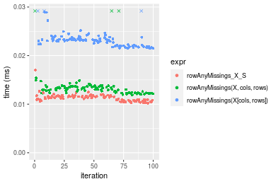
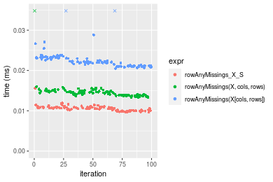
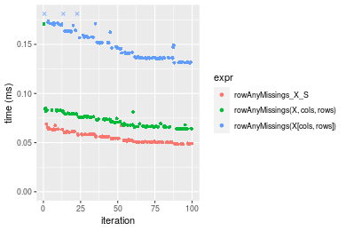

[matrixStats]: Benchmark report

---------------------------------------


# colAnyMissings() and rowAnyMissings() benchmarks  on subsetted computation

This report benchmark the performance of colAnyMissings() and rowAnyMissings() on subsetted computation.


## Data type "integer"

### Data
```r
> rmatrix <- function(nrow, ncol, mode = c("logical", "double", "integer", "index"), range = c(-100, 
+     +100), na_prob = 0) {
+     mode <- match.arg(mode)
+     n <- nrow * ncol
+     if (mode == "logical") {
+         x <- sample(c(FALSE, TRUE), size = n, replace = TRUE)
+     }     else if (mode == "index") {
+         x <- seq_len(n)
+         mode <- "integer"
+     }     else {
+         x <- runif(n, min = range[1], max = range[2])
+     }
+     storage.mode(x) <- mode
+     if (na_prob > 0) 
+         x[sample(n, size = na_prob * n)] <- NA
+     dim(x) <- c(nrow, ncol)
+     x
+ }
> rmatrices <- function(scale = 10, seed = 1, ...) {
+     set.seed(seed)
+     data <- list()
+     data[[1]] <- rmatrix(nrow = scale * 1, ncol = scale * 1, ...)
+     data[[2]] <- rmatrix(nrow = scale * 10, ncol = scale * 10, ...)
+     data[[3]] <- rmatrix(nrow = scale * 100, ncol = scale * 1, ...)
+     data[[4]] <- t(data[[3]])
+     data[[5]] <- rmatrix(nrow = scale * 10, ncol = scale * 100, ...)
+     data[[6]] <- t(data[[5]])
+     names(data) <- sapply(data, FUN = function(x) paste(dim(x), collapse = "x"))
+     data
+ }
> data <- rmatrices(mode = mode)
```

## Results

### 10x10 matrix


```r
> X <- data[["10x10"]]
> rows <- sample.int(nrow(X), size = nrow(X) * 0.7)
> cols <- sample.int(ncol(X), size = ncol(X) * 0.7)
> X_S <- X[rows, cols]
> gc()
          used  (Mb) gc trigger  (Mb) max used  (Mb)
Ncells 5152517 275.2    7554717 403.5  7554717 403.5
Vcells 9216626  70.4   31793280 242.6 60508962 461.7
> colStats <- microbenchmark(colAnyMissings_X_S = colAnyMissings(X_S), `colAnyMissings(X, rows, cols)` = colAnyMissings(X, 
+     rows = rows, cols = cols), `colAnyMissings(X[rows, cols])` = colAnyMissings(X[rows, cols]), unit = "ms")
> X <- t(X)
> X_S <- t(X_S)
> gc()
          used  (Mb) gc trigger  (Mb) max used  (Mb)
Ncells 5152047 275.2    7554717 403.5  7554717 403.5
Vcells 9215186  70.4   31793280 242.6 60508962 461.7
> rowStats <- microbenchmark(rowAnyMissings_X_S = rowAnyMissings(X_S), `rowAnyMissings(X, cols, rows)` = rowAnyMissings(X, 
+     rows = cols, cols = rows), `rowAnyMissings(X[cols, rows])` = rowAnyMissings(X[cols, rows]), unit = "ms")
```

_Table: Benchmarking of colAnyMissings_X_S(), colAnyMissings(X, rows, cols)() and colAnyMissings(X[rows, cols])() on integer+10x10 data. The top panel shows times in milliseconds and the bottom panel shows relative times._


|   |expr                          |      min|        lq|      mean|    median|       uq|      max|
|:--|:-----------------------------|--------:|---------:|---------:|---------:|--------:|--------:|
|1  |colAnyMissings_X_S            | 0.004302| 0.0044680| 0.0078086| 0.0045910| 0.004735| 0.319201|
|2  |colAnyMissings(X, rows, cols) | 0.004584| 0.0048365| 0.0050485| 0.0049555| 0.005106| 0.007558|
|3  |colAnyMissings(X[rows, cols]) | 0.005245| 0.0055585| 0.0059659| 0.0056810| 0.005875| 0.020432|


|   |expr                          |      min|       lq|      mean|   median|       uq|       max|
|:--|:-----------------------------|--------:|--------:|---------:|--------:|--------:|---------:|
|1  |colAnyMissings_X_S            | 1.000000| 1.000000| 1.0000000| 1.000000| 1.000000| 1.0000000|
|2  |colAnyMissings(X, rows, cols) | 1.065551| 1.082475| 0.6465355| 1.079395| 1.078353| 0.0236779|
|3  |colAnyMissings(X[rows, cols]) | 1.219200| 1.244069| 0.7640121| 1.237421| 1.240760| 0.0640098|

_Table: Benchmarking of rowAnyMissings_X_S(), rowAnyMissings(X, cols, rows)() and rowAnyMissings(X[cols, rows])() on integer+10x10 data (transposed). The top panel shows times in milliseconds and the bottom panel shows relative times._


|   |expr                          |      min|        lq|      mean|    median|        uq|      max|
|:--|:-----------------------------|--------:|---------:|---------:|---------:|---------:|--------:|
|1  |rowAnyMissings_X_S            | 0.004315| 0.0044285| 0.0045575| 0.0044960| 0.0045785| 0.007258|
|2  |rowAnyMissings(X, cols, rows) | 0.004666| 0.0048425| 0.0082711| 0.0049595| 0.0050640| 0.330566|
|3  |rowAnyMissings(X[cols, rows]) | 0.005289| 0.0055660| 0.0058302| 0.0057705| 0.0059310| 0.008769|


|   |expr                          |      min|       lq|     mean|   median|       uq|       max|
|:--|:-----------------------------|--------:|--------:|--------:|--------:|--------:|---------:|
|1  |rowAnyMissings_X_S            | 1.000000| 1.000000| 1.000000| 1.000000| 1.000000|  1.000000|
|2  |rowAnyMissings(X, cols, rows) | 1.081344| 1.093485| 1.814822| 1.103092| 1.106039| 45.545054|
|3  |rowAnyMissings(X[cols, rows]) | 1.225724| 1.256859| 1.279240| 1.283474| 1.295402|  1.208184|

_Figure: Benchmarking of colAnyMissings_X_S(), colAnyMissings(X, rows, cols)() and colAnyMissings(X[rows, cols])() on integer+10x10 data  as well as rowAnyMissings_X_S(), rowAnyMissings(X, cols, rows)() and rowAnyMissings(X[cols, rows])() on the same data transposed.  Outliers are displayed as crosses.  Times are in milliseconds._


_Table: Benchmarking of colAnyMissings_X_S() and rowAnyMissings_X_S() on integer+10x10 data (original and transposed).  The top panel shows times in milliseconds and the bottom panel shows relative times._


|   |expr               |   min|     lq|    mean| median|     uq|     max|
|:--|:------------------|-----:|------:|-------:|------:|------:|-------:|
|2  |rowAnyMissings_X_S | 4.315| 4.4285| 4.55755|  4.496| 4.5785|   7.258|
|1  |colAnyMissings_X_S | 4.302| 4.4680| 7.80862|  4.591| 4.7350| 319.201|


|   |expr               |       min|       lq|     mean|  median|       uq|     max|
|:--|:------------------|---------:|--------:|--------:|-------:|--------:|-------:|
|2  |rowAnyMissings_X_S | 1.0000000| 1.000000| 1.000000| 1.00000| 1.000000|  1.0000|
|1  |colAnyMissings_X_S | 0.9969873| 1.008919| 1.713337| 1.02113| 1.034182| 43.9792|

_Figure: Benchmarking of colAnyMissings_X_S() and rowAnyMissings_X_S() on integer+10x10 data (original and transposed).  Outliers are displayed as crosses. Times are in milliseconds._


### 100x100 matrix


```r
> X <- data[["100x100"]]
> rows <- sample.int(nrow(X), size = nrow(X) * 0.7)
> cols <- sample.int(ncol(X), size = ncol(X) * 0.7)
> X_S <- X[rows, cols]
> gc()
          used  (Mb) gc trigger  (Mb) max used  (Mb)
Ncells 5151210 275.2    7554717 403.5  7554717 403.5
Vcells 9050628  69.1   31793280 242.6 60508962 461.7
> colStats <- microbenchmark(colAnyMissings_X_S = colAnyMissings(X_S), `colAnyMissings(X, rows, cols)` = colAnyMissings(X, 
+     rows = rows, cols = cols), `colAnyMissings(X[rows, cols])` = colAnyMissings(X[rows, cols]), unit = "ms")
> X <- t(X)
> X_S <- t(X_S)
> gc()
          used  (Mb) gc trigger  (Mb) max used  (Mb)
Ncells 5151204 275.2    7554717 403.5  7554717 403.5
Vcells 9055711  69.1   31793280 242.6 60508962 461.7
> rowStats <- microbenchmark(rowAnyMissings_X_S = rowAnyMissings(X_S), `rowAnyMissings(X, cols, rows)` = rowAnyMissings(X, 
+     rows = cols, cols = rows), `rowAnyMissings(X[cols, rows])` = rowAnyMissings(X[cols, rows]), unit = "ms")
```

_Table: Benchmarking of colAnyMissings_X_S(), colAnyMissings(X, rows, cols)() and colAnyMissings(X[rows, cols])() on integer+100x100 data. The top panel shows times in milliseconds and the bottom panel shows relative times._


|   |expr                          |      min|        lq|      mean|    median|        uq|      max|
|:--|:-----------------------------|--------:|---------:|---------:|---------:|---------:|--------:|
|1  |colAnyMissings_X_S            | 0.006219| 0.0066800| 0.0071756| 0.0068640| 0.0070015| 0.021198|
|2  |colAnyMissings(X, rows, cols) | 0.011787| 0.0121395| 0.0125150| 0.0124395| 0.0127125| 0.016144|
|3  |colAnyMissings(X[rows, cols]) | 0.015431| 0.0160930| 0.0168862| 0.0163710| 0.0166120| 0.044246|


|   |expr                          |      min|       lq|     mean|   median|       uq|       max|
|:--|:-----------------------------|--------:|--------:|--------:|--------:|--------:|---------:|
|1  |colAnyMissings_X_S            | 1.000000| 1.000000| 1.000000| 1.000000| 1.000000| 1.0000000|
|2  |colAnyMissings(X, rows, cols) | 1.895321| 1.817290| 1.744096| 1.812282| 1.815682| 0.7615813|
|3  |colAnyMissings(X[rows, cols]) | 2.481267| 2.409132| 2.353284| 2.385052| 2.372634| 2.0872724|

_Table: Benchmarking of rowAnyMissings_X_S(), rowAnyMissings(X, cols, rows)() and rowAnyMissings(X[cols, rows])() on integer+100x100 data (transposed). The top panel shows times in milliseconds and the bottom panel shows relative times._


|   |expr                          |      min|       lq|      mean|   median|        uq|      max|
|:--|:-----------------------------|--------:|--------:|---------:|--------:|---------:|--------:|
|1  |rowAnyMissings_X_S            | 0.009812| 0.010610| 0.0109206| 0.010838| 0.0111685| 0.015285|
|2  |rowAnyMissings(X, cols, rows) | 0.011571| 0.012369| 0.0129339| 0.012585| 0.0127560| 0.039049|
|3  |rowAnyMissings(X[cols, rows]) | 0.020018| 0.021634| 0.0222673| 0.022038| 0.0223805| 0.036767|


|   |expr                          |      min|       lq|     mean|   median|       uq|      max|
|:--|:-----------------------------|--------:|--------:|--------:|--------:|--------:|--------:|
|1  |rowAnyMissings_X_S            | 1.000000| 1.000000| 1.000000| 1.000000| 1.000000| 1.000000|
|2  |rowAnyMissings(X, cols, rows) | 1.179270| 1.165787| 1.184363| 1.161192| 1.142141| 2.554727|
|3  |rowAnyMissings(X[cols, rows]) | 2.040155| 2.039020| 2.039019| 2.033401| 2.003895| 2.405430|

_Figure: Benchmarking of colAnyMissings_X_S(), colAnyMissings(X, rows, cols)() and colAnyMissings(X[rows, cols])() on integer+100x100 data  as well as rowAnyMissings_X_S(), rowAnyMissings(X, cols, rows)() and rowAnyMissings(X[cols, rows])() on the same data transposed.  Outliers are displayed as crosses.  Times are in milliseconds._



_Table: Benchmarking of colAnyMissings_X_S() and rowAnyMissings_X_S() on integer+100x100 data (original and transposed).  The top panel shows times in milliseconds and the bottom panel shows relative times._


|   |expr               |   min|    lq|     mean| median|      uq|    max|
|:--|:------------------|-----:|-----:|--------:|------:|-------:|------:|
|1  |colAnyMissings_X_S | 6.219|  6.68|  7.17561|  6.864|  7.0015| 21.198|
|2  |rowAnyMissings_X_S | 9.812| 10.61| 10.92058| 10.838| 11.1685| 15.285|


|   |expr               |      min|       lq|     mean|   median|       uq|       max|
|:--|:------------------|--------:|--------:|--------:|--------:|--------:|---------:|
|1  |colAnyMissings_X_S | 1.000000| 1.000000| 1.000000| 1.000000| 1.000000| 1.0000000|
|2  |rowAnyMissings_X_S | 1.577746| 1.588323| 1.521903| 1.578963| 1.595158| 0.7210586|

_Figure: Benchmarking of colAnyMissings_X_S() and rowAnyMissings_X_S() on integer+100x100 data (original and transposed).  Outliers are displayed as crosses. Times are in milliseconds._


### 1000x10 matrix


```r
> X <- data[["1000x10"]]
> rows <- sample.int(nrow(X), size = nrow(X) * 0.7)
> cols <- sample.int(ncol(X), size = ncol(X) * 0.7)
> X_S <- X[rows, cols]
> gc()
          used  (Mb) gc trigger  (Mb) max used  (Mb)
Ncells 5151410 275.2    7554717 403.5  7554717 403.5
Vcells 9051519  69.1   31793280 242.6 60508962 461.7
> colStats <- microbenchmark(colAnyMissings_X_S = colAnyMissings(X_S), `colAnyMissings(X, rows, cols)` = colAnyMissings(X, 
+     rows = rows, cols = cols), `colAnyMissings(X[rows, cols])` = colAnyMissings(X[rows, cols]), unit = "ms")
> X <- t(X)
> X_S <- t(X_S)
> gc()
          used  (Mb) gc trigger  (Mb) max used  (Mb)
Ncells 5151404 275.2    7554717 403.5  7554717 403.5
Vcells 9056602  69.1   31793280 242.6 60508962 461.7
> rowStats <- microbenchmark(rowAnyMissings_X_S = rowAnyMissings(X_S), `rowAnyMissings(X, cols, rows)` = rowAnyMissings(X, 
+     rows = cols, cols = rows), `rowAnyMissings(X[cols, rows])` = rowAnyMissings(X[cols, rows]), unit = "ms")
```

_Table: Benchmarking of colAnyMissings_X_S(), colAnyMissings(X, rows, cols)() and colAnyMissings(X[rows, cols])() on integer+1000x10 data. The top panel shows times in milliseconds and the bottom panel shows relative times._


|   |expr                          |      min|        lq|      mean|    median|       uq|      max|
|:--|:-----------------------------|--------:|---------:|---------:|---------:|--------:|--------:|
|1  |colAnyMissings_X_S            | 0.006395| 0.0067940| 0.0071255| 0.0069090| 0.007032| 0.014904|
|2  |colAnyMissings(X, rows, cols) | 0.013709| 0.0143335| 0.0147938| 0.0145950| 0.014774| 0.028717|
|3  |colAnyMissings(X[rows, cols]) | 0.017328| 0.0182390| 0.0194366| 0.0187405| 0.019046| 0.053192|


|   |expr                          |      min|       lq|     mean|   median|       uq|      max|
|:--|:-----------------------------|--------:|--------:|--------:|--------:|--------:|--------:|
|1  |colAnyMissings_X_S            | 1.000000| 1.000000| 1.000000| 1.000000| 1.000000| 1.000000|
|2  |colAnyMissings(X, rows, cols) | 2.143706| 2.109729| 2.076161| 2.112462| 2.100967| 1.926798|
|3  |colAnyMissings(X[rows, cols]) | 2.709617| 2.684575| 2.727742| 2.712477| 2.708476| 3.568975|

_Table: Benchmarking of rowAnyMissings_X_S(), rowAnyMissings(X, cols, rows)() and rowAnyMissings(X[cols, rows])() on integer+1000x10 data (transposed). The top panel shows times in milliseconds and the bottom panel shows relative times._


|   |expr                          |      min|        lq|      mean|    median|        uq|      max|
|:--|:-----------------------------|--------:|---------:|---------:|---------:|---------:|--------:|
|1  |rowAnyMissings_X_S            | 0.008697| 0.0090155| 0.0092539| 0.0092100| 0.0093905| 0.012699|
|2  |rowAnyMissings(X, cols, rows) | 0.013494| 0.0141215| 0.0144056| 0.0144200| 0.0146495| 0.016596|
|3  |rowAnyMissings(X[cols, rows]) | 0.021549| 0.0218930| 0.0231503| 0.0226855| 0.0231425| 0.054293|


|   |expr                          |      min|       lq|    mean|   median|       uq|      max|
|:--|:-----------------------------|--------:|--------:|-------:|--------:|--------:|--------:|
|1  |rowAnyMissings_X_S            | 1.000000| 1.000000| 1.00000| 1.000000| 1.000000| 1.000000|
|2  |rowAnyMissings(X, cols, rows) | 1.551570| 1.566358| 1.55670| 1.565689| 1.560034| 1.306875|
|3  |rowAnyMissings(X[cols, rows]) | 2.477751| 2.428373| 2.50167| 2.463138| 2.464459| 4.275376|

_Figure: Benchmarking of colAnyMissings_X_S(), colAnyMissings(X, rows, cols)() and colAnyMissings(X[rows, cols])() on integer+1000x10 data  as well as rowAnyMissings_X_S(), rowAnyMissings(X, cols, rows)() and rowAnyMissings(X[cols, rows])() on the same data transposed.  Outliers are displayed as crosses.  Times are in milliseconds._


_Table: Benchmarking of colAnyMissings_X_S() and rowAnyMissings_X_S() on integer+1000x10 data (original and transposed).  The top panel shows times in milliseconds and the bottom panel shows relative times._


|   |expr               |   min|     lq|    mean| median|     uq|    max|
|:--|:------------------|-----:|------:|-------:|------:|------:|------:|
|1  |colAnyMissings_X_S | 6.395| 6.7940| 7.12553|  6.909| 7.0320| 14.904|
|2  |rowAnyMissings_X_S | 8.697| 9.0155| 9.25393|  9.210| 9.3905| 12.699|


|   |expr               |      min|      lq|     mean|   median|       uq|       max|
|:--|:------------------|--------:|-------:|--------:|--------:|--------:|---------:|
|1  |colAnyMissings_X_S | 1.000000| 1.00000| 1.000000| 1.000000| 1.000000| 1.0000000|
|2  |rowAnyMissings_X_S | 1.359969| 1.32698| 1.298701| 1.333044| 1.335395| 0.8520531|

_Figure: Benchmarking of colAnyMissings_X_S() and rowAnyMissings_X_S() on integer+1000x10 data (original and transposed).  Outliers are displayed as crosses. Times are in milliseconds._


### 10x1000 matrix


```r
> X <- data[["10x1000"]]
> rows <- sample.int(nrow(X), size = nrow(X) * 0.7)
> cols <- sample.int(ncol(X), size = ncol(X) * 0.7)
> X_S <- X[rows, cols]
> gc()
          used  (Mb) gc trigger  (Mb) max used  (Mb)
Ncells 5151615 275.2    7554717 403.5  7554717 403.5
Vcells 9052431  69.1   31793280 242.6 60508962 461.7
> colStats <- microbenchmark(colAnyMissings_X_S = colAnyMissings(X_S), `colAnyMissings(X, rows, cols)` = colAnyMissings(X, 
+     rows = rows, cols = cols), `colAnyMissings(X[rows, cols])` = colAnyMissings(X[rows, cols]), unit = "ms")
> X <- t(X)
> X_S <- t(X_S)
> gc()
          used  (Mb) gc trigger  (Mb) max used  (Mb)
Ncells 5151609 275.2    7554717 403.5  7554717 403.5
Vcells 9057514  69.2   31793280 242.6 60508962 461.7
> rowStats <- microbenchmark(rowAnyMissings_X_S = rowAnyMissings(X_S), `rowAnyMissings(X, cols, rows)` = rowAnyMissings(X, 
+     rows = cols, cols = rows), `rowAnyMissings(X[cols, rows])` = rowAnyMissings(X[cols, rows]), unit = "ms")
```

_Table: Benchmarking of colAnyMissings_X_S(), colAnyMissings(X, rows, cols)() and colAnyMissings(X[rows, cols])() on integer+10x1000 data. The top panel shows times in milliseconds and the bottom panel shows relative times._


|   |expr                          |      min|        lq|      mean|    median|        uq|      max|
|:--|:-----------------------------|--------:|---------:|---------:|---------:|---------:|--------:|
|1  |colAnyMissings_X_S            | 0.009836| 0.0104120| 0.0110378| 0.0107095| 0.0111370| 0.032999|
|2  |colAnyMissings(X, rows, cols) | 0.016714| 0.0170655| 0.0175686| 0.0173185| 0.0177505| 0.029295|
|3  |colAnyMissings(X[rows, cols]) | 0.022909| 0.0236430| 0.0244653| 0.0241895| 0.0247200| 0.041551|


|   |expr                          |      min|       lq|     mean|   median|       uq|       max|
|:--|:-----------------------------|--------:|--------:|--------:|--------:|--------:|---------:|
|1  |colAnyMissings_X_S            | 1.000000| 1.000000| 1.000000| 1.000000| 1.000000| 1.0000000|
|2  |colAnyMissings(X, rows, cols) | 1.699268| 1.639022| 1.591687| 1.617116| 1.593831| 0.8877542|
|3  |colAnyMissings(X[rows, cols]) | 2.329097| 2.270745| 2.216513| 2.258696| 2.219628| 1.2591594|

_Table: Benchmarking of rowAnyMissings_X_S(), rowAnyMissings(X, cols, rows)() and rowAnyMissings(X[cols, rows])() on integer+10x1000 data (transposed). The top panel shows times in milliseconds and the bottom panel shows relative times._


|   |expr                          |      min|        lq|      mean|    median|        uq|      max|
|:--|:-----------------------------|--------:|---------:|---------:|---------:|---------:|--------:|
|1  |rowAnyMissings_X_S            | 0.009977| 0.0104235| 0.0106332| 0.0105990| 0.0107800| 0.014964|
|2  |rowAnyMissings(X, cols, rows) | 0.013712| 0.0143585| 0.0149584| 0.0146105| 0.0149260| 0.041389|
|3  |rowAnyMissings(X[cols, rows]) | 0.021420| 0.0219830| 0.0227103| 0.0225460| 0.0228955| 0.037042|


|   |expr                          |      min|       lq|     mean|   median|       uq|      max|
|:--|:-----------------------------|--------:|--------:|--------:|--------:|--------:|--------:|
|1  |rowAnyMissings_X_S            | 1.000000| 1.000000| 1.000000| 1.000000| 1.000000| 1.000000|
|2  |rowAnyMissings(X, cols, rows) | 1.374361| 1.377512| 1.406752| 1.378479| 1.384601| 2.765905|
|3  |rowAnyMissings(X[cols, rows]) | 2.146938| 2.108985| 2.135781| 2.127182| 2.123887| 2.475408|

_Figure: Benchmarking of colAnyMissings_X_S(), colAnyMissings(X, rows, cols)() and colAnyMissings(X[rows, cols])() on integer+10x1000 data  as well as rowAnyMissings_X_S(), rowAnyMissings(X, cols, rows)() and rowAnyMissings(X[cols, rows])() on the same data transposed.  Outliers are displayed as crosses.  Times are in milliseconds._



_Table: Benchmarking of colAnyMissings_X_S() and rowAnyMissings_X_S() on integer+10x1000 data (original and transposed).  The top panel shows times in milliseconds and the bottom panel shows relative times._


|   |expr               |   min|      lq|     mean|  median|     uq|    max|
|:--|:------------------|-----:|-------:|--------:|-------:|------:|------:|
|2  |rowAnyMissings_X_S | 9.977| 10.4235| 10.63325| 10.5990| 10.780| 14.964|
|1  |colAnyMissings_X_S | 9.836| 10.4120| 11.03775| 10.7095| 11.137| 32.999|


|   |expr               |       min|        lq|     mean|   median|       uq|      max|
|:--|:------------------|---------:|---------:|--------:|--------:|--------:|--------:|
|2  |rowAnyMissings_X_S | 1.0000000| 1.0000000| 1.000000| 1.000000| 1.000000| 1.000000|
|1  |colAnyMissings_X_S | 0.9858675| 0.9988967| 1.038041| 1.010425| 1.033117| 2.205226|

_Figure: Benchmarking of colAnyMissings_X_S() and rowAnyMissings_X_S() on integer+10x1000 data (original and transposed).  Outliers are displayed as crosses. Times are in milliseconds._


### 100x1000 matrix


```r
> X <- data[["100x1000"]]
> rows <- sample.int(nrow(X), size = nrow(X) * 0.7)
> cols <- sample.int(ncol(X), size = ncol(X) * 0.7)
> X_S <- X[rows, cols]
> gc()
          used  (Mb) gc trigger  (Mb) max used  (Mb)
Ncells 5151825 275.2    7554717 403.5  7554717 403.5
Vcells 9075121  69.3   31793280 242.6 60508962 461.7
> colStats <- microbenchmark(colAnyMissings_X_S = colAnyMissings(X_S), `colAnyMissings(X, rows, cols)` = colAnyMissings(X, 
+     rows = rows, cols = cols), `colAnyMissings(X[rows, cols])` = colAnyMissings(X[rows, cols]), unit = "ms")
> X <- t(X)
> X_S <- t(X_S)
> gc()
          used  (Mb) gc trigger  (Mb) max used  (Mb)
Ncells 5151819 275.2    7554717 403.5  7554717 403.5
Vcells 9125204  69.7   31793280 242.6 60508962 461.7
> rowStats <- microbenchmark(rowAnyMissings_X_S = rowAnyMissings(X_S), `rowAnyMissings(X, cols, rows)` = rowAnyMissings(X, 
+     rows = cols, cols = rows), `rowAnyMissings(X[cols, rows])` = rowAnyMissings(X[cols, rows]), unit = "ms")
```

_Table: Benchmarking of colAnyMissings_X_S(), colAnyMissings(X, rows, cols)() and colAnyMissings(X[rows, cols])() on integer+100x1000 data. The top panel shows times in milliseconds and the bottom panel shows relative times._


|   |expr                          |      min|        lq|      mean|    median|        uq|      max|
|:--|:-----------------------------|--------:|---------:|---------:|---------:|---------:|--------:|
|1  |colAnyMissings_X_S            | 0.024088| 0.0251995| 0.0276172| 0.0264200| 0.0287040| 0.067366|
|2  |colAnyMissings(X, rows, cols) | 0.072278| 0.0752990| 0.0823661| 0.0799520| 0.0864105| 0.153487|
|3  |colAnyMissings(X[rows, cols]) | 0.107213| 0.1111555| 0.1210023| 0.1181735| 0.1285300| 0.144728|


|   |expr                          |      min|       lq|     mean|   median|       uq|      max|
|:--|:-----------------------------|--------:|--------:|--------:|--------:|--------:|--------:|
|1  |colAnyMissings_X_S            | 1.000000| 1.000000| 1.000000| 1.000000| 1.000000| 1.000000|
|2  |colAnyMissings(X, rows, cols) | 3.000581| 2.988115| 2.982423| 3.026192| 3.010399| 2.278405|
|3  |colAnyMissings(X[rows, cols]) | 4.450888| 4.411020| 4.381412| 4.472880| 4.477773| 2.148384|

_Table: Benchmarking of rowAnyMissings_X_S(), rowAnyMissings(X, cols, rows)() and rowAnyMissings(X[cols, rows])() on integer+100x1000 data (transposed). The top panel shows times in milliseconds and the bottom panel shows relative times._


|   |expr                          |      min|        lq|      mean|    median|        uq|      max|
|:--|:-----------------------------|--------:|---------:|---------:|---------:|---------:|--------:|
|1  |rowAnyMissings_X_S            | 0.039288| 0.0409705| 0.0449317| 0.0439430| 0.0468640| 0.075693|
|2  |rowAnyMissings(X, cols, rows) | 0.061490| 0.0633885| 0.0678970| 0.0646515| 0.0708555| 0.129899|
|3  |rowAnyMissings(X[cols, rows]) | 0.118240| 0.1224405| 0.1313771| 0.1294105| 0.1394760| 0.156171|


|   |expr                          |      min|       lq|     mean|   median|       uq|      max|
|:--|:-----------------------------|--------:|--------:|--------:|--------:|--------:|--------:|
|1  |rowAnyMissings_X_S            | 1.000000| 1.000000| 1.000000| 1.000000| 1.000000| 1.000000|
|2  |rowAnyMissings(X, cols, rows) | 1.565109| 1.547174| 1.511117| 1.471258| 1.511939| 1.716130|
|3  |rowAnyMissings(X[cols, rows]) | 3.009570| 2.988504| 2.923931| 2.944963| 2.976186| 2.063216|

_Figure: Benchmarking of colAnyMissings_X_S(), colAnyMissings(X, rows, cols)() and colAnyMissings(X[rows, cols])() on integer+100x1000 data  as well as rowAnyMissings_X_S(), rowAnyMissings(X, cols, rows)() and rowAnyMissings(X[cols, rows])() on the same data transposed.  Outliers are displayed as crosses.  Times are in milliseconds._


_Table: Benchmarking of colAnyMissings_X_S() and rowAnyMissings_X_S() on integer+100x1000 data (original and transposed).  The top panel shows times in milliseconds and the bottom panel shows relative times._


|   |expr               |    min|      lq|     mean| median|     uq|    max|
|:--|:------------------|------:|-------:|--------:|------:|------:|------:|
|1  |colAnyMissings_X_S | 24.088| 25.1995| 27.61719| 26.420| 28.704| 67.366|
|2  |rowAnyMissings_X_S | 39.288| 40.9705| 44.93166| 43.943| 46.864| 75.693|


|   |expr               |     min|       lq|     mean|   median|       uq|      max|
|:--|:------------------|-------:|--------:|--------:|--------:|--------:|--------:|
|1  |colAnyMissings_X_S | 1.00000| 1.000000| 1.000000| 1.000000| 1.000000| 1.000000|
|2  |rowAnyMissings_X_S | 1.63102| 1.625846| 1.626945| 1.663247| 1.632664| 1.123608|

_Figure: Benchmarking of colAnyMissings_X_S() and rowAnyMissings_X_S() on integer+100x1000 data (original and transposed).  Outliers are displayed as crosses. Times are in milliseconds._


### 1000x100 matrix


```r
> X <- data[["1000x100"]]
> rows <- sample.int(nrow(X), size = nrow(X) * 0.7)
> cols <- sample.int(ncol(X), size = ncol(X) * 0.7)
> X_S <- X[rows, cols]
> gc()
          used  (Mb) gc trigger  (Mb) max used  (Mb)
Ncells 5152038 275.2    7554717 403.5  7554717 403.5
Vcells 9075932  69.3   31793280 242.6 60508962 461.7
> colStats <- microbenchmark(colAnyMissings_X_S = colAnyMissings(X_S), `colAnyMissings(X, rows, cols)` = colAnyMissings(X, 
+     rows = rows, cols = cols), `colAnyMissings(X[rows, cols])` = colAnyMissings(X[rows, cols]), unit = "ms")
> X <- t(X)
> X_S <- t(X_S)
> gc()
          used  (Mb) gc trigger  (Mb) max used  (Mb)
Ncells 5152032 275.2    7554717 403.5  7554717 403.5
Vcells 9126015  69.7   31793280 242.6 60508962 461.7
> rowStats <- microbenchmark(rowAnyMissings_X_S = rowAnyMissings(X_S), `rowAnyMissings(X, cols, rows)` = rowAnyMissings(X, 
+     rows = cols, cols = rows), `rowAnyMissings(X[cols, rows])` = rowAnyMissings(X[cols, rows]), unit = "ms")
```

_Table: Benchmarking of colAnyMissings_X_S(), colAnyMissings(X, rows, cols)() and colAnyMissings(X[rows, cols])() on integer+1000x100 data. The top panel shows times in milliseconds and the bottom panel shows relative times._


|   |expr                          |      min|       lq|      mean|    median|        uq|      max|
|:--|:-----------------------------|--------:|--------:|---------:|---------:|---------:|--------:|
|1  |colAnyMissings_X_S            | 0.022411| 0.023681| 0.0256924| 0.0243875| 0.0265480| 0.056803|
|2  |colAnyMissings(X, rows, cols) | 0.071343| 0.074385| 0.0794266| 0.0768365| 0.0836865| 0.099432|
|3  |colAnyMissings(X[rows, cols]) | 0.101773| 0.106157| 0.1145675| 0.1100275| 0.1220625| 0.187347|


|   |expr                          |      min|       lq|     mean|   median|       uq|      max|
|:--|:-----------------------------|--------:|--------:|--------:|--------:|--------:|--------:|
|1  |colAnyMissings_X_S            | 1.000000| 1.000000| 1.000000| 1.000000| 1.000000| 1.000000|
|2  |colAnyMissings(X, rows, cols) | 3.183392| 3.141126| 3.091441| 3.150651| 3.152271| 1.750471|
|3  |colAnyMissings(X[rows, cols]) | 4.541207| 4.482792| 4.459198| 4.511635| 4.597804| 3.298189|

_Table: Benchmarking of rowAnyMissings_X_S(), rowAnyMissings(X, cols, rows)() and rowAnyMissings(X[cols, rows])() on integer+1000x100 data (transposed). The top panel shows times in milliseconds and the bottom panel shows relative times._


|   |expr                          |      min|       lq|      mean|    median|        uq|      max|
|:--|:-----------------------------|--------:|--------:|---------:|---------:|---------:|--------:|
|1  |rowAnyMissings_X_S            | 0.048912| 0.049591| 0.0535517| 0.0510945| 0.0566840| 0.069009|
|2  |rowAnyMissings(X, cols, rows) | 0.063900| 0.065087| 0.0710478| 0.0684935| 0.0738755| 0.160740|
|3  |rowAnyMissings(X[cols, rows]) | 0.131550| 0.132986| 0.1434484| 0.1371010| 0.1521355| 0.175631|


|   |expr                          |      min|       lq|     mean|   median|       uq|      max|
|:--|:-----------------------------|--------:|--------:|--------:|--------:|--------:|--------:|
|1  |rowAnyMissings_X_S            | 1.000000| 1.000000| 1.000000| 1.000000| 1.000000| 1.000000|
|2  |rowAnyMissings(X, cols, rows) | 1.306428| 1.312476| 1.326713| 1.340526| 1.303287| 2.329261|
|3  |rowAnyMissings(X[cols, rows]) | 2.689524| 2.681656| 2.678689| 2.683283| 2.683923| 2.545045|

_Figure: Benchmarking of colAnyMissings_X_S(), colAnyMissings(X, rows, cols)() and colAnyMissings(X[rows, cols])() on integer+1000x100 data  as well as rowAnyMissings_X_S(), rowAnyMissings(X, cols, rows)() and rowAnyMissings(X[cols, rows])() on the same data transposed.  Outliers are displayed as crosses.  Times are in milliseconds._



_Table: Benchmarking of colAnyMissings_X_S() and rowAnyMissings_X_S() on integer+1000x100 data (original and transposed).  The top panel shows times in milliseconds and the bottom panel shows relative times._


|   |expr               |    min|     lq|     mean|  median|     uq|    max|
|:--|:------------------|------:|------:|--------:|-------:|------:|------:|
|1  |colAnyMissings_X_S | 22.411| 23.681| 25.69240| 24.3875| 26.548| 56.803|
|2  |rowAnyMissings_X_S | 48.912| 49.591| 53.55173| 51.0945| 56.684| 69.009|


|   |expr               |    min|       lq|     mean|  median|       uq|      max|
|:--|:------------------|------:|--------:|--------:|-------:|--------:|--------:|
|1  |colAnyMissings_X_S | 1.0000| 1.000000| 1.000000| 1.00000| 1.000000| 1.000000|
|2  |rowAnyMissings_X_S | 2.1825| 2.094126| 2.084341| 2.09511| 2.135151| 1.214883|

_Figure: Benchmarking of colAnyMissings_X_S() and rowAnyMissings_X_S() on integer+1000x100 data (original and transposed).  Outliers are displayed as crosses. Times are in milliseconds._


## Data type "double"

### Data
```r
> rmatrix <- function(nrow, ncol, mode = c("logical", "double", "integer", "index"), range = c(-100, 
+     +100), na_prob = 0) {
+     mode <- match.arg(mode)
+     n <- nrow * ncol
+     if (mode == "logical") {
+         x <- sample(c(FALSE, TRUE), size = n, replace = TRUE)
+     }     else if (mode == "index") {
+         x <- seq_len(n)
+         mode <- "integer"
+     }     else {
+         x <- runif(n, min = range[1], max = range[2])
+     }
+     storage.mode(x) <- mode
+     if (na_prob > 0) 
+         x[sample(n, size = na_prob * n)] <- NA
+     dim(x) <- c(nrow, ncol)
+     x
+ }
> rmatrices <- function(scale = 10, seed = 1, ...) {
+     set.seed(seed)
+     data <- list()
+     data[[1]] <- rmatrix(nrow = scale * 1, ncol = scale * 1, ...)
+     data[[2]] <- rmatrix(nrow = scale * 10, ncol = scale * 10, ...)
+     data[[3]] <- rmatrix(nrow = scale * 100, ncol = scale * 1, ...)
+     data[[4]] <- t(data[[3]])
+     data[[5]] <- rmatrix(nrow = scale * 10, ncol = scale * 100, ...)
+     data[[6]] <- t(data[[5]])
+     names(data) <- sapply(data, FUN = function(x) paste(dim(x), collapse = "x"))
+     data
+ }
> data <- rmatrices(mode = mode)
```

## Results

### 10x10 matrix


```r
> X <- data[["10x10"]]
> rows <- sample.int(nrow(X), size = nrow(X) * 0.7)
> cols <- sample.int(ncol(X), size = ncol(X) * 0.7)
> X_S <- X[rows, cols]
> gc()
          used  (Mb) gc trigger  (Mb) max used  (Mb)
Ncells 5152255 275.2    7554717 403.5  7554717 403.5
Vcells 9167068  70.0   31793280 242.6 60508962 461.7
> colStats <- microbenchmark(colAnyMissings_X_S = colAnyMissings(X_S), `colAnyMissings(X, rows, cols)` = colAnyMissings(X, 
+     rows = rows, cols = cols), `colAnyMissings(X[rows, cols])` = colAnyMissings(X[rows, cols]), unit = "ms")
> X <- t(X)
> X_S <- t(X_S)
> gc()
          used  (Mb) gc trigger  (Mb) max used  (Mb)
Ncells 5152240 275.2    7554717 403.5  7554717 403.5
Vcells 9167236  70.0   31793280 242.6 60508962 461.7
> rowStats <- microbenchmark(rowAnyMissings_X_S = rowAnyMissings(X_S), `rowAnyMissings(X, cols, rows)` = rowAnyMissings(X, 
+     rows = cols, cols = rows), `rowAnyMissings(X[cols, rows])` = rowAnyMissings(X[cols, rows]), unit = "ms")
```

_Table: Benchmarking of colAnyMissings_X_S(), colAnyMissings(X, rows, cols)() and colAnyMissings(X[rows, cols])() on double+10x10 data. The top panel shows times in milliseconds and the bottom panel shows relative times._


|   |expr                          |      min|        lq|      mean|    median|        uq|      max|
|:--|:-----------------------------|--------:|---------:|---------:|---------:|---------:|--------:|
|1  |colAnyMissings_X_S            | 0.004277| 0.0044615| 0.0049464| 0.0045515| 0.0046825| 0.037929|
|2  |colAnyMissings(X, rows, cols) | 0.004664| 0.0048960| 0.0050777| 0.0050020| 0.0051370| 0.007793|
|3  |colAnyMissings(X[rows, cols]) | 0.005359| 0.0056525| 0.0061233| 0.0057955| 0.0059435| 0.026401|


|   |expr                          |      min|       lq|     mean|   median|       uq|       max|
|:--|:-----------------------------|--------:|--------:|--------:|--------:|--------:|---------:|
|1  |colAnyMissings_X_S            | 1.000000| 1.000000| 1.000000| 1.000000| 1.000000| 1.0000000|
|2  |colAnyMissings(X, rows, cols) | 1.090484| 1.097389| 1.026536| 1.098978| 1.097063| 0.2054628|
|3  |colAnyMissings(X[rows, cols]) | 1.252981| 1.266951| 1.237920| 1.273316| 1.269301| 0.6960637|

_Table: Benchmarking of rowAnyMissings_X_S(), rowAnyMissings(X, cols, rows)() and rowAnyMissings(X[cols, rows])() on double+10x10 data (transposed). The top panel shows times in milliseconds and the bottom panel shows relative times._


|   |expr                          |      min|        lq|      mean|    median|        uq|      max|
|:--|:-----------------------------|--------:|---------:|---------:|---------:|---------:|--------:|
|1  |rowAnyMissings_X_S            | 0.004254| 0.0044060| 0.0045370| 0.0044780| 0.0046095| 0.006705|
|2  |rowAnyMissings(X, cols, rows) | 0.004607| 0.0047955| 0.0051676| 0.0048735| 0.0050065| 0.028174|
|3  |rowAnyMissings(X[cols, rows]) | 0.005347| 0.0056920| 0.0058581| 0.0058025| 0.0059410| 0.008402|


|   |expr                          |      min|       lq|     mean|   median|       uq|      max|
|:--|:-----------------------------|--------:|--------:|--------:|--------:|--------:|--------:|
|1  |rowAnyMissings_X_S            | 1.000000| 1.000000| 1.000000| 1.000000| 1.000000| 1.000000|
|2  |rowAnyMissings(X, cols, rows) | 1.082981| 1.088402| 1.138988| 1.088321| 1.086126| 4.201939|
|3  |rowAnyMissings(X[cols, rows]) | 1.256935| 1.291875| 1.291181| 1.295779| 1.288860| 1.253095|

_Figure: Benchmarking of colAnyMissings_X_S(), colAnyMissings(X, rows, cols)() and colAnyMissings(X[rows, cols])() on double+10x10 data  as well as rowAnyMissings_X_S(), rowAnyMissings(X, cols, rows)() and rowAnyMissings(X[cols, rows])() on the same data transposed.  Outliers are displayed as crosses.  Times are in milliseconds._


_Table: Benchmarking of colAnyMissings_X_S() and rowAnyMissings_X_S() on double+10x10 data (original and transposed).  The top panel shows times in milliseconds and the bottom panel shows relative times._


|   |expr               |   min|     lq|    mean| median|     uq|    max|
|:--|:------------------|-----:|------:|-------:|------:|------:|------:|
|2  |rowAnyMissings_X_S | 4.254| 4.4060| 4.53701| 4.4780| 4.6095|  6.705|
|1  |colAnyMissings_X_S | 4.277| 4.4615| 4.94645| 4.5515| 4.6825| 37.929|


|   |expr               |      min|       lq|     mean|   median|       uq|      max|
|:--|:------------------|--------:|--------:|--------:|--------:|--------:|--------:|
|2  |rowAnyMissings_X_S | 1.000000| 1.000000| 1.000000| 1.000000| 1.000000| 1.000000|
|1  |colAnyMissings_X_S | 1.005407| 1.012596| 1.090245| 1.016414| 1.015837| 5.656823|

_Figure: Benchmarking of colAnyMissings_X_S() and rowAnyMissings_X_S() on double+10x10 data (original and transposed).  Outliers are displayed as crosses. Times are in milliseconds._


### 100x100 matrix


```r
> X <- data[["100x100"]]
> rows <- sample.int(nrow(X), size = nrow(X) * 0.7)
> cols <- sample.int(ncol(X), size = ncol(X) * 0.7)
> X_S <- X[rows, cols]
> gc()
          used  (Mb) gc trigger  (Mb) max used  (Mb)
Ncells 5152452 275.2    7554717 403.5  7554717 403.5
Vcells 9173045  70.0   31793280 242.6 60508962 461.7
> colStats <- microbenchmark(colAnyMissings_X_S = colAnyMissings(X_S), `colAnyMissings(X, rows, cols)` = colAnyMissings(X, 
+     rows = rows, cols = cols), `colAnyMissings(X[rows, cols])` = colAnyMissings(X[rows, cols]), unit = "ms")
> X <- t(X)
> X_S <- t(X_S)
> gc()
          used  (Mb) gc trigger  (Mb) max used  (Mb)
Ncells 5152446 275.2    7554717 403.5  7554717 403.5
Vcells 9183128  70.1   31793280 242.6 60508962 461.7
> rowStats <- microbenchmark(rowAnyMissings_X_S = rowAnyMissings(X_S), `rowAnyMissings(X, cols, rows)` = rowAnyMissings(X, 
+     rows = cols, cols = rows), `rowAnyMissings(X[cols, rows])` = rowAnyMissings(X[cols, rows]), unit = "ms")
```

_Table: Benchmarking of colAnyMissings_X_S(), colAnyMissings(X, rows, cols)() and colAnyMissings(X[rows, cols])() on double+100x100 data. The top panel shows times in milliseconds and the bottom panel shows relative times._


|   |expr                          |      min|        lq|      mean|    median|        uq|      max|
|:--|:-----------------------------|--------:|---------:|---------:|---------:|---------:|--------:|
|1  |colAnyMissings_X_S            | 0.008220| 0.0088695| 0.0091020| 0.0090605| 0.0092500| 0.013355|
|2  |colAnyMissings(X, rows, cols) | 0.015571| 0.0161545| 0.0165665| 0.0164950| 0.0167380| 0.022607|
|3  |colAnyMissings(X[rows, cols]) | 0.023777| 0.0242605| 0.0252576| 0.0249140| 0.0251475| 0.055066|


|   |expr                          |      min|       lq|     mean|   median|       uq|      max|
|:--|:-----------------------------|--------:|--------:|--------:|--------:|--------:|--------:|
|1  |colAnyMissings_X_S            | 1.000000| 1.000000| 1.000000| 1.000000| 1.000000| 1.000000|
|2  |colAnyMissings(X, rows, cols) | 1.894282| 1.821354| 1.820091| 1.820540| 1.809513| 1.692774|
|3  |colAnyMissings(X[rows, cols]) | 2.892579| 2.735273| 2.774938| 2.749738| 2.718649| 4.123250|

_Table: Benchmarking of rowAnyMissings_X_S(), rowAnyMissings(X, cols, rows)() and rowAnyMissings(X[cols, rows])() on double+100x100 data (transposed). The top panel shows times in milliseconds and the bottom panel shows relative times._


|   |expr                          |      min|        lq|      mean|    median|        uq|      max|
|:--|:-----------------------------|--------:|---------:|---------:|---------:|---------:|--------:|
|1  |rowAnyMissings_X_S            | 0.008388| 0.0091985| 0.0096174| 0.0094235| 0.0096975| 0.023701|
|2  |rowAnyMissings(X, cols, rows) | 0.013295| 0.0141895| 0.0149913| 0.0144715| 0.0148260| 0.046042|
|3  |rowAnyMissings(X[cols, rows]) | 0.023442| 0.0246200| 0.0251257| 0.0251705| 0.0256550| 0.029655|


|   |expr                          |      min|       lq|     mean|   median|       uq|      max|
|:--|:-----------------------------|--------:|--------:|--------:|--------:|--------:|--------:|
|1  |rowAnyMissings_X_S            | 1.000000| 1.000000| 1.000000| 1.000000| 1.000000| 1.000000|
|2  |rowAnyMissings(X, cols, rows) | 1.585002| 1.542588| 1.558760| 1.535682| 1.528848| 1.942619|
|3  |rowAnyMissings(X[cols, rows]) | 2.794707| 2.676523| 2.612514| 2.671035| 2.645527| 1.251213|

_Figure: Benchmarking of colAnyMissings_X_S(), colAnyMissings(X, rows, cols)() and colAnyMissings(X[rows, cols])() on double+100x100 data  as well as rowAnyMissings_X_S(), rowAnyMissings(X, cols, rows)() and rowAnyMissings(X[cols, rows])() on the same data transposed.  Outliers are displayed as crosses.  Times are in milliseconds._


_Table: Benchmarking of colAnyMissings_X_S() and rowAnyMissings_X_S() on double+100x100 data (original and transposed).  The top panel shows times in milliseconds and the bottom panel shows relative times._


|   |expr               |   min|     lq|    mean| median|     uq|    max|
|:--|:------------------|-----:|------:|-------:|------:|------:|------:|
|1  |colAnyMissings_X_S | 8.220| 8.8695| 9.10204| 9.0605| 9.2500| 13.355|
|2  |rowAnyMissings_X_S | 8.388| 9.1985| 9.61743| 9.4235| 9.6975| 23.701|


|   |expr               |      min|       lq|     mean|   median|       uq|      max|
|:--|:------------------|--------:|--------:|--------:|--------:|--------:|--------:|
|1  |colAnyMissings_X_S | 1.000000| 1.000000| 1.000000| 1.000000| 1.000000| 1.000000|
|2  |rowAnyMissings_X_S | 1.020438| 1.037093| 1.056624| 1.040064| 1.048378| 1.774691|

_Figure: Benchmarking of colAnyMissings_X_S() and rowAnyMissings_X_S() on double+100x100 data (original and transposed).  Outliers are displayed as crosses. Times are in milliseconds._


### 1000x10 matrix


```r
> X <- data[["1000x10"]]
> rows <- sample.int(nrow(X), size = nrow(X) * 0.7)
> cols <- sample.int(ncol(X), size = ncol(X) * 0.7)
> X_S <- X[rows, cols]
> gc()
          used  (Mb) gc trigger  (Mb) max used  (Mb)
Ncells 5152652 275.2    7554717 403.5  7554717 403.5
Vcells 9174496  70.0   31793280 242.6 60508962 461.7
> colStats <- microbenchmark(colAnyMissings_X_S = colAnyMissings(X_S), `colAnyMissings(X, rows, cols)` = colAnyMissings(X, 
+     rows = rows, cols = cols), `colAnyMissings(X[rows, cols])` = colAnyMissings(X[rows, cols]), unit = "ms")
> X <- t(X)
> X_S <- t(X_S)
> gc()
          used  (Mb) gc trigger  (Mb) max used  (Mb)
Ncells 5152646 275.2    7554717 403.5  7554717 403.5
Vcells 9184579  70.1   31793280 242.6 60508962 461.7
> rowStats <- microbenchmark(rowAnyMissings_X_S = rowAnyMissings(X_S), `rowAnyMissings(X, cols, rows)` = rowAnyMissings(X, 
+     rows = cols, cols = rows), `rowAnyMissings(X[cols, rows])` = rowAnyMissings(X[cols, rows]), unit = "ms")
```

_Table: Benchmarking of colAnyMissings_X_S(), colAnyMissings(X, rows, cols)() and colAnyMissings(X[rows, cols])() on double+1000x10 data. The top panel shows times in milliseconds and the bottom panel shows relative times._


|   |expr                          |      min|        lq|      mean|    median|        uq|      max|
|:--|:-----------------------------|--------:|---------:|---------:|---------:|---------:|--------:|
|1  |colAnyMissings_X_S            | 0.007455| 0.0077845| 0.0080190| 0.0079655| 0.0081510| 0.012322|
|2  |colAnyMissings(X, rows, cols) | 0.015334| 0.0158870| 0.0162866| 0.0161395| 0.0165045| 0.021376|
|3  |colAnyMissings(X[rows, cols]) | 0.022643| 0.0235985| 0.0247264| 0.0238420| 0.0246600| 0.059187|


|   |expr                          |      min|       lq|     mean|   median|       uq|      max|
|:--|:-----------------------------|--------:|--------:|--------:|--------:|--------:|--------:|
|1  |colAnyMissings_X_S            | 1.000000| 1.000000| 1.000000| 1.000000| 1.000000| 1.000000|
|2  |colAnyMissings(X, rows, cols) | 2.056875| 2.040850| 2.030990| 2.026175| 2.024844| 1.734783|
|3  |colAnyMissings(X[rows, cols]) | 3.037290| 3.031473| 3.083466| 2.993158| 3.025396| 4.803360|

_Table: Benchmarking of rowAnyMissings_X_S(), rowAnyMissings(X, cols, rows)() and rowAnyMissings(X[cols, rows])() on double+1000x10 data (transposed). The top panel shows times in milliseconds and the bottom panel shows relative times._


|   |expr                          |      min|        lq|      mean|    median|        uq|      max|
|:--|:-----------------------------|--------:|---------:|---------:|---------:|---------:|--------:|
|1  |rowAnyMissings_X_S            | 0.008632| 0.0089080| 0.0091992| 0.0091230| 0.0093475| 0.014225|
|2  |rowAnyMissings(X, cols, rows) | 0.015125| 0.0155960| 0.0160501| 0.0158535| 0.0160350| 0.030496|
|3  |rowAnyMissings(X[cols, rows]) | 0.027394| 0.0277595| 0.0285595| 0.0279830| 0.0287335| 0.064292|


|   |expr                          |      min|       lq|     mean|   median|       uq|      max|
|:--|:-----------------------------|--------:|--------:|--------:|--------:|--------:|--------:|
|1  |rowAnyMissings_X_S            | 1.000000| 1.000000| 1.000000| 1.000000| 1.000000| 1.000000|
|2  |rowAnyMissings(X, cols, rows) | 1.752201| 1.750786| 1.744736| 1.737751| 1.715432| 2.143831|
|3  |rowAnyMissings(X[cols, rows]) | 3.173540| 3.116244| 3.104570| 3.067302| 3.073923| 4.519648|

_Figure: Benchmarking of colAnyMissings_X_S(), colAnyMissings(X, rows, cols)() and colAnyMissings(X[rows, cols])() on double+1000x10 data  as well as rowAnyMissings_X_S(), rowAnyMissings(X, cols, rows)() and rowAnyMissings(X[cols, rows])() on the same data transposed.  Outliers are displayed as crosses.  Times are in milliseconds._


_Table: Benchmarking of colAnyMissings_X_S() and rowAnyMissings_X_S() on double+1000x10 data (original and transposed).  The top panel shows times in milliseconds and the bottom panel shows relative times._


|   |expr               |   min|     lq|    mean| median|     uq|    max|
|:--|:------------------|-----:|------:|-------:|------:|------:|------:|
|1  |colAnyMissings_X_S | 7.455| 7.7845| 8.01904| 7.9655| 8.1510| 12.322|
|2  |rowAnyMissings_X_S | 8.632| 8.9080| 9.19917| 9.1230| 9.3475| 14.225|


|   |expr               |      min|       lq|     mean|   median|       uq|      max|
|:--|:------------------|--------:|--------:|--------:|--------:|--------:|--------:|
|1  |colAnyMissings_X_S | 1.000000| 1.000000| 1.000000| 1.000000| 1.000000| 1.000000|
|2  |rowAnyMissings_X_S | 1.157881| 1.144325| 1.147166| 1.145314| 1.146792| 1.154439|

_Figure: Benchmarking of colAnyMissings_X_S() and rowAnyMissings_X_S() on double+1000x10 data (original and transposed).  Outliers are displayed as crosses. Times are in milliseconds._


### 10x1000 matrix


```r
> X <- data[["10x1000"]]
> rows <- sample.int(nrow(X), size = nrow(X) * 0.7)
> cols <- sample.int(ncol(X), size = ncol(X) * 0.7)
> X_S <- X[rows, cols]
> gc()
          used  (Mb) gc trigger  (Mb) max used  (Mb)
Ncells 5152857 275.2    7554717 403.5  7554717 403.5
Vcells 9174632  70.0   31793280 242.6 60508962 461.7
> colStats <- microbenchmark(colAnyMissings_X_S = colAnyMissings(X_S), `colAnyMissings(X, rows, cols)` = colAnyMissings(X, 
+     rows = rows, cols = cols), `colAnyMissings(X[rows, cols])` = colAnyMissings(X[rows, cols]), unit = "ms")
> X <- t(X)
> X_S <- t(X_S)
> gc()
          used  (Mb) gc trigger  (Mb) max used  (Mb)
Ncells 5152851 275.2    7554717 403.5  7554717 403.5
Vcells 9184715  70.1   31793280 242.6 60508962 461.7
> rowStats <- microbenchmark(rowAnyMissings_X_S = rowAnyMissings(X_S), `rowAnyMissings(X, cols, rows)` = rowAnyMissings(X, 
+     rows = cols, cols = rows), `rowAnyMissings(X[cols, rows])` = rowAnyMissings(X[cols, rows]), unit = "ms")
```

_Table: Benchmarking of colAnyMissings_X_S(), colAnyMissings(X, rows, cols)() and colAnyMissings(X[rows, cols])() on double+10x1000 data. The top panel shows times in milliseconds and the bottom panel shows relative times._


|   |expr                          |      min|        lq|      mean|    median|        uq|      max|
|:--|:-----------------------------|--------:|---------:|---------:|---------:|---------:|--------:|
|1  |colAnyMissings_X_S            | 0.009799| 0.0107480| 0.0114459| 0.0110510| 0.0113945| 0.032843|
|2  |colAnyMissings(X, rows, cols) | 0.019005| 0.0196535| 0.0203267| 0.0202120| 0.0205945| 0.036672|
|3  |colAnyMissings(X[rows, cols]) | 0.027978| 0.0292780| 0.0299326| 0.0295555| 0.0303910| 0.044235|


|   |expr                          |      min|       lq|     mean|   median|       uq|      max|
|:--|:-----------------------------|--------:|--------:|--------:|--------:|--------:|--------:|
|1  |colAnyMissings_X_S            | 1.000000| 1.000000| 1.000000| 1.000000| 1.000000| 1.000000|
|2  |colAnyMissings(X, rows, cols) | 1.939484| 1.828573| 1.775896| 1.828975| 1.807407| 1.116585|
|3  |colAnyMissings(X[rows, cols]) | 2.855189| 2.724042| 2.615142| 2.674464| 2.667164| 1.346862|

_Table: Benchmarking of rowAnyMissings_X_S(), rowAnyMissings(X, cols, rows)() and rowAnyMissings(X[cols, rows])() on double+10x1000 data (transposed). The top panel shows times in milliseconds and the bottom panel shows relative times._


|   |expr                          |      min|        lq|      mean|    median|        uq|      max|
|:--|:-----------------------------|--------:|---------:|---------:|---------:|---------:|--------:|
|1  |rowAnyMissings_X_S            | 0.010078| 0.0103930| 0.0107354| 0.0106275| 0.0109140| 0.016401|
|2  |rowAnyMissings(X, cols, rows) | 0.015659| 0.0163835| 0.0170483| 0.0166315| 0.0169985| 0.049461|
|3  |rowAnyMissings(X[cols, rows]) | 0.025928| 0.0264115| 0.0270707| 0.0267620| 0.0273255| 0.041276|


|   |expr                          |      min|       lq|     mean|   median|       uq|      max|
|:--|:-----------------------------|--------:|--------:|--------:|--------:|--------:|--------:|
|1  |rowAnyMissings_X_S            | 1.000000| 1.000000| 1.000000| 1.000000| 1.000000| 1.000000|
|2  |rowAnyMissings(X, cols, rows) | 1.553781| 1.576398| 1.588042| 1.564949| 1.557495| 3.015731|
|3  |rowAnyMissings(X[cols, rows]) | 2.572733| 2.541278| 2.521621| 2.518184| 2.503711| 2.516676|

_Figure: Benchmarking of colAnyMissings_X_S(), colAnyMissings(X, rows, cols)() and colAnyMissings(X[rows, cols])() on double+10x1000 data  as well as rowAnyMissings_X_S(), rowAnyMissings(X, cols, rows)() and rowAnyMissings(X[cols, rows])() on the same data transposed.  Outliers are displayed as crosses.  Times are in milliseconds._


_Table: Benchmarking of colAnyMissings_X_S() and rowAnyMissings_X_S() on double+10x1000 data (original and transposed).  The top panel shows times in milliseconds and the bottom panel shows relative times._


|   |expr               |    min|     lq|     mean|  median|      uq|    max|
|:--|:------------------|------:|------:|--------:|-------:|-------:|------:|
|2  |rowAnyMissings_X_S | 10.078| 10.393| 10.73544| 10.6275| 10.9140| 16.401|
|1  |colAnyMissings_X_S |  9.799| 10.748| 11.44587| 11.0510| 11.3945| 32.843|


|   |expr               |       min|       lq|     mean|   median|       uq|    max|
|:--|:------------------|---------:|--------:|--------:|--------:|--------:|------:|
|2  |rowAnyMissings_X_S | 1.0000000| 1.000000| 1.000000| 1.000000| 1.000000| 1.0000|
|1  |colAnyMissings_X_S | 0.9723159| 1.034158| 1.066176| 1.039849| 1.044026| 2.0025|

_Figure: Benchmarking of colAnyMissings_X_S() and rowAnyMissings_X_S() on double+10x1000 data (original and transposed).  Outliers are displayed as crosses. Times are in milliseconds._


### 100x1000 matrix


```r
> X <- data[["100x1000"]]
> rows <- sample.int(nrow(X), size = nrow(X) * 0.7)
> cols <- sample.int(ncol(X), size = ncol(X) * 0.7)
> X_S <- X[rows, cols]
> gc()
          used  (Mb) gc trigger  (Mb) max used  (Mb)
Ncells 5153067 275.3    7554717 403.5  7554717 403.5
Vcells 9220139  70.4   31793280 242.6 60508962 461.7
> colStats <- microbenchmark(colAnyMissings_X_S = colAnyMissings(X_S), `colAnyMissings(X, rows, cols)` = colAnyMissings(X, 
+     rows = rows, cols = cols), `colAnyMissings(X[rows, cols])` = colAnyMissings(X[rows, cols]), unit = "ms")
> X <- t(X)
> X_S <- t(X_S)
> gc()
          used  (Mb) gc trigger  (Mb) max used  (Mb)
Ncells 5153061 275.3    7554717 403.5  7554717 403.5
Vcells 9320222  71.2   31793280 242.6 60508962 461.7
> rowStats <- microbenchmark(rowAnyMissings_X_S = rowAnyMissings(X_S), `rowAnyMissings(X, cols, rows)` = rowAnyMissings(X, 
+     rows = cols, cols = rows), `rowAnyMissings(X[cols, rows])` = rowAnyMissings(X[cols, rows]), unit = "ms")
```

_Table: Benchmarking of colAnyMissings_X_S(), colAnyMissings(X, rows, cols)() and colAnyMissings(X[rows, cols])() on double+100x1000 data. The top panel shows times in milliseconds and the bottom panel shows relative times._


|   |expr                          |      min|        lq|      mean|    median|        uq|      max|
|:--|:-----------------------------|--------:|---------:|---------:|---------:|---------:|--------:|
|1  |colAnyMissings_X_S            | 0.032239| 0.0345190| 0.0373605| 0.0355625| 0.0389175| 0.077162|
|2  |colAnyMissings(X, rows, cols) | 0.084831| 0.0898465| 0.0967389| 0.0927250| 0.1026985| 0.197096|
|3  |colAnyMissings(X[rows, cols]) | 0.147953| 0.1577955| 0.1670647| 0.1622450| 0.1769550| 0.204306|


|   |expr                          |      min|       lq|     mean|   median|       uq|      max|
|:--|:-----------------------------|--------:|--------:|--------:|--------:|--------:|--------:|
|1  |colAnyMissings_X_S            | 1.000000| 1.000000| 1.000000| 1.000000| 1.000000| 1.000000|
|2  |colAnyMissings(X, rows, cols) | 2.631316| 2.602813| 2.589332| 2.607381| 2.638877| 2.554314|
|3  |colAnyMissings(X[rows, cols]) | 4.589255| 4.571265| 4.471690| 4.562250| 4.546926| 2.647754|

_Table: Benchmarking of rowAnyMissings_X_S(), rowAnyMissings(X, cols, rows)() and rowAnyMissings(X[cols, rows])() on double+100x1000 data (transposed). The top panel shows times in milliseconds and the bottom panel shows relative times._


|   |expr                          |      min|        lq|      mean|    median|        uq|      max|
|:--|:-----------------------------|--------:|---------:|---------:|---------:|---------:|--------:|
|1  |rowAnyMissings_X_S            | 0.039973| 0.0416690| 0.0477943| 0.0463680| 0.0508210| 0.089759|
|2  |rowAnyMissings(X, cols, rows) | 0.078650| 0.0812855| 0.0881336| 0.0836035| 0.0943065| 0.197561|
|3  |rowAnyMissings(X[cols, rows]) | 0.156622| 0.1626100| 0.1802855| 0.1764655| 0.1931520| 0.249521|


|   |expr                          |      min|       lq|     mean|   median|       uq|      max|
|:--|:-----------------------------|--------:|--------:|--------:|--------:|--------:|--------:|
|1  |rowAnyMissings_X_S            | 1.000000| 1.000000| 1.000000| 1.000000| 1.000000| 1.000000|
|2  |rowAnyMissings(X, cols, rows) | 1.967578| 1.950743| 1.844019| 1.803043| 1.855660| 2.201016|
|3  |rowAnyMissings(X[cols, rows]) | 3.918195| 3.902421| 3.772111| 3.805760| 3.800634| 2.779899|

_Figure: Benchmarking of colAnyMissings_X_S(), colAnyMissings(X, rows, cols)() and colAnyMissings(X[rows, cols])() on double+100x1000 data  as well as rowAnyMissings_X_S(), rowAnyMissings(X, cols, rows)() and rowAnyMissings(X[cols, rows])() on the same data transposed.  Outliers are displayed as crosses.  Times are in milliseconds._


_Table: Benchmarking of colAnyMissings_X_S() and rowAnyMissings_X_S() on double+100x1000 data (original and transposed).  The top panel shows times in milliseconds and the bottom panel shows relative times._


|   |expr               |    min|     lq|     mean|  median|      uq|    max|
|:--|:------------------|------:|------:|--------:|-------:|-------:|------:|
|1  |colAnyMissings_X_S | 32.239| 34.519| 37.36054| 35.5625| 38.9175| 77.162|
|2  |rowAnyMissings_X_S | 39.973| 41.669| 47.79433| 46.3680| 50.8210| 89.759|


|   |expr               |      min|       lq|     mean|   median|       uq|      max|
|:--|:------------------|--------:|--------:|--------:|--------:|--------:|--------:|
|1  |colAnyMissings_X_S | 1.000000| 1.000000| 1.000000| 1.000000| 1.000000| 1.000000|
|2  |rowAnyMissings_X_S | 1.239896| 1.207132| 1.279273| 1.303845| 1.305865| 1.163254|

_Figure: Benchmarking of colAnyMissings_X_S() and rowAnyMissings_X_S() on double+100x1000 data (original and transposed).  Outliers are displayed as crosses. Times are in milliseconds._


### 1000x100 matrix


```r
> X <- data[["1000x100"]]
> rows <- sample.int(nrow(X), size = nrow(X) * 0.7)
> cols <- sample.int(ncol(X), size = ncol(X) * 0.7)
> X_S <- X[rows, cols]
> gc()
          used  (Mb) gc trigger  (Mb) max used  (Mb)
Ncells 5153280 275.3    7554717 403.5  7554717 403.5
Vcells 9220283  70.4   31793280 242.6 60508962 461.7
> colStats <- microbenchmark(colAnyMissings_X_S = colAnyMissings(X_S), `colAnyMissings(X, rows, cols)` = colAnyMissings(X, 
+     rows = rows, cols = cols), `colAnyMissings(X[rows, cols])` = colAnyMissings(X[rows, cols]), unit = "ms")
> X <- t(X)
> X_S <- t(X_S)
> gc()
          used  (Mb) gc trigger  (Mb) max used  (Mb)
Ncells 5153274 275.3    7554717 403.5  7554717 403.5
Vcells 9320366  71.2   31793280 242.6 60508962 461.7
> rowStats <- microbenchmark(rowAnyMissings_X_S = rowAnyMissings(X_S), `rowAnyMissings(X, cols, rows)` = rowAnyMissings(X, 
+     rows = cols, cols = rows), `rowAnyMissings(X[cols, rows])` = rowAnyMissings(X[cols, rows]), unit = "ms")
```

_Table: Benchmarking of colAnyMissings_X_S(), colAnyMissings(X, rows, cols)() and colAnyMissings(X[rows, cols])() on double+1000x100 data. The top panel shows times in milliseconds and the bottom panel shows relative times._


|   |expr                          |      min|        lq|      mean|    median|        uq|      max|
|:--|:-----------------------------|--------:|---------:|---------:|---------:|---------:|--------:|
|1  |colAnyMissings_X_S            | 0.030513| 0.0329195| 0.0352316| 0.0338725| 0.0355635| 0.074655|
|2  |colAnyMissings(X, rows, cols) | 0.082638| 0.0882730| 0.0939315| 0.0911855| 0.0977810| 0.140810|
|3  |colAnyMissings(X[rows, cols]) | 0.141159| 0.1519920| 0.1619428| 0.1577925| 0.1666085| 0.302915|


|   |expr                          |      min|       lq|     mean|   median|       uq|      max|
|:--|:-----------------------------|--------:|--------:|--------:|--------:|--------:|--------:|
|1  |colAnyMissings_X_S            | 1.000000| 1.000000| 1.000000| 1.000000| 1.000000| 1.000000|
|2  |colAnyMissings(X, rows, cols) | 2.708288| 2.681481| 2.666120| 2.692022| 2.749476| 1.886143|
|3  |colAnyMissings(X[rows, cols]) | 4.626192| 4.617081| 4.596526| 4.658425| 4.684817| 4.057531|

_Table: Benchmarking of rowAnyMissings_X_S(), rowAnyMissings(X, cols, rows)() and rowAnyMissings(X[cols, rows])() on double+1000x100 data (transposed). The top panel shows times in milliseconds and the bottom panel shows relative times._


|   |expr                          |      min|        lq|      mean|   median|        uq|      max|
|:--|:-----------------------------|--------:|---------:|---------:|--------:|---------:|--------:|
|1  |rowAnyMissings_X_S            | 0.038513| 0.0400895| 0.0433214| 0.041616| 0.0448955| 0.072520|
|2  |rowAnyMissings(X, cols, rows) | 0.081297| 0.0841060| 0.0901526| 0.087003| 0.0935080| 0.225039|
|3  |rowAnyMissings(X[cols, rows]) | 0.157928| 0.1636275| 0.1742764| 0.169459| 0.1836120| 0.215931|


|   |expr                          |      min|       lq|     mean|   median|       uq|      max|
|:--|:-----------------------------|--------:|--------:|--------:|--------:|--------:|--------:|
|1  |rowAnyMissings_X_S            | 1.000000| 1.000000| 1.000000| 1.000000| 1.000000| 1.000000|
|2  |rowAnyMissings(X, cols, rows) | 2.110898| 2.097956| 2.081018| 2.090614| 2.082792| 3.103130|
|3  |rowAnyMissings(X[cols, rows]) | 4.100641| 4.081555| 4.022873| 4.071968| 4.089764| 2.977537|

_Figure: Benchmarking of colAnyMissings_X_S(), colAnyMissings(X, rows, cols)() and colAnyMissings(X[rows, cols])() on double+1000x100 data  as well as rowAnyMissings_X_S(), rowAnyMissings(X, cols, rows)() and rowAnyMissings(X[cols, rows])() on the same data transposed.  Outliers are displayed as crosses.  Times are in milliseconds._


_Table: Benchmarking of colAnyMissings_X_S() and rowAnyMissings_X_S() on double+1000x100 data (original and transposed).  The top panel shows times in milliseconds and the bottom panel shows relative times._


|   |expr               |    min|      lq|     mean|  median|      uq|    max|
|:--|:------------------|------:|-------:|--------:|-------:|-------:|------:|
|1  |colAnyMissings_X_S | 30.513| 32.9195| 35.23155| 33.8725| 35.5635| 74.655|
|2  |rowAnyMissings_X_S | 38.513| 40.0895| 43.32139| 41.6160| 44.8955| 72.520|


|   |expr               |      min|       lq|     mean|   median|       uq|       max|
|:--|:------------------|--------:|--------:|--------:|--------:|--------:|---------:|
|1  |colAnyMissings_X_S | 1.000000| 1.000000| 1.000000| 1.000000| 1.000000| 1.0000000|
|2  |rowAnyMissings_X_S | 1.262183| 1.217804| 1.229619| 1.228607| 1.262404| 0.9714018|

_Figure: Benchmarking of colAnyMissings_X_S() and rowAnyMissings_X_S() on double+1000x100 data (original and transposed).  Outliers are displayed as crosses. Times are in milliseconds._


## Appendix

### Session information
```r
R version 4.1.1 Patched (2021-08-10 r80727)
Platform: x86_64-pc-linux-gnu (64-bit)
Running under: Ubuntu 18.04.5 LTS

Matrix products: default
BLAS:   /home/hb/software/R-devel/R-4-1-branch/lib/R/lib/libRblas.so
LAPACK: /home/hb/software/R-devel/R-4-1-branch/lib/R/lib/libRlapack.so

locale:
 [1] LC_CTYPE=en_US.UTF-8       LC_NUMERIC=C              
 [3] LC_TIME=en_US.UTF-8        LC_COLLATE=en_US.UTF-8    
 [5] LC_MONETARY=en_US.UTF-8    LC_MESSAGES=en_US.UTF-8   
 [7] LC_PAPER=en_US.UTF-8       LC_NAME=C                 
 [9] LC_ADDRESS=C               LC_TELEPHONE=C            
[11] LC_MEASUREMENT=en_US.UTF-8 LC_IDENTIFICATION=C       

attached base packages:
[1] stats     graphics  grDevices utils     datasets  methods   base     

other attached packages:
[1] microbenchmark_1.4-7   matrixStats_0.60.0     ggplot2_3.3.5         
[4] knitr_1.33             R.devices_2.17.0       R.utils_2.10.1        
[7] R.oo_1.24.0            R.methodsS3_1.8.1-9001

loaded via a namespace (and not attached):
 [1] Biobase_2.52.0          httr_1.4.2              splines_4.1.1          
 [4] bit64_4.0.5             network_1.17.1          assertthat_0.2.1       
 [7] highr_0.9               stats4_4.1.1            blob_1.2.2             
[10] GenomeInfoDbData_1.2.6  robustbase_0.93-8       pillar_1.6.2           
[13] RSQLite_2.2.8           lattice_0.20-44         glue_1.4.2             
[16] digest_0.6.27           XVector_0.32.0          colorspace_2.0-2       
[19] Matrix_1.3-4            XML_3.99-0.7            pkgconfig_2.0.3        
[22] zlibbioc_1.38.0         genefilter_1.74.0       purrr_0.3.4            
[25] ergm_4.1.2              xtable_1.8-4            scales_1.1.1           
[28] tibble_3.1.4            annotate_1.70.0         KEGGREST_1.32.0        
[31] farver_2.1.0            generics_0.1.0          IRanges_2.26.0         
[34] ellipsis_0.3.2          cachem_1.0.6            withr_2.4.2            
[37] BiocGenerics_0.38.0     mime_0.11               survival_3.2-13        
[40] magrittr_2.0.1          crayon_1.4.1            statnet.common_4.5.0   
[43] memoise_2.0.0           laeken_0.5.1            fansi_0.5.0            
[46] R.cache_0.15.0          MASS_7.3-54             R.rsp_0.44.0           
[49] tools_4.1.1             lifecycle_1.0.0         S4Vectors_0.30.0       
[52] trust_0.1-8             munsell_0.5.0           AnnotationDbi_1.54.1   
[55] Biostrings_2.60.2       compiler_4.1.1          GenomeInfoDb_1.28.1    
[58] rlang_0.4.11            grid_4.1.1              RCurl_1.98-1.4         
[61] cwhmisc_6.6             rappdirs_0.3.3          labeling_0.4.2         
[64] bitops_1.0-7            base64enc_0.1-3         boot_1.3-28            
[67] gtable_0.3.0            DBI_1.1.1               markdown_1.1           
[70] R6_2.5.1                lpSolveAPI_5.5.2.0-17.7 rle_0.9.2              
[73] dplyr_1.0.7             fastmap_1.1.0           bit_4.0.4              
[76] utf8_1.2.2              parallel_4.1.1          Rcpp_1.0.7             
[79] vctrs_0.3.8             png_0.1-7               DEoptimR_1.0-9         
[82] tidyselect_1.1.1        xfun_0.25               coda_0.19-4            
```
Total processing time was 21.4 secs.


### Reproducibility
To reproduce this report, do:
```r
html <- matrixStats:::benchmark('colRowAnyMissings_subset')
```

[RSP]: https://cran.r-project.org/package=R.rsp
[matrixStats]: https://cran.r-project.org/package=matrixStats

[StackOverflow:colMins?]: https://stackoverflow.com/questions/13676878 "Stack Overflow: fastest way to get Min from every column in a matrix?"
[StackOverflow:colSds?]: https://stackoverflow.com/questions/17549762 "Stack Overflow: Is there such 'colsd' in R?"
[StackOverflow:rowProds?]: https://stackoverflow.com/questions/20198801/ "Stack Overflow: Row product of matrix and column sum of matrix"

---------------------------------------
Copyright Dongcan Jiang. Last updated on 2021-08-25 17:34:55 (+0200 UTC). Powered by [RSP].

<script>
 var link = document.createElement('link');
 link.rel = 'icon';
 link.href = "data:image/png;base64,iVBORw0KGgoAAAANSUhEUgAAACAAAAAgCAMAAABEpIrGAAAA21BMVEUAAAAAAP8AAP8AAP8AAP8AAP8AAP8AAP8AAP8AAP8AAP8AAP8AAP8AAP8AAP8AAP8AAP8AAP8AAP8AAP8AAP8AAP8AAP8AAP8AAP8AAP8AAP8AAP8AAP8AAP8AAP8AAP8AAP8AAP8AAP8AAP8AAP8AAP8AAP8AAP8AAP8AAP8BAf4CAv0DA/wdHeIeHuEfH+AgIN8hId4lJdomJtknJ9g+PsE/P8BAQL9yco10dIt1dYp3d4h4eIeVlWqWlmmXl2iYmGeZmWabm2Tn5xjo6Bfp6Rb39wj4+Af//wA2M9hbAAAASXRSTlMAAQIJCgsMJSYnKD4/QGRlZmhpamtsbautrrCxuru8y8zN5ebn6Pn6+///////////////////////////////////////////LsUNcQAAAS9JREFUOI29k21XgkAQhVcFytdSMqMETU26UVqGmpaiFbL//xc1cAhhwVNf6n5i5z67M2dmYOyfJZUqlVLhkKucG7cgmUZTybDz6g0iDeq51PUr37Ds2cy2/C9NeES5puDjxuUk1xnToZsg8pfA3avHQ3lLIi7iWRrkv/OYtkScxBIMgDee0ALoyxHQBJ68JLCjOtQIMIANF7QG9G9fNnHvisCHBVMKgSJgiz7nE+AoBKrAPA3MgepvgR9TSCasrCKH0eB1wBGBFdCO+nAGjMVGPcQb5bd6mQRegN6+1axOs9nGfYcCtfi4NQosdtH7dB+txFIpXQqN1p9B/asRHToyS0jRgpV7nk4nwcq1BJ+x3Gl/v7S9Wmpp/aGquum7w3ZDyrADFYrl8vHBH+ev9AUASW1dmU4h4wAAAABJRU5ErkJggg=="
 document.getElementsByTagName('head')[0].appendChild(link);
</script>


