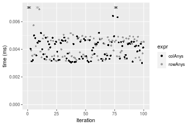
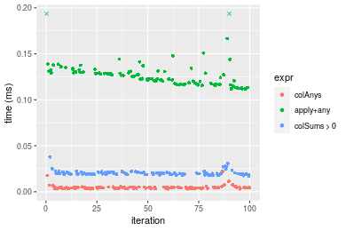
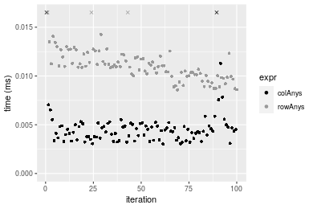
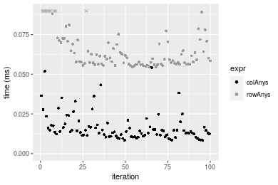
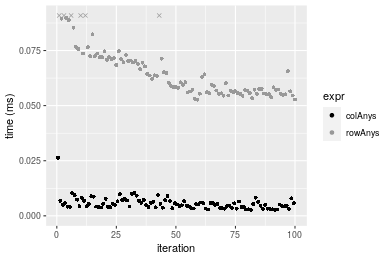

[matrixStats]: Benchmark report

---------------------------------------


# colAnys() and rowAnys() benchmarks

This report benchmark the performance of colAnys() and rowAnys() against alternative methods.

## Alternative methods

* apply() + any()
* colSums() > 0 or rowSums() > 0


## Data
```r
> rmatrix <- function(nrow, ncol, mode = c("logical", "double", "integer", "index"), range = c(-100, 
+     +100), na_prob = 0) {
+     mode <- match.arg(mode)
+     n <- nrow * ncol
+     if (mode == "logical") {
+         x <- sample(c(FALSE, TRUE), size = n, replace = TRUE)
+     }     else if (mode == "index") {
+         x <- seq_len(n)
+         mode <- "integer"
+     }     else {
+         x <- runif(n, min = range[1], max = range[2])
+     }
+     storage.mode(x) <- mode
+     if (na_prob > 0) 
+         x[sample(n, size = na_prob * n)] <- NA
+     dim(x) <- c(nrow, ncol)
+     x
+ }
> rmatrices <- function(scale = 10, seed = 1, ...) {
+     set.seed(seed)
+     data <- list()
+     data[[1]] <- rmatrix(nrow = scale * 1, ncol = scale * 1, ...)
+     data[[2]] <- rmatrix(nrow = scale * 10, ncol = scale * 10, ...)
+     data[[3]] <- rmatrix(nrow = scale * 100, ncol = scale * 1, ...)
+     data[[4]] <- t(data[[3]])
+     data[[5]] <- rmatrix(nrow = scale * 10, ncol = scale * 100, ...)
+     data[[6]] <- t(data[[5]])
+     names(data) <- sapply(data, FUN = function(x) paste(dim(x), collapse = "x"))
+     data
+ }
> data <- rmatrices(mode = "logical")
```

## Results

### 10x10 matrix


```r
> X <- data[["10x10"]]
> gc()
          used  (Mb) gc trigger  (Mb) max used  (Mb)
Ncells 5192340 277.4    7916910 422.9  7916910 422.9
Vcells 9548887  72.9   33191153 253.3 53339345 407.0
> colStats <- microbenchmark(colAnys = colAnys(X), `apply+any` = apply(X, MARGIN = 2L, FUN = any), 
+     `colSums > 0` = (colSums(X) > 0L), unit = "ms")
> X <- t(X)
> gc()
          used  (Mb) gc trigger  (Mb) max used  (Mb)
Ncells 5178649 276.6    7916910 422.9  7916910 422.9
Vcells 9503582  72.6   33191153 253.3 53339345 407.0
> rowStats <- microbenchmark(rowAnys = rowAnys(X), `apply+any` = apply(X, MARGIN = 1L, FUN = any), 
+     `rowSums > 0` = (rowSums(X) > 0L), unit = "ms")
```

_Table: Benchmarking of colAnys(), apply+any() and colSums > 0() on 10x10 data. The top panel shows times in milliseconds and the bottom panel shows relative times._


|   |expr        |      min|        lq|      mean|    median|        uq|      max|
|:--|:-----------|--------:|---------:|---------:|---------:|---------:|--------:|
|1  |colAnys     | 0.003015| 0.0033380| 0.0043223| 0.0042475| 0.0045720| 0.019112|
|3  |colSums > 0 | 0.005908| 0.0063745| 0.0080616| 0.0071145| 0.0079250| 0.054657|
|2  |apply+any   | 0.033156| 0.0347580| 0.0377213| 0.0355990| 0.0368595| 0.084983|


|   |expr        |       min|        lq|     mean|   median|       uq|      max|
|:--|:-----------|---------:|---------:|--------:|--------:|--------:|--------:|
|1  |colAnys     |  1.000000|  1.000000| 1.000000| 1.000000| 1.000000| 1.000000|
|3  |colSums > 0 |  1.959536|  1.909676| 1.865101| 1.674985| 1.733377| 2.859826|
|2  |apply+any   | 10.997015| 10.412822| 8.727058| 8.381165| 8.062008| 4.446578|

_Table: Benchmarking of rowAnys(), apply+any() and rowSums > 0() on 10x10 data (transposed). The top panel shows times in milliseconds and the bottom panel shows relative times._


|   |expr        |      min|        lq|      mean|    median|        uq|      max|
|:--|:-----------|--------:|---------:|---------:|---------:|---------:|--------:|
|1  |rowAnys     | 0.003149| 0.0035075| 0.0044978| 0.0044310| 0.0047810| 0.019036|
|3  |rowSums > 0 | 0.006862| 0.0072455| 0.0086486| 0.0078765| 0.0084835| 0.050237|
|2  |apply+any   | 0.034071| 0.0349290| 0.0370099| 0.0355310| 0.0361085| 0.083324|


|   |expr        |       min|       lq|     mean|   median|       uq|      max|
|:--|:-----------|---------:|--------:|--------:|--------:|--------:|--------:|
|1  |rowAnys     |  1.000000| 1.000000| 1.000000| 1.000000| 1.000000| 1.000000|
|3  |rowSums > 0 |  2.179105| 2.065716| 1.922851| 1.777590| 1.774420| 2.639052|
|2  |apply+any   | 10.819625| 9.958375| 8.228470| 8.018732| 7.552499| 4.377180|

_Figure: Benchmarking of colAnys(), apply+any() and colSums > 0() on 10x10 data  as well as rowAnys(), apply+any() and rowSums > 0() on the same data transposed.  Outliers are displayed as crosses.  Times are in milliseconds._


_Table: Benchmarking of colAnys() and rowAnys() on 10x10 data (original and transposed).  The top panel shows times in milliseconds and the bottom panel shows relative times._


|   |expr    |   min|     lq|    mean| median|    uq|    max|
|:--|:-------|-----:|------:|-------:|------:|-----:|------:|
|1  |colAnys | 3.015| 3.3380| 4.32234| 4.2475| 4.572| 19.112|
|2  |rowAnys | 3.149| 3.5075| 4.49779| 4.4310| 4.781| 19.036|


|   |expr    |      min|       lq|     mean|   median|       uq|       max|
|:--|:-------|--------:|--------:|--------:|--------:|--------:|---------:|
|1  |colAnys | 1.000000| 1.000000| 1.000000| 1.000000| 1.000000| 1.0000000|
|2  |rowAnys | 1.044444| 1.050779| 1.040591| 1.043202| 1.045713| 0.9960234|

_Figure: Benchmarking of colAnys() and rowAnys() on 10x10 data (original and transposed).  Outliers are displayed as crosses. Times are in milliseconds._




### 100x100 matrix


```r
> X <- data[["100x100"]]
> gc()
          used  (Mb) gc trigger  (Mb) max used  (Mb)
Ncells 5177209 276.5    7916910 422.9  7916910 422.9
Vcells 9309779  71.1   33191153 253.3 53339345 407.0
> colStats <- microbenchmark(colAnys = colAnys(X), `apply+any` = apply(X, MARGIN = 2L, FUN = any), 
+     `colSums > 0` = (colSums(X) > 0L), unit = "ms")
> X <- t(X)
> gc()
          used  (Mb) gc trigger  (Mb) max used  (Mb)
Ncells 5177203 276.5    7916910 422.9  7916910 422.9
Vcells 9314822  71.1   33191153 253.3 53339345 407.0
> rowStats <- microbenchmark(rowAnys = rowAnys(X), `apply+any` = apply(X, MARGIN = 1L, FUN = any), 
+     `rowSums > 0` = (rowSums(X) > 0L), unit = "ms")
```

_Table: Benchmarking of colAnys(), apply+any() and colSums > 0() on 100x100 data. The top panel shows times in milliseconds and the bottom panel shows relative times._


|   |expr        |      min|        lq|      mean|    median|        uq|      max|
|:--|:-----------|--------:|---------:|---------:|---------:|---------:|--------:|
|1  |colAnys     | 0.003116| 0.0039975| 0.0053324| 0.0048930| 0.0055855| 0.023137|
|3  |colSums > 0 | 0.015894| 0.0174145| 0.0200416| 0.0187445| 0.0212160| 0.054532|
|2  |apply+any   | 0.193797| 0.2074970| 0.2319392| 0.2248080| 0.2493780| 0.420242|


|   |expr        |      min|        lq|      mean|    median|        uq|       max|
|:--|:-----------|--------:|---------:|---------:|---------:|---------:|---------:|
|1  |colAnys     |  1.00000|  1.000000|  1.000000|  1.000000|  1.000000|  1.000000|
|3  |colSums > 0 |  5.10077|  4.356348|  3.758443|  3.830881|  3.798407|  2.356918|
|2  |apply+any   | 62.19416| 51.906692| 43.496134| 45.944819| 44.647391| 18.163202|

_Table: Benchmarking of rowAnys(), apply+any() and rowSums > 0() on 100x100 data (transposed). The top panel shows times in milliseconds and the bottom panel shows relative times._


|   |expr        |      min|        lq|      mean|   median|        uq|      max|
|:--|:-----------|--------:|---------:|---------:|--------:|---------:|--------:|
|1  |rowAnys     | 0.009437| 0.0112045| 0.0127247| 0.012203| 0.0134225| 0.035027|
|3  |rowSums > 0 | 0.046317| 0.0480945| 0.0542597| 0.053143| 0.0585380| 0.124492|
|2  |apply+any   | 0.193635| 0.2000855| 0.2295396| 0.218877| 0.2494360| 0.410195|


|   |expr        |       min|        lq|      mean|    median|        uq|       max|
|:--|:-----------|---------:|---------:|---------:|---------:|---------:|---------:|
|1  |rowAnys     |  1.000000|  1.000000|  1.000000|  1.000000|  1.000000|  1.000000|
|3  |rowSums > 0 |  4.908022|  4.292427|  4.264129|  4.354913|  4.361185|  3.554172|
|2  |apply+any   | 20.518703| 17.857602| 18.038933| 17.936327| 18.583423| 11.710823|

_Figure: Benchmarking of colAnys(), apply+any() and colSums > 0() on 100x100 data  as well as rowAnys(), apply+any() and rowSums > 0() on the same data transposed.  Outliers are displayed as crosses.  Times are in milliseconds._


_Table: Benchmarking of colAnys() and rowAnys() on 100x100 data (original and transposed).  The top panel shows times in milliseconds and the bottom panel shows relative times._


|   |expr    |   min|      lq|     mean| median|      uq|    max|
|:--|:-------|-----:|-------:|--------:|------:|-------:|------:|
|1  |colAnys | 3.116|  3.9975|  5.33241|  4.893|  5.5855| 23.137|
|2  |rowAnys | 9.437| 11.2045| 12.72468| 12.203| 13.4225| 35.027|


|   |expr    |      min|       lq|     mean|   median|       uq|      max|
|:--|:-------|--------:|--------:|--------:|--------:|--------:|--------:|
|1  |colAnys | 1.000000| 1.000000| 1.000000| 1.000000| 1.000000| 1.000000|
|2  |rowAnys | 3.028562| 2.802877| 2.386291| 2.493971| 2.403097| 1.513896|

_Figure: Benchmarking of colAnys() and rowAnys() on 100x100 data (original and transposed).  Outliers are displayed as crosses. Times are in milliseconds._


### 1000x10 matrix


```r
> X <- data[["1000x10"]]
> gc()
          used  (Mb) gc trigger  (Mb) max used  (Mb)
Ncells 5177959 276.6    7916910 422.9  7916910 422.9
Vcells 9313300  71.1   33191153 253.3 53339345 407.0
> colStats <- microbenchmark(colAnys = colAnys(X), `apply+any` = apply(X, MARGIN = 2L, FUN = any), 
+     `colSums > 0` = (colSums(X) > 0L), unit = "ms")
> X <- t(X)
> gc()
          used  (Mb) gc trigger  (Mb) max used  (Mb)
Ncells 5177953 276.6    7916910 422.9  7916910 422.9
Vcells 9318343  71.1   33191153 253.3 53339345 407.0
> rowStats <- microbenchmark(rowAnys = rowAnys(X), `apply+any` = apply(X, MARGIN = 1L, FUN = any), 
+     `rowSums > 0` = (rowSums(X) > 0L), unit = "ms")
```

_Table: Benchmarking of colAnys(), apply+any() and colSums > 0() on 1000x10 data. The top panel shows times in milliseconds and the bottom panel shows relative times._


|   |expr        |      min|       lq|      mean|    median|        uq|      max|
|:--|:-----------|--------:|--------:|---------:|---------:|---------:|--------:|
|1  |colAnys     | 0.003017| 0.003642| 0.0047623| 0.0043505| 0.0049420| 0.022187|
|3  |colSums > 0 | 0.017179| 0.019061| 0.0204056| 0.0196370| 0.0209315| 0.037863|
|2  |apply+any   | 0.111874| 0.117432| 0.1270182| 0.1254865| 0.1305995| 0.207890|


|   |expr        |       min|        lq|      mean|    median|        uq|      max|
|:--|:-----------|---------:|---------:|---------:|---------:|---------:|--------:|
|1  |colAnys     |  1.000000|  1.000000|  1.000000|  1.000000|  1.000000| 1.000000|
|3  |colSums > 0 |  5.694067|  5.233663|  4.284792|  4.513734|  4.235431| 1.706540|
|2  |apply+any   | 37.081207| 32.243822| 26.671505| 28.844156| 26.426447| 9.369901|

_Table: Benchmarking of rowAnys(), apply+any() and rowSums > 0() on 1000x10 data (transposed). The top panel shows times in milliseconds and the bottom panel shows relative times._


|   |expr        |      min|        lq|      mean|    median|        uq|      max|
|:--|:-----------|--------:|---------:|---------:|---------:|---------:|--------:|
|1  |rowAnys     | 0.008582| 0.0100280| 0.0113144| 0.0109640| 0.0119975| 0.027385|
|2  |apply+any   | 0.096734| 0.1010950| 0.1140153| 0.1101305| 0.1276375| 0.198634|
|3  |rowSums > 0 | 0.167370| 0.1747045| 0.1910449| 0.1875660| 0.2097510| 0.229876|


|   |expr        |      min|       lq|     mean|   median|       uq|      max|
|:--|:-----------|--------:|--------:|--------:|--------:|--------:|--------:|
|1  |rowAnys     |  1.00000|  1.00000|  1.00000|  1.00000|  1.00000| 1.000000|
|2  |apply+any   | 11.27173| 10.08127| 10.07703| 10.04474| 10.63867| 7.253387|
|3  |rowSums > 0 | 19.50245| 17.42167| 16.88514| 17.10744| 17.48289| 8.394230|

_Figure: Benchmarking of colAnys(), apply+any() and colSums > 0() on 1000x10 data  as well as rowAnys(), apply+any() and rowSums > 0() on the same data transposed.  Outliers are displayed as crosses.  Times are in milliseconds._





_Table: Benchmarking of colAnys() and rowAnys() on 1000x10 data (original and transposed).  The top panel shows times in milliseconds and the bottom panel shows relative times._


|   |expr    |   min|     lq|     mean|  median|      uq|    max|
|:--|:-------|-----:|------:|--------:|-------:|-------:|------:|
|1  |colAnys | 3.017|  3.642|  4.76232|  4.3505|  4.9420| 22.187|
|2  |rowAnys | 8.582| 10.028| 11.31438| 10.9640| 11.9975| 27.385|


|   |expr    |      min|       lq|     mean|  median|       uq|      max|
|:--|:-------|--------:|--------:|--------:|-------:|--------:|--------:|
|1  |colAnys | 1.000000| 1.000000| 1.000000| 1.00000| 1.000000| 1.000000|
|2  |rowAnys | 2.844548| 2.753432| 2.375813| 2.52017| 2.427661| 1.234281|

_Figure: Benchmarking of colAnys() and rowAnys() on 1000x10 data (original and transposed).  Outliers are displayed as crosses. Times are in milliseconds._




### 10x1000 matrix


```r
> X <- data[["10x1000"]]
> gc()
          used  (Mb) gc trigger  (Mb) max used  (Mb)
Ncells 5178173 276.6    7916910 422.9  7916910 422.9
Vcells 9314049  71.1   33191153 253.3 53339345 407.0
> colStats <- microbenchmark(colAnys = colAnys(X), `apply+any` = apply(X, MARGIN = 2L, FUN = any), 
+     `colSums > 0` = (colSums(X) > 0L), unit = "ms")
> X <- t(X)
> gc()
          used  (Mb) gc trigger  (Mb) max used  (Mb)
Ncells 5178167 276.6    7916910 422.9  7916910 422.9
Vcells 9319092  71.1   33191153 253.3 53339345 407.0
> rowStats <- microbenchmark(rowAnys = rowAnys(X), `apply+any` = apply(X, MARGIN = 1L, FUN = any), 
+     `rowSums > 0` = (rowSums(X) > 0L), unit = "ms")
```

_Table: Benchmarking of colAnys(), apply+any() and colSums > 0() on 10x1000 data. The top panel shows times in milliseconds and the bottom panel shows relative times._


|   |expr        |      min|        lq|      mean|    median|        uq|      max|
|:--|:-----------|--------:|---------:|---------:|---------:|---------:|--------:|
|1  |colAnys     | 0.007453| 0.0092850| 0.0118857| 0.0106215| 0.0129310| 0.034985|
|3  |colSums > 0 | 0.013042| 0.0147795| 0.0171880| 0.0161970| 0.0188685| 0.039224|
|2  |apply+any   | 0.851302| 0.8912870| 1.0151367| 0.9475960| 1.1103635| 1.456249|


|   |expr        |        min|        lq|      mean|    median|        uq|       max|
|:--|:-----------|----------:|---------:|---------:|---------:|---------:|---------:|
|1  |colAnys     |   1.000000|  1.000000|  1.000000|  1.000000|  1.000000|  1.000000|
|3  |colSums > 0 |   1.749899|  1.591761|  1.446111|  1.524926|  1.459168|  1.121166|
|2  |apply+any   | 114.222729| 95.992138| 85.408528| 89.214894| 85.868340| 41.624954|

_Table: Benchmarking of rowAnys(), apply+any() and rowSums > 0() on 10x1000 data (transposed). The top panel shows times in milliseconds and the bottom panel shows relative times._


|   |expr        |      min|        lq|      mean|    median|        uq|      max|
|:--|:-----------|--------:|---------:|---------:|---------:|---------:|--------:|
|1  |rowAnys     | 0.019350| 0.0236435| 0.0290122| 0.0263760| 0.0318340| 0.068443|
|3  |rowSums > 0 | 0.028014| 0.0312395| 0.0377033| 0.0352885| 0.0407545| 0.124822|
|2  |apply+any   | 0.847844| 0.9052355| 1.0829320| 1.0152130| 1.1993540| 1.783223|


|   |expr        |       min|        lq|      mean|    median|        uq|       max|
|:--|:-----------|---------:|---------:|---------:|---------:|---------:|---------:|
|1  |rowAnys     |  1.000000|  1.000000|  1.000000|  1.000000|  1.000000|  1.000000|
|3  |rowSums > 0 |  1.447752|  1.321272|  1.299569|  1.337902|  1.280219|  1.823737|
|2  |apply+any   | 43.816227| 38.286865| 37.326820| 38.490029| 37.675253| 26.054133|

_Figure: Benchmarking of colAnys(), apply+any() and colSums > 0() on 10x1000 data  as well as rowAnys(), apply+any() and rowSums > 0() on the same data transposed.  Outliers are displayed as crosses.  Times are in milliseconds._


_Table: Benchmarking of colAnys() and rowAnys() on 10x1000 data (original and transposed).  The top panel shows times in milliseconds and the bottom panel shows relative times._


|   |expr    |    min|      lq|     mean|  median|     uq|    max|
|:--|:-------|------:|-------:|--------:|-------:|------:|------:|
|1  |colAnys |  7.453|  9.2850| 11.88566| 10.6215| 12.931| 34.985|
|2  |rowAnys | 19.350| 23.6435| 29.01217| 26.3760| 31.834| 68.443|


|   |expr    |     min|       lq|     mean|   median|       uq|      max|
|:--|:-------|-------:|--------:|--------:|--------:|--------:|--------:|
|1  |colAnys | 1.00000| 1.000000| 1.000000| 1.000000| 1.000000| 1.000000|
|2  |rowAnys | 2.59627| 2.546419| 2.440939| 2.483265| 2.461836| 1.956353|

_Figure: Benchmarking of colAnys() and rowAnys() on 10x1000 data (original and transposed).  Outliers are displayed as crosses. Times are in milliseconds._


### 100x1000 matrix


```r
> X <- data[["100x1000"]]
> gc()
          used  (Mb) gc trigger  (Mb) max used  (Mb)
Ncells 5178381 276.6    7916910 422.9  7916910 422.9
Vcells 9314568  71.1   33191153 253.3 53339345 407.0
> colStats <- microbenchmark(colAnys = colAnys(X), `apply+any` = apply(X, MARGIN = 2L, FUN = any), 
+     `colSums > 0` = (colSums(X) > 0L), unit = "ms")
> X <- t(X)
> gc()
          used  (Mb) gc trigger  (Mb) max used  (Mb)
Ncells 5178369 276.6    7916910 422.9  7916910 422.9
Vcells 9364601  71.5   33191153 253.3 53339345 407.0
> rowStats <- microbenchmark(rowAnys = rowAnys(X), `apply+any` = apply(X, MARGIN = 1L, FUN = any), 
+     `rowSums > 0` = (rowSums(X) > 0L), unit = "ms")
```

_Table: Benchmarking of colAnys(), apply+any() and colSums > 0() on 100x1000 data. The top panel shows times in milliseconds and the bottom panel shows relative times._


|   |expr        |      min|        lq|      mean|    median|        uq|      max|
|:--|:-----------|--------:|---------:|---------:|---------:|---------:|--------:|
|1  |colAnys     | 0.008363| 0.0114285| 0.0166425| 0.0138285| 0.0176545| 0.054207|
|3  |colSums > 0 | 0.080974| 0.0836290| 0.0967549| 0.0930810| 0.1028945| 0.148354|
|2  |apply+any   | 1.348433| 1.3932855| 1.5654713| 1.4423025| 1.6878120| 2.607238|


|   |expr        |        min|         lq|      mean|     median|        uq|       max|
|:--|:-----------|----------:|----------:|---------:|----------:|---------:|---------:|
|1  |colAnys     |   1.000000|   1.000000|  1.000000|   1.000000|  1.000000|  1.000000|
|3  |colSums > 0 |   9.682411|   7.317583|  5.813722|   6.731099|  5.828231|  2.736805|
|2  |apply+any   | 161.237953| 121.913243| 94.064670| 104.299273| 95.602368| 48.097810|

_Table: Benchmarking of rowAnys(), apply+any() and rowSums > 0() on 100x1000 data (transposed). The top panel shows times in milliseconds and the bottom panel shows relative times._


|   |expr        |      min|       lq|      mean|   median|        uq|      max|
|:--|:-----------|--------:|--------:|---------:|--------:|---------:|--------:|
|1  |rowAnys     | 0.054470| 0.056363| 0.0662752| 0.059969| 0.0705985| 0.131714|
|3  |rowSums > 0 | 0.224264| 0.226941| 0.2577230| 0.235087| 0.2797685| 0.415196|
|2  |apply+any   | 1.354361| 1.384301| 1.5227031| 1.418225| 1.5867925| 2.406700|


|   |expr        |       min|        lq|     mean|    median|        uq|       max|
|:--|:-----------|---------:|---------:|--------:|---------:|---------:|---------:|
|1  |rowAnys     |  1.000000|  1.000000|  1.00000|  1.000000|  1.000000|  1.000000|
|3  |rowSums > 0 |  4.117202|  4.026418|  3.88868|  3.920142|  3.962811|  3.152254|
|2  |apply+any   | 24.864347| 24.560456| 22.97546| 23.649310| 22.476292| 18.272165|

_Figure: Benchmarking of colAnys(), apply+any() and colSums > 0() on 100x1000 data  as well as rowAnys(), apply+any() and rowSums > 0() on the same data transposed.  Outliers are displayed as crosses.  Times are in milliseconds._


_Table: Benchmarking of colAnys() and rowAnys() on 100x1000 data (original and transposed).  The top panel shows times in milliseconds and the bottom panel shows relative times._


|   |expr    |    min|      lq|    mean|  median|      uq|     max|
|:--|:-------|------:|-------:|-------:|-------:|-------:|-------:|
|1  |colAnys |  8.363| 11.4285| 16.6425| 13.8285| 17.6545|  54.207|
|2  |rowAnys | 54.470| 56.3630| 66.2752| 59.9690| 70.5985| 131.714|


|   |expr    |      min|       lq|     mean|   median|       uq|      max|
|:--|:-------|--------:|--------:|--------:|--------:|--------:|--------:|
|1  |colAnys | 1.000000| 1.000000| 1.000000| 1.000000| 1.000000| 1.000000|
|2  |rowAnys | 6.513213| 4.931793| 3.982286| 4.336624| 3.998896| 2.429834|

_Figure: Benchmarking of colAnys() and rowAnys() on 100x1000 data (original and transposed).  Outliers are displayed as crosses. Times are in milliseconds._




### 1000x100 matrix


```r
> X <- data[["1000x100"]]
> gc()
          used  (Mb) gc trigger  (Mb) max used  (Mb)
Ncells 5178587 276.6    7916910 422.9  7916910 422.9
Vcells 9315221  71.1   33191153 253.3 53339345 407.0
> colStats <- microbenchmark(colAnys = colAnys(X), `apply+any` = apply(X, MARGIN = 2L, FUN = any), 
+     `colSums > 0` = (colSums(X) > 0L), unit = "ms")
> X <- t(X)
> gc()
          used  (Mb) gc trigger  (Mb) max used  (Mb)
Ncells 5178575 276.6    7916910 422.9  7916910 422.9
Vcells 9365254  71.5   33191153 253.3 53339345 407.0
> rowStats <- microbenchmark(rowAnys = rowAnys(X), `apply+any` = apply(X, MARGIN = 1L, FUN = any), 
+     `rowSums > 0` = (rowSums(X) > 0L), unit = "ms")
```

_Table: Benchmarking of colAnys(), apply+any() and colSums > 0() on 1000x100 data. The top panel shows times in milliseconds and the bottom panel shows relative times._


|   |expr        |      min|        lq|      mean|    median|        uq|      max|
|:--|:-----------|--------:|---------:|---------:|---------:|---------:|--------:|
|1  |colAnys     | 0.002769| 0.0039285| 0.0056187| 0.0050880| 0.0066740| 0.026367|
|3  |colSums > 0 | 0.082616| 0.0849765| 0.1018653| 0.0940155| 0.1148010| 0.167160|
|2  |apply+any   | 0.624251| 0.6449835| 0.7633539| 0.7123450| 0.8540075| 1.186777|


|   |expr        |       min|        lq|      mean|    median|        uq|       max|
|:--|:-----------|---------:|---------:|---------:|---------:|---------:|---------:|
|1  |colAnys     |   1.00000|   1.00000|   1.00000|   1.00000|   1.00000|  1.000000|
|3  |colSums > 0 |  29.83604|  21.63078|  18.12979|  18.47789|  17.20123|  6.339743|
|2  |apply+any   | 225.44276| 164.18060| 135.86026| 140.00491| 127.96037| 45.009937|

_Table: Benchmarking of rowAnys(), apply+any() and rowSums > 0() on 1000x100 data (transposed). The top panel shows times in milliseconds and the bottom panel shows relative times._


|   |expr        |      min|        lq|      mean|    median|        uq|      max|
|:--|:-----------|--------:|---------:|---------:|---------:|---------:|--------:|
|1  |rowAnys     | 0.052694| 0.0560710| 0.0656955| 0.0606060| 0.0714685| 0.114980|
|3  |rowSums > 0 | 0.324020| 0.3257205| 0.3804144| 0.3626460| 0.4216195| 0.541018|
|2  |apply+any   | 0.630176| 0.6376395| 0.7300979| 0.6797115| 0.7868810| 1.176739|


|   |expr        |       min|        lq|      mean|    median|        uq|       max|
|:--|:-----------|---------:|---------:|---------:|---------:|---------:|---------:|
|1  |rowAnys     |  1.000000|  1.000000|  1.000000|  1.000000|  1.000000|  1.000000|
|3  |rowSums > 0 |  6.149087|  5.809072|  5.790572|  5.983665|  5.899375|  4.705323|
|2  |apply+any   | 11.959160| 11.372002| 11.113366| 11.215251| 11.010179| 10.234293|

_Figure: Benchmarking of colAnys(), apply+any() and colSums > 0() on 1000x100 data  as well as rowAnys(), apply+any() and rowSums > 0() on the same data transposed.  Outliers are displayed as crosses.  Times are in milliseconds._


_Table: Benchmarking of colAnys() and rowAnys() on 1000x100 data (original and transposed).  The top panel shows times in milliseconds and the bottom panel shows relative times._


|   |expr    |    min|      lq|     mean| median|      uq|     max|
|:--|:-------|------:|-------:|--------:|------:|-------:|-------:|
|1  |colAnys |  2.769|  3.9285|  5.61867|  5.088|  6.6740|  26.367|
|2  |rowAnys | 52.694| 56.0710| 65.69548| 60.606| 71.4685| 114.980|


|   |expr    |      min|       lq|     mean|   median|      uq|      max|
|:--|:-------|--------:|--------:|--------:|--------:|-------:|--------:|
|1  |colAnys |  1.00000|  1.00000|  1.00000|  1.00000|  1.0000| 1.000000|
|2  |rowAnys | 19.02997| 14.27288| 11.69235| 11.91156| 10.7085| 4.360754|

_Figure: Benchmarking of colAnys() and rowAnys() on 1000x100 data (original and transposed).  Outliers are displayed as crosses. Times are in milliseconds._





## Appendix

### Session information
```r
R version 4.1.1 Patched (2021-08-10 r80727)
Platform: x86_64-pc-linux-gnu (64-bit)
Running under: Ubuntu 18.04.5 LTS

Matrix products: default
BLAS:   /home/hb/software/R-devel/R-4-1-branch/lib/R/lib/libRblas.so
LAPACK: /home/hb/software/R-devel/R-4-1-branch/lib/R/lib/libRlapack.so

locale:
 [1] LC_CTYPE=en_US.UTF-8       LC_NUMERIC=C              
 [3] LC_TIME=en_US.UTF-8        LC_COLLATE=en_US.UTF-8    
 [5] LC_MONETARY=en_US.UTF-8    LC_MESSAGES=en_US.UTF-8   
 [7] LC_PAPER=en_US.UTF-8       LC_NAME=C                 
 [9] LC_ADDRESS=C               LC_TELEPHONE=C            
[11] LC_MEASUREMENT=en_US.UTF-8 LC_IDENTIFICATION=C       

attached base packages:
[1] stats     graphics  grDevices utils     datasets  methods   base     

other attached packages:
[1] microbenchmark_1.4-7   matrixStats_0.60.0     ggplot2_3.3.5         
[4] knitr_1.33             R.devices_2.17.0       R.utils_2.10.1        
[7] R.oo_1.24.0            R.methodsS3_1.8.1-9001 history_0.0.1-9000    

loaded via a namespace (and not attached):
 [1] Biobase_2.52.0          httr_1.4.2              splines_4.1.1          
 [4] bit64_4.0.5             network_1.17.1          assertthat_0.2.1       
 [7] highr_0.9               stats4_4.1.1            blob_1.2.2             
[10] GenomeInfoDbData_1.2.6  robustbase_0.93-8       pillar_1.6.2           
[13] RSQLite_2.2.8           lattice_0.20-44         glue_1.4.2             
[16] digest_0.6.27           XVector_0.32.0          colorspace_2.0-2       
[19] Matrix_1.3-4            XML_3.99-0.7            pkgconfig_2.0.3        
[22] zlibbioc_1.38.0         genefilter_1.74.0       purrr_0.3.4            
[25] ergm_4.1.2              xtable_1.8-4            scales_1.1.1           
[28] tibble_3.1.4            annotate_1.70.0         KEGGREST_1.32.0        
[31] farver_2.1.0            generics_0.1.0          IRanges_2.26.0         
[34] ellipsis_0.3.2          cachem_1.0.6            withr_2.4.2            
[37] BiocGenerics_0.38.0     mime_0.11               survival_3.2-13        
[40] magrittr_2.0.1          crayon_1.4.1            statnet.common_4.5.0   
[43] memoise_2.0.0           laeken_0.5.1            fansi_0.5.0            
[46] R.cache_0.15.0          MASS_7.3-54             R.rsp_0.44.0           
[49] progressr_0.8.0         tools_4.1.1             lifecycle_1.0.0        
[52] S4Vectors_0.30.0        trust_0.1-8             munsell_0.5.0          
[55] tabby_0.0.1-9001        AnnotationDbi_1.54.1    Biostrings_2.60.2      
[58] compiler_4.1.1          GenomeInfoDb_1.28.1     rlang_0.4.11           
[61] grid_4.1.1              RCurl_1.98-1.4          cwhmisc_6.6            
[64] rstudioapi_0.13         rappdirs_0.3.3          startup_0.15.0         
[67] labeling_0.4.2          bitops_1.0-7            base64enc_0.1-3        
[70] boot_1.3-28             gtable_0.3.0            DBI_1.1.1              
[73] markdown_1.1            R6_2.5.1                lpSolveAPI_5.5.2.0-17.7
[76] rle_0.9.2               dplyr_1.0.7             fastmap_1.1.0          
[79] bit_4.0.4               utf8_1.2.2              parallel_4.1.1         
[82] Rcpp_1.0.7              vctrs_0.3.8             png_0.1-7              
[85] DEoptimR_1.0-9          tidyselect_1.1.1        xfun_0.25              
[88] coda_0.19-4            
```
Total processing time was 12.11 secs.


### Reproducibility
To reproduce this report, do:
```r
html <- matrixStats:::benchmark('colAnys')
```

[RSP]: https://cran.r-project.org/package=R.rsp
[matrixStats]: https://cran.r-project.org/package=matrixStats

[StackOverflow:colMins?]: https://stackoverflow.com/questions/13676878 "Stack Overflow: fastest way to get Min from every column in a matrix?"
[StackOverflow:colSds?]: https://stackoverflow.com/questions/17549762 "Stack Overflow: Is there such 'colsd' in R?"
[StackOverflow:rowProds?]: https://stackoverflow.com/questions/20198801/ "Stack Overflow: Row product of matrix and column sum of matrix"

---------------------------------------
Copyright Henrik Bengtsson. Last updated on 2021-08-25 22:11:25 (+0200 UTC). Powered by [RSP].

<script>
 var link = document.createElement('link');
 link.rel = 'icon';
 link.href = "data:image/png;base64,iVBORw0KGgoAAAANSUhEUgAAACAAAAAgCAMAAABEpIrGAAAA21BMVEUAAAAAAP8AAP8AAP8AAP8AAP8AAP8AAP8AAP8AAP8AAP8AAP8AAP8AAP8AAP8AAP8AAP8AAP8AAP8AAP8AAP8AAP8AAP8AAP8AAP8AAP8AAP8AAP8AAP8AAP8AAP8AAP8AAP8AAP8AAP8AAP8AAP8AAP8AAP8AAP8AAP8AAP8BAf4CAv0DA/wdHeIeHuEfH+AgIN8hId4lJdomJtknJ9g+PsE/P8BAQL9yco10dIt1dYp3d4h4eIeVlWqWlmmXl2iYmGeZmWabm2Tn5xjo6Bfp6Rb39wj4+Af//wA2M9hbAAAASXRSTlMAAQIJCgsMJSYnKD4/QGRlZmhpamtsbautrrCxuru8y8zN5ebn6Pn6+///////////////////////////////////////////LsUNcQAAAS9JREFUOI29k21XgkAQhVcFytdSMqMETU26UVqGmpaiFbL//xc1cAhhwVNf6n5i5z67M2dmYOyfJZUqlVLhkKucG7cgmUZTybDz6g0iDeq51PUr37Ds2cy2/C9NeES5puDjxuUk1xnToZsg8pfA3avHQ3lLIi7iWRrkv/OYtkScxBIMgDee0ALoyxHQBJ68JLCjOtQIMIANF7QG9G9fNnHvisCHBVMKgSJgiz7nE+AoBKrAPA3MgepvgR9TSCasrCKH0eB1wBGBFdCO+nAGjMVGPcQb5bd6mQRegN6+1axOs9nGfYcCtfi4NQosdtH7dB+txFIpXQqN1p9B/asRHToyS0jRgpV7nk4nwcq1BJ+x3Gl/v7S9Wmpp/aGquum7w3ZDyrADFYrl8vHBH+ev9AUASW1dmU4h4wAAAABJRU5ErkJggg=="
 document.getElementsByTagName('head')[0].appendChild(link);
</script>


