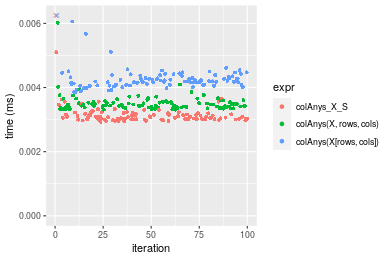
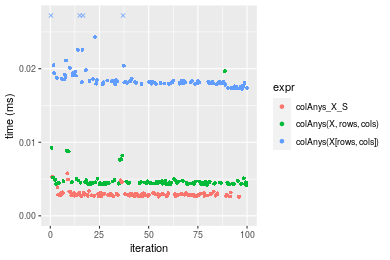
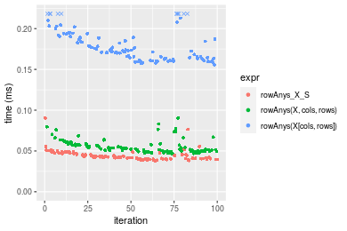
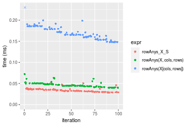

[matrixStats]: Benchmark report

---------------------------------------


# colAnys() and rowAnys() benchmarks  on subsetted computation

This report benchmark the performance of colAnys() and rowAnys() on subsetted computation.


## Data
```r
> rmatrix <- function(nrow, ncol, mode = c("logical", "double", "integer", "index"), range = c(-100, 
+     +100), na_prob = 0) {
+     mode <- match.arg(mode)
+     n <- nrow * ncol
+     if (mode == "logical") {
+         x <- sample(c(FALSE, TRUE), size = n, replace = TRUE)
+     }     else if (mode == "index") {
+         x <- seq_len(n)
+         mode <- "integer"
+     }     else {
+         x <- runif(n, min = range[1], max = range[2])
+     }
+     storage.mode(x) <- mode
+     if (na_prob > 0) 
+         x[sample(n, size = na_prob * n)] <- NA
+     dim(x) <- c(nrow, ncol)
+     x
+ }
> rmatrices <- function(scale = 10, seed = 1, ...) {
+     set.seed(seed)
+     data <- list()
+     data[[1]] <- rmatrix(nrow = scale * 1, ncol = scale * 1, ...)
+     data[[2]] <- rmatrix(nrow = scale * 10, ncol = scale * 10, ...)
+     data[[3]] <- rmatrix(nrow = scale * 100, ncol = scale * 1, ...)
+     data[[4]] <- t(data[[3]])
+     data[[5]] <- rmatrix(nrow = scale * 10, ncol = scale * 100, ...)
+     data[[6]] <- t(data[[5]])
+     names(data) <- sapply(data, FUN = function(x) paste(dim(x), collapse = "x"))
+     data
+ }
> data <- rmatrices(mode = "logical")
```

## Results

### 10x10 matrix


```r
> X <- data[["10x10"]]
> rows <- sample.int(nrow(X), size = nrow(X) * 0.7)
> cols <- sample.int(ncol(X), size = ncol(X) * 0.7)
> X_S <- X[rows, cols]
> gc()
          used  (Mb) gc trigger  (Mb) max used  (Mb)
Ncells 5158865 275.6    7554717 403.5  7554717 403.5
Vcells 9388231  71.7   31793280 242.6 60508962 461.7
> colStats <- microbenchmark(colAnys_X_S = colAnys(X_S), `colAnys(X, rows, cols)` = colAnys(X, rows = rows, 
+     cols = cols), `colAnys(X[rows, cols])` = colAnys(X[rows, cols]), unit = "ms")
> X <- t(X)
> X_S <- t(X_S)
> gc()
          used  (Mb) gc trigger  (Mb) max used  (Mb)
Ncells 5157802 275.5    7554717 403.5  7554717 403.5
Vcells 9385420  71.7   31793280 242.6 60508962 461.7
> rowStats <- microbenchmark(rowAnys_X_S = rowAnys(X_S), `rowAnys(X, cols, rows)` = rowAnys(X, rows = cols, 
+     cols = rows), `rowAnys(X[cols, rows])` = rowAnys(X[cols, rows]), unit = "ms")
```

_Table: Benchmarking of colAnys_X_S(), colAnys(X, rows, cols)() and colAnys(X[rows, cols])() on 10x10 data. The top panel shows times in milliseconds and the bottom panel shows relative times._


|   |expr                   |      min|        lq|      mean|    median|       uq|      max|
|:--|:----------------------|--------:|---------:|---------:|---------:|--------:|--------:|
|1  |colAnys_X_S            | 0.002998| 0.0031020| 0.0034074| 0.0031830| 0.003300| 0.020341|
|2  |colAnys(X, rows, cols) | 0.003331| 0.0034880| 0.0036346| 0.0035745| 0.003684| 0.006377|
|3  |colAnys(X[rows, cols]) | 0.003849| 0.0040725| 0.0043480| 0.0042020| 0.004372| 0.008976|


|   |expr                   |      min|       lq|     mean|   median|       uq|       max|
|:--|:----------------------|--------:|--------:|--------:|--------:|--------:|---------:|
|1  |colAnys_X_S            | 1.000000| 1.000000| 1.000000| 1.000000| 1.000000| 1.0000000|
|2  |colAnys(X, rows, cols) | 1.111074| 1.124436| 1.066679| 1.122997| 1.116364| 0.3135047|
|3  |colAnys(X[rows, cols]) | 1.283856| 1.312863| 1.276063| 1.320138| 1.324849| 0.4412762|

_Table: Benchmarking of rowAnys_X_S(), rowAnys(X, cols, rows)() and rowAnys(X[cols, rows])() on 10x10 data (transposed). The top panel shows times in milliseconds and the bottom panel shows relative times._


|   |expr                   |      min|        lq|      mean|    median|        uq|      max|
|:--|:----------------------|--------:|---------:|---------:|---------:|---------:|--------:|
|1  |rowAnys_X_S            | 0.003015| 0.0030975| 0.0032452| 0.0031890| 0.0033045| 0.005539|
|2  |rowAnys(X, cols, rows) | 0.003391| 0.0035165| 0.0038183| 0.0035875| 0.0036575| 0.022957|
|3  |rowAnys(X[cols, rows]) | 0.003873| 0.0041220| 0.0043415| 0.0042755| 0.0044270| 0.006483|


|   |expr                   |      min|       lq|     mean|   median|       uq|      max|
|:--|:----------------------|--------:|--------:|--------:|--------:|--------:|--------:|
|1  |rowAnys_X_S            | 1.000000| 1.000000| 1.000000| 1.000000| 1.000000| 1.000000|
|2  |rowAnys(X, cols, rows) | 1.124710| 1.135270| 1.176600| 1.124961| 1.106824| 4.144611|
|3  |rowAnys(X[cols, rows]) | 1.284577| 1.330751| 1.337823| 1.340702| 1.339688| 1.170428|

_Figure: Benchmarking of colAnys_X_S(), colAnys(X, rows, cols)() and colAnys(X[rows, cols])() on 10x10 data  as well as rowAnys_X_S(), rowAnys(X, cols, rows)() and rowAnys(X[cols, rows])() on the same data transposed.  Outliers are displayed as crosses.  Times are in milliseconds._





_Table: Benchmarking of colAnys_X_S() and rowAnys_X_S() on 10x10 data (original and transposed).  The top panel shows times in milliseconds and the bottom panel shows relative times._


|   |expr        |   min|     lq|    mean| median|     uq|    max|
|:--|:-----------|-----:|------:|-------:|------:|------:|------:|
|1  |colAnys_X_S | 2.998| 3.1020| 3.40738|  3.183| 3.3000| 20.341|
|2  |rowAnys_X_S | 3.015| 3.0975| 3.24519|  3.189| 3.3045|  5.539|


|   |expr        |     min|        lq|      mean|   median|       uq|       max|
|:--|:-----------|-------:|---------:|---------:|--------:|--------:|---------:|
|1  |colAnys_X_S | 1.00000| 1.0000000| 1.0000000| 1.000000| 1.000000| 1.0000000|
|2  |rowAnys_X_S | 1.00567| 0.9985493| 0.9524004| 1.001885| 1.001364| 0.2723072|

_Figure: Benchmarking of colAnys_X_S() and rowAnys_X_S() on 10x10 data (original and transposed).  Outliers are displayed as crosses. Times are in milliseconds._


### 100x100 matrix


```r
> X <- data[["100x100"]]
> rows <- sample.int(nrow(X), size = nrow(X) * 0.7)
> cols <- sample.int(ncol(X), size = ncol(X) * 0.7)
> X_S <- X[rows, cols]
> gc()
          used  (Mb) gc trigger  (Mb) max used  (Mb)
Ncells 5156288 275.4    7554717 403.5  7554717 403.5
Vcells 9054024  69.1   31793280 242.6 60508962 461.7
> colStats <- microbenchmark(colAnys_X_S = colAnys(X_S), `colAnys(X, rows, cols)` = colAnys(X, rows = rows, 
+     cols = cols), `colAnys(X[rows, cols])` = colAnys(X[rows, cols]), unit = "ms")
> X <- t(X)
> X_S <- t(X_S)
> gc()
          used  (Mb) gc trigger  (Mb) max used  (Mb)
Ncells 5156282 275.4    7554717 403.5  7554717 403.5
Vcells 9059107  69.2   31793280 242.6 60508962 461.7
> rowStats <- microbenchmark(rowAnys_X_S = rowAnys(X_S), `rowAnys(X, cols, rows)` = rowAnys(X, rows = cols, 
+     cols = rows), `rowAnys(X[cols, rows])` = rowAnys(X[cols, rows]), unit = "ms")
```

_Table: Benchmarking of colAnys_X_S(), colAnys(X, rows, cols)() and colAnys(X[rows, cols])() on 100x100 data. The top panel shows times in milliseconds and the bottom panel shows relative times._


|   |expr                   |      min|        lq|      mean|    median|        uq|      max|
|:--|:----------------------|--------:|---------:|---------:|---------:|---------:|--------:|
|1  |colAnys_X_S            | 0.003799| 0.0042130| 0.0044343| 0.0043895| 0.0045845| 0.008736|
|2  |colAnys(X, rows, cols) | 0.004606| 0.0050945| 0.0054938| 0.0052835| 0.0054525| 0.020319|
|3  |colAnys(X[rows, cols]) | 0.018858| 0.0193085| 0.0202304| 0.0200505| 0.0203605| 0.046370|


|   |expr                   |      min|       lq|     mean|   median|       uq|      max|
|:--|:----------------------|--------:|--------:|--------:|--------:|--------:|--------:|
|1  |colAnys_X_S            | 1.000000| 1.000000| 1.000000| 1.000000| 1.000000| 1.000000|
|2  |colAnys(X, rows, cols) | 1.212424| 1.209233| 1.238940| 1.203668| 1.189334| 2.325893|
|3  |colAnys(X[rows, cols]) | 4.963938| 4.583076| 4.562262| 4.567832| 4.441160| 5.307921|

_Table: Benchmarking of rowAnys_X_S(), rowAnys(X, cols, rows)() and rowAnys(X[cols, rows])() on 100x100 data (transposed). The top panel shows times in milliseconds and the bottom panel shows relative times._


|   |expr                   |      min|        lq|      mean|   median|       uq|      max|
|:--|:----------------------|--------:|---------:|---------:|--------:|--------:|--------:|
|1  |rowAnys_X_S            | 0.006552| 0.0069630| 0.0072186| 0.007157| 0.007337| 0.012779|
|2  |rowAnys(X, cols, rows) | 0.008304| 0.0086815| 0.0091693| 0.008901| 0.009083| 0.030003|
|3  |rowAnys(X[cols, rows]) | 0.021427| 0.0223750| 0.0230047| 0.022840| 0.023039| 0.037385|


|   |expr                   |      min|       lq|     mean|   median|       uq|      max|
|:--|:----------------------|--------:|--------:|--------:|--------:|--------:|--------:|
|1  |rowAnys_X_S            | 1.000000| 1.000000| 1.000000| 1.000000| 1.000000| 1.000000|
|2  |rowAnys(X, cols, rows) | 1.267399| 1.246805| 1.270231| 1.243677| 1.237972| 2.347836|
|3  |rowAnys(X[cols, rows]) | 3.270299| 3.213414| 3.186844| 3.191281| 3.140112| 2.925503|

_Figure: Benchmarking of colAnys_X_S(), colAnys(X, rows, cols)() and colAnys(X[rows, cols])() on 100x100 data  as well as rowAnys_X_S(), rowAnys(X, cols, rows)() and rowAnys(X[cols, rows])() on the same data transposed.  Outliers are displayed as crosses.  Times are in milliseconds._


_Table: Benchmarking of colAnys_X_S() and rowAnys_X_S() on 100x100 data (original and transposed).  The top panel shows times in milliseconds and the bottom panel shows relative times._


|   |expr        |   min|    lq|    mean| median|     uq|    max|
|:--|:-----------|-----:|-----:|-------:|------:|------:|------:|
|1  |colAnys_X_S | 3.799| 4.213| 4.43430| 4.3895| 4.5845|  8.736|
|2  |rowAnys_X_S | 6.552| 6.963| 7.21864| 7.1570| 7.3370| 12.779|


|   |expr        |      min|       lq|    mean|   median|       uq|      max|
|:--|:-----------|--------:|--------:|-------:|--------:|--------:|--------:|
|1  |colAnys_X_S | 1.000000| 1.000000| 1.00000| 1.000000| 1.000000| 1.000000|
|2  |rowAnys_X_S | 1.724664| 1.652742| 1.62791| 1.630482| 1.600393| 1.462798|

_Figure: Benchmarking of colAnys_X_S() and rowAnys_X_S() on 100x100 data (original and transposed).  Outliers are displayed as crosses. Times are in milliseconds._


### 1000x10 matrix


```r
> X <- data[["1000x10"]]
> rows <- sample.int(nrow(X), size = nrow(X) * 0.7)
> cols <- sample.int(ncol(X), size = ncol(X) * 0.7)
> X_S <- X[rows, cols]
> gc()
          used  (Mb) gc trigger  (Mb) max used  (Mb)
Ncells 5156488 275.4    7554717 403.5  7554717 403.5
Vcells 9054907  69.1   31793280 242.6 60508962 461.7
> colStats <- microbenchmark(colAnys_X_S = colAnys(X_S), `colAnys(X, rows, cols)` = colAnys(X, rows = rows, 
+     cols = cols), `colAnys(X[rows, cols])` = colAnys(X[rows, cols]), unit = "ms")
> X <- t(X)
> X_S <- t(X_S)
> gc()
          used  (Mb) gc trigger  (Mb) max used  (Mb)
Ncells 5156482 275.4    7554717 403.5  7554717 403.5
Vcells 9059990  69.2   31793280 242.6 60508962 461.7
> rowStats <- microbenchmark(rowAnys_X_S = rowAnys(X_S), `rowAnys(X, cols, rows)` = rowAnys(X, rows = cols, 
+     cols = rows), `rowAnys(X[cols, rows])` = rowAnys(X[cols, rows]), unit = "ms")
```

_Table: Benchmarking of colAnys_X_S(), colAnys(X, rows, cols)() and colAnys(X[rows, cols])() on 1000x10 data. The top panel shows times in milliseconds and the bottom panel shows relative times._


|   |expr                   |      min|        lq|      mean|    median|        uq|      max|
|:--|:----------------------|--------:|---------:|---------:|---------:|---------:|--------:|
|1  |colAnys_X_S            | 0.003039| 0.0032065| 0.0033517| 0.0033135| 0.0034175| 0.005481|
|2  |colAnys(X, rows, cols) | 0.004949| 0.0051145| 0.0052969| 0.0052340| 0.0053750| 0.009481|
|3  |colAnys(X[rows, cols]) | 0.019994| 0.0203640| 0.0214326| 0.0204960| 0.0206505| 0.060757|


|   |expr                   |      min|       lq|     mean|   median|       uq|       max|
|:--|:----------------------|--------:|--------:|--------:|--------:|--------:|---------:|
|1  |colAnys_X_S            | 1.000000| 1.000000| 1.000000| 1.000000| 1.000000|  1.000000|
|2  |colAnys(X, rows, cols) | 1.628496| 1.595041| 1.580382| 1.579599| 1.572787|  1.729794|
|3  |colAnys(X[rows, cols]) | 6.579138| 6.350850| 6.394591| 6.185604| 6.042575| 11.085021|

_Table: Benchmarking of rowAnys_X_S(), rowAnys(X, cols, rows)() and rowAnys(X[cols, rows])() on 1000x10 data (transposed). The top panel shows times in milliseconds and the bottom panel shows relative times._


|   |expr                   |      min|        lq|      mean|    median|        uq|      max|
|:--|:----------------------|--------:|---------:|---------:|---------:|---------:|--------:|
|1  |rowAnys_X_S            | 0.007027| 0.0075775| 0.0080566| 0.0082430| 0.0084015| 0.011508|
|2  |rowAnys(X, cols, rows) | 0.011328| 0.0115030| 0.0116817| 0.0116550| 0.0117620| 0.014870|
|3  |rowAnys(X[cols, rows]) | 0.025173| 0.0262295| 0.0272254| 0.0267715| 0.0269615| 0.076716|


|   |expr                   |      min|       lq|     mean|   median|       uq|      max|
|:--|:----------------------|--------:|--------:|--------:|--------:|--------:|--------:|
|1  |rowAnys_X_S            | 1.000000| 1.000000| 1.000000| 1.000000| 1.000000| 1.000000|
|2  |rowAnys(X, cols, rows) | 1.612068| 1.518047| 1.449957| 1.413927| 1.399988| 1.292145|
|3  |rowAnys(X[cols, rows]) | 3.582325| 3.461498| 3.379275| 3.247786| 3.209129| 6.666319|

_Figure: Benchmarking of colAnys_X_S(), colAnys(X, rows, cols)() and colAnys(X[rows, cols])() on 1000x10 data  as well as rowAnys_X_S(), rowAnys(X, cols, rows)() and rowAnys(X[cols, rows])() on the same data transposed.  Outliers are displayed as crosses.  Times are in milliseconds._





_Table: Benchmarking of colAnys_X_S() and rowAnys_X_S() on 1000x10 data (original and transposed).  The top panel shows times in milliseconds and the bottom panel shows relative times._


|   |expr        |   min|     lq|    mean| median|     uq|    max|
|:--|:-----------|-----:|------:|-------:|------:|------:|------:|
|1  |colAnys_X_S | 3.039| 3.2065| 3.35167| 3.3135| 3.4175|  5.481|
|2  |rowAnys_X_S | 7.027| 7.5775| 8.05659| 8.2430| 8.4015| 11.508|


|   |expr        |      min|       lq|     mean|   median|       uq|      max|
|:--|:-----------|--------:|--------:|--------:|--------:|--------:|--------:|
|1  |colAnys_X_S | 1.000000| 1.000000| 1.000000| 1.000000| 1.000000| 1.000000|
|2  |rowAnys_X_S | 2.312274| 2.363169| 2.403754| 2.487702| 2.458376| 2.099617|

_Figure: Benchmarking of colAnys_X_S() and rowAnys_X_S() on 1000x10 data (original and transposed).  Outliers are displayed as crosses. Times are in milliseconds._


### 10x1000 matrix


```r
> X <- data[["10x1000"]]
> rows <- sample.int(nrow(X), size = nrow(X) * 0.7)
> cols <- sample.int(ncol(X), size = ncol(X) * 0.7)
> X_S <- X[rows, cols]
> gc()
          used  (Mb) gc trigger  (Mb) max used  (Mb)
Ncells 5156693 275.4    7554717 403.5  7554717 403.5
Vcells 9055709  69.1   31793280 242.6 60508962 461.7
> colStats <- microbenchmark(colAnys_X_S = colAnys(X_S), `colAnys(X, rows, cols)` = colAnys(X, rows = rows, 
+     cols = cols), `colAnys(X[rows, cols])` = colAnys(X[rows, cols]), unit = "ms")
> X <- t(X)
> X_S <- t(X_S)
> gc()
          used  (Mb) gc trigger  (Mb) max used  (Mb)
Ncells 5156687 275.4    7554717 403.5  7554717 403.5
Vcells 9060792  69.2   31793280 242.6 60508962 461.7
> rowStats <- microbenchmark(rowAnys_X_S = rowAnys(X_S), `rowAnys(X, cols, rows)` = rowAnys(X, rows = cols, 
+     cols = rows), `rowAnys(X[cols, rows])` = rowAnys(X[cols, rows]), unit = "ms")
```

_Table: Benchmarking of colAnys_X_S(), colAnys(X, rows, cols)() and colAnys(X[rows, cols])() on 10x1000 data. The top panel shows times in milliseconds and the bottom panel shows relative times._


|   |expr                   |      min|        lq|      mean|    median|        uq|      max|
|:--|:----------------------|--------:|---------:|---------:|---------:|---------:|--------:|
|1  |colAnys_X_S            | 0.008778| 0.0093135| 0.0101226| 0.0095395| 0.0099335| 0.035019|
|2  |colAnys(X, rows, cols) | 0.013975| 0.0152800| 0.0164362| 0.0158490| 0.0173325| 0.033647|
|3  |colAnys(X[rows, cols]) | 0.026239| 0.0274865| 0.0281936| 0.0281165| 0.0284350| 0.035558|


|   |expr                   |      min|       lq|     mean|   median|       uq|       max|
|:--|:----------------------|--------:|--------:|--------:|--------:|--------:|---------:|
|1  |colAnys_X_S            | 1.000000| 1.000000| 1.000000| 1.000000| 1.000000| 1.0000000|
|2  |colAnys(X, rows, cols) | 1.592048| 1.640629| 1.623717| 1.661408| 1.744853| 0.9608213|
|3  |colAnys(X[rows, cols]) | 2.989177| 2.951254| 2.785219| 2.947377| 2.862536| 1.0153916|

_Table: Benchmarking of rowAnys_X_S(), rowAnys(X, cols, rows)() and rowAnys(X[cols, rows])() on 10x1000 data (transposed). The top panel shows times in milliseconds and the bottom panel shows relative times._


|   |expr                   |      min|        lq|      mean|    median|        uq|      max|
|:--|:----------------------|--------:|---------:|---------:|---------:|---------:|--------:|
|1  |rowAnys_X_S            | 0.013281| 0.0147710| 0.0164096| 0.0156240| 0.0168420| 0.033003|
|2  |rowAnys(X, cols, rows) | 0.014864| 0.0166375| 0.0191217| 0.0179140| 0.0193545| 0.070285|
|3  |rowAnys(X[cols, rows]) | 0.027340| 0.0294715| 0.0319848| 0.0302565| 0.0319070| 0.053391|


|   |expr                   |      min|       lq|     mean|   median|       uq|      max|
|:--|:----------------------|--------:|--------:|--------:|--------:|--------:|--------:|
|1  |rowAnys_X_S            | 1.000000| 1.000000| 1.000000| 1.000000| 1.000000| 1.000000|
|2  |rowAnys(X, cols, rows) | 1.119193| 1.126362| 1.165278| 1.146569| 1.149181| 2.129655|
|3  |rowAnys(X[cols, rows]) | 2.058580| 1.995227| 1.949158| 1.936540| 1.894490| 1.617762|

_Figure: Benchmarking of colAnys_X_S(), colAnys(X, rows, cols)() and colAnys(X[rows, cols])() on 10x1000 data  as well as rowAnys_X_S(), rowAnys(X, cols, rows)() and rowAnys(X[cols, rows])() on the same data transposed.  Outliers are displayed as crosses.  Times are in milliseconds._


_Table: Benchmarking of colAnys_X_S() and rowAnys_X_S() on 10x1000 data (original and transposed).  The top panel shows times in milliseconds and the bottom panel shows relative times._


|   |expr        |    min|      lq|     mean|  median|      uq|    max|
|:--|:-----------|------:|-------:|--------:|-------:|-------:|------:|
|1  |colAnys_X_S |  8.778|  9.3135| 10.12256|  9.5395|  9.9335| 35.019|
|2  |rowAnys_X_S | 13.281| 14.7710| 16.40956| 15.6240| 16.8420| 33.003|


|   |expr        |      min|       lq|     mean|   median|       uq|       max|
|:--|:-----------|--------:|--------:|--------:|--------:|--------:|---------:|
|1  |colAnys_X_S | 1.000000| 1.000000| 1.000000| 1.000000| 1.000000| 1.0000000|
|2  |rowAnys_X_S | 1.512987| 1.585977| 1.621088| 1.637822| 1.695475| 0.9424313|

_Figure: Benchmarking of colAnys_X_S() and rowAnys_X_S() on 10x1000 data (original and transposed).  Outliers are displayed as crosses. Times are in milliseconds._


### 100x1000 matrix


```r
> X <- data[["100x1000"]]
> rows <- sample.int(nrow(X), size = nrow(X) * 0.7)
> cols <- sample.int(ncol(X), size = ncol(X) * 0.7)
> X_S <- X[rows, cols]
> gc()
          used  (Mb) gc trigger  (Mb) max used  (Mb)
Ncells 5156903 275.5    7554717 403.5  7554717 403.5
Vcells 9078366  69.3   31793280 242.6 60508962 461.7
> colStats <- microbenchmark(colAnys_X_S = colAnys(X_S), `colAnys(X, rows, cols)` = colAnys(X, rows = rows, 
+     cols = cols), `colAnys(X[rows, cols])` = colAnys(X[rows, cols]), unit = "ms")
> X <- t(X)
> X_S <- t(X_S)
> gc()
          used  (Mb) gc trigger  (Mb) max used  (Mb)
Ncells 5156897 275.5    7554717 403.5  7554717 403.5
Vcells 9128449  69.7   31793280 242.6 60508962 461.7
> rowStats <- microbenchmark(rowAnys_X_S = rowAnys(X_S), `rowAnys(X, cols, rows)` = rowAnys(X, rows = cols, 
+     cols = rows), `rowAnys(X[cols, rows])` = rowAnys(X[cols, rows]), unit = "ms")
```

_Table: Benchmarking of colAnys_X_S(), colAnys(X, rows, cols)() and colAnys(X[rows, cols])() on 100x1000 data. The top panel shows times in milliseconds and the bottom panel shows relative times._


|   |expr                   |      min|        lq|      mean|    median|        uq|      max|
|:--|:----------------------|--------:|---------:|---------:|---------:|---------:|--------:|
|1  |colAnys_X_S            | 0.008111| 0.0099860| 0.0115744| 0.0107175| 0.0118285| 0.041195|
|2  |colAnys(X, rows, cols) | 0.015049| 0.0184380| 0.0205620| 0.0196160| 0.0214075| 0.054738|
|3  |colAnys(X[rows, cols]) | 0.127684| 0.1336725| 0.1438526| 0.1430360| 0.1532790| 0.192050|


|   |expr                   |       min|        lq|      mean|    median|        uq|      max|
|:--|:----------------------|---------:|---------:|---------:|---------:|---------:|--------:|
|1  |colAnys_X_S            |  1.000000|  1.000000|  1.000000|  1.000000|  1.000000| 1.000000|
|2  |colAnys(X, rows, cols) |  1.855382|  1.846385|  1.776498|  1.830278|  1.809824| 1.328753|
|3  |colAnys(X[rows, cols]) | 15.742079| 13.385990| 12.428458| 13.346023| 12.958448| 4.661974|

_Table: Benchmarking of rowAnys_X_S(), rowAnys(X, cols, rows)() and rowAnys(X[cols, rows])() on 100x1000 data (transposed). The top panel shows times in milliseconds and the bottom panel shows relative times._


|   |expr                   |      min|        lq|      mean|   median|        uq|      max|
|:--|:----------------------|--------:|---------:|---------:|--------:|---------:|--------:|
|1  |rowAnys_X_S            | 0.037105| 0.0398270| 0.0426561| 0.041146| 0.0440395| 0.086961|
|2  |rowAnys(X, cols, rows) | 0.045214| 0.0477065| 0.0513045| 0.049391| 0.0537340| 0.077951|
|3  |rowAnys(X[cols, rows]) | 0.153615| 0.1580660| 0.1686197| 0.163813| 0.1773910| 0.238341|


|   |expr                   |      min|       lq|     mean|   median|       uq|       max|
|:--|:----------------------|--------:|--------:|--------:|--------:|--------:|---------:|
|1  |rowAnys_X_S            | 1.000000| 1.000000| 1.000000| 1.000000| 1.000000| 1.0000000|
|2  |rowAnys(X, cols, rows) | 1.218542| 1.197843| 1.202746| 1.200384| 1.220132| 0.8963903|
|3  |rowAnys(X[cols, rows]) | 4.140008| 3.968815| 3.952999| 3.981262| 4.027998| 2.7407803|

_Figure: Benchmarking of colAnys_X_S(), colAnys(X, rows, cols)() and colAnys(X[rows, cols])() on 100x1000 data  as well as rowAnys_X_S(), rowAnys(X, cols, rows)() and rowAnys(X[cols, rows])() on the same data transposed.  Outliers are displayed as crosses.  Times are in milliseconds._



_Table: Benchmarking of colAnys_X_S() and rowAnys_X_S() on 100x1000 data (original and transposed).  The top panel shows times in milliseconds and the bottom panel shows relative times._


|   |expr        |    min|     lq|     mean|  median|      uq|    max|
|:--|:-----------|------:|------:|--------:|-------:|-------:|------:|
|1  |colAnys_X_S |  8.111|  9.986| 11.57445| 10.7175| 11.8285| 41.195|
|2  |rowAnys_X_S | 37.105| 39.827| 42.65614| 41.1460| 44.0395| 86.961|


|   |expr        |      min|       lq|     mean|   median|       uq|     max|
|:--|:-----------|--------:|--------:|--------:|--------:|--------:|-------:|
|1  |colAnys_X_S | 1.000000| 1.000000| 1.000000| 1.000000| 1.000000| 1.00000|
|2  |rowAnys_X_S | 4.574652| 3.988284| 3.685371| 3.839142| 3.723169| 2.11096|

_Figure: Benchmarking of colAnys_X_S() and rowAnys_X_S() on 100x1000 data (original and transposed).  Outliers are displayed as crosses. Times are in milliseconds._


### 1000x100 matrix


```r
> X <- data[["1000x100"]]
> rows <- sample.int(nrow(X), size = nrow(X) * 0.7)
> cols <- sample.int(ncol(X), size = ncol(X) * 0.7)
> X_S <- X[rows, cols]
> gc()
          used  (Mb) gc trigger  (Mb) max used  (Mb)
Ncells 5157116 275.5    7554717 403.5  7554717 403.5
Vcells 9079032  69.3   31793280 242.6 60508962 461.7
> colStats <- microbenchmark(colAnys_X_S = colAnys(X_S), `colAnys(X, rows, cols)` = colAnys(X, rows = rows, 
+     cols = cols), `colAnys(X[rows, cols])` = colAnys(X[rows, cols]), unit = "ms")
> X <- t(X)
> X_S <- t(X_S)
> gc()
          used  (Mb) gc trigger  (Mb) max used  (Mb)
Ncells 5157110 275.5    7554717 403.5  7554717 403.5
Vcells 9129115  69.7   31793280 242.6 60508962 461.7
> rowStats <- microbenchmark(rowAnys_X_S = rowAnys(X_S), `rowAnys(X, cols, rows)` = rowAnys(X, rows = cols, 
+     cols = rows), `rowAnys(X[cols, rows])` = rowAnys(X[cols, rows]), unit = "ms")
```

_Table: Benchmarking of colAnys_X_S(), colAnys(X, rows, cols)() and colAnys(X[rows, cols])() on 1000x100 data. The top panel shows times in milliseconds and the bottom panel shows relative times._


|   |expr                   |      min|        lq|      mean|    median|        uq|      max|
|:--|:----------------------|--------:|---------:|---------:|---------:|---------:|--------:|
|1  |colAnys_X_S            | 0.003215| 0.0040155| 0.0045967| 0.0043005| 0.0046885| 0.022176|
|2  |colAnys(X, rows, cols) | 0.005289| 0.0060035| 0.0065405| 0.0063305| 0.0067520| 0.014567|
|3  |colAnys(X[rows, cols]) | 0.122559| 0.1316035| 0.1385168| 0.1370505| 0.1433555| 0.209400|


|   |expr                   |       min|        lq|      mean|    median|        uq|       max|
|:--|:----------------------|---------:|---------:|---------:|---------:|---------:|---------:|
|1  |colAnys_X_S            |  1.000000|  1.000000|  1.000000|  1.000000|  1.000000| 1.0000000|
|2  |colAnys(X, rows, cols) |  1.645101|  1.495082|  1.422862|  1.472038|  1.440119| 0.6568813|
|3  |colAnys(X[rows, cols]) | 38.120995| 32.773876| 30.133964| 31.868504| 30.575984| 9.4426407|

_Table: Benchmarking of rowAnys_X_S(), rowAnys(X, cols, rows)() and rowAnys(X[cols, rows])() on 1000x100 data (transposed). The top panel shows times in milliseconds and the bottom panel shows relative times._


|   |expr                   |      min|        lq|      mean|    median|       uq|      max|
|:--|:----------------------|--------:|---------:|---------:|---------:|--------:|--------:|
|1  |rowAnys_X_S            | 0.027816| 0.0291615| 0.0311265| 0.0305630| 0.032717| 0.037046|
|2  |rowAnys(X, cols, rows) | 0.038564| 0.0406780| 0.0437957| 0.0428335| 0.045090| 0.085672|
|3  |rowAnys(X[cols, rows]) | 0.143608| 0.1485540| 0.1596769| 0.1542280| 0.171294| 0.249194|


|   |expr                   |      min|       lq|     mean|   median|       uq|      max|
|:--|:----------------------|--------:|--------:|--------:|--------:|--------:|--------:|
|1  |rowAnys_X_S            | 1.000000| 1.000000| 1.000000| 1.000000| 1.000000| 1.000000|
|2  |rowAnys(X, cols, rows) | 1.386396| 1.394921| 1.407020| 1.401482| 1.378183| 2.312584|
|3  |rowAnys(X[cols, rows]) | 5.162784| 5.094182| 5.129928| 5.046232| 5.235627| 6.726610|

_Figure: Benchmarking of colAnys_X_S(), colAnys(X, rows, cols)() and colAnys(X[rows, cols])() on 1000x100 data  as well as rowAnys_X_S(), rowAnys(X, cols, rows)() and rowAnys(X[cols, rows])() on the same data transposed.  Outliers are displayed as crosses.  Times are in milliseconds._



_Table: Benchmarking of colAnys_X_S() and rowAnys_X_S() on 1000x100 data (original and transposed).  The top panel shows times in milliseconds and the bottom panel shows relative times._


|   |expr        |    min|      lq|     mean|  median|      uq|    max|
|:--|:-----------|------:|-------:|--------:|-------:|-------:|------:|
|1  |colAnys_X_S |  3.215|  4.0155|  4.59670|  4.3005|  4.6885| 22.176|
|2  |rowAnys_X_S | 27.816| 29.1615| 31.12653| 30.5630| 32.7170| 37.046|


|   |expr        |      min|       lq|     mean|   median|       uq|      max|
|:--|:-----------|--------:|--------:|--------:|--------:|--------:|--------:|
|1  |colAnys_X_S | 1.000000| 1.000000| 1.000000| 1.000000| 1.000000| 1.000000|
|2  |rowAnys_X_S | 8.651944| 7.262234| 6.771495| 7.106848| 6.978138| 1.670545|

_Figure: Benchmarking of colAnys_X_S() and rowAnys_X_S() on 1000x100 data (original and transposed).  Outliers are displayed as crosses. Times are in milliseconds._


## Appendix

### Session information
```r
R version 4.1.1 Patched (2021-08-10 r80727)
Platform: x86_64-pc-linux-gnu (64-bit)
Running under: Ubuntu 18.04.5 LTS

Matrix products: default
BLAS:   /home/hb/software/R-devel/R-4-1-branch/lib/R/lib/libRblas.so
LAPACK: /home/hb/software/R-devel/R-4-1-branch/lib/R/lib/libRlapack.so

locale:
 [1] LC_CTYPE=en_US.UTF-8       LC_NUMERIC=C              
 [3] LC_TIME=en_US.UTF-8        LC_COLLATE=en_US.UTF-8    
 [5] LC_MONETARY=en_US.UTF-8    LC_MESSAGES=en_US.UTF-8   
 [7] LC_PAPER=en_US.UTF-8       LC_NAME=C                 
 [9] LC_ADDRESS=C               LC_TELEPHONE=C            
[11] LC_MEASUREMENT=en_US.UTF-8 LC_IDENTIFICATION=C       

attached base packages:
[1] stats     graphics  grDevices utils     datasets  methods   base     

other attached packages:
[1] microbenchmark_1.4-7   matrixStats_0.60.0     ggplot2_3.3.5         
[4] knitr_1.33             R.devices_2.17.0       R.utils_2.10.1        
[7] R.oo_1.24.0            R.methodsS3_1.8.1-9001

loaded via a namespace (and not attached):
 [1] Biobase_2.52.0          httr_1.4.2              splines_4.1.1          
 [4] bit64_4.0.5             network_1.17.1          assertthat_0.2.1       
 [7] highr_0.9               stats4_4.1.1            blob_1.2.2             
[10] GenomeInfoDbData_1.2.6  robustbase_0.93-8       pillar_1.6.2           
[13] RSQLite_2.2.8           lattice_0.20-44         glue_1.4.2             
[16] digest_0.6.27           XVector_0.32.0          colorspace_2.0-2       
[19] Matrix_1.3-4            XML_3.99-0.7            pkgconfig_2.0.3        
[22] zlibbioc_1.38.0         genefilter_1.74.0       purrr_0.3.4            
[25] ergm_4.1.2              xtable_1.8-4            scales_1.1.1           
[28] tibble_3.1.4            annotate_1.70.0         KEGGREST_1.32.0        
[31] farver_2.1.0            generics_0.1.0          IRanges_2.26.0         
[34] ellipsis_0.3.2          cachem_1.0.6            withr_2.4.2            
[37] BiocGenerics_0.38.0     mime_0.11               survival_3.2-13        
[40] magrittr_2.0.1          crayon_1.4.1            statnet.common_4.5.0   
[43] memoise_2.0.0           laeken_0.5.1            fansi_0.5.0            
[46] R.cache_0.15.0          MASS_7.3-54             R.rsp_0.44.0           
[49] tools_4.1.1             lifecycle_1.0.0         S4Vectors_0.30.0       
[52] trust_0.1-8             munsell_0.5.0           AnnotationDbi_1.54.1   
[55] Biostrings_2.60.2       compiler_4.1.1          GenomeInfoDb_1.28.1    
[58] rlang_0.4.11            grid_4.1.1              RCurl_1.98-1.4         
[61] cwhmisc_6.6             rappdirs_0.3.3          labeling_0.4.2         
[64] bitops_1.0-7            base64enc_0.1-3         boot_1.3-28            
[67] gtable_0.3.0            DBI_1.1.1               markdown_1.1           
[70] R6_2.5.1                lpSolveAPI_5.5.2.0-17.7 rle_0.9.2              
[73] dplyr_1.0.7             fastmap_1.1.0           bit_4.0.4              
[76] utf8_1.2.2              parallel_4.1.1          Rcpp_1.0.7             
[79] vctrs_0.3.8             png_0.1-7               DEoptimR_1.0-9         
[82] tidyselect_1.1.1        xfun_0.25               coda_0.19-4            
```
Total processing time was 10.73 secs.


### Reproducibility
To reproduce this report, do:
```r
html <- matrixStats:::benchmark('colRowAnys_subset')
```

[RSP]: https://cran.r-project.org/package=R.rsp
[matrixStats]: https://cran.r-project.org/package=matrixStats

[StackOverflow:colMins?]: https://stackoverflow.com/questions/13676878 "Stack Overflow: fastest way to get Min from every column in a matrix?"
[StackOverflow:colSds?]: https://stackoverflow.com/questions/17549762 "Stack Overflow: Is there such 'colsd' in R?"
[StackOverflow:rowProds?]: https://stackoverflow.com/questions/20198801/ "Stack Overflow: Row product of matrix and column sum of matrix"

---------------------------------------
Copyright Dongcan Jiang. Last updated on 2021-08-25 17:35:31 (+0200 UTC). Powered by [RSP].

<script>
 var link = document.createElement('link');
 link.rel = 'icon';
 link.href = "data:image/png;base64,iVBORw0KGgoAAAANSUhEUgAAACAAAAAgCAMAAABEpIrGAAAA21BMVEUAAAAAAP8AAP8AAP8AAP8AAP8AAP8AAP8AAP8AAP8AAP8AAP8AAP8AAP8AAP8AAP8AAP8AAP8AAP8AAP8AAP8AAP8AAP8AAP8AAP8AAP8AAP8AAP8AAP8AAP8AAP8AAP8AAP8AAP8AAP8AAP8AAP8AAP8AAP8AAP8AAP8AAP8BAf4CAv0DA/wdHeIeHuEfH+AgIN8hId4lJdomJtknJ9g+PsE/P8BAQL9yco10dIt1dYp3d4h4eIeVlWqWlmmXl2iYmGeZmWabm2Tn5xjo6Bfp6Rb39wj4+Af//wA2M9hbAAAASXRSTlMAAQIJCgsMJSYnKD4/QGRlZmhpamtsbautrrCxuru8y8zN5ebn6Pn6+///////////////////////////////////////////LsUNcQAAAS9JREFUOI29k21XgkAQhVcFytdSMqMETU26UVqGmpaiFbL//xc1cAhhwVNf6n5i5z67M2dmYOyfJZUqlVLhkKucG7cgmUZTybDz6g0iDeq51PUr37Ds2cy2/C9NeES5puDjxuUk1xnToZsg8pfA3avHQ3lLIi7iWRrkv/OYtkScxBIMgDee0ALoyxHQBJ68JLCjOtQIMIANF7QG9G9fNnHvisCHBVMKgSJgiz7nE+AoBKrAPA3MgepvgR9TSCasrCKH0eB1wBGBFdCO+nAGjMVGPcQb5bd6mQRegN6+1axOs9nGfYcCtfi4NQosdtH7dB+txFIpXQqN1p9B/asRHToyS0jRgpV7nk4nwcq1BJ+x3Gl/v7S9Wmpp/aGquum7w3ZDyrADFYrl8vHBH+ev9AUASW1dmU4h4wAAAABJRU5ErkJggg=="
 document.getElementsByTagName('head')[0].appendChild(link);
</script>


