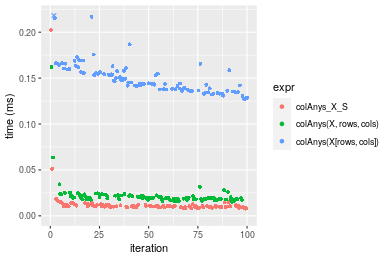
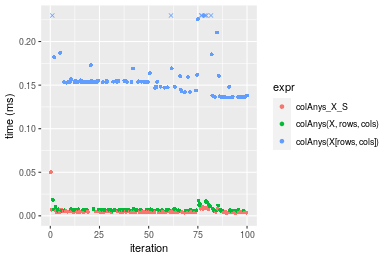

[matrixStats]: Benchmark report

---------------------------------------


# colAnys() and rowAnys() benchmarks  on subsetted computation

This report benchmark the performance of colAnys() and rowAnys() on subsetted computation.


## Data
```r
> rmatrix <- function(nrow, ncol, mode = c("logical", "double", "integer", "index"), range = c(-100, 
+     +100), na_prob = 0) {
+     mode <- match.arg(mode)
+     n <- nrow * ncol
+     if (mode == "logical") {
+         x <- sample(c(FALSE, TRUE), size = n, replace = TRUE)
+     }     else if (mode == "index") {
+         x <- seq_len(n)
+         mode <- "integer"
+     }     else {
+         x <- runif(n, min = range[1], max = range[2])
+     }
+     storage.mode(x) <- mode
+     if (na_prob > 0) 
+         x[sample(n, size = na_prob * n)] <- NA
+     dim(x) <- c(nrow, ncol)
+     x
+ }
> rmatrices <- function(scale = 10, seed = 1, ...) {
+     set.seed(seed)
+     data <- list()
+     data[[1]] <- rmatrix(nrow = scale * 1, ncol = scale * 1, ...)
+     data[[2]] <- rmatrix(nrow = scale * 10, ncol = scale * 10, ...)
+     data[[3]] <- rmatrix(nrow = scale * 100, ncol = scale * 1, ...)
+     data[[4]] <- t(data[[3]])
+     data[[5]] <- rmatrix(nrow = scale * 10, ncol = scale * 100, ...)
+     data[[6]] <- t(data[[5]])
+     names(data) <- sapply(data, FUN = function(x) paste(dim(x), collapse = "x"))
+     data
+ }
> data <- rmatrices(mode = "logical")
```

## Results

### 10x10 matrix


```r
> X <- data[["10x10"]]
> rows <- sample.int(nrow(X), size = nrow(X) * 0.7)
> cols <- sample.int(ncol(X), size = ncol(X) * 0.7)
> X_S <- X[rows, cols]
> gc()
          used  (Mb) gc trigger  (Mb) max used  (Mb)
Ncells 5188684 277.2    7916910 422.9  7916910 422.9
Vcells 9660610  73.8   33191153 253.3 53339345 407.0
> colStats <- microbenchmark(colAnys_X_S = colAnys(X_S), `colAnys(X, rows, cols)` = colAnys(X, rows = rows, 
+     cols = cols), `colAnys(X[rows, cols])` = colAnys(X[rows, cols]), unit = "ms")
> X <- t(X)
> X_S <- t(X_S)
> gc()
          used  (Mb) gc trigger  (Mb) max used  (Mb)
Ncells 5176211 276.5    7916910 422.9  7916910 422.9
Vcells 9619437  73.4   33191153 253.3 53339345 407.0
> rowStats <- microbenchmark(rowAnys_X_S = rowAnys(X_S), `rowAnys(X, cols, rows)` = rowAnys(X, rows = cols, 
+     cols = rows), `rowAnys(X[cols, rows])` = rowAnys(X[cols, rows]), unit = "ms")
```

_Table: Benchmarking of colAnys_X_S(), colAnys(X, rows, cols)() and colAnys(X[rows, cols])() on 10x10 data. The top panel shows times in milliseconds and the bottom panel shows relative times._


|   |expr                   |      min|        lq|      mean|    median|        uq|      max|
|:--|:----------------------|--------:|---------:|---------:|---------:|---------:|--------:|
|1  |colAnys_X_S            | 0.002930| 0.0030130| 0.0034933| 0.0030805| 0.0031920| 0.038657|
|2  |colAnys(X, rows, cols) | 0.003307| 0.0033805| 0.0035147| 0.0034485| 0.0035475| 0.006015|
|3  |colAnys(X[rows, cols]) | 0.003863| 0.0040900| 0.0043063| 0.0041940| 0.0043575| 0.009443|


|   |expr                   |      min|       lq|     mean|   median|       uq|       max|
|:--|:----------------------|--------:|--------:|--------:|--------:|--------:|---------:|
|1  |colAnys_X_S            | 1.000000| 1.000000| 1.000000| 1.000000| 1.000000| 1.0000000|
|2  |colAnys(X, rows, cols) | 1.128669| 1.121971| 1.006120| 1.119461| 1.111372| 0.1555992|
|3  |colAnys(X[rows, cols]) | 1.318430| 1.357451| 1.232746| 1.361467| 1.365132| 0.2442766|

_Table: Benchmarking of rowAnys_X_S(), rowAnys(X, cols, rows)() and rowAnys(X[cols, rows])() on 10x10 data (transposed). The top panel shows times in milliseconds and the bottom panel shows relative times._


|   |expr                   |      min|        lq|      mean|    median|        uq|      max|
|:--|:----------------------|--------:|---------:|---------:|---------:|---------:|--------:|
|1  |rowAnys_X_S            | 0.003047| 0.0031180| 0.0032598| 0.0032035| 0.0033160| 0.005813|
|2  |rowAnys(X, cols, rows) | 0.003389| 0.0034930| 0.0038184| 0.0035510| 0.0036435| 0.025154|
|3  |rowAnys(X[cols, rows]) | 0.003917| 0.0041905| 0.0045482| 0.0043165| 0.0044505| 0.019656|


|   |expr                   |      min|       lq|     mean|   median|       uq|      max|
|:--|:----------------------|--------:|--------:|--------:|--------:|--------:|--------:|
|1  |rowAnys_X_S            | 1.000000| 1.000000| 1.000000| 1.000000| 1.000000| 1.000000|
|2  |rowAnys(X, cols, rows) | 1.112242| 1.120269| 1.171372| 1.108475| 1.098764| 4.327198|
|3  |rowAnys(X[cols, rows]) | 1.285527| 1.343970| 1.395259| 1.347433| 1.342129| 3.381387|

_Figure: Benchmarking of colAnys_X_S(), colAnys(X, rows, cols)() and colAnys(X[rows, cols])() on 10x10 data  as well as rowAnys_X_S(), rowAnys(X, cols, rows)() and rowAnys(X[cols, rows])() on the same data transposed.  Outliers are displayed as crosses.  Times are in milliseconds._


_Table: Benchmarking of colAnys_X_S() and rowAnys_X_S() on 10x10 data (original and transposed).  The top panel shows times in milliseconds and the bottom panel shows relative times._


|   |expr        |   min|    lq|    mean| median|    uq|    max|
|:--|:-----------|-----:|-----:|-------:|------:|-----:|------:|
|1  |colAnys_X_S | 2.930| 3.013| 3.49329| 3.0805| 3.192| 38.657|
|2  |rowAnys_X_S | 3.047| 3.118| 3.25976| 3.2035| 3.316|  5.813|


|   |expr        |      min|       lq|     mean|   median|       uq|       max|
|:--|:-----------|--------:|--------:|--------:|--------:|--------:|---------:|
|1  |colAnys_X_S | 1.000000| 1.000000| 1.000000| 1.000000| 1.000000| 1.0000000|
|2  |rowAnys_X_S | 1.039932| 1.034849| 0.933149| 1.039929| 1.038847| 0.1503738|

_Figure: Benchmarking of colAnys_X_S() and rowAnys_X_S() on 10x10 data (original and transposed).  Outliers are displayed as crosses. Times are in milliseconds._


### 100x100 matrix


```r
> X <- data[["100x100"]]
> rows <- sample.int(nrow(X), size = nrow(X) * 0.7)
> cols <- sample.int(ncol(X), size = ncol(X) * 0.7)
> X_S <- X[rows, cols]
> gc()
          used  (Mb) gc trigger  (Mb) max used  (Mb)
Ncells 5174714 276.4    7916910 422.9  7916910 422.9
Vcells 9287535  70.9   33191153 253.3 53339345 407.0
> colStats <- microbenchmark(colAnys_X_S = colAnys(X_S), `colAnys(X, rows, cols)` = colAnys(X, rows = rows, 
+     cols = cols), `colAnys(X[rows, cols])` = colAnys(X[rows, cols]), unit = "ms")
> X <- t(X)
> X_S <- t(X_S)
> gc()
          used  (Mb) gc trigger  (Mb) max used  (Mb)
Ncells 5174708 276.4    7916910 422.9  7916910 422.9
Vcells 9292618  70.9   33191153 253.3 53339345 407.0
> rowStats <- microbenchmark(rowAnys_X_S = rowAnys(X_S), `rowAnys(X, cols, rows)` = rowAnys(X, rows = cols, 
+     cols = rows), `rowAnys(X[cols, rows])` = rowAnys(X[cols, rows]), unit = "ms")
```

_Table: Benchmarking of colAnys_X_S(), colAnys(X, rows, cols)() and colAnys(X[rows, cols])() on 100x100 data. The top panel shows times in milliseconds and the bottom panel shows relative times._


|   |expr                   |      min|        lq|      mean|    median|        uq|      max|
|:--|:----------------------|--------:|---------:|---------:|---------:|---------:|--------:|
|1  |colAnys_X_S            | 0.003573| 0.0042250| 0.0043878| 0.0043140| 0.0044845| 0.009324|
|2  |colAnys(X, rows, cols) | 0.004632| 0.0050145| 0.0052862| 0.0051615| 0.0054005| 0.010560|
|3  |colAnys(X[rows, cols]) | 0.019930| 0.0205055| 0.0211904| 0.0206595| 0.0208530| 0.055832|


|   |expr                   |      min|       lq|     mean|   median|       uq|      max|
|:--|:----------------------|--------:|--------:|--------:|--------:|--------:|--------:|
|1  |colAnys_X_S            | 1.000000| 1.000000| 1.000000| 1.000000| 1.000000| 1.000000|
|2  |colAnys(X, rows, cols) | 1.296390| 1.186864| 1.204764| 1.196453| 1.204259| 1.132561|
|3  |colAnys(X[rows, cols]) | 5.577946| 4.853373| 4.829419| 4.788943| 4.650017| 5.987988|

_Table: Benchmarking of rowAnys_X_S(), rowAnys(X, cols, rows)() and rowAnys(X[cols, rows])() on 100x100 data (transposed). The top panel shows times in milliseconds and the bottom panel shows relative times._


|   |expr                   |      min|        lq|      mean|    median|        uq|      max|
|:--|:----------------------|--------:|---------:|---------:|---------:|---------:|--------:|
|1  |rowAnys_X_S            | 0.006843| 0.0071765| 0.0074067| 0.0073050| 0.0075390| 0.012472|
|2  |rowAnys(X, cols, rows) | 0.008635| 0.0089120| 0.0093772| 0.0091115| 0.0093270| 0.029578|
|3  |rowAnys(X[cols, rows]) | 0.022994| 0.0235035| 0.0239004| 0.0236860| 0.0239135| 0.034484|


|   |expr                   |      min|       lq|     mean|   median|       uq|      max|
|:--|:----------------------|--------:|--------:|--------:|--------:|--------:|--------:|
|1  |rowAnys_X_S            | 1.000000| 1.000000| 1.000000| 1.000000| 1.000000| 1.000000|
|2  |rowAnys(X, cols, rows) | 1.261873| 1.241831| 1.266055| 1.247296| 1.237167| 2.371552|
|3  |rowAnys(X[cols, rows]) | 3.360222| 3.275064| 3.226886| 3.242437| 3.171972| 2.764913|

_Figure: Benchmarking of colAnys_X_S(), colAnys(X, rows, cols)() and colAnys(X[rows, cols])() on 100x100 data  as well as rowAnys_X_S(), rowAnys(X, cols, rows)() and rowAnys(X[cols, rows])() on the same data transposed.  Outliers are displayed as crosses.  Times are in milliseconds._


_Table: Benchmarking of colAnys_X_S() and rowAnys_X_S() on 100x100 data (original and transposed).  The top panel shows times in milliseconds and the bottom panel shows relative times._


|   |expr        |   min|     lq|    mean| median|     uq|    max|
|:--|:-----------|-----:|------:|-------:|------:|------:|------:|
|1  |colAnys_X_S | 3.573| 4.2250| 4.38778|  4.314| 4.4845|  9.324|
|2  |rowAnys_X_S | 6.843| 7.1765| 7.40666|  7.305| 7.5390| 12.472|


|   |expr        |      min|      lq|    mean|   median|       uq|      max|
|:--|:-----------|--------:|-------:|-------:|--------:|--------:|--------:|
|1  |colAnys_X_S | 1.000000| 1.00000| 1.00000| 1.000000| 1.000000| 1.000000|
|2  |rowAnys_X_S | 1.915197| 1.69858| 1.68802| 1.693324| 1.681124| 1.337623|

_Figure: Benchmarking of colAnys_X_S() and rowAnys_X_S() on 100x100 data (original and transposed).  Outliers are displayed as crosses. Times are in milliseconds._


### 1000x10 matrix


```r
> X <- data[["1000x10"]]
> rows <- sample.int(nrow(X), size = nrow(X) * 0.7)
> cols <- sample.int(ncol(X), size = ncol(X) * 0.7)
> X_S <- X[rows, cols]
> gc()
          used  (Mb) gc trigger  (Mb) max used  (Mb)
Ncells 5175456 276.4    7916910 422.9  7916910 422.9
Vcells 9291597  70.9   33191153 253.3 53339345 407.0
> colStats <- microbenchmark(colAnys_X_S = colAnys(X_S), `colAnys(X, rows, cols)` = colAnys(X, rows = rows, 
+     cols = cols), `colAnys(X[rows, cols])` = colAnys(X[rows, cols]), unit = "ms")
> X <- t(X)
> X_S <- t(X_S)
> gc()
          used  (Mb) gc trigger  (Mb) max used  (Mb)
Ncells 5175450 276.4    7916910 422.9  7916910 422.9
Vcells 9296680  71.0   33191153 253.3 53339345 407.0
> rowStats <- microbenchmark(rowAnys_X_S = rowAnys(X_S), `rowAnys(X, cols, rows)` = rowAnys(X, rows = cols, 
+     cols = rows), `rowAnys(X[cols, rows])` = rowAnys(X[cols, rows]), unit = "ms")
```

_Table: Benchmarking of colAnys_X_S(), colAnys(X, rows, cols)() and colAnys(X[rows, cols])() on 1000x10 data. The top panel shows times in milliseconds and the bottom panel shows relative times._


|   |expr                   |      min|        lq|      mean|    median|        uq|      max|
|:--|:----------------------|--------:|---------:|---------:|---------:|---------:|--------:|
|1  |colAnys_X_S            | 0.002564| 0.0027485| 0.0029968| 0.0028745| 0.0030155| 0.005786|
|2  |colAnys(X, rows, cols) | 0.004184| 0.0043735| 0.0049011| 0.0045010| 0.0046745| 0.019652|
|3  |colAnys(X[rows, cols]) | 0.017284| 0.0179775| 0.0193245| 0.0181460| 0.0184340| 0.067742|


|   |expr                   |      min|       lq|     mean|   median|       uq|       max|
|:--|:----------------------|--------:|--------:|--------:|--------:|--------:|---------:|
|1  |colAnys_X_S            | 1.000000| 1.000000| 1.000000| 1.000000| 1.000000|  1.000000|
|2  |colAnys(X, rows, cols) | 1.631825| 1.591232| 1.635461| 1.565837| 1.550158|  3.396474|
|3  |colAnys(X[rows, cols]) | 6.741030| 6.540840| 6.448456| 6.312750| 6.113082| 11.707916|

_Table: Benchmarking of rowAnys_X_S(), rowAnys(X, cols, rows)() and rowAnys(X[cols, rows])() on 1000x10 data (transposed). The top panel shows times in milliseconds and the bottom panel shows relative times._


|   |expr                   |      min|        lq|      mean|    median|        uq|      max|
|:--|:----------------------|--------:|---------:|---------:|---------:|---------:|--------:|
|1  |rowAnys_X_S            | 0.006749| 0.0074610| 0.0076552| 0.0075905| 0.0077825| 0.010647|
|2  |rowAnys(X, cols, rows) | 0.010388| 0.0105925| 0.0109814| 0.0107090| 0.0109270| 0.025281|
|3  |rowAnys(X[cols, rows]) | 0.023532| 0.0244635| 0.0251698| 0.0247120| 0.0249720| 0.058241|


|   |expr                   |      min|       lq|     mean|   median|       uq|      max|
|:--|:----------------------|--------:|--------:|--------:|--------:|--------:|--------:|
|1  |rowAnys_X_S            | 1.000000| 1.000000| 1.000000| 1.000000| 1.000000| 1.000000|
|2  |rowAnys(X, cols, rows) | 1.539191| 1.419716| 1.434502| 1.410842| 1.404047| 2.374472|
|3  |rowAnys(X[cols, rows]) | 3.486739| 3.278850| 3.287948| 3.255648| 3.208738| 5.470179|

_Figure: Benchmarking of colAnys_X_S(), colAnys(X, rows, cols)() and colAnys(X[rows, cols])() on 1000x10 data  as well as rowAnys_X_S(), rowAnys(X, cols, rows)() and rowAnys(X[cols, rows])() on the same data transposed.  Outliers are displayed as crosses.  Times are in milliseconds._


_Table: Benchmarking of colAnys_X_S() and rowAnys_X_S() on 1000x10 data (original and transposed).  The top panel shows times in milliseconds and the bottom panel shows relative times._


|   |expr        |   min|     lq|    mean| median|     uq|    max|
|:--|:-----------|-----:|------:|-------:|------:|------:|------:|
|1  |colAnys_X_S | 2.564| 2.7485| 2.99677| 2.8745| 3.0155|  5.786|
|2  |rowAnys_X_S | 6.749| 7.4610| 7.65518| 7.5905| 7.7825| 10.647|


|   |expr        |      min|       lq|     mean|   median|       uq|      max|
|:--|:-----------|--------:|--------:|--------:|--------:|--------:|--------:|
|1  |colAnys_X_S | 1.000000| 1.000000| 1.000000| 1.000000| 1.000000| 1.000000|
|2  |rowAnys_X_S | 2.632215| 2.714572| 2.554477| 2.640633| 2.580832| 1.840131|

_Figure: Benchmarking of colAnys_X_S() and rowAnys_X_S() on 1000x10 data (original and transposed).  Outliers are displayed as crosses. Times are in milliseconds._


### 10x1000 matrix


```r
> X <- data[["10x1000"]]
> rows <- sample.int(nrow(X), size = nrow(X) * 0.7)
> cols <- sample.int(ncol(X), size = ncol(X) * 0.7)
> X_S <- X[rows, cols]
> gc()
          used  (Mb) gc trigger  (Mb) max used  (Mb)
Ncells 5175661 276.5    7916910 422.9  7916910 422.9
Vcells 9292399  70.9   33191153 253.3 53339345 407.0
> colStats <- microbenchmark(colAnys_X_S = colAnys(X_S), `colAnys(X, rows, cols)` = colAnys(X, rows = rows, 
+     cols = cols), `colAnys(X[rows, cols])` = colAnys(X[rows, cols]), unit = "ms")
> X <- t(X)
> X_S <- t(X_S)
> gc()
          used  (Mb) gc trigger  (Mb) max used  (Mb)
Ncells 5175655 276.5    7916910 422.9  7916910 422.9
Vcells 9297482  71.0   33191153 253.3 53339345 407.0
> rowStats <- microbenchmark(rowAnys_X_S = rowAnys(X_S), `rowAnys(X, cols, rows)` = rowAnys(X, rows = cols, 
+     cols = rows), `rowAnys(X[cols, rows])` = rowAnys(X[cols, rows]), unit = "ms")
```

_Table: Benchmarking of colAnys_X_S(), colAnys(X, rows, cols)() and colAnys(X[rows, cols])() on 10x1000 data. The top panel shows times in milliseconds and the bottom panel shows relative times._


|   |expr                   |      min|        lq|      mean|    median|        uq|      max|
|:--|:----------------------|--------:|---------:|---------:|---------:|---------:|--------:|
|1  |colAnys_X_S            | 0.008787| 0.0092365| 0.0099198| 0.0094915| 0.0098225| 0.034262|
|2  |colAnys(X, rows, cols) | 0.014272| 0.0157160| 0.0168987| 0.0166265| 0.0175950| 0.032779|
|3  |colAnys(X[rows, cols]) | 0.026595| 0.0272925| 0.0279215| 0.0276620| 0.0281760| 0.035218|


|   |expr                   |      min|       lq|     mean|   median|       uq|       max|
|:--|:----------------------|--------:|--------:|--------:|--------:|--------:|---------:|
|1  |colAnys_X_S            | 1.000000| 1.000000| 1.000000| 1.000000| 1.000000| 1.0000000|
|2  |colAnys(X, rows, cols) | 1.624218| 1.701510| 1.703535| 1.751725| 1.791295| 0.9567159|
|3  |colAnys(X[rows, cols]) | 3.026630| 2.954853| 2.814729| 2.914397| 2.868516| 1.0279026|

_Table: Benchmarking of rowAnys_X_S(), rowAnys(X, cols, rows)() and rowAnys(X[cols, rows])() on 10x1000 data (transposed). The top panel shows times in milliseconds and the bottom panel shows relative times._


|   |expr                   |      min|        lq|      mean|    median|        uq|      max|
|:--|:----------------------|--------:|---------:|---------:|---------:|---------:|--------:|
|1  |rowAnys_X_S            | 0.015830| 0.0180065| 0.0188890| 0.0186940| 0.0195920| 0.030861|
|2  |rowAnys(X, cols, rows) | 0.017856| 0.0198510| 0.0215851| 0.0211440| 0.0223630| 0.057227|
|3  |rowAnys(X[cols, rows]) | 0.033657| 0.0351845| 0.0363950| 0.0360385| 0.0369075| 0.048438|


|   |expr                   |      min|       lq|     mean|   median|       uq|      max|
|:--|:----------------------|--------:|--------:|--------:|--------:|--------:|--------:|
|1  |rowAnys_X_S            | 1.000000| 1.000000| 1.000000| 1.000000| 1.000000| 1.000000|
|2  |rowAnys(X, cols, rows) | 1.127985| 1.102435| 1.142733| 1.131058| 1.141435| 1.854347|
|3  |rowAnys(X[cols, rows]) | 2.126153| 1.953989| 1.926783| 1.927811| 1.883805| 1.569554|

_Figure: Benchmarking of colAnys_X_S(), colAnys(X, rows, cols)() and colAnys(X[rows, cols])() on 10x1000 data  as well as rowAnys_X_S(), rowAnys(X, cols, rows)() and rowAnys(X[cols, rows])() on the same data transposed.  Outliers are displayed as crosses.  Times are in milliseconds._


_Table: Benchmarking of colAnys_X_S() and rowAnys_X_S() on 10x1000 data (original and transposed).  The top panel shows times in milliseconds and the bottom panel shows relative times._


|   |expr        |    min|      lq|     mean|  median|      uq|    max|
|:--|:-----------|------:|-------:|--------:|-------:|-------:|------:|
|1  |colAnys_X_S |  8.787|  9.2365|  9.91978|  9.4915|  9.8225| 34.262|
|2  |rowAnys_X_S | 15.830| 18.0065| 18.88902| 18.6940| 19.5920| 30.861|


|   |expr        |      min|       lq|     mean|   median|       uq|       max|
|:--|:-----------|--------:|--------:|--------:|--------:|--------:|---------:|
|1  |colAnys_X_S | 1.000000| 1.000000| 1.000000| 1.000000| 1.000000| 1.0000000|
|2  |rowAnys_X_S | 1.801525| 1.949494| 1.904177| 1.969552| 1.994604| 0.9007355|

_Figure: Benchmarking of colAnys_X_S() and rowAnys_X_S() on 10x1000 data (original and transposed).  Outliers are displayed as crosses. Times are in milliseconds._


### 100x1000 matrix


```r
> X <- data[["100x1000"]]
> rows <- sample.int(nrow(X), size = nrow(X) * 0.7)
> cols <- sample.int(ncol(X), size = ncol(X) * 0.7)
> X_S <- X[rows, cols]
> gc()
          used  (Mb) gc trigger  (Mb) max used  (Mb)
Ncells 5175872 276.5    7916910 422.9  7916910 422.9
Vcells 9315056  71.1   33191153 253.3 53339345 407.0
> colStats <- microbenchmark(colAnys_X_S = colAnys(X_S), `colAnys(X, rows, cols)` = colAnys(X, rows = rows, 
+     cols = cols), `colAnys(X[rows, cols])` = colAnys(X[rows, cols]), unit = "ms")
> X <- t(X)
> X_S <- t(X_S)
> gc()
          used  (Mb) gc trigger  (Mb) max used  (Mb)
Ncells 5175866 276.5    7916910 422.9  7916910 422.9
Vcells 9365139  71.5   33191153 253.3 53339345 407.0
> rowStats <- microbenchmark(rowAnys_X_S = rowAnys(X_S), `rowAnys(X, cols, rows)` = rowAnys(X, rows = cols, 
+     cols = rows), `rowAnys(X[cols, rows])` = rowAnys(X[cols, rows]), unit = "ms")
```

_Table: Benchmarking of colAnys_X_S(), colAnys(X, rows, cols)() and colAnys(X[rows, cols])() on 100x1000 data. The top panel shows times in milliseconds and the bottom panel shows relative times._


|   |expr                   |      min|        lq|      mean|    median|        uq|      max|
|:--|:----------------------|--------:|---------:|---------:|---------:|---------:|--------:|
|1  |colAnys_X_S            | 0.007847| 0.0095535| 0.0130375| 0.0104190| 0.0116260| 0.202438|
|2  |colAnys(X, rows, cols) | 0.015156| 0.0179930| 0.0220193| 0.0195060| 0.0218700| 0.162111|
|3  |colAnys(X[rows, cols]) | 0.127508| 0.1375465| 0.1524893| 0.1447325| 0.1582585| 0.402061|


|   |expr                   |       min|        lq|      mean|    median|        uq|       max|
|:--|:----------------------|---------:|---------:|---------:|---------:|---------:|---------:|
|1  |colAnys_X_S            |  1.000000|  1.000000|  1.000000|  1.000000|  1.000000| 1.0000000|
|2  |colAnys(X, rows, cols) |  1.931439|  1.883393|  1.688927|  1.872157|  1.881128| 0.8007933|
|3  |colAnys(X[rows, cols]) | 16.249267| 14.397498| 11.696236| 13.891208| 13.612463| 1.9860945|

_Table: Benchmarking of rowAnys_X_S(), rowAnys(X, cols, rows)() and rowAnys(X[cols, rows])() on 100x1000 data (transposed). The top panel shows times in milliseconds and the bottom panel shows relative times._


|   |expr                   |      min|       lq|      mean|    median|        uq|      max|
|:--|:----------------------|--------:|--------:|---------:|---------:|---------:|--------:|
|1  |rowAnys_X_S            | 0.037752| 0.040540| 0.0444943| 0.0429665| 0.0469935| 0.090564|
|2  |rowAnys(X, cols, rows) | 0.046380| 0.049515| 0.0556728| 0.0524730| 0.0583040| 0.090504|
|3  |rowAnys(X[cols, rows]) | 0.155799| 0.163449| 0.1811614| 0.1732020| 0.1902805| 0.288360|


|   |expr                   |      min|       lq|     mean|   median|       uq|       max|
|:--|:----------------------|--------:|--------:|--------:|--------:|--------:|---------:|
|1  |rowAnys_X_S            | 1.000000| 1.000000| 1.000000| 1.000000| 1.000000| 1.0000000|
|2  |rowAnys(X, cols, rows) | 1.228544| 1.221386| 1.251233| 1.221254| 1.240682| 0.9993375|
|3  |rowAnys(X[cols, rows]) | 4.126907| 4.031796| 4.071561| 4.031094| 4.049081| 3.1840466|

_Figure: Benchmarking of colAnys_X_S(), colAnys(X, rows, cols)() and colAnys(X[rows, cols])() on 100x1000 data  as well as rowAnys_X_S(), rowAnys(X, cols, rows)() and rowAnys(X[cols, rows])() on the same data transposed.  Outliers are displayed as crosses.  Times are in milliseconds._





_Table: Benchmarking of colAnys_X_S() and rowAnys_X_S() on 100x1000 data (original and transposed).  The top panel shows times in milliseconds and the bottom panel shows relative times._


|   |expr        |    min|      lq|     mean|  median|      uq|     max|
|:--|:-----------|------:|-------:|--------:|-------:|-------:|-------:|
|1  |colAnys_X_S |  7.847|  9.5535| 13.03747| 10.4190| 11.6260| 202.438|
|2  |rowAnys_X_S | 37.752| 40.5400| 44.49434| 42.9665| 46.9935|  90.564|


|   |expr        |      min|       lq|     mean|  median|       uq|       max|
|:--|:-----------|--------:|--------:|--------:|-------:|--------:|---------:|
|1  |colAnys_X_S | 1.000000| 1.000000| 1.000000| 1.00000| 1.000000| 1.0000000|
|2  |rowAnys_X_S | 4.811011| 4.243471| 3.412805| 4.12386| 4.042104| 0.4473666|

_Figure: Benchmarking of colAnys_X_S() and rowAnys_X_S() on 100x1000 data (original and transposed).  Outliers are displayed as crosses. Times are in milliseconds._


### 1000x100 matrix


```r
> X <- data[["1000x100"]]
> rows <- sample.int(nrow(X), size = nrow(X) * 0.7)
> cols <- sample.int(ncol(X), size = ncol(X) * 0.7)
> X_S <- X[rows, cols]
> gc()
          used  (Mb) gc trigger  (Mb) max used  (Mb)
Ncells 5176082 276.5    7916910 422.9  7916910 422.9
Vcells 9315719  71.1   33191153 253.3 53339345 407.0
> colStats <- microbenchmark(colAnys_X_S = colAnys(X_S), `colAnys(X, rows, cols)` = colAnys(X, rows = rows, 
+     cols = cols), `colAnys(X[rows, cols])` = colAnys(X[rows, cols]), unit = "ms")
> X <- t(X)
> X_S <- t(X_S)
> gc()
          used  (Mb) gc trigger  (Mb) max used  (Mb)
Ncells 5176076 276.5    7916910 422.9  7916910 422.9
Vcells 9365802  71.5   33191153 253.3 53339345 407.0
> rowStats <- microbenchmark(rowAnys_X_S = rowAnys(X_S), `rowAnys(X, cols, rows)` = rowAnys(X, rows = cols, 
+     cols = rows), `rowAnys(X[cols, rows])` = rowAnys(X[cols, rows]), unit = "ms")
```

_Table: Benchmarking of colAnys_X_S(), colAnys(X, rows, cols)() and colAnys(X[rows, cols])() on 1000x100 data. The top panel shows times in milliseconds and the bottom panel shows relative times._


|   |expr                   |      min|        lq|      mean|    median|        uq|      max|
|:--|:----------------------|--------:|---------:|---------:|---------:|---------:|--------:|
|1  |colAnys_X_S            | 0.003440| 0.0040895| 0.0051360| 0.0044105| 0.0046860| 0.050062|
|2  |colAnys(X, rows, cols) | 0.005489| 0.0062070| 0.0073317| 0.0065205| 0.0070770| 0.018352|
|3  |colAnys(X[rows, cols]) | 0.135830| 0.1478650| 0.1600207| 0.1538385| 0.1550925| 0.265843|


|   |expr                   |      min|        lq|      mean|    median|        uq|       max|
|:--|:----------------------|--------:|---------:|---------:|---------:|---------:|---------:|
|1  |colAnys_X_S            |  1.00000|  1.000000|  1.000000|  1.000000|  1.000000| 1.0000000|
|2  |colAnys(X, rows, cols) |  1.59564|  1.517789|  1.427511|  1.478404|  1.510243| 0.3665854|
|3  |colAnys(X[rows, cols]) | 39.48547| 36.157232| 31.156492| 34.880059| 33.096991| 5.3102753|

_Table: Benchmarking of rowAnys_X_S(), rowAnys(X, cols, rows)() and rowAnys(X[cols, rows])() on 1000x100 data (transposed). The top panel shows times in milliseconds and the bottom panel shows relative times._


|   |expr                   |      min|        lq|      mean|    median|        uq|      max|
|:--|:----------------------|--------:|---------:|---------:|---------:|---------:|--------:|
|1  |rowAnys_X_S            | 0.028583| 0.0302235| 0.0336784| 0.0325155| 0.0361905| 0.050566|
|2  |rowAnys(X, cols, rows) | 0.039778| 0.0438025| 0.0466066| 0.0449325| 0.0489830| 0.072146|
|3  |rowAnys(X[cols, rows]) | 0.147722| 0.1591480| 0.1696369| 0.1659490| 0.1841890| 0.246828|


|   |expr                   |      min|       lq|     mean|   median|       uq|      max|
|:--|:----------------------|--------:|--------:|--------:|--------:|--------:|--------:|
|1  |rowAnys_X_S            | 1.000000| 1.000000| 1.000000| 1.000000| 1.000000| 1.000000|
|2  |rowAnys(X, cols, rows) | 1.391666| 1.449286| 1.383875| 1.381879| 1.353477| 1.426769|
|3  |rowAnys(X[cols, rows]) | 5.168177| 5.265704| 5.036969| 5.103689| 5.089429| 4.881304|

_Figure: Benchmarking of colAnys_X_S(), colAnys(X, rows, cols)() and colAnys(X[rows, cols])() on 1000x100 data  as well as rowAnys_X_S(), rowAnys(X, cols, rows)() and rowAnys(X[cols, rows])() on the same data transposed.  Outliers are displayed as crosses.  Times are in milliseconds._





_Table: Benchmarking of colAnys_X_S() and rowAnys_X_S() on 1000x100 data (original and transposed).  The top panel shows times in milliseconds and the bottom panel shows relative times._


|   |expr        |    min|      lq|     mean|  median|      uq|    max|
|:--|:-----------|------:|-------:|--------:|-------:|-------:|------:|
|1  |colAnys_X_S |  3.440|  4.0895|  5.13603|  4.4105|  4.6860| 50.062|
|2  |rowAnys_X_S | 28.583| 30.2235| 33.67836| 32.5155| 36.1905| 50.566|


|   |expr        |      min|       lq|     mean|   median|       uq|      max|
|:--|:-----------|--------:|--------:|--------:|--------:|--------:|--------:|
|1  |colAnys_X_S | 1.000000| 1.000000| 1.000000| 1.000000| 1.000000| 1.000000|
|2  |rowAnys_X_S | 8.309012| 7.390512| 6.557275| 7.372293| 7.723111| 1.010067|

_Figure: Benchmarking of colAnys_X_S() and rowAnys_X_S() on 1000x100 data (original and transposed).  Outliers are displayed as crosses. Times are in milliseconds._


## Appendix

### Session information
```r
R version 4.1.1 Patched (2021-08-10 r80727)
Platform: x86_64-pc-linux-gnu (64-bit)
Running under: Ubuntu 18.04.5 LTS

Matrix products: default
BLAS:   /home/hb/software/R-devel/R-4-1-branch/lib/R/lib/libRblas.so
LAPACK: /home/hb/software/R-devel/R-4-1-branch/lib/R/lib/libRlapack.so

locale:
 [1] LC_CTYPE=en_US.UTF-8       LC_NUMERIC=C              
 [3] LC_TIME=en_US.UTF-8        LC_COLLATE=en_US.UTF-8    
 [5] LC_MONETARY=en_US.UTF-8    LC_MESSAGES=en_US.UTF-8   
 [7] LC_PAPER=en_US.UTF-8       LC_NAME=C                 
 [9] LC_ADDRESS=C               LC_TELEPHONE=C            
[11] LC_MEASUREMENT=en_US.UTF-8 LC_IDENTIFICATION=C       

attached base packages:
[1] stats     graphics  grDevices utils     datasets  methods   base     

other attached packages:
[1] microbenchmark_1.4-7   matrixStats_0.60.0     ggplot2_3.3.5         
[4] knitr_1.33             R.devices_2.17.0       R.utils_2.10.1        
[7] R.oo_1.24.0            R.methodsS3_1.8.1-9001 history_0.0.1-9000    

loaded via a namespace (and not attached):
 [1] Biobase_2.52.0          httr_1.4.2              splines_4.1.1          
 [4] bit64_4.0.5             network_1.17.1          assertthat_0.2.1       
 [7] highr_0.9               stats4_4.1.1            blob_1.2.2             
[10] GenomeInfoDbData_1.2.6  robustbase_0.93-8       pillar_1.6.2           
[13] RSQLite_2.2.8           lattice_0.20-44         glue_1.4.2             
[16] digest_0.6.27           XVector_0.32.0          colorspace_2.0-2       
[19] Matrix_1.3-4            XML_3.99-0.7            pkgconfig_2.0.3        
[22] zlibbioc_1.38.0         genefilter_1.74.0       purrr_0.3.4            
[25] ergm_4.1.2              xtable_1.8-4            scales_1.1.1           
[28] tibble_3.1.4            annotate_1.70.0         KEGGREST_1.32.0        
[31] farver_2.1.0            generics_0.1.0          IRanges_2.26.0         
[34] ellipsis_0.3.2          cachem_1.0.6            withr_2.4.2            
[37] BiocGenerics_0.38.0     mime_0.11               survival_3.2-13        
[40] magrittr_2.0.1          crayon_1.4.1            statnet.common_4.5.0   
[43] memoise_2.0.0           laeken_0.5.1            fansi_0.5.0            
[46] R.cache_0.15.0          MASS_7.3-54             R.rsp_0.44.0           
[49] progressr_0.8.0         tools_4.1.1             lifecycle_1.0.0        
[52] S4Vectors_0.30.0        trust_0.1-8             munsell_0.5.0          
[55] tabby_0.0.1-9001        AnnotationDbi_1.54.1    Biostrings_2.60.2      
[58] compiler_4.1.1          GenomeInfoDb_1.28.1     rlang_0.4.11           
[61] grid_4.1.1              RCurl_1.98-1.4          cwhmisc_6.6            
[64] rstudioapi_0.13         rappdirs_0.3.3          startup_0.15.0         
[67] labeling_0.4.2          bitops_1.0-7            base64enc_0.1-3        
[70] boot_1.3-28             gtable_0.3.0            DBI_1.1.1              
[73] markdown_1.1            R6_2.5.1                lpSolveAPI_5.5.2.0-17.7
[76] rle_0.9.2               dplyr_1.0.7             fastmap_1.1.0          
[79] bit_4.0.4               utf8_1.2.2              parallel_4.1.1         
[82] Rcpp_1.0.7              vctrs_0.3.8             png_0.1-7              
[85] DEoptimR_1.0-9          tidyselect_1.1.1        xfun_0.25              
[88] coda_0.19-4            
```
Total processing time was 11.3 secs.


### Reproducibility
To reproduce this report, do:
```r
html <- matrixStats:::benchmark('colRowAnys_subset')
```

[RSP]: https://cran.r-project.org/package=R.rsp
[matrixStats]: https://cran.r-project.org/package=matrixStats

[StackOverflow:colMins?]: https://stackoverflow.com/questions/13676878 "Stack Overflow: fastest way to get Min from every column in a matrix?"
[StackOverflow:colSds?]: https://stackoverflow.com/questions/17549762 "Stack Overflow: Is there such 'colsd' in R?"
[StackOverflow:rowProds?]: https://stackoverflow.com/questions/20198801/ "Stack Overflow: Row product of matrix and column sum of matrix"

---------------------------------------
Copyright Dongcan Jiang. Last updated on 2021-08-25 22:11:12 (+0200 UTC). Powered by [RSP].

<script>
 var link = document.createElement('link');
 link.rel = 'icon';
 link.href = "data:image/png;base64,iVBORw0KGgoAAAANSUhEUgAAACAAAAAgCAMAAABEpIrGAAAA21BMVEUAAAAAAP8AAP8AAP8AAP8AAP8AAP8AAP8AAP8AAP8AAP8AAP8AAP8AAP8AAP8AAP8AAP8AAP8AAP8AAP8AAP8AAP8AAP8AAP8AAP8AAP8AAP8AAP8AAP8AAP8AAP8AAP8AAP8AAP8AAP8AAP8AAP8AAP8AAP8AAP8AAP8AAP8BAf4CAv0DA/wdHeIeHuEfH+AgIN8hId4lJdomJtknJ9g+PsE/P8BAQL9yco10dIt1dYp3d4h4eIeVlWqWlmmXl2iYmGeZmWabm2Tn5xjo6Bfp6Rb39wj4+Af//wA2M9hbAAAASXRSTlMAAQIJCgsMJSYnKD4/QGRlZmhpamtsbautrrCxuru8y8zN5ebn6Pn6+///////////////////////////////////////////LsUNcQAAAS9JREFUOI29k21XgkAQhVcFytdSMqMETU26UVqGmpaiFbL//xc1cAhhwVNf6n5i5z67M2dmYOyfJZUqlVLhkKucG7cgmUZTybDz6g0iDeq51PUr37Ds2cy2/C9NeES5puDjxuUk1xnToZsg8pfA3avHQ3lLIi7iWRrkv/OYtkScxBIMgDee0ALoyxHQBJ68JLCjOtQIMIANF7QG9G9fNnHvisCHBVMKgSJgiz7nE+AoBKrAPA3MgepvgR9TSCasrCKH0eB1wBGBFdCO+nAGjMVGPcQb5bd6mQRegN6+1axOs9nGfYcCtfi4NQosdtH7dB+txFIpXQqN1p9B/asRHToyS0jRgpV7nk4nwcq1BJ+x3Gl/v7S9Wmpp/aGquum7w3ZDyrADFYrl8vHBH+ev9AUASW1dmU4h4wAAAABJRU5ErkJggg=="
 document.getElementsByTagName('head')[0].appendChild(link);
</script>


