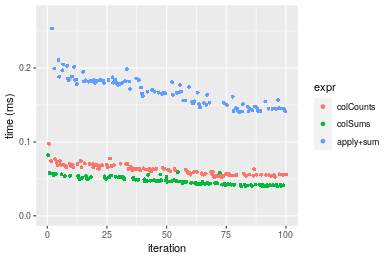
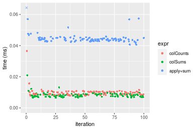
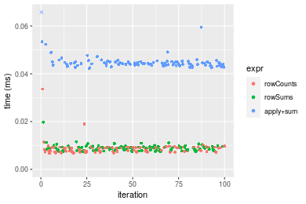
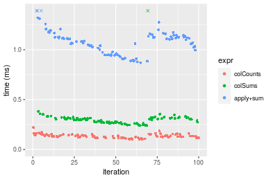

[matrixStats]: Benchmark report

---------------------------------------


# colCounts() and rowCounts() benchmarks

This report benchmark the performance of colCounts() and rowCounts() against alternative methods.

## Alternative methods

* colSums() and rowSums()
* apply() + sum()


## Data type "logical"

### Data
```r
> rmatrix <- function(nrow, ncol, mode = c("logical", "double", "integer", "index"), range = c(-100, 
+     +100), na_prob = 0) {
+     mode <- match.arg(mode)
+     n <- nrow * ncol
+     if (mode == "logical") {
+         x <- sample(c(FALSE, TRUE), size = n, replace = TRUE)
+     }     else if (mode == "index") {
+         x <- seq_len(n)
+         mode <- "integer"
+     }     else {
+         x <- runif(n, min = range[1], max = range[2])
+     }
+     storage.mode(x) <- mode
+     if (na_prob > 0) 
+         x[sample(n, size = na_prob * n)] <- NA
+     dim(x) <- c(nrow, ncol)
+     x
+ }
> rmatrices <- function(scale = 10, seed = 1, ...) {
+     set.seed(seed)
+     data <- list()
+     data[[1]] <- rmatrix(nrow = scale * 1, ncol = scale * 1, ...)
+     data[[2]] <- rmatrix(nrow = scale * 10, ncol = scale * 10, ...)
+     data[[3]] <- rmatrix(nrow = scale * 100, ncol = scale * 1, ...)
+     data[[4]] <- t(data[[3]])
+     data[[5]] <- rmatrix(nrow = scale * 10, ncol = scale * 100, ...)
+     data[[6]] <- t(data[[5]])
+     names(data) <- sapply(data, FUN = function(x) paste(dim(x), collapse = "x"))
+     data
+ }
> data <- rmatrices(mode = mode)
```

### Results

#### 10x10 matrix


```r
> X <- data[["10x10"]]
> value <- 42
```


```r
> colStats <- microbenchmark(colCounts = colCounts(X, value = value, na.rm = FALSE), colSums = colSums(X == 
+     value, na.rm = FALSE), `apply+sum` = apply(X, MARGIN = 2L, FUN = function(x) sum(x == value, 
+     na.rm = FALSE)), unit = "ms")
```

```r
> X <- t(X)
```


```r
> rowStats <- microbenchmark(rowCounts = rowCounts(X, value = value, na.rm = FALSE), rowSums = rowSums(X == 
+     value, na.rm = FALSE), `apply+sum` = apply(X, MARGIN = 1L, FUN = function(x) sum(x == value, 
+     na.rm = FALSE)), unit = "ms")
```

_Table: Benchmarking of colCounts(), colSums() and apply+sum() on logical+10x10 data. The top panel shows times in milliseconds and the bottom panel shows relative times._


|   |expr      |      min|        lq|      mean|    median|        uq|      max|
|:--|:---------|--------:|---------:|---------:|---------:|---------:|--------:|
|2  |colSums   | 0.005221| 0.0058715| 0.0067774| 0.0066305| 0.0071445| 0.019033|
|1  |colCounts | 0.006304| 0.0069720| 0.0081863| 0.0078205| 0.0083670| 0.035276|
|3  |apply+sum | 0.032436| 0.0342370| 0.0370160| 0.0349675| 0.0362015| 0.128051|


|   |expr      |      min|       lq|     mean|   median|       uq|      max|
|:--|:---------|--------:|--------:|--------:|--------:|--------:|--------:|
|2  |colSums   | 1.000000| 1.000000| 1.000000| 1.000000| 1.000000| 1.000000|
|1  |colCounts | 1.207431| 1.187431| 1.207885| 1.179474| 1.171111| 1.853412|
|3  |apply+sum | 6.212603| 5.831048| 5.461687| 5.273735| 5.067045| 6.727841|

_Table: Benchmarking of rowCounts(), rowSums() and apply+sum() on logical+10x10 data (transposed). The top panel shows times in milliseconds and the bottom panel shows relative times._


|   |expr      |      min|        lq|      mean|    median|        uq|      max|
|:--|:---------|--------:|---------:|---------:|---------:|---------:|--------:|
|2  |rowSums   | 0.006995| 0.0077345| 0.0086489| 0.0083980| 0.0089985| 0.022689|
|1  |rowCounts | 0.006650| 0.0074165| 0.0089352| 0.0084570| 0.0091925| 0.032536|
|3  |apply+sum | 0.038366| 0.0404000| 0.0439157| 0.0422335| 0.0441945| 0.117136|


|   |expr      |       min|        lq|     mean|   median|       uq|      max|
|:--|:---------|---------:|---------:|--------:|--------:|--------:|--------:|
|2  |rowSums   | 1.0000000| 1.0000000| 1.000000| 1.000000| 1.000000| 1.000000|
|1  |rowCounts | 0.9506791| 0.9588855| 1.033099| 1.007025| 1.021559| 1.433999|
|3  |apply+sum | 5.4847748| 5.2233499| 5.077590| 5.028995| 4.911319| 5.162678|

_Figure: Benchmarking of colCounts(), colSums() and apply+sum() on logical+10x10 data  as well as rowCounts(), rowSums() and apply+sum() on the same data transposed.  Outliers are displayed as crosses.  Times are in milliseconds._


_Table: Benchmarking of colCounts() and rowCounts() on logical+10x10 data (original and transposed).  The top panel shows times in milliseconds and the bottom panel shows relative times._


|   |expr      |   min|     lq|    mean| median|     uq|    max|
|:--|:---------|-----:|------:|-------:|------:|------:|------:|
|1  |colCounts | 6.304| 6.9720| 8.18631| 7.8205| 8.3670| 35.276|
|2  |rowCounts | 6.650| 7.4165| 8.93519| 8.4570| 9.1925| 32.536|


|   |expr      |      min|       lq|    mean|   median|       uq|       max|
|:--|:---------|--------:|--------:|-------:|--------:|--------:|---------:|
|1  |colCounts | 1.000000| 1.000000| 1.00000| 1.000000| 1.000000| 1.0000000|
|2  |rowCounts | 1.054886| 1.063755| 1.09148| 1.081389| 1.098661| 0.9223268|

_Figure: Benchmarking of colCounts() and rowCounts() on logical+10x10 data (original and transposed).  Outliers are displayed as crosses. Times are in milliseconds._


#### 100x100 matrix


```r
> X <- data[["100x100"]]
> value <- 42
```


```r
> colStats <- microbenchmark(colCounts = colCounts(X, value = value, na.rm = FALSE), colSums = colSums(X == 
+     value, na.rm = FALSE), `apply+sum` = apply(X, MARGIN = 2L, FUN = function(x) sum(x == value, 
+     na.rm = FALSE)), unit = "ms")
```

```r
> X <- t(X)
```


```r
> rowStats <- microbenchmark(rowCounts = rowCounts(X, value = value, na.rm = FALSE), rowSums = rowSums(X == 
+     value, na.rm = FALSE), `apply+sum` = apply(X, MARGIN = 1L, FUN = function(x) sum(x == value, 
+     na.rm = FALSE)), unit = "ms")
```

_Table: Benchmarking of colCounts(), colSums() and apply+sum() on logical+100x100 data. The top panel shows times in milliseconds and the bottom panel shows relative times._


|   |expr      |      min|        lq|      mean|    median|        uq|      max|
|:--|:---------|--------:|---------:|---------:|---------:|---------:|--------:|
|2  |colSums   | 0.038657| 0.0406365| 0.0458560| 0.0427145| 0.0475695| 0.113440|
|1  |colCounts | 0.048725| 0.0543125| 0.0607777| 0.0568365| 0.0616880| 0.113825|
|3  |apply+sum | 0.284478| 0.3012555| 0.3443287| 0.3134905| 0.3633085| 0.691604|


|   |expr      |      min|       lq|     mean|   median|       uq|      max|
|:--|:---------|--------:|--------:|--------:|--------:|--------:|--------:|
|2  |colSums   | 1.000000| 1.000000| 1.000000| 1.000000| 1.000000| 1.000000|
|1  |colCounts | 1.260444| 1.336545| 1.325405| 1.330614| 1.296797| 1.003394|
|3  |apply+sum | 7.359029| 7.413421| 7.508917| 7.339206| 7.637425| 6.096650|

_Table: Benchmarking of rowCounts(), rowSums() and apply+sum() on logical+100x100 data (transposed). The top panel shows times in milliseconds and the bottom panel shows relative times._


|   |expr      |      min|        lq|      mean|   median|        uq|      max|
|:--|:---------|--------:|---------:|---------:|--------:|---------:|--------:|
|1  |rowCounts | 0.058751| 0.0645840| 0.0697448| 0.067405| 0.0742430| 0.107381|
|2  |rowSums   | 0.064421| 0.0686460| 0.0752062| 0.072433| 0.0792895| 0.102180|
|3  |apply+sum | 0.267038| 0.2886325| 0.3190480| 0.308818| 0.3406475| 0.494235|


|   |expr      |      min|       lq|     mean|   median|       uq|      max|
|:--|:---------|--------:|--------:|--------:|--------:|--------:|--------:|
|1  |rowCounts | 1.000000| 1.000000| 1.000000| 1.000000| 1.000000| 1.000000|
|2  |rowSums   | 1.096509| 1.062895| 1.078305| 1.074594| 1.067973| 0.951565|
|3  |apply+sum | 4.545250| 4.469102| 4.574503| 4.581530| 4.588278| 4.602630|

_Figure: Benchmarking of colCounts(), colSums() and apply+sum() on logical+100x100 data  as well as rowCounts(), rowSums() and apply+sum() on the same data transposed.  Outliers are displayed as crosses.  Times are in milliseconds._


_Table: Benchmarking of colCounts() and rowCounts() on logical+100x100 data (original and transposed).  The top panel shows times in milliseconds and the bottom panel shows relative times._


|   |expr      |    min|      lq|     mean|  median|     uq|     max|
|:--|:---------|------:|-------:|--------:|-------:|------:|-------:|
|1  |colCounts | 48.725| 54.3125| 60.77773| 56.8365| 61.688| 113.825|
|2  |rowCounts | 58.751| 64.5840| 69.74485| 67.4050| 74.243| 107.381|


|   |expr      |      min|       lq|    mean|   median|       uq|       max|
|:--|:---------|--------:|--------:|-------:|--------:|--------:|---------:|
|1  |colCounts | 1.000000| 1.000000| 1.00000| 1.000000| 1.000000| 1.0000000|
|2  |rowCounts | 1.205767| 1.189118| 1.14754| 1.185946| 1.203524| 0.9433868|

_Figure: Benchmarking of colCounts() and rowCounts() on logical+100x100 data (original and transposed).  Outliers are displayed as crosses. Times are in milliseconds._


#### 1000x10 matrix


```r
> X <- data[["1000x10"]]
> value <- 42
```


```r
> colStats <- microbenchmark(colCounts = colCounts(X, value = value, na.rm = FALSE), colSums = colSums(X == 
+     value, na.rm = FALSE), `apply+sum` = apply(X, MARGIN = 2L, FUN = function(x) sum(x == value, 
+     na.rm = FALSE)), unit = "ms")
```

```r
> X <- t(X)
```


```r
> rowStats <- microbenchmark(rowCounts = rowCounts(X, value = value, na.rm = FALSE), rowSums = rowSums(X == 
+     value, na.rm = FALSE), `apply+sum` = apply(X, MARGIN = 1L, FUN = function(x) sum(x == value, 
+     na.rm = FALSE)), unit = "ms")
```

_Table: Benchmarking of colCounts(), colSums() and apply+sum() on logical+1000x10 data. The top panel shows times in milliseconds and the bottom panel shows relative times._


|   |expr      |      min|        lq|      mean|    median|        uq|      max|
|:--|:---------|--------:|---------:|---------:|---------:|---------:|--------:|
|2  |colSums   | 0.036736| 0.0391835| 0.0418385| 0.0403070| 0.0424775| 0.078130|
|1  |colCounts | 0.046995| 0.0514340| 0.0545662| 0.0536060| 0.0559215| 0.084249|
|3  |apply+sum | 0.130107| 0.1368710| 0.1484716| 0.1425475| 0.1546875| 0.271668|


|   |expr      |      min|       lq|     mean|   median|       uq|      max|
|:--|:---------|--------:|--------:|--------:|--------:|--------:|--------:|
|2  |colSums   | 1.000000| 1.000000| 1.000000| 1.000000| 1.000000| 1.000000|
|1  |colCounts | 1.279263| 1.312644| 1.304210| 1.329943| 1.316497| 1.078318|
|3  |apply+sum | 3.541676| 3.493077| 3.548687| 3.536545| 3.641634| 3.477128|

_Table: Benchmarking of rowCounts(), rowSums() and apply+sum() on logical+1000x10 data (transposed). The top panel shows times in milliseconds and the bottom panel shows relative times._


|   |expr      |      min|        lq|      mean|    median|        uq|      max|
|:--|:---------|--------:|---------:|---------:|---------:|---------:|--------:|
|1  |rowCounts | 0.061157| 0.0706620| 0.0786583| 0.0776915| 0.0846020| 0.119825|
|3  |apply+sum | 0.124694| 0.1372985| 0.1555904| 0.1450375| 0.1687610| 0.338491|
|2  |rowSums   | 0.174750| 0.1935705| 0.2111850| 0.2015680| 0.2306925| 0.293296|


|   |expr      |      min|       lq|     mean|   median|       uq|      max|
|:--|:---------|--------:|--------:|--------:|--------:|--------:|--------:|
|1  |rowCounts | 1.000000| 1.000000| 1.000000| 1.000000| 1.000000| 1.000000|
|3  |apply+sum | 2.038916| 1.943032| 1.978055| 1.866839| 1.994764| 2.824878|
|2  |rowSums   | 2.857400| 2.739386| 2.684842| 2.594467| 2.726797| 2.447703|

_Figure: Benchmarking of colCounts(), colSums() and apply+sum() on logical+1000x10 data  as well as rowCounts(), rowSums() and apply+sum() on the same data transposed.  Outliers are displayed as crosses.  Times are in milliseconds._





_Table: Benchmarking of colCounts() and rowCounts() on logical+1000x10 data (original and transposed).  The top panel shows times in milliseconds and the bottom panel shows relative times._


|   |expr      |    min|     lq|     mean|  median|      uq|     max|
|:--|:---------|------:|------:|--------:|-------:|-------:|-------:|
|1  |colCounts | 46.995| 51.434| 54.56617| 53.6060| 55.9215|  84.249|
|2  |rowCounts | 61.157| 70.662| 78.65826| 77.6915| 84.6020| 119.825|


|   |expr      |      min|       lq|     mean|   median|       uq|      max|
|:--|:---------|--------:|--------:|--------:|--------:|--------:|--------:|
|1  |colCounts | 1.000000| 1.000000| 1.000000| 1.000000| 1.000000| 1.000000|
|2  |rowCounts | 1.301351| 1.373838| 1.441521| 1.449306| 1.512871| 1.422272|

_Figure: Benchmarking of colCounts() and rowCounts() on logical+1000x10 data (original and transposed).  Outliers are displayed as crosses. Times are in milliseconds._


#### 10x1000 matrix


```r
> X <- data[["10x1000"]]
> value <- 42
```


```r
> colStats <- microbenchmark(colCounts = colCounts(X, value = value, na.rm = FALSE), colSums = colSums(X == 
+     value, na.rm = FALSE), `apply+sum` = apply(X, MARGIN = 2L, FUN = function(x) sum(x == value, 
+     na.rm = FALSE)), unit = "ms")
```

```r
> X <- t(X)
```


```r
> rowStats <- microbenchmark(rowCounts = rowCounts(X, value = value, na.rm = FALSE), rowSums = rowSums(X == 
+     value, na.rm = FALSE), `apply+sum` = apply(X, MARGIN = 1L, FUN = function(x) sum(x == value, 
+     na.rm = FALSE)), unit = "ms")
```

_Table: Benchmarking of colCounts(), colSums() and apply+sum() on logical+10x1000 data. The top panel shows times in milliseconds and the bottom panel shows relative times._


|   |expr      |      min|        lq|      mean|    median|        uq|      max|
|:--|:---------|--------:|---------:|---------:|---------:|---------:|--------:|
|2  |colSums   | 0.030578| 0.0338995| 0.0404144| 0.0380050| 0.0436530| 0.089787|
|1  |colCounts | 0.046831| 0.0524320| 0.0613023| 0.0569915| 0.0652895| 0.115634|
|3  |apply+sum | 1.340804| 1.3988990| 1.6163244| 1.5041640| 1.6826320| 6.351989|


|   |expr      |       min|       lq|      mean|    median|        uq|      max|
|:--|:---------|---------:|--------:|---------:|---------:|---------:|--------:|
|2  |colSums   |  1.000000|  1.00000|  1.000000|  1.000000|  1.000000|  1.00000|
|1  |colCounts |  1.531526|  1.54669|  1.516844|  1.499579|  1.495648|  1.28787|
|3  |apply+sum | 43.848649| 41.26607| 39.993815| 39.578055| 38.545621| 70.74509|

_Table: Benchmarking of rowCounts(), rowSums() and apply+sum() on logical+10x1000 data (transposed). The top panel shows times in milliseconds and the bottom panel shows relative times._


|   |expr      |      min|       lq|      mean|   median|        uq|      max|
|:--|:---------|--------:|--------:|---------:|--------:|---------:|--------:|
|2  |rowSums   | 0.045336| 0.049144| 0.0545227| 0.051543| 0.0573500| 0.089296|
|1  |rowCounts | 0.049191| 0.054437| 0.0622418| 0.059234| 0.0690005| 0.111627|
|3  |apply+sum | 1.342208| 1.423323| 1.5887346| 1.486612| 1.6003085| 6.390944|


|   |expr      |       min|        lq|      mean|    median|        uq|       max|
|:--|:---------|---------:|---------:|---------:|---------:|---------:|---------:|
|2  |rowSums   |  1.000000|  1.000000|  1.000000|  1.000000|  1.000000|  1.000000|
|1  |rowCounts |  1.085032|  1.107704|  1.141576|  1.149215|  1.203147|  1.250078|
|3  |apply+sum | 29.605788| 28.962294| 29.138963| 28.842180| 27.904246| 71.570328|

_Figure: Benchmarking of colCounts(), colSums() and apply+sum() on logical+10x1000 data  as well as rowCounts(), rowSums() and apply+sum() on the same data transposed.  Outliers are displayed as crosses.  Times are in milliseconds._


_Table: Benchmarking of colCounts() and rowCounts() on logical+10x1000 data (original and transposed).  The top panel shows times in milliseconds and the bottom panel shows relative times._


|   |expr      |    min|     lq|     mean|  median|      uq|     max|
|:--|:---------|------:|------:|--------:|-------:|-------:|-------:|
|1  |colCounts | 46.831| 52.432| 61.30227| 56.9915| 65.2895| 115.634|
|2  |rowCounts | 49.191| 54.437| 62.24178| 59.2340| 69.0005| 111.627|


|   |expr      |      min|      lq|     mean|   median|       uq|       max|
|:--|:---------|--------:|-------:|--------:|--------:|--------:|---------:|
|1  |colCounts | 1.000000| 1.00000| 1.000000| 1.000000| 1.000000| 1.0000000|
|2  |rowCounts | 1.050394| 1.03824| 1.015326| 1.039348| 1.056839| 0.9653476|

_Figure: Benchmarking of colCounts() and rowCounts() on logical+10x1000 data (original and transposed).  Outliers are displayed as crosses. Times are in milliseconds._


#### 100x1000 matrix


```r
> X <- data[["100x1000"]]
> value <- 42
```


```r
> colStats <- microbenchmark(colCounts = colCounts(X, value = value, na.rm = FALSE), colSums = colSums(X == 
+     value, na.rm = FALSE), `apply+sum` = apply(X, MARGIN = 2L, FUN = function(x) sum(x == value, 
+     na.rm = FALSE)), unit = "ms")
```

```r
> X <- t(X)
```


```r
> rowStats <- microbenchmark(rowCounts = rowCounts(X, value = value, na.rm = FALSE), rowSums = rowSums(X == 
+     value, na.rm = FALSE), `apply+sum` = apply(X, MARGIN = 1L, FUN = function(x) sum(x == value, 
+     na.rm = FALSE)), unit = "ms")
```

_Table: Benchmarking of colCounts(), colSums() and apply+sum() on logical+100x1000 data. The top panel shows times in milliseconds and the bottom panel shows relative times._


|   |expr      |      min|        lq|      mean|   median|        uq|       max|
|:--|:---------|--------:|---------:|---------:|--------:|---------:|---------:|
|2  |colSums   | 0.261753| 0.2720075| 0.3047800| 0.283947| 0.3175520|  0.472561|
|1  |colCounts | 0.361997| 0.3732910| 0.3939246| 0.386536| 0.3996995|  0.569500|
|3  |apply+sum | 2.131199| 2.2453100| 2.5890242| 2.333588| 2.4231190| 21.236055|


|   |expr      |      min|       lq|     mean|   median|       uq|       max|
|:--|:---------|--------:|--------:|--------:|--------:|--------:|---------:|
|2  |colSums   | 1.000000| 1.000000| 1.000000| 1.000000| 1.000000|  1.000000|
|1  |colCounts | 1.382972| 1.372356| 1.292488| 1.361296| 1.258690|  1.205135|
|3  |apply+sum | 8.142023| 8.254589| 8.494730| 8.218391| 7.630621| 44.938230|

_Table: Benchmarking of rowCounts(), rowSums() and apply+sum() on logical+100x1000 data (transposed). The top panel shows times in milliseconds and the bottom panel shows relative times._


|   |expr      |      min|        lq|      mean|   median|        uq|       max|
|:--|:---------|--------:|---------:|---------:|--------:|---------:|---------:|
|2  |rowSums   | 0.404304| 0.4165455| 0.4381834| 0.429853| 0.4447460|  0.538097|
|1  |rowCounts | 0.454487| 0.4798260| 0.5025927| 0.491783| 0.5094175|  0.788638|
|3  |apply+sum | 2.148804| 2.2502820| 2.6294350| 2.315396| 2.3977845| 24.818493|


|   |expr      |      min|       lq|     mean|   median|       uq|       max|
|:--|:---------|--------:|--------:|--------:|--------:|--------:|---------:|
|2  |rowSums   | 1.000000| 1.000000| 1.000000| 1.000000| 1.000000|  1.000000|
|1  |rowCounts | 1.124122| 1.151917| 1.146992| 1.144073| 1.145412|  1.465606|
|3  |apply+sum | 5.314823| 5.402248| 6.000764| 5.386483| 5.391357| 46.122712|

_Figure: Benchmarking of colCounts(), colSums() and apply+sum() on logical+100x1000 data  as well as rowCounts(), rowSums() and apply+sum() on the same data transposed.  Outliers are displayed as crosses.  Times are in milliseconds._


_Table: Benchmarking of colCounts() and rowCounts() on logical+100x1000 data (original and transposed).  The top panel shows times in milliseconds and the bottom panel shows relative times._


|   |expr      |     min|      lq|     mean|  median|       uq|     max|
|:--|:---------|-------:|-------:|--------:|-------:|--------:|-------:|
|1  |colCounts | 361.997| 373.291| 393.9246| 386.536| 399.6995| 569.500|
|2  |rowCounts | 454.487| 479.826| 502.5927| 491.783| 509.4175| 788.638|


|   |expr      |      min|       lq|    mean|   median|       uq|     max|
|:--|:---------|--------:|--------:|-------:|--------:|--------:|-------:|
|1  |colCounts | 1.000000| 1.000000| 1.00000| 1.000000| 1.000000| 1.00000|
|2  |rowCounts | 1.255499| 1.285394| 1.27586| 1.272282| 1.274501| 1.38479|

_Figure: Benchmarking of colCounts() and rowCounts() on logical+100x1000 data (original and transposed).  Outliers are displayed as crosses. Times are in milliseconds._


#### 1000x100 matrix


```r
> X <- data[["1000x100"]]
> value <- 42
```


```r
> colStats <- microbenchmark(colCounts = colCounts(X, value = value, na.rm = FALSE), colSums = colSums(X == 
+     value, na.rm = FALSE), `apply+sum` = apply(X, MARGIN = 2L, FUN = function(x) sum(x == value, 
+     na.rm = FALSE)), unit = "ms")
```

```r
> X <- t(X)
```


```r
> rowStats <- microbenchmark(rowCounts = rowCounts(X, value = value, na.rm = FALSE), rowSums = rowSums(X == 
+     value, na.rm = FALSE), `apply+sum` = apply(X, MARGIN = 1L, FUN = function(x) sum(x == value, 
+     na.rm = FALSE)), unit = "ms")
```

_Table: Benchmarking of colCounts(), colSums() and apply+sum() on logical+1000x100 data. The top panel shows times in milliseconds and the bottom panel shows relative times._


|   |expr      |      min|        lq|      mean|    median|        uq|      max|
|:--|:---------|--------:|---------:|---------:|---------:|---------:|--------:|
|2  |colSums   | 0.264561| 0.2679965| 0.2938557| 0.2743240| 0.3103305| 0.466617|
|1  |colCounts | 0.355302| 0.3604995| 0.4116982| 0.3830405| 0.4469445| 0.619639|
|3  |apply+sum | 0.924149| 0.9421785| 1.1470136| 1.0032480| 1.1571575| 9.651054|


|   |expr      |      min|       lq|     mean|   median|       uq|       max|
|:--|:---------|--------:|--------:|--------:|--------:|--------:|---------:|
|2  |colSums   | 1.000000| 1.000000| 1.000000| 1.000000| 1.000000|  1.000000|
|1  |colCounts | 1.342987| 1.345165| 1.401022| 1.396307| 1.440221|  1.327939|
|3  |apply+sum | 3.493142| 3.515637| 3.903323| 3.657164| 3.728791| 20.683031|

_Table: Benchmarking of rowCounts(), rowSums() and apply+sum() on logical+1000x100 data (transposed). The top panel shows times in milliseconds and the bottom panel shows relative times._


|   |expr      |      min|        lq|      mean|    median|        uq|      max|
|:--|:---------|--------:|---------:|---------:|---------:|---------:|--------:|
|1  |rowCounts | 0.459107| 0.4735835| 0.5248987| 0.4873765| 0.5775850| 0.878292|
|2  |rowSums   | 0.504974| 0.5208460| 0.5777921| 0.5370945| 0.6110235| 1.285082|
|3  |apply+sum | 0.926660| 0.9592160| 1.1597444| 0.9926450| 1.1713585| 8.727753|


|   |expr      |      min|       lq|     mean|   median|       uq|      max|
|:--|:---------|--------:|--------:|--------:|--------:|--------:|--------:|
|1  |rowCounts | 1.000000| 1.000000| 1.000000| 1.000000| 1.000000| 1.000000|
|2  |rowSums   | 1.099905| 1.099798| 1.100769| 1.102011| 1.057894| 1.463160|
|3  |apply+sum | 2.018397| 2.025442| 2.209464| 2.036711| 2.028028| 9.937188|

_Figure: Benchmarking of colCounts(), colSums() and apply+sum() on logical+1000x100 data  as well as rowCounts(), rowSums() and apply+sum() on the same data transposed.  Outliers are displayed as crosses.  Times are in milliseconds._


_Table: Benchmarking of colCounts() and rowCounts() on logical+1000x100 data (original and transposed).  The top panel shows times in milliseconds and the bottom panel shows relative times._


|   |expr      |     min|       lq|     mean|   median|       uq|     max|
|:--|:---------|-------:|--------:|--------:|--------:|--------:|-------:|
|1  |colCounts | 355.302| 360.4995| 411.6982| 383.0405| 446.9445| 619.639|
|2  |rowCounts | 459.107| 473.5835| 524.8987| 487.3765| 577.5850| 878.292|


|   |expr      |     min|       lq|    mean|   median|       uq|      max|
|:--|:---------|-------:|--------:|-------:|--------:|--------:|--------:|
|1  |colCounts | 1.00000| 1.000000| 1.00000| 1.000000| 1.000000| 1.000000|
|2  |rowCounts | 1.29216| 1.313687| 1.27496| 1.272389| 1.292297| 1.417425|

_Figure: Benchmarking of colCounts() and rowCounts() on logical+1000x100 data (original and transposed).  Outliers are displayed as crosses. Times are in milliseconds._


## Data type "integer"

### Data
```r
> rmatrix <- function(nrow, ncol, mode = c("logical", "double", "integer", "index"), range = c(-100, 
+     +100), na_prob = 0) {
+     mode <- match.arg(mode)
+     n <- nrow * ncol
+     if (mode == "logical") {
+         x <- sample(c(FALSE, TRUE), size = n, replace = TRUE)
+     }     else if (mode == "index") {
+         x <- seq_len(n)
+         mode <- "integer"
+     }     else {
+         x <- runif(n, min = range[1], max = range[2])
+     }
+     storage.mode(x) <- mode
+     if (na_prob > 0) 
+         x[sample(n, size = na_prob * n)] <- NA
+     dim(x) <- c(nrow, ncol)
+     x
+ }
> rmatrices <- function(scale = 10, seed = 1, ...) {
+     set.seed(seed)
+     data <- list()
+     data[[1]] <- rmatrix(nrow = scale * 1, ncol = scale * 1, ...)
+     data[[2]] <- rmatrix(nrow = scale * 10, ncol = scale * 10, ...)
+     data[[3]] <- rmatrix(nrow = scale * 100, ncol = scale * 1, ...)
+     data[[4]] <- t(data[[3]])
+     data[[5]] <- rmatrix(nrow = scale * 10, ncol = scale * 100, ...)
+     data[[6]] <- t(data[[5]])
+     names(data) <- sapply(data, FUN = function(x) paste(dim(x), collapse = "x"))
+     data
+ }
> data <- rmatrices(mode = mode)
```

### Results

#### 10x10 matrix


```r
> X <- data[["10x10"]]
> value <- 42
```


```r
> colStats <- microbenchmark(colCounts = colCounts(X, value = value, na.rm = FALSE), colSums = colSums(X == 
+     value, na.rm = FALSE), `apply+sum` = apply(X, MARGIN = 2L, FUN = function(x) sum(x == value, 
+     na.rm = FALSE)), unit = "ms")
```

```r
> X <- t(X)
```


```r
> rowStats <- microbenchmark(rowCounts = rowCounts(X, value = value, na.rm = FALSE), rowSums = rowSums(X == 
+     value, na.rm = FALSE), `apply+sum` = apply(X, MARGIN = 1L, FUN = function(x) sum(x == value, 
+     na.rm = FALSE)), unit = "ms")
```

_Table: Benchmarking of colCounts(), colSums() and apply+sum() on integer+10x10 data. The top panel shows times in milliseconds and the bottom panel shows relative times._


|   |expr      |      min|       lq|      mean|    median|        uq|      max|
|:--|:---------|--------:|--------:|---------:|---------:|---------:|--------:|
|2  |colSums   | 0.006338| 0.007168| 0.0083209| 0.0080350| 0.0087475| 0.020854|
|1  |colCounts | 0.008114| 0.008786| 0.0099469| 0.0094725| 0.0105880| 0.034660|
|3  |apply+sum | 0.041584| 0.042742| 0.0448572| 0.0437785| 0.0450160| 0.110790|


|   |expr      |      min|       lq|     mean|   median|       uq|      max|
|:--|:---------|--------:|--------:|--------:|--------:|--------:|--------:|
|2  |colSums   | 1.000000| 1.000000| 1.000000| 1.000000| 1.000000| 1.000000|
|1  |colCounts | 1.280215| 1.225725| 1.195414| 1.178905| 1.210403| 1.662031|
|3  |apply+sum | 6.561060| 5.962891| 5.390918| 5.448475| 5.146156| 5.312650|

_Table: Benchmarking of rowCounts(), rowSums() and apply+sum() on integer+10x10 data (transposed). The top panel shows times in milliseconds and the bottom panel shows relative times._


|   |expr      |      min|        lq|      mean|    median|        uq|      max|
|:--|:---------|--------:|---------:|---------:|---------:|---------:|--------:|
|2  |rowSums   | 0.007215| 0.0079235| 0.0087043| 0.0085815| 0.0090410| 0.019755|
|1  |rowCounts | 0.006772| 0.0073970| 0.0085732| 0.0087200| 0.0091465| 0.031875|
|3  |apply+sum | 0.037985| 0.0415330| 0.0443407| 0.0430940| 0.0445275| 0.119650|


|   |expr      |       min|        lq|      mean|   median|       uq|      max|
|:--|:---------|---------:|---------:|---------:|--------:|--------:|--------:|
|2  |rowSums   | 1.0000000| 1.0000000| 1.0000000| 1.000000| 1.000000| 1.000000|
|1  |rowCounts | 0.9386001| 0.9335521| 0.9849396| 1.016139| 1.011669| 1.613516|
|3  |apply+sum | 5.2647263| 5.2417492| 5.0941343| 5.021733| 4.925064| 6.056694|

_Figure: Benchmarking of colCounts(), colSums() and apply+sum() on integer+10x10 data  as well as rowCounts(), rowSums() and apply+sum() on the same data transposed.  Outliers are displayed as crosses.  Times are in milliseconds._





_Table: Benchmarking of colCounts() and rowCounts() on integer+10x10 data (original and transposed).  The top panel shows times in milliseconds and the bottom panel shows relative times._


|   |expr      |   min|    lq|    mean| median|      uq|    max|
|:--|:---------|-----:|-----:|-------:|------:|-------:|------:|
|2  |rowCounts | 6.772| 7.397| 8.57318| 8.7200|  9.1465| 31.875|
|1  |colCounts | 8.114| 8.786| 9.94690| 9.4725| 10.5880| 34.660|


|   |expr      |      min|       lq|     mean|   median|       uq|      max|
|:--|:---------|--------:|--------:|--------:|--------:|--------:|--------:|
|2  |rowCounts | 1.000000| 1.000000| 1.000000| 1.000000| 1.000000| 1.000000|
|1  |colCounts | 1.198169| 1.187779| 1.160235| 1.086296| 1.157601| 1.087373|

_Figure: Benchmarking of colCounts() and rowCounts() on integer+10x10 data (original and transposed).  Outliers are displayed as crosses. Times are in milliseconds._


#### 100x100 matrix


```r
> X <- data[["100x100"]]
> value <- 42
```


```r
> colStats <- microbenchmark(colCounts = colCounts(X, value = value, na.rm = FALSE), colSums = colSums(X == 
+     value, na.rm = FALSE), `apply+sum` = apply(X, MARGIN = 2L, FUN = function(x) sum(x == value, 
+     na.rm = FALSE)), unit = "ms")
```

```r
> X <- t(X)
```


```r
> rowStats <- microbenchmark(rowCounts = rowCounts(X, value = value, na.rm = FALSE), rowSums = rowSums(X == 
+     value, na.rm = FALSE), `apply+sum` = apply(X, MARGIN = 1L, FUN = function(x) sum(x == value, 
+     na.rm = FALSE)), unit = "ms")
```

_Table: Benchmarking of colCounts(), colSums() and apply+sum() on integer+100x100 data. The top panel shows times in milliseconds and the bottom panel shows relative times._


|   |expr      |      min|        lq|      mean|    median|       uq|      max|
|:--|:---------|--------:|---------:|---------:|---------:|--------:|--------:|
|1  |colCounts | 0.015670| 0.0187435| 0.0259227| 0.0214455| 0.028224| 0.080992|
|2  |colSums   | 0.040036| 0.0431860| 0.0521945| 0.0470460| 0.053185| 0.120728|
|3  |apply+sum | 0.281221| 0.2980285| 0.3855457| 0.3338385| 0.397219| 0.986118|


|   |expr      |       min|        lq|      mean|    median|        uq|       max|
|:--|:---------|---------:|---------:|---------:|---------:|---------:|---------:|
|1  |colCounts |  1.000000|  1.000000|  1.000000|  1.000000|  1.000000|  1.000000|
|2  |colSums   |  2.554946|  2.304052|  2.013464|  2.193747|  1.884389|  1.490616|
|3  |apply+sum | 17.946458| 15.900365| 14.872882| 15.566832| 14.073802| 12.175499|

_Table: Benchmarking of rowCounts(), rowSums() and apply+sum() on integer+100x100 data (transposed). The top panel shows times in milliseconds and the bottom panel shows relative times._


|   |expr      |      min|       lq|      mean|    median|        uq|      max|
|:--|:---------|--------:|--------:|---------:|---------:|---------:|--------:|
|1  |rowCounts | 0.021265| 0.024328| 0.0275254| 0.0261805| 0.0298775| 0.054536|
|2  |rowSums   | 0.062646| 0.068582| 0.0749764| 0.0720860| 0.0817335| 0.101289|
|3  |apply+sum | 0.255025| 0.271650| 0.3034074| 0.2912020| 0.3240700| 0.480078|


|   |expr      |       min|        lq|      mean|    median|        uq|      max|
|:--|:---------|---------:|---------:|---------:|---------:|---------:|--------:|
|1  |rowCounts |  1.000000|  1.000000|  1.000000|  1.000000|  1.000000| 1.000000|
|2  |rowSums   |  2.945968|  2.819056|  2.723903|  2.753423|  2.735621| 1.857287|
|3  |apply+sum | 11.992711| 11.166146| 11.022827| 11.122859| 10.846624| 8.802956|

_Figure: Benchmarking of colCounts(), colSums() and apply+sum() on integer+100x100 data  as well as rowCounts(), rowSums() and apply+sum() on the same data transposed.  Outliers are displayed as crosses.  Times are in milliseconds._


_Table: Benchmarking of colCounts() and rowCounts() on integer+100x100 data (original and transposed).  The top panel shows times in milliseconds and the bottom panel shows relative times._


|   |expr      |    min|      lq|     mean|  median|      uq|    max|
|:--|:---------|------:|-------:|--------:|-------:|-------:|------:|
|1  |colCounts | 15.670| 18.7435| 25.92273| 21.4455| 28.2240| 80.992|
|2  |rowCounts | 21.265| 24.3280| 27.52537| 26.1805| 29.8775| 54.536|


|   |expr      |      min|       lq|     mean|   median|       uq|       max|
|:--|:---------|--------:|--------:|--------:|--------:|--------:|---------:|
|1  |colCounts | 1.000000| 1.000000| 1.000000| 1.000000| 1.000000| 1.0000000|
|2  |rowCounts | 1.357052| 1.297943| 1.061824| 1.220792| 1.058585| 0.6733505|

_Figure: Benchmarking of colCounts() and rowCounts() on integer+100x100 data (original and transposed).  Outliers are displayed as crosses. Times are in milliseconds._


#### 1000x10 matrix


```r
> X <- data[["1000x10"]]
> value <- 42
```


```r
> colStats <- microbenchmark(colCounts = colCounts(X, value = value, na.rm = FALSE), colSums = colSums(X == 
+     value, na.rm = FALSE), `apply+sum` = apply(X, MARGIN = 2L, FUN = function(x) sum(x == value, 
+     na.rm = FALSE)), unit = "ms")
```

```r
> X <- t(X)
```


```r
> rowStats <- microbenchmark(rowCounts = rowCounts(X, value = value, na.rm = FALSE), rowSums = rowSums(X == 
+     value, na.rm = FALSE), `apply+sum` = apply(X, MARGIN = 1L, FUN = function(x) sum(x == value, 
+     na.rm = FALSE)), unit = "ms")
```

_Table: Benchmarking of colCounts(), colSums() and apply+sum() on integer+1000x10 data. The top panel shows times in milliseconds and the bottom panel shows relative times._


|   |expr      |      min|        lq|      mean|    median|        uq|      max|
|:--|:---------|--------:|---------:|---------:|---------:|---------:|--------:|
|1  |colCounts | 0.014956| 0.0171160| 0.0190468| 0.0182285| 0.0198270| 0.044908|
|2  |colSums   | 0.040062| 0.0433690| 0.0465536| 0.0448065| 0.0486430| 0.077283|
|3  |apply+sum | 0.129714| 0.1381235| 0.1534027| 0.1494405| 0.1642725| 0.229555|


|   |expr      |      min|       lq|     mean|   median|       uq|      max|
|:--|:---------|--------:|--------:|--------:|--------:|--------:|--------:|
|1  |colCounts | 1.000000| 1.000000| 1.000000| 1.000000| 1.000000| 1.000000|
|2  |colSums   | 2.678657| 2.533828| 2.444166| 2.458047| 2.453372| 1.720918|
|3  |apply+sum | 8.673041| 8.069847| 8.053975| 8.198179| 8.285293| 5.111673|

_Table: Benchmarking of rowCounts(), rowSums() and apply+sum() on integer+1000x10 data (transposed). The top panel shows times in milliseconds and the bottom panel shows relative times._


|   |expr      |      min|        lq|      mean|   median|       uq|      max|
|:--|:---------|--------:|---------:|---------:|--------:|--------:|--------:|
|1  |rowCounts | 0.021886| 0.0236710| 0.0279909| 0.024787| 0.026044| 0.102577|
|3  |apply+sum | 0.120173| 0.1292215| 0.1505378| 0.135404| 0.145351| 0.438626|
|2  |rowSums   | 0.181547| 0.1932095| 0.2046915| 0.199636| 0.206099| 0.366163|


|   |expr      |      min|       lq|     mean|   median|       uq|      max|
|:--|:---------|--------:|--------:|--------:|--------:|--------:|--------:|
|1  |rowCounts | 1.000000| 1.000000| 1.000000| 1.000000| 1.000000| 1.000000|
|3  |apply+sum | 5.490862| 5.459064| 5.378102| 5.462702| 5.580978| 4.276066|
|2  |rowSums   | 8.295120| 8.162287| 7.312790| 8.054061| 7.913493| 3.569640|

_Figure: Benchmarking of colCounts(), colSums() and apply+sum() on integer+1000x10 data  as well as rowCounts(), rowSums() and apply+sum() on the same data transposed.  Outliers are displayed as crosses.  Times are in milliseconds._


_Table: Benchmarking of colCounts() and rowCounts() on integer+1000x10 data (original and transposed).  The top panel shows times in milliseconds and the bottom panel shows relative times._


|   |expr      |    min|     lq|     mean|  median|     uq|     max|
|:--|:---------|------:|------:|--------:|-------:|------:|-------:|
|1  |colCounts | 14.956| 17.116| 19.04683| 18.2285| 19.827|  44.908|
|2  |rowCounts | 21.886| 23.671| 27.99089| 24.7870| 26.044| 102.577|


|   |expr      |      min|       lq|     mean|   median|       uq|      max|
|:--|:---------|--------:|--------:|--------:|--------:|--------:|--------:|
|1  |colCounts | 1.000000| 1.000000| 1.000000| 1.000000| 1.000000| 1.000000|
|2  |rowCounts | 1.463359| 1.382975| 1.469583| 1.359794| 1.313562| 2.284159|

_Figure: Benchmarking of colCounts() and rowCounts() on integer+1000x10 data (original and transposed).  Outliers are displayed as crosses. Times are in milliseconds._


#### 10x1000 matrix


```r
> X <- data[["10x1000"]]
> value <- 42
```


```r
> colStats <- microbenchmark(colCounts = colCounts(X, value = value, na.rm = FALSE), colSums = colSums(X == 
+     value, na.rm = FALSE), `apply+sum` = apply(X, MARGIN = 2L, FUN = function(x) sum(x == value, 
+     na.rm = FALSE)), unit = "ms")
```

```r
> X <- t(X)
```


```r
> rowStats <- microbenchmark(rowCounts = rowCounts(X, value = value, na.rm = FALSE), rowSums = rowSums(X == 
+     value, na.rm = FALSE), `apply+sum` = apply(X, MARGIN = 1L, FUN = function(x) sum(x == value, 
+     na.rm = FALSE)), unit = "ms")
```

_Table: Benchmarking of colCounts(), colSums() and apply+sum() on integer+10x1000 data. The top panel shows times in milliseconds and the bottom panel shows relative times._


|   |expr      |      min|       lq|      mean|    median|        uq|      max|
|:--|:---------|--------:|--------:|---------:|---------:|---------:|--------:|
|1  |colCounts | 0.015605| 0.018801| 0.0272050| 0.0234225| 0.0313025| 0.067470|
|2  |colSums   | 0.033180| 0.038097| 0.0461643| 0.0426690| 0.0484570| 0.113353|
|3  |apply+sum | 1.399468| 1.563009| 1.7683545| 1.6117265| 1.7562565| 6.450481|


|   |expr      |       min|        lq|      mean|   median|        uq|      max|
|:--|:---------|---------:|---------:|---------:|--------:|---------:|--------:|
|1  |colCounts |  1.000000|  1.000000|  1.000000|  1.00000|  1.000000|  1.00000|
|2  |colSums   |  2.126242|  2.026328|  1.696906|  1.82171|  1.548023|  1.68005|
|3  |apply+sum | 89.680743| 83.134328| 65.001059| 68.81104| 56.105950| 95.60517|

_Table: Benchmarking of rowCounts(), rowSums() and apply+sum() on integer+10x1000 data (transposed). The top panel shows times in milliseconds and the bottom panel shows relative times._


|   |expr      |      min|        lq|      mean|    median|        uq|      max|
|:--|:---------|--------:|---------:|---------:|---------:|---------:|--------:|
|1  |rowCounts | 0.019112| 0.0217035| 0.0261620| 0.0241595| 0.0288035| 0.076490|
|2  |rowSums   | 0.045432| 0.0487110| 0.0552892| 0.0521755| 0.0583015| 0.099487|
|3  |apply+sum | 1.292287| 1.3930530| 1.5307998| 1.4528105| 1.5432780| 6.224531|


|   |expr      |       min|        lq|      mean|    median|        uq|       max|
|:--|:---------|---------:|---------:|---------:|---------:|---------:|---------:|
|1  |rowCounts |  1.000000|  1.000000|  1.000000|  1.000000|  1.000000|  1.000000|
|2  |rowSums   |  2.377145|  2.244384|  2.113338|  2.159627|  2.024112|  1.300654|
|3  |apply+sum | 67.616524| 64.185638| 58.512296| 60.134129| 53.579530| 81.377056|

_Figure: Benchmarking of colCounts(), colSums() and apply+sum() on integer+10x1000 data  as well as rowCounts(), rowSums() and apply+sum() on the same data transposed.  Outliers are displayed as crosses.  Times are in milliseconds._


_Table: Benchmarking of colCounts() and rowCounts() on integer+10x1000 data (original and transposed).  The top panel shows times in milliseconds and the bottom panel shows relative times._


|   |expr      |    min|      lq|     mean|  median|      uq|   max|
|:--|:---------|------:|-------:|--------:|-------:|-------:|-----:|
|1  |colCounts | 15.605| 18.8010| 27.20501| 23.4225| 31.3025| 67.47|
|2  |rowCounts | 19.112| 21.7035| 26.16202| 24.1595| 28.8035| 76.49|


|   |expr      |      min|      lq|      mean|   median|        uq|      max|
|:--|:---------|--------:|-------:|---------:|--------:|---------:|--------:|
|1  |colCounts | 1.000000| 1.00000| 1.0000000| 1.000000| 1.0000000| 1.000000|
|2  |rowCounts | 1.224736| 1.15438| 0.9616618| 1.031465| 0.9201661| 1.133689|

_Figure: Benchmarking of colCounts() and rowCounts() on integer+10x1000 data (original and transposed).  Outliers are displayed as crosses. Times are in milliseconds._


#### 100x1000 matrix


```r
> X <- data[["100x1000"]]
> value <- 42
```


```r
> colStats <- microbenchmark(colCounts = colCounts(X, value = value, na.rm = FALSE), colSums = colSums(X == 
+     value, na.rm = FALSE), `apply+sum` = apply(X, MARGIN = 2L, FUN = function(x) sum(x == value, 
+     na.rm = FALSE)), unit = "ms")
```

```r
> X <- t(X)
```


```r
> rowStats <- microbenchmark(rowCounts = rowCounts(X, value = value, na.rm = FALSE), rowSums = rowSums(X == 
+     value, na.rm = FALSE), `apply+sum` = apply(X, MARGIN = 1L, FUN = function(x) sum(x == value, 
+     na.rm = FALSE)), unit = "ms")
```

_Table: Benchmarking of colCounts(), colSums() and apply+sum() on integer+100x1000 data. The top panel shows times in milliseconds and the bottom panel shows relative times._


|   |expr      |      min|        lq|      mean|   median|        uq|       max|
|:--|:---------|--------:|---------:|---------:|--------:|---------:|---------:|
|1  |colCounts | 0.075208| 0.0797825| 0.0850466| 0.083568| 0.0866260|  0.146642|
|2  |colSums   | 0.261640| 0.2735995| 0.2965617| 0.289802| 0.2958305|  0.470189|
|3  |apply+sum | 2.040442| 2.1762195| 2.4804793| 2.240220| 2.3131625| 20.861762|


|   |expr      |       min|        lq|      mean|    median|        uq|        max|
|:--|:---------|---------:|---------:|---------:|---------:|---------:|----------:|
|1  |colCounts |  1.000000|  1.000000|  1.000000|  1.000000|  1.000000|   1.000000|
|2  |colSums   |  3.478885|  3.429317|  3.487049|  3.467859|  3.415031|   3.206373|
|3  |apply+sum | 27.130651| 27.276903| 29.166109| 26.807151| 26.702866| 142.263212|

_Table: Benchmarking of rowCounts(), rowSums() and apply+sum() on integer+100x1000 data (transposed). The top panel shows times in milliseconds and the bottom panel shows relative times._


|   |expr      |      min|       lq|      mean|    median|        uq|       max|
|:--|:---------|--------:|--------:|---------:|---------:|---------:|---------:|
|1  |rowCounts | 0.143092| 0.155185| 0.1684519| 0.1580105| 0.1704795|  0.317186|
|2  |rowSums   | 0.408042| 0.450289| 0.4683558| 0.4543575| 0.4700415|  0.722659|
|3  |apply+sum | 2.046137| 2.288593| 2.6398671| 2.3274665| 2.5422505| 20.773701|


|   |expr      |       min|        lq|      mean|    median|        uq|       max|
|:--|:---------|---------:|---------:|---------:|---------:|---------:|---------:|
|1  |rowCounts |  1.000000|  1.000000|  1.000000|  1.000000|  1.000000|  1.000000|
|2  |rowSums   |  2.851606|  2.901627|  2.780354|  2.875489|  2.757173|  2.278345|
|3  |apply+sum | 14.299451| 14.747511| 15.671343| 14.729822| 14.912353| 65.493751|

_Figure: Benchmarking of colCounts(), colSums() and apply+sum() on integer+100x1000 data  as well as rowCounts(), rowSums() and apply+sum() on the same data transposed.  Outliers are displayed as crosses.  Times are in milliseconds._


_Table: Benchmarking of colCounts() and rowCounts() on integer+100x1000 data (original and transposed).  The top panel shows times in milliseconds and the bottom panel shows relative times._


|   |expr      |     min|       lq|      mean|   median|       uq|     max|
|:--|:---------|-------:|--------:|---------:|--------:|--------:|-------:|
|1  |colCounts |  75.208|  79.7825|  85.04663|  83.5680|  86.6260| 146.642|
|2  |rowCounts | 143.092| 155.1850| 168.45187| 158.0105| 170.4795| 317.186|


|   |expr      |      min|       lq|   mean|   median|       uq|      max|
|:--|:---------|--------:|--------:|------:|--------:|--------:|--------:|
|1  |colCounts | 1.000000| 1.000000| 1.0000| 1.000000| 1.000000| 1.000000|
|2  |rowCounts | 1.902617| 1.945101| 1.9807| 1.890802| 1.967995| 2.162996|

_Figure: Benchmarking of colCounts() and rowCounts() on integer+100x1000 data (original and transposed).  Outliers are displayed as crosses. Times are in milliseconds._


#### 1000x100 matrix


```r
> X <- data[["1000x100"]]
> value <- 42
```


```r
> colStats <- microbenchmark(colCounts = colCounts(X, value = value, na.rm = FALSE), colSums = colSums(X == 
+     value, na.rm = FALSE), `apply+sum` = apply(X, MARGIN = 2L, FUN = function(x) sum(x == value, 
+     na.rm = FALSE)), unit = "ms")
```

```r
> X <- t(X)
```


```r
> rowStats <- microbenchmark(rowCounts = rowCounts(X, value = value, na.rm = FALSE), rowSums = rowSums(X == 
+     value, na.rm = FALSE), `apply+sum` = apply(X, MARGIN = 1L, FUN = function(x) sum(x == value, 
+     na.rm = FALSE)), unit = "ms")
```

_Table: Benchmarking of colCounts(), colSums() and apply+sum() on integer+1000x100 data. The top panel shows times in milliseconds and the bottom panel shows relative times._


|   |expr      |      min|        lq|      mean|    median|        uq|      max|
|:--|:---------|--------:|---------:|---------:|---------:|---------:|--------:|
|1  |colCounts | 0.066275| 0.0700840| 0.0801495| 0.0731580| 0.0869350| 0.153996|
|2  |colSums   | 0.264691| 0.2719975| 0.2967909| 0.2819575| 0.3068715| 0.449269|
|3  |apply+sum | 0.859926| 0.8885840| 1.0750422| 0.9224200| 1.0939015| 8.830910|


|   |expr      |       min|        lq|      mean|   median|        uq|       max|
|:--|:---------|---------:|---------:|---------:|--------:|---------:|---------:|
|1  |colCounts |  1.000000|  1.000000|  1.000000|  1.00000|  1.000000|  1.000000|
|2  |colSums   |  3.993829|  3.881021|  3.702965|  3.85409|  3.529896|  2.917407|
|3  |apply+sum | 12.975119| 12.678843| 13.412956| 12.60860| 12.582982| 57.345061|

_Table: Benchmarking of rowCounts(), rowSums() and apply+sum() on integer+1000x100 data (transposed). The top panel shows times in milliseconds and the bottom panel shows relative times._


|   |expr      |      min|        lq|      mean|    median|        uq|      max|
|:--|:---------|--------:|---------:|---------:|---------:|---------:|--------:|
|1  |rowCounts | 0.146143| 0.1534105| 0.1697883| 0.1580330| 0.1832075| 0.265934|
|2  |rowSums   | 0.505121| 0.5321740| 0.5733940| 0.5461685| 0.6091490| 0.860210|
|3  |apply+sum | 0.860719| 0.9109375| 1.0842261| 0.9479140| 1.0790555| 8.849309|


|   |expr      |      min|       lq|     mean|   median|       uq|       max|
|:--|:---------|--------:|--------:|--------:|--------:|--------:|---------:|
|1  |rowCounts | 1.000000| 1.000000| 1.000000| 1.000000| 1.000000|  1.000000|
|2  |rowSums   | 3.456348| 3.468954| 3.377111| 3.456041| 3.324913|  3.234675|
|3  |apply+sum | 5.889567| 5.937908| 6.385751| 5.998203| 5.889800| 33.276336|

_Figure: Benchmarking of colCounts(), colSums() and apply+sum() on integer+1000x100 data  as well as rowCounts(), rowSums() and apply+sum() on the same data transposed.  Outliers are displayed as crosses.  Times are in milliseconds._


_Table: Benchmarking of colCounts() and rowCounts() on integer+1000x100 data (original and transposed).  The top panel shows times in milliseconds and the bottom panel shows relative times._


|   |expr      |     min|       lq|      mean|  median|       uq|     max|
|:--|:---------|-------:|--------:|---------:|-------:|--------:|-------:|
|1  |colCounts |  66.275|  70.0840|  80.14954|  73.158|  86.9350| 153.996|
|2  |rowCounts | 146.143| 153.4105| 169.78834| 158.033| 183.2075| 265.934|


|   |expr      |    min|       lq|     mean|  median|       uq|      max|
|:--|:---------|------:|--------:|--------:|-------:|--------:|--------:|
|1  |colCounts | 1.0000| 1.000000| 1.000000| 1.00000| 1.000000| 1.000000|
|2  |rowCounts | 2.2051| 2.188952| 2.118394| 2.16016| 2.107408| 1.726889|

_Figure: Benchmarking of colCounts() and rowCounts() on integer+1000x100 data (original and transposed).  Outliers are displayed as crosses. Times are in milliseconds._


## Data type "double"

### Data
```r
> rmatrix <- function(nrow, ncol, mode = c("logical", "double", "integer", "index"), range = c(-100, 
+     +100), na_prob = 0) {
+     mode <- match.arg(mode)
+     n <- nrow * ncol
+     if (mode == "logical") {
+         x <- sample(c(FALSE, TRUE), size = n, replace = TRUE)
+     }     else if (mode == "index") {
+         x <- seq_len(n)
+         mode <- "integer"
+     }     else {
+         x <- runif(n, min = range[1], max = range[2])
+     }
+     storage.mode(x) <- mode
+     if (na_prob > 0) 
+         x[sample(n, size = na_prob * n)] <- NA
+     dim(x) <- c(nrow, ncol)
+     x
+ }
> rmatrices <- function(scale = 10, seed = 1, ...) {
+     set.seed(seed)
+     data <- list()
+     data[[1]] <- rmatrix(nrow = scale * 1, ncol = scale * 1, ...)
+     data[[2]] <- rmatrix(nrow = scale * 10, ncol = scale * 10, ...)
+     data[[3]] <- rmatrix(nrow = scale * 100, ncol = scale * 1, ...)
+     data[[4]] <- t(data[[3]])
+     data[[5]] <- rmatrix(nrow = scale * 10, ncol = scale * 100, ...)
+     data[[6]] <- t(data[[5]])
+     names(data) <- sapply(data, FUN = function(x) paste(dim(x), collapse = "x"))
+     data
+ }
> data <- rmatrices(mode = mode)
```

### Results

#### 10x10 matrix


```r
> X <- data[["10x10"]]
> value <- 42
```


```r
> colStats <- microbenchmark(colCounts = colCounts(X, value = value, na.rm = FALSE), colSums = colSums(X == 
+     value, na.rm = FALSE), `apply+sum` = apply(X, MARGIN = 2L, FUN = function(x) sum(x == value, 
+     na.rm = FALSE)), unit = "ms")
```

```r
> X <- t(X)
```


```r
> rowStats <- microbenchmark(rowCounts = rowCounts(X, value = value, na.rm = FALSE), rowSums = rowSums(X == 
+     value, na.rm = FALSE), `apply+sum` = apply(X, MARGIN = 1L, FUN = function(x) sum(x == value, 
+     na.rm = FALSE)), unit = "ms")
```

_Table: Benchmarking of colCounts(), colSums() and apply+sum() on double+10x10 data. The top panel shows times in milliseconds and the bottom panel shows relative times._


|   |expr      |      min|        lq|      mean|   median|        uq|      max|
|:--|:---------|--------:|---------:|---------:|--------:|---------:|--------:|
|2  |colSums   | 0.006470| 0.0072195| 0.0085451| 0.008253| 0.0090015| 0.027295|
|1  |colCounts | 0.007939| 0.0086730| 0.0100746| 0.009774| 0.0108375| 0.035761|
|3  |apply+sum | 0.041541| 0.0432495| 0.0456331| 0.044396| 0.0453815| 0.112885|


|   |expr      |      min|      lq|     mean|   median|       uq|      max|
|:--|:---------|--------:|-------:|--------:|--------:|--------:|--------:|
|2  |colSums   | 1.000000| 1.00000| 1.000000| 1.000000| 1.000000| 1.000000|
|1  |colCounts | 1.227048| 1.20133| 1.178998| 1.184297| 1.203966| 1.310167|
|3  |apply+sum | 6.420556| 5.99065| 5.340289| 5.379377| 5.041549| 4.135739|

_Table: Benchmarking of rowCounts(), rowSums() and apply+sum() on double+10x10 data (transposed). The top panel shows times in milliseconds and the bottom panel shows relative times._


|   |expr      |      min|        lq|      mean|    median|        uq|      max|
|:--|:---------|--------:|---------:|---------:|---------:|---------:|--------:|
|1  |rowCounts | 0.006894| 0.0074150| 0.0087154| 0.0086975| 0.0093110| 0.032255|
|2  |rowSums   | 0.007166| 0.0079395| 0.0088244| 0.0087280| 0.0092085| 0.019402|
|3  |apply+sum | 0.040106| 0.0419180| 0.0447728| 0.0433560| 0.0445260| 0.115860|


|   |expr      |      min|       lq|     mean|   median|        uq|       max|
|:--|:---------|--------:|--------:|--------:|--------:|---------:|---------:|
|1  |rowCounts | 1.000000| 1.000000| 1.000000| 1.000000| 1.0000000| 1.0000000|
|2  |rowSums   | 1.039455| 1.070735| 1.012514| 1.003507| 0.9889915| 0.6015191|
|3  |apply+sum | 5.817522| 5.653136| 5.137230| 4.984881| 4.7820857| 3.5920012|

_Figure: Benchmarking of colCounts(), colSums() and apply+sum() on double+10x10 data  as well as rowCounts(), rowSums() and apply+sum() on the same data transposed.  Outliers are displayed as crosses.  Times are in milliseconds._



_Table: Benchmarking of colCounts() and rowCounts() on double+10x10 data (original and transposed).  The top panel shows times in milliseconds and the bottom panel shows relative times._


|   |expr      |   min|    lq|     mean| median|      uq|    max|
|:--|:---------|-----:|-----:|--------:|------:|-------:|------:|
|2  |rowCounts | 6.894| 7.415|  8.71536| 8.6975|  9.3110| 32.255|
|1  |colCounts | 7.939| 8.673| 10.07462| 9.7740| 10.8375| 35.761|


|   |expr      |      min|       lq|     mean|   median|       uq|      max|
|:--|:---------|--------:|--------:|--------:|--------:|--------:|--------:|
|2  |rowCounts | 1.000000| 1.000000| 1.000000| 1.000000| 1.000000| 1.000000|
|1  |colCounts | 1.151581| 1.169656| 1.155961| 1.123771| 1.163946| 1.108696|

_Figure: Benchmarking of colCounts() and rowCounts() on double+10x10 data (original and transposed).  Outliers are displayed as crosses. Times are in milliseconds._


#### 100x100 matrix


```r
> X <- data[["100x100"]]
> value <- 42
```


```r
> colStats <- microbenchmark(colCounts = colCounts(X, value = value, na.rm = FALSE), colSums = colSums(X == 
+     value, na.rm = FALSE), `apply+sum` = apply(X, MARGIN = 2L, FUN = function(x) sum(x == value, 
+     na.rm = FALSE)), unit = "ms")
```

```r
> X <- t(X)
```


```r
> rowStats <- microbenchmark(rowCounts = rowCounts(X, value = value, na.rm = FALSE), rowSums = rowSums(X == 
+     value, na.rm = FALSE), `apply+sum` = apply(X, MARGIN = 1L, FUN = function(x) sum(x == value, 
+     na.rm = FALSE)), unit = "ms")
```

_Table: Benchmarking of colCounts(), colSums() and apply+sum() on double+100x100 data. The top panel shows times in milliseconds and the bottom panel shows relative times._


|   |expr      |      min|       lq|      mean|    median|        uq|      max|
|:--|:---------|--------:|--------:|---------:|---------:|---------:|--------:|
|1  |colCounts | 0.019617| 0.021895| 0.0255300| 0.0238775| 0.0271905| 0.097045|
|2  |colSums   | 0.035780| 0.037374| 0.0425435| 0.0411180| 0.0465380| 0.067030|
|3  |apply+sum | 0.271913| 0.286085| 0.3249972| 0.3152800| 0.3564970| 0.481641|


|   |expr      |       min|        lq|      mean|   median|        uq|       max|
|:--|:---------|---------:|---------:|---------:|--------:|---------:|---------:|
|1  |colCounts |  1.000000|  1.000000|  1.000000|  1.00000|  1.000000| 1.0000000|
|2  |colSums   |  1.823928|  1.706965|  1.666414|  1.72204|  1.711554| 0.6907105|
|3  |apply+sum | 13.861090| 13.066225| 12.730018| 13.20406| 13.111087| 4.9630687|

_Table: Benchmarking of rowCounts(), rowSums() and apply+sum() on double+100x100 data (transposed). The top panel shows times in milliseconds and the bottom panel shows relative times._


|   |expr      |      min|       lq|      mean|    median|       uq|      max|
|:--|:---------|--------:|--------:|---------:|---------:|--------:|--------:|
|1  |rowCounts | 0.020286| 0.023069| 0.0254874| 0.0246295| 0.027334| 0.052274|
|2  |rowSums   | 0.065768| 0.068724| 0.0762398| 0.0748495| 0.084913| 0.097222|
|3  |apply+sum | 0.271138| 0.286355| 0.3243593| 0.3074680| 0.359783| 0.486584|


|   |expr      |       min|        lq|     mean|    median|        uq|      max|
|:--|:---------|---------:|---------:|--------:|---------:|---------:|--------:|
|1  |rowCounts |  1.000000|  1.000000|  1.00000|  1.000000|  1.000000| 1.000000|
|2  |rowSums   |  3.242039|  2.979063|  2.99127|  3.039018|  3.106497| 1.859854|
|3  |apply+sum | 13.365770| 12.412978| 12.72624| 12.483729| 13.162472| 9.308337|

_Figure: Benchmarking of colCounts(), colSums() and apply+sum() on double+100x100 data  as well as rowCounts(), rowSums() and apply+sum() on the same data transposed.  Outliers are displayed as crosses.  Times are in milliseconds._


_Table: Benchmarking of colCounts() and rowCounts() on double+100x100 data (original and transposed).  The top panel shows times in milliseconds and the bottom panel shows relative times._


|   |expr      |    min|     lq|     mean|  median|      uq|    max|
|:--|:---------|------:|------:|--------:|-------:|-------:|------:|
|1  |colCounts | 19.617| 21.895| 25.52999| 23.8775| 27.1905| 97.045|
|2  |rowCounts | 20.286| 23.069| 25.48744| 24.6295| 27.3340| 52.274|


|   |expr      |      min|       lq|      mean|   median|       uq|       max|
|:--|:---------|--------:|--------:|---------:|--------:|--------:|---------:|
|1  |colCounts | 1.000000| 1.000000| 1.0000000| 1.000000| 1.000000| 1.0000000|
|2  |rowCounts | 1.034103| 1.053619| 0.9983333| 1.031494| 1.005278| 0.5386573|

_Figure: Benchmarking of colCounts() and rowCounts() on double+100x100 data (original and transposed).  Outliers are displayed as crosses. Times are in milliseconds._


#### 1000x10 matrix


```r
> X <- data[["1000x10"]]
> value <- 42
```


```r
> colStats <- microbenchmark(colCounts = colCounts(X, value = value, na.rm = FALSE), colSums = colSums(X == 
+     value, na.rm = FALSE), `apply+sum` = apply(X, MARGIN = 2L, FUN = function(x) sum(x == value, 
+     na.rm = FALSE)), unit = "ms")
```

```r
> X <- t(X)
```


```r
> rowStats <- microbenchmark(rowCounts = rowCounts(X, value = value, na.rm = FALSE), rowSums = rowSums(X == 
+     value, na.rm = FALSE), `apply+sum` = apply(X, MARGIN = 1L, FUN = function(x) sum(x == value, 
+     na.rm = FALSE)), unit = "ms")
```

_Table: Benchmarking of colCounts(), colSums() and apply+sum() on double+1000x10 data. The top panel shows times in milliseconds and the bottom panel shows relative times._


|   |expr      |      min|        lq|      mean|    median|        uq|      max|
|:--|:---------|--------:|---------:|---------:|---------:|---------:|--------:|
|1  |colCounts | 0.019604| 0.0215500| 0.0236385| 0.0230975| 0.0249280| 0.051530|
|2  |colSums   | 0.036657| 0.0386855| 0.0425752| 0.0414060| 0.0446055| 0.075756|
|3  |apply+sum | 0.129536| 0.1374965| 0.1529108| 0.1510900| 0.1648080| 0.235097|


|   |expr      |      min|       lq|     mean|   median|       uq|      max|
|:--|:---------|--------:|--------:|--------:|--------:|--------:|--------:|
|1  |colCounts | 1.000000| 1.000000| 1.000000| 1.000000| 1.000000| 1.000000|
|2  |colSums   | 1.869873| 1.795151| 1.801094| 1.792661| 1.789373| 1.470134|
|3  |apply+sum | 6.607631| 6.380348| 6.468717| 6.541401| 6.611361| 4.562333|

_Table: Benchmarking of rowCounts(), rowSums() and apply+sum() on double+1000x10 data (transposed). The top panel shows times in milliseconds and the bottom panel shows relative times._


|   |expr      |      min|        lq|      mean|   median|        uq|      max|
|:--|:---------|--------:|---------:|---------:|--------:|---------:|--------:|
|1  |rowCounts | 0.019004| 0.0213930| 0.0240743| 0.023421| 0.0257690| 0.050846|
|3  |apply+sum | 0.123298| 0.1295755| 0.1443525| 0.136297| 0.1552860| 0.233968|
|2  |rowSums   | 0.183147| 0.1905140| 0.2101333| 0.198289| 0.2310445| 0.269758|


|   |expr      |      min|       lq|     mean|   median|       uq|      max|
|:--|:---------|--------:|--------:|--------:|--------:|--------:|--------:|
|1  |rowCounts | 1.000000| 1.000000| 1.000000| 1.000000| 1.000000| 1.000000|
|3  |apply+sum | 6.488003| 6.056911| 5.996124| 5.819435| 6.026078| 4.601503|
|2  |rowSums   | 9.637287| 8.905436| 8.728532| 8.466291| 8.965986| 5.305393|

_Figure: Benchmarking of colCounts(), colSums() and apply+sum() on double+1000x10 data  as well as rowCounts(), rowSums() and apply+sum() on the same data transposed.  Outliers are displayed as crosses.  Times are in milliseconds._


_Table: Benchmarking of colCounts() and rowCounts() on double+1000x10 data (original and transposed).  The top panel shows times in milliseconds and the bottom panel shows relative times._


|   |expr      |    min|     lq|    mean|  median|     uq|    max|
|:--|:---------|------:|------:|-------:|-------:|------:|------:|
|1  |colCounts | 19.604| 21.550| 23.6385| 23.0975| 24.928| 51.530|
|2  |rowCounts | 19.004| 21.393| 24.0743| 23.4210| 25.769| 50.846|


|   |expr      |      min|        lq|     mean|   median|       uq|       max|
|:--|:---------|--------:|---------:|--------:|--------:|--------:|---------:|
|1  |colCounts | 1.000000| 1.0000000| 1.000000| 1.000000| 1.000000| 1.0000000|
|2  |rowCounts | 0.969394| 0.9927146| 1.018436| 1.014006| 1.033737| 0.9867262|

_Figure: Benchmarking of colCounts() and rowCounts() on double+1000x10 data (original and transposed).  Outliers are displayed as crosses. Times are in milliseconds._


#### 10x1000 matrix


```r
> X <- data[["10x1000"]]
> value <- 42
```


```r
> colStats <- microbenchmark(colCounts = colCounts(X, value = value, na.rm = FALSE), colSums = colSums(X == 
+     value, na.rm = FALSE), `apply+sum` = apply(X, MARGIN = 2L, FUN = function(x) sum(x == value, 
+     na.rm = FALSE)), unit = "ms")
```

```r
> X <- t(X)
```


```r
> rowStats <- microbenchmark(rowCounts = rowCounts(X, value = value, na.rm = FALSE), rowSums = rowSums(X == 
+     value, na.rm = FALSE), `apply+sum` = apply(X, MARGIN = 1L, FUN = function(x) sum(x == value, 
+     na.rm = FALSE)), unit = "ms")
```

_Table: Benchmarking of colCounts(), colSums() and apply+sum() on double+10x1000 data. The top panel shows times in milliseconds and the bottom panel shows relative times._


|   |expr      |      min|        lq|      mean|    median|        uq|      max|
|:--|:---------|--------:|---------:|---------:|---------:|---------:|--------:|
|1  |colCounts | 0.016374| 0.0196710| 0.0233918| 0.0212775| 0.0249915| 0.057746|
|2  |colSums   | 0.027696| 0.0318775| 0.0366476| 0.0349740| 0.0385220| 0.077064|
|3  |apply+sum | 1.308327| 1.3861810| 1.5669423| 1.4591905| 1.5933465| 6.006633|


|   |expr      |       min|        lq|      mean|    median|        uq|        max|
|:--|:---------|---------:|---------:|---------:|---------:|---------:|----------:|
|1  |colCounts |  1.000000|  1.000000|  1.000000|  1.000000|  1.000000|   1.000000|
|2  |colSums   |  1.691462|  1.620533|  1.566687|  1.643708|  1.541404|   1.334534|
|3  |apply+sum | 79.902712| 70.468253| 66.986878| 68.579039| 63.755537| 104.018166|

_Table: Benchmarking of rowCounts(), rowSums() and apply+sum() on double+10x1000 data (transposed). The top panel shows times in milliseconds and the bottom panel shows relative times._


|   |expr      |      min|        lq|      mean|    median|        uq|      max|
|:--|:---------|--------:|---------:|---------:|---------:|---------:|--------:|
|1  |rowCounts | 0.016230| 0.0184995| 0.0226759| 0.0205710| 0.0259155| 0.062942|
|2  |rowSums   | 0.042819| 0.0454445| 0.0528018| 0.0475165| 0.0576725| 0.089343|
|3  |apply+sum | 1.299016| 1.3607420| 1.5397053| 1.4433145| 1.5264800| 6.389439|


|   |expr      |       min|        lq|      mean|    median|        uq|       max|
|:--|:---------|---------:|---------:|---------:|---------:|---------:|---------:|
|1  |rowCounts |  1.000000|  1.000000|  1.000000|  1.000000|  1.000000|   1.00000|
|2  |rowSums   |  2.638263|  2.456526|  2.328544|  2.309878|  2.225406|   1.41945|
|3  |apply+sum | 80.037954| 73.555610| 67.900544| 70.162583| 58.902201| 101.51312|

_Figure: Benchmarking of colCounts(), colSums() and apply+sum() on double+10x1000 data  as well as rowCounts(), rowSums() and apply+sum() on the same data transposed.  Outliers are displayed as crosses.  Times are in milliseconds._


_Table: Benchmarking of colCounts() and rowCounts() on double+10x1000 data (original and transposed).  The top panel shows times in milliseconds and the bottom panel shows relative times._


|   |expr      |    min|      lq|     mean|  median|      uq|    max|
|:--|:---------|------:|-------:|--------:|-------:|-------:|------:|
|2  |rowCounts | 16.230| 18.4995| 22.67589| 20.5710| 25.9155| 62.942|
|1  |colCounts | 16.374| 19.6710| 23.39178| 21.2775| 24.9915| 57.746|


|   |expr      |      min|       lq|    mean|   median|        uq|       max|
|:--|:---------|--------:|--------:|-------:|--------:|---------:|---------:|
|2  |rowCounts | 1.000000| 1.000000| 1.00000| 1.000000| 1.0000000| 1.0000000|
|1  |colCounts | 1.008873| 1.063326| 1.03157| 1.034345| 0.9643457| 0.9174478|

_Figure: Benchmarking of colCounts() and rowCounts() on double+10x1000 data (original and transposed).  Outliers are displayed as crosses. Times are in milliseconds._


#### 100x1000 matrix


```r
> X <- data[["100x1000"]]
> value <- 42
```


```r
> colStats <- microbenchmark(colCounts = colCounts(X, value = value, na.rm = FALSE), colSums = colSums(X == 
+     value, na.rm = FALSE), `apply+sum` = apply(X, MARGIN = 2L, FUN = function(x) sum(x == value, 
+     na.rm = FALSE)), unit = "ms")
```

```r
> X <- t(X)
```


```r
> rowStats <- microbenchmark(rowCounts = rowCounts(X, value = value, na.rm = FALSE), rowSums = rowSums(X == 
+     value, na.rm = FALSE), `apply+sum` = apply(X, MARGIN = 1L, FUN = function(x) sum(x == value, 
+     na.rm = FALSE)), unit = "ms")
```

_Table: Benchmarking of colCounts(), colSums() and apply+sum() on double+100x1000 data. The top panel shows times in milliseconds and the bottom panel shows relative times._


|   |expr      |      min|       lq|      mean|    median|        uq|       max|
|:--|:---------|--------:|--------:|---------:|---------:|---------:|---------:|
|1  |colCounts | 0.107020| 0.114259| 0.1253072| 0.1186110| 0.1314905|  0.223867|
|2  |colSums   | 0.235717| 0.253493| 0.2752387| 0.2592585| 0.2871390|  0.442859|
|3  |apply+sum | 2.027339| 2.172500| 2.5317742| 2.2335895| 2.4646855| 20.144331|


|   |expr      |       min|        lq|      mean|    median|        uq|       max|
|:--|:---------|---------:|---------:|---------:|---------:|---------:|---------:|
|1  |colCounts |  1.000000|  1.000000|  1.000000|  1.000000|  1.000000|  1.000000|
|2  |colSums   |  2.202551|  2.218582|  2.196511|  2.185788|  2.183724|  1.978224|
|3  |apply+sum | 18.943553| 19.013820| 20.204535| 18.831217| 18.744210| 89.983477|

_Table: Benchmarking of rowCounts(), rowSums() and apply+sum() on double+100x1000 data (transposed). The top panel shows times in milliseconds and the bottom panel shows relative times._


|   |expr      |      min|        lq|      mean|   median|        uq|       max|
|:--|:---------|--------:|---------:|---------:|--------:|---------:|---------:|
|1  |rowCounts | 0.112075| 0.1208970| 0.1325315| 0.125925| 0.1400110|  0.236003|
|2  |rowSums   | 0.378282| 0.3986375| 0.5850894| 0.416808| 0.4273375| 17.058777|
|3  |apply+sum | 2.038049| 2.2136410| 2.3677804| 2.276511| 2.4233305|  3.667110|


|   |expr      |       min|        lq|      mean|   median|        uq|      max|
|:--|:---------|---------:|---------:|---------:|--------:|---------:|--------:|
|1  |rowCounts |  1.000000|  1.000000|  1.000000|  1.00000|  1.000000|  1.00000|
|2  |rowSums   |  3.375258|  3.297332|  4.414719|  3.30997|  3.052171| 72.28203|
|3  |apply+sum | 18.184689| 18.310140| 17.865793| 18.07830| 17.308144| 15.53840|

_Figure: Benchmarking of colCounts(), colSums() and apply+sum() on double+100x1000 data  as well as rowCounts(), rowSums() and apply+sum() on the same data transposed.  Outliers are displayed as crosses.  Times are in milliseconds._


_Table: Benchmarking of colCounts() and rowCounts() on double+100x1000 data (original and transposed).  The top panel shows times in milliseconds and the bottom panel shows relative times._


|   |expr      |     min|      lq|     mean|  median|       uq|     max|
|:--|:---------|-------:|-------:|--------:|-------:|--------:|-------:|
|1  |colCounts | 107.020| 114.259| 125.3072| 118.611| 131.4905| 223.867|
|2  |rowCounts | 112.075| 120.897| 132.5315| 125.925| 140.0110| 236.003|


|   |expr      |      min|       lq|     mean|   median|       uq|      max|
|:--|:---------|--------:|--------:|--------:|--------:|--------:|--------:|
|1  |colCounts | 1.000000| 1.000000| 1.000000| 1.000000| 1.000000| 1.000000|
|2  |rowCounts | 1.047234| 1.058096| 1.057653| 1.061664| 1.064799| 1.054211|

_Figure: Benchmarking of colCounts() and rowCounts() on double+100x1000 data (original and transposed).  Outliers are displayed as crosses. Times are in milliseconds._


#### 1000x100 matrix


```r
> X <- data[["1000x100"]]
> value <- 42
```


```r
> colStats <- microbenchmark(colCounts = colCounts(X, value = value, na.rm = FALSE), colSums = colSums(X == 
+     value, na.rm = FALSE), `apply+sum` = apply(X, MARGIN = 2L, FUN = function(x) sum(x == value, 
+     na.rm = FALSE)), unit = "ms")
```

```r
> X <- t(X)
```


```r
> rowStats <- microbenchmark(rowCounts = rowCounts(X, value = value, na.rm = FALSE), rowSums = rowSums(X == 
+     value, na.rm = FALSE), `apply+sum` = apply(X, MARGIN = 1L, FUN = function(x) sum(x == value, 
+     na.rm = FALSE)), unit = "ms")
```

_Table: Benchmarking of colCounts(), colSums() and apply+sum() on double+1000x100 data. The top panel shows times in milliseconds and the bottom panel shows relative times._


|   |expr      |      min|        lq|      mean|    median|        uq|      max|
|:--|:---------|--------:|---------:|---------:|---------:|---------:|--------:|
|1  |colCounts | 0.100901| 0.1123745| 0.1304693| 0.1264325| 0.1399455| 0.226907|
|2  |colSums   | 0.238516| 0.2539860| 0.3503375| 0.2878970| 0.3105440| 6.574492|
|3  |apply+sum | 0.853021| 0.9057415| 1.0426008| 1.0140350| 1.1280950| 1.555211|


|   |expr      |      min|       lq|     mean|   median|       uq|       max|
|:--|:---------|--------:|--------:|--------:|--------:|--------:|---------:|
|1  |colCounts | 1.000000| 1.000000| 1.000000| 1.000000| 1.000000|  1.000000|
|2  |colSums   | 2.363862| 2.260175| 2.685210| 2.277081| 2.219035| 28.974390|
|3  |apply+sum | 8.454039| 8.060027| 7.991158| 8.020367| 8.060959|  6.853958|

_Table: Benchmarking of rowCounts(), rowSums() and apply+sum() on double+1000x100 data (transposed). The top panel shows times in milliseconds and the bottom panel shows relative times._


|   |expr      |      min|        lq|      mean|    median|        uq|      max|
|:--|:---------|--------:|---------:|---------:|---------:|---------:|--------:|
|1  |rowCounts | 0.117973| 0.1210965| 0.1354679| 0.1279555| 0.1423180| 0.232106|
|2  |rowSums   | 0.479121| 0.4812835| 0.5337482| 0.4942070| 0.5736535| 0.827484|
|3  |apply+sum | 0.883065| 0.9043730| 1.0881972| 0.9431435| 1.1300175| 7.284023|


|   |expr      |      min|       lq|     mean|   median|       uq|       max|
|:--|:---------|--------:|--------:|--------:|--------:|--------:|---------:|
|1  |rowCounts | 1.000000| 1.000000| 1.000000| 1.000000| 1.000000|  1.000000|
|2  |rowSums   | 4.061277| 3.974380| 3.940034| 3.862335| 4.030787|  3.565113|
|3  |apply+sum | 7.485314| 7.468201| 8.032877| 7.370871| 7.940088| 31.382312|

_Figure: Benchmarking of colCounts(), colSums() and apply+sum() on double+1000x100 data  as well as rowCounts(), rowSums() and apply+sum() on the same data transposed.  Outliers are displayed as crosses.  Times are in milliseconds._





_Table: Benchmarking of colCounts() and rowCounts() on double+1000x100 data (original and transposed).  The top panel shows times in milliseconds and the bottom panel shows relative times._


|   |expr      |     min|       lq|     mean|   median|       uq|     max|
|:--|:---------|-------:|--------:|--------:|--------:|--------:|-------:|
|1  |colCounts | 100.901| 112.3745| 130.4693| 126.4325| 139.9455| 226.907|
|2  |rowCounts | 117.973| 121.0965| 135.4679| 127.9555| 142.3180| 232.106|


|   |expr      |      min|       lq|     mean|   median|       uq|      max|
|:--|:---------|--------:|--------:|--------:|--------:|--------:|--------:|
|1  |colCounts | 1.000000| 1.000000| 1.000000| 1.000000| 1.000000| 1.000000|
|2  |rowCounts | 1.169196| 1.077616| 1.038313| 1.012046| 1.016953| 1.022912|

_Figure: Benchmarking of colCounts() and rowCounts() on double+1000x100 data (original and transposed).  Outliers are displayed as crosses. Times are in milliseconds._


## Appendix

### Session information
```r
R version 4.1.1 Patched (2021-08-10 r80727)
Platform: x86_64-pc-linux-gnu (64-bit)
Running under: Ubuntu 18.04.5 LTS

Matrix products: default
BLAS:   /home/hb/software/R-devel/R-4-1-branch/lib/R/lib/libRblas.so
LAPACK: /home/hb/software/R-devel/R-4-1-branch/lib/R/lib/libRlapack.so

locale:
 [1] LC_CTYPE=en_US.UTF-8       LC_NUMERIC=C              
 [3] LC_TIME=en_US.UTF-8        LC_COLLATE=en_US.UTF-8    
 [5] LC_MONETARY=en_US.UTF-8    LC_MESSAGES=en_US.UTF-8   
 [7] LC_PAPER=en_US.UTF-8       LC_NAME=C                 
 [9] LC_ADDRESS=C               LC_TELEPHONE=C            
[11] LC_MEASUREMENT=en_US.UTF-8 LC_IDENTIFICATION=C       

attached base packages:
[1] stats     graphics  grDevices utils     datasets  methods   base     

other attached packages:
[1] microbenchmark_1.4-7   matrixStats_0.60.0     ggplot2_3.3.5         
[4] knitr_1.33             R.devices_2.17.0       R.utils_2.10.1        
[7] R.oo_1.24.0            R.methodsS3_1.8.1-9001

loaded via a namespace (and not attached):
 [1] Biobase_2.52.0          httr_1.4.2              splines_4.1.1          
 [4] bit64_4.0.5             network_1.17.1          assertthat_0.2.1       
 [7] highr_0.9               stats4_4.1.1            blob_1.2.2             
[10] GenomeInfoDbData_1.2.6  robustbase_0.93-8       pillar_1.6.2           
[13] RSQLite_2.2.8           lattice_0.20-44         glue_1.4.2             
[16] digest_0.6.27           XVector_0.32.0          colorspace_2.0-2       
[19] Matrix_1.3-4            XML_3.99-0.7            pkgconfig_2.0.3        
[22] zlibbioc_1.38.0         genefilter_1.74.0       purrr_0.3.4            
[25] ergm_4.1.2              xtable_1.8-4            scales_1.1.1           
[28] tibble_3.1.4            annotate_1.70.0         KEGGREST_1.32.0        
[31] farver_2.1.0            generics_0.1.0          IRanges_2.26.0         
[34] ellipsis_0.3.2          cachem_1.0.6            withr_2.4.2            
[37] BiocGenerics_0.38.0     mime_0.11               survival_3.2-13        
[40] magrittr_2.0.1          crayon_1.4.1            statnet.common_4.5.0   
[43] memoise_2.0.0           laeken_0.5.1            fansi_0.5.0            
[46] R.cache_0.15.0          MASS_7.3-54             R.rsp_0.44.0           
[49] tools_4.1.1             lifecycle_1.0.0         S4Vectors_0.30.0       
[52] trust_0.1-8             munsell_0.5.0           AnnotationDbi_1.54.1   
[55] Biostrings_2.60.2       compiler_4.1.1          GenomeInfoDb_1.28.1    
[58] rlang_0.4.11            grid_4.1.1              RCurl_1.98-1.4         
[61] cwhmisc_6.6             rappdirs_0.3.3          labeling_0.4.2         
[64] bitops_1.0-7            base64enc_0.1-3         boot_1.3-28            
[67] gtable_0.3.0            DBI_1.1.1               markdown_1.1           
[70] R6_2.5.1                lpSolveAPI_5.5.2.0-17.7 rle_0.9.2              
[73] dplyr_1.0.7             fastmap_1.1.0           bit_4.0.4              
[76] utf8_1.2.2              parallel_4.1.1          Rcpp_1.0.7             
[79] vctrs_0.3.8             png_0.1-7               DEoptimR_1.0-9         
[82] tidyselect_1.1.1        xfun_0.25               coda_0.19-4            
```
Total processing time was 38.23 secs.


### Reproducibility
To reproduce this report, do:
```r
html <- matrixStats:::benchmark('colCounts')
```

[RSP]: https://cran.r-project.org/package=R.rsp
[matrixStats]: https://cran.r-project.org/package=matrixStats

[StackOverflow:colMins?]: https://stackoverflow.com/questions/13676878 "Stack Overflow: fastest way to get Min from every column in a matrix?"
[StackOverflow:colSds?]: https://stackoverflow.com/questions/17549762 "Stack Overflow: Is there such 'colsd' in R?"
[StackOverflow:rowProds?]: https://stackoverflow.com/questions/20198801/ "Stack Overflow: Row product of matrix and column sum of matrix"

---------------------------------------
Copyright Henrik Bengtsson. Last updated on 2021-08-25 17:36:57 (+0200 UTC). Powered by [RSP].

<script>
 var link = document.createElement('link');
 link.rel = 'icon';
 link.href = "data:image/png;base64,iVBORw0KGgoAAAANSUhEUgAAACAAAAAgCAMAAABEpIrGAAAA21BMVEUAAAAAAP8AAP8AAP8AAP8AAP8AAP8AAP8AAP8AAP8AAP8AAP8AAP8AAP8AAP8AAP8AAP8AAP8AAP8AAP8AAP8AAP8AAP8AAP8AAP8AAP8AAP8AAP8AAP8AAP8AAP8AAP8AAP8AAP8AAP8AAP8AAP8AAP8AAP8AAP8AAP8AAP8BAf4CAv0DA/wdHeIeHuEfH+AgIN8hId4lJdomJtknJ9g+PsE/P8BAQL9yco10dIt1dYp3d4h4eIeVlWqWlmmXl2iYmGeZmWabm2Tn5xjo6Bfp6Rb39wj4+Af//wA2M9hbAAAASXRSTlMAAQIJCgsMJSYnKD4/QGRlZmhpamtsbautrrCxuru8y8zN5ebn6Pn6+///////////////////////////////////////////LsUNcQAAAS9JREFUOI29k21XgkAQhVcFytdSMqMETU26UVqGmpaiFbL//xc1cAhhwVNf6n5i5z67M2dmYOyfJZUqlVLhkKucG7cgmUZTybDz6g0iDeq51PUr37Ds2cy2/C9NeES5puDjxuUk1xnToZsg8pfA3avHQ3lLIi7iWRrkv/OYtkScxBIMgDee0ALoyxHQBJ68JLCjOtQIMIANF7QG9G9fNnHvisCHBVMKgSJgiz7nE+AoBKrAPA3MgepvgR9TSCasrCKH0eB1wBGBFdCO+nAGjMVGPcQb5bd6mQRegN6+1axOs9nGfYcCtfi4NQosdtH7dB+txFIpXQqN1p9B/asRHToyS0jRgpV7nk4nwcq1BJ+x3Gl/v7S9Wmpp/aGquum7w3ZDyrADFYrl8vHBH+ev9AUASW1dmU4h4wAAAABJRU5ErkJggg=="
 document.getElementsByTagName('head')[0].appendChild(link);
</script>


