[matrixStats]: Benchmark report

---------------------------------------


# colCounts() and rowCounts() benchmarks

This report benchmark the performance of colCounts() and rowCounts() against alternative methods.

## Alternative methods

* colSums() and rowSums()
* apply() + sum()


## Data type "logical"

### Data
```r
> rmatrix <- function(nrow, ncol, mode = c("logical", "double", "integer", "index"), range = c(-100, 
+     +100), na_prob = 0) {
+     mode <- match.arg(mode)
+     n <- nrow * ncol
+     if (mode == "logical") {
+         x <- sample(c(FALSE, TRUE), size = n, replace = TRUE)
+     }     else if (mode == "index") {
+         x <- seq_len(n)
+         mode <- "integer"
+     }     else {
+         x <- runif(n, min = range[1], max = range[2])
+     }
+     storage.mode(x) <- mode
+     if (na_prob > 0) 
+         x[sample(n, size = na_prob * n)] <- NA
+     dim(x) <- c(nrow, ncol)
+     x
+ }
> rmatrices <- function(scale = 10, seed = 1, ...) {
+     set.seed(seed)
+     data <- list()
+     data[[1]] <- rmatrix(nrow = scale * 1, ncol = scale * 1, ...)
+     data[[2]] <- rmatrix(nrow = scale * 10, ncol = scale * 10, ...)
+     data[[3]] <- rmatrix(nrow = scale * 100, ncol = scale * 1, ...)
+     data[[4]] <- t(data[[3]])
+     data[[5]] <- rmatrix(nrow = scale * 10, ncol = scale * 100, ...)
+     data[[6]] <- t(data[[5]])
+     names(data) <- sapply(data, FUN = function(x) paste(dim(x), collapse = "x"))
+     data
+ }
> data <- rmatrices(mode = mode)
```

### Results

#### 10x10 matrix


```r
> X <- data[["10x10"]]
> value <- 42
```


```r
> colStats <- microbenchmark(colCounts = colCounts(X, value = value, na.rm = FALSE), colSums = colSums(X == 
+     value, na.rm = FALSE), `apply+sum` = apply(X, MARGIN = 2L, FUN = function(x) sum(x == value, 
+     na.rm = FALSE)), unit = "ms")
```

```r
> X <- t(X)
```


```r
> rowStats <- microbenchmark(rowCounts = rowCounts(X, value = value, na.rm = FALSE), rowSums = rowSums(X == 
+     value, na.rm = FALSE), `apply+sum` = apply(X, MARGIN = 1L, FUN = function(x) sum(x == value, 
+     na.rm = FALSE)), unit = "ms")
```

_Table: Benchmarking of colCounts(), colSums() and apply+sum() on logical+10x10 data. The top panel shows times in milliseconds and the bottom panel shows relative times._


|   |expr      |      min|        lq|      mean|    median|        uq|      max|
|:--|:---------|--------:|---------:|---------:|---------:|---------:|--------:|
|2  |colSums   | 0.006637| 0.0074975| 0.0086075| 0.0084710| 0.0092560| 0.021353|
|1  |colCounts | 0.007628| 0.0084885| 0.0101686| 0.0099405| 0.0106820| 0.039195|
|3  |apply+sum | 0.042442| 0.0444445| 0.0475001| 0.0453995| 0.0470155| 0.127609|


|   |expr      |      min|       lq|     mean|   median|       uq|      max|
|:--|:---------|--------:|--------:|--------:|--------:|--------:|--------:|
|2  |colSums   | 1.000000| 1.000000| 1.000000| 1.000000| 1.000000| 1.000000|
|1  |colCounts | 1.149314| 1.132177| 1.181375| 1.173474| 1.154062| 1.835573|
|3  |apply+sum | 6.394757| 5.927909| 5.518477| 5.359403| 5.079462| 5.976163|

_Table: Benchmarking of rowCounts(), rowSums() and apply+sum() on logical+10x10 data (transposed). The top panel shows times in milliseconds and the bottom panel shows relative times._


|   |expr      |      min|        lq|      mean|    median|        uq|      max|
|:--|:---------|--------:|---------:|---------:|---------:|---------:|--------:|
|2  |rowSums   | 0.007533| 0.0081670| 0.0089452| 0.0087740| 0.0093810| 0.019723|
|1  |rowCounts | 0.006886| 0.0075145| 0.0086889| 0.0088570| 0.0093275| 0.031768|
|3  |apply+sum | 0.042136| 0.0434245| 0.0452873| 0.0443105| 0.0451515| 0.111802|


|   |expr      |       min|        lq|      mean|   median|       uq|      max|
|:--|:---------|---------:|---------:|---------:|--------:|--------:|--------:|
|2  |rowSums   | 1.0000000| 1.0000000| 1.0000000| 1.000000| 1.000000| 1.000000|
|1  |rowCounts | 0.9141112| 0.9201053| 0.9713412| 1.009460| 0.994297| 1.610708|
|3  |apply+sum | 5.5935218| 5.3170687| 5.0627306| 5.050205| 4.813080| 5.668610|

_Figure: Benchmarking of colCounts(), colSums() and apply+sum() on logical+10x10 data  as well as rowCounts(), rowSums() and apply+sum() on the same data transposed.  Outliers are displayed as crosses.  Times are in milliseconds._


_Table: Benchmarking of colCounts() and rowCounts() on logical+10x10 data (original and transposed).  The top panel shows times in milliseconds and the bottom panel shows relative times._


|   |expr      |   min|     lq|     mean| median|      uq|    max|
|:--|:---------|-----:|------:|--------:|------:|-------:|------:|
|2  |rowCounts | 6.886| 7.5145|  8.68887| 8.8570|  9.3275| 31.768|
|1  |colCounts | 7.628| 8.4885| 10.16864| 9.9405| 10.6820| 39.195|


|   |expr      |      min|       lq|     mean|   median|       uq|      max|
|:--|:---------|--------:|--------:|--------:|--------:|--------:|--------:|
|2  |rowCounts | 1.000000| 1.000000| 1.000000| 1.000000| 1.000000| 1.000000|
|1  |colCounts | 1.107755| 1.129616| 1.170306| 1.122333| 1.145216| 1.233789|

_Figure: Benchmarking of colCounts() and rowCounts() on logical+10x10 data (original and transposed).  Outliers are displayed as crosses. Times are in milliseconds._


#### 100x100 matrix


```r
> X <- data[["100x100"]]
> value <- 42
```


```r
> colStats <- microbenchmark(colCounts = colCounts(X, value = value, na.rm = FALSE), colSums = colSums(X == 
+     value, na.rm = FALSE), `apply+sum` = apply(X, MARGIN = 2L, FUN = function(x) sum(x == value, 
+     na.rm = FALSE)), unit = "ms")
```

```r
> X <- t(X)
```


```r
> rowStats <- microbenchmark(rowCounts = rowCounts(X, value = value, na.rm = FALSE), rowSums = rowSums(X == 
+     value, na.rm = FALSE), `apply+sum` = apply(X, MARGIN = 1L, FUN = function(x) sum(x == value, 
+     na.rm = FALSE)), unit = "ms")
```

_Table: Benchmarking of colCounts(), colSums() and apply+sum() on logical+100x100 data. The top panel shows times in milliseconds and the bottom panel shows relative times._


|   |expr      |      min|       lq|      mean|    median|        uq|      max|
|:--|:---------|--------:|--------:|---------:|---------:|---------:|--------:|
|2  |colSums   | 0.036613| 0.041205| 0.0485826| 0.0437540| 0.0514525| 0.096302|
|1  |colCounts | 0.046368| 0.054052| 0.0619034| 0.0569535| 0.0664380| 0.111596|
|3  |apply+sum | 0.279104| 0.294825| 0.3486344| 0.3095320| 0.3654120| 0.714795|


|   |expr      |      min|       lq|     mean|   median|       uq|      max|
|:--|:---------|--------:|--------:|--------:|--------:|--------:|--------:|
|2  |colSums   | 1.000000| 1.000000| 1.000000| 1.000000| 1.000000| 1.000000|
|1  |colCounts | 1.266435| 1.311783| 1.274190| 1.301675| 1.291249| 1.158813|
|3  |apply+sum | 7.623085| 7.155078| 7.176116| 7.074370| 7.101929| 7.422432|

_Table: Benchmarking of rowCounts(), rowSums() and apply+sum() on logical+100x100 data (transposed). The top panel shows times in milliseconds and the bottom panel shows relative times._


|   |expr      |      min|        lq|      mean|    median|        uq|      max|
|:--|:---------|--------:|---------:|---------:|---------:|---------:|--------:|
|1  |rowCounts | 0.057531| 0.0645465| 0.0710855| 0.0679245| 0.0790695| 0.106873|
|2  |rowSums   | 0.064276| 0.0698320| 0.0766227| 0.0731645| 0.0825285| 0.101898|
|3  |apply+sum | 0.269382| 0.2900325| 0.3231464| 0.3032355| 0.3518315| 0.500762|


|   |expr      |      min|       lq|     mean|   median|       uq|       max|
|:--|:---------|--------:|--------:|--------:|--------:|--------:|---------:|
|1  |rowCounts | 1.000000| 1.000000| 1.000000| 1.000000| 1.000000| 1.0000000|
|2  |rowSums   | 1.117241| 1.081887| 1.077894| 1.077144| 1.043746| 0.9534494|
|3  |apply+sum | 4.682380| 4.493389| 4.545880| 4.464302| 4.449649| 4.6855801|

_Figure: Benchmarking of colCounts(), colSums() and apply+sum() on logical+100x100 data  as well as rowCounts(), rowSums() and apply+sum() on the same data transposed.  Outliers are displayed as crosses.  Times are in milliseconds._


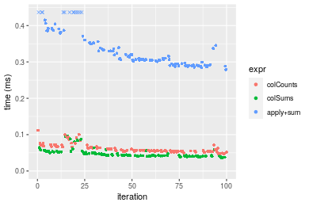


_Table: Benchmarking of colCounts() and rowCounts() on logical+100x100 data (original and transposed).  The top panel shows times in milliseconds and the bottom panel shows relative times._


|   |expr      |    min|      lq|     mean|  median|      uq|     max|
|:--|:---------|------:|-------:|--------:|-------:|-------:|-------:|
|1  |colCounts | 46.368| 54.0520| 61.90345| 56.9535| 66.4380| 111.596|
|2  |rowCounts | 57.531| 64.5465| 71.08554| 67.9245| 79.0695| 106.873|


|   |expr      |      min|       lq|     mean|   median|       uq|       max|
|:--|:---------|--------:|--------:|--------:|--------:|--------:|---------:|
|1  |colCounts | 1.000000| 1.000000| 1.000000| 1.000000| 1.000000| 1.0000000|
|2  |rowCounts | 1.240748| 1.194156| 1.148329| 1.192631| 1.190125| 0.9576777|

_Figure: Benchmarking of colCounts() and rowCounts() on logical+100x100 data (original and transposed).  Outliers are displayed as crosses. Times are in milliseconds._


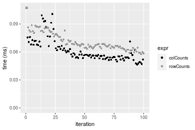

#### 1000x10 matrix


```r
> X <- data[["1000x10"]]
> value <- 42
```


```r
> colStats <- microbenchmark(colCounts = colCounts(X, value = value, na.rm = FALSE), colSums = colSums(X == 
+     value, na.rm = FALSE), `apply+sum` = apply(X, MARGIN = 2L, FUN = function(x) sum(x == value, 
+     na.rm = FALSE)), unit = "ms")
```

```r
> X <- t(X)
```


```r
> rowStats <- microbenchmark(rowCounts = rowCounts(X, value = value, na.rm = FALSE), rowSums = rowSums(X == 
+     value, na.rm = FALSE), `apply+sum` = apply(X, MARGIN = 1L, FUN = function(x) sum(x == value, 
+     na.rm = FALSE)), unit = "ms")
```

_Table: Benchmarking of colCounts(), colSums() and apply+sum() on logical+1000x10 data. The top panel shows times in milliseconds and the bottom panel shows relative times._


|   |expr      |      min|        lq|      mean|    median|        uq|      max|
|:--|:---------|--------:|---------:|---------:|---------:|---------:|--------:|
|2  |colSums   | 0.040137| 0.0421630| 0.0474956| 0.0465065| 0.0514625| 0.081884|
|1  |colCounts | 0.052461| 0.0558320| 0.0625140| 0.0627235| 0.0680485| 0.097588|
|3  |apply+sum | 0.140143| 0.1500765| 0.1682931| 0.1673095| 0.1828435| 0.253373|


|   |expr      |      min|       lq|     mean|   median|       uq|      max|
|:--|:---------|--------:|--------:|--------:|--------:|--------:|--------:|
|2  |colSums   | 1.000000| 1.000000| 1.000000| 1.000000| 1.000000| 1.000000|
|1  |colCounts | 1.307048| 1.324194| 1.316207| 1.348704| 1.322293| 1.191784|
|3  |apply+sum | 3.491616| 3.559436| 3.543342| 3.597551| 3.552946| 3.094292|

_Table: Benchmarking of rowCounts(), rowSums() and apply+sum() on logical+1000x10 data (transposed). The top panel shows times in milliseconds and the bottom panel shows relative times._


|   |expr      |      min|        lq|      mean|    median|        uq|      max|
|:--|:---------|--------:|---------:|---------:|---------:|---------:|--------:|
|1  |rowCounts | 0.063240| 0.0717505| 0.0818468| 0.0806795| 0.0892285| 0.121437|
|3  |apply+sum | 0.128911| 0.1403345| 0.1584276| 0.1466985| 0.1698245| 0.279525|
|2  |rowSums   | 0.181311| 0.1958575| 0.2189991| 0.2067755| 0.2502660| 0.291389|


|   |expr      |      min|       lq|     mean|   median|       uq|      max|
|:--|:---------|--------:|--------:|--------:|--------:|--------:|--------:|
|1  |rowCounts | 1.000000| 1.000000| 1.000000| 1.000000| 1.000000| 1.000000|
|3  |apply+sum | 2.038441| 1.955868| 1.935661| 1.818287| 1.903254| 2.301811|
|2  |rowSums   | 2.867030| 2.729702| 2.675721| 2.562925| 2.804777| 2.399508|

_Figure: Benchmarking of colCounts(), colSums() and apply+sum() on logical+1000x10 data  as well as rowCounts(), rowSums() and apply+sum() on the same data transposed.  Outliers are displayed as crosses.  Times are in milliseconds._


_Table: Benchmarking of colCounts() and rowCounts() on logical+1000x10 data (original and transposed).  The top panel shows times in milliseconds and the bottom panel shows relative times._


|   |expr      |    min|      lq|     mean|  median|      uq|     max|
|:--|:---------|------:|-------:|--------:|-------:|-------:|-------:|
|1  |colCounts | 52.461| 55.8320| 62.51403| 62.7235| 68.0485|  97.588|
|2  |rowCounts | 63.240| 71.7505| 81.84676| 80.6795| 89.2285| 121.437|


|   |expr      |      min|       lq|     mean|   median|       uq|      max|
|:--|:---------|--------:|--------:|--------:|--------:|--------:|--------:|
|1  |colCounts | 1.000000| 1.000000| 1.000000| 1.000000| 1.000000| 1.000000|
|2  |rowCounts | 1.205467| 1.285114| 1.309254| 1.286272| 1.311249| 1.244385|

_Figure: Benchmarking of colCounts() and rowCounts() on logical+1000x10 data (original and transposed).  Outliers are displayed as crosses. Times are in milliseconds._


#### 10x1000 matrix


```r
> X <- data[["10x1000"]]
> value <- 42
```


```r
> colStats <- microbenchmark(colCounts = colCounts(X, value = value, na.rm = FALSE), colSums = colSums(X == 
+     value, na.rm = FALSE), `apply+sum` = apply(X, MARGIN = 2L, FUN = function(x) sum(x == value, 
+     na.rm = FALSE)), unit = "ms")
```

```r
> X <- t(X)
```


```r
> rowStats <- microbenchmark(rowCounts = rowCounts(X, value = value, na.rm = FALSE), rowSums = rowSums(X == 
+     value, na.rm = FALSE), `apply+sum` = apply(X, MARGIN = 1L, FUN = function(x) sum(x == value, 
+     na.rm = FALSE)), unit = "ms")
```

_Table: Benchmarking of colCounts(), colSums() and apply+sum() on logical+10x1000 data. The top panel shows times in milliseconds and the bottom panel shows relative times._


|   |expr      |      min|        lq|      mean|    median|        uq|      max|
|:--|:---------|--------:|---------:|---------:|---------:|---------:|--------:|
|2  |colSums   | 0.030149| 0.0337400| 0.0392194| 0.0360760| 0.0420580| 0.094415|
|1  |colCounts | 0.046557| 0.0510365| 0.0592526| 0.0544325| 0.0624885| 0.113113|
|3  |apply+sum | 1.343127| 1.4221290| 1.5662842| 1.4696620| 1.6894220| 2.341717|


|   |expr      |      min|        lq|      mean|    median|       uq|       max|
|:--|:---------|--------:|---------:|---------:|---------:|--------:|---------:|
|2  |colSums   |  1.00000|  1.000000|  1.000000|  1.000000|  1.00000|  1.000000|
|1  |colCounts |  1.54423|  1.512641|  1.510798|  1.508829|  1.48577|  1.198041|
|3  |apply+sum | 44.54964| 42.149644| 39.936445| 40.737942| 40.16886| 24.802383|

_Table: Benchmarking of rowCounts(), rowSums() and apply+sum() on logical+10x1000 data (transposed). The top panel shows times in milliseconds and the bottom panel shows relative times._


|   |expr      |      min|        lq|      mean|    median|        uq|      max|
|:--|:---------|--------:|---------:|---------:|---------:|---------:|--------:|
|2  |rowSums   | 0.045039| 0.0469505| 0.0558209| 0.0488900| 0.0635320| 0.098466|
|1  |rowCounts | 0.049883| 0.0529590| 0.0629626| 0.0565735| 0.0701535| 0.119705|
|3  |apply+sum | 1.301806| 1.3719245| 1.5317904| 1.4278580| 1.6298125| 2.574432|


|   |expr      |       min|        lq|      mean|    median|        uq|       max|
|:--|:---------|---------:|---------:|---------:|---------:|---------:|---------:|
|2  |rowSums   |  1.000000|  1.000000|  1.000000|  1.000000|  1.000000|  1.000000|
|1  |rowCounts |  1.107551|  1.127975|  1.127939|  1.157159|  1.104223|  1.215699|
|3  |apply+sum | 28.903972| 29.220658| 27.441163| 29.205523| 25.653411| 26.145390|

_Figure: Benchmarking of colCounts(), colSums() and apply+sum() on logical+10x1000 data  as well as rowCounts(), rowSums() and apply+sum() on the same data transposed.  Outliers are displayed as crosses.  Times are in milliseconds._


_Table: Benchmarking of colCounts() and rowCounts() on logical+10x1000 data (original and transposed).  The top panel shows times in milliseconds and the bottom panel shows relative times._


|   |expr      |    min|      lq|     mean|  median|      uq|     max|
|:--|:---------|------:|-------:|--------:|-------:|-------:|-------:|
|1  |colCounts | 46.557| 51.0365| 59.25263| 54.4325| 62.4885| 113.113|
|2  |rowCounts | 49.883| 52.9590| 62.96258| 56.5735| 70.1535| 119.705|


|   |expr      |      min|       lq|     mean|   median|       uq|      max|
|:--|:---------|--------:|--------:|--------:|--------:|--------:|--------:|
|1  |colCounts | 1.000000| 1.000000| 1.000000| 1.000000| 1.000000| 1.000000|
|2  |rowCounts | 1.071439| 1.037669| 1.062612| 1.039333| 1.122663| 1.058278|

_Figure: Benchmarking of colCounts() and rowCounts() on logical+10x1000 data (original and transposed).  Outliers are displayed as crosses. Times are in milliseconds._


#### 100x1000 matrix


```r
> X <- data[["100x1000"]]
> value <- 42
```


```r
> colStats <- microbenchmark(colCounts = colCounts(X, value = value, na.rm = FALSE), colSums = colSums(X == 
+     value, na.rm = FALSE), `apply+sum` = apply(X, MARGIN = 2L, FUN = function(x) sum(x == value, 
+     na.rm = FALSE)), unit = "ms")
```

```r
> X <- t(X)
```


```r
> rowStats <- microbenchmark(rowCounts = rowCounts(X, value = value, na.rm = FALSE), rowSums = rowSums(X == 
+     value, na.rm = FALSE), `apply+sum` = apply(X, MARGIN = 1L, FUN = function(x) sum(x == value, 
+     na.rm = FALSE)), unit = "ms")
```

_Table: Benchmarking of colCounts(), colSums() and apply+sum() on logical+100x1000 data. The top panel shows times in milliseconds and the bottom panel shows relative times._


|   |expr      |      min|       lq|      mean|    median|        uq|       max|
|:--|:---------|--------:|--------:|---------:|---------:|---------:|---------:|
|2  |colSums   | 0.261343| 0.271250| 0.3191512| 0.2892330| 0.3850325|  0.500749|
|1  |colCounts | 0.361892| 0.366153| 0.3924876| 0.3792425| 0.4025380|  0.633757|
|3  |apply+sum | 2.108871| 2.163654| 2.6068709| 2.2452695| 2.5927860| 21.148136|


|   |expr      |      min|       lq|     mean|   median|       uq|       max|
|:--|:---------|--------:|--------:|--------:|--------:|--------:|---------:|
|2  |colSums   | 1.000000| 1.000000| 1.000000| 1.000000| 1.000000|  1.000000|
|1  |colCounts | 1.384740| 1.349873| 1.229786| 1.311201| 1.045465|  1.265618|
|3  |apply+sum | 8.069361| 7.976605| 8.168136| 7.762840| 6.733941| 42.233007|

_Table: Benchmarking of rowCounts(), rowSums() and apply+sum() on logical+100x1000 data (transposed). The top panel shows times in milliseconds and the bottom panel shows relative times._


|   |expr      |      min|        lq|      mean|    median|        uq|       max|
|:--|:---------|--------:|---------:|---------:|---------:|---------:|---------:|
|2  |rowSums   | 0.403698| 0.4098275| 0.4334788| 0.4194305| 0.4459425|  0.592782|
|1  |rowCounts | 0.451865| 0.4645505| 0.4940684| 0.4706145| 0.4872320|  0.791381|
|3  |apply+sum | 2.118802| 2.1820775| 2.5680281| 2.2493745| 2.4374345| 20.257636|


|   |expr      |      min|       lq|     mean|   median|       uq|       max|
|:--|:---------|--------:|--------:|--------:|--------:|--------:|---------:|
|2  |rowSums   | 1.000000| 1.000000| 1.000000| 1.000000| 1.000000|  1.000000|
|1  |rowCounts | 1.119314| 1.133527| 1.139775| 1.122032| 1.092589|  1.335029|
|3  |apply+sum | 5.248483| 5.324380| 5.924230| 5.362925| 5.465804| 34.173838|

_Figure: Benchmarking of colCounts(), colSums() and apply+sum() on logical+100x1000 data  as well as rowCounts(), rowSums() and apply+sum() on the same data transposed.  Outliers are displayed as crosses.  Times are in milliseconds._


_Table: Benchmarking of colCounts() and rowCounts() on logical+100x1000 data (original and transposed).  The top panel shows times in milliseconds and the bottom panel shows relative times._


|   |expr      |     min|       lq|     mean|   median|      uq|     max|
|:--|:---------|-------:|--------:|--------:|--------:|-------:|-------:|
|1  |colCounts | 361.892| 366.1530| 392.4876| 379.2425| 402.538| 633.757|
|2  |rowCounts | 451.865| 464.5505| 494.0684| 470.6145| 487.232| 791.381|


|   |expr      |      min|       lq|     mean|   median|     uq|      max|
|:--|:---------|--------:|--------:|--------:|--------:|------:|--------:|
|1  |colCounts | 1.000000| 1.000000| 1.000000| 1.000000| 1.0000| 1.000000|
|2  |rowCounts | 1.248618| 1.268733| 1.258813| 1.240933| 1.2104| 1.248714|

_Figure: Benchmarking of colCounts() and rowCounts() on logical+100x1000 data (original and transposed).  Outliers are displayed as crosses. Times are in milliseconds._


#### 1000x100 matrix


```r
> X <- data[["1000x100"]]
> value <- 42
```


```r
> colStats <- microbenchmark(colCounts = colCounts(X, value = value, na.rm = FALSE), colSums = colSums(X == 
+     value, na.rm = FALSE), `apply+sum` = apply(X, MARGIN = 2L, FUN = function(x) sum(x == value, 
+     na.rm = FALSE)), unit = "ms")
```

```r
> X <- t(X)
```


```r
> rowStats <- microbenchmark(rowCounts = rowCounts(X, value = value, na.rm = FALSE), rowSums = rowSums(X == 
+     value, na.rm = FALSE), `apply+sum` = apply(X, MARGIN = 1L, FUN = function(x) sum(x == value, 
+     na.rm = FALSE)), unit = "ms")
```

_Table: Benchmarking of colCounts(), colSums() and apply+sum() on logical+1000x100 data. The top panel shows times in milliseconds and the bottom panel shows relative times._


|   |expr      |      min|        lq|      mean|    median|        uq|      max|
|:--|:---------|--------:|---------:|---------:|---------:|---------:|--------:|
|2  |colSums   | 0.264137| 0.2669930| 0.2846517| 0.2701910| 0.2808895| 0.431141|
|1  |colCounts | 0.354495| 0.3570615| 0.4031536| 0.3604420| 0.4485740| 0.626658|
|3  |apply+sum | 0.923800| 0.9360290| 1.1117882| 0.9454405| 1.1225460| 8.602520|


|   |expr      |      min|       lq|     mean|   median|       uq|       max|
|:--|:---------|--------:|--------:|--------:|--------:|--------:|---------:|
|2  |colSums   | 1.000000| 1.000000| 1.000000| 1.000000| 1.000000|  1.000000|
|1  |colCounts | 1.342088| 1.337344| 1.416305| 1.334027| 1.596977|  1.453487|
|3  |apply+sum | 3.497428| 3.505819| 3.905785| 3.499156| 3.996397| 19.952916|

_Table: Benchmarking of rowCounts(), rowSums() and apply+sum() on logical+1000x100 data (transposed). The top panel shows times in milliseconds and the bottom panel shows relative times._


|   |expr      |      min|       lq|      mean|    median|        uq|      max|
|:--|:---------|--------:|--------:|---------:|---------:|---------:|--------:|
|1  |rowCounts | 0.458440| 0.462624| 0.5097221| 0.4677710| 0.5445670| 0.784485|
|2  |rowSums   | 0.504967| 0.506294| 0.6187105| 0.5093805| 0.5350145| 8.288021|
|3  |apply+sum | 0.927031| 0.935527| 1.0321958| 0.9468965| 1.0924870| 1.650107|


|   |expr      |      min|       lq|     mean|   median|        uq|       max|
|:--|:---------|--------:|--------:|--------:|--------:|---------:|---------:|
|1  |rowCounts | 1.000000| 1.000000| 1.000000| 1.000000| 1.0000000|  1.000000|
|2  |rowSums   | 1.101490| 1.094396| 1.213819| 1.088953| 0.9824585| 10.564920|
|3  |apply+sum | 2.022143| 2.022219| 2.025017| 2.024274| 2.0061572|  2.103427|

_Figure: Benchmarking of colCounts(), colSums() and apply+sum() on logical+1000x100 data  as well as rowCounts(), rowSums() and apply+sum() on the same data transposed.  Outliers are displayed as crosses.  Times are in milliseconds._


_Table: Benchmarking of colCounts() and rowCounts() on logical+1000x100 data (original and transposed).  The top panel shows times in milliseconds and the bottom panel shows relative times._


|   |expr      |     min|       lq|     mean|  median|      uq|     max|
|:--|:---------|-------:|--------:|--------:|-------:|-------:|-------:|
|1  |colCounts | 354.495| 357.0615| 403.1535| 360.442| 448.574| 626.658|
|2  |rowCounts | 458.440| 462.6240| 509.7221| 467.771| 544.567| 784.485|


|   |expr      |     min|       lq|     mean|  median|       uq|      max|
|:--|:---------|-------:|--------:|--------:|-------:|--------:|--------:|
|1  |colCounts | 1.00000| 1.000000| 1.000000| 1.00000| 1.000000| 1.000000|
|2  |rowCounts | 1.29322| 1.295642| 1.264337| 1.29777| 1.213996| 1.251855|

_Figure: Benchmarking of colCounts() and rowCounts() on logical+1000x100 data (original and transposed).  Outliers are displayed as crosses. Times are in milliseconds._


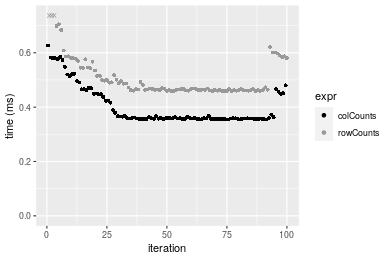


## Data type "integer"

### Data
```r
> rmatrix <- function(nrow, ncol, mode = c("logical", "double", "integer", "index"), range = c(-100, 
+     +100), na_prob = 0) {
+     mode <- match.arg(mode)
+     n <- nrow * ncol
+     if (mode == "logical") {
+         x <- sample(c(FALSE, TRUE), size = n, replace = TRUE)
+     }     else if (mode == "index") {
+         x <- seq_len(n)
+         mode <- "integer"
+     }     else {
+         x <- runif(n, min = range[1], max = range[2])
+     }
+     storage.mode(x) <- mode
+     if (na_prob > 0) 
+         x[sample(n, size = na_prob * n)] <- NA
+     dim(x) <- c(nrow, ncol)
+     x
+ }
> rmatrices <- function(scale = 10, seed = 1, ...) {
+     set.seed(seed)
+     data <- list()
+     data[[1]] <- rmatrix(nrow = scale * 1, ncol = scale * 1, ...)
+     data[[2]] <- rmatrix(nrow = scale * 10, ncol = scale * 10, ...)
+     data[[3]] <- rmatrix(nrow = scale * 100, ncol = scale * 1, ...)
+     data[[4]] <- t(data[[3]])
+     data[[5]] <- rmatrix(nrow = scale * 10, ncol = scale * 100, ...)
+     data[[6]] <- t(data[[5]])
+     names(data) <- sapply(data, FUN = function(x) paste(dim(x), collapse = "x"))
+     data
+ }
> data <- rmatrices(mode = mode)
```

### Results

#### 10x10 matrix


```r
> X <- data[["10x10"]]
> value <- 42
```


```r
> colStats <- microbenchmark(colCounts = colCounts(X, value = value, na.rm = FALSE), colSums = colSums(X == 
+     value, na.rm = FALSE), `apply+sum` = apply(X, MARGIN = 2L, FUN = function(x) sum(x == value, 
+     na.rm = FALSE)), unit = "ms")
```

```r
> X <- t(X)
```


```r
> rowStats <- microbenchmark(rowCounts = rowCounts(X, value = value, na.rm = FALSE), rowSums = rowSums(X == 
+     value, na.rm = FALSE), `apply+sum` = apply(X, MARGIN = 1L, FUN = function(x) sum(x == value, 
+     na.rm = FALSE)), unit = "ms")
```

_Table: Benchmarking of colCounts(), colSums() and apply+sum() on integer+10x10 data. The top panel shows times in milliseconds and the bottom panel shows relative times._


|   |expr      |      min|        lq|      mean|    median|        uq|      max|
|:--|:---------|--------:|---------:|---------:|---------:|---------:|--------:|
|2  |colSums   | 0.006601| 0.0073435| 0.0082847| 0.0080050| 0.0088390| 0.020946|
|1  |colCounts | 0.007739| 0.0084800| 0.0097130| 0.0091470| 0.0103835| 0.036537|
|3  |apply+sum | 0.040574| 0.0431430| 0.0451899| 0.0439965| 0.0449600| 0.119376|


|   |expr      |      min|       lq|     mean|   median|       uq|      max|
|:--|:---------|--------:|--------:|--------:|--------:|--------:|--------:|
|2  |colSums   | 1.000000| 1.000000| 1.000000| 1.000000| 1.000000| 1.000000|
|1  |colCounts | 1.172398| 1.154763| 1.172396| 1.142661| 1.174737| 1.744343|
|3  |apply+sum | 6.146644| 5.874992| 5.454610| 5.496127| 5.086548| 5.699227|

_Table: Benchmarking of rowCounts(), rowSums() and apply+sum() on integer+10x10 data (transposed). The top panel shows times in milliseconds and the bottom panel shows relative times._


|   |expr      |      min|        lq|      mean|    median|       uq|      max|
|:--|:---------|--------:|---------:|---------:|---------:|--------:|--------:|
|1  |rowCounts | 0.006743| 0.0074120| 0.0085415| 0.0085295| 0.009106| 0.032106|
|2  |rowSums   | 0.007384| 0.0081045| 0.0088217| 0.0088050| 0.009185| 0.020475|
|3  |apply+sum | 0.040285| 0.0422760| 0.0446876| 0.0434820| 0.044954| 0.114754|


|   |expr      |      min|       lq|     mean|   median|       uq|       max|
|:--|:---------|--------:|--------:|--------:|--------:|--------:|---------:|
|1  |rowCounts | 1.000000| 1.000000| 1.000000| 1.000000| 1.000000| 1.0000000|
|2  |rowSums   | 1.095061| 1.093430| 1.032803| 1.032300| 1.008676| 0.6377313|
|3  |apply+sum | 5.974344| 5.703724| 5.231806| 5.097837| 4.936745| 3.5742229|

_Figure: Benchmarking of colCounts(), colSums() and apply+sum() on integer+10x10 data  as well as rowCounts(), rowSums() and apply+sum() on the same data transposed.  Outliers are displayed as crosses.  Times are in milliseconds._


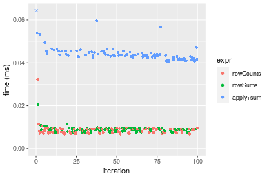
_Table: Benchmarking of colCounts() and rowCounts() on integer+10x10 data (original and transposed).  The top panel shows times in milliseconds and the bottom panel shows relative times._


|   |expr      |   min|    lq|    mean| median|      uq|    max|
|:--|:---------|-----:|-----:|-------:|------:|-------:|------:|
|2  |rowCounts | 6.743| 7.412| 8.54153| 8.5295|  9.1060| 32.106|
|1  |colCounts | 7.739| 8.480| 9.71297| 9.1470| 10.3835| 36.537|


|   |expr      |      min|       lq|     mean|   median|       uq|      max|
|:--|:---------|--------:|--------:|--------:|--------:|--------:|--------:|
|2  |rowCounts | 1.000000| 1.000000| 1.000000| 1.000000| 1.000000| 1.000000|
|1  |colCounts | 1.147709| 1.144091| 1.137146| 1.072396| 1.140292| 1.138012|

_Figure: Benchmarking of colCounts() and rowCounts() on integer+10x10 data (original and transposed).  Outliers are displayed as crosses. Times are in milliseconds._


#### 100x100 matrix


```r
> X <- data[["100x100"]]
> value <- 42
```


```r
> colStats <- microbenchmark(colCounts = colCounts(X, value = value, na.rm = FALSE), colSums = colSums(X == 
+     value, na.rm = FALSE), `apply+sum` = apply(X, MARGIN = 2L, FUN = function(x) sum(x == value, 
+     na.rm = FALSE)), unit = "ms")
```

```r
> X <- t(X)
```


```r
> rowStats <- microbenchmark(rowCounts = rowCounts(X, value = value, na.rm = FALSE), rowSums = rowSums(X == 
+     value, na.rm = FALSE), `apply+sum` = apply(X, MARGIN = 1L, FUN = function(x) sum(x == value, 
+     na.rm = FALSE)), unit = "ms")
```

_Table: Benchmarking of colCounts(), colSums() and apply+sum() on integer+100x100 data. The top panel shows times in milliseconds and the bottom panel shows relative times._


|   |expr      |      min|        lq|      mean|    median|        uq|      max|
|:--|:---------|--------:|---------:|---------:|---------:|---------:|--------:|
|1  |colCounts | 0.015060| 0.0170060| 0.0195454| 0.0182665| 0.0207300| 0.060797|
|2  |colSums   | 0.038388| 0.0404445| 0.0444467| 0.0429670| 0.0473505| 0.064552|
|3  |apply+sum | 0.275794| 0.2877540| 0.3156357| 0.2977740| 0.3343565| 0.470952|


|   |expr      |       min|        lq|      mean|    median|        uq|      max|
|:--|:---------|---------:|---------:|---------:|---------:|---------:|--------:|
|1  |colCounts |  1.000000|  1.000000|  1.000000|  1.000000|  1.000000| 1.000000|
|2  |colSums   |  2.549004|  2.378249|  2.274023|  2.352229|  2.284153| 1.061763|
|3  |apply+sum | 18.313015| 16.920734| 16.148849| 16.301645| 16.129112| 7.746303|

_Table: Benchmarking of rowCounts(), rowSums() and apply+sum() on integer+100x100 data (transposed). The top panel shows times in milliseconds and the bottom panel shows relative times._


|   |expr      |      min|        lq|      mean|    median|        uq|      max|
|:--|:---------|--------:|---------:|---------:|---------:|---------:|--------:|
|1  |rowCounts | 0.022701| 0.0255260| 0.0284739| 0.0268385| 0.0310915| 0.056978|
|2  |rowSums   | 0.066303| 0.0706665| 0.0770138| 0.0742000| 0.0847910| 0.100826|
|3  |apply+sum | 0.265447| 0.2830700| 0.3139990| 0.2967430| 0.3425350| 0.498593|


|   |expr      |       min|        lq|      mean|    median|        uq|      max|
|:--|:---------|---------:|---------:|---------:|---------:|---------:|--------:|
|1  |rowCounts |  1.000000|  1.000000|  1.000000|  1.000000|  1.000000| 1.000000|
|2  |rowSums   |  2.920708|  2.768413|  2.704718|  2.764685|  2.727144| 1.769560|
|3  |apply+sum | 11.693185| 11.089477| 11.027618| 11.056616| 11.016998| 8.750623|

_Figure: Benchmarking of colCounts(), colSums() and apply+sum() on integer+100x100 data  as well as rowCounts(), rowSums() and apply+sum() on the same data transposed.  Outliers are displayed as crosses.  Times are in milliseconds._


_Table: Benchmarking of colCounts() and rowCounts() on integer+100x100 data (original and transposed).  The top panel shows times in milliseconds and the bottom panel shows relative times._


|   |expr      |    min|     lq|     mean|  median|      uq|    max|
|:--|:---------|------:|------:|--------:|-------:|-------:|------:|
|1  |colCounts | 15.060| 17.006| 19.54540| 18.2665| 20.7300| 60.797|
|2  |rowCounts | 22.701| 25.526| 28.47387| 26.8385| 31.0915| 56.978|


|   |expr      |     min|    lq|     mean|   median|       uq|       max|
|:--|:---------|-------:|-----:|--------:|--------:|--------:|---------:|
|1  |colCounts | 1.00000| 1.000| 1.000000| 1.000000| 1.000000| 1.0000000|
|2  |rowCounts | 1.50737| 1.501| 1.456807| 1.469274| 1.499831| 0.9371844|

_Figure: Benchmarking of colCounts() and rowCounts() on integer+100x100 data (original and transposed).  Outliers are displayed as crosses. Times are in milliseconds._


#### 1000x10 matrix


```r
> X <- data[["1000x10"]]
> value <- 42
```


```r
> colStats <- microbenchmark(colCounts = colCounts(X, value = value, na.rm = FALSE), colSums = colSums(X == 
+     value, na.rm = FALSE), `apply+sum` = apply(X, MARGIN = 2L, FUN = function(x) sum(x == value, 
+     na.rm = FALSE)), unit = "ms")
```

```r
> X <- t(X)
```


```r
> rowStats <- microbenchmark(rowCounts = rowCounts(X, value = value, na.rm = FALSE), rowSums = rowSums(X == 
+     value, na.rm = FALSE), `apply+sum` = apply(X, MARGIN = 1L, FUN = function(x) sum(x == value, 
+     na.rm = FALSE)), unit = "ms")
```

_Table: Benchmarking of colCounts(), colSums() and apply+sum() on integer+1000x10 data. The top panel shows times in milliseconds and the bottom panel shows relative times._


|   |expr      |      min|        lq|      mean|   median|        uq|      max|
|:--|:---------|--------:|---------:|---------:|--------:|---------:|--------:|
|1  |colCounts | 0.014731| 0.0162690| 0.0188388| 0.017977| 0.0195425| 0.044159|
|2  |colSums   | 0.039821| 0.0416310| 0.0452287| 0.043642| 0.0465020| 0.080237|
|3  |apply+sum | 0.131626| 0.1374625| 0.1502718| 0.146252| 0.1620910| 0.219330|


|   |expr      |      min|       lq|     mean|   median|       uq|      max|
|:--|:---------|--------:|--------:|--------:|--------:|--------:|--------:|
|1  |colCounts | 1.000000| 1.000000| 1.000000| 1.000000| 1.000000| 1.000000|
|2  |colSums   | 2.703211| 2.558916| 2.400825| 2.427658| 2.379532| 1.817002|
|3  |apply+sum | 8.935306| 8.449352| 7.976712| 8.135506| 8.294282| 4.966824|

_Table: Benchmarking of rowCounts(), rowSums() and apply+sum() on integer+1000x10 data (transposed). The top panel shows times in milliseconds and the bottom panel shows relative times._


|   |expr      |      min|        lq|      mean|   median|        uq|      max|
|:--|:---------|--------:|---------:|---------:|--------:|---------:|--------:|
|1  |rowCounts | 0.021535| 0.0241480| 0.0273777| 0.026082| 0.0295095| 0.054413|
|3  |apply+sum | 0.123974| 0.1293700| 0.1439065| 0.136203| 0.1559240| 0.217259|
|2  |rowSums   | 0.186170| 0.1939435| 0.2148926| 0.202771| 0.2400175| 0.275024|


|   |expr      |      min|       lq|     mean|   median|       uq|      max|
|:--|:---------|--------:|--------:|--------:|--------:|--------:|--------:|
|1  |rowCounts | 1.000000| 1.000000| 1.000000| 1.000000| 1.000000| 1.000000|
|3  |apply+sum | 5.756861| 5.357380| 5.256330| 5.222107| 5.283858| 3.992777|
|2  |rowSums   | 8.644996| 8.031452| 7.849169| 7.774366| 8.133567| 5.054380|

_Figure: Benchmarking of colCounts(), colSums() and apply+sum() on integer+1000x10 data  as well as rowCounts(), rowSums() and apply+sum() on the same data transposed.  Outliers are displayed as crosses.  Times are in milliseconds._


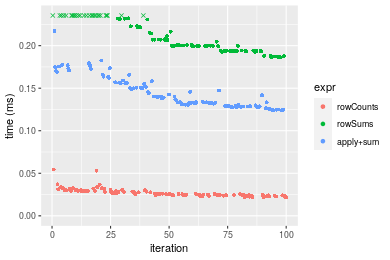
_Table: Benchmarking of colCounts() and rowCounts() on integer+1000x10 data (original and transposed).  The top panel shows times in milliseconds and the bottom panel shows relative times._


|   |expr      |    min|     lq|     mean| median|      uq|    max|
|:--|:---------|------:|------:|--------:|------:|-------:|------:|
|1  |colCounts | 14.731| 16.269| 18.83882| 17.977| 19.5425| 44.159|
|2  |rowCounts | 21.535| 24.148| 27.37775| 26.082| 29.5095| 54.413|


|   |expr      |      min|       lq|     mean|   median|       uq|      max|
|:--|:---------|--------:|--------:|--------:|--------:|--------:|--------:|
|1  |colCounts | 1.000000| 1.000000| 1.000000| 1.000000| 1.000000| 1.000000|
|2  |rowCounts | 1.461883| 1.484295| 1.453262| 1.450854| 1.510017| 1.232206|

_Figure: Benchmarking of colCounts() and rowCounts() on integer+1000x10 data (original and transposed).  Outliers are displayed as crosses. Times are in milliseconds._


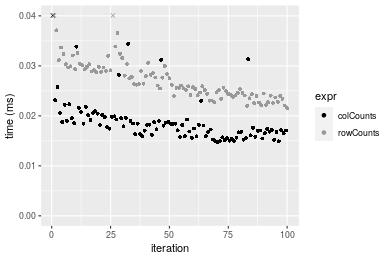

#### 10x1000 matrix


```r
> X <- data[["10x1000"]]
> value <- 42
```


```r
> colStats <- microbenchmark(colCounts = colCounts(X, value = value, na.rm = FALSE), colSums = colSums(X == 
+     value, na.rm = FALSE), `apply+sum` = apply(X, MARGIN = 2L, FUN = function(x) sum(x == value, 
+     na.rm = FALSE)), unit = "ms")
```

```r
> X <- t(X)
```


```r
> rowStats <- microbenchmark(rowCounts = rowCounts(X, value = value, na.rm = FALSE), rowSums = rowSums(X == 
+     value, na.rm = FALSE), `apply+sum` = apply(X, MARGIN = 1L, FUN = function(x) sum(x == value, 
+     na.rm = FALSE)), unit = "ms")
```

_Table: Benchmarking of colCounts(), colSums() and apply+sum() on integer+10x1000 data. The top panel shows times in milliseconds and the bottom panel shows relative times._


|   |expr      |      min|       lq|      mean|    median|       uq|      max|
|:--|:---------|--------:|--------:|---------:|---------:|--------:|--------:|
|1  |colCounts | 0.014284| 0.017018| 0.0204368| 0.0188795| 0.022283| 0.054180|
|2  |colSums   | 0.030019| 0.033480| 0.0402092| 0.0370550| 0.043343| 0.082655|
|3  |apply+sum | 1.311593| 1.356021| 1.5096524| 1.4310310| 1.609368| 2.192649|


|   |expr      |       min|        lq|      mean|    median|        uq|       max|
|:--|:---------|---------:|---------:|---------:|---------:|---------:|---------:|
|1  |colCounts |  1.000000|  1.000000|  1.000000|  1.000000|  1.000000|  1.000000|
|2  |colSums   |  2.101582|  1.967329|  1.967491|  1.962711|  1.945115|  1.525563|
|3  |apply+sum | 91.822529| 79.681602| 73.869314| 75.798141| 72.224050| 40.469712|

_Table: Benchmarking of rowCounts(), rowSums() and apply+sum() on integer+10x1000 data (transposed). The top panel shows times in milliseconds and the bottom panel shows relative times._


|   |expr      |      min|        lq|      mean|    median|        uq|      max|
|:--|:---------|--------:|---------:|---------:|---------:|---------:|--------:|
|1  |rowCounts | 0.018723| 0.0206040| 0.0244442| 0.0223830| 0.0264935| 0.068516|
|2  |rowSums   | 0.044882| 0.0465705| 0.0528485| 0.0482725| 0.0579840| 0.092586|
|3  |apply+sum | 1.302213| 1.3477245| 1.4650412| 1.3794150| 1.5630885| 2.099991|


|   |expr      |       min|        lq|      mean|    median|        uq|       max|
|:--|:---------|---------:|---------:|---------:|---------:|---------:|---------:|
|1  |rowCounts |  1.000000|  1.000000|  1.000000|  1.000000|  1.000000|  1.000000|
|2  |rowSums   |  2.397159|  2.260265|  2.162008|  2.156659|  2.188612|  1.351305|
|3  |apply+sum | 69.551514| 65.410818| 59.934201| 61.627798| 58.998943| 30.649644|

_Figure: Benchmarking of colCounts(), colSums() and apply+sum() on integer+10x1000 data  as well as rowCounts(), rowSums() and apply+sum() on the same data transposed.  Outliers are displayed as crosses.  Times are in milliseconds._


_Table: Benchmarking of colCounts() and rowCounts() on integer+10x1000 data (original and transposed).  The top panel shows times in milliseconds and the bottom panel shows relative times._


|   |expr      |    min|     lq|     mean|  median|      uq|    max|
|:--|:---------|------:|------:|--------:|-------:|-------:|------:|
|1  |colCounts | 14.284| 17.018| 20.43680| 18.8795| 22.2830| 54.180|
|2  |rowCounts | 18.723| 20.604| 24.44416| 22.3830| 26.4935| 68.516|


|   |expr      |      min|       lq|     mean|   median|       uq|    max|
|:--|:---------|--------:|--------:|--------:|--------:|--------:|------:|
|1  |colCounts | 1.000000| 1.000000| 1.000000| 1.000000| 1.000000| 1.0000|
|2  |rowCounts | 1.310767| 1.210718| 1.196085| 1.185572| 1.188956| 1.2646|

_Figure: Benchmarking of colCounts() and rowCounts() on integer+10x1000 data (original and transposed).  Outliers are displayed as crosses. Times are in milliseconds._


#### 100x1000 matrix


```r
> X <- data[["100x1000"]]
> value <- 42
```


```r
> colStats <- microbenchmark(colCounts = colCounts(X, value = value, na.rm = FALSE), colSums = colSums(X == 
+     value, na.rm = FALSE), `apply+sum` = apply(X, MARGIN = 2L, FUN = function(x) sum(x == value, 
+     na.rm = FALSE)), unit = "ms")
```

```r
> X <- t(X)
```


```r
> rowStats <- microbenchmark(rowCounts = rowCounts(X, value = value, na.rm = FALSE), rowSums = rowSums(X == 
+     value, na.rm = FALSE), `apply+sum` = apply(X, MARGIN = 1L, FUN = function(x) sum(x == value, 
+     na.rm = FALSE)), unit = "ms")
```

_Table: Benchmarking of colCounts(), colSums() and apply+sum() on integer+100x1000 data. The top panel shows times in milliseconds and the bottom panel shows relative times._


|   |expr      |      min|        lq|      mean|    median|        uq|       max|
|:--|:---------|--------:|---------:|---------:|---------:|---------:|---------:|
|1  |colCounts | 0.074836| 0.0785405| 0.0865373| 0.0823900| 0.0877020|  0.151099|
|2  |colSums   | 0.261191| 0.2710265| 0.2952926| 0.2802075| 0.2941435|  0.493963|
|3  |apply+sum | 2.051954| 2.0882605| 2.4662292| 2.1891690| 2.3201845| 20.648812|


|   |expr      |       min|        lq|      mean|    median|        uq|        max|
|:--|:---------|---------:|---------:|---------:|---------:|---------:|----------:|
|1  |colCounts |  1.000000|  1.000000|  1.000000|  1.000000|  1.000000|   1.000000|
|2  |colSums   |  3.490178|  3.450786|  3.412315|  3.400989|  3.353897|   3.269135|
|3  |apply+sum | 27.419344| 26.588327| 28.499021| 26.570810| 26.455320| 136.657503|

_Table: Benchmarking of rowCounts(), rowSums() and apply+sum() on integer+100x1000 data (transposed). The top panel shows times in milliseconds and the bottom panel shows relative times._


|   |expr      |      min|        lq|      mean|    median|       uq|       max|
|:--|:---------|--------:|---------:|---------:|---------:|--------:|---------:|
|1  |rowCounts | 0.138607| 0.1431090| 0.1539760| 0.1465505| 0.155522|  0.269581|
|2  |rowSums   | 0.403481| 0.4090745| 0.4296506| 0.4197245| 0.431219|  0.578216|
|3  |apply+sum | 2.033093| 2.0965345| 2.4730421| 2.1712950| 2.384572| 20.292835|


|   |expr      |       min|        lq|      mean|    median|       uq|       max|
|:--|:---------|---------:|---------:|---------:|---------:|--------:|---------:|
|1  |rowCounts |  1.000000|  1.000000|  1.000000|  1.000000|  1.00000|  1.000000|
|2  |rowSums   |  2.910971|  2.858482|  2.790374|  2.864026|  2.77272|  2.144869|
|3  |apply+sum | 14.668040| 14.649914| 16.061222| 14.816019| 15.33270| 75.275464|

_Figure: Benchmarking of colCounts(), colSums() and apply+sum() on integer+100x1000 data  as well as rowCounts(), rowSums() and apply+sum() on the same data transposed.  Outliers are displayed as crosses.  Times are in milliseconds._


_Table: Benchmarking of colCounts() and rowCounts() on integer+100x1000 data (original and transposed).  The top panel shows times in milliseconds and the bottom panel shows relative times._


|   |expr      |     min|       lq|      mean|   median|      uq|     max|
|:--|:---------|-------:|--------:|---------:|--------:|-------:|-------:|
|1  |colCounts |  74.836|  78.5405|  86.53733|  82.3900|  87.702| 151.099|
|2  |rowCounts | 138.607| 143.1090| 153.97596| 146.5505| 155.522| 269.581|


|   |expr      |      min|       lq|     mean|   median|     uq|      max|
|:--|:---------|--------:|--------:|--------:|--------:|------:|--------:|
|1  |colCounts | 1.000000| 1.000000| 1.000000| 1.000000| 1.0000| 1.000000|
|2  |rowCounts | 1.852143| 1.822105| 1.779301| 1.778741| 1.7733| 1.784135|

_Figure: Benchmarking of colCounts() and rowCounts() on integer+100x1000 data (original and transposed).  Outliers are displayed as crosses. Times are in milliseconds._


#### 1000x100 matrix


```r
> X <- data[["1000x100"]]
> value <- 42
```


```r
> colStats <- microbenchmark(colCounts = colCounts(X, value = value, na.rm = FALSE), colSums = colSums(X == 
+     value, na.rm = FALSE), `apply+sum` = apply(X, MARGIN = 2L, FUN = function(x) sum(x == value, 
+     na.rm = FALSE)), unit = "ms")
```

```r
> X <- t(X)
```


```r
> rowStats <- microbenchmark(rowCounts = rowCounts(X, value = value, na.rm = FALSE), rowSums = rowSums(X == 
+     value, na.rm = FALSE), `apply+sum` = apply(X, MARGIN = 1L, FUN = function(x) sum(x == value, 
+     na.rm = FALSE)), unit = "ms")
```

_Table: Benchmarking of colCounts(), colSums() and apply+sum() on integer+1000x100 data. The top panel shows times in milliseconds and the bottom panel shows relative times._


|   |expr      |      min|        lq|      mean|    median|        uq|      max|
|:--|:---------|--------:|---------:|---------:|---------:|---------:|--------:|
|1  |colCounts | 0.066060| 0.0676605| 0.0838680| 0.0726380| 0.0932175| 0.191332|
|2  |colSums   | 0.263842| 0.2671160| 0.3009194| 0.2715075| 0.3320570| 0.465800|
|3  |apply+sum | 0.853779| 0.8656770| 1.0871991| 0.8954545| 1.1339550| 8.654829|


|   |expr      |       min|        lq|     mean|    median|        uq|       max|
|:--|:---------|---------:|---------:|--------:|---------:|---------:|---------:|
|1  |colCounts |  1.000000|  1.000000|  1.00000|  1.000000|  1.000000|  1.000000|
|2  |colSums   |  3.993975|  3.947887|  3.58801|  3.737816|  3.562174|  2.434512|
|3  |apply+sum | 12.924296| 12.794422| 12.96321| 12.327632| 12.164615| 45.234613|

_Table: Benchmarking of rowCounts(), rowSums() and apply+sum() on integer+1000x100 data (transposed). The top panel shows times in milliseconds and the bottom panel shows relative times._


|   |expr      |      min|        lq|      mean|    median|        uq|      max|
|:--|:---------|--------:|---------:|---------:|---------:|---------:|--------:|
|1  |rowCounts | 0.145008| 0.1473055| 0.1653688| 0.1527485| 0.1824495| 0.265969|
|2  |rowSums   | 0.504530| 0.5072465| 0.6229228| 0.5130110| 0.5530105| 7.560175|
|3  |apply+sum | 0.857034| 0.8712995| 0.9813462| 0.8922660| 1.0690230| 1.559909|


|   |expr      |      min|       lq|     mean|   median|       uq|       max|
|:--|:---------|--------:|--------:|--------:|--------:|--------:|---------:|
|1  |rowCounts | 1.000000| 1.000000| 1.000000| 1.000000| 1.000000|  1.000000|
|2  |rowSums   | 3.479325| 3.443500| 3.766870| 3.358534| 3.031033| 28.425023|
|3  |apply+sum | 5.910253| 5.914915| 5.934289| 5.841406| 5.859282|  5.865003|

_Figure: Benchmarking of colCounts(), colSums() and apply+sum() on integer+1000x100 data  as well as rowCounts(), rowSums() and apply+sum() on the same data transposed.  Outliers are displayed as crosses.  Times are in milliseconds._


_Table: Benchmarking of colCounts() and rowCounts() on integer+1000x100 data (original and transposed).  The top panel shows times in milliseconds and the bottom panel shows relative times._


|   |expr      |     min|       lq|      mean|   median|       uq|     max|
|:--|:---------|-------:|--------:|---------:|--------:|--------:|-------:|
|1  |colCounts |  66.060|  67.6605|  83.86805|  72.6380|  93.2175| 191.332|
|2  |rowCounts | 145.008| 147.3055| 165.36878| 152.7485| 182.4495| 265.969|


|   |expr      |      min|       lq|     mean|   median|       uq|      max|
|:--|:---------|--------:|--------:|--------:|--------:|--------:|--------:|
|1  |colCounts | 1.000000| 1.000000| 1.000000| 1.000000| 1.000000| 1.000000|
|2  |rowCounts | 2.195095| 2.177127| 1.971773| 2.102873| 1.957245| 1.390092|

_Figure: Benchmarking of colCounts() and rowCounts() on integer+1000x100 data (original and transposed).  Outliers are displayed as crosses. Times are in milliseconds._


## Data type "double"

### Data
```r
> rmatrix <- function(nrow, ncol, mode = c("logical", "double", "integer", "index"), range = c(-100, 
+     +100), na_prob = 0) {
+     mode <- match.arg(mode)
+     n <- nrow * ncol
+     if (mode == "logical") {
+         x <- sample(c(FALSE, TRUE), size = n, replace = TRUE)
+     }     else if (mode == "index") {
+         x <- seq_len(n)
+         mode <- "integer"
+     }     else {
+         x <- runif(n, min = range[1], max = range[2])
+     }
+     storage.mode(x) <- mode
+     if (na_prob > 0) 
+         x[sample(n, size = na_prob * n)] <- NA
+     dim(x) <- c(nrow, ncol)
+     x
+ }
> rmatrices <- function(scale = 10, seed = 1, ...) {
+     set.seed(seed)
+     data <- list()
+     data[[1]] <- rmatrix(nrow = scale * 1, ncol = scale * 1, ...)
+     data[[2]] <- rmatrix(nrow = scale * 10, ncol = scale * 10, ...)
+     data[[3]] <- rmatrix(nrow = scale * 100, ncol = scale * 1, ...)
+     data[[4]] <- t(data[[3]])
+     data[[5]] <- rmatrix(nrow = scale * 10, ncol = scale * 100, ...)
+     data[[6]] <- t(data[[5]])
+     names(data) <- sapply(data, FUN = function(x) paste(dim(x), collapse = "x"))
+     data
+ }
> data <- rmatrices(mode = mode)
```

### Results

#### 10x10 matrix


```r
> X <- data[["10x10"]]
> value <- 42
```


```r
> colStats <- microbenchmark(colCounts = colCounts(X, value = value, na.rm = FALSE), colSums = colSums(X == 
+     value, na.rm = FALSE), `apply+sum` = apply(X, MARGIN = 2L, FUN = function(x) sum(x == value, 
+     na.rm = FALSE)), unit = "ms")
```

```r
> X <- t(X)
```


```r
> rowStats <- microbenchmark(rowCounts = rowCounts(X, value = value, na.rm = FALSE), rowSums = rowSums(X == 
+     value, na.rm = FALSE), `apply+sum` = apply(X, MARGIN = 1L, FUN = function(x) sum(x == value, 
+     na.rm = FALSE)), unit = "ms")
```

_Table: Benchmarking of colCounts(), colSums() and apply+sum() on double+10x10 data. The top panel shows times in milliseconds and the bottom panel shows relative times._


|   |expr      |      min|        lq|      mean|    median|        uq|      max|
|:--|:---------|--------:|---------:|---------:|---------:|---------:|--------:|
|2  |colSums   | 0.006350| 0.0072695| 0.0085632| 0.0082510| 0.0088780| 0.021279|
|1  |colCounts | 0.007738| 0.0085720| 0.0100339| 0.0094595| 0.0103480| 0.037644|
|3  |apply+sum | 0.042346| 0.0442090| 0.0473068| 0.0449065| 0.0460955| 0.119980|


|   |expr      |      min|       lq|     mean|   median|       uq|      max|
|:--|:---------|--------:|--------:|--------:|--------:|--------:|--------:|
|2  |colSums   | 1.000000| 1.000000| 1.000000| 1.000000| 1.000000| 1.000000|
|1  |colCounts | 1.218583| 1.179173| 1.171743| 1.146467| 1.165578| 1.769068|
|3  |apply+sum | 6.668661| 6.081436| 5.524435| 5.442552| 5.192104| 5.638423|

_Table: Benchmarking of rowCounts(), rowSums() and apply+sum() on double+10x10 data (transposed). The top panel shows times in milliseconds and the bottom panel shows relative times._


|   |expr      |      min|        lq|      mean|    median|        uq|      max|
|:--|:---------|--------:|---------:|---------:|---------:|---------:|--------:|
|1  |rowCounts | 0.006733| 0.0074745| 0.0087072| 0.0088385| 0.0091630| 0.033580|
|2  |rowSums   | 0.007404| 0.0080240| 0.0089398| 0.0088565| 0.0094105| 0.019765|
|3  |apply+sum | 0.042170| 0.0435875| 0.0458676| 0.0442790| 0.0449420| 0.167430|


|   |expr      |      min|       lq|     mean|   median|       uq|       max|
|:--|:---------|--------:|--------:|--------:|--------:|--------:|---------:|
|1  |rowCounts | 1.000000| 1.000000| 1.000000| 1.000000| 1.000000| 1.0000000|
|2  |rowSums   | 1.099658| 1.073517| 1.026719| 1.002036| 1.027011| 0.5885944|
|3  |apply+sum | 6.263181| 5.831494| 5.267778| 5.009787| 4.904725| 4.9860036|

_Figure: Benchmarking of colCounts(), colSums() and apply+sum() on double+10x10 data  as well as rowCounts(), rowSums() and apply+sum() on the same data transposed.  Outliers are displayed as crosses.  Times are in milliseconds._


_Table: Benchmarking of colCounts() and rowCounts() on double+10x10 data (original and transposed).  The top panel shows times in milliseconds and the bottom panel shows relative times._


|   |expr      |   min|     lq|     mean| median|     uq|    max|
|:--|:---------|-----:|------:|--------:|------:|------:|------:|
|2  |rowCounts | 6.733| 7.4745|  8.70720| 8.8385|  9.163| 33.580|
|1  |colCounts | 7.738| 8.5720| 10.03387| 9.4595| 10.348| 37.644|


|   |expr      |      min|       lq|     mean|   median|       uq|      max|
|:--|:---------|--------:|--------:|--------:|--------:|--------:|--------:|
|2  |rowCounts | 1.000000| 1.000000| 1.000000| 1.000000| 1.000000| 1.000000|
|1  |colCounts | 1.149265| 1.146833| 1.152365| 1.070261| 1.129325| 1.121024|

_Figure: Benchmarking of colCounts() and rowCounts() on double+10x10 data (original and transposed).  Outliers are displayed as crosses. Times are in milliseconds._


#### 100x100 matrix


```r
> X <- data[["100x100"]]
> value <- 42
```


```r
> colStats <- microbenchmark(colCounts = colCounts(X, value = value, na.rm = FALSE), colSums = colSums(X == 
+     value, na.rm = FALSE), `apply+sum` = apply(X, MARGIN = 2L, FUN = function(x) sum(x == value, 
+     na.rm = FALSE)), unit = "ms")
```

```r
> X <- t(X)
```


```r
> rowStats <- microbenchmark(rowCounts = rowCounts(X, value = value, na.rm = FALSE), rowSums = rowSums(X == 
+     value, na.rm = FALSE), `apply+sum` = apply(X, MARGIN = 1L, FUN = function(x) sum(x == value, 
+     na.rm = FALSE)), unit = "ms")
```

_Table: Benchmarking of colCounts(), colSums() and apply+sum() on double+100x100 data. The top panel shows times in milliseconds and the bottom panel shows relative times._


|   |expr      |      min|        lq|      mean|    median|        uq|      max|
|:--|:---------|--------:|---------:|---------:|---------:|---------:|--------:|
|1  |colCounts | 0.019315| 0.0216215| 0.0248835| 0.0229120| 0.0264315| 0.068351|
|2  |colSums   | 0.035221| 0.0370065| 0.0418328| 0.0406325| 0.0451275| 0.061254|
|3  |apply+sum | 0.274895| 0.2825740| 0.3177964| 0.2952570| 0.3340440| 0.477387|


|   |expr      |       min|       lq|      mean|    median|        uq|       max|
|:--|:---------|---------:|--------:|---------:|---------:|---------:|---------:|
|1  |colCounts |  1.000000|  1.00000|  1.000000|  1.000000|  1.000000| 1.0000000|
|2  |colSums   |  1.823505|  1.71156|  1.681148|  1.773416|  1.707338| 0.8961683|
|3  |apply+sum | 14.232203| 13.06912| 12.771369| 12.886566| 12.638102| 6.9843455|

_Table: Benchmarking of rowCounts(), rowSums() and apply+sum() on double+100x100 data (transposed). The top panel shows times in milliseconds and the bottom panel shows relative times._


|   |expr      |      min|        lq|      mean|    median|        uq|      max|
|:--|:---------|--------:|---------:|---------:|---------:|---------:|--------:|
|1  |rowCounts | 0.018674| 0.0212115| 0.0234508| 0.0222250| 0.0250200| 0.050941|
|2  |rowSums   | 0.061601| 0.0656455| 0.0717409| 0.0687150| 0.0769245| 0.097380|
|3  |apply+sum | 0.260498| 0.2779735| 0.3063011| 0.2888495| 0.3302950| 0.503861|


|   |expr      |       min|        lq|      mean|    median|       uq|      max|
|:--|:---------|---------:|---------:|---------:|---------:|--------:|--------:|
|1  |rowCounts |  1.000000|  1.000000|  1.000000|  1.000000|  1.00000| 1.000000|
|2  |rowSums   |  3.298758|  3.094807|  3.059209|  3.091788|  3.07452| 1.911623|
|3  |apply+sum | 13.949770| 13.104849| 13.061436| 12.996603| 13.20124| 9.891070|

_Figure: Benchmarking of colCounts(), colSums() and apply+sum() on double+100x100 data  as well as rowCounts(), rowSums() and apply+sum() on the same data transposed.  Outliers are displayed as crosses.  Times are in milliseconds._


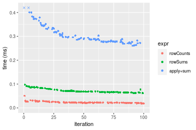
_Table: Benchmarking of colCounts() and rowCounts() on double+100x100 data (original and transposed).  The top panel shows times in milliseconds and the bottom panel shows relative times._


|   |expr      |    min|      lq|    mean| median|      uq|    max|
|:--|:---------|------:|-------:|-------:|------:|-------:|------:|
|2  |rowCounts | 18.674| 21.2115| 23.4508| 22.225| 25.0200| 50.941|
|1  |colCounts | 19.315| 21.6215| 24.8835| 22.912| 26.4315| 68.351|


|   |expr      |      min|       lq|     mean|   median|       uq|      max|
|:--|:---------|--------:|--------:|--------:|--------:|--------:|--------:|
|2  |rowCounts | 1.000000| 1.000000| 1.000000| 1.000000| 1.000000| 1.000000|
|1  |colCounts | 1.034326| 1.019329| 1.061094| 1.030911| 1.056415| 1.341768|

_Figure: Benchmarking of colCounts() and rowCounts() on double+100x100 data (original and transposed).  Outliers are displayed as crosses. Times are in milliseconds._


#### 1000x10 matrix


```r
> X <- data[["1000x10"]]
> value <- 42
```


```r
> colStats <- microbenchmark(colCounts = colCounts(X, value = value, na.rm = FALSE), colSums = colSums(X == 
+     value, na.rm = FALSE), `apply+sum` = apply(X, MARGIN = 2L, FUN = function(x) sum(x == value, 
+     na.rm = FALSE)), unit = "ms")
```

```r
> X <- t(X)
```


```r
> rowStats <- microbenchmark(rowCounts = rowCounts(X, value = value, na.rm = FALSE), rowSums = rowSums(X == 
+     value, na.rm = FALSE), `apply+sum` = apply(X, MARGIN = 1L, FUN = function(x) sum(x == value, 
+     na.rm = FALSE)), unit = "ms")
```

_Table: Benchmarking of colCounts(), colSums() and apply+sum() on double+1000x10 data. The top panel shows times in milliseconds and the bottom panel shows relative times._


|   |expr      |      min|        lq|      mean|    median|        uq|      max|
|:--|:---------|--------:|---------:|---------:|---------:|---------:|--------:|
|1  |colCounts | 0.019521| 0.0220475| 0.0249289| 0.0239215| 0.0258260| 0.074930|
|2  |colSums   | 0.036529| 0.0398005| 0.0452394| 0.0427700| 0.0461280| 0.142064|
|3  |apply+sum | 0.134231| 0.1436985| 0.1600036| 0.1560095| 0.1688235| 0.299705|


|   |expr      |      min|       lq|     mean|   median|       uq|      max|
|:--|:---------|--------:|--------:|--------:|--------:|--------:|--------:|
|1  |colCounts | 1.000000| 1.000000| 1.000000| 1.000000| 1.000000| 1.000000|
|2  |colSums   | 1.871267| 1.805216| 1.814739| 1.787931| 1.786107| 1.895956|
|3  |apply+sum | 6.876236| 6.517678| 6.418408| 6.521727| 6.536959| 3.999800|

_Table: Benchmarking of rowCounts(), rowSums() and apply+sum() on double+1000x10 data (transposed). The top panel shows times in milliseconds and the bottom panel shows relative times._


|   |expr      |      min|        lq|      mean|    median|       uq|      max|
|:--|:---------|--------:|---------:|---------:|---------:|--------:|--------:|
|1  |rowCounts | 0.019320| 0.0218085| 0.0263440| 0.0251540| 0.026535| 0.071538|
|3  |apply+sum | 0.129371| 0.1352715| 0.1611321| 0.1422125| 0.168951| 0.362152|
|2  |rowSums   | 0.190320| 0.1977460| 0.2210332| 0.2114500| 0.246531| 0.301963|


|   |expr      |      min|       lq|     mean|   median|       uq|      max|
|:--|:---------|--------:|--------:|--------:|--------:|--------:|--------:|
|1  |rowCounts | 1.000000| 1.000000| 1.000000| 1.000000| 1.000000| 1.000000|
|3  |apply+sum | 6.696222| 6.202696| 6.116461| 5.653673| 6.367100| 5.062372|
|2  |rowSums   | 9.850932| 9.067382| 8.390265| 8.406218| 9.290786| 4.221015|

_Figure: Benchmarking of colCounts(), colSums() and apply+sum() on double+1000x10 data  as well as rowCounts(), rowSums() and apply+sum() on the same data transposed.  Outliers are displayed as crosses.  Times are in milliseconds._


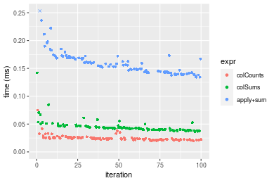

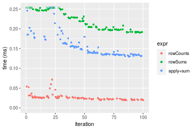
_Table: Benchmarking of colCounts() and rowCounts() on double+1000x10 data (original and transposed).  The top panel shows times in milliseconds and the bottom panel shows relative times._


|   |expr      |    min|      lq|     mean|  median|     uq|    max|
|:--|:---------|------:|-------:|--------:|-------:|------:|------:|
|1  |colCounts | 19.521| 22.0475| 24.92886| 23.9215| 25.826| 74.930|
|2  |rowCounts | 19.320| 21.8085| 26.34401| 25.1540| 26.535| 71.538|


|   |expr      |       min|        lq|     mean|   median|       uq|       max|
|:--|:---------|---------:|---------:|--------:|--------:|--------:|---------:|
|1  |colCounts | 1.0000000| 1.0000000| 1.000000| 1.000000| 1.000000| 1.0000000|
|2  |rowCounts | 0.9897034| 0.9891598| 1.056768| 1.051523| 1.027453| 0.9547311|

_Figure: Benchmarking of colCounts() and rowCounts() on double+1000x10 data (original and transposed).  Outliers are displayed as crosses. Times are in milliseconds._


#### 10x1000 matrix


```r
> X <- data[["10x1000"]]
> value <- 42
```


```r
> colStats <- microbenchmark(colCounts = colCounts(X, value = value, na.rm = FALSE), colSums = colSums(X == 
+     value, na.rm = FALSE), `apply+sum` = apply(X, MARGIN = 2L, FUN = function(x) sum(x == value, 
+     na.rm = FALSE)), unit = "ms")
```

```r
> X <- t(X)
```


```r
> rowStats <- microbenchmark(rowCounts = rowCounts(X, value = value, na.rm = FALSE), rowSums = rowSums(X == 
+     value, na.rm = FALSE), `apply+sum` = apply(X, MARGIN = 1L, FUN = function(x) sum(x == value, 
+     na.rm = FALSE)), unit = "ms")
```

_Table: Benchmarking of colCounts(), colSums() and apply+sum() on double+10x1000 data. The top panel shows times in milliseconds and the bottom panel shows relative times._


|   |expr      |      min|        lq|      mean|    median|       uq|      max|
|:--|:---------|--------:|---------:|---------:|---------:|--------:|--------:|
|1  |colCounts | 0.016777| 0.0189145| 0.0248176| 0.0221425| 0.026590| 0.074802|
|2  |colSums   | 0.027659| 0.0317780| 0.0377182| 0.0353500| 0.038784| 0.092343|
|3  |apply+sum | 1.287584| 1.4017560| 1.5128844| 1.4757060| 1.573189| 2.590975|


|   |expr      |       min|        lq|      mean|    median|        uq|       max|
|:--|:---------|---------:|---------:|---------:|---------:|---------:|---------:|
|1  |colCounts |  1.000000|  1.000000|  1.000000|  1.000000|  1.000000|  1.000000|
|2  |colSums   |  1.648626|  1.680087|  1.519816|  1.596477|  1.458594|  1.234499|
|3  |apply+sum | 76.746975| 74.110127| 60.960066| 66.645862| 59.164686| 34.637777|

_Table: Benchmarking of rowCounts(), rowSums() and apply+sum() on double+10x1000 data (transposed). The top panel shows times in milliseconds and the bottom panel shows relative times._


|   |expr      |      min|        lq|      mean|    median|       uq|      max|
|:--|:---------|--------:|---------:|---------:|---------:|--------:|--------:|
|1  |rowCounts | 0.015787| 0.0190205| 0.0224049| 0.0207755| 0.023704| 0.065639|
|2  |rowSums   | 0.042511| 0.0468050| 0.0519133| 0.0489985| 0.054957| 0.092636|
|3  |apply+sum | 1.295856| 1.3844675| 1.4861423| 1.4685930| 1.555566| 1.830412|


|   |expr      |       min|        lq|      mean|    median|        uq|       max|
|:--|:---------|---------:|---------:|---------:|---------:|---------:|---------:|
|1  |rowCounts |  1.000000|  1.000000|  1.000000|  1.000000|  1.000000|  1.000000|
|2  |rowSums   |  2.692785|  2.460766|  2.317049|  2.358475|  2.318469|  1.411295|
|3  |apply+sum | 82.083740| 72.788176| 66.331071| 70.688696| 65.624620| 27.886043|

_Figure: Benchmarking of colCounts(), colSums() and apply+sum() on double+10x1000 data  as well as rowCounts(), rowSums() and apply+sum() on the same data transposed.  Outliers are displayed as crosses.  Times are in milliseconds._


_Table: Benchmarking of colCounts() and rowCounts() on double+10x1000 data (original and transposed).  The top panel shows times in milliseconds and the bottom panel shows relative times._


|   |expr      |    min|      lq|     mean|  median|     uq|    max|
|:--|:---------|------:|-------:|--------:|-------:|------:|------:|
|2  |rowCounts | 15.787| 19.0205| 22.40492| 20.7755| 23.704| 65.639|
|1  |colCounts | 16.777| 18.9145| 24.81763| 22.1425| 26.590| 74.802|


|   |expr      |     min|        lq|     mean|   median|       uq|      max|
|:--|:---------|-------:|---------:|--------:|--------:|--------:|--------:|
|2  |rowCounts | 1.00000| 1.0000000| 1.000000| 1.000000| 1.000000| 1.000000|
|1  |colCounts | 1.06271| 0.9944271| 1.107687| 1.065799| 1.121752| 1.139597|

_Figure: Benchmarking of colCounts() and rowCounts() on double+10x1000 data (original and transposed).  Outliers are displayed as crosses. Times are in milliseconds._


#### 100x1000 matrix


```r
> X <- data[["100x1000"]]
> value <- 42
```


```r
> colStats <- microbenchmark(colCounts = colCounts(X, value = value, na.rm = FALSE), colSums = colSums(X == 
+     value, na.rm = FALSE), `apply+sum` = apply(X, MARGIN = 2L, FUN = function(x) sum(x == value, 
+     na.rm = FALSE)), unit = "ms")
```

```r
> X <- t(X)
```


```r
> rowStats <- microbenchmark(rowCounts = rowCounts(X, value = value, na.rm = FALSE), rowSums = rowSums(X == 
+     value, na.rm = FALSE), `apply+sum` = apply(X, MARGIN = 1L, FUN = function(x) sum(x == value, 
+     na.rm = FALSE)), unit = "ms")
```

_Table: Benchmarking of colCounts(), colSums() and apply+sum() on double+100x1000 data. The top panel shows times in milliseconds and the bottom panel shows relative times._


|   |expr      |      min|       lq|      mean|    median|        uq|       max|
|:--|:---------|--------:|--------:|---------:|---------:|---------:|---------:|
|1  |colCounts | 0.106208| 0.110792| 0.1249620| 0.1196105| 0.1286505|  0.211605|
|2  |colSums   | 0.234996| 0.244717| 0.2731302| 0.2557090| 0.2808200|  0.488140|
|3  |apply+sum | 2.017583| 2.098267| 2.5172652| 2.1463755| 2.5706040| 20.252990|


|   |expr      |       min|        lq|      mean|    median|        uq|       max|
|:--|:---------|---------:|---------:|---------:|---------:|---------:|---------:|
|1  |colCounts |  1.000000|  1.000000|  1.000000|  1.000000|  1.000000|  1.000000|
|2  |colSums   |  2.212602|  2.208797|  2.185705|  2.137847|  2.182813|  2.306845|
|3  |apply+sum | 18.996526| 18.938795| 20.144237| 17.944708| 19.981298| 95.711302|

_Table: Benchmarking of rowCounts(), rowSums() and apply+sum() on double+100x1000 data (transposed). The top panel shows times in milliseconds and the bottom panel shows relative times._


|   |expr      |      min|       lq|      mean|    median|        uq|       max|
|:--|:---------|--------:|--------:|---------:|---------:|---------:|---------:|
|1  |rowCounts | 0.111257| 0.120393| 0.1369497| 0.1331260| 0.1457465|  0.240432|
|2  |rowSums   | 0.378523| 0.400822| 0.4221277| 0.4146545| 0.4305350|  0.587751|
|3  |apply+sum | 2.064423| 2.199650| 2.5900267| 2.2840775| 2.5770720| 19.405890|


|   |expr      |      min|       lq|      mean|    median|        uq|       max|
|:--|:---------|--------:|--------:|---------:|---------:|---------:|---------:|
|1  |rowCounts |  1.00000|  1.00000|  1.000000|  1.000000|  1.000000|  1.000000|
|2  |rowSums   |  3.40224|  3.32928|  3.082356|  3.114752|  2.953999|  2.444562|
|3  |apply+sum | 18.55544| 18.27058| 18.912250| 17.157261| 17.681879| 80.712592|

_Figure: Benchmarking of colCounts(), colSums() and apply+sum() on double+100x1000 data  as well as rowCounts(), rowSums() and apply+sum() on the same data transposed.  Outliers are displayed as crosses.  Times are in milliseconds._


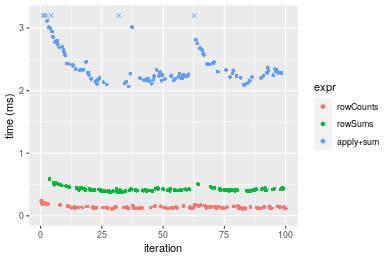
_Table: Benchmarking of colCounts() and rowCounts() on double+100x1000 data (original and transposed).  The top panel shows times in milliseconds and the bottom panel shows relative times._


|   |expr      |     min|      lq|     mean|   median|       uq|     max|
|:--|:---------|-------:|-------:|--------:|--------:|--------:|-------:|
|1  |colCounts | 106.208| 110.792| 124.9621| 119.6105| 128.6505| 211.605|
|2  |rowCounts | 111.257| 120.393| 136.9497| 133.1260| 145.7465| 240.432|


|   |expr      |      min|       lq|    mean|   median|       uq|     max|
|:--|:---------|--------:|--------:|-------:|--------:|--------:|-------:|
|1  |colCounts | 1.000000| 1.000000| 1.00000| 1.000000| 1.000000| 1.00000|
|2  |rowCounts | 1.047539| 1.086658| 1.09593| 1.112996| 1.132887| 1.13623|

_Figure: Benchmarking of colCounts() and rowCounts() on double+100x1000 data (original and transposed).  Outliers are displayed as crosses. Times are in milliseconds._


#### 1000x100 matrix


```r
> X <- data[["1000x100"]]
> value <- 42
```


```r
> colStats <- microbenchmark(colCounts = colCounts(X, value = value, na.rm = FALSE), colSums = colSums(X == 
+     value, na.rm = FALSE), `apply+sum` = apply(X, MARGIN = 2L, FUN = function(x) sum(x == value, 
+     na.rm = FALSE)), unit = "ms")
```

```r
> X <- t(X)
```


```r
> rowStats <- microbenchmark(rowCounts = rowCounts(X, value = value, na.rm = FALSE), rowSums = rowSums(X == 
+     value, na.rm = FALSE), `apply+sum` = apply(X, MARGIN = 1L, FUN = function(x) sum(x == value, 
+     na.rm = FALSE)), unit = "ms")
```

_Table: Benchmarking of colCounts(), colSums() and apply+sum() on double+1000x100 data. The top panel shows times in milliseconds and the bottom panel shows relative times._


|   |expr      |      min|        lq|      mean|    median|       uq|      max|
|:--|:---------|--------:|---------:|---------:|---------:|--------:|--------:|
|1  |colCounts | 0.100316| 0.1228340| 0.1337999| 0.1307415| 0.144953| 0.219630|
|2  |colSums   | 0.239877| 0.2684070| 0.3544476| 0.2955835| 0.316224| 6.538396|
|3  |apply+sum | 0.869230| 0.9984675| 1.0835718| 1.1017920| 1.132891| 1.663588|


|   |expr      |      min|       lq|     mean|   median|       uq|       max|
|:--|:---------|--------:|--------:|--------:|--------:|--------:|---------:|
|1  |colCounts | 1.000000| 1.000000| 1.000000| 1.000000| 1.000000|  1.000000|
|2  |colSums   | 2.391214| 2.185120| 2.649087| 2.260824| 2.181562| 29.770050|
|3  |apply+sum | 8.664919| 8.128592| 8.098448| 8.427255| 7.815571|  7.574503|

_Table: Benchmarking of rowCounts(), rowSums() and apply+sum() on double+1000x100 data (transposed). The top panel shows times in milliseconds and the bottom panel shows relative times._


|   |expr      |      min|        lq|      mean|    median|        uq|      max|
|:--|:---------|--------:|---------:|---------:|---------:|---------:|--------:|
|1  |rowCounts | 0.117644| 0.1241655| 0.1348207| 0.1272840| 0.1397885| 0.225083|
|2  |rowSums   | 0.478986| 0.4848400| 0.5212520| 0.5029105| 0.5274120| 0.733624|
|3  |apply+sum | 0.880771| 0.9132125| 1.0615535| 0.9532880| 1.0444710| 7.144646|


|   |expr      |      min|       lq|     mean|   median|       uq|       max|
|:--|:---------|--------:|--------:|--------:|--------:|--------:|---------:|
|1  |rowCounts | 1.000000| 1.000000| 1.000000| 1.000000| 1.000000|  1.000000|
|2  |rowSums   | 4.071487| 3.904788| 3.866261| 3.951090| 3.772928|  3.259349|
|3  |apply+sum | 7.486748| 7.354801| 7.873817| 7.489457| 7.471795| 31.742273|

_Figure: Benchmarking of colCounts(), colSums() and apply+sum() on double+1000x100 data  as well as rowCounts(), rowSums() and apply+sum() on the same data transposed.  Outliers are displayed as crosses.  Times are in milliseconds._


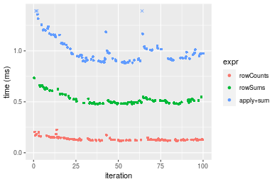
_Table: Benchmarking of colCounts() and rowCounts() on double+1000x100 data (original and transposed).  The top panel shows times in milliseconds and the bottom panel shows relative times._


|   |expr      |     min|       lq|     mean|   median|       uq|     max|
|:--|:---------|-------:|--------:|--------:|--------:|--------:|-------:|
|2  |rowCounts | 117.644| 124.1655| 134.8207| 127.2840| 139.7885| 225.083|
|1  |colCounts | 100.316| 122.8340| 133.7999| 130.7415| 144.9530| 219.630|


|   |expr      |       min|        lq|      mean|   median|       uq|       max|
|:--|:---------|---------:|---------:|---------:|--------:|--------:|---------:|
|2  |rowCounts | 1.0000000| 1.0000000| 1.0000000| 1.000000| 1.000000| 1.0000000|
|1  |colCounts | 0.8527082| 0.9892764| 0.9924287| 1.027164| 1.036945| 0.9757734|

_Figure: Benchmarking of colCounts() and rowCounts() on double+1000x100 data (original and transposed).  Outliers are displayed as crosses. Times are in milliseconds._


## Appendix

### Session information
```r
R version 4.1.1 Patched (2021-08-10 r80727)
Platform: x86_64-pc-linux-gnu (64-bit)
Running under: Ubuntu 18.04.5 LTS

Matrix products: default
BLAS:   /home/hb/software/R-devel/R-4-1-branch/lib/R/lib/libRblas.so
LAPACK: /home/hb/software/R-devel/R-4-1-branch/lib/R/lib/libRlapack.so

locale:
 [1] LC_CTYPE=en_US.UTF-8       LC_NUMERIC=C              
 [3] LC_TIME=en_US.UTF-8        LC_COLLATE=en_US.UTF-8    
 [5] LC_MONETARY=en_US.UTF-8    LC_MESSAGES=en_US.UTF-8   
 [7] LC_PAPER=en_US.UTF-8       LC_NAME=C                 
 [9] LC_ADDRESS=C               LC_TELEPHONE=C            
[11] LC_MEASUREMENT=en_US.UTF-8 LC_IDENTIFICATION=C       

attached base packages:
[1] stats     graphics  grDevices utils     datasets  methods   base     

other attached packages:
[1] microbenchmark_1.4-7   matrixStats_0.60.0     ggplot2_3.3.5         
[4] knitr_1.33             R.devices_2.17.0       R.utils_2.10.1        
[7] R.oo_1.24.0            R.methodsS3_1.8.1-9001 history_0.0.1-9000    

loaded via a namespace (and not attached):
 [1] Biobase_2.52.0          httr_1.4.2              splines_4.1.1          
 [4] bit64_4.0.5             network_1.17.1          assertthat_0.2.1       
 [7] highr_0.9               stats4_4.1.1            blob_1.2.2             
[10] GenomeInfoDbData_1.2.6  robustbase_0.93-8       pillar_1.6.2           
[13] RSQLite_2.2.8           lattice_0.20-44         glue_1.4.2             
[16] digest_0.6.27           XVector_0.32.0          colorspace_2.0-2       
[19] Matrix_1.3-4            XML_3.99-0.7            pkgconfig_2.0.3        
[22] zlibbioc_1.38.0         genefilter_1.74.0       purrr_0.3.4            
[25] ergm_4.1.2              xtable_1.8-4            scales_1.1.1           
[28] tibble_3.1.4            annotate_1.70.0         KEGGREST_1.32.0        
[31] farver_2.1.0            generics_0.1.0          IRanges_2.26.0         
[34] ellipsis_0.3.2          cachem_1.0.6            withr_2.4.2            
[37] BiocGenerics_0.38.0     mime_0.11               survival_3.2-13        
[40] magrittr_2.0.1          crayon_1.4.1            statnet.common_4.5.0   
[43] memoise_2.0.0           laeken_0.5.1            fansi_0.5.0            
[46] R.cache_0.15.0          MASS_7.3-54             R.rsp_0.44.0           
[49] progressr_0.8.0         tools_4.1.1             lifecycle_1.0.0        
[52] S4Vectors_0.30.0        trust_0.1-8             munsell_0.5.0          
[55] tabby_0.0.1-9001        AnnotationDbi_1.54.1    Biostrings_2.60.2      
[58] compiler_4.1.1          GenomeInfoDb_1.28.1     rlang_0.4.11           
[61] grid_4.1.1              RCurl_1.98-1.4          cwhmisc_6.6            
[64] rstudioapi_0.13         rappdirs_0.3.3          startup_0.15.0         
[67] labeling_0.4.2          bitops_1.0-7            base64enc_0.1-3        
[70] boot_1.3-28             gtable_0.3.0            DBI_1.1.1              
[73] markdown_1.1            R6_2.5.1                lpSolveAPI_5.5.2.0-17.7
[76] rle_0.9.2               dplyr_1.0.7             fastmap_1.1.0          
[79] bit_4.0.4               utf8_1.2.2              parallel_4.1.1         
[82] Rcpp_1.0.7              vctrs_0.3.8             png_0.1-7              
[85] DEoptimR_1.0-9          tidyselect_1.1.1        xfun_0.25              
[88] coda_0.19-4            
```
Total processing time was 38.03 secs.


### Reproducibility
To reproduce this report, do:
```r
html <- matrixStats:::benchmark('colCounts')
```

[RSP]: https://cran.r-project.org/package=R.rsp
[matrixStats]: https://cran.r-project.org/package=matrixStats

[StackOverflow:colMins?]: https://stackoverflow.com/questions/13676878 "Stack Overflow: fastest way to get Min from every column in a matrix?"
[StackOverflow:colSds?]: https://stackoverflow.com/questions/17549762 "Stack Overflow: Is there such 'colsd' in R?"
[StackOverflow:rowProds?]: https://stackoverflow.com/questions/20198801/ "Stack Overflow: Row product of matrix and column sum of matrix"

---------------------------------------
Copyright Henrik Bengtsson. Last updated on 2021-08-25 22:12:40 (+0200 UTC). Powered by [RSP].

<script>
 var link = document.createElement('link');
 link.rel = 'icon';
 link.href = "data:image/png;base64,iVBORw0KGgoAAAANSUhEUgAAACAAAAAgCAMAAABEpIrGAAAA21BMVEUAAAAAAP8AAP8AAP8AAP8AAP8AAP8AAP8AAP8AAP8AAP8AAP8AAP8AAP8AAP8AAP8AAP8AAP8AAP8AAP8AAP8AAP8AAP8AAP8AAP8AAP8AAP8AAP8AAP8AAP8AAP8AAP8AAP8AAP8AAP8AAP8AAP8AAP8AAP8AAP8AAP8AAP8BAf4CAv0DA/wdHeIeHuEfH+AgIN8hId4lJdomJtknJ9g+PsE/P8BAQL9yco10dIt1dYp3d4h4eIeVlWqWlmmXl2iYmGeZmWabm2Tn5xjo6Bfp6Rb39wj4+Af//wA2M9hbAAAASXRSTlMAAQIJCgsMJSYnKD4/QGRlZmhpamtsbautrrCxuru8y8zN5ebn6Pn6+///////////////////////////////////////////LsUNcQAAAS9JREFUOI29k21XgkAQhVcFytdSMqMETU26UVqGmpaiFbL//xc1cAhhwVNf6n5i5z67M2dmYOyfJZUqlVLhkKucG7cgmUZTybDz6g0iDeq51PUr37Ds2cy2/C9NeES5puDjxuUk1xnToZsg8pfA3avHQ3lLIi7iWRrkv/OYtkScxBIMgDee0ALoyxHQBJ68JLCjOtQIMIANF7QG9G9fNnHvisCHBVMKgSJgiz7nE+AoBKrAPA3MgepvgR9TSCasrCKH0eB1wBGBFdCO+nAGjMVGPcQb5bd6mQRegN6+1axOs9nGfYcCtfi4NQosdtH7dB+txFIpXQqN1p9B/asRHToyS0jRgpV7nk4nwcq1BJ+x3Gl/v7S9Wmpp/aGquum7w3ZDyrADFYrl8vHBH+ev9AUASW1dmU4h4wAAAABJRU5ErkJggg=="
 document.getElementsByTagName('head')[0].appendChild(link);
</script>


