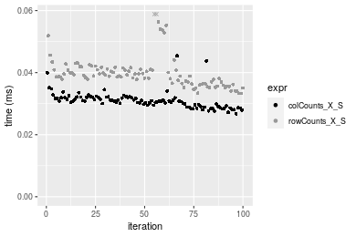
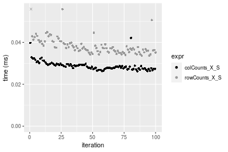
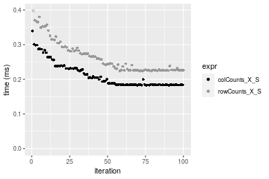
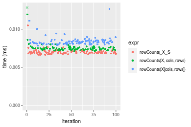
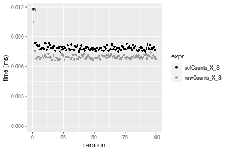
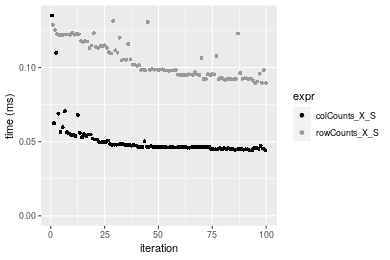
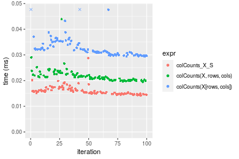
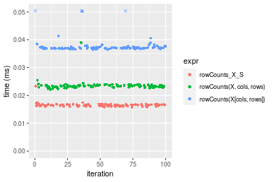
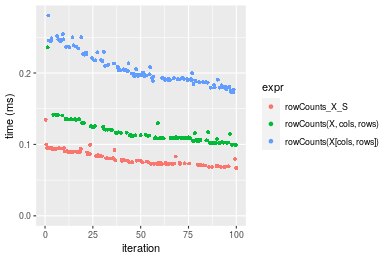
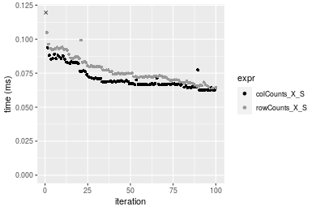

[matrixStats]: Benchmark report

---------------------------------------


# colCounts() and rowCounts() benchmarks on subsetted computation

This report benchmark the performance of colCounts() and rowCounts() on subsetted computation.


## Data type "logical"

### Data
```r
> rmatrix <- function(nrow, ncol, mode = c("logical", "double", "integer", "index"), range = c(-100, 
+     +100), na_prob = 0) {
+     mode <- match.arg(mode)
+     n <- nrow * ncol
+     if (mode == "logical") {
+         x <- sample(c(FALSE, TRUE), size = n, replace = TRUE)
+     }     else if (mode == "index") {
+         x <- seq_len(n)
+         mode <- "integer"
+     }     else {
+         x <- runif(n, min = range[1], max = range[2])
+     }
+     storage.mode(x) <- mode
+     if (na_prob > 0) 
+         x[sample(n, size = na_prob * n)] <- NA
+     dim(x) <- c(nrow, ncol)
+     x
+ }
> rmatrices <- function(scale = 10, seed = 1, ...) {
+     set.seed(seed)
+     data <- list()
+     data[[1]] <- rmatrix(nrow = scale * 1, ncol = scale * 1, ...)
+     data[[2]] <- rmatrix(nrow = scale * 10, ncol = scale * 10, ...)
+     data[[3]] <- rmatrix(nrow = scale * 100, ncol = scale * 1, ...)
+     data[[4]] <- t(data[[3]])
+     data[[5]] <- rmatrix(nrow = scale * 10, ncol = scale * 100, ...)
+     data[[6]] <- t(data[[5]])
+     names(data) <- sapply(data, FUN = function(x) paste(dim(x), collapse = "x"))
+     data
+ }
> data <- rmatrices(mode = mode)
```

### Results

#### 10x10 matrix


```r
> X <- data[["10x10"]]
> rows <- sample.int(nrow(X), size = nrow(X) * 0.7)
> cols <- sample.int(ncol(X), size = ncol(X) * 0.7)
> X_S <- X[rows, cols]
> value <- 42
```


```r
> colStats <- microbenchmark(colCounts_X_S = colCounts(X_S, value = value, na.rm = FALSE), `colCounts(X, rows, cols)` = colCounts(X, 
+     value = value, na.rm = FALSE, rows = rows, cols = cols), `colCounts(X[rows, cols])` = colCounts(X[rows, 
+     cols], value = value, na.rm = FALSE), unit = "ms")
```

```r
> X <- t(X)
> X_S <- t(X_S)
```


```r
> rowStats <- microbenchmark(rowCounts_X_S = rowCounts(X_S, value = value, na.rm = FALSE), `rowCounts(X, cols, rows)` = rowCounts(X, 
+     value = value, na.rm = FALSE, rows = cols, cols = rows), `rowCounts(X[cols, rows])` = rowCounts(X[cols, 
+     rows], value = value, na.rm = FALSE), unit = "ms")
```

_Table: Benchmarking of colCounts_X_S(), colCounts(X, rows, cols)() and colCounts(X[rows, cols])() on logical+10x10 data. The top panel shows times in milliseconds and the bottom panel shows relative times._


|   |expr                     |      min|       lq|      mean|    median|        uq|      max|
|:--|:------------------------|--------:|--------:|---------:|---------:|---------:|--------:|
|1  |colCounts_X_S            | 0.007606| 0.007801| 0.0109994| 0.0079300| 0.0080450| 0.309395|
|2  |colCounts(X, rows, cols) | 0.008064| 0.008298| 0.0084776| 0.0083755| 0.0085375| 0.012016|
|3  |colCounts(X[rows, cols]) | 0.008854| 0.009214| 0.0094591| 0.0093510| 0.0095015| 0.015203|


|   |expr                     |      min|       lq|      mean|   median|       uq|       max|
|:--|:------------------------|--------:|--------:|---------:|--------:|--------:|---------:|
|1  |colCounts_X_S            | 1.000000| 1.000000| 1.0000000| 1.000000| 1.000000| 1.0000000|
|2  |colCounts(X, rows, cols) | 1.060216| 1.063710| 0.7707346| 1.056179| 1.061218| 0.0388371|
|3  |colCounts(X[rows, cols]) | 1.164081| 1.181131| 0.8599695| 1.179193| 1.181044| 0.0491378|

_Table: Benchmarking of rowCounts_X_S(), rowCounts(X, cols, rows)() and rowCounts(X[cols, rows])() on logical+10x10 data (transposed). The top panel shows times in milliseconds and the bottom panel shows relative times._


|   |expr                     |      min|        lq|      mean|    median|        uq|      max|
|:--|:------------------------|--------:|---------:|---------:|---------:|---------:|--------:|
|1  |rowCounts_X_S            | 0.006708| 0.0069125| 0.0070966| 0.0070305| 0.0071560| 0.010921|
|2  |rowCounts(X, cols, rows) | 0.007063| 0.0072965| 0.0106442| 0.0074065| 0.0075370| 0.312444|
|3  |rowCounts(X[cols, rows]) | 0.007837| 0.0081360| 0.0084116| 0.0082715| 0.0084395| 0.013255|


|   |expr                     |      min|       lq|     mean|   median|       uq|       max|
|:--|:------------------------|--------:|--------:|--------:|--------:|--------:|---------:|
|1  |rowCounts_X_S            | 1.000000| 1.000000| 1.000000| 1.000000| 1.000000|  1.000000|
|2  |rowCounts(X, cols, rows) | 1.052922| 1.055551| 1.499901| 1.053481| 1.053242| 28.609468|
|3  |rowCounts(X[cols, rows]) | 1.168306| 1.176998| 1.185293| 1.176517| 1.179360|  1.213717|

_Figure: Benchmarking of colCounts_X_S(), colCounts(X, rows, cols)() and colCounts(X[rows, cols])() on logical+10x10 data  as well as rowCounts_X_S(), rowCounts(X, cols, rows)() and rowCounts(X[cols, rows])() on the same data transposed.  Outliers are displayed as crosses.  Times are in milliseconds._


_Table: Benchmarking of colCounts_X_S() and rowCounts_X_S() on logical+10x10 data (original and transposed).  The top panel shows times in milliseconds and the bottom panel shows relative times._


|   |expr          |   min|     lq|     mean| median|    uq|     max|
|:--|:-------------|-----:|------:|--------:|------:|-----:|-------:|
|2  |rowCounts_X_S | 6.708| 6.9125|  7.09660| 7.0305| 7.156|  10.921|
|1  |colCounts_X_S | 7.606| 7.8010| 10.99939| 7.9300| 8.045| 309.395|


|   |expr          |     min|       lq|     mean|   median|       uq|      max|
|:--|:-------------|-------:|--------:|--------:|--------:|--------:|--------:|
|2  |rowCounts_X_S | 1.00000| 1.000000| 1.000000| 1.000000| 1.000000|  1.00000|
|1  |colCounts_X_S | 1.13387| 1.128535| 1.549952| 1.127943| 1.124231| 28.33028|

_Figure: Benchmarking of colCounts_X_S() and rowCounts_X_S() on logical+10x10 data (original and transposed).  Outliers are displayed as crosses. Times are in milliseconds._


#### 100x100 matrix


```r
> X <- data[["100x100"]]
> rows <- sample.int(nrow(X), size = nrow(X) * 0.7)
> cols <- sample.int(ncol(X), size = ncol(X) * 0.7)
> X_S <- X[rows, cols]
> value <- 42
```


```r
> colStats <- microbenchmark(colCounts_X_S = colCounts(X_S, value = value, na.rm = FALSE), `colCounts(X, rows, cols)` = colCounts(X, 
+     value = value, na.rm = FALSE, rows = rows, cols = cols), `colCounts(X[rows, cols])` = colCounts(X[rows, 
+     cols], value = value, na.rm = FALSE), unit = "ms")
```

```r
> X <- t(X)
> X_S <- t(X_S)
```


```r
> rowStats <- microbenchmark(rowCounts_X_S = rowCounts(X_S, value = value, na.rm = FALSE), `rowCounts(X, cols, rows)` = rowCounts(X, 
+     value = value, na.rm = FALSE, rows = cols, cols = rows), `rowCounts(X[cols, rows])` = rowCounts(X[cols, 
+     rows], value = value, na.rm = FALSE), unit = "ms")
```

_Table: Benchmarking of colCounts_X_S(), colCounts(X, rows, cols)() and colCounts(X[rows, cols])() on logical+100x100 data. The top panel shows times in milliseconds and the bottom panel shows relative times._


|   |expr                     |      min|        lq|      mean|    median|        uq|      max|
|:--|:------------------------|--------:|---------:|---------:|---------:|---------:|--------:|
|1  |colCounts_X_S            | 0.026727| 0.0293985| 0.0309949| 0.0308655| 0.0319700| 0.045398|
|3  |colCounts(X[rows, cols]) | 0.042368| 0.0456020| 0.0485646| 0.0476885| 0.0493335| 0.100923|
|2  |colCounts(X, rows, cols) | 0.044052| 0.0468630| 0.0490066| 0.0489265| 0.0509660| 0.062108|


|   |expr                     |      min|       lq|     mean|   median|       uq|      max|
|:--|:------------------------|--------:|--------:|--------:|--------:|--------:|--------:|
|1  |colCounts_X_S            | 1.000000| 1.000000| 1.000000| 1.000000| 1.000000| 1.000000|
|3  |colCounts(X[rows, cols]) | 1.585214| 1.551168| 1.566859| 1.545042| 1.543119| 2.223072|
|2  |colCounts(X, rows, cols) | 1.648221| 1.594061| 1.581120| 1.585152| 1.594182| 1.368078|

_Table: Benchmarking of rowCounts_X_S(), rowCounts(X, cols, rows)() and rowCounts(X[cols, rows])() on logical+100x100 data (transposed). The top panel shows times in milliseconds and the bottom panel shows relative times._


|   |expr                     |      min|        lq|      mean|    median|        uq|      max|
|:--|:------------------------|--------:|---------:|---------:|---------:|---------:|--------:|
|1  |rowCounts_X_S            | 0.033296| 0.0365775| 0.0401433| 0.0389525| 0.0410605| 0.074452|
|2  |rowCounts(X, cols, rows) | 0.044428| 0.0502940| 0.0553237| 0.0533370| 0.0563160| 0.100177|
|3  |rowCounts(X[cols, rows]) | 0.047997| 0.0540510| 0.0605435| 0.0564860| 0.0597290| 0.092350|


|   |expr                     |      min|       lq|     mean|   median|       uq|      max|
|:--|:------------------------|--------:|--------:|--------:|--------:|--------:|--------:|
|1  |rowCounts_X_S            | 1.000000| 1.000000| 1.000000| 1.000000| 1.000000| 1.000000|
|2  |rowCounts(X, cols, rows) | 1.334334| 1.374998| 1.378155| 1.369283| 1.371537| 1.345525|
|3  |rowCounts(X[cols, rows]) | 1.441525| 1.477712| 1.508185| 1.450125| 1.454658| 1.240396|

_Figure: Benchmarking of colCounts_X_S(), colCounts(X, rows, cols)() and colCounts(X[rows, cols])() on logical+100x100 data  as well as rowCounts_X_S(), rowCounts(X, cols, rows)() and rowCounts(X[cols, rows])() on the same data transposed.  Outliers are displayed as crosses.  Times are in milliseconds._


_Table: Benchmarking of colCounts_X_S() and rowCounts_X_S() on logical+100x100 data (original and transposed).  The top panel shows times in milliseconds and the bottom panel shows relative times._


|   |expr          |    min|      lq|     mean|  median|      uq|    max|
|:--|:-------------|------:|-------:|--------:|-------:|-------:|------:|
|1  |colCounts_X_S | 26.727| 29.3985| 30.99487| 30.8655| 31.9700| 45.398|
|2  |rowCounts_X_S | 33.296| 36.5775| 40.14329| 38.9525| 41.0605| 74.452|


|   |expr          |      min|       lq|     mean|   median|       uq|      max|
|:--|:-------------|--------:|--------:|--------:|--------:|--------:|--------:|
|1  |colCounts_X_S | 1.000000| 1.000000| 1.000000| 1.000000| 1.000000| 1.000000|
|2  |rowCounts_X_S | 1.245781| 1.244196| 1.295159| 1.262008| 1.284345| 1.639984|

_Figure: Benchmarking of colCounts_X_S() and rowCounts_X_S() on logical+100x100 data (original and transposed).  Outliers are displayed as crosses. Times are in milliseconds._




#### 1000x10 matrix


```r
> X <- data[["1000x10"]]
> rows <- sample.int(nrow(X), size = nrow(X) * 0.7)
> cols <- sample.int(ncol(X), size = ncol(X) * 0.7)
> X_S <- X[rows, cols]
> value <- 42
```


```r
> colStats <- microbenchmark(colCounts_X_S = colCounts(X_S, value = value, na.rm = FALSE), `colCounts(X, rows, cols)` = colCounts(X, 
+     value = value, na.rm = FALSE, rows = rows, cols = cols), `colCounts(X[rows, cols])` = colCounts(X[rows, 
+     cols], value = value, na.rm = FALSE), unit = "ms")
```

```r
> X <- t(X)
> X_S <- t(X_S)
```


```r
> rowStats <- microbenchmark(rowCounts_X_S = rowCounts(X_S, value = value, na.rm = FALSE), `rowCounts(X, cols, rows)` = rowCounts(X, 
+     value = value, na.rm = FALSE, rows = cols, cols = rows), `rowCounts(X[cols, rows])` = rowCounts(X[cols, 
+     rows], value = value, na.rm = FALSE), unit = "ms")
```

_Table: Benchmarking of colCounts_X_S(), colCounts(X, rows, cols)() and colCounts(X[rows, cols])() on logical+1000x10 data. The top panel shows times in milliseconds and the bottom panel shows relative times._


|   |expr                     |      min|        lq|      mean|    median|        uq|      max|
|:--|:------------------------|--------:|---------:|---------:|---------:|---------:|--------:|
|1  |colCounts_X_S            | 0.026247| 0.0274760| 0.0288377| 0.0284345| 0.0295340| 0.042165|
|2  |colCounts(X, rows, cols) | 0.039907| 0.0427590| 0.0449772| 0.0440400| 0.0459525| 0.060219|
|3  |colCounts(X[rows, cols]) | 0.040739| 0.0427805| 0.0457096| 0.0442160| 0.0461720| 0.102585|


|   |expr                     |      min|       lq|     mean|   median|       uq|      max|
|:--|:------------------------|--------:|--------:|--------:|--------:|--------:|--------:|
|1  |colCounts_X_S            | 1.000000| 1.000000| 1.000000| 1.000000| 1.000000| 1.000000|
|2  |colCounts(X, rows, cols) | 1.520440| 1.556231| 1.559664| 1.548823| 1.555919| 1.428175|
|3  |colCounts(X[rows, cols]) | 1.552139| 1.557013| 1.585061| 1.555012| 1.563351| 2.432942|

_Table: Benchmarking of rowCounts_X_S(), rowCounts(X, cols, rows)() and rowCounts(X[cols, rows])() on logical+1000x10 data (transposed). The top panel shows times in milliseconds and the bottom panel shows relative times._


|   |expr                     |      min|       lq|      mean|    median|        uq|      max|
|:--|:------------------------|--------:|--------:|---------:|---------:|---------:|--------:|
|1  |rowCounts_X_S            | 0.033610| 0.035637| 0.0383250| 0.0372100| 0.0397070| 0.063654|
|2  |rowCounts(X, cols, rows) | 0.042230| 0.049076| 0.0523427| 0.0515825| 0.0546205| 0.072425|
|3  |rowCounts(X[cols, rows]) | 0.049348| 0.052592| 0.0575921| 0.0562475| 0.0601805| 0.113429|


|   |expr                     |      min|       lq|     mean|   median|       uq|      max|
|:--|:------------------------|--------:|--------:|--------:|--------:|--------:|--------:|
|1  |rowCounts_X_S            | 1.000000| 1.000000| 1.000000| 1.000000| 1.000000| 1.000000|
|2  |rowCounts(X, cols, rows) | 1.256471| 1.377108| 1.365759| 1.386254| 1.375589| 1.137792|
|3  |rowCounts(X[cols, rows]) | 1.468254| 1.475770| 1.502729| 1.511623| 1.515614| 1.781962|

_Figure: Benchmarking of colCounts_X_S(), colCounts(X, rows, cols)() and colCounts(X[rows, cols])() on logical+1000x10 data  as well as rowCounts_X_S(), rowCounts(X, cols, rows)() and rowCounts(X[cols, rows])() on the same data transposed.  Outliers are displayed as crosses.  Times are in milliseconds._


_Table: Benchmarking of colCounts_X_S() and rowCounts_X_S() on logical+1000x10 data (original and transposed).  The top panel shows times in milliseconds and the bottom panel shows relative times._


|   |expr          |    min|     lq|     mean|  median|     uq|    max|
|:--|:-------------|------:|------:|--------:|-------:|------:|------:|
|1  |colCounts_X_S | 26.247| 27.476| 28.83772| 28.4345| 29.534| 42.165|
|2  |rowCounts_X_S | 33.610| 35.637| 38.32498| 37.2100| 39.707| 63.654|


|   |expr          |      min|       lq|     mean|   median|      uq|      max|
|:--|:-------------|--------:|--------:|--------:|--------:|-------:|--------:|
|1  |colCounts_X_S | 1.000000| 1.000000| 1.000000| 1.000000| 1.00000| 1.000000|
|2  |rowCounts_X_S | 1.280527| 1.297023| 1.328988| 1.308622| 1.34445| 1.509641|

_Figure: Benchmarking of colCounts_X_S() and rowCounts_X_S() on logical+1000x10 data (original and transposed).  Outliers are displayed as crosses. Times are in milliseconds._




#### 10x1000 matrix


```r
> X <- data[["10x1000"]]
> rows <- sample.int(nrow(X), size = nrow(X) * 0.7)
> cols <- sample.int(ncol(X), size = ncol(X) * 0.7)
> X_S <- X[rows, cols]
> value <- 42
```


```r
> colStats <- microbenchmark(colCounts_X_S = colCounts(X_S, value = value, na.rm = FALSE), `colCounts(X, rows, cols)` = colCounts(X, 
+     value = value, na.rm = FALSE, rows = rows, cols = cols), `colCounts(X[rows, cols])` = colCounts(X[rows, 
+     cols], value = value, na.rm = FALSE), unit = "ms")
```

```r
> X <- t(X)
> X_S <- t(X_S)
```


```r
> rowStats <- microbenchmark(rowCounts_X_S = rowCounts(X_S, value = value, na.rm = FALSE), `rowCounts(X, cols, rows)` = rowCounts(X, 
+     value = value, na.rm = FALSE, rows = cols, cols = rows), `rowCounts(X[cols, rows])` = rowCounts(X[cols, 
+     rows], value = value, na.rm = FALSE), unit = "ms")
```

_Table: Benchmarking of colCounts_X_S(), colCounts(X, rows, cols)() and colCounts(X[rows, cols])() on logical+10x1000 data. The top panel shows times in milliseconds and the bottom panel shows relative times._


|   |expr                     |      min|        lq|      mean|    median|        uq|      max|
|:--|:------------------------|--------:|---------:|---------:|---------:|---------:|--------:|
|1  |colCounts_X_S            | 0.028019| 0.0317380| 0.0342072| 0.0332630| 0.0345640| 0.085610|
|3  |colCounts(X[rows, cols]) | 0.044574| 0.0499660| 0.0527359| 0.0521100| 0.0541495| 0.073907|
|2  |colCounts(X, rows, cols) | 0.050994| 0.0542415| 0.0571011| 0.0560025| 0.0596855| 0.074828|


|   |expr                     |      min|       lq|     mean|   median|       uq|       max|
|:--|:------------------------|--------:|--------:|--------:|--------:|--------:|---------:|
|1  |colCounts_X_S            | 1.000000| 1.000000| 1.000000| 1.000000| 1.000000| 1.0000000|
|3  |colCounts(X[rows, cols]) | 1.590849| 1.574327| 1.541661| 1.566606| 1.566644| 0.8632987|
|2  |colCounts(X, rows, cols) | 1.819979| 1.709040| 1.669271| 1.683628| 1.726811| 0.8740568|

_Table: Benchmarking of rowCounts_X_S(), rowCounts(X, cols, rows)() and rowCounts(X[cols, rows])() on logical+10x1000 data (transposed). The top panel shows times in milliseconds and the bottom panel shows relative times._


|   |expr                     |      min|        lq|      mean|    median|        uq|      max|
|:--|:------------------------|--------:|---------:|---------:|---------:|---------:|--------:|
|1  |rowCounts_X_S            | 0.033982| 0.0375150| 0.0392909| 0.0392765| 0.0410075| 0.051869|
|2  |rowCounts(X, cols, rows) | 0.040886| 0.0494235| 0.0527877| 0.0522650| 0.0555445| 0.098516|
|3  |rowCounts(X[cols, rows]) | 0.049282| 0.0539425| 0.0565967| 0.0570660| 0.0587680| 0.070242|


|   |expr                     |      min|       lq|     mean|   median|       uq|      max|
|:--|:------------------------|--------:|--------:|--------:|--------:|--------:|--------:|
|1  |rowCounts_X_S            | 1.000000| 1.000000| 1.000000| 1.000000| 1.000000| 1.000000|
|2  |rowCounts(X, cols, rows) | 1.203166| 1.317433| 1.343509| 1.330694| 1.354496| 1.899323|
|3  |rowCounts(X[cols, rows]) | 1.450238| 1.437892| 1.440452| 1.452930| 1.433104| 1.354219|

_Figure: Benchmarking of colCounts_X_S(), colCounts(X, rows, cols)() and colCounts(X[rows, cols])() on logical+10x1000 data  as well as rowCounts_X_S(), rowCounts(X, cols, rows)() and rowCounts(X[cols, rows])() on the same data transposed.  Outliers are displayed as crosses.  Times are in milliseconds._


_Table: Benchmarking of colCounts_X_S() and rowCounts_X_S() on logical+10x1000 data (original and transposed).  The top panel shows times in milliseconds and the bottom panel shows relative times._


|   |expr          |    min|     lq|     mean|  median|      uq|    max|
|:--|:-------------|------:|------:|--------:|-------:|-------:|------:|
|1  |colCounts_X_S | 28.019| 31.738| 34.20720| 33.2630| 34.5640| 85.610|
|2  |rowCounts_X_S | 33.982| 37.515| 39.29091| 39.2765| 41.0075| 51.869|


|   |expr          |     min|       lq|     mean|   median|       uq|       max|
|:--|:-------------|-------:|--------:|--------:|--------:|--------:|---------:|
|1  |colCounts_X_S | 1.00000| 1.000000| 1.000000| 1.000000| 1.000000| 1.0000000|
|2  |rowCounts_X_S | 1.21282| 1.182022| 1.148615| 1.180786| 1.186422| 0.6058755|

_Figure: Benchmarking of colCounts_X_S() and rowCounts_X_S() on logical+10x1000 data (original and transposed).  Outliers are displayed as crosses. Times are in milliseconds._


#### 100x1000 matrix


```r
> X <- data[["100x1000"]]
> rows <- sample.int(nrow(X), size = nrow(X) * 0.7)
> cols <- sample.int(ncol(X), size = ncol(X) * 0.7)
> X_S <- X[rows, cols]
> value <- 42
```


```r
> colStats <- microbenchmark(colCounts_X_S = colCounts(X_S, value = value, na.rm = FALSE), `colCounts(X, rows, cols)` = colCounts(X, 
+     value = value, na.rm = FALSE, rows = rows, cols = cols), `colCounts(X[rows, cols])` = colCounts(X[rows, 
+     cols], value = value, na.rm = FALSE), unit = "ms")
```

```r
> X <- t(X)
> X_S <- t(X_S)
```


```r
> rowStats <- microbenchmark(rowCounts_X_S = rowCounts(X_S, value = value, na.rm = FALSE), `rowCounts(X, cols, rows)` = rowCounts(X, 
+     value = value, na.rm = FALSE, rows = cols, cols = rows), `rowCounts(X[cols, rows])` = rowCounts(X[cols, 
+     rows], value = value, na.rm = FALSE), unit = "ms")
```

_Table: Benchmarking of colCounts_X_S(), colCounts(X, rows, cols)() and colCounts(X[rows, cols])() on logical+100x1000 data. The top panel shows times in milliseconds and the bottom panel shows relative times._


|   |expr                     |      min|        lq|      mean|    median|        uq|      max|
|:--|:------------------------|--------:|---------:|---------:|---------:|---------:|--------:|
|1  |colCounts_X_S            | 0.182594| 0.1842540| 0.2118112| 0.1940690| 0.2313655| 0.339551|
|2  |colCounts(X, rows, cols) | 0.257979| 0.2612925| 0.2991797| 0.2740175| 0.3341320| 0.477315|
|3  |colCounts(X[rows, cols]) | 0.274274| 0.2768960| 0.3246128| 0.3055570| 0.3505870| 0.476297|


|   |expr                     |      min|       lq|     mean|   median|       uq|      max|
|:--|:------------------------|--------:|--------:|--------:|--------:|--------:|--------:|
|1  |colCounts_X_S            | 1.000000| 1.000000| 1.000000| 1.000000| 1.000000| 1.000000|
|2  |colCounts(X, rows, cols) | 1.412856| 1.418110| 1.412483| 1.411959| 1.444174| 1.405724|
|3  |colCounts(X[rows, cols]) | 1.502098| 1.502795| 1.532557| 1.574476| 1.515295| 1.402726|

_Table: Benchmarking of rowCounts_X_S(), rowCounts(X, cols, rows)() and rowCounts(X[cols, rows])() on logical+100x1000 data (transposed). The top panel shows times in milliseconds and the bottom panel shows relative times._


|   |expr                     |      min|       lq|      mean|    median|        uq|      max|
|:--|:------------------------|--------:|--------:|---------:|---------:|---------:|--------:|
|1  |rowCounts_X_S            | 0.223760| 0.226404| 0.2639432| 0.2447350| 0.2860445| 0.403284|
|2  |rowCounts(X, cols, rows) | 0.302837| 0.304981| 0.3388351| 0.3078700| 0.3700850| 0.532897|
|3  |rowCounts(X[cols, rows]) | 0.315416| 0.317979| 0.3623893| 0.3284875| 0.4020495| 0.525957|


|   |expr                     |      min|       lq|     mean|   median|       uq|      max|
|:--|:------------------------|--------:|--------:|--------:|--------:|--------:|--------:|
|1  |rowCounts_X_S            | 1.000000| 1.000000| 1.000000| 1.000000| 1.000000| 1.000000|
|2  |rowCounts(X, cols, rows) | 1.353401| 1.347065| 1.283743| 1.257973| 1.293802| 1.321394|
|3  |rowCounts(X[cols, rows]) | 1.409617| 1.404476| 1.372982| 1.342217| 1.405549| 1.304185|

_Figure: Benchmarking of colCounts_X_S(), colCounts(X, rows, cols)() and colCounts(X[rows, cols])() on logical+100x1000 data  as well as rowCounts_X_S(), rowCounts(X, cols, rows)() and rowCounts(X[cols, rows])() on the same data transposed.  Outliers are displayed as crosses.  Times are in milliseconds._


_Table: Benchmarking of colCounts_X_S() and rowCounts_X_S() on logical+100x1000 data (original and transposed).  The top panel shows times in milliseconds and the bottom panel shows relative times._


|   |expr          |     min|      lq|     mean|  median|       uq|     max|
|:--|:-------------|-------:|-------:|--------:|-------:|--------:|-------:|
|1  |colCounts_X_S | 182.594| 184.254| 211.8112| 194.069| 231.3655| 339.551|
|2  |rowCounts_X_S | 223.760| 226.404| 263.9432| 244.735| 286.0445| 403.284|


|   |expr          |      min|      lq|     mean|   median|       uq|      max|
|:--|:-------------|--------:|-------:|--------:|--------:|--------:|--------:|
|1  |colCounts_X_S | 1.000000| 1.00000| 1.000000| 1.000000| 1.000000| 1.000000|
|2  |rowCounts_X_S | 1.225451| 1.22876| 1.246125| 1.261072| 1.236332| 1.187698|

_Figure: Benchmarking of colCounts_X_S() and rowCounts_X_S() on logical+100x1000 data (original and transposed).  Outliers are displayed as crosses. Times are in milliseconds._




#### 1000x100 matrix


```r
> X <- data[["1000x100"]]
> rows <- sample.int(nrow(X), size = nrow(X) * 0.7)
> cols <- sample.int(ncol(X), size = ncol(X) * 0.7)
> X_S <- X[rows, cols]
> value <- 42
```


```r
> colStats <- microbenchmark(colCounts_X_S = colCounts(X_S, value = value, na.rm = FALSE), `colCounts(X, rows, cols)` = colCounts(X, 
+     value = value, na.rm = FALSE, rows = rows, cols = cols), `colCounts(X[rows, cols])` = colCounts(X[rows, 
+     cols], value = value, na.rm = FALSE), unit = "ms")
```

```r
> X <- t(X)
> X_S <- t(X_S)
```


```r
> rowStats <- microbenchmark(rowCounts_X_S = rowCounts(X_S, value = value, na.rm = FALSE), `rowCounts(X, cols, rows)` = rowCounts(X, 
+     value = value, na.rm = FALSE, rows = cols, cols = rows), `rowCounts(X[cols, rows])` = rowCounts(X[cols, 
+     rows], value = value, na.rm = FALSE), unit = "ms")
```

_Table: Benchmarking of colCounts_X_S(), colCounts(X, rows, cols)() and colCounts(X[rows, cols])() on logical+1000x100 data. The top panel shows times in milliseconds and the bottom panel shows relative times._


|   |expr                     |      min|        lq|      mean|    median|        uq|      max|
|:--|:------------------------|--------:|---------:|---------:|---------:|---------:|--------:|
|1  |colCounts_X_S            | 0.175062| 0.1769075| 0.2046092| 0.1835485| 0.2197940| 0.352683|
|2  |colCounts(X, rows, cols) | 0.247622| 0.2516000| 0.2979273| 0.2859790| 0.3225025| 0.413297|
|3  |colCounts(X[rows, cols]) | 0.267559| 0.2696250| 0.3201011| 0.3014480| 0.3494225| 0.494151|


|   |expr                     |      min|       lq|     mean|   median|       uq|      max|
|:--|:------------------------|--------:|--------:|--------:|--------:|--------:|--------:|
|1  |colCounts_X_S            | 1.000000| 1.000000| 1.000000| 1.000000| 1.000000| 1.000000|
|2  |colCounts(X, rows, cols) | 1.414482| 1.422212| 1.456080| 1.558057| 1.467294| 1.171865|
|3  |colCounts(X[rows, cols]) | 1.528367| 1.524102| 1.564451| 1.642334| 1.589773| 1.401119|

_Table: Benchmarking of rowCounts_X_S(), rowCounts(X, cols, rows)() and rowCounts(X[cols, rows])() on logical+1000x100 data (transposed). The top panel shows times in milliseconds and the bottom panel shows relative times._


|   |expr                     |      min|        lq|      mean|    median|        uq|      max|
|:--|:------------------------|--------:|---------:|---------:|---------:|---------:|--------:|
|1  |rowCounts_X_S            | 0.228251| 0.2304465| 0.2636989| 0.2361255| 0.2890480| 0.384564|
|2  |rowCounts(X, cols, rows) | 0.309545| 0.3122550| 0.3579008| 0.3364640| 0.3911205| 0.583966|
|3  |rowCounts(X[cols, rows]) | 0.320670| 0.3223990| 0.3699081| 0.3365320| 0.4050320| 0.542895|


|   |expr                     |      min|       lq|     mean|   median|       uq|      max|
|:--|:------------------------|--------:|--------:|--------:|--------:|--------:|--------:|
|1  |rowCounts_X_S            | 1.000000| 1.000000| 1.000000| 1.000000| 1.000000| 1.000000|
|2  |rowCounts(X, cols, rows) | 1.356161| 1.355000| 1.357233| 1.424937| 1.353133| 1.518514|
|3  |rowCounts(X[cols, rows]) | 1.404901| 1.399019| 1.402767| 1.425225| 1.401262| 1.411716|

_Figure: Benchmarking of colCounts_X_S(), colCounts(X, rows, cols)() and colCounts(X[rows, cols])() on logical+1000x100 data  as well as rowCounts_X_S(), rowCounts(X, cols, rows)() and rowCounts(X[cols, rows])() on the same data transposed.  Outliers are displayed as crosses.  Times are in milliseconds._


_Table: Benchmarking of colCounts_X_S() and rowCounts_X_S() on logical+1000x100 data (original and transposed).  The top panel shows times in milliseconds and the bottom panel shows relative times._


|   |expr          |     min|       lq|     mean|   median|      uq|     max|
|:--|:-------------|-------:|--------:|--------:|--------:|-------:|-------:|
|1  |colCounts_X_S | 175.062| 176.9075| 204.6092| 183.5485| 219.794| 352.683|
|2  |rowCounts_X_S | 228.251| 230.4465| 263.6989| 236.1255| 289.048| 384.564|


|   |expr          |      min|       lq|     mean|   median|       uq|      max|
|:--|:-------------|--------:|--------:|--------:|--------:|--------:|--------:|
|1  |colCounts_X_S | 1.000000| 1.000000| 1.000000| 1.000000| 1.000000| 1.000000|
|2  |rowCounts_X_S | 1.303829| 1.302638| 1.288793| 1.286447| 1.315086| 1.090396|

_Figure: Benchmarking of colCounts_X_S() and rowCounts_X_S() on logical+1000x100 data (original and transposed).  Outliers are displayed as crosses. Times are in milliseconds._


## Data type "integer"

### Data
```r
> rmatrix <- function(nrow, ncol, mode = c("logical", "double", "integer", "index"), range = c(-100, 
+     +100), na_prob = 0) {
+     mode <- match.arg(mode)
+     n <- nrow * ncol
+     if (mode == "logical") {
+         x <- sample(c(FALSE, TRUE), size = n, replace = TRUE)
+     }     else if (mode == "index") {
+         x <- seq_len(n)
+         mode <- "integer"
+     }     else {
+         x <- runif(n, min = range[1], max = range[2])
+     }
+     storage.mode(x) <- mode
+     if (na_prob > 0) 
+         x[sample(n, size = na_prob * n)] <- NA
+     dim(x) <- c(nrow, ncol)
+     x
+ }
> rmatrices <- function(scale = 10, seed = 1, ...) {
+     set.seed(seed)
+     data <- list()
+     data[[1]] <- rmatrix(nrow = scale * 1, ncol = scale * 1, ...)
+     data[[2]] <- rmatrix(nrow = scale * 10, ncol = scale * 10, ...)
+     data[[3]] <- rmatrix(nrow = scale * 100, ncol = scale * 1, ...)
+     data[[4]] <- t(data[[3]])
+     data[[5]] <- rmatrix(nrow = scale * 10, ncol = scale * 100, ...)
+     data[[6]] <- t(data[[5]])
+     names(data) <- sapply(data, FUN = function(x) paste(dim(x), collapse = "x"))
+     data
+ }
> data <- rmatrices(mode = mode)
```

### Results

#### 10x10 matrix


```r
> X <- data[["10x10"]]
> rows <- sample.int(nrow(X), size = nrow(X) * 0.7)
> cols <- sample.int(ncol(X), size = ncol(X) * 0.7)
> X_S <- X[rows, cols]
> value <- 42
```


```r
> colStats <- microbenchmark(colCounts_X_S = colCounts(X_S, value = value, na.rm = FALSE), `colCounts(X, rows, cols)` = colCounts(X, 
+     value = value, na.rm = FALSE, rows = rows, cols = cols), `colCounts(X[rows, cols])` = colCounts(X[rows, 
+     cols], value = value, na.rm = FALSE), unit = "ms")
```

```r
> X <- t(X)
> X_S <- t(X_S)
```


```r
> rowStats <- microbenchmark(rowCounts_X_S = rowCounts(X_S, value = value, na.rm = FALSE), `rowCounts(X, cols, rows)` = rowCounts(X, 
+     value = value, na.rm = FALSE, rows = cols, cols = rows), `rowCounts(X[cols, rows])` = rowCounts(X[cols, 
+     rows], value = value, na.rm = FALSE), unit = "ms")
```

_Table: Benchmarking of colCounts_X_S(), colCounts(X, rows, cols)() and colCounts(X[rows, cols])() on integer+10x10 data. The top panel shows times in milliseconds and the bottom panel shows relative times._


|   |expr                     |      min|       lq|      mean|   median|        uq|      max|
|:--|:------------------------|--------:|--------:|---------:|--------:|---------:|--------:|
|1  |colCounts_X_S            | 0.007513| 0.007701| 0.0082643| 0.007860| 0.0080170| 0.043130|
|2  |colCounts(X, rows, cols) | 0.007995| 0.008244| 0.0084457| 0.008396| 0.0085530| 0.011258|
|3  |colCounts(X[rows, cols]) | 0.008836| 0.009187| 0.0094558| 0.009331| 0.0095195| 0.014535|


|   |expr                     |      min|       lq|     mean|   median|       uq|       max|
|:--|:------------------------|--------:|--------:|--------:|--------:|--------:|---------:|
|1  |colCounts_X_S            | 1.000000| 1.000000| 1.000000| 1.000000| 1.000000| 1.0000000|
|2  |colCounts(X, rows, cols) | 1.064156| 1.070510| 1.021946| 1.068193| 1.066858| 0.2610248|
|3  |colCounts(X[rows, cols]) | 1.176095| 1.192962| 1.144175| 1.187150| 1.187414| 0.3370044|

_Table: Benchmarking of rowCounts_X_S(), rowCounts(X, cols, rows)() and rowCounts(X[cols, rows])() on integer+10x10 data (transposed). The top panel shows times in milliseconds and the bottom panel shows relative times._


|   |expr                     |      min|        lq|      mean|    median|        uq|      max|
|:--|:------------------------|--------:|---------:|---------:|---------:|---------:|--------:|
|1  |rowCounts_X_S            | 0.006611| 0.0068420| 0.0070167| 0.0069415| 0.0071010| 0.010494|
|2  |rowCounts(X, cols, rows) | 0.007148| 0.0073205| 0.0078472| 0.0074480| 0.0075940| 0.040368|
|3  |rowCounts(X[cols, rows]) | 0.007829| 0.0081120| 0.0084132| 0.0082750| 0.0084995| 0.012678|


|   |expr                     |      min|       lq|     mean|   median|       uq|      max|
|:--|:------------------------|--------:|--------:|--------:|--------:|--------:|--------:|
|1  |rowCounts_X_S            | 1.000000| 1.000000| 1.000000| 1.000000| 1.000000| 1.000000|
|2  |rowCounts(X, cols, rows) | 1.081228| 1.069936| 1.118365| 1.072967| 1.069427| 3.846770|
|3  |rowCounts(X[cols, rows]) | 1.184238| 1.185618| 1.199028| 1.192106| 1.196944| 1.208119|

_Figure: Benchmarking of colCounts_X_S(), colCounts(X, rows, cols)() and colCounts(X[rows, cols])() on integer+10x10 data  as well as rowCounts_X_S(), rowCounts(X, cols, rows)() and rowCounts(X[cols, rows])() on the same data transposed.  Outliers are displayed as crosses.  Times are in milliseconds._



_Table: Benchmarking of colCounts_X_S() and rowCounts_X_S() on integer+10x10 data (original and transposed).  The top panel shows times in milliseconds and the bottom panel shows relative times._


|   |expr          |   min|    lq|    mean| median|    uq|    max|
|:--|:-------------|-----:|-----:|-------:|------:|-----:|------:|
|2  |rowCounts_X_S | 6.611| 6.842| 7.01671| 6.9415| 7.101| 10.494|
|1  |colCounts_X_S | 7.513| 7.701| 8.26429| 7.8600| 8.017| 43.130|


|   |expr          |      min|       lq|     mean|  median|       uq|      max|
|:--|:-------------|--------:|--------:|--------:|-------:|--------:|--------:|
|2  |rowCounts_X_S | 1.000000| 1.000000| 1.000000| 1.00000| 1.000000| 1.000000|
|1  |colCounts_X_S | 1.136439| 1.125548| 1.177801| 1.13232| 1.128996| 4.109968|

_Figure: Benchmarking of colCounts_X_S() and rowCounts_X_S() on integer+10x10 data (original and transposed).  Outliers are displayed as crosses. Times are in milliseconds._




#### 100x100 matrix


```r
> X <- data[["100x100"]]
> rows <- sample.int(nrow(X), size = nrow(X) * 0.7)
> cols <- sample.int(ncol(X), size = ncol(X) * 0.7)
> X_S <- X[rows, cols]
> value <- 42
```


```r
> colStats <- microbenchmark(colCounts_X_S = colCounts(X_S, value = value, na.rm = FALSE), `colCounts(X, rows, cols)` = colCounts(X, 
+     value = value, na.rm = FALSE, rows = rows, cols = cols), `colCounts(X[rows, cols])` = colCounts(X[rows, 
+     cols], value = value, na.rm = FALSE), unit = "ms")
```

```r
> X <- t(X)
> X_S <- t(X_S)
```


```r
> rowStats <- microbenchmark(rowCounts_X_S = rowCounts(X_S, value = value, na.rm = FALSE), `rowCounts(X, cols, rows)` = rowCounts(X, 
+     value = value, na.rm = FALSE, rows = cols, cols = rows), `rowCounts(X[cols, rows])` = rowCounts(X[cols, 
+     rows], value = value, na.rm = FALSE), unit = "ms")
```

_Table: Benchmarking of colCounts_X_S(), colCounts(X, rows, cols)() and colCounts(X[rows, cols])() on integer+100x100 data. The top panel shows times in milliseconds and the bottom panel shows relative times._


|   |expr                     |      min|        lq|      mean|    median|        uq|      max|
|:--|:------------------------|--------:|---------:|---------:|---------:|---------:|--------:|
|1  |colCounts_X_S            | 0.012714| 0.0133915| 0.0136908| 0.0136985| 0.0139190| 0.016865|
|2  |colCounts(X, rows, cols) | 0.019719| 0.0208075| 0.0213002| 0.0210855| 0.0213155| 0.035328|
|3  |colCounts(X[rows, cols]) | 0.024512| 0.0255960| 0.0265992| 0.0260005| 0.0263190| 0.083441|


|   |expr                     |      min|       lq|     mean|   median|       uq|      max|
|:--|:------------------------|--------:|--------:|--------:|--------:|--------:|--------:|
|1  |colCounts_X_S            | 1.000000| 1.000000| 1.000000| 1.000000| 1.000000| 1.000000|
|2  |colCounts(X, rows, cols) | 1.550967| 1.553784| 1.555797| 1.539256| 1.531396| 2.094752|
|3  |colCounts(X[rows, cols]) | 1.927953| 1.911362| 1.942846| 1.898054| 1.890869| 4.947584|

_Table: Benchmarking of rowCounts_X_S(), rowCounts(X, cols, rows)() and rowCounts(X[cols, rows])() on integer+100x100 data (transposed). The top panel shows times in milliseconds and the bottom panel shows relative times._


|   |expr                     |      min|        lq|      mean|    median|        uq|      max|
|:--|:------------------------|--------:|---------:|---------:|---------:|---------:|--------:|
|1  |rowCounts_X_S            | 0.017063| 0.0175975| 0.0182973| 0.0182610| 0.0187895| 0.026396|
|2  |rowCounts(X, cols, rows) | 0.024707| 0.0253420| 0.0272027| 0.0263685| 0.0273255| 0.066962|
|3  |rowCounts(X[cols, rows]) | 0.027998| 0.0287235| 0.0299832| 0.0296720| 0.0310535| 0.040161|


|   |expr                     |      min|       lq|     mean|   median|       uq|      max|
|:--|:------------------------|--------:|--------:|--------:|--------:|--------:|--------:|
|1  |rowCounts_X_S            | 1.000000| 1.000000| 1.000000| 1.000000| 1.000000| 1.000000|
|2  |rowCounts(X, cols, rows) | 1.447987| 1.440091| 1.486703| 1.443979| 1.454296| 2.536824|
|3  |rowCounts(X[cols, rows]) | 1.640860| 1.632249| 1.638668| 1.624884| 1.652705| 1.521481|

_Figure: Benchmarking of colCounts_X_S(), colCounts(X, rows, cols)() and colCounts(X[rows, cols])() on integer+100x100 data  as well as rowCounts_X_S(), rowCounts(X, cols, rows)() and rowCounts(X[cols, rows])() on the same data transposed.  Outliers are displayed as crosses.  Times are in milliseconds._


_Table: Benchmarking of colCounts_X_S() and rowCounts_X_S() on integer+100x100 data (original and transposed).  The top panel shows times in milliseconds and the bottom panel shows relative times._


|   |expr          |    min|      lq|     mean|  median|      uq|    max|
|:--|:-------------|------:|-------:|--------:|-------:|-------:|------:|
|1  |colCounts_X_S | 12.714| 13.3915| 13.69084| 13.6985| 13.9190| 16.865|
|2  |rowCounts_X_S | 17.063| 17.5975| 18.29731| 18.2610| 18.7895| 26.396|


|   |expr          |      min|      lq|     mean|   median|       uq|      max|
|:--|:-------------|--------:|-------:|--------:|--------:|--------:|--------:|
|1  |colCounts_X_S | 1.000000| 1.00000| 1.000000| 1.000000| 1.000000| 1.000000|
|2  |rowCounts_X_S | 1.342064| 1.31408| 1.336464| 1.333066| 1.349917| 1.565135|

_Figure: Benchmarking of colCounts_X_S() and rowCounts_X_S() on integer+100x100 data (original and transposed).  Outliers are displayed as crosses. Times are in milliseconds._


#### 1000x10 matrix


```r
> X <- data[["1000x10"]]
> rows <- sample.int(nrow(X), size = nrow(X) * 0.7)
> cols <- sample.int(ncol(X), size = ncol(X) * 0.7)
> X_S <- X[rows, cols]
> value <- 42
```


```r
> colStats <- microbenchmark(colCounts_X_S = colCounts(X_S, value = value, na.rm = FALSE), `colCounts(X, rows, cols)` = colCounts(X, 
+     value = value, na.rm = FALSE, rows = rows, cols = cols), `colCounts(X[rows, cols])` = colCounts(X[rows, 
+     cols], value = value, na.rm = FALSE), unit = "ms")
```

```r
> X <- t(X)
> X_S <- t(X_S)
```


```r
> rowStats <- microbenchmark(rowCounts_X_S = rowCounts(X_S, value = value, na.rm = FALSE), `rowCounts(X, cols, rows)` = rowCounts(X, 
+     value = value, na.rm = FALSE, rows = cols, cols = rows), `rowCounts(X[cols, rows])` = rowCounts(X[cols, 
+     rows], value = value, na.rm = FALSE), unit = "ms")
```

_Table: Benchmarking of colCounts_X_S(), colCounts(X, rows, cols)() and colCounts(X[rows, cols])() on integer+1000x10 data. The top panel shows times in milliseconds and the bottom panel shows relative times._


|   |expr                     |      min|        lq|      mean|   median|        uq|      max|
|:--|:------------------------|--------:|---------:|---------:|--------:|---------:|--------:|
|1  |colCounts_X_S            | 0.012230| 0.0127000| 0.0130172| 0.012842| 0.0130465| 0.024588|
|2  |colCounts(X, rows, cols) | 0.019635| 0.0201025| 0.0203527| 0.020284| 0.0204735| 0.027571|
|3  |colCounts(X[rows, cols]) | 0.024969| 0.0255820| 0.0263802| 0.025783| 0.0260185| 0.075489|


|   |expr                     |      min|       lq|     mean|   median|       uq|      max|
|:--|:------------------------|--------:|--------:|--------:|--------:|--------:|--------:|
|1  |colCounts_X_S            | 1.000000| 1.000000| 1.000000| 1.000000| 1.000000| 1.000000|
|2  |colCounts(X, rows, cols) | 1.605478| 1.582874| 1.563520| 1.579505| 1.569271| 1.121319|
|3  |colCounts(X[rows, cols]) | 2.041619| 2.014331| 2.026556| 2.007709| 1.994290| 3.070156|

_Table: Benchmarking of rowCounts_X_S(), rowCounts(X, cols, rows)() and rowCounts(X[cols, rows])() on integer+1000x10 data (transposed). The top panel shows times in milliseconds and the bottom panel shows relative times._


|   |expr                     |      min|        lq|      mean|    median|        uq|      max|
|:--|:------------------------|--------:|---------:|---------:|---------:|---------:|--------:|
|1  |rowCounts_X_S            | 0.016813| 0.0174410| 0.0178744| 0.0176530| 0.0179620| 0.024657|
|2  |rowCounts(X, cols, rows) | 0.027087| 0.0284215| 0.0286642| 0.0286180| 0.0287660| 0.036448|
|3  |rowCounts(X[cols, rows]) | 0.030488| 0.0320110| 0.0333142| 0.0323755| 0.0327865| 0.100551|


|   |expr                     |      min|       lq|     mean|   median|       uq|      max|
|:--|:------------------------|--------:|--------:|--------:|--------:|--------:|--------:|
|1  |rowCounts_X_S            | 1.000000| 1.000000| 1.000000| 1.000000| 1.000000| 1.000000|
|2  |rowCounts(X, cols, rows) | 1.611075| 1.629580| 1.603645| 1.621141| 1.601492| 1.478201|
|3  |rowCounts(X[cols, rows]) | 1.813359| 1.835388| 1.863794| 1.833994| 1.825326| 4.077990|

_Figure: Benchmarking of colCounts_X_S(), colCounts(X, rows, cols)() and colCounts(X[rows, cols])() on integer+1000x10 data  as well as rowCounts_X_S(), rowCounts(X, cols, rows)() and rowCounts(X[cols, rows])() on the same data transposed.  Outliers are displayed as crosses.  Times are in milliseconds._


_Table: Benchmarking of colCounts_X_S() and rowCounts_X_S() on integer+1000x10 data (original and transposed).  The top panel shows times in milliseconds and the bottom panel shows relative times._


|   |expr          |    min|     lq|     mean| median|      uq|    max|
|:--|:-------------|------:|------:|--------:|------:|-------:|------:|
|1  |colCounts_X_S | 12.230| 12.700| 13.01724| 12.842| 13.0465| 24.588|
|2  |rowCounts_X_S | 16.813| 17.441| 17.87439| 17.653| 17.9620| 24.657|


|   |expr          |      min|       lq|     mean|  median|       uq|      max|
|:--|:-------------|--------:|--------:|--------:|-------:|--------:|--------:|
|1  |colCounts_X_S | 1.000000| 1.000000| 1.000000| 1.00000| 1.000000| 1.000000|
|2  |rowCounts_X_S | 1.374734| 1.373307| 1.373132| 1.37463| 1.376768| 1.002806|

_Figure: Benchmarking of colCounts_X_S() and rowCounts_X_S() on integer+1000x10 data (original and transposed).  Outliers are displayed as crosses. Times are in milliseconds._


#### 10x1000 matrix


```r
> X <- data[["10x1000"]]
> rows <- sample.int(nrow(X), size = nrow(X) * 0.7)
> cols <- sample.int(ncol(X), size = ncol(X) * 0.7)
> X_S <- X[rows, cols]
> value <- 42
```


```r
> colStats <- microbenchmark(colCounts_X_S = colCounts(X_S, value = value, na.rm = FALSE), `colCounts(X, rows, cols)` = colCounts(X, 
+     value = value, na.rm = FALSE, rows = rows, cols = cols), `colCounts(X[rows, cols])` = colCounts(X[rows, 
+     cols], value = value, na.rm = FALSE), unit = "ms")
```

```r
> X <- t(X)
> X_S <- t(X_S)
```


```r
> rowStats <- microbenchmark(rowCounts_X_S = rowCounts(X_S, value = value, na.rm = FALSE), `rowCounts(X, cols, rows)` = rowCounts(X, 
+     value = value, na.rm = FALSE, rows = cols, cols = rows), `rowCounts(X[cols, rows])` = rowCounts(X[cols, 
+     rows], value = value, na.rm = FALSE), unit = "ms")
```

_Table: Benchmarking of colCounts_X_S(), colCounts(X, rows, cols)() and colCounts(X[rows, cols])() on integer+10x1000 data. The top panel shows times in milliseconds and the bottom panel shows relative times._


|   |expr                     |      min|        lq|      mean|   median|        uq|      max|
|:--|:------------------------|--------:|---------:|---------:|--------:|---------:|--------:|
|1  |colCounts_X_S            | 0.016314| 0.0167410| 0.0174460| 0.016918| 0.0172865| 0.056636|
|2  |colCounts(X, rows, cols) | 0.024995| 0.0254325| 0.0260099| 0.025652| 0.0259635| 0.038758|
|3  |colCounts(X[rows, cols]) | 0.030517| 0.0314510| 0.0319397| 0.031827| 0.0322755| 0.036712|


|   |expr                     |      min|       lq|     mean|   median|       uq|       max|
|:--|:------------------------|--------:|--------:|--------:|--------:|--------:|---------:|
|1  |colCounts_X_S            | 1.000000| 1.000000| 1.000000| 1.000000| 1.000000| 1.0000000|
|2  |colCounts(X, rows, cols) | 1.532120| 1.519175| 1.490881| 1.516255| 1.501952| 0.6843351|
|3  |colCounts(X[rows, cols]) | 1.870602| 1.878681| 1.830778| 1.881251| 1.867093| 0.6482096|

_Table: Benchmarking of rowCounts_X_S(), rowCounts(X, cols, rows)() and rowCounts(X[cols, rows])() on integer+10x1000 data (transposed). The top panel shows times in milliseconds and the bottom panel shows relative times._


|   |expr                     |      min|        lq|      mean|    median|        uq|      max|
|:--|:------------------------|--------:|---------:|---------:|---------:|---------:|--------:|
|1  |rowCounts_X_S            | 0.017967| 0.0184085| 0.0188572| 0.0186210| 0.0188260| 0.033670|
|2  |rowCounts(X, cols, rows) | 0.027994| 0.0284885| 0.0297140| 0.0286725| 0.0289640| 0.066172|
|3  |rowCounts(X[cols, rows]) | 0.030557| 0.0310485| 0.0322977| 0.0312450| 0.0317005| 0.052640|


|   |expr                     |      min|       lq|     mean|   median|       uq|     max|
|:--|:------------------------|--------:|--------:|--------:|--------:|--------:|-------:|
|1  |rowCounts_X_S            | 1.000000| 1.000000| 1.000000| 1.000000| 1.000000| 1.00000|
|2  |rowCounts(X, cols, rows) | 1.558079| 1.547573| 1.575735| 1.539794| 1.538511| 1.96531|
|3  |rowCounts(X[cols, rows]) | 1.700729| 1.686639| 1.712749| 1.677944| 1.683868| 1.56341|

_Figure: Benchmarking of colCounts_X_S(), colCounts(X, rows, cols)() and colCounts(X[rows, cols])() on integer+10x1000 data  as well as rowCounts_X_S(), rowCounts(X, cols, rows)() and rowCounts(X[cols, rows])() on the same data transposed.  Outliers are displayed as crosses.  Times are in milliseconds._


_Table: Benchmarking of colCounts_X_S() and rowCounts_X_S() on integer+10x1000 data (original and transposed).  The top panel shows times in milliseconds and the bottom panel shows relative times._


|   |expr          |    min|      lq|     mean| median|      uq|    max|
|:--|:-------------|------:|-------:|--------:|------:|-------:|------:|
|1  |colCounts_X_S | 16.314| 16.7410| 17.44599| 16.918| 17.2865| 56.636|
|2  |rowCounts_X_S | 17.967| 18.4085| 18.85724| 18.621| 18.8260| 33.670|


|   |expr          |      min|       lq|     mean|   median|       uq|       max|
|:--|:-------------|--------:|--------:|--------:|--------:|--------:|---------:|
|1  |colCounts_X_S | 1.000000| 1.000000| 1.000000| 1.000000| 1.000000| 1.0000000|
|2  |rowCounts_X_S | 1.101324| 1.099606| 1.080893| 1.100662| 1.089058| 0.5944982|

_Figure: Benchmarking of colCounts_X_S() and rowCounts_X_S() on integer+10x1000 data (original and transposed).  Outliers are displayed as crosses. Times are in milliseconds._


#### 100x1000 matrix


```r
> X <- data[["100x1000"]]
> rows <- sample.int(nrow(X), size = nrow(X) * 0.7)
> cols <- sample.int(ncol(X), size = ncol(X) * 0.7)
> X_S <- X[rows, cols]
> value <- 42
```


```r
> colStats <- microbenchmark(colCounts_X_S = colCounts(X_S, value = value, na.rm = FALSE), `colCounts(X, rows, cols)` = colCounts(X, 
+     value = value, na.rm = FALSE, rows = rows, cols = cols), `colCounts(X[rows, cols])` = colCounts(X[rows, 
+     cols], value = value, na.rm = FALSE), unit = "ms")
```

```r
> X <- t(X)
> X_S <- t(X_S)
```


```r
> rowStats <- microbenchmark(rowCounts_X_S = rowCounts(X_S, value = value, na.rm = FALSE), `rowCounts(X, cols, rows)` = rowCounts(X, 
+     value = value, na.rm = FALSE, rows = cols, cols = rows), `rowCounts(X[cols, rows])` = rowCounts(X[cols, 
+     rows], value = value, na.rm = FALSE), unit = "ms")
```

_Table: Benchmarking of colCounts_X_S(), colCounts(X, rows, cols)() and colCounts(X[rows, cols])() on integer+100x1000 data. The top panel shows times in milliseconds and the bottom panel shows relative times._


|   |expr                     |      min|        lq|      mean|    median|        uq|      max|
|:--|:------------------------|--------:|---------:|---------:|---------:|---------:|--------:|
|1  |colCounts_X_S            | 0.046676| 0.0487955| 0.0553676| 0.0532065| 0.0607630| 0.107275|
|2  |colCounts(X, rows, cols) | 0.100991| 0.1049005| 0.1178285| 0.1161850| 0.1308215| 0.201266|
|3  |colCounts(X[rows, cols]) | 0.130573| 0.1360795| 0.1535592| 0.1534255| 0.1690285| 0.190869|


|   |expr                     |      min|       lq|     mean|   median|       uq|      max|
|:--|:------------------------|--------:|--------:|--------:|--------:|--------:|--------:|
|1  |colCounts_X_S            | 1.000000| 1.000000| 1.000000| 1.000000| 1.000000| 1.000000|
|2  |colCounts(X, rows, cols) | 2.163660| 2.149799| 2.128113| 2.183662| 2.152980| 1.876169|
|3  |colCounts(X[rows, cols]) | 2.797433| 2.788772| 2.773449| 2.883586| 2.781767| 1.779250|

_Table: Benchmarking of rowCounts_X_S(), rowCounts(X, cols, rows)() and rowCounts(X[cols, rows])() on integer+100x1000 data (transposed). The top panel shows times in milliseconds and the bottom panel shows relative times._


|   |expr                     |      min|        lq|      mean|    median|        uq|      max|
|:--|:------------------------|--------:|---------:|---------:|---------:|---------:|--------:|
|1  |rowCounts_X_S            | 0.075797| 0.0856670| 0.0940439| 0.0915810| 0.0990450| 0.207333|
|2  |rowCounts(X, cols, rows) | 0.129970| 0.1413480| 0.1551654| 0.1551495| 0.1603630| 0.300093|
|3  |rowCounts(X[cols, rows]) | 0.141723| 0.1581225| 0.1743555| 0.1697115| 0.1766965| 0.336824|


|   |expr                     |      min|       lq|     mean|   median|       uq|      max|
|:--|:------------------------|--------:|--------:|--------:|--------:|--------:|--------:|
|1  |rowCounts_X_S            | 1.000000| 1.000000| 1.000000| 1.000000| 1.000000| 1.000000|
|2  |rowCounts(X, cols, rows) | 1.714712| 1.649970| 1.649924| 1.694123| 1.619092| 1.447396|
|3  |rowCounts(X[cols, rows]) | 1.869771| 1.845781| 1.853979| 1.853130| 1.784002| 1.624556|

_Figure: Benchmarking of colCounts_X_S(), colCounts(X, rows, cols)() and colCounts(X[rows, cols])() on integer+100x1000 data  as well as rowCounts_X_S(), rowCounts(X, cols, rows)() and rowCounts(X[cols, rows])() on the same data transposed.  Outliers are displayed as crosses.  Times are in milliseconds._


_Table: Benchmarking of colCounts_X_S() and rowCounts_X_S() on integer+100x1000 data (original and transposed).  The top panel shows times in milliseconds and the bottom panel shows relative times._


|   |expr          |    min|      lq|     mean|  median|     uq|     max|
|:--|:-------------|------:|-------:|--------:|-------:|------:|-------:|
|1  |colCounts_X_S | 46.676| 48.7955| 55.36758| 53.2065| 60.763| 107.275|
|2  |rowCounts_X_S | 75.797| 85.6670| 94.04394| 91.5810| 99.045| 207.333|


|   |expr          |      min|       lq|     mean|   median|       uq|      max|
|:--|:-------------|--------:|--------:|--------:|--------:|--------:|--------:|
|1  |colCounts_X_S | 1.000000| 1.000000| 1.000000| 1.000000| 1.000000| 1.000000|
|2  |rowCounts_X_S | 1.623897| 1.755633| 1.698538| 1.721237| 1.630022| 1.932724|

_Figure: Benchmarking of colCounts_X_S() and rowCounts_X_S() on integer+100x1000 data (original and transposed).  Outliers are displayed as crosses. Times are in milliseconds._


#### 1000x100 matrix


```r
> X <- data[["1000x100"]]
> rows <- sample.int(nrow(X), size = nrow(X) * 0.7)
> cols <- sample.int(ncol(X), size = ncol(X) * 0.7)
> X_S <- X[rows, cols]
> value <- 42
```


```r
> colStats <- microbenchmark(colCounts_X_S = colCounts(X_S, value = value, na.rm = FALSE), `colCounts(X, rows, cols)` = colCounts(X, 
+     value = value, na.rm = FALSE, rows = rows, cols = cols), `colCounts(X[rows, cols])` = colCounts(X[rows, 
+     cols], value = value, na.rm = FALSE), unit = "ms")
```

```r
> X <- t(X)
> X_S <- t(X_S)
```


```r
> rowStats <- microbenchmark(rowCounts_X_S = rowCounts(X_S, value = value, na.rm = FALSE), `rowCounts(X, cols, rows)` = rowCounts(X, 
+     value = value, na.rm = FALSE, rows = cols, cols = rows), `rowCounts(X[cols, rows])` = rowCounts(X[cols, 
+     rows], value = value, na.rm = FALSE), unit = "ms")
```

_Table: Benchmarking of colCounts_X_S(), colCounts(X, rows, cols)() and colCounts(X[rows, cols])() on integer+1000x100 data. The top panel shows times in milliseconds and the bottom panel shows relative times._


|   |expr                     |      min|        lq|      mean|    median|        uq|      max|
|:--|:------------------------|--------:|---------:|---------:|---------:|---------:|--------:|
|1  |colCounts_X_S            | 0.044101| 0.0459635| 0.0501267| 0.0465015| 0.0498065| 0.135071|
|2  |colCounts(X, rows, cols) | 0.089817| 0.0930005| 0.0986317| 0.0962020| 0.1041575| 0.134039|
|3  |colCounts(X[rows, cols]) | 0.124070| 0.1289540| 0.1395573| 0.1342155| 0.1492490| 0.248636|


|   |expr                     |      min|       lq|     mean|   median|       uq|       max|
|:--|:------------------------|--------:|--------:|--------:|--------:|--------:|---------:|
|1  |colCounts_X_S            | 1.000000| 1.000000| 1.000000| 1.000000| 1.000000| 1.0000000|
|2  |colCounts(X, rows, cols) | 2.036621| 2.023356| 1.967648| 2.068793| 2.091243| 0.9923596|
|3  |colCounts(X[rows, cols]) | 2.813315| 2.805574| 2.784092| 2.886262| 2.996577| 1.8407800|

_Table: Benchmarking of rowCounts_X_S(), rowCounts(X, cols, rows)() and rowCounts(X[cols, rows])() on integer+1000x100 data (transposed). The top panel shows times in milliseconds and the bottom panel shows relative times._


|   |expr                     |      min|        lq|      mean|    median|        uq|      max|
|:--|:------------------------|--------:|---------:|---------:|---------:|---------:|--------:|
|1  |rowCounts_X_S            | 0.089520| 0.0949835| 0.1043018| 0.0985495| 0.1145930| 0.131387|
|2  |rowCounts(X, cols, rows) | 0.147056| 0.1572455| 0.1743220| 0.1624015| 0.1882625| 0.284750|
|3  |rowCounts(X[cols, rows]) | 0.167580| 0.1787585| 0.1982546| 0.1858020| 0.2172495| 0.380611|


|   |expr                     |      min|       lq|     mean|   median|       uq|      max|
|:--|:------------------------|--------:|--------:|--------:|--------:|--------:|--------:|
|1  |rowCounts_X_S            | 1.000000| 1.000000| 1.000000| 1.000000| 1.000000| 1.000000|
|2  |rowCounts(X, cols, rows) | 1.642717| 1.655503| 1.671323| 1.647918| 1.642880| 2.167262|
|3  |rowCounts(X[cols, rows]) | 1.871984| 1.881995| 1.900778| 1.885367| 1.895836| 2.896870|

_Figure: Benchmarking of colCounts_X_S(), colCounts(X, rows, cols)() and colCounts(X[rows, cols])() on integer+1000x100 data  as well as rowCounts_X_S(), rowCounts(X, cols, rows)() and rowCounts(X[cols, rows])() on the same data transposed.  Outliers are displayed as crosses.  Times are in milliseconds._


_Table: Benchmarking of colCounts_X_S() and rowCounts_X_S() on integer+1000x100 data (original and transposed).  The top panel shows times in milliseconds and the bottom panel shows relative times._


|   |expr          |    min|      lq|      mean|  median|       uq|     max|
|:--|:-------------|------:|-------:|---------:|-------:|--------:|-------:|
|1  |colCounts_X_S | 44.101| 45.9635|  50.12668| 46.5015|  49.8065| 135.071|
|2  |rowCounts_X_S | 89.520| 94.9835| 104.30181| 98.5495| 114.5930| 131.387|


|   |expr          |      min|       lq|     mean|   median|       uq|       max|
|:--|:-------------|--------:|--------:|--------:|--------:|--------:|---------:|
|1  |colCounts_X_S | 1.000000| 1.000000| 1.000000| 1.000000| 1.000000| 1.0000000|
|2  |rowCounts_X_S | 2.029886| 2.066498| 2.080764| 2.119276| 2.300764| 0.9727255|

_Figure: Benchmarking of colCounts_X_S() and rowCounts_X_S() on integer+1000x100 data (original and transposed).  Outliers are displayed as crosses. Times are in milliseconds._





## Data type "double"

### Data
```r
> rmatrix <- function(nrow, ncol, mode = c("logical", "double", "integer", "index"), range = c(-100, 
+     +100), na_prob = 0) {
+     mode <- match.arg(mode)
+     n <- nrow * ncol
+     if (mode == "logical") {
+         x <- sample(c(FALSE, TRUE), size = n, replace = TRUE)
+     }     else if (mode == "index") {
+         x <- seq_len(n)
+         mode <- "integer"
+     }     else {
+         x <- runif(n, min = range[1], max = range[2])
+     }
+     storage.mode(x) <- mode
+     if (na_prob > 0) 
+         x[sample(n, size = na_prob * n)] <- NA
+     dim(x) <- c(nrow, ncol)
+     x
+ }
> rmatrices <- function(scale = 10, seed = 1, ...) {
+     set.seed(seed)
+     data <- list()
+     data[[1]] <- rmatrix(nrow = scale * 1, ncol = scale * 1, ...)
+     data[[2]] <- rmatrix(nrow = scale * 10, ncol = scale * 10, ...)
+     data[[3]] <- rmatrix(nrow = scale * 100, ncol = scale * 1, ...)
+     data[[4]] <- t(data[[3]])
+     data[[5]] <- rmatrix(nrow = scale * 10, ncol = scale * 100, ...)
+     data[[6]] <- t(data[[5]])
+     names(data) <- sapply(data, FUN = function(x) paste(dim(x), collapse = "x"))
+     data
+ }
> data <- rmatrices(mode = mode)
```

### Results

#### 10x10 matrix


```r
> X <- data[["10x10"]]
> rows <- sample.int(nrow(X), size = nrow(X) * 0.7)
> cols <- sample.int(ncol(X), size = ncol(X) * 0.7)
> X_S <- X[rows, cols]
> value <- 42
```


```r
> colStats <- microbenchmark(colCounts_X_S = colCounts(X_S, value = value, na.rm = FALSE), `colCounts(X, rows, cols)` = colCounts(X, 
+     value = value, na.rm = FALSE, rows = rows, cols = cols), `colCounts(X[rows, cols])` = colCounts(X[rows, 
+     cols], value = value, na.rm = FALSE), unit = "ms")
```

```r
> X <- t(X)
> X_S <- t(X_S)
```


```r
> rowStats <- microbenchmark(rowCounts_X_S = rowCounts(X_S, value = value, na.rm = FALSE), `rowCounts(X, cols, rows)` = rowCounts(X, 
+     value = value, na.rm = FALSE, rows = cols, cols = rows), `rowCounts(X[cols, rows])` = rowCounts(X[cols, 
+     rows], value = value, na.rm = FALSE), unit = "ms")
```

_Table: Benchmarking of colCounts_X_S(), colCounts(X, rows, cols)() and colCounts(X[rows, cols])() on double+10x10 data. The top panel shows times in milliseconds and the bottom panel shows relative times._


|   |expr                     |      min|       lq|      mean|    median|        uq|      max|
|:--|:------------------------|--------:|--------:|---------:|---------:|---------:|--------:|
|1  |colCounts_X_S            | 0.007594| 0.007904| 0.0085451| 0.0080280| 0.0081845| 0.052906|
|2  |colCounts(X, rows, cols) | 0.008068| 0.008312| 0.0085567| 0.0084045| 0.0085425| 0.015894|
|3  |colCounts(X[rows, cols]) | 0.009234| 0.009494| 0.0098161| 0.0096190| 0.0097705| 0.017977|


|   |expr                     |      min|       lq|     mean|   median|       uq|       max|
|:--|:------------------------|--------:|--------:|--------:|--------:|--------:|---------:|
|1  |colCounts_X_S            | 1.000000| 1.000000| 1.000000| 1.000000| 1.000000| 1.0000000|
|2  |colCounts(X, rows, cols) | 1.062418| 1.051619| 1.001363| 1.046898| 1.043741| 0.3004196|
|3  |colCounts(X[rows, cols]) | 1.215960| 1.201164| 1.148741| 1.198181| 1.193781| 0.3397913|

_Table: Benchmarking of rowCounts_X_S(), rowCounts(X, cols, rows)() and rowCounts(X[cols, rows])() on double+10x10 data (transposed). The top panel shows times in milliseconds and the bottom panel shows relative times._


|   |expr                     |      min|        lq|      mean|   median|        uq|      max|
|:--|:------------------------|--------:|---------:|---------:|--------:|---------:|--------:|
|1  |rowCounts_X_S            | 0.006584| 0.0067485| 0.0069682| 0.006928| 0.0070895| 0.010480|
|2  |rowCounts(X, cols, rows) | 0.006942| 0.0072185| 0.0077354| 0.007338| 0.0074765| 0.041329|
|3  |rowCounts(X[cols, rows]) | 0.007857| 0.0081405| 0.0084955| 0.008310| 0.0084830| 0.016240|


|   |expr                     |      min|       lq|     mean|  median|       uq|      max|
|:--|:------------------------|--------:|--------:|--------:|-------:|--------:|--------:|
|1  |rowCounts_X_S            | 1.000000| 1.000000| 1.000000| 1.00000| 1.000000| 1.000000|
|2  |rowCounts(X, cols, rows) | 1.054374| 1.069645| 1.110101| 1.05918| 1.054588| 3.943607|
|3  |rowCounts(X[cols, rows]) | 1.193348| 1.206268| 1.219172| 1.19948| 1.196558| 1.549618|

_Figure: Benchmarking of colCounts_X_S(), colCounts(X, rows, cols)() and colCounts(X[rows, cols])() on double+10x10 data  as well as rowCounts_X_S(), rowCounts(X, cols, rows)() and rowCounts(X[cols, rows])() on the same data transposed.  Outliers are displayed as crosses.  Times are in milliseconds._


_Table: Benchmarking of colCounts_X_S() and rowCounts_X_S() on double+10x10 data (original and transposed).  The top panel shows times in milliseconds and the bottom panel shows relative times._


|   |expr          |   min|     lq|    mean| median|     uq|    max|
|:--|:-------------|-----:|------:|-------:|------:|------:|------:|
|2  |rowCounts_X_S | 6.584| 6.7485| 6.96823|  6.928| 7.0895| 10.480|
|1  |colCounts_X_S | 7.594| 7.9040| 8.54507|  8.028| 8.1845| 52.906|


|   |expr          |      min|       lq|    mean|   median|       uq|      max|
|:--|:-------------|--------:|--------:|-------:|--------:|--------:|--------:|
|2  |rowCounts_X_S | 1.000000| 1.000000| 1.00000| 1.000000| 1.000000| 1.000000|
|1  |colCounts_X_S | 1.153402| 1.171223| 1.22629| 1.158776| 1.154454| 5.048282|

_Figure: Benchmarking of colCounts_X_S() and rowCounts_X_S() on double+10x10 data (original and transposed).  Outliers are displayed as crosses. Times are in milliseconds._


#### 100x100 matrix


```r
> X <- data[["100x100"]]
> rows <- sample.int(nrow(X), size = nrow(X) * 0.7)
> cols <- sample.int(ncol(X), size = ncol(X) * 0.7)
> X_S <- X[rows, cols]
> value <- 42
```


```r
> colStats <- microbenchmark(colCounts_X_S = colCounts(X_S, value = value, na.rm = FALSE), `colCounts(X, rows, cols)` = colCounts(X, 
+     value = value, na.rm = FALSE, rows = rows, cols = cols), `colCounts(X[rows, cols])` = colCounts(X[rows, 
+     cols], value = value, na.rm = FALSE), unit = "ms")
```

```r
> X <- t(X)
> X_S <- t(X_S)
```


```r
> rowStats <- microbenchmark(rowCounts_X_S = rowCounts(X_S, value = value, na.rm = FALSE), `rowCounts(X, cols, rows)` = rowCounts(X, 
+     value = value, na.rm = FALSE, rows = cols, cols = rows), `rowCounts(X[cols, rows])` = rowCounts(X[cols, 
+     rows], value = value, na.rm = FALSE), unit = "ms")
```

_Table: Benchmarking of colCounts_X_S(), colCounts(X, rows, cols)() and colCounts(X[rows, cols])() on double+100x100 data. The top panel shows times in milliseconds and the bottom panel shows relative times._


|   |expr                     |      min|        lq|      mean|   median|        uq|      max|
|:--|:------------------------|--------:|---------:|---------:|--------:|---------:|--------:|
|1  |colCounts_X_S            | 0.014196| 0.0149005| 0.0160255| 0.015541| 0.0165315| 0.028720|
|2  |colCounts(X, rows, cols) | 0.019523| 0.0202550| 0.0217847| 0.021346| 0.0223615| 0.043914|
|3  |colCounts(X[rows, cols]) | 0.029427| 0.0302390| 0.0333228| 0.031621| 0.0343275| 0.085521|


|   |expr                     |      min|       lq|     mean|   median|      uq|      max|
|:--|:------------------------|--------:|--------:|--------:|--------:|-------:|--------:|
|1  |colCounts_X_S            | 1.000000| 1.000000| 1.000000| 1.000000| 1.00000| 1.000000|
|2  |colCounts(X, rows, cols) | 1.375247| 1.359350| 1.359380| 1.373528| 1.35266| 1.529039|
|3  |colCounts(X[rows, cols]) | 2.072908| 2.029395| 2.079368| 2.034683| 2.07649| 2.977751|

_Table: Benchmarking of rowCounts_X_S(), rowCounts(X, cols, rows)() and rowCounts(X[cols, rows])() on double+100x100 data (transposed). The top panel shows times in milliseconds and the bottom panel shows relative times._


|   |expr                     |      min|        lq|      mean|    median|        uq|      max|
|:--|:------------------------|--------:|---------:|---------:|---------:|---------:|--------:|
|1  |rowCounts_X_S            | 0.014996| 0.0156835| 0.0160830| 0.0159800| 0.0163350| 0.023253|
|2  |rowCounts(X, cols, rows) | 0.019778| 0.0205145| 0.0213926| 0.0208505| 0.0212270| 0.064550|
|3  |rowCounts(X[cols, rows]) | 0.031784| 0.0327605| 0.0333413| 0.0332260| 0.0334115| 0.047861|


|   |expr                     |      min|       lq|     mean|   median|       uq|      max|
|:--|:------------------------|--------:|--------:|--------:|--------:|--------:|--------:|
|1  |rowCounts_X_S            | 1.000000| 1.000000| 1.000000| 1.000000| 1.000000| 1.000000|
|2  |rowCounts(X, cols, rows) | 1.318885| 1.308031| 1.330137| 1.304787| 1.299480| 2.775986|
|3  |rowCounts(X[cols, rows]) | 2.119499| 2.088851| 2.073074| 2.079224| 2.045393| 2.058272|

_Figure: Benchmarking of colCounts_X_S(), colCounts(X, rows, cols)() and colCounts(X[rows, cols])() on double+100x100 data  as well as rowCounts_X_S(), rowCounts(X, cols, rows)() and rowCounts(X[cols, rows])() on the same data transposed.  Outliers are displayed as crosses.  Times are in milliseconds._





_Table: Benchmarking of colCounts_X_S() and rowCounts_X_S() on double+100x100 data (original and transposed).  The top panel shows times in milliseconds and the bottom panel shows relative times._


|   |expr          |    min|      lq|     mean| median|      uq|    max|
|:--|:-------------|------:|-------:|--------:|------:|-------:|------:|
|1  |colCounts_X_S | 14.196| 14.9005| 16.02547| 15.541| 16.5315| 28.720|
|2  |rowCounts_X_S | 14.996| 15.6835| 16.08300| 15.980| 16.3350| 23.253|


|   |expr          |      min|       lq|    mean|   median|        uq|       max|
|:--|:-------------|--------:|--------:|-------:|--------:|---------:|---------:|
|1  |colCounts_X_S | 1.000000| 1.000000| 1.00000| 1.000000| 1.0000000| 1.0000000|
|2  |rowCounts_X_S | 1.056354| 1.052549| 1.00359| 1.028248| 0.9881136| 0.8096448|

_Figure: Benchmarking of colCounts_X_S() and rowCounts_X_S() on double+100x100 data (original and transposed).  Outliers are displayed as crosses. Times are in milliseconds._


#### 1000x10 matrix


```r
> X <- data[["1000x10"]]
> rows <- sample.int(nrow(X), size = nrow(X) * 0.7)
> cols <- sample.int(ncol(X), size = ncol(X) * 0.7)
> X_S <- X[rows, cols]
> value <- 42
```


```r
> colStats <- microbenchmark(colCounts_X_S = colCounts(X_S, value = value, na.rm = FALSE), `colCounts(X, rows, cols)` = colCounts(X, 
+     value = value, na.rm = FALSE, rows = rows, cols = cols), `colCounts(X[rows, cols])` = colCounts(X[rows, 
+     cols], value = value, na.rm = FALSE), unit = "ms")
```

```r
> X <- t(X)
> X_S <- t(X_S)
```


```r
> rowStats <- microbenchmark(rowCounts_X_S = rowCounts(X_S, value = value, na.rm = FALSE), `rowCounts(X, cols, rows)` = rowCounts(X, 
+     value = value, na.rm = FALSE, rows = cols, cols = rows), `rowCounts(X[cols, rows])` = rowCounts(X[cols, 
+     rows], value = value, na.rm = FALSE), unit = "ms")
```

_Table: Benchmarking of colCounts_X_S(), colCounts(X, rows, cols)() and colCounts(X[rows, cols])() on double+1000x10 data. The top panel shows times in milliseconds and the bottom panel shows relative times._


|   |expr                     |      min|        lq|      mean|    median|        uq|      max|
|:--|:------------------------|--------:|---------:|---------:|---------:|---------:|--------:|
|1  |colCounts_X_S            | 0.014980| 0.0156275| 0.0160117| 0.0158745| 0.0161145| 0.029877|
|2  |colCounts(X, rows, cols) | 0.021944| 0.0226060| 0.0230566| 0.0231265| 0.0233025| 0.030112|
|3  |colCounts(X[rows, cols]) | 0.031671| 0.0324815| 0.0340358| 0.0335905| 0.0338065| 0.086349|


|   |expr                     |      min|       lq|     mean|   median|       uq|      max|
|:--|:------------------------|--------:|--------:|--------:|--------:|--------:|--------:|
|1  |colCounts_X_S            | 1.000000| 1.000000| 1.000000| 1.000000| 1.000000| 1.000000|
|2  |colCounts(X, rows, cols) | 1.464886| 1.446553| 1.439985| 1.456833| 1.446058| 1.007866|
|3  |colCounts(X[rows, cols]) | 2.114219| 2.078483| 2.125680| 2.116004| 2.097893| 2.890150|

_Table: Benchmarking of rowCounts_X_S(), rowCounts(X, cols, rows)() and rowCounts(X[cols, rows])() on double+1000x10 data (transposed). The top panel shows times in milliseconds and the bottom panel shows relative times._


|   |expr                     |      min|       lq|      mean|   median|        uq|      max|
|:--|:------------------------|--------:|--------:|---------:|--------:|---------:|--------:|
|1  |rowCounts_X_S            | 0.015797| 0.016212| 0.0165174| 0.016444| 0.0167005| 0.023335|
|2  |rowCounts(X, cols, rows) | 0.022139| 0.022956| 0.0234583| 0.023331| 0.0236270| 0.039029|
|3  |rowCounts(X[cols, rows]) | 0.036470| 0.036897| 0.0385065| 0.037038| 0.0373425| 0.091142|


|   |expr                     |      min|       lq|     mean|   median|       uq|      max|
|:--|:------------------------|--------:|--------:|--------:|--------:|--------:|--------:|
|1  |rowCounts_X_S            | 1.000000| 1.000000| 1.000000| 1.000000| 1.000000| 1.000000|
|2  |rowCounts(X, cols, rows) | 1.401469| 1.415988| 1.420222| 1.418815| 1.414748| 1.672552|
|3  |rowCounts(X[cols, rows]) | 2.308666| 2.275907| 2.331278| 2.252372| 2.236011| 3.905807|

_Figure: Benchmarking of colCounts_X_S(), colCounts(X, rows, cols)() and colCounts(X[rows, cols])() on double+1000x10 data  as well as rowCounts_X_S(), rowCounts(X, cols, rows)() and rowCounts(X[cols, rows])() on the same data transposed.  Outliers are displayed as crosses.  Times are in milliseconds._



_Table: Benchmarking of colCounts_X_S() and rowCounts_X_S() on double+1000x10 data (original and transposed).  The top panel shows times in milliseconds and the bottom panel shows relative times._


|   |expr          |    min|      lq|     mean|  median|      uq|    max|
|:--|:-------------|------:|-------:|--------:|-------:|-------:|------:|
|1  |colCounts_X_S | 14.980| 15.6275| 16.01171| 15.8745| 16.1145| 29.877|
|2  |rowCounts_X_S | 15.797| 16.2120| 16.51735| 16.4440| 16.7005| 23.335|


|   |expr          |      min|       lq|     mean|   median|       uq|       max|
|:--|:-------------|--------:|--------:|--------:|--------:|--------:|---------:|
|1  |colCounts_X_S | 1.000000| 1.000000| 1.000000| 1.000000| 1.000000| 1.0000000|
|2  |rowCounts_X_S | 1.054539| 1.037402| 1.031579| 1.035875| 1.036365| 0.7810356|

_Figure: Benchmarking of colCounts_X_S() and rowCounts_X_S() on double+1000x10 data (original and transposed).  Outliers are displayed as crosses. Times are in milliseconds._


#### 10x1000 matrix


```r
> X <- data[["10x1000"]]
> rows <- sample.int(nrow(X), size = nrow(X) * 0.7)
> cols <- sample.int(ncol(X), size = ncol(X) * 0.7)
> X_S <- X[rows, cols]
> value <- 42
```


```r
> colStats <- microbenchmark(colCounts_X_S = colCounts(X_S, value = value, na.rm = FALSE), `colCounts(X, rows, cols)` = colCounts(X, 
+     value = value, na.rm = FALSE, rows = rows, cols = cols), `colCounts(X[rows, cols])` = colCounts(X[rows, 
+     cols], value = value, na.rm = FALSE), unit = "ms")
```

```r
> X <- t(X)
> X_S <- t(X_S)
```


```r
> rowStats <- microbenchmark(rowCounts_X_S = rowCounts(X_S, value = value, na.rm = FALSE), `rowCounts(X, cols, rows)` = rowCounts(X, 
+     value = value, na.rm = FALSE, rows = cols, cols = rows), `rowCounts(X[cols, rows])` = rowCounts(X[cols, 
+     rows], value = value, na.rm = FALSE), unit = "ms")
```

_Table: Benchmarking of colCounts_X_S(), colCounts(X, rows, cols)() and colCounts(X[rows, cols])() on double+10x1000 data. The top panel shows times in milliseconds and the bottom panel shows relative times._


|   |expr                     |      min|        lq|      mean|    median|        uq|      max|
|:--|:------------------------|--------:|---------:|---------:|---------:|---------:|--------:|
|1  |colCounts_X_S            | 0.016762| 0.0176135| 0.0183643| 0.0179445| 0.0182860| 0.055232|
|2  |colCounts(X, rows, cols) | 0.024951| 0.0257595| 0.0265658| 0.0264230| 0.0268410| 0.046776|
|3  |colCounts(X[rows, cols]) | 0.036602| 0.0381720| 0.0387702| 0.0386365| 0.0389275| 0.055876|


|   |expr                     |      min|       lq|     mean|   median|       uq|       max|
|:--|:------------------------|--------:|--------:|--------:|--------:|--------:|---------:|
|1  |colCounts_X_S            | 1.000000| 1.000000| 1.000000| 1.000000| 1.000000| 1.0000000|
|2  |colCounts(X, rows, cols) | 1.488546| 1.462486| 1.446599| 1.472485| 1.467844| 0.8469003|
|3  |colCounts(X[rows, cols]) | 2.183630| 2.167201| 2.111168| 2.153111| 2.128814| 1.0116599|

_Table: Benchmarking of rowCounts_X_S(), rowCounts(X, cols, rows)() and rowCounts(X[cols, rows])() on double+10x1000 data (transposed). The top panel shows times in milliseconds and the bottom panel shows relative times._


|   |expr                     |      min|       lq|      mean|    median|        uq|      max|
|:--|:------------------------|--------:|--------:|---------:|---------:|---------:|--------:|
|1  |rowCounts_X_S            | 0.015399| 0.016227| 0.0164746| 0.0164215| 0.0166505| 0.023916|
|2  |rowCounts(X, cols, rows) | 0.021132| 0.021912| 0.0228900| 0.0223440| 0.0227310| 0.065568|
|3  |rowCounts(X[cols, rows]) | 0.032397| 0.033395| 0.0340964| 0.0341285| 0.0343205| 0.046137|


|   |expr                     |      min|       lq|     mean|   median|       uq|      max|
|:--|:------------------------|--------:|--------:|--------:|--------:|--------:|--------:|
|1  |rowCounts_X_S            | 1.000000| 1.000000| 1.000000| 1.000000| 1.000000| 1.000000|
|2  |rowCounts(X, cols, rows) | 1.372297| 1.350342| 1.389414| 1.360655| 1.365184| 2.741596|
|3  |rowCounts(X[cols, rows]) | 2.103838| 2.057990| 2.069636| 2.078282| 2.061229| 1.929127|

_Figure: Benchmarking of colCounts_X_S(), colCounts(X, rows, cols)() and colCounts(X[rows, cols])() on double+10x1000 data  as well as rowCounts_X_S(), rowCounts(X, cols, rows)() and rowCounts(X[cols, rows])() on the same data transposed.  Outliers are displayed as crosses.  Times are in milliseconds._


_Table: Benchmarking of colCounts_X_S() and rowCounts_X_S() on double+10x1000 data (original and transposed).  The top panel shows times in milliseconds and the bottom panel shows relative times._


|   |expr          |    min|      lq|     mean|  median|      uq|    max|
|:--|:-------------|------:|-------:|--------:|-------:|-------:|------:|
|2  |rowCounts_X_S | 15.399| 16.2270| 16.47458| 16.4215| 16.6505| 23.916|
|1  |colCounts_X_S | 16.762| 17.6135| 18.36431| 17.9445| 18.2860| 55.232|


|   |expr          |      min|       lq|     mean|   median|       uq|      max|
|:--|:-------------|--------:|--------:|--------:|--------:|--------:|--------:|
|2  |rowCounts_X_S | 1.000000| 1.000000| 1.000000| 1.000000| 1.000000| 1.000000|
|1  |colCounts_X_S | 1.088512| 1.085444| 1.114706| 1.092744| 1.098225| 2.309416|

_Figure: Benchmarking of colCounts_X_S() and rowCounts_X_S() on double+10x1000 data (original and transposed).  Outliers are displayed as crosses. Times are in milliseconds._


#### 100x1000 matrix


```r
> X <- data[["100x1000"]]
> rows <- sample.int(nrow(X), size = nrow(X) * 0.7)
> cols <- sample.int(ncol(X), size = ncol(X) * 0.7)
> X_S <- X[rows, cols]
> value <- 42
```


```r
> colStats <- microbenchmark(colCounts_X_S = colCounts(X_S, value = value, na.rm = FALSE), `colCounts(X, rows, cols)` = colCounts(X, 
+     value = value, na.rm = FALSE, rows = rows, cols = cols), `colCounts(X[rows, cols])` = colCounts(X[rows, 
+     cols], value = value, na.rm = FALSE), unit = "ms")
```

```r
> X <- t(X)
> X_S <- t(X_S)
```


```r
> rowStats <- microbenchmark(rowCounts_X_S = rowCounts(X_S, value = value, na.rm = FALSE), `rowCounts(X, cols, rows)` = rowCounts(X, 
+     value = value, na.rm = FALSE, rows = cols, cols = rows), `rowCounts(X[cols, rows])` = rowCounts(X[cols, 
+     rows], value = value, na.rm = FALSE), unit = "ms")
```

_Table: Benchmarking of colCounts_X_S(), colCounts(X, rows, cols)() and colCounts(X[rows, cols])() on double+100x1000 data. The top panel shows times in milliseconds and the bottom panel shows relative times._


|   |expr                     |      min|        lq|      mean|   median|        uq|      max|
|:--|:------------------------|--------:|---------:|---------:|--------:|---------:|--------:|
|1  |colCounts_X_S            | 0.060844| 0.0667720| 0.0733271| 0.069616| 0.0786415| 0.146509|
|2  |colCounts(X, rows, cols) | 0.105129| 0.1138780| 0.1254892| 0.119462| 0.1348265| 0.251047|
|3  |colCounts(X[rows, cols]) | 0.169897| 0.1879605| 0.2036843| 0.197494| 0.2162130| 0.255094|


|   |expr                     |      min|       lq|     mean|   median|       uq|      max|
|:--|:------------------------|--------:|--------:|--------:|--------:|--------:|--------:|
|1  |colCounts_X_S            | 1.000000| 1.000000| 1.000000| 1.000000| 1.000000| 1.000000|
|2  |colCounts(X, rows, cols) | 1.727845| 1.705475| 1.711362| 1.716014| 1.714445| 1.713526|
|3  |colCounts(X[rows, cols]) | 2.792338| 2.814960| 2.777749| 2.836905| 2.749350| 1.741149|

_Table: Benchmarking of rowCounts_X_S(), rowCounts(X, cols, rows)() and rowCounts(X[cols, rows])() on double+100x1000 data (transposed). The top panel shows times in milliseconds and the bottom panel shows relative times._


|   |expr                     |      min|        lq|      mean|    median|        uq|      max|
|:--|:------------------------|--------:|---------:|---------:|---------:|---------:|--------:|
|1  |rowCounts_X_S            | 0.067017| 0.0728570| 0.0806024| 0.0777475| 0.0891165| 0.134436|
|2  |rowCounts(X, cols, rows) | 0.099029| 0.1070465| 0.1161260| 0.1100545| 0.1228175| 0.235963|
|3  |rowCounts(X[cols, rows]) | 0.172720| 0.1902700| 0.2068109| 0.1982245| 0.2257600| 0.280559|


|   |expr                     |      min|       lq|     mean|   median|       uq|      max|
|:--|:------------------------|--------:|--------:|--------:|--------:|--------:|--------:|
|1  |rowCounts_X_S            | 1.000000| 1.000000| 1.000000| 1.000000| 1.000000| 1.000000|
|2  |rowCounts(X, cols, rows) | 1.477670| 1.469269| 1.440726| 1.415537| 1.378168| 1.755207|
|3  |rowCounts(X[cols, rows]) | 2.577256| 2.611554| 2.565816| 2.549593| 2.533313| 2.086934|

_Figure: Benchmarking of colCounts_X_S(), colCounts(X, rows, cols)() and colCounts(X[rows, cols])() on double+100x1000 data  as well as rowCounts_X_S(), rowCounts(X, cols, rows)() and rowCounts(X[cols, rows])() on the same data transposed.  Outliers are displayed as crosses.  Times are in milliseconds._



_Table: Benchmarking of colCounts_X_S() and rowCounts_X_S() on double+100x1000 data (original and transposed).  The top panel shows times in milliseconds and the bottom panel shows relative times._


|   |expr          |    min|     lq|     mean|  median|      uq|     max|
|:--|:-------------|------:|------:|--------:|-------:|-------:|-------:|
|1  |colCounts_X_S | 60.844| 66.772| 73.32710| 69.6160| 78.6415| 146.509|
|2  |rowCounts_X_S | 67.017| 72.857| 80.60239| 77.7475| 89.1165| 134.436|


|   |expr          |      min|       lq|     mean|   median|       uq|       max|
|:--|:-------------|--------:|--------:|--------:|--------:|--------:|---------:|
|1  |colCounts_X_S | 1.000000| 1.000000| 1.000000| 1.000000| 1.000000| 1.0000000|
|2  |rowCounts_X_S | 1.101456| 1.091131| 1.099217| 1.116805| 1.133199| 0.9175955|

_Figure: Benchmarking of colCounts_X_S() and rowCounts_X_S() on double+100x1000 data (original and transposed).  Outliers are displayed as crosses. Times are in milliseconds._


#### 1000x100 matrix


```r
> X <- data[["1000x100"]]
> rows <- sample.int(nrow(X), size = nrow(X) * 0.7)
> cols <- sample.int(ncol(X), size = ncol(X) * 0.7)
> X_S <- X[rows, cols]
> value <- 42
```


```r
> colStats <- microbenchmark(colCounts_X_S = colCounts(X_S, value = value, na.rm = FALSE), `colCounts(X, rows, cols)` = colCounts(X, 
+     value = value, na.rm = FALSE, rows = rows, cols = cols), `colCounts(X[rows, cols])` = colCounts(X[rows, 
+     cols], value = value, na.rm = FALSE), unit = "ms")
```

```r
> X <- t(X)
> X_S <- t(X_S)
```


```r
> rowStats <- microbenchmark(rowCounts_X_S = rowCounts(X_S, value = value, na.rm = FALSE), `rowCounts(X, cols, rows)` = rowCounts(X, 
+     value = value, na.rm = FALSE, rows = cols, cols = rows), `rowCounts(X[cols, rows])` = rowCounts(X[cols, 
+     rows], value = value, na.rm = FALSE), unit = "ms")
```

_Table: Benchmarking of colCounts_X_S(), colCounts(X, rows, cols)() and colCounts(X[rows, cols])() on double+1000x100 data. The top panel shows times in milliseconds and the bottom panel shows relative times._


|   |expr                     |      min|        lq|      mean|    median|        uq|      max|
|:--|:------------------------|--------:|---------:|---------:|---------:|---------:|--------:|
|1  |colCounts_X_S            | 0.062221| 0.0665745| 0.0717962| 0.0685375| 0.0750450| 0.133687|
|2  |colCounts(X, rows, cols) | 0.104465| 0.1117950| 0.1221637| 0.1156155| 0.1290025| 0.172953|
|3  |colCounts(X[rows, cols]) | 0.171978| 0.1854650| 0.2035955| 0.1959230| 0.2195515| 0.337777|


|   |expr                     |      min|       lq|     mean|   median|       uq|      max|
|:--|:------------------------|--------:|--------:|--------:|--------:|--------:|--------:|
|1  |colCounts_X_S            | 1.000000| 1.000000| 1.000000| 1.000000| 1.000000| 1.000000|
|2  |colCounts(X, rows, cols) | 1.678935| 1.679247| 1.701535| 1.686894| 1.719002| 1.293716|
|3  |colCounts(X[rows, cols]) | 2.763986| 2.785826| 2.835742| 2.858625| 2.925598| 2.526626|

_Table: Benchmarking of rowCounts_X_S(), rowCounts(X, cols, rows)() and rowCounts(X[cols, rows])() on double+1000x100 data (transposed). The top panel shows times in milliseconds and the bottom panel shows relative times._


|   |expr                     |      min|       lq|      mean|    median|        uq|      max|
|:--|:------------------------|--------:|--------:|---------:|---------:|---------:|--------:|
|1  |rowCounts_X_S            | 0.063717| 0.070028| 0.0765499| 0.0742865| 0.0804110| 0.104947|
|2  |rowCounts(X, cols, rows) | 0.099519| 0.112721| 0.1224868| 0.1166290| 0.1295765| 0.288866|
|3  |rowCounts(X[cols, rows]) | 0.172380| 0.190783| 0.2058479| 0.1978375| 0.2225660| 0.265248|


|   |expr                     |      min|       lq|     mean|   median|       uq|      max|
|:--|:------------------------|--------:|--------:|--------:|--------:|--------:|--------:|
|1  |rowCounts_X_S            | 1.000000| 1.000000| 1.000000| 1.000000| 1.000000| 1.000000|
|2  |rowCounts(X, cols, rows) | 1.561891| 1.609656| 1.600091| 1.569989| 1.611428| 2.752494|
|3  |rowCounts(X[cols, rows]) | 2.705400| 2.724382| 2.689069| 2.663169| 2.767855| 2.527447|

_Figure: Benchmarking of colCounts_X_S(), colCounts(X, rows, cols)() and colCounts(X[rows, cols])() on double+1000x100 data  as well as rowCounts_X_S(), rowCounts(X, cols, rows)() and rowCounts(X[cols, rows])() on the same data transposed.  Outliers are displayed as crosses.  Times are in milliseconds._


_Table: Benchmarking of colCounts_X_S() and rowCounts_X_S() on double+1000x100 data (original and transposed).  The top panel shows times in milliseconds and the bottom panel shows relative times._


|   |expr          |    min|      lq|     mean|  median|     uq|     max|
|:--|:-------------|------:|-------:|--------:|-------:|------:|-------:|
|1  |colCounts_X_S | 62.221| 66.5745| 71.79619| 68.5375| 75.045| 133.687|
|2  |rowCounts_X_S | 63.717| 70.0280| 76.54990| 74.2865| 80.411| 104.947|


|   |expr          |      min|       lq|     mean|   median|       uq|       max|
|:--|:-------------|--------:|--------:|--------:|--------:|--------:|---------:|
|1  |colCounts_X_S | 1.000000| 1.000000| 1.000000| 1.000000| 1.000000| 1.0000000|
|2  |rowCounts_X_S | 1.024043| 1.051874| 1.066211| 1.083881| 1.071504| 0.7850202|

_Figure: Benchmarking of colCounts_X_S() and rowCounts_X_S() on double+1000x100 data (original and transposed).  Outliers are displayed as crosses. Times are in milliseconds._





## Appendix

### Session information
```r
R version 4.1.1 Patched (2021-08-10 r80727)
Platform: x86_64-pc-linux-gnu (64-bit)
Running under: Ubuntu 18.04.5 LTS

Matrix products: default
BLAS:   /home/hb/software/R-devel/R-4-1-branch/lib/R/lib/libRblas.so
LAPACK: /home/hb/software/R-devel/R-4-1-branch/lib/R/lib/libRlapack.so

locale:
 [1] LC_CTYPE=en_US.UTF-8       LC_NUMERIC=C              
 [3] LC_TIME=en_US.UTF-8        LC_COLLATE=en_US.UTF-8    
 [5] LC_MONETARY=en_US.UTF-8    LC_MESSAGES=en_US.UTF-8   
 [7] LC_PAPER=en_US.UTF-8       LC_NAME=C                 
 [9] LC_ADDRESS=C               LC_TELEPHONE=C            
[11] LC_MEASUREMENT=en_US.UTF-8 LC_IDENTIFICATION=C       

attached base packages:
[1] stats     graphics  grDevices utils     datasets  methods   base     

other attached packages:
[1] microbenchmark_1.4-7   matrixStats_0.60.0     ggplot2_3.3.5         
[4] knitr_1.33             R.devices_2.17.0       R.utils_2.10.1        
[7] R.oo_1.24.0            R.methodsS3_1.8.1-9001 history_0.0.1-9000    

loaded via a namespace (and not attached):
 [1] Biobase_2.52.0          httr_1.4.2              splines_4.1.1          
 [4] bit64_4.0.5             network_1.17.1          assertthat_0.2.1       
 [7] highr_0.9               stats4_4.1.1            blob_1.2.2             
[10] GenomeInfoDbData_1.2.6  robustbase_0.93-8       pillar_1.6.2           
[13] RSQLite_2.2.8           lattice_0.20-44         glue_1.4.2             
[16] digest_0.6.27           XVector_0.32.0          colorspace_2.0-2       
[19] Matrix_1.3-4            XML_3.99-0.7            pkgconfig_2.0.3        
[22] zlibbioc_1.38.0         genefilter_1.74.0       purrr_0.3.4            
[25] ergm_4.1.2              xtable_1.8-4            scales_1.1.1           
[28] tibble_3.1.4            annotate_1.70.0         KEGGREST_1.32.0        
[31] farver_2.1.0            generics_0.1.0          IRanges_2.26.0         
[34] ellipsis_0.3.2          cachem_1.0.6            withr_2.4.2            
[37] BiocGenerics_0.38.0     mime_0.11               survival_3.2-13        
[40] magrittr_2.0.1          crayon_1.4.1            statnet.common_4.5.0   
[43] memoise_2.0.0           laeken_0.5.1            fansi_0.5.0            
[46] R.cache_0.15.0          MASS_7.3-54             R.rsp_0.44.0           
[49] progressr_0.8.0         tools_4.1.1             lifecycle_1.0.0        
[52] S4Vectors_0.30.0        trust_0.1-8             munsell_0.5.0          
[55] tabby_0.0.1-9001        AnnotationDbi_1.54.1    Biostrings_2.60.2      
[58] compiler_4.1.1          GenomeInfoDb_1.28.1     rlang_0.4.11           
[61] grid_4.1.1              RCurl_1.98-1.4          cwhmisc_6.6            
[64] rstudioapi_0.13         rappdirs_0.3.3          startup_0.15.0         
[67] labeling_0.4.2          bitops_1.0-7            base64enc_0.1-3        
[70] boot_1.3-28             gtable_0.3.0            DBI_1.1.1              
[73] markdown_1.1            R6_2.5.1                lpSolveAPI_5.5.2.0-17.7
[76] rle_0.9.2               dplyr_1.0.7             fastmap_1.1.0          
[79] bit_4.0.4               utf8_1.2.2              parallel_4.1.1         
[82] Rcpp_1.0.7              vctrs_0.3.8             png_0.1-7              
[85] DEoptimR_1.0-9          tidyselect_1.1.1        xfun_0.25              
[88] coda_0.19-4            
```
Total processing time was 34.17 secs.


### Reproducibility
To reproduce this report, do:
```r
html <- matrixStats:::benchmark('colRowCounts_subset')
```

[RSP]: https://cran.r-project.org/package=R.rsp
[matrixStats]: https://cran.r-project.org/package=matrixStats

[StackOverflow:colMins?]: https://stackoverflow.com/questions/13676878 "Stack Overflow: fastest way to get Min from every column in a matrix?"
[StackOverflow:colSds?]: https://stackoverflow.com/questions/17549762 "Stack Overflow: Is there such 'colsd' in R?"
[StackOverflow:rowProds?]: https://stackoverflow.com/questions/20198801/ "Stack Overflow: Row product of matrix and column sum of matrix"

---------------------------------------
Copyright Dongcan Jiang. Last updated on 2021-08-25 22:12:00 (+0200 UTC). Powered by [RSP].

<script>
 var link = document.createElement('link');
 link.rel = 'icon';
 link.href = "data:image/png;base64,iVBORw0KGgoAAAANSUhEUgAAACAAAAAgCAMAAABEpIrGAAAA21BMVEUAAAAAAP8AAP8AAP8AAP8AAP8AAP8AAP8AAP8AAP8AAP8AAP8AAP8AAP8AAP8AAP8AAP8AAP8AAP8AAP8AAP8AAP8AAP8AAP8AAP8AAP8AAP8AAP8AAP8AAP8AAP8AAP8AAP8AAP8AAP8AAP8AAP8AAP8AAP8AAP8AAP8AAP8BAf4CAv0DA/wdHeIeHuEfH+AgIN8hId4lJdomJtknJ9g+PsE/P8BAQL9yco10dIt1dYp3d4h4eIeVlWqWlmmXl2iYmGeZmWabm2Tn5xjo6Bfp6Rb39wj4+Af//wA2M9hbAAAASXRSTlMAAQIJCgsMJSYnKD4/QGRlZmhpamtsbautrrCxuru8y8zN5ebn6Pn6+///////////////////////////////////////////LsUNcQAAAS9JREFUOI29k21XgkAQhVcFytdSMqMETU26UVqGmpaiFbL//xc1cAhhwVNf6n5i5z67M2dmYOyfJZUqlVLhkKucG7cgmUZTybDz6g0iDeq51PUr37Ds2cy2/C9NeES5puDjxuUk1xnToZsg8pfA3avHQ3lLIi7iWRrkv/OYtkScxBIMgDee0ALoyxHQBJ68JLCjOtQIMIANF7QG9G9fNnHvisCHBVMKgSJgiz7nE+AoBKrAPA3MgepvgR9TSCasrCKH0eB1wBGBFdCO+nAGjMVGPcQb5bd6mQRegN6+1axOs9nGfYcCtfi4NQosdtH7dB+txFIpXQqN1p9B/asRHToyS0jRgpV7nk4nwcq1BJ+x3Gl/v7S9Wmpp/aGquum7w3ZDyrADFYrl8vHBH+ev9AUASW1dmU4h4wAAAABJRU5ErkJggg=="
 document.getElementsByTagName('head')[0].appendChild(link);
</script>


