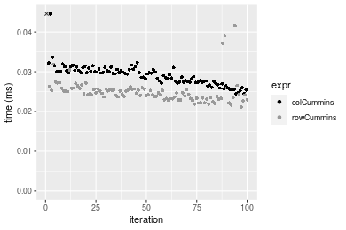
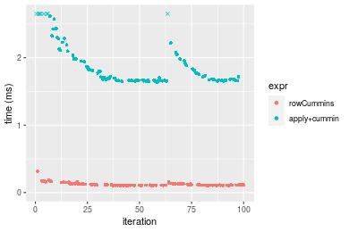
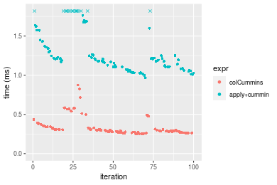

[matrixStats]: Benchmark report

---------------------------------------


# colCummins() and rowCummins() benchmarks

This report benchmark the performance of colCummins() and rowCummins() against alternative methods.

## Alternative methods

* apply() + cummin()


## Data type "integer"

### Data
```r
> rmatrix <- function(nrow, ncol, mode = c("logical", "double", "integer", "index"), range = c(-100, 
+     +100), na_prob = 0) {
+     mode <- match.arg(mode)
+     n <- nrow * ncol
+     if (mode == "logical") {
+         x <- sample(c(FALSE, TRUE), size = n, replace = TRUE)
+     }     else if (mode == "index") {
+         x <- seq_len(n)
+         mode <- "integer"
+     }     else {
+         x <- runif(n, min = range[1], max = range[2])
+     }
+     storage.mode(x) <- mode
+     if (na_prob > 0) 
+         x[sample(n, size = na_prob * n)] <- NA
+     dim(x) <- c(nrow, ncol)
+     x
+ }
> rmatrices <- function(scale = 10, seed = 1, ...) {
+     set.seed(seed)
+     data <- list()
+     data[[1]] <- rmatrix(nrow = scale * 1, ncol = scale * 1, ...)
+     data[[2]] <- rmatrix(nrow = scale * 10, ncol = scale * 10, ...)
+     data[[3]] <- rmatrix(nrow = scale * 100, ncol = scale * 1, ...)
+     data[[4]] <- t(data[[3]])
+     data[[5]] <- rmatrix(nrow = scale * 10, ncol = scale * 100, ...)
+     data[[6]] <- t(data[[5]])
+     names(data) <- sapply(data, FUN = function(x) paste(dim(x), collapse = "x"))
+     data
+ }
> data <- rmatrices(mode = mode)
```

### Results

#### 10x10 integer matrix

```r
> X <- data[["10x10"]]
> gc()
          used  (Mb) gc trigger  (Mb) max used  (Mb)
Ncells 5210547 278.3    7916910 422.9  7916910 422.9
Vcells 9852037  75.2   33191153 253.3 53339345 407.0
> colStats <- microbenchmark(colCummins = colCummins(X), `apply+cummin` = apply(X, MARGIN = 2L, FUN = cummin), 
+     unit = "ms")
> X <- t(X)
> gc()
          used  (Mb) gc trigger  (Mb) max used  (Mb)
Ncells 5196857 277.6    7916910 422.9  7916910 422.9
Vcells 9806580  74.9   33191153 253.3 53339345 407.0
> rowStats <- microbenchmark(rowCummins = rowCummins(X), `apply+cummin` = apply(X, MARGIN = 1L, FUN = cummin), 
+     unit = "ms")
```

_Table: Benchmarking of colCummins() and apply+cummin() on integer+10x10 data. The top panel shows times in milliseconds and the bottom panel shows relative times._


|   |expr         |      min|        lq|      mean|    median|        uq|      max|
|:--|:------------|--------:|---------:|---------:|---------:|---------:|--------:|
|1  |colCummins   | 0.002229| 0.0026415| 0.0033156| 0.0029885| 0.0037445| 0.012734|
|2  |apply+cummin | 0.043986| 0.0453740| 0.0469993| 0.0457780| 0.0461720| 0.128298|


|   |expr         |      min|       lq|     mean|   median|       uq|      max|
|:--|:------------|--------:|--------:|--------:|--------:|--------:|--------:|
|1  |colCummins   |  1.00000|  1.00000|  1.00000|  1.00000|  1.00000|  1.00000|
|2  |apply+cummin | 19.73351| 17.17736| 14.17516| 15.31805| 12.33062| 10.07523|

_Table: Benchmarking of rowCummins() and apply+cummin() on integer+10x10 data (transposed). The top panel shows times in milliseconds and the bottom panel shows relative times._


|   |expr         |      min|        lq|      mean|    median|        uq|      max|
|:--|:------------|--------:|---------:|---------:|---------:|---------:|--------:|
|1  |rowCummins   | 0.002361| 0.0027330| 0.0034246| 0.0035675| 0.0037355| 0.012926|
|2  |apply+cummin | 0.044599| 0.0454355| 0.0476552| 0.0460355| 0.0475725| 0.126598|


|   |expr         |      min|       lq|     mean|   median|       uq|      max|
|:--|:------------|--------:|--------:|--------:|--------:|--------:|--------:|
|1  |rowCummins   |  1.00000|  1.00000|  1.00000|  1.00000|  1.00000| 1.000000|
|2  |apply+cummin | 18.88988| 16.62477| 13.91535| 12.90413| 12.73524| 9.794059|

_Figure: Benchmarking of colCummins() and apply+cummin() on integer+10x10 data  as well as rowCummins() and apply+cummin() on the same data transposed.  Outliers are displayed as crosses.  Times are in milliseconds._


_Table: Benchmarking of colCummins() and rowCummins() on integer+10x10 data (original and transposed).  The top panel shows times in milliseconds and the bottom panel shows relative times._


|   |expr       |   min|     lq|    mean| median|     uq|    max|
|:--|:----------|-----:|------:|-------:|------:|------:|------:|
|1  |colCummins | 2.229| 2.6415| 3.31561| 2.9885| 3.7445| 12.734|
|2  |rowCummins | 2.361| 2.7330| 3.42465| 3.5675| 3.7355| 12.926|


|   |expr       |      min|       lq|     mean|   median|        uq|      max|
|:--|:----------|--------:|--------:|--------:|--------:|---------:|--------:|
|1  |colCummins | 1.000000| 1.000000| 1.000000| 1.000000| 1.0000000| 1.000000|
|2  |rowCummins | 1.059219| 1.034639| 1.032887| 1.193743| 0.9975965| 1.015078|

_Figure: Benchmarking of colCummins() and rowCummins() on integer+10x10 data (original and transposed).  Outliers are displayed as crosses. Times are in milliseconds._


#### 100x100 integer matrix

```r
> X <- data[["100x100"]]
> gc()
          used  (Mb) gc trigger  (Mb) max used  (Mb)
Ncells 5195419 277.5    7916910 422.9  7916910 422.9
Vcells 9423072  71.9   33191153 253.3 53339345 407.0
> colStats <- microbenchmark(colCummins = colCummins(X), `apply+cummin` = apply(X, MARGIN = 2L, FUN = cummin), 
+     unit = "ms")
> X <- t(X)
> gc()
          used  (Mb) gc trigger  (Mb) max used  (Mb)
Ncells 5195413 277.5    7916910 422.9  7916910 422.9
Vcells 9428115  72.0   33191153 253.3 53339345 407.0
> rowStats <- microbenchmark(rowCummins = rowCummins(X), `apply+cummin` = apply(X, MARGIN = 1L, FUN = cummin), 
+     unit = "ms")
```

_Table: Benchmarking of colCummins() and apply+cummin() on integer+100x100 data. The top panel shows times in milliseconds and the bottom panel shows relative times._


|   |expr         |      min|        lq|      mean|    median|       uq|      max|
|:--|:------------|--------:|---------:|---------:|---------:|--------:|--------:|
|1  |colCummins   | 0.022190| 0.0238755| 0.0261154| 0.0250390| 0.027731| 0.043445|
|2  |apply+cummin | 0.233114| 0.2432065| 0.2734432| 0.2676035| 0.292699| 0.439762|


|   |expr         |      min|       lq|     mean|   median|       uq|      max|
|:--|:------------|--------:|--------:|--------:|--------:|--------:|--------:|
|1  |colCummins   |  1.00000|  1.00000|  1.00000|  1.00000|  1.00000|  1.00000|
|2  |apply+cummin | 10.50536| 10.18645| 10.47056| 10.68747| 10.55494| 10.12227|

_Table: Benchmarking of rowCummins() and apply+cummin() on integer+100x100 data (transposed). The top panel shows times in milliseconds and the bottom panel shows relative times._


|   |expr         |      min|        lq|      mean|    median|       uq|      max|
|:--|:------------|--------:|---------:|---------:|---------:|--------:|--------:|
|1  |rowCummins   | 0.016779| 0.0181550| 0.0203581| 0.0191070| 0.021661| 0.034899|
|2  |apply+cummin | 0.239145| 0.2477805| 0.2801754| 0.2728115| 0.303913| 0.489863|


|   |expr         |      min|       lq|     mean|   median|       uq|      max|
|:--|:------------|--------:|--------:|--------:|--------:|--------:|--------:|
|1  |rowCummins   |  1.00000|  1.00000|  1.00000|  1.00000|  1.00000|  1.00000|
|2  |apply+cummin | 14.25264| 13.64806| 13.76232| 14.27809| 14.03042| 14.03659|

_Figure: Benchmarking of colCummins() and apply+cummin() on integer+100x100 data  as well as rowCummins() and apply+cummin() on the same data transposed.  Outliers are displayed as crosses.  Times are in milliseconds._


_Table: Benchmarking of colCummins() and rowCummins() on integer+100x100 data (original and transposed).  The top panel shows times in milliseconds and the bottom panel shows relative times._


|   |expr       |    min|      lq|     mean| median|     uq|    max|
|:--|:----------|------:|-------:|--------:|------:|------:|------:|
|2  |rowCummins | 16.779| 18.1550| 20.35815| 19.107| 21.661| 34.899|
|1  |colCummins | 22.190| 23.8755| 26.11542| 25.039| 27.731| 43.445|


|   |expr       |      min|       lq|     mean|   median|       uq|      max|
|:--|:----------|--------:|--------:|--------:|--------:|--------:|--------:|
|2  |rowCummins | 1.000000| 1.000000| 1.000000| 1.000000| 1.000000| 1.000000|
|1  |colCummins | 1.322486| 1.315092| 1.282799| 1.310462| 1.280227| 1.244878|

_Figure: Benchmarking of colCummins() and rowCummins() on integer+100x100 data (original and transposed).  Outliers are displayed as crosses. Times are in milliseconds._


#### 1000x10 integer matrix

```r
> X <- data[["1000x10"]]
> gc()
          used  (Mb) gc trigger  (Mb) max used  (Mb)
Ncells 5196151 277.6    7916910 422.9  7916910 422.9
Vcells 9426583  72.0   33191153 253.3 53339345 407.0
> colStats <- microbenchmark(colCummins = colCummins(X), `apply+cummin` = apply(X, MARGIN = 2L, FUN = cummin), 
+     unit = "ms")
> X <- t(X)
> gc()
          used  (Mb) gc trigger  (Mb) max used  (Mb)
Ncells 5196145 277.6    7916910 422.9  7916910 422.9
Vcells 9431626  72.0   33191153 253.3 53339345 407.0
> rowStats <- microbenchmark(rowCummins = rowCummins(X), `apply+cummin` = apply(X, MARGIN = 1L, FUN = cummin), 
+     unit = "ms")
```

_Table: Benchmarking of colCummins() and apply+cummin() on integer+1000x10 data. The top panel shows times in milliseconds and the bottom panel shows relative times._


|   |expr         |      min|        lq|      mean|    median|        uq|      max|
|:--|:------------|--------:|---------:|---------:|---------:|---------:|--------:|
|1  |colCummins   | 0.024455| 0.0273985| 0.0292194| 0.0295220| 0.0304175| 0.046926|
|2  |apply+cummin | 0.150360| 0.1618490| 0.1762110| 0.1782605| 0.1854590| 0.259739|


|   |expr         |      min|       lq|    mean|   median|       uq|      max|
|:--|:------------|--------:|--------:|-------:|--------:|--------:|--------:|
|1  |colCummins   | 1.000000| 1.000000| 1.00000| 1.000000| 1.000000| 1.000000|
|2  |apply+cummin | 6.148436| 5.907221| 6.03061| 6.038226| 6.097115| 5.535076|

_Table: Benchmarking of rowCummins() and apply+cummin() on integer+1000x10 data (transposed). The top panel shows times in milliseconds and the bottom panel shows relative times._


|   |expr         |      min|        lq|      mean|   median|        uq|      max|
|:--|:------------|--------:|---------:|---------:|--------:|---------:|--------:|
|1  |rowCummins   | 0.021131| 0.0233595| 0.0251970| 0.024514| 0.0256150| 0.045575|
|2  |apply+cummin | 0.163532| 0.1744620| 0.1886527| 0.185424| 0.1908875| 0.286502|


|   |expr         |      min|       lq|     mean|   median|       uq|      max|
|:--|:------------|--------:|--------:|--------:|--------:|--------:|--------:|
|1  |rowCummins   | 1.000000| 1.000000| 1.000000| 1.000000| 1.000000| 1.000000|
|2  |apply+cummin | 7.738962| 7.468567| 7.487114| 7.564004| 7.452177| 6.286385|

_Figure: Benchmarking of colCummins() and apply+cummin() on integer+1000x10 data  as well as rowCummins() and apply+cummin() on the same data transposed.  Outliers are displayed as crosses.  Times are in milliseconds._


_Table: Benchmarking of colCummins() and rowCummins() on integer+1000x10 data (original and transposed).  The top panel shows times in milliseconds and the bottom panel shows relative times._


|   |expr       |    min|      lq|     mean| median|      uq|    max|
|:--|:----------|------:|-------:|--------:|------:|-------:|------:|
|2  |rowCummins | 21.131| 23.3595| 25.19698| 24.514| 25.6150| 45.575|
|1  |colCummins | 24.455| 27.3985| 29.21944| 29.522| 30.4175| 46.926|


|   |expr       |      min|       lq|     mean|   median|       uq|      max|
|:--|:----------|--------:|--------:|--------:|--------:|--------:|--------:|
|2  |rowCummins | 1.000000| 1.000000| 1.000000| 1.000000| 1.000000| 1.000000|
|1  |colCummins | 1.157304| 1.172906| 1.159641| 1.204291| 1.187488| 1.029643|

_Figure: Benchmarking of colCummins() and rowCummins() on integer+1000x10 data (original and transposed).  Outliers are displayed as crosses. Times are in milliseconds._




#### 10x1000 integer matrix

```r
> X <- data[["10x1000"]]
> gc()
          used  (Mb) gc trigger  (Mb) max used  (Mb)
Ncells 5196339 277.6    7916910 422.9  7916910 422.9
Vcells 9427273  72.0   33191153 253.3 53339345 407.0
> colStats <- microbenchmark(colCummins = colCummins(X), `apply+cummin` = apply(X, MARGIN = 2L, FUN = cummin), 
+     unit = "ms")
> X <- t(X)
> gc()
          used  (Mb) gc trigger  (Mb) max used  (Mb)
Ncells 5196333 277.6    7916910 422.9  7916910 422.9
Vcells 9432316  72.0   33191153 253.3 53339345 407.0
> rowStats <- microbenchmark(rowCummins = rowCummins(X), `apply+cummin` = apply(X, MARGIN = 1L, FUN = cummin), 
+     unit = "ms")
```

_Table: Benchmarking of colCummins() and apply+cummin() on integer+10x1000 data. The top panel shows times in milliseconds and the bottom panel shows relative times._


|   |expr         |      min|        lq|      mean|    median|        uq|      max|
|:--|:------------|--------:|---------:|---------:|---------:|---------:|--------:|
|1  |colCummins   | 0.014576| 0.0157665| 0.0184986| 0.0173225| 0.0202455| 0.038839|
|2  |apply+cummin | 0.881523| 0.8993215| 1.0258743| 0.9633575| 1.1251470| 1.471905|


|   |expr         |     min|       lq|    mean|   median|       uq|     max|
|:--|:------------|-------:|--------:|-------:|--------:|--------:|-------:|
|1  |colCummins   |  1.0000|  1.00000|  1.0000|  1.00000|  1.00000|  1.0000|
|2  |apply+cummin | 60.4777| 57.04002| 55.4568| 55.61308| 55.57516| 37.8976|

_Table: Benchmarking of rowCummins() and apply+cummin() on integer+10x1000 data (transposed). The top panel shows times in milliseconds and the bottom panel shows relative times._


|   |expr         |      min|        lq|     mean|    median|        uq|      max|
|:--|:------------|--------:|---------:|--------:|---------:|---------:|--------:|
|1  |rowCummins   | 0.012217| 0.0132605| 0.015703| 0.0146280| 0.0166105| 0.035086|
|2  |apply+cummin | 0.885263| 0.9017000| 1.026040| 0.9718755| 1.1172860| 1.474272|


|   |expr         |      min|       lq|     mean|  median|       uq|      max|
|:--|:------------|--------:|--------:|--------:|-------:|--------:|--------:|
|1  |rowCummins   |  1.00000|  1.00000|  1.00000|  1.0000|  1.00000|  1.00000|
|2  |apply+cummin | 72.46157| 67.99894| 65.34032| 66.4394| 67.26384| 42.01881|

_Figure: Benchmarking of colCummins() and apply+cummin() on integer+10x1000 data  as well as rowCummins() and apply+cummin() on the same data transposed.  Outliers are displayed as crosses.  Times are in milliseconds._


_Table: Benchmarking of colCummins() and rowCummins() on integer+10x1000 data (original and transposed).  The top panel shows times in milliseconds and the bottom panel shows relative times._


|   |expr       |    min|      lq|     mean|  median|      uq|    max|
|:--|:----------|------:|-------:|--------:|-------:|-------:|------:|
|2  |rowCummins | 12.217| 13.2605| 15.70301| 14.6280| 16.6105| 35.086|
|1  |colCummins | 14.576| 15.7665| 18.49862| 17.3225| 20.2455| 38.839|


|   |expr       |      min|       lq|    mean|   median|       uq|      max|
|:--|:----------|--------:|--------:|-------:|--------:|--------:|--------:|
|2  |rowCummins | 1.000000| 1.000000| 1.00000| 1.000000| 1.000000| 1.000000|
|1  |colCummins | 1.193092| 1.188982| 1.17803| 1.184201| 1.218838| 1.106966|

_Figure: Benchmarking of colCummins() and rowCummins() on integer+10x1000 data (original and transposed).  Outliers are displayed as crosses. Times are in milliseconds._


#### 100x1000 integer matrix

```r
> X <- data[["100x1000"]]
> gc()
          used  (Mb) gc trigger  (Mb) max used  (Mb)
Ncells 5196525 277.6    7916910 422.9  7916910 422.9
Vcells 9427771  72.0   33191153 253.3 53339345 407.0
> colStats <- microbenchmark(colCummins = colCummins(X), `apply+cummin` = apply(X, MARGIN = 2L, FUN = cummin), 
+     unit = "ms")
> X <- t(X)
> gc()
          used  (Mb) gc trigger  (Mb) max used  (Mb)
Ncells 5196513 277.6    7916910 422.9  7916910 422.9
Vcells 9477804  72.4   33191153 253.3 53339345 407.0
> rowStats <- microbenchmark(rowCummins = rowCummins(X), `apply+cummin` = apply(X, MARGIN = 1L, FUN = cummin), 
+     unit = "ms")
```

_Table: Benchmarking of colCummins() and apply+cummin() on integer+100x1000 data. The top panel shows times in milliseconds and the bottom panel shows relative times._


|   |expr         |      min|        lq|      mean|   median|        uq|       max|
|:--|:------------|--------:|---------:|---------:|--------:|---------:|---------:|
|1  |colCummins   | 0.162259| 0.1688415| 0.2122096| 0.202050| 0.2682755|  0.289558|
|2  |apply+cummin | 1.641799| 1.6738335| 2.0706028| 1.824884| 2.0891775| 16.677729|


|   |expr         |      min|       lq|     mean|   median|       uq|     max|
|:--|:------------|--------:|--------:|--------:|--------:|--------:|-------:|
|1  |colCummins   |  1.00000| 1.000000| 1.000000| 1.000000| 1.000000|  1.0000|
|2  |apply+cummin | 10.11838| 9.913638| 9.757346| 9.031844| 7.787433| 57.5972|

_Table: Benchmarking of rowCummins() and apply+cummin() on integer+100x1000 data (transposed). The top panel shows times in milliseconds and the bottom panel shows relative times._


|   |expr         |      min|       lq|      mean|    median|       uq|       max|
|:--|:------------|--------:|--------:|---------:|---------:|--------:|---------:|
|1  |rowCummins   | 0.106469| 0.108314| 0.1232181| 0.1131175| 0.129544|  0.316269|
|2  |apply+cummin | 1.632863| 1.664809| 2.0879960| 1.7190735| 2.039814| 16.428674|


|   |expr         |      min|       lq|     mean|   median|       uq|      max|
|:--|:------------|--------:|--------:|--------:|--------:|--------:|--------:|
|1  |rowCummins   |  1.00000|  1.00000|  1.00000|  1.00000|  1.00000|  1.00000|
|2  |apply+cummin | 15.33651| 15.37021| 16.94553| 15.19724| 15.74611| 51.94526|

_Figure: Benchmarking of colCummins() and apply+cummin() on integer+100x1000 data  as well as rowCummins() and apply+cummin() on the same data transposed.  Outliers are displayed as crosses.  Times are in milliseconds._



_Table: Benchmarking of colCummins() and rowCummins() on integer+100x1000 data (original and transposed).  The top panel shows times in milliseconds and the bottom panel shows relative times._


|   |expr       |     min|       lq|     mean|   median|       uq|     max|
|:--|:----------|-------:|--------:|--------:|--------:|--------:|-------:|
|2  |rowCummins | 106.469| 108.3140| 123.2181| 113.1175| 129.5440| 316.269|
|1  |colCummins | 162.259| 168.8415| 212.2096| 202.0500| 268.2755| 289.558|


|   |expr       |      min|       lq|     mean|   median|       uq|       max|
|:--|:----------|--------:|--------:|--------:|--------:|--------:|---------:|
|2  |rowCummins | 1.000000| 1.000000| 1.000000| 1.000000| 1.000000| 1.0000000|
|1  |colCummins | 1.524002| 1.558815| 1.722228| 1.786196| 2.070922| 0.9155434|

_Figure: Benchmarking of colCummins() and rowCummins() on integer+100x1000 data (original and transposed).  Outliers are displayed as crosses. Times are in milliseconds._


#### 1000x100 integer matrix

```r
> X <- data[["1000x100"]]
> gc()
          used  (Mb) gc trigger  (Mb) max used  (Mb)
Ncells 5196718 277.6    7916910 422.9  7916910 422.9
Vcells 9428338  72.0   33191153 253.3 53339345 407.0
> colStats <- microbenchmark(colCummins = colCummins(X), `apply+cummin` = apply(X, MARGIN = 2L, FUN = cummin), 
+     unit = "ms")
> X <- t(X)
> gc()
          used  (Mb) gc trigger  (Mb) max used  (Mb)
Ncells 5196712 277.6    7916910 422.9  7916910 422.9
Vcells 9478381  72.4   33191153 253.3 53339345 407.0
> rowStats <- microbenchmark(rowCummins = rowCummins(X), `apply+cummin` = apply(X, MARGIN = 1L, FUN = cummin), 
+     unit = "ms")
```

_Table: Benchmarking of colCummins() and apply+cummin() on integer+1000x100 data. The top panel shows times in milliseconds and the bottom panel shows relative times._


|   |expr         |      min|        lq|      mean|   median|        uq|      max|
|:--|:------------|--------:|---------:|---------:|--------:|---------:|--------:|
|1  |colCummins   | 0.165614| 0.1745995| 0.2604943| 0.186495| 0.2160475| 6.618560|
|2  |apply+cummin | 0.899980| 0.9636280| 1.1328491| 1.094459| 1.2090655| 1.769006|


|   |expr         |      min|       lq|     mean|  median|       uq|       max|
|:--|:------------|--------:|--------:|--------:|-------:|--------:|---------:|
|1  |colCummins   | 1.000000| 1.000000| 1.000000| 1.00000| 1.000000| 1.0000000|
|2  |apply+cummin | 5.434202| 5.519076| 4.348844| 5.86857| 5.596295| 0.2672796|

_Table: Benchmarking of rowCummins() and apply+cummin() on integer+1000x100 data (transposed). The top panel shows times in milliseconds and the bottom panel shows relative times._


|   |expr         |      min|        lq|      mean|    median|       uq|      max|
|:--|:------------|--------:|---------:|---------:|---------:|--------:|--------:|
|1  |rowCummins   | 0.114049| 0.1181895| 0.1350835| 0.1325525| 0.144677| 0.196824|
|2  |apply+cummin | 0.904406| 0.9332710| 1.1549733| 1.0757435| 1.187177| 7.402394|


|   |expr         |      min|       lq|    mean|   median|      uq|     max|
|:--|:------------|--------:|--------:|-------:|--------:|-------:|-------:|
|1  |rowCummins   | 1.000000| 1.000000| 1.00000| 1.000000| 1.00000|  1.0000|
|2  |apply+cummin | 7.929977| 7.896395| 8.55007| 8.115603| 8.20571| 37.6092|

_Figure: Benchmarking of colCummins() and apply+cummin() on integer+1000x100 data  as well as rowCummins() and apply+cummin() on the same data transposed.  Outliers are displayed as crosses.  Times are in milliseconds._


_Table: Benchmarking of colCummins() and rowCummins() on integer+1000x100 data (original and transposed).  The top panel shows times in milliseconds and the bottom panel shows relative times._


|   |expr       |     min|       lq|     mean|   median|       uq|      max|
|:--|:----------|-------:|--------:|--------:|--------:|--------:|--------:|
|2  |rowCummins | 114.049| 118.1895| 135.0835| 132.5525| 144.6770|  196.824|
|1  |colCummins | 165.614| 174.5995| 260.4943| 186.4950| 216.0475| 6618.560|


|   |expr       |     min|       lq|     mean|   median|       uq|      max|
|:--|:----------|-------:|--------:|--------:|--------:|--------:|--------:|
|2  |rowCummins | 1.00000| 1.000000| 1.000000| 1.000000| 1.000000|  1.00000|
|1  |colCummins | 1.45213| 1.477284| 1.928395| 1.406952| 1.493309| 33.62679|

_Figure: Benchmarking of colCummins() and rowCummins() on integer+1000x100 data (original and transposed).  Outliers are displayed as crosses. Times are in milliseconds._


## Data type "double"

### Data
```r
> rmatrix <- function(nrow, ncol, mode = c("logical", "double", "integer", "index"), range = c(-100, 
+     +100), na_prob = 0) {
+     mode <- match.arg(mode)
+     n <- nrow * ncol
+     if (mode == "logical") {
+         x <- sample(c(FALSE, TRUE), size = n, replace = TRUE)
+     }     else if (mode == "index") {
+         x <- seq_len(n)
+         mode <- "integer"
+     }     else {
+         x <- runif(n, min = range[1], max = range[2])
+     }
+     storage.mode(x) <- mode
+     if (na_prob > 0) 
+         x[sample(n, size = na_prob * n)] <- NA
+     dim(x) <- c(nrow, ncol)
+     x
+ }
> rmatrices <- function(scale = 10, seed = 1, ...) {
+     set.seed(seed)
+     data <- list()
+     data[[1]] <- rmatrix(nrow = scale * 1, ncol = scale * 1, ...)
+     data[[2]] <- rmatrix(nrow = scale * 10, ncol = scale * 10, ...)
+     data[[3]] <- rmatrix(nrow = scale * 100, ncol = scale * 1, ...)
+     data[[4]] <- t(data[[3]])
+     data[[5]] <- rmatrix(nrow = scale * 10, ncol = scale * 100, ...)
+     data[[6]] <- t(data[[5]])
+     names(data) <- sapply(data, FUN = function(x) paste(dim(x), collapse = "x"))
+     data
+ }
> data <- rmatrices(mode = mode)
```

### Results

#### 10x10 double matrix

```r
> X <- data[["10x10"]]
> gc()
          used  (Mb) gc trigger  (Mb) max used  (Mb)
Ncells 5196918 277.6    7916910 422.9  7916910 422.9
Vcells 9544065  72.9   33191153 253.3 53339345 407.0
> colStats <- microbenchmark(colCummins = colCummins(X), `apply+cummin` = apply(X, MARGIN = 2L, FUN = cummin), 
+     unit = "ms")
> X <- t(X)
> gc()
          used  (Mb) gc trigger  (Mb) max used  (Mb)
Ncells 5196903 277.6    7916910 422.9  7916910 422.9
Vcells 9544193  72.9   33191153 253.3 53339345 407.0
> rowStats <- microbenchmark(rowCummins = rowCummins(X), `apply+cummin` = apply(X, MARGIN = 1L, FUN = cummin), 
+     unit = "ms")
```

_Table: Benchmarking of colCummins() and apply+cummin() on double+10x10 data. The top panel shows times in milliseconds and the bottom panel shows relative times._


|   |expr         |      min|        lq|      mean|   median|        uq|      max|
|:--|:------------|--------:|---------:|---------:|--------:|---------:|--------:|
|1  |colCummins   | 0.002318| 0.0026385| 0.0033606| 0.003011| 0.0038760| 0.013986|
|2  |apply+cummin | 0.044473| 0.0452725| 0.0468133| 0.045720| 0.0460865| 0.122967|


|   |expr         |      min|       lq|     mean|   median|       uq|      max|
|:--|:------------|--------:|--------:|--------:|--------:|--------:|--------:|
|1  |colCummins   |  1.00000|  1.00000|  1.00000|  1.00000|  1.00000| 1.000000|
|2  |apply+cummin | 19.18594| 17.15842| 13.93017| 15.18432| 11.89022| 8.792149|

_Table: Benchmarking of rowCummins() and apply+cummin() on double+10x10 data (transposed). The top panel shows times in milliseconds and the bottom panel shows relative times._


|   |expr         |      min|        lq|      mean|    median|        uq|      max|
|:--|:------------|--------:|---------:|---------:|---------:|---------:|--------:|
|1  |rowCummins   | 0.002325| 0.0027195| 0.0034384| 0.0035880| 0.0037465| 0.014663|
|2  |apply+cummin | 0.044531| 0.0452120| 0.0465784| 0.0455685| 0.0459740| 0.120364|


|   |expr         |      min|       lq|     mean|   median|       uq|      max|
|:--|:------------|--------:|--------:|--------:|--------:|--------:|--------:|
|1  |rowCummins   |  1.00000|  1.00000|  1.00000|  1.00000|  1.00000| 1.000000|
|2  |apply+cummin | 19.15312| 16.62511| 13.54669| 12.70025| 12.27119| 8.208688|

_Figure: Benchmarking of colCummins() and apply+cummin() on double+10x10 data  as well as rowCummins() and apply+cummin() on the same data transposed.  Outliers are displayed as crosses.  Times are in milliseconds._


_Table: Benchmarking of colCummins() and rowCummins() on double+10x10 data (original and transposed).  The top panel shows times in milliseconds and the bottom panel shows relative times._


|   |expr       |   min|     lq|    mean| median|     uq|    max|
|:--|:----------|-----:|------:|-------:|------:|------:|------:|
|1  |colCummins | 2.318| 2.6385| 3.36057|  3.011| 3.8760| 13.986|
|2  |rowCummins | 2.325| 2.7195| 3.43836|  3.588| 3.7465| 14.663|


|   |expr       |     min|       lq|     mean|   median|        uq|      max|
|:--|:----------|-------:|--------:|--------:|--------:|---------:|--------:|
|1  |colCummins | 1.00000| 1.000000| 1.000000| 1.000000| 1.0000000| 1.000000|
|2  |rowCummins | 1.00302| 1.030699| 1.023148| 1.191631| 0.9665893| 1.048406|

_Figure: Benchmarking of colCummins() and rowCummins() on double+10x10 data (original and transposed).  Outliers are displayed as crosses. Times are in milliseconds._


#### 100x100 double matrix

```r
> X <- data[["100x100"]]
> gc()
          used  (Mb) gc trigger  (Mb) max used  (Mb)
Ncells 5197093 277.6    7916910 422.9  7916910 422.9
Vcells 9544861  72.9   33191153 253.3 53339345 407.0
> colStats <- microbenchmark(colCummins = colCummins(X), `apply+cummin` = apply(X, MARGIN = 2L, FUN = cummin), 
+     unit = "ms")
> X <- t(X)
> gc()
          used  (Mb) gc trigger  (Mb) max used  (Mb)
Ncells 5197087 277.6    7916910 422.9  7916910 422.9
Vcells 9554904  72.9   33191153 253.3 53339345 407.0
> rowStats <- microbenchmark(rowCummins = rowCummins(X), `apply+cummin` = apply(X, MARGIN = 1L, FUN = cummin), 
+     unit = "ms")
```

_Table: Benchmarking of colCummins() and apply+cummin() on double+100x100 data. The top panel shows times in milliseconds and the bottom panel shows relative times._


|   |expr         |      min|        lq|      mean|    median|        uq|      max|
|:--|:------------|--------:|---------:|---------:|---------:|---------:|--------:|
|1  |colCummins   | 0.029391| 0.0310710| 0.0341979| 0.0330470| 0.0361950| 0.064007|
|2  |apply+cummin | 0.224840| 0.2335375| 0.2668674| 0.2627965| 0.2889055| 0.419988|


|   |expr         |      min|       lq|     mean|   median|       uq|      max|
|:--|:------------|--------:|--------:|--------:|--------:|--------:|--------:|
|1  |colCummins   | 1.000000| 1.000000| 1.000000| 1.000000| 1.000000| 1.000000|
|2  |apply+cummin | 7.649961| 7.516253| 7.803617| 7.952204| 7.981917| 6.561595|

_Table: Benchmarking of rowCummins() and apply+cummin() on double+100x100 data (transposed). The top panel shows times in milliseconds and the bottom panel shows relative times._


|   |expr         |      min|       lq|      mean|    median|        uq|      max|
|:--|:------------|--------:|--------:|---------:|---------:|---------:|--------:|
|1  |rowCummins   | 0.014422| 0.016206| 0.0180022| 0.0173825| 0.0189235| 0.041610|
|2  |apply+cummin | 0.239721| 0.261273| 0.2848675| 0.2764945| 0.3005285| 0.498169|


|   |expr         |     min|       lq|     mean|   median|       uq|      max|
|:--|:------------|-------:|--------:|--------:|--------:|--------:|--------:|
|1  |rowCummins   |  1.0000|  1.00000|  1.00000|  1.00000|  1.00000|  1.00000|
|2  |apply+cummin | 16.6219| 16.12199| 15.82403| 15.90649| 15.88123| 11.97234|

_Figure: Benchmarking of colCummins() and apply+cummin() on double+100x100 data  as well as rowCummins() and apply+cummin() on the same data transposed.  Outliers are displayed as crosses.  Times are in milliseconds._


_Table: Benchmarking of colCummins() and rowCummins() on double+100x100 data (original and transposed).  The top panel shows times in milliseconds and the bottom panel shows relative times._


|   |expr       |    min|     lq|     mean|  median|      uq|    max|
|:--|:----------|------:|------:|--------:|-------:|-------:|------:|
|2  |rowCummins | 14.422| 16.206| 18.00221| 17.3825| 18.9235| 41.610|
|1  |colCummins | 29.391| 31.071| 34.19791| 33.0470| 36.1950| 64.007|


|   |expr       |      min|       lq|     mean|   median|       uq|     max|
|:--|:----------|--------:|--------:|--------:|--------:|--------:|-------:|
|2  |rowCummins | 1.000000| 1.000000| 1.000000| 1.000000| 1.000000| 1.00000|
|1  |colCummins | 2.037928| 1.917253| 1.899651| 1.901165| 1.912701| 1.53826|

_Figure: Benchmarking of colCummins() and rowCummins() on double+100x100 data (original and transposed).  Outliers are displayed as crosses. Times are in milliseconds._


#### 1000x10 double matrix

```r
> X <- data[["1000x10"]]
> gc()
          used  (Mb) gc trigger  (Mb) max used  (Mb)
Ncells 5197285 277.6    7916910 422.9  7916910 422.9
Vcells 9545764  72.9   33191153 253.3 53339345 407.0
> colStats <- microbenchmark(colCummins = colCummins(X), `apply+cummin` = apply(X, MARGIN = 2L, FUN = cummin), 
+     unit = "ms")
> X <- t(X)
> gc()
          used  (Mb) gc trigger  (Mb) max used  (Mb)
Ncells 5197279 277.6    7916910 422.9  7916910 422.9
Vcells 9555807  73.0   33191153 253.3 53339345 407.0
> rowStats <- microbenchmark(rowCummins = rowCummins(X), `apply+cummin` = apply(X, MARGIN = 1L, FUN = cummin), 
+     unit = "ms")
```

_Table: Benchmarking of colCummins() and apply+cummin() on double+1000x10 data. The top panel shows times in milliseconds and the bottom panel shows relative times._


|   |expr         |      min|       lq|      mean|   median|        uq|      max|
|:--|:------------|--------:|--------:|---------:|--------:|---------:|--------:|
|1  |colCummins   | 0.033654| 0.037679| 0.0399695| 0.040166| 0.0417550| 0.062494|
|2  |apply+cummin | 0.148997| 0.164302| 0.1798893| 0.183249| 0.1904335| 0.272238|


|   |expr         |      min|       lq|     mean|   median|       uq|      max|
|:--|:------------|--------:|--------:|--------:|--------:|--------:|--------:|
|1  |colCummins   | 1.000000| 1.000000| 1.000000| 1.000000| 1.000000| 1.000000|
|2  |apply+cummin | 4.427319| 4.360572| 4.500661| 4.562291| 4.560735| 4.356226|

_Table: Benchmarking of rowCummins() and apply+cummin() on double+1000x10 data (transposed). The top panel shows times in milliseconds and the bottom panel shows relative times._


|   |expr         |      min|       lq|      mean|   median|        uq|      max|
|:--|:------------|--------:|--------:|---------:|--------:|---------:|--------:|
|1  |rowCummins   | 0.016275| 0.017878| 0.0200442| 0.019909| 0.0212790| 0.037780|
|2  |apply+cummin | 0.150830| 0.161284| 0.1777553| 0.176759| 0.1907185| 0.271523|


|   |expr         |      min|       lq|     mean|   median|       uq|      max|
|:--|:------------|--------:|--------:|--------:|--------:|--------:|--------:|
|1  |rowCummins   | 1.000000| 1.000000| 1.000000| 1.000000| 1.000000| 1.000000|
|2  |apply+cummin | 9.267588| 9.021367| 8.868151| 8.878346| 8.962757| 7.186951|

_Figure: Benchmarking of colCummins() and apply+cummin() on double+1000x10 data  as well as rowCummins() and apply+cummin() on the same data transposed.  Outliers are displayed as crosses.  Times are in milliseconds._


_Table: Benchmarking of colCummins() and rowCummins() on double+1000x10 data (original and transposed).  The top panel shows times in milliseconds and the bottom panel shows relative times._


|   |expr       |    min|     lq|     mean| median|     uq|    max|
|:--|:----------|------:|------:|--------:|------:|------:|------:|
|2  |rowCummins | 16.275| 17.878| 20.04423| 19.909| 21.279| 37.780|
|1  |colCummins | 33.654| 37.679| 39.96954| 40.166| 41.755| 62.494|


|   |expr       |      min|       lq|     mean|   median|       uq|      max|
|:--|:----------|--------:|--------:|--------:|--------:|--------:|--------:|
|2  |rowCummins | 1.000000| 1.000000| 1.000000| 1.000000| 1.000000| 1.000000|
|1  |colCummins | 2.067834| 2.107562| 1.994067| 2.017479| 1.962263| 1.654156|

_Figure: Benchmarking of colCummins() and rowCummins() on double+1000x10 data (original and transposed).  Outliers are displayed as crosses. Times are in milliseconds._


#### 10x1000 double matrix

```r
> X <- data[["10x1000"]]
> gc()
          used  (Mb) gc trigger  (Mb) max used  (Mb)
Ncells 5197473 277.6    7916910 422.9  7916910 422.9
Vcells 9545889  72.9   33191153 253.3 53339345 407.0
> colStats <- microbenchmark(colCummins = colCummins(X), `apply+cummin` = apply(X, MARGIN = 2L, FUN = cummin), 
+     unit = "ms")
> X <- t(X)
> gc()
          used  (Mb) gc trigger  (Mb) max used  (Mb)
Ncells 5197467 277.6    7916910 422.9  7916910 422.9
Vcells 9555932  73.0   33191153 253.3 53339345 407.0
> rowStats <- microbenchmark(rowCummins = rowCummins(X), `apply+cummin` = apply(X, MARGIN = 1L, FUN = cummin), 
+     unit = "ms")
```

_Table: Benchmarking of colCummins() and apply+cummin() on double+10x1000 data. The top panel shows times in milliseconds and the bottom panel shows relative times._


|   |expr         |      min|        lq|      mean|    median|        uq|      max|
|:--|:------------|--------:|---------:|---------:|---------:|---------:|--------:|
|1  |colCummins   | 0.014831| 0.0167140| 0.0199742| 0.0188755| 0.0221425| 0.039420|
|2  |apply+cummin | 0.839725| 0.8873195| 1.0086288| 0.9533915| 1.0935350| 1.411559|


|   |expr         |      min|      lq|     mean|   median|       uq|      max|
|:--|:------------|--------:|-------:|--------:|--------:|--------:|--------:|
|1  |colCummins   |  1.00000|  1.0000|  1.00000|  1.00000|  1.00000|  1.00000|
|2  |apply+cummin | 56.61958| 53.0884| 50.49661| 50.50947| 49.38625| 35.80819|

_Table: Benchmarking of rowCummins() and apply+cummin() on double+10x1000 data (transposed). The top panel shows times in milliseconds and the bottom panel shows relative times._


|   |expr         |      min|       lq|      mean|   median|       uq|      max|
|:--|:------------|--------:|--------:|---------:|--------:|--------:|--------:|
|1  |rowCummins   | 0.010920| 0.012744| 0.0153962| 0.014301| 0.016793| 0.033570|
|2  |apply+cummin | 0.829891| 0.922490| 1.0398857| 1.035802| 1.123713| 1.426725|


|   |expr         |      min|       lq|     mean|   median|       uq|  max|
|:--|:------------|--------:|--------:|--------:|--------:|--------:|----:|
|1  |rowCummins   |  1.00000|  1.00000|  1.00000|  1.00000|  1.00000|  1.0|
|2  |apply+cummin | 75.99734| 72.38622| 67.54158| 72.42868| 66.91556| 42.5|

_Figure: Benchmarking of colCummins() and apply+cummin() on double+10x1000 data  as well as rowCummins() and apply+cummin() on the same data transposed.  Outliers are displayed as crosses.  Times are in milliseconds._


_Table: Benchmarking of colCummins() and rowCummins() on double+10x1000 data (original and transposed).  The top panel shows times in milliseconds and the bottom panel shows relative times._


|   |expr       |    min|     lq|     mean|  median|      uq|   max|
|:--|:----------|------:|------:|--------:|-------:|-------:|-----:|
|2  |rowCummins | 10.920| 12.744| 15.39623| 14.3010| 16.7930| 33.57|
|1  |colCummins | 14.831| 16.714| 19.97419| 18.8755| 22.1425| 39.42|


|   |expr       |     min|       lq|     mean|   median|       uq|      max|
|:--|:----------|-------:|--------:|--------:|--------:|--------:|--------:|
|2  |rowCummins | 1.00000| 1.000000| 1.000000| 1.000000| 1.000000| 1.000000|
|1  |colCummins | 1.35815| 1.311519| 1.297343| 1.319873| 1.318555| 1.174263|

_Figure: Benchmarking of colCummins() and rowCummins() on double+10x1000 data (original and transposed).  Outliers are displayed as crosses. Times are in milliseconds._


#### 100x1000 double matrix

```r
> X <- data[["100x1000"]]
> gc()
          used  (Mb) gc trigger  (Mb) max used  (Mb)
Ncells 5197659 277.6    7916910 422.9  7916910 422.9
Vcells 9546944  72.9   33191153 253.3 53339345 407.0
> colStats <- microbenchmark(colCummins = colCummins(X), `apply+cummin` = apply(X, MARGIN = 2L, FUN = cummin), 
+     unit = "ms")
> X <- t(X)
> gc()
          used  (Mb) gc trigger  (Mb) max used  (Mb)
Ncells 5197647 277.6    7916910 422.9  7916910 422.9
Vcells 9646977  73.7   33191153 253.3 53339345 407.0
> rowStats <- microbenchmark(rowCummins = rowCummins(X), `apply+cummin` = apply(X, MARGIN = 1L, FUN = cummin), 
+     unit = "ms")
```

_Table: Benchmarking of colCummins() and apply+cummin() on double+100x1000 data. The top panel shows times in milliseconds and the bottom panel shows relative times._


|   |expr         |      min|       lq|      mean|   median|        uq|       max|
|:--|:------------|--------:|--------:|---------:|--------:|---------:|---------:|
|1  |colCummins   | 0.224364| 0.258856| 0.3016059| 0.288952| 0.3184805|  0.565744|
|2  |apply+cummin | 1.672009| 1.921653| 2.4282131| 2.094174| 2.4656300| 14.610109|


|   |expr         |      min|       lq|     mean|   median|       uq|      max|
|:--|:------------|--------:|--------:|--------:|--------:|--------:|--------:|
|1  |colCummins   | 1.000000| 1.000000| 1.000000| 1.000000| 1.000000|  1.00000|
|2  |apply+cummin | 7.452216| 7.423637| 8.050948| 7.247479| 7.741855| 25.82459|

_Table: Benchmarking of rowCummins() and apply+cummin() on double+100x1000 data (transposed). The top panel shows times in milliseconds and the bottom panel shows relative times._


|   |expr         |      min|        lq|      mean|   median|       uq|       max|
|:--|:------------|--------:|---------:|---------:|--------:|--------:|---------:|
|1  |rowCummins   | 0.092501| 0.1067305| 0.1283555| 0.122751| 0.141771|  0.223111|
|2  |apply+cummin | 1.773200| 1.9558900| 2.4272595| 2.107800| 2.264207| 15.407174|


|   |expr         |      min|      lq|     mean|   median|       uq|      max|
|:--|:------------|--------:|-------:|--------:|--------:|--------:|--------:|
|1  |rowCummins   |  1.00000|  1.0000|  1.00000|  1.00000|  1.00000|  1.00000|
|2  |apply+cummin | 19.16952| 18.3255| 18.91044| 17.17135| 15.97088| 69.05609|

_Figure: Benchmarking of colCummins() and apply+cummin() on double+100x1000 data  as well as rowCummins() and apply+cummin() on the same data transposed.  Outliers are displayed as crosses.  Times are in milliseconds._


_Table: Benchmarking of colCummins() and rowCummins() on double+100x1000 data (original and transposed).  The top panel shows times in milliseconds and the bottom panel shows relative times._


|   |expr       |     min|       lq|     mean|  median|       uq|     max|
|:--|:----------|-------:|--------:|--------:|-------:|--------:|-------:|
|2  |rowCummins |  92.501| 106.7305| 128.3555| 122.751| 141.7710| 223.111|
|1  |colCummins | 224.364| 258.8560| 301.6059| 288.952| 318.4805| 565.744|


|   |expr       |     min|       lq|     mean|   median|       uq|      max|
|:--|:----------|-------:|--------:|--------:|--------:|--------:|--------:|
|2  |rowCummins | 1.00000| 1.000000| 1.000000| 1.000000| 1.000000| 1.000000|
|1  |colCummins | 2.42553| 2.425324| 2.349769| 2.353969| 2.246443| 2.535706|

_Figure: Benchmarking of colCummins() and rowCummins() on double+100x1000 data (original and transposed).  Outliers are displayed as crosses. Times are in milliseconds._


#### 1000x100 double matrix

```r
> X <- data[["1000x100"]]
> gc()
          used  (Mb) gc trigger  (Mb) max used  (Mb)
Ncells 5197852 277.6    7916910 422.9  7916910 422.9
Vcells 9547070  72.9   33191153 253.3 53339345 407.0
> colStats <- microbenchmark(colCummins = colCummins(X), `apply+cummin` = apply(X, MARGIN = 2L, FUN = cummin), 
+     unit = "ms")
> X <- t(X)
> gc()
          used  (Mb) gc trigger  (Mb) max used  (Mb)
Ncells 5197846 277.6    7916910 422.9  7916910 422.9
Vcells 9647113  73.7   33191153 253.3 53339345 407.0
> rowStats <- microbenchmark(rowCummins = rowCummins(X), `apply+cummin` = apply(X, MARGIN = 1L, FUN = cummin), 
+     unit = "ms")
```

_Table: Benchmarking of colCummins() and apply+cummin() on double+1000x100 data. The top panel shows times in milliseconds and the bottom panel shows relative times._


|   |expr         |      min|        lq|      mean|   median|        uq|      max|
|:--|:------------|--------:|---------:|---------:|--------:|---------:|--------:|
|1  |colCummins   | 0.250317| 0.2719995| 0.3410891| 0.292485| 0.3413595| 0.874692|
|2  |apply+cummin | 0.967547| 1.1052825| 1.4761206| 1.207747| 1.5110725| 7.415447|


|   |expr         |      min|       lq|     mean|   median|       uq|      max|
|:--|:------------|--------:|--------:|--------:|--------:|--------:|--------:|
|1  |colCummins   | 1.000000| 1.000000| 1.000000| 1.000000| 1.000000| 1.000000|
|2  |apply+cummin | 3.865287| 4.063546| 4.327668| 4.129261| 4.426631| 8.477781|

_Table: Benchmarking of rowCummins() and apply+cummin() on double+1000x100 data (transposed). The top panel shows times in milliseconds and the bottom panel shows relative times._


|   |expr         |      min|        lq|      mean|    median|       uq|      max|
|:--|:------------|--------:|---------:|---------:|---------:|--------:|--------:|
|1  |rowCummins   | 0.100188| 0.1138775| 0.1206343| 0.1190735| 0.124910| 0.171480|
|2  |apply+cummin | 0.991236| 1.1613455| 1.3480390| 1.2159060| 1.284983| 6.781842|


|   |expr         |     min|      lq|     mean|   median|       uq|      max|
|:--|:------------|-------:|-------:|--------:|--------:|--------:|--------:|
|1  |rowCummins   | 1.00000|  1.0000|  1.00000|  1.00000|  1.00000|  1.00000|
|2  |apply+cummin | 9.89376| 10.1982| 11.17459| 10.21139| 10.28727| 39.54888|

_Figure: Benchmarking of colCummins() and apply+cummin() on double+1000x100 data  as well as rowCummins() and apply+cummin() on the same data transposed.  Outliers are displayed as crosses.  Times are in milliseconds._





_Table: Benchmarking of colCummins() and rowCummins() on double+1000x100 data (original and transposed).  The top panel shows times in milliseconds and the bottom panel shows relative times._


|   |expr       |     min|       lq|     mean|   median|       uq|     max|
|:--|:----------|-------:|--------:|--------:|--------:|--------:|-------:|
|2  |rowCummins | 100.188| 113.8775| 120.6343| 119.0735| 124.9100| 171.480|
|1  |colCummins | 250.317| 271.9995| 341.0891| 292.4850| 341.3595| 874.692|


|   |expr       |      min|       lq|     mean|  median|       uq|     max|
|:--|:----------|--------:|--------:|--------:|-------:|--------:|-------:|
|2  |rowCummins | 1.000000| 1.000000| 1.000000| 1.00000| 1.000000| 1.00000|
|1  |colCummins | 2.498473| 2.388527| 2.827463| 2.45634| 2.732844| 5.10084|

_Figure: Benchmarking of colCummins() and rowCummins() on double+1000x100 data (original and transposed).  Outliers are displayed as crosses. Times are in milliseconds._


## Appendix

### Session information
```r
R version 4.1.1 Patched (2021-08-10 r80727)
Platform: x86_64-pc-linux-gnu (64-bit)
Running under: Ubuntu 18.04.5 LTS

Matrix products: default
BLAS:   /home/hb/software/R-devel/R-4-1-branch/lib/R/lib/libRblas.so
LAPACK: /home/hb/software/R-devel/R-4-1-branch/lib/R/lib/libRlapack.so

locale:
 [1] LC_CTYPE=en_US.UTF-8       LC_NUMERIC=C              
 [3] LC_TIME=en_US.UTF-8        LC_COLLATE=en_US.UTF-8    
 [5] LC_MONETARY=en_US.UTF-8    LC_MESSAGES=en_US.UTF-8   
 [7] LC_PAPER=en_US.UTF-8       LC_NAME=C                 
 [9] LC_ADDRESS=C               LC_TELEPHONE=C            
[11] LC_MEASUREMENT=en_US.UTF-8 LC_IDENTIFICATION=C       

attached base packages:
[1] stats     graphics  grDevices utils     datasets  methods   base     

other attached packages:
[1] microbenchmark_1.4-7   matrixStats_0.60.0     ggplot2_3.3.5         
[4] knitr_1.33             R.devices_2.17.0       R.utils_2.10.1        
[7] R.oo_1.24.0            R.methodsS3_1.8.1-9001 history_0.0.1-9000    

loaded via a namespace (and not attached):
 [1] Biobase_2.52.0          httr_1.4.2              splines_4.1.1          
 [4] bit64_4.0.5             network_1.17.1          assertthat_0.2.1       
 [7] highr_0.9               stats4_4.1.1            blob_1.2.2             
[10] GenomeInfoDbData_1.2.6  robustbase_0.93-8       pillar_1.6.2           
[13] RSQLite_2.2.8           lattice_0.20-44         glue_1.4.2             
[16] digest_0.6.27           XVector_0.32.0          colorspace_2.0-2       
[19] Matrix_1.3-4            XML_3.99-0.7            pkgconfig_2.0.3        
[22] zlibbioc_1.38.0         genefilter_1.74.0       purrr_0.3.4            
[25] ergm_4.1.2              xtable_1.8-4            scales_1.1.1           
[28] tibble_3.1.4            annotate_1.70.0         KEGGREST_1.32.0        
[31] farver_2.1.0            generics_0.1.0          IRanges_2.26.0         
[34] ellipsis_0.3.2          cachem_1.0.6            withr_2.4.2            
[37] BiocGenerics_0.38.0     mime_0.11               survival_3.2-13        
[40] magrittr_2.0.1          crayon_1.4.1            statnet.common_4.5.0   
[43] memoise_2.0.0           laeken_0.5.1            fansi_0.5.0            
[46] R.cache_0.15.0          MASS_7.3-54             R.rsp_0.44.0           
[49] progressr_0.8.0         tools_4.1.1             lifecycle_1.0.0        
[52] S4Vectors_0.30.0        trust_0.1-8             munsell_0.5.0          
[55] tabby_0.0.1-9001        AnnotationDbi_1.54.1    Biostrings_2.60.2      
[58] compiler_4.1.1          GenomeInfoDb_1.28.1     rlang_0.4.11           
[61] grid_4.1.1              RCurl_1.98-1.4          cwhmisc_6.6            
[64] rstudioapi_0.13         rappdirs_0.3.3          startup_0.15.0         
[67] labeling_0.4.2          bitops_1.0-7            base64enc_0.1-3        
[70] boot_1.3-28             gtable_0.3.0            DBI_1.1.1              
[73] markdown_1.1            R6_2.5.1                lpSolveAPI_5.5.2.0-17.7
[76] rle_0.9.2               dplyr_1.0.7             fastmap_1.1.0          
[79] bit_4.0.4               utf8_1.2.2              parallel_4.1.1         
[82] Rcpp_1.0.7              vctrs_0.3.8             png_0.1-7              
[85] DEoptimR_1.0-9          tidyselect_1.1.1        xfun_0.25              
[88] coda_0.19-4            
```
Total processing time was 24.68 secs.


### Reproducibility
To reproduce this report, do:
```r
html <- matrixStats:::benchmark('colCummins')
```

[RSP]: https://cran.r-project.org/package=R.rsp
[matrixStats]: https://cran.r-project.org/package=matrixStats

[StackOverflow:colMins?]: https://stackoverflow.com/questions/13676878 "Stack Overflow: fastest way to get Min from every column in a matrix?"
[StackOverflow:colSds?]: https://stackoverflow.com/questions/17549762 "Stack Overflow: Is there such 'colsd' in R?"
[StackOverflow:rowProds?]: https://stackoverflow.com/questions/20198801/ "Stack Overflow: Row product of matrix and column sum of matrix"

---------------------------------------
Copyright Henrik Bengtsson. Last updated on 2021-08-25 22:13:30 (+0200 UTC). Powered by [RSP].

<script>
 var link = document.createElement('link');
 link.rel = 'icon';
 link.href = "data:image/png;base64,iVBORw0KGgoAAAANSUhEUgAAACAAAAAgCAMAAABEpIrGAAAA21BMVEUAAAAAAP8AAP8AAP8AAP8AAP8AAP8AAP8AAP8AAP8AAP8AAP8AAP8AAP8AAP8AAP8AAP8AAP8AAP8AAP8AAP8AAP8AAP8AAP8AAP8AAP8AAP8AAP8AAP8AAP8AAP8AAP8AAP8AAP8AAP8AAP8AAP8AAP8AAP8AAP8AAP8AAP8BAf4CAv0DA/wdHeIeHuEfH+AgIN8hId4lJdomJtknJ9g+PsE/P8BAQL9yco10dIt1dYp3d4h4eIeVlWqWlmmXl2iYmGeZmWabm2Tn5xjo6Bfp6Rb39wj4+Af//wA2M9hbAAAASXRSTlMAAQIJCgsMJSYnKD4/QGRlZmhpamtsbautrrCxuru8y8zN5ebn6Pn6+///////////////////////////////////////////LsUNcQAAAS9JREFUOI29k21XgkAQhVcFytdSMqMETU26UVqGmpaiFbL//xc1cAhhwVNf6n5i5z67M2dmYOyfJZUqlVLhkKucG7cgmUZTybDz6g0iDeq51PUr37Ds2cy2/C9NeES5puDjxuUk1xnToZsg8pfA3avHQ3lLIi7iWRrkv/OYtkScxBIMgDee0ALoyxHQBJ68JLCjOtQIMIANF7QG9G9fNnHvisCHBVMKgSJgiz7nE+AoBKrAPA3MgepvgR9TSCasrCKH0eB1wBGBFdCO+nAGjMVGPcQb5bd6mQRegN6+1axOs9nGfYcCtfi4NQosdtH7dB+txFIpXQqN1p9B/asRHToyS0jRgpV7nk4nwcq1BJ+x3Gl/v7S9Wmpp/aGquum7w3ZDyrADFYrl8vHBH+ev9AUASW1dmU4h4wAAAABJRU5ErkJggg=="
 document.getElementsByTagName('head')[0].appendChild(link);
</script>


