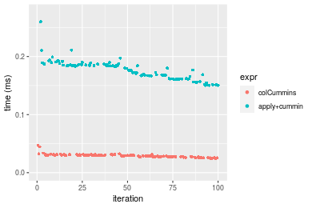
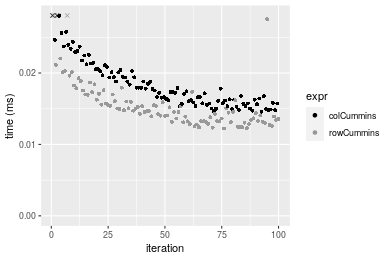
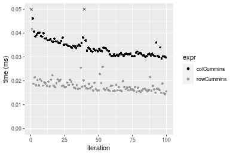
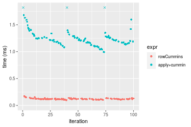

[matrixStats]: Benchmark report

---------------------------------------


# colCummins() and rowCummins() benchmarks

This report benchmark the performance of colCummins() and rowCummins() against alternative methods.

## Alternative methods

* apply() + cummin()


## Data type "integer"

### Data
```r
> rmatrix <- function(nrow, ncol, mode = c("logical", "double", "integer", "index"), range = c(-100, 
+     +100), na_prob = 0) {
+     mode <- match.arg(mode)
+     n <- nrow * ncol
+     if (mode == "logical") {
+         x <- sample(c(FALSE, TRUE), size = n, replace = TRUE)
+     }     else if (mode == "index") {
+         x <- seq_len(n)
+         mode <- "integer"
+     }     else {
+         x <- runif(n, min = range[1], max = range[2])
+     }
+     storage.mode(x) <- mode
+     if (na_prob > 0) 
+         x[sample(n, size = na_prob * n)] <- NA
+     dim(x) <- c(nrow, ncol)
+     x
+ }
> rmatrices <- function(scale = 10, seed = 1, ...) {
+     set.seed(seed)
+     data <- list()
+     data[[1]] <- rmatrix(nrow = scale * 1, ncol = scale * 1, ...)
+     data[[2]] <- rmatrix(nrow = scale * 10, ncol = scale * 10, ...)
+     data[[3]] <- rmatrix(nrow = scale * 100, ncol = scale * 1, ...)
+     data[[4]] <- t(data[[3]])
+     data[[5]] <- rmatrix(nrow = scale * 10, ncol = scale * 100, ...)
+     data[[6]] <- t(data[[5]])
+     names(data) <- sapply(data, FUN = function(x) paste(dim(x), collapse = "x"))
+     data
+ }
> data <- rmatrices(mode = mode)
```

### Results

#### 10x10 integer matrix

```r
> X <- data[["10x10"]]
> gc()
          used  (Mb) gc trigger  (Mb) max used  (Mb)
Ncells 5172805 276.3    7554717 403.5  7554717 403.5
Vcells 9448210  72.1   31793280 242.6 60508962 461.7
> colStats <- microbenchmark(colCummins = colCummins(X), `apply+cummin` = apply(X, MARGIN = 2L, FUN = cummin), 
+     unit = "ms")
> X <- t(X)
> gc()
          used  (Mb) gc trigger  (Mb) max used  (Mb)
Ncells 5171737 276.3    7554717 403.5  7554717 403.5
Vcells 9445197  72.1   31793280 242.6 60508962 461.7
> rowStats <- microbenchmark(rowCummins = rowCummins(X), `apply+cummin` = apply(X, MARGIN = 1L, FUN = cummin), 
+     unit = "ms")
```

_Table: Benchmarking of colCummins() and apply+cummin() on integer+10x10 data. The top panel shows times in milliseconds and the bottom panel shows relative times._


|   |expr         |      min|        lq|      mean|   median|       uq|      max|
|:--|:------------|--------:|---------:|---------:|--------:|--------:|--------:|
|1  |colCummins   | 0.002278| 0.0026825| 0.0034496| 0.003003| 0.003999| 0.013684|
|2  |apply+cummin | 0.043908| 0.0450785| 0.0468466| 0.045683| 0.046233| 0.130471|


|   |expr         |     min|       lq|     mean|   median|       uq|      max|
|:--|:------------|-------:|--------:|--------:|--------:|--------:|--------:|
|1  |colCummins   |  1.0000|  1.00000|  1.00000|  1.00000|  1.00000| 1.000000|
|2  |apply+cummin | 19.2748| 16.80466| 13.58025| 15.21245| 11.56114| 9.534566|

_Table: Benchmarking of rowCummins() and apply+cummin() on integer+10x10 data (transposed). The top panel shows times in milliseconds and the bottom panel shows relative times._


|   |expr         |      min|        lq|      mean|   median|        uq|      max|
|:--|:------------|--------:|---------:|---------:|--------:|---------:|--------:|
|1  |rowCummins   | 0.002328| 0.0028575| 0.0035950| 0.003711| 0.0039635| 0.014355|
|2  |apply+cummin | 0.043654| 0.0451625| 0.0469572| 0.045831| 0.0464240| 0.136489|


|   |expr         |      min|      lq|     mean|   median|       uq|      max|
|:--|:------------|--------:|-------:|--------:|--------:|--------:|--------:|
|1  |rowCummins   |  1.00000|  1.0000|  1.00000|  1.00000|  1.00000| 1.000000|
|2  |apply+cummin | 18.75172| 15.8049| 13.06177| 12.35004| 11.71288| 9.508116|

_Figure: Benchmarking of colCummins() and apply+cummin() on integer+10x10 data  as well as rowCummins() and apply+cummin() on the same data transposed.  Outliers are displayed as crosses.  Times are in milliseconds._


_Table: Benchmarking of colCummins() and rowCummins() on integer+10x10 data (original and transposed).  The top panel shows times in milliseconds and the bottom panel shows relative times._


|   |expr       |   min|     lq|    mean| median|     uq|    max|
|:--|:----------|-----:|------:|-------:|------:|------:|------:|
|1  |colCummins | 2.278| 2.6825| 3.44961|  3.003| 3.9990| 13.684|
|2  |rowCummins | 2.328| 2.8575| 3.59501|  3.711| 3.9635| 14.355|


|   |expr       |      min|       lq|    mean|   median|        uq|      max|
|:--|:----------|--------:|--------:|-------:|--------:|---------:|--------:|
|1  |colCummins | 1.000000| 1.000000| 1.00000| 1.000000| 1.0000000| 1.000000|
|2  |rowCummins | 1.021949| 1.065238| 1.04215| 1.235764| 0.9911228| 1.049035|

_Figure: Benchmarking of colCummins() and rowCummins() on integer+10x10 data (original and transposed).  Outliers are displayed as crosses. Times are in milliseconds._


#### 100x100 integer matrix

```r
> X <- data[["100x100"]]
> gc()
          used  (Mb) gc trigger  (Mb) max used  (Mb)
Ncells 5170281 276.2    7554717 403.5  7554717 403.5
Vcells 9062211  69.2   31793280 242.6 60508962 461.7
> colStats <- microbenchmark(colCummins = colCummins(X), `apply+cummin` = apply(X, MARGIN = 2L, FUN = cummin), 
+     unit = "ms")
> X <- t(X)
> gc()
          used  (Mb) gc trigger  (Mb) max used  (Mb)
Ncells 5170275 276.2    7554717 403.5  7554717 403.5
Vcells 9067254  69.2   31793280 242.6 60508962 461.7
> rowStats <- microbenchmark(rowCummins = rowCummins(X), `apply+cummin` = apply(X, MARGIN = 1L, FUN = cummin), 
+     unit = "ms")
```

_Table: Benchmarking of colCummins() and apply+cummin() on integer+100x100 data. The top panel shows times in milliseconds and the bottom panel shows relative times._


|   |expr         |      min|        lq|      mean|    median|        uq|      max|
|:--|:------------|--------:|---------:|---------:|---------:|---------:|--------:|
|1  |colCummins   | 0.023514| 0.0255060| 0.0305663| 0.0271830| 0.0314885| 0.095626|
|2  |apply+cummin | 0.248390| 0.2697275| 0.3289016| 0.2954205| 0.3306865| 0.842199|


|   |expr         |      min|       lq|     mean|   median|       uq|      max|
|:--|:------------|--------:|--------:|--------:|--------:|--------:|--------:|
|1  |colCummins   |  1.00000|  1.00000|  1.00000|  1.00000|  1.00000| 1.000000|
|2  |apply+cummin | 10.56349| 10.57506| 10.76026| 10.86784| 10.50182| 8.807218|

_Table: Benchmarking of rowCummins() and apply+cummin() on integer+100x100 data (transposed). The top panel shows times in milliseconds and the bottom panel shows relative times._


|   |expr         |      min|        lq|      mean|    median|        uq|      max|
|:--|:------------|--------:|---------:|---------:|---------:|---------:|--------:|
|1  |rowCummins   | 0.016984| 0.0189825| 0.0207012| 0.0198800| 0.0216285| 0.037045|
|2  |apply+cummin | 0.239776| 0.2504245| 0.2863355| 0.2830675| 0.3162670| 0.459460|


|   |expr         |      min|       lq|     mean|   median|      uq|      max|
|:--|:------------|--------:|--------:|--------:|--------:|-------:|--------:|
|1  |rowCummins   |  1.00000|  1.00000|  1.00000|  1.00000|  1.0000|  1.00000|
|2  |apply+cummin | 14.11776| 13.19239| 13.83186| 14.23881| 14.6227| 12.40275|

_Figure: Benchmarking of colCummins() and apply+cummin() on integer+100x100 data  as well as rowCummins() and apply+cummin() on the same data transposed.  Outliers are displayed as crosses.  Times are in milliseconds._


_Table: Benchmarking of colCummins() and rowCummins() on integer+100x100 data (original and transposed).  The top panel shows times in milliseconds and the bottom panel shows relative times._


|   |expr       |    min|      lq|     mean| median|      uq|    max|
|:--|:----------|------:|-------:|--------:|------:|-------:|------:|
|2  |rowCummins | 16.984| 18.9825| 20.70115| 19.880| 21.6285| 37.045|
|1  |colCummins | 23.514| 25.5060| 30.56633| 27.183| 31.4885| 95.626|


|   |expr       |     min|       lq|     mean|   median|      uq|      max|
|:--|:----------|-------:|--------:|--------:|--------:|-------:|--------:|
|2  |rowCummins | 1.00000| 1.000000| 1.000000| 1.000000| 1.00000| 1.000000|
|1  |colCummins | 1.38448| 1.343659| 1.476552| 1.367354| 1.45588| 2.581347|

_Figure: Benchmarking of colCummins() and rowCummins() on integer+100x100 data (original and transposed).  Outliers are displayed as crosses. Times are in milliseconds._


#### 1000x10 integer matrix

```r
> X <- data[["1000x10"]]
> gc()
          used  (Mb) gc trigger  (Mb) max used  (Mb)
Ncells 5170472 276.2    7554717 403.5  7554717 403.5
Vcells 9062555  69.2   31793280 242.6 60508962 461.7
> colStats <- microbenchmark(colCummins = colCummins(X), `apply+cummin` = apply(X, MARGIN = 2L, FUN = cummin), 
+     unit = "ms")
> X <- t(X)
> gc()
          used  (Mb) gc trigger  (Mb) max used  (Mb)
Ncells 5170466 276.2    7554717 403.5  7554717 403.5
Vcells 9067598  69.2   31793280 242.6 60508962 461.7
> rowStats <- microbenchmark(rowCummins = rowCummins(X), `apply+cummin` = apply(X, MARGIN = 1L, FUN = cummin), 
+     unit = "ms")
```

_Table: Benchmarking of colCummins() and apply+cummin() on integer+1000x10 data. The top panel shows times in milliseconds and the bottom panel shows relative times._


|   |expr         |      min|        lq|      mean|    median|       uq|      max|
|:--|:------------|--------:|---------:|---------:|---------:|--------:|--------:|
|1  |colCummins   | 0.024786| 0.0274975| 0.0291939| 0.0295225| 0.030184| 0.058569|
|2  |apply+cummin | 0.149748| 0.1618620| 0.1743711| 0.1734325| 0.185243| 0.283263|


|   |expr         |      min|       lq|     mean|   median|       uq|      max|
|:--|:------------|--------:|--------:|--------:|--------:|--------:|--------:|
|1  |colCummins   | 1.000000| 1.000000| 1.000000| 1.000000| 1.000000| 1.000000|
|2  |apply+cummin | 6.041636| 5.886426| 5.972867| 5.874587| 6.137126| 4.836398|

_Table: Benchmarking of rowCummins() and apply+cummin() on integer+1000x10 data (transposed). The top panel shows times in milliseconds and the bottom panel shows relative times._


|   |expr         |      min|        lq|      mean|    median|       uq|      max|
|:--|:------------|--------:|---------:|---------:|---------:|--------:|--------:|
|1  |rowCummins   | 0.019551| 0.0217630| 0.0236881| 0.0232485| 0.024547| 0.042436|
|2  |apply+cummin | 0.148546| 0.1625515| 0.1767027| 0.1691145| 0.187099| 0.320882|


|   |expr         |      min|       lq|    mean|   median|       uq|      max|
|:--|:------------|--------:|--------:|-------:|--------:|--------:|--------:|
|1  |rowCummins   | 1.000000| 1.000000| 1.00000| 1.000000| 1.000000| 1.000000|
|2  |apply+cummin | 7.597872| 7.469168| 7.45955| 7.274211| 7.622072| 7.561552|

_Figure: Benchmarking of colCummins() and apply+cummin() on integer+1000x10 data  as well as rowCummins() and apply+cummin() on the same data transposed.  Outliers are displayed as crosses.  Times are in milliseconds._





_Table: Benchmarking of colCummins() and rowCummins() on integer+1000x10 data (original and transposed).  The top panel shows times in milliseconds and the bottom panel shows relative times._


|   |expr       |    min|      lq|     mean|  median|     uq|    max|
|:--|:----------|------:|-------:|--------:|-------:|------:|------:|
|2  |rowCummins | 19.551| 21.7630| 23.68812| 23.2485| 24.547| 42.436|
|1  |colCummins | 24.786| 27.4975| 29.19387| 29.5225| 30.184| 58.569|


|   |expr       |      min|       lq|     mean|   median|       uq|      max|
|:--|:----------|--------:|--------:|--------:|--------:|--------:|--------:|
|2  |rowCummins | 1.000000| 1.000000| 1.000000| 1.000000| 1.000000| 1.000000|
|1  |colCummins | 1.267761| 1.263498| 1.232427| 1.269867| 1.229641| 1.380173|

_Figure: Benchmarking of colCummins() and rowCummins() on integer+1000x10 data (original and transposed).  Outliers are displayed as crosses. Times are in milliseconds._


#### 10x1000 integer matrix

```r
> X <- data[["10x1000"]]
> gc()
          used  (Mb) gc trigger  (Mb) max used  (Mb)
Ncells 5170660 276.2    7554717 403.5  7554717 403.5
Vcells 9063243  69.2   31793280 242.6 60508962 461.7
> colStats <- microbenchmark(colCummins = colCummins(X), `apply+cummin` = apply(X, MARGIN = 2L, FUN = cummin), 
+     unit = "ms")
> X <- t(X)
> gc()
          used  (Mb) gc trigger  (Mb) max used  (Mb)
Ncells 5170654 276.2    7554717 403.5  7554717 403.5
Vcells 9068286  69.2   31793280 242.6 60508962 461.7
> rowStats <- microbenchmark(rowCummins = rowCummins(X), `apply+cummin` = apply(X, MARGIN = 1L, FUN = cummin), 
+     unit = "ms")
```

_Table: Benchmarking of colCummins() and apply+cummin() on integer+10x1000 data. The top panel shows times in milliseconds and the bottom panel shows relative times._


|   |expr         |      min|       lq|      mean|    median|        uq|      max|
|:--|:------------|--------:|--------:|---------:|---------:|---------:|--------:|
|1  |colCummins   | 0.014524| 0.017038| 0.0201634| 0.0192095| 0.0224725| 0.035493|
|2  |apply+cummin | 0.856183| 0.921287| 1.0459599| 1.0052720| 1.1403810| 1.540527|


|   |expr         |      min|       lq|     mean|   median|       uq|      max|
|:--|:------------|--------:|--------:|--------:|--------:|--------:|--------:|
|1  |colCummins   |  1.00000|  1.00000|  1.00000|  1.00000|  1.00000|  1.00000|
|2  |apply+cummin | 58.94953| 54.07249| 51.87421| 52.33202| 50.74562| 43.40369|

_Table: Benchmarking of rowCummins() and apply+cummin() on integer+10x1000 data (transposed). The top panel shows times in milliseconds and the bottom panel shows relative times._


|   |expr         |      min|        lq|      mean|    median|       uq|      max|
|:--|:------------|--------:|---------:|---------:|---------:|--------:|--------:|
|1  |rowCummins   | 0.013364| 0.0151185| 0.0231765| 0.0180795| 0.028658| 0.071365|
|2  |apply+cummin | 0.926314| 1.0156680| 1.3705076| 1.1538380| 1.556601| 3.164573|


|   |expr         |      min|       lq|     mean|   median|       uq|      max|
|:--|:------------|--------:|--------:|--------:|--------:|--------:|--------:|
|1  |rowCummins   |  1.00000|  1.00000|  1.00000|  1.00000|  1.00000|  1.00000|
|2  |apply+cummin | 69.31413| 67.18047| 59.13355| 63.82024| 54.31644| 44.34349|

_Figure: Benchmarking of colCummins() and apply+cummin() on integer+10x1000 data  as well as rowCummins() and apply+cummin() on the same data transposed.  Outliers are displayed as crosses.  Times are in milliseconds._


_Table: Benchmarking of colCummins() and rowCummins() on integer+10x1000 data (original and transposed).  The top panel shows times in milliseconds and the bottom panel shows relative times._


|   |expr       |    min|      lq|     mean|  median|      uq|    max|
|:--|:----------|------:|-------:|--------:|-------:|-------:|------:|
|2  |rowCummins | 13.364| 15.1185| 23.17648| 18.0795| 28.6580| 71.365|
|1  |colCummins | 14.524| 17.0380| 20.16339| 19.2095| 22.4725| 35.493|


|   |expr       |    min|       lq|      mean|   median|        uq|       max|
|:--|:----------|------:|--------:|---------:|--------:|---------:|---------:|
|2  |rowCummins | 1.0000| 1.000000| 1.0000000| 1.000000| 1.0000000| 1.0000000|
|1  |colCummins | 1.0868| 1.126964| 0.8699936| 1.062502| 0.7841615| 0.4973446|

_Figure: Benchmarking of colCummins() and rowCummins() on integer+10x1000 data (original and transposed).  Outliers are displayed as crosses. Times are in milliseconds._




#### 100x1000 integer matrix

```r
> X <- data[["100x1000"]]
> gc()
          used  (Mb) gc trigger  (Mb) max used  (Mb)
Ncells 5170850 276.2    7554717 403.5  7554717 403.5
Vcells 9063734  69.2   31793280 242.6 60508962 461.7
> colStats <- microbenchmark(colCummins = colCummins(X), `apply+cummin` = apply(X, MARGIN = 2L, FUN = cummin), 
+     unit = "ms")
> X <- t(X)
> gc()
          used  (Mb) gc trigger  (Mb) max used  (Mb)
Ncells 5170838 276.2    7554717 403.5  7554717 403.5
Vcells 9113767  69.6   31793280 242.6 60508962 461.7
> rowStats <- microbenchmark(rowCummins = rowCummins(X), `apply+cummin` = apply(X, MARGIN = 1L, FUN = cummin), 
+     unit = "ms")
```

_Table: Benchmarking of colCummins() and apply+cummin() on integer+100x1000 data. The top panel shows times in milliseconds and the bottom panel shows relative times._


|   |expr         |      min|       lq|      mean|    median|       uq|       max|
|:--|:------------|--------:|--------:|---------:|---------:|--------:|---------:|
|1  |colCummins   | 0.170833| 0.192141| 0.3948563| 0.2154205| 0.283948| 16.143538|
|2  |apply+cummin | 1.733462| 1.966561| 2.2872556| 2.1827155| 2.503075|  4.124916|


|   |expr         |      min|       lq|     mean|   median|       uq|      max|
|:--|:------------|--------:|--------:|--------:|--------:|--------:|--------:|
|1  |colCummins   |  1.00000|  1.00000| 1.000000|  1.00000| 1.000000| 1.000000|
|2  |apply+cummin | 10.14711| 10.23499| 5.792628| 10.13235| 8.815258| 0.255515|

_Table: Benchmarking of rowCummins() and apply+cummin() on integer+100x1000 data (transposed). The top panel shows times in milliseconds and the bottom panel shows relative times._


|   |expr         |      min|       lq|      mean|   median|        uq|       max|
|:--|:------------|--------:|--------:|---------:|--------:|---------:|---------:|
|1  |rowCummins   | 0.106460| 0.110055| 0.1183451| 0.114205| 0.1198805|  0.189258|
|2  |apply+cummin | 1.655646| 1.749476| 2.0263777| 1.801479| 1.8999320| 17.189340|


|   |expr         |      min|       lq|     mean|   median|       uq|      max|
|:--|:------------|--------:|--------:|--------:|--------:|--------:|--------:|
|1  |rowCummins   |  1.00000|  1.00000|  1.00000|  1.00000|  1.00000|  1.00000|
|2  |apply+cummin | 15.55181| 15.89638| 17.12261| 15.77408| 15.84855| 90.82491|

_Figure: Benchmarking of colCummins() and apply+cummin() on integer+100x1000 data  as well as rowCummins() and apply+cummin() on the same data transposed.  Outliers are displayed as crosses.  Times are in milliseconds._


_Table: Benchmarking of colCummins() and rowCummins() on integer+100x1000 data (original and transposed).  The top panel shows times in milliseconds and the bottom panel shows relative times._


|   |expr       |     min|      lq|     mean|   median|       uq|       max|
|:--|:----------|-------:|-------:|--------:|--------:|--------:|---------:|
|2  |rowCummins | 106.460| 110.055| 118.3451| 114.2050| 119.8805|   189.258|
|1  |colCummins | 170.833| 192.141| 394.8563| 215.4205| 283.9480| 16143.538|


|   |expr       |      min|       lq|     mean|   median|       uq|     max|
|:--|:----------|--------:|--------:|--------:|--------:|--------:|-------:|
|2  |rowCummins | 1.000000| 1.000000| 1.000000| 1.000000| 1.000000|  1.0000|
|1  |colCummins | 1.604668| 1.745863| 3.336482| 1.886262| 2.368592| 85.2991|

_Figure: Benchmarking of colCummins() and rowCummins() on integer+100x1000 data (original and transposed).  Outliers are displayed as crosses. Times are in milliseconds._


#### 1000x100 integer matrix

```r
> X <- data[["1000x100"]]
> gc()
          used  (Mb) gc trigger  (Mb) max used  (Mb)
Ncells 5171036 276.2    7554717 403.5  7554717 403.5
Vcells 9064295  69.2   31793280 242.6 60508962 461.7
> colStats <- microbenchmark(colCummins = colCummins(X), `apply+cummin` = apply(X, MARGIN = 2L, FUN = cummin), 
+     unit = "ms")
> X <- t(X)
> gc()
          used  (Mb) gc trigger  (Mb) max used  (Mb)
Ncells 5171030 276.2    7554717 403.5  7554717 403.5
Vcells 9114338  69.6   31793280 242.6 60508962 461.7
> rowStats <- microbenchmark(rowCummins = rowCummins(X), `apply+cummin` = apply(X, MARGIN = 1L, FUN = cummin), 
+     unit = "ms")
```

_Table: Benchmarking of colCummins() and apply+cummin() on integer+1000x100 data. The top panel shows times in milliseconds and the bottom panel shows relative times._


|   |expr         |      min|        lq|     mean|    median|        uq|      max|
|:--|:------------|--------:|---------:|--------:|---------:|---------:|--------:|
|1  |colCummins   | 0.165823| 0.1675675| 0.186980| 0.1764765| 0.1987005| 0.303187|
|2  |apply+cummin | 0.901834| 0.9263125| 1.095374| 0.9671845| 1.0995725| 7.493937|


|   |expr         |      min|       lq|     mean|   median|       uq|      max|
|:--|:------------|--------:|--------:|--------:|--------:|--------:|--------:|
|1  |colCummins   | 1.000000| 1.000000| 1.000000| 1.000000| 1.000000|  1.00000|
|2  |apply+cummin | 5.438534| 5.527996| 5.858243| 5.480529| 5.533818| 24.71721|

_Table: Benchmarking of rowCummins() and apply+cummin() on integer+1000x100 data (transposed). The top panel shows times in milliseconds and the bottom panel shows relative times._


|   |expr         |      min|        lq|      mean|    median|       uq|      max|
|:--|:------------|--------:|---------:|---------:|---------:|--------:|--------:|
|1  |rowCummins   | 0.114288| 0.1181965| 0.1329277| 0.1254105| 0.144027| 0.198742|
|2  |apply+cummin | 0.904858| 0.9375545| 1.1366388| 1.0067035| 1.136286| 7.421304|


|   |expr         |      min|       lq|     mean|   median|       uq|     max|
|:--|:------------|--------:|--------:|--------:|--------:|--------:|-------:|
|1  |rowCummins   | 1.000000| 1.000000| 1.000000| 1.000000| 1.000000|  1.0000|
|2  |apply+cummin | 7.917349| 7.932168| 8.550802| 8.027266| 7.889399| 37.3414|

_Figure: Benchmarking of colCummins() and apply+cummin() on integer+1000x100 data  as well as rowCummins() and apply+cummin() on the same data transposed.  Outliers are displayed as crosses.  Times are in milliseconds._


_Table: Benchmarking of colCummins() and rowCummins() on integer+1000x100 data (original and transposed).  The top panel shows times in milliseconds and the bottom panel shows relative times._


|   |expr       |     min|       lq|     mean|   median|       uq|     max|
|:--|:----------|-------:|--------:|--------:|--------:|--------:|-------:|
|2  |rowCummins | 114.288| 118.1965| 132.9277| 125.4105| 144.0270| 198.742|
|1  |colCummins | 165.823| 167.5675| 186.9800| 176.4765| 198.7005| 303.187|


|   |expr       |      min|       lq|     mean|   median|       uq|      max|
|:--|:----------|--------:|--------:|--------:|--------:|--------:|--------:|
|2  |rowCummins | 1.000000| 1.000000| 1.000000| 1.000000| 1.000000| 1.000000|
|1  |colCummins | 1.450922| 1.417703| 1.406629| 1.407191| 1.379606| 1.525531|

_Figure: Benchmarking of colCummins() and rowCummins() on integer+1000x100 data (original and transposed).  Outliers are displayed as crosses. Times are in milliseconds._


## Data type "double"

### Data
```r
> rmatrix <- function(nrow, ncol, mode = c("logical", "double", "integer", "index"), range = c(-100, 
+     +100), na_prob = 0) {
+     mode <- match.arg(mode)
+     n <- nrow * ncol
+     if (mode == "logical") {
+         x <- sample(c(FALSE, TRUE), size = n, replace = TRUE)
+     }     else if (mode == "index") {
+         x <- seq_len(n)
+         mode <- "integer"
+     }     else {
+         x <- runif(n, min = range[1], max = range[2])
+     }
+     storage.mode(x) <- mode
+     if (na_prob > 0) 
+         x[sample(n, size = na_prob * n)] <- NA
+     dim(x) <- c(nrow, ncol)
+     x
+ }
> rmatrices <- function(scale = 10, seed = 1, ...) {
+     set.seed(seed)
+     data <- list()
+     data[[1]] <- rmatrix(nrow = scale * 1, ncol = scale * 1, ...)
+     data[[2]] <- rmatrix(nrow = scale * 10, ncol = scale * 10, ...)
+     data[[3]] <- rmatrix(nrow = scale * 100, ncol = scale * 1, ...)
+     data[[4]] <- t(data[[3]])
+     data[[5]] <- rmatrix(nrow = scale * 10, ncol = scale * 100, ...)
+     data[[6]] <- t(data[[5]])
+     names(data) <- sapply(data, FUN = function(x) paste(dim(x), collapse = "x"))
+     data
+ }
> data <- rmatrices(mode = mode)
```

### Results

#### 10x10 double matrix

```r
> X <- data[["10x10"]]
> gc()
          used  (Mb) gc trigger  (Mb) max used  (Mb)
Ncells 5171236 276.2    7554717 403.5  7554717 403.5
Vcells 9180009  70.1   31793280 242.6 60508962 461.7
> colStats <- microbenchmark(colCummins = colCummins(X), `apply+cummin` = apply(X, MARGIN = 2L, FUN = cummin), 
+     unit = "ms")
> X <- t(X)
> gc()
          used  (Mb) gc trigger  (Mb) max used  (Mb)
Ncells 5171221 276.2    7554717 403.5  7554717 403.5
Vcells 9180137  70.1   31793280 242.6 60508962 461.7
> rowStats <- microbenchmark(rowCummins = rowCummins(X), `apply+cummin` = apply(X, MARGIN = 1L, FUN = cummin), 
+     unit = "ms")
```

_Table: Benchmarking of colCummins() and apply+cummin() on double+10x10 data. The top panel shows times in milliseconds and the bottom panel shows relative times._


|   |expr         |      min|       lq|      mean|   median|       uq|      max|
|:--|:------------|--------:|--------:|---------:|--------:|--------:|--------:|
|1  |colCummins   | 0.002511| 0.002738| 0.0034623| 0.002995| 0.004036| 0.012852|
|2  |apply+cummin | 0.044008| 0.044765| 0.0462740| 0.045123| 0.045609| 0.120871|


|   |expr         |      min|       lq|     mean|   median|       uq|     max|
|:--|:------------|--------:|--------:|--------:|--------:|--------:|-------:|
|1  |colCummins   |  1.00000|  1.00000|  1.00000|  1.00000|  1.00000| 1.00000|
|2  |apply+cummin | 17.52609| 16.34953| 13.36499| 15.06611| 11.30055| 9.40484|

_Table: Benchmarking of rowCummins() and apply+cummin() on double+10x10 data (transposed). The top panel shows times in milliseconds and the bottom panel shows relative times._


|   |expr         |      min|        lq|      mean|    median|        uq|      max|
|:--|:------------|--------:|---------:|---------:|---------:|---------:|--------:|
|1  |rowCummins   | 0.002376| 0.0028290| 0.0036329| 0.0037835| 0.0040290| 0.015847|
|2  |apply+cummin | 0.042483| 0.0451185| 0.0467835| 0.0459060| 0.0464885| 0.125401|


|   |expr         |      min|       lq|     mean|   median|       uq|      max|
|:--|:------------|--------:|--------:|--------:|--------:|--------:|--------:|
|1  |rowCummins   |  1.00000|  1.00000|  1.00000|  1.00000|  1.00000| 1.000000|
|2  |apply+cummin | 17.88005| 15.94857| 12.87774| 12.13321| 11.53847| 7.913233|

_Figure: Benchmarking of colCummins() and apply+cummin() on double+10x10 data  as well as rowCummins() and apply+cummin() on the same data transposed.  Outliers are displayed as crosses.  Times are in milliseconds._


_Table: Benchmarking of colCummins() and rowCummins() on double+10x10 data (original and transposed).  The top panel shows times in milliseconds and the bottom panel shows relative times._


|   |expr       |   min|    lq|    mean| median|    uq|    max|
|:--|:----------|-----:|-----:|-------:|------:|-----:|------:|
|1  |colCummins | 2.511| 2.738| 3.46233| 2.9950| 4.036| 12.852|
|2  |rowCummins | 2.376| 2.829| 3.63290| 3.7835| 4.029| 15.847|


|   |expr       |       min|       lq|     mean|   median|        uq|      max|
|:--|:----------|---------:|--------:|--------:|--------:|---------:|--------:|
|1  |colCummins | 1.0000000| 1.000000| 1.000000| 1.000000| 1.0000000| 1.000000|
|2  |rowCummins | 0.9462366| 1.033236| 1.049265| 1.263272| 0.9982656| 1.233038|

_Figure: Benchmarking of colCummins() and rowCummins() on double+10x10 data (original and transposed).  Outliers are displayed as crosses. Times are in milliseconds._


#### 100x100 double matrix

```r
> X <- data[["100x100"]]
> gc()
          used  (Mb) gc trigger  (Mb) max used  (Mb)
Ncells 5171416 276.2    7554717 403.5  7554717 403.5
Vcells 9180836  70.1   31793280 242.6 60508962 461.7
> colStats <- microbenchmark(colCummins = colCummins(X), `apply+cummin` = apply(X, MARGIN = 2L, FUN = cummin), 
+     unit = "ms")
> X <- t(X)
> gc()
          used  (Mb) gc trigger  (Mb) max used  (Mb)
Ncells 5171410 276.2    7554717 403.5  7554717 403.5
Vcells 9190879  70.2   31793280 242.6 60508962 461.7
> rowStats <- microbenchmark(rowCummins = rowCummins(X), `apply+cummin` = apply(X, MARGIN = 1L, FUN = cummin), 
+     unit = "ms")
```

_Table: Benchmarking of colCummins() and apply+cummin() on double+100x100 data. The top panel shows times in milliseconds and the bottom panel shows relative times._


|   |expr         |      min|       lq|      mean|    median|       uq|      max|
|:--|:------------|--------:|--------:|---------:|---------:|--------:|--------:|
|1  |colCummins   | 0.030337| 0.032862| 0.0361780| 0.0353980| 0.038409| 0.070215|
|2  |apply+cummin | 0.238080| 0.256512| 0.2851755| 0.2777525| 0.307217| 0.438169|


|   |expr         |      min|       lq|     mean|   median|       uq|     max|
|:--|:------------|--------:|--------:|--------:|--------:|--------:|-------:|
|1  |colCummins   | 1.000000| 1.000000| 1.000000| 1.000000| 1.000000| 1.00000|
|2  |apply+cummin | 7.847843| 7.805733| 7.882572| 7.846559| 7.998568| 6.24039|

_Table: Benchmarking of rowCummins() and apply+cummin() on double+100x100 data (transposed). The top panel shows times in milliseconds and the bottom panel shows relative times._


|   |expr         |      min|        lq|      mean|    median|        uq|      max|
|:--|:------------|--------:|---------:|---------:|---------:|---------:|--------:|
|1  |rowCummins   | 0.013569| 0.0152635| 0.0166513| 0.0159755| 0.0177540| 0.028618|
|2  |apply+cummin | 0.232585| 0.2418585| 0.2693165| 0.2568735| 0.2835765| 0.441579|


|   |expr         |      min|       lq|     mean|   median|       uq|      max|
|:--|:------------|--------:|--------:|--------:|--------:|--------:|--------:|
|1  |rowCummins   |  1.00000|  1.00000|  1.00000|  1.00000|  1.00000|  1.00000|
|2  |apply+cummin | 17.14091| 15.84555| 16.17393| 16.07922| 15.97254| 15.43011|

_Figure: Benchmarking of colCummins() and apply+cummin() on double+100x100 data  as well as rowCummins() and apply+cummin() on the same data transposed.  Outliers are displayed as crosses.  Times are in milliseconds._


_Table: Benchmarking of colCummins() and rowCummins() on double+100x100 data (original and transposed).  The top panel shows times in milliseconds and the bottom panel shows relative times._


|   |expr       |    min|      lq|     mean|  median|     uq|    max|
|:--|:----------|------:|-------:|--------:|-------:|------:|------:|
|2  |rowCummins | 13.569| 15.2635| 16.65127| 15.9755| 17.754| 28.618|
|1  |colCummins | 30.337| 32.8620| 36.17798| 35.3980| 38.409| 70.215|


|   |expr       |      min|       lq|     mean|   median|     uq|      max|
|:--|:----------|--------:|--------:|--------:|--------:|------:|--------:|
|2  |rowCummins | 1.000000| 1.000000| 1.000000| 1.000000| 1.0000| 1.000000|
|1  |colCummins | 2.235758| 2.152979| 2.172686| 2.215768| 2.1634| 2.453526|

_Figure: Benchmarking of colCummins() and rowCummins() on double+100x100 data (original and transposed).  Outliers are displayed as crosses. Times are in milliseconds._




#### 1000x10 double matrix

```r
> X <- data[["1000x10"]]
> gc()
          used  (Mb) gc trigger  (Mb) max used  (Mb)
Ncells 5171606 276.2    7554717 403.5  7554717 403.5
Vcells 9181735  70.1   31793280 242.6 60508962 461.7
> colStats <- microbenchmark(colCummins = colCummins(X), `apply+cummin` = apply(X, MARGIN = 2L, FUN = cummin), 
+     unit = "ms")
> X <- t(X)
> gc()
          used  (Mb) gc trigger  (Mb) max used  (Mb)
Ncells 5171600 276.2    7554717 403.5  7554717 403.5
Vcells 9191778  70.2   31793280 242.6 60508962 461.7
> rowStats <- microbenchmark(rowCummins = rowCummins(X), `apply+cummin` = apply(X, MARGIN = 1L, FUN = cummin), 
+     unit = "ms")
```

_Table: Benchmarking of colCummins() and apply+cummin() on double+1000x10 data. The top panel shows times in milliseconds and the bottom panel shows relative times._


|   |expr         |      min|       lq|      mean|    median|       uq|      max|
|:--|:------------|--------:|--------:|---------:|---------:|--------:|--------:|
|1  |colCummins   | 0.033784| 0.036322| 0.0390692| 0.0391235| 0.041478| 0.057060|
|2  |apply+cummin | 0.150013| 0.157907| 0.1742555| 0.1745245| 0.186282| 0.277348|


|   |expr         |      min|      lq|    mean|   median|       uq|      max|
|:--|:------------|--------:|-------:|-------:|--------:|--------:|--------:|
|1  |colCummins   | 1.000000| 1.00000| 1.00000| 1.000000| 1.000000| 1.000000|
|2  |apply+cummin | 4.440356| 4.34742| 4.46017| 4.460861| 4.491104| 4.860638|

_Table: Benchmarking of rowCummins() and apply+cummin() on double+1000x10 data (transposed). The top panel shows times in milliseconds and the bottom panel shows relative times._


|   |expr         |      min|        lq|      mean|   median|        uq|      max|
|:--|:------------|--------:|---------:|---------:|--------:|---------:|--------:|
|1  |rowCummins   | 0.016119| 0.0182445| 0.0202197| 0.019744| 0.0217730| 0.042889|
|2  |apply+cummin | 0.151658| 0.1615245| 0.1780532| 0.173678| 0.1885445| 0.284735|


|   |expr         |      min|       lq|     mean|   median|       uq|      max|
|:--|:------------|--------:|--------:|--------:|--------:|--------:|--------:|
|1  |rowCummins   | 1.000000| 1.000000| 1.000000| 1.000000| 1.000000| 1.000000|
|2  |apply+cummin | 9.408648| 8.853326| 8.805921| 8.796495| 8.659555| 6.638882|

_Figure: Benchmarking of colCummins() and apply+cummin() on double+1000x10 data  as well as rowCummins() and apply+cummin() on the same data transposed.  Outliers are displayed as crosses.  Times are in milliseconds._


_Table: Benchmarking of colCummins() and rowCummins() on double+1000x10 data (original and transposed).  The top panel shows times in milliseconds and the bottom panel shows relative times._


|   |expr       |    min|      lq|     mean|  median|     uq|    max|
|:--|:----------|------:|-------:|--------:|-------:|------:|------:|
|2  |rowCummins | 16.119| 18.2445| 20.21972| 19.7440| 21.773| 42.889|
|1  |colCummins | 33.784| 36.3220| 39.06925| 39.1235| 41.478| 57.060|


|   |expr       |      min|       lq|     mean|   median|      uq|      max|
|:--|:----------|--------:|--------:|--------:|--------:|-------:|--------:|
|2  |rowCummins | 1.000000| 1.000000| 1.000000| 1.000000| 1.00000| 1.000000|
|1  |colCummins | 2.095912| 1.990847| 1.932235| 1.981539| 1.90502| 1.330411|

_Figure: Benchmarking of colCummins() and rowCummins() on double+1000x10 data (original and transposed).  Outliers are displayed as crosses. Times are in milliseconds._


#### 10x1000 double matrix

```r
> X <- data[["10x1000"]]
> gc()
          used  (Mb) gc trigger  (Mb) max used  (Mb)
Ncells 5171794 276.3    7554717 403.5  7554717 403.5
Vcells 9181860  70.1   31793280 242.6 60508962 461.7
> colStats <- microbenchmark(colCummins = colCummins(X), `apply+cummin` = apply(X, MARGIN = 2L, FUN = cummin), 
+     unit = "ms")
> X <- t(X)
> gc()
          used  (Mb) gc trigger  (Mb) max used  (Mb)
Ncells 5171788 276.3    7554717 403.5  7554717 403.5
Vcells 9191903  70.2   31793280 242.6 60508962 461.7
> rowStats <- microbenchmark(rowCummins = rowCummins(X), `apply+cummin` = apply(X, MARGIN = 1L, FUN = cummin), 
+     unit = "ms")
```

_Table: Benchmarking of colCummins() and apply+cummin() on double+10x1000 data. The top panel shows times in milliseconds and the bottom panel shows relative times._


|   |expr         |      min|        lq|      mean|    median|        uq|      max|
|:--|:------------|--------:|---------:|---------:|---------:|---------:|--------:|
|1  |colCummins   | 0.014975| 0.0169435| 0.0202688| 0.0192055| 0.0224275| 0.037909|
|2  |apply+cummin | 0.830252| 0.8932585| 1.0080075| 0.9826265| 1.0988995| 1.406708|


|   |expr         |      min|       lq|     mean|   median|       uq|      max|
|:--|:------------|--------:|--------:|--------:|--------:|--------:|--------:|
|1  |colCummins   |  1.00000|  1.00000|  1.00000|  1.00000|  1.00000|  1.00000|
|2  |apply+cummin | 55.44254| 52.71983| 49.73195| 51.16381| 48.99786| 37.10749|

_Table: Benchmarking of rowCummins() and apply+cummin() on double+10x1000 data (transposed). The top panel shows times in milliseconds and the bottom panel shows relative times._


|   |expr         |      min|        lq|      mean|    median|        uq|      max|
|:--|:------------|--------:|---------:|---------:|---------:|---------:|--------:|
|1  |rowCummins   | 0.010707| 0.0129190| 0.0159873| 0.0147310| 0.0183425| 0.034927|
|2  |apply+cummin | 0.839340| 0.9092765| 1.0267892| 0.9982665| 1.0984730| 1.621384|


|   |expr         |      min|       lq|     mean|   median|       uq|      max|
|:--|:------------|--------:|--------:|--------:|--------:|--------:|--------:|
|1  |rowCummins   |  1.00000|  1.00000|  1.00000|  1.00000|  1.00000|  1.00000|
|2  |apply+cummin | 78.39171| 70.38289| 64.22538| 67.76638| 59.88677| 46.42208|

_Figure: Benchmarking of colCummins() and apply+cummin() on double+10x1000 data  as well as rowCummins() and apply+cummin() on the same data transposed.  Outliers are displayed as crosses.  Times are in milliseconds._


_Table: Benchmarking of colCummins() and rowCummins() on double+10x1000 data (original and transposed).  The top panel shows times in milliseconds and the bottom panel shows relative times._


|   |expr       |    min|      lq|     mean|  median|      uq|    max|
|:--|:----------|------:|-------:|--------:|-------:|-------:|------:|
|2  |rowCummins | 10.707| 12.9190| 15.98728| 14.7310| 18.3425| 34.927|
|1  |colCummins | 14.975| 16.9435| 20.26881| 19.2055| 22.4275| 37.909|


|   |expr       |      min|       lq|     mean|   median|       uq|      max|
|:--|:----------|--------:|--------:|--------:|--------:|--------:|--------:|
|2  |rowCummins | 1.000000| 1.000000| 1.000000| 1.000000| 1.000000| 1.000000|
|1  |colCummins | 1.398618| 1.311518| 1.267808| 1.303747| 1.222707| 1.085378|

_Figure: Benchmarking of colCummins() and rowCummins() on double+10x1000 data (original and transposed).  Outliers are displayed as crosses. Times are in milliseconds._


#### 100x1000 double matrix

```r
> X <- data[["100x1000"]]
> gc()
          used  (Mb) gc trigger  (Mb) max used  (Mb)
Ncells 5171984 276.3    7554717 403.5  7554717 403.5
Vcells 9182918  70.1   31793280 242.6 60508962 461.7
> colStats <- microbenchmark(colCummins = colCummins(X), `apply+cummin` = apply(X, MARGIN = 2L, FUN = cummin), 
+     unit = "ms")
> X <- t(X)
> gc()
          used  (Mb) gc trigger  (Mb) max used  (Mb)
Ncells 5171972 276.3    7554717 403.5  7554717 403.5
Vcells 9282951  70.9   31793280 242.6 60508962 461.7
> rowStats <- microbenchmark(rowCummins = rowCummins(X), `apply+cummin` = apply(X, MARGIN = 1L, FUN = cummin), 
+     unit = "ms")
```

_Table: Benchmarking of colCummins() and apply+cummin() on double+100x1000 data. The top panel shows times in milliseconds and the bottom panel shows relative times._


|   |expr         |      min|       lq|      mean|   median|       uq|      max|
|:--|:------------|--------:|--------:|---------:|--------:|--------:|--------:|
|1  |colCummins   | 0.218752| 0.235163| 0.4216995| 0.254991| 0.287071| 16.28394|
|2  |apply+cummin | 1.629630| 1.730211| 2.1004946| 1.871452| 2.147063| 14.12302|


|   |expr         |      min|       lq|     mean|   median|       uq|       max|
|:--|:------------|--------:|--------:|--------:|--------:|--------:|---------:|
|1  |colCummins   | 1.000000| 1.000000| 1.000000| 1.000000| 1.000000| 1.0000000|
|2  |apply+cummin | 7.449669| 7.357497| 4.981022| 7.339284| 7.479204| 0.8672973|

_Table: Benchmarking of rowCummins() and apply+cummin() on double+100x1000 data (transposed). The top panel shows times in milliseconds and the bottom panel shows relative times._


|   |expr         |      min|        lq|      mean|    median|       uq|      max|
|:--|:------------|--------:|---------:|---------:|---------:|--------:|--------:|
|1  |rowCummins   | 0.086855| 0.1012285| 0.2339595| 0.1109075| 0.119764| 12.14137|
|2  |apply+cummin | 1.642533| 1.7955335| 2.1722901| 2.0105130| 2.205197| 14.75284|


|   |expr         |      min|       lq|     mean|   median|       uq|      max|
|:--|:------------|--------:|--------:|--------:|--------:|--------:|--------:|
|1  |rowCummins   |  1.00000|  1.00000| 1.000000|  1.00000|  1.00000| 1.000000|
|2  |apply+cummin | 18.91121| 17.73743| 9.284899| 18.12784| 18.41285| 1.215088|

_Figure: Benchmarking of colCummins() and apply+cummin() on double+100x1000 data  as well as rowCummins() and apply+cummin() on the same data transposed.  Outliers are displayed as crosses.  Times are in milliseconds._


_Table: Benchmarking of colCummins() and rowCummins() on double+100x1000 data (original and transposed).  The top panel shows times in milliseconds and the bottom panel shows relative times._


|   |expr       |     min|       lq|     mean|   median|      uq|      max|
|:--|:----------|-------:|--------:|--------:|--------:|-------:|--------:|
|2  |rowCummins |  86.855| 101.2285| 233.9595| 110.9075| 119.764| 12141.37|
|1  |colCummins | 218.752| 235.1630| 421.6995| 254.9910| 287.071| 16283.94|


|   |expr       |      min|       lq|     mean|   median|       uq|      max|
|:--|:----------|--------:|--------:|--------:|--------:|--------:|--------:|
|2  |rowCummins | 1.000000| 1.000000| 1.000000| 1.000000| 1.000000| 1.000000|
|1  |colCummins | 2.518588| 2.323091| 1.802447| 2.299132| 2.396972| 1.341194|

_Figure: Benchmarking of colCummins() and rowCummins() on double+100x1000 data (original and transposed).  Outliers are displayed as crosses. Times are in milliseconds._


#### 1000x100 double matrix

```r
> X <- data[["1000x100"]]
> gc()
          used  (Mb) gc trigger  (Mb) max used  (Mb)
Ncells 5172170 276.3    7554717 403.5  7554717 403.5
Vcells 9183037  70.1   31793280 242.6 60508962 461.7
> colStats <- microbenchmark(colCummins = colCummins(X), `apply+cummin` = apply(X, MARGIN = 2L, FUN = cummin), 
+     unit = "ms")
> X <- t(X)
> gc()
          used  (Mb) gc trigger  (Mb) max used  (Mb)
Ncells 5172164 276.3    7554717 403.5  7554717 403.5
Vcells 9283080  70.9   31793280 242.6 60508962 461.7
> rowStats <- microbenchmark(rowCummins = rowCummins(X), `apply+cummin` = apply(X, MARGIN = 1L, FUN = cummin), 
+     unit = "ms")
```

_Table: Benchmarking of colCummins() and apply+cummin() on double+1000x100 data. The top panel shows times in milliseconds and the bottom panel shows relative times._


|   |expr         |      min|       lq|     mean|   median|       uq|      max|
|:--|:------------|--------:|--------:|--------:|--------:|--------:|--------:|
|1  |colCummins   | 0.235890| 0.269539| 0.295957| 0.294039| 0.310251| 0.428490|
|2  |apply+cummin | 0.939078| 1.053656| 1.284651| 1.161990| 1.227531| 6.868352|


|   |expr         |   min|       lq|     mean|   median|       uq|     max|
|:--|:------------|-----:|--------:|--------:|--------:|--------:|-------:|
|1  |colCummins   | 1.000| 1.000000| 1.000000| 1.000000| 1.000000|  1.0000|
|2  |apply+cummin | 3.981| 3.909102| 4.340667| 3.951823| 3.956574| 16.0292|

_Table: Benchmarking of rowCummins() and apply+cummin() on double+1000x100 data (transposed). The top panel shows times in milliseconds and the bottom panel shows relative times._


|   |expr         |      min|        lq|      mean|    median|       uq|      max|
|:--|:------------|--------:|---------:|---------:|---------:|--------:|--------:|
|1  |rowCummins   | 0.099439| 0.1110055| 0.1199478| 0.1172475| 0.125303| 0.180836|
|2  |apply+cummin | 0.966853| 1.0907200| 1.3216970| 1.1929115| 1.261973| 6.946144|


|   |expr         |      min|       lq|     mean|  median|       uq|      max|
|:--|:------------|--------:|--------:|--------:|-------:|--------:|--------:|
|1  |rowCummins   | 1.000000| 1.000000|  1.00000|  1.0000|  1.00000|  1.00000|
|2  |apply+cummin | 9.723076| 9.825819| 11.01893| 10.1743| 10.07137| 38.41129|

_Figure: Benchmarking of colCummins() and apply+cummin() on double+1000x100 data  as well as rowCummins() and apply+cummin() on the same data transposed.  Outliers are displayed as crosses.  Times are in milliseconds._



_Table: Benchmarking of colCummins() and rowCummins() on double+1000x100 data (original and transposed).  The top panel shows times in milliseconds and the bottom panel shows relative times._


|   |expr       |     min|       lq|     mean|   median|      uq|     max|
|:--|:----------|-------:|--------:|--------:|--------:|-------:|-------:|
|2  |rowCummins |  99.439| 111.0055| 119.9478| 117.2475| 125.303| 180.836|
|1  |colCummins | 235.890| 269.5390| 295.9570| 294.0390| 310.251| 428.490|


|   |expr       |      min|       lq|     mean|   median|       uq|      max|
|:--|:----------|--------:|--------:|--------:|--------:|--------:|--------:|
|2  |rowCummins | 1.000000| 1.000000| 1.000000| 1.000000| 1.000000| 1.000000|
|1  |colCummins | 2.372208| 2.428159| 2.467381| 2.507849| 2.476006| 2.369495|

_Figure: Benchmarking of colCummins() and rowCummins() on double+1000x100 data (original and transposed).  Outliers are displayed as crosses. Times are in milliseconds._


## Appendix

### Session information
```r
R version 4.1.1 Patched (2021-08-10 r80727)
Platform: x86_64-pc-linux-gnu (64-bit)
Running under: Ubuntu 18.04.5 LTS

Matrix products: default
BLAS:   /home/hb/software/R-devel/R-4-1-branch/lib/R/lib/libRblas.so
LAPACK: /home/hb/software/R-devel/R-4-1-branch/lib/R/lib/libRlapack.so

locale:
 [1] LC_CTYPE=en_US.UTF-8       LC_NUMERIC=C              
 [3] LC_TIME=en_US.UTF-8        LC_COLLATE=en_US.UTF-8    
 [5] LC_MONETARY=en_US.UTF-8    LC_MESSAGES=en_US.UTF-8   
 [7] LC_PAPER=en_US.UTF-8       LC_NAME=C                 
 [9] LC_ADDRESS=C               LC_TELEPHONE=C            
[11] LC_MEASUREMENT=en_US.UTF-8 LC_IDENTIFICATION=C       

attached base packages:
[1] stats     graphics  grDevices utils     datasets  methods   base     

other attached packages:
[1] microbenchmark_1.4-7   matrixStats_0.60.0     ggplot2_3.3.5         
[4] knitr_1.33             R.devices_2.17.0       R.utils_2.10.1        
[7] R.oo_1.24.0            R.methodsS3_1.8.1-9001

loaded via a namespace (and not attached):
 [1] Biobase_2.52.0          httr_1.4.2              splines_4.1.1          
 [4] bit64_4.0.5             network_1.17.1          assertthat_0.2.1       
 [7] highr_0.9               stats4_4.1.1            blob_1.2.2             
[10] GenomeInfoDbData_1.2.6  robustbase_0.93-8       pillar_1.6.2           
[13] RSQLite_2.2.8           lattice_0.20-44         glue_1.4.2             
[16] digest_0.6.27           XVector_0.32.0          colorspace_2.0-2       
[19] Matrix_1.3-4            XML_3.99-0.7            pkgconfig_2.0.3        
[22] zlibbioc_1.38.0         genefilter_1.74.0       purrr_0.3.4            
[25] ergm_4.1.2              xtable_1.8-4            scales_1.1.1           
[28] tibble_3.1.4            annotate_1.70.0         KEGGREST_1.32.0        
[31] farver_2.1.0            generics_0.1.0          IRanges_2.26.0         
[34] ellipsis_0.3.2          cachem_1.0.6            withr_2.4.2            
[37] BiocGenerics_0.38.0     mime_0.11               survival_3.2-13        
[40] magrittr_2.0.1          crayon_1.4.1            statnet.common_4.5.0   
[43] memoise_2.0.0           laeken_0.5.1            fansi_0.5.0            
[46] R.cache_0.15.0          MASS_7.3-54             R.rsp_0.44.0           
[49] tools_4.1.1             lifecycle_1.0.0         S4Vectors_0.30.0       
[52] trust_0.1-8             munsell_0.5.0           AnnotationDbi_1.54.1   
[55] Biostrings_2.60.2       compiler_4.1.1          GenomeInfoDb_1.28.1    
[58] rlang_0.4.11            grid_4.1.1              RCurl_1.98-1.4         
[61] cwhmisc_6.6             rappdirs_0.3.3          labeling_0.4.2         
[64] bitops_1.0-7            base64enc_0.1-3         boot_1.3-28            
[67] gtable_0.3.0            DBI_1.1.1               markdown_1.1           
[70] R6_2.5.1                lpSolveAPI_5.5.2.0-17.7 rle_0.9.2              
[73] dplyr_1.0.7             fastmap_1.1.0           bit_4.0.4              
[76] utf8_1.2.2              parallel_4.1.1          Rcpp_1.0.7             
[79] vctrs_0.3.8             png_0.1-7               DEoptimR_1.0-9         
[82] tidyselect_1.1.1        xfun_0.25               coda_0.19-4            
```
Total processing time was 24.6 secs.


### Reproducibility
To reproduce this report, do:
```r
html <- matrixStats:::benchmark('colCummins')
```

[RSP]: https://cran.r-project.org/package=R.rsp
[matrixStats]: https://cran.r-project.org/package=matrixStats

[StackOverflow:colMins?]: https://stackoverflow.com/questions/13676878 "Stack Overflow: fastest way to get Min from every column in a matrix?"
[StackOverflow:colSds?]: https://stackoverflow.com/questions/17549762 "Stack Overflow: Is there such 'colsd' in R?"
[StackOverflow:rowProds?]: https://stackoverflow.com/questions/20198801/ "Stack Overflow: Row product of matrix and column sum of matrix"

---------------------------------------
Copyright Henrik Bengtsson. Last updated on 2021-08-25 17:37:47 (+0200 UTC). Powered by [RSP].

<script>
 var link = document.createElement('link');
 link.rel = 'icon';
 link.href = "data:image/png;base64,iVBORw0KGgoAAAANSUhEUgAAACAAAAAgCAMAAABEpIrGAAAA21BMVEUAAAAAAP8AAP8AAP8AAP8AAP8AAP8AAP8AAP8AAP8AAP8AAP8AAP8AAP8AAP8AAP8AAP8AAP8AAP8AAP8AAP8AAP8AAP8AAP8AAP8AAP8AAP8AAP8AAP8AAP8AAP8AAP8AAP8AAP8AAP8AAP8AAP8AAP8AAP8AAP8AAP8AAP8BAf4CAv0DA/wdHeIeHuEfH+AgIN8hId4lJdomJtknJ9g+PsE/P8BAQL9yco10dIt1dYp3d4h4eIeVlWqWlmmXl2iYmGeZmWabm2Tn5xjo6Bfp6Rb39wj4+Af//wA2M9hbAAAASXRSTlMAAQIJCgsMJSYnKD4/QGRlZmhpamtsbautrrCxuru8y8zN5ebn6Pn6+///////////////////////////////////////////LsUNcQAAAS9JREFUOI29k21XgkAQhVcFytdSMqMETU26UVqGmpaiFbL//xc1cAhhwVNf6n5i5z67M2dmYOyfJZUqlVLhkKucG7cgmUZTybDz6g0iDeq51PUr37Ds2cy2/C9NeES5puDjxuUk1xnToZsg8pfA3avHQ3lLIi7iWRrkv/OYtkScxBIMgDee0ALoyxHQBJ68JLCjOtQIMIANF7QG9G9fNnHvisCHBVMKgSJgiz7nE+AoBKrAPA3MgepvgR9TSCasrCKH0eB1wBGBFdCO+nAGjMVGPcQb5bd6mQRegN6+1axOs9nGfYcCtfi4NQosdtH7dB+txFIpXQqN1p9B/asRHToyS0jRgpV7nk4nwcq1BJ+x3Gl/v7S9Wmpp/aGquum7w3ZDyrADFYrl8vHBH+ev9AUASW1dmU4h4wAAAABJRU5ErkJggg=="
 document.getElementsByTagName('head')[0].appendChild(link);
</script>


