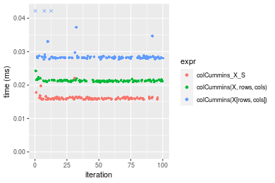
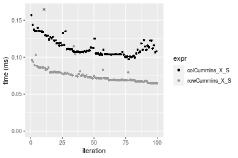
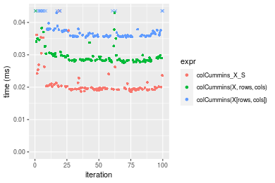
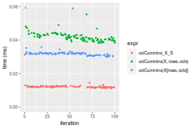
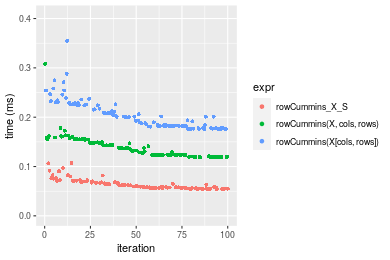

[matrixStats]: Benchmark report

---------------------------------------


# colCummins() and rowCummins() benchmarks on subsetted computation

This report benchmark the performance of colCummins() and rowCummins() on subsetted computation.


## Data type "integer"

### Data
```r
> rmatrix <- function(nrow, ncol, mode = c("logical", "double", "integer", "index"), range = c(-100, 
+     +100), na_prob = 0) {
+     mode <- match.arg(mode)
+     n <- nrow * ncol
+     if (mode == "logical") {
+         x <- sample(c(FALSE, TRUE), size = n, replace = TRUE)
+     }     else if (mode == "index") {
+         x <- seq_len(n)
+         mode <- "integer"
+     }     else {
+         x <- runif(n, min = range[1], max = range[2])
+     }
+     storage.mode(x) <- mode
+     if (na_prob > 0) 
+         x[sample(n, size = na_prob * n)] <- NA
+     dim(x) <- c(nrow, ncol)
+     x
+ }
> rmatrices <- function(scale = 10, seed = 1, ...) {
+     set.seed(seed)
+     data <- list()
+     data[[1]] <- rmatrix(nrow = scale * 1, ncol = scale * 1, ...)
+     data[[2]] <- rmatrix(nrow = scale * 10, ncol = scale * 10, ...)
+     data[[3]] <- rmatrix(nrow = scale * 100, ncol = scale * 1, ...)
+     data[[4]] <- t(data[[3]])
+     data[[5]] <- rmatrix(nrow = scale * 10, ncol = scale * 100, ...)
+     data[[6]] <- t(data[[5]])
+     names(data) <- sapply(data, FUN = function(x) paste(dim(x), collapse = "x"))
+     data
+ }
> data <- rmatrices(mode = mode)
```

### Results

#### 10x10 integer matrix

```r
> X <- data[["10x10"]]
> rows <- sample.int(nrow(X), size = nrow(X) * 0.7)
> cols <- sample.int(ncol(X), size = ncol(X) * 0.7)
> X_S <- X[rows, cols]
> gc()
          used  (Mb) gc trigger  (Mb) max used  (Mb)
Ncells 5205545 278.1    7916910 422.9  7916910 422.9
Vcells 9772989  74.6   33191153 253.3 53339345 407.0
> colStats <- microbenchmark(colCummins_X_S = colCummins(X_S), `colCummins(X, rows, cols)` = colCummins(X, 
+     rows = rows, cols = cols), `colCummins(X[rows, cols])` = colCummins(X[rows, cols]), unit = "ms")
> X <- t(X)
> X_S <- t(X_S)
> gc()
          used  (Mb) gc trigger  (Mb) max used  (Mb)
Ncells 5193013 277.4    7916910 422.9  7916910 422.9
Vcells 9731461  74.3   33191153 253.3 53339345 407.0
> rowStats <- microbenchmark(rowCummins_X_S = rowCummins(X_S), `rowCummins(X, cols, rows)` = rowCummins(X, 
+     rows = cols, cols = rows), `rowCummins(X[cols, rows])` = rowCummins(X[cols, rows]), unit = "ms")
```

_Table: Benchmarking of colCummins_X_S(), colCummins(X, rows, cols)() and colCummins(X[rows, cols])() on integer+10x10 data. The top panel shows times in milliseconds and the bottom panel shows relative times._


|   |expr                      |      min|        lq|      mean|   median|        uq|      max|
|:--|:-------------------------|--------:|---------:|---------:|--------:|---------:|--------:|
|1  |colCummins_X_S            | 0.002330| 0.0024935| 0.0041899| 0.002534| 0.0026285| 0.163776|
|2  |colCummins(X, rows, cols) | 0.002512| 0.0028250| 0.0029663| 0.002905| 0.0030145| 0.005294|
|3  |colCummins(X[rows, cols]) | 0.003221| 0.0035685| 0.0037370| 0.003672| 0.0037845| 0.007849|


|   |expr                      |      min|       lq|      mean|   median|       uq|       max|
|:--|:-------------------------|--------:|--------:|---------:|--------:|--------:|---------:|
|1  |colCummins_X_S            | 1.000000| 1.000000| 1.0000000| 1.000000| 1.000000| 1.0000000|
|2  |colCummins(X, rows, cols) | 1.078112| 1.132946| 0.7079807| 1.146409| 1.146852| 0.0323246|
|3  |colCummins(X[rows, cols]) | 1.382403| 1.431121| 0.8919152| 1.449092| 1.439795| 0.0479252|

_Table: Benchmarking of rowCummins_X_S(), rowCummins(X, cols, rows)() and rowCummins(X[cols, rows])() on integer+10x10 data (transposed). The top panel shows times in milliseconds and the bottom panel shows relative times._


|   |expr                      |      min|        lq|      mean|    median|       uq|      max|
|:--|:-------------------------|--------:|---------:|---------:|---------:|--------:|--------:|
|1  |rowCummins_X_S            | 0.002180| 0.0025405| 0.0028294| 0.0026840| 0.002929| 0.005550|
|2  |rowCummins(X, cols, rows) | 0.002590| 0.0029520| 0.0049077| 0.0031060| 0.003385| 0.172772|
|3  |rowCummins(X[cols, rows]) | 0.003161| 0.0037645| 0.0042124| 0.0040355| 0.004395| 0.008983|


|   |expr                      |      min|       lq|     mean|   median|       uq|       max|
|:--|:-------------------------|--------:|--------:|--------:|--------:|--------:|---------:|
|1  |rowCummins_X_S            | 1.000000| 1.000000| 1.000000| 1.000000| 1.000000|  1.000000|
|2  |rowCummins(X, cols, rows) | 1.188073| 1.161976| 1.734530| 1.157228| 1.155685| 31.130090|
|3  |rowCummins(X[cols, rows]) | 1.450000| 1.481795| 1.488793| 1.503540| 1.500512|  1.618559|

_Figure: Benchmarking of colCummins_X_S(), colCummins(X, rows, cols)() and colCummins(X[rows, cols])() on integer+10x10 data  as well as rowCummins_X_S(), rowCummins(X, cols, rows)() and rowCummins(X[cols, rows])() on the same data transposed.  Outliers are displayed as crosses.  Times are in milliseconds._


_Table: Benchmarking of colCummins_X_S() and rowCummins_X_S() on integer+10x10 data (original and transposed).  The top panel shows times in milliseconds and the bottom panel shows relative times._


|   |expr           |  min|     lq|    mean| median|     uq|     max|
|:--|:--------------|----:|------:|-------:|------:|------:|-------:|
|1  |colCummins_X_S | 2.33| 2.4935| 4.18986|  2.534| 2.6285| 163.776|
|2  |rowCummins_X_S | 2.18| 2.5405| 2.82940|  2.684| 2.9290|   5.550|


|   |expr           |       min|       lq|     mean|   median|       uq|       max|
|:--|:--------------|---------:|--------:|--------:|--------:|--------:|---------:|
|1  |colCummins_X_S | 1.0000000| 1.000000| 1.000000| 1.000000| 1.000000| 1.0000000|
|2  |rowCummins_X_S | 0.9356223| 1.018849| 0.675297| 1.059195| 1.114324| 0.0338877|

_Figure: Benchmarking of colCummins_X_S() and rowCummins_X_S() on integer+10x10 data (original and transposed).  Outliers are displayed as crosses. Times are in milliseconds._


#### 100x100 integer matrix

```r
> X <- data[["100x100"]]
> rows <- sample.int(nrow(X), size = nrow(X) * 0.7)
> cols <- sample.int(ncol(X), size = ncol(X) * 0.7)
> X_S <- X[rows, cols]
> gc()
          used  (Mb) gc trigger  (Mb) max used  (Mb)
Ncells 5191738 277.3    7916910 422.9  7916910 422.9
Vcells 9400288  71.8   33191153 253.3 53339345 407.0
> colStats <- microbenchmark(colCummins_X_S = colCummins(X_S), `colCummins(X, rows, cols)` = colCummins(X, 
+     rows = rows, cols = cols), `colCummins(X[rows, cols])` = colCummins(X[rows, cols]), unit = "ms")
> X <- t(X)
> X_S <- t(X_S)
> gc()
          used  (Mb) gc trigger  (Mb) max used  (Mb)
Ncells 5191732 277.3    7916910 422.9  7916910 422.9
Vcells 9405371  71.8   33191153 253.3 53339345 407.0
> rowStats <- microbenchmark(rowCummins_X_S = rowCummins(X_S), `rowCummins(X, cols, rows)` = rowCummins(X, 
+     rows = cols, cols = rows), `rowCummins(X[cols, rows])` = rowCummins(X[cols, rows]), unit = "ms")
```

_Table: Benchmarking of colCummins_X_S(), colCummins(X, rows, cols)() and colCummins(X[rows, cols])() on integer+100x100 data. The top panel shows times in milliseconds and the bottom panel shows relative times._


|   |expr                      |      min|        lq|      mean|    median|        uq|      max|
|:--|:-------------------------|--------:|---------:|---------:|---------:|---------:|--------:|
|1  |colCummins_X_S            | 0.014722| 0.0150745| 0.0154053| 0.0152420| 0.0156375| 0.020775|
|2  |colCummins(X, rows, cols) | 0.019863| 0.0200705| 0.0204905| 0.0202300| 0.0209000| 0.024746|
|3  |colCummins(X[rows, cols]) | 0.025919| 0.0264095| 0.0274265| 0.0266065| 0.0275770| 0.051017|


|   |expr                      |      min|       lq|     mean|   median|       uq|      max|
|:--|:-------------------------|--------:|--------:|--------:|--------:|--------:|--------:|
|1  |colCummins_X_S            | 1.000000| 1.000000| 1.000000| 1.000000| 1.000000| 1.000000|
|2  |colCummins(X, rows, cols) | 1.349205| 1.331421| 1.330091| 1.327254| 1.336531| 1.191143|
|3  |colCummins(X[rows, cols]) | 1.760562| 1.751932| 1.780325| 1.745604| 1.763517| 2.455692|

_Table: Benchmarking of rowCummins_X_S(), rowCummins(X, cols, rows)() and rowCummins(X[cols, rows])() on integer+100x100 data (transposed). The top panel shows times in milliseconds and the bottom panel shows relative times._


|   |expr                      |      min|        lq|      mean|    median|       uq|      max|
|:--|:-------------------------|--------:|---------:|---------:|---------:|--------:|--------:|
|1  |rowCummins_X_S            | 0.011269| 0.0116405| 0.0120914| 0.0117745| 0.011904| 0.021832|
|2  |rowCummins(X, cols, rows) | 0.020076| 0.0203055| 0.0210412| 0.0204785| 0.020640| 0.046656|
|3  |rowCummins(X[cols, rows]) | 0.022696| 0.0230005| 0.0232872| 0.0231585| 0.023364| 0.028107|


|   |expr                      |      min|       lq|     mean|   median|       uq|      max|
|:--|:-------------------------|--------:|--------:|--------:|--------:|--------:|--------:|
|1  |rowCummins_X_S            | 1.000000| 1.000000| 1.000000| 1.000000| 1.000000| 1.000000|
|2  |rowCummins(X, cols, rows) | 1.781524| 1.744384| 1.740175| 1.739225| 1.733871| 2.137046|
|3  |rowCummins(X[cols, rows]) | 2.014021| 1.975903| 1.925929| 1.966835| 1.962702| 1.287422|

_Figure: Benchmarking of colCummins_X_S(), colCummins(X, rows, cols)() and colCummins(X[rows, cols])() on integer+100x100 data  as well as rowCummins_X_S(), rowCummins(X, cols, rows)() and rowCummins(X[cols, rows])() on the same data transposed.  Outliers are displayed as crosses.  Times are in milliseconds._


_Table: Benchmarking of colCummins_X_S() and rowCummins_X_S() on integer+100x100 data (original and transposed).  The top panel shows times in milliseconds and the bottom panel shows relative times._


|   |expr           |    min|      lq|     mean|  median|      uq|    max|
|:--|:--------------|------:|-------:|--------:|-------:|-------:|------:|
|2  |rowCummins_X_S | 11.269| 11.6405| 12.09144| 11.7745| 11.9040| 21.832|
|1  |colCummins_X_S | 14.722| 15.0745| 15.40532| 15.2420| 15.6375| 20.775|


|   |expr           |      min|       lq|     mean|   median|       uq|       max|
|:--|:--------------|--------:|--------:|--------:|--------:|--------:|---------:|
|2  |rowCummins_X_S | 1.000000| 1.000000| 1.000000| 1.000000| 1.000000| 1.0000000|
|1  |colCummins_X_S | 1.306416| 1.295004| 1.274068| 1.294492| 1.313634| 0.9515848|

_Figure: Benchmarking of colCummins_X_S() and rowCummins_X_S() on integer+100x100 data (original and transposed).  Outliers are displayed as crosses. Times are in milliseconds._


#### 1000x10 integer matrix

```r
> X <- data[["1000x10"]]
> rows <- sample.int(nrow(X), size = nrow(X) * 0.7)
> cols <- sample.int(ncol(X), size = ncol(X) * 0.7)
> X_S <- X[rows, cols]
> gc()
          used  (Mb) gc trigger  (Mb) max used  (Mb)
Ncells 5192480 277.4    7916910 422.9  7916910 422.9
Vcells 9404338  71.8   33191153 253.3 53339345 407.0
> colStats <- microbenchmark(colCummins_X_S = colCummins(X_S), `colCummins(X, rows, cols)` = colCummins(X, 
+     rows = rows, cols = cols), `colCummins(X[rows, cols])` = colCummins(X[rows, cols]), unit = "ms")
> X <- t(X)
> X_S <- t(X_S)
> gc()
          used  (Mb) gc trigger  (Mb) max used  (Mb)
Ncells 5192474 277.4    7916910 422.9  7916910 422.9
Vcells 9409421  71.8   33191153 253.3 53339345 407.0
> rowStats <- microbenchmark(rowCummins_X_S = rowCummins(X_S), `rowCummins(X, cols, rows)` = rowCummins(X, 
+     rows = cols, cols = rows), `rowCummins(X[cols, rows])` = rowCummins(X[cols, rows]), unit = "ms")
```

_Table: Benchmarking of colCummins_X_S(), colCummins(X, rows, cols)() and colCummins(X[rows, cols])() on integer+1000x10 data. The top panel shows times in milliseconds and the bottom panel shows relative times._


|   |expr                      |      min|        lq|      mean|    median|        uq|      max|
|:--|:-------------------------|--------:|---------:|---------:|---------:|---------:|--------:|
|1  |colCummins_X_S            | 0.015670| 0.0158360| 0.0161365| 0.0160075| 0.0161700| 0.022060|
|2  |colCummins(X, rows, cols) | 0.020882| 0.0211305| 0.0213286| 0.0212610| 0.0213995| 0.024265|
|3  |colCummins(X[rows, cols]) | 0.027668| 0.0281160| 0.0294205| 0.0282215| 0.0284410| 0.062390|


|   |expr                      |      min|       lq|     mean|   median|       uq|      max|
|:--|:-------------------------|--------:|--------:|--------:|--------:|--------:|--------:|
|1  |colCummins_X_S            | 1.000000| 1.000000| 1.000000| 1.000000| 1.000000| 1.000000|
|2  |colCummins(X, rows, cols) | 1.332610| 1.334333| 1.321760| 1.328190| 1.323408| 1.099955|
|3  |colCummins(X[rows, cols]) | 1.765667| 1.775448| 1.823221| 1.763017| 1.758874| 2.828196|

_Table: Benchmarking of rowCummins_X_S(), rowCummins(X, cols, rows)() and rowCummins(X[cols, rows])() on integer+1000x10 data (transposed). The top panel shows times in milliseconds and the bottom panel shows relative times._


|   |expr                      |      min|        lq|      mean|    median|        uq|      max|
|:--|:-------------------------|--------:|---------:|---------:|---------:|---------:|--------:|
|1  |rowCummins_X_S            | 0.014166| 0.0144155| 0.0148361| 0.0145505| 0.0147625| 0.029874|
|2  |rowCummins(X, cols, rows) | 0.023063| 0.0233835| 0.0240219| 0.0236370| 0.0238950| 0.041511|
|3  |rowCummins(X[cols, rows]) | 0.027575| 0.0281980| 0.0289943| 0.0283870| 0.0287650| 0.057518|


|   |expr                      |      min|       lq|     mean|   median|       uq|      max|
|:--|:-------------------------|--------:|--------:|--------:|--------:|--------:|--------:|
|1  |rowCummins_X_S            | 1.000000| 1.000000| 1.000000| 1.000000| 1.000000| 1.000000|
|2  |rowCummins(X, cols, rows) | 1.628053| 1.622108| 1.619154| 1.624480| 1.618628| 1.389536|
|3  |rowCummins(X[cols, rows]) | 1.946562| 1.956089| 1.954311| 1.950929| 1.948518| 1.925353|

_Figure: Benchmarking of colCummins_X_S(), colCummins(X, rows, cols)() and colCummins(X[rows, cols])() on integer+1000x10 data  as well as rowCummins_X_S(), rowCummins(X, cols, rows)() and rowCummins(X[cols, rows])() on the same data transposed.  Outliers are displayed as crosses.  Times are in milliseconds._





_Table: Benchmarking of colCummins_X_S() and rowCummins_X_S() on integer+1000x10 data (original and transposed).  The top panel shows times in milliseconds and the bottom panel shows relative times._


|   |expr           |    min|      lq|     mean|  median|      uq|    max|
|:--|:--------------|------:|-------:|--------:|-------:|-------:|------:|
|2  |rowCummins_X_S | 14.166| 14.4155| 14.83608| 14.5505| 14.7625| 29.874|
|1  |colCummins_X_S | 15.670| 15.8360| 16.13655| 16.0075| 16.1700| 22.060|


|   |expr           |     min|      lq|     mean|   median|       uq|       max|
|:--|:--------------|-------:|-------:|--------:|--------:|--------:|---------:|
|2  |rowCummins_X_S | 1.00000| 1.00000| 1.000000| 1.000000| 1.000000| 1.0000000|
|1  |colCummins_X_S | 1.10617| 1.09854| 1.087656| 1.100134| 1.095343| 0.7384348|

_Figure: Benchmarking of colCummins_X_S() and rowCummins_X_S() on integer+1000x10 data (original and transposed).  Outliers are displayed as crosses. Times are in milliseconds._


#### 10x1000 integer matrix

```r
> X <- data[["10x1000"]]
> rows <- sample.int(nrow(X), size = nrow(X) * 0.7)
> cols <- sample.int(ncol(X), size = ncol(X) * 0.7)
> X_S <- X[rows, cols]
> gc()
          used  (Mb) gc trigger  (Mb) max used  (Mb)
Ncells 5192685 277.4    7916910 422.9  7916910 422.9
Vcells 9405170  71.8   33191153 253.3 53339345 407.0
> colStats <- microbenchmark(colCummins_X_S = colCummins(X_S), `colCummins(X, rows, cols)` = colCummins(X, 
+     rows = rows, cols = cols), `colCummins(X[rows, cols])` = colCummins(X[rows, cols]), unit = "ms")
> X <- t(X)
> X_S <- t(X_S)
> gc()
          used  (Mb) gc trigger  (Mb) max used  (Mb)
Ncells 5192679 277.4    7916910 422.9  7916910 422.9
Vcells 9410253  71.8   33191153 253.3 53339345 407.0
> rowStats <- microbenchmark(rowCummins_X_S = rowCummins(X_S), `rowCummins(X, cols, rows)` = rowCummins(X, 
+     rows = cols, cols = rows), `rowCummins(X[cols, rows])` = rowCummins(X[cols, rows]), unit = "ms")
```

_Table: Benchmarking of colCummins_X_S(), colCummins(X, rows, cols)() and colCummins(X[rows, cols])() on integer+10x1000 data. The top panel shows times in milliseconds and the bottom panel shows relative times._


|   |expr                      |      min|        lq|      mean|    median|        uq|      max|
|:--|:-------------------------|--------:|---------:|---------:|---------:|---------:|--------:|
|1  |colCummins_X_S            | 0.012417| 0.0129775| 0.0133815| 0.0130920| 0.0132620| 0.027088|
|2  |colCummins(X, rows, cols) | 0.021947| 0.0228485| 0.0232299| 0.0229705| 0.0231175| 0.037744|
|3  |colCummins(X[rows, cols]) | 0.026242| 0.0268645| 0.0271684| 0.0270525| 0.0272390| 0.031215|


|   |expr                      |      min|       lq|     mean|   median|       uq|      max|
|:--|:-------------------------|--------:|--------:|--------:|--------:|--------:|--------:|
|1  |colCummins_X_S            | 1.000000| 1.000000| 1.000000| 1.000000| 1.000000| 1.000000|
|2  |colCummins(X, rows, cols) | 1.767496| 1.760624| 1.735977| 1.754545| 1.743138| 1.393385|
|3  |colCummins(X[rows, cols]) | 2.113393| 2.070083| 2.030304| 2.066338| 2.053913| 1.152355|

_Table: Benchmarking of rowCummins_X_S(), rowCummins(X, cols, rows)() and rowCummins(X[cols, rows])() on integer+10x1000 data (transposed). The top panel shows times in milliseconds and the bottom panel shows relative times._


|   |expr                      |      min|        lq|      mean|    median|        uq|      max|
|:--|:-------------------------|--------:|---------:|---------:|---------:|---------:|--------:|
|1  |rowCummins_X_S            | 0.010842| 0.0112060| 0.0114377| 0.0113875| 0.0115715| 0.014782|
|2  |rowCummins(X, cols, rows) | 0.019605| 0.0200830| 0.0205675| 0.0202240| 0.0204085| 0.044026|
|3  |rowCummins(X[cols, rows]) | 0.022824| 0.0232155| 0.0235122| 0.0233875| 0.0236185| 0.028475|


|   |expr                      |      min|       lq|     mean|   median|       uq|      max|
|:--|:-------------------------|--------:|--------:|--------:|--------:|--------:|--------:|
|1  |rowCummins_X_S            | 1.000000| 1.000000| 1.000000| 1.000000| 1.000000| 1.000000|
|2  |rowCummins(X, cols, rows) | 1.808246| 1.792165| 1.798223| 1.775982| 1.763687| 2.978352|
|3  |rowCummins(X[cols, rows]) | 2.105147| 2.071703| 2.055684| 2.053787| 2.041092| 1.926329|

_Figure: Benchmarking of colCummins_X_S(), colCummins(X, rows, cols)() and colCummins(X[rows, cols])() on integer+10x1000 data  as well as rowCummins_X_S(), rowCummins(X, cols, rows)() and rowCummins(X[cols, rows])() on the same data transposed.  Outliers are displayed as crosses.  Times are in milliseconds._


_Table: Benchmarking of colCummins_X_S() and rowCummins_X_S() on integer+10x1000 data (original and transposed).  The top panel shows times in milliseconds and the bottom panel shows relative times._


|   |expr           |    min|      lq|     mean|  median|      uq|    max|
|:--|:--------------|------:|-------:|--------:|-------:|-------:|------:|
|2  |rowCummins_X_S | 10.842| 11.2060| 11.43768| 11.3875| 11.5715| 14.782|
|1  |colCummins_X_S | 12.417| 12.9775| 13.38146| 13.0920| 13.2620| 27.088|


|   |expr           |      min|       lq|     mean|   median|       uq|      max|
|:--|:--------------|--------:|--------:|--------:|--------:|--------:|--------:|
|2  |rowCummins_X_S | 1.000000| 1.000000| 1.000000| 1.000000| 1.000000| 1.000000|
|1  |colCummins_X_S | 1.145268| 1.158085| 1.169945| 1.149682| 1.146092| 1.832499|

_Figure: Benchmarking of colCummins_X_S() and rowCummins_X_S() on integer+10x1000 data (original and transposed).  Outliers are displayed as crosses. Times are in milliseconds._


#### 100x1000 integer matrix

```r
> X <- data[["100x1000"]]
> rows <- sample.int(nrow(X), size = nrow(X) * 0.7)
> cols <- sample.int(ncol(X), size = ncol(X) * 0.7)
> X_S <- X[rows, cols]
> gc()
          used  (Mb) gc trigger  (Mb) max used  (Mb)
Ncells 5192896 277.4    7916910 422.9  7916910 422.9
Vcells 9427841  72.0   33191153 253.3 53339345 407.0
> colStats <- microbenchmark(colCummins_X_S = colCummins(X_S), `colCummins(X, rows, cols)` = colCummins(X, 
+     rows = rows, cols = cols), `colCummins(X[rows, cols])` = colCummins(X[rows, cols]), unit = "ms")
> X <- t(X)
> X_S <- t(X_S)
> gc()
          used  (Mb) gc trigger  (Mb) max used  (Mb)
Ncells 5192890 277.4    7916910 422.9  7916910 422.9
Vcells 9477924  72.4   33191153 253.3 53339345 407.0
> rowStats <- microbenchmark(rowCummins_X_S = rowCummins(X_S), `rowCummins(X, cols, rows)` = rowCummins(X, 
+     rows = cols, cols = rows), `rowCummins(X[cols, rows])` = rowCummins(X[cols, rows]), unit = "ms")
```

_Table: Benchmarking of colCummins_X_S(), colCummins(X, rows, cols)() and colCummins(X[rows, cols])() on integer+100x1000 data. The top panel shows times in milliseconds and the bottom panel shows relative times._


|   |expr                      |      min|       lq|      mean|    median|        uq|      max|
|:--|:-------------------------|--------:|--------:|---------:|---------:|---------:|--------:|
|1  |colCummins_X_S            | 0.091849| 0.097813| 0.1084712| 0.1021645| 0.1173995| 0.165053|
|2  |colCummins(X, rows, cols) | 0.124766| 0.133437| 0.1502803| 0.1379690| 0.1668310| 0.283260|
|3  |colCummins(X[rows, cols]) | 0.169853| 0.181177| 0.2021601| 0.1929750| 0.2217820| 0.275184|


|   |expr                      |      min|       lq|     mean|   median|       uq|      max|
|:--|:-------------------------|--------:|--------:|--------:|--------:|--------:|--------:|
|1  |colCummins_X_S            | 1.000000| 1.000000| 1.000000| 1.000000| 1.000000| 1.000000|
|2  |colCummins(X, rows, cols) | 1.358382| 1.364205| 1.385439| 1.350459| 1.421054| 1.716176|
|3  |colCummins(X[rows, cols]) | 1.849263| 1.852279| 1.863721| 1.888866| 1.889122| 1.667246|

_Table: Benchmarking of rowCummins_X_S(), rowCummins(X, cols, rows)() and rowCummins(X[cols, rows])() on integer+100x1000 data (transposed). The top panel shows times in milliseconds and the bottom panel shows relative times._


|   |expr                      |      min|        lq|      mean|    median|        uq|      max|
|:--|:-------------------------|--------:|---------:|---------:|---------:|---------:|--------:|
|1  |rowCummins_X_S            | 0.065341| 0.0697605| 0.0782191| 0.0747945| 0.0866420| 0.124541|
|2  |rowCummins(X, cols, rows) | 0.127408| 0.1325905| 0.1477554| 0.1377975| 0.1600035| 0.301935|
|3  |rowCummins(X[cols, rows]) | 0.141966| 0.1514080| 0.1663348| 0.1574730| 0.1824585| 0.265356|


|   |expr                      |      min|       lq|     mean|   median|      uq|      max|
|:--|:-------------------------|--------:|--------:|--------:|--------:|-------:|--------:|
|1  |rowCummins_X_S            | 1.000000| 1.000000| 1.000000| 1.000000| 1.00000| 1.000000|
|2  |rowCummins(X, cols, rows) | 1.949894| 1.900653| 1.888994| 1.842348| 1.84672| 2.424382|
|3  |rowCummins(X[cols, rows]) | 2.172694| 2.170397| 2.126526| 2.105409| 2.10589| 2.130672|

_Figure: Benchmarking of colCummins_X_S(), colCummins(X, rows, cols)() and colCummins(X[rows, cols])() on integer+100x1000 data  as well as rowCummins_X_S(), rowCummins(X, cols, rows)() and rowCummins(X[cols, rows])() on the same data transposed.  Outliers are displayed as crosses.  Times are in milliseconds._


_Table: Benchmarking of colCummins_X_S() and rowCummins_X_S() on integer+100x1000 data (original and transposed).  The top panel shows times in milliseconds and the bottom panel shows relative times._


|   |expr           |    min|      lq|      mean|   median|       uq|     max|
|:--|:--------------|------:|-------:|---------:|--------:|--------:|-------:|
|2  |rowCummins_X_S | 65.341| 69.7605|  78.21906|  74.7945|  86.6420| 124.541|
|1  |colCummins_X_S | 91.849| 97.8130| 108.47125| 102.1645| 117.3995| 165.053|


|   |expr           |      min|       lq|     mean|   median|       uq|     max|
|:--|:--------------|--------:|--------:|--------:|--------:|--------:|-------:|
|2  |rowCummins_X_S | 1.000000| 1.000000| 1.000000| 1.000000| 1.000000| 1.00000|
|1  |colCummins_X_S | 1.405687| 1.402126| 1.386762| 1.365936| 1.354995| 1.32529|

_Figure: Benchmarking of colCummins_X_S() and rowCummins_X_S() on integer+100x1000 data (original and transposed).  Outliers are displayed as crosses. Times are in milliseconds._


#### 1000x100 integer matrix

```r
> X <- data[["1000x100"]]
> rows <- sample.int(nrow(X), size = nrow(X) * 0.7)
> cols <- sample.int(ncol(X), size = ncol(X) * 0.7)
> X_S <- X[rows, cols]
> gc()
          used  (Mb) gc trigger  (Mb) max used  (Mb)
Ncells 5193106 277.4    7916910 422.9  7916910 422.9
Vcells 9428618  72.0   33191153 253.3 53339345 407.0
> colStats <- microbenchmark(colCummins_X_S = colCummins(X_S), `colCummins(X, rows, cols)` = colCummins(X, 
+     rows = rows, cols = cols), `colCummins(X[rows, cols])` = colCummins(X[rows, cols]), unit = "ms")
> X <- t(X)
> X_S <- t(X_S)
> gc()
          used  (Mb) gc trigger  (Mb) max used  (Mb)
Ncells 5193100 277.4    7916910 422.9  7916910 422.9
Vcells 9478701  72.4   33191153 253.3 53339345 407.0
> rowStats <- microbenchmark(rowCummins_X_S = rowCummins(X_S), `rowCummins(X, cols, rows)` = rowCummins(X, 
+     rows = cols, cols = rows), `rowCummins(X[cols, rows])` = rowCummins(X[cols, rows]), unit = "ms")
```

_Table: Benchmarking of colCummins_X_S(), colCummins(X, rows, cols)() and colCummins(X[rows, cols])() on integer+1000x100 data. The top panel shows times in milliseconds and the bottom panel shows relative times._


|   |expr                      |      min|        lq|      mean|    median|        uq|      max|
|:--|:-------------------------|--------:|---------:|---------:|---------:|---------:|--------:|
|1  |colCummins_X_S            | 0.097288| 0.1043695| 0.1141792| 0.1094445| 0.1224050| 0.167498|
|2  |colCummins(X, rows, cols) | 0.124448| 0.1325890| 0.1513855| 0.1430235| 0.1623875| 0.308314|
|3  |colCummins(X[rows, cols]) | 0.171952| 0.1848175| 0.2125704| 0.2042670| 0.2365570| 0.341080|


|   |expr                      |      min|       lq|     mean|   median|       uq|      max|
|:--|:-------------------------|--------:|--------:|--------:|--------:|--------:|--------:|
|1  |colCummins_X_S            | 1.000000| 1.000000| 1.000000| 1.000000| 1.000000| 1.000000|
|2  |colCummins(X, rows, cols) | 1.279171| 1.270381| 1.325859| 1.306813| 1.326641| 1.840703|
|3  |colCummins(X[rows, cols]) | 1.767453| 1.770800| 1.861725| 1.866398| 1.932576| 2.036323|

_Table: Benchmarking of rowCummins_X_S(), rowCummins(X, cols, rows)() and rowCummins(X[cols, rows])() on integer+1000x100 data (transposed). The top panel shows times in milliseconds and the bottom panel shows relative times._


|   |expr                      |      min|        lq|      mean|    median|        uq|      max|
|:--|:-------------------------|--------:|---------:|---------:|---------:|---------:|--------:|
|1  |rowCummins_X_S            | 0.064526| 0.0690160| 0.0752052| 0.0727410| 0.0794415| 0.114851|
|2  |rowCummins(X, cols, rows) | 0.125718| 0.1342185| 0.1461374| 0.1403835| 0.1541915| 0.264038|
|3  |rowCummins(X[cols, rows]) | 0.142518| 0.1527550| 0.1666361| 0.1579085| 0.1786145| 0.240792|


|   |expr                      |      min|       lq|     mean|   median|       uq|      max|
|:--|:-------------------------|--------:|--------:|--------:|--------:|--------:|--------:|
|1  |rowCummins_X_S            | 1.000000| 1.000000| 1.000000| 1.000000| 1.000000| 1.000000|
|2  |rowCummins(X, cols, rows) | 1.948331| 1.944745| 1.943183| 1.929909| 1.940944| 2.298961|
|3  |rowCummins(X[cols, rows]) | 2.208691| 2.213327| 2.215754| 2.170832| 2.248378| 2.096560|

_Figure: Benchmarking of colCummins_X_S(), colCummins(X, rows, cols)() and colCummins(X[rows, cols])() on integer+1000x100 data  as well as rowCummins_X_S(), rowCummins(X, cols, rows)() and rowCummins(X[cols, rows])() on the same data transposed.  Outliers are displayed as crosses.  Times are in milliseconds._


_Table: Benchmarking of colCummins_X_S() and rowCummins_X_S() on integer+1000x100 data (original and transposed).  The top panel shows times in milliseconds and the bottom panel shows relative times._


|   |expr           |    min|       lq|      mean|   median|       uq|     max|
|:--|:--------------|------:|--------:|---------:|--------:|--------:|-------:|
|2  |rowCummins_X_S | 64.526|  69.0160|  75.20515|  72.7410|  79.4415| 114.851|
|1  |colCummins_X_S | 97.288| 104.3695| 114.17923| 109.4445| 122.4050| 167.498|


|   |expr           |      min|       lq|     mean|   median|       uq|      max|
|:--|:--------------|--------:|--------:|--------:|--------:|--------:|--------:|
|2  |rowCummins_X_S | 1.000000| 1.000000| 1.000000| 1.000000| 1.000000| 1.000000|
|1  |colCummins_X_S | 1.507733| 1.512251| 1.518237| 1.504578| 1.540819| 1.458394|

_Figure: Benchmarking of colCummins_X_S() and rowCummins_X_S() on integer+1000x100 data (original and transposed).  Outliers are displayed as crosses. Times are in milliseconds._





## Data type "double"

### Data
```r
> rmatrix <- function(nrow, ncol, mode = c("logical", "double", "integer", "index"), range = c(-100, 
+     +100), na_prob = 0) {
+     mode <- match.arg(mode)
+     n <- nrow * ncol
+     if (mode == "logical") {
+         x <- sample(c(FALSE, TRUE), size = n, replace = TRUE)
+     }     else if (mode == "index") {
+         x <- seq_len(n)
+         mode <- "integer"
+     }     else {
+         x <- runif(n, min = range[1], max = range[2])
+     }
+     storage.mode(x) <- mode
+     if (na_prob > 0) 
+         x[sample(n, size = na_prob * n)] <- NA
+     dim(x) <- c(nrow, ncol)
+     x
+ }
> rmatrices <- function(scale = 10, seed = 1, ...) {
+     set.seed(seed)
+     data <- list()
+     data[[1]] <- rmatrix(nrow = scale * 1, ncol = scale * 1, ...)
+     data[[2]] <- rmatrix(nrow = scale * 10, ncol = scale * 10, ...)
+     data[[3]] <- rmatrix(nrow = scale * 100, ncol = scale * 1, ...)
+     data[[4]] <- t(data[[3]])
+     data[[5]] <- rmatrix(nrow = scale * 10, ncol = scale * 100, ...)
+     data[[6]] <- t(data[[5]])
+     names(data) <- sapply(data, FUN = function(x) paste(dim(x), collapse = "x"))
+     data
+ }
> data <- rmatrices(mode = mode)
```

### Results

#### 10x10 double matrix

```r
> X <- data[["10x10"]]
> rows <- sample.int(nrow(X), size = nrow(X) * 0.7)
> cols <- sample.int(ncol(X), size = ncol(X) * 0.7)
> X_S <- X[rows, cols]
> gc()
          used  (Mb) gc trigger  (Mb) max used  (Mb)
Ncells 5193324 277.4    7916910 422.9  7916910 422.9
Vcells 9519723  72.7   33191153 253.3 53339345 407.0
> colStats <- microbenchmark(colCummins_X_S = colCummins(X_S), `colCummins(X, rows, cols)` = colCummins(X, 
+     rows = rows, cols = cols), `colCummins(X[rows, cols])` = colCummins(X[rows, cols]), unit = "ms")
> X <- t(X)
> X_S <- t(X_S)
> gc()
          used  (Mb) gc trigger  (Mb) max used  (Mb)
Ncells 5193309 277.4    7916910 422.9  7916910 422.9
Vcells 9519891  72.7   33191153 253.3 53339345 407.0
> rowStats <- microbenchmark(rowCummins_X_S = rowCummins(X_S), `rowCummins(X, cols, rows)` = rowCummins(X, 
+     rows = cols, cols = rows), `rowCummins(X[cols, rows])` = rowCummins(X[cols, rows]), unit = "ms")
```

_Table: Benchmarking of colCummins_X_S(), colCummins(X, rows, cols)() and colCummins(X[rows, cols])() on double+10x10 data. The top panel shows times in milliseconds and the bottom panel shows relative times._


|   |expr                      |      min|        lq|      mean|   median|        uq|      max|
|:--|:-------------------------|--------:|---------:|---------:|--------:|---------:|--------:|
|1  |colCummins_X_S            | 0.002216| 0.0023310| 0.0027661| 0.002414| 0.0024975| 0.032504|
|2  |colCummins(X, rows, cols) | 0.002441| 0.0027025| 0.0028328| 0.002778| 0.0028675| 0.005693|
|3  |colCummins(X[rows, cols]) | 0.003184| 0.0033950| 0.0035779| 0.003496| 0.0036075| 0.009843|


|   |expr                      |      min|       lq|     mean|   median|       uq|       max|
|:--|:-------------------------|--------:|--------:|--------:|--------:|--------:|---------:|
|1  |colCummins_X_S            | 1.000000| 1.000000| 1.000000| 1.000000| 1.000000| 1.0000000|
|2  |colCummins(X, rows, cols) | 1.101534| 1.159374| 1.024117| 1.150787| 1.148148| 0.1751477|
|3  |colCummins(X[rows, cols]) | 1.436823| 1.456457| 1.293463| 1.448219| 1.444444| 0.3028243|

_Table: Benchmarking of rowCummins_X_S(), rowCummins(X, cols, rows)() and rowCummins(X[cols, rows])() on double+10x10 data (transposed). The top panel shows times in milliseconds and the bottom panel shows relative times._


|   |expr                      |      min|        lq|      mean|    median|        uq|      max|
|:--|:-------------------------|--------:|---------:|---------:|---------:|---------:|--------:|
|1  |rowCummins_X_S            | 0.002192| 0.0024240| 0.0026295| 0.0025030| 0.0026140| 0.009779|
|2  |rowCummins(X, cols, rows) | 0.002463| 0.0026520| 0.0030682| 0.0027145| 0.0028265| 0.033493|
|3  |rowCummins(X[cols, rows]) | 0.003037| 0.0034525| 0.0035934| 0.0035190| 0.0036480| 0.008236|


|   |expr                      |      min|       lq|     mean|   median|       uq|       max|
|:--|:-------------------------|--------:|--------:|--------:|--------:|--------:|---------:|
|1  |rowCummins_X_S            | 1.000000| 1.000000| 1.000000| 1.000000| 1.000000| 1.0000000|
|2  |rowCummins(X, cols, rows) | 1.123631| 1.094059| 1.166833| 1.084499| 1.081293| 3.4249923|
|3  |rowCummins(X[cols, rows]) | 1.385493| 1.424299| 1.366561| 1.405913| 1.395562| 0.8422129|

_Figure: Benchmarking of colCummins_X_S(), colCummins(X, rows, cols)() and colCummins(X[rows, cols])() on double+10x10 data  as well as rowCummins_X_S(), rowCummins(X, cols, rows)() and rowCummins(X[cols, rows])() on the same data transposed.  Outliers are displayed as crosses.  Times are in milliseconds._


_Table: Benchmarking of colCummins_X_S() and rowCummins_X_S() on double+10x10 data (original and transposed).  The top panel shows times in milliseconds and the bottom panel shows relative times._


|   |expr           |   min|    lq|    mean| median|     uq|    max|
|:--|:--------------|-----:|-----:|-------:|------:|------:|------:|
|1  |colCummins_X_S | 2.216| 2.331| 2.76614|  2.414| 2.4975| 32.504|
|2  |rowCummins_X_S | 2.192| 2.424| 2.62952|  2.503| 2.6140|  9.779|


|   |expr           |       min|       lq|      mean|   median|       uq|       max|
|:--|:--------------|---------:|--------:|---------:|--------:|--------:|---------:|
|1  |colCummins_X_S | 1.0000000| 1.000000| 1.0000000| 1.000000| 1.000000| 1.0000000|
|2  |rowCummins_X_S | 0.9891697| 1.039897| 0.9506099| 1.036868| 1.046647| 0.3008553|

_Figure: Benchmarking of colCummins_X_S() and rowCummins_X_S() on double+10x10 data (original and transposed).  Outliers are displayed as crosses. Times are in milliseconds._


#### 100x100 double matrix

```r
> X <- data[["100x100"]]
> rows <- sample.int(nrow(X), size = nrow(X) * 0.7)
> cols <- sample.int(ncol(X), size = ncol(X) * 0.7)
> X_S <- X[rows, cols]
> gc()
          used  (Mb) gc trigger  (Mb) max used  (Mb)
Ncells 5193524 277.4    7916910 422.9  7916910 422.9
Vcells 9525683  72.7   33191153 253.3 53339345 407.0
> colStats <- microbenchmark(colCummins_X_S = colCummins(X_S), `colCummins(X, rows, cols)` = colCummins(X, 
+     rows = rows, cols = cols), `colCummins(X[rows, cols])` = colCummins(X[rows, cols]), unit = "ms")
> X <- t(X)
> X_S <- t(X_S)
> gc()
          used  (Mb) gc trigger  (Mb) max used  (Mb)
Ncells 5193518 277.4    7916910 422.9  7916910 422.9
Vcells 9535766  72.8   33191153 253.3 53339345 407.0
> rowStats <- microbenchmark(rowCummins_X_S = rowCummins(X_S), `rowCummins(X, cols, rows)` = rowCummins(X, 
+     rows = cols, cols = rows), `rowCummins(X[cols, rows])` = rowCummins(X[cols, rows]), unit = "ms")
```

_Table: Benchmarking of colCummins_X_S(), colCummins(X, rows, cols)() and colCummins(X[rows, cols])() on double+100x100 data. The top panel shows times in milliseconds and the bottom panel shows relative times._


|   |expr                      |      min|       lq|      mean|    median|        uq|      max|
|:--|:-------------------------|--------:|--------:|---------:|---------:|---------:|--------:|
|1  |colCummins_X_S            | 0.018548| 0.019370| 0.0214916| 0.0196115| 0.0203645| 0.081237|
|2  |colCummins(X, rows, cols) | 0.027487| 0.028266| 0.0297218| 0.0285560| 0.0297905| 0.044972|
|3  |colCummins(X[rows, cols]) | 0.035384| 0.035747| 0.0406520| 0.0361620| 0.0378185| 0.145265|


|   |expr                      |      min|       lq|     mean|   median|       uq|       max|
|:--|:-------------------------|--------:|--------:|--------:|--------:|--------:|---------:|
|1  |colCummins_X_S            | 1.000000| 1.000000| 1.000000| 1.000000| 1.000000| 1.0000000|
|2  |colCummins(X, rows, cols) | 1.481939| 1.459267| 1.382948| 1.456084| 1.462864| 0.5535901|
|3  |colCummins(X[rows, cols]) | 1.907699| 1.845483| 1.891528| 1.843918| 1.857080| 1.7881630|

_Table: Benchmarking of rowCummins_X_S(), rowCummins(X, cols, rows)() and rowCummins(X[cols, rows])() on double+100x100 data (transposed). The top panel shows times in milliseconds and the bottom panel shows relative times._


|   |expr                      |      min|       lq|      mean|    median|        uq|      max|
|:--|:-------------------------|--------:|--------:|---------:|---------:|---------:|--------:|
|1  |rowCummins_X_S            | 0.008610| 0.009274| 0.0098582| 0.0096510| 0.0099870| 0.024965|
|2  |rowCummins(X, cols, rows) | 0.016725| 0.017617| 0.0187327| 0.0179720| 0.0185155| 0.049009|
|3  |rowCummins(X[cols, rows]) | 0.023891| 0.024936| 0.0259356| 0.0256355| 0.0264860| 0.038386|


|   |expr                      |      min|       lq|     mean|   median|       uq|      max|
|:--|:-------------------------|--------:|--------:|--------:|--------:|--------:|--------:|
|1  |rowCummins_X_S            | 1.000000| 1.000000| 1.000000| 1.000000| 1.000000| 1.000000|
|2  |rowCummins(X, cols, rows) | 1.942509| 1.899612| 1.900225| 1.862190| 1.853960| 1.963108|
|3  |rowCummins(X[cols, rows]) | 2.774797| 2.688807| 2.630879| 2.656253| 2.652048| 1.537593|

_Figure: Benchmarking of colCummins_X_S(), colCummins(X, rows, cols)() and colCummins(X[rows, cols])() on double+100x100 data  as well as rowCummins_X_S(), rowCummins(X, cols, rows)() and rowCummins(X[cols, rows])() on the same data transposed.  Outliers are displayed as crosses.  Times are in milliseconds._





_Table: Benchmarking of colCummins_X_S() and rowCummins_X_S() on double+100x100 data (original and transposed).  The top panel shows times in milliseconds and the bottom panel shows relative times._


|   |expr           |    min|     lq|     mean|  median|      uq|    max|
|:--|:--------------|------:|------:|--------:|-------:|-------:|------:|
|2  |rowCummins_X_S |  8.610|  9.274|  9.85815|  9.6510|  9.9870| 24.965|
|1  |colCummins_X_S | 18.548| 19.370| 21.49163| 19.6115| 20.3645| 81.237|


|   |expr           |      min|       lq|     mean|   median|       uq|      max|
|:--|:--------------|--------:|--------:|--------:|--------:|--------:|--------:|
|2  |rowCummins_X_S | 1.000000| 1.000000| 1.000000| 1.000000| 1.000000| 1.000000|
|1  |colCummins_X_S | 2.154239| 2.088635| 2.180087| 2.032069| 2.039101| 3.254036|

_Figure: Benchmarking of colCummins_X_S() and rowCummins_X_S() on double+100x100 data (original and transposed).  Outliers are displayed as crosses. Times are in milliseconds._


#### 1000x10 double matrix

```r
> X <- data[["1000x10"]]
> rows <- sample.int(nrow(X), size = nrow(X) * 0.7)
> cols <- sample.int(ncol(X), size = ncol(X) * 0.7)
> X_S <- X[rows, cols]
> gc()
          used  (Mb) gc trigger  (Mb) max used  (Mb)
Ncells 5193723 277.4    7916910 422.9  7916910 422.9
Vcells 9527087  72.7   33191153 253.3 53339345 407.0
> colStats <- microbenchmark(colCummins_X_S = colCummins(X_S), `colCummins(X, rows, cols)` = colCummins(X, 
+     rows = rows, cols = cols), `colCummins(X[rows, cols])` = colCummins(X[rows, cols]), unit = "ms")
> X <- t(X)
> X_S <- t(X_S)
> gc()
          used  (Mb) gc trigger  (Mb) max used  (Mb)
Ncells 5193717 277.4    7916910 422.9  7916910 422.9
Vcells 9537170  72.8   33191153 253.3 53339345 407.0
> rowStats <- microbenchmark(rowCummins_X_S = rowCummins(X_S), `rowCummins(X, cols, rows)` = rowCummins(X, 
+     rows = cols, cols = rows), `rowCummins(X[cols, rows])` = rowCummins(X[cols, rows]), unit = "ms")
```

_Table: Benchmarking of colCummins_X_S(), colCummins(X, rows, cols)() and colCummins(X[rows, cols])() on double+1000x10 data. The top panel shows times in milliseconds and the bottom panel shows relative times._


|   |expr                      |      min|        lq|      mean|    median|       uq|      max|
|:--|:-------------------------|--------:|---------:|---------:|---------:|--------:|--------:|
|1  |colCummins_X_S            | 0.020001| 0.0211825| 0.0216423| 0.0213465| 0.021506| 0.051758|
|2  |colCummins(X, rows, cols) | 0.024540| 0.0256575| 0.0261151| 0.0259225| 0.026106| 0.040537|
|3  |colCummins(X[rows, cols]) | 0.036050| 0.0369165| 0.0388757| 0.0383145| 0.038539| 0.077128|


|   |expr                      |      min|       lq|     mean|   median|       uq|       max|
|:--|:-------------------------|--------:|--------:|--------:|--------:|--------:|---------:|
|1  |colCummins_X_S            | 1.000000| 1.000000| 1.000000| 1.000000| 1.000000| 1.0000000|
|2  |colCummins(X, rows, cols) | 1.226939| 1.211259| 1.206670| 1.214368| 1.213894| 0.7832026|
|3  |colCummins(X[rows, cols]) | 1.802410| 1.742783| 1.796283| 1.794884| 1.792012| 1.4901658|

_Table: Benchmarking of rowCummins_X_S(), rowCummins(X, cols, rows)() and rowCummins(X[cols, rows])() on double+1000x10 data (transposed). The top panel shows times in milliseconds and the bottom panel shows relative times._


|   |expr                      |      min|        lq|      mean|    median|        uq|      max|
|:--|:-------------------------|--------:|---------:|---------:|---------:|---------:|--------:|
|1  |rowCummins_X_S            | 0.010577| 0.0114020| 0.0118177| 0.0118060| 0.0120895| 0.014964|
|2  |rowCummins(X, cols, rows) | 0.019738| 0.0208580| 0.0214364| 0.0217220| 0.0220050| 0.024602|
|3  |rowCummins(X[cols, rows]) | 0.028957| 0.0303755| 0.0324387| 0.0316365| 0.0320795| 0.067983|


|   |expr                      |      min|       lq|     mean|   median|       uq|      max|
|:--|:-------------------------|--------:|--------:|--------:|--------:|--------:|--------:|
|1  |rowCummins_X_S            | 1.000000| 1.000000| 1.000000| 1.000000| 1.000000| 1.000000|
|2  |rowCummins(X, cols, rows) | 1.866125| 1.829328| 1.813913| 1.839912| 1.820175| 1.644079|
|3  |rowCummins(X[cols, rows]) | 2.737733| 2.664050| 2.744916| 2.679697| 2.653501| 4.543103|

_Figure: Benchmarking of colCummins_X_S(), colCummins(X, rows, cols)() and colCummins(X[rows, cols])() on double+1000x10 data  as well as rowCummins_X_S(), rowCummins(X, cols, rows)() and rowCummins(X[cols, rows])() on the same data transposed.  Outliers are displayed as crosses.  Times are in milliseconds._


_Table: Benchmarking of colCummins_X_S() and rowCummins_X_S() on double+1000x10 data (original and transposed).  The top panel shows times in milliseconds and the bottom panel shows relative times._


|   |expr           |    min|      lq|     mean|  median|      uq|    max|
|:--|:--------------|------:|-------:|--------:|-------:|-------:|------:|
|2  |rowCummins_X_S | 10.577| 11.4020| 11.81774| 11.8060| 12.0895| 14.964|
|1  |colCummins_X_S | 20.001| 21.1825| 21.64233| 21.3465| 21.5060| 51.758|


|   |expr           |     min|       lq|     mean|   median|       uq|      max|
|:--|:--------------|-------:|--------:|--------:|--------:|--------:|--------:|
|2  |rowCummins_X_S | 1.00000| 1.000000| 1.000000| 1.000000| 1.000000| 1.000000|
|1  |colCummins_X_S | 1.89099| 1.857788| 1.831343| 1.808106| 1.778899| 3.458835|

_Figure: Benchmarking of colCummins_X_S() and rowCummins_X_S() on double+1000x10 data (original and transposed).  Outliers are displayed as crosses. Times are in milliseconds._


#### 10x1000 double matrix

```r
> X <- data[["10x1000"]]
> rows <- sample.int(nrow(X), size = nrow(X) * 0.7)
> cols <- sample.int(ncol(X), size = ncol(X) * 0.7)
> X_S <- X[rows, cols]
> gc()
          used  (Mb) gc trigger  (Mb) max used  (Mb)
Ncells 5193928 277.4    7916910 422.9  7916910 422.9
Vcells 9527223  72.7   33191153 253.3 53339345 407.0
> colStats <- microbenchmark(colCummins_X_S = colCummins(X_S), `colCummins(X, rows, cols)` = colCummins(X, 
+     rows = rows, cols = cols), `colCummins(X[rows, cols])` = colCummins(X[rows, cols]), unit = "ms")
> X <- t(X)
> X_S <- t(X_S)
> gc()
          used  (Mb) gc trigger  (Mb) max used  (Mb)
Ncells 5193922 277.4    7916910 422.9  7916910 422.9
Vcells 9537306  72.8   33191153 253.3 53339345 407.0
> rowStats <- microbenchmark(rowCummins_X_S = rowCummins(X_S), `rowCummins(X, cols, rows)` = rowCummins(X, 
+     rows = cols, cols = rows), `rowCummins(X[cols, rows])` = rowCummins(X[cols, rows]), unit = "ms")
```

_Table: Benchmarking of colCummins_X_S(), colCummins(X, rows, cols)() and colCummins(X[rows, cols])() on double+10x1000 data. The top panel shows times in milliseconds and the bottom panel shows relative times._


|   |expr                      |      min|        lq|      mean|    median|        uq|      max|
|:--|:-------------------------|--------:|---------:|---------:|---------:|---------:|--------:|
|1  |colCummins_X_S            | 0.011280| 0.0118475| 0.0123158| 0.0120555| 0.0123515| 0.031398|
|3  |colCummins(X[rows, cols]) | 0.030099| 0.0313330| 0.0320822| 0.0319560| 0.0322320| 0.058855|
|2  |colCummins(X, rows, cols) | 0.038250| 0.0401205| 0.0420835| 0.0413480| 0.0430510| 0.068609|


|   |expr                      |      min|       lq|     mean|   median|       uq|      max|
|:--|:-------------------------|--------:|--------:|--------:|--------:|--------:|--------:|
|1  |colCummins_X_S            | 1.000000| 1.000000| 1.000000| 1.000000| 1.000000| 1.000000|
|3  |colCummins(X[rows, cols]) | 2.668351| 2.644693| 2.604954| 2.650740| 2.609562| 1.874483|
|2  |colCummins(X, rows, cols) | 3.390957| 3.386411| 3.417025| 3.429804| 3.485488| 2.185139|

_Table: Benchmarking of rowCummins_X_S(), rowCummins(X, cols, rows)() and rowCummins(X[cols, rows])() on double+10x1000 data (transposed). The top panel shows times in milliseconds and the bottom panel shows relative times._


|   |expr                      |      min|        lq|      mean|    median|        uq|      max|
|:--|:-------------------------|--------:|---------:|---------:|---------:|---------:|--------:|
|1  |rowCummins_X_S            | 0.009841| 0.0103465| 0.0155926| 0.0179385| 0.0190945| 0.022135|
|2  |rowCummins(X, cols, rows) | 0.019463| 0.0268685| 0.0312358| 0.0334295| 0.0348230| 0.057469|
|3  |rowCummins(X[cols, rows]) | 0.027592| 0.0281150| 0.0398897| 0.0444620| 0.0459760| 0.096757|


|   |expr                      |      min|       lq|     mean|   median|       uq|      max|
|:--|:-------------------------|--------:|--------:|--------:|--------:|--------:|--------:|
|1  |rowCummins_X_S            | 1.000000| 1.000000| 1.000000| 1.000000| 1.000000| 1.000000|
|2  |rowCummins(X, cols, rows) | 1.977746| 2.596868| 2.003247| 1.863562| 1.823719| 2.596296|
|3  |rowCummins(X[cols, rows]) | 2.803780| 2.717344| 2.558243| 2.478580| 2.407814| 4.371222|

_Figure: Benchmarking of colCummins_X_S(), colCummins(X, rows, cols)() and colCummins(X[rows, cols])() on double+10x1000 data  as well as rowCummins_X_S(), rowCummins(X, cols, rows)() and rowCummins(X[cols, rows])() on the same data transposed.  Outliers are displayed as crosses.  Times are in milliseconds._





_Table: Benchmarking of colCummins_X_S() and rowCummins_X_S() on double+10x1000 data (original and transposed).  The top panel shows times in milliseconds and the bottom panel shows relative times._


|   |expr           |    min|      lq|     mean|  median|      uq|    max|
|:--|:--------------|------:|-------:|--------:|-------:|-------:|------:|
|1  |colCummins_X_S | 11.280| 11.8475| 12.31584| 12.0555| 12.3515| 31.398|
|2  |rowCummins_X_S |  9.841| 10.3465| 15.59261| 17.9385| 19.0945| 22.135|


|   |expr           |       min|        lq|     mean|   median|       uq|       max|
|:--|:--------------|---------:|---------:|--------:|--------:|--------:|---------:|
|1  |colCummins_X_S | 1.0000000| 1.0000000| 1.000000| 1.000000| 1.000000| 1.0000000|
|2  |rowCummins_X_S | 0.8724291| 0.8733066| 1.266061| 1.487993| 1.545926| 0.7049812|

_Figure: Benchmarking of colCummins_X_S() and rowCummins_X_S() on double+10x1000 data (original and transposed).  Outliers are displayed as crosses. Times are in milliseconds._


#### 100x1000 double matrix

```r
> X <- data[["100x1000"]]
> rows <- sample.int(nrow(X), size = nrow(X) * 0.7)
> cols <- sample.int(ncol(X), size = ncol(X) * 0.7)
> X_S <- X[rows, cols]
> gc()
          used  (Mb) gc trigger  (Mb) max used  (Mb)
Ncells 5194139 277.4    7916910 422.9  7916910 422.9
Vcells 9572677  73.1   33191153 253.3 53339345 407.0
> colStats <- microbenchmark(colCummins_X_S = colCummins(X_S), `colCummins(X, rows, cols)` = colCummins(X, 
+     rows = rows, cols = cols), `colCummins(X[rows, cols])` = colCummins(X[rows, cols]), unit = "ms")
> X <- t(X)
> X_S <- t(X_S)
> gc()
          used  (Mb) gc trigger  (Mb) max used  (Mb)
Ncells 5194133 277.4    7916910 422.9  7916910 422.9
Vcells 9672760  73.8   33191153 253.3 53339345 407.0
> rowStats <- microbenchmark(rowCummins_X_S = rowCummins(X_S), `rowCummins(X, cols, rows)` = rowCummins(X, 
+     rows = cols, cols = rows), `rowCummins(X[cols, rows])` = rowCummins(X[cols, rows]), unit = "ms")
```

_Table: Benchmarking of colCummins_X_S(), colCummins(X, rows, cols)() and colCummins(X[rows, cols])() on double+100x1000 data. The top panel shows times in milliseconds and the bottom panel shows relative times._


|   |expr                      |      min|        lq|      mean|    median|        uq|      max|
|:--|:-------------------------|--------:|---------:|---------:|---------:|---------:|--------:|
|1  |colCummins_X_S            | 0.123995| 0.1489515| 0.1902407| 0.1716795| 0.2377835| 0.274697|
|2  |colCummins(X, rows, cols) | 0.206843| 0.2215395| 0.2682690| 0.2676780| 0.3009670| 0.383653|
|3  |colCummins(X[rows, cols]) | 0.249138| 0.2781345| 0.3626980| 0.3239760| 0.4529690| 0.547241|


|   |expr                      |      min|       lq|     mean|   median|       uq|      max|
|:--|:-------------------------|--------:|--------:|--------:|--------:|--------:|--------:|
|1  |colCummins_X_S            | 1.000000| 1.000000| 1.000000| 1.000000| 1.000000| 1.000000|
|2  |colCummins(X, rows, cols) | 1.668156| 1.487326| 1.410155| 1.559173| 1.265719| 1.396641|
|3  |colCummins(X[rows, cols]) | 2.009258| 1.867282| 1.906522| 1.887098| 1.904964| 1.992162|

_Table: Benchmarking of rowCummins_X_S(), rowCummins(X, cols, rows)() and rowCummins(X[cols, rows])() on double+100x1000 data (transposed). The top panel shows times in milliseconds and the bottom panel shows relative times._


|   |expr                      |      min|        lq|      mean|    median|        uq|      max|
|:--|:-------------------------|--------:|---------:|---------:|---------:|---------:|--------:|
|1  |rowCummins_X_S            | 0.053265| 0.0568025| 0.0655034| 0.0628090| 0.0690690| 0.116550|
|2  |rowCummins(X, cols, rows) | 0.117202| 0.1187275| 0.1311534| 0.1257885| 0.1389795| 0.255642|
|3  |rowCummins(X[cols, rows]) | 0.173150| 0.1790470| 0.2006694| 0.1961750| 0.2154230| 0.351481|


|   |expr                      |      min|       lq|     mean|   median|       uq|      max|
|:--|:-------------------------|--------:|--------:|--------:|--------:|--------:|--------:|
|1  |rowCummins_X_S            | 1.000000| 1.000000| 1.000000| 1.000000| 1.000000| 1.000000|
|2  |rowCummins(X, cols, rows) | 2.200357| 2.090181| 2.002237| 2.002715| 2.012183| 2.193411|
|3  |rowCummins(X[cols, rows]) | 3.250727| 3.152097| 3.063494| 3.123358| 3.118953| 3.015710|

_Figure: Benchmarking of colCummins_X_S(), colCummins(X, rows, cols)() and colCummins(X[rows, cols])() on double+100x1000 data  as well as rowCummins_X_S(), rowCummins(X, cols, rows)() and rowCummins(X[cols, rows])() on the same data transposed.  Outliers are displayed as crosses.  Times are in milliseconds._


_Table: Benchmarking of colCummins_X_S() and rowCummins_X_S() on double+100x1000 data (original and transposed).  The top panel shows times in milliseconds and the bottom panel shows relative times._


|   |expr           |     min|       lq|      mean|   median|       uq|     max|
|:--|:--------------|-------:|--------:|---------:|--------:|--------:|-------:|
|2  |rowCummins_X_S |  53.265|  56.8025|  65.50343|  62.8090|  69.0690| 116.550|
|1  |colCummins_X_S | 123.995| 148.9515| 190.24072| 171.6795| 237.7835| 274.697|


|   |expr           |      min|      lq|     mean|   median|       uq|      max|
|:--|:--------------|--------:|-------:|--------:|--------:|--------:|--------:|
|2  |rowCummins_X_S | 1.000000| 1.00000| 1.000000| 1.000000| 1.000000| 1.000000|
|1  |colCummins_X_S | 2.327889| 2.62227| 2.904286| 2.733358| 3.442695| 2.356903|

_Figure: Benchmarking of colCummins_X_S() and rowCummins_X_S() on double+100x1000 data (original and transposed).  Outliers are displayed as crosses. Times are in milliseconds._


#### 1000x100 double matrix

```r
> X <- data[["1000x100"]]
> rows <- sample.int(nrow(X), size = nrow(X) * 0.7)
> cols <- sample.int(ncol(X), size = ncol(X) * 0.7)
> X_S <- X[rows, cols]
> gc()
          used  (Mb) gc trigger  (Mb) max used  (Mb)
Ncells 5194349 277.5    7916910 422.9  7916910 422.9
Vcells 9572818  73.1   33191153 253.3 53339345 407.0
> colStats <- microbenchmark(colCummins_X_S = colCummins(X_S), `colCummins(X, rows, cols)` = colCummins(X, 
+     rows = rows, cols = cols), `colCummins(X[rows, cols])` = colCummins(X[rows, cols]), unit = "ms")
> X <- t(X)
> X_S <- t(X_S)
> gc()
          used  (Mb) gc trigger  (Mb) max used  (Mb)
Ncells 5194343 277.5    7916910 422.9  7916910 422.9
Vcells 9672901  73.8   33191153 253.3 53339345 407.0
> rowStats <- microbenchmark(rowCummins_X_S = rowCummins(X_S), `rowCummins(X, cols, rows)` = rowCummins(X, 
+     rows = cols, cols = rows), `rowCummins(X[cols, rows])` = rowCummins(X[cols, rows]), unit = "ms")
```

_Table: Benchmarking of colCummins_X_S(), colCummins(X, rows, cols)() and colCummins(X[rows, cols])() on double+1000x100 data. The top panel shows times in milliseconds and the bottom panel shows relative times._


|   |expr                      |      min|        lq|      mean|    median|        uq|      max|
|:--|:-------------------------|--------:|---------:|---------:|---------:|---------:|--------:|
|2  |colCummins(X, rows, cols) | 0.170143| 0.1879635| 0.2392096| 0.2400995| 0.2819365| 0.323949|
|1  |colCummins_X_S            | 0.145330| 0.1700135| 0.2202261| 0.2402445| 0.2609510| 0.313648|
|3  |colCummins(X[rows, cols]) | 0.261099| 0.3078045| 0.3916748| 0.3450270| 0.4830445| 0.541359|


|   |expr                      |       min|        lq|      mean|   median|        uq|       max|
|:--|:-------------------------|---------:|---------:|---------:|--------:|---------:|---------:|
|2  |colCummins(X, rows, cols) | 1.0000000| 1.0000000| 1.0000000| 1.000000| 1.0000000| 1.0000000|
|1  |colCummins_X_S            | 0.8541639| 0.9045027| 0.9206408| 1.000604| 0.9255666| 0.9682018|
|3  |colCummins(X[rows, cols]) | 1.5345856| 1.6375759| 1.6373704| 1.437017| 1.7133096| 1.6711242|

_Table: Benchmarking of rowCummins_X_S(), rowCummins(X, cols, rows)() and rowCummins(X[cols, rows])() on double+1000x100 data (transposed). The top panel shows times in milliseconds and the bottom panel shows relative times._


|   |expr                      |      min|        lq|      mean|    median|        uq|      max|
|:--|:-------------------------|--------:|---------:|---------:|---------:|---------:|--------:|
|1  |rowCummins_X_S            | 0.053698| 0.0563250| 0.0643461| 0.0603185| 0.0690515| 0.106838|
|2  |rowCummins(X, cols, rows) | 0.118892| 0.1234485| 0.1388333| 0.1360840| 0.1488855| 0.308372|
|3  |rowCummins(X[cols, rows]) | 0.174977| 0.1816975| 0.2041870| 0.1964685| 0.2244635| 0.354954|


|   |expr                      |      min|       lq|     mean|   median|       uq|      max|
|:--|:-------------------------|--------:|--------:|--------:|--------:|--------:|--------:|
|1  |rowCummins_X_S            | 1.000000| 1.000000| 1.000000| 1.000000| 1.000000| 1.000000|
|2  |rowCummins(X, cols, rows) | 2.214086| 2.191718| 2.157603| 2.256091| 2.156152| 2.886351|
|3  |rowCummins(X[cols, rows]) | 3.258538| 3.225877| 3.173263| 3.257185| 3.250668| 3.322357|

_Figure: Benchmarking of colCummins_X_S(), colCummins(X, rows, cols)() and colCummins(X[rows, cols])() on double+1000x100 data  as well as rowCummins_X_S(), rowCummins(X, cols, rows)() and rowCummins(X[cols, rows])() on the same data transposed.  Outliers are displayed as crosses.  Times are in milliseconds._



_Table: Benchmarking of colCummins_X_S() and rowCummins_X_S() on double+1000x100 data (original and transposed).  The top panel shows times in milliseconds and the bottom panel shows relative times._


|   |expr           |     min|       lq|      mean|   median|       uq|     max|
|:--|:--------------|-------:|--------:|---------:|--------:|--------:|-------:|
|2  |rowCummins_X_S |  53.698|  56.3250|  64.34607|  60.3185|  69.0515| 106.838|
|1  |colCummins_X_S | 145.330| 170.0135| 220.22613| 240.2445| 260.9510| 313.648|


|   |expr           |      min|       lq|     mean|   median|       uq|      max|
|:--|:--------------|--------:|--------:|--------:|--------:|--------:|--------:|
|2  |rowCummins_X_S | 1.000000| 1.000000| 1.000000| 1.000000| 1.000000| 1.000000|
|1  |colCummins_X_S | 2.706432| 3.018438| 3.422527| 3.982932| 3.779078| 2.935735|

_Figure: Benchmarking of colCummins_X_S() and rowCummins_X_S() on double+1000x100 data (original and transposed).  Outliers are displayed as crosses. Times are in milliseconds._


## Appendix

### Session information
```r
R version 4.1.1 Patched (2021-08-10 r80727)
Platform: x86_64-pc-linux-gnu (64-bit)
Running under: Ubuntu 18.04.5 LTS

Matrix products: default
BLAS:   /home/hb/software/R-devel/R-4-1-branch/lib/R/lib/libRblas.so
LAPACK: /home/hb/software/R-devel/R-4-1-branch/lib/R/lib/libRlapack.so

locale:
 [1] LC_CTYPE=en_US.UTF-8       LC_NUMERIC=C              
 [3] LC_TIME=en_US.UTF-8        LC_COLLATE=en_US.UTF-8    
 [5] LC_MONETARY=en_US.UTF-8    LC_MESSAGES=en_US.UTF-8   
 [7] LC_PAPER=en_US.UTF-8       LC_NAME=C                 
 [9] LC_ADDRESS=C               LC_TELEPHONE=C            
[11] LC_MEASUREMENT=en_US.UTF-8 LC_IDENTIFICATION=C       

attached base packages:
[1] stats     graphics  grDevices utils     datasets  methods   base     

other attached packages:
[1] microbenchmark_1.4-7   matrixStats_0.60.0     ggplot2_3.3.5         
[4] knitr_1.33             R.devices_2.17.0       R.utils_2.10.1        
[7] R.oo_1.24.0            R.methodsS3_1.8.1-9001 history_0.0.1-9000    

loaded via a namespace (and not attached):
 [1] Biobase_2.52.0          httr_1.4.2              splines_4.1.1          
 [4] bit64_4.0.5             network_1.17.1          assertthat_0.2.1       
 [7] highr_0.9               stats4_4.1.1            blob_1.2.2             
[10] GenomeInfoDbData_1.2.6  robustbase_0.93-8       pillar_1.6.2           
[13] RSQLite_2.2.8           lattice_0.20-44         glue_1.4.2             
[16] digest_0.6.27           XVector_0.32.0          colorspace_2.0-2       
[19] Matrix_1.3-4            XML_3.99-0.7            pkgconfig_2.0.3        
[22] zlibbioc_1.38.0         genefilter_1.74.0       purrr_0.3.4            
[25] ergm_4.1.2              xtable_1.8-4            scales_1.1.1           
[28] tibble_3.1.4            annotate_1.70.0         KEGGREST_1.32.0        
[31] farver_2.1.0            generics_0.1.0          IRanges_2.26.0         
[34] ellipsis_0.3.2          cachem_1.0.6            withr_2.4.2            
[37] BiocGenerics_0.38.0     mime_0.11               survival_3.2-13        
[40] magrittr_2.0.1          crayon_1.4.1            statnet.common_4.5.0   
[43] memoise_2.0.0           laeken_0.5.1            fansi_0.5.0            
[46] R.cache_0.15.0          MASS_7.3-54             R.rsp_0.44.0           
[49] progressr_0.8.0         tools_4.1.1             lifecycle_1.0.0        
[52] S4Vectors_0.30.0        trust_0.1-8             munsell_0.5.0          
[55] tabby_0.0.1-9001        AnnotationDbi_1.54.1    Biostrings_2.60.2      
[58] compiler_4.1.1          GenomeInfoDb_1.28.1     rlang_0.4.11           
[61] grid_4.1.1              RCurl_1.98-1.4          cwhmisc_6.6            
[64] rstudioapi_0.13         rappdirs_0.3.3          startup_0.15.0         
[67] labeling_0.4.2          bitops_1.0-7            base64enc_0.1-3        
[70] boot_1.3-28             gtable_0.3.0            DBI_1.1.1              
[73] markdown_1.1            R6_2.5.1                lpSolveAPI_5.5.2.0-17.7
[76] rle_0.9.2               dplyr_1.0.7             fastmap_1.1.0          
[79] bit_4.0.4               utf8_1.2.2              parallel_4.1.1         
[82] Rcpp_1.0.7              vctrs_0.3.8             png_0.1-7              
[85] DEoptimR_1.0-9          tidyselect_1.1.1        xfun_0.25              
[88] coda_0.19-4            
```
Total processing time was 23.5 secs.


### Reproducibility
To reproduce this report, do:
```r
html <- matrixStats:::benchmark('colRowCummins_subset')
```

[RSP]: https://cran.r-project.org/package=R.rsp
[matrixStats]: https://cran.r-project.org/package=matrixStats

[StackOverflow:colMins?]: https://stackoverflow.com/questions/13676878 "Stack Overflow: fastest way to get Min from every column in a matrix?"
[StackOverflow:colSds?]: https://stackoverflow.com/questions/17549762 "Stack Overflow: Is there such 'colsd' in R?"
[StackOverflow:rowProds?]: https://stackoverflow.com/questions/20198801/ "Stack Overflow: Row product of matrix and column sum of matrix"

---------------------------------------
Copyright Dongcan Jiang. Last updated on 2021-08-25 22:13:04 (+0200 UTC). Powered by [RSP].

<script>
 var link = document.createElement('link');
 link.rel = 'icon';
 link.href = "data:image/png;base64,iVBORw0KGgoAAAANSUhEUgAAACAAAAAgCAMAAABEpIrGAAAA21BMVEUAAAAAAP8AAP8AAP8AAP8AAP8AAP8AAP8AAP8AAP8AAP8AAP8AAP8AAP8AAP8AAP8AAP8AAP8AAP8AAP8AAP8AAP8AAP8AAP8AAP8AAP8AAP8AAP8AAP8AAP8AAP8AAP8AAP8AAP8AAP8AAP8AAP8AAP8AAP8AAP8AAP8AAP8BAf4CAv0DA/wdHeIeHuEfH+AgIN8hId4lJdomJtknJ9g+PsE/P8BAQL9yco10dIt1dYp3d4h4eIeVlWqWlmmXl2iYmGeZmWabm2Tn5xjo6Bfp6Rb39wj4+Af//wA2M9hbAAAASXRSTlMAAQIJCgsMJSYnKD4/QGRlZmhpamtsbautrrCxuru8y8zN5ebn6Pn6+///////////////////////////////////////////LsUNcQAAAS9JREFUOI29k21XgkAQhVcFytdSMqMETU26UVqGmpaiFbL//xc1cAhhwVNf6n5i5z67M2dmYOyfJZUqlVLhkKucG7cgmUZTybDz6g0iDeq51PUr37Ds2cy2/C9NeES5puDjxuUk1xnToZsg8pfA3avHQ3lLIi7iWRrkv/OYtkScxBIMgDee0ALoyxHQBJ68JLCjOtQIMIANF7QG9G9fNnHvisCHBVMKgSJgiz7nE+AoBKrAPA3MgepvgR9TSCasrCKH0eB1wBGBFdCO+nAGjMVGPcQb5bd6mQRegN6+1axOs9nGfYcCtfi4NQosdtH7dB+txFIpXQqN1p9B/asRHToyS0jRgpV7nk4nwcq1BJ+x3Gl/v7S9Wmpp/aGquum7w3ZDyrADFYrl8vHBH+ev9AUASW1dmU4h4wAAAABJRU5ErkJggg=="
 document.getElementsByTagName('head')[0].appendChild(link);
</script>


