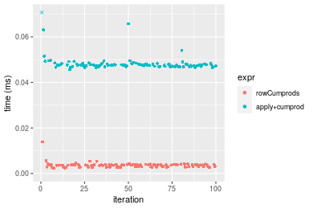
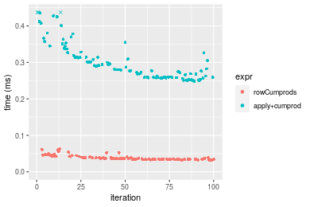
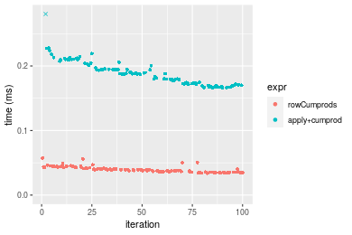
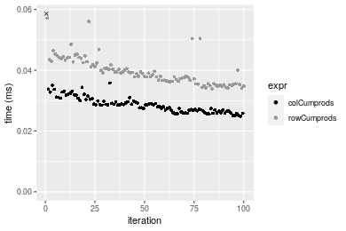
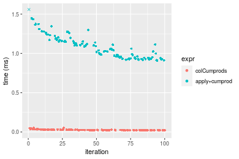
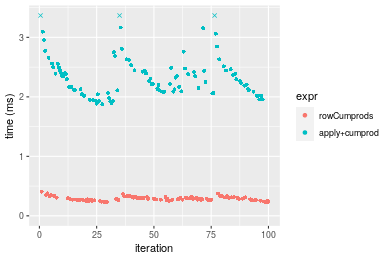
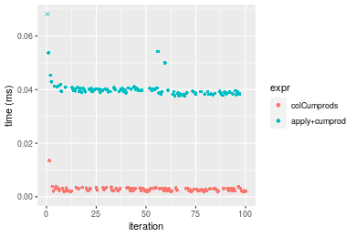
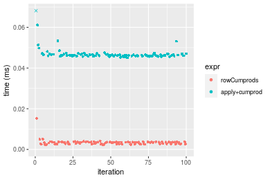
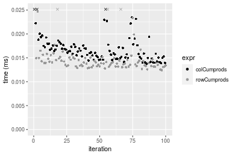
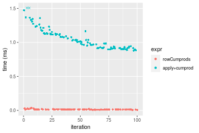

[matrixStats]: Benchmark report

---------------------------------------


# colCumprods() and rowCumprods() benchmarks

This report benchmark the performance of colCumprods() and rowCumprods() against alternative methods.

## Alternative methods

* apply() + cumprod()


## Data type "integer"

### Data
```r
> rmatrix <- function(nrow, ncol, mode = c("logical", "double", "integer", "index"), range = c(-100, 
+     +100), na_prob = 0) {
+     mode <- match.arg(mode)
+     n <- nrow * ncol
+     if (mode == "logical") {
+         x <- sample(c(FALSE, TRUE), size = n, replace = TRUE)
+     }     else if (mode == "index") {
+         x <- seq_len(n)
+         mode <- "integer"
+     }     else {
+         x <- runif(n, min = range[1], max = range[2])
+     }
+     storage.mode(x) <- mode
+     if (na_prob > 0) 
+         x[sample(n, size = na_prob * n)] <- NA
+     dim(x) <- c(nrow, ncol)
+     x
+ }
> rmatrices <- function(scale = 10, seed = 1, ...) {
+     set.seed(seed)
+     data <- list()
+     data[[1]] <- rmatrix(nrow = scale * 1, ncol = scale * 1, ...)
+     data[[2]] <- rmatrix(nrow = scale * 10, ncol = scale * 10, ...)
+     data[[3]] <- rmatrix(nrow = scale * 100, ncol = scale * 1, ...)
+     data[[4]] <- t(data[[3]])
+     data[[5]] <- rmatrix(nrow = scale * 10, ncol = scale * 100, ...)
+     data[[6]] <- t(data[[5]])
+     names(data) <- sapply(data, FUN = function(x) paste(dim(x), collapse = "x"))
+     data
+ }
> data <- rmatrices(mode = mode, range = c(-1, 1))
```

### Results

#### 10x10 integer matrix

```r
> X <- data[["10x10"]]
> gc()
          used  (Mb) gc trigger  (Mb) max used  (Mb)
Ncells 5218434 278.7    7916910 422.9  7916910 422.9
Vcells 9906905  75.6   33191153 253.3 53339345 407.0
> colStats <- microbenchmark(colCumprods = colCumprods(X), `apply+cumprod` = apply(X, MARGIN = 2L, 
+     FUN = cumprod), unit = "ms")
> X <- t(X)
> gc()
          used  (Mb) gc trigger  (Mb) max used  (Mb)
Ncells 5204744 278.0    7916910 422.9  7916910 422.9
Vcells 9861448  75.3   33191153 253.3 53339345 407.0
> rowStats <- microbenchmark(rowCumprods = rowCumprods(X), `apply+cumprod` = apply(X, MARGIN = 1L, 
+     FUN = cumprod), unit = "ms")
```

_Table: Benchmarking of colCumprods() and apply+cumprod() on integer+10x10 data. The top panel shows times in milliseconds and the bottom panel shows relative times._


|   |expr          |      min|        lq|      mean|    median|       uq|      max|
|:--|:-------------|--------:|---------:|---------:|---------:|--------:|--------:|
|1  |colCumprods   | 0.002276| 0.0025275| 0.0032295| 0.0028850| 0.003557| 0.015081|
|2  |apply+cumprod | 0.042929| 0.0449480| 0.0477027| 0.0459065| 0.047163| 0.162532|


|   |expr          |     min|       lq|     mean|   median|       uq|      max|
|:--|:-------------|-------:|--------:|--------:|--------:|--------:|--------:|
|1  |colCumprods   |  1.0000|  1.00000|  1.00000|  1.00000|  1.00000|  1.00000|
|2  |apply+cumprod | 18.8616| 17.78358| 14.77102| 15.91213| 13.25921| 10.77727|

_Table: Benchmarking of rowCumprods() and apply+cumprod() on integer+10x10 data (transposed). The top panel shows times in milliseconds and the bottom panel shows relative times._


|   |expr          |      min|        lq|      mean|   median|        uq|      max|
|:--|:-------------|--------:|---------:|---------:|--------:|---------:|--------:|
|1  |rowCumprods   | 0.002377| 0.0028930| 0.0035815| 0.003685| 0.0038685| 0.013845|
|2  |apply+cumprod | 0.045675| 0.0470545| 0.0489029| 0.047617| 0.0480500| 0.130832|


|   |expr          |     min|       lq|     mean|   median|       uq|      max|
|:--|:-------------|-------:|--------:|--------:|--------:|--------:|--------:|
|1  |rowCumprods   |  1.0000|  1.00000|  1.00000|  1.00000|  1.00000| 1.000000|
|2  |apply+cumprod | 19.2154| 16.26495| 13.65418| 12.92185| 12.42083| 9.449765|

_Figure: Benchmarking of colCumprods() and apply+cumprod() on integer+10x10 data  as well as rowCumprods() and apply+cumprod() on the same data transposed.  Outliers are displayed as crosses.  Times are in milliseconds._



_Table: Benchmarking of colCumprods() and rowCumprods() on integer+10x10 data (original and transposed).  The top panel shows times in milliseconds and the bottom panel shows relative times._


|   |expr        |   min|     lq|    mean| median|     uq|    max|
|:--|:-----------|-----:|------:|-------:|------:|------:|------:|
|1  |colCumprods | 2.276| 2.5275| 3.22948|  2.885| 3.5570| 15.081|
|2  |rowCumprods | 2.377| 2.8930| 3.58153|  3.685| 3.8685| 13.845|


|   |expr        |      min|       lq|     mean|   median|       uq|       max|
|:--|:-----------|--------:|--------:|--------:|--------:|--------:|---------:|
|1  |colCumprods | 1.000000| 1.000000| 1.000000| 1.000000| 1.000000| 1.0000000|
|2  |rowCumprods | 1.044376| 1.144609| 1.109011| 1.277296| 1.087574| 0.9180426|

_Figure: Benchmarking of colCumprods() and rowCumprods() on integer+10x10 data (original and transposed).  Outliers are displayed as crosses. Times are in milliseconds._


#### 100x100 integer matrix

```r
> X <- data[["100x100"]]
> gc()
          used  (Mb) gc trigger  (Mb) max used  (Mb)
Ncells 5203306 277.9    7916910 422.9  7916910 422.9
Vcells 9477850  72.4   33191153 253.3 53339345 407.0
> colStats <- microbenchmark(colCumprods = colCumprods(X), `apply+cumprod` = apply(X, MARGIN = 2L, 
+     FUN = cumprod), unit = "ms")
> X <- t(X)
> gc()
          used  (Mb) gc trigger  (Mb) max used  (Mb)
Ncells 5203300 277.9    7916910 422.9  7916910 422.9
Vcells 9482893  72.4   33191153 253.3 53339345 407.0
> rowStats <- microbenchmark(rowCumprods = rowCumprods(X), `apply+cumprod` = apply(X, MARGIN = 1L, 
+     FUN = cumprod), unit = "ms")
```

_Table: Benchmarking of colCumprods() and apply+cumprod() on integer+100x100 data. The top panel shows times in milliseconds and the bottom panel shows relative times._


|   |expr          |      min|        lq|      mean|    median|        uq|      max|
|:--|:-------------|--------:|---------:|---------:|---------:|---------:|--------:|
|1  |colCumprods   | 0.026066| 0.0277180| 0.0303940| 0.0289365| 0.0322705| 0.050303|
|2  |apply+cumprod | 0.256745| 0.2694895| 0.3040831| 0.2967080| 0.3323485| 0.488569|


|   |expr          |      min|       lq|     mean|   median|       uq|      max|
|:--|:-------------|--------:|--------:|--------:|--------:|--------:|--------:|
|1  |colCumprods   | 1.000000| 1.000000|  1.00000|  1.00000|  1.00000| 1.000000|
|2  |apply+cumprod | 9.849804| 9.722545| 10.00471| 10.25376| 10.29883| 9.712522|

_Table: Benchmarking of rowCumprods() and apply+cumprod() on integer+100x100 data (transposed). The top panel shows times in milliseconds and the bottom panel shows relative times._


|   |expr          |      min|        lq|      mean|    median|        uq|      max|
|:--|:-------------|--------:|---------:|---------:|---------:|---------:|--------:|
|1  |rowCumprods   | 0.032413| 0.0343935| 0.0386037| 0.0361505| 0.0402575| 0.062581|
|2  |apply+cumprod | 0.248389| 0.2592440| 0.3038023| 0.2847105| 0.3224585| 0.579472|


|   |expr          |      min|       lq|     mean| median|       uq|      max|
|:--|:-------------|--------:|--------:|--------:|------:|--------:|--------:|
|1  |rowCumprods   | 1.000000| 1.000000| 1.000000| 1.0000| 1.000000| 1.000000|
|2  |apply+cumprod | 7.663252| 7.537587| 7.869765| 7.8757| 8.009899| 9.259552|

_Figure: Benchmarking of colCumprods() and apply+cumprod() on integer+100x100 data  as well as rowCumprods() and apply+cumprod() on the same data transposed.  Outliers are displayed as crosses.  Times are in milliseconds._



_Table: Benchmarking of colCumprods() and rowCumprods() on integer+100x100 data (original and transposed).  The top panel shows times in milliseconds and the bottom panel shows relative times._


|   |expr        |    min|      lq|     mean|  median|      uq|    max|
|:--|:-----------|------:|-------:|--------:|-------:|-------:|------:|
|1  |colCumprods | 26.066| 27.7180| 30.39400| 28.9365| 32.2705| 50.303|
|2  |rowCumprods | 32.413| 34.3935| 38.60373| 36.1505| 40.2575| 62.581|


|   |expr        |      min|       lq|    mean|   median|       uq|      max|
|:--|:-----------|--------:|--------:|-------:|--------:|--------:|--------:|
|1  |colCumprods | 1.000000| 1.000000| 1.00000| 1.000000| 1.000000| 1.000000|
|2  |rowCumprods | 1.243497| 1.240836| 1.27011| 1.249305| 1.247502| 1.244081|

_Figure: Benchmarking of colCumprods() and rowCumprods() on integer+100x100 data (original and transposed).  Outliers are displayed as crosses. Times are in milliseconds._


#### 1000x10 integer matrix

```r
> X <- data[["1000x10"]]
> gc()
          used  (Mb) gc trigger  (Mb) max used  (Mb)
Ncells 5204038 278.0    7916910 422.9  7916910 422.9
Vcells 9481366  72.4   33191153 253.3 53339345 407.0
> colStats <- microbenchmark(colCumprods = colCumprods(X), `apply+cumprod` = apply(X, MARGIN = 2L, 
+     FUN = cumprod), unit = "ms")
> X <- t(X)
> gc()
          used  (Mb) gc trigger  (Mb) max used  (Mb)
Ncells 5204032 278.0    7916910 422.9  7916910 422.9
Vcells 9486409  72.4   33191153 253.3 53339345 407.0
> rowStats <- microbenchmark(rowCumprods = rowCumprods(X), `apply+cumprod` = apply(X, MARGIN = 1L, 
+     FUN = cumprod), unit = "ms")
```

_Table: Benchmarking of colCumprods() and apply+cumprod() on integer+1000x10 data. The top panel shows times in milliseconds and the bottom panel shows relative times._


|   |expr          |      min|        lq|      mean|    median|        uq|      max|
|:--|:-------------|--------:|---------:|---------:|---------:|---------:|--------:|
|1  |colCumprods   | 0.024857| 0.0266135| 0.0289418| 0.0285575| 0.0301910| 0.060870|
|2  |apply+cumprod | 0.157447| 0.1673045| 0.1842770| 0.1833200| 0.1960545| 0.311474|


|   |expr          |      min|       lq|     mean|   median|       uq|      max|
|:--|:-------------|--------:|--------:|--------:|--------:|--------:|--------:|
|1  |colCumprods   | 1.000000| 1.000000| 1.000000| 1.000000| 1.000000| 1.000000|
|2  |apply+cumprod | 6.334111| 6.286452| 6.367162| 6.419329| 6.493806| 5.117036|

_Table: Benchmarking of rowCumprods() and apply+cumprod() on integer+1000x10 data (transposed). The top panel shows times in milliseconds and the bottom panel shows relative times._


|   |expr          |      min|        lq|      mean|    median|       uq|      max|
|:--|:-------------|--------:|---------:|---------:|---------:|--------:|--------:|
|1  |rowCumprods   | 0.033903| 0.0363210| 0.0396467| 0.0390005| 0.042471| 0.057180|
|2  |apply+cumprod | 0.166161| 0.1724105| 0.1887558| 0.1877015| 0.200694| 0.290792|


|   |expr          |      min|       lq|     mean|   median|       uq|      max|
|:--|:-------------|--------:|--------:|--------:|--------:|--------:|--------:|
|1  |rowCumprods   | 1.000000| 1.000000| 1.000000| 1.000000| 1.000000| 1.000000|
|2  |apply+cumprod | 4.901071| 4.746854| 4.760942| 4.812797| 4.725436| 5.085554|

_Figure: Benchmarking of colCumprods() and apply+cumprod() on integer+1000x10 data  as well as rowCumprods() and apply+cumprod() on the same data transposed.  Outliers are displayed as crosses.  Times are in milliseconds._



_Table: Benchmarking of colCumprods() and rowCumprods() on integer+1000x10 data (original and transposed).  The top panel shows times in milliseconds and the bottom panel shows relative times._


|   |expr        |    min|      lq|     mean|  median|     uq|   max|
|:--|:-----------|------:|-------:|--------:|-------:|------:|-----:|
|1  |colCumprods | 24.857| 26.6135| 28.94178| 28.5575| 30.191| 60.87|
|2  |rowCumprods | 33.903| 36.3210| 39.64672| 39.0005| 42.471| 57.18|


|   |expr        |      min|       lq|     mean|   median|       uq|      max|
|:--|:-----------|--------:|--------:|--------:|--------:|--------:|--------:|
|1  |colCumprods | 1.000000| 1.000000| 1.000000| 1.000000| 1.000000| 1.000000|
|2  |rowCumprods | 1.363922| 1.364758| 1.369878| 1.365683| 1.406744| 0.939379|

_Figure: Benchmarking of colCumprods() and rowCumprods() on integer+1000x10 data (original and transposed).  Outliers are displayed as crosses. Times are in milliseconds._




#### 10x1000 integer matrix

```r
> X <- data[["10x1000"]]
> gc()
          used  (Mb) gc trigger  (Mb) max used  (Mb)
Ncells 5204226 278.0    7916910 422.9  7916910 422.9
Vcells 9482052  72.4   33191153 253.3 53339345 407.0
> colStats <- microbenchmark(colCumprods = colCumprods(X), `apply+cumprod` = apply(X, MARGIN = 2L, 
+     FUN = cumprod), unit = "ms")
> X <- t(X)
> gc()
          used  (Mb) gc trigger  (Mb) max used  (Mb)
Ncells 5204220 278.0    7916910 422.9  7916910 422.9
Vcells 9487095  72.4   33191153 253.3 53339345 407.0
> rowStats <- microbenchmark(rowCumprods = rowCumprods(X), `apply+cumprod` = apply(X, MARGIN = 1L, 
+     FUN = cumprod), unit = "ms")
```

_Table: Benchmarking of colCumprods() and apply+cumprod() on integer+10x1000 data. The top panel shows times in milliseconds and the bottom panel shows relative times._


|   |expr          |      min|        lq|      mean|    median|        uq|      max|
|:--|:-------------|--------:|---------:|---------:|---------:|---------:|--------:|
|1  |colCumprods   | 0.021124| 0.0226045| 0.0269961| 0.0253885| 0.0292555| 0.053620|
|2  |apply+cumprod | 0.909392| 0.9494455| 1.0832734| 1.0568940| 1.1696135| 1.559529|


|   |expr          |      min|      lq|     mean|   median|       uq|      max|
|:--|:-------------|--------:|-------:|--------:|--------:|--------:|--------:|
|1  |colCumprods   |  1.00000|  1.0000|  1.00000|  1.00000|  1.00000|  1.00000|
|2  |apply+cumprod | 43.05018| 42.0025| 40.12705| 41.62885| 39.97927| 29.08484|

_Table: Benchmarking of rowCumprods() and apply+cumprod() on integer+10x1000 data (transposed). The top panel shows times in milliseconds and the bottom panel shows relative times._


|   |expr          |      min|        lq|      mean|    median|        uq|      max|
|:--|:-------------|--------:|---------:|---------:|---------:|---------:|--------:|
|1  |rowCumprods   | 0.024064| 0.0252535| 0.0296163| 0.0275465| 0.0317855| 0.060211|
|2  |apply+cumprod | 0.922854| 0.9723930| 1.0861168| 1.0374410| 1.1854125| 1.790418|


|   |expr          |      min|       lq|    mean|   median|       uq|      max|
|:--|:-------------|--------:|--------:|-------:|--------:|--------:|--------:|
|1  |rowCumprods   |  1.00000|  1.00000|  1.0000|  1.00000|  1.00000|  1.00000|
|2  |apply+cumprod | 38.34998| 38.50528| 36.6729| 37.66145| 37.29413| 29.73573|

_Figure: Benchmarking of colCumprods() and apply+cumprod() on integer+10x1000 data  as well as rowCumprods() and apply+cumprod() on the same data transposed.  Outliers are displayed as crosses.  Times are in milliseconds._





_Table: Benchmarking of colCumprods() and rowCumprods() on integer+10x1000 data (original and transposed).  The top panel shows times in milliseconds and the bottom panel shows relative times._


|   |expr        |    min|      lq|     mean|  median|      uq|    max|
|:--|:-----------|------:|-------:|--------:|-------:|-------:|------:|
|1  |colCumprods | 21.124| 22.6045| 26.99609| 25.3885| 29.2555| 53.620|
|2  |rowCumprods | 24.064| 25.2535| 29.61633| 27.5465| 31.7855| 60.211|


|   |expr        |      min|       lq|    mean|   median|      uq|      max|
|:--|:-----------|--------:|--------:|-------:|--------:|-------:|--------:|
|1  |colCumprods | 1.000000| 1.000000| 1.00000| 1.000000| 1.00000| 1.000000|
|2  |rowCumprods | 1.139178| 1.117189| 1.09706| 1.084999| 1.08648| 1.122921|

_Figure: Benchmarking of colCumprods() and rowCumprods() on integer+10x1000 data (original and transposed).  Outliers are displayed as crosses. Times are in milliseconds._


#### 100x1000 integer matrix

```r
> X <- data[["100x1000"]]
> gc()
          used  (Mb) gc trigger  (Mb) max used  (Mb)
Ncells 5204412 278.0    7916910 422.9  7916910 422.9
Vcells 9482539  72.4   33191153 253.3 53339345 407.0
> colStats <- microbenchmark(colCumprods = colCumprods(X), `apply+cumprod` = apply(X, MARGIN = 2L, 
+     FUN = cumprod), unit = "ms")
> X <- t(X)
> gc()
          used  (Mb) gc trigger  (Mb) max used  (Mb)
Ncells 5204400 278.0    7916910 422.9  7916910 422.9
Vcells 9532572  72.8   33191153 253.3 53339345 407.0
> rowStats <- microbenchmark(rowCumprods = rowCumprods(X), `apply+cumprod` = apply(X, MARGIN = 1L, 
+     FUN = cumprod), unit = "ms")
```

_Table: Benchmarking of colCumprods() and apply+cumprod() on integer+100x1000 data. The top panel shows times in milliseconds and the bottom panel shows relative times._


|   |expr          |      min|       lq|     mean|   median|        uq|       max|
|:--|:-------------|--------:|--------:|--------:|--------:|---------:|---------:|
|1  |colCumprods   | 0.192213| 0.218718| 0.237096| 0.233236| 0.2516265|  0.307654|
|2  |apply+cumprod | 1.857093| 2.025908| 2.603234| 2.214641| 2.4522365| 19.043625|


|   |expr          |      min|       lq|     mean|   median|       uq|      max|
|:--|:-------------|--------:|--------:|--------:|--------:|--------:|--------:|
|1  |colCumprods   | 1.000000| 1.000000|  1.00000| 1.000000| 1.000000|  1.00000|
|2  |apply+cumprod | 9.661641| 9.262649| 10.97966| 9.495282| 9.745541| 61.89949|

_Table: Benchmarking of rowCumprods() and apply+cumprod() on integer+100x1000 data (transposed). The top panel shows times in milliseconds and the bottom panel shows relative times._


|   |expr          |      min|        lq|      mean|    median|        uq|       max|
|:--|:-------------|--------:|---------:|---------:|---------:|---------:|---------:|
|1  |rowCumprods   | 0.233535| 0.2666795| 0.2892378| 0.2857985| 0.3083355|  0.406547|
|2  |apply+cumprod | 1.877209| 2.0892115| 2.6503312| 2.2804735| 2.4822040| 19.068182|


|   |expr          |      min|       lq|     mean|   median|       uq|      max|
|:--|:-------------|--------:|--------:|--------:|--------:|--------:|--------:|
|1  |rowCumprods   | 1.000000| 1.000000| 1.000000| 1.000000| 1.000000|  1.00000|
|2  |apply+cumprod | 8.038234| 7.834166| 9.163157| 7.979305| 8.050335| 46.90277|

_Figure: Benchmarking of colCumprods() and apply+cumprod() on integer+100x1000 data  as well as rowCumprods() and apply+cumprod() on the same data transposed.  Outliers are displayed as crosses.  Times are in milliseconds._



_Table: Benchmarking of colCumprods() and rowCumprods() on integer+100x1000 data (original and transposed).  The top panel shows times in milliseconds and the bottom panel shows relative times._


|   |expr        |     min|       lq|     mean|   median|       uq|     max|
|:--|:-----------|-------:|--------:|--------:|--------:|--------:|-------:|
|1  |colCumprods | 192.213| 218.7180| 237.0960| 233.2360| 251.6265| 307.654|
|2  |rowCumprods | 233.535| 266.6795| 289.2378| 285.7985| 308.3355| 406.547|


|   |expr        |     min|       lq|     mean|   median|      uq|      max|
|:--|:-----------|-------:|--------:|--------:|--------:|-------:|--------:|
|1  |colCumprods | 1.00000| 1.000000| 1.000000| 1.000000| 1.00000| 1.000000|
|2  |rowCumprods | 1.21498| 1.219285| 1.219918| 1.225362| 1.22537| 1.321442|

_Figure: Benchmarking of colCumprods() and rowCumprods() on integer+100x1000 data (original and transposed).  Outliers are displayed as crosses. Times are in milliseconds._


#### 1000x100 integer matrix

```r
> X <- data[["1000x100"]]
> gc()
          used  (Mb) gc trigger  (Mb) max used  (Mb)
Ncells 5204605 278.0    7916910 422.9  7916910 422.9
Vcells 9483099  72.4   33191153 253.3 53339345 407.0
> colStats <- microbenchmark(colCumprods = colCumprods(X), `apply+cumprod` = apply(X, MARGIN = 2L, 
+     FUN = cumprod), unit = "ms")
> X <- t(X)
> gc()
          used  (Mb) gc trigger  (Mb) max used  (Mb)
Ncells 5204599 278.0    7916910 422.9  7916910 422.9
Vcells 9533142  72.8   33191153 253.3 53339345 407.0
> rowStats <- microbenchmark(rowCumprods = rowCumprods(X), `apply+cumprod` = apply(X, MARGIN = 1L, 
+     FUN = cumprod), unit = "ms")
```

_Table: Benchmarking of colCumprods() and apply+cumprod() on integer+1000x100 data. The top panel shows times in milliseconds and the bottom panel shows relative times._


|   |expr          |      min|       lq|      mean|    median|        uq|      max|
|:--|:-------------|--------:|--------:|---------:|---------:|---------:|--------:|
|1  |colCumprods   | 0.188189| 0.210303| 0.2285379| 0.2252015| 0.2403785| 0.349567|
|2  |apply+cumprod | 1.060915| 1.159491| 1.4324526| 1.2974905| 1.3982185| 7.410537|


|   |expr          |      min|       lq|   mean|   median|       uq|      max|
|:--|:-------------|--------:|--------:|------:|--------:|--------:|--------:|
|1  |colCumprods   | 1.000000| 1.000000| 1.0000| 1.000000| 1.000000|  1.00000|
|2  |apply+cumprod | 5.637497| 5.513433| 6.2679| 5.761465| 5.816737| 21.19919|

_Table: Benchmarking of rowCumprods() and apply+cumprod() on integer+1000x100 data (transposed). The top panel shows times in milliseconds and the bottom panel shows relative times._


|   |expr          |      min|        lq|      mean|    median|       uq|      max|
|:--|:-------------|--------:|---------:|---------:|---------:|--------:|--------:|
|1  |rowCumprods   | 0.242658| 0.2768575| 0.2976501| 0.2971445| 0.309726| 0.412638|
|2  |apply+cumprod | 1.032783| 1.1748890| 1.4189550| 1.2837250| 1.386918| 7.382424|


|   |expr          |      min|      lq|     mean|   median|       uq|     max|
|:--|:-------------|--------:|-------:|--------:|--------:|--------:|-------:|
|1  |rowCumprods   | 1.000000| 1.00000| 1.000000| 1.000000| 1.000000|  1.0000|
|2  |apply+cumprod | 4.256126| 4.24366| 4.767191| 4.320205| 4.477887| 17.8908|

_Figure: Benchmarking of colCumprods() and apply+cumprod() on integer+1000x100 data  as well as rowCumprods() and apply+cumprod() on the same data transposed.  Outliers are displayed as crosses.  Times are in milliseconds._


_Table: Benchmarking of colCumprods() and rowCumprods() on integer+1000x100 data (original and transposed).  The top panel shows times in milliseconds and the bottom panel shows relative times._


|   |expr        |     min|       lq|     mean|   median|       uq|     max|
|:--|:-----------|-------:|--------:|--------:|--------:|--------:|-------:|
|1  |colCumprods | 188.189| 210.3030| 228.5379| 225.2015| 240.3785| 349.567|
|2  |rowCumprods | 242.658| 276.8575| 297.6501| 297.1445| 309.7260| 412.638|


|   |expr        |      min|      lq|    mean|   median|       uq|      max|
|:--|:-----------|--------:|-------:|-------:|--------:|--------:|--------:|
|1  |colCumprods | 1.000000| 1.00000| 1.00000| 1.000000| 1.000000| 1.000000|
|2  |rowCumprods | 1.289438| 1.31647| 1.30241| 1.319461| 1.288493| 1.180426|

_Figure: Benchmarking of colCumprods() and rowCumprods() on integer+1000x100 data (original and transposed).  Outliers are displayed as crosses. Times are in milliseconds._


## Data type "double"

### Data
```r
> rmatrix <- function(nrow, ncol, mode = c("logical", "double", "integer", "index"), range = c(-100, 
+     +100), na_prob = 0) {
+     mode <- match.arg(mode)
+     n <- nrow * ncol
+     if (mode == "logical") {
+         x <- sample(c(FALSE, TRUE), size = n, replace = TRUE)
+     }     else if (mode == "index") {
+         x <- seq_len(n)
+         mode <- "integer"
+     }     else {
+         x <- runif(n, min = range[1], max = range[2])
+     }
+     storage.mode(x) <- mode
+     if (na_prob > 0) 
+         x[sample(n, size = na_prob * n)] <- NA
+     dim(x) <- c(nrow, ncol)
+     x
+ }
> rmatrices <- function(scale = 10, seed = 1, ...) {
+     set.seed(seed)
+     data <- list()
+     data[[1]] <- rmatrix(nrow = scale * 1, ncol = scale * 1, ...)
+     data[[2]] <- rmatrix(nrow = scale * 10, ncol = scale * 10, ...)
+     data[[3]] <- rmatrix(nrow = scale * 100, ncol = scale * 1, ...)
+     data[[4]] <- t(data[[3]])
+     data[[5]] <- rmatrix(nrow = scale * 10, ncol = scale * 100, ...)
+     data[[6]] <- t(data[[5]])
+     names(data) <- sapply(data, FUN = function(x) paste(dim(x), collapse = "x"))
+     data
+ }
> data <- rmatrices(mode = mode, range = c(-1, 1))
```

### Results

#### 10x10 double matrix

```r
> X <- data[["10x10"]]
> gc()
          used  (Mb) gc trigger  (Mb) max used  (Mb)
Ncells 5204805 278.0    7916910 422.9  7916910 422.9
Vcells 9599476  73.3   33191153 253.3 53339345 407.0
> colStats <- microbenchmark(colCumprods = colCumprods(X), `apply+cumprod` = apply(X, MARGIN = 2L, 
+     FUN = cumprod), unit = "ms")
> X <- t(X)
> gc()
          used  (Mb) gc trigger  (Mb) max used  (Mb)
Ncells 5204790 278.0    7916910 422.9  7916910 422.9
Vcells 9599604  73.3   33191153 253.3 53339345 407.0
> rowStats <- microbenchmark(rowCumprods = rowCumprods(X), `apply+cumprod` = apply(X, MARGIN = 1L, 
+     FUN = cumprod), unit = "ms")
```

_Table: Benchmarking of colCumprods() and apply+cumprod() on double+10x10 data. The top panel shows times in milliseconds and the bottom panel shows relative times._


|   |expr          |      min|        lq|      mean|    median|        uq|      max|
|:--|:-------------|--------:|---------:|---------:|---------:|---------:|--------:|
|1  |colCumprods   | 0.001963| 0.0021960| 0.0027747| 0.0025365| 0.0031060| 0.013481|
|2  |apply+cumprod | 0.037692| 0.0387235| 0.0408208| 0.0394760| 0.0402135| 0.134046|


|   |expr          |      min|       lq|    mean|   median|       uq|      max|
|:--|:-------------|--------:|--------:|-------:|--------:|--------:|--------:|
|1  |colCumprods   |  1.00000|  1.00000|  1.0000|  1.00000|  1.00000| 1.000000|
|2  |apply+cumprod | 19.20122| 17.63365| 14.7117| 15.56318| 12.94704| 9.943328|

_Table: Benchmarking of rowCumprods() and apply+cumprod() on double+10x10 data (transposed). The top panel shows times in milliseconds and the bottom panel shows relative times._


|   |expr          |      min|        lq|      mean|   median|       uq|      max|
|:--|:-------------|--------:|---------:|---------:|--------:|--------:|--------:|
|1  |rowCumprods   | 0.002208| 0.0026775| 0.0033424| 0.003423| 0.003610| 0.015228|
|2  |apply+cumprod | 0.045010| 0.0459455| 0.0474587| 0.046297| 0.046759| 0.122212|


|   |expr          |      min|       lq|     mean|   median|       uq|      max|
|:--|:-------------|--------:|--------:|--------:|--------:|--------:|--------:|
|1  |rowCumprods   |  1.00000|  1.00000|  1.00000|  1.00000|  1.00000| 1.000000|
|2  |apply+cumprod | 20.38496| 17.15985| 14.19885| 13.52527| 12.95263| 8.025479|

_Figure: Benchmarking of colCumprods() and apply+cumprod() on double+10x10 data  as well as rowCumprods() and apply+cumprod() on the same data transposed.  Outliers are displayed as crosses.  Times are in milliseconds._





_Table: Benchmarking of colCumprods() and rowCumprods() on double+10x10 data (original and transposed).  The top panel shows times in milliseconds and the bottom panel shows relative times._


|   |expr        |   min|     lq|    mean| median|    uq|    max|
|:--|:-----------|-----:|------:|-------:|------:|-----:|------:|
|1  |colCumprods | 1.963| 2.1960| 2.77472| 2.5365| 3.106| 13.481|
|2  |rowCumprods | 2.208| 2.6775| 3.34243| 3.4230| 3.610| 15.228|


|   |expr        |      min|       lq|     mean|   median|       uq|     max|
|:--|:-----------|--------:|--------:|--------:|--------:|--------:|-------:|
|1  |colCumprods | 1.000000| 1.000000| 1.000000| 1.000000| 1.000000| 1.00000|
|2  |rowCumprods | 1.124809| 1.219262| 1.204601| 1.349497| 1.162267| 1.12959|

_Figure: Benchmarking of colCumprods() and rowCumprods() on double+10x10 data (original and transposed).  Outliers are displayed as crosses. Times are in milliseconds._


#### 100x100 double matrix

```r
> X <- data[["100x100"]]
> gc()
          used  (Mb) gc trigger  (Mb) max used  (Mb)
Ncells 5204980 278.0    7916910 422.9  7916910 422.9
Vcells 9599583  73.3   33191153 253.3 53339345 407.0
> colStats <- microbenchmark(colCumprods = colCumprods(X), `apply+cumprod` = apply(X, MARGIN = 2L, 
+     FUN = cumprod), unit = "ms")
> X <- t(X)
> gc()
          used  (Mb) gc trigger  (Mb) max used  (Mb)
Ncells 5204974 278.0    7916910 422.9  7916910 422.9
Vcells 9609626  73.4   33191153 253.3 53339345 407.0
> rowStats <- microbenchmark(rowCumprods = rowCumprods(X), `apply+cumprod` = apply(X, MARGIN = 1L, 
+     FUN = cumprod), unit = "ms")
```

_Table: Benchmarking of colCumprods() and apply+cumprod() on double+100x100 data. The top panel shows times in milliseconds and the bottom panel shows relative times._


|   |expr          |      min|        lq|      mean|    median|        uq|      max|
|:--|:-------------|--------:|---------:|---------:|---------:|---------:|--------:|
|1  |colCumprods   | 0.013744| 0.0150235| 0.0170667| 0.0163440| 0.0177015| 0.036787|
|2  |apply+cumprod | 0.236768| 0.2559470| 0.2833312| 0.2734325| 0.2986060| 0.492447|


|   |expr          |      min|       lq|     mean|   median|       uq|      max|
|:--|:-------------|--------:|--------:|--------:|--------:|--------:|--------:|
|1  |colCumprods   |  1.00000|  1.00000|  1.00000|  1.00000|  1.00000|  1.00000|
|2  |apply+cumprod | 17.22701| 17.03644| 16.60143| 16.72984| 16.86897| 13.38644|

_Table: Benchmarking of rowCumprods() and apply+cumprod() on double+100x100 data (transposed). The top panel shows times in milliseconds and the bottom panel shows relative times._


|   |expr          |      min|        lq|      mean|    median|        uq|      max|
|:--|:-------------|--------:|---------:|---------:|---------:|---------:|--------:|
|1  |rowCumprods   | 0.012419| 0.0132775| 0.0150558| 0.0139935| 0.0149275| 0.045979|
|2  |apply+cumprod | 0.234897| 0.2496335| 0.2808525| 0.2729390| 0.3032490| 0.449333|


|   |expr          |      min|       lq|     mean|  median|       uq|     max|
|:--|:-------------|--------:|--------:|--------:|-------:|--------:|-------:|
|1  |rowCumprods   |  1.00000|  1.00000|  1.00000|  1.0000|  1.00000| 1.00000|
|2  |apply+cumprod | 18.91432| 18.80124| 18.65411| 19.5047| 20.31479| 9.77257|

_Figure: Benchmarking of colCumprods() and apply+cumprod() on double+100x100 data  as well as rowCumprods() and apply+cumprod() on the same data transposed.  Outliers are displayed as crosses.  Times are in milliseconds._


_Table: Benchmarking of colCumprods() and rowCumprods() on double+100x100 data (original and transposed).  The top panel shows times in milliseconds and the bottom panel shows relative times._


|   |expr        |    min|      lq|     mean|  median|      uq|    max|
|:--|:-----------|------:|-------:|--------:|-------:|-------:|------:|
|2  |rowCumprods | 12.419| 13.2775| 15.05580| 13.9935| 14.9275| 45.979|
|1  |colCumprods | 13.744| 15.0235| 17.06668| 16.3440| 17.7015| 36.787|


|   |expr        |      min|       lq|     mean|   median|       uq|       max|
|:--|:-----------|--------:|--------:|--------:|--------:|--------:|---------:|
|2  |rowCumprods | 1.000000| 1.000000| 1.000000| 1.000000| 1.000000| 1.0000000|
|1  |colCumprods | 1.106691| 1.131501| 1.133562| 1.167971| 1.185831| 0.8000826|

_Figure: Benchmarking of colCumprods() and rowCumprods() on double+100x100 data (original and transposed).  Outliers are displayed as crosses. Times are in milliseconds._




#### 1000x10 double matrix

```r
> X <- data[["1000x10"]]
> gc()
          used  (Mb) gc trigger  (Mb) max used  (Mb)
Ncells 5205172 278.0    7916910 422.9  7916910 422.9
Vcells 9600470  73.3   33191153 253.3 53339345 407.0
> colStats <- microbenchmark(colCumprods = colCumprods(X), `apply+cumprod` = apply(X, MARGIN = 2L, 
+     FUN = cumprod), unit = "ms")
> X <- t(X)
> gc()
          used  (Mb) gc trigger  (Mb) max used  (Mb)
Ncells 5205166 278.0    7916910 422.9  7916910 422.9
Vcells 9610513  73.4   33191153 253.3 53339345 407.0
> rowStats <- microbenchmark(rowCumprods = rowCumprods(X), `apply+cumprod` = apply(X, MARGIN = 1L, 
+     FUN = cumprod), unit = "ms")
```

_Table: Benchmarking of colCumprods() and apply+cumprod() on double+1000x10 data. The top panel shows times in milliseconds and the bottom panel shows relative times._


|   |expr          |      min|        lq|      mean|    median|        uq|      max|
|:--|:-------------|--------:|---------:|---------:|---------:|---------:|--------:|
|1  |colCumprods   | 0.027122| 0.0320995| 0.0371901| 0.0344585| 0.0405005| 0.085127|
|2  |apply+cumprod | 0.412845| 0.4747850| 0.5193167| 0.5002615| 0.5624670| 0.715780|


|   |expr          |      min|       lq|     mean|  median|      uq|      max|
|:--|:-------------|--------:|--------:|--------:|-------:|-------:|--------:|
|1  |colCumprods   |  1.00000|  1.00000|  1.00000|  1.0000|  1.0000| 1.000000|
|2  |apply+cumprod | 15.22178| 14.79104| 13.96385| 14.5178| 13.8879| 8.408378|

_Table: Benchmarking of rowCumprods() and apply+cumprod() on double+1000x10 data (transposed). The top panel shows times in milliseconds and the bottom panel shows relative times._


|   |expr          |      min|        lq|      mean|    median|        uq|      max|
|:--|:-------------|--------:|---------:|---------:|---------:|---------:|--------:|
|1  |rowCumprods   | 0.025907| 0.0310365| 0.0340336| 0.0327145| 0.0352570| 0.069214|
|2  |apply+cumprod | 0.412143| 0.4502965| 0.4934302| 0.4859855| 0.5216145| 0.679230|


|   |expr          |      min|       lq|     mean|   median|       uq|      max|
|:--|:-------------|--------:|--------:|--------:|--------:|--------:|--------:|
|1  |rowCumprods   |  1.00000|  1.00000|  1.00000|  1.00000|  1.00000| 1.000000|
|2  |apply+cumprod | 15.90856| 14.50861| 14.49832| 14.85535| 14.79464| 9.813477|

_Figure: Benchmarking of colCumprods() and apply+cumprod() on double+1000x10 data  as well as rowCumprods() and apply+cumprod() on the same data transposed.  Outliers are displayed as crosses.  Times are in milliseconds._


_Table: Benchmarking of colCumprods() and rowCumprods() on double+1000x10 data (original and transposed).  The top panel shows times in milliseconds and the bottom panel shows relative times._


|   |expr        |    min|      lq|     mean|  median|      uq|    max|
|:--|:-----------|------:|-------:|--------:|-------:|-------:|------:|
|2  |rowCumprods | 25.907| 31.0365| 34.03362| 32.7145| 35.2570| 69.214|
|1  |colCumprods | 27.122| 32.0995| 37.19009| 34.4585| 40.5005| 85.127|


|   |expr        |      min|      lq|     mean|  median|       uq|     max|
|:--|:-----------|--------:|-------:|--------:|-------:|--------:|-------:|
|2  |rowCumprods | 1.000000| 1.00000| 1.000000| 1.00000| 1.000000| 1.00000|
|1  |colCumprods | 1.046898| 1.03425| 1.092746| 1.05331| 1.148722| 1.22991|

_Figure: Benchmarking of colCumprods() and rowCumprods() on double+1000x10 data (original and transposed).  Outliers are displayed as crosses. Times are in milliseconds._


#### 10x1000 double matrix

```r
> X <- data[["10x1000"]]
> gc()
          used  (Mb) gc trigger  (Mb) max used  (Mb)
Ncells 5205360 278.0    7916910 422.9  7916910 422.9
Vcells 9601512  73.3   33191153 253.3 53339345 407.0
> colStats <- microbenchmark(colCumprods = colCumprods(X), `apply+cumprod` = apply(X, MARGIN = 2L, 
+     FUN = cumprod), unit = "ms")
> X <- t(X)
> gc()
          used  (Mb) gc trigger  (Mb) max used  (Mb)
Ncells 5205354 278.0    7916910 422.9  7916910 422.9
Vcells 9611555  73.4   33191153 253.3 53339345 407.0
> rowStats <- microbenchmark(rowCumprods = rowCumprods(X), `apply+cumprod` = apply(X, MARGIN = 1L, 
+     FUN = cumprod), unit = "ms")
```

_Table: Benchmarking of colCumprods() and apply+cumprod() on double+10x1000 data. The top panel shows times in milliseconds and the bottom panel shows relative times._


|   |expr          |      min|        lq|      mean|    median|       uq|      max|
|:--|:-------------|--------:|---------:|---------:|---------:|--------:|--------:|
|1  |colCumprods   | 0.009387| 0.0119355| 0.0141167| 0.0131270| 0.014437| 0.038537|
|2  |apply+cumprod | 0.897687| 0.9131300| 1.0391664| 0.9775385| 1.136804| 1.786624|


|   |expr          |      min|       lq|     mean|   median|       uq|      max|
|:--|:-------------|--------:|--------:|--------:|--------:|--------:|--------:|
|1  |colCumprods   |  1.00000|  1.00000|  1.00000|  1.00000|  1.00000|  1.00000|
|2  |apply+cumprod | 95.63087| 76.50538| 73.61277| 74.46778| 78.74243| 46.36126|

_Table: Benchmarking of rowCumprods() and apply+cumprod() on double+10x1000 data (transposed). The top panel shows times in milliseconds and the bottom panel shows relative times._


|   |expr          |      min|        lq|      mean|   median|       uq|      max|
|:--|:-------------|--------:|---------:|---------:|--------:|--------:|--------:|
|1  |rowCumprods   | 0.008247| 0.0115815| 0.0138269| 0.012521| 0.014407| 0.037626|
|2  |apply+cumprod | 0.878591| 0.9197755| 1.0632066| 1.012345| 1.127908| 2.487850|


|   |expr          |      min|       lq|     mean|   median|       uq|     max|
|:--|:-------------|--------:|--------:|--------:|--------:|--------:|-------:|
|1  |rowCumprods   |   1.0000|  1.00000|  1.00000|  1.00000|  1.00000|  1.0000|
|2  |apply+cumprod | 106.5346| 79.41765| 76.89384| 80.85177| 78.28889| 66.1205|

_Figure: Benchmarking of colCumprods() and apply+cumprod() on double+10x1000 data  as well as rowCumprods() and apply+cumprod() on the same data transposed.  Outliers are displayed as crosses.  Times are in milliseconds._



_Table: Benchmarking of colCumprods() and rowCumprods() on double+10x1000 data (original and transposed).  The top panel shows times in milliseconds and the bottom panel shows relative times._


|   |expr        |   min|      lq|     mean| median|     uq|    max|
|:--|:-----------|-----:|-------:|--------:|------:|------:|------:|
|2  |rowCumprods | 8.247| 11.5815| 13.82694| 12.521| 14.407| 37.626|
|1  |colCumprods | 9.387| 11.9355| 14.11666| 13.127| 14.437| 38.537|


|   |expr        |      min|       lq|     mean|   median|       uq|      max|
|:--|:-----------|--------:|--------:|--------:|--------:|--------:|--------:|
|2  |rowCumprods | 1.000000| 1.000000| 1.000000| 1.000000| 1.000000| 1.000000|
|1  |colCumprods | 1.138232| 1.030566| 1.020953| 1.048399| 1.002082| 1.024212|

_Figure: Benchmarking of colCumprods() and rowCumprods() on double+10x1000 data (original and transposed).  Outliers are displayed as crosses. Times are in milliseconds._


#### 100x1000 double matrix

```r
> X <- data[["100x1000"]]
> gc()
          used  (Mb) gc trigger  (Mb) max used  (Mb)
Ncells 5205546 278.1    7916910 422.9  7916910 422.9
Vcells 9601639  73.3   33191153 253.3 53339345 407.0
> colStats <- microbenchmark(colCumprods = colCumprods(X), `apply+cumprod` = apply(X, MARGIN = 2L, 
+     FUN = cumprod), unit = "ms")
> X <- t(X)
> gc()
          used  (Mb) gc trigger  (Mb) max used  (Mb)
Ncells 5205534 278.1    7916910 422.9  7916910 422.9
Vcells 9701672  74.1   33191153 253.3 53339345 407.0
> rowStats <- microbenchmark(rowCumprods = rowCumprods(X), `apply+cumprod` = apply(X, MARGIN = 1L, 
+     FUN = cumprod), unit = "ms")
```

_Table: Benchmarking of colCumprods() and apply+cumprod() on double+100x1000 data. The top panel shows times in milliseconds and the bottom panel shows relative times._


|   |expr          |      min|        lq|     mean|    median|        uq|      max|
|:--|:-------------|--------:|---------:|--------:|---------:|---------:|--------:|
|1  |colCumprods   | 0.104298| 0.1213275| 0.273692| 0.1322565| 0.1474345| 13.07530|
|2  |apply+cumprod | 1.817213| 2.0556005| 2.424008| 2.1965345| 2.5138735| 15.43967|


|   |expr          |      min|       lq|     mean|   median|       uq|      max|
|:--|:-------------|--------:|--------:|--------:|--------:|--------:|--------:|
|1  |colCumprods   |  1.00000|  1.00000| 1.000000|  1.00000|  1.00000| 1.000000|
|2  |apply+cumprod | 17.42328| 16.94258| 8.856703| 16.60814| 17.05078| 1.180827|

_Table: Benchmarking of rowCumprods() and apply+cumprod() on double+100x1000 data (transposed). The top panel shows times in milliseconds and the bottom panel shows relative times._


|   |expr          |      min|       lq|      mean|   median|        uq|       max|
|:--|:-------------|--------:|--------:|---------:|--------:|---------:|---------:|
|1  |rowCumprods   | 0.070852| 0.082701| 0.0979202| 0.096008| 0.1078345|  0.166844|
|2  |apply+cumprod | 1.711892| 1.993286| 2.4320129| 2.129755| 2.3170945| 15.179939|


|   |expr          |      min|       lq|     mean|  median|       uq|      max|
|:--|:-------------|--------:|--------:|--------:|-------:|--------:|--------:|
|1  |rowCumprods   |  1.00000|  1.00000|  1.00000|  1.0000|  1.00000|  1.00000|
|2  |apply+cumprod | 24.16152| 24.10232| 24.83669| 22.1831| 21.48751| 90.98283|

_Figure: Benchmarking of colCumprods() and apply+cumprod() on double+100x1000 data  as well as rowCumprods() and apply+cumprod() on the same data transposed.  Outliers are displayed as crosses.  Times are in milliseconds._


_Table: Benchmarking of colCumprods() and rowCumprods() on double+100x1000 data (original and transposed).  The top panel shows times in milliseconds and the bottom panel shows relative times._


|   |expr        |     min|       lq|      mean|   median|       uq|       max|
|:--|:-----------|-------:|--------:|---------:|--------:|--------:|---------:|
|2  |rowCumprods |  70.852|  82.7010|  97.92018|  96.0080| 107.8345|   166.844|
|1  |colCumprods | 104.298| 121.3275| 273.69196| 132.2565| 147.4345| 13075.299|


|   |expr        |      min|       lq|     mean|   median|       uq|      max|
|:--|:-----------|--------:|--------:|--------:|--------:|--------:|--------:|
|2  |rowCumprods | 1.000000| 1.000000| 1.000000| 1.000000| 1.000000|  1.00000|
|1  |colCumprods | 1.472054| 1.467062| 2.795052| 1.377557| 1.367229| 78.36841|

_Figure: Benchmarking of colCumprods() and rowCumprods() on double+100x1000 data (original and transposed).  Outliers are displayed as crosses. Times are in milliseconds._


#### 1000x100 double matrix

```r
> X <- data[["1000x100"]]
> gc()
          used  (Mb) gc trigger  (Mb) max used  (Mb)
Ncells 5205739 278.1    7916910 422.9  7916910 422.9
Vcells 9602856  73.3   33191153 253.3 53339345 407.0
> colStats <- microbenchmark(colCumprods = colCumprods(X), `apply+cumprod` = apply(X, MARGIN = 2L, 
+     FUN = cumprod), unit = "ms")
> X <- t(X)
> gc()
          used  (Mb) gc trigger  (Mb) max used  (Mb)
Ncells 5205733 278.1    7916910 422.9  7916910 422.9
Vcells 9702899  74.1   33191153 253.3 53339345 407.0
> rowStats <- microbenchmark(rowCumprods = rowCumprods(X), `apply+cumprod` = apply(X, MARGIN = 1L, 
+     FUN = cumprod), unit = "ms")
```

_Table: Benchmarking of colCumprods() and apply+cumprod() on double+1000x100 data. The top panel shows times in milliseconds and the bottom panel shows relative times._


|   |expr          |      min|        lq|      mean|    median|        uq|       max|
|:--|:-------------|--------:|---------:|---------:|---------:|---------:|---------:|
|1  |colCumprods   | 0.239273| 0.2436585| 0.2621753| 0.2541975| 0.2654105|  0.431607|
|2  |apply+cumprod | 3.586672| 3.6197690| 3.9729681| 3.6671295| 3.9296190| 10.165060|


|   |expr          |      min|       lq|     mean|  median|       uq|      max|
|:--|:-------------|--------:|--------:|--------:|-------:|--------:|--------:|
|1  |colCumprods   |  1.00000|  1.00000|  1.00000|  1.0000|  1.00000|  1.00000|
|2  |apply+cumprod | 14.98987| 14.85591| 15.15386| 14.4263| 14.80582| 23.55166|

_Table: Benchmarking of rowCumprods() and apply+cumprod() on double+1000x100 data (transposed). The top panel shows times in milliseconds and the bottom panel shows relative times._


|   |expr          |      min|       lq|      mean|    median|       uq|       max|
|:--|:-------------|--------:|--------:|---------:|---------:|--------:|---------:|
|1  |rowCumprods   | 0.210453| 0.216730| 0.2336882| 0.2255365| 0.237798|  0.362024|
|2  |apply+cumprod | 3.628790| 3.655593| 4.0744468| 3.6975880| 4.065031| 10.928963|


|   |expr          |      min|       lq|    mean|   median|       uq|     max|
|:--|:-------------|--------:|--------:|-------:|--------:|--------:|-------:|
|1  |rowCumprods   |  1.00000|  1.00000|  1.0000|  1.00000|  1.00000|  1.0000|
|2  |apply+cumprod | 17.24276| 16.86704| 17.4354| 16.39463| 17.09447| 30.1885|

_Figure: Benchmarking of colCumprods() and apply+cumprod() on double+1000x100 data  as well as rowCumprods() and apply+cumprod() on the same data transposed.  Outliers are displayed as crosses.  Times are in milliseconds._


_Table: Benchmarking of colCumprods() and rowCumprods() on double+1000x100 data (original and transposed).  The top panel shows times in milliseconds and the bottom panel shows relative times._


|   |expr        |     min|       lq|     mean|   median|       uq|     max|
|:--|:-----------|-------:|--------:|--------:|--------:|--------:|-------:|
|2  |rowCumprods | 210.453| 216.7300| 233.6882| 225.5365| 237.7980| 362.024|
|1  |colCumprods | 239.273| 243.6585| 262.1753| 254.1975| 265.4105| 431.607|


|   |expr        |      min|       lq|     mean|   median|       uq|      max|
|:--|:-----------|--------:|--------:|--------:|--------:|--------:|--------:|
|2  |rowCumprods | 1.000000| 1.000000| 1.000000| 1.000000| 1.000000| 1.000000|
|1  |colCumprods | 1.136943| 1.124249| 1.121902| 1.127079| 1.116118| 1.192206|

_Figure: Benchmarking of colCumprods() and rowCumprods() on double+1000x100 data (original and transposed).  Outliers are displayed as crosses. Times are in milliseconds._


## Appendix

### Session information
```r
R version 4.1.1 Patched (2021-08-10 r80727)
Platform: x86_64-pc-linux-gnu (64-bit)
Running under: Ubuntu 18.04.5 LTS

Matrix products: default
BLAS:   /home/hb/software/R-devel/R-4-1-branch/lib/R/lib/libRblas.so
LAPACK: /home/hb/software/R-devel/R-4-1-branch/lib/R/lib/libRlapack.so

locale:
 [1] LC_CTYPE=en_US.UTF-8       LC_NUMERIC=C              
 [3] LC_TIME=en_US.UTF-8        LC_COLLATE=en_US.UTF-8    
 [5] LC_MONETARY=en_US.UTF-8    LC_MESSAGES=en_US.UTF-8   
 [7] LC_PAPER=en_US.UTF-8       LC_NAME=C                 
 [9] LC_ADDRESS=C               LC_TELEPHONE=C            
[11] LC_MEASUREMENT=en_US.UTF-8 LC_IDENTIFICATION=C       

attached base packages:
[1] stats     graphics  grDevices utils     datasets  methods   base     

other attached packages:
[1] microbenchmark_1.4-7   matrixStats_0.60.0     ggplot2_3.3.5         
[4] knitr_1.33             R.devices_2.17.0       R.utils_2.10.1        
[7] R.oo_1.24.0            R.methodsS3_1.8.1-9001 history_0.0.1-9000    

loaded via a namespace (and not attached):
 [1] Biobase_2.52.0          httr_1.4.2              splines_4.1.1          
 [4] bit64_4.0.5             network_1.17.1          assertthat_0.2.1       
 [7] highr_0.9               stats4_4.1.1            blob_1.2.2             
[10] GenomeInfoDbData_1.2.6  robustbase_0.93-8       pillar_1.6.2           
[13] RSQLite_2.2.8           lattice_0.20-44         glue_1.4.2             
[16] digest_0.6.27           XVector_0.32.0          colorspace_2.0-2       
[19] Matrix_1.3-4            XML_3.99-0.7            pkgconfig_2.0.3        
[22] zlibbioc_1.38.0         genefilter_1.74.0       purrr_0.3.4            
[25] ergm_4.1.2              xtable_1.8-4            scales_1.1.1           
[28] tibble_3.1.4            annotate_1.70.0         KEGGREST_1.32.0        
[31] farver_2.1.0            generics_0.1.0          IRanges_2.26.0         
[34] ellipsis_0.3.2          cachem_1.0.6            withr_2.4.2            
[37] BiocGenerics_0.38.0     mime_0.11               survival_3.2-13        
[40] magrittr_2.0.1          crayon_1.4.1            statnet.common_4.5.0   
[43] memoise_2.0.0           laeken_0.5.1            fansi_0.5.0            
[46] R.cache_0.15.0          MASS_7.3-54             R.rsp_0.44.0           
[49] progressr_0.8.0         tools_4.1.1             lifecycle_1.0.0        
[52] S4Vectors_0.30.0        trust_0.1-8             munsell_0.5.0          
[55] tabby_0.0.1-9001        AnnotationDbi_1.54.1    Biostrings_2.60.2      
[58] compiler_4.1.1          GenomeInfoDb_1.28.1     rlang_0.4.11           
[61] grid_4.1.1              RCurl_1.98-1.4          cwhmisc_6.6            
[64] rstudioapi_0.13         rappdirs_0.3.3          startup_0.15.0         
[67] labeling_0.4.2          bitops_1.0-7            base64enc_0.1-3        
[70] boot_1.3-28             gtable_0.3.0            DBI_1.1.1              
[73] markdown_1.1            R6_2.5.1                lpSolveAPI_5.5.2.0-17.7
[76] rle_0.9.2               dplyr_1.0.7             fastmap_1.1.0          
[79] bit_4.0.4               utf8_1.2.2              parallel_4.1.1         
[82] Rcpp_1.0.7              vctrs_0.3.8             png_0.1-7              
[85] DEoptimR_1.0-9          tidyselect_1.1.1        xfun_0.25              
[88] coda_0.19-4            
```
Total processing time was 25.21 secs.


### Reproducibility
To reproduce this report, do:
```r
html <- matrixStats:::benchmark('colCumprods')
```

[RSP]: https://cran.r-project.org/package=R.rsp
[matrixStats]: https://cran.r-project.org/package=matrixStats

[StackOverflow:colMins?]: https://stackoverflow.com/questions/13676878 "Stack Overflow: fastest way to get Min from every column in a matrix?"
[StackOverflow:colSds?]: https://stackoverflow.com/questions/17549762 "Stack Overflow: Is there such 'colsd' in R?"
[StackOverflow:rowProds?]: https://stackoverflow.com/questions/20198801/ "Stack Overflow: Row product of matrix and column sum of matrix"

---------------------------------------
Copyright Henrik Bengtsson. Last updated on 2021-08-25 22:14:21 (+0200 UTC). Powered by [RSP].

<script>
 var link = document.createElement('link');
 link.rel = 'icon';
 link.href = "data:image/png;base64,iVBORw0KGgoAAAANSUhEUgAAACAAAAAgCAMAAABEpIrGAAAA21BMVEUAAAAAAP8AAP8AAP8AAP8AAP8AAP8AAP8AAP8AAP8AAP8AAP8AAP8AAP8AAP8AAP8AAP8AAP8AAP8AAP8AAP8AAP8AAP8AAP8AAP8AAP8AAP8AAP8AAP8AAP8AAP8AAP8AAP8AAP8AAP8AAP8AAP8AAP8AAP8AAP8AAP8AAP8BAf4CAv0DA/wdHeIeHuEfH+AgIN8hId4lJdomJtknJ9g+PsE/P8BAQL9yco10dIt1dYp3d4h4eIeVlWqWlmmXl2iYmGeZmWabm2Tn5xjo6Bfp6Rb39wj4+Af//wA2M9hbAAAASXRSTlMAAQIJCgsMJSYnKD4/QGRlZmhpamtsbautrrCxuru8y8zN5ebn6Pn6+///////////////////////////////////////////LsUNcQAAAS9JREFUOI29k21XgkAQhVcFytdSMqMETU26UVqGmpaiFbL//xc1cAhhwVNf6n5i5z67M2dmYOyfJZUqlVLhkKucG7cgmUZTybDz6g0iDeq51PUr37Ds2cy2/C9NeES5puDjxuUk1xnToZsg8pfA3avHQ3lLIi7iWRrkv/OYtkScxBIMgDee0ALoyxHQBJ68JLCjOtQIMIANF7QG9G9fNnHvisCHBVMKgSJgiz7nE+AoBKrAPA3MgepvgR9TSCasrCKH0eB1wBGBFdCO+nAGjMVGPcQb5bd6mQRegN6+1axOs9nGfYcCtfi4NQosdtH7dB+txFIpXQqN1p9B/asRHToyS0jRgpV7nk4nwcq1BJ+x3Gl/v7S9Wmpp/aGquum7w3ZDyrADFYrl8vHBH+ev9AUASW1dmU4h4wAAAABJRU5ErkJggg=="
 document.getElementsByTagName('head')[0].appendChild(link);
</script>


