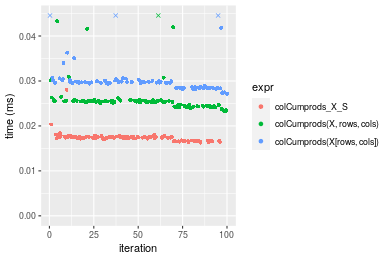
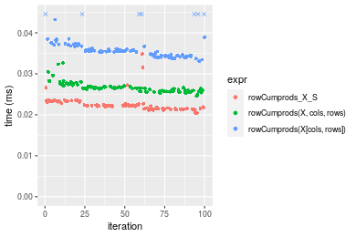
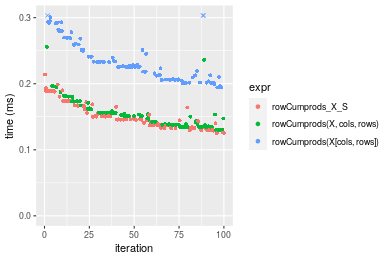
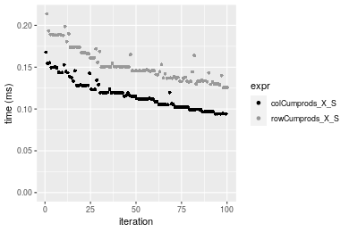
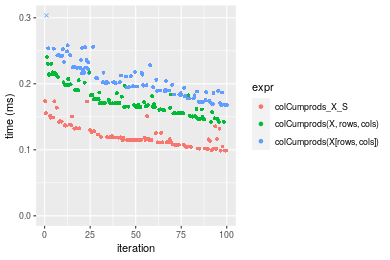
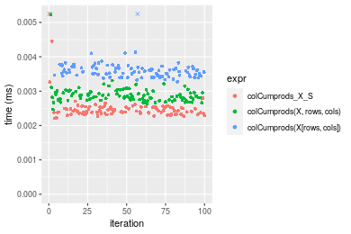
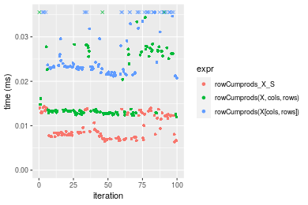
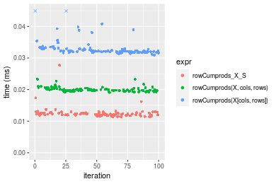

[matrixStats]: Benchmark report

---------------------------------------


# colCumprods() and rowCumprods() benchmarks  on subsetted computation

This report benchmark the performance of colCumprods() and rowCumprods() on subsetted computation.


## Data type "integer"

### Data
```r
> rmatrix <- function(nrow, ncol, mode = c("logical", "double", "integer", "index"), range = c(-100, 
+     +100), na_prob = 0) {
+     mode <- match.arg(mode)
+     n <- nrow * ncol
+     if (mode == "logical") {
+         x <- sample(c(FALSE, TRUE), size = n, replace = TRUE)
+     }     else if (mode == "index") {
+         x <- seq_len(n)
+         mode <- "integer"
+     }     else {
+         x <- runif(n, min = range[1], max = range[2])
+     }
+     storage.mode(x) <- mode
+     if (na_prob > 0) 
+         x[sample(n, size = na_prob * n)] <- NA
+     dim(x) <- c(nrow, ncol)
+     x
+ }
> rmatrices <- function(scale = 10, seed = 1, ...) {
+     set.seed(seed)
+     data <- list()
+     data[[1]] <- rmatrix(nrow = scale * 1, ncol = scale * 1, ...)
+     data[[2]] <- rmatrix(nrow = scale * 10, ncol = scale * 10, ...)
+     data[[3]] <- rmatrix(nrow = scale * 100, ncol = scale * 1, ...)
+     data[[4]] <- t(data[[3]])
+     data[[5]] <- rmatrix(nrow = scale * 10, ncol = scale * 100, ...)
+     data[[6]] <- t(data[[5]])
+     names(data) <- sapply(data, FUN = function(x) paste(dim(x), collapse = "x"))
+     data
+ }
> data <- rmatrices(mode = mode, range = c(-1, 1))
```

### Results

#### 10x10 integer matrix

```r
> X <- data[["10x10"]]
> rows <- sample.int(nrow(X), size = nrow(X) * 0.7)
> cols <- sample.int(ncol(X), size = ncol(X) * 0.7)
> X_S <- X[rows, cols]
> gc()
          used  (Mb) gc trigger  (Mb) max used  (Mb)
Ncells 5213456 278.5    7916910 422.9  7916910 422.9
Vcells 9827406  75.0   33191153 253.3 53339345 407.0
> colStats <- microbenchmark(colCumprods_X_S = colCumprods(X_S), `colCumprods(X, rows, cols)` = colCumprods(X, 
+     rows = rows, cols = cols), `colCumprods(X[rows, cols])` = colCumprods(X[rows, cols]), unit = "ms")
> X <- t(X)
> X_S <- t(X_S)
> gc()
          used  (Mb) gc trigger  (Mb) max used  (Mb)
Ncells 5200924 277.8    7916910 422.9  7916910 422.9
Vcells 9785878  74.7   33191153 253.3 53339345 407.0
> rowStats <- microbenchmark(rowCumprods_X_S = rowCumprods(X_S), `rowCumprods(X, cols, rows)` = rowCumprods(X, 
+     rows = cols, cols = rows), `rowCumprods(X[cols, rows])` = rowCumprods(X[cols, rows]), unit = "ms")
```

_Table: Benchmarking of colCumprods_X_S(), colCumprods(X, rows, cols)() and colCumprods(X[rows, cols])() on integer+10x10 data. The top panel shows times in milliseconds and the bottom panel shows relative times._


|   |expr                       |      min|        lq|      mean|    median|        uq|      max|
|:--|:--------------------------|--------:|---------:|---------:|---------:|---------:|--------:|
|1  |colCumprods_X_S            | 0.002130| 0.0023095| 0.0039658| 0.0023790| 0.0024975| 0.156769|
|2  |colCumprods(X, rows, cols) | 0.002353| 0.0026730| 0.0028235| 0.0027665| 0.0028635| 0.005400|
|3  |colCumprods(X[rows, cols]) | 0.002910| 0.0033600| 0.0035488| 0.0034995| 0.0036080| 0.007786|


|   |expr                       |      min|       lq|      mean|   median|       uq|       max|
|:--|:--------------------------|--------:|--------:|---------:|--------:|--------:|---------:|
|1  |colCumprods_X_S            | 1.000000| 1.000000| 1.0000000| 1.000000| 1.000000| 1.0000000|
|2  |colCumprods(X, rows, cols) | 1.104695| 1.157393| 0.7119583| 1.162884| 1.146546| 0.0344456|
|3  |colCumprods(X[rows, cols]) | 1.366197| 1.454860| 0.8948605| 1.470996| 1.444645| 0.0496654|

_Table: Benchmarking of rowCumprods_X_S(), rowCumprods(X, cols, rows)() and rowCumprods(X[cols, rows])() on integer+10x10 data (transposed). The top panel shows times in milliseconds and the bottom panel shows relative times._


|   |expr                       |      min|        lq|      mean|    median|        uq|      max|
|:--|:--------------------------|--------:|---------:|---------:|---------:|---------:|--------:|
|1  |rowCumprods_X_S            | 0.002123| 0.0024040| 0.0025326| 0.0024905| 0.0025800| 0.004748|
|2  |rowCumprods(X, cols, rows) | 0.002473| 0.0027365| 0.0044240| 0.0028100| 0.0029145| 0.160240|
|3  |rowCumprods(X[cols, rows]) | 0.003089| 0.0034510| 0.0035787| 0.0035265| 0.0036070| 0.007463|


|   |expr                       |      min|       lq|     mean|   median|       uq|      max|
|:--|:--------------------------|--------:|--------:|--------:|--------:|--------:|--------:|
|1  |rowCumprods_X_S            | 1.000000| 1.000000| 1.000000| 1.000000| 1.000000|  1.00000|
|2  |rowCumprods(X, cols, rows) | 1.164861| 1.138311| 1.746846| 1.128288| 1.129651| 33.74895|
|3  |rowCumprods(X[cols, rows]) | 1.455016| 1.435524| 1.413078| 1.415981| 1.398062|  1.57182|

_Figure: Benchmarking of colCumprods_X_S(), colCumprods(X, rows, cols)() and colCumprods(X[rows, cols])() on integer+10x10 data  as well as rowCumprods_X_S(), rowCumprods(X, cols, rows)() and rowCumprods(X[cols, rows])() on the same data transposed.  Outliers are displayed as crosses.  Times are in milliseconds._


_Table: Benchmarking of colCumprods_X_S() and rowCumprods_X_S() on integer+10x10 data (original and transposed).  The top panel shows times in milliseconds and the bottom panel shows relative times._


|   |expr            |   min|     lq|    mean| median|     uq|     max|
|:--|:---------------|-----:|------:|-------:|------:|------:|-------:|
|1  |colCumprods_X_S | 2.130| 2.3095| 3.96578| 2.3790| 2.4975| 156.769|
|2  |rowCumprods_X_S | 2.123| 2.4040| 2.53257| 2.4905| 2.5800|   4.748|


|   |expr            |       min|       lq|      mean|   median|       uq|       max|
|:--|:---------------|---------:|--------:|---------:|--------:|--------:|---------:|
|1  |colCumprods_X_S | 1.0000000| 1.000000| 1.0000000| 1.000000| 1.000000| 1.0000000|
|2  |rowCumprods_X_S | 0.9967136| 1.040918| 0.6386058| 1.046868| 1.033033| 0.0302866|

_Figure: Benchmarking of colCumprods_X_S() and rowCumprods_X_S() on integer+10x10 data (original and transposed).  Outliers are displayed as crosses. Times are in milliseconds._


#### 100x100 integer matrix

```r
> X <- data[["100x100"]]
> rows <- sample.int(nrow(X), size = nrow(X) * 0.7)
> cols <- sample.int(ncol(X), size = ncol(X) * 0.7)
> X_S <- X[rows, cols]
> gc()
          used  (Mb) gc trigger  (Mb) max used  (Mb)
Ncells 5199629 277.7    7916910 422.9  7916910 422.9
Vcells 9454988  72.2   33191153 253.3 53339345 407.0
> colStats <- microbenchmark(colCumprods_X_S = colCumprods(X_S), `colCumprods(X, rows, cols)` = colCumprods(X, 
+     rows = rows, cols = cols), `colCumprods(X[rows, cols])` = colCumprods(X[rows, cols]), unit = "ms")
> X <- t(X)
> X_S <- t(X_S)
> gc()
          used  (Mb) gc trigger  (Mb) max used  (Mb)
Ncells 5199623 277.7    7916910 422.9  7916910 422.9
Vcells 9460071  72.2   33191153 253.3 53339345 407.0
> rowStats <- microbenchmark(rowCumprods_X_S = rowCumprods(X_S), `rowCumprods(X, cols, rows)` = rowCumprods(X, 
+     rows = cols, cols = rows), `rowCumprods(X[cols, rows])` = rowCumprods(X[cols, rows]), unit = "ms")
```

_Table: Benchmarking of colCumprods_X_S(), colCumprods(X, rows, cols)() and colCumprods(X[rows, cols])() on integer+100x100 data. The top panel shows times in milliseconds and the bottom panel shows relative times._


|   |expr                       |      min|        lq|      mean|    median|        uq|      max|
|:--|:--------------------------|--------:|---------:|---------:|---------:|---------:|--------:|
|1  |colCumprods_X_S            | 0.016517| 0.0172645| 0.0173347| 0.0173455| 0.0174905| 0.019696|
|2  |colCumprods(X, rows, cols) | 0.023057| 0.0240730| 0.0242243| 0.0241885| 0.0243140| 0.028630|
|3  |colCumprods(X[rows, cols]) | 0.027261| 0.0286655| 0.0293388| 0.0288380| 0.0290040| 0.061713|


|   |expr                       |      min|       lq|     mean|   median|       uq|      max|
|:--|:--------------------------|--------:|--------:|--------:|--------:|--------:|--------:|
|1  |colCumprods_X_S            | 1.000000| 1.000000| 1.000000| 1.000000| 1.000000| 1.000000|
|2  |colCumprods(X, rows, cols) | 1.395956| 1.394364| 1.397446| 1.394511| 1.390126| 1.453595|
|3  |colCumprods(X[rows, cols]) | 1.650481| 1.660372| 1.692492| 1.662564| 1.658272| 3.133276|

_Table: Benchmarking of rowCumprods_X_S(), rowCumprods(X, cols, rows)() and rowCumprods(X[cols, rows])() on integer+100x100 data (transposed). The top panel shows times in milliseconds and the bottom panel shows relative times._


|   |expr                       |      min|        lq|      mean|    median|       uq|      max|
|:--|:--------------------------|--------:|---------:|---------:|---------:|--------:|--------:|
|1  |rowCumprods_X_S            | 0.019701| 0.0205150| 0.0210799| 0.0209795| 0.021562| 0.026141|
|2  |rowCumprods(X, cols, rows) | 0.020670| 0.0216395| 0.0224825| 0.0221750| 0.022656| 0.049934|
|3  |rowCumprods(X[cols, rows]) | 0.030229| 0.0314540| 0.0324402| 0.0318710| 0.033033| 0.048070|


|   |expr                       |      min|       lq|     mean|   median|       uq|      max|
|:--|:--------------------------|--------:|--------:|--------:|--------:|--------:|--------:|
|1  |rowCumprods_X_S            | 1.000000| 1.000000| 1.000000| 1.000000| 1.000000| 1.000000|
|2  |rowCumprods(X, cols, rows) | 1.049185| 1.054814| 1.066538| 1.056984| 1.050737| 1.910179|
|3  |rowCumprods(X[cols, rows]) | 1.534389| 1.533220| 1.538916| 1.519150| 1.532001| 1.838874|

_Figure: Benchmarking of colCumprods_X_S(), colCumprods(X, rows, cols)() and colCumprods(X[rows, cols])() on integer+100x100 data  as well as rowCumprods_X_S(), rowCumprods(X, cols, rows)() and rowCumprods(X[cols, rows])() on the same data transposed.  Outliers are displayed as crosses.  Times are in milliseconds._


_Table: Benchmarking of colCumprods_X_S() and rowCumprods_X_S() on integer+100x100 data (original and transposed).  The top panel shows times in milliseconds and the bottom panel shows relative times._


|   |expr            |    min|      lq|     mean|  median|      uq|    max|
|:--|:---------------|------:|-------:|--------:|-------:|-------:|------:|
|1  |colCumprods_X_S | 16.517| 17.2645| 17.33470| 17.3455| 17.4905| 19.696|
|2  |rowCumprods_X_S | 19.701| 20.5150| 21.07987| 20.9795| 21.5620| 26.141|


|   |expr            |      min|       lq|    mean|   median|       uq|      max|
|:--|:---------------|--------:|--------:|-------:|--------:|--------:|--------:|
|1  |colCumprods_X_S | 1.000000| 1.000000| 1.00000| 1.000000| 1.000000| 1.000000|
|2  |rowCumprods_X_S | 1.192771| 1.188276| 1.21605| 1.209507| 1.232784| 1.327224|

_Figure: Benchmarking of colCumprods_X_S() and rowCumprods_X_S() on integer+100x100 data (original and transposed).  Outliers are displayed as crosses. Times are in milliseconds._


#### 1000x10 integer matrix

```r
> X <- data[["1000x10"]]
> rows <- sample.int(nrow(X), size = nrow(X) * 0.7)
> cols <- sample.int(ncol(X), size = ncol(X) * 0.7)
> X_S <- X[rows, cols]
> gc()
          used  (Mb) gc trigger  (Mb) max used  (Mb)
Ncells 5200371 277.8    7916910 422.9  7916910 422.9
Vcells 9459045  72.2   33191153 253.3 53339345 407.0
> colStats <- microbenchmark(colCumprods_X_S = colCumprods(X_S), `colCumprods(X, rows, cols)` = colCumprods(X, 
+     rows = rows, cols = cols), `colCumprods(X[rows, cols])` = colCumprods(X[rows, cols]), unit = "ms")
> X <- t(X)
> X_S <- t(X_S)
> gc()
          used  (Mb) gc trigger  (Mb) max used  (Mb)
Ncells 5200365 277.8    7916910 422.9  7916910 422.9
Vcells 9464128  72.3   33191153 253.3 53339345 407.0
> rowStats <- microbenchmark(rowCumprods_X_S = rowCumprods(X_S), `rowCumprods(X, cols, rows)` = rowCumprods(X, 
+     rows = cols, cols = rows), `rowCumprods(X[cols, rows])` = rowCumprods(X[cols, rows]), unit = "ms")
```

_Table: Benchmarking of colCumprods_X_S(), colCumprods(X, rows, cols)() and colCumprods(X[rows, cols])() on integer+1000x10 data. The top panel shows times in milliseconds and the bottom panel shows relative times._


|   |expr                       |      min|        lq|      mean|    median|        uq|      max|
|:--|:--------------------------|--------:|---------:|---------:|---------:|---------:|--------:|
|1  |colCumprods_X_S            | 0.016288| 0.0171430| 0.0174180| 0.0173890| 0.0175485| 0.028024|
|2  |colCumprods(X, rows, cols) | 0.023358| 0.0244505| 0.0261008| 0.0254035| 0.0256075| 0.059107|
|3  |colCumprods(X[rows, cols]) | 0.027170| 0.0285190| 0.0305344| 0.0296390| 0.0299290| 0.083092|


|   |expr                       |      min|       lq|     mean|   median|       uq|      max|
|:--|:--------------------------|--------:|--------:|--------:|--------:|--------:|--------:|
|1  |colCumprods_X_S            | 1.000000| 1.000000| 1.000000| 1.000000| 1.000000| 1.000000|
|2  |colCumprods(X, rows, cols) | 1.434062| 1.426267| 1.498493| 1.460895| 1.459242| 2.109156|
|3  |colCumprods(X[rows, cols]) | 1.668099| 1.663595| 1.753037| 1.704468| 1.705502| 2.965030|

_Table: Benchmarking of rowCumprods_X_S(), rowCumprods(X, cols, rows)() and rowCumprods(X[cols, rows])() on integer+1000x10 data (transposed). The top panel shows times in milliseconds and the bottom panel shows relative times._


|   |expr                       |      min|        lq|      mean|    median|        uq|      max|
|:--|:--------------------------|--------:|---------:|---------:|---------:|---------:|--------:|
|1  |rowCumprods_X_S            | 0.020412| 0.0214680| 0.0224569| 0.0221435| 0.0226890| 0.034829|
|2  |rowCumprods(X, cols, rows) | 0.024611| 0.0258885| 0.0267093| 0.0265215| 0.0271425| 0.032688|
|3  |rowCumprods(X[cols, rows]) | 0.033090| 0.0344075| 0.0370630| 0.0355460| 0.0369685| 0.075511|


|   |expr                       |      min|       lq|     mean|   median|       uq|       max|
|:--|:--------------------------|--------:|--------:|--------:|--------:|--------:|---------:|
|1  |rowCumprods_X_S            | 1.000000| 1.000000| 1.000000| 1.000000| 1.000000| 1.0000000|
|2  |rowCumprods(X, cols, rows) | 1.205712| 1.205911| 1.189362| 1.197710| 1.196284| 0.9385282|
|3  |rowCumprods(X[cols, rows]) | 1.621105| 1.602734| 1.650409| 1.605257| 1.629358| 2.1680496|

_Figure: Benchmarking of colCumprods_X_S(), colCumprods(X, rows, cols)() and colCumprods(X[rows, cols])() on integer+1000x10 data  as well as rowCumprods_X_S(), rowCumprods(X, cols, rows)() and rowCumprods(X[cols, rows])() on the same data transposed.  Outliers are displayed as crosses.  Times are in milliseconds._





_Table: Benchmarking of colCumprods_X_S() and rowCumprods_X_S() on integer+1000x10 data (original and transposed).  The top panel shows times in milliseconds and the bottom panel shows relative times._


|   |expr            |    min|     lq|     mean|  median|      uq|    max|
|:--|:---------------|------:|------:|--------:|-------:|-------:|------:|
|1  |colCumprods_X_S | 16.288| 17.143| 17.41801| 17.3890| 17.5485| 28.024|
|2  |rowCumprods_X_S | 20.412| 21.468| 22.45685| 22.1435| 22.6890| 34.829|


|   |expr            |      min|      lq|     mean|  median|       uq|      max|
|:--|:---------------|--------:|-------:|--------:|-------:|--------:|--------:|
|1  |colCumprods_X_S | 1.000000| 1.00000| 1.000000| 1.00000| 1.000000| 1.000000|
|2  |rowCumprods_X_S | 1.253192| 1.25229| 1.289289| 1.27342| 1.292931| 1.242828|

_Figure: Benchmarking of colCumprods_X_S() and rowCumprods_X_S() on integer+1000x10 data (original and transposed).  Outliers are displayed as crosses. Times are in milliseconds._


#### 10x1000 integer matrix

```r
> X <- data[["10x1000"]]
> rows <- sample.int(nrow(X), size = nrow(X) * 0.7)
> cols <- sample.int(ncol(X), size = ncol(X) * 0.7)
> X_S <- X[rows, cols]
> gc()
          used  (Mb) gc trigger  (Mb) max used  (Mb)
Ncells 5200576 277.8    7916910 422.9  7916910 422.9
Vcells 9459899  72.2   33191153 253.3 53339345 407.0
> colStats <- microbenchmark(colCumprods_X_S = colCumprods(X_S), `colCumprods(X, rows, cols)` = colCumprods(X, 
+     rows = rows, cols = cols), `colCumprods(X[rows, cols])` = colCumprods(X[rows, cols]), unit = "ms")
> X <- t(X)
> X_S <- t(X_S)
> gc()
          used  (Mb) gc trigger  (Mb) max used  (Mb)
Ncells 5200570 277.8    7916910 422.9  7916910 422.9
Vcells 9464982  72.3   33191153 253.3 53339345 407.0
> rowStats <- microbenchmark(rowCumprods_X_S = rowCumprods(X_S), `rowCumprods(X, cols, rows)` = rowCumprods(X, 
+     rows = cols, cols = rows), `rowCumprods(X[cols, rows])` = rowCumprods(X[cols, rows]), unit = "ms")
```

_Table: Benchmarking of colCumprods_X_S(), colCumprods(X, rows, cols)() and colCumprods(X[rows, cols])() on integer+10x1000 data. The top panel shows times in milliseconds and the bottom panel shows relative times._


|   |expr                       |      min|        lq|      mean|    median|        uq|      max|
|:--|:--------------------------|--------:|---------:|---------:|---------:|---------:|--------:|
|1  |colCumprods_X_S            | 0.017480| 0.0184885| 0.0201267| 0.0187010| 0.0189595| 0.057510|
|2  |colCumprods(X, rows, cols) | 0.025187| 0.0263920| 0.0287659| 0.0268645| 0.0271745| 0.053122|
|3  |colCumprods(X[rows, cols]) | 0.031217| 0.0324140| 0.0350349| 0.0327510| 0.0332205| 0.100567|


|   |expr                       |      min|       lq|     mean|   median|       uq|       max|
|:--|:--------------------------|--------:|--------:|--------:|--------:|--------:|---------:|
|1  |colCumprods_X_S            | 1.000000| 1.000000| 1.000000| 1.000000| 1.000000| 1.0000000|
|2  |colCumprods(X, rows, cols) | 1.440904| 1.427482| 1.429242| 1.436527| 1.433292| 0.9237002|
|3  |colCumprods(X[rows, cols]) | 1.785870| 1.753198| 1.740718| 1.751297| 1.752182| 1.7486872|

_Table: Benchmarking of rowCumprods_X_S(), rowCumprods(X, cols, rows)() and rowCumprods(X[cols, rows])() on integer+10x1000 data (transposed). The top panel shows times in milliseconds and the bottom panel shows relative times._


|   |expr                       |      min|        lq|      mean|    median|        uq|      max|
|:--|:--------------------------|--------:|---------:|---------:|---------:|---------:|--------:|
|1  |rowCumprods_X_S            | 0.018619| 0.0195895| 0.0200671| 0.0201430| 0.0203505| 0.024133|
|2  |rowCumprods(X, cols, rows) | 0.021443| 0.0219820| 0.0231428| 0.0226555| 0.0229405| 0.059412|
|3  |rowCumprods(X[cols, rows]) | 0.029786| 0.0310765| 0.0321629| 0.0321695| 0.0324460| 0.046654|


|   |expr                       |      min|       lq|     mean|   median|       uq|      max|
|:--|:--------------------------|--------:|--------:|--------:|--------:|--------:|--------:|
|1  |rowCumprods_X_S            | 1.000000| 1.000000| 1.000000| 1.000000| 1.000000| 1.000000|
|2  |rowCumprods(X, cols, rows) | 1.151673| 1.122132| 1.153271| 1.124733| 1.127270| 2.461857|
|3  |rowCumprods(X[cols, rows]) | 1.599764| 1.586386| 1.602771| 1.597056| 1.594359| 1.933204|

_Figure: Benchmarking of colCumprods_X_S(), colCumprods(X, rows, cols)() and colCumprods(X[rows, cols])() on integer+10x1000 data  as well as rowCumprods_X_S(), rowCumprods(X, cols, rows)() and rowCumprods(X[cols, rows])() on the same data transposed.  Outliers are displayed as crosses.  Times are in milliseconds._


_Table: Benchmarking of colCumprods_X_S() and rowCumprods_X_S() on integer+10x1000 data (original and transposed).  The top panel shows times in milliseconds and the bottom panel shows relative times._


|   |expr            |    min|      lq|     mean| median|      uq|    max|
|:--|:---------------|------:|-------:|--------:|------:|-------:|------:|
|1  |colCumprods_X_S | 17.480| 18.4885| 20.12670| 18.701| 18.9595| 57.510|
|2  |rowCumprods_X_S | 18.619| 19.5895| 20.06707| 20.143| 20.3505| 24.133|


|   |expr            |     min|       lq|      mean|   median|       uq|       max|
|:--|:---------------|-------:|--------:|---------:|--------:|--------:|---------:|
|1  |colCumprods_X_S | 1.00000| 1.000000| 1.0000000| 1.000000| 1.000000| 1.0000000|
|2  |rowCumprods_X_S | 1.06516| 1.059551| 0.9970373| 1.077108| 1.073367| 0.4196314|

_Figure: Benchmarking of colCumprods_X_S() and rowCumprods_X_S() on integer+10x1000 data (original and transposed).  Outliers are displayed as crosses. Times are in milliseconds._


#### 100x1000 integer matrix

```r
> X <- data[["100x1000"]]
> rows <- sample.int(nrow(X), size = nrow(X) * 0.7)
> cols <- sample.int(ncol(X), size = ncol(X) * 0.7)
> X_S <- X[rows, cols]
> gc()
          used  (Mb) gc trigger  (Mb) max used  (Mb)
Ncells 5200778 277.8    7916910 422.9  7916910 422.9
Vcells 9482560  72.4   33191153 253.3 53339345 407.0
> colStats <- microbenchmark(colCumprods_X_S = colCumprods(X_S), `colCumprods(X, rows, cols)` = colCumprods(X, 
+     rows = rows, cols = cols), `colCumprods(X[rows, cols])` = colCumprods(X[rows, cols]), unit = "ms")
> X <- t(X)
> X_S <- t(X_S)
> gc()
          used  (Mb) gc trigger  (Mb) max used  (Mb)
Ncells 5200781 277.8    7916910 422.9  7916910 422.9
Vcells 9532658  72.8   33191153 253.3 53339345 407.0
> rowStats <- microbenchmark(rowCumprods_X_S = rowCumprods(X_S), `rowCumprods(X, cols, rows)` = rowCumprods(X, 
+     rows = cols, cols = rows), `rowCumprods(X[cols, rows])` = rowCumprods(X[cols, rows]), unit = "ms")
```

_Table: Benchmarking of colCumprods_X_S(), colCumprods(X, rows, cols)() and colCumprods(X[rows, cols])() on integer+100x1000 data. The top panel shows times in milliseconds and the bottom panel shows relative times._


|   |expr                       |      min|        lq|      mean|    median|        uq|      max|
|:--|:--------------------------|--------:|---------:|---------:|---------:|---------:|--------:|
|1  |colCumprods_X_S            | 0.093983| 0.1022130| 0.1169567| 0.1153145| 0.1277795| 0.167969|
|2  |colCumprods(X, rows, cols) | 0.135618| 0.1493470| 0.1696957| 0.1664825| 0.1842450| 0.308803|
|3  |colCumprods(X[rows, cols]) | 0.162529| 0.1818865| 0.2049450| 0.2005405| 0.2204470| 0.318674|


|   |expr                       |      min|       lq|     mean|   median|       uq|      max|
|:--|:--------------------------|--------:|--------:|--------:|--------:|--------:|--------:|
|1  |colCumprods_X_S            | 1.000000| 1.000000| 1.000000| 1.000000| 1.000000| 1.000000|
|2  |colCumprods(X, rows, cols) | 1.443006| 1.461135| 1.450927| 1.443726| 1.441898| 1.838452|
|3  |colCumprods(X[rows, cols]) | 1.729345| 1.779485| 1.752315| 1.739074| 1.725214| 1.897219|

_Table: Benchmarking of rowCumprods_X_S(), rowCumprods(X, cols, rows)() and rowCumprods(X[cols, rows])() on integer+100x1000 data (transposed). The top panel shows times in milliseconds and the bottom panel shows relative times._


|   |expr                       |      min|        lq|      mean|    median|        uq|      max|
|:--|:--------------------------|--------:|---------:|---------:|---------:|---------:|--------:|
|1  |rowCumprods_X_S            | 0.125316| 0.1368660| 0.1525377| 0.1466195| 0.1662570| 0.213777|
|2  |rowCumprods(X, cols, rows) | 0.130144| 0.1374480| 0.1522626| 0.1475275| 0.1574455| 0.255718|
|3  |rowCumprods(X[cols, rows]) | 0.194207| 0.2080405| 0.2350866| 0.2261010| 0.2506580| 0.369761|


|   |expr                       |      min|       lq|      mean|   median|        uq|      max|
|:--|:--------------------------|--------:|--------:|---------:|--------:|---------:|--------:|
|1  |rowCumprods_X_S            | 1.000000| 1.000000| 1.0000000| 1.000000| 1.0000000| 1.000000|
|2  |rowCumprods(X, cols, rows) | 1.038527| 1.004252| 0.9981966| 1.006193| 0.9470007| 1.196190|
|3  |rowCumprods(X[cols, rows]) | 1.549738| 1.520031| 1.5411708| 1.542094| 1.5076538| 1.729658|

_Figure: Benchmarking of colCumprods_X_S(), colCumprods(X, rows, cols)() and colCumprods(X[rows, cols])() on integer+100x1000 data  as well as rowCumprods_X_S(), rowCumprods(X, cols, rows)() and rowCumprods(X[cols, rows])() on the same data transposed.  Outliers are displayed as crosses.  Times are in milliseconds._



_Table: Benchmarking of colCumprods_X_S() and rowCumprods_X_S() on integer+100x1000 data (original and transposed).  The top panel shows times in milliseconds and the bottom panel shows relative times._


|   |expr            |     min|      lq|     mean|   median|       uq|     max|
|:--|:---------------|-------:|-------:|--------:|--------:|--------:|-------:|
|1  |colCumprods_X_S |  93.983| 102.213| 116.9567| 115.3145| 127.7795| 167.969|
|2  |rowCumprods_X_S | 125.316| 136.866| 152.5377| 146.6195| 166.2570| 213.777|


|   |expr            |     min|       lq|     mean|   median|       uq|      max|
|:--|:---------------|-------:|--------:|--------:|--------:|--------:|--------:|
|1  |colCumprods_X_S | 1.00000| 1.000000| 1.000000| 1.000000| 1.000000| 1.000000|
|2  |rowCumprods_X_S | 1.33339| 1.339027| 1.304223| 1.271475| 1.301124| 1.272717|

_Figure: Benchmarking of colCumprods_X_S() and rowCumprods_X_S() on integer+100x1000 data (original and transposed).  Outliers are displayed as crosses. Times are in milliseconds._




#### 1000x100 integer matrix

```r
> X <- data[["1000x100"]]
> rows <- sample.int(nrow(X), size = nrow(X) * 0.7)
> cols <- sample.int(ncol(X), size = ncol(X) * 0.7)
> X_S <- X[rows, cols]
> gc()
          used  (Mb) gc trigger  (Mb) max used  (Mb)
Ncells 5200997 277.8    7916910 422.9  7916910 422.9
Vcells 9483360  72.4   33191153 253.3 53339345 407.0
> colStats <- microbenchmark(colCumprods_X_S = colCumprods(X_S), `colCumprods(X, rows, cols)` = colCumprods(X, 
+     rows = rows, cols = cols), `colCumprods(X[rows, cols])` = colCumprods(X[rows, cols]), unit = "ms")
> X <- t(X)
> X_S <- t(X_S)
> gc()
          used  (Mb) gc trigger  (Mb) max used  (Mb)
Ncells 5200991 277.8    7916910 422.9  7916910 422.9
Vcells 9533443  72.8   33191153 253.3 53339345 407.0
> rowStats <- microbenchmark(rowCumprods_X_S = rowCumprods(X_S), `rowCumprods(X, cols, rows)` = rowCumprods(X, 
+     rows = cols, cols = rows), `rowCumprods(X[cols, rows])` = rowCumprods(X[cols, rows]), unit = "ms")
```

_Table: Benchmarking of colCumprods_X_S(), colCumprods(X, rows, cols)() and colCumprods(X[rows, cols])() on integer+1000x100 data. The top panel shows times in milliseconds and the bottom panel shows relative times._


|   |expr                       |      min|        lq|      mean|    median|        uq|      max|
|:--|:--------------------------|--------:|---------:|---------:|---------:|---------:|--------:|
|1  |colCumprods_X_S            | 0.098656| 0.1078020| 0.1197871| 0.1148990| 0.1273170| 0.173663|
|2  |colCumprods(X, rows, cols) | 0.142179| 0.1583975| 0.1746456| 0.1702785| 0.1862445| 0.240443|
|3  |colCumprods(X[rows, cols]) | 0.167736| 0.1863940| 0.2069996| 0.2021675| 0.2245875| 0.315618|


|   |expr                       |      min|       lq|     mean|   median|       uq|      max|
|:--|:--------------------------|--------:|--------:|--------:|--------:|--------:|--------:|
|1  |colCumprods_X_S            | 1.000000| 1.000000| 1.000000| 1.000000| 1.000000| 1.000000|
|2  |colCumprods(X, rows, cols) | 1.441159| 1.469337| 1.457967| 1.481984| 1.462841| 1.384538|
|3  |colCumprods(X[rows, cols]) | 1.700211| 1.729040| 1.728062| 1.759524| 1.764002| 1.817416|

_Table: Benchmarking of rowCumprods_X_S(), rowCumprods(X, cols, rows)() and rowCumprods(X[cols, rows])() on integer+1000x100 data (transposed). The top panel shows times in milliseconds and the bottom panel shows relative times._


|   |expr                       |      min|        lq|      mean|    median|        uq|      max|
|:--|:--------------------------|--------:|---------:|---------:|---------:|---------:|--------:|
|1  |rowCumprods_X_S            | 0.119969| 0.1302785| 0.1498232| 0.1470475| 0.1629580| 0.196475|
|2  |rowCumprods(X, cols, rows) | 0.127065| 0.1420880| 0.1609298| 0.1559950| 0.1732525| 0.286304|
|3  |rowCumprods(X[cols, rows]) | 0.193109| 0.2117385| 0.2380216| 0.2315960| 0.2568630| 0.319597|


|   |expr                       |      min|       lq|     mean|   median|       uq|      max|
|:--|:--------------------------|--------:|--------:|--------:|--------:|--------:|--------:|
|1  |rowCumprods_X_S            | 1.000000| 1.000000| 1.000000| 1.000000| 1.000000| 1.000000|
|2  |rowCumprods(X, cols, rows) | 1.059149| 1.090648| 1.074131| 1.060848| 1.063173| 1.457203|
|3  |rowCumprods(X[cols, rows]) | 1.609657| 1.625276| 1.588683| 1.574974| 1.576253| 1.626655|

_Figure: Benchmarking of colCumprods_X_S(), colCumprods(X, rows, cols)() and colCumprods(X[rows, cols])() on integer+1000x100 data  as well as rowCumprods_X_S(), rowCumprods(X, cols, rows)() and rowCumprods(X[cols, rows])() on the same data transposed.  Outliers are displayed as crosses.  Times are in milliseconds._





_Table: Benchmarking of colCumprods_X_S() and rowCumprods_X_S() on integer+1000x100 data (original and transposed).  The top panel shows times in milliseconds and the bottom panel shows relative times._


|   |expr            |     min|       lq|     mean|   median|      uq|     max|
|:--|:---------------|-------:|--------:|--------:|--------:|-------:|-------:|
|1  |colCumprods_X_S |  98.656| 107.8020| 119.7871| 114.8990| 127.317| 173.663|
|2  |rowCumprods_X_S | 119.969| 130.2785| 149.8232| 147.0475| 162.958| 196.475|


|   |expr            |      min|       lq|     mean|   median|       uq|      max|
|:--|:---------------|--------:|--------:|--------:|--------:|--------:|--------:|
|1  |colCumprods_X_S | 1.000000| 1.000000| 1.000000| 1.000000| 1.000000| 1.000000|
|2  |rowCumprods_X_S | 1.216033| 1.208498| 1.250746| 1.279798| 1.279939| 1.131358|

_Figure: Benchmarking of colCumprods_X_S() and rowCumprods_X_S() on integer+1000x100 data (original and transposed).  Outliers are displayed as crosses. Times are in milliseconds._


## Data type "double"

### Data
```r
> rmatrix <- function(nrow, ncol, mode = c("logical", "double", "integer", "index"), range = c(-100, 
+     +100), na_prob = 0) {
+     mode <- match.arg(mode)
+     n <- nrow * ncol
+     if (mode == "logical") {
+         x <- sample(c(FALSE, TRUE), size = n, replace = TRUE)
+     }     else if (mode == "index") {
+         x <- seq_len(n)
+         mode <- "integer"
+     }     else {
+         x <- runif(n, min = range[1], max = range[2])
+     }
+     storage.mode(x) <- mode
+     if (na_prob > 0) 
+         x[sample(n, size = na_prob * n)] <- NA
+     dim(x) <- c(nrow, ncol)
+     x
+ }
> rmatrices <- function(scale = 10, seed = 1, ...) {
+     set.seed(seed)
+     data <- list()
+     data[[1]] <- rmatrix(nrow = scale * 1, ncol = scale * 1, ...)
+     data[[2]] <- rmatrix(nrow = scale * 10, ncol = scale * 10, ...)
+     data[[3]] <- rmatrix(nrow = scale * 100, ncol = scale * 1, ...)
+     data[[4]] <- t(data[[3]])
+     data[[5]] <- rmatrix(nrow = scale * 10, ncol = scale * 100, ...)
+     data[[6]] <- t(data[[5]])
+     names(data) <- sapply(data, FUN = function(x) paste(dim(x), collapse = "x"))
+     data
+ }
> data <- rmatrices(mode = mode, range = c(-1, 1))
```

### Results

#### 10x10 double matrix

```r
> X <- data[["10x10"]]
> rows <- sample.int(nrow(X), size = nrow(X) * 0.7)
> cols <- sample.int(ncol(X), size = ncol(X) * 0.7)
> X_S <- X[rows, cols]
> gc()
          used  (Mb) gc trigger  (Mb) max used  (Mb)
Ncells 5201215 277.8    7916910 422.9  7916910 422.9
Vcells 9574477  73.1   33191153 253.3 53339345 407.0
> colStats <- microbenchmark(colCumprods_X_S = colCumprods(X_S), `colCumprods(X, rows, cols)` = colCumprods(X, 
+     rows = rows, cols = cols), `colCumprods(X[rows, cols])` = colCumprods(X[rows, cols]), unit = "ms")
> X <- t(X)
> X_S <- t(X_S)
> gc()
          used  (Mb) gc trigger  (Mb) max used  (Mb)
Ncells 5201200 277.8    7916910 422.9  7916910 422.9
Vcells 9574645  73.1   33191153 253.3 53339345 407.0
> rowStats <- microbenchmark(rowCumprods_X_S = rowCumprods(X_S), `rowCumprods(X, cols, rows)` = rowCumprods(X, 
+     rows = cols, cols = rows), `rowCumprods(X[cols, rows])` = rowCumprods(X[cols, rows]), unit = "ms")
```

_Table: Benchmarking of colCumprods_X_S(), colCumprods(X, rows, cols)() and colCumprods(X[rows, cols])() on double+10x10 data. The top panel shows times in milliseconds and the bottom panel shows relative times._


|   |expr                       |      min|       lq|      mean|    median|        uq|      max|
|:--|:--------------------------|--------:|--------:|---------:|---------:|---------:|--------:|
|1  |colCumprods_X_S            | 0.002207| 0.002362| 0.0025968| 0.0024205| 0.0025245| 0.015899|
|2  |colCumprods(X, rows, cols) | 0.002468| 0.002749| 0.0028896| 0.0028520| 0.0029600| 0.005228|
|3  |colCumprods(X[rows, cols]) | 0.003273| 0.003464| 0.0037712| 0.0035635| 0.0036935| 0.018393|


|   |expr                       |      min|       lq|     mean|   median|       uq|       max|
|:--|:--------------------------|--------:|--------:|--------:|--------:|--------:|---------:|
|1  |colCumprods_X_S            | 1.000000| 1.000000| 1.000000| 1.000000| 1.000000| 1.0000000|
|2  |colCumprods(X, rows, cols) | 1.118260| 1.163844| 1.112761| 1.178269| 1.172509| 0.3288257|
|3  |colCumprods(X[rows, cols]) | 1.483009| 1.466554| 1.452245| 1.472217| 1.463062| 1.1568652|

_Table: Benchmarking of rowCumprods_X_S(), rowCumprods(X, cols, rows)() and rowCumprods(X[cols, rows])() on double+10x10 data (transposed). The top panel shows times in milliseconds and the bottom panel shows relative times._


|   |expr                       |      min|        lq|      mean|    median|        uq|      max|
|:--|:--------------------------|--------:|---------:|---------:|---------:|---------:|--------:|
|1  |rowCumprods_X_S            | 0.002188| 0.0023635| 0.0026572| 0.0024385| 0.0025375| 0.019886|
|2  |rowCumprods(X, cols, rows) | 0.002542| 0.0026690| 0.0029880| 0.0027685| 0.0029205| 0.021330|
|3  |rowCumprods(X[cols, rows]) | 0.003091| 0.0034915| 0.0036114| 0.0035800| 0.0036940| 0.006012|


|   |expr                       |      min|       lq|     mean|   median|       uq|       max|
|:--|:--------------------------|--------:|--------:|--------:|--------:|--------:|---------:|
|1  |rowCumprods_X_S            | 1.000000| 1.000000| 1.000000| 1.000000| 1.000000| 1.0000000|
|2  |rowCumprods(X, cols, rows) | 1.161792| 1.129258| 1.124512| 1.135329| 1.150936| 1.0726139|
|3  |rowCumprods(X[cols, rows]) | 1.412706| 1.477258| 1.359091| 1.468116| 1.455763| 0.3023232|

_Figure: Benchmarking of colCumprods_X_S(), colCumprods(X, rows, cols)() and colCumprods(X[rows, cols])() on double+10x10 data  as well as rowCumprods_X_S(), rowCumprods(X, cols, rows)() and rowCumprods(X[cols, rows])() on the same data transposed.  Outliers are displayed as crosses.  Times are in milliseconds._





_Table: Benchmarking of colCumprods_X_S() and rowCumprods_X_S() on double+10x10 data (original and transposed).  The top panel shows times in milliseconds and the bottom panel shows relative times._


|   |expr            |   min|     lq|    mean| median|     uq|    max|
|:--|:---------------|-----:|------:|-------:|------:|------:|------:|
|1  |colCumprods_X_S | 2.207| 2.3620| 2.59682| 2.4205| 2.5245| 15.899|
|2  |rowCumprods_X_S | 2.188| 2.3635| 2.65718| 2.4385| 2.5375| 19.886|


|   |expr            |      min|       lq|     mean|   median|       uq|      max|
|:--|:---------------|--------:|--------:|--------:|--------:|--------:|--------:|
|1  |colCumprods_X_S | 1.000000| 1.000000| 1.000000| 1.000000| 1.000000| 1.000000|
|2  |rowCumprods_X_S | 0.991391| 1.000635| 1.023244| 1.007437| 1.005149| 1.250771|

_Figure: Benchmarking of colCumprods_X_S() and rowCumprods_X_S() on double+10x10 data (original and transposed).  Outliers are displayed as crosses. Times are in milliseconds._


#### 100x100 double matrix

```r
> X <- data[["100x100"]]
> rows <- sample.int(nrow(X), size = nrow(X) * 0.7)
> cols <- sample.int(ncol(X), size = ncol(X) * 0.7)
> X_S <- X[rows, cols]
> gc()
          used  (Mb) gc trigger  (Mb) max used  (Mb)
Ncells 5201414 277.8    7916910 422.9  7916910 422.9
Vcells 9580440  73.1   33191153 253.3 53339345 407.0
> colStats <- microbenchmark(colCumprods_X_S = colCumprods(X_S), `colCumprods(X, rows, cols)` = colCumprods(X, 
+     rows = rows, cols = cols), `colCumprods(X[rows, cols])` = colCumprods(X[rows, cols]), unit = "ms")
> X <- t(X)
> X_S <- t(X_S)
> gc()
          used  (Mb) gc trigger  (Mb) max used  (Mb)
Ncells 5201408 277.8    7916910 422.9  7916910 422.9
Vcells 9590523  73.2   33191153 253.3 53339345 407.0
> rowStats <- microbenchmark(rowCumprods_X_S = rowCumprods(X_S), `rowCumprods(X, cols, rows)` = rowCumprods(X, 
+     rows = cols, cols = rows), `rowCumprods(X[cols, rows])` = rowCumprods(X[cols, rows]), unit = "ms")
```

_Table: Benchmarking of colCumprods_X_S(), colCumprods(X, rows, cols)() and colCumprods(X[rows, cols])() on double+100x100 data. The top panel shows times in milliseconds and the bottom panel shows relative times._


|   |expr                       |      min|        lq|      mean|    median|       uq|      max|
|:--|:--------------------------|--------:|---------:|---------:|---------:|--------:|--------:|
|1  |colCumprods_X_S            | 0.007957| 0.0083910| 0.0089477| 0.0087455| 0.009227| 0.014468|
|2  |colCumprods(X, rows, cols) | 0.012504| 0.0130610| 0.0139308| 0.0135035| 0.013929| 0.030816|
|3  |colCumprods(X[rows, cols]) | 0.023097| 0.0234925| 0.0252585| 0.0245470| 0.025045| 0.058668|


|   |expr                       |      min|       lq|     mean|   median|       uq|      max|
|:--|:--------------------------|--------:|--------:|--------:|--------:|--------:|--------:|
|1  |colCumprods_X_S            | 1.000000| 1.000000| 1.000000| 1.000000| 1.000000| 1.000000|
|2  |colCumprods(X, rows, cols) | 1.571446| 1.556549| 1.556917| 1.544051| 1.509591| 2.129942|
|3  |colCumprods(X[rows, cols]) | 2.902727| 2.799726| 2.822910| 2.806815| 2.714317| 4.055018|

_Table: Benchmarking of rowCumprods_X_S(), rowCumprods(X, cols, rows)() and rowCumprods(X[cols, rows])() on double+100x100 data (transposed). The top panel shows times in milliseconds and the bottom panel shows relative times._


|   |expr                       |      min|       lq|      mean|    median|        uq|      max|
|:--|:--------------------------|--------:|--------:|---------:|---------:|---------:|--------:|
|1  |rowCumprods_X_S            | 0.006403| 0.007585| 0.0098473| 0.0085590| 0.0125505| 0.014323|
|2  |rowCumprods(X, cols, rows) | 0.011944| 0.012908| 0.0187792| 0.0133240| 0.0266820| 0.052664|
|3  |rowCumprods(X[cols, rows]) | 0.020735| 0.022745| 0.0286560| 0.0238975| 0.0364430| 0.045024|


|   |expr                       |      min|       lq|     mean|   median|       uq|      max|
|:--|:--------------------------|--------:|--------:|--------:|--------:|--------:|--------:|
|1  |rowCumprods_X_S            | 1.000000| 1.000000| 1.000000| 1.000000| 1.000000| 1.000000|
|2  |rowCumprods(X, cols, rows) | 1.865376| 1.701780| 1.907035| 1.556724| 2.125971| 3.676883|
|3  |rowCumprods(X[cols, rows]) | 3.238326| 2.998682| 2.910029| 2.792090| 2.903709| 3.143476|

_Figure: Benchmarking of colCumprods_X_S(), colCumprods(X, rows, cols)() and colCumprods(X[rows, cols])() on double+100x100 data  as well as rowCumprods_X_S(), rowCumprods(X, cols, rows)() and rowCumprods(X[cols, rows])() on the same data transposed.  Outliers are displayed as crosses.  Times are in milliseconds._



_Table: Benchmarking of colCumprods_X_S() and rowCumprods_X_S() on double+100x100 data (original and transposed).  The top panel shows times in milliseconds and the bottom panel shows relative times._


|   |expr            |   min|    lq|    mean| median|      uq|    max|
|:--|:---------------|-----:|-----:|-------:|------:|-------:|------:|
|2  |rowCumprods_X_S | 6.403| 7.585| 9.84733| 8.5590| 12.5505| 14.323|
|1  |colCumprods_X_S | 7.957| 8.391| 8.94769| 8.7455|  9.2270| 14.468|


|   |expr            |      min|       lq|      mean|  median|        uq|      max|
|:--|:---------------|--------:|--------:|---------:|-------:|---------:|--------:|
|2  |rowCumprods_X_S | 1.000000| 1.000000| 1.0000000| 1.00000| 1.0000000| 1.000000|
|1  |colCumprods_X_S | 1.242699| 1.106262| 0.9086412| 1.02179| 0.7351898| 1.010124|

_Figure: Benchmarking of colCumprods_X_S() and rowCumprods_X_S() on double+100x100 data (original and transposed).  Outliers are displayed as crosses. Times are in milliseconds._


#### 1000x10 double matrix

```r
> X <- data[["1000x10"]]
> rows <- sample.int(nrow(X), size = nrow(X) * 0.7)
> cols <- sample.int(ncol(X), size = ncol(X) * 0.7)
> X_S <- X[rows, cols]
> gc()
          used  (Mb) gc trigger  (Mb) max used  (Mb)
Ncells 5201613 277.8    7916910 422.9  7916910 422.9
Vcells 9581854  73.2   33191153 253.3 53339345 407.0
> colStats <- microbenchmark(colCumprods_X_S = colCumprods(X_S), `colCumprods(X, rows, cols)` = colCumprods(X, 
+     rows = rows, cols = cols), `colCumprods(X[rows, cols])` = colCumprods(X[rows, cols]), unit = "ms")
> X <- t(X)
> X_S <- t(X_S)
> gc()
          used  (Mb) gc trigger  (Mb) max used  (Mb)
Ncells 5201607 277.8    7916910 422.9  7916910 422.9
Vcells 9591937  73.2   33191153 253.3 53339345 407.0
> rowStats <- microbenchmark(rowCumprods_X_S = rowCumprods(X_S), `rowCumprods(X, cols, rows)` = rowCumprods(X, 
+     rows = cols, cols = rows), `rowCumprods(X[cols, rows])` = rowCumprods(X[cols, rows]), unit = "ms")
```

_Table: Benchmarking of colCumprods_X_S(), colCumprods(X, rows, cols)() and colCumprods(X[rows, cols])() on double+1000x10 data. The top panel shows times in milliseconds and the bottom panel shows relative times._


|   |expr                       |      min|       lq|      mean|    median|        uq|      max|
|:--|:--------------------------|--------:|--------:|---------:|---------:|---------:|--------:|
|1  |colCumprods_X_S            | 0.012348| 0.012643| 0.0129564| 0.0128440| 0.0130935| 0.017314|
|2  |colCumprods(X, rows, cols) | 0.016246| 0.016648| 0.0171531| 0.0168325| 0.0171245| 0.032182|
|3  |colCumprods(X[rows, cols]) | 0.029210| 0.029672| 0.0305601| 0.0299235| 0.0305715| 0.062543|


|   |expr                       |      min|       lq|     mean|   median|       uq|      max|
|:--|:--------------------------|--------:|--------:|--------:|--------:|--------:|--------:|
|1  |colCumprods_X_S            | 1.000000| 1.000000| 1.000000| 1.000000| 1.000000| 1.000000|
|2  |colCumprods(X, rows, cols) | 1.315679| 1.316776| 1.323905| 1.310534| 1.307863| 1.858727|
|3  |colCumprods(X[rows, cols]) | 2.365565| 2.346911| 2.358680| 2.329765| 2.334861| 3.612279|

_Table: Benchmarking of rowCumprods_X_S(), rowCumprods(X, cols, rows)() and rowCumprods(X[cols, rows])() on double+1000x10 data (transposed). The top panel shows times in milliseconds and the bottom panel shows relative times._


|   |expr                       |      min|        lq|      mean|    median|        uq|      max|
|:--|:--------------------------|--------:|---------:|---------:|---------:|---------:|--------:|
|1  |rowCumprods_X_S            | 0.011313| 0.0119110| 0.0124909| 0.0121905| 0.0125965| 0.027712|
|2  |rowCumprods(X, cols, rows) | 0.019090| 0.0195905| 0.0200319| 0.0198690| 0.0202420| 0.023333|
|3  |rowCumprods(X[cols, rows]) | 0.030922| 0.0319430| 0.0333944| 0.0321860| 0.0329190| 0.068596|


|   |expr                       |      min|       lq|     mean|   median|       uq|       max|
|:--|:--------------------------|--------:|--------:|--------:|--------:|--------:|---------:|
|1  |rowCumprods_X_S            | 1.000000| 1.000000| 1.000000| 1.000000| 1.000000| 1.0000000|
|2  |rowCumprods(X, cols, rows) | 1.687439| 1.644740| 1.603713| 1.629876| 1.606954| 0.8419818|
|3  |rowCumprods(X[cols, rows]) | 2.733316| 2.681807| 2.673488| 2.640253| 2.613345| 2.4753176|

_Figure: Benchmarking of colCumprods_X_S(), colCumprods(X, rows, cols)() and colCumprods(X[rows, cols])() on double+1000x10 data  as well as rowCumprods_X_S(), rowCumprods(X, cols, rows)() and rowCumprods(X[cols, rows])() on the same data transposed.  Outliers are displayed as crosses.  Times are in milliseconds._



_Table: Benchmarking of colCumprods_X_S() and rowCumprods_X_S() on double+1000x10 data (original and transposed).  The top panel shows times in milliseconds and the bottom panel shows relative times._


|   |expr            |    min|     lq|     mean|  median|      uq|    max|
|:--|:---------------|------:|------:|--------:|-------:|-------:|------:|
|2  |rowCumprods_X_S | 11.313| 11.911| 12.49093| 12.1905| 12.5965| 27.712|
|1  |colCumprods_X_S | 12.348| 12.643| 12.95644| 12.8440| 13.0935| 17.314|


|   |expr            |      min|       lq|     mean|   median|       uq|       max|
|:--|:---------------|--------:|--------:|--------:|--------:|--------:|---------:|
|2  |rowCumprods_X_S | 1.000000| 1.000000| 1.000000| 1.000000| 1.000000| 1.0000000|
|1  |colCumprods_X_S | 1.091488| 1.061456| 1.037268| 1.053607| 1.039455| 0.6247835|

_Figure: Benchmarking of colCumprods_X_S() and rowCumprods_X_S() on double+1000x10 data (original and transposed).  Outliers are displayed as crosses. Times are in milliseconds._


#### 10x1000 double matrix

```r
> X <- data[["10x1000"]]
> rows <- sample.int(nrow(X), size = nrow(X) * 0.7)
> cols <- sample.int(ncol(X), size = ncol(X) * 0.7)
> X_S <- X[rows, cols]
> gc()
          used  (Mb) gc trigger  (Mb) max used  (Mb)
Ncells 5201818 277.9    7916910 422.9  7916910 422.9
Vcells 9581990  73.2   33191153 253.3 53339345 407.0
> colStats <- microbenchmark(colCumprods_X_S = colCumprods(X_S), `colCumprods(X, rows, cols)` = colCumprods(X, 
+     rows = rows, cols = cols), `colCumprods(X[rows, cols])` = colCumprods(X[rows, cols]), unit = "ms")
> X <- t(X)
> X_S <- t(X_S)
> gc()
          used  (Mb) gc trigger  (Mb) max used  (Mb)
Ncells 5201812 277.9    7916910 422.9  7916910 422.9
Vcells 9592073  73.2   33191153 253.3 53339345 407.0
> rowStats <- microbenchmark(rowCumprods_X_S = rowCumprods(X_S), `rowCumprods(X, cols, rows)` = rowCumprods(X, 
+     rows = cols, cols = rows), `rowCumprods(X[cols, rows])` = rowCumprods(X[cols, rows]), unit = "ms")
```

_Table: Benchmarking of colCumprods_X_S(), colCumprods(X, rows, cols)() and colCumprods(X[rows, cols])() on double+10x1000 data. The top panel shows times in milliseconds and the bottom panel shows relative times._


|   |expr                       |      min|       lq|      mean|    median|        uq|      max|
|:--|:--------------------------|--------:|--------:|---------:|---------:|---------:|--------:|
|1  |colCumprods_X_S            | 0.007019| 0.007859| 0.0087901| 0.0084445| 0.0089715| 0.025116|
|2  |colCumprods(X, rows, cols) | 0.014859| 0.015518| 0.0167590| 0.0160210| 0.0167835| 0.047378|
|3  |colCumprods(X[rows, cols]) | 0.025477| 0.026918| 0.0280158| 0.0281410| 0.0289230| 0.034762|


|   |expr                       |      min|       lq|     mean|   median|       uq|      max|
|:--|:--------------------------|--------:|--------:|--------:|--------:|--------:|--------:|
|1  |colCumprods_X_S            | 1.000000| 1.000000| 1.000000| 1.000000| 1.000000| 1.000000|
|2  |colCumprods(X, rows, cols) | 2.116968| 1.974552| 1.906580| 1.897211| 1.870757| 1.886367|
|3  |colCumprods(X[rows, cols]) | 3.629719| 3.425118| 3.187209| 3.332465| 3.223876| 1.384058|

_Table: Benchmarking of rowCumprods_X_S(), rowCumprods(X, cols, rows)() and rowCumprods(X[cols, rows])() on double+10x1000 data (transposed). The top panel shows times in milliseconds and the bottom panel shows relative times._


|   |expr                       |      min|        lq|      mean|   median|        uq|      max|
|:--|:--------------------------|--------:|---------:|---------:|--------:|---------:|--------:|
|1  |rowCumprods_X_S            | 0.007061| 0.0082845| 0.0115762| 0.010345| 0.0137015| 0.028760|
|2  |rowCumprods(X, cols, rows) | 0.015604| 0.0163425| 0.0234464| 0.017435| 0.0313690| 0.112562|
|3  |rowCumprods(X[cols, rows]) | 0.025231| 0.0277925| 0.0335552| 0.030111| 0.0414405| 0.062197|


|   |expr                       |      min|       lq|     mean|   median|       uq|      max|
|:--|:--------------------------|--------:|--------:|--------:|--------:|--------:|--------:|
|1  |rowCumprods_X_S            | 1.000000| 1.000000| 1.000000| 1.000000| 1.000000| 1.000000|
|2  |rowCumprods(X, cols, rows) | 2.209885| 1.972660| 2.025395| 1.685355| 2.289457| 3.913839|
|3  |rowCumprods(X[cols, rows]) | 3.573290| 3.354759| 2.898629| 2.910681| 3.024523| 2.162622|

_Figure: Benchmarking of colCumprods_X_S(), colCumprods(X, rows, cols)() and colCumprods(X[rows, cols])() on double+10x1000 data  as well as rowCumprods_X_S(), rowCumprods(X, cols, rows)() and rowCumprods(X[cols, rows])() on the same data transposed.  Outliers are displayed as crosses.  Times are in milliseconds._


_Table: Benchmarking of colCumprods_X_S() and rowCumprods_X_S() on double+10x1000 data (original and transposed).  The top panel shows times in milliseconds and the bottom panel shows relative times._


|   |expr            |   min|     lq|     mean|  median|      uq|    max|
|:--|:---------------|-----:|------:|--------:|-------:|-------:|------:|
|1  |colCumprods_X_S | 7.019| 7.8590|  8.79009|  8.4445|  8.9715| 25.116|
|2  |rowCumprods_X_S | 7.061| 8.2845| 11.57623| 10.3450| 13.7015| 28.760|


|   |expr            |      min|       lq|     mean|   median|       uq|      max|
|:--|:---------------|--------:|--------:|--------:|--------:|--------:|--------:|
|1  |colCumprods_X_S | 1.000000| 1.000000| 1.000000| 1.000000| 1.000000| 1.000000|
|2  |rowCumprods_X_S | 1.005984| 1.054142| 1.316964| 1.225058| 1.527225| 1.145087|

_Figure: Benchmarking of colCumprods_X_S() and rowCumprods_X_S() on double+10x1000 data (original and transposed).  Outliers are displayed as crosses. Times are in milliseconds._


#### 100x1000 double matrix

```r
> X <- data[["100x1000"]]
> rows <- sample.int(nrow(X), size = nrow(X) * 0.7)
> cols <- sample.int(ncol(X), size = ncol(X) * 0.7)
> X_S <- X[rows, cols]
> gc()
          used  (Mb) gc trigger  (Mb) max used  (Mb)
Ncells 5202029 277.9    7916910 422.9  7916910 422.9
Vcells 9627459  73.5   33191153 253.3 53339345 407.0
> colStats <- microbenchmark(colCumprods_X_S = colCumprods(X_S), `colCumprods(X, rows, cols)` = colCumprods(X, 
+     rows = rows, cols = cols), `colCumprods(X[rows, cols])` = colCumprods(X[rows, cols]), unit = "ms")
> X <- t(X)
> X_S <- t(X_S)
> gc()
          used  (Mb) gc trigger  (Mb) max used  (Mb)
Ncells 5202023 277.9    7916910 422.9  7916910 422.9
Vcells 9727542  74.3   33191153 253.3 53339345 407.0
> rowStats <- microbenchmark(rowCumprods_X_S = rowCumprods(X_S), `rowCumprods(X, cols, rows)` = rowCumprods(X, 
+     rows = cols, cols = rows), `rowCumprods(X[cols, rows])` = rowCumprods(X[cols, rows]), unit = "ms")
```

_Table: Benchmarking of colCumprods_X_S(), colCumprods(X, rows, cols)() and colCumprods(X[rows, cols])() on double+100x1000 data. The top panel shows times in milliseconds and the bottom panel shows relative times._


|   |expr                       |      min|       lq|      mean|   median|        uq|      max|
|:--|:--------------------------|--------:|--------:|---------:|--------:|---------:|--------:|
|1  |colCumprods_X_S            | 0.049704| 0.052417| 0.0756478| 0.065157| 0.0720310| 0.255481|
|2  |colCumprods(X, rows, cols) | 0.088915| 0.092421| 0.1254287| 0.116584| 0.1484445| 0.307144|
|3  |colCumprods(X[rows, cols]) | 0.168890| 0.175132| 0.2300729| 0.199742| 0.2688120| 0.454898|


|   |expr                       |      min|       lq|     mean|   median|       uq|      max|
|:--|:--------------------------|--------:|--------:|--------:|--------:|--------:|--------:|
|1  |colCumprods_X_S            | 1.000000| 1.000000| 1.000000| 1.000000| 1.000000| 1.000000|
|2  |colCumprods(X, rows, cols) | 1.788890| 1.763187| 1.658061| 1.789278| 2.060842| 1.202219|
|3  |colCumprods(X[rows, cols]) | 3.397916| 3.341130| 3.041369| 3.065549| 3.731893| 1.780555|

_Table: Benchmarking of rowCumprods_X_S(), rowCumprods(X, cols, rows)() and rowCumprods(X[cols, rows])() on double+100x1000 data (transposed). The top panel shows times in milliseconds and the bottom panel shows relative times._


|   |expr                       |      min|        lq|      mean|   median|        uq|      max|
|:--|:--------------------------|--------:|---------:|---------:|--------:|---------:|--------:|
|1  |rowCumprods_X_S            | 0.034935| 0.0377615| 0.0431616| 0.039901| 0.0436150| 0.086740|
|2  |rowCumprods(X, cols, rows) | 0.069927| 0.0724895| 0.0810520| 0.075033| 0.0821490| 0.190901|
|3  |rowCumprods(X[cols, rows]) | 0.136474| 0.1427095| 0.1520762| 0.146919| 0.1560295| 0.272534|


|   |expr                       |      min|       lq|     mean|   median|       uq|      max|
|:--|:--------------------------|--------:|--------:|--------:|--------:|--------:|--------:|
|1  |rowCumprods_X_S            | 1.000000| 1.000000| 1.000000| 1.000000| 1.000000| 1.000000|
|2  |rowCumprods(X, cols, rows) | 2.001632| 1.919667| 1.877873| 1.880479| 1.883503| 2.200842|
|3  |rowCumprods(X[cols, rows]) | 3.906512| 3.779233| 3.523415| 3.682088| 3.577428| 3.141964|

_Figure: Benchmarking of colCumprods_X_S(), colCumprods(X, rows, cols)() and colCumprods(X[rows, cols])() on double+100x1000 data  as well as rowCumprods_X_S(), rowCumprods(X, cols, rows)() and rowCumprods(X[cols, rows])() on the same data transposed.  Outliers are displayed as crosses.  Times are in milliseconds._


_Table: Benchmarking of colCumprods_X_S() and rowCumprods_X_S() on double+100x1000 data (original and transposed).  The top panel shows times in milliseconds and the bottom panel shows relative times._


|   |expr            |    min|      lq|     mean| median|     uq|     max|
|:--|:---------------|------:|-------:|--------:|------:|------:|-------:|
|2  |rowCumprods_X_S | 34.935| 37.7615| 43.16159| 39.901| 43.615|  86.740|
|1  |colCumprods_X_S | 49.704| 52.4170| 75.64781| 65.157| 72.031| 255.481|


|   |expr            |      min|       lq|     mean|   median|       uq|      max|
|:--|:---------------|--------:|--------:|--------:|--------:|--------:|--------:|
|2  |rowCumprods_X_S | 1.000000| 1.000000| 1.000000| 1.000000| 1.000000| 1.000000|
|1  |colCumprods_X_S | 1.422756| 1.388107| 1.752665| 1.632967| 1.651519| 2.945365|

_Figure: Benchmarking of colCumprods_X_S() and rowCumprods_X_S() on double+100x1000 data (original and transposed).  Outliers are displayed as crosses. Times are in milliseconds._


#### 1000x100 double matrix

```r
> X <- data[["1000x100"]]
> rows <- sample.int(nrow(X), size = nrow(X) * 0.7)
> cols <- sample.int(ncol(X), size = ncol(X) * 0.7)
> X_S <- X[rows, cols]
> gc()
          used  (Mb) gc trigger  (Mb) max used  (Mb)
Ncells 5202239 277.9    7916910 422.9  7916910 422.9
Vcells 9627600  73.5   33191153 253.3 53339345 407.0
> colStats <- microbenchmark(colCumprods_X_S = colCumprods(X_S), `colCumprods(X, rows, cols)` = colCumprods(X, 
+     rows = rows, cols = cols), `colCumprods(X[rows, cols])` = colCumprods(X[rows, cols]), unit = "ms")
> X <- t(X)
> X_S <- t(X_S)
> gc()
          used  (Mb) gc trigger  (Mb) max used  (Mb)
Ncells 5202233 277.9    7916910 422.9  7916910 422.9
Vcells 9727683  74.3   33191153 253.3 53339345 407.0
> rowStats <- microbenchmark(rowCumprods_X_S = rowCumprods(X_S), `rowCumprods(X, cols, rows)` = rowCumprods(X, 
+     rows = cols, cols = rows), `rowCumprods(X[cols, rows])` = rowCumprods(X[cols, rows]), unit = "ms")
```

_Table: Benchmarking of colCumprods_X_S(), colCumprods(X, rows, cols)() and colCumprods(X[rows, cols])() on double+1000x100 data. The top panel shows times in milliseconds and the bottom panel shows relative times._


|   |expr                       |      min|        lq|      mean|    median|       uq|      max|
|:--|:--------------------------|--------:|---------:|---------:|---------:|--------:|--------:|
|1  |colCumprods_X_S            | 0.068627| 0.0749925| 0.1291245| 0.0869250| 0.189222| 0.287165|
|2  |colCumprods(X, rows, cols) | 0.087090| 0.0926745| 0.1450763| 0.1039750| 0.211426| 0.365470|
|3  |colCumprods(X[rows, cols]) | 0.172317| 0.1843195| 0.2874315| 0.1964725| 0.415401| 0.654066|


|   |expr                       |      min|       lq|     mean|   median|       uq|      max|
|:--|:--------------------------|--------:|--------:|--------:|--------:|--------:|--------:|
|1  |colCumprods_X_S            | 1.000000| 1.000000| 1.000000| 1.000000| 1.000000| 1.000000|
|2  |colCumprods(X, rows, cols) | 1.269034| 1.235784| 1.123538| 1.196146| 1.117344| 1.272683|
|3  |colCumprods(X[rows, cols]) | 2.510921| 2.457839| 2.226002| 2.260253| 2.195310| 2.277666|

_Table: Benchmarking of rowCumprods_X_S(), rowCumprods(X, cols, rows)() and rowCumprods(X[cols, rows])() on double+1000x100 data (transposed). The top panel shows times in milliseconds and the bottom panel shows relative times._


|   |expr                       |      min|       lq|      mean|    median|        uq|      max|
|:--|:--------------------------|--------:|--------:|---------:|---------:|---------:|--------:|
|1  |rowCumprods_X_S            | 0.054785| 0.057548| 0.0707300| 0.0642870| 0.0762220| 0.155719|
|2  |rowCumprods(X, cols, rows) | 0.107062| 0.111125| 0.1234247| 0.1140990| 0.1270610| 0.251079|
|3  |rowCumprods(X[cols, rows]) | 0.178404| 0.182863| 0.2044453| 0.1928805| 0.2152165| 0.363979|


|   |expr                       |      min|       lq|     mean|   median|       uq|      max|
|:--|:--------------------------|--------:|--------:|--------:|--------:|--------:|--------:|
|1  |rowCumprods_X_S            | 1.000000| 1.000000| 1.000000| 1.000000| 1.000000| 1.000000|
|2  |rowCumprods(X, cols, rows) | 1.954221| 1.930997| 1.745012| 1.774838| 1.666986| 1.612385|
|3  |rowCumprods(X[cols, rows]) | 3.256439| 3.177573| 2.890504| 3.000303| 2.823548| 2.337409|

_Figure: Benchmarking of colCumprods_X_S(), colCumprods(X, rows, cols)() and colCumprods(X[rows, cols])() on double+1000x100 data  as well as rowCumprods_X_S(), rowCumprods(X, cols, rows)() and rowCumprods(X[cols, rows])() on the same data transposed.  Outliers are displayed as crosses.  Times are in milliseconds._


_Table: Benchmarking of colCumprods_X_S() and rowCumprods_X_S() on double+1000x100 data (original and transposed).  The top panel shows times in milliseconds and the bottom panel shows relative times._


|   |expr            |    min|      lq|      mean| median|      uq|     max|
|:--|:---------------|------:|-------:|---------:|------:|-------:|-------:|
|2  |rowCumprods_X_S | 54.785| 57.5480|  70.72998| 64.287|  76.222| 155.719|
|1  |colCumprods_X_S | 68.627| 74.9925| 129.12454| 86.925| 189.222| 287.165|


|   |expr            |     min|      lq|     mean|  median|       uq|      max|
|:--|:---------------|-------:|-------:|--------:|-------:|--------:|--------:|
|2  |rowCumprods_X_S | 1.00000| 1.00000| 1.000000| 1.00000| 1.000000| 1.000000|
|1  |colCumprods_X_S | 1.25266| 1.30313| 1.825598| 1.35214| 2.482512| 1.844123|

_Figure: Benchmarking of colCumprods_X_S() and rowCumprods_X_S() on double+1000x100 data (original and transposed).  Outliers are displayed as crosses. Times are in milliseconds._


## Appendix

### Session information
```r
R version 4.1.1 Patched (2021-08-10 r80727)
Platform: x86_64-pc-linux-gnu (64-bit)
Running under: Ubuntu 18.04.5 LTS

Matrix products: default
BLAS:   /home/hb/software/R-devel/R-4-1-branch/lib/R/lib/libRblas.so
LAPACK: /home/hb/software/R-devel/R-4-1-branch/lib/R/lib/libRlapack.so

locale:
 [1] LC_CTYPE=en_US.UTF-8       LC_NUMERIC=C              
 [3] LC_TIME=en_US.UTF-8        LC_COLLATE=en_US.UTF-8    
 [5] LC_MONETARY=en_US.UTF-8    LC_MESSAGES=en_US.UTF-8   
 [7] LC_PAPER=en_US.UTF-8       LC_NAME=C                 
 [9] LC_ADDRESS=C               LC_TELEPHONE=C            
[11] LC_MEASUREMENT=en_US.UTF-8 LC_IDENTIFICATION=C       

attached base packages:
[1] stats     graphics  grDevices utils     datasets  methods   base     

other attached packages:
[1] microbenchmark_1.4-7   matrixStats_0.60.0     ggplot2_3.3.5         
[4] knitr_1.33             R.devices_2.17.0       R.utils_2.10.1        
[7] R.oo_1.24.0            R.methodsS3_1.8.1-9001 history_0.0.1-9000    

loaded via a namespace (and not attached):
 [1] Biobase_2.52.0          httr_1.4.2              splines_4.1.1          
 [4] bit64_4.0.5             network_1.17.1          assertthat_0.2.1       
 [7] highr_0.9               stats4_4.1.1            blob_1.2.2             
[10] GenomeInfoDbData_1.2.6  robustbase_0.93-8       pillar_1.6.2           
[13] RSQLite_2.2.8           lattice_0.20-44         glue_1.4.2             
[16] digest_0.6.27           XVector_0.32.0          colorspace_2.0-2       
[19] Matrix_1.3-4            XML_3.99-0.7            pkgconfig_2.0.3        
[22] zlibbioc_1.38.0         genefilter_1.74.0       purrr_0.3.4            
[25] ergm_4.1.2              xtable_1.8-4            scales_1.1.1           
[28] tibble_3.1.4            annotate_1.70.0         KEGGREST_1.32.0        
[31] farver_2.1.0            generics_0.1.0          IRanges_2.26.0         
[34] ellipsis_0.3.2          cachem_1.0.6            withr_2.4.2            
[37] BiocGenerics_0.38.0     mime_0.11               survival_3.2-13        
[40] magrittr_2.0.1          crayon_1.4.1            statnet.common_4.5.0   
[43] memoise_2.0.0           laeken_0.5.1            fansi_0.5.0            
[46] R.cache_0.15.0          MASS_7.3-54             R.rsp_0.44.0           
[49] progressr_0.8.0         tools_4.1.1             lifecycle_1.0.0        
[52] S4Vectors_0.30.0        trust_0.1-8             munsell_0.5.0          
[55] tabby_0.0.1-9001        AnnotationDbi_1.54.1    Biostrings_2.60.2      
[58] compiler_4.1.1          GenomeInfoDb_1.28.1     rlang_0.4.11           
[61] grid_4.1.1              RCurl_1.98-1.4          cwhmisc_6.6            
[64] rstudioapi_0.13         rappdirs_0.3.3          startup_0.15.0         
[67] labeling_0.4.2          bitops_1.0-7            base64enc_0.1-3        
[70] boot_1.3-28             gtable_0.3.0            DBI_1.1.1              
[73] markdown_1.1            R6_2.5.1                lpSolveAPI_5.5.2.0-17.7
[76] rle_0.9.2               dplyr_1.0.7             fastmap_1.1.0          
[79] bit_4.0.4               utf8_1.2.2              parallel_4.1.1         
[82] Rcpp_1.0.7              vctrs_0.3.8             png_0.1-7              
[85] DEoptimR_1.0-9          tidyselect_1.1.1        xfun_0.25              
[88] coda_0.19-4            
```
Total processing time was 23.27 secs.


### Reproducibility
To reproduce this report, do:
```r
html <- matrixStats:::benchmark('colRowCumprods_subset')
```

[RSP]: https://cran.r-project.org/package=R.rsp
[matrixStats]: https://cran.r-project.org/package=matrixStats

[StackOverflow:colMins?]: https://stackoverflow.com/questions/13676878 "Stack Overflow: fastest way to get Min from every column in a matrix?"
[StackOverflow:colSds?]: https://stackoverflow.com/questions/17549762 "Stack Overflow: Is there such 'colsd' in R?"
[StackOverflow:rowProds?]: https://stackoverflow.com/questions/20198801/ "Stack Overflow: Row product of matrix and column sum of matrix"

---------------------------------------
Copyright Dongcan Jiang. Last updated on 2021-08-25 22:13:55 (+0200 UTC). Powered by [RSP].

<script>
 var link = document.createElement('link');
 link.rel = 'icon';
 link.href = "data:image/png;base64,iVBORw0KGgoAAAANSUhEUgAAACAAAAAgCAMAAABEpIrGAAAA21BMVEUAAAAAAP8AAP8AAP8AAP8AAP8AAP8AAP8AAP8AAP8AAP8AAP8AAP8AAP8AAP8AAP8AAP8AAP8AAP8AAP8AAP8AAP8AAP8AAP8AAP8AAP8AAP8AAP8AAP8AAP8AAP8AAP8AAP8AAP8AAP8AAP8AAP8AAP8AAP8AAP8AAP8AAP8BAf4CAv0DA/wdHeIeHuEfH+AgIN8hId4lJdomJtknJ9g+PsE/P8BAQL9yco10dIt1dYp3d4h4eIeVlWqWlmmXl2iYmGeZmWabm2Tn5xjo6Bfp6Rb39wj4+Af//wA2M9hbAAAASXRSTlMAAQIJCgsMJSYnKD4/QGRlZmhpamtsbautrrCxuru8y8zN5ebn6Pn6+///////////////////////////////////////////LsUNcQAAAS9JREFUOI29k21XgkAQhVcFytdSMqMETU26UVqGmpaiFbL//xc1cAhhwVNf6n5i5z67M2dmYOyfJZUqlVLhkKucG7cgmUZTybDz6g0iDeq51PUr37Ds2cy2/C9NeES5puDjxuUk1xnToZsg8pfA3avHQ3lLIi7iWRrkv/OYtkScxBIMgDee0ALoyxHQBJ68JLCjOtQIMIANF7QG9G9fNnHvisCHBVMKgSJgiz7nE+AoBKrAPA3MgepvgR9TSCasrCKH0eB1wBGBFdCO+nAGjMVGPcQb5bd6mQRegN6+1axOs9nGfYcCtfi4NQosdtH7dB+txFIpXQqN1p9B/asRHToyS0jRgpV7nk4nwcq1BJ+x3Gl/v7S9Wmpp/aGquum7w3ZDyrADFYrl8vHBH+ev9AUASW1dmU4h4wAAAABJRU5ErkJggg=="
 document.getElementsByTagName('head')[0].appendChild(link);
</script>


