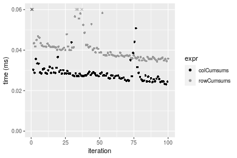
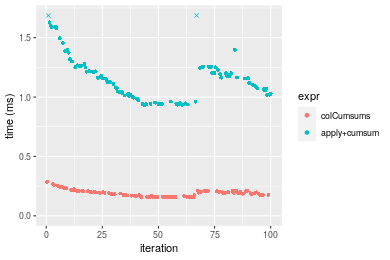

[matrixStats]: Benchmark report

---------------------------------------


# colCumsums() and rowCumsums() benchmarks

This report benchmark the performance of colCumsums() and rowCumsums() against alternative methods.

## Alternative methods

* apply() + cumsum()


## Data type "integer"

### Data
```r
> rmatrix <- function(nrow, ncol, mode = c("logical", "double", "integer", "index"), range = c(-100, 
+     +100), na_prob = 0) {
+     mode <- match.arg(mode)
+     n <- nrow * ncol
+     if (mode == "logical") {
+         x <- sample(c(FALSE, TRUE), size = n, replace = TRUE)
+     }     else if (mode == "index") {
+         x <- seq_len(n)
+         mode <- "integer"
+     }     else {
+         x <- runif(n, min = range[1], max = range[2])
+     }
+     storage.mode(x) <- mode
+     if (na_prob > 0) 
+         x[sample(n, size = na_prob * n)] <- NA
+     dim(x) <- c(nrow, ncol)
+     x
+ }
> rmatrices <- function(scale = 10, seed = 1, ...) {
+     set.seed(seed)
+     data <- list()
+     data[[1]] <- rmatrix(nrow = scale * 1, ncol = scale * 1, ...)
+     data[[2]] <- rmatrix(nrow = scale * 10, ncol = scale * 10, ...)
+     data[[3]] <- rmatrix(nrow = scale * 100, ncol = scale * 1, ...)
+     data[[4]] <- t(data[[3]])
+     data[[5]] <- rmatrix(nrow = scale * 10, ncol = scale * 100, ...)
+     data[[6]] <- t(data[[5]])
+     names(data) <- sapply(data, FUN = function(x) paste(dim(x), collapse = "x"))
+     data
+ }
> data <- rmatrices(mode = mode)
```

### Results

#### 10x10 integer matrix

```r
> X <- data[["10x10"]]
> gc()
          used  (Mb) gc trigger  (Mb) max used  (Mb)
Ncells 5226503 279.2    7916910 422.9  7916910 422.9
Vcells 9961868  76.1   33191153 253.3 53339345 407.0
> colStats <- microbenchmark(colCumsums = colCumsums(X), `apply+cumsum` = apply(X, MARGIN = 2L, FUN = cumsum), 
+     unit = "ms")
> X <- t(X)
> gc()
          used  (Mb) gc trigger  (Mb) max used  (Mb)
Ncells 5212610 278.4    7916910 422.9  7916910 422.9
Vcells 9915729  75.7   33191153 253.3 53339345 407.0
> rowStats <- microbenchmark(rowCumsums = rowCumsums(X), `apply+cumsum` = apply(X, MARGIN = 1L, FUN = cumsum), 
+     unit = "ms")
```

_Table: Benchmarking of colCumsums() and apply+cumsum() on integer+10x10 data. The top panel shows times in milliseconds and the bottom panel shows relative times._


|   |expr         |      min|       lq|      mean|   median|        uq|      max|
|:--|:------------|--------:|--------:|---------:|--------:|---------:|--------:|
|1  |colCumsums   | 0.002278| 0.002707| 0.0034123| 0.003059| 0.0038905| 0.013835|
|2  |apply+cumsum | 0.044732| 0.045870| 0.0475668| 0.046364| 0.0468820| 0.138939|


|   |expr         |      min|       lq|     mean|   median|       uq|      max|
|:--|:------------|--------:|--------:|--------:|--------:|--------:|--------:|
|1  |colCumsums   |  1.00000|  1.00000|  1.00000|  1.00000|  1.00000|  1.00000|
|2  |apply+cumsum | 19.63652| 16.94496| 13.93988| 15.15659| 12.05038| 10.04257|

_Table: Benchmarking of rowCumsums() and apply+cumsum() on integer+10x10 data (transposed). The top panel shows times in milliseconds and the bottom panel shows relative times._


|   |expr         |      min|        lq|      mean|    median|        uq|      max|
|:--|:------------|--------:|---------:|---------:|---------:|---------:|--------:|
|1  |rowCumsums   | 0.002422| 0.0029325| 0.0040383| 0.0037390| 0.0040845| 0.014181|
|2  |apply+cumsum | 0.042963| 0.0443370| 0.0538542| 0.0460005| 0.0498390| 0.146758|


|   |expr         |      min|       lq|     mean|   median|       uq|      max|
|:--|:------------|--------:|--------:|--------:|--------:|--------:|--------:|
|1  |rowCumsums   |  1.00000|  1.00000|  1.00000|  1.00000|  1.00000|  1.00000|
|2  |apply+cumsum | 17.73865| 15.11918| 13.33603| 12.30289| 12.20198| 10.34892|

_Figure: Benchmarking of colCumsums() and apply+cumsum() on integer+10x10 data  as well as rowCumsums() and apply+cumsum() on the same data transposed.  Outliers are displayed as crosses.  Times are in milliseconds._


_Table: Benchmarking of colCumsums() and rowCumsums() on integer+10x10 data (original and transposed).  The top panel shows times in milliseconds and the bottom panel shows relative times._


|   |expr       |   min|     lq|    mean| median|     uq|    max|
|:--|:----------|-----:|------:|-------:|------:|------:|------:|
|1  |colCumsums | 2.278| 2.7070| 3.41228|  3.059| 3.8905| 13.835|
|2  |rowCumsums | 2.422| 2.9325| 4.03825|  3.739| 4.0845| 14.181|


|   |expr       |      min|       lq|     mean|   median|       uq|      max|
|:--|:----------|--------:|--------:|--------:|--------:|--------:|--------:|
|1  |colCumsums | 1.000000| 1.000000| 1.000000| 1.000000| 1.000000| 1.000000|
|2  |rowCumsums | 1.063213| 1.083303| 1.183446| 1.222295| 1.049865| 1.025009|

_Figure: Benchmarking of colCumsums() and rowCumsums() on integer+10x10 data (original and transposed).  Outliers are displayed as crosses. Times are in milliseconds._


#### 100x100 integer matrix

```r
> X <- data[["100x100"]]
> gc()
          used  (Mb) gc trigger  (Mb) max used  (Mb)
Ncells 5211172 278.4    7916910 422.9  7916910 422.9
Vcells 9532221  72.8   33191153 253.3 53339345 407.0
> colStats <- microbenchmark(colCumsums = colCumsums(X), `apply+cumsum` = apply(X, MARGIN = 2L, FUN = cumsum), 
+     unit = "ms")
> X <- t(X)
> gc()
          used  (Mb) gc trigger  (Mb) max used  (Mb)
Ncells 5211166 278.4    7916910 422.9  7916910 422.9
Vcells 9537264  72.8   33191153 253.3 53339345 407.0
> rowStats <- microbenchmark(rowCumsums = rowCumsums(X), `apply+cumsum` = apply(X, MARGIN = 1L, FUN = cumsum), 
+     unit = "ms")
```

_Table: Benchmarking of colCumsums() and apply+cumsum() on integer+100x100 data. The top panel shows times in milliseconds and the bottom panel shows relative times._


|   |expr         |      min|       lq|      mean|    median|       uq|      max|
|:--|:------------|--------:|--------:|---------:|---------:|--------:|--------:|
|1  |colCumsums   | 0.022061| 0.023750| 0.0266040| 0.0246580| 0.026556| 0.090221|
|2  |apply+cumsum | 0.232339| 0.245513| 0.2698124| 0.2549345| 0.278076| 0.477796|


|   |expr         |      min|       lq|     mean|   median|       uq|     max|
|:--|:------------|--------:|--------:|--------:|--------:|--------:|-------:|
|1  |colCumsums   |  1.00000|  1.00000|  1.00000|  1.00000|  1.00000| 1.00000|
|2  |apply+cumsum | 10.53166| 10.33739| 10.14181| 10.33882| 10.47131| 5.29584|

_Table: Benchmarking of rowCumsums() and apply+cumsum() on integer+100x100 data (transposed). The top panel shows times in milliseconds and the bottom panel shows relative times._


|   |expr         |      min|       lq|      mean|   median|        uq|      max|
|:--|:------------|--------:|--------:|---------:|--------:|---------:|--------:|
|1  |rowCumsums   | 0.033106| 0.035911| 0.0397424| 0.038665| 0.0408545| 0.076372|
|2  |apply+cumsum | 0.244971| 0.255562| 0.2916267| 0.284571| 0.3080375| 0.543506|


|   |expr         |      min|       lq|     mean|   median|       uq|      max|
|:--|:------------|--------:|--------:|--------:|--------:|--------:|--------:|
|1  |rowCumsums   | 1.000000| 1.000000| 1.000000| 1.000000| 1.000000| 1.000000|
|2  |apply+cumsum | 7.399595| 7.116538| 7.337922| 7.359912| 7.539867| 7.116561|

_Figure: Benchmarking of colCumsums() and apply+cumsum() on integer+100x100 data  as well as rowCumsums() and apply+cumsum() on the same data transposed.  Outliers are displayed as crosses.  Times are in milliseconds._


_Table: Benchmarking of colCumsums() and rowCumsums() on integer+100x100 data (original and transposed).  The top panel shows times in milliseconds and the bottom panel shows relative times._


|   |expr       |    min|     lq|     mean| median|      uq|    max|
|:--|:----------|------:|------:|--------:|------:|-------:|------:|
|1  |colCumsums | 22.061| 23.750| 26.60396| 24.658| 26.5560| 90.221|
|2  |rowCumsums | 33.106| 35.911| 39.74241| 38.665| 40.8545| 76.372|


|   |expr       |      min|       lq|     mean|   median|       uq|       max|
|:--|:----------|--------:|--------:|--------:|--------:|--------:|---------:|
|1  |colCumsums | 1.000000| 1.000000| 1.000000| 1.000000| 1.000000| 1.0000000|
|2  |rowCumsums | 1.500657| 1.512042| 1.493853| 1.568051| 1.538428| 0.8464992|

_Figure: Benchmarking of colCumsums() and rowCumsums() on integer+100x100 data (original and transposed).  Outliers are displayed as crosses. Times are in milliseconds._


#### 1000x10 integer matrix

```r
> X <- data[["1000x10"]]
> gc()
          used  (Mb) gc trigger  (Mb) max used  (Mb)
Ncells 5211904 278.4    7916910 422.9  7916910 422.9
Vcells 9535729  72.8   33191153 253.3 53339345 407.0
> colStats <- microbenchmark(colCumsums = colCumsums(X), `apply+cumsum` = apply(X, MARGIN = 2L, FUN = cumsum), 
+     unit = "ms")
> X <- t(X)
> gc()
          used  (Mb) gc trigger  (Mb) max used  (Mb)
Ncells 5211898 278.4    7916910 422.9  7916910 422.9
Vcells 9540772  72.8   33191153 253.3 53339345 407.0
> rowStats <- microbenchmark(rowCumsums = rowCumsums(X), `apply+cumsum` = apply(X, MARGIN = 1L, FUN = cumsum), 
+     unit = "ms")
```

_Table: Benchmarking of colCumsums() and apply+cumsum() on integer+1000x10 data. The top panel shows times in milliseconds and the bottom panel shows relative times._


|   |expr         |      min|        lq|      mean|    median|        uq|      max|
|:--|:------------|--------:|---------:|---------:|---------:|---------:|--------:|
|1  |colCumsums   | 0.023164| 0.0262155| 0.0288144| 0.0275415| 0.0289715| 0.060915|
|2  |apply+cumsum | 0.153739| 0.1716840| 0.1853298| 0.1799110| 0.1937875| 0.314449|


|   |expr         |     min|      lq|     mean|  median|       uq|      max|
|:--|:------------|-------:|-------:|--------:|-------:|--------:|--------:|
|1  |colCumsums   | 1.00000| 1.00000| 1.000000| 1.00000| 1.000000| 1.000000|
|2  |apply+cumsum | 6.63698| 6.54895| 6.431839| 6.53236| 6.688901| 5.162095|

_Table: Benchmarking of rowCumsums() and apply+cumsum() on integer+1000x10 data (transposed). The top panel shows times in milliseconds and the bottom panel shows relative times._


|   |expr         |      min|        lq|      mean|   median|        uq|      max|
|:--|:------------|--------:|---------:|---------:|--------:|---------:|--------:|
|1  |rowCumsums   | 0.034434| 0.0365650| 0.0411813| 0.038978| 0.0417915| 0.072976|
|2  |apply+cumsum | 0.148096| 0.1534955| 0.1759504| 0.171227| 0.1783725| 0.384864|


|   |expr         |      min|       lq|     mean|   median|       uq|      max|
|:--|:------------|--------:|--------:|--------:|--------:|--------:|--------:|
|1  |rowCumsums   | 1.000000| 1.000000| 1.000000| 1.000000| 1.000000| 1.000000|
|2  |apply+cumsum | 4.300865| 4.197881| 4.272578| 4.392914| 4.268153| 5.273843|

_Figure: Benchmarking of colCumsums() and apply+cumsum() on integer+1000x10 data  as well as rowCumsums() and apply+cumsum() on the same data transposed.  Outliers are displayed as crosses.  Times are in milliseconds._


_Table: Benchmarking of colCumsums() and rowCumsums() on integer+1000x10 data (original and transposed).  The top panel shows times in milliseconds and the bottom panel shows relative times._


|   |expr       |    min|      lq|     mean|  median|      uq|    max|
|:--|:----------|------:|-------:|--------:|-------:|-------:|------:|
|1  |colCumsums | 23.164| 26.2155| 28.81443| 27.5415| 28.9715| 60.915|
|2  |rowCumsums | 34.434| 36.5650| 41.18133| 38.9780| 41.7915| 72.976|


|   |expr       |      min|       lq|     mean|   median|       uq|      max|
|:--|:----------|--------:|--------:|--------:|--------:|--------:|--------:|
|1  |colCumsums | 1.000000| 1.000000| 1.000000| 1.000000| 1.000000| 1.000000|
|2  |rowCumsums | 1.486531| 1.394786| 1.429191| 1.415246| 1.442504| 1.197997|

_Figure: Benchmarking of colCumsums() and rowCumsums() on integer+1000x10 data (original and transposed).  Outliers are displayed as crosses. Times are in milliseconds._




#### 10x1000 integer matrix

```r
> X <- data[["10x1000"]]
> gc()
          used  (Mb) gc trigger  (Mb) max used  (Mb)
Ncells 5212092 278.4    7916910 422.9  7916910 422.9
Vcells 9536418  72.8   33191153 253.3 53339345 407.0
> colStats <- microbenchmark(colCumsums = colCumsums(X), `apply+cumsum` = apply(X, MARGIN = 2L, FUN = cumsum), 
+     unit = "ms")
> X <- t(X)
> gc()
          used  (Mb) gc trigger  (Mb) max used  (Mb)
Ncells 5212086 278.4    7916910 422.9  7916910 422.9
Vcells 9541461  72.8   33191153 253.3 53339345 407.0
> rowStats <- microbenchmark(rowCumsums = rowCumsums(X), `apply+cumsum` = apply(X, MARGIN = 1L, FUN = cumsum), 
+     unit = "ms")
```

_Table: Benchmarking of colCumsums() and apply+cumsum() on integer+10x1000 data. The top panel shows times in milliseconds and the bottom panel shows relative times._


|   |expr         |      min|        lq|      mean|    median|       uq|      max|
|:--|:------------|--------:|---------:|---------:|---------:|--------:|--------:|
|1  |colCumsums   | 0.018293| 0.0195380| 0.0223278| 0.0211385| 0.024441| 0.041329|
|2  |apply+cumsum | 0.876124| 0.9043695| 1.0088345| 0.9613105| 1.104437| 1.434505|


|   |expr         |      min|       lq|     mean|   median|       uq|     max|
|:--|:------------|--------:|--------:|--------:|--------:|--------:|-------:|
|1  |colCumsums   |  1.00000|  1.00000|  1.00000|  1.00000|  1.00000|  1.0000|
|2  |apply+cumsum | 47.89395| 46.28772| 45.18299| 45.47676| 45.18788| 34.7094|

_Table: Benchmarking of rowCumsums() and apply+cumsum() on integer+10x1000 data (transposed). The top panel shows times in milliseconds and the bottom panel shows relative times._


|   |expr         |      min|        lq|      mean|    median|       uq|      max|
|:--|:------------|--------:|---------:|---------:|---------:|--------:|--------:|
|1  |rowCumsums   | 0.023917| 0.0252630| 0.0290411| 0.0270525| 0.031964| 0.049488|
|2  |apply+cumsum | 0.893217| 0.9071915| 1.0250141| 0.9846725| 1.133282| 1.487310|


|   |expr         |      min|       lq|     mean|   median|       uq|      max|
|:--|:------------|--------:|--------:|--------:|--------:|--------:|--------:|
|1  |rowCumsums   |  1.00000|  1.00000|  1.00000|  1.00000|  1.00000|  1.00000|
|2  |apply+cumsum | 37.34653| 35.90989| 35.29527| 36.39858| 35.45497| 30.05395|

_Figure: Benchmarking of colCumsums() and apply+cumsum() on integer+10x1000 data  as well as rowCumsums() and apply+cumsum() on the same data transposed.  Outliers are displayed as crosses.  Times are in milliseconds._


_Table: Benchmarking of colCumsums() and rowCumsums() on integer+10x1000 data (original and transposed).  The top panel shows times in milliseconds and the bottom panel shows relative times._


|   |expr       |    min|     lq|     mean|  median|     uq|    max|
|:--|:----------|------:|------:|--------:|-------:|------:|------:|
|1  |colCumsums | 18.293| 19.538| 22.32775| 21.1385| 24.441| 41.329|
|2  |rowCumsums | 23.917| 25.263| 29.04112| 27.0525| 31.964| 49.488|


|   |expr       |     min|       lq|     mean|   median|       uq|      max|
|:--|:----------|-------:|--------:|--------:|--------:|--------:|--------:|
|1  |colCumsums | 1.00000| 1.000000| 1.000000| 1.000000| 1.000000| 1.000000|
|2  |rowCumsums | 1.30744| 1.293019| 1.300674| 1.279774| 1.307802| 1.197416|

_Figure: Benchmarking of colCumsums() and rowCumsums() on integer+10x1000 data (original and transposed).  Outliers are displayed as crosses. Times are in milliseconds._


#### 100x1000 integer matrix

```r
> X <- data[["100x1000"]]
> gc()
          used  (Mb) gc trigger  (Mb) max used  (Mb)
Ncells 5212278 278.4    7916910 422.9  7916910 422.9
Vcells 9536905  72.8   33191153 253.3 53339345 407.0
> colStats <- microbenchmark(colCumsums = colCumsums(X), `apply+cumsum` = apply(X, MARGIN = 2L, FUN = cumsum), 
+     unit = "ms")
> X <- t(X)
> gc()
          used  (Mb) gc trigger  (Mb) max used  (Mb)
Ncells 5212266 278.4    7916910 422.9  7916910 422.9
Vcells 9586938  73.2   33191153 253.3 53339345 407.0
> rowStats <- microbenchmark(rowCumsums = rowCumsums(X), `apply+cumsum` = apply(X, MARGIN = 1L, FUN = cumsum), 
+     unit = "ms")
```

_Table: Benchmarking of colCumsums() and apply+cumsum() on integer+100x1000 data. The top panel shows times in milliseconds and the bottom panel shows relative times._


|   |expr         |      min|        lq|     mean|    median|       uq|      max|
|:--|:------------|--------:|---------:|--------:|---------:|--------:|--------:|
|1  |colCumsums   | 0.165376| 0.1728155| 0.208861| 0.1952225| 0.220419|  0.31994|
|2  |apply+cumsum | 1.702645| 1.7484045| 2.124853| 1.8557210| 2.164325| 16.71682|


|   |expr         |     min|       lq|     mean|   median|       uq|      max|
|:--|:------------|-------:|--------:|--------:|--------:|--------:|--------:|
|1  |colCumsums   |  1.0000|  1.00000|  1.00000| 1.000000| 1.000000|  1.00000|
|2  |apply+cumsum | 10.2956| 10.11717| 10.17353| 9.505672| 9.819138| 52.24986|

_Table: Benchmarking of rowCumsums() and apply+cumsum() on integer+100x1000 data (transposed). The top panel shows times in milliseconds and the bottom panel shows relative times._


|   |expr         |      min|       lq|     mean|    median|        uq|       max|
|:--|:------------|--------:|--------:|--------:|---------:|---------:|---------:|
|1  |rowCumsums   | 0.233452| 0.239689| 0.266635| 0.2497895| 0.2809225|  0.413261|
|2  |apply+cumsum | 1.706766| 1.778274| 2.161816| 1.8427445| 2.1507855| 16.897307|


|   |expr         |      min|       lq|     mean|  median|       uq|      max|
|:--|:------------|--------:|--------:|--------:|-------:|--------:|--------:|
|1  |rowCumsums   | 1.000000| 1.000000| 1.000000| 1.00000| 1.000000|  1.00000|
|2  |apply+cumsum | 7.310993| 7.419091| 8.107771| 7.37719| 7.656153| 40.88774|

_Figure: Benchmarking of colCumsums() and apply+cumsum() on integer+100x1000 data  as well as rowCumsums() and apply+cumsum() on the same data transposed.  Outliers are displayed as crosses.  Times are in milliseconds._


_Table: Benchmarking of colCumsums() and rowCumsums() on integer+100x1000 data (original and transposed).  The top panel shows times in milliseconds and the bottom panel shows relative times._


|   |expr       |     min|       lq|    mean|   median|       uq|     max|
|:--|:----------|-------:|--------:|-------:|--------:|--------:|-------:|
|1  |colCumsums | 165.376| 172.8155| 208.861| 195.2225| 220.4190| 319.940|
|2  |rowCumsums | 233.452| 239.6890| 266.635| 249.7895| 280.9225| 413.261|


|   |expr       |      min|       lq|     mean|   median|       uq|      max|
|:--|:----------|--------:|--------:|--------:|--------:|--------:|--------:|
|1  |colCumsums | 1.000000| 1.000000| 1.000000| 1.000000| 1.000000| 1.000000|
|2  |rowCumsums | 1.411644| 1.386965| 1.276615| 1.279512| 1.274493| 1.291683|

_Figure: Benchmarking of colCumsums() and rowCumsums() on integer+100x1000 data (original and transposed).  Outliers are displayed as crosses. Times are in milliseconds._


#### 1000x100 integer matrix

```r
> X <- data[["1000x100"]]
> gc()
          used  (Mb) gc trigger  (Mb) max used  (Mb)
Ncells 5212471 278.4    7916910 422.9  7916910 422.9
Vcells 9537470  72.8   33191153 253.3 53339345 407.0
> colStats <- microbenchmark(colCumsums = colCumsums(X), `apply+cumsum` = apply(X, MARGIN = 2L, FUN = cumsum), 
+     unit = "ms")
> X <- t(X)
> gc()
          used  (Mb) gc trigger  (Mb) max used  (Mb)
Ncells 5212465 278.4    7916910 422.9  7916910 422.9
Vcells 9587513  73.2   33191153 253.3 53339345 407.0
> rowStats <- microbenchmark(rowCumsums = rowCumsums(X), `apply+cumsum` = apply(X, MARGIN = 1L, FUN = cumsum), 
+     unit = "ms")
```

_Table: Benchmarking of colCumsums() and apply+cumsum() on integer+1000x100 data. The top panel shows times in milliseconds and the bottom panel shows relative times._


|   |expr         |      min|        lq|      mean|   median|       uq|      max|
|:--|:------------|--------:|---------:|---------:|--------:|--------:|--------:|
|1  |colCumsums   | 0.157979| 0.1611115| 0.1896346| 0.188222| 0.206122| 0.285872|
|2  |apply+cumsum | 0.933707| 1.0044370| 1.2173664| 1.156057| 1.250851| 7.971091|


|   |expr         |      min|       lq|     mean|   median|       uq|      max|
|:--|:------------|--------:|--------:|--------:|--------:|--------:|--------:|
|1  |colCumsums   | 1.000000| 1.000000| 1.000000| 1.000000| 1.000000|  1.00000|
|2  |apply+cumsum | 5.910323| 6.234421| 6.419536| 6.141989| 6.068498| 27.88343|

_Table: Benchmarking of rowCumsums() and apply+cumsum() on integer+1000x100 data (transposed). The top panel shows times in milliseconds and the bottom panel shows relative times._


|   |expr         |      min|        lq|      mean|   median|       uq|      max|
|:--|:------------|--------:|---------:|---------:|--------:|--------:|--------:|
|1  |rowCumsums   | 0.240847| 0.2528475| 0.2834285| 0.271229| 0.311126| 0.410411|
|2  |apply+cumsum | 0.938000| 0.9535505| 1.2044704| 1.081750| 1.226506| 7.897673|


|   |expr         |      min|       lq|     mean|   median|       uq|      max|
|:--|:------------|--------:|--------:|--------:|--------:|--------:|--------:|
|1  |rowCumsums   | 1.000000| 1.000000| 1.000000| 1.000000| 1.000000|  1.00000|
|2  |apply+cumsum | 3.894589| 3.771247| 4.249644| 3.988327| 3.942154| 19.24333|

_Figure: Benchmarking of colCumsums() and apply+cumsum() on integer+1000x100 data  as well as rowCumsums() and apply+cumsum() on the same data transposed.  Outliers are displayed as crosses.  Times are in milliseconds._





_Table: Benchmarking of colCumsums() and rowCumsums() on integer+1000x100 data (original and transposed).  The top panel shows times in milliseconds and the bottom panel shows relative times._


|   |expr       |     min|       lq|     mean|  median|      uq|     max|
|:--|:----------|-------:|--------:|--------:|-------:|-------:|-------:|
|1  |colCumsums | 157.979| 161.1115| 189.6346| 188.222| 206.122| 285.872|
|2  |rowCumsums | 240.847| 252.8475| 283.4285| 271.229| 311.126| 410.411|


|   |expr       |      min|       lq|     mean|   median|       uq|      max|
|:--|:----------|--------:|--------:|--------:|--------:|--------:|--------:|
|1  |colCumsums | 1.000000| 1.000000| 1.000000| 1.000000| 1.000000| 1.000000|
|2  |rowCumsums | 1.524551| 1.569395| 1.494603| 1.441006| 1.509427| 1.435646|

_Figure: Benchmarking of colCumsums() and rowCumsums() on integer+1000x100 data (original and transposed).  Outliers are displayed as crosses. Times are in milliseconds._


## Data type "double"

### Data
```r
> rmatrix <- function(nrow, ncol, mode = c("logical", "double", "integer", "index"), range = c(-100, 
+     +100), na_prob = 0) {
+     mode <- match.arg(mode)
+     n <- nrow * ncol
+     if (mode == "logical") {
+         x <- sample(c(FALSE, TRUE), size = n, replace = TRUE)
+     }     else if (mode == "index") {
+         x <- seq_len(n)
+         mode <- "integer"
+     }     else {
+         x <- runif(n, min = range[1], max = range[2])
+     }
+     storage.mode(x) <- mode
+     if (na_prob > 0) 
+         x[sample(n, size = na_prob * n)] <- NA
+     dim(x) <- c(nrow, ncol)
+     x
+ }
> rmatrices <- function(scale = 10, seed = 1, ...) {
+     set.seed(seed)
+     data <- list()
+     data[[1]] <- rmatrix(nrow = scale * 1, ncol = scale * 1, ...)
+     data[[2]] <- rmatrix(nrow = scale * 10, ncol = scale * 10, ...)
+     data[[3]] <- rmatrix(nrow = scale * 100, ncol = scale * 1, ...)
+     data[[4]] <- t(data[[3]])
+     data[[5]] <- rmatrix(nrow = scale * 10, ncol = scale * 100, ...)
+     data[[6]] <- t(data[[5]])
+     names(data) <- sapply(data, FUN = function(x) paste(dim(x), collapse = "x"))
+     data
+ }
> data <- rmatrices(mode = mode)
```

### Results

#### 10x10 double matrix

```r
> X <- data[["10x10"]]
> gc()
          used  (Mb) gc trigger  (Mb) max used  (Mb)
Ncells 5212671 278.4    7916910 422.9  7916910 422.9
Vcells 9653182  73.7   33191153 253.3 53339345 407.0
> colStats <- microbenchmark(colCumsums = colCumsums(X), `apply+cumsum` = apply(X, MARGIN = 2L, FUN = cumsum), 
+     unit = "ms")
> X <- t(X)
> gc()
          used  (Mb) gc trigger  (Mb) max used  (Mb)
Ncells 5212656 278.4    7916910 422.9  7916910 422.9
Vcells 9653310  73.7   33191153 253.3 53339345 407.0
> rowStats <- microbenchmark(rowCumsums = rowCumsums(X), `apply+cumsum` = apply(X, MARGIN = 1L, FUN = cumsum), 
+     unit = "ms")
```

_Table: Benchmarking of colCumsums() and apply+cumsum() on double+10x10 data. The top panel shows times in milliseconds and the bottom panel shows relative times._


|   |expr         |      min|        lq|      mean|    median|        uq|      max|
|:--|:------------|--------:|---------:|---------:|---------:|---------:|--------:|
|1  |colCumsums   | 0.002246| 0.0025490| 0.0033277| 0.0029560| 0.0037935| 0.016422|
|2  |apply+cumsum | 0.044421| 0.0458615| 0.0486451| 0.0464835| 0.0472070| 0.161339|


|   |expr         |      min|       lq|     mean|   median|       uq|      max|
|:--|:------------|--------:|--------:|--------:|--------:|--------:|--------:|
|1  |colCumsums   |  1.00000|  1.00000|  1.00000|  1.00000|  1.00000| 1.000000|
|2  |apply+cumsum | 19.77783| 17.99196| 14.61832| 15.72514| 12.44418| 9.824565|

_Table: Benchmarking of rowCumsums() and apply+cumsum() on double+10x10 data (transposed). The top panel shows times in milliseconds and the bottom panel shows relative times._


|   |expr         |      min|        lq|      mean|   median|        uq|      max|
|:--|:------------|--------:|---------:|---------:|--------:|---------:|--------:|
|1  |rowCumsums   | 0.002213| 0.0026925| 0.0034486| 0.003605| 0.0037530| 0.015736|
|2  |apply+cumsum | 0.044530| 0.0457105| 0.0474352| 0.046100| 0.0465115| 0.149849|


|   |expr         |      min|       lq|     mean|   median|       uq|      max|
|:--|:------------|--------:|--------:|--------:|--------:|--------:|--------:|
|1  |rowCumsums   |  1.00000|  1.00000|  1.00000|  1.00000|  1.00000| 1.000000|
|2  |apply+cumsum | 20.12201| 16.97697| 13.75492| 12.78779| 12.39315| 9.522687|

_Figure: Benchmarking of colCumsums() and apply+cumsum() on double+10x10 data  as well as rowCumsums() and apply+cumsum() on the same data transposed.  Outliers are displayed as crosses.  Times are in milliseconds._


_Table: Benchmarking of colCumsums() and rowCumsums() on double+10x10 data (original and transposed).  The top panel shows times in milliseconds and the bottom panel shows relative times._


|   |expr       |   min|     lq|    mean| median|     uq|    max|
|:--|:----------|-----:|------:|-------:|------:|------:|------:|
|1  |colCumsums | 2.246| 2.5490| 3.32768|  2.956| 3.7935| 16.422|
|2  |rowCumsums | 2.213| 2.6925| 3.44860|  3.605| 3.7530| 15.736|


|   |expr       |       min|       lq|     mean|   median|        uq|       max|
|:--|:----------|---------:|--------:|--------:|--------:|---------:|---------:|
|1  |colCumsums | 1.0000000| 1.000000| 1.000000| 1.000000| 1.0000000| 1.0000000|
|2  |rowCumsums | 0.9853072| 1.056297| 1.036338| 1.219553| 0.9893238| 0.9582268|

_Figure: Benchmarking of colCumsums() and rowCumsums() on double+10x10 data (original and transposed).  Outliers are displayed as crosses. Times are in milliseconds._


#### 100x100 double matrix

```r
> X <- data[["100x100"]]
> gc()
          used  (Mb) gc trigger  (Mb) max used  (Mb)
Ncells 5212846 278.4    7916910 422.9  7916910 422.9
Vcells 9654002  73.7   33191153 253.3 53339345 407.0
> colStats <- microbenchmark(colCumsums = colCumsums(X), `apply+cumsum` = apply(X, MARGIN = 2L, FUN = cumsum), 
+     unit = "ms")
> X <- t(X)
> gc()
          used  (Mb) gc trigger  (Mb) max used  (Mb)
Ncells 5212840 278.4    7916910 422.9  7916910 422.9
Vcells 9664045  73.8   33191153 253.3 53339345 407.0
> rowStats <- microbenchmark(rowCumsums = rowCumsums(X), `apply+cumsum` = apply(X, MARGIN = 1L, FUN = cumsum), 
+     unit = "ms")
```

_Table: Benchmarking of colCumsums() and apply+cumsum() on double+100x100 data. The top panel shows times in milliseconds and the bottom panel shows relative times._


|   |expr         |      min|        lq|      mean|    median|        uq|      max|
|:--|:------------|--------:|---------:|---------:|---------:|---------:|--------:|
|1  |colCumsums   | 0.013719| 0.0152435| 0.0190947| 0.0161920| 0.0183730| 0.109809|
|2  |apply+cumsum | 0.230781| 0.2427330| 0.2941777| 0.2674925| 0.3097775| 0.684934|


|   |expr         |    min|       lq|     mean|   median|       uq|      max|
|:--|:------------|------:|--------:|--------:|--------:|--------:|--------:|
|1  |colCumsums   |  1.000|  1.00000|  1.00000|  1.00000|  1.00000| 1.000000|
|2  |apply+cumsum | 16.822| 15.92371| 15.40622| 16.52004| 16.86047| 6.237503|

_Table: Benchmarking of rowCumsums() and apply+cumsum() on double+100x100 data (transposed). The top panel shows times in milliseconds and the bottom panel shows relative times._


|   |expr         |      min|        lq|      mean|    median|        uq|      max|
|:--|:------------|--------:|---------:|---------:|---------:|---------:|--------:|
|1  |rowCumsums   | 0.010698| 0.0121060| 0.0138545| 0.0127970| 0.0141175| 0.025811|
|2  |apply+cumsum | 0.232530| 0.2462635| 0.2829568| 0.2670155| 0.3001925| 0.596969|


|   |expr         |      min|       lq|     mean|   median|       uq|      max|
|:--|:------------|--------:|--------:|--------:|--------:|--------:|--------:|
|1  |rowCumsums   |  1.00000|  1.00000|  1.00000|  1.00000|  1.00000|  1.00000|
|2  |apply+cumsum | 21.73584| 20.34227| 20.42342| 20.86548| 21.26386| 23.12847|

_Figure: Benchmarking of colCumsums() and apply+cumsum() on double+100x100 data  as well as rowCumsums() and apply+cumsum() on the same data transposed.  Outliers are displayed as crosses.  Times are in milliseconds._


_Table: Benchmarking of colCumsums() and rowCumsums() on double+100x100 data (original and transposed).  The top panel shows times in milliseconds and the bottom panel shows relative times._


|   |expr       |    min|      lq|     mean| median|      uq|     max|
|:--|:----------|------:|-------:|--------:|------:|-------:|-------:|
|2  |rowCumsums | 10.698| 12.1060| 13.85453| 12.797| 14.1175|  25.811|
|1  |colCumsums | 13.719| 15.2435| 19.09473| 16.192| 18.3730| 109.809|


|   |expr       |      min|       lq|    mean|   median|       uq|      max|
|:--|:----------|--------:|--------:|-------:|--------:|--------:|--------:|
|2  |rowCumsums | 1.000000| 1.000000| 1.00000| 1.000000| 1.000000| 1.000000|
|1  |colCumsums | 1.282389| 1.259169| 1.37823| 1.265297| 1.301434| 4.254349|

_Figure: Benchmarking of colCumsums() and rowCumsums() on double+100x100 data (original and transposed).  Outliers are displayed as crosses. Times are in milliseconds._


#### 1000x10 double matrix

```r
> X <- data[["1000x10"]]
> gc()
          used  (Mb) gc trigger  (Mb) max used  (Mb)
Ncells 5213038 278.5    7916910 422.9  7916910 422.9
Vcells 9654907  73.7   33191153 253.3 53339345 407.0
> colStats <- microbenchmark(colCumsums = colCumsums(X), `apply+cumsum` = apply(X, MARGIN = 2L, FUN = cumsum), 
+     unit = "ms")
> X <- t(X)
> gc()
          used  (Mb) gc trigger  (Mb) max used  (Mb)
Ncells 5213032 278.5    7916910 422.9  7916910 422.9
Vcells 9664950  73.8   33191153 253.3 53339345 407.0
> rowStats <- microbenchmark(rowCumsums = rowCumsums(X), `apply+cumsum` = apply(X, MARGIN = 1L, FUN = cumsum), 
+     unit = "ms")
```

_Table: Benchmarking of colCumsums() and apply+cumsum() on double+1000x10 data. The top panel shows times in milliseconds and the bottom panel shows relative times._


|   |expr         |      min|        lq|      mean|   median|       uq|     max|
|:--|:------------|--------:|---------:|---------:|--------:|--------:|-------:|
|1  |colCumsums   | 0.016662| 0.0187350| 0.0207255| 0.019895| 0.021390| 0.05948|
|2  |apply+cumsum | 0.152046| 0.1639515| 0.1848770| 0.180297| 0.196685| 0.30003|


|   |expr         |      min|       lq|     mean|   median|       uq|      max|
|:--|:------------|--------:|--------:|--------:|--------:|--------:|--------:|
|1  |colCumsums   | 1.000000| 1.000000| 1.000000| 1.000000| 1.000000| 1.000000|
|2  |apply+cumsum | 9.125315| 8.751081| 8.920278| 9.062428| 9.195185| 5.044217|

_Table: Benchmarking of rowCumsums() and apply+cumsum() on double+1000x10 data (transposed). The top panel shows times in milliseconds and the bottom panel shows relative times._


|   |expr         |      min|        lq|      mean|   median|       uq|      max|
|:--|:------------|--------:|---------:|---------:|--------:|--------:|--------:|
|1  |rowCumsums   | 0.013276| 0.0144580| 0.0169073| 0.015806| 0.017651| 0.052774|
|2  |apply+cumsum | 0.145198| 0.1517435| 0.1751258| 0.170163| 0.185089| 0.368591|


|   |expr         |      min|       lq|     mean|   median|       uq|      max|
|:--|:------------|--------:|--------:|--------:|--------:|--------:|--------:|
|1  |rowCumsums   |  1.00000|  1.00000|  1.00000|  1.00000|  1.00000| 1.000000|
|2  |apply+cumsum | 10.93688| 10.49547| 10.35798| 10.76572| 10.48603| 6.984329|

_Figure: Benchmarking of colCumsums() and apply+cumsum() on double+1000x10 data  as well as rowCumsums() and apply+cumsum() on the same data transposed.  Outliers are displayed as crosses.  Times are in milliseconds._


_Table: Benchmarking of colCumsums() and rowCumsums() on double+1000x10 data (original and transposed).  The top panel shows times in milliseconds and the bottom panel shows relative times._


|   |expr       |    min|     lq|     mean| median|     uq|    max|
|:--|:----------|------:|------:|--------:|------:|------:|------:|
|2  |rowCumsums | 13.276| 14.458| 16.90733| 15.806| 17.651| 52.774|
|1  |colCumsums | 16.662| 18.735| 20.72547| 19.895| 21.390| 59.480|


|   |expr       |      min|       lq|     mean|   median|       uq|     max|
|:--|:----------|--------:|--------:|--------:|--------:|--------:|-------:|
|2  |rowCumsums | 1.000000| 1.000000| 1.000000| 1.000000| 1.000000| 1.00000|
|1  |colCumsums | 1.255047| 1.295822| 1.225828| 1.258699| 1.211829| 1.12707|

_Figure: Benchmarking of colCumsums() and rowCumsums() on double+1000x10 data (original and transposed).  Outliers are displayed as crosses. Times are in milliseconds._


#### 10x1000 double matrix

```r
> X <- data[["10x1000"]]
> gc()
          used  (Mb) gc trigger  (Mb) max used  (Mb)
Ncells 5213226 278.5    7916910 422.9  7916910 422.9
Vcells 9655032  73.7   33191153 253.3 53339345 407.0
> colStats <- microbenchmark(colCumsums = colCumsums(X), `apply+cumsum` = apply(X, MARGIN = 2L, FUN = cumsum), 
+     unit = "ms")
> X <- t(X)
> gc()
          used  (Mb) gc trigger  (Mb) max used  (Mb)
Ncells 5213220 278.5    7916910 422.9  7916910 422.9
Vcells 9665075  73.8   33191153 253.3 53339345 407.0
> rowStats <- microbenchmark(rowCumsums = rowCumsums(X), `apply+cumsum` = apply(X, MARGIN = 1L, FUN = cumsum), 
+     unit = "ms")
```

_Table: Benchmarking of colCumsums() and apply+cumsum() on double+10x1000 data. The top panel shows times in milliseconds and the bottom panel shows relative times._


|   |expr         |      min|        lq|      mean|   median|        uq|      max|
|:--|:------------|--------:|---------:|---------:|--------:|---------:|--------:|
|1  |colCumsums   | 0.008864| 0.0111405| 0.0142059| 0.013116| 0.0151935| 0.033082|
|2  |apply+cumsum | 0.865354| 0.9370735| 1.0609918| 1.045918| 1.1338155| 1.774160|


|   |expr         |      min|       lq|     mean|   median|       uq|      max|
|:--|:------------|--------:|--------:|--------:|--------:|--------:|--------:|
|1  |colCumsums   |  1.00000|  1.00000|  1.00000|  1.00000|  1.00000|  1.00000|
|2  |apply+cumsum | 97.62568| 84.11413| 74.68681| 79.74367| 74.62504| 53.62916|

_Table: Benchmarking of rowCumsums() and apply+cumsum() on double+10x1000 data (transposed). The top panel shows times in milliseconds and the bottom panel shows relative times._


|   |expr         |      min|        lq|      mean|    median|        uq|      max|
|:--|:------------|--------:|---------:|---------:|---------:|---------:|--------:|
|1  |rowCumsums   | 0.007737| 0.0097975| 0.0126345| 0.0111965| 0.0137065| 0.042369|
|2  |apply+cumsum | 0.860312| 0.9016980| 1.0196333| 0.9785475| 1.0969060| 1.778533|


|   |expr         |      min|       lq|     mean|   median|       uq|      max|
|:--|:------------|--------:|--------:|--------:|--------:|--------:|--------:|
|1  |rowCumsums   |   1.0000|  1.00000|  1.00000|  1.00000|  1.00000|  1.00000|
|2  |apply+cumsum | 111.1945| 92.03348| 80.70237| 87.39762| 80.02816| 41.97722|

_Figure: Benchmarking of colCumsums() and apply+cumsum() on double+10x1000 data  as well as rowCumsums() and apply+cumsum() on the same data transposed.  Outliers are displayed as crosses.  Times are in milliseconds._


_Table: Benchmarking of colCumsums() and rowCumsums() on double+10x1000 data (original and transposed).  The top panel shows times in milliseconds and the bottom panel shows relative times._


|   |expr       |   min|      lq|     mean|  median|      uq|    max|
|:--|:----------|-----:|-------:|--------:|-------:|-------:|------:|
|2  |rowCumsums | 7.737|  9.7975| 12.63449| 11.1965| 13.7065| 42.369|
|1  |colCumsums | 8.864| 11.1405| 14.20588| 13.1160| 15.1935| 33.082|


|   |expr       |      min|       lq|     mean|   median|       uq|       max|
|:--|:----------|--------:|--------:|--------:|--------:|--------:|---------:|
|2  |rowCumsums | 1.000000| 1.000000| 1.000000| 1.000000| 1.000000| 1.0000000|
|1  |colCumsums | 1.145664| 1.137076| 1.124373| 1.171437| 1.108489| 0.7808067|

_Figure: Benchmarking of colCumsums() and rowCumsums() on double+10x1000 data (original and transposed).  Outliers are displayed as crosses. Times are in milliseconds._


#### 100x1000 double matrix

```r
> X <- data[["100x1000"]]
> gc()
          used  (Mb) gc trigger  (Mb) max used  (Mb)
Ncells 5213412 278.5    7916910 422.9  7916910 422.9
Vcells 9656087  73.7   33191153 253.3 53339345 407.0
> colStats <- microbenchmark(colCumsums = colCumsums(X), `apply+cumsum` = apply(X, MARGIN = 2L, FUN = cumsum), 
+     unit = "ms")
> X <- t(X)
> gc()
          used  (Mb) gc trigger  (Mb) max used  (Mb)
Ncells 5213400 278.5    7916910 422.9  7916910 422.9
Vcells 9756120  74.5   33191153 253.3 53339345 407.0
> rowStats <- microbenchmark(rowCumsums = rowCumsums(X), `apply+cumsum` = apply(X, MARGIN = 1L, FUN = cumsum), 
+     unit = "ms")
```

_Table: Benchmarking of colCumsums() and apply+cumsum() on double+100x1000 data. The top panel shows times in milliseconds and the bottom panel shows relative times._


|   |expr         |      min|        lq|      mean|    median|       uq|       max|
|:--|:------------|--------:|---------:|---------:|---------:|--------:|---------:|
|1  |colCumsums   | 0.093477| 0.1151905| 0.1383346| 0.1265555| 0.146074|  0.428721|
|2  |apply+cumsum | 1.624217| 1.9158050| 2.4034007| 2.0877540| 2.351233| 16.458542|


|   |expr         |      min|       lq|     mean|   median|       uq|      max|
|:--|:------------|--------:|--------:|--------:|--------:|--------:|--------:|
|1  |colCumsums   |  1.00000|  1.00000|  1.00000|  1.00000|  1.00000|  1.00000|
|2  |apply+cumsum | 17.37558| 16.63162| 17.37383| 16.49675| 16.09617| 38.38987|

_Table: Benchmarking of rowCumsums() and apply+cumsum() on double+100x1000 data (transposed). The top panel shows times in milliseconds and the bottom panel shows relative times._


|   |expr         |      min|        lq|      mean|   median|        uq|       max|
|:--|:------------|--------:|---------:|---------:|--------:|---------:|---------:|
|1  |rowCumsums   | 0.069672| 0.0827205| 0.0948781| 0.091741| 0.1043975|  0.178666|
|2  |apply+cumsum | 1.664966| 1.8916655| 2.3568622| 2.064633| 2.2148785| 16.044517|


|   |expr         |     min|       lq|     mean|   median|       uq|      max|
|:--|:------------|-------:|--------:|--------:|--------:|--------:|--------:|
|1  |rowCumsums   |  1.0000|  1.00000|  1.00000|  1.00000|  1.00000|  1.00000|
|2  |apply+cumsum | 23.8972| 22.86816| 24.84094| 22.50501| 21.21582| 89.80174|

_Figure: Benchmarking of colCumsums() and apply+cumsum() on double+100x1000 data  as well as rowCumsums() and apply+cumsum() on the same data transposed.  Outliers are displayed as crosses.  Times are in milliseconds._


_Table: Benchmarking of colCumsums() and rowCumsums() on double+100x1000 data (original and transposed).  The top panel shows times in milliseconds and the bottom panel shows relative times._


|   |expr       |    min|       lq|      mean|   median|       uq|     max|
|:--|:----------|------:|--------:|---------:|--------:|--------:|-------:|
|2  |rowCumsums | 69.672|  82.7205|  94.87815|  91.7410| 104.3975| 178.666|
|1  |colCumsums | 93.477| 115.1905| 138.33456| 126.5555| 146.0740| 428.721|


|   |expr       |      min|       lq|     mean|   median|      uq|      max|
|:--|:----------|--------:|--------:|--------:|--------:|-------:|--------:|
|2  |rowCumsums | 1.000000| 1.000000| 1.000000| 1.000000| 1.00000| 1.000000|
|1  |colCumsums | 1.341672| 1.392527| 1.458023| 1.379487| 1.39921| 2.399567|

_Figure: Benchmarking of colCumsums() and rowCumsums() on double+100x1000 data (original and transposed).  Outliers are displayed as crosses. Times are in milliseconds._


#### 1000x100 double matrix

```r
> X <- data[["1000x100"]]
> gc()
          used  (Mb) gc trigger  (Mb) max used  (Mb)
Ncells 5213605 278.5    7916910 422.9  7916910 422.9
Vcells 9656213  73.7   33191153 253.3 53339345 407.0
> colStats <- microbenchmark(colCumsums = colCumsums(X), `apply+cumsum` = apply(X, MARGIN = 2L, FUN = cumsum), 
+     unit = "ms")
> X <- t(X)
> gc()
          used  (Mb) gc trigger  (Mb) max used  (Mb)
Ncells 5213599 278.5    7916910 422.9  7916910 422.9
Vcells 9756256  74.5   33191153 253.3 53339345 407.0
> rowStats <- microbenchmark(rowCumsums = rowCumsums(X), `apply+cumsum` = apply(X, MARGIN = 1L, FUN = cumsum), 
+     unit = "ms")
```

_Table: Benchmarking of colCumsums() and apply+cumsum() on double+1000x100 data. The top panel shows times in milliseconds and the bottom panel shows relative times._


|   |expr         |      min|        lq|      mean|    median|       uq|      max|
|:--|:------------|--------:|---------:|---------:|---------:|--------:|--------:|
|1  |colCumsums   | 0.119729| 0.1302805| 0.1451242| 0.1392615| 0.150550| 0.237169|
|2  |apply+cumsum | 1.016016| 1.1154795| 1.3228116| 1.1700515| 1.238112| 7.165728|


|   |expr         |      min|       lq|     mean|  median|       uq|      max|
|:--|:------------|--------:|--------:|--------:|-------:|--------:|--------:|
|1  |colCumsums   | 1.000000| 1.000000| 1.000000| 1.00000| 1.000000|  1.00000|
|2  |apply+cumsum | 8.485964| 8.562137| 9.115031| 8.40183| 8.223926| 30.21359|

_Table: Benchmarking of rowCumsums() and apply+cumsum() on double+1000x100 data (transposed). The top panel shows times in milliseconds and the bottom panel shows relative times._


|   |expr         |      min|        lq|      mean|   median|       uq|      max|
|:--|:------------|--------:|---------:|---------:|--------:|--------:|--------:|
|1  |rowCumsums   | 0.085070| 0.0943095| 0.1145056| 0.104183| 0.117703| 0.306502|
|2  |apply+cumsum | 1.170405| 1.2400040| 1.5206206| 1.341770| 1.490292| 8.052489|


|   |expr         |      min|       lq|     mean|   median|       uq|      max|
|:--|:------------|--------:|--------:|--------:|--------:|--------:|--------:|
|1  |rowCumsums   |  1.00000|  1.00000|  1.00000|  1.00000|  1.00000|  1.00000|
|2  |apply+cumsum | 13.75814| 13.14824| 13.27989| 12.87897| 12.66146| 26.27222|

_Figure: Benchmarking of colCumsums() and apply+cumsum() on double+1000x100 data  as well as rowCumsums() and apply+cumsum() on the same data transposed.  Outliers are displayed as crosses.  Times are in milliseconds._


_Table: Benchmarking of colCumsums() and rowCumsums() on double+1000x100 data (original and transposed).  The top panel shows times in milliseconds and the bottom panel shows relative times._


|   |expr       |     min|       lq|     mean|   median|      uq|     max|
|:--|:----------|-------:|--------:|--------:|--------:|-------:|-------:|
|2  |rowCumsums |  85.070|  94.3095| 114.5055| 104.1830| 117.703| 306.502|
|1  |colCumsums | 119.729| 130.2805| 145.1242| 139.2615| 150.550| 237.169|


|   |expr       |      min|       lq|     mean|   median|       uq|       max|
|:--|:----------|--------:|--------:|--------:|--------:|--------:|---------:|
|2  |rowCumsums | 1.000000| 1.000000| 1.000000| 1.000000| 1.000000| 1.0000000|
|1  |colCumsums | 1.407417| 1.381414| 1.267399| 1.336701| 1.279067| 0.7737927|

_Figure: Benchmarking of colCumsums() and rowCumsums() on double+1000x100 data (original and transposed).  Outliers are displayed as crosses. Times are in milliseconds._


## Appendix

### Session information
```r
R version 4.1.1 Patched (2021-08-10 r80727)
Platform: x86_64-pc-linux-gnu (64-bit)
Running under: Ubuntu 18.04.5 LTS

Matrix products: default
BLAS:   /home/hb/software/R-devel/R-4-1-branch/lib/R/lib/libRblas.so
LAPACK: /home/hb/software/R-devel/R-4-1-branch/lib/R/lib/libRlapack.so

locale:
 [1] LC_CTYPE=en_US.UTF-8       LC_NUMERIC=C              
 [3] LC_TIME=en_US.UTF-8        LC_COLLATE=en_US.UTF-8    
 [5] LC_MONETARY=en_US.UTF-8    LC_MESSAGES=en_US.UTF-8   
 [7] LC_PAPER=en_US.UTF-8       LC_NAME=C                 
 [9] LC_ADDRESS=C               LC_TELEPHONE=C            
[11] LC_MEASUREMENT=en_US.UTF-8 LC_IDENTIFICATION=C       

attached base packages:
[1] stats     graphics  grDevices utils     datasets  methods   base     

other attached packages:
[1] microbenchmark_1.4-7   matrixStats_0.60.0     ggplot2_3.3.5         
[4] knitr_1.33             R.devices_2.17.0       R.utils_2.10.1        
[7] R.oo_1.24.0            R.methodsS3_1.8.1-9001 history_0.0.1-9000    

loaded via a namespace (and not attached):
 [1] Biobase_2.52.0          httr_1.4.2              splines_4.1.1          
 [4] bit64_4.0.5             network_1.17.1          assertthat_0.2.1       
 [7] highr_0.9               stats4_4.1.1            blob_1.2.2             
[10] GenomeInfoDbData_1.2.6  robustbase_0.93-8       pillar_1.6.2           
[13] RSQLite_2.2.8           lattice_0.20-44         glue_1.4.2             
[16] digest_0.6.27           XVector_0.32.0          colorspace_2.0-2       
[19] Matrix_1.3-4            XML_3.99-0.7            pkgconfig_2.0.3        
[22] zlibbioc_1.38.0         genefilter_1.74.0       purrr_0.3.4            
[25] ergm_4.1.2              xtable_1.8-4            scales_1.1.1           
[28] tibble_3.1.4            annotate_1.70.0         KEGGREST_1.32.0        
[31] farver_2.1.0            generics_0.1.0          IRanges_2.26.0         
[34] ellipsis_0.3.2          cachem_1.0.6            withr_2.4.2            
[37] BiocGenerics_0.38.0     mime_0.11               survival_3.2-13        
[40] magrittr_2.0.1          crayon_1.4.1            statnet.common_4.5.0   
[43] memoise_2.0.0           laeken_0.5.1            fansi_0.5.0            
[46] R.cache_0.15.0          MASS_7.3-54             R.rsp_0.44.0           
[49] progressr_0.8.0         tools_4.1.1             lifecycle_1.0.0        
[52] S4Vectors_0.30.0        trust_0.1-8             munsell_0.5.0          
[55] tabby_0.0.1-9001        AnnotationDbi_1.54.1    Biostrings_2.60.2      
[58] compiler_4.1.1          GenomeInfoDb_1.28.1     rlang_0.4.11           
[61] grid_4.1.1              RCurl_1.98-1.4          cwhmisc_6.6            
[64] rstudioapi_0.13         rappdirs_0.3.3          startup_0.15.0         
[67] labeling_0.4.2          bitops_1.0-7            base64enc_0.1-3        
[70] boot_1.3-28             gtable_0.3.0            DBI_1.1.1              
[73] markdown_1.1            R6_2.5.1                lpSolveAPI_5.5.2.0-17.7
[76] rle_0.9.2               dplyr_1.0.7             fastmap_1.1.0          
[79] bit_4.0.4               utf8_1.2.2              parallel_4.1.1         
[82] Rcpp_1.0.7              vctrs_0.3.8             png_0.1-7              
[85] DEoptimR_1.0-9          tidyselect_1.1.1        xfun_0.25              
[88] coda_0.19-4            
```
Total processing time was 24.88 secs.


### Reproducibility
To reproduce this report, do:
```r
html <- matrixStats:::benchmark('colCumsums')
```

[RSP]: https://cran.r-project.org/package=R.rsp
[matrixStats]: https://cran.r-project.org/package=matrixStats

[StackOverflow:colMins?]: https://stackoverflow.com/questions/13676878 "Stack Overflow: fastest way to get Min from every column in a matrix?"
[StackOverflow:colSds?]: https://stackoverflow.com/questions/17549762 "Stack Overflow: Is there such 'colsd' in R?"
[StackOverflow:rowProds?]: https://stackoverflow.com/questions/20198801/ "Stack Overflow: Row product of matrix and column sum of matrix"

---------------------------------------
Copyright Henrik Bengtsson. Last updated on 2021-08-25 22:15:12 (+0200 UTC). Powered by [RSP].

<script>
 var link = document.createElement('link');
 link.rel = 'icon';
 link.href = "data:image/png;base64,iVBORw0KGgoAAAANSUhEUgAAACAAAAAgCAMAAABEpIrGAAAA21BMVEUAAAAAAP8AAP8AAP8AAP8AAP8AAP8AAP8AAP8AAP8AAP8AAP8AAP8AAP8AAP8AAP8AAP8AAP8AAP8AAP8AAP8AAP8AAP8AAP8AAP8AAP8AAP8AAP8AAP8AAP8AAP8AAP8AAP8AAP8AAP8AAP8AAP8AAP8AAP8AAP8AAP8AAP8BAf4CAv0DA/wdHeIeHuEfH+AgIN8hId4lJdomJtknJ9g+PsE/P8BAQL9yco10dIt1dYp3d4h4eIeVlWqWlmmXl2iYmGeZmWabm2Tn5xjo6Bfp6Rb39wj4+Af//wA2M9hbAAAASXRSTlMAAQIJCgsMJSYnKD4/QGRlZmhpamtsbautrrCxuru8y8zN5ebn6Pn6+///////////////////////////////////////////LsUNcQAAAS9JREFUOI29k21XgkAQhVcFytdSMqMETU26UVqGmpaiFbL//xc1cAhhwVNf6n5i5z67M2dmYOyfJZUqlVLhkKucG7cgmUZTybDz6g0iDeq51PUr37Ds2cy2/C9NeES5puDjxuUk1xnToZsg8pfA3avHQ3lLIi7iWRrkv/OYtkScxBIMgDee0ALoyxHQBJ68JLCjOtQIMIANF7QG9G9fNnHvisCHBVMKgSJgiz7nE+AoBKrAPA3MgepvgR9TSCasrCKH0eB1wBGBFdCO+nAGjMVGPcQb5bd6mQRegN6+1axOs9nGfYcCtfi4NQosdtH7dB+txFIpXQqN1p9B/asRHToyS0jRgpV7nk4nwcq1BJ+x3Gl/v7S9Wmpp/aGquum7w3ZDyrADFYrl8vHBH+ev9AUASW1dmU4h4wAAAABJRU5ErkJggg=="
 document.getElementsByTagName('head')[0].appendChild(link);
</script>


