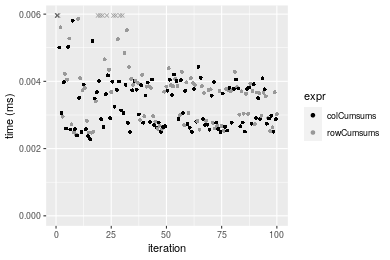
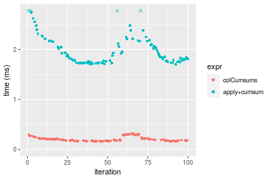
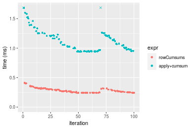
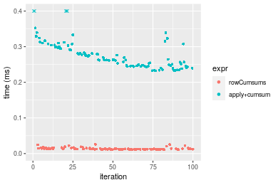
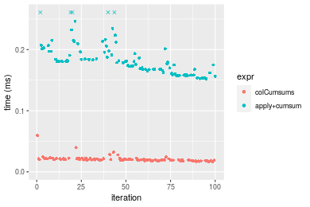
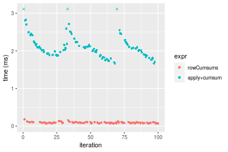
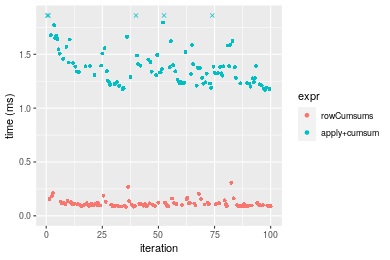

[matrixStats]: Benchmark report

---------------------------------------


# colCumsums() and rowCumsums() benchmarks

This report benchmark the performance of colCumsums() and rowCumsums() against alternative methods.

## Alternative methods

* apply() + cumsum()


## Data type "integer"

### Data
```r
> rmatrix <- function(nrow, ncol, mode = c("logical", "double", "integer", "index"), range = c(-100, 
+     +100), na_prob = 0) {
+     mode <- match.arg(mode)
+     n <- nrow * ncol
+     if (mode == "logical") {
+         x <- sample(c(FALSE, TRUE), size = n, replace = TRUE)
+     }     else if (mode == "index") {
+         x <- seq_len(n)
+         mode <- "integer"
+     }     else {
+         x <- runif(n, min = range[1], max = range[2])
+     }
+     storage.mode(x) <- mode
+     if (na_prob > 0) 
+         x[sample(n, size = na_prob * n)] <- NA
+     dim(x) <- c(nrow, ncol)
+     x
+ }
> rmatrices <- function(scale = 10, seed = 1, ...) {
+     set.seed(seed)
+     data <- list()
+     data[[1]] <- rmatrix(nrow = scale * 1, ncol = scale * 1, ...)
+     data[[2]] <- rmatrix(nrow = scale * 10, ncol = scale * 10, ...)
+     data[[3]] <- rmatrix(nrow = scale * 100, ncol = scale * 1, ...)
+     data[[4]] <- t(data[[3]])
+     data[[5]] <- rmatrix(nrow = scale * 10, ncol = scale * 100, ...)
+     data[[6]] <- t(data[[5]])
+     names(data) <- sapply(data, FUN = function(x) paste(dim(x), collapse = "x"))
+     data
+ }
> data <- rmatrices(mode = mode)
```

### Results

#### 10x10 integer matrix

```r
> X <- data[["10x10"]]
> gc()
          used  (Mb) gc trigger  (Mb) max used  (Mb)
Ncells 5183022 276.9    7554717 403.5  7554717 403.5
Vcells 9455612  72.2   31793280 242.6 60508962 461.7
> colStats <- microbenchmark(colCumsums = colCumsums(X), `apply+cumsum` = apply(X, MARGIN = 2L, FUN = cumsum), 
+     unit = "ms")
> X <- t(X)
> gc()
          used  (Mb) gc trigger  (Mb) max used  (Mb)
Ncells 5182157 276.8    7554717 403.5  7554717 403.5
Vcells 9453261  72.2   31793280 242.6 60508962 461.7
> rowStats <- microbenchmark(rowCumsums = rowCumsums(X), `apply+cumsum` = apply(X, MARGIN = 1L, FUN = cumsum), 
+     unit = "ms")
```

_Table: Benchmarking of colCumsums() and apply+cumsum() on integer+10x10 data. The top panel shows times in milliseconds and the bottom panel shows relative times._


|   |expr         |      min|        lq|      mean|    median|       uq|      max|
|:--|:------------|--------:|---------:|---------:|---------:|--------:|--------:|
|1  |colCumsums   | 0.002138| 0.0023990| 0.0032349| 0.0027845| 0.003623| 0.012807|
|2  |apply+cumsum | 0.038470| 0.0396105| 0.0414436| 0.0401430| 0.040933| 0.124133|


|   |expr         |      min|       lq|     mean|   median|      uq|     max|
|:--|:------------|--------:|--------:|--------:|--------:|-------:|-------:|
|1  |colCumsums   |  1.00000|  1.00000|  1.00000|  1.00000|  1.0000| 1.00000|
|2  |apply+cumsum | 17.99345| 16.51125| 12.81127| 14.41659| 11.2981| 9.69259|

_Table: Benchmarking of rowCumsums() and apply+cumsum() on integer+10x10 data (transposed). The top panel shows times in milliseconds and the bottom panel shows relative times._


|   |expr         |      min|        lq|      mean|    median|       uq|      max|
|:--|:------------|--------:|---------:|---------:|---------:|--------:|--------:|
|1  |rowCumsums   | 0.002559| 0.0030065| 0.0038211| 0.0039605| 0.004233| 0.014631|
|2  |apply+cumsum | 0.044660| 0.0460305| 0.0483229| 0.0467630| 0.048021| 0.126821|


|   |expr         |      min|       lq|     mean|   median|       uq|      max|
|:--|:------------|--------:|--------:|--------:|--------:|--------:|--------:|
|1  |rowCumsums   |  1.00000|  1.00000|  1.00000|  1.00000|  1.00000| 1.000000|
|2  |apply+cumsum | 17.45213| 15.31033| 12.64623| 11.80735| 11.34444| 8.667965|

_Figure: Benchmarking of colCumsums() and apply+cumsum() on integer+10x10 data  as well as rowCumsums() and apply+cumsum() on the same data transposed.  Outliers are displayed as crosses.  Times are in milliseconds._


_Table: Benchmarking of colCumsums() and rowCumsums() on integer+10x10 data (original and transposed).  The top panel shows times in milliseconds and the bottom panel shows relative times._


|   |expr       |   min|     lq|    mean| median|    uq|    max|
|:--|:----------|-----:|------:|-------:|------:|-----:|------:|
|1  |colCumsums | 2.138| 2.3990| 3.23493| 2.7845| 3.623| 12.807|
|2  |rowCumsums | 2.559| 3.0065| 3.82113| 3.9605| 4.233| 14.631|


|   |expr       |      min|      lq|    mean|   median|       uq|      max|
|:--|:----------|--------:|-------:|-------:|--------:|--------:|--------:|
|1  |colCumsums | 1.000000| 1.00000| 1.00000| 1.000000| 1.000000| 1.000000|
|2  |rowCumsums | 1.196913| 1.25323| 1.18121| 1.422338| 1.168369| 1.142422|

_Figure: Benchmarking of colCumsums() and rowCumsums() on integer+10x10 data (original and transposed).  Outliers are displayed as crosses. Times are in milliseconds._




#### 100x100 integer matrix

```r
> X <- data[["100x100"]]
> gc()
          used  (Mb) gc trigger  (Mb) max used  (Mb)
Ncells 5180701 276.7    7554717 403.5  7554717 403.5
Vcells 9070275  69.3   31793280 242.6 60508962 461.7
> colStats <- microbenchmark(colCumsums = colCumsums(X), `apply+cumsum` = apply(X, MARGIN = 2L, FUN = cumsum), 
+     unit = "ms")
> X <- t(X)
> gc()
          used  (Mb) gc trigger  (Mb) max used  (Mb)
Ncells 5180695 276.7    7554717 403.5  7554717 403.5
Vcells 9075318  69.3   31793280 242.6 60508962 461.7
> rowStats <- microbenchmark(rowCumsums = rowCumsums(X), `apply+cumsum` = apply(X, MARGIN = 1L, FUN = cumsum), 
+     unit = "ms")
```

_Table: Benchmarking of colCumsums() and apply+cumsum() on integer+100x100 data. The top panel shows times in milliseconds and the bottom panel shows relative times._


|   |expr         |      min|        lq|      mean|   median|       uq|      max|
|:--|:------------|--------:|---------:|---------:|--------:|--------:|--------:|
|1  |colCumsums   | 0.022978| 0.0248605| 0.0272838| 0.026701| 0.029343| 0.045547|
|2  |apply+cumsum | 0.240137| 0.2522985| 0.2886969| 0.288335| 0.317289| 0.438405|


|   |expr         |      min|       lq|     mean|   median|       uq|      max|
|:--|:------------|--------:|--------:|--------:|--------:|--------:|--------:|
|1  |colCumsums   |  1.00000|  1.00000|  1.00000|  1.00000|  1.00000| 1.000000|
|2  |apply+cumsum | 10.45074| 10.14857| 10.58126| 10.79866| 10.81311| 9.625332|

_Table: Benchmarking of rowCumsums() and apply+cumsum() on integer+100x100 data (transposed). The top panel shows times in milliseconds and the bottom panel shows relative times._


|   |expr         |      min|        lq|      mean|    median|        uq|      max|
|:--|:------------|--------:|---------:|---------:|---------:|---------:|--------:|
|1  |rowCumsums   | 0.032348| 0.0345600| 0.0377092| 0.0361520| 0.0401775| 0.058317|
|2  |apply+cumsum | 0.239867| 0.2480665| 0.2802229| 0.2696555| 0.3028465| 0.442997|


|   |expr         |      min|      lq|     mean|   median|       uq|      max|
|:--|:------------|--------:|-------:|--------:|--------:|--------:|--------:|
|1  |rowCumsums   | 1.000000| 1.00000| 1.000000| 1.000000| 1.000000| 1.000000|
|2  |apply+cumsum | 7.415203| 7.17785| 7.431147| 7.458937| 7.537714| 7.596361|

_Figure: Benchmarking of colCumsums() and apply+cumsum() on integer+100x100 data  as well as rowCumsums() and apply+cumsum() on the same data transposed.  Outliers are displayed as crosses.  Times are in milliseconds._


_Table: Benchmarking of colCumsums() and rowCumsums() on integer+100x100 data (original and transposed).  The top panel shows times in milliseconds and the bottom panel shows relative times._


|   |expr       |    min|      lq|     mean| median|      uq|    max|
|:--|:----------|------:|-------:|--------:|------:|-------:|------:|
|1  |colCumsums | 22.978| 24.8605| 27.28380| 26.701| 29.3430| 45.547|
|2  |rowCumsums | 32.348| 34.5600| 37.70924| 36.152| 40.1775| 58.317|


|   |expr       |      min|       lq|     mean|   median|       uq|     max|
|:--|:----------|--------:|--------:|--------:|--------:|--------:|-------:|
|1  |colCumsums | 1.000000| 1.000000| 1.000000| 1.000000| 1.000000| 1.00000|
|2  |rowCumsums | 1.407781| 1.390157| 1.382111| 1.353957| 1.369236| 1.28037|

_Figure: Benchmarking of colCumsums() and rowCumsums() on integer+100x100 data (original and transposed).  Outliers are displayed as crosses. Times are in milliseconds._


#### 1000x10 integer matrix

```r
> X <- data[["1000x10"]]
> gc()
          used  (Mb) gc trigger  (Mb) max used  (Mb)
Ncells 5180891 276.7    7554717 403.5  7554717 403.5
Vcells 9070608  69.3   31793280 242.6 60508962 461.7
> colStats <- microbenchmark(colCumsums = colCumsums(X), `apply+cumsum` = apply(X, MARGIN = 2L, FUN = cumsum), 
+     unit = "ms")
> X <- t(X)
> gc()
          used  (Mb) gc trigger  (Mb) max used  (Mb)
Ncells 5180885 276.7    7554717 403.5  7554717 403.5
Vcells 9075651  69.3   31793280 242.6 60508962 461.7
> rowStats <- microbenchmark(rowCumsums = rowCumsums(X), `apply+cumsum` = apply(X, MARGIN = 1L, FUN = cumsum), 
+     unit = "ms")
```

_Table: Benchmarking of colCumsums() and apply+cumsum() on integer+1000x10 data. The top panel shows times in milliseconds and the bottom panel shows relative times._


|   |expr         |      min|       lq|      mean|    median|       uq|      max|
|:--|:------------|--------:|--------:|---------:|---------:|--------:|--------:|
|1  |colCumsums   | 0.022684| 0.025050| 0.0274381| 0.0275465| 0.028854| 0.043979|
|2  |apply+cumsum | 0.148954| 0.160402| 0.1746320| 0.1720770| 0.191537| 0.270752|


|   |expr         |      min|       lq|     mean|   median|       uq|      max|
|:--|:------------|--------:|--------:|--------:|--------:|--------:|--------:|
|1  |colCumsums   | 1.000000| 1.000000| 1.000000| 1.000000| 1.000000| 1.000000|
|2  |apply+cumsum | 6.566479| 6.403274| 6.364575| 6.246783| 6.638144| 6.156393|

_Table: Benchmarking of rowCumsums() and apply+cumsum() on integer+1000x10 data (transposed). The top panel shows times in milliseconds and the bottom panel shows relative times._


|   |expr         |      min|       lq|      mean|   median|        uq|      max|
|:--|:------------|--------:|--------:|---------:|--------:|---------:|--------:|
|1  |rowCumsums   | 0.033813| 0.035144| 0.0386618| 0.036892| 0.0402260| 0.070847|
|2  |apply+cumsum | 0.143609| 0.149767| 0.1723588| 0.159258| 0.1836785| 0.337961|


|   |expr         |      min|       lq|     mean|   median|       uq|      max|
|:--|:------------|--------:|--------:|--------:|--------:|--------:|--------:|
|1  |rowCumsums   | 1.000000| 1.000000| 1.000000| 1.000000| 1.000000| 1.000000|
|2  |apply+cumsum | 4.247153| 4.261524| 4.458119| 4.316871| 4.566164| 4.770294|

_Figure: Benchmarking of colCumsums() and apply+cumsum() on integer+1000x10 data  as well as rowCumsums() and apply+cumsum() on the same data transposed.  Outliers are displayed as crosses.  Times are in milliseconds._


_Table: Benchmarking of colCumsums() and rowCumsums() on integer+1000x10 data (original and transposed).  The top panel shows times in milliseconds and the bottom panel shows relative times._


|   |expr       |    min|     lq|     mean|  median|     uq|    max|
|:--|:----------|------:|------:|--------:|-------:|------:|------:|
|1  |colCumsums | 22.684| 25.050| 27.43813| 27.5465| 28.854| 43.979|
|2  |rowCumsums | 33.813| 35.144| 38.66177| 36.8920| 40.226| 70.847|


|   |expr       |     min|       lq|     mean|   median|       uq|      max|
|:--|:----------|-------:|--------:|--------:|--------:|--------:|--------:|
|1  |colCumsums | 1.00000| 1.000000| 1.000000| 1.000000| 1.000000| 1.000000|
|2  |rowCumsums | 1.49061| 1.402954| 1.409053| 1.339263| 1.394122| 1.610928|

_Figure: Benchmarking of colCumsums() and rowCumsums() on integer+1000x10 data (original and transposed).  Outliers are displayed as crosses. Times are in milliseconds._


#### 10x1000 integer matrix

```r
> X <- data[["10x1000"]]
> gc()
          used  (Mb) gc trigger  (Mb) max used  (Mb)
Ncells 5181079 276.7    7554717 403.5  7554717 403.5
Vcells 9071296  69.3   31793280 242.6 60508962 461.7
> colStats <- microbenchmark(colCumsums = colCumsums(X), `apply+cumsum` = apply(X, MARGIN = 2L, FUN = cumsum), 
+     unit = "ms")
> X <- t(X)
> gc()
          used  (Mb) gc trigger  (Mb) max used  (Mb)
Ncells 5181073 276.7    7554717 403.5  7554717 403.5
Vcells 9076339  69.3   31793280 242.6 60508962 461.7
> rowStats <- microbenchmark(rowCumsums = rowCumsums(X), `apply+cumsum` = apply(X, MARGIN = 1L, FUN = cumsum), 
+     unit = "ms")
```

_Table: Benchmarking of colCumsums() and apply+cumsum() on integer+10x1000 data. The top panel shows times in milliseconds and the bottom panel shows relative times._


|   |expr         |      min|       lq|      mean|    median|        uq|      max|
|:--|:------------|--------:|--------:|---------:|---------:|---------:|--------:|
|1  |colCumsums   | 0.018364| 0.019425| 0.0226656| 0.0205115| 0.0245495| 0.042632|
|2  |apply+cumsum | 0.888018| 0.902082| 1.0173339| 0.9410505| 1.1152000| 1.487061|


|   |expr         |      min|       lq|     mean|   median|       uq|      max|
|:--|:------------|--------:|--------:|--------:|--------:|--------:|--------:|
|1  |colCumsums   |  1.00000|  1.00000|  1.00000|  1.00000|  1.00000|  1.00000|
|2  |apply+cumsum | 48.35646| 46.43923| 44.88439| 45.87917| 45.42659| 34.88133|

_Table: Benchmarking of rowCumsums() and apply+cumsum() on integer+10x1000 data (transposed). The top panel shows times in milliseconds and the bottom panel shows relative times._


|   |expr         |      min|        lq|      mean|    median|        uq|      max|
|:--|:------------|--------:|---------:|---------:|---------:|---------:|--------:|
|1  |rowCumsums   | 0.024280| 0.0252995| 0.0288597| 0.0267995| 0.0309785| 0.051577|
|2  |apply+cumsum | 0.890615| 0.9019530| 1.0198431| 0.9397560| 1.1176430| 1.468929|


|   |expr         |      min|       lq|     mean|   median|       uq|      max|
|:--|:------------|--------:|--------:|--------:|--------:|--------:|--------:|
|1  |rowCumsums   |  1.00000|  1.00000|  1.00000|  1.00000|  1.00000|  1.00000|
|2  |apply+cumsum | 36.68101| 35.65102| 35.33799| 35.06618| 36.07802| 28.48031|

_Figure: Benchmarking of colCumsums() and apply+cumsum() on integer+10x1000 data  as well as rowCumsums() and apply+cumsum() on the same data transposed.  Outliers are displayed as crosses.  Times are in milliseconds._


_Table: Benchmarking of colCumsums() and rowCumsums() on integer+10x1000 data (original and transposed).  The top panel shows times in milliseconds and the bottom panel shows relative times._


|   |expr       |    min|      lq|     mean|  median|      uq|    max|
|:--|:----------|------:|-------:|--------:|-------:|-------:|------:|
|1  |colCumsums | 18.364| 19.4250| 22.66565| 20.5115| 24.5495| 42.632|
|2  |rowCumsums | 24.280| 25.2995| 28.85968| 26.7995| 30.9785| 51.577|


|   |expr       |      min|      lq|     mean|  median|       uq|      max|
|:--|:----------|--------:|-------:|--------:|-------:|--------:|--------:|
|1  |colCumsums | 1.000000| 1.00000| 1.000000| 1.00000| 1.000000| 1.000000|
|2  |rowCumsums | 1.322152| 1.30242| 1.273278| 1.30656| 1.261879| 1.209819|

_Figure: Benchmarking of colCumsums() and rowCumsums() on integer+10x1000 data (original and transposed).  Outliers are displayed as crosses. Times are in milliseconds._


#### 100x1000 integer matrix

```r
> X <- data[["100x1000"]]
> gc()
          used  (Mb) gc trigger  (Mb) max used  (Mb)
Ncells 5181269 276.8    7554717 403.5  7554717 403.5
Vcells 9071786  69.3   31793280 242.6 60508962 461.7
> colStats <- microbenchmark(colCumsums = colCumsums(X), `apply+cumsum` = apply(X, MARGIN = 2L, FUN = cumsum), 
+     unit = "ms")
> X <- t(X)
> gc()
          used  (Mb) gc trigger  (Mb) max used  (Mb)
Ncells 5181257 276.8    7554717 403.5  7554717 403.5
Vcells 9121819  69.6   31793280 242.6 60508962 461.7
> rowStats <- microbenchmark(rowCumsums = rowCumsums(X), `apply+cumsum` = apply(X, MARGIN = 1L, FUN = cumsum), 
+     unit = "ms")
```

_Table: Benchmarking of colCumsums() and apply+cumsum() on integer+100x1000 data. The top panel shows times in milliseconds and the bottom panel shows relative times._


|   |expr         |      min|       lq|     mean|    median|        uq|       max|
|:--|:------------|--------:|--------:|--------:|---------:|---------:|---------:|
|1  |colCumsums   | 0.166014| 0.175320| 0.337333| 0.1829105| 0.2030225| 14.906269|
|2  |apply+cumsum | 1.706021| 1.761456| 1.926886| 1.8358595| 1.9609945|  3.332888|


|   |expr         |      min|       lq|     mean|   median|       uq|       max|
|:--|:------------|--------:|--------:|--------:|--------:|--------:|---------:|
|1  |colCumsums   |  1.00000|  1.00000| 1.000000|  1.00000| 1.000000| 1.0000000|
|2  |apply+cumsum | 10.27637| 10.04709| 5.712117| 10.03693| 9.659001| 0.2235897|

_Table: Benchmarking of rowCumsums() and apply+cumsum() on integer+100x1000 data (transposed). The top panel shows times in milliseconds and the bottom panel shows relative times._


|   |expr         |      min|       lq|      mean|    median|       uq|      max|
|:--|:------------|--------:|--------:|---------:|---------:|--------:|--------:|
|1  |rowCumsums   | 0.233926| 0.240372| 0.2568186| 0.2499325| 0.259743|  0.40473|
|2  |apply+cumsum | 1.716936| 1.779612| 2.0770800| 1.8353775| 1.950013| 17.42074|


|   |expr         |      min|       lq|     mean|   median|       uq|      max|
|:--|:------------|--------:|--------:|--------:|--------:|--------:|--------:|
|1  |rowCumsums   | 1.000000| 1.000000| 1.000000| 1.000000| 1.000000|  1.00000|
|2  |apply+cumsum | 7.339654| 7.403575| 8.087731| 7.343493| 7.507471| 43.04287|

_Figure: Benchmarking of colCumsums() and apply+cumsum() on integer+100x1000 data  as well as rowCumsums() and apply+cumsum() on the same data transposed.  Outliers are displayed as crosses.  Times are in milliseconds._





_Table: Benchmarking of colCumsums() and rowCumsums() on integer+100x1000 data (original and transposed).  The top panel shows times in milliseconds and the bottom panel shows relative times._


|   |expr       |     min|      lq|     mean|   median|       uq|      max|
|:--|:----------|-------:|-------:|--------:|--------:|--------:|--------:|
|1  |colCumsums | 166.014| 175.320| 337.3330| 182.9105| 203.0225| 14906.27|
|2  |rowCumsums | 233.926| 240.372| 256.8186| 249.9325| 259.7430|   404.73|


|   |expr       |      min|       lq|      mean|  median|      uq|       max|
|:--|:----------|--------:|--------:|---------:|-------:|-------:|---------:|
|1  |colCumsums | 1.000000| 1.000000| 1.0000000| 1.00000| 1.00000| 1.0000000|
|2  |rowCumsums | 1.409074| 1.371047| 0.7613207| 1.36642| 1.27938| 0.0271517|

_Figure: Benchmarking of colCumsums() and rowCumsums() on integer+100x1000 data (original and transposed).  Outliers are displayed as crosses. Times are in milliseconds._


#### 1000x100 integer matrix

```r
> X <- data[["1000x100"]]
> gc()
          used  (Mb) gc trigger  (Mb) max used  (Mb)
Ncells 5181455 276.8    7554717 403.5  7554717 403.5
Vcells 9072346  69.3   31793280 242.6 60508962 461.7
> colStats <- microbenchmark(colCumsums = colCumsums(X), `apply+cumsum` = apply(X, MARGIN = 2L, FUN = cumsum), 
+     unit = "ms")
> X <- t(X)
> gc()
          used  (Mb) gc trigger  (Mb) max used  (Mb)
Ncells 5181449 276.8    7554717 403.5  7554717 403.5
Vcells 9122389  69.6   31793280 242.6 60508962 461.7
> rowStats <- microbenchmark(rowCumsums = rowCumsums(X), `apply+cumsum` = apply(X, MARGIN = 1L, FUN = cumsum), 
+     unit = "ms")
```

_Table: Benchmarking of colCumsums() and apply+cumsum() on integer+1000x100 data. The top panel shows times in milliseconds and the bottom panel shows relative times._


|   |expr         |      min|        lq|     mean|    median|       uq|      max|
|:--|:------------|--------:|---------:|--------:|---------:|--------:|--------:|
|1  |colCumsums   | 0.158379| 0.1639310| 0.185310| 0.1751535| 0.200886| 0.290786|
|2  |apply+cumsum | 0.933503| 0.9762875| 1.184839| 1.0662190| 1.223795| 8.435696|


|   |expr         |      min|       lq|     mean|  median|       uq|      max|
|:--|:------------|--------:|--------:|--------:|-------:|--------:|--------:|
|1  |colCumsums   | 1.000000| 1.000000| 1.000000| 1.00000| 1.000000|  1.00000|
|2  |apply+cumsum | 5.894108| 5.955478| 6.393825| 6.08734| 6.091988| 29.00998|

_Table: Benchmarking of rowCumsums() and apply+cumsum() on integer+1000x100 data (transposed). The top panel shows times in milliseconds and the bottom panel shows relative times._


|   |expr         |      min|       lq|      mean|   median|        uq|      max|
|:--|:------------|--------:|--------:|---------:|--------:|---------:|--------:|
|1  |rowCumsums   | 0.240950| 0.247556| 0.2759494| 0.262850| 0.3002915| 0.405056|
|2  |apply+cumsum | 0.945283| 0.979921| 1.1745495| 1.036398| 1.2044280| 7.820427|


|   |expr         |     min|       lq|     mean|   median|       uq|      max|
|:--|:------------|-------:|--------:|--------:|--------:|--------:|--------:|
|1  |rowCumsums   | 1.00000| 1.000000| 1.000000| 1.000000| 1.000000|  1.00000|
|2  |apply+cumsum | 3.92315| 3.958381| 4.256394| 3.942924| 4.010863| 19.30703|

_Figure: Benchmarking of colCumsums() and apply+cumsum() on integer+1000x100 data  as well as rowCumsums() and apply+cumsum() on the same data transposed.  Outliers are displayed as crosses.  Times are in milliseconds._



_Table: Benchmarking of colCumsums() and rowCumsums() on integer+1000x100 data (original and transposed).  The top panel shows times in milliseconds and the bottom panel shows relative times._


|   |expr       |     min|      lq|     mean|   median|       uq|     max|
|:--|:----------|-------:|-------:|--------:|--------:|--------:|-------:|
|1  |colCumsums | 158.379| 163.931| 185.3100| 175.1535| 200.8860| 290.786|
|2  |rowCumsums | 240.950| 247.556| 275.9494| 262.8500| 300.2915| 405.056|


|   |expr       |      min|       lq|     mean|   median|       uq|      max|
|:--|:----------|--------:|--------:|--------:|--------:|--------:|--------:|
|1  |colCumsums | 1.000000| 1.000000| 1.000000| 1.000000| 1.000000| 1.000000|
|2  |rowCumsums | 1.521351| 1.510123| 1.489124| 1.500684| 1.494835| 1.392969|

_Figure: Benchmarking of colCumsums() and rowCumsums() on integer+1000x100 data (original and transposed).  Outliers are displayed as crosses. Times are in milliseconds._


## Data type "double"

### Data
```r
> rmatrix <- function(nrow, ncol, mode = c("logical", "double", "integer", "index"), range = c(-100, 
+     +100), na_prob = 0) {
+     mode <- match.arg(mode)
+     n <- nrow * ncol
+     if (mode == "logical") {
+         x <- sample(c(FALSE, TRUE), size = n, replace = TRUE)
+     }     else if (mode == "index") {
+         x <- seq_len(n)
+         mode <- "integer"
+     }     else {
+         x <- runif(n, min = range[1], max = range[2])
+     }
+     storage.mode(x) <- mode
+     if (na_prob > 0) 
+         x[sample(n, size = na_prob * n)] <- NA
+     dim(x) <- c(nrow, ncol)
+     x
+ }
> rmatrices <- function(scale = 10, seed = 1, ...) {
+     set.seed(seed)
+     data <- list()
+     data[[1]] <- rmatrix(nrow = scale * 1, ncol = scale * 1, ...)
+     data[[2]] <- rmatrix(nrow = scale * 10, ncol = scale * 10, ...)
+     data[[3]] <- rmatrix(nrow = scale * 100, ncol = scale * 1, ...)
+     data[[4]] <- t(data[[3]])
+     data[[5]] <- rmatrix(nrow = scale * 10, ncol = scale * 100, ...)
+     data[[6]] <- t(data[[5]])
+     names(data) <- sapply(data, FUN = function(x) paste(dim(x), collapse = "x"))
+     data
+ }
> data <- rmatrices(mode = mode)
```

### Results

#### 10x10 double matrix

```r
> X <- data[["10x10"]]
> gc()
          used  (Mb) gc trigger  (Mb) max used  (Mb)
Ncells 5181655 276.8    7554717 403.5  7554717 403.5
Vcells 9188060  70.1   31793280 242.6 60508962 461.7
> colStats <- microbenchmark(colCumsums = colCumsums(X), `apply+cumsum` = apply(X, MARGIN = 2L, FUN = cumsum), 
+     unit = "ms")
> X <- t(X)
> gc()
          used  (Mb) gc trigger  (Mb) max used  (Mb)
Ncells 5181640 276.8    7554717 403.5  7554717 403.5
Vcells 9188188  70.2   31793280 242.6 60508962 461.7
> rowStats <- microbenchmark(rowCumsums = rowCumsums(X), `apply+cumsum` = apply(X, MARGIN = 1L, FUN = cumsum), 
+     unit = "ms")
```

_Table: Benchmarking of colCumsums() and apply+cumsum() on double+10x10 data. The top panel shows times in milliseconds and the bottom panel shows relative times._


|   |expr         |      min|        lq|      mean|   median|       uq|      max|
|:--|:------------|--------:|---------:|---------:|--------:|--------:|--------:|
|1  |colCumsums   | 0.002391| 0.0026220| 0.0033635| 0.002932| 0.003924| 0.013238|
|2  |apply+cumsum | 0.045367| 0.0460225| 0.0475514| 0.046360| 0.047045| 0.121725|


|   |expr         |      min|       lq|     mean|   median|       uq|     max|
|:--|:------------|--------:|--------:|--------:|--------:|--------:|-------:|
|1  |colCumsums   |  1.00000|  1.00000|  1.00000|  1.00000|  1.00000| 1.00000|
|2  |apply+cumsum | 18.97407| 17.55244| 14.13747| 15.81173| 11.98904| 9.19512|

_Table: Benchmarking of rowCumsums() and apply+cumsum() on double+10x10 data (transposed). The top panel shows times in milliseconds and the bottom panel shows relative times._


|   |expr         |      min|        lq|      mean|    median|       uq|      max|
|:--|:------------|--------:|---------:|---------:|---------:|--------:|--------:|
|1  |rowCumsums   | 0.002288| 0.0028285| 0.0035403| 0.0037050| 0.003861| 0.014762|
|2  |apply+cumsum | 0.043653| 0.0448395| 0.0470360| 0.0460325| 0.046832| 0.121882|


|   |expr         |      min|       lq|     mean|   median|      uq|      max|
|:--|:------------|--------:|--------:|--------:|--------:|-------:|--------:|
|1  |rowCumsums   |  1.00000|  1.00000|  1.00000|  1.00000|  1.0000| 1.000000|
|2  |apply+cumsum | 19.07911| 15.85275| 13.28581| 12.42443| 12.1295| 8.256469|

_Figure: Benchmarking of colCumsums() and apply+cumsum() on double+10x10 data  as well as rowCumsums() and apply+cumsum() on the same data transposed.  Outliers are displayed as crosses.  Times are in milliseconds._


_Table: Benchmarking of colCumsums() and rowCumsums() on double+10x10 data (original and transposed).  The top panel shows times in milliseconds and the bottom panel shows relative times._


|   |expr       |   min|     lq|    mean| median|    uq|    max|
|:--|:----------|-----:|------:|-------:|------:|-----:|------:|
|1  |colCumsums | 2.391| 2.6220| 3.36350|  2.932| 3.924| 13.238|
|2  |rowCumsums | 2.288| 2.8285| 3.54032|  3.705| 3.861| 14.762|


|   |expr       |       min|       lq|    mean|   median|       uq|      max|
|:--|:----------|---------:|--------:|-------:|--------:|--------:|--------:|
|1  |colCumsums | 1.0000000| 1.000000| 1.00000| 1.000000| 1.000000| 1.000000|
|2  |rowCumsums | 0.9569218| 1.078757| 1.05257| 1.263643| 0.983945| 1.115123|

_Figure: Benchmarking of colCumsums() and rowCumsums() on double+10x10 data (original and transposed).  Outliers are displayed as crosses. Times are in milliseconds._


#### 100x100 double matrix

```r
> X <- data[["100x100"]]
> gc()
          used  (Mb) gc trigger  (Mb) max used  (Mb)
Ncells 5181835 276.8    7554717 403.5  7554717 403.5
Vcells 9188885  70.2   31793280 242.6 60508962 461.7
> colStats <- microbenchmark(colCumsums = colCumsums(X), `apply+cumsum` = apply(X, MARGIN = 2L, FUN = cumsum), 
+     unit = "ms")
> X <- t(X)
> gc()
          used  (Mb) gc trigger  (Mb) max used  (Mb)
Ncells 5181829 276.8    7554717 403.5  7554717 403.5
Vcells 9198928  70.2   31793280 242.6 60508962 461.7
> rowStats <- microbenchmark(rowCumsums = rowCumsums(X), `apply+cumsum` = apply(X, MARGIN = 1L, FUN = cumsum), 
+     unit = "ms")
```

_Table: Benchmarking of colCumsums() and apply+cumsum() on double+100x100 data. The top panel shows times in milliseconds and the bottom panel shows relative times._


|   |expr         |      min|        lq|      mean|    median|        uq|      max|
|:--|:------------|--------:|---------:|---------:|---------:|---------:|--------:|
|1  |colCumsums   | 0.013655| 0.0148055| 0.0161660| 0.0152410| 0.0168485| 0.040488|
|2  |apply+cumsum | 0.225816| 0.2346020| 0.2644453| 0.2566205| 0.2837215| 0.443671|


|   |expr         |      min|      lq|     mean|   median|       uq|      max|
|:--|:------------|--------:|-------:|--------:|--------:|--------:|--------:|
|1  |colCumsums   |  1.00000|  1.0000|  1.00000|  1.00000|  1.00000|  1.00000|
|2  |apply+cumsum | 16.53724| 15.8456| 16.35811| 16.83751| 16.83957| 10.95809|

_Table: Benchmarking of rowCumsums() and apply+cumsum() on double+100x100 data (transposed). The top panel shows times in milliseconds and the bottom panel shows relative times._


|   |expr         |      min|        lq|      mean|    median|        uq|      max|
|:--|:------------|--------:|---------:|---------:|---------:|---------:|--------:|
|1  |rowCumsums   | 0.012491| 0.0133045| 0.0143720| 0.0139375| 0.0144455| 0.028237|
|2  |apply+cumsum | 0.231207| 0.2406760| 0.2654273| 0.2520815| 0.2821355| 0.446877|


|   |expr         |      min|       lq|     mean|   median|       uq|      max|
|:--|:------------|--------:|--------:|--------:|--------:|--------:|--------:|
|1  |rowCumsums   |  1.00000|  1.00000|  1.00000|  1.00000|  1.00000|  1.00000|
|2  |apply+cumsum | 18.50989| 18.08982| 18.46838| 18.08657| 19.53103| 15.82594|

_Figure: Benchmarking of colCumsums() and apply+cumsum() on double+100x100 data  as well as rowCumsums() and apply+cumsum() on the same data transposed.  Outliers are displayed as crosses.  Times are in milliseconds._



_Table: Benchmarking of colCumsums() and rowCumsums() on double+100x100 data (original and transposed).  The top panel shows times in milliseconds and the bottom panel shows relative times._


|   |expr       |    min|      lq|     mean|  median|      uq|    max|
|:--|:----------|------:|-------:|--------:|-------:|-------:|------:|
|2  |rowCumsums | 12.491| 13.3045| 14.37199| 13.9375| 14.4455| 28.237|
|1  |colCumsums | 13.655| 14.8055| 16.16600| 15.2410| 16.8485| 40.488|


|   |expr       |      min|       lq|     mean|   median|       uq|      max|
|:--|:----------|--------:|--------:|--------:|--------:|--------:|--------:|
|2  |rowCumsums | 1.000000| 1.000000| 1.000000| 1.000000| 1.000000| 1.000000|
|1  |colCumsums | 1.093187| 1.112819| 1.124827| 1.093525| 1.166349| 1.433863|

_Figure: Benchmarking of colCumsums() and rowCumsums() on double+100x100 data (original and transposed).  Outliers are displayed as crosses. Times are in milliseconds._


#### 1000x10 double matrix

```r
> X <- data[["1000x10"]]
> gc()
          used  (Mb) gc trigger  (Mb) max used  (Mb)
Ncells 5182025 276.8    7554717 403.5  7554717 403.5
Vcells 9189784  70.2   31793280 242.6 60508962 461.7
> colStats <- microbenchmark(colCumsums = colCumsums(X), `apply+cumsum` = apply(X, MARGIN = 2L, FUN = cumsum), 
+     unit = "ms")
> X <- t(X)
> gc()
          used  (Mb) gc trigger  (Mb) max used  (Mb)
Ncells 5182019 276.8    7554717 403.5  7554717 403.5
Vcells 9199827  70.2   31793280 242.6 60508962 461.7
> rowStats <- microbenchmark(rowCumsums = rowCumsums(X), `apply+cumsum` = apply(X, MARGIN = 1L, FUN = cumsum), 
+     unit = "ms")
```

_Table: Benchmarking of colCumsums() and apply+cumsum() on double+1000x10 data. The top panel shows times in milliseconds and the bottom panel shows relative times._


|   |expr         |      min|        lq|      mean|   median|        uq|      max|
|:--|:------------|--------:|---------:|---------:|--------:|---------:|--------:|
|1  |colCumsums   | 0.016006| 0.0173470| 0.0190597| 0.018516| 0.0197940| 0.036965|
|2  |apply+cumsum | 0.143455| 0.1513745| 0.1641624| 0.158679| 0.1751825| 0.274690|


|   |expr         |      min|       lq|     mean|   median|       uq|      max|
|:--|:------------|--------:|--------:|--------:|--------:|--------:|--------:|
|1  |colCumsums   | 1.000000| 1.000000| 1.000000| 1.000000| 1.000000| 1.000000|
|2  |apply+cumsum | 8.962577| 8.726264| 8.613068| 8.569831| 8.850283| 7.431083|

_Table: Benchmarking of rowCumsums() and apply+cumsum() on double+1000x10 data (transposed). The top panel shows times in milliseconds and the bottom panel shows relative times._


|   |expr         |      min|        lq|      mean|    median|       uq|      max|
|:--|:------------|--------:|---------:|---------:|---------:|--------:|--------:|
|1  |rowCumsums   | 0.013302| 0.0150800| 0.0164654| 0.0161575| 0.017212| 0.041058|
|2  |apply+cumsum | 0.147960| 0.1572005| 0.1696798| 0.1663320| 0.180779| 0.277159|


|   |expr         |      min|       lq|     mean|   median|       uq|      max|
|:--|:------------|--------:|--------:|--------:|--------:|--------:|--------:|
|1  |rowCumsums   |  1.00000|  1.00000|  1.00000|  1.00000|  1.00000| 1.000000|
|2  |apply+cumsum | 11.12314| 10.42444| 10.30524| 10.29441| 10.50308| 6.750426|

_Figure: Benchmarking of colCumsums() and apply+cumsum() on double+1000x10 data  as well as rowCumsums() and apply+cumsum() on the same data transposed.  Outliers are displayed as crosses.  Times are in milliseconds._





_Table: Benchmarking of colCumsums() and rowCumsums() on double+1000x10 data (original and transposed).  The top panel shows times in milliseconds and the bottom panel shows relative times._


|   |expr       |    min|     lq|     mean|  median|     uq|    max|
|:--|:----------|------:|------:|--------:|-------:|------:|------:|
|2  |rowCumsums | 13.302| 15.080| 16.46539| 16.1575| 17.212| 41.058|
|1  |colCumsums | 16.006| 17.347| 19.05969| 18.5160| 19.794| 36.965|


|   |expr       |      min|       lq|     mean|   median|       uq|       max|
|:--|:----------|--------:|--------:|--------:|--------:|--------:|---------:|
|2  |rowCumsums | 1.000000| 1.000000| 1.000000| 1.000000| 1.000000| 1.0000000|
|1  |colCumsums | 1.203278| 1.150332| 1.157561| 1.145969| 1.150012| 0.9003118|

_Figure: Benchmarking of colCumsums() and rowCumsums() on double+1000x10 data (original and transposed).  Outliers are displayed as crosses. Times are in milliseconds._


#### 10x1000 double matrix

```r
> X <- data[["10x1000"]]
> gc()
          used  (Mb) gc trigger  (Mb) max used  (Mb)
Ncells 5182213 276.8    7554717 403.5  7554717 403.5
Vcells 9189909  70.2   31793280 242.6 60508962 461.7
> colStats <- microbenchmark(colCumsums = colCumsums(X), `apply+cumsum` = apply(X, MARGIN = 2L, FUN = cumsum), 
+     unit = "ms")
> X <- t(X)
> gc()
          used  (Mb) gc trigger  (Mb) max used  (Mb)
Ncells 5182207 276.8    7554717 403.5  7554717 403.5
Vcells 9199952  70.2   31793280 242.6 60508962 461.7
> rowStats <- microbenchmark(rowCumsums = rowCumsums(X), `apply+cumsum` = apply(X, MARGIN = 1L, FUN = cumsum), 
+     unit = "ms")
```

_Table: Benchmarking of colCumsums() and apply+cumsum() on double+10x1000 data. The top panel shows times in milliseconds and the bottom panel shows relative times._


|   |expr         |      min|        lq|      mean|    median|       uq|      max|
|:--|:------------|--------:|---------:|---------:|---------:|--------:|--------:|
|1  |colCumsums   | 0.009356| 0.0124740| 0.0139147| 0.0137565| 0.014940| 0.029572|
|2  |apply+cumsum | 0.890685| 0.9081265| 1.0185896| 0.9469390| 1.104664| 1.444626|


|   |expr         |      min|       lq|     mean|   median|       uq|      max|
|:--|:------------|--------:|--------:|--------:|--------:|--------:|--------:|
|1  |colCumsums   |  1.00000|  1.00000|  1.00000|  1.00000|  1.00000|  1.00000|
|2  |apply+cumsum | 95.19934| 72.80155| 73.20262| 68.83575| 73.94006| 48.85114|

_Table: Benchmarking of rowCumsums() and apply+cumsum() on double+10x1000 data (transposed). The top panel shows times in milliseconds and the bottom panel shows relative times._


|   |expr         |      min|        lq|      mean|   median|        uq|      max|
|:--|:------------|--------:|---------:|---------:|--------:|---------:|--------:|
|1  |rowCumsums   | 0.011281| 0.0119595| 0.0135536| 0.012670| 0.0134255| 0.039212|
|2  |apply+cumsum | 0.884875| 0.9016730| 1.0176388| 0.960572| 1.1050880| 1.454964|


|   |expr         |      min|       lq|     mean|   median|       uq|      max|
|:--|:------------|--------:|--------:|--------:|--------:|--------:|--------:|
|1  |rowCumsums   |  1.00000|  1.00000|  1.00000|  1.00000|  1.00000|  1.00000|
|2  |apply+cumsum | 78.43941| 75.39387| 75.08277| 75.81468| 82.31261| 37.10507|

_Figure: Benchmarking of colCumsums() and apply+cumsum() on double+10x1000 data  as well as rowCumsums() and apply+cumsum() on the same data transposed.  Outliers are displayed as crosses.  Times are in milliseconds._


_Table: Benchmarking of colCumsums() and rowCumsums() on double+10x1000 data (original and transposed).  The top panel shows times in milliseconds and the bottom panel shows relative times._


|   |expr       |    min|      lq|     mean|  median|      uq|    max|
|:--|:----------|------:|-------:|--------:|-------:|-------:|------:|
|2  |rowCumsums | 11.281| 11.9595| 13.55356| 12.6700| 13.4255| 39.212|
|1  |colCumsums |  9.356| 12.4740| 13.91466| 13.7565| 14.9400| 29.572|


|   |expr       |       min|      lq|     mean|   median|       uq|       max|
|:--|:----------|---------:|-------:|--------:|--------:|--------:|---------:|
|2  |rowCumsums | 1.0000000| 1.00000| 1.000000| 1.000000| 1.000000| 1.0000000|
|1  |colCumsums | 0.8293591| 1.04302| 1.026642| 1.085754| 1.112808| 0.7541569|

_Figure: Benchmarking of colCumsums() and rowCumsums() on double+10x1000 data (original and transposed).  Outliers are displayed as crosses. Times are in milliseconds._


#### 100x1000 double matrix

```r
> X <- data[["100x1000"]]
> gc()
          used  (Mb) gc trigger  (Mb) max used  (Mb)
Ncells 5182403 276.8    7554717 403.5  7554717 403.5
Vcells 9190971  70.2   31793280 242.6 60508962 461.7
> colStats <- microbenchmark(colCumsums = colCumsums(X), `apply+cumsum` = apply(X, MARGIN = 2L, FUN = cumsum), 
+     unit = "ms")
> X <- t(X)
> gc()
          used  (Mb) gc trigger  (Mb) max used  (Mb)
Ncells 5182391 276.8    7554717 403.5  7554717 403.5
Vcells 9291004  70.9   31793280 242.6 60508962 461.7
> rowStats <- microbenchmark(rowCumsums = rowCumsums(X), `apply+cumsum` = apply(X, MARGIN = 1L, FUN = cumsum), 
+     unit = "ms")
```

_Table: Benchmarking of colCumsums() and apply+cumsum() on double+100x1000 data. The top panel shows times in milliseconds and the bottom panel shows relative times._


|   |expr         |      min|        lq|      mean|    median|       uq|      max|
|:--|:------------|--------:|---------:|---------:|---------:|--------:|--------:|
|1  |colCumsums   | 0.093487| 0.1081335| 0.2415098| 0.1175485| 0.127493| 12.34113|
|2  |apply+cumsum | 1.616092| 1.6898820| 2.0599879| 1.8734535| 2.088404| 14.39749|


|   |expr         |      min|       lq|     mean|   median|       uq|      max|
|:--|:------------|--------:|--------:|--------:|--------:|--------:|--------:|
|1  |colCumsums   |  1.00000|  1.00000| 1.000000|  1.00000|  1.00000| 1.000000|
|2  |apply+cumsum | 17.28681| 15.62774| 8.529623| 15.93771| 16.38053| 1.166626|

_Table: Benchmarking of rowCumsums() and apply+cumsum() on double+100x1000 data (transposed). The top panel shows times in milliseconds and the bottom panel shows relative times._


|   |expr         |      min|       lq|      mean|    median|        uq|      max|
|:--|:------------|--------:|--------:|---------:|---------:|---------:|--------:|
|1  |rowCumsums   | 0.069951| 0.080425| 0.2235815| 0.0892165| 0.0990565| 13.17055|
|2  |apply+cumsum | 1.645459| 1.751218| 2.1248987| 1.9330975| 2.1504980| 14.58330|


|   |expr         |      min|       lq|     mean|   median|       uq|      max|
|:--|:------------|--------:|--------:|--------:|--------:|--------:|--------:|
|1  |rowCumsums   |  1.00000|  1.00000| 1.000000|  1.00000|  1.00000| 1.000000|
|2  |apply+cumsum | 23.52302| 21.77455| 9.503911| 21.66749| 21.70981| 1.107266|

_Figure: Benchmarking of colCumsums() and apply+cumsum() on double+100x1000 data  as well as rowCumsums() and apply+cumsum() on the same data transposed.  Outliers are displayed as crosses.  Times are in milliseconds._



_Table: Benchmarking of colCumsums() and rowCumsums() on double+100x1000 data (original and transposed).  The top panel shows times in milliseconds and the bottom panel shows relative times._


|   |expr       |    min|       lq|     mean|   median|       uq|      max|
|:--|:----------|------:|--------:|--------:|--------:|--------:|--------:|
|2  |rowCumsums | 69.951|  80.4250| 223.5815|  89.2165|  99.0565| 13170.55|
|1  |colCumsums | 93.487| 108.1335| 241.5098| 117.5485| 127.4930| 12341.14|


|   |expr       |      min|       lq|     mean|   median|       uq|       max|
|:--|:----------|--------:|--------:|--------:|--------:|--------:|---------:|
|2  |rowCumsums | 1.000000| 1.000000| 1.000000| 1.000000| 1.000000| 1.0000000|
|1  |colCumsums | 1.336464| 1.344526| 1.080187| 1.317565| 1.287073| 0.9370249|

_Figure: Benchmarking of colCumsums() and rowCumsums() on double+100x1000 data (original and transposed).  Outliers are displayed as crosses. Times are in milliseconds._


#### 1000x100 double matrix

```r
> X <- data[["1000x100"]]
> gc()
          used  (Mb) gc trigger  (Mb) max used  (Mb)
Ncells 5182589 276.8    7554717 403.5  7554717 403.5
Vcells 9191090  70.2   31793280 242.6 60508962 461.7
> colStats <- microbenchmark(colCumsums = colCumsums(X), `apply+cumsum` = apply(X, MARGIN = 2L, FUN = cumsum), 
+     unit = "ms")
> X <- t(X)
> gc()
          used  (Mb) gc trigger  (Mb) max used  (Mb)
Ncells 5182583 276.8    7554717 403.5  7554717 403.5
Vcells 9291133  70.9   31793280 242.6 60508962 461.7
> rowStats <- microbenchmark(rowCumsums = rowCumsums(X), `apply+cumsum` = apply(X, MARGIN = 1L, FUN = cumsum), 
+     unit = "ms")
```

_Table: Benchmarking of colCumsums() and apply+cumsum() on double+1000x100 data. The top panel shows times in milliseconds and the bottom panel shows relative times._


|   |expr         |      min|       lq|      mean|    median|       uq|      max|
|:--|:------------|--------:|--------:|---------:|---------:|--------:|--------:|
|1  |colCumsums   | 0.110173| 0.124734| 0.1390268| 0.1331225| 0.144817| 0.408029|
|2  |apply+cumsum | 0.941093| 1.044738| 1.2688511| 1.1441515| 1.196318| 7.194172|


|   |expr         |      min|       lq|     mean|   median|       uq|      max|
|:--|:------------|--------:|--------:|--------:|--------:|--------:|--------:|
|1  |colCumsums   | 1.000000| 1.000000| 1.000000| 1.000000| 1.000000|  1.00000|
|2  |apply+cumsum | 8.541957| 8.375727| 9.126666| 8.594727| 8.260895| 17.63152|

_Table: Benchmarking of rowCumsums() and apply+cumsum() on double+1000x100 data (transposed). The top panel shows times in milliseconds and the bottom panel shows relative times._


|   |expr         |      min|        lq|      mean|    median|       uq|      max|
|:--|:------------|--------:|---------:|---------:|---------:|--------:|--------:|
|1  |rowCumsums   | 0.077772| 0.0875625| 0.0946537| 0.0918075| 0.098949| 0.156987|
|2  |apply+cumsum | 0.960539| 1.0603575| 1.3002911| 1.1680385| 1.233043| 7.249680|


|   |expr         |     min|       lq|     mean|   median|      uq|      max|
|:--|:------------|-------:|--------:|--------:|--------:|-------:|--------:|
|1  |rowCumsums   |  1.0000|  1.00000|  1.00000|  1.00000|  1.0000|  1.00000|
|2  |apply+cumsum | 12.3507| 12.10972| 13.73735| 12.72269| 12.4614| 46.18013|

_Figure: Benchmarking of colCumsums() and apply+cumsum() on double+1000x100 data  as well as rowCumsums() and apply+cumsum() on the same data transposed.  Outliers are displayed as crosses.  Times are in milliseconds._



_Table: Benchmarking of colCumsums() and rowCumsums() on double+1000x100 data (original and transposed).  The top panel shows times in milliseconds and the bottom panel shows relative times._


|   |expr       |     min|       lq|      mean|   median|      uq|     max|
|:--|:----------|-------:|--------:|---------:|--------:|-------:|-------:|
|2  |rowCumsums |  77.772|  87.5625|  94.65371|  91.8075|  98.949| 156.987|
|1  |colCumsums | 110.173| 124.7340| 139.02679| 133.1225| 144.817| 408.029|


|   |expr       |      min|       lq|     mean|   median|       uq|      max|
|:--|:----------|--------:|--------:|--------:|--------:|--------:|--------:|
|2  |rowCumsums | 1.000000| 1.000000| 1.000000| 1.000000| 1.000000| 1.000000|
|1  |colCumsums | 1.416615| 1.424514| 1.468794| 1.450018| 1.463552| 2.599126|

_Figure: Benchmarking of colCumsums() and rowCumsums() on double+1000x100 data (original and transposed).  Outliers are displayed as crosses. Times are in milliseconds._


## Appendix

### Session information
```r
R version 4.1.1 Patched (2021-08-10 r80727)
Platform: x86_64-pc-linux-gnu (64-bit)
Running under: Ubuntu 18.04.5 LTS

Matrix products: default
BLAS:   /home/hb/software/R-devel/R-4-1-branch/lib/R/lib/libRblas.so
LAPACK: /home/hb/software/R-devel/R-4-1-branch/lib/R/lib/libRlapack.so

locale:
 [1] LC_CTYPE=en_US.UTF-8       LC_NUMERIC=C              
 [3] LC_TIME=en_US.UTF-8        LC_COLLATE=en_US.UTF-8    
 [5] LC_MONETARY=en_US.UTF-8    LC_MESSAGES=en_US.UTF-8   
 [7] LC_PAPER=en_US.UTF-8       LC_NAME=C                 
 [9] LC_ADDRESS=C               LC_TELEPHONE=C            
[11] LC_MEASUREMENT=en_US.UTF-8 LC_IDENTIFICATION=C       

attached base packages:
[1] stats     graphics  grDevices utils     datasets  methods   base     

other attached packages:
[1] microbenchmark_1.4-7   matrixStats_0.60.0     ggplot2_3.3.5         
[4] knitr_1.33             R.devices_2.17.0       R.utils_2.10.1        
[7] R.oo_1.24.0            R.methodsS3_1.8.1-9001

loaded via a namespace (and not attached):
 [1] Biobase_2.52.0          httr_1.4.2              splines_4.1.1          
 [4] bit64_4.0.5             network_1.17.1          assertthat_0.2.1       
 [7] highr_0.9               stats4_4.1.1            blob_1.2.2             
[10] GenomeInfoDbData_1.2.6  robustbase_0.93-8       pillar_1.6.2           
[13] RSQLite_2.2.8           lattice_0.20-44         glue_1.4.2             
[16] digest_0.6.27           XVector_0.32.0          colorspace_2.0-2       
[19] Matrix_1.3-4            XML_3.99-0.7            pkgconfig_2.0.3        
[22] zlibbioc_1.38.0         genefilter_1.74.0       purrr_0.3.4            
[25] ergm_4.1.2              xtable_1.8-4            scales_1.1.1           
[28] tibble_3.1.4            annotate_1.70.0         KEGGREST_1.32.0        
[31] farver_2.1.0            generics_0.1.0          IRanges_2.26.0         
[34] ellipsis_0.3.2          cachem_1.0.6            withr_2.4.2            
[37] BiocGenerics_0.38.0     mime_0.11               survival_3.2-13        
[40] magrittr_2.0.1          crayon_1.4.1            statnet.common_4.5.0   
[43] memoise_2.0.0           laeken_0.5.1            fansi_0.5.0            
[46] R.cache_0.15.0          MASS_7.3-54             R.rsp_0.44.0           
[49] tools_4.1.1             lifecycle_1.0.0         S4Vectors_0.30.0       
[52] trust_0.1-8             munsell_0.5.0           AnnotationDbi_1.54.1   
[55] Biostrings_2.60.2       compiler_4.1.1          GenomeInfoDb_1.28.1    
[58] rlang_0.4.11            grid_4.1.1              RCurl_1.98-1.4         
[61] cwhmisc_6.6             rappdirs_0.3.3          labeling_0.4.2         
[64] bitops_1.0-7            base64enc_0.1-3         boot_1.3-28            
[67] gtable_0.3.0            DBI_1.1.1               markdown_1.1           
[70] R6_2.5.1                lpSolveAPI_5.5.2.0-17.7 rle_0.9.2              
[73] dplyr_1.0.7             fastmap_1.1.0           bit_4.0.4              
[76] utf8_1.2.2              parallel_4.1.1          Rcpp_1.0.7             
[79] vctrs_0.3.8             png_0.1-7               DEoptimR_1.0-9         
[82] tidyselect_1.1.1        xfun_0.25               coda_0.19-4            
```
Total processing time was 24.44 secs.


### Reproducibility
To reproduce this report, do:
```r
html <- matrixStats:::benchmark('colCumsums')
```

[RSP]: https://cran.r-project.org/package=R.rsp
[matrixStats]: https://cran.r-project.org/package=matrixStats

[StackOverflow:colMins?]: https://stackoverflow.com/questions/13676878 "Stack Overflow: fastest way to get Min from every column in a matrix?"
[StackOverflow:colSds?]: https://stackoverflow.com/questions/17549762 "Stack Overflow: Is there such 'colsd' in R?"
[StackOverflow:rowProds?]: https://stackoverflow.com/questions/20198801/ "Stack Overflow: Row product of matrix and column sum of matrix"

---------------------------------------
Copyright Henrik Bengtsson. Last updated on 2021-08-25 17:39:28 (+0200 UTC). Powered by [RSP].

<script>
 var link = document.createElement('link');
 link.rel = 'icon';
 link.href = "data:image/png;base64,iVBORw0KGgoAAAANSUhEUgAAACAAAAAgCAMAAABEpIrGAAAA21BMVEUAAAAAAP8AAP8AAP8AAP8AAP8AAP8AAP8AAP8AAP8AAP8AAP8AAP8AAP8AAP8AAP8AAP8AAP8AAP8AAP8AAP8AAP8AAP8AAP8AAP8AAP8AAP8AAP8AAP8AAP8AAP8AAP8AAP8AAP8AAP8AAP8AAP8AAP8AAP8AAP8AAP8AAP8BAf4CAv0DA/wdHeIeHuEfH+AgIN8hId4lJdomJtknJ9g+PsE/P8BAQL9yco10dIt1dYp3d4h4eIeVlWqWlmmXl2iYmGeZmWabm2Tn5xjo6Bfp6Rb39wj4+Af//wA2M9hbAAAASXRSTlMAAQIJCgsMJSYnKD4/QGRlZmhpamtsbautrrCxuru8y8zN5ebn6Pn6+///////////////////////////////////////////LsUNcQAAAS9JREFUOI29k21XgkAQhVcFytdSMqMETU26UVqGmpaiFbL//xc1cAhhwVNf6n5i5z67M2dmYOyfJZUqlVLhkKucG7cgmUZTybDz6g0iDeq51PUr37Ds2cy2/C9NeES5puDjxuUk1xnToZsg8pfA3avHQ3lLIi7iWRrkv/OYtkScxBIMgDee0ALoyxHQBJ68JLCjOtQIMIANF7QG9G9fNnHvisCHBVMKgSJgiz7nE+AoBKrAPA3MgepvgR9TSCasrCKH0eB1wBGBFdCO+nAGjMVGPcQb5bd6mQRegN6+1axOs9nGfYcCtfi4NQosdtH7dB+txFIpXQqN1p9B/asRHToyS0jRgpV7nk4nwcq1BJ+x3Gl/v7S9Wmpp/aGquum7w3ZDyrADFYrl8vHBH+ev9AUASW1dmU4h4wAAAABJRU5ErkJggg=="
 document.getElementsByTagName('head')[0].appendChild(link);
</script>


