[matrixStats]: Benchmark report

---------------------------------------


# colCumsums() and rowCumsums() benchmarks on subsetted computation

This report benchmark the performance of colCumsums() and rowCumsums() on subsetted computation.


## Data type "integer"

### Data
```r
> rmatrix <- function(nrow, ncol, mode = c("logical", "double", "integer", "index"), range = c(-100, 
+     +100), na_prob = 0) {
+     mode <- match.arg(mode)
+     n <- nrow * ncol
+     if (mode == "logical") {
+         x <- sample(c(FALSE, TRUE), size = n, replace = TRUE)
+     }     else if (mode == "index") {
+         x <- seq_len(n)
+         mode <- "integer"
+     }     else {
+         x <- runif(n, min = range[1], max = range[2])
+     }
+     storage.mode(x) <- mode
+     if (na_prob > 0) 
+         x[sample(n, size = na_prob * n)] <- NA
+     dim(x) <- c(nrow, ncol)
+     x
+ }
> rmatrices <- function(scale = 10, seed = 1, ...) {
+     set.seed(seed)
+     data <- list()
+     data[[1]] <- rmatrix(nrow = scale * 1, ncol = scale * 1, ...)
+     data[[2]] <- rmatrix(nrow = scale * 10, ncol = scale * 10, ...)
+     data[[3]] <- rmatrix(nrow = scale * 100, ncol = scale * 1, ...)
+     data[[4]] <- t(data[[3]])
+     data[[5]] <- rmatrix(nrow = scale * 10, ncol = scale * 100, ...)
+     data[[6]] <- t(data[[5]])
+     names(data) <- sapply(data, FUN = function(x) paste(dim(x), collapse = "x"))
+     data
+ }
> data <- rmatrices(mode = mode)
```

### Results

#### 10x10 integer matrix

```r
> X <- data[["10x10"]]
> rows <- sample.int(nrow(X), size = nrow(X) * 0.7)
> cols <- sample.int(ncol(X), size = ncol(X) * 0.7)
> X_S <- X[rows, cols]
> gc()
          used  (Mb) gc trigger  (Mb) max used  (Mb)
Ncells 5221525 278.9    7916910 422.9  7916910 422.9
Vcells 9882645  75.4   33191153 253.3 53339345 407.0
> colStats <- microbenchmark(colCumsums_X_S = colCumsums(X_S), `colCumsums(X, rows, cols)` = colCumsums(X, 
+     rows = rows, cols = cols), `colCummins(X[rows, cols])` = colCumsums(X[rows, cols]), unit = "ms")
> X <- t(X)
> X_S <- t(X_S)
> gc()
          used  (Mb) gc trigger  (Mb) max used  (Mb)
Ncells 5208790 278.2    7916910 422.9  7916910 422.9
Vcells 9840435  75.1   33191153 253.3 53339345 407.0
> rowStats <- microbenchmark(rowCumsums_X_S = rowCumsums(X_S), `rowCumsums(X, cols, rows)` = rowCumsums(X, 
+     rows = cols, cols = rows), `rowCumsums(X[cols, rows])` = rowCumsums(X[cols, rows]), unit = "ms")
```

_Table: Benchmarking of colCumsums_X_S(), colCumsums(X, rows, cols)() and colCummins(X[rows, cols])() on integer+10x10 data. The top panel shows times in milliseconds and the bottom panel shows relative times._


|   |expr                      |      min|        lq|      mean|    median|        uq|      max|
|:--|:-------------------------|--------:|---------:|---------:|---------:|---------:|--------:|
|1  |colCumsums_X_S            | 0.002187| 0.0023425| 0.0038885| 0.0024185| 0.0025225| 0.146407|
|2  |colCumsums(X, rows, cols) | 0.002436| 0.0026880| 0.0028176| 0.0027590| 0.0028480| 0.005069|
|3  |colCummins(X[rows, cols]) | 0.002996| 0.0034180| 0.0035988| 0.0035370| 0.0036645| 0.007258|


|   |expr                      |      min|       lq|      mean|   median|       uq|       max|
|:--|:-------------------------|--------:|--------:|---------:|--------:|--------:|---------:|
|1  |colCumsums_X_S            | 1.000000| 1.000000| 1.0000000| 1.000000| 1.000000| 1.0000000|
|2  |colCumsums(X, rows, cols) | 1.113855| 1.147492| 0.7246133| 1.140790| 1.129039| 0.0346227|
|3  |colCummins(X[rows, cols]) | 1.369913| 1.459125| 0.9255104| 1.462477| 1.452725| 0.0495741|

_Table: Benchmarking of rowCumsums_X_S(), rowCumsums(X, cols, rows)() and rowCumsums(X[cols, rows])() on integer+10x10 data (transposed). The top panel shows times in milliseconds and the bottom panel shows relative times._


|   |expr                      |      min|        lq|      mean|    median|        uq|      max|
|:--|:-------------------------|--------:|---------:|---------:|---------:|---------:|--------:|
|1  |rowCumsums_X_S            | 0.002192| 0.0024270| 0.0025563| 0.0024875| 0.0026365| 0.004748|
|2  |rowCumsums(X, cols, rows) | 0.002492| 0.0027175| 0.0043897| 0.0027865| 0.0028960| 0.158584|
|3  |rowCumsums(X[cols, rows]) | 0.003003| 0.0034560| 0.0036023| 0.0035515| 0.0036320| 0.007585|


|   |expr                      |      min|       lq|     mean|   median|       uq|       max|
|:--|:-------------------------|--------:|--------:|--------:|--------:|--------:|---------:|
|1  |rowCumsums_X_S            | 1.000000| 1.000000| 1.000000| 1.000000| 1.000000|  1.000000|
|2  |rowCumsums(X, cols, rows) | 1.136861| 1.119695| 1.717188| 1.120201| 1.098426| 33.400168|
|3  |rowCumsums(X[cols, rows]) | 1.369982| 1.423980| 1.409172| 1.427739| 1.377584|  1.597515|

_Figure: Benchmarking of colCumsums_X_S(), colCumsums(X, rows, cols)() and colCummins(X[rows, cols])() on integer+10x10 data  as well as rowCumsums_X_S(), rowCumsums(X, cols, rows)() and rowCumsums(X[cols, rows])() on the same data transposed.  Outliers are displayed as crosses.  Times are in milliseconds._


_Table: Benchmarking of colCumsums_X_S() and rowCumsums_X_S() on integer+10x10 data (original and transposed).  The top panel shows times in milliseconds and the bottom panel shows relative times._


|   |expr           |   min|     lq|    mean| median|     uq|     max|
|:--|:--------------|-----:|------:|-------:|------:|------:|-------:|
|1  |colCumsums_X_S | 2.187| 2.3425| 3.88846| 2.4185| 2.5225| 146.407|
|2  |rowCumsums_X_S | 2.192| 2.4270| 2.55633| 2.4875| 2.6365|   4.748|


|   |expr           |      min|       lq|      mean|  median|       uq|       max|
|:--|:--------------|--------:|--------:|---------:|-------:|--------:|---------:|
|1  |colCumsums_X_S | 1.000000| 1.000000| 1.0000000| 1.00000| 1.000000| 1.0000000|
|2  |rowCumsums_X_S | 1.002286| 1.036073| 0.6574145| 1.02853| 1.045193| 0.0324301|

_Figure: Benchmarking of colCumsums_X_S() and rowCumsums_X_S() on integer+10x10 data (original and transposed).  Outliers are displayed as crosses. Times are in milliseconds._


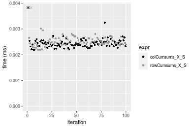

#### 100x100 integer matrix

```r
> X <- data[["100x100"]]
> rows <- sample.int(nrow(X), size = nrow(X) * 0.7)
> cols <- sample.int(ncol(X), size = ncol(X) * 0.7)
> X_S <- X[rows, cols]
> gc()
          used  (Mb) gc trigger  (Mb) max used  (Mb)
Ncells 5207495 278.2    7916910 422.9  7916910 422.9
Vcells 9509455  72.6   33191153 253.3 53339345 407.0
> colStats <- microbenchmark(colCumsums_X_S = colCumsums(X_S), `colCumsums(X, rows, cols)` = colCumsums(X, 
+     rows = rows, cols = cols), `colCummins(X[rows, cols])` = colCumsums(X[rows, cols]), unit = "ms")
> X <- t(X)
> X_S <- t(X_S)
> gc()
          used  (Mb) gc trigger  (Mb) max used  (Mb)
Ncells 5207489 278.2    7916910 422.9  7916910 422.9
Vcells 9514538  72.6   33191153 253.3 53339345 407.0
> rowStats <- microbenchmark(rowCumsums_X_S = rowCumsums(X_S), `rowCumsums(X, cols, rows)` = rowCumsums(X, 
+     rows = cols, cols = rows), `rowCumsums(X[cols, rows])` = rowCumsums(X[cols, rows]), unit = "ms")
```

_Table: Benchmarking of colCumsums_X_S(), colCumsums(X, rows, cols)() and colCummins(X[rows, cols])() on integer+100x100 data. The top panel shows times in milliseconds and the bottom panel shows relative times._


|   |expr                      |      min|       lq|      mean|    median|        uq|      max|
|:--|:-------------------------|--------:|--------:|---------:|---------:|---------:|--------:|
|1  |colCumsums_X_S            | 0.014966| 0.015374| 0.0158363| 0.0154960| 0.0156730| 0.027424|
|2  |colCumsums(X, rows, cols) | 0.023868| 0.024176| 0.0246965| 0.0243465| 0.0244700| 0.041711|
|3  |colCummins(X[rows, cols]) | 0.026372| 0.026909| 0.0281198| 0.0271350| 0.0273285| 0.059165|


|   |expr                      |      min|       lq|     mean|   median|       uq|      max|
|:--|:-------------------------|--------:|--------:|--------:|--------:|--------:|--------:|
|1  |colCumsums_X_S            | 1.000000| 1.000000| 1.000000| 1.000000| 1.000000| 1.000000|
|2  |colCumsums(X, rows, cols) | 1.594815| 1.572525| 1.559489| 1.571147| 1.561284| 1.520967|
|3  |colCummins(X[rows, cols]) | 1.762128| 1.750293| 1.775658| 1.751097| 1.743667| 2.157417|

_Table: Benchmarking of rowCumsums_X_S(), rowCumsums(X, cols, rows)() and rowCumsums(X[cols, rows])() on integer+100x100 data (transposed). The top panel shows times in milliseconds and the bottom panel shows relative times._


|   |expr                      |      min|        lq|      mean|    median|        uq|      max|
|:--|:-------------------------|--------:|---------:|---------:|---------:|---------:|--------:|
|1  |rowCumsums_X_S            | 0.020501| 0.0216520| 0.0222227| 0.0218275| 0.0222305| 0.031656|
|2  |rowCumsums(X, cols, rows) | 0.023009| 0.0242820| 0.0253671| 0.0244575| 0.0248665| 0.070186|
|3  |rowCumsums(X[cols, rows]) | 0.031315| 0.0329925| 0.0346110| 0.0332590| 0.0340310| 0.067481|


|   |expr                      |      min|       lq|     mean|  median|       uq|      max|
|:--|:-------------------------|--------:|--------:|--------:|-------:|--------:|--------:|
|1  |rowCumsums_X_S            | 1.000000| 1.000000| 1.000000| 1.00000| 1.000000| 1.000000|
|2  |rowCumsums(X, cols, rows) | 1.122335| 1.121467| 1.141493| 1.12049| 1.118576| 2.217147|
|3  |rowCumsums(X[cols, rows]) | 1.527486| 1.523762| 1.557458| 1.52372| 1.530825| 2.131697|

_Figure: Benchmarking of colCumsums_X_S(), colCumsums(X, rows, cols)() and colCummins(X[rows, cols])() on integer+100x100 data  as well as rowCumsums_X_S(), rowCumsums(X, cols, rows)() and rowCumsums(X[cols, rows])() on the same data transposed.  Outliers are displayed as crosses.  Times are in milliseconds._


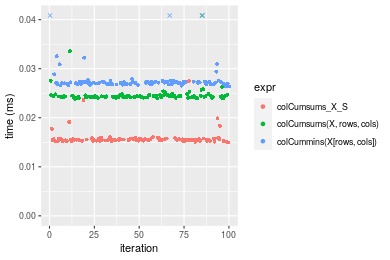


_Table: Benchmarking of colCumsums_X_S() and rowCumsums_X_S() on integer+100x100 data (original and transposed).  The top panel shows times in milliseconds and the bottom panel shows relative times._


|   |expr           |    min|     lq|     mean|  median|      uq|    max|
|:--|:--------------|------:|------:|--------:|-------:|-------:|------:|
|1  |colCumsums_X_S | 14.966| 15.374| 15.83628| 15.4960| 15.6730| 27.424|
|2  |rowCumsums_X_S | 20.501| 21.652| 22.22272| 21.8275| 22.2305| 31.656|


|   |expr           |      min|       lq|     mean|   median|       uq|      max|
|:--|:--------------|--------:|--------:|--------:|--------:|--------:|--------:|
|1  |colCumsums_X_S | 1.000000| 1.000000| 1.000000| 1.000000| 1.000000| 1.000000|
|2  |rowCumsums_X_S | 1.369838| 1.408352| 1.403279| 1.408589| 1.418395| 1.154317|

_Figure: Benchmarking of colCumsums_X_S() and rowCumsums_X_S() on integer+100x100 data (original and transposed).  Outliers are displayed as crosses. Times are in milliseconds._


#### 1000x10 integer matrix

```r
> X <- data[["1000x10"]]
> rows <- sample.int(nrow(X), size = nrow(X) * 0.7)
> cols <- sample.int(ncol(X), size = ncol(X) * 0.7)
> X_S <- X[rows, cols]
> gc()
          used  (Mb) gc trigger  (Mb) max used  (Mb)
Ncells 5208237 278.2    7916910 422.9  7916910 422.9
Vcells 9513506  72.6   33191153 253.3 53339345 407.0
> colStats <- microbenchmark(colCumsums_X_S = colCumsums(X_S), `colCumsums(X, rows, cols)` = colCumsums(X, 
+     rows = rows, cols = cols), `colCummins(X[rows, cols])` = colCumsums(X[rows, cols]), unit = "ms")
> X <- t(X)
> X_S <- t(X_S)
> gc()
          used  (Mb) gc trigger  (Mb) max used  (Mb)
Ncells 5208231 278.2    7916910 422.9  7916910 422.9
Vcells 9518589  72.7   33191153 253.3 53339345 407.0
> rowStats <- microbenchmark(rowCumsums_X_S = rowCumsums(X_S), `rowCumsums(X, cols, rows)` = rowCumsums(X, 
+     rows = cols, cols = rows), `rowCumsums(X[cols, rows])` = rowCumsums(X[cols, rows]), unit = "ms")
```

_Table: Benchmarking of colCumsums_X_S(), colCumsums(X, rows, cols)() and colCummins(X[rows, cols])() on integer+1000x10 data. The top panel shows times in milliseconds and the bottom panel shows relative times._


|   |expr                      |      min|       lq|      mean|    median|        uq|      max|
|:--|:-------------------------|--------:|--------:|---------:|---------:|---------:|--------:|
|1  |colCumsums_X_S            | 0.014539| 0.014901| 0.0153663| 0.0152690| 0.0154305| 0.030117|
|2  |colCumsums(X, rows, cols) | 0.023026| 0.024256| 0.0251102| 0.0246265| 0.0253655| 0.038718|
|3  |colCummins(X[rows, cols]) | 0.024820| 0.026322| 0.0273808| 0.0270345| 0.0276205| 0.052923|


|   |expr                      |      min|       lq|     mean|   median|       uq|      max|
|:--|:-------------------------|--------:|--------:|--------:|--------:|--------:|--------:|
|1  |colCumsums_X_S            | 1.000000| 1.000000| 1.000000| 1.000000| 1.000000| 1.000000|
|2  |colCumsums(X, rows, cols) | 1.583740| 1.627810| 1.634107| 1.612843| 1.643855| 1.285586|
|3  |colCummins(X[rows, cols]) | 1.707132| 1.766459| 1.781873| 1.770548| 1.789994| 1.757247|

_Table: Benchmarking of rowCumsums_X_S(), rowCumsums(X, cols, rows)() and rowCumsums(X[cols, rows])() on integer+1000x10 data (transposed). The top panel shows times in milliseconds and the bottom panel shows relative times._


|   |expr                      |      min|       lq|      mean|    median|       uq|      max|
|:--|:-------------------------|--------:|--------:|---------:|---------:|--------:|--------:|
|1  |rowCumsums_X_S            | 0.020600| 0.021898| 0.0229122| 0.0226535| 0.023488| 0.038163|
|2  |rowCumsums(X, cols, rows) | 0.024954| 0.026149| 0.0274845| 0.0276460| 0.028356| 0.039416|
|3  |rowCumsums(X[cols, rows]) | 0.033005| 0.034743| 0.0365598| 0.0361615| 0.037538| 0.065182|


|   |expr                      |      min|       lq|     mean|   median|       uq|      max|
|:--|:-------------------------|--------:|--------:|--------:|--------:|--------:|--------:|
|1  |rowCumsums_X_S            | 1.000000| 1.000000| 1.000000| 1.000000| 1.000000| 1.000000|
|2  |rowCumsums(X, cols, rows) | 1.211359| 1.194127| 1.199558| 1.220385| 1.207255| 1.032833|
|3  |rowCumsums(X[cols, rows]) | 1.602184| 1.586583| 1.595650| 1.596288| 1.598178| 1.707989|

_Figure: Benchmarking of colCumsums_X_S(), colCumsums(X, rows, cols)() and colCummins(X[rows, cols])() on integer+1000x10 data  as well as rowCumsums_X_S(), rowCumsums(X, cols, rows)() and rowCumsums(X[cols, rows])() on the same data transposed.  Outliers are displayed as crosses.  Times are in milliseconds._


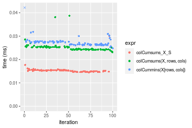


_Table: Benchmarking of colCumsums_X_S() and rowCumsums_X_S() on integer+1000x10 data (original and transposed).  The top panel shows times in milliseconds and the bottom panel shows relative times._


|   |expr           |    min|     lq|     mean|  median|      uq|    max|
|:--|:--------------|------:|------:|--------:|-------:|-------:|------:|
|1  |colCumsums_X_S | 14.539| 14.901| 15.36630| 15.2690| 15.4305| 30.117|
|2  |rowCumsums_X_S | 20.600| 21.898| 22.91216| 22.6535| 23.4880| 38.163|


|   |expr           |      min|       lq|     mean|   median|      uq|      max|
|:--|:--------------|--------:|--------:|--------:|--------:|-------:|--------:|
|1  |colCumsums_X_S | 1.000000| 1.000000| 1.000000| 1.000000| 1.00000| 1.000000|
|2  |rowCumsums_X_S | 1.416879| 1.469566| 1.491065| 1.483627| 1.52218| 1.267158|

_Figure: Benchmarking of colCumsums_X_S() and rowCumsums_X_S() on integer+1000x10 data (original and transposed).  Outliers are displayed as crosses. Times are in milliseconds._


#### 10x1000 integer matrix

```r
> X <- data[["10x1000"]]
> rows <- sample.int(nrow(X), size = nrow(X) * 0.7)
> cols <- sample.int(ncol(X), size = ncol(X) * 0.7)
> X_S <- X[rows, cols]
> gc()
          used  (Mb) gc trigger  (Mb) max used  (Mb)
Ncells 5208442 278.2    7916910 422.9  7916910 422.9
Vcells 9514334  72.6   33191153 253.3 53339345 407.0
> colStats <- microbenchmark(colCumsums_X_S = colCumsums(X_S), `colCumsums(X, rows, cols)` = colCumsums(X, 
+     rows = rows, cols = cols), `colCummins(X[rows, cols])` = colCumsums(X[rows, cols]), unit = "ms")
> X <- t(X)
> X_S <- t(X_S)
> gc()
          used  (Mb) gc trigger  (Mb) max used  (Mb)
Ncells 5208436 278.2    7916910 422.9  7916910 422.9
Vcells 9519417  72.7   33191153 253.3 53339345 407.0
> rowStats <- microbenchmark(rowCumsums_X_S = rowCumsums(X_S), `rowCumsums(X, cols, rows)` = rowCumsums(X, 
+     rows = cols, cols = rows), `rowCumsums(X[cols, rows])` = rowCumsums(X[cols, rows]), unit = "ms")
```

_Table: Benchmarking of colCumsums_X_S(), colCumsums(X, rows, cols)() and colCummins(X[rows, cols])() on integer+10x1000 data. The top panel shows times in milliseconds and the bottom panel shows relative times._


|   |expr                      |      min|        lq|      mean|   median|        uq|      max|
|:--|:-------------------------|--------:|---------:|---------:|--------:|---------:|--------:|
|1  |colCumsums_X_S            | 0.015101| 0.0159295| 0.0167881| 0.016561| 0.0167885| 0.035414|
|2  |colCumsums(X, rows, cols) | 0.025431| 0.0266525| 0.0277261| 0.027781| 0.0280280| 0.042531|
|3  |colCummins(X[rows, cols]) | 0.028260| 0.0299825| 0.0307777| 0.030895| 0.0311495| 0.043917|


|   |expr                      |      min|       lq|     mean|   median|       uq|      max|
|:--|:-------------------------|--------:|--------:|--------:|--------:|--------:|--------:|
|1  |colCumsums_X_S            | 1.000000| 1.000000| 1.000000| 1.000000| 1.000000| 1.000000|
|2  |colCumsums(X, rows, cols) | 1.684061| 1.673154| 1.651534| 1.677495| 1.669476| 1.200966|
|3  |colCummins(X[rows, cols]) | 1.871399| 1.882200| 1.833308| 1.865527| 1.855407| 1.240103|

_Table: Benchmarking of rowCumsums_X_S(), rowCumsums(X, cols, rows)() and rowCumsums(X[cols, rows])() on integer+10x1000 data (transposed). The top panel shows times in milliseconds and the bottom panel shows relative times._


|   |expr                      |      min|        lq|      mean|    median|        uq|      max|
|:--|:-------------------------|--------:|---------:|---------:|---------:|---------:|--------:|
|1  |rowCumsums_X_S            | 0.018594| 0.0201560| 0.0205578| 0.0203280| 0.0206045| 0.033723|
|2  |rowCumsums(X, cols, rows) | 0.021955| 0.0235780| 0.0246662| 0.0238220| 0.0241395| 0.063707|
|3  |rowCumsums(X[cols, rows]) | 0.029738| 0.0320155| 0.0324293| 0.0322925| 0.0326635| 0.047299|


|   |expr                      |      min|       lq|     mean|   median|       uq|      max|
|:--|:-------------------------|--------:|--------:|--------:|--------:|--------:|--------:|
|1  |rowCumsums_X_S            | 1.000000| 1.000000| 1.000000| 1.000000| 1.000000| 1.000000|
|2  |rowCumsums(X, cols, rows) | 1.180757| 1.169776| 1.199849| 1.171881| 1.171564| 1.889126|
|3  |rowCumsums(X[cols, rows]) | 1.599333| 1.588386| 1.577474| 1.588572| 1.585260| 1.402574|

_Figure: Benchmarking of colCumsums_X_S(), colCumsums(X, rows, cols)() and colCummins(X[rows, cols])() on integer+10x1000 data  as well as rowCumsums_X_S(), rowCumsums(X, cols, rows)() and rowCumsums(X[cols, rows])() on the same data transposed.  Outliers are displayed as crosses.  Times are in milliseconds._


_Table: Benchmarking of colCumsums_X_S() and rowCumsums_X_S() on integer+10x1000 data (original and transposed).  The top panel shows times in milliseconds and the bottom panel shows relative times._


|   |expr           |    min|      lq|     mean| median|      uq|    max|
|:--|:--------------|------:|-------:|--------:|------:|-------:|------:|
|1  |colCumsums_X_S | 15.101| 15.9295| 16.78808| 16.561| 16.7885| 35.414|
|2  |rowCumsums_X_S | 18.594| 20.1560| 20.55776| 20.328| 20.6045| 33.723|


|   |expr           |      min|       lq|     mean|   median|       uq|       max|
|:--|:--------------|--------:|--------:|--------:|--------:|--------:|---------:|
|1  |colCumsums_X_S | 1.000000| 1.000000| 1.000000| 1.000000| 1.000000| 1.0000000|
|2  |rowCumsums_X_S | 1.231309| 1.265325| 1.224545| 1.227462| 1.227298| 0.9522505|

_Figure: Benchmarking of colCumsums_X_S() and rowCumsums_X_S() on integer+10x1000 data (original and transposed).  Outliers are displayed as crosses. Times are in milliseconds._


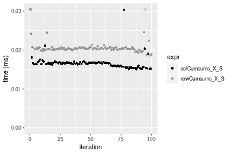

#### 100x1000 integer matrix

```r
> X <- data[["100x1000"]]
> rows <- sample.int(nrow(X), size = nrow(X) * 0.7)
> cols <- sample.int(ncol(X), size = ncol(X) * 0.7)
> X_S <- X[rows, cols]
> gc()
          used  (Mb) gc trigger  (Mb) max used  (Mb)
Ncells 5208653 278.2    7916910 422.9  7916910 422.9
Vcells 9537005  72.8   33191153 253.3 53339345 407.0
> colStats <- microbenchmark(colCumsums_X_S = colCumsums(X_S), `colCumsums(X, rows, cols)` = colCumsums(X, 
+     rows = rows, cols = cols), `colCummins(X[rows, cols])` = colCumsums(X[rows, cols]), unit = "ms")
> X <- t(X)
> X_S <- t(X_S)
> gc()
          used  (Mb) gc trigger  (Mb) max used  (Mb)
Ncells 5208647 278.2    7916910 422.9  7916910 422.9
Vcells 9587088  73.2   33191153 253.3 53339345 407.0
> rowStats <- microbenchmark(rowCumsums_X_S = rowCumsums(X_S), `rowCumsums(X, cols, rows)` = rowCumsums(X, 
+     rows = cols, cols = rows), `rowCumsums(X[cols, rows])` = rowCumsums(X[cols, rows]), unit = "ms")
```

_Table: Benchmarking of colCumsums_X_S(), colCumsums(X, rows, cols)() and colCummins(X[rows, cols])() on integer+100x1000 data. The top panel shows times in milliseconds and the bottom panel shows relative times._


|   |expr                      |      min|        lq|      mean|    median|        uq|      max|
|:--|:-------------------------|--------:|---------:|---------:|---------:|---------:|--------:|
|1  |colCumsums_X_S            | 0.085659| 0.0935475| 0.1058033| 0.1009105| 0.1145250| 0.152515|
|2  |colCumsums(X, rows, cols) | 0.143120| 0.1570405| 0.1777168| 0.1722325| 0.1949645| 0.284269|
|3  |colCummins(X[rows, cols]) | 0.157417| 0.1737415| 0.2003399| 0.1900500| 0.2192475| 0.320763|


|   |expr                      |      min|       lq|     mean|   median|       uq|      max|
|:--|:-------------------------|--------:|--------:|--------:|--------:|--------:|--------:|
|1  |colCumsums_X_S            | 1.000000| 1.000000| 1.000000| 1.000000| 1.000000| 1.000000|
|2  |colCumsums(X, rows, cols) | 1.670811| 1.678725| 1.679691| 1.706785| 1.702375| 1.863876|
|3  |colCummins(X[rows, cols]) | 1.837717| 1.857254| 1.893514| 1.883352| 1.914407| 2.103157|

_Table: Benchmarking of rowCumsums_X_S(), rowCumsums(X, cols, rows)() and rowCumsums(X[cols, rows])() on integer+100x1000 data (transposed). The top panel shows times in milliseconds and the bottom panel shows relative times._


|   |expr                      |      min|        lq|      mean|    median|        uq|      max|
|:--|:-------------------------|--------:|---------:|---------:|---------:|---------:|--------:|
|1  |rowCumsums_X_S            | 0.116090| 0.1361245| 0.1502013| 0.1459120| 0.1627330| 0.222236|
|2  |rowCumsums(X, cols, rows) | 0.131060| 0.1424760| 0.1632429| 0.1601415| 0.1759785| 0.274895|
|3  |rowCumsums(X[cols, rows]) | 0.179466| 0.2028175| 0.2281330| 0.2247085| 0.2418230| 0.314098|


|   |expr                      |      min|       lq|     mean|   median|       uq|      max|
|:--|:-------------------------|--------:|--------:|--------:|--------:|--------:|--------:|
|1  |rowCumsums_X_S            | 1.000000| 1.000000| 1.000000| 1.000000| 1.000000| 1.000000|
|2  |rowCumsums(X, cols, rows) | 1.128952| 1.046660| 1.086827| 1.097521| 1.081394| 1.236951|
|3  |rowCumsums(X[cols, rows]) | 1.545921| 1.489941| 1.518849| 1.540028| 1.486011| 1.413353|

_Figure: Benchmarking of colCumsums_X_S(), colCumsums(X, rows, cols)() and colCummins(X[rows, cols])() on integer+100x1000 data  as well as rowCumsums_X_S(), rowCumsums(X, cols, rows)() and rowCumsums(X[cols, rows])() on the same data transposed.  Outliers are displayed as crosses.  Times are in milliseconds._


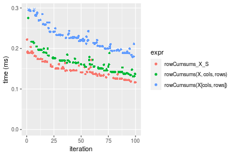
_Table: Benchmarking of colCumsums_X_S() and rowCumsums_X_S() on integer+100x1000 data (original and transposed).  The top panel shows times in milliseconds and the bottom panel shows relative times._


|   |expr           |     min|       lq|     mean|   median|      uq|     max|
|:--|:--------------|-------:|--------:|--------:|--------:|-------:|-------:|
|1  |colCumsums_X_S |  85.659|  93.5475| 105.8033| 100.9105| 114.525| 152.515|
|2  |rowCumsums_X_S | 116.090| 136.1245| 150.2013| 145.9120| 162.733| 222.236|


|   |expr           |      min|       lq|     mean|   median|       uq|      max|
|:--|:--------------|--------:|--------:|--------:|--------:|--------:|--------:|
|1  |colCumsums_X_S | 1.000000| 1.000000| 1.000000| 1.000000| 1.000000| 1.000000|
|2  |rowCumsums_X_S | 1.355258| 1.455138| 1.419628| 1.445955| 1.420939| 1.457142|

_Figure: Benchmarking of colCumsums_X_S() and rowCumsums_X_S() on integer+100x1000 data (original and transposed).  Outliers are displayed as crosses. Times are in milliseconds._


#### 1000x100 integer matrix

```r
> X <- data[["1000x100"]]
> rows <- sample.int(nrow(X), size = nrow(X) * 0.7)
> cols <- sample.int(ncol(X), size = ncol(X) * 0.7)
> X_S <- X[rows, cols]
> gc()
          used  (Mb) gc trigger  (Mb) max used  (Mb)
Ncells 5208863 278.2    7916910 422.9  7916910 422.9
Vcells 9537781  72.8   33191153 253.3 53339345 407.0
> colStats <- microbenchmark(colCumsums_X_S = colCumsums(X_S), `colCumsums(X, rows, cols)` = colCumsums(X, 
+     rows = rows, cols = cols), `colCummins(X[rows, cols])` = colCumsums(X[rows, cols]), unit = "ms")
> X <- t(X)
> X_S <- t(X_S)
> gc()
          used  (Mb) gc trigger  (Mb) max used  (Mb)
Ncells 5208857 278.2    7916910 422.9  7916910 422.9
Vcells 9587864  73.2   33191153 253.3 53339345 407.0
> rowStats <- microbenchmark(rowCumsums_X_S = rowCumsums(X_S), `rowCumsums(X, cols, rows)` = rowCumsums(X, 
+     rows = cols, cols = rows), `rowCumsums(X[cols, rows])` = rowCumsums(X[cols, rows]), unit = "ms")
```

_Table: Benchmarking of colCumsums_X_S(), colCumsums(X, rows, cols)() and colCummins(X[rows, cols])() on integer+1000x100 data. The top panel shows times in milliseconds and the bottom panel shows relative times._


|   |expr                      |      min|        lq|      mean|    median|        uq|      max|
|:--|:-------------------------|--------:|---------:|---------:|---------:|---------:|--------:|
|1  |colCumsums_X_S            | 0.085421| 0.0960880| 0.1051075| 0.1023735| 0.1125505| 0.158771|
|2  |colCumsums(X, rows, cols) | 0.142818| 0.1601600| 0.1767880| 0.1709135| 0.1898255| 0.232814|
|3  |colCummins(X[rows, cols]) | 0.154752| 0.1737175| 0.1935330| 0.1871860| 0.2144070| 0.295733|


|   |expr                      |      min|       lq|     mean|   median|       uq|      max|
|:--|:-------------------------|--------:|--------:|--------:|--------:|--------:|--------:|
|1  |colCumsums_X_S            | 1.000000| 1.000000| 1.000000| 1.000000| 1.000000| 1.000000|
|2  |colCumsums(X, rows, cols) | 1.671931| 1.666805| 1.681973| 1.669509| 1.686581| 1.466351|
|3  |colCummins(X[rows, cols]) | 1.811639| 1.807900| 1.841286| 1.828461| 1.904985| 1.862639|

_Table: Benchmarking of rowCumsums_X_S(), rowCumsums(X, cols, rows)() and rowCumsums(X[cols, rows])() on integer+1000x100 data (transposed). The top panel shows times in milliseconds and the bottom panel shows relative times._


|   |expr                      |      min|        lq|      mean|    median|        uq|      max|
|:--|:-------------------------|--------:|---------:|---------:|---------:|---------:|--------:|
|1  |rowCumsums_X_S            | 0.120129| 0.1305330| 0.1520348| 0.1486140| 0.1692605| 0.234467|
|2  |rowCumsums(X, cols, rows) | 0.134202| 0.1560545| 0.1767003| 0.1693115| 0.1873500| 0.342235|
|3  |rowCumsums(X[cols, rows]) | 0.184329| 0.2055035| 0.2388848| 0.2318885| 0.2660125| 0.392404|


|   |expr                      |      min|       lq|     mean|   median|       uq|     max|
|:--|:-------------------------|--------:|--------:|--------:|--------:|--------:|-------:|
|1  |rowCumsums_X_S            | 1.000000| 1.000000| 1.000000| 1.000000| 1.000000| 1.00000|
|2  |rowCumsums(X, cols, rows) | 1.117149| 1.195518| 1.162236| 1.139270| 1.106874| 1.45963|
|3  |rowCumsums(X[cols, rows]) | 1.534425| 1.574341| 1.571250| 1.560341| 1.571616| 1.67360|

_Figure: Benchmarking of colCumsums_X_S(), colCumsums(X, rows, cols)() and colCummins(X[rows, cols])() on integer+1000x100 data  as well as rowCumsums_X_S(), rowCumsums(X, cols, rows)() and rowCumsums(X[cols, rows])() on the same data transposed.  Outliers are displayed as crosses.  Times are in milliseconds._


_Table: Benchmarking of colCumsums_X_S() and rowCumsums_X_S() on integer+1000x100 data (original and transposed).  The top panel shows times in milliseconds and the bottom panel shows relative times._


|   |expr           |     min|      lq|     mean|   median|       uq|     max|
|:--|:--------------|-------:|-------:|--------:|--------:|--------:|-------:|
|1  |colCumsums_X_S |  85.421|  96.088| 105.1075| 102.3735| 112.5505| 158.771|
|2  |rowCumsums_X_S | 120.129| 130.533| 152.0349| 148.6140| 169.2605| 234.467|


|   |expr           |      min|       lq|    mean|   median|       uq|      max|
|:--|:--------------|--------:|--------:|-------:|--------:|--------:|--------:|
|1  |colCumsums_X_S | 1.000000| 1.000000| 1.00000| 1.000000| 1.000000| 1.000000|
|2  |rowCumsums_X_S | 1.406317| 1.358473| 1.44647| 1.451684| 1.503863| 1.476762|

_Figure: Benchmarking of colCumsums_X_S() and rowCumsums_X_S() on integer+1000x100 data (original and transposed).  Outliers are displayed as crosses. Times are in milliseconds._


## Data type "double"

### Data
```r
> rmatrix <- function(nrow, ncol, mode = c("logical", "double", "integer", "index"), range = c(-100, 
+     +100), na_prob = 0) {
+     mode <- match.arg(mode)
+     n <- nrow * ncol
+     if (mode == "logical") {
+         x <- sample(c(FALSE, TRUE), size = n, replace = TRUE)
+     }     else if (mode == "index") {
+         x <- seq_len(n)
+         mode <- "integer"
+     }     else {
+         x <- runif(n, min = range[1], max = range[2])
+     }
+     storage.mode(x) <- mode
+     if (na_prob > 0) 
+         x[sample(n, size = na_prob * n)] <- NA
+     dim(x) <- c(nrow, ncol)
+     x
+ }
> rmatrices <- function(scale = 10, seed = 1, ...) {
+     set.seed(seed)
+     data <- list()
+     data[[1]] <- rmatrix(nrow = scale * 1, ncol = scale * 1, ...)
+     data[[2]] <- rmatrix(nrow = scale * 10, ncol = scale * 10, ...)
+     data[[3]] <- rmatrix(nrow = scale * 100, ncol = scale * 1, ...)
+     data[[4]] <- t(data[[3]])
+     data[[5]] <- rmatrix(nrow = scale * 10, ncol = scale * 100, ...)
+     data[[6]] <- t(data[[5]])
+     names(data) <- sapply(data, FUN = function(x) paste(dim(x), collapse = "x"))
+     data
+ }
> data <- rmatrices(mode = mode)
```

### Results

#### 10x10 double matrix

```r
> X <- data[["10x10"]]
> rows <- sample.int(nrow(X), size = nrow(X) * 0.7)
> cols <- sample.int(ncol(X), size = ncol(X) * 0.7)
> X_S <- X[rows, cols]
> gc()
          used  (Mb) gc trigger  (Mb) max used  (Mb)
Ncells 5209081 278.2    7916910 422.9  7916910 422.9
Vcells 9628888  73.5   33191153 253.3 53339345 407.0
> colStats <- microbenchmark(colCumsums_X_S = colCumsums(X_S), `colCumsums(X, rows, cols)` = colCumsums(X, 
+     rows = rows, cols = cols), `colCummins(X[rows, cols])` = colCumsums(X[rows, cols]), unit = "ms")
> X <- t(X)
> X_S <- t(X_S)
> gc()
          used  (Mb) gc trigger  (Mb) max used  (Mb)
Ncells 5209066 278.2    7916910 422.9  7916910 422.9
Vcells 9629056  73.5   33191153 253.3 53339345 407.0
> rowStats <- microbenchmark(rowCumsums_X_S = rowCumsums(X_S), `rowCumsums(X, cols, rows)` = rowCumsums(X, 
+     rows = cols, cols = rows), `rowCumsums(X[cols, rows])` = rowCumsums(X[cols, rows]), unit = "ms")
```

_Table: Benchmarking of colCumsums_X_S(), colCumsums(X, rows, cols)() and colCummins(X[rows, cols])() on double+10x10 data. The top panel shows times in milliseconds and the bottom panel shows relative times._


|   |expr                      |      min|        lq|      mean|    median|        uq|      max|
|:--|:-------------------------|--------:|---------:|---------:|---------:|---------:|--------:|
|1  |colCumsums_X_S            | 0.002109| 0.0022375| 0.0025103| 0.0023225| 0.0024230| 0.016412|
|2  |colCumsums(X, rows, cols) | 0.002292| 0.0025845| 0.0027037| 0.0026600| 0.0027540| 0.005152|
|3  |colCummins(X[rows, cols]) | 0.003126| 0.0033755| 0.0035408| 0.0034990| 0.0036175| 0.007606|


|   |expr                      |      min|       lq|     mean|   median|       uq|       max|
|:--|:-------------------------|--------:|--------:|--------:|--------:|--------:|---------:|
|1  |colCumsums_X_S            | 1.000000| 1.000000| 1.000000| 1.000000| 1.000000| 1.0000000|
|2  |colCumsums(X, rows, cols) | 1.086771| 1.155084| 1.077076| 1.145317| 1.136607| 0.3139166|
|3  |colCummins(X[rows, cols]) | 1.482219| 1.508603| 1.410539| 1.506566| 1.492984| 0.4634414|

_Table: Benchmarking of rowCumsums_X_S(), rowCumsums(X, cols, rows)() and rowCumsums(X[cols, rows])() on double+10x10 data (transposed). The top panel shows times in milliseconds and the bottom panel shows relative times._


|   |expr                      |      min|        lq|      mean|    median|        uq|      max|
|:--|:-------------------------|--------:|---------:|---------:|---------:|---------:|--------:|
|1  |rowCumsums_X_S            | 0.002113| 0.0023265| 0.0027674| 0.0024285| 0.0025725| 0.010611|
|2  |rowCumsums(X, cols, rows) | 0.002334| 0.0026040| 0.0031750| 0.0027805| 0.0029730| 0.019302|
|3  |rowCumsums(X[cols, rows]) | 0.003246| 0.0035160| 0.0039242| 0.0036210| 0.0037795| 0.010398|


|   |expr                      |      min|       lq|     mean|   median|       uq|       max|
|:--|:-------------------------|--------:|--------:|--------:|--------:|--------:|---------:|
|1  |rowCumsums_X_S            | 1.000000| 1.000000| 1.000000| 1.000000| 1.000000| 1.0000000|
|2  |rowCumsums(X, cols, rows) | 1.104591| 1.119278| 1.147272| 1.144945| 1.155685| 1.8190557|
|3  |rowCumsums(X[cols, rows]) | 1.536204| 1.511283| 1.418008| 1.491044| 1.469193| 0.9799265|

_Figure: Benchmarking of colCumsums_X_S(), colCumsums(X, rows, cols)() and colCummins(X[rows, cols])() on double+10x10 data  as well as rowCumsums_X_S(), rowCumsums(X, cols, rows)() and rowCumsums(X[cols, rows])() on the same data transposed.  Outliers are displayed as crosses.  Times are in milliseconds._


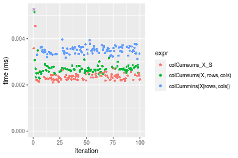

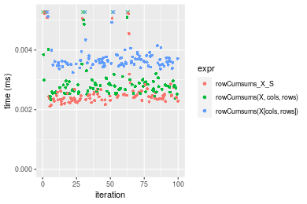
_Table: Benchmarking of colCumsums_X_S() and rowCumsums_X_S() on double+10x10 data (original and transposed).  The top panel shows times in milliseconds and the bottom panel shows relative times._


|   |expr           |   min|     lq|    mean| median|     uq|    max|
|:--|:--------------|-----:|------:|-------:|------:|------:|------:|
|1  |colCumsums_X_S | 2.109| 2.2375| 2.51026| 2.3225| 2.4230| 16.412|
|2  |rowCumsums_X_S | 2.113| 2.3265| 2.76739| 2.4285| 2.5725| 10.611|


|   |expr           |      min|       lq|     mean|  median|     uq|       max|
|:--|:--------------|--------:|--------:|--------:|-------:|------:|---------:|
|1  |colCumsums_X_S | 1.000000| 1.000000| 1.000000| 1.00000| 1.0000| 1.0000000|
|2  |rowCumsums_X_S | 1.001897| 1.039777| 1.102432| 1.04564| 1.0617| 0.6465391|

_Figure: Benchmarking of colCumsums_X_S() and rowCumsums_X_S() on double+10x10 data (original and transposed).  Outliers are displayed as crosses. Times are in milliseconds._


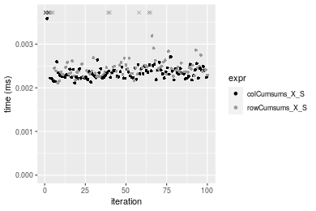

#### 100x100 double matrix

```r
> X <- data[["100x100"]]
> rows <- sample.int(nrow(X), size = nrow(X) * 0.7)
> cols <- sample.int(ncol(X), size = ncol(X) * 0.7)
> X_S <- X[rows, cols]
> gc()
          used  (Mb) gc trigger  (Mb) max used  (Mb)
Ncells 5209280 278.3    7916910 422.9  7916910 422.9
Vcells 9634838  73.6   33191153 253.3 53339345 407.0
> colStats <- microbenchmark(colCumsums_X_S = colCumsums(X_S), `colCumsums(X, rows, cols)` = colCumsums(X, 
+     rows = rows, cols = cols), `colCummins(X[rows, cols])` = colCumsums(X[rows, cols]), unit = "ms")
> X <- t(X)
> X_S <- t(X_S)
> gc()
          used  (Mb) gc trigger  (Mb) max used  (Mb)
Ncells 5209274 278.3    7916910 422.9  7916910 422.9
Vcells 9644921  73.6   33191153 253.3 53339345 407.0
> rowStats <- microbenchmark(rowCumsums_X_S = rowCumsums(X_S), `rowCumsums(X, cols, rows)` = rowCumsums(X, 
+     rows = cols, cols = rows), `rowCumsums(X[cols, rows])` = rowCumsums(X[cols, rows]), unit = "ms")
```

_Table: Benchmarking of colCumsums_X_S(), colCumsums(X, rows, cols)() and colCummins(X[rows, cols])() on double+100x100 data. The top panel shows times in milliseconds and the bottom panel shows relative times._


|   |expr                      |      min|       lq|      mean|    median|        uq|      max|
|:--|:-------------------------|--------:|--------:|---------:|---------:|---------:|--------:|
|1  |colCumsums_X_S            | 0.008385| 0.008832| 0.0091381| 0.0090265| 0.0092485| 0.012737|
|2  |colCumsums(X, rows, cols) | 0.013312| 0.013789| 0.0140690| 0.0140650| 0.0142015| 0.017707|
|3  |colCummins(X[rows, cols]) | 0.024722| 0.025222| 0.0262576| 0.0253960| 0.0256840| 0.057829|


|   |expr                      |      min|       lq|     mean|   median|       uq|      max|
|:--|:-------------------------|--------:|--------:|--------:|--------:|--------:|--------:|
|1  |colCumsums_X_S            | 1.000000| 1.000000| 1.000000| 1.000000| 1.000000| 1.000000|
|2  |colCumsums(X, rows, cols) | 1.587597| 1.561254| 1.539601| 1.558190| 1.535546| 1.390202|
|3  |colCummins(X[rows, cols]) | 2.948360| 2.855752| 2.873430| 2.813494| 2.777099| 4.540237|

_Table: Benchmarking of rowCumsums_X_S(), rowCumsums(X, cols, rows)() and rowCumsums(X[cols, rows])() on double+100x100 data (transposed). The top panel shows times in milliseconds and the bottom panel shows relative times._


|   |expr                      |      min|        lq|      mean|   median|        uq|      max|
|:--|:-------------------------|--------:|---------:|---------:|--------:|---------:|--------:|
|1  |rowCumsums_X_S            | 0.006892| 0.0076505| 0.0082450| 0.008164| 0.0085210| 0.013263|
|2  |rowCumsums(X, cols, rows) | 0.013694| 0.0140090| 0.0149928| 0.014199| 0.0144140| 0.045128|
|3  |rowCumsums(X[cols, rows]) | 0.023596| 0.0240160| 0.0249024| 0.024710| 0.0252885| 0.035033|


|   |expr                      |      min|       lq|     mean|   median|       uq|      max|
|:--|:-------------------------|--------:|--------:|--------:|--------:|--------:|--------:|
|1  |rowCumsums_X_S            | 1.000000| 1.000000| 1.000000| 1.000000| 1.000000| 1.000000|
|2  |rowCumsums(X, cols, rows) | 1.986941| 1.831122| 1.818416| 1.739221| 1.691585| 3.402548|
|3  |rowCumsums(X[cols, rows]) | 3.423680| 3.139141| 3.020310| 3.026703| 2.967786| 2.641408|

_Figure: Benchmarking of colCumsums_X_S(), colCumsums(X, rows, cols)() and colCummins(X[rows, cols])() on double+100x100 data  as well as rowCumsums_X_S(), rowCumsums(X, cols, rows)() and rowCumsums(X[cols, rows])() on the same data transposed.  Outliers are displayed as crosses.  Times are in milliseconds._


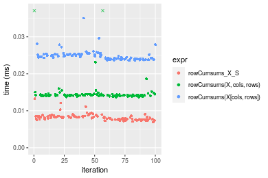
_Table: Benchmarking of colCumsums_X_S() and rowCumsums_X_S() on double+100x100 data (original and transposed).  The top panel shows times in milliseconds and the bottom panel shows relative times._


|   |expr           |   min|     lq|    mean| median|     uq|    max|
|:--|:--------------|-----:|------:|-------:|------:|------:|------:|
|2  |rowCumsums_X_S | 6.892| 7.6505| 8.24499| 8.1640| 8.5210| 13.263|
|1  |colCumsums_X_S | 8.385| 8.8320| 9.13808| 9.0265| 9.2485| 12.737|


|   |expr           |      min|       lq|     mean|   median|       uq|       max|
|:--|:--------------|--------:|--------:|--------:|--------:|--------:|---------:|
|2  |rowCumsums_X_S | 1.000000| 1.000000| 1.000000| 1.000000| 1.000000| 1.0000000|
|1  |colCumsums_X_S | 1.216628| 1.154434| 1.108319| 1.105647| 1.085377| 0.9603408|

_Figure: Benchmarking of colCumsums_X_S() and rowCumsums_X_S() on double+100x100 data (original and transposed).  Outliers are displayed as crosses. Times are in milliseconds._


#### 1000x10 double matrix

```r
> X <- data[["1000x10"]]
> rows <- sample.int(nrow(X), size = nrow(X) * 0.7)
> cols <- sample.int(ncol(X), size = ncol(X) * 0.7)
> X_S <- X[rows, cols]
> gc()
          used  (Mb) gc trigger  (Mb) max used  (Mb)
Ncells 5209479 278.3    7916910 422.9  7916910 422.9
Vcells 9636239  73.6   33191153 253.3 53339345 407.0
> colStats <- microbenchmark(colCumsums_X_S = colCumsums(X_S), `colCumsums(X, rows, cols)` = colCumsums(X, 
+     rows = rows, cols = cols), `colCummins(X[rows, cols])` = colCumsums(X[rows, cols]), unit = "ms")
> X <- t(X)
> X_S <- t(X_S)
> gc()
          used  (Mb) gc trigger  (Mb) max used  (Mb)
Ncells 5209473 278.3    7916910 422.9  7916910 422.9
Vcells 9646322  73.6   33191153 253.3 53339345 407.0
> rowStats <- microbenchmark(rowCumsums_X_S = rowCumsums(X_S), `rowCumsums(X, cols, rows)` = rowCumsums(X, 
+     rows = cols, cols = rows), `rowCumsums(X[cols, rows])` = rowCumsums(X[cols, rows]), unit = "ms")
```

_Table: Benchmarking of colCumsums_X_S(), colCumsums(X, rows, cols)() and colCummins(X[rows, cols])() on double+1000x10 data. The top panel shows times in milliseconds and the bottom panel shows relative times._


|   |expr                      |      min|        lq|      mean|    median|        uq|      max|
|:--|:-------------------------|--------:|---------:|---------:|---------:|---------:|--------:|
|1  |colCumsums_X_S            | 0.010257| 0.0109105| 0.0114655| 0.0110805| 0.0112095| 0.042591|
|2  |colCumsums(X, rows, cols) | 0.014083| 0.0150475| 0.0155989| 0.0152585| 0.0155235| 0.030346|
|3  |colCummins(X[rows, cols]) | 0.026451| 0.0278425| 0.0288871| 0.0280870| 0.0283535| 0.057928|


|   |expr                      |      min|       lq|     mean|   median|       uq|       max|
|:--|:-------------------------|--------:|--------:|--------:|--------:|--------:|---------:|
|1  |colCumsums_X_S            | 1.000000| 1.000000| 1.000000| 1.000000| 1.000000| 1.0000000|
|2  |colCumsums(X, rows, cols) | 1.373014| 1.379176| 1.360508| 1.377059| 1.384852| 0.7124979|
|3  |colCummins(X[rows, cols]) | 2.578824| 2.551900| 2.519485| 2.534813| 2.529417| 1.3600996|

_Table: Benchmarking of rowCumsums_X_S(), rowCumsums(X, cols, rows)() and rowCumsums(X[cols, rows])() on double+1000x10 data (transposed). The top panel shows times in milliseconds and the bottom panel shows relative times._


|   |expr                      |      min|        lq|      mean|    median|        uq|      max|
|:--|:-------------------------|--------:|---------:|---------:|---------:|---------:|--------:|
|1  |rowCumsums_X_S            | 0.009068| 0.0097245| 0.0109601| 0.0102480| 0.0110915| 0.018957|
|2  |rowCumsums(X, cols, rows) | 0.017052| 0.0177405| 0.0197559| 0.0180285| 0.0186185| 0.049472|
|3  |rowCumsums(X[cols, rows]) | 0.029108| 0.0298330| 0.0330052| 0.0307890| 0.0314115| 0.100503|


|   |expr                      |      min|       lq|     mean|   median|       uq|      max|
|:--|:-------------------------|--------:|--------:|--------:|--------:|--------:|--------:|
|1  |rowCumsums_X_S            | 1.000000| 1.000000| 1.000000| 1.000000| 1.000000| 1.000000|
|2  |rowCumsums(X, cols, rows) | 1.880459| 1.824310| 1.802529| 1.759221| 1.678628| 2.609696|
|3  |rowCumsums(X[cols, rows]) | 3.209969| 3.067818| 3.011400| 3.004391| 2.832034| 5.301630|

_Figure: Benchmarking of colCumsums_X_S(), colCumsums(X, rows, cols)() and colCummins(X[rows, cols])() on double+1000x10 data  as well as rowCumsums_X_S(), rowCumsums(X, cols, rows)() and rowCumsums(X[cols, rows])() on the same data transposed.  Outliers are displayed as crosses.  Times are in milliseconds._


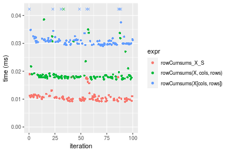
_Table: Benchmarking of colCumsums_X_S() and rowCumsums_X_S() on double+1000x10 data (original and transposed).  The top panel shows times in milliseconds and the bottom panel shows relative times._


|   |expr           |    min|      lq|     mean|  median|      uq|    max|
|:--|:--------------|------:|-------:|--------:|-------:|-------:|------:|
|2  |rowCumsums_X_S |  9.068|  9.7245| 10.96010| 10.2480| 11.0915| 18.957|
|1  |colCumsums_X_S | 10.257| 10.9105| 11.46547| 11.0805| 11.2095| 42.591|


|   |expr           |     min|      lq|    mean|   median|       uq|      max|
|:--|:--------------|-------:|-------:|-------:|--------:|--------:|--------:|
|2  |rowCumsums_X_S | 1.00000| 1.00000| 1.00000| 1.000000| 1.000000| 1.000000|
|1  |colCumsums_X_S | 1.13112| 1.12196| 1.04611| 1.081235| 1.010639| 2.246716|

_Figure: Benchmarking of colCumsums_X_S() and rowCumsums_X_S() on double+1000x10 data (original and transposed).  Outliers are displayed as crosses. Times are in milliseconds._


#### 10x1000 double matrix

```r
> X <- data[["10x1000"]]
> rows <- sample.int(nrow(X), size = nrow(X) * 0.7)
> cols <- sample.int(ncol(X), size = ncol(X) * 0.7)
> X_S <- X[rows, cols]
> gc()
          used  (Mb) gc trigger  (Mb) max used  (Mb)
Ncells 5209684 278.3    7916910 422.9  7916910 422.9
Vcells 9636375  73.6   33191153 253.3 53339345 407.0
> colStats <- microbenchmark(colCumsums_X_S = colCumsums(X_S), `colCumsums(X, rows, cols)` = colCumsums(X, 
+     rows = rows, cols = cols), `colCummins(X[rows, cols])` = colCumsums(X[rows, cols]), unit = "ms")
> X <- t(X)
> X_S <- t(X_S)
> gc()
          used  (Mb) gc trigger  (Mb) max used  (Mb)
Ncells 5209678 278.3    7916910 422.9  7916910 422.9
Vcells 9646458  73.6   33191153 253.3 53339345 407.0
> rowStats <- microbenchmark(rowCumsums_X_S = rowCumsums(X_S), `rowCumsums(X, cols, rows)` = rowCumsums(X, 
+     rows = cols, cols = rows), `rowCumsums(X[cols, rows])` = rowCumsums(X[cols, rows]), unit = "ms")
```

_Table: Benchmarking of colCumsums_X_S(), colCumsums(X, rows, cols)() and colCummins(X[rows, cols])() on double+10x1000 data. The top panel shows times in milliseconds and the bottom panel shows relative times._


|   |expr                      |      min|        lq|      mean|    median|        uq|      max|
|:--|:-------------------------|--------:|---------:|---------:|---------:|---------:|--------:|
|1  |colCumsums_X_S            | 0.008074| 0.0088665| 0.0102586| 0.0091860| 0.0097660| 0.048346|
|2  |colCumsums(X, rows, cols) | 0.015422| 0.0162015| 0.0178825| 0.0166055| 0.0175145| 0.036718|
|3  |colCummins(X[rows, cols]) | 0.027596| 0.0290160| 0.0315073| 0.0292980| 0.0300845| 0.069444|


|   |expr                      |      min|       lq|     mean|   median|       uq|       max|
|:--|:-------------------------|--------:|--------:|--------:|--------:|--------:|---------:|
|1  |colCumsums_X_S            | 1.000000| 1.000000| 1.000000| 1.000000| 1.000000| 1.0000000|
|2  |colCumsums(X, rows, cols) | 1.910082| 1.827271| 1.743170| 1.807697| 1.793416| 0.7594837|
|3  |colCummins(X[rows, cols]) | 3.417885| 3.272543| 3.071309| 3.189419| 3.080535| 1.4363960|

_Table: Benchmarking of rowCumsums_X_S(), rowCumsums(X, cols, rows)() and rowCumsums(X[cols, rows])() on double+10x1000 data (transposed). The top panel shows times in milliseconds and the bottom panel shows relative times._


|   |expr                      |      min|        lq|      mean|    median|        uq|      max|
|:--|:-------------------------|--------:|---------:|---------:|---------:|---------:|--------:|
|1  |rowCumsums_X_S            | 0.006717| 0.0075325| 0.0081717| 0.0080655| 0.0083825| 0.017332|
|2  |rowCumsums(X, cols, rows) | 0.014666| 0.0150885| 0.0156827| 0.0152660| 0.0154865| 0.038996|
|3  |rowCumsums(X[cols, rows]) | 0.023749| 0.0244450| 0.0255443| 0.0250915| 0.0256115| 0.056241|


|   |expr                      |      min|       lq|     mean|   median|       uq|      max|
|:--|:-------------------------|--------:|--------:|--------:|--------:|--------:|--------:|
|1  |rowCumsums_X_S            | 1.000000| 1.000000| 1.000000| 1.000000| 1.000000| 1.000000|
|2  |rowCumsums(X, cols, rows) | 2.183415| 2.003120| 1.919141| 1.892753| 1.847480| 2.249942|
|3  |rowCumsums(X[cols, rows]) | 3.535656| 3.245271| 3.125940| 3.110966| 3.055353| 3.244923|

_Figure: Benchmarking of colCumsums_X_S(), colCumsums(X, rows, cols)() and colCummins(X[rows, cols])() on double+10x1000 data  as well as rowCumsums_X_S(), rowCumsums(X, cols, rows)() and rowCumsums(X[cols, rows])() on the same data transposed.  Outliers are displayed as crosses.  Times are in milliseconds._


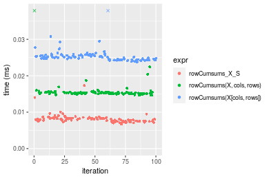
_Table: Benchmarking of colCumsums_X_S() and rowCumsums_X_S() on double+10x1000 data (original and transposed).  The top panel shows times in milliseconds and the bottom panel shows relative times._


|   |expr           |   min|     lq|     mean| median|     uq|    max|
|:--|:--------------|-----:|------:|--------:|------:|------:|------:|
|2  |rowCumsums_X_S | 6.717| 7.5325|  8.17173| 8.0655| 8.3825| 17.332|
|1  |colCumsums_X_S | 8.074| 8.8665| 10.25858| 9.1860| 9.7660| 48.346|


|   |expr           |      min|       lq|     mean|   median|       uq|      max|
|:--|:--------------|--------:|--------:|--------:|--------:|--------:|--------:|
|2  |rowCumsums_X_S | 1.000000| 1.000000| 1.000000| 1.000000| 1.000000| 1.000000|
|1  |colCumsums_X_S | 1.202025| 1.177099| 1.255374| 1.138925| 1.165046| 2.789407|

_Figure: Benchmarking of colCumsums_X_S() and rowCumsums_X_S() on double+10x1000 data (original and transposed).  Outliers are displayed as crosses. Times are in milliseconds._


#### 100x1000 double matrix

```r
> X <- data[["100x1000"]]
> rows <- sample.int(nrow(X), size = nrow(X) * 0.7)
> cols <- sample.int(ncol(X), size = ncol(X) * 0.7)
> X_S <- X[rows, cols]
> gc()
          used  (Mb) gc trigger  (Mb) max used  (Mb)
Ncells 5209895 278.3    7916910 422.9  7916910 422.9
Vcells 9681827  73.9   33191153 253.3 53339345 407.0
> colStats <- microbenchmark(colCumsums_X_S = colCumsums(X_S), `colCumsums(X, rows, cols)` = colCumsums(X, 
+     rows = rows, cols = cols), `colCummins(X[rows, cols])` = colCumsums(X[rows, cols]), unit = "ms")
> X <- t(X)
> X_S <- t(X_S)
> gc()
          used  (Mb) gc trigger  (Mb) max used  (Mb)
Ncells 5209889 278.3    7916910 422.9  7916910 422.9
Vcells 9781910  74.7   33191153 253.3 53339345 407.0
> rowStats <- microbenchmark(rowCumsums_X_S = rowCumsums(X_S), `rowCumsums(X, cols, rows)` = rowCumsums(X, 
+     rows = cols, cols = rows), `rowCumsums(X[cols, rows])` = rowCumsums(X[cols, rows]), unit = "ms")
```

_Table: Benchmarking of colCumsums_X_S(), colCumsums(X, rows, cols)() and colCummins(X[rows, cols])() on double+100x1000 data. The top panel shows times in milliseconds and the bottom panel shows relative times._


|   |expr                      |      min|        lq|      mean|    median|        uq|      max|
|:--|:-------------------------|--------:|---------:|---------:|---------:|---------:|--------:|
|1  |colCumsums_X_S            | 0.052834| 0.0604730| 0.0887941| 0.0680615| 0.0867560| 0.271492|
|2  |colCumsums(X, rows, cols) | 0.094961| 0.0992340| 0.1383374| 0.1064625| 0.1384710| 0.371713|
|3  |colCummins(X[rows, cols]) | 0.178834| 0.1890475| 0.2551509| 0.2082200| 0.2843435| 0.672803|


|   |expr                      |      min|       lq|     mean|   median|       uq|      max|
|:--|:-------------------------|--------:|--------:|--------:|--------:|--------:|--------:|
|1  |colCumsums_X_S            | 1.000000| 1.000000| 1.000000| 1.000000| 1.000000| 1.000000|
|2  |colCumsums(X, rows, cols) | 1.797346| 1.640964| 1.557956| 1.564210| 1.596097| 1.369149|
|3  |colCummins(X[rows, cols]) | 3.384828| 3.126147| 2.873511| 3.059292| 3.277508| 2.478169|

_Table: Benchmarking of rowCumsums_X_S(), rowCumsums(X, cols, rows)() and rowCumsums(X[cols, rows])() on double+100x1000 data (transposed). The top panel shows times in milliseconds and the bottom panel shows relative times._


|   |expr                      |      min|        lq|      mean|    median|        uq|      max|
|:--|:-------------------------|--------:|---------:|---------:|---------:|---------:|--------:|
|1  |rowCumsums_X_S            | 0.040027| 0.0418715| 0.0494413| 0.0440965| 0.0505560| 0.107859|
|2  |rowCumsums(X, cols, rows) | 0.083877| 0.0872310| 0.0955318| 0.0892380| 0.0931000| 0.164449|
|3  |rowCumsums(X[cols, rows]) | 0.157927| 0.1653100| 0.1802106| 0.1691215| 0.1768535| 0.303600|


|   |expr                      |      min|       lq|     mean|   median|       uq|      max|
|:--|:-------------------------|--------:|--------:|--------:|--------:|--------:|--------:|
|1  |rowCumsums_X_S            | 1.000000| 1.000000| 1.000000| 1.000000| 1.000000| 1.000000|
|2  |rowCumsums(X, cols, rows) | 2.095511| 2.083302| 1.932228| 2.023698| 1.841522| 1.524666|
|3  |rowCumsums(X[cols, rows]) | 3.945512| 3.948031| 3.644943| 3.835259| 3.498170| 2.814786|

_Figure: Benchmarking of colCumsums_X_S(), colCumsums(X, rows, cols)() and colCummins(X[rows, cols])() on double+100x1000 data  as well as rowCumsums_X_S(), rowCumsums(X, cols, rows)() and rowCumsums(X[cols, rows])() on the same data transposed.  Outliers are displayed as crosses.  Times are in milliseconds._


_Table: Benchmarking of colCumsums_X_S() and rowCumsums_X_S() on double+100x1000 data (original and transposed).  The top panel shows times in milliseconds and the bottom panel shows relative times._


|   |expr           |    min|      lq|     mean|  median|     uq|     max|
|:--|:--------------|------:|-------:|--------:|-------:|------:|-------:|
|2  |rowCumsums_X_S | 40.027| 41.8715| 49.44127| 44.0965| 50.556| 107.859|
|1  |colCumsums_X_S | 52.834| 60.4730| 88.79412| 68.0615| 86.756| 271.492|


|   |expr           |      min|       lq|     mean|   median|       uq|      max|
|:--|:--------------|--------:|--------:|--------:|--------:|--------:|--------:|
|2  |rowCumsums_X_S | 1.000000| 1.000000| 1.000000| 1.000000| 1.000000| 1.000000|
|1  |colCumsums_X_S | 1.319959| 1.444252| 1.795951| 1.543467| 1.716038| 2.517101|

_Figure: Benchmarking of colCumsums_X_S() and rowCumsums_X_S() on double+100x1000 data (original and transposed).  Outliers are displayed as crosses. Times are in milliseconds._


#### 1000x100 double matrix

```r
> X <- data[["1000x100"]]
> rows <- sample.int(nrow(X), size = nrow(X) * 0.7)
> cols <- sample.int(ncol(X), size = ncol(X) * 0.7)
> X_S <- X[rows, cols]
> gc()
          used  (Mb) gc trigger  (Mb) max used  (Mb)
Ncells 5210105 278.3    7916910 422.9  7916910 422.9
Vcells 9681968  73.9   33191153 253.3 53339345 407.0
> colStats <- microbenchmark(colCumsums_X_S = colCumsums(X_S), `colCumsums(X, rows, cols)` = colCumsums(X, 
+     rows = rows, cols = cols), `colCummins(X[rows, cols])` = colCumsums(X[rows, cols]), unit = "ms")
> X <- t(X)
> X_S <- t(X_S)
> gc()
          used  (Mb) gc trigger  (Mb) max used  (Mb)
Ncells 5210099 278.3    7916910 422.9  7916910 422.9
Vcells 9782051  74.7   33191153 253.3 53339345 407.0
> rowStats <- microbenchmark(rowCumsums_X_S = rowCumsums(X_S), `rowCumsums(X, cols, rows)` = rowCumsums(X, 
+     rows = cols, cols = rows), `rowCumsums(X[cols, rows])` = rowCumsums(X[cols, rows]), unit = "ms")
```

_Table: Benchmarking of colCumsums_X_S(), colCumsums(X, rows, cols)() and colCummins(X[rows, cols])() on double+1000x100 data. The top panel shows times in milliseconds and the bottom panel shows relative times._


|   |expr                      |      min|        lq|      mean|   median|        uq|      max|
|:--|:-------------------------|--------:|---------:|---------:|--------:|---------:|--------:|
|1  |colCumsums_X_S            | 0.067361| 0.0726580| 0.1369943| 0.109547| 0.2004660| 0.217652|
|2  |colCumsums(X, rows, cols) | 0.090478| 0.1009495| 0.1576254| 0.126204| 0.2241475| 0.265737|
|3  |colCummins(X[rows, cols]) | 0.189788| 0.2197365| 0.3164680| 0.261764| 0.4417790| 0.487193|


|   |expr                      |      min|       lq|     mean|   median|       uq|      max|
|:--|:-------------------------|--------:|--------:|--------:|--------:|--------:|--------:|
|1  |colCumsums_X_S            | 1.000000| 1.000000| 1.000000| 1.000000| 1.000000| 1.000000|
|2  |colCumsums(X, rows, cols) | 1.343181| 1.389379| 1.150598| 1.152054| 1.118132| 1.220926|
|3  |colCummins(X[rows, cols]) | 2.817476| 3.024258| 2.310082| 2.389513| 2.203760| 2.238403|

_Table: Benchmarking of rowCumsums_X_S(), rowCumsums(X, cols, rows)() and rowCumsums(X[cols, rows])() on double+1000x100 data (transposed). The top panel shows times in milliseconds and the bottom panel shows relative times._


|   |expr                      |      min|        lq|      mean|    median|        uq|      max|
|:--|:-------------------------|--------:|---------:|---------:|---------:|---------:|--------:|
|1  |rowCumsums_X_S            | 0.041043| 0.0432690| 0.0494292| 0.0463665| 0.0512750| 0.095122|
|2  |rowCumsums(X, cols, rows) | 0.091367| 0.0955605| 0.1073948| 0.1015550| 0.1141825| 0.237039|
|3  |rowCumsums(X[cols, rows]) | 0.163954| 0.1725130| 0.1903939| 0.1836175| 0.2059775| 0.275066|


|   |expr                      |      min|       lq|     mean|   median|       uq|      max|
|:--|:-------------------------|--------:|--------:|--------:|--------:|--------:|--------:|
|1  |rowCumsums_X_S            | 1.000000| 1.000000| 1.000000| 1.000000| 1.000000| 1.000000|
|2  |rowCumsums(X, cols, rows) | 2.226129| 2.208521| 2.172701| 2.190267| 2.226865| 2.491947|
|3  |rowCumsums(X[cols, rows]) | 3.994689| 3.986988| 3.851852| 3.960133| 4.017114| 2.891718|

_Figure: Benchmarking of colCumsums_X_S(), colCumsums(X, rows, cols)() and colCummins(X[rows, cols])() on double+1000x100 data  as well as rowCumsums_X_S(), rowCumsums(X, cols, rows)() and rowCumsums(X[cols, rows])() on the same data transposed.  Outliers are displayed as crosses.  Times are in milliseconds._


_Table: Benchmarking of colCumsums_X_S() and rowCumsums_X_S() on double+1000x100 data (original and transposed).  The top panel shows times in milliseconds and the bottom panel shows relative times._


|   |expr           |    min|     lq|      mean|   median|      uq|     max|
|:--|:--------------|------:|------:|---------:|--------:|-------:|-------:|
|2  |rowCumsums_X_S | 41.043| 43.269|  49.42919|  46.3665|  51.275|  95.122|
|1  |colCumsums_X_S | 67.361| 72.658| 136.99427| 109.5470| 200.466| 217.652|


|   |expr           |     min|       lq|     mean|   median|       uq|      max|
|:--|:--------------|-------:|--------:|--------:|--------:|--------:|--------:|
|2  |rowCumsums_X_S | 1.00000| 1.000000| 1.000000| 1.000000| 1.000000| 1.000000|
|1  |colCumsums_X_S | 1.64123| 1.679216| 2.771526| 2.362633| 3.909625| 2.288135|

_Figure: Benchmarking of colCumsums_X_S() and rowCumsums_X_S() on double+1000x100 data (original and transposed).  Outliers are displayed as crosses. Times are in milliseconds._


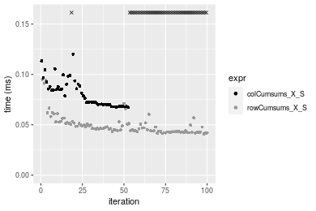


## Appendix

### Session information
```r
R version 4.1.1 Patched (2021-08-10 r80727)
Platform: x86_64-pc-linux-gnu (64-bit)
Running under: Ubuntu 18.04.5 LTS

Matrix products: default
BLAS:   /home/hb/software/R-devel/R-4-1-branch/lib/R/lib/libRblas.so
LAPACK: /home/hb/software/R-devel/R-4-1-branch/lib/R/lib/libRlapack.so

locale:
 [1] LC_CTYPE=en_US.UTF-8       LC_NUMERIC=C              
 [3] LC_TIME=en_US.UTF-8        LC_COLLATE=en_US.UTF-8    
 [5] LC_MONETARY=en_US.UTF-8    LC_MESSAGES=en_US.UTF-8   
 [7] LC_PAPER=en_US.UTF-8       LC_NAME=C                 
 [9] LC_ADDRESS=C               LC_TELEPHONE=C            
[11] LC_MEASUREMENT=en_US.UTF-8 LC_IDENTIFICATION=C       

attached base packages:
[1] stats     graphics  grDevices utils     datasets  methods   base     

other attached packages:
[1] microbenchmark_1.4-7   matrixStats_0.60.0     ggplot2_3.3.5         
[4] knitr_1.33             R.devices_2.17.0       R.utils_2.10.1        
[7] R.oo_1.24.0            R.methodsS3_1.8.1-9001 history_0.0.1-9000    

loaded via a namespace (and not attached):
 [1] Biobase_2.52.0          httr_1.4.2              splines_4.1.1          
 [4] bit64_4.0.5             network_1.17.1          assertthat_0.2.1       
 [7] highr_0.9               stats4_4.1.1            blob_1.2.2             
[10] GenomeInfoDbData_1.2.6  robustbase_0.93-8       pillar_1.6.2           
[13] RSQLite_2.2.8           lattice_0.20-44         glue_1.4.2             
[16] digest_0.6.27           XVector_0.32.0          colorspace_2.0-2       
[19] Matrix_1.3-4            XML_3.99-0.7            pkgconfig_2.0.3        
[22] zlibbioc_1.38.0         genefilter_1.74.0       purrr_0.3.4            
[25] ergm_4.1.2              xtable_1.8-4            scales_1.1.1           
[28] tibble_3.1.4            annotate_1.70.0         KEGGREST_1.32.0        
[31] farver_2.1.0            generics_0.1.0          IRanges_2.26.0         
[34] ellipsis_0.3.2          cachem_1.0.6            withr_2.4.2            
[37] BiocGenerics_0.38.0     mime_0.11               survival_3.2-13        
[40] magrittr_2.0.1          crayon_1.4.1            statnet.common_4.5.0   
[43] memoise_2.0.0           laeken_0.5.1            fansi_0.5.0            
[46] R.cache_0.15.0          MASS_7.3-54             R.rsp_0.44.0           
[49] progressr_0.8.0         tools_4.1.1             lifecycle_1.0.0        
[52] S4Vectors_0.30.0        trust_0.1-8             munsell_0.5.0          
[55] tabby_0.0.1-9001        AnnotationDbi_1.54.1    Biostrings_2.60.2      
[58] compiler_4.1.1          GenomeInfoDb_1.28.1     rlang_0.4.11           
[61] grid_4.1.1              RCurl_1.98-1.4          cwhmisc_6.6            
[64] rstudioapi_0.13         rappdirs_0.3.3          startup_0.15.0         
[67] labeling_0.4.2          bitops_1.0-7            base64enc_0.1-3        
[70] boot_1.3-28             gtable_0.3.0            DBI_1.1.1              
[73] markdown_1.1            R6_2.5.1                lpSolveAPI_5.5.2.0-17.7
[76] rle_0.9.2               dplyr_1.0.7             fastmap_1.1.0          
[79] bit_4.0.4               utf8_1.2.2              parallel_4.1.1         
[82] Rcpp_1.0.7              vctrs_0.3.8             png_0.1-7              
[85] DEoptimR_1.0-9          tidyselect_1.1.1        xfun_0.25              
[88] coda_0.19-4            
```
Total processing time was 23.3 secs.


### Reproducibility
To reproduce this report, do:
```r
html <- matrixStats:::benchmark('colRowCumsums_subset')
```

[RSP]: https://cran.r-project.org/package=R.rsp
[matrixStats]: https://cran.r-project.org/package=matrixStats

[StackOverflow:colMins?]: https://stackoverflow.com/questions/13676878 "Stack Overflow: fastest way to get Min from every column in a matrix?"
[StackOverflow:colSds?]: https://stackoverflow.com/questions/17549762 "Stack Overflow: Is there such 'colsd' in R?"
[StackOverflow:rowProds?]: https://stackoverflow.com/questions/20198801/ "Stack Overflow: Row product of matrix and column sum of matrix"

---------------------------------------
Copyright Dongcan Jiang. Last updated on 2021-08-25 22:14:45 (+0200 UTC). Powered by [RSP].

<script>
 var link = document.createElement('link');
 link.rel = 'icon';
 link.href = "data:image/png;base64,iVBORw0KGgoAAAANSUhEUgAAACAAAAAgCAMAAABEpIrGAAAA21BMVEUAAAAAAP8AAP8AAP8AAP8AAP8AAP8AAP8AAP8AAP8AAP8AAP8AAP8AAP8AAP8AAP8AAP8AAP8AAP8AAP8AAP8AAP8AAP8AAP8AAP8AAP8AAP8AAP8AAP8AAP8AAP8AAP8AAP8AAP8AAP8AAP8AAP8AAP8AAP8AAP8AAP8AAP8BAf4CAv0DA/wdHeIeHuEfH+AgIN8hId4lJdomJtknJ9g+PsE/P8BAQL9yco10dIt1dYp3d4h4eIeVlWqWlmmXl2iYmGeZmWabm2Tn5xjo6Bfp6Rb39wj4+Af//wA2M9hbAAAASXRSTlMAAQIJCgsMJSYnKD4/QGRlZmhpamtsbautrrCxuru8y8zN5ebn6Pn6+///////////////////////////////////////////LsUNcQAAAS9JREFUOI29k21XgkAQhVcFytdSMqMETU26UVqGmpaiFbL//xc1cAhhwVNf6n5i5z67M2dmYOyfJZUqlVLhkKucG7cgmUZTybDz6g0iDeq51PUr37Ds2cy2/C9NeES5puDjxuUk1xnToZsg8pfA3avHQ3lLIi7iWRrkv/OYtkScxBIMgDee0ALoyxHQBJ68JLCjOtQIMIANF7QG9G9fNnHvisCHBVMKgSJgiz7nE+AoBKrAPA3MgepvgR9TSCasrCKH0eB1wBGBFdCO+nAGjMVGPcQb5bd6mQRegN6+1axOs9nGfYcCtfi4NQosdtH7dB+txFIpXQqN1p9B/asRHToyS0jRgpV7nk4nwcq1BJ+x3Gl/v7S9Wmpp/aGquum7w3ZDyrADFYrl8vHBH+ev9AUASW1dmU4h4wAAAABJRU5ErkJggg=="
 document.getElementsByTagName('head')[0].appendChild(link);
</script>


