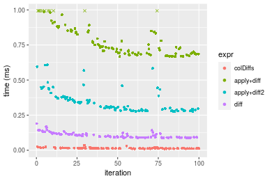
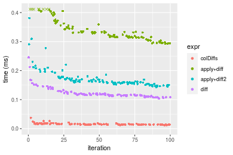

[matrixStats]: Benchmark report

---------------------------------------


# colDiffs() and rowDiffs() benchmarks

This report benchmark the performance of colDiffs() and rowDiffs() against alternative methods.

## Alternative methods

* apply() + diff()
* apply() + diff2()
* diff()


## Data type "integer"

### Data
```r
> rmatrix <- function(nrow, ncol, mode = c("logical", "double", "integer", "index"), range = c(-100, 
+     +100), na_prob = 0) {
+     mode <- match.arg(mode)
+     n <- nrow * ncol
+     if (mode == "logical") {
+         x <- sample(c(FALSE, TRUE), size = n, replace = TRUE)
+     }     else if (mode == "index") {
+         x <- seq_len(n)
+         mode <- "integer"
+     }     else {
+         x <- runif(n, min = range[1], max = range[2])
+     }
+     storage.mode(x) <- mode
+     if (na_prob > 0) 
+         x[sample(n, size = na_prob * n)] <- NA
+     dim(x) <- c(nrow, ncol)
+     x
+ }
> rmatrices <- function(scale = 10, seed = 1, ...) {
+     set.seed(seed)
+     data <- list()
+     data[[1]] <- rmatrix(nrow = scale * 1, ncol = scale * 1, ...)
+     data[[2]] <- rmatrix(nrow = scale * 10, ncol = scale * 10, ...)
+     data[[3]] <- rmatrix(nrow = scale * 100, ncol = scale * 1, ...)
+     data[[4]] <- t(data[[3]])
+     data[[5]] <- rmatrix(nrow = scale * 10, ncol = scale * 100, ...)
+     data[[6]] <- t(data[[5]])
+     names(data) <- sapply(data, FUN = function(x) paste(dim(x), collapse = "x"))
+     data
+ }
> data <- rmatrices(mode = mode)
```

### Results

#### 10x10 integer matrix


```r
> X <- data[["10x10"]]
> gc()
          used  (Mb) gc trigger  (Mb) max used  (Mb)
Ncells 5188523 277.1    7554717 403.5  7554717 403.5
Vcells 9460653  72.2   31793280 242.6 60508962 461.7
> colStats <- microbenchmark(colDiffs = colDiffs(X), `apply+diff` = apply(X, MARGIN = 2L, FUN = diff), 
+     `apply+diff2` = apply(X, MARGIN = 2L, FUN = diff2), diff = diff(X), unit = "ms")
> X <- t(X)
> gc()
          used  (Mb) gc trigger  (Mb) max used  (Mb)
Ncells 5187772 277.1    7554717 403.5  7554717 403.5
Vcells 9458897  72.2   31793280 242.6 60508962 461.7
> rowStats <- microbenchmark(rowDiffs = rowDiffs(X), `apply+diff` = apply(X, MARGIN = 1L, FUN = diff), 
+     `apply+diff2` = apply(X, MARGIN = 1L, FUN = diff2), `diff + t` = diff(t(X)), unit = "ms")
```

_Table: Benchmarking of colDiffs(), apply+diff(), apply+diff2() and diff() on integer+10x10 data. The top panel shows times in milliseconds and the bottom panel shows relative times._


|   |expr        |      min|        lq|      mean|    median|        uq|      max|
|:--|:-----------|--------:|---------:|---------:|---------:|---------:|--------:|
|1  |colDiffs    | 0.002547| 0.0031325| 0.0038179| 0.0037770| 0.0041700| 0.014003|
|4  |diff        | 0.008321| 0.0099025| 0.0114793| 0.0111405| 0.0119300| 0.057260|
|3  |apply+diff2 | 0.050706| 0.0546005| 0.0587722| 0.0567885| 0.0603065| 0.184007|
|2  |apply+diff  | 0.087311| 0.0914830| 0.0981718| 0.0955630| 0.1024075| 0.190046|


|   |expr        |       min|        lq|      mean|    median|        uq|       max|
|:--|:-----------|---------:|---------:|---------:|---------:|---------:|---------:|
|1  |colDiffs    |  1.000000|  1.000000|  1.000000|  1.000000|  1.000000|  1.000000|
|4  |diff        |  3.266981|  3.161213|  3.006676|  2.949563|  2.860911|  4.089124|
|3  |apply+diff2 | 19.908127| 17.430327| 15.393742| 15.035346| 14.461990| 13.140541|
|2  |apply+diff  | 34.279937| 29.204469| 25.713347| 25.301297| 24.558153| 13.571806|

_Table: Benchmarking of rowDiffs(), apply+diff(), apply+diff2() and diff + t() on integer+10x10 data (transposed). The top panel shows times in milliseconds and the bottom panel shows relative times._


|   |expr        |      min|        lq|      mean|    median|       uq|      max|
|:--|:-----------|--------:|---------:|---------:|---------:|--------:|--------:|
|1  |rowDiffs    | 0.002245| 0.0033200| 0.0038953| 0.0039535| 0.004317| 0.010623|
|4  |diff + t    | 0.010624| 0.0132040| 0.0149354| 0.0148945| 0.016020| 0.035043|
|3  |apply+diff2 | 0.051175| 0.0539655| 0.0592511| 0.0583220| 0.061017| 0.145086|
|2  |apply+diff  | 0.087495| 0.0937550| 0.1009413| 0.0997540| 0.104619| 0.142801|


|   |expr        |       min|        lq|      mean|    median|       uq|       max|
|:--|:-----------|---------:|---------:|---------:|---------:|--------:|---------:|
|1  |rowDiffs    |  1.000000|  1.000000|  1.000000|  1.000000|  1.00000|  1.000000|
|4  |diff + t    |  4.732294|  3.977108|  3.834203|  3.767421|  3.71091|  3.298786|
|3  |apply+diff2 | 22.795100| 16.254669| 15.210918| 14.751992| 14.13412| 13.657724|
|2  |apply+diff  | 38.973274| 28.239458| 25.913622| 25.231820| 24.23419| 13.442625|

_Figure: Benchmarking of colDiffs(), apply+diff(), apply+diff2() and diff() on integer+10x10 data  as well as rowDiffs(), apply+diff(), apply+diff2() and diff + t() on the same data transposed.  Outliers are displayed as crosses.  Times are in milliseconds._


_Table: Benchmarking of colDiffs() and rowDiffs() on integer+10x10 data (original and transposed).  The top panel shows times in milliseconds and the bottom panel shows relative times._


|   |expr     |   min|     lq|    mean| median|    uq|    max|
|:--|:--------|-----:|------:|-------:|------:|-----:|------:|
|1  |colDiffs | 2.547| 3.1325| 3.81793| 3.7770| 4.170| 14.003|
|2  |rowDiffs | 2.245| 3.3200| 3.89530| 3.9535| 4.317| 10.623|


|   |expr     |       min|       lq|     mean|  median|       uq|       max|
|:--|:--------|---------:|--------:|--------:|-------:|--------:|---------:|
|1  |colDiffs | 1.0000000| 1.000000| 1.000000| 1.00000| 1.000000| 1.0000000|
|2  |rowDiffs | 0.8814291| 1.059856| 1.020265| 1.04673| 1.035252| 0.7586232|

_Figure: Benchmarking of colDiffs() and rowDiffs() on integer+10x10 data (original and transposed).  Outliers are displayed as crosses. Times are in milliseconds._


#### 100x100 integer matrix


```r
> X <- data[["100x100"]]
> gc()
          used  (Mb) gc trigger  (Mb) max used  (Mb)
Ncells 5186336 277.0    7554717 403.5  7554717 403.5
Vcells 9076233  69.3   31793280 242.6 60508962 461.7
> colStats <- microbenchmark(colDiffs = colDiffs(X), `apply+diff` = apply(X, MARGIN = 2L, FUN = diff), 
+     `apply+diff2` = apply(X, MARGIN = 2L, FUN = diff2), diff = diff(X), unit = "ms")
> X <- t(X)
> gc()
          used  (Mb) gc trigger  (Mb) max used  (Mb)
Ncells 5186330 277.0    7554717 403.5  7554717 403.5
Vcells 9081276  69.3   31793280 242.6 60508962 461.7
> rowStats <- microbenchmark(rowDiffs = rowDiffs(X), `apply+diff` = apply(X, MARGIN = 1L, FUN = diff), 
+     `apply+diff2` = apply(X, MARGIN = 1L, FUN = diff2), `diff + t` = diff(t(X)), unit = "ms")
```

_Table: Benchmarking of colDiffs(), apply+diff(), apply+diff2() and diff() on integer+100x100 data. The top panel shows times in milliseconds and the bottom panel shows relative times._


|   |expr        |      min|        lq|      mean|    median|        uq|      max|
|:--|:-----------|--------:|---------:|---------:|---------:|---------:|--------:|
|1  |colDiffs    | 0.010399| 0.0113570| 0.0127716| 0.0122125| 0.0130095| 0.025038|
|4  |diff        | 0.087002| 0.0896030| 0.1000750| 0.0909825| 0.1096310| 0.181539|
|3  |apply+diff2 | 0.282768| 0.2889620| 0.3221870| 0.2956605| 0.3464020| 0.586476|
|2  |apply+diff  | 0.683987| 0.6916565| 0.7621566| 0.6975525| 0.7815300| 1.274834|


|   |expr        |       min|        lq|      mean|    median|        uq|       max|
|:--|:-----------|---------:|---------:|---------:|---------:|---------:|---------:|
|1  |colDiffs    |  1.000000|  1.000000|  1.000000|  1.000000|  1.000000|  1.000000|
|4  |diff        |  8.366381|  7.889672|  7.835773|  7.449949|  8.426996|  7.250539|
|3  |apply+diff2 | 27.191845| 25.443515| 25.226907| 24.209662| 26.626850| 23.423436|
|2  |apply+diff  | 65.774305| 60.901338| 59.676079| 57.117912| 60.073792| 50.915968|

_Table: Benchmarking of rowDiffs(), apply+diff(), apply+diff2() and diff + t() on integer+100x100 data (transposed). The top panel shows times in milliseconds and the bottom panel shows relative times._


|   |expr        |      min|        lq|      mean|    median|        uq|      max|
|:--|:-----------|--------:|---------:|---------:|---------:|---------:|--------:|
|1  |rowDiffs    | 0.010505| 0.0120540| 0.0140814| 0.0129450| 0.0148375| 0.037685|
|4  |diff + t    | 0.100937| 0.1038710| 0.1144894| 0.1052100| 0.1219705| 0.186612|
|3  |apply+diff2 | 0.283918| 0.2898100| 0.3238102| 0.2961815| 0.3459355| 0.516949|
|2  |apply+diff  | 0.683870| 0.6893835| 0.7677442| 0.6987195| 0.8119055| 1.382401|


|   |expr        |       min|       lq|      mean|    median|        uq|       max|
|:--|:-----------|---------:|--------:|---------:|---------:|---------:|---------:|
|1  |rowDiffs    |  1.000000|  1.00000|  1.000000|  1.000000|  1.000000|  1.000000|
|4  |diff + t    |  9.608472|  8.61714|  8.130537|  8.127462|  8.220421|  4.951891|
|3  |apply+diff2 | 27.026940| 24.04264| 22.995581| 22.879992| 23.314945| 13.717633|
|2  |apply+diff  | 65.099476| 57.19126| 54.521826| 53.976014| 54.719831| 36.683057|

_Figure: Benchmarking of colDiffs(), apply+diff(), apply+diff2() and diff() on integer+100x100 data  as well as rowDiffs(), apply+diff(), apply+diff2() and diff + t() on the same data transposed.  Outliers are displayed as crosses.  Times are in milliseconds._





_Table: Benchmarking of colDiffs() and rowDiffs() on integer+100x100 data (original and transposed).  The top panel shows times in milliseconds and the bottom panel shows relative times._


|   |expr     |    min|     lq|     mean|  median|      uq|    max|
|:--|:--------|------:|------:|--------:|-------:|-------:|------:|
|1  |colDiffs | 10.399| 11.357| 12.77156| 12.2125| 13.0095| 25.038|
|2  |rowDiffs | 10.505| 12.054| 14.08141| 12.9450| 14.8375| 37.685|


|   |expr     |      min|       lq|    mean|  median|       uq|      max|
|:--|:--------|--------:|--------:|-------:|-------:|--------:|--------:|
|1  |colDiffs | 1.000000| 1.000000| 1.00000| 1.00000| 1.000000| 1.000000|
|2  |rowDiffs | 1.010193| 1.061372| 1.10256| 1.05998| 1.140513| 1.505112|

_Figure: Benchmarking of colDiffs() and rowDiffs() on integer+100x100 data (original and transposed).  Outliers are displayed as crosses. Times are in milliseconds._


#### 1000x10 integer matrix


```r
> X <- data[["1000x10"]]
> gc()
          used  (Mb) gc trigger  (Mb) max used  (Mb)
Ncells 5186565 277.0    7554717 403.5  7554717 403.5
Vcells 9076862  69.3   31793280 242.6 60508962 461.7
> colStats <- microbenchmark(colDiffs = colDiffs(X), `apply+diff` = apply(X, MARGIN = 2L, FUN = diff), 
+     `apply+diff2` = apply(X, MARGIN = 2L, FUN = diff2), diff = diff(X), unit = "ms")
> X <- t(X)
> gc()
          used  (Mb) gc trigger  (Mb) max used  (Mb)
Ncells 5186553 277.0    7554717 403.5  7554717 403.5
Vcells 9081895  69.3   31793280 242.6 60508962 461.7
> rowStats <- microbenchmark(rowDiffs = rowDiffs(X), `apply+diff` = apply(X, MARGIN = 1L, FUN = diff), 
+     `apply+diff2` = apply(X, MARGIN = 1L, FUN = diff2), `diff + t` = diff(t(X)), unit = "ms")
```

_Table: Benchmarking of colDiffs(), apply+diff(), apply+diff2() and diff() on integer+1000x10 data. The top panel shows times in milliseconds and the bottom panel shows relative times._


|   |expr        |      min|        lq|      mean|    median|        uq|      max|
|:--|:-----------|--------:|---------:|---------:|---------:|---------:|--------:|
|1  |colDiffs    | 0.009967| 0.0122585| 0.0143689| 0.0139415| 0.0163225| 0.025102|
|4  |diff        | 0.089575| 0.0968920| 0.1131822| 0.1098945| 0.1203195| 0.191010|
|3  |apply+diff2 | 0.125720| 0.1358670| 0.1586240| 0.1550095| 0.1684090| 0.273464|
|2  |apply+diff  | 0.256354| 0.2747480| 0.3192498| 0.3035000| 0.3533785| 0.449741|


|   |expr        |       min|        lq|      mean|    median|        uq|       max|
|:--|:-----------|---------:|---------:|---------:|---------:|---------:|---------:|
|1  |colDiffs    |  1.000000|  1.000000|  1.000000|  1.000000|  1.000000|  1.000000|
|4  |diff        |  8.987158|  7.904067|  7.876881|  7.882545|  7.371389|  7.609354|
|3  |apply+diff2 | 12.613625| 11.083493| 11.039391| 11.118567| 10.317598| 10.894112|
|2  |apply+diff  | 25.720277| 22.412856| 22.218097| 21.769537| 21.649778| 17.916540|

_Table: Benchmarking of rowDiffs(), apply+diff(), apply+diff2() and diff + t() on integer+1000x10 data (transposed). The top panel shows times in milliseconds and the bottom panel shows relative times._


|   |expr        |      min|        lq|      mean|    median|       uq|      max|
|:--|:-----------|--------:|---------:|---------:|---------:|--------:|--------:|
|1  |rowDiffs    | 0.010473| 0.0120675| 0.0136713| 0.0131760| 0.014893| 0.029144|
|4  |diff + t    | 0.102845| 0.1126445| 0.1285746| 0.1249515| 0.138566| 0.224369|
|3  |apply+diff2 | 0.122917| 0.1346490| 0.1544872| 0.1507450| 0.165898| 0.274873|
|2  |apply+diff  | 0.255044| 0.2665090| 0.3158050| 0.3112725| 0.342807| 0.451109|


|   |expr        |       min|        lq|      mean|    median|        uq|       max|
|:--|:-----------|---------:|---------:|---------:|---------:|---------:|---------:|
|1  |rowDiffs    |  1.000000|  1.000000|  1.000000|  1.000000|  1.000000|  1.000000|
|4  |diff + t    |  9.820013|  9.334535|  9.404733|  9.483265|  9.304103|  7.698634|
|3  |apply+diff2 | 11.736561| 11.157986| 11.300145| 11.440877| 11.139327|  9.431547|
|2  |apply+diff  | 24.352525| 22.084856| 23.099917| 23.624203| 23.017995| 15.478623|

_Figure: Benchmarking of colDiffs(), apply+diff(), apply+diff2() and diff() on integer+1000x10 data  as well as rowDiffs(), apply+diff(), apply+diff2() and diff + t() on the same data transposed.  Outliers are displayed as crosses.  Times are in milliseconds._





_Table: Benchmarking of colDiffs() and rowDiffs() on integer+1000x10 data (original and transposed).  The top panel shows times in milliseconds and the bottom panel shows relative times._


|   |expr     |    min|      lq|     mean|  median|      uq|    max|
|:--|:--------|------:|-------:|--------:|-------:|-------:|------:|
|2  |rowDiffs | 10.473| 12.0675| 13.67126| 13.1760| 14.8930| 29.144|
|1  |colDiffs |  9.967| 12.2585| 14.36891| 13.9415| 16.3225| 25.102|


|   |expr     |       min|       lq|    mean|   median|       uq|       max|
|:--|:--------|---------:|--------:|-------:|--------:|--------:|---------:|
|2  |rowDiffs | 1.0000000| 1.000000| 1.00000| 1.000000| 1.000000| 1.0000000|
|1  |colDiffs | 0.9516853| 1.015828| 1.05103| 1.058098| 1.095985| 0.8613094|

_Figure: Benchmarking of colDiffs() and rowDiffs() on integer+1000x10 data (original and transposed).  Outliers are displayed as crosses. Times are in milliseconds._


#### 10x1000 integer matrix


```r
> X <- data[["10x1000"]]
> gc()
          used  (Mb) gc trigger  (Mb) max used  (Mb)
Ncells 5186782 277.1    7554717 403.5  7554717 403.5
Vcells 9077676  69.3   31793280 242.6 60508962 461.7
> colStats <- microbenchmark(colDiffs = colDiffs(X), `apply+diff` = apply(X, MARGIN = 2L, FUN = diff), 
+     `apply+diff2` = apply(X, MARGIN = 2L, FUN = diff2), diff = diff(X), unit = "ms")
> X <- t(X)
> gc()
          used  (Mb) gc trigger  (Mb) max used  (Mb)
Ncells 5186776 277.1    7554717 403.5  7554717 403.5
Vcells 9082719  69.3   31793280 242.6 60508962 461.7
> rowStats <- microbenchmark(rowDiffs = rowDiffs(X), `apply+diff` = apply(X, MARGIN = 1L, FUN = diff), 
+     `apply+diff2` = apply(X, MARGIN = 1L, FUN = diff2), `diff + t` = diff(t(X)), unit = "ms")
```

_Table: Benchmarking of colDiffs(), apply+diff(), apply+diff2() and diff() on integer+10x1000 data. The top panel shows times in milliseconds and the bottom panel shows relative times._


|   |expr        |      min|        lq|      mean|    median|        uq|       max|
|:--|:-----------|--------:|---------:|---------:|---------:|---------:|---------:|
|1  |colDiffs    | 0.009818| 0.0116235| 0.0137454| 0.0133145| 0.0151120|  0.023658|
|4  |diff        | 0.083307| 0.0899380| 0.0967501| 0.0935795| 0.0976365|  0.171863|
|3  |apply+diff2 | 1.895325| 2.0370345| 2.1817977| 2.0761175| 2.1302440|  7.304216|
|2  |apply+diff  | 4.785540| 5.0808220| 5.4109846| 5.2101005| 5.3883790| 11.443053|


|   |expr        |        min|         lq|       mean|    median|         uq|        max|
|:--|:-----------|----------:|----------:|----------:|---------:|----------:|----------:|
|1  |colDiffs    |   1.000000|   1.000000|   1.000000|   1.00000|   1.000000|   1.000000|
|4  |diff        |   8.485129|   7.737601|   7.038734|   7.02839|   6.460859|   7.264477|
|3  |apply+diff2 | 193.045936| 175.251387| 158.729528| 155.92906| 140.963737| 308.741905|
|2  |apply+diff  | 487.425138| 437.116359| 393.658425| 391.31026| 356.562930| 483.686406|

_Table: Benchmarking of rowDiffs(), apply+diff(), apply+diff2() and diff + t() on integer+10x1000 data (transposed). The top panel shows times in milliseconds and the bottom panel shows relative times._


|   |expr        |      min|        lq|      mean|    median|        uq|       max|
|:--|:-----------|--------:|---------:|---------:|---------:|---------:|---------:|
|1  |rowDiffs    | 0.009525| 0.0107520| 0.0131512| 0.0122070| 0.0141800|  0.038199|
|4  |diff + t    | 0.096849| 0.1052165| 0.1153810| 0.1098225| 0.1169245|  0.242635|
|3  |apply+diff2 | 1.897213| 2.0274535| 2.1485966| 2.0708635| 2.1047800|  7.341553|
|2  |apply+diff  | 4.775918| 5.0601410| 5.4187403| 5.1988080| 5.3465140| 10.736498|


|   |expr        |       min|         lq|      mean|     median|         uq|        max|
|:--|:-----------|---------:|----------:|---------:|----------:|----------:|----------:|
|1  |rowDiffs    |   1.00000|   1.000000|   1.00000|   1.000000|   1.000000|   1.000000|
|4  |diff + t    |  10.16787|   9.785761|   8.77343|   8.996682|   8.245733|   6.351868|
|3  |apply+diff2 | 199.18247| 188.565244| 163.37659| 169.645572| 148.433004| 192.192283|
|2  |apply+diff  | 501.40871| 470.623233| 412.03422| 425.887442| 377.046121| 281.067515|

_Figure: Benchmarking of colDiffs(), apply+diff(), apply+diff2() and diff() on integer+10x1000 data  as well as rowDiffs(), apply+diff(), apply+diff2() and diff + t() on the same data transposed.  Outliers are displayed as crosses.  Times are in milliseconds._


_Table: Benchmarking of colDiffs() and rowDiffs() on integer+10x1000 data (original and transposed).  The top panel shows times in milliseconds and the bottom panel shows relative times._


|   |expr     |   min|      lq|     mean|  median|     uq|    max|
|:--|:--------|-----:|-------:|--------:|-------:|------:|------:|
|2  |rowDiffs | 9.525| 10.7520| 13.15119| 12.2070| 14.180| 38.199|
|1  |colDiffs | 9.818| 11.6235| 13.74538| 13.3145| 15.112| 23.658|


|   |expr     |      min|       lq|     mean|   median|       uq|       max|
|:--|:--------|--------:|--------:|--------:|--------:|--------:|---------:|
|2  |rowDiffs | 1.000000| 1.000000| 1.000000| 1.000000| 1.000000| 1.0000000|
|1  |colDiffs | 1.030761| 1.081055| 1.045181| 1.090727| 1.065726| 0.6193356|

_Figure: Benchmarking of colDiffs() and rowDiffs() on integer+10x1000 data (original and transposed).  Outliers are displayed as crosses. Times are in milliseconds._


#### 100x1000 integer matrix


```r
> X <- data[["100x1000"]]
> gc()
          used  (Mb) gc trigger  (Mb) max used  (Mb)
Ncells 5187018 277.1    7554717 403.5  7554717 403.5
Vcells 9078290  69.3   31793280 242.6 60508962 461.7
> colStats <- microbenchmark(colDiffs = colDiffs(X), `apply+diff` = apply(X, MARGIN = 2L, FUN = diff), 
+     `apply+diff2` = apply(X, MARGIN = 2L, FUN = diff2), diff = diff(X), unit = "ms")
> X <- t(X)
> gc()
          used  (Mb) gc trigger  (Mb) max used  (Mb)
Ncells 5187006 277.1    7554717 403.5  7554717 403.5
Vcells 9128323  69.7   31793280 242.6 60508962 461.7
> rowStats <- microbenchmark(rowDiffs = rowDiffs(X), `apply+diff` = apply(X, MARGIN = 1L, FUN = diff), 
+     `apply+diff2` = apply(X, MARGIN = 1L, FUN = diff2), `diff + t` = diff(t(X)), unit = "ms")
```

_Table: Benchmarking of colDiffs(), apply+diff(), apply+diff2() and diff() on integer+100x1000 data. The top panel shows times in milliseconds and the bottom panel shows relative times._


|   |expr        |      min|       lq|      mean|    median|        uq|       max|
|:--|:-----------|--------:|--------:|---------:|---------:|---------:|---------:|
|1  |colDiffs    | 0.086901| 0.095762| 0.1022387| 0.1010955| 0.1065485|  0.136125|
|4  |diff        | 0.815316| 0.878794| 1.0927561| 0.8968945| 0.9172060| 20.256734|
|3  |apply+diff2 | 2.695422| 2.943634| 3.1904346| 2.9935705| 3.0328035| 21.558134|
|2  |apply+diff  | 6.655694| 7.210528| 7.8168767| 7.3201440| 7.4460840| 27.894470|


|   |expr        |       min|        lq|     mean|    median|        uq|      max|
|:--|:-----------|---------:|---------:|--------:|---------:|---------:|--------:|
|1  |colDiffs    |  1.000000|  1.000000|  1.00000|  1.000000|  1.000000|   1.0000|
|4  |diff        |  9.382124|  9.176855| 10.68828|  8.871755|  8.608343| 148.8098|
|3  |apply+diff2 | 31.017157| 30.739061| 31.20573| 29.611313| 28.464066| 158.3701|
|2  |apply+diff  | 76.589383| 75.296334| 76.45710| 72.408208| 69.884456| 204.9181|

_Table: Benchmarking of rowDiffs(), apply+diff(), apply+diff2() and diff + t() on integer+100x1000 data (transposed). The top panel shows times in milliseconds and the bottom panel shows relative times._


|   |expr        |      min|       lq|      mean|   median|       uq|       max|
|:--|:-----------|--------:|--------:|---------:|--------:|--------:|---------:|
|1  |rowDiffs    | 0.086275| 0.091526| 0.0968964| 0.094743| 0.100570|  0.123310|
|4  |diff + t    | 0.961811| 1.018528| 1.0531535| 1.038225| 1.059063|  1.492722|
|3  |apply+diff2 | 2.713211| 2.921787| 3.5788218| 2.993329| 3.075639| 21.678108|
|2  |apply+diff  | 6.701550| 7.194273| 7.7872990| 7.356490| 7.487421| 26.709003|


|   |expr        |      min|       lq|     mean|   median|       uq|       max|
|:--|:-----------|--------:|--------:|--------:|--------:|--------:|---------:|
|1  |rowDiffs    |  1.00000|  1.00000|  1.00000|  1.00000|  1.00000|   1.00000|
|4  |diff + t    | 11.14820| 11.12830| 10.86886| 10.95832| 10.53060|  12.10544|
|3  |apply+diff2 | 31.44840| 31.92302| 36.93453| 31.59419| 30.58208| 175.80170|
|2  |apply+diff  | 77.67662| 78.60360| 80.36729| 77.64679| 74.44985| 216.60046|

_Figure: Benchmarking of colDiffs(), apply+diff(), apply+diff2() and diff() on integer+100x1000 data  as well as rowDiffs(), apply+diff(), apply+diff2() and diff + t() on the same data transposed.  Outliers are displayed as crosses.  Times are in milliseconds._


_Table: Benchmarking of colDiffs() and rowDiffs() on integer+100x1000 data (original and transposed).  The top panel shows times in milliseconds and the bottom panel shows relative times._


|   |expr     |    min|     lq|      mean|   median|       uq|     max|
|:--|:--------|------:|------:|---------:|--------:|--------:|-------:|
|2  |rowDiffs | 86.275| 91.526|  96.89638|  94.7430| 100.5700| 123.310|
|1  |colDiffs | 86.901| 95.762| 102.23873| 101.0955| 106.5485| 136.125|


|   |expr     |      min|       lq|     mean|  median|       uq|      max|
|:--|:--------|--------:|--------:|--------:|-------:|--------:|--------:|
|2  |rowDiffs | 1.000000| 1.000000| 1.000000| 1.00000| 1.000000| 1.000000|
|1  |colDiffs | 1.007256| 1.046282| 1.055135| 1.06705| 1.059446| 1.103925|

_Figure: Benchmarking of colDiffs() and rowDiffs() on integer+100x1000 data (original and transposed).  Outliers are displayed as crosses. Times are in milliseconds._


#### 1000x100 integer matrix


```r
> X <- data[["1000x100"]]
> gc()
          used  (Mb) gc trigger  (Mb) max used  (Mb)
Ncells 5187242 277.1    7554717 403.5  7554717 403.5
Vcells 9078974  69.3   31793280 242.6 60508962 461.7
> colStats <- microbenchmark(colDiffs = colDiffs(X), `apply+diff` = apply(X, MARGIN = 2L, FUN = diff), 
+     `apply+diff2` = apply(X, MARGIN = 2L, FUN = diff2), diff = diff(X), unit = "ms")
> X <- t(X)
> gc()
          used  (Mb) gc trigger  (Mb) max used  (Mb)
Ncells 5187230 277.1    7554717 403.5  7554717 403.5
Vcells 9129007  69.7   31793280 242.6 60508962 461.7
> rowStats <- microbenchmark(rowDiffs = rowDiffs(X), `apply+diff` = apply(X, MARGIN = 1L, FUN = diff), 
+     `apply+diff2` = apply(X, MARGIN = 1L, FUN = diff2), `diff + t` = diff(t(X)), unit = "ms")
```

_Table: Benchmarking of colDiffs(), apply+diff(), apply+diff2() and diff() on integer+1000x100 data. The top panel shows times in milliseconds and the bottom panel shows relative times._


|   |expr        |      min|        lq|      mean|    median|       uq|       max|
|:--|:-----------|--------:|---------:|---------:|---------:|--------:|---------:|
|1  |colDiffs    | 0.082402| 0.0872825| 0.0937596| 0.0916525| 0.096542|  0.197511|
|4  |diff        | 0.807450| 0.8371780| 0.8903514| 0.8760175| 0.910828|  1.280405|
|3  |apply+diff2 | 1.018777| 1.0723905| 1.2855597| 1.1214980| 1.152434|  8.589109|
|2  |apply+diff  | 2.278317| 2.4145270| 2.7164899| 2.5096105| 2.639479| 10.691123|


|   |expr        |       min|        lq|      mean|    median|        uq|       max|
|:--|:-----------|---------:|---------:|---------:|---------:|---------:|---------:|
|1  |colDiffs    |  1.000000|  1.000000|  1.000000|  1.000000|  1.000000|  1.000000|
|4  |diff        |  9.798913|  9.591591|  9.496113|  9.558032|  9.434526|  6.482702|
|3  |apply+diff2 | 12.363499| 12.286432| 13.711239| 12.236415| 11.937126| 43.486737|
|2  |apply+diff  | 27.648807| 27.663358| 28.972937| 27.381801| 27.340209| 54.129254|

_Table: Benchmarking of rowDiffs(), apply+diff(), apply+diff2() and diff + t() on integer+1000x100 data (transposed). The top panel shows times in milliseconds and the bottom panel shows relative times._


|   |expr        |      min|        lq|      mean|   median|        uq|       max|
|:--|:-----------|--------:|---------:|---------:|--------:|---------:|---------:|
|1  |rowDiffs    | 0.087108| 0.0926025| 0.1003242| 0.098006| 0.1032115|  0.198423|
|4  |diff + t    | 0.943249| 0.9837675| 1.2129290| 1.045607| 1.0982655|  8.869835|
|3  |apply+diff2 | 1.012686| 1.0675550| 1.2232081| 1.133620| 1.1760030|  8.463718|
|2  |apply+diff  | 2.285403| 2.4209670| 2.7317698| 2.521505| 2.6348450| 10.279778|


|   |expr        |      min|       lq|     mean|   median|       uq|      max|
|:--|:-----------|--------:|--------:|--------:|--------:|--------:|--------:|
|1  |rowDiffs    |  1.00000|  1.00000|  1.00000|  1.00000|  1.00000|  1.00000|
|4  |diff + t    | 10.82850| 10.62355| 12.09010| 10.66880| 10.64092| 44.70165|
|3  |apply+diff2 | 11.62564| 11.52836| 12.19255| 11.56684| 11.39411| 42.65492|
|2  |apply+diff  | 26.23643| 26.14365| 27.22942| 25.72807| 25.52860| 51.80739|

_Figure: Benchmarking of colDiffs(), apply+diff(), apply+diff2() and diff() on integer+1000x100 data  as well as rowDiffs(), apply+diff(), apply+diff2() and diff + t() on the same data transposed.  Outliers are displayed as crosses.  Times are in milliseconds._


_Table: Benchmarking of colDiffs() and rowDiffs() on integer+1000x100 data (original and transposed).  The top panel shows times in milliseconds and the bottom panel shows relative times._


|   |expr     |    min|      lq|      mean|  median|       uq|     max|
|:--|:--------|------:|-------:|---------:|-------:|--------:|-------:|
|1  |colDiffs | 82.402| 87.2825|  93.75956| 91.6525|  96.5420| 197.511|
|2  |rowDiffs | 87.108| 92.6025| 100.32419| 98.0060| 103.2115| 198.423|


|   |expr     |     min|       lq|     mean|   median|       uq|      max|
|:--|:--------|-------:|--------:|--------:|--------:|--------:|--------:|
|1  |colDiffs | 1.00000| 1.000000| 1.000000| 1.000000| 1.000000| 1.000000|
|2  |rowDiffs | 1.05711| 1.060952| 1.070016| 1.069322| 1.069084| 1.004617|

_Figure: Benchmarking of colDiffs() and rowDiffs() on integer+1000x100 data (original and transposed).  Outliers are displayed as crosses. Times are in milliseconds._


## Data type "double"

### Data
```r
> rmatrix <- function(nrow, ncol, mode = c("logical", "double", "integer", "index"), range = c(-100, 
+     +100), na_prob = 0) {
+     mode <- match.arg(mode)
+     n <- nrow * ncol
+     if (mode == "logical") {
+         x <- sample(c(FALSE, TRUE), size = n, replace = TRUE)
+     }     else if (mode == "index") {
+         x <- seq_len(n)
+         mode <- "integer"
+     }     else {
+         x <- runif(n, min = range[1], max = range[2])
+     }
+     storage.mode(x) <- mode
+     if (na_prob > 0) 
+         x[sample(n, size = na_prob * n)] <- NA
+     dim(x) <- c(nrow, ncol)
+     x
+ }
> rmatrices <- function(scale = 10, seed = 1, ...) {
+     set.seed(seed)
+     data <- list()
+     data[[1]] <- rmatrix(nrow = scale * 1, ncol = scale * 1, ...)
+     data[[2]] <- rmatrix(nrow = scale * 10, ncol = scale * 10, ...)
+     data[[3]] <- rmatrix(nrow = scale * 100, ncol = scale * 1, ...)
+     data[[4]] <- t(data[[3]])
+     data[[5]] <- rmatrix(nrow = scale * 10, ncol = scale * 100, ...)
+     data[[6]] <- t(data[[5]])
+     names(data) <- sapply(data, FUN = function(x) paste(dim(x), collapse = "x"))
+     data
+ }
> data <- rmatrices(mode = mode)
```

### Results

#### 10x10 double matrix


```r
> X <- data[["10x10"]]
> gc()
          used  (Mb) gc trigger  (Mb) max used  (Mb)
Ncells 5187467 277.1    7554717 403.5  7554717 403.5
Vcells 9194809  70.2   31793280 242.6 60508962 461.7
> colStats <- microbenchmark(colDiffs = colDiffs(X), `apply+diff` = apply(X, MARGIN = 2L, FUN = diff), 
+     `apply+diff2` = apply(X, MARGIN = 2L, FUN = diff2), diff = diff(X), unit = "ms")
> X <- t(X)
> gc()
          used  (Mb) gc trigger  (Mb) max used  (Mb)
Ncells 5187452 277.1    7554717 403.5  7554717 403.5
Vcells 9194937  70.2   31793280 242.6 60508962 461.7
> rowStats <- microbenchmark(rowDiffs = rowDiffs(X), `apply+diff` = apply(X, MARGIN = 1L, FUN = diff), 
+     `apply+diff2` = apply(X, MARGIN = 1L, FUN = diff2), `diff + t` = diff(t(X)), unit = "ms")
```

_Table: Benchmarking of colDiffs(), apply+diff(), apply+diff2() and diff() on double+10x10 data. The top panel shows times in milliseconds and the bottom panel shows relative times._


|   |expr        |      min|        lq|      mean|    median|        uq|      max|
|:--|:-----------|--------:|---------:|---------:|---------:|---------:|--------:|
|1  |colDiffs    | 0.002551| 0.0032125| 0.0039683| 0.0039510| 0.0043080| 0.014262|
|4  |diff        | 0.008820| 0.0099780| 0.0115513| 0.0111995| 0.0120250| 0.049283|
|3  |apply+diff2 | 0.050673| 0.0549055| 0.0585900| 0.0572340| 0.0610995| 0.082071|
|2  |apply+diff  | 0.086520| 0.0925580| 0.0981547| 0.0951105| 0.1037430| 0.177390|


|   |expr        |       min|        lq|      mean|    median|        uq|       max|
|:--|:-----------|---------:|---------:|---------:|---------:|---------:|---------:|
|1  |colDiffs    |  1.000000|  1.000000|  1.000000|  1.000000|  1.000000|  1.000000|
|4  |diff        |  3.457468|  3.105992|  2.910874|  2.834599|  2.791319|  3.455546|
|3  |apply+diff2 | 19.863975| 17.091206| 14.764422| 14.485953| 14.182799|  5.754523|
|2  |apply+diff  | 33.916111| 28.811829| 24.734568| 24.072513| 24.081476| 12.437947|

_Table: Benchmarking of rowDiffs(), apply+diff(), apply+diff2() and diff + t() on double+10x10 data (transposed). The top panel shows times in milliseconds and the bottom panel shows relative times._


|   |expr        |      min|       lq|      mean|    median|        uq|      max|
|:--|:-----------|--------:|--------:|---------:|---------:|---------:|--------:|
|1  |rowDiffs    | 0.002242| 0.003338| 0.0040547| 0.0039250| 0.0043010| 0.019028|
|4  |diff + t    | 0.010994| 0.013073| 0.0147801| 0.0149475| 0.0159435| 0.033637|
|3  |apply+diff2 | 0.050479| 0.053689| 0.0587861| 0.0572880| 0.0607650| 0.164081|
|2  |apply+diff  | 0.086944| 0.093507| 0.0986438| 0.0979855| 0.1035050| 0.134055|


|   |expr        |       min|        lq|      mean|   median|        uq|      max|
|:--|:-----------|---------:|---------:|---------:|--------:|---------:|--------:|
|1  |rowDiffs    |  1.000000|  1.000000|  1.000000|  1.00000|  1.000000| 1.000000|
|4  |diff + t    |  4.903657|  3.916417|  3.645149|  3.80828|  3.706929| 1.767763|
|3  |apply+diff2 | 22.515165| 16.084182| 14.498108| 14.59567| 14.128110| 8.623134|
|2  |apply+diff  | 38.779661| 28.012882| 24.328016| 24.96446| 24.065334| 7.045144|

_Figure: Benchmarking of colDiffs(), apply+diff(), apply+diff2() and diff() on double+10x10 data  as well as rowDiffs(), apply+diff(), apply+diff2() and diff + t() on the same data transposed.  Outliers are displayed as crosses.  Times are in milliseconds._


_Table: Benchmarking of colDiffs() and rowDiffs() on double+10x10 data (original and transposed).  The top panel shows times in milliseconds and the bottom panel shows relative times._


|   |expr     |   min|     lq|    mean| median|    uq|    max|
|:--|:--------|-----:|------:|-------:|------:|-----:|------:|
|2  |rowDiffs | 2.242| 3.3380| 4.05474|  3.925| 4.301| 19.028|
|1  |colDiffs | 2.551| 3.2125| 3.96832|  3.951| 4.308| 14.262|


|   |expr     |      min|        lq|      mean|   median|       uq|      max|
|:--|:--------|--------:|---------:|---------:|--------:|--------:|--------:|
|2  |rowDiffs | 1.000000| 1.0000000| 1.0000000| 1.000000| 1.000000| 1.000000|
|1  |colDiffs | 1.137823| 0.9624026| 0.9786867| 1.006624| 1.001627| 0.749527|

_Figure: Benchmarking of colDiffs() and rowDiffs() on double+10x10 data (original and transposed).  Outliers are displayed as crosses. Times are in milliseconds._


#### 100x100 double matrix


```r
> X <- data[["100x100"]]
> gc()
          used  (Mb) gc trigger  (Mb) max used  (Mb)
Ncells 5187686 277.1    7554717 403.5  7554717 403.5
Vcells 9195812  70.2   31793280 242.6 60508962 461.7
> colStats <- microbenchmark(colDiffs = colDiffs(X), `apply+diff` = apply(X, MARGIN = 2L, FUN = diff), 
+     `apply+diff2` = apply(X, MARGIN = 2L, FUN = diff2), diff = diff(X), unit = "ms")
> X <- t(X)
> gc()
          used  (Mb) gc trigger  (Mb) max used  (Mb)
Ncells 5187680 277.1    7554717 403.5  7554717 403.5
Vcells 9205855  70.3   31793280 242.6 60508962 461.7
> rowStats <- microbenchmark(rowDiffs = rowDiffs(X), `apply+diff` = apply(X, MARGIN = 1L, FUN = diff), 
+     `apply+diff2` = apply(X, MARGIN = 1L, FUN = diff2), `diff + t` = diff(t(X)), unit = "ms")
```

_Table: Benchmarking of colDiffs(), apply+diff(), apply+diff2() and diff() on double+100x100 data. The top panel shows times in milliseconds and the bottom panel shows relative times._


|   |expr        |      min|        lq|      mean|    median|        uq|      max|
|:--|:-----------|--------:|---------:|---------:|---------:|---------:|--------:|
|1  |colDiffs    | 0.008873| 0.0122120| 0.0128908| 0.0131695| 0.0137395| 0.022648|
|4  |diff        | 0.050196| 0.0524855| 0.0601938| 0.0539160| 0.0663790| 0.128626|
|3  |apply+diff2 | 0.282545| 0.2888845| 0.3270314| 0.2988080| 0.3567845| 0.580655|
|2  |apply+diff  | 0.627041| 0.6442195| 0.7234238| 0.6639490| 0.7792505| 1.256725|


|   |expr        |       min|        lq|      mean|    median|        uq|       max|
|:--|:-----------|---------:|---------:|---------:|---------:|---------:|---------:|
|1  |colDiffs    |  1.000000|  1.000000|  1.000000|  1.000000|  1.000000|  1.000000|
|4  |diff        |  5.657162|  4.297863|  4.669515|  4.094005|  4.831253|  5.679354|
|3  |apply+diff2 | 31.843232| 23.655789| 25.369346| 22.689396| 25.967794| 25.638246|
|2  |apply+diff  | 70.668432| 52.752989| 56.119342| 50.415657| 56.716074| 55.489447|

_Table: Benchmarking of rowDiffs(), apply+diff(), apply+diff2() and diff + t() on double+100x100 data (transposed). The top panel shows times in milliseconds and the bottom panel shows relative times._


|   |expr        |      min|        lq|      mean|    median|        uq|      max|
|:--|:-----------|--------:|---------:|---------:|---------:|---------:|--------:|
|1  |rowDiffs    | 0.008571| 0.0104215| 0.0127611| 0.0126035| 0.0141760| 0.025070|
|4  |diff + t    | 0.066369| 0.0695445| 0.0788277| 0.0737990| 0.0845675| 0.128404|
|3  |apply+diff2 | 0.279356| 0.2896910| 0.3256130| 0.3029170| 0.3553835| 0.487914|
|2  |apply+diff  | 0.632447| 0.6455360| 0.7314338| 0.6678330| 0.7916035| 1.337236|


|   |expr        |       min|        lq|      mean|    median|       uq|       max|
|:--|:-----------|---------:|---------:|---------:|---------:|--------:|---------:|
|1  |rowDiffs    |  1.000000|  1.000000|  1.000000|  1.000000|  1.00000|  1.000000|
|4  |diff + t    |  7.743437|  6.673176|  6.177183|  5.855437|  5.96554|  5.121819|
|3  |apply+diff2 | 32.593163| 27.797438| 25.516040| 24.034356| 25.06938| 19.462066|
|2  |apply+diff  | 73.789173| 61.942715| 57.317412| 52.987900| 55.84110| 53.340088|

_Figure: Benchmarking of colDiffs(), apply+diff(), apply+diff2() and diff() on double+100x100 data  as well as rowDiffs(), apply+diff(), apply+diff2() and diff + t() on the same data transposed.  Outliers are displayed as crosses.  Times are in milliseconds._


_Table: Benchmarking of colDiffs() and rowDiffs() on double+100x100 data (original and transposed).  The top panel shows times in milliseconds and the bottom panel shows relative times._


|   |expr     |   min|      lq|     mean|  median|      uq|    max|
|:--|:--------|-----:|-------:|--------:|-------:|-------:|------:|
|2  |rowDiffs | 8.571| 10.4215| 12.76111| 12.6035| 14.1760| 25.070|
|1  |colDiffs | 8.873| 12.2120| 12.89081| 13.1695| 13.7395| 22.648|


|   |expr     |      min|       lq|     mean|   median|        uq|       max|
|:--|:--------|--------:|--------:|--------:|--------:|---------:|---------:|
|2  |rowDiffs | 1.000000| 1.000000| 1.000000| 1.000000| 1.0000000| 1.0000000|
|1  |colDiffs | 1.035235| 1.171808| 1.010164| 1.044908| 0.9692085| 0.9033905|

_Figure: Benchmarking of colDiffs() and rowDiffs() on double+100x100 data (original and transposed).  Outliers are displayed as crosses. Times are in milliseconds._


#### 1000x10 double matrix


```r
> X <- data[["1000x10"]]
> gc()
          used  (Mb) gc trigger  (Mb) max used  (Mb)
Ncells 5187915 277.1    7554717 403.5  7554717 403.5
Vcells 9196911  70.2   31793280 242.6 60508962 461.7
> colStats <- microbenchmark(colDiffs = colDiffs(X), `apply+diff` = apply(X, MARGIN = 2L, FUN = diff), 
+     `apply+diff2` = apply(X, MARGIN = 2L, FUN = diff2), diff = diff(X), unit = "ms")
> X <- t(X)
> gc()
          used  (Mb) gc trigger  (Mb) max used  (Mb)
Ncells 5187903 277.1    7554717 403.5  7554717 403.5
Vcells 9206944  70.3   31793280 242.6 60508962 461.7
> rowStats <- microbenchmark(rowDiffs = rowDiffs(X), `apply+diff` = apply(X, MARGIN = 1L, FUN = diff), 
+     `apply+diff2` = apply(X, MARGIN = 1L, FUN = diff2), `diff + t` = diff(t(X)), unit = "ms")
```

_Table: Benchmarking of colDiffs(), apply+diff(), apply+diff2() and diff() on double+1000x10 data. The top panel shows times in milliseconds and the bottom panel shows relative times._


|   |expr        |      min|        lq|      mean|    median|        uq|      max|
|:--|:-----------|--------:|---------:|---------:|---------:|---------:|--------:|
|1  |colDiffs    | 0.008963| 0.0108655| 0.0126093| 0.0118500| 0.0140230| 0.023039|
|4  |diff        | 0.055585| 0.0606615| 0.0686139| 0.0664450| 0.0728465| 0.133844|
|3  |apply+diff2 | 0.123878| 0.1393580| 0.1557182| 0.1485815| 0.1635065| 0.276788|
|2  |apply+diff  | 0.203227| 0.2255280| 0.2551228| 0.2422010| 0.2802015| 0.360535|


|   |expr        |       min|        lq|      mean|    median|        uq|       max|
|:--|:-----------|---------:|---------:|---------:|---------:|---------:|---------:|
|1  |colDiffs    |  1.000000|  1.000000|  1.000000|  1.000000|  1.000000|  1.000000|
|4  |diff        |  6.201607|  5.582946|  5.441541|  5.607173|  5.194787|  5.809454|
|3  |apply+diff2 | 13.821042| 12.825733| 12.349499| 12.538523| 11.659880| 12.013889|
|2  |apply+diff  | 22.673993| 20.756339| 20.232956| 20.438903| 19.981566| 15.648900|

_Table: Benchmarking of rowDiffs(), apply+diff(), apply+diff2() and diff + t() on double+1000x10 data (transposed). The top panel shows times in milliseconds and the bottom panel shows relative times._


|   |expr        |      min|        lq|      mean|    median|        uq|      max|
|:--|:-----------|--------:|---------:|---------:|---------:|---------:|--------:|
|1  |rowDiffs    | 0.009490| 0.0108795| 0.0124850| 0.0119385| 0.0133410| 0.029945|
|4  |diff + t    | 0.074671| 0.0842980| 0.0936145| 0.0903060| 0.1006130| 0.186640|
|3  |apply+diff2 | 0.128683| 0.1440230| 0.1603218| 0.1548065| 0.1728395| 0.277571|
|2  |apply+diff  | 0.210169| 0.2329165| 0.2675765| 0.2571375| 0.2911970| 0.402238|


|   |expr        |       min|        lq|      mean|    median|        uq|      max|
|:--|:-----------|---------:|---------:|---------:|---------:|---------:|--------:|
|1  |rowDiffs    |  1.000000|  1.000000|  1.000000|  1.000000|  1.000000|  1.00000|
|4  |diff + t    |  7.868388|  7.748334|  7.498151|  7.564267|  7.541639|  6.23276|
|3  |apply+diff2 | 13.559852| 13.238017| 12.841145| 12.966997| 12.955513|  9.26936|
|2  |apply+diff  | 22.146365| 21.408750| 21.431823| 21.538510| 21.827224| 13.43256|

_Figure: Benchmarking of colDiffs(), apply+diff(), apply+diff2() and diff() on double+1000x10 data  as well as rowDiffs(), apply+diff(), apply+diff2() and diff + t() on the same data transposed.  Outliers are displayed as crosses.  Times are in milliseconds._


_Table: Benchmarking of colDiffs() and rowDiffs() on double+1000x10 data (original and transposed).  The top panel shows times in milliseconds and the bottom panel shows relative times._


|   |expr     |   min|      lq|     mean|  median|     uq|    max|
|:--|:--------|-----:|-------:|--------:|-------:|------:|------:|
|1  |colDiffs | 8.963| 10.8655| 12.60927| 11.8500| 14.023| 23.039|
|2  |rowDiffs | 9.490| 10.8795| 12.48501| 11.9385| 13.341| 29.945|


|   |expr     |      min|       lq|      mean|   median|        uq|      max|
|:--|:--------|--------:|--------:|---------:|--------:|---------:|--------:|
|1  |colDiffs | 1.000000| 1.000000| 1.0000000| 1.000000| 1.0000000| 1.000000|
|2  |rowDiffs | 1.058797| 1.001289| 0.9901453| 1.007468| 0.9513656| 1.299753|

_Figure: Benchmarking of colDiffs() and rowDiffs() on double+1000x10 data (original and transposed).  Outliers are displayed as crosses. Times are in milliseconds._


#### 10x1000 double matrix


```r
> X <- data[["10x1000"]]
> gc()
          used  (Mb) gc trigger  (Mb) max used  (Mb)
Ncells 5188132 277.1    7554717 403.5  7554717 403.5
Vcells 9197049  70.2   31793280 242.6 60508962 461.7
> colStats <- microbenchmark(colDiffs = colDiffs(X), `apply+diff` = apply(X, MARGIN = 2L, FUN = diff), 
+     `apply+diff2` = apply(X, MARGIN = 2L, FUN = diff2), diff = diff(X), unit = "ms")
> X <- t(X)
> gc()
          used  (Mb) gc trigger  (Mb) max used  (Mb)
Ncells 5188126 277.1    7554717 403.5  7554717 403.5
Vcells 9207092  70.3   31793280 242.6 60508962 461.7
> rowStats <- microbenchmark(rowDiffs = rowDiffs(X), `apply+diff` = apply(X, MARGIN = 1L, FUN = diff), 
+     `apply+diff2` = apply(X, MARGIN = 1L, FUN = diff2), `diff + t` = diff(t(X)), unit = "ms")
```

_Table: Benchmarking of colDiffs(), apply+diff(), apply+diff2() and diff() on double+10x1000 data. The top panel shows times in milliseconds and the bottom panel shows relative times._


|   |expr        |      min|        lq|      mean|    median|        uq|       max|
|:--|:-----------|--------:|---------:|---------:|---------:|---------:|---------:|
|1  |colDiffs    | 0.008893| 0.0115320| 0.0148257| 0.0137065| 0.0170715|  0.030547|
|4  |diff        | 0.051490| 0.0572045| 0.0637502| 0.0599310| 0.0670935|  0.115888|
|3  |apply+diff2 | 1.885538| 2.0563290| 2.2031216| 2.1302110| 2.1750810|  7.376081|
|2  |apply+diff  | 4.670149| 5.1818060| 5.5072269| 5.3544525| 5.5127195| 11.500075|


|   |expr        |        min|         lq|       mean|     median|         uq|       max|
|:--|:-----------|----------:|----------:|----------:|----------:|----------:|---------:|
|1  |colDiffs    |   1.000000|   1.000000|   1.000000|   1.000000|   1.000000|   1.00000|
|4  |diff        |   5.789947|   4.960501|   4.299973|   4.372451|   3.930147|   3.79376|
|3  |apply+diff2 | 212.024964| 178.315036| 148.601419| 155.416116| 127.410069| 241.46663|
|2  |apply+diff  | 525.148881| 449.341485| 371.464628| 390.650604| 322.919456| 376.47150|

_Table: Benchmarking of rowDiffs(), apply+diff(), apply+diff2() and diff + t() on double+10x1000 data (transposed). The top panel shows times in milliseconds and the bottom panel shows relative times._


|   |expr        |      min|        lq|      mean|    median|        uq|       max|
|:--|:-----------|--------:|---------:|---------:|---------:|---------:|---------:|
|1  |rowDiffs    | 0.008571| 0.0113450| 0.0171688| 0.0161065| 0.0214185|  0.047415|
|4  |diff + t    | 0.072466| 0.0816825| 0.0947460| 0.0907190| 0.1013800|  0.152851|
|3  |apply+diff2 | 1.949293| 2.1614955| 2.2824089| 2.2056980| 2.2655770|  7.522281|
|2  |apply+diff  | 4.888498| 5.4435735| 5.8684122| 5.5875420| 5.7248015| 11.476952|


|   |expr        |        min|         lq|       mean|     median|         uq|        max|
|:--|:-----------|----------:|----------:|----------:|----------:|----------:|----------:|
|1  |rowDiffs    |   1.000000|   1.000000|   1.000000|   1.000000|   1.000000|   1.000000|
|4  |diff + t    |   8.454789|   7.199868|   5.518492|   5.632447|   4.733291|   3.223685|
|3  |apply+diff2 | 227.428888| 190.524064| 132.939185| 136.944588| 105.776642| 158.647706|
|2  |apply+diff  | 570.353284| 479.821375| 341.806376| 346.912240| 267.283026| 242.053190|

_Figure: Benchmarking of colDiffs(), apply+diff(), apply+diff2() and diff() on double+10x1000 data  as well as rowDiffs(), apply+diff(), apply+diff2() and diff + t() on the same data transposed.  Outliers are displayed as crosses.  Times are in milliseconds._


_Table: Benchmarking of colDiffs() and rowDiffs() on double+10x1000 data (original and transposed).  The top panel shows times in milliseconds and the bottom panel shows relative times._


|   |expr     |   min|     lq|     mean|  median|      uq|    max|
|:--|:--------|-----:|------:|--------:|-------:|-------:|------:|
|1  |colDiffs | 8.893| 11.532| 14.82571| 13.7065| 17.0715| 30.547|
|2  |rowDiffs | 8.571| 11.345| 17.16882| 16.1065| 21.4185| 47.415|


|   |expr     |       min|        lq|     mean|   median|       uq|      max|
|:--|:--------|---------:|---------:|--------:|--------:|--------:|--------:|
|1  |colDiffs | 1.0000000| 1.0000000| 1.000000| 1.000000| 1.000000| 1.000000|
|2  |rowDiffs | 0.9637917| 0.9837843| 1.158044| 1.175099| 1.254635| 1.552198|

_Figure: Benchmarking of colDiffs() and rowDiffs() on double+10x1000 data (original and transposed).  Outliers are displayed as crosses. Times are in milliseconds._


#### 100x1000 double matrix


```r
> X <- data[["100x1000"]]
> gc()
          used  (Mb) gc trigger  (Mb) max used  (Mb)
Ncells 5188368 277.1    7554717 403.5  7554717 403.5
Vcells 9198339  70.2   31793280 242.6 60508962 461.7
> colStats <- microbenchmark(colDiffs = colDiffs(X), `apply+diff` = apply(X, MARGIN = 2L, FUN = diff), 
+     `apply+diff2` = apply(X, MARGIN = 2L, FUN = diff2), diff = diff(X), unit = "ms")
> X <- t(X)
> gc()
          used  (Mb) gc trigger  (Mb) max used  (Mb)
Ncells 5188356 277.1    7554717 403.5  7554717 403.5
Vcells 9298372  71.0   31793280 242.6 60508962 461.7
> rowStats <- microbenchmark(rowDiffs = rowDiffs(X), `apply+diff` = apply(X, MARGIN = 1L, FUN = diff), 
+     `apply+diff2` = apply(X, MARGIN = 1L, FUN = diff2), `diff + t` = diff(t(X)), unit = "ms")
```

_Table: Benchmarking of colDiffs(), apply+diff(), apply+diff2() and diff() on double+100x1000 data. The top panel shows times in milliseconds and the bottom panel shows relative times._


|   |expr        |      min|        lq|      mean|    median|        uq|      max|
|:--|:-----------|--------:|---------:|---------:|---------:|---------:|--------:|
|1  |colDiffs    | 0.074572| 0.0869535| 0.3119255| 0.1015060| 0.1197030| 20.79273|
|4  |diff        | 0.498754| 0.5535725| 0.7663908| 0.5774485| 0.6305385| 17.92160|
|3  |apply+diff2 | 2.701655| 2.9230120| 3.5017363| 3.0957930| 3.4280770| 19.82135|
|2  |apply+diff  | 6.256262| 6.8297010| 7.9289168| 7.0042750| 7.5393555| 25.32438|


|   |expr        |       min|        lq|      mean|    median|        uq|       max|
|:--|:-----------|---------:|---------:|---------:|---------:|---------:|---------:|
|1  |colDiffs    |  1.000000|  1.000000|  1.000000|  1.000000|  1.000000| 1.0000000|
|4  |diff        |  6.688221|  6.366305|  2.456967|  5.688811|  5.267525| 0.8619167|
|3  |apply+diff2 | 36.228812| 33.615806| 11.226193| 30.498621| 28.638188| 0.9532827|
|2  |apply+diff  | 83.895591| 78.544291| 25.419262| 69.003556| 62.983848| 1.2179439|

_Table: Benchmarking of rowDiffs(), apply+diff(), apply+diff2() and diff + t() on double+100x1000 data (transposed). The top panel shows times in milliseconds and the bottom panel shows relative times._


|   |expr        |      min|        lq|      mean|    median|        uq|       max|
|:--|:-----------|--------:|---------:|---------:|---------:|---------:|---------:|
|1  |rowDiffs    | 0.070766| 0.0826905| 0.2761081| 0.0949925| 0.1050895|  18.01622|
|4  |diff + t    | 0.639164| 0.7114865| 1.0839996| 0.7514405| 0.8101700|  16.73108|
|3  |apply+diff2 | 2.715015| 2.9291965| 7.2463984| 3.0397160| 3.3673510| 377.28713|
|2  |apply+diff  | 6.221876| 6.6800405| 7.5855803| 7.0366740| 7.4710895|  24.44852|


|   |expr        |       min|        lq|      mean|    median|        uq|        max|
|:--|:-----------|---------:|---------:|---------:|---------:|---------:|----------:|
|1  |rowDiffs    |  1.000000|  1.000000|  1.000000|  1.000000|  1.000000|  1.0000000|
|4  |diff + t    |  9.032078|  8.604211|  3.925997|  7.910525|  7.709333|  0.9286672|
|3  |apply+diff2 | 38.366094| 35.423616| 26.244787| 31.999537| 32.042697| 20.9415207|
|2  |apply+diff  | 87.921827| 80.783651| 27.473226| 74.076101| 71.092635|  1.3570281|

_Figure: Benchmarking of colDiffs(), apply+diff(), apply+diff2() and diff() on double+100x1000 data  as well as rowDiffs(), apply+diff(), apply+diff2() and diff + t() on the same data transposed.  Outliers are displayed as crosses.  Times are in milliseconds._


_Table: Benchmarking of colDiffs() and rowDiffs() on double+100x1000 data (original and transposed).  The top panel shows times in milliseconds and the bottom panel shows relative times._


|   |expr     |    min|      lq|     mean|   median|       uq|      max|
|:--|:--------|------:|-------:|--------:|--------:|--------:|--------:|
|2  |rowDiffs | 70.766| 82.6905| 276.1081|  94.9925| 105.0895| 18016.22|
|1  |colDiffs | 74.572| 86.9535| 311.9255| 101.5060| 119.7030| 20792.73|


|   |expr     |      min|       lq|     mean|   median|       uq|      max|
|:--|:--------|--------:|--------:|--------:|--------:|--------:|--------:|
|2  |rowDiffs | 1.000000| 1.000000| 1.000000| 1.000000| 1.000000| 1.000000|
|1  |colDiffs | 1.053783| 1.051554| 1.129722| 1.068569| 1.139058| 1.154111|

_Figure: Benchmarking of colDiffs() and rowDiffs() on double+100x1000 data (original and transposed).  Outliers are displayed as crosses. Times are in milliseconds._


#### 1000x100 double matrix


```r
> X <- data[["1000x100"]]
> gc()
          used  (Mb) gc trigger  (Mb) max used  (Mb)
Ncells 5188592 277.2    7554717 403.5  7554717 403.5
Vcells 9198488  70.2   31793280 242.6 60508962 461.7
> colStats <- microbenchmark(colDiffs = colDiffs(X), `apply+diff` = apply(X, MARGIN = 2L, FUN = diff), 
+     `apply+diff2` = apply(X, MARGIN = 2L, FUN = diff2), diff = diff(X), unit = "ms")
> X <- t(X)
> gc()
          used  (Mb) gc trigger  (Mb) max used  (Mb)
Ncells 5188580 277.2    7554717 403.5  7554717 403.5
Vcells 9298521  71.0   31793280 242.6 60508962 461.7
> rowStats <- microbenchmark(rowDiffs = rowDiffs(X), `apply+diff` = apply(X, MARGIN = 1L, FUN = diff), 
+     `apply+diff2` = apply(X, MARGIN = 1L, FUN = diff2), `diff + t` = diff(t(X)), unit = "ms")
```

_Table: Benchmarking of colDiffs(), apply+diff(), apply+diff2() and diff() on double+1000x100 data. The top panel shows times in milliseconds and the bottom panel shows relative times._


|   |expr        |      min|        lq|      mean|    median|        uq|      max|
|:--|:-----------|--------:|---------:|---------:|---------:|---------:|--------:|
|1  |colDiffs    | 0.075861| 0.0918755| 0.1104252| 0.1080660| 0.1233910| 0.180844|
|4  |diff        | 0.507405| 0.5868605| 0.6979778| 0.6146595| 0.6456985| 7.808953|
|3  |apply+diff2 | 1.052431| 1.2451680| 1.5286086| 1.2919755| 1.3587370| 8.619132|
|2  |apply+diff  | 1.856542| 2.1234800| 2.5620759| 2.2623430| 2.4003925| 9.533260|


|   |expr        |       min|        lq|     mean|    median|        uq|      max|
|:--|:-----------|---------:|---------:|--------:|---------:|---------:|--------:|
|1  |colDiffs    |  1.000000|  1.000000|  1.00000|  1.000000|  1.000000|  1.00000|
|4  |diff        |  6.688615|  6.387562|  6.32082|  5.687816|  5.232946| 43.18060|
|3  |apply+diff2 | 13.873150| 13.552775| 13.84293| 11.955430| 11.011638| 47.66059|
|2  |apply+diff  | 24.472944| 23.112582| 23.20192| 20.934827| 19.453546| 52.71538|

_Table: Benchmarking of rowDiffs(), apply+diff(), apply+diff2() and diff + t() on double+1000x100 data (transposed). The top panel shows times in milliseconds and the bottom panel shows relative times._


|   |expr        |      min|        lq|      mean|    median|        uq|      max|
|:--|:-----------|--------:|---------:|---------:|---------:|---------:|--------:|
|1  |rowDiffs    | 0.078392| 0.0889770| 0.0981465| 0.0965225| 0.1059710| 0.133310|
|4  |diff + t    | 0.654636| 0.7449955| 0.9188907| 0.7756730| 0.8077345| 7.706779|
|3  |apply+diff2 | 1.100364| 1.2607710| 1.5417671| 1.3035920| 1.3757735| 8.719722|
|2  |apply+diff  | 1.913760| 2.1802715| 2.5369388| 2.3046120| 2.4440050| 9.314449|


|   |expr        |       min|       lq|     mean|    median|        uq|      max|
|:--|:-----------|---------:|--------:|--------:|---------:|---------:|--------:|
|1  |rowDiffs    |  1.000000|  1.00000|  1.00000|  1.000000|  1.000000|  1.00000|
|4  |diff + t    |  8.350801|  8.37290|  9.36244|  8.036188|  7.622222| 57.81096|
|3  |apply+diff2 | 14.036687| 14.16963| 15.70883| 13.505576| 12.982547| 65.40936|
|2  |apply+diff  | 24.412695| 24.50377| 25.84849| 23.876423| 23.062961| 69.87059|

_Figure: Benchmarking of colDiffs(), apply+diff(), apply+diff2() and diff() on double+1000x100 data  as well as rowDiffs(), apply+diff(), apply+diff2() and diff + t() on the same data transposed.  Outliers are displayed as crosses.  Times are in milliseconds._


_Table: Benchmarking of colDiffs() and rowDiffs() on double+1000x100 data (original and transposed).  The top panel shows times in milliseconds and the bottom panel shows relative times._


|   |expr     |    min|      lq|     mean|   median|      uq|     max|
|:--|:--------|------:|-------:|--------:|--------:|-------:|-------:|
|2  |rowDiffs | 78.392| 88.9770|  98.1465|  96.5225| 105.971| 133.310|
|1  |colDiffs | 75.861| 91.8755| 110.4252| 108.0660| 123.391| 180.844|


|   |expr     |       min|       lq|     mean|   median|       uq|      max|
|:--|:--------|---------:|--------:|--------:|--------:|--------:|--------:|
|2  |rowDiffs | 1.0000000| 1.000000| 1.000000| 1.000000| 1.000000| 1.000000|
|1  |colDiffs | 0.9677135| 1.032576| 1.125106| 1.119594| 1.164385| 1.356567|

_Figure: Benchmarking of colDiffs() and rowDiffs() on double+1000x100 data (original and transposed).  Outliers are displayed as crosses. Times are in milliseconds._


## Appendix

### Session information
```r
R version 4.1.1 Patched (2021-08-10 r80727)
Platform: x86_64-pc-linux-gnu (64-bit)
Running under: Ubuntu 18.04.5 LTS

Matrix products: default
BLAS:   /home/hb/software/R-devel/R-4-1-branch/lib/R/lib/libRblas.so
LAPACK: /home/hb/software/R-devel/R-4-1-branch/lib/R/lib/libRlapack.so

locale:
 [1] LC_CTYPE=en_US.UTF-8       LC_NUMERIC=C              
 [3] LC_TIME=en_US.UTF-8        LC_COLLATE=en_US.UTF-8    
 [5] LC_MONETARY=en_US.UTF-8    LC_MESSAGES=en_US.UTF-8   
 [7] LC_PAPER=en_US.UTF-8       LC_NAME=C                 
 [9] LC_ADDRESS=C               LC_TELEPHONE=C            
[11] LC_MEASUREMENT=en_US.UTF-8 LC_IDENTIFICATION=C       

attached base packages:
[1] stats     graphics  grDevices utils     datasets  methods   base     

other attached packages:
[1] microbenchmark_1.4-7   matrixStats_0.60.0     ggplot2_3.3.5         
[4] knitr_1.33             R.devices_2.17.0       R.utils_2.10.1        
[7] R.oo_1.24.0            R.methodsS3_1.8.1-9001

loaded via a namespace (and not attached):
 [1] Biobase_2.52.0          httr_1.4.2              splines_4.1.1          
 [4] bit64_4.0.5             network_1.17.1          assertthat_0.2.1       
 [7] highr_0.9               stats4_4.1.1            blob_1.2.2             
[10] GenomeInfoDbData_1.2.6  robustbase_0.93-8       pillar_1.6.2           
[13] RSQLite_2.2.8           lattice_0.20-44         glue_1.4.2             
[16] digest_0.6.27           XVector_0.32.0          colorspace_2.0-2       
[19] Matrix_1.3-4            XML_3.99-0.7            pkgconfig_2.0.3        
[22] zlibbioc_1.38.0         genefilter_1.74.0       purrr_0.3.4            
[25] ergm_4.1.2              xtable_1.8-4            scales_1.1.1           
[28] tibble_3.1.4            annotate_1.70.0         KEGGREST_1.32.0        
[31] farver_2.1.0            generics_0.1.0          IRanges_2.26.0         
[34] ellipsis_0.3.2          cachem_1.0.6            withr_2.4.2            
[37] BiocGenerics_0.38.0     mime_0.11               survival_3.2-13        
[40] magrittr_2.0.1          crayon_1.4.1            statnet.common_4.5.0   
[43] memoise_2.0.0           laeken_0.5.1            fansi_0.5.0            
[46] R.cache_0.15.0          MASS_7.3-54             R.rsp_0.44.0           
[49] tools_4.1.1             lifecycle_1.0.0         S4Vectors_0.30.0       
[52] trust_0.1-8             munsell_0.5.0           AnnotationDbi_1.54.1   
[55] Biostrings_2.60.2       compiler_4.1.1          GenomeInfoDb_1.28.1    
[58] rlang_0.4.11            grid_4.1.1              RCurl_1.98-1.4         
[61] cwhmisc_6.6             rappdirs_0.3.3          labeling_0.4.2         
[64] bitops_1.0-7            base64enc_0.1-3         boot_1.3-28            
[67] gtable_0.3.0            DBI_1.1.1               markdown_1.1           
[70] R6_2.5.1                lpSolveAPI_5.5.2.0-17.7 rle_0.9.2              
[73] dplyr_1.0.7             fastmap_1.1.0           bit_4.0.4              
[76] utf8_1.2.2              parallel_4.1.1          Rcpp_1.0.7             
[79] vctrs_0.3.8             png_0.1-7               DEoptimR_1.0-9         
[82] tidyselect_1.1.1        xfun_0.25               coda_0.19-4            
```
Total processing time was 33.92 secs.


### Reproducibility
To reproduce this report, do:
```r
html <- matrixStats:::benchmark('colDiffs')
```

[RSP]: https://cran.r-project.org/package=R.rsp
[matrixStats]: https://cran.r-project.org/package=matrixStats

[StackOverflow:colMins?]: https://stackoverflow.com/questions/13676878 "Stack Overflow: fastest way to get Min from every column in a matrix?"
[StackOverflow:colSds?]: https://stackoverflow.com/questions/17549762 "Stack Overflow: Is there such 'colsd' in R?"
[StackOverflow:rowProds?]: https://stackoverflow.com/questions/20198801/ "Stack Overflow: Row product of matrix and column sum of matrix"

---------------------------------------
Copyright Henrik Bengtsson. Last updated on 2021-08-25 17:40:27 (+0200 UTC). Powered by [RSP].

<script>
 var link = document.createElement('link');
 link.rel = 'icon';
 link.href = "data:image/png;base64,iVBORw0KGgoAAAANSUhEUgAAACAAAAAgCAMAAABEpIrGAAAA21BMVEUAAAAAAP8AAP8AAP8AAP8AAP8AAP8AAP8AAP8AAP8AAP8AAP8AAP8AAP8AAP8AAP8AAP8AAP8AAP8AAP8AAP8AAP8AAP8AAP8AAP8AAP8AAP8AAP8AAP8AAP8AAP8AAP8AAP8AAP8AAP8AAP8AAP8AAP8AAP8AAP8AAP8AAP8BAf4CAv0DA/wdHeIeHuEfH+AgIN8hId4lJdomJtknJ9g+PsE/P8BAQL9yco10dIt1dYp3d4h4eIeVlWqWlmmXl2iYmGeZmWabm2Tn5xjo6Bfp6Rb39wj4+Af//wA2M9hbAAAASXRSTlMAAQIJCgsMJSYnKD4/QGRlZmhpamtsbautrrCxuru8y8zN5ebn6Pn6+///////////////////////////////////////////LsUNcQAAAS9JREFUOI29k21XgkAQhVcFytdSMqMETU26UVqGmpaiFbL//xc1cAhhwVNf6n5i5z67M2dmYOyfJZUqlVLhkKucG7cgmUZTybDz6g0iDeq51PUr37Ds2cy2/C9NeES5puDjxuUk1xnToZsg8pfA3avHQ3lLIi7iWRrkv/OYtkScxBIMgDee0ALoyxHQBJ68JLCjOtQIMIANF7QG9G9fNnHvisCHBVMKgSJgiz7nE+AoBKrAPA3MgepvgR9TSCasrCKH0eB1wBGBFdCO+nAGjMVGPcQb5bd6mQRegN6+1axOs9nGfYcCtfi4NQosdtH7dB+txFIpXQqN1p9B/asRHToyS0jRgpV7nk4nwcq1BJ+x3Gl/v7S9Wmpp/aGquum7w3ZDyrADFYrl8vHBH+ev9AUASW1dmU4h4wAAAABJRU5ErkJggg=="
 document.getElementsByTagName('head')[0].appendChild(link);
</script>


