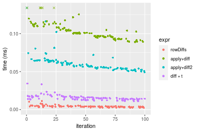
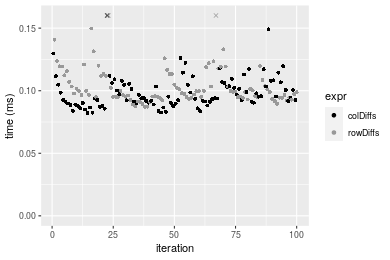
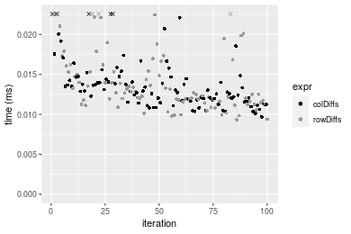
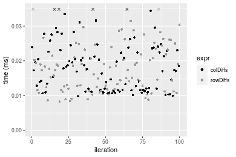
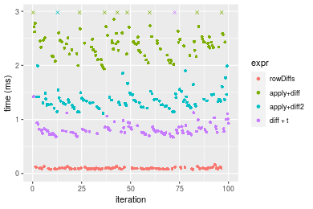

[matrixStats]: Benchmark report

---------------------------------------


# colDiffs() and rowDiffs() benchmarks

This report benchmark the performance of colDiffs() and rowDiffs() against alternative methods.

## Alternative methods

* apply() + diff()
* apply() + diff2()
* diff()


## Data type "integer"

### Data
```r
> rmatrix <- function(nrow, ncol, mode = c("logical", "double", "integer", "index"), range = c(-100, 
+     +100), na_prob = 0) {
+     mode <- match.arg(mode)
+     n <- nrow * ncol
+     if (mode == "logical") {
+         x <- sample(c(FALSE, TRUE), size = n, replace = TRUE)
+     }     else if (mode == "index") {
+         x <- seq_len(n)
+         mode <- "integer"
+     }     else {
+         x <- runif(n, min = range[1], max = range[2])
+     }
+     storage.mode(x) <- mode
+     if (na_prob > 0) 
+         x[sample(n, size = na_prob * n)] <- NA
+     dim(x) <- c(nrow, ncol)
+     x
+ }
> rmatrices <- function(scale = 10, seed = 1, ...) {
+     set.seed(seed)
+     data <- list()
+     data[[1]] <- rmatrix(nrow = scale * 1, ncol = scale * 1, ...)
+     data[[2]] <- rmatrix(nrow = scale * 10, ncol = scale * 10, ...)
+     data[[3]] <- rmatrix(nrow = scale * 100, ncol = scale * 1, ...)
+     data[[4]] <- t(data[[3]])
+     data[[5]] <- rmatrix(nrow = scale * 10, ncol = scale * 100, ...)
+     data[[6]] <- t(data[[5]])
+     names(data) <- sapply(data, FUN = function(x) paste(dim(x), collapse = "x"))
+     data
+ }
> data <- rmatrices(mode = mode)
```

### Results

#### 10x10 integer matrix


```r
> X <- data[["10x10"]]
> gc()
           used  (Mb) gc trigger  (Mb) max used  (Mb)
Ncells  5234885 279.6    7916910 422.9  7916910 422.9
Vcells 10018469  76.5   33191153 253.3 53339345 407.0
> colStats <- microbenchmark(colDiffs = colDiffs(X), `apply+diff` = apply(X, MARGIN = 2L, FUN = diff), 
+     `apply+diff2` = apply(X, MARGIN = 2L, FUN = diff2), diff = diff(X), unit = "ms")
> X <- t(X)
> gc()
          used  (Mb) gc trigger  (Mb) max used  (Mb)
Ncells 5220903 278.9    7916910 422.9  7916910 422.9
Vcells 9972243  76.1   33191153 253.3 53339345 407.0
> rowStats <- microbenchmark(rowDiffs = rowDiffs(X), `apply+diff` = apply(X, MARGIN = 1L, FUN = diff), 
+     `apply+diff2` = apply(X, MARGIN = 1L, FUN = diff2), `diff + t` = diff(t(X)), unit = "ms")
```

_Table: Benchmarking of colDiffs(), apply+diff(), apply+diff2() and diff() on integer+10x10 data. The top panel shows times in milliseconds and the bottom panel shows relative times._


|   |expr        |      min|        lq|      mean|    median|        uq|      max|
|:--|:-----------|--------:|---------:|---------:|---------:|---------:|--------:|
|1  |colDiffs    | 0.002410| 0.0032175| 0.0040717| 0.0039040| 0.0042950| 0.018556|
|4  |diff        | 0.008681| 0.0099505| 0.0123318| 0.0112145| 0.0121575| 0.086460|
|3  |apply+diff2 | 0.051363| 0.0550640| 0.0618324| 0.0579920| 0.0634745| 0.191141|
|2  |apply+diff  | 0.089033| 0.0937465| 0.1039585| 0.0975035| 0.1069685| 0.187278|


|   |expr        |       min|        lq|      mean|    median|        uq|       max|
|:--|:-----------|---------:|---------:|---------:|---------:|---------:|---------:|
|1  |colDiffs    |  1.000000|  1.000000|  1.000000|  1.000000|  1.000000|  1.000000|
|4  |diff        |  3.602075|  3.092618|  3.028634|  2.872567|  2.830617|  4.659409|
|3  |apply+diff2 | 21.312448| 17.113908| 15.185821| 14.854508| 14.778696| 10.300765|
|2  |apply+diff  | 36.943154| 29.136441| 25.531849| 24.975282| 24.905355| 10.092585|

_Table: Benchmarking of rowDiffs(), apply+diff(), apply+diff2() and diff + t() on integer+10x10 data (transposed). The top panel shows times in milliseconds and the bottom panel shows relative times._


|   |expr        |      min|        lq|      mean|    median|        uq|      max|
|:--|:-----------|--------:|---------:|---------:|---------:|---------:|--------:|
|1  |rowDiffs    | 0.002251| 0.0032095| 0.0040860| 0.0038905| 0.0044525| 0.011247|
|4  |diff + t    | 0.010882| 0.0133260| 0.0155085| 0.0148845| 0.0168720| 0.034290|
|3  |apply+diff2 | 0.049278| 0.0543650| 0.0612715| 0.0579860| 0.0642190| 0.169976|
|2  |apply+diff  | 0.088994| 0.0955335| 0.1053381| 0.1009290| 0.1104345| 0.193562|


|   |expr        |       min|        lq|      mean|    median|        uq|       max|
|:--|:-----------|---------:|---------:|---------:|---------:|---------:|---------:|
|1  |rowDiffs    |  1.000000|  1.000000|  1.000000|  1.000000|  1.000000|  1.000000|
|4  |diff + t    |  4.834296|  4.152049|  3.795472|  3.825858|  3.789332|  3.048813|
|3  |apply+diff2 | 21.891604| 16.938775| 14.995279| 14.904511| 14.423133| 15.113008|
|2  |apply+diff  | 39.535318| 29.765851| 25.779924| 25.942424| 24.802807| 17.210100|

_Figure: Benchmarking of colDiffs(), apply+diff(), apply+diff2() and diff() on integer+10x10 data  as well as rowDiffs(), apply+diff(), apply+diff2() and diff + t() on the same data transposed.  Outliers are displayed as crosses.  Times are in milliseconds._



_Table: Benchmarking of colDiffs() and rowDiffs() on integer+10x10 data (original and transposed).  The top panel shows times in milliseconds and the bottom panel shows relative times._


|   |expr     |   min|     lq|    mean| median|     uq|    max|
|:--|:--------|-----:|------:|-------:|------:|------:|------:|
|2  |rowDiffs | 2.251| 3.2095| 4.08605| 3.8905| 4.4525| 11.247|
|1  |colDiffs | 2.410| 3.2175| 4.07172| 3.9040| 4.2950| 18.556|


|   |expr     |      min|       lq|      mean|  median|        uq|      max|
|:--|:--------|--------:|--------:|---------:|-------:|---------:|--------:|
|2  |rowDiffs | 1.000000| 1.000000| 1.0000000| 1.00000| 1.0000000| 1.000000|
|1  |colDiffs | 1.070635| 1.002493| 0.9964929| 1.00347| 0.9646266| 1.649862|

_Figure: Benchmarking of colDiffs() and rowDiffs() on integer+10x10 data (original and transposed).  Outliers are displayed as crosses. Times are in milliseconds._


#### 100x100 integer matrix


```r
> X <- data[["100x100"]]
> gc()
          used  (Mb) gc trigger  (Mb) max used  (Mb)
Ncells 5219531 278.8    7916910 422.9  7916910 422.9
Vcells 9589103  73.2   33191153 253.3 53339345 407.0
> colStats <- microbenchmark(colDiffs = colDiffs(X), `apply+diff` = apply(X, MARGIN = 2L, FUN = diff), 
+     `apply+diff2` = apply(X, MARGIN = 2L, FUN = diff2), diff = diff(X), unit = "ms")
> X <- t(X)
> gc()
          used  (Mb) gc trigger  (Mb) max used  (Mb)
Ncells 5219525 278.8    7916910 422.9  7916910 422.9
Vcells 9594146  73.2   33191153 253.3 53339345 407.0
> rowStats <- microbenchmark(rowDiffs = rowDiffs(X), `apply+diff` = apply(X, MARGIN = 1L, FUN = diff), 
+     `apply+diff2` = apply(X, MARGIN = 1L, FUN = diff2), `diff + t` = diff(t(X)), unit = "ms")
```

_Table: Benchmarking of colDiffs(), apply+diff(), apply+diff2() and diff() on integer+100x100 data. The top panel shows times in milliseconds and the bottom panel shows relative times._


|   |expr        |      min|        lq|      mean|    median|        uq|      max|
|:--|:-----------|--------:|---------:|---------:|---------:|---------:|--------:|
|1  |colDiffs    | 0.010233| 0.0120500| 0.0143566| 0.0129230| 0.0157705| 0.036864|
|4  |diff        | 0.087554| 0.0909240| 0.1065238| 0.0999280| 0.1161120| 0.189905|
|3  |apply+diff2 | 0.274204| 0.2875025| 0.3443083| 0.3087115| 0.3727895| 0.608045|
|2  |apply+diff  | 0.665882| 0.6867605| 0.7869371| 0.7301075| 0.8513480| 1.293287|


|   |expr        |       min|       lq|      mean|   median|        uq|       max|
|:--|:-----------|---------:|--------:|---------:|--------:|---------:|---------:|
|1  |colDiffs    |  1.000000|  1.00000|  1.000000|  1.00000|  1.000000|  1.000000|
|4  |diff        |  8.556044|  7.54556|  7.419829|  7.73257|  7.362607|  5.151503|
|3  |apply+diff2 | 26.796052| 23.85913| 23.982513| 23.88853| 23.638407| 16.494276|
|2  |apply+diff  | 65.072022| 56.99257| 54.813460| 56.49675| 53.983577| 35.082655|

_Table: Benchmarking of rowDiffs(), apply+diff(), apply+diff2() and diff + t() on integer+100x100 data (transposed). The top panel shows times in milliseconds and the bottom panel shows relative times._


|   |expr        |      min|        lq|      mean|    median|        uq|      max|
|:--|:-----------|--------:|---------:|---------:|---------:|---------:|--------:|
|1  |rowDiffs    | 0.010478| 0.0124790| 0.0148709| 0.0141820| 0.0163615| 0.029732|
|4  |diff + t    | 0.101260| 0.1061495| 0.1226143| 0.1162905| 0.1309370| 0.203687|
|3  |apply+diff2 | 0.275292| 0.2883290| 0.3386836| 0.3113205| 0.3673170| 0.728100|
|2  |apply+diff  | 0.662150| 0.6785940| 0.7995663| 0.7387975| 0.8693675| 1.547435|


|   |expr        |       min|        lq|      mean|    median|       uq|       max|
|:--|:-----------|---------:|---------:|---------:|---------:|--------:|---------:|
|1  |rowDiffs    |  1.000000|  1.000000|  1.000000|  1.000000|  1.00000|  1.000000|
|4  |diff + t    |  9.664058|  8.506251|  8.245246|  8.199866|  8.00275|  6.850767|
|3  |apply+diff2 | 26.273335| 23.105137| 22.774908| 21.951805| 22.45008| 24.488766|
|2  |apply+diff  | 63.194312| 54.378876| 53.767139| 52.094028| 53.13495| 52.046112|

_Figure: Benchmarking of colDiffs(), apply+diff(), apply+diff2() and diff() on integer+100x100 data  as well as rowDiffs(), apply+diff(), apply+diff2() and diff + t() on the same data transposed.  Outliers are displayed as crosses.  Times are in milliseconds._


_Table: Benchmarking of colDiffs() and rowDiffs() on integer+100x100 data (original and transposed).  The top panel shows times in milliseconds and the bottom panel shows relative times._


|   |expr     |    min|     lq|     mean| median|      uq|    max|
|:--|:--------|------:|------:|--------:|------:|-------:|------:|
|1  |colDiffs | 10.233| 12.050| 14.35664| 12.923| 15.7705| 36.864|
|2  |rowDiffs | 10.478| 12.479| 14.87091| 14.182| 16.3615| 29.732|


|   |expr     |      min|       lq|     mean|   median|       uq|       max|
|:--|:--------|--------:|--------:|--------:|--------:|--------:|---------:|
|1  |colDiffs | 1.000000| 1.000000| 1.000000| 1.000000| 1.000000| 1.0000000|
|2  |rowDiffs | 1.023942| 1.035602| 1.035821| 1.097423| 1.037475| 0.8065321|

_Figure: Benchmarking of colDiffs() and rowDiffs() on integer+100x100 data (original and transposed).  Outliers are displayed as crosses. Times are in milliseconds._


#### 1000x10 integer matrix


```r
> X <- data[["1000x10"]]
> gc()
          used  (Mb) gc trigger  (Mb) max used  (Mb)
Ncells 5220319 278.8    7916910 422.9  7916910 422.9
Vcells 9592922  73.2   33191153 253.3 53339345 407.0
> colStats <- microbenchmark(colDiffs = colDiffs(X), `apply+diff` = apply(X, MARGIN = 2L, FUN = diff), 
+     `apply+diff2` = apply(X, MARGIN = 2L, FUN = diff2), diff = diff(X), unit = "ms")
> X <- t(X)
> gc()
          used  (Mb) gc trigger  (Mb) max used  (Mb)
Ncells 5220307 278.8    7916910 422.9  7916910 422.9
Vcells 9597955  73.3   33191153 253.3 53339345 407.0
> rowStats <- microbenchmark(rowDiffs = rowDiffs(X), `apply+diff` = apply(X, MARGIN = 1L, FUN = diff), 
+     `apply+diff2` = apply(X, MARGIN = 1L, FUN = diff2), `diff + t` = diff(t(X)), unit = "ms")
```

_Table: Benchmarking of colDiffs(), apply+diff(), apply+diff2() and diff() on integer+1000x10 data. The top panel shows times in milliseconds and the bottom panel shows relative times._


|   |expr        |      min|        lq|      mean|    median|        uq|      max|
|:--|:-----------|--------:|---------:|---------:|---------:|---------:|--------:|
|1  |colDiffs    | 0.011760| 0.0140630| 0.0159658| 0.0152555| 0.0168710| 0.037522|
|4  |diff        | 0.103828| 0.1132165| 0.1227273| 0.1170555| 0.1220665| 0.245433|
|3  |apply+diff2 | 0.143026| 0.1567360| 0.1734666| 0.1625070| 0.1759850| 0.380707|
|2  |apply+diff  | 0.293264| 0.3146275| 0.3432318| 0.3312005| 0.3574070| 0.620222|


|   |expr        |       min|        lq|      mean|    median|        uq|       max|
|:--|:-----------|---------:|---------:|---------:|---------:|---------:|---------:|
|1  |colDiffs    |  1.000000|  1.000000|  1.000000|  1.000000|  1.000000|  1.000000|
|4  |diff        |  8.828912|  8.050665|  7.686904|  7.673003|  7.235285|  6.541043|
|3  |apply+diff2 | 12.162075| 11.145275| 10.864916| 10.652355| 10.431213| 10.146234|
|2  |apply+diff  | 24.937415| 22.372716| 21.497990| 21.710236| 21.184696| 16.529556|

_Table: Benchmarking of rowDiffs(), apply+diff(), apply+diff2() and diff + t() on integer+1000x10 data (transposed). The top panel shows times in milliseconds and the bottom panel shows relative times._


|   |expr        |      min|        lq|      mean|    median|        uq|      max|
|:--|:-----------|--------:|---------:|---------:|---------:|---------:|--------:|
|1  |rowDiffs    | 0.011410| 0.0133540| 0.0156139| 0.0145475| 0.0163070| 0.039514|
|4  |diff + t    | 0.112171| 0.1280085| 0.1407737| 0.1369440| 0.1466525| 0.235174|
|3  |apply+diff2 | 0.130754| 0.1534225| 0.1698552| 0.1654425| 0.1776625| 0.379489|
|2  |apply+diff  | 0.269161| 0.3030970| 0.3387973| 0.3320595| 0.3625425| 0.504731|


|   |expr        |       min|        lq|      mean|    median|        uq|       max|
|:--|:-----------|---------:|---------:|---------:|---------:|---------:|---------:|
|1  |rowDiffs    |  1.000000|  1.000000|  1.000000|  1.000000|  1.000000|  1.000000|
|4  |diff + t    |  9.830938|  9.585779|  9.015911|  9.413576|  8.993224|  5.951663|
|3  |apply+diff2 | 11.459597| 11.488880| 10.878448| 11.372573| 10.894861|  9.603912|
|2  |apply+diff  | 23.589921| 22.697094| 21.698417| 22.825881| 22.232323| 12.773473|

_Figure: Benchmarking of colDiffs(), apply+diff(), apply+diff2() and diff() on integer+1000x10 data  as well as rowDiffs(), apply+diff(), apply+diff2() and diff + t() on the same data transposed.  Outliers are displayed as crosses.  Times are in milliseconds._


_Table: Benchmarking of colDiffs() and rowDiffs() on integer+1000x10 data (original and transposed).  The top panel shows times in milliseconds and the bottom panel shows relative times._


|   |expr     |   min|     lq|     mean|  median|     uq|    max|
|:--|:--------|-----:|------:|--------:|-------:|------:|------:|
|2  |rowDiffs | 11.41| 13.354| 15.61392| 14.5475| 16.307| 39.514|
|1  |colDiffs | 11.76| 14.063| 15.96576| 15.2555| 16.871| 37.522|


|   |expr     |      min|       lq|     mean|   median|       uq|       max|
|:--|:--------|--------:|--------:|--------:|--------:|--------:|---------:|
|2  |rowDiffs | 1.000000| 1.000000| 1.000000| 1.000000| 1.000000| 1.0000000|
|1  |colDiffs | 1.030675| 1.053093| 1.022534| 1.048668| 1.034586| 0.9495875|

_Figure: Benchmarking of colDiffs() and rowDiffs() on integer+1000x10 data (original and transposed).  Outliers are displayed as crosses. Times are in milliseconds._


#### 10x1000 integer matrix


```r
> X <- data[["10x1000"]]
> gc()
          used  (Mb) gc trigger  (Mb) max used  (Mb)
Ncells 5220555 278.9    7916910 422.9  7916910 422.9
Vcells 9593747  73.2   33191153 253.3 53339345 407.0
> colStats <- microbenchmark(colDiffs = colDiffs(X), `apply+diff` = apply(X, MARGIN = 2L, FUN = diff), 
+     `apply+diff2` = apply(X, MARGIN = 2L, FUN = diff2), diff = diff(X), unit = "ms")
> X <- t(X)
> gc()
          used  (Mb) gc trigger  (Mb) max used  (Mb)
Ncells 5220549 278.9    7916910 422.9  7916910 422.9
Vcells 9598790  73.3   33191153 253.3 53339345 407.0
> rowStats <- microbenchmark(rowDiffs = rowDiffs(X), `apply+diff` = apply(X, MARGIN = 1L, FUN = diff), 
+     `apply+diff2` = apply(X, MARGIN = 1L, FUN = diff2), `diff + t` = diff(t(X)), unit = "ms")
```

_Table: Benchmarking of colDiffs(), apply+diff(), apply+diff2() and diff() on integer+10x1000 data. The top panel shows times in milliseconds and the bottom panel shows relative times._


|   |expr        |      min|        lq|      mean|    median|        uq|       max|
|:--|:-----------|--------:|---------:|---------:|---------:|---------:|---------:|
|1  |colDiffs    | 0.010385| 0.0121705| 0.0170979| 0.0155630| 0.0203250|  0.062486|
|4  |diff        | 0.086857| 0.0961335| 0.1046856| 0.1014835| 0.1096045|  0.152155|
|3  |apply+diff2 | 1.845579| 2.0226450| 2.1602227| 2.0687535| 2.1450155|  3.594670|
|2  |apply+diff  | 4.717286| 5.1664400| 5.5673794| 5.3721440| 5.6495685| 10.634311|


|   |expr        |        min|         lq|      mean|     median|         uq|        max|
|:--|:-----------|----------:|----------:|---------:|----------:|----------:|----------:|
|1  |colDiffs    |   1.000000|   1.000000|   1.00000|   1.000000|   1.000000|   1.000000|
|4  |diff        |   8.363698|   7.898895|   6.12273|   6.520819|   5.392595|   2.435025|
|3  |apply+diff2 | 177.715840| 166.192432| 126.34455| 132.927681| 105.535818|  57.527606|
|2  |apply+diff  | 454.240347| 424.505156| 325.61830| 345.186918| 277.961550| 170.187098|

_Table: Benchmarking of rowDiffs(), apply+diff(), apply+diff2() and diff + t() on integer+10x1000 data (transposed). The top panel shows times in milliseconds and the bottom panel shows relative times._


|   |expr        |      min|       lq|      mean|    median|        uq|       max|
|:--|:-----------|--------:|--------:|---------:|---------:|---------:|---------:|
|1  |rowDiffs    | 0.009787| 0.011020| 0.0158380| 0.0155095| 0.0183135|  0.048899|
|4  |diff + t    | 0.097048| 0.110901| 0.1259177| 0.1227690| 0.1325280|  0.235955|
|3  |apply+diff2 | 1.808700| 2.002831| 2.1504046| 2.0630150| 2.1220855|  8.365290|
|2  |apply+diff  | 4.638639| 5.136468| 5.6383491| 5.3584645| 5.7189120| 12.578408|


|   |expr        |        min|        lq|       mean|     median|         uq|        max|
|:--|:-----------|----------:|---------:|----------:|----------:|----------:|----------:|
|1  |rowDiffs    |   1.000000|   1.00000|   1.000000|   1.000000|   1.000000|   1.000000|
|4  |diff + t    |   9.916011|  10.06361|   7.950343|   7.915729|   7.236629|   4.825354|
|3  |apply+diff2 | 184.806376| 181.74510| 135.774840| 133.016216| 115.875474| 171.072824|
|2  |apply+diff  | 473.959232| 466.10417| 356.000885| 345.495632| 312.278483| 257.232418|

_Figure: Benchmarking of colDiffs(), apply+diff(), apply+diff2() and diff() on integer+10x1000 data  as well as rowDiffs(), apply+diff(), apply+diff2() and diff + t() on the same data transposed.  Outliers are displayed as crosses.  Times are in milliseconds._


_Table: Benchmarking of colDiffs() and rowDiffs() on integer+10x1000 data (original and transposed).  The top panel shows times in milliseconds and the bottom panel shows relative times._


|   |expr     |    min|      lq|     mean|  median|      uq|    max|
|:--|:--------|------:|-------:|--------:|-------:|-------:|------:|
|2  |rowDiffs |  9.787| 11.0200| 15.83802| 15.5095| 18.3135| 48.899|
|1  |colDiffs | 10.385| 12.1705| 17.09787| 15.5630| 20.3250| 62.486|


|   |expr     |      min|       lq|     mean|  median|       uq|      max|
|:--|:--------|--------:|--------:|--------:|-------:|--------:|--------:|
|2  |rowDiffs | 1.000000| 1.000000| 1.000000| 1.00000| 1.000000| 1.000000|
|1  |colDiffs | 1.061101| 1.104401| 1.079546| 1.00345| 1.109837| 1.277858|

_Figure: Benchmarking of colDiffs() and rowDiffs() on integer+10x1000 data (original and transposed).  Outliers are displayed as crosses. Times are in milliseconds._


#### 100x1000 integer matrix


```r
> X <- data[["100x1000"]]
> gc()
          used  (Mb) gc trigger  (Mb) max used  (Mb)
Ncells 5220789 278.9    7916910 422.9  7916910 422.9
Vcells 9594345  73.2   33191153 253.3 53339345 407.0
> colStats <- microbenchmark(colDiffs = colDiffs(X), `apply+diff` = apply(X, MARGIN = 2L, FUN = diff), 
+     `apply+diff2` = apply(X, MARGIN = 2L, FUN = diff2), diff = diff(X), unit = "ms")
> X <- t(X)
> gc()
          used  (Mb) gc trigger  (Mb) max used  (Mb)
Ncells 5220783 278.9    7916910 422.9  7916910 422.9
Vcells 9644388  73.6   33191153 253.3 53339345 407.0
> rowStats <- microbenchmark(rowDiffs = rowDiffs(X), `apply+diff` = apply(X, MARGIN = 1L, FUN = diff), 
+     `apply+diff2` = apply(X, MARGIN = 1L, FUN = diff2), `diff + t` = diff(t(X)), unit = "ms")
```

_Table: Benchmarking of colDiffs(), apply+diff(), apply+diff2() and diff() on integer+100x1000 data. The top panel shows times in milliseconds and the bottom panel shows relative times._


|   |expr        |      min|        lq|      mean|    median|       uq|       max|
|:--|:-----------|--------:|---------:|---------:|---------:|--------:|---------:|
|1  |colDiffs    | 0.089649| 0.1018180| 0.1172249| 0.1081050| 0.116504|  0.247380|
|4  |diff        | 0.815440| 0.9071745| 1.1495363| 0.9351265| 0.972877| 20.430142|
|3  |apply+diff2 | 2.644608| 2.8736100| 3.0427602| 2.9520865| 3.047727|  4.831793|
|2  |apply+diff  | 6.575066| 7.2131575| 8.1939990| 7.3440485| 7.752326| 28.913440|


|   |expr        |       min|        lq|      mean|    median|        uq|       max|
|:--|:-----------|---------:|---------:|---------:|---------:|---------:|---------:|
|1  |colDiffs    |  1.000000|  1.000000|  1.000000|  1.000000|  1.000000|   1.00000|
|4  |diff        |  9.095918|  8.909766|  9.806244|  8.650169|  8.350589|  82.58607|
|3  |apply+diff2 | 29.499582| 28.223006| 25.956594| 27.307585| 26.159844|  19.53187|
|2  |apply+diff  | 73.342324| 70.843638| 69.899793| 67.934402| 66.541282| 116.87865|

_Table: Benchmarking of rowDiffs(), apply+diff(), apply+diff2() and diff + t() on integer+100x1000 data (transposed). The top panel shows times in milliseconds and the bottom panel shows relative times._


|   |expr        |      min|        lq|      mean|   median|       uq|       max|
|:--|:-----------|--------:|---------:|---------:|--------:|--------:|---------:|
|1  |rowDiffs    | 0.085926| 0.0946745| 0.2806362| 0.102276| 0.109824| 17.608900|
|4  |diff + t    | 0.956782| 1.0473905| 1.4834830| 1.086612| 1.161292| 20.341576|
|3  |apply+diff2 | 2.733862| 2.9199090| 3.0264864| 2.980916| 3.088248|  3.999677|
|2  |apply+diff  | 6.646363| 7.2116670| 7.9014230| 7.328157| 7.532244| 28.131772|


|   |expr        |      min|       lq|      mean|   median|       uq|       max|
|:--|:-----------|--------:|--------:|---------:|--------:|--------:|---------:|
|1  |rowDiffs    |  1.00000|  1.00000|  1.000000|  1.00000|  1.00000| 1.0000000|
|4  |diff + t    | 11.13495| 11.06307|  5.286143| 10.62431| 10.57412| 1.1551872|
|3  |apply+diff2 | 31.81647| 30.84156| 10.784377| 29.14580| 28.11997| 0.2271395|
|2  |apply+diff  | 77.34985| 76.17328| 28.155395| 71.65080| 68.58468| 1.5975883|

_Figure: Benchmarking of colDiffs(), apply+diff(), apply+diff2() and diff() on integer+100x1000 data  as well as rowDiffs(), apply+diff(), apply+diff2() and diff + t() on the same data transposed.  Outliers are displayed as crosses.  Times are in milliseconds._


_Table: Benchmarking of colDiffs() and rowDiffs() on integer+100x1000 data (original and transposed).  The top panel shows times in milliseconds and the bottom panel shows relative times._


|   |expr     |    min|       lq|     mean|  median|      uq|      max|
|:--|:--------|------:|--------:|--------:|-------:|-------:|--------:|
|2  |rowDiffs | 85.926|  94.6745| 280.6362| 102.276| 109.824| 17608.90|
|1  |colDiffs | 89.649| 101.8180| 117.2249| 108.105| 116.504|   247.38|


|   |expr     |      min|       lq|      mean|   median|       uq|       max|
|:--|:--------|--------:|--------:|---------:|--------:|--------:|---------:|
|2  |rowDiffs | 1.000000| 1.000000| 1.0000000| 1.000000| 1.000000| 1.0000000|
|1  |colDiffs | 1.043328| 1.075453| 0.4177114| 1.056993| 1.060825| 0.0140486|

_Figure: Benchmarking of colDiffs() and rowDiffs() on integer+100x1000 data (original and transposed).  Outliers are displayed as crosses. Times are in milliseconds._


#### 1000x100 integer matrix


```r
> X <- data[["1000x100"]]
> gc()
          used  (Mb) gc trigger  (Mb) max used  (Mb)
Ncells 5221013 278.9    7916910 422.9  7916910 422.9
Vcells 9595023  73.3   33191153 253.3 53339345 407.0
> colStats <- microbenchmark(colDiffs = colDiffs(X), `apply+diff` = apply(X, MARGIN = 2L, FUN = diff), 
+     `apply+diff2` = apply(X, MARGIN = 2L, FUN = diff2), diff = diff(X), unit = "ms")
> X <- t(X)
> gc()
          used  (Mb) gc trigger  (Mb) max used  (Mb)
Ncells 5221007 278.9    7916910 422.9  7916910 422.9
Vcells 9645066  73.6   33191153 253.3 53339345 407.0
> rowStats <- microbenchmark(rowDiffs = rowDiffs(X), `apply+diff` = apply(X, MARGIN = 1L, FUN = diff), 
+     `apply+diff2` = apply(X, MARGIN = 1L, FUN = diff2), `diff + t` = diff(t(X)), unit = "ms")
```

_Table: Benchmarking of colDiffs(), apply+diff(), apply+diff2() and diff() on integer+1000x100 data. The top panel shows times in milliseconds and the bottom panel shows relative times._


|   |expr        |      min|        lq|      mean|    median|       uq|       max|
|:--|:-----------|--------:|---------:|---------:|---------:|--------:|---------:|
|1  |colDiffs    | 0.082110| 0.0902385| 0.0992295| 0.0943880| 0.105174|  0.208432|
|4  |diff        | 0.808117| 0.8352460| 0.9882278| 0.8880655| 0.974726|  8.515980|
|3  |apply+diff2 | 1.010645| 1.0632850| 1.2178040| 1.1018805| 1.204460|  8.988312|
|2  |apply+diff  | 2.259232| 2.3836330| 2.7445288| 2.4882985| 2.723021| 11.129779|


|   |expr        |       min|        lq|      mean|   median|        uq|      max|
|:--|:-----------|---------:|---------:|---------:|--------:|---------:|--------:|
|1  |colDiffs    |  1.000000|  1.000000|  1.000000|  1.00000|  1.000000|  1.00000|
|4  |diff        |  9.841883|  9.255983|  9.959008|  9.40867|  9.267747| 40.85735|
|3  |apply+diff2 | 12.308428| 11.783053| 12.272595| 11.67395| 11.452065| 43.12347|
|2  |apply+diff  | 27.514700| 26.414812| 27.658384| 26.36245| 25.890624| 53.39765|

_Table: Benchmarking of rowDiffs(), apply+diff(), apply+diff2() and diff + t() on integer+1000x100 data (transposed). The top panel shows times in milliseconds and the bottom panel shows relative times._


|   |expr        |      min|       lq|      mean|    median|       uq|       max|
|:--|:-----------|--------:|--------:|---------:|---------:|--------:|---------:|
|1  |rowDiffs    | 0.087239| 0.094856| 0.1045206| 0.0991225| 0.112059|  0.194481|
|4  |diff + t    | 0.944986| 1.006004| 1.1652765| 1.0588235| 1.154020|  8.434238|
|3  |apply+diff2 | 1.020452| 1.077211| 1.1790055| 1.1315640| 1.224992|  1.785453|
|2  |apply+diff  | 2.280171| 2.378445| 2.8924438| 2.4819050| 2.941225| 12.003412|


|   |expr        |      min|       lq|     mean|   median|       uq|       max|
|:--|:-----------|--------:|--------:|--------:|--------:|--------:|---------:|
|1  |rowDiffs    |  1.00000|  1.00000|  1.00000|  1.00000|  1.00000|  1.000000|
|4  |diff + t    | 10.83215| 10.60559| 11.14877| 10.68197| 10.29833| 43.367928|
|3  |apply+diff2 | 11.69720| 11.35628| 11.28012| 11.41581| 10.93167|  9.180604|
|2  |apply+diff  | 26.13706| 25.07427| 27.67343| 25.03877| 26.24711| 61.720230|

_Figure: Benchmarking of colDiffs(), apply+diff(), apply+diff2() and diff() on integer+1000x100 data  as well as rowDiffs(), apply+diff(), apply+diff2() and diff + t() on the same data transposed.  Outliers are displayed as crosses.  Times are in milliseconds._


_Table: Benchmarking of colDiffs() and rowDiffs() on integer+1000x100 data (original and transposed).  The top panel shows times in milliseconds and the bottom panel shows relative times._


|   |expr     |    min|      lq|      mean|  median|      uq|     max|
|:--|:--------|------:|-------:|---------:|-------:|-------:|-------:|
|1  |colDiffs | 82.110| 90.2385|  99.22954| 94.3880| 105.174| 208.432|
|2  |rowDiffs | 87.239| 94.8560| 104.52062| 99.1225| 112.059| 194.481|


|   |expr     |      min|      lq|     mean|  median|       uq|       max|
|:--|:--------|--------:|-------:|--------:|-------:|--------:|---------:|
|1  |colDiffs | 1.000000| 1.00000| 1.000000| 1.00000| 1.000000| 1.0000000|
|2  |rowDiffs | 1.062465| 1.05117| 1.053322| 1.05016| 1.065463| 0.9330669|

_Figure: Benchmarking of colDiffs() and rowDiffs() on integer+1000x100 data (original and transposed).  Outliers are displayed as crosses. Times are in milliseconds._





## Data type "double"

### Data
```r
> rmatrix <- function(nrow, ncol, mode = c("logical", "double", "integer", "index"), range = c(-100, 
+     +100), na_prob = 0) {
+     mode <- match.arg(mode)
+     n <- nrow * ncol
+     if (mode == "logical") {
+         x <- sample(c(FALSE, TRUE), size = n, replace = TRUE)
+     }     else if (mode == "index") {
+         x <- seq_len(n)
+         mode <- "integer"
+     }     else {
+         x <- runif(n, min = range[1], max = range[2])
+     }
+     storage.mode(x) <- mode
+     if (na_prob > 0) 
+         x[sample(n, size = na_prob * n)] <- NA
+     dim(x) <- c(nrow, ncol)
+     x
+ }
> rmatrices <- function(scale = 10, seed = 1, ...) {
+     set.seed(seed)
+     data <- list()
+     data[[1]] <- rmatrix(nrow = scale * 1, ncol = scale * 1, ...)
+     data[[2]] <- rmatrix(nrow = scale * 10, ncol = scale * 10, ...)
+     data[[3]] <- rmatrix(nrow = scale * 100, ncol = scale * 1, ...)
+     data[[4]] <- t(data[[3]])
+     data[[5]] <- rmatrix(nrow = scale * 10, ncol = scale * 100, ...)
+     data[[6]] <- t(data[[5]])
+     names(data) <- sapply(data, FUN = function(x) paste(dim(x), collapse = "x"))
+     data
+ }
> data <- rmatrices(mode = mode)
```

### Results

#### 10x10 double matrix


```r
> X <- data[["10x10"]]
> gc()
          used  (Mb) gc trigger  (Mb) max used  (Mb)
Ncells 5221245 278.9    7916910 422.9  7916910 422.9
Vcells 9710895  74.1   33191153 253.3 53339345 407.0
> colStats <- microbenchmark(colDiffs = colDiffs(X), `apply+diff` = apply(X, MARGIN = 2L, FUN = diff), 
+     `apply+diff2` = apply(X, MARGIN = 2L, FUN = diff2), diff = diff(X), unit = "ms")
> X <- t(X)
> gc()
          used  (Mb) gc trigger  (Mb) max used  (Mb)
Ncells 5221230 278.9    7916910 422.9  7916910 422.9
Vcells 9711023  74.1   33191153 253.3 53339345 407.0
> rowStats <- microbenchmark(rowDiffs = rowDiffs(X), `apply+diff` = apply(X, MARGIN = 1L, FUN = diff), 
+     `apply+diff2` = apply(X, MARGIN = 1L, FUN = diff2), `diff + t` = diff(t(X)), unit = "ms")
```

_Table: Benchmarking of colDiffs(), apply+diff(), apply+diff2() and diff() on double+10x10 data. The top panel shows times in milliseconds and the bottom panel shows relative times._


|   |expr        |      min|        lq|      mean|    median|        uq|      max|
|:--|:-----------|--------:|---------:|---------:|---------:|---------:|--------:|
|1  |colDiffs    | 0.002882| 0.0038320| 0.0050783| 0.0045370| 0.0051030| 0.019096|
|4  |diff        | 0.009565| 0.0107785| 0.0140648| 0.0127385| 0.0136985| 0.071148|
|3  |apply+diff2 | 0.060373| 0.0623130| 0.0704627| 0.0643260| 0.0674945| 0.160876|
|2  |apply+diff  | 0.098355| 0.1067560| 0.1182098| 0.1094600| 0.1136130| 0.252843|


|   |expr        |       min|        lq|      mean|    median|        uq|       max|
|:--|:-----------|---------:|---------:|---------:|---------:|---------:|---------:|
|1  |colDiffs    |  1.000000|  1.000000|  1.000000|  1.000000|  1.000000|  1.000000|
|4  |diff        |  3.318876|  2.812761|  2.769608|  2.807692|  2.684401|  3.725807|
|3  |apply+diff2 | 20.948300| 16.261221| 13.875398| 14.178091| 13.226435|  8.424592|
|2  |apply+diff  | 34.127342| 27.859081| 23.277665| 24.126075| 22.263962| 13.240626|

_Table: Benchmarking of rowDiffs(), apply+diff(), apply+diff2() and diff + t() on double+10x10 data (transposed). The top panel shows times in milliseconds and the bottom panel shows relative times._


|   |expr        |      min|        lq|      mean|    median|        uq|      max|
|:--|:-----------|--------:|---------:|---------:|---------:|---------:|--------:|
|1  |rowDiffs    | 0.002457| 0.0034230| 0.0042402| 0.0040435| 0.0044610| 0.012912|
|4  |diff + t    | 0.011420| 0.0140535| 0.0165485| 0.0163245| 0.0175085| 0.037819|
|3  |apply+diff2 | 0.054587| 0.0581645| 0.0633354| 0.0620350| 0.0635035| 0.166219|
|2  |apply+diff  | 0.094534| 0.0997970| 0.1091344| 0.1075865| 0.1092550| 0.240004|


|   |expr        |       min|        lq|      mean|   median|        uq|       max|
|:--|:-----------|---------:|---------:|---------:|--------:|---------:|---------:|
|1  |rowDiffs    |  1.000000|  1.000000|  1.000000|  1.00000|  1.000000|  1.000000|
|4  |diff + t    |  4.647945|  4.105609|  3.902738|  4.03722|  3.924793|  2.928981|
|3  |apply+diff2 | 22.216931| 16.992258| 14.936822| 15.34191| 14.235261| 12.873219|
|2  |apply+diff  | 38.475377| 29.154835| 25.737907| 26.60727| 24.491145| 18.587670|

_Figure: Benchmarking of colDiffs(), apply+diff(), apply+diff2() and diff() on double+10x10 data  as well as rowDiffs(), apply+diff(), apply+diff2() and diff + t() on the same data transposed.  Outliers are displayed as crosses.  Times are in milliseconds._


_Table: Benchmarking of colDiffs() and rowDiffs() on double+10x10 data (original and transposed).  The top panel shows times in milliseconds and the bottom panel shows relative times._


|   |expr     |   min|    lq|    mean| median|    uq|    max|
|:--|:--------|-----:|-----:|-------:|------:|-----:|------:|
|2  |rowDiffs | 2.457| 3.423| 4.24022| 4.0435| 4.461| 12.912|
|1  |colDiffs | 2.882| 3.832| 5.07825| 4.5370| 5.103| 19.096|


|   |expr     |      min|       lq|     mean|   median|       uq|      max|
|:--|:--------|--------:|--------:|--------:|--------:|--------:|--------:|
|2  |rowDiffs | 1.000000| 1.000000| 1.000000| 1.000000| 1.000000| 1.000000|
|1  |colDiffs | 1.172975| 1.119486| 1.197638| 1.122048| 1.143914| 1.478934|

_Figure: Benchmarking of colDiffs() and rowDiffs() on double+10x10 data (original and transposed).  Outliers are displayed as crosses. Times are in milliseconds._


#### 100x100 double matrix


```r
> X <- data[["100x100"]]
> gc()
          used  (Mb) gc trigger  (Mb) max used  (Mb)
Ncells 5221464 278.9    7916910 422.9  7916910 422.9
Vcells 9711901  74.1   33191153 253.3 53339345 407.0
> colStats <- microbenchmark(colDiffs = colDiffs(X), `apply+diff` = apply(X, MARGIN = 2L, FUN = diff), 
+     `apply+diff2` = apply(X, MARGIN = 2L, FUN = diff2), diff = diff(X), unit = "ms")
> X <- t(X)
> gc()
          used  (Mb) gc trigger  (Mb) max used  (Mb)
Ncells 5221458 278.9    7916910 422.9  7916910 422.9
Vcells 9721944  74.2   33191153 253.3 53339345 407.0
> rowStats <- microbenchmark(rowDiffs = rowDiffs(X), `apply+diff` = apply(X, MARGIN = 1L, FUN = diff), 
+     `apply+diff2` = apply(X, MARGIN = 1L, FUN = diff2), `diff + t` = diff(t(X)), unit = "ms")
```

_Table: Benchmarking of colDiffs(), apply+diff(), apply+diff2() and diff() on double+100x100 data. The top panel shows times in milliseconds and the bottom panel shows relative times._


|   |expr        |      min|        lq|      mean|    median|        uq|      max|
|:--|:-----------|--------:|---------:|---------:|---------:|---------:|--------:|
|1  |colDiffs    | 0.008937| 0.0115895| 0.0140659| 0.0132655| 0.0158875| 0.034496|
|4  |diff        | 0.050511| 0.0554920| 0.0638905| 0.0616950| 0.0677750| 0.159708|
|3  |apply+diff2 | 0.277555| 0.2939775| 0.3352664| 0.3135475| 0.3634770| 0.578353|
|2  |apply+diff  | 0.607888| 0.6584725| 0.7502030| 0.7012380| 0.8136910| 1.165844|


|   |expr        |       min|        lq|      mean|    median|        uq|       max|
|:--|:-----------|---------:|---------:|---------:|---------:|---------:|---------:|
|1  |colDiffs    |  1.000000|  1.000000|  1.000000|  1.000000|  1.000000|  1.000000|
|4  |diff        |  5.651897|  4.788127|  4.542222|  4.650786|  4.265932|  4.629754|
|3  |apply+diff2 | 31.056842| 25.365848| 23.835389| 23.636312| 22.878175| 16.765799|
|2  |apply+diff  | 68.019246| 56.816299| 53.334836| 52.861784| 51.215799| 33.796498|

_Table: Benchmarking of rowDiffs(), apply+diff(), apply+diff2() and diff + t() on double+100x100 data (transposed). The top panel shows times in milliseconds and the bottom panel shows relative times._


|   |expr        |      min|        lq|      mean|    median|        uq|      max|
|:--|:-----------|--------:|---------:|---------:|---------:|---------:|--------:|
|1  |rowDiffs    | 0.008128| 0.0100500| 0.0121818| 0.0116100| 0.0131995| 0.025898|
|4  |diff + t    | 0.066060| 0.0693595| 0.0789167| 0.0747990| 0.0843110| 0.122213|
|3  |apply+diff2 | 0.268388| 0.2806290| 0.3194527| 0.2984125| 0.3504460| 0.469339|
|2  |apply+diff  | 0.601671| 0.6159255| 0.7099022| 0.6555765| 0.7829940| 1.215689|


|   |expr        |       min|        lq|      mean|    median|        uq|       max|
|:--|:-----------|---------:|---------:|---------:|---------:|---------:|---------:|
|1  |rowDiffs    |  1.000000|  1.000000|  1.000000|  1.000000|  1.000000|  1.000000|
|4  |diff + t    |  8.127461|  6.901443|  6.478235|  6.442636|  6.387439|  4.719013|
|3  |apply+diff2 | 33.020177| 27.923284| 26.223721| 25.703058| 26.549945| 18.122596|
|2  |apply+diff  | 74.024483| 61.286119| 58.275549| 56.466538| 59.319974| 46.941424|

_Figure: Benchmarking of colDiffs(), apply+diff(), apply+diff2() and diff() on double+100x100 data  as well as rowDiffs(), apply+diff(), apply+diff2() and diff + t() on the same data transposed.  Outliers are displayed as crosses.  Times are in milliseconds._


_Table: Benchmarking of colDiffs() and rowDiffs() on double+100x100 data (original and transposed).  The top panel shows times in milliseconds and the bottom panel shows relative times._


|   |expr     |   min|      lq|     mean|  median|      uq|    max|
|:--|:--------|-----:|-------:|--------:|-------:|-------:|------:|
|2  |rowDiffs | 8.128| 10.0500| 12.18182| 11.6100| 13.1995| 25.898|
|1  |colDiffs | 8.937| 11.5895| 14.06591| 13.2655| 15.8875| 34.496|


|   |expr     |      min|       lq|     mean|   median|       uq|      max|
|:--|:--------|--------:|--------:|--------:|--------:|--------:|--------:|
|2  |rowDiffs | 1.000000| 1.000000| 1.000000| 1.000000| 1.000000| 1.000000|
|1  |colDiffs | 1.099533| 1.153184| 1.154664| 1.142593| 1.203644| 1.331995|

_Figure: Benchmarking of colDiffs() and rowDiffs() on double+100x100 data (original and transposed).  Outliers are displayed as crosses. Times are in milliseconds._


#### 1000x10 double matrix


```r
> X <- data[["1000x10"]]
> gc()
          used  (Mb) gc trigger  (Mb) max used  (Mb)
Ncells 5221694 278.9    7916910 422.9  7916910 422.9
Vcells 9713001  74.2   33191153 253.3 53339345 407.0
> colStats <- microbenchmark(colDiffs = colDiffs(X), `apply+diff` = apply(X, MARGIN = 2L, FUN = diff), 
+     `apply+diff2` = apply(X, MARGIN = 2L, FUN = diff2), diff = diff(X), unit = "ms")
> X <- t(X)
> gc()
          used  (Mb) gc trigger  (Mb) max used  (Mb)
Ncells 5221682 278.9    7916910 422.9  7916910 422.9
Vcells 9723034  74.2   33191153 253.3 53339345 407.0
> rowStats <- microbenchmark(rowDiffs = rowDiffs(X), `apply+diff` = apply(X, MARGIN = 1L, FUN = diff), 
+     `apply+diff2` = apply(X, MARGIN = 1L, FUN = diff2), `diff + t` = diff(t(X)), unit = "ms")
```

_Table: Benchmarking of colDiffs(), apply+diff(), apply+diff2() and diff() on double+1000x10 data. The top panel shows times in milliseconds and the bottom panel shows relative times._


|   |expr        |      min|        lq|      mean|    median|        uq|      max|
|:--|:-----------|--------:|---------:|---------:|---------:|---------:|--------:|
|1  |colDiffs    | 0.009700| 0.0116410| 0.0140630| 0.0129225| 0.0146775| 0.038085|
|4  |diff        | 0.061551| 0.0675830| 0.0760927| 0.0713770| 0.0823970| 0.183753|
|3  |apply+diff2 | 0.138074| 0.1532545| 0.1715054| 0.1605680| 0.1773945| 0.388456|
|2  |apply+diff  | 0.223189| 0.2453330| 0.2867097| 0.2697225| 0.3103900| 0.484405|


|   |expr        |       min|        lq|      mean|    median|        uq|       max|
|:--|:-----------|---------:|---------:|---------:|---------:|---------:|---------:|
|1  |colDiffs    |  1.000000|  1.000000|  1.000000|  1.000000|  1.000000|  1.000000|
|4  |diff        |  6.345464|  5.805601|  5.410822|  5.523467|  5.613831|  4.824813|
|3  |apply+diff2 | 14.234433| 13.165063| 12.195464| 12.425460| 12.086152| 10.199711|
|2  |apply+diff  | 23.009175| 21.074908| 20.387445| 20.872316| 21.147334| 12.719050|

_Table: Benchmarking of rowDiffs(), apply+diff(), apply+diff2() and diff + t() on double+1000x10 data (transposed). The top panel shows times in milliseconds and the bottom panel shows relative times._


|   |expr        |      min|        lq|      mean|    median|        uq|      max|
|:--|:-----------|--------:|---------:|---------:|---------:|---------:|--------:|
|1  |rowDiffs    | 0.009308| 0.0115990| 0.0146869| 0.0125940| 0.0157475| 0.047693|
|4  |diff + t    | 0.079128| 0.0885355| 0.1029702| 0.0962810| 0.1138945| 0.238251|
|3  |apply+diff2 | 0.135614| 0.1502960| 0.1745175| 0.1626475| 0.1935285| 0.356424|
|2  |apply+diff  | 0.222073| 0.2418025| 0.3042227| 0.2782955| 0.3219105| 0.830262|


|   |expr        |       min|        lq|      mean|   median|        uq|       max|
|:--|:-----------|---------:|---------:|---------:|--------:|---------:|---------:|
|1  |rowDiffs    |  1.000000|  1.000000|  1.000000|  1.00000|  1.000000|  1.000000|
|4  |diff + t    |  8.501074|  7.633029|  7.011026|  7.64499|  7.232545|  4.995513|
|3  |apply+diff2 | 14.569617| 12.957669| 11.882535| 12.91468| 12.289475|  7.473298|
|2  |apply+diff  | 23.858294| 20.846840| 20.713893| 22.09747| 20.442007| 17.408467|

_Figure: Benchmarking of colDiffs(), apply+diff(), apply+diff2() and diff() on double+1000x10 data  as well as rowDiffs(), apply+diff(), apply+diff2() and diff + t() on the same data transposed.  Outliers are displayed as crosses.  Times are in milliseconds._


_Table: Benchmarking of colDiffs() and rowDiffs() on double+1000x10 data (original and transposed).  The top panel shows times in milliseconds and the bottom panel shows relative times._


|   |expr     |   min|     lq|     mean|  median|      uq|    max|
|:--|:--------|-----:|------:|--------:|-------:|-------:|------:|
|2  |rowDiffs | 9.308| 11.599| 14.68689| 12.5940| 15.7475| 47.693|
|1  |colDiffs | 9.700| 11.641| 14.06305| 12.9225| 14.6775| 38.085|


|   |expr     |      min|       lq|     mean|   median|        uq|       max|
|:--|:--------|--------:|--------:|--------:|--------:|---------:|---------:|
|2  |rowDiffs | 1.000000| 1.000000| 1.000000| 1.000000| 1.0000000| 1.0000000|
|1  |colDiffs | 1.042114| 1.003621| 0.957524| 1.026084| 0.9320527| 0.7985449|

_Figure: Benchmarking of colDiffs() and rowDiffs() on double+1000x10 data (original and transposed).  Outliers are displayed as crosses. Times are in milliseconds._




#### 10x1000 double matrix


```r
> X <- data[["10x1000"]]
> gc()
          used  (Mb) gc trigger  (Mb) max used  (Mb)
Ncells 5221910 278.9    7916910 422.9  7916910 422.9
Vcells 9713138  74.2   33191153 253.3 53339345 407.0
> colStats <- microbenchmark(colDiffs = colDiffs(X), `apply+diff` = apply(X, MARGIN = 2L, FUN = diff), 
+     `apply+diff2` = apply(X, MARGIN = 2L, FUN = diff2), diff = diff(X), unit = "ms")
> X <- t(X)
> gc()
          used  (Mb) gc trigger  (Mb) max used  (Mb)
Ncells 5221904 278.9    7916910 422.9  7916910 422.9
Vcells 9723181  74.2   33191153 253.3 53339345 407.0
> rowStats <- microbenchmark(rowDiffs = rowDiffs(X), `apply+diff` = apply(X, MARGIN = 1L, FUN = diff), 
+     `apply+diff2` = apply(X, MARGIN = 1L, FUN = diff2), `diff + t` = diff(t(X)), unit = "ms")
```

_Table: Benchmarking of colDiffs(), apply+diff(), apply+diff2() and diff() on double+10x1000 data. The top panel shows times in milliseconds and the bottom panel shows relative times._


|   |expr        |      min|        lq|      mean|    median|       uq|       max|
|:--|:-----------|--------:|---------:|---------:|---------:|--------:|---------:|
|1  |colDiffs    | 0.009808| 0.0116055| 0.0188031| 0.0180945| 0.023668|  0.036956|
|4  |diff        | 0.056120| 0.0619115| 0.0766055| 0.0700460| 0.084563|  0.145850|
|3  |apply+diff2 | 1.848987| 2.0830720| 2.4352643| 2.1809515| 2.423824|  5.236078|
|2  |apply+diff  | 4.714430| 5.3118405| 6.2771351| 5.4645685| 5.986134| 14.150990|


|   |expr        |       min|         lq|       mean|     median|         uq|        max|
|:--|:-----------|---------:|----------:|----------:|----------:|----------:|----------:|
|1  |colDiffs    |   1.00000|   1.000000|   1.000000|   1.000000|   1.000000|   1.000000|
|4  |diff        |   5.72186|   5.334669|   4.074083|   3.871121|   3.572883|   3.946585|
|3  |apply+diff2 | 188.51825| 179.490069| 129.513841| 120.531183| 102.409350| 141.684111|
|2  |apply+diff  | 480.67190| 457.700271| 333.834765| 302.001630| 252.920969| 382.914547|

_Table: Benchmarking of rowDiffs(), apply+diff(), apply+diff2() and diff + t() on double+10x1000 data (transposed). The top panel shows times in milliseconds and the bottom panel shows relative times._


|   |expr        |      min|        lq|      mean|    median|        uq|        max|
|:--|:-----------|--------:|---------:|---------:|---------:|---------:|----------:|
|1  |rowDiffs    | 0.008273| 0.0118360| 0.0181096| 0.0173575| 0.0225460|   0.061652|
|4  |diff + t    | 0.071806| 0.0810575| 0.0987393| 0.0948085| 0.1088825|   0.231444|
|3  |apply+diff2 | 1.831776| 2.0396465| 5.9064930| 2.1343270| 2.2788475| 363.466332|
|2  |apply+diff  | 4.716785| 5.2535175| 5.9440702| 5.5665380| 6.0398345|  12.269958|


|   |expr        |       min|         lq|       mean|     median|         uq|         max|
|:--|:-----------|---------:|----------:|----------:|----------:|----------:|-----------:|
|1  |rowDiffs    |   1.00000|   1.000000|   1.000000|   1.000000|   1.000000|    1.000000|
|4  |diff + t    |   8.67956|   6.848386|   5.452328|   5.462106|   4.829349|    3.754039|
|3  |apply+diff2 | 221.41617| 172.325659| 326.153131| 122.962812| 101.075468| 5895.450788|
|2  |apply+diff  | 570.14203| 443.859201| 328.228124| 320.699294| 267.889404|  199.019626|

_Figure: Benchmarking of colDiffs(), apply+diff(), apply+diff2() and diff() on double+10x1000 data  as well as rowDiffs(), apply+diff(), apply+diff2() and diff + t() on the same data transposed.  Outliers are displayed as crosses.  Times are in milliseconds._


_Table: Benchmarking of colDiffs() and rowDiffs() on double+10x1000 data (original and transposed).  The top panel shows times in milliseconds and the bottom panel shows relative times._


|   |expr     |   min|      lq|     mean|  median|     uq|    max|
|:--|:--------|-----:|-------:|--------:|-------:|------:|------:|
|2  |rowDiffs | 8.273| 11.8360| 18.10957| 17.3575| 22.546| 61.652|
|1  |colDiffs | 9.808| 11.6055| 18.80312| 18.0945| 23.668| 36.956|


|   |expr     |      min|        lq|     mean|  median|       uq|       max|
|:--|:--------|--------:|---------:|--------:|-------:|--------:|---------:|
|2  |rowDiffs | 1.000000| 1.0000000| 1.000000| 1.00000| 1.000000| 1.0000000|
|1  |colDiffs | 1.185543| 0.9805255| 1.038297| 1.04246| 1.049765| 0.5994291|

_Figure: Benchmarking of colDiffs() and rowDiffs() on double+10x1000 data (original and transposed).  Outliers are displayed as crosses. Times are in milliseconds._




#### 100x1000 double matrix


```r
> X <- data[["100x1000"]]
> gc()
          used  (Mb) gc trigger  (Mb) max used  (Mb)
Ncells 5222140 278.9    7916910 422.9  7916910 422.9
Vcells 9714417  74.2   33191153 253.3 53339345 407.0
> colStats <- microbenchmark(colDiffs = colDiffs(X), `apply+diff` = apply(X, MARGIN = 2L, FUN = diff), 
+     `apply+diff2` = apply(X, MARGIN = 2L, FUN = diff2), diff = diff(X), unit = "ms")
> X <- t(X)
> gc()
          used  (Mb) gc trigger  (Mb) max used  (Mb)
Ncells 5222134 278.9    7916910 422.9  7916910 422.9
Vcells 9814460  74.9   33191153 253.3 53339345 407.0
> rowStats <- microbenchmark(rowDiffs = rowDiffs(X), `apply+diff` = apply(X, MARGIN = 1L, FUN = diff), 
+     `apply+diff2` = apply(X, MARGIN = 1L, FUN = diff2), `diff + t` = diff(t(X)), unit = "ms")
```

_Table: Benchmarking of colDiffs(), apply+diff(), apply+diff2() and diff() on double+100x1000 data. The top panel shows times in milliseconds and the bottom panel shows relative times._


|   |expr        |      min|        lq|      mean|    median|        uq|      max|
|:--|:-----------|--------:|---------:|---------:|---------:|---------:|--------:|
|1  |colDiffs    | 0.075012| 0.0985830| 0.2902086| 0.1139370| 0.1237880| 17.79806|
|4  |diff        | 0.493519| 0.5568505| 1.0134305| 0.6001095| 0.6565765| 20.83392|
|3  |apply+diff2 | 2.712056| 2.9899120| 3.5664476| 3.1660935| 3.3969795| 19.59518|
|2  |apply+diff  | 6.142650| 6.8205220| 8.0680224| 7.3424865| 8.2348650| 27.38095|


|   |expr        |       min|        lq|      mean|    median|       uq|      max|
|:--|:-----------|---------:|---------:|---------:|---------:|--------:|--------:|
|1  |colDiffs    |  1.000000|  1.000000|  1.000000|  1.000000|  1.00000| 1.000000|
|4  |diff        |  6.579201|  5.648545|  3.492076|  5.267029|  5.30404| 1.170573|
|3  |apply+diff2 | 36.154962| 30.328880| 12.289255| 27.788107| 27.44191| 1.100973|
|2  |apply+diff  | 81.888898| 69.185580| 27.800770| 64.443390| 66.52394| 1.538423|

_Table: Benchmarking of rowDiffs(), apply+diff(), apply+diff2() and diff + t() on double+100x1000 data (transposed). The top panel shows times in milliseconds and the bottom panel shows relative times._


|   |expr        |      min|        lq|      mean|    median|       uq|       max|
|:--|:-----------|--------:|---------:|---------:|---------:|--------:|---------:|
|1  |rowDiffs    | 0.069182| 0.0904975| 0.1012337| 0.1013925| 0.111012|  0.139194|
|4  |diff + t    | 0.642505| 0.7206050| 0.8094761| 0.7759935| 0.862320|  1.347559|
|3  |apply+diff2 | 2.647845| 2.9005910| 3.8183691| 3.1300825| 3.479826| 19.288616|
|2  |apply+diff  | 6.249945| 6.8263040| 8.1394325| 7.1884865| 8.074667| 25.079023|


|   |expr        |      min|        lq|     mean|    median|        uq|        max|
|:--|:-----------|--------:|---------:|--------:|---------:|---------:|----------:|
|1  |rowDiffs    |  1.00000|  1.000000|  1.00000|  1.000000|  1.000000|   1.000000|
|4  |diff + t    |  9.28717|  7.962706|  7.99611|  7.653362|  7.767809|   9.681157|
|3  |apply+diff2 | 38.27361| 32.051615| 37.71834| 30.870947| 31.346390| 138.573617|
|2  |apply+diff  | 90.34062| 75.430857| 80.40237| 70.897616| 72.736884| 180.173161|

_Figure: Benchmarking of colDiffs(), apply+diff(), apply+diff2() and diff() on double+100x1000 data  as well as rowDiffs(), apply+diff(), apply+diff2() and diff + t() on the same data transposed.  Outliers are displayed as crosses.  Times are in milliseconds._


_Table: Benchmarking of colDiffs() and rowDiffs() on double+100x1000 data (original and transposed).  The top panel shows times in milliseconds and the bottom panel shows relative times._


|   |expr     |    min|      lq|     mean|   median|      uq|       max|
|:--|:--------|------:|-------:|--------:|--------:|-------:|---------:|
|2  |rowDiffs | 69.182| 90.4975| 101.2337| 101.3925| 111.012|   139.194|
|1  |colDiffs | 75.012| 98.5830| 290.2086| 113.9370| 123.788| 17798.058|


|   |expr     |     min|       lq|     mean|   median|       uq|      max|
|:--|:--------|-------:|--------:|--------:|--------:|--------:|--------:|
|2  |rowDiffs | 1.00000| 1.000000| 1.000000| 1.000000| 1.000000|   1.0000|
|1  |colDiffs | 1.08427| 1.089345| 2.866718| 1.123722| 1.115087| 127.8651|

_Figure: Benchmarking of colDiffs() and rowDiffs() on double+100x1000 data (original and transposed).  Outliers are displayed as crosses. Times are in milliseconds._


#### 1000x100 double matrix


```r
> X <- data[["1000x100"]]
> gc()
          used  (Mb) gc trigger  (Mb) max used  (Mb)
Ncells 5222370 279.0    7916910 422.9  7916910 422.9
Vcells 9714576  74.2   33191153 253.3 53339345 407.0
> colStats <- microbenchmark(colDiffs = colDiffs(X), `apply+diff` = apply(X, MARGIN = 2L, FUN = diff), 
+     `apply+diff2` = apply(X, MARGIN = 2L, FUN = diff2), diff = diff(X), unit = "ms")
> X <- t(X)
> gc()
          used  (Mb) gc trigger  (Mb) max used  (Mb)
Ncells 5222358 279.0    7916910 422.9  7916910 422.9
Vcells 9814609  74.9   33191153 253.3 53339345 407.0
> rowStats <- microbenchmark(rowDiffs = rowDiffs(X), `apply+diff` = apply(X, MARGIN = 1L, FUN = diff), 
+     `apply+diff2` = apply(X, MARGIN = 1L, FUN = diff2), `diff + t` = diff(t(X)), unit = "ms")
```

_Table: Benchmarking of colDiffs(), apply+diff(), apply+diff2() and diff() on double+1000x100 data. The top panel shows times in milliseconds and the bottom panel shows relative times._


|   |expr        |      min|       lq|      mean|    median|        uq|      max|
|:--|:-----------|--------:|--------:|---------:|---------:|---------:|--------:|
|1  |colDiffs    | 0.073464| 0.086826| 0.1017142| 0.0995620| 0.1129340| 0.200830|
|4  |diff        | 0.506183| 0.567059| 0.7713862| 0.5982465| 0.6454205| 8.016259|
|3  |apply+diff2 | 1.085764| 1.203712| 1.4604403| 1.2906665| 1.3534965| 8.590198|
|2  |apply+diff  | 1.944802| 2.112408| 2.5438341| 2.2889845| 2.4551580| 9.843505|


|   |expr        |       min|        lq|      mean|    median|        uq|      max|
|:--|:-----------|---------:|---------:|---------:|---------:|---------:|--------:|
|1  |colDiffs    |  1.000000|  1.000000|  1.000000|  1.000000|  1.000000|  1.00000|
|4  |diff        |  6.890218|  6.530982|  7.583863|  6.008783|  5.715024| 39.91565|
|3  |apply+diff2 | 14.779538| 13.863497| 14.358280| 12.963445| 11.984845| 42.77348|
|2  |apply+diff  | 26.472857| 24.329210| 25.009636| 22.990544| 21.739760| 49.01412|

_Table: Benchmarking of rowDiffs(), apply+diff(), apply+diff2() and diff + t() on double+1000x100 data (transposed). The top panel shows times in milliseconds and the bottom panel shows relative times._


|   |expr        |      min|        lq|      mean|   median|       uq|       max|
|:--|:-----------|--------:|---------:|---------:|--------:|--------:|---------:|
|1  |rowDiffs    | 0.075482| 0.0845145| 0.0957152| 0.091523| 0.102683|  0.162823|
|4  |diff + t    | 0.672398| 0.7471305| 0.8871564| 0.790105| 0.857436|  7.560255|
|3  |apply+diff2 | 1.112277| 1.2630005| 1.4263114| 1.334588| 1.417919|  7.707001|
|2  |apply+diff  | 1.935607| 2.2474060| 2.8169005| 2.412302| 2.532773| 10.904855|


|   |expr        |       min|        lq|      mean|    median|        uq|      max|
|:--|:-----------|---------:|---------:|---------:|---------:|---------:|--------:|
|1  |rowDiffs    |  1.000000|  1.000000|  1.000000|  1.000000|  1.000000|  1.00000|
|4  |diff + t    |  8.908058|  8.840264|  9.268713|  8.632857|  8.350321| 46.43235|
|3  |apply+diff2 | 14.735659| 14.944187| 14.901623| 14.581990| 13.808703| 47.33361|
|2  |apply+diff  | 25.643292| 26.591958| 29.430032| 26.357331| 24.665948| 66.97368|

_Figure: Benchmarking of colDiffs(), apply+diff(), apply+diff2() and diff() on double+1000x100 data  as well as rowDiffs(), apply+diff(), apply+diff2() and diff + t() on the same data transposed.  Outliers are displayed as crosses.  Times are in milliseconds._



_Table: Benchmarking of colDiffs() and rowDiffs() on double+1000x100 data (original and transposed).  The top panel shows times in milliseconds and the bottom panel shows relative times._


|   |expr     |    min|      lq|      mean| median|      uq|     max|
|:--|:--------|------:|-------:|---------:|------:|-------:|-------:|
|2  |rowDiffs | 75.482| 84.5145|  95.71517| 91.523| 102.683| 162.823|
|1  |colDiffs | 73.464| 86.8260| 101.71416| 99.562| 112.934| 200.830|


|   |expr     |       min|      lq|     mean|   median|       uq|      max|
|:--|:--------|---------:|-------:|--------:|--------:|--------:|--------:|
|2  |rowDiffs | 1.0000000| 1.00000| 1.000000| 1.000000| 1.000000| 1.000000|
|1  |colDiffs | 0.9732651| 1.02735| 1.062675| 1.087836| 1.099832| 1.233425|

_Figure: Benchmarking of colDiffs() and rowDiffs() on double+1000x100 data (original and transposed).  Outliers are displayed as crosses. Times are in milliseconds._


## Appendix

### Session information
```r
R version 4.1.1 Patched (2021-08-10 r80727)
Platform: x86_64-pc-linux-gnu (64-bit)
Running under: Ubuntu 18.04.5 LTS

Matrix products: default
BLAS:   /home/hb/software/R-devel/R-4-1-branch/lib/R/lib/libRblas.so
LAPACK: /home/hb/software/R-devel/R-4-1-branch/lib/R/lib/libRlapack.so

locale:
 [1] LC_CTYPE=en_US.UTF-8       LC_NUMERIC=C              
 [3] LC_TIME=en_US.UTF-8        LC_COLLATE=en_US.UTF-8    
 [5] LC_MONETARY=en_US.UTF-8    LC_MESSAGES=en_US.UTF-8   
 [7] LC_PAPER=en_US.UTF-8       LC_NAME=C                 
 [9] LC_ADDRESS=C               LC_TELEPHONE=C            
[11] LC_MEASUREMENT=en_US.UTF-8 LC_IDENTIFICATION=C       

attached base packages:
[1] stats     graphics  grDevices utils     datasets  methods   base     

other attached packages:
[1] microbenchmark_1.4-7   matrixStats_0.60.0     ggplot2_3.3.5         
[4] knitr_1.33             R.devices_2.17.0       R.utils_2.10.1        
[7] R.oo_1.24.0            R.methodsS3_1.8.1-9001 history_0.0.1-9000    

loaded via a namespace (and not attached):
 [1] Biobase_2.52.0          httr_1.4.2              splines_4.1.1          
 [4] bit64_4.0.5             network_1.17.1          assertthat_0.2.1       
 [7] highr_0.9               stats4_4.1.1            blob_1.2.2             
[10] GenomeInfoDbData_1.2.6  robustbase_0.93-8       pillar_1.6.2           
[13] RSQLite_2.2.8           lattice_0.20-44         glue_1.4.2             
[16] digest_0.6.27           XVector_0.32.0          colorspace_2.0-2       
[19] Matrix_1.3-4            XML_3.99-0.7            pkgconfig_2.0.3        
[22] zlibbioc_1.38.0         genefilter_1.74.0       purrr_0.3.4            
[25] ergm_4.1.2              xtable_1.8-4            scales_1.1.1           
[28] tibble_3.1.4            annotate_1.70.0         KEGGREST_1.32.0        
[31] farver_2.1.0            generics_0.1.0          IRanges_2.26.0         
[34] ellipsis_0.3.2          cachem_1.0.6            withr_2.4.2            
[37] BiocGenerics_0.38.0     mime_0.11               survival_3.2-13        
[40] magrittr_2.0.1          crayon_1.4.1            statnet.common_4.5.0   
[43] memoise_2.0.0           laeken_0.5.1            fansi_0.5.0            
[46] R.cache_0.15.0          MASS_7.3-54             R.rsp_0.44.0           
[49] progressr_0.8.0         tools_4.1.1             lifecycle_1.0.0        
[52] S4Vectors_0.30.0        trust_0.1-8             munsell_0.5.0          
[55] tabby_0.0.1-9001        AnnotationDbi_1.54.1    Biostrings_2.60.2      
[58] compiler_4.1.1          GenomeInfoDb_1.28.1     rlang_0.4.11           
[61] grid_4.1.1              RCurl_1.98-1.4          cwhmisc_6.6            
[64] rstudioapi_0.13         rappdirs_0.3.3          startup_0.15.0         
[67] labeling_0.4.2          bitops_1.0-7            base64enc_0.1-3        
[70] boot_1.3-28             gtable_0.3.0            DBI_1.1.1              
[73] markdown_1.1            R6_2.5.1                lpSolveAPI_5.5.2.0-17.7
[76] rle_0.9.2               dplyr_1.0.7             fastmap_1.1.0          
[79] bit_4.0.4               utf8_1.2.2              parallel_4.1.1         
[82] Rcpp_1.0.7              vctrs_0.3.8             png_0.1-7              
[85] DEoptimR_1.0-9          tidyselect_1.1.1        xfun_0.25              
[88] coda_0.19-4            
```
Total processing time was 34.71 secs.


### Reproducibility
To reproduce this report, do:
```r
html <- matrixStats:::benchmark('colDiffs')
```

[RSP]: https://cran.r-project.org/package=R.rsp
[matrixStats]: https://cran.r-project.org/package=matrixStats

[StackOverflow:colMins?]: https://stackoverflow.com/questions/13676878 "Stack Overflow: fastest way to get Min from every column in a matrix?"
[StackOverflow:colSds?]: https://stackoverflow.com/questions/17549762 "Stack Overflow: Is there such 'colsd' in R?"
[StackOverflow:rowProds?]: https://stackoverflow.com/questions/20198801/ "Stack Overflow: Row product of matrix and column sum of matrix"

---------------------------------------
Copyright Henrik Bengtsson. Last updated on 2021-08-25 22:16:12 (+0200 UTC). Powered by [RSP].

<script>
 var link = document.createElement('link');
 link.rel = 'icon';
 link.href = "data:image/png;base64,iVBORw0KGgoAAAANSUhEUgAAACAAAAAgCAMAAABEpIrGAAAA21BMVEUAAAAAAP8AAP8AAP8AAP8AAP8AAP8AAP8AAP8AAP8AAP8AAP8AAP8AAP8AAP8AAP8AAP8AAP8AAP8AAP8AAP8AAP8AAP8AAP8AAP8AAP8AAP8AAP8AAP8AAP8AAP8AAP8AAP8AAP8AAP8AAP8AAP8AAP8AAP8AAP8AAP8AAP8BAf4CAv0DA/wdHeIeHuEfH+AgIN8hId4lJdomJtknJ9g+PsE/P8BAQL9yco10dIt1dYp3d4h4eIeVlWqWlmmXl2iYmGeZmWabm2Tn5xjo6Bfp6Rb39wj4+Af//wA2M9hbAAAASXRSTlMAAQIJCgsMJSYnKD4/QGRlZmhpamtsbautrrCxuru8y8zN5ebn6Pn6+///////////////////////////////////////////LsUNcQAAAS9JREFUOI29k21XgkAQhVcFytdSMqMETU26UVqGmpaiFbL//xc1cAhhwVNf6n5i5z67M2dmYOyfJZUqlVLhkKucG7cgmUZTybDz6g0iDeq51PUr37Ds2cy2/C9NeES5puDjxuUk1xnToZsg8pfA3avHQ3lLIi7iWRrkv/OYtkScxBIMgDee0ALoyxHQBJ68JLCjOtQIMIANF7QG9G9fNnHvisCHBVMKgSJgiz7nE+AoBKrAPA3MgepvgR9TSCasrCKH0eB1wBGBFdCO+nAGjMVGPcQb5bd6mQRegN6+1axOs9nGfYcCtfi4NQosdtH7dB+txFIpXQqN1p9B/asRHToyS0jRgpV7nk4nwcq1BJ+x3Gl/v7S9Wmpp/aGquum7w3ZDyrADFYrl8vHBH+ev9AUASW1dmU4h4wAAAABJRU5ErkJggg=="
 document.getElementsByTagName('head')[0].appendChild(link);
</script>


