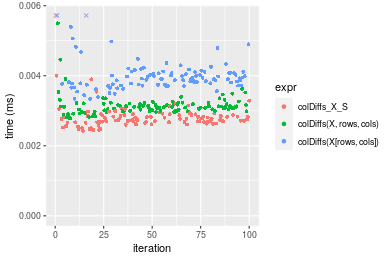
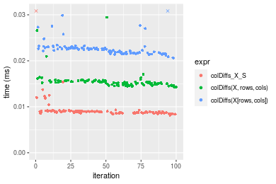
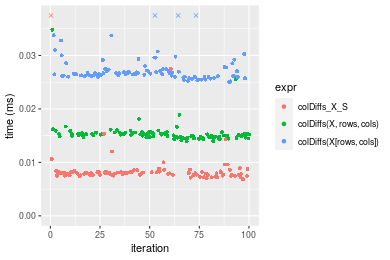

[matrixStats]: Benchmark report

---------------------------------------


# colDiffs() and rowDiffs() benchmarks on subsetted computation

This report benchmark the performance of colDiffs() and rowDiffs() on subsetted computation.


## Data type "integer"

### Data
```r
> rmatrix <- function(nrow, ncol, mode = c("logical", "double", "integer", "index"), range = c(-100, 
+     +100), na_prob = 0) {
+     mode <- match.arg(mode)
+     n <- nrow * ncol
+     if (mode == "logical") {
+         x <- sample(c(FALSE, TRUE), size = n, replace = TRUE)
+     }     else if (mode == "index") {
+         x <- seq_len(n)
+         mode <- "integer"
+     }     else {
+         x <- runif(n, min = range[1], max = range[2])
+     }
+     storage.mode(x) <- mode
+     if (na_prob > 0) 
+         x[sample(n, size = na_prob * n)] <- NA
+     dim(x) <- c(nrow, ncol)
+     x
+ }
> rmatrices <- function(scale = 10, seed = 1, ...) {
+     set.seed(seed)
+     data <- list()
+     data[[1]] <- rmatrix(nrow = scale * 1, ncol = scale * 1, ...)
+     data[[2]] <- rmatrix(nrow = scale * 10, ncol = scale * 10, ...)
+     data[[3]] <- rmatrix(nrow = scale * 100, ncol = scale * 1, ...)
+     data[[4]] <- t(data[[3]])
+     data[[5]] <- rmatrix(nrow = scale * 10, ncol = scale * 100, ...)
+     data[[6]] <- t(data[[5]])
+     names(data) <- sapply(data, FUN = function(x) paste(dim(x), collapse = "x"))
+     data
+ }
> data <- rmatrices(mode = mode)
```

### Results

#### 10x10 integer matrix


```r
> X <- data[["10x10"]]
> rows <- sample.int(nrow(X), size = nrow(X) * 0.7)
> cols <- sample.int(ncol(X), size = ncol(X) * 0.7)
> X_S <- X[rows, cols]
> gc()
          used  (Mb) gc trigger  (Mb) max used  (Mb)
Ncells 5185580 277.0    7554717 403.5  7554717 403.5
Vcells 9408540  71.8   31793280 242.6 60508962 461.7
> colStats <- microbenchmark(colDiffs_X_S = colDiffs(X_S), `colDiffs(X, rows, cols)` = colDiffs(X, 
+     rows = rows, cols = cols), `colDiffs(X[rows, cols])` = colDiffs(X[rows, cols]), unit = "ms")
> X <- t(X)
> X_S <- t(X_S)
> gc()
          used  (Mb) gc trigger  (Mb) max used  (Mb)
Ncells 5184964 277.0    7554717 403.5  7554717 403.5
Vcells 9406972  71.8   31793280 242.6 60508962 461.7
> rowStats <- microbenchmark(rowDiffs_X_S = rowDiffs(X_S), `rowDiffs(X, cols, rows)` = rowDiffs(X, 
+     rows = cols, cols = rows), `rowDiffs(X[cols, rows])` = rowDiffs(X[cols, rows]), unit = "ms")
```

_Table: Benchmarking of colDiffs_X_S(), colDiffs(X, rows, cols)() and colDiffs(X[rows, cols])() on integer+10x10 data. The top panel shows times in milliseconds and the bottom panel shows relative times._


|   |expr                    |      min|       lq|      mean|    median|        uq|      max|
|:--|:-----------------------|--------:|--------:|---------:|---------:|---------:|--------:|
|1  |colDiffs_X_S            | 0.002604| 0.002741| 0.0049353| 0.0028805| 0.0030205| 0.202489|
|2  |colDiffs(X, rows, cols) | 0.002993| 0.003202| 0.0033954| 0.0033295| 0.0034265| 0.005687|
|3  |colDiffs(X[rows, cols]) | 0.003455| 0.003888| 0.0041684| 0.0040505| 0.0042545| 0.008006|


|   |expr                    |      min|       lq|      mean|   median|       uq|       max|
|:--|:-----------------------|--------:|--------:|---------:|--------:|--------:|---------:|
|1  |colDiffs_X_S            | 1.000000| 1.000000| 1.0000000| 1.000000| 1.000000| 1.0000000|
|2  |colDiffs(X, rows, cols) | 1.149386| 1.168187| 0.6879812| 1.155876| 1.134415| 0.0280855|
|3  |colDiffs(X[rows, cols]) | 1.326805| 1.418460| 0.8446187| 1.406179| 1.408542| 0.0395380|

_Table: Benchmarking of rowDiffs_X_S(), rowDiffs(X, cols, rows)() and rowDiffs(X[cols, rows])() on integer+10x10 data (transposed). The top panel shows times in milliseconds and the bottom panel shows relative times._


|   |expr                    |      min|        lq|      mean|    median|        uq|      max|
|:--|:-----------------------|--------:|---------:|---------:|---------:|---------:|--------:|
|1  |rowDiffs_X_S            | 0.002494| 0.0026905| 0.0029422| 0.0028230| 0.0029305| 0.004882|
|2  |rowDiffs(X, cols, rows) | 0.002956| 0.0031115| 0.0052853| 0.0032445| 0.0033740| 0.203365|
|3  |rowDiffs(X[cols, rows]) | 0.003307| 0.0036515| 0.0039159| 0.0038855| 0.0039935| 0.008186|


|   |expr                    |      min|       lq|     mean|   median|       uq|       max|
|:--|:-----------------------|--------:|--------:|--------:|--------:|--------:|---------:|
|1  |rowDiffs_X_S            | 1.000000| 1.000000| 1.000000| 1.000000| 1.000000|  1.000000|
|2  |rowDiffs(X, cols, rows) | 1.185245| 1.156476| 1.796396| 1.149309| 1.151339| 41.656084|
|3  |rowDiffs(X[cols, rows]) | 1.325982| 1.357183| 1.330966| 1.376373| 1.362737|  1.676772|

_Figure: Benchmarking of colDiffs_X_S(), colDiffs(X, rows, cols)() and colDiffs(X[rows, cols])() on integer+10x10 data  as well as rowDiffs_X_S(), rowDiffs(X, cols, rows)() and rowDiffs(X[cols, rows])() on the same data transposed.  Outliers are displayed as crosses.  Times are in milliseconds._





_Table: Benchmarking of colDiffs_X_S() and rowDiffs_X_S() on integer+10x10 data (original and transposed).  The top panel shows times in milliseconds and the bottom panel shows relative times._


|   |expr         |   min|     lq|    mean| median|     uq|     max|
|:--|:------------|-----:|------:|-------:|------:|------:|-------:|
|2  |rowDiffs_X_S | 2.494| 2.6905| 2.94218| 2.8230| 2.9305|   4.882|
|1  |colDiffs_X_S | 2.604| 2.7410| 4.93528| 2.8805| 3.0205| 202.489|


|   |expr         |      min|      lq|     mean|   median|       uq|      max|
|:--|:------------|--------:|-------:|--------:|--------:|--------:|--------:|
|2  |rowDiffs_X_S | 1.000000| 1.00000| 1.000000| 1.000000| 1.000000|  1.00000|
|1  |colDiffs_X_S | 1.044106| 1.01877| 1.677423| 1.020368| 1.030712| 41.47665|

_Figure: Benchmarking of colDiffs_X_S() and rowDiffs_X_S() on integer+10x10 data (original and transposed).  Outliers are displayed as crosses. Times are in milliseconds._


#### 100x100 integer matrix


```r
> X <- data[["100x100"]]
> rows <- sample.int(nrow(X), size = nrow(X) * 0.7)
> cols <- sample.int(ncol(X), size = ncol(X) * 0.7)
> X_S <- X[rows, cols]
> gc()
          used  (Mb) gc trigger  (Mb) max used  (Mb)
Ncells 5183779 276.9    7554717 403.5  7554717 403.5
Vcells 9076914  69.3   31793280 242.6 60508962 461.7
> colStats <- microbenchmark(colDiffs_X_S = colDiffs(X_S), `colDiffs(X, rows, cols)` = colDiffs(X, 
+     rows = rows, cols = cols), `colDiffs(X[rows, cols])` = colDiffs(X[rows, cols]), unit = "ms")
> X <- t(X)
> X_S <- t(X_S)
> gc()
          used  (Mb) gc trigger  (Mb) max used  (Mb)
Ncells 5183773 276.9    7554717 403.5  7554717 403.5
Vcells 9081997  69.3   31793280 242.6 60508962 461.7
> rowStats <- microbenchmark(rowDiffs_X_S = rowDiffs(X_S), `rowDiffs(X, cols, rows)` = rowDiffs(X, 
+     rows = cols, cols = rows), `rowDiffs(X[cols, rows])` = rowDiffs(X[cols, rows]), unit = "ms")
```

_Table: Benchmarking of colDiffs_X_S(), colDiffs(X, rows, cols)() and colDiffs(X[rows, cols])() on integer+100x100 data. The top panel shows times in milliseconds and the bottom panel shows relative times._


|   |expr                    |      min|        lq|      mean|    median|        uq|      max|
|:--|:-----------------------|--------:|---------:|---------:|---------:|---------:|--------:|
|1  |colDiffs_X_S            | 0.008924| 0.0093440| 0.0099196| 0.0095720| 0.0098085| 0.024682|
|2  |colDiffs(X, rows, cols) | 0.013990| 0.0145265| 0.0149780| 0.0149595| 0.0151800| 0.021022|
|3  |colDiffs(X[rows, cols]) | 0.019433| 0.0201015| 0.0211483| 0.0208660| 0.0212935| 0.043925|


|   |expr                    |      min|       lq|     mean|   median|       uq|       max|
|:--|:-----------------------|--------:|--------:|--------:|--------:|--------:|---------:|
|1  |colDiffs_X_S            | 1.000000| 1.000000| 1.000000| 1.000000| 1.000000| 1.0000000|
|2  |colDiffs(X, rows, cols) | 1.567683| 1.554634| 1.509942| 1.562839| 1.547637| 0.8517138|
|3  |colDiffs(X[rows, cols]) | 2.177611| 2.151273| 2.131976| 2.179900| 2.170923| 1.7796370|

_Table: Benchmarking of rowDiffs_X_S(), rowDiffs(X, cols, rows)() and rowDiffs(X[cols, rows])() on integer+100x100 data (transposed). The top panel shows times in milliseconds and the bottom panel shows relative times._


|   |expr                    |      min|        lq|      mean|    median|        uq|      max|
|:--|:-----------------------|--------:|---------:|---------:|---------:|---------:|--------:|
|1  |rowDiffs_X_S            | 0.008792| 0.0092845| 0.0098278| 0.0095595| 0.0097610| 0.015778|
|2  |rowDiffs(X, cols, rows) | 0.013903| 0.0143340| 0.0149988| 0.0147235| 0.0150645| 0.040398|
|3  |rowDiffs(X[cols, rows]) | 0.019769| 0.0201605| 0.0210874| 0.0209620| 0.0213790| 0.036046|


|   |expr                    |      min|       lq|     mean|   median|       uq|      max|
|:--|:-----------------------|--------:|--------:|--------:|--------:|--------:|--------:|
|1  |rowDiffs_X_S            | 1.000000| 1.000000| 1.000000| 1.000000| 1.000000| 1.000000|
|2  |rowDiffs(X, cols, rows) | 1.581324| 1.543863| 1.526168| 1.540196| 1.543336| 2.560401|
|3  |rowDiffs(X[cols, rows]) | 2.248521| 2.171415| 2.145692| 2.192792| 2.190247| 2.284574|

_Figure: Benchmarking of colDiffs_X_S(), colDiffs(X, rows, cols)() and colDiffs(X[rows, cols])() on integer+100x100 data  as well as rowDiffs_X_S(), rowDiffs(X, cols, rows)() and rowDiffs(X[cols, rows])() on the same data transposed.  Outliers are displayed as crosses.  Times are in milliseconds._


_Table: Benchmarking of colDiffs_X_S() and rowDiffs_X_S() on integer+100x100 data (original and transposed).  The top panel shows times in milliseconds and the bottom panel shows relative times._


|   |expr         |   min|     lq|    mean| median|     uq|    max|
|:--|:------------|-----:|------:|-------:|------:|------:|------:|
|2  |rowDiffs_X_S | 8.792| 9.2845| 9.82777| 9.5595| 9.7610| 15.778|
|1  |colDiffs_X_S | 8.924| 9.3440| 9.91956| 9.5720| 9.8085| 24.682|


|   |expr         |      min|       lq|    mean|   median|       uq|     max|
|:--|:------------|--------:|--------:|-------:|--------:|--------:|-------:|
|2  |rowDiffs_X_S | 1.000000| 1.000000| 1.00000| 1.000000| 1.000000| 1.00000|
|1  |colDiffs_X_S | 1.015014| 1.006409| 1.00934| 1.001308| 1.004866| 1.56433|

_Figure: Benchmarking of colDiffs_X_S() and rowDiffs_X_S() on integer+100x100 data (original and transposed).  Outliers are displayed as crosses. Times are in milliseconds._


#### 1000x10 integer matrix


```r
> X <- data[["1000x10"]]
> rows <- sample.int(nrow(X), size = nrow(X) * 0.7)
> cols <- sample.int(ncol(X), size = ncol(X) * 0.7)
> X_S <- X[rows, cols]
> gc()
          used  (Mb) gc trigger  (Mb) max used  (Mb)
Ncells 5183979 276.9    7554717 403.5  7554717 403.5
Vcells 9077810  69.3   31793280 242.6 60508962 461.7
> colStats <- microbenchmark(colDiffs_X_S = colDiffs(X_S), `colDiffs(X, rows, cols)` = colDiffs(X, 
+     rows = rows, cols = cols), `colDiffs(X[rows, cols])` = colDiffs(X[rows, cols]), unit = "ms")
> X <- t(X)
> X_S <- t(X_S)
> gc()
          used  (Mb) gc trigger  (Mb) max used  (Mb)
Ncells 5183973 276.9    7554717 403.5  7554717 403.5
Vcells 9082893  69.3   31793280 242.6 60508962 461.7
> rowStats <- microbenchmark(rowDiffs_X_S = rowDiffs(X_S), `rowDiffs(X, cols, rows)` = rowDiffs(X, 
+     rows = cols, cols = rows), `rowDiffs(X[cols, rows])` = rowDiffs(X[cols, rows]), unit = "ms")
```

_Table: Benchmarking of colDiffs_X_S(), colDiffs(X, rows, cols)() and colDiffs(X[rows, cols])() on integer+1000x10 data. The top panel shows times in milliseconds and the bottom panel shows relative times._


|   |expr                    |      min|        lq|      mean|    median|        uq|      max|
|:--|:-----------------------|--------:|---------:|---------:|---------:|---------:|--------:|
|1  |colDiffs_X_S            | 0.008706| 0.0092355| 0.0095501| 0.0094320| 0.0098140| 0.013363|
|2  |colDiffs(X, rows, cols) | 0.014788| 0.0154650| 0.0160033| 0.0157685| 0.0164285| 0.021737|
|3  |colDiffs(X[rows, cols]) | 0.019584| 0.0200595| 0.0215468| 0.0208125| 0.0219820| 0.043530|


|   |expr                    |      min|       lq|     mean|   median|       uq|      max|
|:--|:-----------------------|--------:|--------:|--------:|--------:|--------:|--------:|
|1  |colDiffs_X_S            | 1.000000| 1.000000| 1.000000| 1.000000| 1.000000| 1.000000|
|2  |colDiffs(X, rows, cols) | 1.698599| 1.674517| 1.675730| 1.671809| 1.673986| 1.626656|
|3  |colDiffs(X[rows, cols]) | 2.249483| 2.171999| 2.256193| 2.206584| 2.239861| 3.257502|

_Table: Benchmarking of rowDiffs_X_S(), rowDiffs(X, cols, rows)() and rowDiffs(X[cols, rows])() on integer+1000x10 data (transposed). The top panel shows times in milliseconds and the bottom panel shows relative times._


|   |expr                    |      min|        lq|      mean|    median|        uq|      max|
|:--|:-----------------------|--------:|---------:|---------:|---------:|---------:|--------:|
|1  |rowDiffs_X_S            | 0.009529| 0.0100685| 0.0108431| 0.0103405| 0.0110560| 0.017001|
|2  |rowDiffs(X, cols, rows) | 0.016608| 0.0176680| 0.0182337| 0.0179705| 0.0184310| 0.026352|
|3  |rowDiffs(X[cols, rows]) | 0.022800| 0.0240235| 0.0259094| 0.0246000| 0.0260635| 0.060234|


|   |expr                    |      min|       lq|     mean|   median|       uq|      max|
|:--|:-----------------------|--------:|--------:|--------:|--------:|--------:|--------:|
|1  |rowDiffs_X_S            | 1.000000| 1.000000| 1.000000| 1.000000| 1.000000| 1.000000|
|2  |rowDiffs(X, cols, rows) | 1.742890| 1.754780| 1.681605| 1.737875| 1.667059| 1.550026|
|3  |rowDiffs(X[cols, rows]) | 2.392696| 2.386006| 2.389489| 2.378995| 2.357408| 3.542968|

_Figure: Benchmarking of colDiffs_X_S(), colDiffs(X, rows, cols)() and colDiffs(X[rows, cols])() on integer+1000x10 data  as well as rowDiffs_X_S(), rowDiffs(X, cols, rows)() and rowDiffs(X[cols, rows])() on the same data transposed.  Outliers are displayed as crosses.  Times are in milliseconds._


_Table: Benchmarking of colDiffs_X_S() and rowDiffs_X_S() on integer+1000x10 data (original and transposed).  The top panel shows times in milliseconds and the bottom panel shows relative times._


|   |expr         |   min|      lq|     mean|  median|     uq|    max|
|:--|:------------|-----:|-------:|--------:|-------:|------:|------:|
|1  |colDiffs_X_S | 8.706|  9.2355|  9.55006|  9.4320|  9.814| 13.363|
|2  |rowDiffs_X_S | 9.529| 10.0685| 10.84306| 10.3405| 11.056| 17.001|


|   |expr         |      min|       lq|     mean|   median|       uq|      max|
|:--|:------------|--------:|--------:|--------:|--------:|--------:|--------:|
|1  |colDiffs_X_S | 1.000000| 1.000000| 1.000000| 1.000000| 1.000000| 1.000000|
|2  |rowDiffs_X_S | 1.094532| 1.090195| 1.135392| 1.096321| 1.126554| 1.272244|

_Figure: Benchmarking of colDiffs_X_S() and rowDiffs_X_S() on integer+1000x10 data (original and transposed).  Outliers are displayed as crosses. Times are in milliseconds._


#### 10x1000 integer matrix


```r
> X <- data[["10x1000"]]
> rows <- sample.int(nrow(X), size = nrow(X) * 0.7)
> cols <- sample.int(ncol(X), size = ncol(X) * 0.7)
> X_S <- X[rows, cols]
> gc()
          used  (Mb) gc trigger  (Mb) max used  (Mb)
Ncells 5184184 276.9    7554717 403.5  7554717 403.5
Vcells 9078624  69.3   31793280 242.6 60508962 461.7
> colStats <- microbenchmark(colDiffs_X_S = colDiffs(X_S), `colDiffs(X, rows, cols)` = colDiffs(X, 
+     rows = rows, cols = cols), `colDiffs(X[rows, cols])` = colDiffs(X[rows, cols]), unit = "ms")
> X <- t(X)
> X_S <- t(X_S)
> gc()
          used  (Mb) gc trigger  (Mb) max used  (Mb)
Ncells 5184178 276.9    7554717 403.5  7554717 403.5
Vcells 9083707  69.4   31793280 242.6 60508962 461.7
> rowStats <- microbenchmark(rowDiffs_X_S = rowDiffs(X_S), `rowDiffs(X, cols, rows)` = rowDiffs(X, 
+     rows = cols, cols = rows), `rowDiffs(X[cols, rows])` = rowDiffs(X[cols, rows]), unit = "ms")
```

_Table: Benchmarking of colDiffs_X_S(), colDiffs(X, rows, cols)() and colDiffs(X[rows, cols])() on integer+10x1000 data. The top panel shows times in milliseconds and the bottom panel shows relative times._


|   |expr                    |      min|        lq|      mean|    median|        uq|      max|
|:--|:-----------------------|--------:|---------:|---------:|---------:|---------:|--------:|
|1  |colDiffs_X_S            | 0.008483| 0.0090025| 0.0095682| 0.0092615| 0.0094305| 0.030283|
|2  |colDiffs(X, rows, cols) | 0.014853| 0.0153105| 0.0161787| 0.0159385| 0.0164105| 0.026908|
|3  |colDiffs(X[rows, cols]) | 0.021649| 0.0223005| 0.0236266| 0.0231120| 0.0236160| 0.056830|


|   |expr                    |      min|       lq|     mean|   median|       uq|       max|
|:--|:-----------------------|--------:|--------:|--------:|--------:|--------:|---------:|
|1  |colDiffs_X_S            | 1.000000| 1.000000| 1.000000| 1.000000| 1.000000| 1.0000000|
|2  |colDiffs(X, rows, cols) | 1.750914| 1.700694| 1.690885| 1.720941| 1.740152| 0.8885513|
|3  |colDiffs(X[rows, cols]) | 2.552045| 2.477145| 2.469293| 2.495492| 2.504215| 1.8766305|

_Table: Benchmarking of rowDiffs_X_S(), rowDiffs(X, cols, rows)() and rowDiffs(X[cols, rows])() on integer+10x1000 data (transposed). The top panel shows times in milliseconds and the bottom panel shows relative times._


|   |expr                    |      min|        lq|      mean|    median|       uq|      max|
|:--|:-----------------------|--------:|---------:|---------:|---------:|--------:|--------:|
|1  |rowDiffs_X_S            | 0.007938| 0.0084270| 0.0088816| 0.0087660| 0.009015| 0.013797|
|2  |rowDiffs(X, cols, rows) | 0.012641| 0.0134775| 0.0142845| 0.0141930| 0.014493| 0.037465|
|3  |rowDiffs(X[cols, rows]) | 0.018819| 0.0198890| 0.0212350| 0.0208165| 0.021279| 0.036131|


|   |expr                    |      min|       lq|     mean|   median|       uq|      max|
|:--|:-----------------------|--------:|--------:|--------:|--------:|--------:|--------:|
|1  |rowDiffs_X_S            | 1.000000| 1.000000| 1.000000| 1.000000| 1.000000| 1.000000|
|2  |rowDiffs(X, cols, rows) | 1.592467| 1.599324| 1.608336| 1.619096| 1.607654| 2.715445|
|3  |rowDiffs(X[cols, rows]) | 2.370748| 2.360152| 2.390912| 2.374686| 2.360399| 2.618758|

_Figure: Benchmarking of colDiffs_X_S(), colDiffs(X, rows, cols)() and colDiffs(X[rows, cols])() on integer+10x1000 data  as well as rowDiffs_X_S(), rowDiffs(X, cols, rows)() and rowDiffs(X[cols, rows])() on the same data transposed.  Outliers are displayed as crosses.  Times are in milliseconds._





_Table: Benchmarking of colDiffs_X_S() and rowDiffs_X_S() on integer+10x1000 data (original and transposed).  The top panel shows times in milliseconds and the bottom panel shows relative times._


|   |expr         |   min|     lq|    mean| median|     uq|    max|
|:--|:------------|-----:|------:|-------:|------:|------:|------:|
|2  |rowDiffs_X_S | 7.938| 8.4270| 8.88156| 8.7660| 9.0150| 13.797|
|1  |colDiffs_X_S | 8.483| 9.0025| 9.56818| 9.2615| 9.4305| 30.283|


|   |expr         |      min|       lq|     mean|   median|      uq|      max|
|:--|:------------|--------:|--------:|--------:|--------:|-------:|--------:|
|2  |rowDiffs_X_S | 1.000000| 1.000000| 1.000000| 1.000000| 1.00000| 1.000000|
|1  |colDiffs_X_S | 1.068657| 1.068292| 1.077309| 1.056525| 1.04609| 2.194897|

_Figure: Benchmarking of colDiffs_X_S() and rowDiffs_X_S() on integer+10x1000 data (original and transposed).  Outliers are displayed as crosses. Times are in milliseconds._


#### 100x1000 integer matrix


```r
> X <- data[["100x1000"]]
> rows <- sample.int(nrow(X), size = nrow(X) * 0.7)
> cols <- sample.int(ncol(X), size = ncol(X) * 0.7)
> X_S <- X[rows, cols]
> gc()
          used  (Mb) gc trigger  (Mb) max used  (Mb)
Ncells 5184394 276.9    7554717 403.5  7554717 403.5
Vcells 9101288  69.5   31793280 242.6 60508962 461.7
> colStats <- microbenchmark(colDiffs_X_S = colDiffs(X_S), `colDiffs(X, rows, cols)` = colDiffs(X, 
+     rows = rows, cols = cols), `colDiffs(X[rows, cols])` = colDiffs(X[rows, cols]), unit = "ms")
> X <- t(X)
> X_S <- t(X_S)
> gc()
          used  (Mb) gc trigger  (Mb) max used  (Mb)
Ncells 5184388 276.9    7554717 403.5  7554717 403.5
Vcells 9151371  69.9   31793280 242.6 60508962 461.7
> rowStats <- microbenchmark(rowDiffs_X_S = rowDiffs(X_S), `rowDiffs(X, cols, rows)` = rowDiffs(X, 
+     rows = cols, cols = rows), `rowDiffs(X[cols, rows])` = rowDiffs(X[cols, rows]), unit = "ms")
```

_Table: Benchmarking of colDiffs_X_S(), colDiffs(X, rows, cols)() and colDiffs(X[rows, cols])() on integer+100x1000 data. The top panel shows times in milliseconds and the bottom panel shows relative times._


|   |expr                    |      min|       lq|      mean|    median|        uq|      max|
|:--|:-----------------------|--------:|--------:|---------:|---------:|---------:|--------:|
|1  |colDiffs_X_S            | 0.050143| 0.052026| 0.0566747| 0.0539760| 0.0599750| 0.088356|
|2  |colDiffs(X, rows, cols) | 0.092743| 0.096267| 0.1055722| 0.0995795| 0.1111925| 0.191543|
|3  |colDiffs(X[rows, cols]) | 0.130946| 0.136371| 0.1501166| 0.1461980| 0.1613260| 0.181600|


|   |expr                    |      min|       lq|     mean|   median|       uq|      max|
|:--|:-----------------------|--------:|--------:|--------:|--------:|--------:|--------:|
|1  |colDiffs_X_S            | 1.000000| 1.000000| 1.000000| 1.000000| 1.000000| 1.000000|
|2  |colDiffs(X, rows, cols) | 1.849570| 1.850363| 1.862775| 1.844885| 1.853981| 2.167855|
|3  |colDiffs(X[rows, cols]) | 2.611451| 2.621209| 2.648742| 2.708574| 2.689888| 2.055322|

_Table: Benchmarking of rowDiffs_X_S(), rowDiffs(X, cols, rows)() and rowDiffs(X[cols, rows])() on integer+100x1000 data (transposed). The top panel shows times in milliseconds and the bottom panel shows relative times._


|   |expr                    |      min|        lq|      mean|    median|        uq|      max|
|:--|:-----------------------|--------:|---------:|---------:|---------:|---------:|--------:|
|1  |rowDiffs_X_S            | 0.050021| 0.0536160| 0.0592828| 0.0577995| 0.0644025| 0.089525|
|2  |rowDiffs(X, cols, rows) | 0.086623| 0.0916200| 0.0989703| 0.0925165| 0.1039170| 0.177527|
|3  |rowDiffs(X[cols, rows]) | 0.127704| 0.1362965| 0.1485511| 0.1456035| 0.1587765| 0.182494|


|   |expr                    |      min|       lq|     mean|   median|       uq|      max|
|:--|:-----------------------|--------:|--------:|--------:|--------:|--------:|--------:|
|1  |rowDiffs_X_S            | 1.000000| 1.000000| 1.000000| 1.000000| 1.000000| 1.000000|
|2  |rowDiffs(X, cols, rows) | 1.731733| 1.708818| 1.669459| 1.600645| 1.613555| 1.982988|
|3  |rowDiffs(X[cols, rows]) | 2.553008| 2.542086| 2.505803| 2.519114| 2.465378| 2.038470|

_Figure: Benchmarking of colDiffs_X_S(), colDiffs(X, rows, cols)() and colDiffs(X[rows, cols])() on integer+100x1000 data  as well as rowDiffs_X_S(), rowDiffs(X, cols, rows)() and rowDiffs(X[cols, rows])() on the same data transposed.  Outliers are displayed as crosses.  Times are in milliseconds._


_Table: Benchmarking of colDiffs_X_S() and rowDiffs_X_S() on integer+100x1000 data (original and transposed).  The top panel shows times in milliseconds and the bottom panel shows relative times._


|   |expr         |    min|     lq|     mean|  median|      uq|    max|
|:--|:------------|------:|------:|--------:|-------:|-------:|------:|
|1  |colDiffs_X_S | 50.143| 52.026| 56.67467| 53.9760| 59.9750| 88.356|
|2  |rowDiffs_X_S | 50.021| 53.616| 59.28283| 57.7995| 64.4025| 89.525|


|   |expr         |      min|       lq|    mean|   median|       uq|      max|
|:--|:------------|--------:|--------:|-------:|--------:|--------:|--------:|
|1  |colDiffs_X_S | 1.000000| 1.000000| 1.00000| 1.000000| 1.000000| 1.000000|
|2  |rowDiffs_X_S | 0.997567| 1.030562| 1.04602| 1.070837| 1.073822| 1.013231|

_Figure: Benchmarking of colDiffs_X_S() and rowDiffs_X_S() on integer+100x1000 data (original and transposed).  Outliers are displayed as crosses. Times are in milliseconds._


#### 1000x100 integer matrix


```r
> X <- data[["1000x100"]]
> rows <- sample.int(nrow(X), size = nrow(X) * 0.7)
> cols <- sample.int(ncol(X), size = ncol(X) * 0.7)
> X_S <- X[rows, cols]
> gc()
          used  (Mb) gc trigger  (Mb) max used  (Mb)
Ncells 5184607 276.9    7554717 403.5  7554717 403.5
Vcells 9101992  69.5   31793280 242.6 60508962 461.7
> colStats <- microbenchmark(colDiffs_X_S = colDiffs(X_S), `colDiffs(X, rows, cols)` = colDiffs(X, 
+     rows = rows, cols = cols), `colDiffs(X[rows, cols])` = colDiffs(X[rows, cols]), unit = "ms")
> X <- t(X)
> X_S <- t(X_S)
> gc()
          used  (Mb) gc trigger  (Mb) max used  (Mb)
Ncells 5184601 276.9    7554717 403.5  7554717 403.5
Vcells 9152075  69.9   31793280 242.6 60508962 461.7
> rowStats <- microbenchmark(rowDiffs_X_S = rowDiffs(X_S), `rowDiffs(X, cols, rows)` = rowDiffs(X, 
+     rows = cols, cols = rows), `rowDiffs(X[cols, rows])` = rowDiffs(X[cols, rows]), unit = "ms")
```

_Table: Benchmarking of colDiffs_X_S(), colDiffs(X, rows, cols)() and colDiffs(X[rows, cols])() on integer+1000x100 data. The top panel shows times in milliseconds and the bottom panel shows relative times._


|   |expr                    |      min|       lq|      mean|   median|        uq|      max|
|:--|:-----------------------|--------:|--------:|---------:|--------:|---------:|--------:|
|1  |colDiffs_X_S            | 0.052209| 0.054055| 0.0580866| 0.054784| 0.0605065| 0.088728|
|2  |colDiffs(X, rows, cols) | 0.093671| 0.097065| 0.1049550| 0.101375| 0.1121245| 0.142030|
|3  |colDiffs(X[rows, cols]) | 0.132456| 0.137014| 0.1496745| 0.146708| 0.1595220| 0.227352|


|   |expr                    |      min|       lq|     mean|   median|       uq|      max|
|:--|:-----------------------|--------:|--------:|--------:|--------:|--------:|--------:|
|1  |colDiffs_X_S            | 1.000000| 1.000000| 1.000000| 1.000000| 1.000000| 1.000000|
|2  |colDiffs(X, rows, cols) | 1.794154| 1.795671| 1.806869| 1.850449| 1.853098| 1.600735|
|3  |colDiffs(X[rows, cols]) | 2.537034| 2.534715| 2.576745| 2.677935| 2.636444| 2.562348|

_Table: Benchmarking of rowDiffs_X_S(), rowDiffs(X, cols, rows)() and rowDiffs(X[cols, rows])() on integer+1000x100 data (transposed). The top panel shows times in milliseconds and the bottom panel shows relative times._


|   |expr                    |      min|       lq|      mean|    median|        uq|      max|
|:--|:-----------------------|--------:|--------:|---------:|---------:|---------:|--------:|
|1  |rowDiffs_X_S            | 0.050684| 0.053529| 0.0577156| 0.0551480| 0.0608245| 0.075616|
|2  |rowDiffs(X, cols, rows) | 0.091205| 0.097435| 0.1053136| 0.1008960| 0.1113100| 0.202806|
|3  |rowDiffs(X[cols, rows]) | 0.132146| 0.140000| 0.1521239| 0.1472405| 0.1636045| 0.191399|


|   |expr                    |      min|       lq|     mean|   median|       uq|      max|
|:--|:-----------------------|--------:|--------:|--------:|--------:|--------:|--------:|
|1  |rowDiffs_X_S            | 1.000000| 1.000000| 1.000000| 1.000000| 1.000000| 1.000000|
|2  |rowDiffs(X, cols, rows) | 1.799483| 1.820228| 1.824700| 1.829550| 1.830019| 2.682051|
|3  |rowDiffs(X[cols, rows]) | 2.607253| 2.615405| 2.635752| 2.669916| 2.689780| 2.531197|

_Figure: Benchmarking of colDiffs_X_S(), colDiffs(X, rows, cols)() and colDiffs(X[rows, cols])() on integer+1000x100 data  as well as rowDiffs_X_S(), rowDiffs(X, cols, rows)() and rowDiffs(X[cols, rows])() on the same data transposed.  Outliers are displayed as crosses.  Times are in milliseconds._


_Table: Benchmarking of colDiffs_X_S() and rowDiffs_X_S() on integer+1000x100 data (original and transposed).  The top panel shows times in milliseconds and the bottom panel shows relative times._


|   |expr         |    min|     lq|     mean| median|      uq|    max|
|:--|:------------|------:|------:|--------:|------:|-------:|------:|
|1  |colDiffs_X_S | 52.209| 54.055| 58.08664| 54.784| 60.5065| 88.728|
|2  |rowDiffs_X_S | 50.684| 53.529| 57.71558| 55.148| 60.8245| 75.616|


|   |expr         |       min|        lq|     mean|   median|       uq|       max|
|:--|:------------|---------:|---------:|--------:|--------:|--------:|---------:|
|1  |colDiffs_X_S | 1.0000000| 1.0000000| 1.000000| 1.000000| 1.000000| 1.0000000|
|2  |rowDiffs_X_S | 0.9707905| 0.9902692| 0.993612| 1.006644| 1.005256| 0.8522225|

_Figure: Benchmarking of colDiffs_X_S() and rowDiffs_X_S() on integer+1000x100 data (original and transposed).  Outliers are displayed as crosses. Times are in milliseconds._


## Data type "double"

### Data
```r
> rmatrix <- function(nrow, ncol, mode = c("logical", "double", "integer", "index"), range = c(-100, 
+     +100), na_prob = 0) {
+     mode <- match.arg(mode)
+     n <- nrow * ncol
+     if (mode == "logical") {
+         x <- sample(c(FALSE, TRUE), size = n, replace = TRUE)
+     }     else if (mode == "index") {
+         x <- seq_len(n)
+         mode <- "integer"
+     }     else {
+         x <- runif(n, min = range[1], max = range[2])
+     }
+     storage.mode(x) <- mode
+     if (na_prob > 0) 
+         x[sample(n, size = na_prob * n)] <- NA
+     dim(x) <- c(nrow, ncol)
+     x
+ }
> rmatrices <- function(scale = 10, seed = 1, ...) {
+     set.seed(seed)
+     data <- list()
+     data[[1]] <- rmatrix(nrow = scale * 1, ncol = scale * 1, ...)
+     data[[2]] <- rmatrix(nrow = scale * 10, ncol = scale * 10, ...)
+     data[[3]] <- rmatrix(nrow = scale * 100, ncol = scale * 1, ...)
+     data[[4]] <- t(data[[3]])
+     data[[5]] <- rmatrix(nrow = scale * 10, ncol = scale * 100, ...)
+     data[[6]] <- t(data[[5]])
+     names(data) <- sapply(data, FUN = function(x) paste(dim(x), collapse = "x"))
+     data
+ }
> data <- rmatrices(mode = mode)
```

### Results

#### 10x10 double matrix


```r
> X <- data[["10x10"]]
> rows <- sample.int(nrow(X), size = nrow(X) * 0.7)
> cols <- sample.int(ncol(X), size = ncol(X) * 0.7)
> X_S <- X[rows, cols]
> gc()
          used  (Mb) gc trigger  (Mb) max used  (Mb)
Ncells 5184824 276.9    7554717 403.5  7554717 403.5
Vcells 9193076  70.2   31793280 242.6 60508962 461.7
> colStats <- microbenchmark(colDiffs_X_S = colDiffs(X_S), `colDiffs(X, rows, cols)` = colDiffs(X, 
+     rows = rows, cols = cols), `colDiffs(X[rows, cols])` = colDiffs(X[rows, cols]), unit = "ms")
> X <- t(X)
> X_S <- t(X_S)
> gc()
          used  (Mb) gc trigger  (Mb) max used  (Mb)
Ncells 5184809 276.9    7554717 403.5  7554717 403.5
Vcells 9193244  70.2   31793280 242.6 60508962 461.7
> rowStats <- microbenchmark(rowDiffs_X_S = rowDiffs(X_S), `rowDiffs(X, cols, rows)` = rowDiffs(X, 
+     rows = cols, cols = rows), `rowDiffs(X[cols, rows])` = rowDiffs(X[cols, rows]), unit = "ms")
```

_Table: Benchmarking of colDiffs_X_S(), colDiffs(X, rows, cols)() and colDiffs(X[rows, cols])() on double+10x10 data. The top panel shows times in milliseconds and the bottom panel shows relative times._


|   |expr                    |      min|        lq|      mean|    median|        uq|      max|
|:--|:-----------------------|--------:|---------:|---------:|---------:|---------:|--------:|
|1  |colDiffs_X_S            | 0.002783| 0.0029695| 0.0032139| 0.0030545| 0.0031605| 0.016962|
|2  |colDiffs(X, rows, cols) | 0.002990| 0.0032690| 0.0035476| 0.0033840| 0.0035570| 0.011741|
|3  |colDiffs(X[rows, cols]) | 0.003859| 0.0041295| 0.0042894| 0.0042205| 0.0043420| 0.008587|


|   |expr                    |      min|       lq|     mean|   median|       uq|       max|
|:--|:-----------------------|--------:|--------:|--------:|--------:|--------:|---------:|
|1  |colDiffs_X_S            | 1.000000| 1.000000| 1.000000| 1.000000| 1.000000| 1.0000000|
|2  |colDiffs(X, rows, cols) | 1.074380| 1.100859| 1.103846| 1.107874| 1.125455| 0.6921943|
|3  |colDiffs(X[rows, cols]) | 1.386633| 1.390638| 1.334628| 1.381732| 1.373833| 0.5062493|

_Table: Benchmarking of rowDiffs_X_S(), rowDiffs(X, cols, rows)() and rowDiffs(X[cols, rows])() on double+10x10 data (transposed). The top panel shows times in milliseconds and the bottom panel shows relative times._


|   |expr                    |      min|        lq|      mean|   median|       uq|      max|
|:--|:-----------------------|--------:|---------:|---------:|--------:|--------:|--------:|
|1  |rowDiffs_X_S            | 0.002660| 0.0029320| 0.0032269| 0.003033| 0.003106| 0.019635|
|2  |rowDiffs(X, cols, rows) | 0.003098| 0.0033980| 0.0037021| 0.003494| 0.003595| 0.021594|
|3  |rowDiffs(X[cols, rows]) | 0.003739| 0.0040535| 0.0042512| 0.004136| 0.004281| 0.010624|


|   |expr                    |      min|       lq|     mean|   median|       uq|       max|
|:--|:-----------------------|--------:|--------:|--------:|--------:|--------:|---------:|
|1  |rowDiffs_X_S            | 1.000000| 1.000000| 1.000000| 1.000000| 1.000000| 1.0000000|
|2  |rowDiffs(X, cols, rows) | 1.164662| 1.158936| 1.147255| 1.151995| 1.157437| 1.0997708|
|3  |rowDiffs(X[cols, rows]) | 1.405639| 1.382503| 1.317413| 1.363666| 1.378300| 0.5410746|

_Figure: Benchmarking of colDiffs_X_S(), colDiffs(X, rows, cols)() and colDiffs(X[rows, cols])() on double+10x10 data  as well as rowDiffs_X_S(), rowDiffs(X, cols, rows)() and rowDiffs(X[cols, rows])() on the same data transposed.  Outliers are displayed as crosses.  Times are in milliseconds._


_Table: Benchmarking of colDiffs_X_S() and rowDiffs_X_S() on double+10x10 data (original and transposed).  The top panel shows times in milliseconds and the bottom panel shows relative times._


|   |expr         |   min|     lq|    mean| median|     uq|    max|
|:--|:------------|-----:|------:|-------:|------:|------:|------:|
|2  |rowDiffs_X_S | 2.660| 2.9320| 3.22693| 3.0330| 3.1060| 19.635|
|1  |colDiffs_X_S | 2.783| 2.9695| 3.21390| 3.0545| 3.1605| 16.962|


|   |expr         |      min|      lq|      mean|   median|       uq|       max|
|:--|:------------|--------:|-------:|---------:|--------:|--------:|---------:|
|2  |rowDiffs_X_S | 1.000000| 1.00000| 1.0000000| 1.000000| 1.000000| 1.0000000|
|1  |colDiffs_X_S | 1.046241| 1.01279| 0.9959621| 1.007089| 1.017547| 0.8638655|

_Figure: Benchmarking of colDiffs_X_S() and rowDiffs_X_S() on double+10x10 data (original and transposed).  Outliers are displayed as crosses. Times are in milliseconds._


#### 100x100 double matrix


```r
> X <- data[["100x100"]]
> rows <- sample.int(nrow(X), size = nrow(X) * 0.7)
> cols <- sample.int(ncol(X), size = ncol(X) * 0.7)
> X_S <- X[rows, cols]
> gc()
          used  (Mb) gc trigger  (Mb) max used  (Mb)
Ncells 5185021 277.0    7554717 403.5  7554717 403.5
Vcells 9199003  70.2   31793280 242.6 60508962 461.7
> colStats <- microbenchmark(colDiffs_X_S = colDiffs(X_S), `colDiffs(X, rows, cols)` = colDiffs(X, 
+     rows = rows, cols = cols), `colDiffs(X[rows, cols])` = colDiffs(X[rows, cols]), unit = "ms")
> X <- t(X)
> X_S <- t(X_S)
> gc()
          used  (Mb) gc trigger  (Mb) max used  (Mb)
Ncells 5185015 277.0    7554717 403.5  7554717 403.5
Vcells 9209086  70.3   31793280 242.6 60508962 461.7
> rowStats <- microbenchmark(rowDiffs_X_S = rowDiffs(X_S), `rowDiffs(X, cols, rows)` = rowDiffs(X, 
+     rows = cols, cols = rows), `rowDiffs(X[cols, rows])` = rowDiffs(X[cols, rows]), unit = "ms")
```

_Table: Benchmarking of colDiffs_X_S(), colDiffs(X, rows, cols)() and colDiffs(X[rows, cols])() on double+100x100 data. The top panel shows times in milliseconds and the bottom panel shows relative times._


|   |expr                    |      min|        lq|      mean|   median|        uq|      max|
|:--|:-----------------------|--------:|---------:|---------:|--------:|---------:|--------:|
|1  |colDiffs_X_S            | 0.007732| 0.0082055| 0.0085952| 0.008443| 0.0088340| 0.013810|
|2  |colDiffs(X, rows, cols) | 0.014352| 0.0149690| 0.0153395| 0.015207| 0.0154460| 0.020787|
|3  |colDiffs(X[rows, cols]) | 0.024087| 0.0245425| 0.0255784| 0.024790| 0.0251825| 0.057025|


|   |expr                    |      min|       lq|     mean|   median|       uq|      max|
|:--|:-----------------------|--------:|--------:|--------:|--------:|--------:|--------:|
|1  |colDiffs_X_S            | 1.000000| 1.000000| 1.000000| 1.000000| 1.000000| 1.000000|
|2  |colDiffs(X, rows, cols) | 1.856182| 1.824264| 1.784660| 1.801137| 1.748472| 1.505214|
|3  |colDiffs(X[rows, cols]) | 3.115235| 2.990982| 2.975899| 2.936160| 2.850634| 4.129254|

_Table: Benchmarking of rowDiffs_X_S(), rowDiffs(X, cols, rows)() and rowDiffs(X[cols, rows])() on double+100x100 data (transposed). The top panel shows times in milliseconds and the bottom panel shows relative times._


|   |expr                    |      min|        lq|      mean|    median|        uq|      max|
|:--|:-----------------------|--------:|---------:|---------:|---------:|---------:|--------:|
|1  |rowDiffs_X_S            | 0.007211| 0.0084635| 0.0087166| 0.0087185| 0.0090020| 0.013028|
|2  |rowDiffs(X, cols, rows) | 0.020950| 0.0214960| 0.0222230| 0.0216890| 0.0218815| 0.045764|
|3  |rowDiffs(X[cols, rows]) | 0.023796| 0.0249095| 0.0254563| 0.0251240| 0.0253925| 0.055882|


|   |expr                    |      min|       lq|     mean|   median|       uq|      max|
|:--|:-----------------------|--------:|--------:|--------:|--------:|--------:|--------:|
|1  |rowDiffs_X_S            | 1.000000| 1.000000| 1.000000| 1.000000| 1.000000| 1.000000|
|2  |rowDiffs(X, cols, rows) | 2.905284| 2.539848| 2.549499| 2.487699| 2.430738| 3.512742|
|3  |rowDiffs(X[cols, rows]) | 3.299958| 2.943168| 2.920435| 2.881688| 2.820762| 4.289377|

_Figure: Benchmarking of colDiffs_X_S(), colDiffs(X, rows, cols)() and colDiffs(X[rows, cols])() on double+100x100 data  as well as rowDiffs_X_S(), rowDiffs(X, cols, rows)() and rowDiffs(X[cols, rows])() on the same data transposed.  Outliers are displayed as crosses.  Times are in milliseconds._


_Table: Benchmarking of colDiffs_X_S() and rowDiffs_X_S() on double+100x100 data (original and transposed).  The top panel shows times in milliseconds and the bottom panel shows relative times._


|   |expr         |   min|     lq|    mean| median|    uq|    max|
|:--|:------------|-----:|------:|-------:|------:|-----:|------:|
|1  |colDiffs_X_S | 7.732| 8.2055| 8.59519| 8.4430| 8.834| 13.810|
|2  |rowDiffs_X_S | 7.211| 8.4635| 8.71663| 8.7185| 9.002| 13.028|


|   |expr         |       min|       lq|     mean|   median|       uq|       max|
|:--|:------------|---------:|--------:|--------:|--------:|--------:|---------:|
|1  |colDiffs_X_S | 1.0000000| 1.000000| 1.000000| 1.000000| 1.000000| 1.0000000|
|2  |rowDiffs_X_S | 0.9326177| 1.031442| 1.014129| 1.032631| 1.019017| 0.9433744|

_Figure: Benchmarking of colDiffs_X_S() and rowDiffs_X_S() on double+100x100 data (original and transposed).  Outliers are displayed as crosses. Times are in milliseconds._


#### 1000x10 double matrix


```r
> X <- data[["1000x10"]]
> rows <- sample.int(nrow(X), size = nrow(X) * 0.7)
> cols <- sample.int(ncol(X), size = ncol(X) * 0.7)
> X_S <- X[rows, cols]
> gc()
          used  (Mb) gc trigger  (Mb) max used  (Mb)
Ncells 5185221 277.0    7554717 403.5  7554717 403.5
Vcells 9200383  70.2   31793280 242.6 60508962 461.7
> colStats <- microbenchmark(colDiffs_X_S = colDiffs(X_S), `colDiffs(X, rows, cols)` = colDiffs(X, 
+     rows = rows, cols = cols), `colDiffs(X[rows, cols])` = colDiffs(X[rows, cols]), unit = "ms")
> X <- t(X)
> X_S <- t(X_S)
> gc()
          used  (Mb) gc trigger  (Mb) max used  (Mb)
Ncells 5185215 277.0    7554717 403.5  7554717 403.5
Vcells 9210466  70.3   31793280 242.6 60508962 461.7
> rowStats <- microbenchmark(rowDiffs_X_S = rowDiffs(X_S), `rowDiffs(X, cols, rows)` = rowDiffs(X, 
+     rows = cols, cols = rows), `rowDiffs(X[cols, rows])` = rowDiffs(X[cols, rows]), unit = "ms")
```

_Table: Benchmarking of colDiffs_X_S(), colDiffs(X, rows, cols)() and colDiffs(X[rows, cols])() on double+1000x10 data. The top panel shows times in milliseconds and the bottom panel shows relative times._


|   |expr                    |      min|        lq|      mean|    median|        uq|      max|
|:--|:-----------------------|--------:|---------:|---------:|---------:|---------:|--------:|
|1  |colDiffs_X_S            | 0.007853| 0.0084080| 0.0089177| 0.0087860| 0.0091475| 0.013127|
|2  |colDiffs(X, rows, cols) | 0.015546| 0.0159920| 0.0163377| 0.0162900| 0.0164455| 0.021141|
|3  |colDiffs(X[rows, cols]) | 0.024629| 0.0253375| 0.0264537| 0.0257625| 0.0262610| 0.057772|


|   |expr                    |      min|       lq|     mean|   median|       uq|      max|
|:--|:-----------------------|--------:|--------:|--------:|--------:|--------:|--------:|
|1  |colDiffs_X_S            | 1.000000| 1.000000| 1.000000| 1.000000| 1.000000| 1.000000|
|2  |colDiffs(X, rows, cols) | 1.979626| 1.901998| 1.832062| 1.854086| 1.797814| 1.610497|
|3  |colDiffs(X[rows, cols]) | 3.136254| 3.013499| 2.966430| 2.932222| 2.870839| 4.401006|

_Table: Benchmarking of rowDiffs_X_S(), rowDiffs(X, cols, rows)() and rowDiffs(X[cols, rows])() on double+1000x10 data (transposed). The top panel shows times in milliseconds and the bottom panel shows relative times._


|   |expr                    |      min|        lq|      mean|    median|        uq|      max|
|:--|:-----------------------|--------:|---------:|---------:|---------:|---------:|--------:|
|1  |rowDiffs_X_S            | 0.008129| 0.0087140| 0.0091909| 0.0089015| 0.0091190| 0.023850|
|2  |rowDiffs(X, cols, rows) | 0.023297| 0.0237640| 0.0244120| 0.0245265| 0.0248320| 0.028922|
|3  |rowDiffs(X[cols, rows]) | 0.027479| 0.0279455| 0.0289158| 0.0284675| 0.0290265| 0.058378|


|   |expr                    |      min|       lq|     mean|   median|       uq|      max|
|:--|:-----------------------|--------:|--------:|--------:|--------:|--------:|--------:|
|1  |rowDiffs_X_S            | 1.000000| 1.000000| 1.000000| 1.000000| 1.000000| 1.000000|
|2  |rowDiffs(X, cols, rows) | 2.865912| 2.727106| 2.656109| 2.755322| 2.723106| 1.212662|
|3  |rowDiffs(X[cols, rows]) | 3.380367| 3.206966| 3.146128| 3.198056| 3.183079| 2.447715|

_Figure: Benchmarking of colDiffs_X_S(), colDiffs(X, rows, cols)() and colDiffs(X[rows, cols])() on double+1000x10 data  as well as rowDiffs_X_S(), rowDiffs(X, cols, rows)() and rowDiffs(X[cols, rows])() on the same data transposed.  Outliers are displayed as crosses.  Times are in milliseconds._


_Table: Benchmarking of colDiffs_X_S() and rowDiffs_X_S() on double+1000x10 data (original and transposed).  The top panel shows times in milliseconds and the bottom panel shows relative times._


|   |expr         |   min|    lq|    mean| median|     uq|    max|
|:--|:------------|-----:|-----:|-------:|------:|------:|------:|
|1  |colDiffs_X_S | 7.853| 8.408| 8.91768| 8.7860| 9.1475| 13.127|
|2  |rowDiffs_X_S | 8.129| 8.714| 9.19090| 8.9015| 9.1190| 23.850|


|   |expr         |      min|       lq|     mean|   median|        uq|      max|
|:--|:------------|--------:|--------:|--------:|--------:|---------:|--------:|
|1  |colDiffs_X_S | 1.000000| 1.000000| 1.000000| 1.000000| 1.0000000| 1.000000|
|2  |rowDiffs_X_S | 1.035146| 1.036394| 1.030638| 1.013146| 0.9968844| 1.816866|

_Figure: Benchmarking of colDiffs_X_S() and rowDiffs_X_S() on double+1000x10 data (original and transposed).  Outliers are displayed as crosses. Times are in milliseconds._


#### 10x1000 double matrix


```r
> X <- data[["10x1000"]]
> rows <- sample.int(nrow(X), size = nrow(X) * 0.7)
> cols <- sample.int(ncol(X), size = ncol(X) * 0.7)
> X_S <- X[rows, cols]
> gc()
          used  (Mb) gc trigger  (Mb) max used  (Mb)
Ncells 5185426 277.0    7554717 403.5  7554717 403.5
Vcells 9200519  70.2   31793280 242.6 60508962 461.7
> colStats <- microbenchmark(colDiffs_X_S = colDiffs(X_S), `colDiffs(X, rows, cols)` = colDiffs(X, 
+     rows = rows, cols = cols), `colDiffs(X[rows, cols])` = colDiffs(X[rows, cols]), unit = "ms")
> X <- t(X)
> X_S <- t(X_S)
> gc()
          used  (Mb) gc trigger  (Mb) max used  (Mb)
Ncells 5185420 277.0    7554717 403.5  7554717 403.5
Vcells 9210602  70.3   31793280 242.6 60508962 461.7
> rowStats <- microbenchmark(rowDiffs_X_S = rowDiffs(X_S), `rowDiffs(X, cols, rows)` = rowDiffs(X, 
+     rows = cols, cols = rows), `rowDiffs(X[cols, rows])` = rowDiffs(X[cols, rows]), unit = "ms")
```

_Table: Benchmarking of colDiffs_X_S(), colDiffs(X, rows, cols)() and colDiffs(X[rows, cols])() on double+10x1000 data. The top panel shows times in milliseconds and the bottom panel shows relative times._


|   |expr                    |      min|        lq|      mean|    median|        uq|      max|
|:--|:-----------------------|--------:|---------:|---------:|---------:|---------:|--------:|
|1  |colDiffs_X_S            | 0.007840| 0.0085270| 0.0090024| 0.0087485| 0.0090100| 0.026098|
|2  |colDiffs(X, rows, cols) | 0.015731| 0.0163505| 0.0168235| 0.0166265| 0.0168645| 0.035657|
|3  |colDiffs(X[rows, cols]) | 0.028139| 0.0285210| 0.0290409| 0.0287445| 0.0290775| 0.035520|


|   |expr                    |      min|       lq|     mean|   median|       uq|      max|
|:--|:-----------------------|--------:|--------:|--------:|--------:|--------:|--------:|
|1  |colDiffs_X_S            | 1.000000| 1.000000| 1.000000| 1.000000| 1.000000| 1.000000|
|2  |colDiffs(X, rows, cols) | 2.006505| 1.917497| 1.868775| 1.900497| 1.871754| 1.366273|
|3  |colDiffs(X[rows, cols]) | 3.589158| 3.344787| 3.225897| 3.285649| 3.227247| 1.361024|

_Table: Benchmarking of rowDiffs_X_S(), rowDiffs(X, cols, rows)() and rowDiffs(X[cols, rows])() on double+10x1000 data (transposed). The top panel shows times in milliseconds and the bottom panel shows relative times._


|   |expr                    |      min|        lq|      mean|    median|        uq|      max|
|:--|:-----------------------|--------:|---------:|---------:|---------:|---------:|--------:|
|1  |rowDiffs_X_S            | 0.007097| 0.0079625| 0.0083442| 0.0082595| 0.0085755| 0.012627|
|2  |rowDiffs(X, cols, rows) | 0.019130| 0.0196560| 0.0202428| 0.0198595| 0.0200605| 0.045640|
|3  |rowDiffs(X[cols, rows]) | 0.024341| 0.0250495| 0.0255243| 0.0253085| 0.0255590| 0.030868|


|   |expr                    |      min|       lq|     mean|   median|       uq|      max|
|:--|:-----------------------|--------:|--------:|--------:|--------:|--------:|--------:|
|1  |rowDiffs_X_S            | 1.000000| 1.000000| 1.000000| 1.000000| 1.000000| 1.000000|
|2  |rowDiffs(X, cols, rows) | 2.695505| 2.468571| 2.425960| 2.404443| 2.339281| 3.614477|
|3  |rowDiffs(X[cols, rows]) | 3.429759| 3.145934| 3.058915| 3.064169| 2.980468| 2.444603|

_Figure: Benchmarking of colDiffs_X_S(), colDiffs(X, rows, cols)() and colDiffs(X[rows, cols])() on double+10x1000 data  as well as rowDiffs_X_S(), rowDiffs(X, cols, rows)() and rowDiffs(X[cols, rows])() on the same data transposed.  Outliers are displayed as crosses.  Times are in milliseconds._





_Table: Benchmarking of colDiffs_X_S() and rowDiffs_X_S() on double+10x1000 data (original and transposed).  The top panel shows times in milliseconds and the bottom panel shows relative times._


|   |expr         |   min|     lq|    mean| median|     uq|    max|
|:--|:------------|-----:|------:|-------:|------:|------:|------:|
|2  |rowDiffs_X_S | 7.097| 7.9625| 8.34424| 8.2595| 8.5755| 12.627|
|1  |colDiffs_X_S | 7.840| 8.5270| 9.00244| 8.7485| 9.0100| 26.098|


|   |expr         |      min|       lq|     mean|   median|       uq|      max|
|:--|:------------|--------:|--------:|--------:|--------:|--------:|--------:|
|2  |rowDiffs_X_S | 1.000000| 1.000000| 1.000000| 1.000000| 1.000000| 1.000000|
|1  |colDiffs_X_S | 1.104692| 1.070895| 1.078881| 1.059205| 1.050668| 2.066841|

_Figure: Benchmarking of colDiffs_X_S() and rowDiffs_X_S() on double+10x1000 data (original and transposed).  Outliers are displayed as crosses. Times are in milliseconds._


#### 100x1000 double matrix


```r
> X <- data[["100x1000"]]
> rows <- sample.int(nrow(X), size = nrow(X) * 0.7)
> cols <- sample.int(ncol(X), size = ncol(X) * 0.7)
> X_S <- X[rows, cols]
> gc()
          used  (Mb) gc trigger  (Mb) max used  (Mb)
Ncells 5185636 277.0    7554717 403.5  7554717 403.5
Vcells 9245942  70.6   31793280 242.6 60508962 461.7
> colStats <- microbenchmark(colDiffs_X_S = colDiffs(X_S), `colDiffs(X, rows, cols)` = colDiffs(X, 
+     rows = rows, cols = cols), `colDiffs(X[rows, cols])` = colDiffs(X[rows, cols]), unit = "ms")
> X <- t(X)
> X_S <- t(X_S)
> gc()
          used  (Mb) gc trigger  (Mb) max used  (Mb)
Ncells 5185630 277.0    7554717 403.5  7554717 403.5
Vcells 9346025  71.4   31793280 242.6 60508962 461.7
> rowStats <- microbenchmark(rowDiffs_X_S = rowDiffs(X_S), `rowDiffs(X, cols, rows)` = rowDiffs(X, 
+     rows = cols, cols = rows), `rowDiffs(X[cols, rows])` = rowDiffs(X[cols, rows]), unit = "ms")
```

_Table: Benchmarking of colDiffs_X_S(), colDiffs(X, rows, cols)() and colDiffs(X[rows, cols])() on double+100x1000 data. The top panel shows times in milliseconds and the bottom panel shows relative times._


|   |expr                    |      min|        lq|      mean|    median|        uq|      max|
|:--|:-----------------------|--------:|---------:|---------:|---------:|---------:|--------:|
|1  |colDiffs_X_S            | 0.040376| 0.0422485| 0.0468132| 0.0436585| 0.0493675| 0.110879|
|2  |colDiffs(X, rows, cols) | 0.095468| 0.0977205| 0.1080526| 0.1004120| 0.1176905| 0.221767|
|3  |colDiffs(X[rows, cols]) | 0.165145| 0.1729835| 0.1877216| 0.1827625| 0.2022095| 0.245402|


|   |expr                    |      min|       lq|     mean|   median|       uq|      max|
|:--|:-----------------------|--------:|--------:|--------:|--------:|--------:|--------:|
|1  |colDiffs_X_S            | 1.000000| 1.000000| 1.000000| 1.000000| 1.000000| 1.000000|
|2  |colDiffs(X, rows, cols) | 2.364474| 2.312993| 2.308165| 2.299942| 2.383967| 2.000081|
|3  |colDiffs(X[rows, cols]) | 4.090177| 4.094429| 4.010016| 4.186184| 4.096005| 2.213242|

_Table: Benchmarking of rowDiffs_X_S(), rowDiffs(X, cols, rows)() and rowDiffs(X[cols, rows])() on double+100x1000 data (transposed). The top panel shows times in milliseconds and the bottom panel shows relative times._


|   |expr                    |      min|        lq|      mean|    median|        uq|      max|
|:--|:-----------------------|--------:|---------:|---------:|---------:|---------:|--------:|
|1  |rowDiffs_X_S            | 0.037476| 0.0404105| 0.0446285| 0.0426415| 0.0461490| 0.088662|
|2  |rowDiffs(X, cols, rows) | 0.123694| 0.1315980| 0.1417176| 0.1360805| 0.1510375| 0.262040|
|3  |rowDiffs(X[cols, rows]) | 0.151810| 0.1647585| 0.1774397| 0.1703055| 0.1883865| 0.269414|


|   |expr                    |      min|       lq|     mean|   median|       uq|      max|
|:--|:-----------------------|--------:|--------:|--------:|--------:|--------:|--------:|
|1  |rowDiffs_X_S            | 1.000000| 1.000000| 1.000000| 1.000000| 1.000000| 1.000000|
|2  |rowDiffs(X, cols, rows) | 3.300619| 3.256530| 3.175494| 3.191269| 3.272823| 2.955494|
|3  |rowDiffs(X[cols, rows]) | 4.050859| 4.077121| 3.975926| 3.993891| 4.082136| 3.038664|

_Figure: Benchmarking of colDiffs_X_S(), colDiffs(X, rows, cols)() and colDiffs(X[rows, cols])() on double+100x1000 data  as well as rowDiffs_X_S(), rowDiffs(X, cols, rows)() and rowDiffs(X[cols, rows])() on the same data transposed.  Outliers are displayed as crosses.  Times are in milliseconds._


_Table: Benchmarking of colDiffs_X_S() and rowDiffs_X_S() on double+100x1000 data (original and transposed).  The top panel shows times in milliseconds and the bottom panel shows relative times._


|   |expr         |    min|      lq|     mean|  median|      uq|     max|
|:--|:------------|------:|-------:|--------:|-------:|-------:|-------:|
|2  |rowDiffs_X_S | 37.476| 40.4105| 44.62852| 42.6415| 46.1490|  88.662|
|1  |colDiffs_X_S | 40.376| 42.2485| 46.81319| 43.6585| 49.3675| 110.879|


|   |expr         |      min|       lq|     mean|  median|       uq|      max|
|:--|:------------|--------:|--------:|--------:|-------:|--------:|--------:|
|2  |rowDiffs_X_S | 1.000000| 1.000000| 1.000000| 1.00000| 1.000000| 1.000000|
|1  |colDiffs_X_S | 1.077383| 1.045483| 1.048952| 1.02385| 1.069741| 1.250581|

_Figure: Benchmarking of colDiffs_X_S() and rowDiffs_X_S() on double+100x1000 data (original and transposed).  Outliers are displayed as crosses. Times are in milliseconds._


#### 1000x100 double matrix


```r
> X <- data[["1000x100"]]
> rows <- sample.int(nrow(X), size = nrow(X) * 0.7)
> cols <- sample.int(ncol(X), size = ncol(X) * 0.7)
> X_S <- X[rows, cols]
> gc()
          used  (Mb) gc trigger  (Mb) max used  (Mb)
Ncells 5185849 277.0    7554717 403.5  7554717 403.5
Vcells 9246086  70.6   31793280 242.6 60508962 461.7
> colStats <- microbenchmark(colDiffs_X_S = colDiffs(X_S), `colDiffs(X, rows, cols)` = colDiffs(X, 
+     rows = rows, cols = cols), `colDiffs(X[rows, cols])` = colDiffs(X[rows, cols]), unit = "ms")
> X <- t(X)
> X_S <- t(X_S)
> gc()
          used  (Mb) gc trigger  (Mb) max used  (Mb)
Ncells 5185843 277.0    7554717 403.5  7554717 403.5
Vcells 9346169  71.4   31793280 242.6 60508962 461.7
> rowStats <- microbenchmark(rowDiffs_X_S = rowDiffs(X_S), `rowDiffs(X, cols, rows)` = rowDiffs(X, 
+     rows = cols, cols = rows), `rowDiffs(X[cols, rows])` = rowDiffs(X[cols, rows]), unit = "ms")
```

_Table: Benchmarking of colDiffs_X_S(), colDiffs(X, rows, cols)() and colDiffs(X[rows, cols])() on double+1000x100 data. The top panel shows times in milliseconds and the bottom panel shows relative times._


|   |expr                    |      min|        lq|      mean|    median|        uq|      max|
|:--|:-----------------------|--------:|---------:|---------:|---------:|---------:|--------:|
|1  |colDiffs_X_S            | 0.040082| 0.0424915| 0.0465933| 0.0438080| 0.0474895| 0.098563|
|2  |colDiffs(X, rows, cols) | 0.088184| 0.0941280| 0.1013921| 0.0980000| 0.1056735| 0.185121|
|3  |colDiffs(X[rows, cols]) | 0.159163| 0.1667410| 0.1818732| 0.1738635| 0.1929875| 0.329639|


|   |expr                    |      min|       lq|     mean|   median|       uq|     max|
|:--|:-----------------------|--------:|--------:|--------:|--------:|--------:|-------:|
|1  |colDiffs_X_S            | 1.000000| 1.000000| 1.000000| 1.000000| 1.000000| 1.00000|
|2  |colDiffs(X, rows, cols) | 2.200090| 2.215219| 2.176108| 2.237034| 2.225197| 1.87820|
|3  |colDiffs(X[rows, cols]) | 3.970935| 3.924103| 3.903420| 3.968761| 4.063793| 3.34445|

_Table: Benchmarking of rowDiffs_X_S(), rowDiffs(X, cols, rows)() and rowDiffs(X[cols, rows])() on double+1000x100 data (transposed). The top panel shows times in milliseconds and the bottom panel shows relative times._


|   |expr                    |      min|        lq|      mean|    median|        uq|      max|
|:--|:-----------------------|--------:|---------:|---------:|---------:|---------:|--------:|
|1  |rowDiffs_X_S            | 0.038886| 0.0407305| 0.0452048| 0.0425865| 0.0460860| 0.096653|
|2  |rowDiffs(X, cols, rows) | 0.131573| 0.1402135| 0.1512333| 0.1450465| 0.1578745| 0.293164|
|3  |rowDiffs(X[cols, rows]) | 0.159424| 0.1670835| 0.1806833| 0.1730880| 0.1919910| 0.241932|


|   |expr                    |      min|       lq|     mean|   median|       uq|      max|
|:--|:-----------------------|--------:|--------:|--------:|--------:|--------:|--------:|
|1  |rowDiffs_X_S            | 1.000000| 1.000000| 1.000000| 1.000000| 1.000000| 1.000000|
|2  |rowDiffs(X, cols, rows) | 3.383557| 3.442469| 3.345518| 3.405927| 3.425650| 3.033160|
|3  |rowDiffs(X[cols, rows]) | 4.099779| 4.102172| 3.996997| 4.064387| 4.165929| 2.503099|

_Figure: Benchmarking of colDiffs_X_S(), colDiffs(X, rows, cols)() and colDiffs(X[rows, cols])() on double+1000x100 data  as well as rowDiffs_X_S(), rowDiffs(X, cols, rows)() and rowDiffs(X[cols, rows])() on the same data transposed.  Outliers are displayed as crosses.  Times are in milliseconds._


_Table: Benchmarking of colDiffs_X_S() and rowDiffs_X_S() on double+1000x100 data (original and transposed).  The top panel shows times in milliseconds and the bottom panel shows relative times._


|   |expr         |    min|      lq|     mean|  median|      uq|    max|
|:--|:------------|------:|-------:|--------:|-------:|-------:|------:|
|2  |rowDiffs_X_S | 38.886| 40.7305| 45.20476| 42.5865| 46.0860| 96.653|
|1  |colDiffs_X_S | 40.082| 42.4915| 46.59330| 43.8080| 47.4895| 98.563|


|   |expr         |      min|       lq|     mean|   median|       uq|      max|
|:--|:------------|--------:|--------:|--------:|--------:|--------:|--------:|
|2  |rowDiffs_X_S | 1.000000| 1.000000| 1.000000| 1.000000| 1.000000| 1.000000|
|1  |colDiffs_X_S | 1.030757| 1.043235| 1.030717| 1.028683| 1.030454| 1.019761|

_Figure: Benchmarking of colDiffs_X_S() and rowDiffs_X_S() on double+1000x100 data (original and transposed).  Outliers are displayed as crosses. Times are in milliseconds._


## Appendix

### Session information
```r
R version 4.1.1 Patched (2021-08-10 r80727)
Platform: x86_64-pc-linux-gnu (64-bit)
Running under: Ubuntu 18.04.5 LTS

Matrix products: default
BLAS:   /home/hb/software/R-devel/R-4-1-branch/lib/R/lib/libRblas.so
LAPACK: /home/hb/software/R-devel/R-4-1-branch/lib/R/lib/libRlapack.so

locale:
 [1] LC_CTYPE=en_US.UTF-8       LC_NUMERIC=C              
 [3] LC_TIME=en_US.UTF-8        LC_COLLATE=en_US.UTF-8    
 [5] LC_MONETARY=en_US.UTF-8    LC_MESSAGES=en_US.UTF-8   
 [7] LC_PAPER=en_US.UTF-8       LC_NAME=C                 
 [9] LC_ADDRESS=C               LC_TELEPHONE=C            
[11] LC_MEASUREMENT=en_US.UTF-8 LC_IDENTIFICATION=C       

attached base packages:
[1] stats     graphics  grDevices utils     datasets  methods   base     

other attached packages:
[1] microbenchmark_1.4-7   matrixStats_0.60.0     ggplot2_3.3.5         
[4] knitr_1.33             R.devices_2.17.0       R.utils_2.10.1        
[7] R.oo_1.24.0            R.methodsS3_1.8.1-9001

loaded via a namespace (and not attached):
 [1] Biobase_2.52.0          httr_1.4.2              splines_4.1.1          
 [4] bit64_4.0.5             network_1.17.1          assertthat_0.2.1       
 [7] highr_0.9               stats4_4.1.1            blob_1.2.2             
[10] GenomeInfoDbData_1.2.6  robustbase_0.93-8       pillar_1.6.2           
[13] RSQLite_2.2.8           lattice_0.20-44         glue_1.4.2             
[16] digest_0.6.27           XVector_0.32.0          colorspace_2.0-2       
[19] Matrix_1.3-4            XML_3.99-0.7            pkgconfig_2.0.3        
[22] zlibbioc_1.38.0         genefilter_1.74.0       purrr_0.3.4            
[25] ergm_4.1.2              xtable_1.8-4            scales_1.1.1           
[28] tibble_3.1.4            annotate_1.70.0         KEGGREST_1.32.0        
[31] farver_2.1.0            generics_0.1.0          IRanges_2.26.0         
[34] ellipsis_0.3.2          cachem_1.0.6            withr_2.4.2            
[37] BiocGenerics_0.38.0     mime_0.11               survival_3.2-13        
[40] magrittr_2.0.1          crayon_1.4.1            statnet.common_4.5.0   
[43] memoise_2.0.0           laeken_0.5.1            fansi_0.5.0            
[46] R.cache_0.15.0          MASS_7.3-54             R.rsp_0.44.0           
[49] tools_4.1.1             lifecycle_1.0.0         S4Vectors_0.30.0       
[52] trust_0.1-8             munsell_0.5.0           AnnotationDbi_1.54.1   
[55] Biostrings_2.60.2       compiler_4.1.1          GenomeInfoDb_1.28.1    
[58] rlang_0.4.11            grid_4.1.1              RCurl_1.98-1.4         
[61] cwhmisc_6.6             rappdirs_0.3.3          labeling_0.4.2         
[64] bitops_1.0-7            base64enc_0.1-3         boot_1.3-28            
[67] gtable_0.3.0            DBI_1.1.1               markdown_1.1           
[70] R6_2.5.1                lpSolveAPI_5.5.2.0-17.7 rle_0.9.2              
[73] dplyr_1.0.7             fastmap_1.1.0           bit_4.0.4              
[76] utf8_1.2.2              parallel_4.1.1          Rcpp_1.0.7             
[79] vctrs_0.3.8             png_0.1-7               DEoptimR_1.0-9         
[82] tidyselect_1.1.1        xfun_0.25               coda_0.19-4            
```
Total processing time was 22.91 secs.


### Reproducibility
To reproduce this report, do:
```r
html <- matrixStats:::benchmark('colRowDiffs_subset')
```

[RSP]: https://cran.r-project.org/package=R.rsp
[matrixStats]: https://cran.r-project.org/package=matrixStats

[StackOverflow:colMins?]: https://stackoverflow.com/questions/13676878 "Stack Overflow: fastest way to get Min from every column in a matrix?"
[StackOverflow:colSds?]: https://stackoverflow.com/questions/17549762 "Stack Overflow: Is there such 'colsd' in R?"
[StackOverflow:rowProds?]: https://stackoverflow.com/questions/20198801/ "Stack Overflow: Row product of matrix and column sum of matrix"

---------------------------------------
Copyright Dongcan Jiang. Last updated on 2021-08-25 17:39:52 (+0200 UTC). Powered by [RSP].

<script>
 var link = document.createElement('link');
 link.rel = 'icon';
 link.href = "data:image/png;base64,iVBORw0KGgoAAAANSUhEUgAAACAAAAAgCAMAAABEpIrGAAAA21BMVEUAAAAAAP8AAP8AAP8AAP8AAP8AAP8AAP8AAP8AAP8AAP8AAP8AAP8AAP8AAP8AAP8AAP8AAP8AAP8AAP8AAP8AAP8AAP8AAP8AAP8AAP8AAP8AAP8AAP8AAP8AAP8AAP8AAP8AAP8AAP8AAP8AAP8AAP8AAP8AAP8AAP8AAP8BAf4CAv0DA/wdHeIeHuEfH+AgIN8hId4lJdomJtknJ9g+PsE/P8BAQL9yco10dIt1dYp3d4h4eIeVlWqWlmmXl2iYmGeZmWabm2Tn5xjo6Bfp6Rb39wj4+Af//wA2M9hbAAAASXRSTlMAAQIJCgsMJSYnKD4/QGRlZmhpamtsbautrrCxuru8y8zN5ebn6Pn6+///////////////////////////////////////////LsUNcQAAAS9JREFUOI29k21XgkAQhVcFytdSMqMETU26UVqGmpaiFbL//xc1cAhhwVNf6n5i5z67M2dmYOyfJZUqlVLhkKucG7cgmUZTybDz6g0iDeq51PUr37Ds2cy2/C9NeES5puDjxuUk1xnToZsg8pfA3avHQ3lLIi7iWRrkv/OYtkScxBIMgDee0ALoyxHQBJ68JLCjOtQIMIANF7QG9G9fNnHvisCHBVMKgSJgiz7nE+AoBKrAPA3MgepvgR9TSCasrCKH0eB1wBGBFdCO+nAGjMVGPcQb5bd6mQRegN6+1axOs9nGfYcCtfi4NQosdtH7dB+txFIpXQqN1p9B/asRHToyS0jRgpV7nk4nwcq1BJ+x3Gl/v7S9Wmpp/aGquum7w3ZDyrADFYrl8vHBH+ev9AUASW1dmU4h4wAAAABJRU5ErkJggg=="
 document.getElementsByTagName('head')[0].appendChild(link);
</script>


