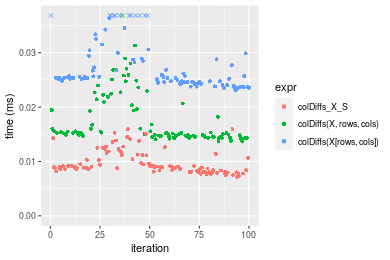
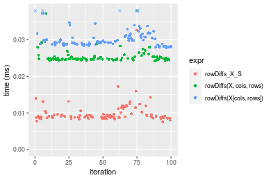
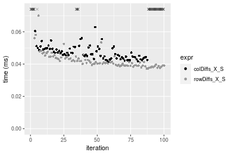

[matrixStats]: Benchmark report

---------------------------------------


# colDiffs() and rowDiffs() benchmarks on subsetted computation

This report benchmark the performance of colDiffs() and rowDiffs() on subsetted computation.


## Data type "integer"

### Data
```r
> rmatrix <- function(nrow, ncol, mode = c("logical", "double", "integer", "index"), range = c(-100, 
+     +100), na_prob = 0) {
+     mode <- match.arg(mode)
+     n <- nrow * ncol
+     if (mode == "logical") {
+         x <- sample(c(FALSE, TRUE), size = n, replace = TRUE)
+     }     else if (mode == "index") {
+         x <- seq_len(n)
+         mode <- "integer"
+     }     else {
+         x <- runif(n, min = range[1], max = range[2])
+     }
+     storage.mode(x) <- mode
+     if (na_prob > 0) 
+         x[sample(n, size = na_prob * n)] <- NA
+     dim(x) <- c(nrow, ncol)
+     x
+ }
> rmatrices <- function(scale = 10, seed = 1, ...) {
+     set.seed(seed)
+     data <- list()
+     data[[1]] <- rmatrix(nrow = scale * 1, ncol = scale * 1, ...)
+     data[[2]] <- rmatrix(nrow = scale * 10, ncol = scale * 10, ...)
+     data[[3]] <- rmatrix(nrow = scale * 100, ncol = scale * 1, ...)
+     data[[4]] <- t(data[[3]])
+     data[[5]] <- rmatrix(nrow = scale * 10, ncol = scale * 100, ...)
+     data[[6]] <- t(data[[5]])
+     names(data) <- sapply(data, FUN = function(x) paste(dim(x), collapse = "x"))
+     data
+ }
> data <- rmatrices(mode = mode)
```

### Results

#### 10x10 integer matrix


```r
> X <- data[["10x10"]]
> rows <- sample.int(nrow(X), size = nrow(X) * 0.7)
> cols <- sample.int(ncol(X), size = ncol(X) * 0.7)
> X_S <- X[rows, cols]
> gc()
          used  (Mb) gc trigger  (Mb) max used  (Mb)
Ncells 5229403 279.3    7916910 422.9  7916910 422.9
Vcells 9937010  75.9   33191153 253.3 53339345 407.0
> colStats <- microbenchmark(colDiffs_X_S = colDiffs(X_S), `colDiffs(X, rows, cols)` = colDiffs(X, 
+     rows = rows, cols = cols), `colDiffs(X[rows, cols])` = colDiffs(X[rows, cols]), unit = "ms")
> X <- t(X)
> X_S <- t(X_S)
> gc()
          used  (Mb) gc trigger  (Mb) max used  (Mb)
Ncells 5216771 278.7    7916910 422.9  7916910 422.9
Vcells 9895059  75.5   33191153 253.3 53339345 407.0
> rowStats <- microbenchmark(rowDiffs_X_S = rowDiffs(X_S), `rowDiffs(X, cols, rows)` = rowDiffs(X, 
+     rows = cols, cols = rows), `rowDiffs(X[cols, rows])` = rowDiffs(X[cols, rows]), unit = "ms")
```

_Table: Benchmarking of colDiffs_X_S(), colDiffs(X, rows, cols)() and colDiffs(X[rows, cols])() on integer+10x10 data. The top panel shows times in milliseconds and the bottom panel shows relative times._


|   |expr                    |      min|        lq|      mean|    median|        uq|      max|
|:--|:-----------------------|--------:|---------:|---------:|---------:|---------:|--------:|
|1  |colDiffs_X_S            | 0.002420| 0.0026685| 0.0048089| 0.0027600| 0.0028790| 0.204439|
|2  |colDiffs(X, rows, cols) | 0.002779| 0.0029955| 0.0031543| 0.0031085| 0.0032035| 0.005495|
|3  |colDiffs(X[rows, cols]) | 0.003340| 0.0037500| 0.0040192| 0.0039085| 0.0040985| 0.007430|


|   |expr                    |      min|       lq|      mean|   median|       uq|       max|
|:--|:-----------------------|--------:|--------:|---------:|--------:|--------:|---------:|
|1  |colDiffs_X_S            | 1.000000| 1.000000| 1.0000000| 1.000000| 1.000000| 1.0000000|
|2  |colDiffs(X, rows, cols) | 1.148347| 1.122541| 0.6559254| 1.126268| 1.112713| 0.0268784|
|3  |colDiffs(X[rows, cols]) | 1.380165| 1.405284| 0.8357889| 1.416123| 1.423585| 0.0363434|

_Table: Benchmarking of rowDiffs_X_S(), rowDiffs(X, cols, rows)() and rowDiffs(X[cols, rows])() on integer+10x10 data (transposed). The top panel shows times in milliseconds and the bottom panel shows relative times._


|   |expr                    |      min|        lq|      mean|    median|        uq|      max|
|:--|:-----------------------|--------:|---------:|---------:|---------:|---------:|--------:|
|1  |rowDiffs_X_S            | 0.002488| 0.0027240| 0.0028994| 0.0027925| 0.0029155| 0.004651|
|2  |rowDiffs(X, cols, rows) | 0.002885| 0.0030920| 0.0052886| 0.0031660| 0.0032910| 0.210292|
|3  |rowDiffs(X[cols, rows]) | 0.003421| 0.0037915| 0.0039987| 0.0039240| 0.0040790| 0.008344|


|   |expr                    |      min|       lq|     mean|   median|       uq|       max|
|:--|:-----------------------|--------:|--------:|--------:|--------:|--------:|---------:|
|1  |rowDiffs_X_S            | 1.000000| 1.000000| 1.000000| 1.000000| 1.000000|  1.000000|
|2  |rowDiffs(X, cols, rows) | 1.159566| 1.135095| 1.824040| 1.133751| 1.128794| 45.214363|
|3  |rowDiffs(X[cols, rows]) | 1.375000| 1.391887| 1.379136| 1.405193| 1.399074|  1.794023|

_Figure: Benchmarking of colDiffs_X_S(), colDiffs(X, rows, cols)() and colDiffs(X[rows, cols])() on integer+10x10 data  as well as rowDiffs_X_S(), rowDiffs(X, cols, rows)() and rowDiffs(X[cols, rows])() on the same data transposed.  Outliers are displayed as crosses.  Times are in milliseconds._


_Table: Benchmarking of colDiffs_X_S() and rowDiffs_X_S() on integer+10x10 data (original and transposed).  The top panel shows times in milliseconds and the bottom panel shows relative times._


|   |expr         |   min|     lq|    mean| median|     uq|     max|
|:--|:------------|-----:|------:|-------:|------:|------:|-------:|
|1  |colDiffs_X_S | 2.420| 2.6685| 4.80887| 2.7600| 2.8790| 204.439|
|2  |rowDiffs_X_S | 2.488| 2.7240| 2.89941| 2.7925| 2.9155|   4.651|


|   |expr         |      min|       lq|      mean|   median|       uq|       max|
|:--|:------------|--------:|--------:|---------:|--------:|--------:|---------:|
|1  |colDiffs_X_S | 1.000000| 1.000000| 1.0000000| 1.000000| 1.000000| 1.0000000|
|2  |rowDiffs_X_S | 1.028099| 1.020798| 0.6029296| 1.011775| 1.012678| 0.0227501|

_Figure: Benchmarking of colDiffs_X_S() and rowDiffs_X_S() on integer+10x10 data (original and transposed).  Outliers are displayed as crosses. Times are in milliseconds._


#### 100x100 integer matrix


```r
> X <- data[["100x100"]]
> rows <- sample.int(nrow(X), size = nrow(X) * 0.7)
> cols <- sample.int(ncol(X), size = ncol(X) * 0.7)
> X_S <- X[rows, cols]
> gc()
          used  (Mb) gc trigger  (Mb) max used  (Mb)
Ncells 5215597 278.6    7916910 422.9  7916910 422.9
Vcells 9564472  73.0   33191153 253.3 53339345 407.0
> colStats <- microbenchmark(colDiffs_X_S = colDiffs(X_S), `colDiffs(X, rows, cols)` = colDiffs(X, 
+     rows = rows, cols = cols), `colDiffs(X[rows, cols])` = colDiffs(X[rows, cols]), unit = "ms")
> X <- t(X)
> X_S <- t(X_S)
> gc()
          used  (Mb) gc trigger  (Mb) max used  (Mb)
Ncells 5215591 278.6    7916910 422.9  7916910 422.9
Vcells 9569555  73.1   33191153 253.3 53339345 407.0
> rowStats <- microbenchmark(rowDiffs_X_S = rowDiffs(X_S), `rowDiffs(X, cols, rows)` = rowDiffs(X, 
+     rows = cols, cols = rows), `rowDiffs(X[cols, rows])` = rowDiffs(X[cols, rows]), unit = "ms")
```

_Table: Benchmarking of colDiffs_X_S(), colDiffs(X, rows, cols)() and colDiffs(X[rows, cols])() on integer+100x100 data. The top panel shows times in milliseconds and the bottom panel shows relative times._


|   |expr                    |      min|        lq|      mean|    median|        uq|      max|
|:--|:-----------------------|--------:|---------:|---------:|---------:|---------:|--------:|
|1  |colDiffs_X_S            | 0.008978| 0.0095325| 0.0099565| 0.0096740| 0.0099190| 0.015421|
|2  |colDiffs(X, rows, cols) | 0.014254| 0.0148565| 0.0153480| 0.0151305| 0.0153765| 0.024972|
|3  |colDiffs(X[rows, cols]) | 0.020055| 0.0208915| 0.0221599| 0.0213495| 0.0215975| 0.074278|


|   |expr                    |      min|       lq|     mean|   median|       uq|      max|
|:--|:-----------------------|--------:|--------:|--------:|--------:|--------:|--------:|
|1  |colDiffs_X_S            | 1.000000| 1.000000| 1.000000| 1.000000| 1.000000| 1.000000|
|2  |colDiffs(X, rows, cols) | 1.587659| 1.558510| 1.541497| 1.564038| 1.550207| 1.619350|
|3  |colDiffs(X[rows, cols]) | 2.233794| 2.191608| 2.225669| 2.206895| 2.177387| 4.816679|

_Table: Benchmarking of rowDiffs_X_S(), rowDiffs(X, cols, rows)() and rowDiffs(X[cols, rows])() on integer+100x100 data (transposed). The top panel shows times in milliseconds and the bottom panel shows relative times._


|   |expr                    |      min|        lq|      mean|    median|        uq|      max|
|:--|:-----------------------|--------:|---------:|---------:|---------:|---------:|--------:|
|1  |rowDiffs_X_S            | 0.008817| 0.0092940| 0.0098796| 0.0094825| 0.0097075| 0.033440|
|2  |rowDiffs(X, cols, rows) | 0.013550| 0.0141555| 0.0149148| 0.0144580| 0.0147035| 0.051330|
|3  |rowDiffs(X[cols, rows]) | 0.019358| 0.0203160| 0.0213836| 0.0208975| 0.0213250| 0.038412|


|   |expr                    |      min|       lq|     mean|   median|       uq|      max|
|:--|:-----------------------|--------:|--------:|--------:|--------:|--------:|--------:|
|1  |rowDiffs_X_S            | 1.000000| 1.000000| 1.000000| 1.000000| 1.000000| 1.000000|
|2  |rowDiffs(X, cols, rows) | 1.536804| 1.523079| 1.509646| 1.524703| 1.514654| 1.534988|
|3  |rowDiffs(X[cols, rows]) | 2.195531| 2.185926| 2.164415| 2.203797| 2.196755| 1.148684|

_Figure: Benchmarking of colDiffs_X_S(), colDiffs(X, rows, cols)() and colDiffs(X[rows, cols])() on integer+100x100 data  as well as rowDiffs_X_S(), rowDiffs(X, cols, rows)() and rowDiffs(X[cols, rows])() on the same data transposed.  Outliers are displayed as crosses.  Times are in milliseconds._


_Table: Benchmarking of colDiffs_X_S() and rowDiffs_X_S() on integer+100x100 data (original and transposed).  The top panel shows times in milliseconds and the bottom panel shows relative times._


|   |expr         |   min|     lq|    mean| median|     uq|    max|
|:--|:------------|-----:|------:|-------:|------:|------:|------:|
|2  |rowDiffs_X_S | 8.817| 9.2940| 9.87964| 9.4825| 9.7075| 33.440|
|1  |colDiffs_X_S | 8.978| 9.5325| 9.95653| 9.6740| 9.9190| 15.421|


|   |expr         |     min|       lq|     mean|   median|       uq|       max|
|:--|:------------|-------:|--------:|--------:|--------:|--------:|---------:|
|2  |rowDiffs_X_S | 1.00000| 1.000000| 1.000000| 1.000000| 1.000000| 1.0000000|
|1  |colDiffs_X_S | 1.01826| 1.025662| 1.007783| 1.020195| 1.021787| 0.4611543|

_Figure: Benchmarking of colDiffs_X_S() and rowDiffs_X_S() on integer+100x100 data (original and transposed).  Outliers are displayed as crosses. Times are in milliseconds._


#### 1000x10 integer matrix


```r
> X <- data[["1000x10"]]
> rows <- sample.int(nrow(X), size = nrow(X) * 0.7)
> cols <- sample.int(ncol(X), size = ncol(X) * 0.7)
> X_S <- X[rows, cols]
> gc()
          used  (Mb) gc trigger  (Mb) max used  (Mb)
Ncells 5216340 278.6    7916910 422.9  7916910 422.9
Vcells 9568547  73.1   33191153 253.3 53339345 407.0
> colStats <- microbenchmark(colDiffs_X_S = colDiffs(X_S), `colDiffs(X, rows, cols)` = colDiffs(X, 
+     rows = rows, cols = cols), `colDiffs(X[rows, cols])` = colDiffs(X[rows, cols]), unit = "ms")
> X <- t(X)
> X_S <- t(X_S)
> gc()
          used  (Mb) gc trigger  (Mb) max used  (Mb)
Ncells 5216334 278.6    7916910 422.9  7916910 422.9
Vcells 9573630  73.1   33191153 253.3 53339345 407.0
> rowStats <- microbenchmark(rowDiffs_X_S = rowDiffs(X_S), `rowDiffs(X, cols, rows)` = rowDiffs(X, 
+     rows = cols, cols = rows), `rowDiffs(X[cols, rows])` = rowDiffs(X[cols, rows]), unit = "ms")
```

_Table: Benchmarking of colDiffs_X_S(), colDiffs(X, rows, cols)() and colDiffs(X[rows, cols])() on integer+1000x10 data. The top panel shows times in milliseconds and the bottom panel shows relative times._


|   |expr                    |      min|        lq|      mean|    median|       uq|      max|
|:--|:-----------------------|--------:|---------:|---------:|---------:|--------:|--------:|
|1  |colDiffs_X_S            | 0.008689| 0.0093540| 0.0095785| 0.0094925| 0.009697| 0.012686|
|2  |colDiffs(X, rows, cols) | 0.014674| 0.0155950| 0.0161768| 0.0158745| 0.016380| 0.025598|
|3  |colDiffs(X[rows, cols]) | 0.019645| 0.0208555| 0.0219744| 0.0212350| 0.021991| 0.064434|


|   |expr                    |      min|       lq|     mean|   median|       uq|      max|
|:--|:-----------------------|--------:|--------:|--------:|--------:|--------:|--------:|
|1  |colDiffs_X_S            | 1.000000| 1.000000| 1.000000| 1.000000| 1.000000| 1.000000|
|2  |colDiffs(X, rows, cols) | 1.688802| 1.667201| 1.688858| 1.672320| 1.689182| 2.017815|
|3  |colDiffs(X[rows, cols]) | 2.260905| 2.229581| 2.294131| 2.237029| 2.267815| 5.079142|

_Table: Benchmarking of rowDiffs_X_S(), rowDiffs(X, cols, rows)() and rowDiffs(X[cols, rows])() on integer+1000x10 data (transposed). The top panel shows times in milliseconds and the bottom panel shows relative times._


|   |expr                    |      min|        lq|      mean|    median|        uq|      max|
|:--|:-----------------------|--------:|---------:|---------:|---------:|---------:|--------:|
|1  |rowDiffs_X_S            | 0.009367| 0.0097975| 0.0107860| 0.0100585| 0.0104255| 0.026405|
|2  |rowDiffs(X, cols, rows) | 0.016303| 0.0170330| 0.0181807| 0.0175700| 0.0179835| 0.035707|
|3  |rowDiffs(X[cols, rows]) | 0.022716| 0.0234795| 0.0258039| 0.0242395| 0.0267305| 0.058727|


|   |expr                    |      min|       lq|     mean|   median|       uq|      max|
|:--|:-----------------------|--------:|--------:|--------:|--------:|--------:|--------:|
|1  |rowDiffs_X_S            | 1.000000| 1.000000| 1.000000| 1.000000| 1.000000| 1.000000|
|2  |rowDiffs(X, cols, rows) | 1.740472| 1.738505| 1.685578| 1.746781| 1.724953| 1.352282|
|3  |rowDiffs(X[cols, rows]) | 2.425109| 2.396479| 2.392348| 2.409852| 2.563954| 2.224086|

_Figure: Benchmarking of colDiffs_X_S(), colDiffs(X, rows, cols)() and colDiffs(X[rows, cols])() on integer+1000x10 data  as well as rowDiffs_X_S(), rowDiffs(X, cols, rows)() and rowDiffs(X[cols, rows])() on the same data transposed.  Outliers are displayed as crosses.  Times are in milliseconds._


_Table: Benchmarking of colDiffs_X_S() and rowDiffs_X_S() on integer+1000x10 data (original and transposed).  The top panel shows times in milliseconds and the bottom panel shows relative times._


|   |expr         |   min|     lq|     mean|  median|      uq|    max|
|:--|:------------|-----:|------:|--------:|-------:|-------:|------:|
|1  |colDiffs_X_S | 8.689| 9.3540|  9.57852|  9.4925|  9.6970| 12.686|
|2  |rowDiffs_X_S | 9.367| 9.7975| 10.78601| 10.0585| 10.4255| 26.405|


|   |expr         |     min|       lq|     mean|   median|       uq|      max|
|:--|:------------|-------:|--------:|--------:|--------:|--------:|--------:|
|1  |colDiffs_X_S | 1.00000| 1.000000| 1.000000| 1.000000| 1.000000| 1.000000|
|2  |rowDiffs_X_S | 1.07803| 1.047413| 1.126062| 1.059626| 1.075126| 2.081428|

_Figure: Benchmarking of colDiffs_X_S() and rowDiffs_X_S() on integer+1000x10 data (original and transposed).  Outliers are displayed as crosses. Times are in milliseconds._


#### 10x1000 integer matrix


```r
> X <- data[["10x1000"]]
> rows <- sample.int(nrow(X), size = nrow(X) * 0.7)
> cols <- sample.int(ncol(X), size = ncol(X) * 0.7)
> X_S <- X[rows, cols]
> gc()
          used  (Mb) gc trigger  (Mb) max used  (Mb)
Ncells 5216545 278.6    7916910 422.9  7916910 422.9
Vcells 9569363  73.1   33191153 253.3 53339345 407.0
> colStats <- microbenchmark(colDiffs_X_S = colDiffs(X_S), `colDiffs(X, rows, cols)` = colDiffs(X, 
+     rows = rows, cols = cols), `colDiffs(X[rows, cols])` = colDiffs(X[rows, cols]), unit = "ms")
> X <- t(X)
> X_S <- t(X_S)
> gc()
          used  (Mb) gc trigger  (Mb) max used  (Mb)
Ncells 5216539 278.6    7916910 422.9  7916910 422.9
Vcells 9574446  73.1   33191153 253.3 53339345 407.0
> rowStats <- microbenchmark(rowDiffs_X_S = rowDiffs(X_S), `rowDiffs(X, cols, rows)` = rowDiffs(X, 
+     rows = cols, cols = rows), `rowDiffs(X[cols, rows])` = rowDiffs(X[cols, rows]), unit = "ms")
```

_Table: Benchmarking of colDiffs_X_S(), colDiffs(X, rows, cols)() and colDiffs(X[rows, cols])() on integer+10x1000 data. The top panel shows times in milliseconds and the bottom panel shows relative times._


|   |expr                    |      min|        lq|      mean|    median|        uq|      max|
|:--|:-----------------------|--------:|---------:|---------:|---------:|---------:|--------:|
|1  |colDiffs_X_S            | 0.008169| 0.0087070| 0.0093797| 0.0088880| 0.0090550| 0.036902|
|2  |colDiffs(X, rows, cols) | 0.014261| 0.0148310| 0.0155227| 0.0152705| 0.0156240| 0.029455|
|3  |colDiffs(X[rows, cols]) | 0.020580| 0.0217685| 0.0227336| 0.0224755| 0.0228255| 0.035877|


|   |expr                    |      min|       lq|     mean|   median|       uq|       max|
|:--|:-----------------------|--------:|--------:|--------:|--------:|--------:|---------:|
|1  |colDiffs_X_S            | 1.000000| 1.000000| 1.000000| 1.000000| 1.000000| 1.0000000|
|2  |colDiffs(X, rows, cols) | 1.745746| 1.703342| 1.654926| 1.718103| 1.725456| 0.7981952|
|3  |colDiffs(X[rows, cols]) | 2.519280| 2.500115| 2.423710| 2.528747| 2.520762| 0.9722237|

_Table: Benchmarking of rowDiffs_X_S(), rowDiffs(X, cols, rows)() and rowDiffs(X[cols, rows])() on integer+10x1000 data (transposed). The top panel shows times in milliseconds and the bottom panel shows relative times._


|   |expr                    |      min|        lq|      mean|    median|        uq|      max|
|:--|:-----------------------|--------:|---------:|---------:|---------:|---------:|--------:|
|1  |rowDiffs_X_S            | 0.007989| 0.0083965| 0.0088602| 0.0085775| 0.0088745| 0.015705|
|2  |rowDiffs(X, cols, rows) | 0.012948| 0.0135115| 0.0143816| 0.0138020| 0.0142520| 0.057249|
|3  |rowDiffs(X[cols, rows]) | 0.019107| 0.0201940| 0.0212245| 0.0203955| 0.0212220| 0.039549|


|   |expr                    |      min|       lq|     mean|   median|       uq|      max|
|:--|:-----------------------|--------:|--------:|--------:|--------:|--------:|--------:|
|1  |rowDiffs_X_S            | 1.000000| 1.000000| 1.000000| 1.000000| 1.000000| 1.000000|
|2  |rowDiffs(X, cols, rows) | 1.620729| 1.609182| 1.623172| 1.609094| 1.605950| 3.645272|
|3  |rowDiffs(X[cols, rows]) | 2.391663| 2.405050| 2.395485| 2.377791| 2.391346| 2.518243|

_Figure: Benchmarking of colDiffs_X_S(), colDiffs(X, rows, cols)() and colDiffs(X[rows, cols])() on integer+10x1000 data  as well as rowDiffs_X_S(), rowDiffs(X, cols, rows)() and rowDiffs(X[cols, rows])() on the same data transposed.  Outliers are displayed as crosses.  Times are in milliseconds._


_Table: Benchmarking of colDiffs_X_S() and rowDiffs_X_S() on integer+10x1000 data (original and transposed).  The top panel shows times in milliseconds and the bottom panel shows relative times._


|   |expr         |   min|     lq|    mean| median|     uq|    max|
|:--|:------------|-----:|------:|-------:|------:|------:|------:|
|2  |rowDiffs_X_S | 7.989| 8.3965| 8.86020| 8.5775| 8.8745| 15.705|
|1  |colDiffs_X_S | 8.169| 8.7070| 9.37968| 8.8880| 9.0550| 36.902|


|   |expr         |      min|      lq|     mean|   median|       uq|      max|
|:--|:------------|--------:|-------:|--------:|--------:|--------:|--------:|
|2  |rowDiffs_X_S | 1.000000| 1.00000| 1.000000| 1.000000| 1.000000| 1.000000|
|1  |colDiffs_X_S | 1.022531| 1.03698| 1.058631| 1.036199| 1.020339| 2.349697|

_Figure: Benchmarking of colDiffs_X_S() and rowDiffs_X_S() on integer+10x1000 data (original and transposed).  Outliers are displayed as crosses. Times are in milliseconds._


#### 100x1000 integer matrix


```r
> X <- data[["100x1000"]]
> rows <- sample.int(nrow(X), size = nrow(X) * 0.7)
> cols <- sample.int(ncol(X), size = ncol(X) * 0.7)
> X_S <- X[rows, cols]
> gc()
          used  (Mb) gc trigger  (Mb) max used  (Mb)
Ncells 5216756 278.7    7916910 422.9  7916910 422.9
Vcells 9592026  73.2   33191153 253.3 53339345 407.0
> colStats <- microbenchmark(colDiffs_X_S = colDiffs(X_S), `colDiffs(X, rows, cols)` = colDiffs(X, 
+     rows = rows, cols = cols), `colDiffs(X[rows, cols])` = colDiffs(X[rows, cols]), unit = "ms")
> X <- t(X)
> X_S <- t(X_S)
> gc()
          used  (Mb) gc trigger  (Mb) max used  (Mb)
Ncells 5216750 278.7    7916910 422.9  7916910 422.9
Vcells 9642109  73.6   33191153 253.3 53339345 407.0
> rowStats <- microbenchmark(rowDiffs_X_S = rowDiffs(X_S), `rowDiffs(X, cols, rows)` = rowDiffs(X, 
+     rows = cols, cols = rows), `rowDiffs(X[cols, rows])` = rowDiffs(X[cols, rows]), unit = "ms")
```

_Table: Benchmarking of colDiffs_X_S(), colDiffs(X, rows, cols)() and colDiffs(X[rows, cols])() on integer+100x1000 data. The top panel shows times in milliseconds and the bottom panel shows relative times._


|   |expr                    |      min|        lq|      mean|    median|        uq|      max|
|:--|:-----------------------|--------:|---------:|---------:|---------:|---------:|--------:|
|1  |colDiffs_X_S            | 0.049948| 0.0534205| 0.0582087| 0.0552685| 0.0605225| 0.109774|
|2  |colDiffs(X, rows, cols) | 0.092337| 0.0988005| 0.1076287| 0.1020370| 0.1123740| 0.192729|
|3  |colDiffs(X[rows, cols]) | 0.130857| 0.1395655| 0.1544117| 0.1474420| 0.1620730| 0.318177|


|   |expr                    |      min|       lq|     mean|   median|       uq|      max|
|:--|:-----------------------|--------:|--------:|--------:|--------:|--------:|--------:|
|1  |colDiffs_X_S            | 1.000000| 1.000000| 1.000000| 1.000000| 1.000000| 1.000000|
|2  |colDiffs(X, rows, cols) | 1.848663| 1.849487| 1.849014| 1.846205| 1.856731| 1.755689|
|3  |colDiffs(X[rows, cols]) | 2.619865| 2.612583| 2.652727| 2.667740| 2.677897| 2.898473|

_Table: Benchmarking of rowDiffs_X_S(), rowDiffs(X, cols, rows)() and rowDiffs(X[cols, rows])() on integer+100x1000 data (transposed). The top panel shows times in milliseconds and the bottom panel shows relative times._


|   |expr                    |      min|        lq|      mean|    median|        uq|      max|
|:--|:-----------------------|--------:|---------:|---------:|---------:|---------:|--------:|
|1  |rowDiffs_X_S            | 0.051704| 0.0542250| 0.0618808| 0.0595485| 0.0661530| 0.110843|
|2  |rowDiffs(X, cols, rows) | 0.088411| 0.0916985| 0.1004919| 0.0952035| 0.1068870| 0.181371|
|3  |rowDiffs(X[cols, rows]) | 0.131275| 0.1363815| 0.1510804| 0.1457250| 0.1605755| 0.234687|


|   |expr                    |      min|       lq|     mean|   median|       uq|      max|
|:--|:-----------------------|--------:|--------:|--------:|--------:|--------:|--------:|
|1  |rowDiffs_X_S            | 1.000000| 1.000000| 1.000000| 1.000000| 1.000000| 1.000000|
|2  |rowDiffs(X, cols, rows) | 1.709945| 1.691074| 1.623960| 1.598756| 1.615754| 1.636287|
|3  |rowDiffs(X[cols, rows]) | 2.538972| 2.515104| 2.441475| 2.447165| 2.427335| 2.117292|

_Figure: Benchmarking of colDiffs_X_S(), colDiffs(X, rows, cols)() and colDiffs(X[rows, cols])() on integer+100x1000 data  as well as rowDiffs_X_S(), rowDiffs(X, cols, rows)() and rowDiffs(X[cols, rows])() on the same data transposed.  Outliers are displayed as crosses.  Times are in milliseconds._


_Table: Benchmarking of colDiffs_X_S() and rowDiffs_X_S() on integer+100x1000 data (original and transposed).  The top panel shows times in milliseconds and the bottom panel shows relative times._


|   |expr         |    min|      lq|     mean|  median|      uq|     max|
|:--|:------------|------:|-------:|--------:|-------:|-------:|-------:|
|1  |colDiffs_X_S | 49.948| 53.4205| 58.20868| 55.2685| 60.5225| 109.774|
|2  |rowDiffs_X_S | 51.704| 54.2250| 61.88078| 59.5485| 66.1530| 110.843|


|   |expr         |      min|      lq|     mean|  median|       uq|      max|
|:--|:------------|--------:|-------:|--------:|-------:|--------:|--------:|
|1  |colDiffs_X_S | 1.000000| 1.00000| 1.000000| 1.00000| 1.000000| 1.000000|
|2  |rowDiffs_X_S | 1.035157| 1.01506| 1.063085| 1.07744| 1.093031| 1.009738|

_Figure: Benchmarking of colDiffs_X_S() and rowDiffs_X_S() on integer+100x1000 data (original and transposed).  Outliers are displayed as crosses. Times are in milliseconds._


#### 1000x100 integer matrix


```r
> X <- data[["1000x100"]]
> rows <- sample.int(nrow(X), size = nrow(X) * 0.7)
> cols <- sample.int(ncol(X), size = ncol(X) * 0.7)
> X_S <- X[rows, cols]
> gc()
          used  (Mb) gc trigger  (Mb) max used  (Mb)
Ncells 5216966 278.7    7916910 422.9  7916910 422.9
Vcells 9592729  73.2   33191153 253.3 53339345 407.0
> colStats <- microbenchmark(colDiffs_X_S = colDiffs(X_S), `colDiffs(X, rows, cols)` = colDiffs(X, 
+     rows = rows, cols = cols), `colDiffs(X[rows, cols])` = colDiffs(X[rows, cols]), unit = "ms")
> X <- t(X)
> X_S <- t(X_S)
> gc()
          used  (Mb) gc trigger  (Mb) max used  (Mb)
Ncells 5216960 278.7    7916910 422.9  7916910 422.9
Vcells 9642812  73.6   33191153 253.3 53339345 407.0
> rowStats <- microbenchmark(rowDiffs_X_S = rowDiffs(X_S), `rowDiffs(X, cols, rows)` = rowDiffs(X, 
+     rows = cols, cols = rows), `rowDiffs(X[cols, rows])` = rowDiffs(X[cols, rows]), unit = "ms")
```

_Table: Benchmarking of colDiffs_X_S(), colDiffs(X, rows, cols)() and colDiffs(X[rows, cols])() on integer+1000x100 data. The top panel shows times in milliseconds and the bottom panel shows relative times._


|   |expr                    |      min|        lq|      mean|    median|        uq|      max|
|:--|:-----------------------|--------:|---------:|---------:|---------:|---------:|--------:|
|1  |colDiffs_X_S            | 0.050507| 0.0525055| 0.0575358| 0.0542325| 0.0601415| 0.105880|
|2  |colDiffs(X, rows, cols) | 0.090679| 0.0941415| 0.1047782| 0.1004060| 0.1112930| 0.223794|
|3  |colDiffs(X[rows, cols]) | 0.127945| 0.1332485| 0.1471991| 0.1424475| 0.1563025| 0.242569|


|   |expr                    |      min|       lq|     mean|   median|       uq|      max|
|:--|:-----------------------|--------:|--------:|--------:|--------:|--------:|--------:|
|1  |colDiffs_X_S            | 1.000000| 1.000000| 1.000000| 1.000000| 1.000000| 1.000000|
|2  |colDiffs(X, rows, cols) | 1.795375| 1.792984| 1.821096| 1.851399| 1.850519| 2.113657|
|3  |colDiffs(X[rows, cols]) | 2.533213| 2.537801| 2.558393| 2.626608| 2.598913| 2.290980|

_Table: Benchmarking of rowDiffs_X_S(), rowDiffs(X, cols, rows)() and rowDiffs(X[cols, rows])() on integer+1000x100 data (transposed). The top panel shows times in milliseconds and the bottom panel shows relative times._


|   |expr                    |      min|        lq|      mean|    median|        uq|      max|
|:--|:-----------------------|--------:|---------:|---------:|---------:|---------:|--------:|
|1  |rowDiffs_X_S            | 0.051975| 0.0542915| 0.0612367| 0.0579800| 0.0658050| 0.131392|
|2  |rowDiffs(X, cols, rows) | 0.093554| 0.0983985| 0.1099080| 0.1046005| 0.1147120| 0.192893|
|3  |rowDiffs(X[cols, rows]) | 0.136226| 0.1429505| 0.1575831| 0.1526775| 0.1679315| 0.230444|


|   |expr                    |      min|       lq|     mean|   median|       uq|      max|
|:--|:-----------------------|--------:|--------:|--------:|--------:|--------:|--------:|
|1  |rowDiffs_X_S            | 1.000000| 1.000000| 1.000000| 1.000000| 1.000000| 1.000000|
|2  |rowDiffs(X, cols, rows) | 1.799981| 1.812411| 1.794806| 1.804079| 1.743211| 1.468073|
|3  |rowDiffs(X[cols, rows]) | 2.620991| 2.633018| 2.573345| 2.633279| 2.551957| 1.753866|

_Figure: Benchmarking of colDiffs_X_S(), colDiffs(X, rows, cols)() and colDiffs(X[rows, cols])() on integer+1000x100 data  as well as rowDiffs_X_S(), rowDiffs(X, cols, rows)() and rowDiffs(X[cols, rows])() on the same data transposed.  Outliers are displayed as crosses.  Times are in milliseconds._


_Table: Benchmarking of colDiffs_X_S() and rowDiffs_X_S() on integer+1000x100 data (original and transposed).  The top panel shows times in milliseconds and the bottom panel shows relative times._


|   |expr         |    min|      lq|     mean|  median|      uq|     max|
|:--|:------------|------:|-------:|--------:|-------:|-------:|-------:|
|1  |colDiffs_X_S | 50.507| 52.5055| 57.53578| 54.2325| 60.1415| 105.880|
|2  |rowDiffs_X_S | 51.975| 54.2915| 61.23669| 57.9800| 65.8050| 131.392|


|   |expr         |      min|       lq|     mean|   median|      uq|      max|
|:--|:------------|--------:|--------:|--------:|--------:|-------:|--------:|
|1  |colDiffs_X_S | 1.000000| 1.000000| 1.000000| 1.000000| 1.00000| 1.000000|
|2  |rowDiffs_X_S | 1.029065| 1.034015| 1.064324| 1.069101| 1.09417| 1.240952|

_Figure: Benchmarking of colDiffs_X_S() and rowDiffs_X_S() on integer+1000x100 data (original and transposed).  Outliers are displayed as crosses. Times are in milliseconds._


## Data type "double"

### Data
```r
> rmatrix <- function(nrow, ncol, mode = c("logical", "double", "integer", "index"), range = c(-100, 
+     +100), na_prob = 0) {
+     mode <- match.arg(mode)
+     n <- nrow * ncol
+     if (mode == "logical") {
+         x <- sample(c(FALSE, TRUE), size = n, replace = TRUE)
+     }     else if (mode == "index") {
+         x <- seq_len(n)
+         mode <- "integer"
+     }     else {
+         x <- runif(n, min = range[1], max = range[2])
+     }
+     storage.mode(x) <- mode
+     if (na_prob > 0) 
+         x[sample(n, size = na_prob * n)] <- NA
+     dim(x) <- c(nrow, ncol)
+     x
+ }
> rmatrices <- function(scale = 10, seed = 1, ...) {
+     set.seed(seed)
+     data <- list()
+     data[[1]] <- rmatrix(nrow = scale * 1, ncol = scale * 1, ...)
+     data[[2]] <- rmatrix(nrow = scale * 10, ncol = scale * 10, ...)
+     data[[3]] <- rmatrix(nrow = scale * 100, ncol = scale * 1, ...)
+     data[[4]] <- t(data[[3]])
+     data[[5]] <- rmatrix(nrow = scale * 10, ncol = scale * 100, ...)
+     data[[6]] <- t(data[[5]])
+     names(data) <- sapply(data, FUN = function(x) paste(dim(x), collapse = "x"))
+     data
+ }
> data <- rmatrices(mode = mode)
```

### Results

#### 10x10 double matrix


```r
> X <- data[["10x10"]]
> rows <- sample.int(nrow(X), size = nrow(X) * 0.7)
> cols <- sample.int(ncol(X), size = ncol(X) * 0.7)
> X_S <- X[rows, cols]
> gc()
          used  (Mb) gc trigger  (Mb) max used  (Mb)
Ncells 5217184 278.7    7916910 422.9  7916910 422.9
Vcells 9683814  73.9   33191153 253.3 53339345 407.0
> colStats <- microbenchmark(colDiffs_X_S = colDiffs(X_S), `colDiffs(X, rows, cols)` = colDiffs(X, 
+     rows = rows, cols = cols), `colDiffs(X[rows, cols])` = colDiffs(X[rows, cols]), unit = "ms")
> X <- t(X)
> X_S <- t(X_S)
> gc()
          used  (Mb) gc trigger  (Mb) max used  (Mb)
Ncells 5217169 278.7    7916910 422.9  7916910 422.9
Vcells 9683982  73.9   33191153 253.3 53339345 407.0
> rowStats <- microbenchmark(rowDiffs_X_S = rowDiffs(X_S), `rowDiffs(X, cols, rows)` = rowDiffs(X, 
+     rows = cols, cols = rows), `rowDiffs(X[cols, rows])` = rowDiffs(X[cols, rows]), unit = "ms")
```

_Table: Benchmarking of colDiffs_X_S(), colDiffs(X, rows, cols)() and colDiffs(X[rows, cols])() on double+10x10 data. The top panel shows times in milliseconds and the bottom panel shows relative times._


|   |expr                    |      min|        lq|      mean|    median|        uq|      max|
|:--|:-----------------------|--------:|---------:|---------:|---------:|---------:|--------:|
|1  |colDiffs_X_S            | 0.002598| 0.0028820| 0.0033337| 0.0029690| 0.0030740| 0.036233|
|2  |colDiffs(X, rows, cols) | 0.002965| 0.0032415| 0.0034179| 0.0033460| 0.0034925| 0.005915|
|3  |colDiffs(X[rows, cols]) | 0.003580| 0.0039650| 0.0041717| 0.0040425| 0.0042085| 0.010714|


|   |expr                    |      min|       lq|     mean|   median|       uq|       max|
|:--|:-----------------------|--------:|--------:|--------:|--------:|--------:|---------:|
|1  |colDiffs_X_S            | 1.000000| 1.000000| 1.000000| 1.000000| 1.000000| 1.0000000|
|2  |colDiffs(X, rows, cols) | 1.141263| 1.124740| 1.025266| 1.126979| 1.136142| 0.1632490|
|3  |colDiffs(X[rows, cols]) | 1.377983| 1.375781| 1.251378| 1.361570| 1.369063| 0.2956973|

_Table: Benchmarking of rowDiffs_X_S(), rowDiffs(X, cols, rows)() and rowDiffs(X[cols, rows])() on double+10x10 data (transposed). The top panel shows times in milliseconds and the bottom panel shows relative times._


|   |expr                    |      min|       lq|      mean|    median|        uq|      max|
|:--|:-----------------------|--------:|--------:|---------:|---------:|---------:|--------:|
|1  |rowDiffs_X_S            | 0.002587| 0.002927| 0.0031885| 0.0030325| 0.0031845| 0.005777|
|2  |rowDiffs(X, cols, rows) | 0.002990| 0.003338| 0.0039580| 0.0034180| 0.0036160| 0.044428|
|3  |rowDiffs(X[cols, rows]) | 0.003640| 0.004029| 0.0042729| 0.0041380| 0.0042915| 0.009662|


|   |expr                    |      min|       lq|     mean|   median|       uq|      max|
|:--|:-----------------------|--------:|--------:|--------:|--------:|--------:|--------:|
|1  |rowDiffs_X_S            | 1.000000| 1.000000| 1.000000| 1.000000| 1.000000| 1.000000|
|2  |rowDiffs(X, cols, rows) | 1.155779| 1.140417| 1.241316| 1.127123| 1.135500| 7.690497|
|3  |rowDiffs(X[cols, rows]) | 1.407035| 1.376495| 1.340096| 1.364551| 1.347621| 1.672494|

_Figure: Benchmarking of colDiffs_X_S(), colDiffs(X, rows, cols)() and colDiffs(X[rows, cols])() on double+10x10 data  as well as rowDiffs_X_S(), rowDiffs(X, cols, rows)() and rowDiffs(X[cols, rows])() on the same data transposed.  Outliers are displayed as crosses.  Times are in milliseconds._


_Table: Benchmarking of colDiffs_X_S() and rowDiffs_X_S() on double+10x10 data (original and transposed).  The top panel shows times in milliseconds and the bottom panel shows relative times._


|   |expr         |   min|    lq|    mean| median|     uq|    max|
|:--|:------------|-----:|-----:|-------:|------:|------:|------:|
|1  |colDiffs_X_S | 2.598| 2.882| 3.33370| 2.9690| 3.0740| 36.233|
|2  |rowDiffs_X_S | 2.587| 2.927| 3.18851| 3.0325| 3.1845|  5.777|


|   |expr         |      min|       lq|      mean|   median|       uq|       max|
|:--|:------------|--------:|--------:|---------:|--------:|--------:|---------:|
|1  |colDiffs_X_S | 1.000000| 1.000000| 1.0000000| 1.000000| 1.000000| 1.0000000|
|2  |rowDiffs_X_S | 0.995766| 1.015614| 0.9564478| 1.021388| 1.035947| 0.1594403|

_Figure: Benchmarking of colDiffs_X_S() and rowDiffs_X_S() on double+10x10 data (original and transposed).  Outliers are displayed as crosses. Times are in milliseconds._


#### 100x100 double matrix


```r
> X <- data[["100x100"]]
> rows <- sample.int(nrow(X), size = nrow(X) * 0.7)
> cols <- sample.int(ncol(X), size = ncol(X) * 0.7)
> X_S <- X[rows, cols]
> gc()
          used  (Mb) gc trigger  (Mb) max used  (Mb)
Ncells 5217383 278.7    7916910 422.9  7916910 422.9
Vcells 9689746  74.0   33191153 253.3 53339345 407.0
> colStats <- microbenchmark(colDiffs_X_S = colDiffs(X_S), `colDiffs(X, rows, cols)` = colDiffs(X, 
+     rows = rows, cols = cols), `colDiffs(X[rows, cols])` = colDiffs(X[rows, cols]), unit = "ms")
> X <- t(X)
> X_S <- t(X_S)
> gc()
          used  (Mb) gc trigger  (Mb) max used  (Mb)
Ncells 5217377 278.7    7916910 422.9  7916910 422.9
Vcells 9699829  74.1   33191153 253.3 53339345 407.0
> rowStats <- microbenchmark(rowDiffs_X_S = rowDiffs(X_S), `rowDiffs(X, cols, rows)` = rowDiffs(X, 
+     rows = cols, cols = rows), `rowDiffs(X[cols, rows])` = rowDiffs(X[cols, rows]), unit = "ms")
```

_Table: Benchmarking of colDiffs_X_S(), colDiffs(X, rows, cols)() and colDiffs(X[rows, cols])() on double+100x100 data. The top panel shows times in milliseconds and the bottom panel shows relative times._


|   |expr                    |      min|        lq|      mean|    median|       uq|      max|
|:--|:-----------------------|--------:|---------:|---------:|---------:|--------:|--------:|
|1  |colDiffs_X_S            | 0.007164| 0.0083080| 0.0098073| 0.0089865| 0.011152| 0.015938|
|2  |colDiffs(X, rows, cols) | 0.013762| 0.0146380| 0.0175394| 0.0151860| 0.019411| 0.052173|
|3  |colDiffs(X[rows, cols]) | 0.023134| 0.0245945| 0.0279257| 0.0253645| 0.028766| 0.076470|


|   |expr                    |      min|       lq|     mean|   median|       uq|      max|
|:--|:-----------------------|--------:|--------:|--------:|--------:|--------:|--------:|
|1  |colDiffs_X_S            | 1.000000| 1.000000| 1.000000| 1.000000| 1.000000| 1.000000|
|2  |colDiffs(X, rows, cols) | 1.920994| 1.761916| 1.788405| 1.689868| 1.740585| 3.273497|
|3  |colDiffs(X[rows, cols]) | 3.229202| 2.960339| 2.847443| 2.822512| 2.579448| 4.797967|

_Table: Benchmarking of rowDiffs_X_S(), rowDiffs(X, cols, rows)() and rowDiffs(X[cols, rows])() on double+100x100 data (transposed). The top panel shows times in milliseconds and the bottom panel shows relative times._


|   |expr                    |      min|        lq|      mean|    median|        uq|      max|
|:--|:-----------------------|--------:|---------:|---------:|---------:|---------:|--------:|
|1  |rowDiffs_X_S            | 0.006891| 0.0080755| 0.0085462| 0.0085930| 0.0089015| 0.014724|
|2  |rowDiffs(X, cols, rows) | 0.020214| 0.0206815| 0.0217297| 0.0210985| 0.0215935| 0.050693|
|3  |rowDiffs(X[cols, rows]) | 0.022603| 0.0241970| 0.0253184| 0.0248330| 0.0254855| 0.055220|


|   |expr                    |      min|       lq|     mean|   median|       uq|      max|
|:--|:-----------------------|--------:|--------:|--------:|--------:|--------:|--------:|
|1  |rowDiffs_X_S            | 1.000000| 1.000000| 1.000000| 1.000000| 1.000000| 1.000000|
|2  |rowDiffs(X, cols, rows) | 2.933391| 2.561018| 2.542609| 2.455312| 2.425827| 3.442882|
|3  |rowDiffs(X[cols, rows]) | 3.280076| 2.996347| 2.962531| 2.889910| 2.863057| 3.750340|

_Figure: Benchmarking of colDiffs_X_S(), colDiffs(X, rows, cols)() and colDiffs(X[rows, cols])() on double+100x100 data  as well as rowDiffs_X_S(), rowDiffs(X, cols, rows)() and rowDiffs(X[cols, rows])() on the same data transposed.  Outliers are displayed as crosses.  Times are in milliseconds._





_Table: Benchmarking of colDiffs_X_S() and rowDiffs_X_S() on double+100x100 data (original and transposed).  The top panel shows times in milliseconds and the bottom panel shows relative times._


|   |expr         |   min|     lq|    mean| median|      uq|    max|
|:--|:------------|-----:|------:|-------:|------:|-------:|------:|
|2  |rowDiffs_X_S | 6.891| 8.0755| 8.54621| 8.5930|  8.9015| 14.724|
|1  |colDiffs_X_S | 7.164| 8.3080| 9.80730| 8.9865| 11.1520| 15.938|


|   |expr         |      min|       lq|     mean|   median|       uq|     max|
|:--|:------------|--------:|--------:|--------:|--------:|--------:|-------:|
|2  |rowDiffs_X_S | 1.000000| 1.000000| 1.000000| 1.000000| 1.000000| 1.00000|
|1  |colDiffs_X_S | 1.039617| 1.028791| 1.147561| 1.045793| 1.252823| 1.08245|

_Figure: Benchmarking of colDiffs_X_S() and rowDiffs_X_S() on double+100x100 data (original and transposed).  Outliers are displayed as crosses. Times are in milliseconds._


#### 1000x10 double matrix


```r
> X <- data[["1000x10"]]
> rows <- sample.int(nrow(X), size = nrow(X) * 0.7)
> cols <- sample.int(ncol(X), size = ncol(X) * 0.7)
> X_S <- X[rows, cols]
> gc()
          used  (Mb) gc trigger  (Mb) max used  (Mb)
Ncells 5217582 278.7    7916910 422.9  7916910 422.9
Vcells 9691124  74.0   33191153 253.3 53339345 407.0
> colStats <- microbenchmark(colDiffs_X_S = colDiffs(X_S), `colDiffs(X, rows, cols)` = colDiffs(X, 
+     rows = rows, cols = cols), `colDiffs(X[rows, cols])` = colDiffs(X[rows, cols]), unit = "ms")
> X <- t(X)
> X_S <- t(X_S)
> gc()
          used  (Mb) gc trigger  (Mb) max used  (Mb)
Ncells 5217576 278.7    7916910 422.9  7916910 422.9
Vcells 9701207  74.1   33191153 253.3 53339345 407.0
> rowStats <- microbenchmark(rowDiffs_X_S = rowDiffs(X_S), `rowDiffs(X, cols, rows)` = rowDiffs(X, 
+     rows = cols, cols = rows), `rowDiffs(X[cols, rows])` = rowDiffs(X[cols, rows]), unit = "ms")
```

_Table: Benchmarking of colDiffs_X_S(), colDiffs(X, rows, cols)() and colDiffs(X[rows, cols])() on double+1000x10 data. The top panel shows times in milliseconds and the bottom panel shows relative times._


|   |expr                    |      min|       lq|      mean|    median|        uq|      max|
|:--|:-----------------------|--------:|--------:|---------:|---------:|---------:|--------:|
|1  |colDiffs_X_S            | 0.007125| 0.007709| 0.0079392| 0.0079070| 0.0081005| 0.011660|
|2  |colDiffs(X, rows, cols) | 0.014359| 0.015187| 0.0157568| 0.0155245| 0.0157385| 0.029336|
|3  |colDiffs(X[rows, cols]) | 0.022770| 0.023781| 0.0251061| 0.0243505| 0.0251880| 0.068829|


|   |expr                    |      min|       lq|     mean|   median|       uq|      max|
|:--|:-----------------------|--------:|--------:|--------:|--------:|--------:|--------:|
|1  |colDiffs_X_S            | 1.000000| 1.000000| 1.000000| 1.000000| 1.000000| 1.000000|
|2  |colDiffs(X, rows, cols) | 2.015298| 1.970035| 1.984667| 1.963387| 1.942905| 2.515952|
|3  |colDiffs(X[rows, cols]) | 3.195790| 3.084836| 3.162278| 3.079613| 3.109438| 5.903002|

_Table: Benchmarking of rowDiffs_X_S(), rowDiffs(X, cols, rows)() and rowDiffs(X[cols, rows])() on double+1000x10 data (transposed). The top panel shows times in milliseconds and the bottom panel shows relative times._


|   |expr                    |      min|        lq|      mean|    median|       uq|      max|
|:--|:-----------------------|--------:|---------:|---------:|---------:|--------:|--------:|
|1  |rowDiffs_X_S            | 0.007531| 0.0087035| 0.0099673| 0.0090945| 0.010117| 0.032648|
|2  |rowDiffs(X, cols, rows) | 0.024179| 0.0245890| 0.0254423| 0.0248090| 0.025324| 0.038812|
|3  |rowDiffs(X[cols, rows]) | 0.027785| 0.0288615| 0.0323594| 0.0295170| 0.031131| 0.097305|


|   |expr                    |      min|       lq|     mean|   median|       uq|      max|
|:--|:-----------------------|--------:|--------:|--------:|--------:|--------:|--------:|
|1  |rowDiffs_X_S            | 1.000000| 1.000000| 1.000000| 1.000000| 1.000000| 1.000000|
|2  |rowDiffs(X, cols, rows) | 3.210596| 2.825185| 2.552587| 2.727912| 2.503114| 1.188802|
|3  |rowDiffs(X[cols, rows]) | 3.689417| 3.316080| 3.246565| 3.245588| 3.077098| 2.980428|

_Figure: Benchmarking of colDiffs_X_S(), colDiffs(X, rows, cols)() and colDiffs(X[rows, cols])() on double+1000x10 data  as well as rowDiffs_X_S(), rowDiffs(X, cols, rows)() and rowDiffs(X[cols, rows])() on the same data transposed.  Outliers are displayed as crosses.  Times are in milliseconds._



_Table: Benchmarking of colDiffs_X_S() and rowDiffs_X_S() on double+1000x10 data (original and transposed).  The top panel shows times in milliseconds and the bottom panel shows relative times._


|   |expr         |   min|     lq|    mean| median|      uq|    max|
|:--|:------------|-----:|------:|-------:|------:|-------:|------:|
|1  |colDiffs_X_S | 7.125| 7.7090| 7.93924| 7.9070|  8.1005| 11.660|
|2  |rowDiffs_X_S | 7.531| 8.7035| 9.96727| 9.0945| 10.1170| 32.648|


|   |expr         |      min|       lq|     mean|   median|       uq| max|
|:--|:------------|--------:|--------:|--------:|--------:|--------:|---:|
|1  |colDiffs_X_S | 1.000000| 1.000000| 1.000000| 1.000000| 1.000000| 1.0|
|2  |rowDiffs_X_S | 1.056982| 1.129005| 1.255444| 1.150183| 1.248935| 2.8|

_Figure: Benchmarking of colDiffs_X_S() and rowDiffs_X_S() on double+1000x10 data (original and transposed).  Outliers are displayed as crosses. Times are in milliseconds._


#### 10x1000 double matrix


```r
> X <- data[["10x1000"]]
> rows <- sample.int(nrow(X), size = nrow(X) * 0.7)
> cols <- sample.int(ncol(X), size = ncol(X) * 0.7)
> X_S <- X[rows, cols]
> gc()
          used  (Mb) gc trigger  (Mb) max used  (Mb)
Ncells 5217787 278.7    7916910 422.9  7916910 422.9
Vcells 9691260  74.0   33191153 253.3 53339345 407.0
> colStats <- microbenchmark(colDiffs_X_S = colDiffs(X_S), `colDiffs(X, rows, cols)` = colDiffs(X, 
+     rows = rows, cols = cols), `colDiffs(X[rows, cols])` = colDiffs(X[rows, cols]), unit = "ms")
> X <- t(X)
> X_S <- t(X_S)
> gc()
          used  (Mb) gc trigger  (Mb) max used  (Mb)
Ncells 5217781 278.7    7916910 422.9  7916910 422.9
Vcells 9701343  74.1   33191153 253.3 53339345 407.0
> rowStats <- microbenchmark(rowDiffs_X_S = rowDiffs(X_S), `rowDiffs(X, cols, rows)` = rowDiffs(X, 
+     rows = cols, cols = rows), `rowDiffs(X[cols, rows])` = rowDiffs(X[cols, rows]), unit = "ms")
```

_Table: Benchmarking of colDiffs_X_S(), colDiffs(X, rows, cols)() and colDiffs(X[rows, cols])() on double+10x1000 data. The top panel shows times in milliseconds and the bottom panel shows relative times._


|   |expr                    |      min|        lq|      mean|    median|        uq|      max|
|:--|:-----------------------|--------:|---------:|---------:|---------:|---------:|--------:|
|1  |colDiffs_X_S            | 0.006839| 0.0076695| 0.0087254| 0.0079775| 0.0081955| 0.044311|
|2  |colDiffs(X, rows, cols) | 0.013908| 0.0147035| 0.0154618| 0.0151300| 0.0154845| 0.034809|
|3  |colDiffs(X[rows, cols]) | 0.024994| 0.0261475| 0.0275320| 0.0265645| 0.0272785| 0.051190|


|   |expr                    |      min|       lq|     mean|   median|       uq|       max|
|:--|:-----------------------|--------:|--------:|--------:|--------:|--------:|---------:|
|1  |colDiffs_X_S            | 1.000000| 1.000000| 1.000000| 1.000000| 1.000000| 1.0000000|
|2  |colDiffs(X, rows, cols) | 2.033631| 1.917139| 1.772046| 1.896584| 1.889390| 0.7855611|
|3  |colDiffs(X[rows, cols]) | 3.654628| 3.409283| 3.155388| 3.329928| 3.328473| 1.1552436|

_Table: Benchmarking of rowDiffs_X_S(), rowDiffs(X, cols, rows)() and rowDiffs(X[cols, rows])() on double+10x1000 data (transposed). The top panel shows times in milliseconds and the bottom panel shows relative times._


|   |expr                    |      min|        lq|      mean|    median|        uq|      max|
|:--|:-----------------------|--------:|---------:|---------:|---------:|---------:|--------:|
|1  |rowDiffs_X_S            | 0.006065| 0.0070640| 0.0078138| 0.0078115| 0.0082765| 0.012731|
|2  |rowDiffs(X, cols, rows) | 0.017590| 0.0185175| 0.0198295| 0.0191790| 0.0198720| 0.050255|
|3  |rowDiffs(X[cols, rows]) | 0.021654| 0.0231510| 0.0249392| 0.0247880| 0.0254340| 0.040921|


|   |expr                    |      min|       lq|     mean|   median|       uq|      max|
|:--|:-----------------------|--------:|--------:|--------:|--------:|--------:|--------:|
|1  |rowDiffs_X_S            | 1.000000| 1.000000| 1.000000| 1.000000| 1.000000| 1.000000|
|2  |rowDiffs(X, cols, rows) | 2.900247| 2.621390| 2.537756| 2.455226| 2.401015| 3.947451|
|3  |rowDiffs(X[cols, rows]) | 3.570321| 3.277322| 3.191686| 3.173270| 3.073038| 3.214280|

_Figure: Benchmarking of colDiffs_X_S(), colDiffs(X, rows, cols)() and colDiffs(X[rows, cols])() on double+10x1000 data  as well as rowDiffs_X_S(), rowDiffs(X, cols, rows)() and rowDiffs(X[cols, rows])() on the same data transposed.  Outliers are displayed as crosses.  Times are in milliseconds._


_Table: Benchmarking of colDiffs_X_S() and rowDiffs_X_S() on double+10x1000 data (original and transposed).  The top panel shows times in milliseconds and the bottom panel shows relative times._


|   |expr         |   min|     lq|    mean| median|     uq|    max|
|:--|:------------|-----:|------:|-------:|------:|------:|------:|
|2  |rowDiffs_X_S | 6.065| 7.0640| 7.81381| 7.8115| 8.2765| 12.731|
|1  |colDiffs_X_S | 6.839| 7.6695| 8.72539| 7.9775| 8.1955| 44.311|


|   |expr         |      min|       lq|     mean|   median|        uq|      max|
|:--|:------------|--------:|--------:|--------:|--------:|---------:|--------:|
|2  |rowDiffs_X_S | 1.000000| 1.000000| 1.000000| 1.000000| 1.0000000| 1.000000|
|1  |colDiffs_X_S | 1.127617| 1.085716| 1.116663| 1.021251| 0.9902133| 3.480559|

_Figure: Benchmarking of colDiffs_X_S() and rowDiffs_X_S() on double+10x1000 data (original and transposed).  Outliers are displayed as crosses. Times are in milliseconds._


#### 100x1000 double matrix


```r
> X <- data[["100x1000"]]
> rows <- sample.int(nrow(X), size = nrow(X) * 0.7)
> cols <- sample.int(ncol(X), size = ncol(X) * 0.7)
> X_S <- X[rows, cols]
> gc()
          used  (Mb) gc trigger  (Mb) max used  (Mb)
Ncells 5217998 278.7    7916910 422.9  7916910 422.9
Vcells 9736691  74.3   33191153 253.3 53339345 407.0
> colStats <- microbenchmark(colDiffs_X_S = colDiffs(X_S), `colDiffs(X, rows, cols)` = colDiffs(X, 
+     rows = rows, cols = cols), `colDiffs(X[rows, cols])` = colDiffs(X[rows, cols]), unit = "ms")
> X <- t(X)
> X_S <- t(X_S)
> gc()
          used  (Mb) gc trigger  (Mb) max used  (Mb)
Ncells 5217992 278.7    7916910 422.9  7916910 422.9
Vcells 9836774  75.1   33191153 253.3 53339345 407.0
> rowStats <- microbenchmark(rowDiffs_X_S = rowDiffs(X_S), `rowDiffs(X, cols, rows)` = rowDiffs(X, 
+     rows = cols, cols = rows), `rowDiffs(X[cols, rows])` = rowDiffs(X[cols, rows]), unit = "ms")
```

_Table: Benchmarking of colDiffs_X_S(), colDiffs(X, rows, cols)() and colDiffs(X[rows, cols])() on double+100x1000 data. The top panel shows times in milliseconds and the bottom panel shows relative times._


|   |expr                    |      min|        lq|      mean|    median|        uq|      max|
|:--|:-----------------------|--------:|---------:|---------:|---------:|---------:|--------:|
|1  |colDiffs_X_S            | 0.041705| 0.0445245| 0.0648304| 0.0473525| 0.0515275| 0.182889|
|2  |colDiffs(X, rows, cols) | 0.097882| 0.0993725| 0.1230300| 0.1098810| 0.1188305| 0.253727|
|3  |colDiffs(X[rows, cols]) | 0.171747| 0.1806615| 0.2187814| 0.1943055| 0.2081430| 0.451833|


|   |expr                    |      min|       lq|     mean|   median|       uq|      max|
|:--|:-----------------------|--------:|--------:|--------:|--------:|--------:|--------:|
|1  |colDiffs_X_S            | 1.000000| 1.000000| 1.000000| 1.000000| 1.000000| 1.000000|
|2  |colDiffs(X, rows, cols) | 2.347009| 2.231861| 1.897720| 2.320490| 2.306157| 1.387328|
|3  |colDiffs(X[rows, cols]) | 4.118139| 4.057575| 3.374672| 4.103384| 4.039455| 2.470531|

_Table: Benchmarking of rowDiffs_X_S(), rowDiffs(X, cols, rows)() and rowDiffs(X[cols, rows])() on double+100x1000 data (transposed). The top panel shows times in milliseconds and the bottom panel shows relative times._


|   |expr                    |      min|        lq|      mean|    median|        uq|      max|
|:--|:-----------------------|--------:|---------:|---------:|---------:|---------:|--------:|
|1  |rowDiffs_X_S            | 0.037139| 0.0391735| 0.0438025| 0.0411120| 0.0444100| 0.114574|
|2  |rowDiffs(X, cols, rows) | 0.123215| 0.1275580| 0.1386520| 0.1318980| 0.1460495| 0.259629|
|3  |rowDiffs(X[cols, rows]) | 0.152225| 0.1627130| 0.1749235| 0.1689935| 0.1834580| 0.322587|


|   |expr                    |      min|       lq|     mean|   median|       uq|      max|
|:--|:-----------------------|--------:|--------:|--------:|--------:|--------:|--------:|
|1  |rowDiffs_X_S            | 1.000000| 1.000000| 1.000000| 1.000000| 1.000000| 1.000000|
|2  |rowDiffs(X, cols, rows) | 3.317671| 3.256232| 3.165392| 3.208260| 3.288663| 2.266038|
|3  |rowDiffs(X[cols, rows]) | 4.098791| 4.153650| 3.993463| 4.110564| 4.131006| 2.815534|

_Figure: Benchmarking of colDiffs_X_S(), colDiffs(X, rows, cols)() and colDiffs(X[rows, cols])() on double+100x1000 data  as well as rowDiffs_X_S(), rowDiffs(X, cols, rows)() and rowDiffs(X[cols, rows])() on the same data transposed.  Outliers are displayed as crosses.  Times are in milliseconds._


_Table: Benchmarking of colDiffs_X_S() and rowDiffs_X_S() on double+100x1000 data (original and transposed).  The top panel shows times in milliseconds and the bottom panel shows relative times._


|   |expr         |    min|      lq|     mean|  median|      uq|     max|
|:--|:------------|------:|-------:|--------:|-------:|-------:|-------:|
|2  |rowDiffs_X_S | 37.139| 39.1735| 43.80246| 41.1120| 44.4100| 114.574|
|1  |colDiffs_X_S | 41.705| 44.5245| 64.83041| 47.3525| 51.5275| 182.889|


|   |expr         |      min|       lq|     mean|   median|       uq|      max|
|:--|:------------|--------:|--------:|--------:|--------:|--------:|--------:|
|2  |rowDiffs_X_S | 1.000000| 1.000000| 1.000000| 1.000000| 1.000000| 1.000000|
|1  |colDiffs_X_S | 1.122944| 1.136597| 1.480063| 1.151793| 1.160268| 1.596252|

_Figure: Benchmarking of colDiffs_X_S() and rowDiffs_X_S() on double+100x1000 data (original and transposed).  Outliers are displayed as crosses. Times are in milliseconds._




#### 1000x100 double matrix


```r
> X <- data[["1000x100"]]
> rows <- sample.int(nrow(X), size = nrow(X) * 0.7)
> cols <- sample.int(ncol(X), size = ncol(X) * 0.7)
> X_S <- X[rows, cols]
> gc()
          used  (Mb) gc trigger  (Mb) max used  (Mb)
Ncells 5218208 278.7    7916910 422.9  7916910 422.9
Vcells 9736832  74.3   33191153 253.3 53339345 407.0
> colStats <- microbenchmark(colDiffs_X_S = colDiffs(X_S), `colDiffs(X, rows, cols)` = colDiffs(X, 
+     rows = rows, cols = cols), `colDiffs(X[rows, cols])` = colDiffs(X[rows, cols]), unit = "ms")
> X <- t(X)
> X_S <- t(X_S)
> gc()
          used  (Mb) gc trigger  (Mb) max used  (Mb)
Ncells 5218202 278.7    7916910 422.9  7916910 422.9
Vcells 9836915  75.1   33191153 253.3 53339345 407.0
> rowStats <- microbenchmark(rowDiffs_X_S = rowDiffs(X_S), `rowDiffs(X, cols, rows)` = rowDiffs(X, 
+     rows = cols, cols = rows), `rowDiffs(X[cols, rows])` = rowDiffs(X[cols, rows]), unit = "ms")
```

_Table: Benchmarking of colDiffs_X_S(), colDiffs(X, rows, cols)() and colDiffs(X[rows, cols])() on double+1000x100 data. The top panel shows times in milliseconds and the bottom panel shows relative times._


|   |expr                    |      min|        lq|      mean|    median|        uq|      max|
|:--|:-----------------------|--------:|---------:|---------:|---------:|---------:|--------:|
|2  |colDiffs(X, rows, cols) | 0.102611| 0.1117310| 0.1735545| 0.1233620| 0.2333815| 0.472639|
|1  |colDiffs_X_S            | 0.045599| 0.0576005| 0.1264480| 0.1666655| 0.1816485| 0.285409|
|3  |colDiffs(X[rows, cols]) | 0.184446| 0.2047845| 0.3120772| 0.2313235| 0.4371380| 0.671058|


|   |expr                    |       min|        lq|     mean|   median|        uq|       max|
|:--|:-----------------------|---------:|---------:|--------:|--------:|---------:|---------:|
|2  |colDiffs(X, rows, cols) | 1.0000000| 1.0000000| 1.000000| 1.000000| 1.0000000| 1.0000000|
|1  |colDiffs_X_S            | 0.4443871| 0.5155284| 0.728578| 1.351028| 0.7783329| 0.6038626|
|3  |colDiffs(X[rows, cols]) | 1.7975266| 1.8328351| 1.798152| 1.875160| 1.8730619| 1.4198109|

_Table: Benchmarking of rowDiffs_X_S(), rowDiffs(X, cols, rows)() and rowDiffs(X[cols, rows])() on double+1000x100 data (transposed). The top panel shows times in milliseconds and the bottom panel shows relative times._


|   |expr                    |      min|       lq|      mean|    median|       uq|      max|
|:--|:-----------------------|--------:|--------:|---------:|---------:|--------:|--------:|
|1  |rowDiffs_X_S            | 0.039184| 0.040845| 0.0467808| 0.0440665| 0.049739| 0.108445|
|2  |rowDiffs(X, cols, rows) | 0.139614| 0.144773| 0.1610847| 0.1543450| 0.167373| 0.289987|
|3  |rowDiffs(X[cols, rows]) | 0.163911| 0.170386| 0.1886539| 0.1813995| 0.203806| 0.279092|


|   |expr                    |      min|       lq|     mean|   median|       uq|      max|
|:--|:-----------------------|--------:|--------:|--------:|--------:|--------:|--------:|
|1  |rowDiffs_X_S            | 1.000000| 1.000000| 1.000000| 1.000000| 1.000000| 1.000000|
|2  |rowDiffs(X, cols, rows) | 3.563036| 3.544449| 3.443395| 3.502547| 3.365025| 2.674047|
|3  |rowDiffs(X[cols, rows]) | 4.183110| 4.171526| 4.032722| 4.116494| 4.097509| 2.573581|

_Figure: Benchmarking of colDiffs_X_S(), colDiffs(X, rows, cols)() and colDiffs(X[rows, cols])() on double+1000x100 data  as well as rowDiffs_X_S(), rowDiffs(X, cols, rows)() and rowDiffs(X[cols, rows])() on the same data transposed.  Outliers are displayed as crosses.  Times are in milliseconds._


_Table: Benchmarking of colDiffs_X_S() and rowDiffs_X_S() on double+1000x100 data (original and transposed).  The top panel shows times in milliseconds and the bottom panel shows relative times._


|   |expr         |    min|      lq|      mean|   median|       uq|     max|
|:--|:------------|------:|-------:|---------:|--------:|--------:|-------:|
|2  |rowDiffs_X_S | 39.184| 40.8450|  46.78078|  44.0665|  49.7390| 108.445|
|1  |colDiffs_X_S | 45.599| 57.6005| 126.44796| 166.6655| 181.6485| 285.409|


|   |expr         |      min|       lq|    mean|   median|       uq|      max|
|:--|:------------|--------:|--------:|-------:|--------:|--------:|--------:|
|2  |rowDiffs_X_S | 1.000000| 1.000000| 1.00000| 1.000000| 1.000000| 1.000000|
|1  |colDiffs_X_S | 1.163715| 1.410222| 2.70299| 3.782136| 3.652034| 2.631832|

_Figure: Benchmarking of colDiffs_X_S() and rowDiffs_X_S() on double+1000x100 data (original and transposed).  Outliers are displayed as crosses. Times are in milliseconds._


## Appendix

### Session information
```r
R version 4.1.1 Patched (2021-08-10 r80727)
Platform: x86_64-pc-linux-gnu (64-bit)
Running under: Ubuntu 18.04.5 LTS

Matrix products: default
BLAS:   /home/hb/software/R-devel/R-4-1-branch/lib/R/lib/libRblas.so
LAPACK: /home/hb/software/R-devel/R-4-1-branch/lib/R/lib/libRlapack.so

locale:
 [1] LC_CTYPE=en_US.UTF-8       LC_NUMERIC=C              
 [3] LC_TIME=en_US.UTF-8        LC_COLLATE=en_US.UTF-8    
 [5] LC_MONETARY=en_US.UTF-8    LC_MESSAGES=en_US.UTF-8   
 [7] LC_PAPER=en_US.UTF-8       LC_NAME=C                 
 [9] LC_ADDRESS=C               LC_TELEPHONE=C            
[11] LC_MEASUREMENT=en_US.UTF-8 LC_IDENTIFICATION=C       

attached base packages:
[1] stats     graphics  grDevices utils     datasets  methods   base     

other attached packages:
[1] microbenchmark_1.4-7   matrixStats_0.60.0     ggplot2_3.3.5         
[4] knitr_1.33             R.devices_2.17.0       R.utils_2.10.1        
[7] R.oo_1.24.0            R.methodsS3_1.8.1-9001 history_0.0.1-9000    

loaded via a namespace (and not attached):
 [1] Biobase_2.52.0          httr_1.4.2              splines_4.1.1          
 [4] bit64_4.0.5             network_1.17.1          assertthat_0.2.1       
 [7] highr_0.9               stats4_4.1.1            blob_1.2.2             
[10] GenomeInfoDbData_1.2.6  robustbase_0.93-8       pillar_1.6.2           
[13] RSQLite_2.2.8           lattice_0.20-44         glue_1.4.2             
[16] digest_0.6.27           XVector_0.32.0          colorspace_2.0-2       
[19] Matrix_1.3-4            XML_3.99-0.7            pkgconfig_2.0.3        
[22] zlibbioc_1.38.0         genefilter_1.74.0       purrr_0.3.4            
[25] ergm_4.1.2              xtable_1.8-4            scales_1.1.1           
[28] tibble_3.1.4            annotate_1.70.0         KEGGREST_1.32.0        
[31] farver_2.1.0            generics_0.1.0          IRanges_2.26.0         
[34] ellipsis_0.3.2          cachem_1.0.6            withr_2.4.2            
[37] BiocGenerics_0.38.0     mime_0.11               survival_3.2-13        
[40] magrittr_2.0.1          crayon_1.4.1            statnet.common_4.5.0   
[43] memoise_2.0.0           laeken_0.5.1            fansi_0.5.0            
[46] R.cache_0.15.0          MASS_7.3-54             R.rsp_0.44.0           
[49] progressr_0.8.0         tools_4.1.1             lifecycle_1.0.0        
[52] S4Vectors_0.30.0        trust_0.1-8             munsell_0.5.0          
[55] tabby_0.0.1-9001        AnnotationDbi_1.54.1    Biostrings_2.60.2      
[58] compiler_4.1.1          GenomeInfoDb_1.28.1     rlang_0.4.11           
[61] grid_4.1.1              RCurl_1.98-1.4          cwhmisc_6.6            
[64] rstudioapi_0.13         rappdirs_0.3.3          startup_0.15.0         
[67] labeling_0.4.2          bitops_1.0-7            base64enc_0.1-3        
[70] boot_1.3-28             gtable_0.3.0            DBI_1.1.1              
[73] markdown_1.1            R6_2.5.1                lpSolveAPI_5.5.2.0-17.7
[76] rle_0.9.2               dplyr_1.0.7             fastmap_1.1.0          
[79] bit_4.0.4               utf8_1.2.2              parallel_4.1.1         
[82] Rcpp_1.0.7              vctrs_0.3.8             png_0.1-7              
[85] DEoptimR_1.0-9          tidyselect_1.1.1        xfun_0.25              
[88] coda_0.19-4            
```
Total processing time was 23.15 secs.


### Reproducibility
To reproduce this report, do:
```r
html <- matrixStats:::benchmark('colRowDiffs_subset')
```

[RSP]: https://cran.r-project.org/package=R.rsp
[matrixStats]: https://cran.r-project.org/package=matrixStats

[StackOverflow:colMins?]: https://stackoverflow.com/questions/13676878 "Stack Overflow: fastest way to get Min from every column in a matrix?"
[StackOverflow:colSds?]: https://stackoverflow.com/questions/17549762 "Stack Overflow: Is there such 'colsd' in R?"
[StackOverflow:rowProds?]: https://stackoverflow.com/questions/20198801/ "Stack Overflow: Row product of matrix and column sum of matrix"

---------------------------------------
Copyright Dongcan Jiang. Last updated on 2021-08-25 22:15:36 (+0200 UTC). Powered by [RSP].

<script>
 var link = document.createElement('link');
 link.rel = 'icon';
 link.href = "data:image/png;base64,iVBORw0KGgoAAAANSUhEUgAAACAAAAAgCAMAAABEpIrGAAAA21BMVEUAAAAAAP8AAP8AAP8AAP8AAP8AAP8AAP8AAP8AAP8AAP8AAP8AAP8AAP8AAP8AAP8AAP8AAP8AAP8AAP8AAP8AAP8AAP8AAP8AAP8AAP8AAP8AAP8AAP8AAP8AAP8AAP8AAP8AAP8AAP8AAP8AAP8AAP8AAP8AAP8AAP8AAP8BAf4CAv0DA/wdHeIeHuEfH+AgIN8hId4lJdomJtknJ9g+PsE/P8BAQL9yco10dIt1dYp3d4h4eIeVlWqWlmmXl2iYmGeZmWabm2Tn5xjo6Bfp6Rb39wj4+Af//wA2M9hbAAAASXRSTlMAAQIJCgsMJSYnKD4/QGRlZmhpamtsbautrrCxuru8y8zN5ebn6Pn6+///////////////////////////////////////////LsUNcQAAAS9JREFUOI29k21XgkAQhVcFytdSMqMETU26UVqGmpaiFbL//xc1cAhhwVNf6n5i5z67M2dmYOyfJZUqlVLhkKucG7cgmUZTybDz6g0iDeq51PUr37Ds2cy2/C9NeES5puDjxuUk1xnToZsg8pfA3avHQ3lLIi7iWRrkv/OYtkScxBIMgDee0ALoyxHQBJ68JLCjOtQIMIANF7QG9G9fNnHvisCHBVMKgSJgiz7nE+AoBKrAPA3MgepvgR9TSCasrCKH0eB1wBGBFdCO+nAGjMVGPcQb5bd6mQRegN6+1axOs9nGfYcCtfi4NQosdtH7dB+txFIpXQqN1p9B/asRHToyS0jRgpV7nk4nwcq1BJ+x3Gl/v7S9Wmpp/aGquum7w3ZDyrADFYrl8vHBH+ev9AUASW1dmU4h4wAAAABJRU5ErkJggg=="
 document.getElementsByTagName('head')[0].appendChild(link);
</script>


