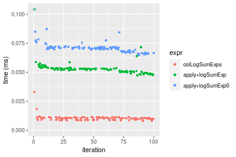
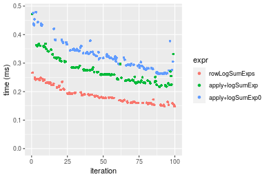
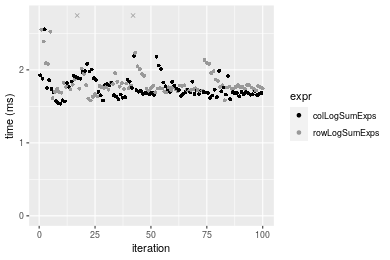
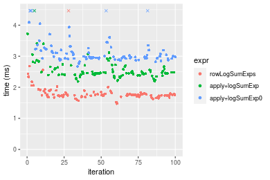

[matrixStats]: Benchmark report

---------------------------------------


# colLogSumExps() and rowLogSumExps() benchmarks

This report benchmark the performance of colLogSumExps() and rowLogSumExps() against alternative methods.

## Alternative methods

* apply() + matrixStats::logSumExp()
* apply() + logSumExp0()

where

```r
> logSumExp0 <- function(lx, ...) {
+     iMax <- which.max(lx)
+     log1p(sum(exp(lx[-iMax] - lx[iMax]))) + lx[iMax]
+ }
```


## Data
```r
> rmatrix <- function(nrow, ncol, mode = c("logical", "double", "integer", "index"), range = c(-100, 
+     +100), na_prob = 0) {
+     mode <- match.arg(mode)
+     n <- nrow * ncol
+     if (mode == "logical") {
+         x <- sample(c(FALSE, TRUE), size = n, replace = TRUE)
+     }     else if (mode == "index") {
+         x <- seq_len(n)
+         mode <- "integer"
+     }     else {
+         x <- runif(n, min = range[1], max = range[2])
+     }
+     storage.mode(x) <- mode
+     if (na_prob > 0) 
+         x[sample(n, size = na_prob * n)] <- NA
+     dim(x) <- c(nrow, ncol)
+     x
+ }
> rmatrices <- function(scale = 10, seed = 1, ...) {
+     set.seed(seed)
+     data <- list()
+     data[[1]] <- rmatrix(nrow = scale * 1, ncol = scale * 1, ...)
+     data[[2]] <- rmatrix(nrow = scale * 10, ncol = scale * 10, ...)
+     data[[3]] <- rmatrix(nrow = scale * 100, ncol = scale * 1, ...)
+     data[[4]] <- t(data[[3]])
+     data[[5]] <- rmatrix(nrow = scale * 10, ncol = scale * 100, ...)
+     data[[6]] <- t(data[[5]])
+     names(data) <- sapply(data, FUN = function(x) paste(dim(x), collapse = "x"))
+     data
+ }
> data <- rmatrices(mode = "double")
```

## Results

### 10x10 matrix


```r
> X <- data[["10x10"]]
> gc()
           used  (Mb) gc trigger  (Mb) max used  (Mb)
Ncells  5242264 280.0    7916910 422.9  7916910 422.9
Vcells 10188779  77.8   33191153 253.3 53339345 407.0
> colStats <- microbenchmark(colLogSumExps = colLogSumExps(X, na.rm = FALSE), `apply+logSumExp` = apply(X, 
+     MARGIN = 2L, FUN = logSumExp, na.rm = FALSE), `apply+logSumExp0` = apply(X, MARGIN = 2L, FUN = logSumExp0, 
+     na.rm = FALSE), unit = "ms")
> X <- t(X)
> gc()
           used  (Mb) gc trigger  (Mb) max used  (Mb)
Ncells  5228192 279.3    7916910 422.9  7916910 422.9
Vcells 10142210  77.4   33191153 253.3 53339345 407.0
> rowStats <- microbenchmark(rowLogSumExps = rowLogSumExps(X, na.rm = FALSE), `apply+logSumExp` = apply(X, 
+     MARGIN = 1L, FUN = logSumExp, na.rm = FALSE), `apply+logSumExp0` = apply(X, MARGIN = 1L, FUN = logSumExp0, 
+     na.rm = FALSE), unit = "ms")
```

_Table: Benchmarking of colLogSumExps(), apply+logSumExp() and apply+logSumExp0() on 10x10 data. The top panel shows times in milliseconds and the bottom panel shows relative times._


|   |expr             |      min|        lq|      mean|    median|        uq|      max|
|:--|:----------------|--------:|---------:|---------:|---------:|---------:|--------:|
|1  |colLogSumExps    | 0.008133| 0.0090895| 0.0104243| 0.0104435| 0.0109565| 0.032976|
|2  |apply+logSumExp  | 0.047248| 0.0507385| 0.0535950| 0.0527455| 0.0533990| 0.155811|
|3  |apply+logSumExp0 | 0.064913| 0.0685595| 0.0716377| 0.0705830| 0.0714225| 0.174637|


|   |expr             |      min|       lq|     mean|   median|       uq|      max|
|:--|:----------------|--------:|--------:|--------:|--------:|--------:|--------:|
|1  |colLogSumExps    | 1.000000| 1.000000| 1.000000| 1.000000| 1.000000| 1.000000|
|2  |apply+logSumExp  | 5.809418| 5.582100| 5.141343| 5.050558| 4.873728| 4.724982|
|3  |apply+logSumExp0 | 7.981434| 7.542714| 6.872169| 6.758558| 6.518733| 5.295882|

_Table: Benchmarking of rowLogSumExps(), apply+logSumExp() and apply+logSumExp0() on 10x10 data (transposed). The top panel shows times in milliseconds and the bottom panel shows relative times._


|   |expr             |      min|        lq|      mean|    median|        uq|      max|
|:--|:----------------|--------:|---------:|---------:|---------:|---------:|--------:|
|1  |rowLogSumExps    | 0.007400| 0.0081525| 0.0094867| 0.0093865| 0.0099785| 0.028806|
|2  |apply+logSumExp  | 0.047769| 0.0521430| 0.0536802| 0.0528420| 0.0533980| 0.085639|
|3  |apply+logSumExp0 | 0.065200| 0.0696110| 0.0724195| 0.0713380| 0.0721935| 0.155864|


|   |expr             |      min|       lq|     mean|   median|       uq|      max|
|:--|:----------------|--------:|--------:|--------:|--------:|--------:|--------:|
|1  |rowLogSumExps    | 1.000000| 1.000000| 1.000000| 1.000000| 1.000000| 1.000000|
|2  |apply+logSumExp  | 6.455270| 6.395952| 5.658454| 5.629574| 5.351305| 2.972957|
|3  |apply+logSumExp0 | 8.810811| 8.538608| 7.633780| 7.600064| 7.234905| 5.410817|

_Figure: Benchmarking of colLogSumExps(), apply+logSumExp() and apply+logSumExp0() on 10x10 data  as well as rowLogSumExps(), apply+logSumExp() and apply+logSumExp0() on the same data transposed.  Outliers are displayed as crosses.  Times are in milliseconds._





_Table: Benchmarking of colLogSumExps() and rowLogSumExps() on 10x10 data (original and transposed).  The top panel shows times in milliseconds and the bottom panel shows relative times._


|   |expr          |   min|     lq|     mean|  median|      uq|    max|
|:--|:-------------|-----:|------:|--------:|-------:|-------:|------:|
|2  |rowLogSumExps | 7.400| 8.1525|  9.48672|  9.3865|  9.9785| 28.806|
|1  |colLogSumExps | 8.133| 9.0895| 10.42432| 10.4435| 10.9565| 32.976|


|   |expr          |      min|       lq|     mean|   median|       uq|      max|
|:--|:-------------|--------:|--------:|--------:|--------:|--------:|--------:|
|2  |rowLogSumExps | 1.000000| 1.000000| 1.000000| 1.000000| 1.000000| 1.000000|
|1  |colLogSumExps | 1.099054| 1.114934| 1.098833| 1.112608| 1.098011| 1.144761|

_Figure: Benchmarking of colLogSumExps() and rowLogSumExps() on 10x10 data (original and transposed).  Outliers are displayed as crosses. Times are in milliseconds._


### 100x100 matrix


```r
> X <- data[["100x100"]]
> gc()
          used  (Mb) gc trigger  (Mb) max used  (Mb)
Ncells 5226752 279.2    7916910 422.9  7916910 422.9
Vcells 9758795  74.5   33191153 253.3 53339345 407.0
> colStats <- microbenchmark(colLogSumExps = colLogSumExps(X, na.rm = FALSE), `apply+logSumExp` = apply(X, 
+     MARGIN = 2L, FUN = logSumExp, na.rm = FALSE), `apply+logSumExp0` = apply(X, MARGIN = 2L, FUN = logSumExp0, 
+     na.rm = FALSE), unit = "ms")
> X <- t(X)
> gc()
          used  (Mb) gc trigger  (Mb) max used  (Mb)
Ncells 5226746 279.2    7916910 422.9  7916910 422.9
Vcells 9768838  74.6   33191153 253.3 53339345 407.0
> rowStats <- microbenchmark(rowLogSumExps = rowLogSumExps(X, na.rm = FALSE), `apply+logSumExp` = apply(X, 
+     MARGIN = 1L, FUN = logSumExp, na.rm = FALSE), `apply+logSumExp0` = apply(X, MARGIN = 1L, FUN = logSumExp0, 
+     na.rm = FALSE), unit = "ms")
```

_Table: Benchmarking of colLogSumExps(), apply+logSumExp() and apply+logSumExp0() on 100x100 data. The top panel shows times in milliseconds and the bottom panel shows relative times._


|   |expr             |      min|        lq|      mean|    median|        uq|      max|
|:--|:----------------|--------:|---------:|---------:|---------:|---------:|--------:|
|1  |colLogSumExps    | 0.147286| 0.1533570| 0.1748630| 0.1615145| 0.1881190| 0.318889|
|2  |apply+logSumExp  | 0.374943| 0.3857225| 0.4386438| 0.4127325| 0.4663460| 0.766932|
|3  |apply+logSumExp0 | 0.532599| 0.5451135| 0.6201473| 0.5709585| 0.6800395| 1.043200|


|   |expr             |      min|       lq|     mean|   median|       uq|      max|
|:--|:----------------|--------:|--------:|--------:|--------:|--------:|--------:|
|1  |colLogSumExps    | 1.000000| 1.000000| 1.000000| 1.000000| 1.000000| 1.000000|
|2  |apply+logSumExp  | 2.545680| 2.515193| 2.508500| 2.555390| 2.478995| 2.405012|
|3  |apply+logSumExp0 | 3.616087| 3.554539| 3.546476| 3.535029| 3.614943| 3.271358|

_Table: Benchmarking of rowLogSumExps(), apply+logSumExp() and apply+logSumExp0() on 100x100 data (transposed). The top panel shows times in milliseconds and the bottom panel shows relative times._


|   |expr             |      min|        lq|      mean|    median|       uq|      max|
|:--|:----------------|--------:|---------:|---------:|---------:|--------:|--------:|
|1  |rowLogSumExps    | 0.151541| 0.1609810| 0.1803268| 0.1699135| 0.192550| 0.266127|
|2  |apply+logSumExp  | 0.375183| 0.3909565| 0.4443629| 0.4233270| 0.470347| 0.679589|
|3  |apply+logSumExp0 | 0.534134| 0.5546200| 0.6243859| 0.5808370| 0.671827| 1.073041|


|   |expr             |      min|       lq|     mean|   median|       uq|      max|
|:--|:----------------|--------:|--------:|--------:|--------:|--------:|--------:|
|1  |rowLogSumExps    | 1.000000| 1.000000| 1.000000| 1.000000| 1.000000| 1.000000|
|2  |apply+logSumExp  | 2.475785| 2.428588| 2.464208| 2.491427| 2.442727| 2.553627|
|3  |apply+logSumExp0 | 3.524683| 3.445251| 3.462523| 3.418428| 3.489104| 4.032064|

_Figure: Benchmarking of colLogSumExps(), apply+logSumExp() and apply+logSumExp0() on 100x100 data  as well as rowLogSumExps(), apply+logSumExp() and apply+logSumExp0() on the same data transposed.  Outliers are displayed as crosses.  Times are in milliseconds._


_Table: Benchmarking of colLogSumExps() and rowLogSumExps() on 100x100 data (original and transposed).  The top panel shows times in milliseconds and the bottom panel shows relative times._


|   |expr          |     min|      lq|     mean|   median|      uq|     max|
|:--|:-------------|-------:|-------:|--------:|--------:|-------:|-------:|
|1  |colLogSumExps | 147.286| 153.357| 174.8630| 161.5145| 188.119| 318.889|
|2  |rowLogSumExps | 151.541| 160.981| 180.3268| 169.9135| 192.550| 266.127|


|   |expr          |      min|       lq|     mean|   median|       uq|       max|
|:--|:-------------|--------:|--------:|--------:|--------:|--------:|---------:|
|1  |colLogSumExps | 1.000000| 1.000000| 1.000000| 1.000000| 1.000000| 1.0000000|
|2  |rowLogSumExps | 1.028889| 1.049714| 1.031247| 1.052002| 1.023554| 0.8345443|

_Figure: Benchmarking of colLogSumExps() and rowLogSumExps() on 100x100 data (original and transposed).  Outliers are displayed as crosses. Times are in milliseconds._


### 1000x10 matrix


```r
> X <- data[["1000x10"]]
> gc()
          used  (Mb) gc trigger  (Mb) max used  (Mb)
Ncells 5227507 279.2    7916910 422.9  7916910 422.9
Vcells 9762590  74.5   33191153 253.3 53339345 407.0
> colStats <- microbenchmark(colLogSumExps = colLogSumExps(X, na.rm = FALSE), `apply+logSumExp` = apply(X, 
+     MARGIN = 2L, FUN = logSumExp, na.rm = FALSE), `apply+logSumExp0` = apply(X, MARGIN = 2L, FUN = logSumExp0, 
+     na.rm = FALSE), unit = "ms")
> X <- t(X)
> gc()
          used  (Mb) gc trigger  (Mb) max used  (Mb)
Ncells 5227495 279.2    7916910 422.9  7916910 422.9
Vcells 9772623  74.6   33191153 253.3 53339345 407.0
> rowStats <- microbenchmark(rowLogSumExps = rowLogSumExps(X, na.rm = FALSE), `apply+logSumExp` = apply(X, 
+     MARGIN = 1L, FUN = logSumExp, na.rm = FALSE), `apply+logSumExp0` = apply(X, MARGIN = 1L, FUN = logSumExp0, 
+     na.rm = FALSE), unit = "ms")
```

_Table: Benchmarking of colLogSumExps(), apply+logSumExp() and apply+logSumExp0() on 1000x10 data. The top panel shows times in milliseconds and the bottom panel shows relative times._


|   |expr             |      min|        lq|      mean|    median|        uq|      max|
|:--|:----------------|--------:|---------:|---------:|---------:|---------:|--------:|
|1  |colLogSumExps    | 0.148651| 0.1647045| 0.1906819| 0.1847195| 0.2085615| 0.350757|
|2  |apply+logSumExp  | 0.227003| 0.2507095| 0.2880074| 0.2765740| 0.3024020| 0.486887|
|3  |apply+logSumExp0 | 0.269485| 0.3098875| 0.3494949| 0.3436425| 0.3780010| 0.480715|


|   |expr             |      min|       lq|     mean|   median|       uq|      max|
|:--|:----------------|--------:|--------:|--------:|--------:|--------:|--------:|
|1  |colLogSumExps    | 1.000000| 1.000000| 1.000000| 1.000000| 1.000000| 1.000000|
|2  |apply+logSumExp  | 1.527087| 1.522178| 1.510408| 1.497265| 1.449942| 1.388103|
|3  |apply+logSumExp0 | 1.812870| 1.881476| 1.832869| 1.860348| 1.812420| 1.370507|

_Table: Benchmarking of rowLogSumExps(), apply+logSumExp() and apply+logSumExp0() on 1000x10 data (transposed). The top panel shows times in milliseconds and the bottom panel shows relative times._


|   |expr             |      min|        lq|      mean|    median|        uq|      max|
|:--|:----------------|--------:|---------:|---------:|---------:|---------:|--------:|
|1  |rowLogSumExps    | 0.148117| 0.1623880| 0.1906410| 0.1862295| 0.2183835| 0.266496|
|2  |apply+logSumExp  | 0.216779| 0.2381875| 0.2746292| 0.2602685| 0.3046930| 0.471987|
|3  |apply+logSumExp0 | 0.261497| 0.2902070| 0.3273246| 0.3186795| 0.3461150| 0.478835|


|   |expr             |      min|       lq|     mean|   median|       uq|      max|
|:--|:----------------|--------:|--------:|--------:|--------:|--------:|--------:|
|1  |rowLogSumExps    | 1.000000| 1.000000| 1.000000| 1.000000| 1.000000| 1.000000|
|2  |apply+logSumExp  | 1.463566| 1.466780| 1.440557| 1.397569| 1.395220| 1.771085|
|3  |apply+logSumExp0 | 1.765476| 1.787121| 1.716968| 1.711219| 1.584895| 1.796781|

_Figure: Benchmarking of colLogSumExps(), apply+logSumExp() and apply+logSumExp0() on 1000x10 data  as well as rowLogSumExps(), apply+logSumExp() and apply+logSumExp0() on the same data transposed.  Outliers are displayed as crosses.  Times are in milliseconds._



_Table: Benchmarking of colLogSumExps() and rowLogSumExps() on 1000x10 data (original and transposed).  The top panel shows times in milliseconds and the bottom panel shows relative times._


|   |expr          |     min|       lq|     mean|   median|       uq|     max|
|:--|:-------------|-------:|--------:|--------:|--------:|--------:|-------:|
|1  |colLogSumExps | 148.651| 164.7045| 190.6819| 184.7195| 208.5615| 350.757|
|2  |rowLogSumExps | 148.117| 162.3880| 190.6410| 186.2295| 218.3835| 266.496|


|   |expr          |       min|        lq|      mean|   median|       uq|       max|
|:--|:-------------|---------:|---------:|---------:|--------:|--------:|---------:|
|1  |colLogSumExps | 1.0000000| 1.0000000| 1.0000000| 1.000000| 1.000000| 1.0000000|
|2  |rowLogSumExps | 0.9964077| 0.9859354| 0.9997857| 1.008175| 1.047094| 0.7597739|

_Figure: Benchmarking of colLogSumExps() and rowLogSumExps() on 1000x10 data (original and transposed).  Outliers are displayed as crosses. Times are in milliseconds._


### 10x1000 matrix


```r
> X <- data[["10x1000"]]
> gc()
          used  (Mb) gc trigger  (Mb) max used  (Mb)
Ncells 5227714 279.2    7916910 422.9  7916910 422.9
Vcells 9763394  74.5   33191153 253.3 53339345 407.0
> colStats <- microbenchmark(colLogSumExps = colLogSumExps(X, na.rm = FALSE), `apply+logSumExp` = apply(X, 
+     MARGIN = 2L, FUN = logSumExp, na.rm = FALSE), `apply+logSumExp0` = apply(X, MARGIN = 2L, FUN = logSumExp0, 
+     na.rm = FALSE), unit = "ms")
> X <- t(X)
> gc()
          used  (Mb) gc trigger  (Mb) max used  (Mb)
Ncells 5227708 279.2    7916910 422.9  7916910 422.9
Vcells 9773437  74.6   33191153 253.3 53339345 407.0
> rowStats <- microbenchmark(rowLogSumExps = rowLogSumExps(X, na.rm = FALSE), `apply+logSumExp` = apply(X, 
+     MARGIN = 1L, FUN = logSumExp, na.rm = FALSE), `apply+logSumExp0` = apply(X, MARGIN = 1L, FUN = logSumExp0, 
+     na.rm = FALSE), unit = "ms")
```

_Table: Benchmarking of colLogSumExps(), apply+logSumExp() and apply+logSumExp0() on 10x1000 data. The top panel shows times in milliseconds and the bottom panel shows relative times._


|   |expr             |      min|       lq|      mean|   median|        uq|       max|
|:--|:----------------|--------:|--------:|---------:|--------:|---------:|---------:|
|1  |colLogSumExps    | 0.182868| 0.198522| 0.2186889| 0.206460| 0.2248295|  0.425178|
|2  |apply+logSumExp  | 1.811853| 1.978557| 2.1914504| 2.065537| 2.1991665|  4.675994|
|3  |apply+logSumExp0 | 3.031848| 3.310961| 3.8202764| 3.474716| 3.6859950| 12.717593|


|   |expr             |       min|        lq|     mean|   median|        uq|      max|
|:--|:----------------|---------:|---------:|--------:|--------:|---------:|--------:|
|1  |colLogSumExps    |  1.000000|  1.000000|  1.00000|  1.00000|  1.000000|  1.00000|
|2  |apply+logSumExp  |  9.907983|  9.966439| 10.02086| 10.00454|  9.781486| 10.99773|
|3  |apply+logSumExp0 | 16.579434| 16.678058| 17.46900| 16.82997| 16.394624| 29.91122|

_Table: Benchmarking of rowLogSumExps(), apply+logSumExp() and apply+logSumExp0() on 10x1000 data (transposed). The top panel shows times in milliseconds and the bottom panel shows relative times._


|   |expr             |      min|        lq|      mean|    median|        uq|      max|
|:--|:----------------|--------:|---------:|---------:|---------:|---------:|--------:|
|1  |rowLogSumExps    | 0.177854| 0.2003505| 0.2230796| 0.2116575| 0.2355875| 0.378667|
|2  |apply+logSumExp  | 1.798603| 1.9887350| 2.1438652| 2.0944100| 2.2260755| 3.235006|
|3  |apply+logSumExp0 | 3.021550| 3.3278055| 3.5985985| 3.4443350| 3.6162465| 8.963276|


|   |expr             |      min|        lq|      mean|    median|        uq|       max|
|:--|:----------------|--------:|---------:|---------:|---------:|---------:|---------:|
|1  |rowLogSumExps    |  1.00000|  1.000000|  1.000000|  1.000000|  1.000000|  1.000000|
|2  |apply+logSumExp  | 10.11281|  9.926279|  9.610316|  9.895279|  9.449039|  8.543142|
|3  |apply+logSumExp0 | 16.98893| 16.609919| 16.131456| 16.273154| 15.349908| 23.670602|

_Figure: Benchmarking of colLogSumExps(), apply+logSumExp() and apply+logSumExp0() on 10x1000 data  as well as rowLogSumExps(), apply+logSumExp() and apply+logSumExp0() on the same data transposed.  Outliers are displayed as crosses.  Times are in milliseconds._


_Table: Benchmarking of colLogSumExps() and rowLogSumExps() on 10x1000 data (original and transposed).  The top panel shows times in milliseconds and the bottom panel shows relative times._


|   |expr          |     min|       lq|     mean|   median|       uq|     max|
|:--|:-------------|-------:|--------:|--------:|--------:|--------:|-------:|
|1  |colLogSumExps | 182.868| 198.5220| 218.6889| 206.4600| 224.8295| 425.178|
|2  |rowLogSumExps | 177.854| 200.3505| 223.0796| 211.6575| 235.5875| 378.667|


|   |expr          |       min|       lq|     mean|   median|      uq|       max|
|:--|:-------------|---------:|--------:|--------:|--------:|-------:|---------:|
|1  |colLogSumExps | 1.0000000| 1.000000| 1.000000| 1.000000| 1.00000| 1.0000000|
|2  |rowLogSumExps | 0.9725813| 1.009211| 1.020077| 1.025174| 1.04785| 0.8906082|

_Figure: Benchmarking of colLogSumExps() and rowLogSumExps() on 10x1000 data (original and transposed).  Outliers are displayed as crosses. Times are in milliseconds._


### 100x1000 matrix


```r
> X <- data[["100x1000"]]
> gc()
          used  (Mb) gc trigger  (Mb) max used  (Mb)
Ncells 5227930 279.3    7916910 422.9  7916910 422.9
Vcells 9763989  74.5   33191153 253.3 53339345 407.0
> colStats <- microbenchmark(colLogSumExps = colLogSumExps(X, na.rm = FALSE), `apply+logSumExp` = apply(X, 
+     MARGIN = 2L, FUN = logSumExp, na.rm = FALSE), `apply+logSumExp0` = apply(X, MARGIN = 2L, FUN = logSumExp0, 
+     na.rm = FALSE), unit = "ms")
> X <- t(X)
> gc()
          used  (Mb) gc trigger  (Mb) max used  (Mb)
Ncells 5227912 279.3    7916910 422.9  7916910 422.9
Vcells 9864012  75.3   33191153 253.3 53339345 407.0
> rowStats <- microbenchmark(rowLogSumExps = rowLogSumExps(X, na.rm = FALSE), `apply+logSumExp` = apply(X, 
+     MARGIN = 1L, FUN = logSumExp, na.rm = FALSE), `apply+logSumExp0` = apply(X, MARGIN = 1L, FUN = logSumExp0, 
+     na.rm = FALSE), unit = "ms")
```

_Table: Benchmarking of colLogSumExps(), apply+logSumExp() and apply+logSumExp0() on 100x1000 data. The top panel shows times in milliseconds and the bottom panel shows relative times._


|   |expr             |      min|       lq|     mean|   median|       uq|       max|
|:--|:----------------|--------:|--------:|--------:|--------:|--------:|---------:|
|1  |colLogSumExps    | 1.537931| 1.665246| 1.759681| 1.704182| 1.837969|  2.555003|
|2  |apply+logSumExp  | 3.701825| 4.101192| 4.849556| 4.249950| 4.569222| 26.022281|
|3  |apply+logSumExp0 | 5.369943| 5.892519| 6.522110| 6.149206| 6.676341| 28.776985|


|   |expr             |      min|       lq|     mean|   median|       uq|      max|
|:--|:----------------|--------:|--------:|--------:|--------:|--------:|--------:|
|1  |colLogSumExps    | 1.000000| 1.000000| 1.000000| 1.000000| 1.000000|  1.00000|
|2  |apply+logSumExp  | 2.407016| 2.462814| 2.755929| 2.493836| 2.486017| 10.18483|
|3  |apply+logSumExp0 | 3.491667| 3.538527| 3.706415| 3.608304| 3.632455| 11.26299|

_Table: Benchmarking of rowLogSumExps(), apply+logSumExp() and apply+logSumExp0() on 100x1000 data (transposed). The top panel shows times in milliseconds and the bottom panel shows relative times._


|   |expr             |      min|       lq|     mean|   median|       uq|       max|
|:--|:----------------|--------:|--------:|--------:|--------:|--------:|---------:|
|1  |rowLogSumExps    | 1.580767| 1.732992| 2.018422| 1.765429| 1.823624| 21.395092|
|2  |apply+logSumExp  | 3.719148| 4.072647| 4.282412| 4.166019| 4.295800|  5.740941|
|3  |apply+logSumExp0 | 5.225207| 5.850327| 6.585593| 5.939724| 6.127233| 29.342143|


|   |expr             |      min|       lq|     mean|   median|       uq|       max|
|:--|:----------------|--------:|--------:|--------:|--------:|--------:|---------:|
|1  |rowLogSumExps    | 1.000000| 1.000000| 1.000000| 1.000000| 1.000000| 1.0000000|
|2  |apply+logSumExp  | 2.352749| 2.350067| 2.121663| 2.359777| 2.355639| 0.2683298|
|3  |apply+logSumExp0 | 3.305488| 3.375853| 3.262744| 3.364465| 3.359921| 1.3714427|

_Figure: Benchmarking of colLogSumExps(), apply+logSumExp() and apply+logSumExp0() on 100x1000 data  as well as rowLogSumExps(), apply+logSumExp() and apply+logSumExp0() on the same data transposed.  Outliers are displayed as crosses.  Times are in milliseconds._


_Table: Benchmarking of colLogSumExps() and rowLogSumExps() on 100x1000 data (original and transposed).  The top panel shows times in milliseconds and the bottom panel shows relative times._


|   |expr          |      min|       lq|     mean|   median|       uq|       max|
|:--|:-------------|--------:|--------:|--------:|--------:|--------:|---------:|
|1  |colLogSumExps | 1.537931| 1.665246| 1.759681| 1.704182| 1.837969|  2.555003|
|2  |rowLogSumExps | 1.580767| 1.732992| 2.018422| 1.765429| 1.823624| 21.395092|


|   |expr          |      min|       lq|     mean|   median|        uq|      max|
|:--|:-------------|--------:|--------:|--------:|--------:|---------:|--------:|
|1  |colLogSumExps | 1.000000| 1.000000| 1.000000| 1.000000| 1.0000000| 1.000000|
|2  |rowLogSumExps | 1.027853| 1.040682| 1.147038| 1.035939| 0.9921952| 8.373803|

_Figure: Benchmarking of colLogSumExps() and rowLogSumExps() on 100x1000 data (original and transposed).  Outliers are displayed as crosses. Times are in milliseconds._




### 1000x100 matrix


```r
> X <- data[["1000x100"]]
> gc()
          used  (Mb) gc trigger  (Mb) max used  (Mb)
Ncells 5228130 279.3    7916910 422.9  7916910 422.9
Vcells 9764643  74.5   33191153 253.3 53339345 407.0
> colStats <- microbenchmark(colLogSumExps = colLogSumExps(X, na.rm = FALSE), `apply+logSumExp` = apply(X, 
+     MARGIN = 2L, FUN = logSumExp, na.rm = FALSE), `apply+logSumExp0` = apply(X, MARGIN = 2L, FUN = logSumExp0, 
+     na.rm = FALSE), unit = "ms")
> X <- t(X)
> gc()
          used  (Mb) gc trigger  (Mb) max used  (Mb)
Ncells 5228118 279.3    7916910 422.9  7916910 422.9
Vcells 9864676  75.3   33191153 253.3 53339345 407.0
> rowStats <- microbenchmark(rowLogSumExps = rowLogSumExps(X, na.rm = FALSE), `apply+logSumExp` = apply(X, 
+     MARGIN = 1L, FUN = logSumExp, na.rm = FALSE), `apply+logSumExp0` = apply(X, MARGIN = 1L, FUN = logSumExp0, 
+     na.rm = FALSE), unit = "ms")
```

_Table: Benchmarking of colLogSumExps(), apply+logSumExp() and apply+logSumExp0() on 1000x100 data. The top panel shows times in milliseconds and the bottom panel shows relative times._


|   |expr             |      min|       lq|     mean|   median|       uq|      max|
|:--|:----------------|--------:|--------:|--------:|--------:|--------:|--------:|
|1  |colLogSumExps    | 1.461910| 1.665638| 1.874952| 1.758566| 1.838413|  9.37362|
|2  |apply+logSumExp  | 2.183029| 2.406405| 2.725101| 2.592052| 2.748403| 10.75560|
|3  |apply+logSumExp0 | 2.546085| 2.931929| 3.311470| 3.118014| 3.495567| 10.58627|


|   |expr             |      min|       lq|     mean|   median|       uq|      max|
|:--|:----------------|--------:|--------:|--------:|--------:|--------:|--------:|
|1  |colLogSumExps    | 1.000000| 1.000000| 1.000000| 1.000000| 1.000000| 1.000000|
|2  |apply+logSumExp  | 1.493272| 1.444735| 1.453425| 1.473958| 1.494986| 1.147433|
|3  |apply+logSumExp0 | 1.741615| 1.760244| 1.766163| 1.773044| 1.901404| 1.129369|

_Table: Benchmarking of rowLogSumExps(), apply+logSumExp() and apply+logSumExp0() on 1000x100 data (transposed). The top panel shows times in milliseconds and the bottom panel shows relative times._


|   |expr             |      min|       lq|     mean|   median|       uq|       max|
|:--|:----------------|--------:|--------:|--------:|--------:|--------:|---------:|
|1  |rowLogSumExps    | 1.475570| 1.718748| 1.871399| 1.757151| 1.810914|  9.543469|
|2  |apply+logSumExp  | 2.189496| 2.400485| 2.563202| 2.460184| 2.625558|  5.026601|
|3  |apply+logSumExp0 | 2.670531| 2.930343| 3.328314| 2.997537| 3.231213| 10.639849|


|   |expr             |      min|       lq|     mean|   median|       uq|       max|
|:--|:----------------|--------:|--------:|--------:|--------:|--------:|---------:|
|1  |rowLogSumExps    | 1.000000| 1.000000| 1.000000| 1.000000| 1.000000| 1.0000000|
|2  |apply+logSumExp  | 1.483831| 1.396648| 1.369671| 1.400098| 1.449852| 0.5267059|
|3  |apply+logSumExp0 | 1.809830| 1.704929| 1.778517| 1.705907| 1.784299| 1.1148828|

_Figure: Benchmarking of colLogSumExps(), apply+logSumExp() and apply+logSumExp0() on 1000x100 data  as well as rowLogSumExps(), apply+logSumExp() and apply+logSumExp0() on the same data transposed.  Outliers are displayed as crosses.  Times are in milliseconds._



_Table: Benchmarking of colLogSumExps() and rowLogSumExps() on 1000x100 data (original and transposed).  The top panel shows times in milliseconds and the bottom panel shows relative times._


|   |expr          |     min|       lq|     mean|   median|       uq|      max|
|:--|:-------------|-------:|--------:|--------:|--------:|--------:|--------:|
|2  |rowLogSumExps | 1.47557| 1.718748| 1.871399| 1.757151| 1.810914| 9.543469|
|1  |colLogSumExps | 1.46191| 1.665638| 1.874952| 1.758566| 1.838413| 9.373620|


|   |expr          |       min|        lq|     mean|   median|       uq|       max|
|:--|:-------------|---------:|---------:|--------:|--------:|--------:|---------:|
|2  |rowLogSumExps | 1.0000000| 1.0000000| 1.000000| 1.000000| 1.000000| 1.0000000|
|1  |colLogSumExps | 0.9907426| 0.9690996| 1.001898| 1.000805| 1.015185| 0.9822026|

_Figure: Benchmarking of colLogSumExps() and rowLogSumExps() on 1000x100 data (original and transposed).  Outliers are displayed as crosses. Times are in milliseconds._


## Appendix

### Session information
```r
R version 4.1.1 Patched (2021-08-10 r80727)
Platform: x86_64-pc-linux-gnu (64-bit)
Running under: Ubuntu 18.04.5 LTS

Matrix products: default
BLAS:   /home/hb/software/R-devel/R-4-1-branch/lib/R/lib/libRblas.so
LAPACK: /home/hb/software/R-devel/R-4-1-branch/lib/R/lib/libRlapack.so

locale:
 [1] LC_CTYPE=en_US.UTF-8       LC_NUMERIC=C              
 [3] LC_TIME=en_US.UTF-8        LC_COLLATE=en_US.UTF-8    
 [5] LC_MONETARY=en_US.UTF-8    LC_MESSAGES=en_US.UTF-8   
 [7] LC_PAPER=en_US.UTF-8       LC_NAME=C                 
 [9] LC_ADDRESS=C               LC_TELEPHONE=C            
[11] LC_MEASUREMENT=en_US.UTF-8 LC_IDENTIFICATION=C       

attached base packages:
[1] stats     graphics  grDevices utils     datasets  methods   base     

other attached packages:
[1] microbenchmark_1.4-7   matrixStats_0.60.0     ggplot2_3.3.5         
[4] knitr_1.33             R.devices_2.17.0       R.utils_2.10.1        
[7] R.oo_1.24.0            R.methodsS3_1.8.1-9001 history_0.0.1-9000    

loaded via a namespace (and not attached):
 [1] Biobase_2.52.0          httr_1.4.2              splines_4.1.1          
 [4] bit64_4.0.5             network_1.17.1          assertthat_0.2.1       
 [7] highr_0.9               stats4_4.1.1            blob_1.2.2             
[10] GenomeInfoDbData_1.2.6  robustbase_0.93-8       pillar_1.6.2           
[13] RSQLite_2.2.8           lattice_0.20-44         glue_1.4.2             
[16] digest_0.6.27           XVector_0.32.0          colorspace_2.0-2       
[19] Matrix_1.3-4            XML_3.99-0.7            pkgconfig_2.0.3        
[22] zlibbioc_1.38.0         genefilter_1.74.0       purrr_0.3.4            
[25] ergm_4.1.2              xtable_1.8-4            scales_1.1.1           
[28] tibble_3.1.4            annotate_1.70.0         KEGGREST_1.32.0        
[31] farver_2.1.0            generics_0.1.0          IRanges_2.26.0         
[34] ellipsis_0.3.2          cachem_1.0.6            withr_2.4.2            
[37] BiocGenerics_0.38.0     mime_0.11               survival_3.2-13        
[40] magrittr_2.0.1          crayon_1.4.1            statnet.common_4.5.0   
[43] memoise_2.0.0           laeken_0.5.1            fansi_0.5.0            
[46] R.cache_0.15.0          MASS_7.3-54             R.rsp_0.44.0           
[49] progressr_0.8.0         tools_4.1.1             lifecycle_1.0.0        
[52] S4Vectors_0.30.0        trust_0.1-8             munsell_0.5.0          
[55] tabby_0.0.1-9001        AnnotationDbi_1.54.1    Biostrings_2.60.2      
[58] compiler_4.1.1          GenomeInfoDb_1.28.1     rlang_0.4.11           
[61] grid_4.1.1              RCurl_1.98-1.4          cwhmisc_6.6            
[64] rstudioapi_0.13         rappdirs_0.3.3          startup_0.15.0         
[67] labeling_0.4.2          bitops_1.0-7            base64enc_0.1-3        
[70] boot_1.3-28             gtable_0.3.0            DBI_1.1.1              
[73] markdown_1.1            R6_2.5.1                lpSolveAPI_5.5.2.0-17.7
[76] rle_0.9.2               dplyr_1.0.7             fastmap_1.1.0          
[79] bit_4.0.4               utf8_1.2.2              parallel_4.1.1         
[82] Rcpp_1.0.7              vctrs_0.3.8             png_0.1-7              
[85] DEoptimR_1.0-9          tidyselect_1.1.1        xfun_0.25              
[88] coda_0.19-4            
```
Total processing time was 17.62 secs.


### Reproducibility
To reproduce this report, do:
```r
html <- matrixStats:::benchmark('colLogSumExps')
```

[RSP]: https://cran.r-project.org/package=R.rsp
[matrixStats]: https://cran.r-project.org/package=matrixStats

[StackOverflow:colMins?]: https://stackoverflow.com/questions/13676878 "Stack Overflow: fastest way to get Min from every column in a matrix?"
[StackOverflow:colSds?]: https://stackoverflow.com/questions/17549762 "Stack Overflow: Is there such 'colsd' in R?"
[StackOverflow:rowProds?]: https://stackoverflow.com/questions/20198801/ "Stack Overflow: Row product of matrix and column sum of matrix"

---------------------------------------
Copyright Henrik Bengtsson. Last updated on 2021-08-25 22:16:45 (+0200 UTC). Powered by [RSP].

<script>
 var link = document.createElement('link');
 link.rel = 'icon';
 link.href = "data:image/png;base64,iVBORw0KGgoAAAANSUhEUgAAACAAAAAgCAMAAABEpIrGAAAA21BMVEUAAAAAAP8AAP8AAP8AAP8AAP8AAP8AAP8AAP8AAP8AAP8AAP8AAP8AAP8AAP8AAP8AAP8AAP8AAP8AAP8AAP8AAP8AAP8AAP8AAP8AAP8AAP8AAP8AAP8AAP8AAP8AAP8AAP8AAP8AAP8AAP8AAP8AAP8AAP8AAP8AAP8AAP8BAf4CAv0DA/wdHeIeHuEfH+AgIN8hId4lJdomJtknJ9g+PsE/P8BAQL9yco10dIt1dYp3d4h4eIeVlWqWlmmXl2iYmGeZmWabm2Tn5xjo6Bfp6Rb39wj4+Af//wA2M9hbAAAASXRSTlMAAQIJCgsMJSYnKD4/QGRlZmhpamtsbautrrCxuru8y8zN5ebn6Pn6+///////////////////////////////////////////LsUNcQAAAS9JREFUOI29k21XgkAQhVcFytdSMqMETU26UVqGmpaiFbL//xc1cAhhwVNf6n5i5z67M2dmYOyfJZUqlVLhkKucG7cgmUZTybDz6g0iDeq51PUr37Ds2cy2/C9NeES5puDjxuUk1xnToZsg8pfA3avHQ3lLIi7iWRrkv/OYtkScxBIMgDee0ALoyxHQBJ68JLCjOtQIMIANF7QG9G9fNnHvisCHBVMKgSJgiz7nE+AoBKrAPA3MgepvgR9TSCasrCKH0eB1wBGBFdCO+nAGjMVGPcQb5bd6mQRegN6+1axOs9nGfYcCtfi4NQosdtH7dB+txFIpXQqN1p9B/asRHToyS0jRgpV7nk4nwcq1BJ+x3Gl/v7S9Wmpp/aGquum7w3ZDyrADFYrl8vHBH+ev9AUASW1dmU4h4wAAAABJRU5ErkJggg=="
 document.getElementsByTagName('head')[0].appendChild(link);
</script>


