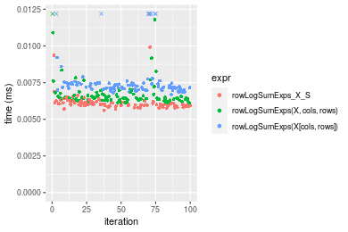
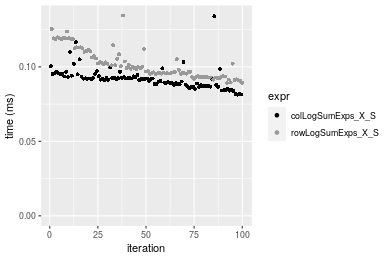
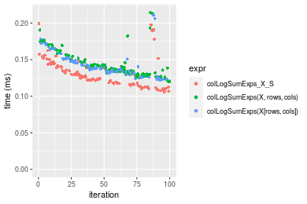
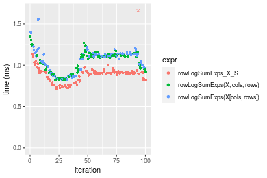

[matrixStats]: Benchmark report

---------------------------------------


# colLogSumExps() and rowLogSumExps() benchmarks on subsetted computation

This report benchmark the performance of colLogSumExps() and rowLogSumExps() on subsetted computation.


## Data
```r
> rmatrix <- function(nrow, ncol, mode = c("logical", "double", "integer", "index"), range = c(-100, 
+     +100), na_prob = 0) {
+     mode <- match.arg(mode)
+     n <- nrow * ncol
+     if (mode == "logical") {
+         x <- sample(c(FALSE, TRUE), size = n, replace = TRUE)
+     }     else if (mode == "index") {
+         x <- seq_len(n)
+         mode <- "integer"
+     }     else {
+         x <- runif(n, min = range[1], max = range[2])
+     }
+     storage.mode(x) <- mode
+     if (na_prob > 0) 
+         x[sample(n, size = na_prob * n)] <- NA
+     dim(x) <- c(nrow, ncol)
+     x
+ }
> rmatrices <- function(scale = 10, seed = 1, ...) {
+     set.seed(seed)
+     data <- list()
+     data[[1]] <- rmatrix(nrow = scale * 1, ncol = scale * 1, ...)
+     data[[2]] <- rmatrix(nrow = scale * 10, ncol = scale * 10, ...)
+     data[[3]] <- rmatrix(nrow = scale * 100, ncol = scale * 1, ...)
+     data[[4]] <- t(data[[3]])
+     data[[5]] <- rmatrix(nrow = scale * 10, ncol = scale * 100, ...)
+     data[[6]] <- t(data[[5]])
+     names(data) <- sapply(data, FUN = function(x) paste(dim(x), collapse = "x"))
+     data
+ }
> data <- rmatrices(mode = "double")
```

## Results

### 10x10 matrix


```r
> X <- data[["10x10"]]
> rows <- sample.int(nrow(X), size = nrow(X) * 0.7)
> cols <- sample.int(ncol(X), size = ncol(X) * 0.7)
> X_S <- X[rows, cols]
> gc()
           used  (Mb) gc trigger  (Mb) max used  (Mb)
Ncells  5238049 279.8    7916910 422.9  7916910 422.9
Vcells 10108692  77.2   33191153 253.3 53339345 407.0
> colStats <- microbenchmark(colLogSumExps_X_S = colLogSumExps(X_S, na.rm = FALSE), `colLogSumExps(X, rows, cols)` = colLogSumExps(X, 
+     rows = rows, cols = cols, na.rm = FALSE), `colLogSumExps(X[rows, cols])` = colLogSumExps(X[rows, 
+     cols], na.rm = FALSE), unit = "ms")
> X <- t(X)
> X_S <- t(X_S)
> gc()
           used  (Mb) gc trigger  (Mb) max used  (Mb)
Ncells  5225312 279.1    7916910 422.9  7916910 422.9
Vcells 10066514  76.9   33191153 253.3 53339345 407.0
> rowStats <- microbenchmark(rowLogSumExps_X_S = rowLogSumExps(X_S, na.rm = FALSE), `rowLogSumExps(X, cols, rows)` = rowLogSumExps(X, 
+     rows = cols, cols = rows, na.rm = FALSE), `rowLogSumExps(X[cols, rows])` = rowLogSumExps(X[cols, 
+     rows], na.rm = FALSE), unit = "ms")
```

_Table: Benchmarking of colLogSumExps_X_S(), colLogSumExps(X, rows, cols)() and colLogSumExps(X[rows, cols])() on 10x10 data. The top panel shows times in milliseconds and the bottom panel shows relative times._


|   |expr                         |      min|        lq|      mean|    median|        uq|      max|
|:--|:----------------------------|--------:|---------:|---------:|---------:|---------:|--------:|
|1  |colLogSumExps_X_S            | 0.007115| 0.0073195| 0.0101712| 0.0074750| 0.0076295| 0.236078|
|2  |colLogSumExps(X, rows, cols) | 0.007420| 0.0077625| 0.0083343| 0.0079385| 0.0081360| 0.021503|
|3  |colLogSumExps(X[rows, cols]) | 0.008110| 0.0087055| 0.0090248| 0.0088625| 0.0090620| 0.018043|


|   |expr                         |      min|       lq|      mean|   median|       uq|       max|
|:--|:----------------------------|--------:|--------:|---------:|--------:|--------:|---------:|
|1  |colLogSumExps_X_S            | 1.000000| 1.000000| 1.0000000| 1.000000| 1.000000| 1.0000000|
|2  |colLogSumExps(X, rows, cols) | 1.042867| 1.060523| 0.8194032| 1.062007| 1.066387| 0.0910843|
|3  |colLogSumExps(X[rows, cols]) | 1.139845| 1.189357| 0.8872928| 1.185619| 1.187758| 0.0764281|

_Table: Benchmarking of rowLogSumExps_X_S(), rowLogSumExps(X, cols, rows)() and rowLogSumExps(X[cols, rows])() on 10x10 data (transposed). The top panel shows times in milliseconds and the bottom panel shows relative times._


|   |expr                         |      min|       lq|      mean|    median|        uq|      max|
|:--|:----------------------------|--------:|--------:|---------:|---------:|---------:|--------:|
|1  |rowLogSumExps_X_S            | 0.005605| 0.005921| 0.0062526| 0.0060105| 0.0061855| 0.019133|
|2  |rowLogSumExps(X, cols, rows) | 0.006106| 0.006320| 0.0084117| 0.0064450| 0.0066540| 0.181226|
|3  |rowLogSumExps(X[cols, rows]) | 0.006688| 0.007062| 0.0079129| 0.0072195| 0.0074580| 0.020867|


|   |expr                         |      min|       lq|     mean|   median|       uq|      max|
|:--|:----------------------------|--------:|--------:|--------:|--------:|--------:|--------:|
|1  |rowLogSumExps_X_S            | 1.000000| 1.000000| 1.000000| 1.000000| 1.000000| 1.000000|
|2  |rowLogSumExps(X, cols, rows) | 1.089384| 1.067387| 1.345314| 1.072290| 1.075742| 9.471907|
|3  |rowLogSumExps(X[cols, rows]) | 1.193220| 1.192704| 1.265544| 1.201148| 1.205723| 1.090629|

_Figure: Benchmarking of colLogSumExps_X_S(), colLogSumExps(X, rows, cols)() and colLogSumExps(X[rows, cols])() on 10x10 data  as well as rowLogSumExps_X_S(), rowLogSumExps(X, cols, rows)() and rowLogSumExps(X[cols, rows])() on the same data transposed.  Outliers are displayed as crosses.  Times are in milliseconds._



_Table: Benchmarking of colLogSumExps_X_S() and rowLogSumExps_X_S() on 10x10 data (original and transposed).  The top panel shows times in milliseconds and the bottom panel shows relative times._


|   |expr              |   min|     lq|     mean| median|     uq|     max|
|:--|:-----------------|-----:|------:|--------:|------:|------:|-------:|
|2  |rowLogSumExps_X_S | 5.605| 5.9210|  6.25260| 6.0105| 6.1855|  19.133|
|1  |colLogSumExps_X_S | 7.115| 7.3195| 10.17122| 7.4750| 7.6295| 236.078|


|   |expr              |      min|       lq|     mean|   median|       uq|      max|
|:--|:-----------------|--------:|--------:|--------:|--------:|--------:|--------:|
|2  |rowLogSumExps_X_S | 1.000000| 1.000000| 1.000000| 1.000000| 1.000000|  1.00000|
|1  |colLogSumExps_X_S | 1.269402| 1.236193| 1.626718| 1.243657| 1.233449| 12.33879|

_Figure: Benchmarking of colLogSumExps_X_S() and rowLogSumExps_X_S() on 10x10 data (original and transposed).  Outliers are displayed as crosses. Times are in milliseconds._


### 100x100 matrix


```r
> X <- data[["100x100"]]
> rows <- sample.int(nrow(X), size = nrow(X) * 0.7)
> cols <- sample.int(ncol(X), size = ncol(X) * 0.7)
> X_S <- X[rows, cols]
> gc()
          used  (Mb) gc trigger  (Mb) max used  (Mb)
Ncells 5224037 279.0    7916910 422.9  7916910 422.9
Vcells 9737400  74.3   33191153 253.3 53339345 407.0
> colStats <- microbenchmark(colLogSumExps_X_S = colLogSumExps(X_S, na.rm = FALSE), `colLogSumExps(X, rows, cols)` = colLogSumExps(X, 
+     rows = rows, cols = cols, na.rm = FALSE), `colLogSumExps(X[rows, cols])` = colLogSumExps(X[rows, 
+     cols], na.rm = FALSE), unit = "ms")
> X <- t(X)
> X_S <- t(X_S)
> gc()
          used  (Mb) gc trigger  (Mb) max used  (Mb)
Ncells 5224031 279.0    7916910 422.9  7916910 422.9
Vcells 9747483  74.4   33191153 253.3 53339345 407.0
> rowStats <- microbenchmark(rowLogSumExps_X_S = rowLogSumExps(X_S, na.rm = FALSE), `rowLogSumExps(X, cols, rows)` = rowLogSumExps(X, 
+     rows = cols, cols = rows, na.rm = FALSE), `rowLogSumExps(X[cols, rows])` = rowLogSumExps(X[cols, 
+     rows], na.rm = FALSE), unit = "ms")
```

_Table: Benchmarking of colLogSumExps_X_S(), colLogSumExps(X, rows, cols)() and colLogSumExps(X[rows, cols])() on 100x100 data. The top panel shows times in milliseconds and the bottom panel shows relative times._


|   |expr                         |      min|        lq|      mean|    median|        uq|      max|
|:--|:----------------------------|--------:|---------:|---------:|---------:|---------:|--------:|
|1  |colLogSumExps_X_S            | 0.092659| 0.0982260| 0.1071898| 0.1045055| 0.1167345| 0.137236|
|2  |colLogSumExps(X, rows, cols) | 0.104962| 0.1109100| 0.1214687| 0.1166815| 0.1329395| 0.164765|
|3  |colLogSumExps(X[rows, cols]) | 0.105212| 0.1115215| 0.1222706| 0.1174300| 0.1334405| 0.189864|


|   |expr                         |      min|       lq|     mean|   median|       uq|      max|
|:--|:----------------------------|--------:|--------:|--------:|--------:|--------:|--------:|
|1  |colLogSumExps_X_S            | 1.000000| 1.000000| 1.000000| 1.000000| 1.000000| 1.000000|
|2  |colLogSumExps(X, rows, cols) | 1.132777| 1.129131| 1.133212| 1.116511| 1.138819| 1.200596|
|3  |colLogSumExps(X[rows, cols]) | 1.135475| 1.135356| 1.140693| 1.123673| 1.143111| 1.383485|

_Table: Benchmarking of rowLogSumExps_X_S(), rowLogSumExps(X, cols, rows)() and rowLogSumExps(X[cols, rows])() on 100x100 data (transposed). The top panel shows times in milliseconds and the bottom panel shows relative times._


|   |expr                         |      min|       lq|      mean|    median|        uq|      max|
|:--|:----------------------------|--------:|--------:|---------:|---------:|---------:|--------:|
|1  |rowLogSumExps_X_S            | 0.092408| 0.097453| 0.1067365| 0.1025205| 0.1155995| 0.134108|
|2  |rowLogSumExps(X, cols, rows) | 0.100721| 0.107351| 0.1175832| 0.1146055| 0.1246125| 0.178518|
|3  |rowLogSumExps(X[cols, rows]) | 0.105402| 0.110651| 0.1206870| 0.1169775| 0.1279125| 0.163867|


|   |expr                         |      min|       lq|     mean|   median|       uq|      max|
|:--|:----------------------------|--------:|--------:|--------:|--------:|--------:|--------:|
|1  |rowLogSumExps_X_S            | 1.000000| 1.000000| 1.000000| 1.000000| 1.000000| 1.000000|
|2  |rowLogSumExps(X, cols, rows) | 1.089960| 1.101567| 1.101621| 1.117879| 1.077967| 1.331151|
|3  |rowLogSumExps(X[cols, rows]) | 1.140616| 1.135429| 1.130700| 1.141016| 1.106514| 1.221903|

_Figure: Benchmarking of colLogSumExps_X_S(), colLogSumExps(X, rows, cols)() and colLogSumExps(X[rows, cols])() on 100x100 data  as well as rowLogSumExps_X_S(), rowLogSumExps(X, cols, rows)() and rowLogSumExps(X[cols, rows])() on the same data transposed.  Outliers are displayed as crosses.  Times are in milliseconds._


_Table: Benchmarking of colLogSumExps_X_S() and rowLogSumExps_X_S() on 100x100 data (original and transposed).  The top panel shows times in milliseconds and the bottom panel shows relative times._


|   |expr              |    min|     lq|     mean|   median|       uq|     max|
|:--|:-----------------|------:|------:|--------:|--------:|--------:|-------:|
|2  |rowLogSumExps_X_S | 92.408| 97.453| 106.7365| 102.5205| 115.5995| 134.108|
|1  |colLogSumExps_X_S | 92.659| 98.226| 107.1898| 104.5055| 116.7345| 137.236|


|   |expr              |      min|       lq|     mean|   median|       uq|      max|
|:--|:-----------------|--------:|--------:|--------:|--------:|--------:|--------:|
|2  |rowLogSumExps_X_S | 1.000000| 1.000000| 1.000000| 1.000000| 1.000000| 1.000000|
|1  |colLogSumExps_X_S | 1.002716| 1.007932| 1.004247| 1.019362| 1.009818| 1.023324|

_Figure: Benchmarking of colLogSumExps_X_S() and rowLogSumExps_X_S() on 100x100 data (original and transposed).  Outliers are displayed as crosses. Times are in milliseconds._


### 1000x10 matrix


```r
> X <- data[["1000x10"]]
> rows <- sample.int(nrow(X), size = nrow(X) * 0.7)
> cols <- sample.int(ncol(X), size = ncol(X) * 0.7)
> X_S <- X[rows, cols]
> gc()
          used  (Mb) gc trigger  (Mb) max used  (Mb)
Ncells 5224778 279.1    7916910 422.9  7916910 422.9
Vcells 9741449  74.4   33191153 253.3 53339345 407.0
> colStats <- microbenchmark(colLogSumExps_X_S = colLogSumExps(X_S, na.rm = FALSE), `colLogSumExps(X, rows, cols)` = colLogSumExps(X, 
+     rows = rows, cols = cols, na.rm = FALSE), `colLogSumExps(X[rows, cols])` = colLogSumExps(X[rows, 
+     cols], na.rm = FALSE), unit = "ms")
> X <- t(X)
> X_S <- t(X_S)
> gc()
          used  (Mb) gc trigger  (Mb) max used  (Mb)
Ncells 5224772 279.1    7916910 422.9  7916910 422.9
Vcells 9751532  74.4   33191153 253.3 53339345 407.0
> rowStats <- microbenchmark(rowLogSumExps_X_S = rowLogSumExps(X_S, na.rm = FALSE), `rowLogSumExps(X, cols, rows)` = rowLogSumExps(X, 
+     rows = cols, cols = rows, na.rm = FALSE), `rowLogSumExps(X[cols, rows])` = rowLogSumExps(X[cols, 
+     rows], na.rm = FALSE), unit = "ms")
```

_Table: Benchmarking of colLogSumExps_X_S(), colLogSumExps(X, rows, cols)() and colLogSumExps(X[rows, cols])() on 1000x10 data. The top panel shows times in milliseconds and the bottom panel shows relative times._


|   |expr                         |      min|        lq|      mean|    median|        uq|      max|
|:--|:----------------------------|--------:|---------:|---------:|---------:|---------:|--------:|
|1  |colLogSumExps_X_S            | 0.081337| 0.0878975| 0.0918830| 0.0917245| 0.0936210| 0.134037|
|3  |colLogSumExps(X[rows, cols]) | 0.090477| 0.0974915| 0.1047085| 0.1023490| 0.1074920| 0.166081|
|2  |colLogSumExps(X, rows, cols) | 0.091705| 0.1020535| 0.1065506| 0.1056700| 0.1096165| 0.132534|


|   |expr                         |      min|       lq|     mean|   median|       uq|       max|
|:--|:----------------------------|--------:|--------:|--------:|--------:|--------:|---------:|
|1  |colLogSumExps_X_S            | 1.000000| 1.000000| 1.000000| 1.000000| 1.000000| 1.0000000|
|3  |colLogSumExps(X[rows, cols]) | 1.112372| 1.109150| 1.139585| 1.115831| 1.148161| 1.2390683|
|2  |colLogSumExps(X, rows, cols) | 1.127470| 1.161051| 1.159633| 1.152037| 1.170854| 0.9887867|

_Table: Benchmarking of rowLogSumExps_X_S(), rowLogSumExps(X, cols, rows)() and rowLogSumExps(X[cols, rows])() on 1000x10 data (transposed). The top panel shows times in milliseconds and the bottom panel shows relative times._


|   |expr                         |      min|        lq|      mean|    median|        uq|      max|
|:--|:----------------------------|--------:|---------:|---------:|---------:|---------:|--------:|
|1  |rowLogSumExps_X_S            | 0.089144| 0.0936680| 0.1016918| 0.0985455| 0.1077120| 0.134465|
|2  |rowLogSumExps(X, cols, rows) | 0.095979| 0.1018065| 0.1105511| 0.1076820| 0.1195335| 0.140813|
|3  |rowLogSumExps(X[cols, rows]) | 0.105246| 0.1092500| 0.1196410| 0.1164450| 0.1283870| 0.210126|


|   |expr                         |      min|       lq|     mean|   median|       uq|      max|
|:--|:----------------------------|--------:|--------:|--------:|--------:|--------:|--------:|
|1  |rowLogSumExps_X_S            | 1.000000| 1.000000| 1.000000| 1.000000| 1.000000| 1.000000|
|2  |rowLogSumExps(X, cols, rows) | 1.076674| 1.086887| 1.087119| 1.092713| 1.109751| 1.047209|
|3  |rowLogSumExps(X[cols, rows]) | 1.180629| 1.166354| 1.176506| 1.181637| 1.191947| 1.562682|

_Figure: Benchmarking of colLogSumExps_X_S(), colLogSumExps(X, rows, cols)() and colLogSumExps(X[rows, cols])() on 1000x10 data  as well as rowLogSumExps_X_S(), rowLogSumExps(X, cols, rows)() and rowLogSumExps(X[cols, rows])() on the same data transposed.  Outliers are displayed as crosses.  Times are in milliseconds._


_Table: Benchmarking of colLogSumExps_X_S() and rowLogSumExps_X_S() on 1000x10 data (original and transposed).  The top panel shows times in milliseconds and the bottom panel shows relative times._


|   |expr              |    min|      lq|      mean|  median|      uq|     max|
|:--|:-----------------|------:|-------:|---------:|-------:|-------:|-------:|
|1  |colLogSumExps_X_S | 81.337| 87.8975|  91.88296| 91.7245|  93.621| 134.037|
|2  |rowLogSumExps_X_S | 89.144| 93.6680| 101.69176| 98.5455| 107.712| 134.465|


|   |expr              |      min|      lq|     mean|   median|       uq|      max|
|:--|:-----------------|--------:|-------:|--------:|--------:|--------:|--------:|
|1  |colLogSumExps_X_S | 1.000000| 1.00000| 1.000000| 1.000000| 1.000000| 1.000000|
|2  |rowLogSumExps_X_S | 1.095983| 1.06565| 1.106753| 1.074364| 1.150511| 1.003193|

_Figure: Benchmarking of colLogSumExps_X_S() and rowLogSumExps_X_S() on 1000x10 data (original and transposed).  Outliers are displayed as crosses. Times are in milliseconds._




### 10x1000 matrix


```r
> X <- data[["10x1000"]]
> rows <- sample.int(nrow(X), size = nrow(X) * 0.7)
> cols <- sample.int(ncol(X), size = ncol(X) * 0.7)
> X_S <- X[rows, cols]
> gc()
          used  (Mb) gc trigger  (Mb) max used  (Mb)
Ncells 5224982 279.1    7916910 422.9  7916910 422.9
Vcells 9742375  74.4   33191153 253.3 53339345 407.0
> colStats <- microbenchmark(colLogSumExps_X_S = colLogSumExps(X_S, na.rm = FALSE), `colLogSumExps(X, rows, cols)` = colLogSumExps(X, 
+     rows = rows, cols = cols, na.rm = FALSE), `colLogSumExps(X[rows, cols])` = colLogSumExps(X[rows, 
+     cols], na.rm = FALSE), unit = "ms")
> X <- t(X)
> X_S <- t(X_S)
> gc()
          used  (Mb) gc trigger  (Mb) max used  (Mb)
Ncells 5224976 279.1    7916910 422.9  7916910 422.9
Vcells 9752458  74.5   33191153 253.3 53339345 407.0
> rowStats <- microbenchmark(rowLogSumExps_X_S = rowLogSumExps(X_S, na.rm = FALSE), `rowLogSumExps(X, cols, rows)` = rowLogSumExps(X, 
+     rows = cols, cols = rows, na.rm = FALSE), `rowLogSumExps(X[cols, rows])` = rowLogSumExps(X[cols, 
+     rows], na.rm = FALSE), unit = "ms")
```

_Table: Benchmarking of colLogSumExps_X_S(), colLogSumExps(X, rows, cols)() and colLogSumExps(X[rows, cols])() on 10x1000 data. The top panel shows times in milliseconds and the bottom panel shows relative times._


|   |expr                         |      min|        lq|      mean|    median|        uq|      max|
|:--|:----------------------------|--------:|---------:|---------:|---------:|---------:|--------:|
|1  |colLogSumExps_X_S            | 0.105838| 0.1169940| 0.1325966| 0.1280575| 0.1437870| 0.199453|
|3  |colLogSumExps(X[rows, cols]) | 0.121829| 0.1324750| 0.1430677| 0.1380670| 0.1509265| 0.210831|
|2  |colLogSumExps(X, rows, cols) | 0.119458| 0.1310025| 0.1445732| 0.1394405| 0.1508250| 0.214062|


|   |expr                         |      min|       lq|     mean|   median|       uq|      max|
|:--|:----------------------------|--------:|--------:|--------:|--------:|--------:|--------:|
|1  |colLogSumExps_X_S            | 1.000000| 1.000000| 1.000000| 1.000000| 1.000000| 1.000000|
|3  |colLogSumExps(X[rows, cols]) | 1.151089| 1.132323| 1.078969| 1.078164| 1.049653| 1.057046|
|2  |colLogSumExps(X, rows, cols) | 1.128687| 1.119737| 1.090323| 1.088890| 1.048947| 1.073245|

_Table: Benchmarking of rowLogSumExps_X_S(), rowLogSumExps(X, cols, rows)() and rowLogSumExps(X[cols, rows])() on 10x1000 data (transposed). The top panel shows times in milliseconds and the bottom panel shows relative times._


|   |expr                         |      min|        lq|      mean|    median|        uq|      max|
|:--|:----------------------------|--------:|---------:|---------:|---------:|---------:|--------:|
|1  |rowLogSumExps_X_S            | 0.107426| 0.1172715| 0.1286174| 0.1229725| 0.1376535| 0.169853|
|3  |rowLogSumExps(X[cols, rows]) | 0.116121| 0.1300935| 0.1426984| 0.1354825| 0.1564030| 0.179422|
|2  |rowLogSumExps(X, cols, rows) | 0.119500| 0.1299565| 0.1421029| 0.1384615| 0.1486940| 0.214896|


|   |expr                         |      min|       lq|    mean|   median|       uq|      max|
|:--|:----------------------------|--------:|--------:|-------:|--------:|--------:|--------:|
|1  |rowLogSumExps_X_S            | 1.000000| 1.000000| 1.00000| 1.000000| 1.000000| 1.000000|
|3  |rowLogSumExps(X[cols, rows]) | 1.080939| 1.109336| 1.10948| 1.101730| 1.136208| 1.056337|
|2  |rowLogSumExps(X, cols, rows) | 1.112394| 1.108168| 1.10485| 1.125955| 1.080205| 1.265188|

_Figure: Benchmarking of colLogSumExps_X_S(), colLogSumExps(X, rows, cols)() and colLogSumExps(X[rows, cols])() on 10x1000 data  as well as rowLogSumExps_X_S(), rowLogSumExps(X, cols, rows)() and rowLogSumExps(X[cols, rows])() on the same data transposed.  Outliers are displayed as crosses.  Times are in milliseconds._





_Table: Benchmarking of colLogSumExps_X_S() and rowLogSumExps_X_S() on 10x1000 data (original and transposed).  The top panel shows times in milliseconds and the bottom panel shows relative times._


|   |expr              |     min|       lq|     mean|   median|       uq|     max|
|:--|:-----------------|-------:|--------:|--------:|--------:|--------:|-------:|
|2  |rowLogSumExps_X_S | 107.426| 117.2715| 128.6174| 122.9725| 137.6535| 169.853|
|1  |colLogSumExps_X_S | 105.838| 116.9940| 132.5966| 128.0575| 143.7870| 199.453|


|   |expr              |       min|        lq|     mean|   median|       uq|      max|
|:--|:-----------------|---------:|---------:|--------:|--------:|--------:|--------:|
|2  |rowLogSumExps_X_S | 1.0000000| 1.0000000| 1.000000| 1.000000| 1.000000| 1.000000|
|1  |colLogSumExps_X_S | 0.9852177| 0.9976337| 1.030938| 1.041351| 1.044558| 1.174268|

_Figure: Benchmarking of colLogSumExps_X_S() and rowLogSumExps_X_S() on 10x1000 data (original and transposed).  Outliers are displayed as crosses. Times are in milliseconds._


### 100x1000 matrix


```r
> X <- data[["100x1000"]]
> rows <- sample.int(nrow(X), size = nrow(X) * 0.7)
> cols <- sample.int(ncol(X), size = ncol(X) * 0.7)
> X_S <- X[rows, cols]
> gc()
          used  (Mb) gc trigger  (Mb) max used  (Mb)
Ncells 5225195 279.1    7916910 422.9  7916910 422.9
Vcells 9787108  74.7   33191153 253.3 53339345 407.0
> colStats <- microbenchmark(colLogSumExps_X_S = colLogSumExps(X_S, na.rm = FALSE), `colLogSumExps(X, rows, cols)` = colLogSumExps(X, 
+     rows = rows, cols = cols, na.rm = FALSE), `colLogSumExps(X[rows, cols])` = colLogSumExps(X[rows, 
+     cols], na.rm = FALSE), unit = "ms")
> X <- t(X)
> X_S <- t(X_S)
> gc()
          used  (Mb) gc trigger  (Mb) max used  (Mb)
Ncells 5225189 279.1    7916910 422.9  7916910 422.9
Vcells 9887191  75.5   33191153 253.3 53339345 407.0
> rowStats <- microbenchmark(rowLogSumExps_X_S = rowLogSumExps(X_S, na.rm = FALSE), `rowLogSumExps(X, cols, rows)` = rowLogSumExps(X, 
+     rows = cols, cols = rows, na.rm = FALSE), `rowLogSumExps(X[cols, rows])` = rowLogSumExps(X[cols, 
+     rows], na.rm = FALSE), unit = "ms")
```

_Table: Benchmarking of colLogSumExps_X_S(), colLogSumExps(X, rows, cols)() and colLogSumExps(X[rows, cols])() on 100x1000 data. The top panel shows times in milliseconds and the bottom panel shows relative times._


|   |expr                         |      min|        lq|      mean|   median|       uq|      max|
|:--|:----------------------------|--------:|---------:|---------:|--------:|--------:|--------:|
|1  |colLogSumExps_X_S            | 0.732019| 0.8122615| 0.8815236| 0.908237| 0.931889| 1.290778|
|3  |colLogSumExps(X[rows, cols]) | 0.824849| 0.9041215| 1.1203326| 1.052028| 1.148853| 9.666148|
|2  |colLogSumExps(X, rows, cols) | 0.823153| 0.9286710| 1.0548352| 1.101485| 1.165216| 1.408639|


|   |expr                         |      min|       lq|     mean|   median|       uq|      max|
|:--|:----------------------------|--------:|--------:|--------:|--------:|--------:|--------:|
|1  |colLogSumExps_X_S            | 1.000000| 1.000000| 1.000000| 1.000000| 1.000000| 1.000000|
|3  |colLogSumExps(X[rows, cols]) | 1.126814| 1.113092| 1.270905| 1.158319| 1.232821| 7.488622|
|2  |colLogSumExps(X, rows, cols) | 1.124497| 1.143315| 1.196605| 1.212773| 1.250381| 1.091310|

_Table: Benchmarking of rowLogSumExps_X_S(), rowLogSumExps(X, cols, rows)() and rowLogSumExps(X[cols, rows])() on 100x1000 data (transposed). The top panel shows times in milliseconds and the bottom panel shows relative times._


|   |expr                         |      min|        lq|     mean|    median|        uq|      max|
|:--|:----------------------------|--------:|---------:|--------:|---------:|---------:|--------:|
|1  |rowLogSumExps_X_S            | 0.763864| 0.8275575| 1.010433| 0.9387495| 0.9760135| 9.037269|
|3  |rowLogSumExps(X[cols, rows]) | 0.864047| 0.9813495| 1.105827| 1.1447305| 1.1737865| 1.552095|
|2  |rowLogSumExps(X, cols, rows) | 0.886787| 1.0083610| 1.112867| 1.1510915| 1.1868720| 1.548171|


|   |expr                         |      min|       lq|     mean|   median|       uq|       max|
|:--|:----------------------------|--------:|--------:|--------:|--------:|--------:|---------:|
|1  |rowLogSumExps_X_S            | 1.000000| 1.000000| 1.000000| 1.000000| 1.000000| 1.0000000|
|3  |rowLogSumExps(X[cols, rows]) | 1.131153| 1.185838| 1.094408| 1.219421| 1.202633| 0.1717438|
|2  |rowLogSumExps(X, cols, rows) | 1.160923| 1.218479| 1.101376| 1.226197| 1.216041| 0.1713096|

_Figure: Benchmarking of colLogSumExps_X_S(), colLogSumExps(X, rows, cols)() and colLogSumExps(X[rows, cols])() on 100x1000 data  as well as rowLogSumExps_X_S(), rowLogSumExps(X, cols, rows)() and rowLogSumExps(X[cols, rows])() on the same data transposed.  Outliers are displayed as crosses.  Times are in milliseconds._


_Table: Benchmarking of colLogSumExps_X_S() and rowLogSumExps_X_S() on 100x1000 data (original and transposed).  The top panel shows times in milliseconds and the bottom panel shows relative times._


|   |expr              |     min|       lq|      mean|   median|       uq|      max|
|:--|:-----------------|-------:|--------:|---------:|--------:|--------:|--------:|
|1  |colLogSumExps_X_S | 732.019| 812.2615|  881.5236| 908.2370| 931.8890| 1290.778|
|2  |rowLogSumExps_X_S | 763.864| 827.5575| 1010.4334| 938.7495| 976.0135| 9037.269|


|   |expr              |      min|       lq|     mean|   median|       uq|      max|
|:--|:-----------------|--------:|--------:|--------:|--------:|--------:|--------:|
|1  |colLogSumExps_X_S | 1.000000| 1.000000| 1.000000| 1.000000| 1.000000| 1.000000|
|2  |rowLogSumExps_X_S | 1.043503| 1.018831| 1.146235| 1.033595| 1.047349| 7.001412|

_Figure: Benchmarking of colLogSumExps_X_S() and rowLogSumExps_X_S() on 100x1000 data (original and transposed).  Outliers are displayed as crosses. Times are in milliseconds._


### 1000x100 matrix


```r
> X <- data[["1000x100"]]
> rows <- sample.int(nrow(X), size = nrow(X) * 0.7)
> cols <- sample.int(ncol(X), size = ncol(X) * 0.7)
> X_S <- X[rows, cols]
> gc()
          used  (Mb) gc trigger  (Mb) max used  (Mb)
Ncells 5225405 279.1    7916910 422.9  7916910 422.9
Vcells 9787933  74.7   33191153 253.3 53339345 407.0
> colStats <- microbenchmark(colLogSumExps_X_S = colLogSumExps(X_S, na.rm = FALSE), `colLogSumExps(X, rows, cols)` = colLogSumExps(X, 
+     rows = rows, cols = cols, na.rm = FALSE), `colLogSumExps(X[rows, cols])` = colLogSumExps(X[rows, 
+     cols], na.rm = FALSE), unit = "ms")
> X <- t(X)
> X_S <- t(X_S)
> gc()
          used  (Mb) gc trigger  (Mb) max used  (Mb)
Ncells 5225399 279.1    7916910 422.9  7916910 422.9
Vcells 9888016  75.5   33191153 253.3 53339345 407.0
> rowStats <- microbenchmark(rowLogSumExps_X_S = rowLogSumExps(X_S, na.rm = FALSE), `rowLogSumExps(X, cols, rows)` = rowLogSumExps(X, 
+     rows = cols, cols = rows, na.rm = FALSE), `rowLogSumExps(X[cols, rows])` = rowLogSumExps(X[cols, 
+     rows], na.rm = FALSE), unit = "ms")
```

_Table: Benchmarking of colLogSumExps_X_S(), colLogSumExps(X, rows, cols)() and colLogSumExps(X[rows, cols])() on 1000x100 data. The top panel shows times in milliseconds and the bottom panel shows relative times._


|   |expr                         |      min|        lq|      mean|   median|        uq|      max|
|:--|:----------------------------|--------:|---------:|---------:|--------:|---------:|--------:|
|1  |colLogSumExps_X_S            | 0.678350| 0.8307220| 0.9314281| 0.855903| 0.8693755| 8.881709|
|3  |colLogSumExps(X[rows, cols]) | 0.782717| 0.8763665| 0.9949185| 1.027352| 1.0821845| 1.706902|
|2  |colLogSumExps(X, rows, cols) | 0.810869| 0.9047975| 1.0430200| 1.100774| 1.1264285| 1.288961|


|   |expr                         |      min|       lq|     mean|   median|       uq|       max|
|:--|:----------------------------|--------:|--------:|--------:|--------:|--------:|---------:|
|1  |colLogSumExps_X_S            | 1.000000| 1.000000| 1.000000| 1.000000| 1.000000| 1.0000000|
|3  |colLogSumExps(X[rows, cols]) | 1.153854| 1.054946| 1.068165| 1.200314| 1.244784| 0.1921817|
|2  |colLogSumExps(X, rows, cols) | 1.195355| 1.089170| 1.119807| 1.286097| 1.295675| 0.1451253|

_Table: Benchmarking of rowLogSumExps_X_S(), rowLogSumExps(X, cols, rows)() and rowLogSumExps(X[cols, rows])() on 1000x100 data (transposed). The top panel shows times in milliseconds and the bottom panel shows relative times._


|   |expr                         |      min|        lq|      mean|   median|        uq|      max|
|:--|:----------------------------|--------:|---------:|---------:|--------:|---------:|--------:|
|1  |rowLogSumExps_X_S            | 0.714063| 0.8154905| 0.9628592| 0.903113| 0.9221925| 9.277656|
|2  |rowLogSumExps(X, cols, rows) | 0.824174| 0.9135890| 1.0372638| 1.095503| 1.1237030| 1.350762|
|3  |rowLogSumExps(X[cols, rows]) | 0.827792| 0.9571870| 1.0576103| 1.106101| 1.1349945| 1.556035|


|   |expr                         |      min|       lq|     mean|   median|       uq|       max|
|:--|:----------------------------|--------:|--------:|--------:|--------:|--------:|---------:|
|1  |rowLogSumExps_X_S            | 1.000000| 1.000000| 1.000000| 1.000000| 1.000000| 1.0000000|
|2  |rowLogSumExps(X, cols, rows) | 1.154203| 1.120294| 1.077275| 1.213029| 1.218512| 0.1455930|
|3  |rowLogSumExps(X[cols, rows]) | 1.159270| 1.173756| 1.098406| 1.224765| 1.230757| 0.1677185|

_Figure: Benchmarking of colLogSumExps_X_S(), colLogSumExps(X, rows, cols)() and colLogSumExps(X[rows, cols])() on 1000x100 data  as well as rowLogSumExps_X_S(), rowLogSumExps(X, cols, rows)() and rowLogSumExps(X[cols, rows])() on the same data transposed.  Outliers are displayed as crosses.  Times are in milliseconds._



_Table: Benchmarking of colLogSumExps_X_S() and rowLogSumExps_X_S() on 1000x100 data (original and transposed).  The top panel shows times in milliseconds and the bottom panel shows relative times._


|   |expr              |     min|       lq|     mean|  median|       uq|      max|
|:--|:-----------------|-------:|--------:|--------:|-------:|--------:|--------:|
|1  |colLogSumExps_X_S | 678.350| 830.7220| 931.4281| 855.903| 869.3755| 8881.709|
|2  |rowLogSumExps_X_S | 714.063| 815.4905| 962.8592| 903.113| 922.1925| 9277.656|


|   |expr              |      min|        lq|     mean|   median|       uq|     max|
|:--|:-----------------|--------:|---------:|--------:|--------:|--------:|-------:|
|1  |colLogSumExps_X_S | 1.000000| 1.0000000| 1.000000| 1.000000| 1.000000| 1.00000|
|2  |rowLogSumExps_X_S | 1.052647| 0.9816647| 1.033745| 1.055158| 1.060753| 1.04458|

_Figure: Benchmarking of colLogSumExps_X_S() and rowLogSumExps_X_S() on 1000x100 data (original and transposed).  Outliers are displayed as crosses. Times are in milliseconds._


## Appendix

### Session information
```r
R version 4.1.1 Patched (2021-08-10 r80727)
Platform: x86_64-pc-linux-gnu (64-bit)
Running under: Ubuntu 18.04.5 LTS

Matrix products: default
BLAS:   /home/hb/software/R-devel/R-4-1-branch/lib/R/lib/libRblas.so
LAPACK: /home/hb/software/R-devel/R-4-1-branch/lib/R/lib/libRlapack.so

locale:
 [1] LC_CTYPE=en_US.UTF-8       LC_NUMERIC=C              
 [3] LC_TIME=en_US.UTF-8        LC_COLLATE=en_US.UTF-8    
 [5] LC_MONETARY=en_US.UTF-8    LC_MESSAGES=en_US.UTF-8   
 [7] LC_PAPER=en_US.UTF-8       LC_NAME=C                 
 [9] LC_ADDRESS=C               LC_TELEPHONE=C            
[11] LC_MEASUREMENT=en_US.UTF-8 LC_IDENTIFICATION=C       

attached base packages:
[1] stats     graphics  grDevices utils     datasets  methods   base     

other attached packages:
[1] microbenchmark_1.4-7   matrixStats_0.60.0     ggplot2_3.3.5         
[4] knitr_1.33             R.devices_2.17.0       R.utils_2.10.1        
[7] R.oo_1.24.0            R.methodsS3_1.8.1-9001 history_0.0.1-9000    

loaded via a namespace (and not attached):
 [1] Biobase_2.52.0          httr_1.4.2              splines_4.1.1          
 [4] bit64_4.0.5             network_1.17.1          assertthat_0.2.1       
 [7] highr_0.9               stats4_4.1.1            blob_1.2.2             
[10] GenomeInfoDbData_1.2.6  robustbase_0.93-8       pillar_1.6.2           
[13] RSQLite_2.2.8           lattice_0.20-44         glue_1.4.2             
[16] digest_0.6.27           XVector_0.32.0          colorspace_2.0-2       
[19] Matrix_1.3-4            XML_3.99-0.7            pkgconfig_2.0.3        
[22] zlibbioc_1.38.0         genefilter_1.74.0       purrr_0.3.4            
[25] ergm_4.1.2              xtable_1.8-4            scales_1.1.1           
[28] tibble_3.1.4            annotate_1.70.0         KEGGREST_1.32.0        
[31] farver_2.1.0            generics_0.1.0          IRanges_2.26.0         
[34] ellipsis_0.3.2          cachem_1.0.6            withr_2.4.2            
[37] BiocGenerics_0.38.0     mime_0.11               survival_3.2-13        
[40] magrittr_2.0.1          crayon_1.4.1            statnet.common_4.5.0   
[43] memoise_2.0.0           laeken_0.5.1            fansi_0.5.0            
[46] R.cache_0.15.0          MASS_7.3-54             R.rsp_0.44.0           
[49] progressr_0.8.0         tools_4.1.1             lifecycle_1.0.0        
[52] S4Vectors_0.30.0        trust_0.1-8             munsell_0.5.0          
[55] tabby_0.0.1-9001        AnnotationDbi_1.54.1    Biostrings_2.60.2      
[58] compiler_4.1.1          GenomeInfoDb_1.28.1     rlang_0.4.11           
[61] grid_4.1.1              RCurl_1.98-1.4          cwhmisc_6.6            
[64] rstudioapi_0.13         rappdirs_0.3.3          startup_0.15.0         
[67] labeling_0.4.2          bitops_1.0-7            base64enc_0.1-3        
[70] boot_1.3-28             gtable_0.3.0            DBI_1.1.1              
[73] markdown_1.1            R6_2.5.1                lpSolveAPI_5.5.2.0-17.7
[76] rle_0.9.2               dplyr_1.0.7             fastmap_1.1.0          
[79] bit_4.0.4               utf8_1.2.2              parallel_4.1.1         
[82] Rcpp_1.0.7              vctrs_0.3.8             png_0.1-7              
[85] DEoptimR_1.0-9          tidyselect_1.1.1        xfun_0.25              
[88] coda_0.19-4            
```
Total processing time was 13.05 secs.


### Reproducibility
To reproduce this report, do:
```r
html <- matrixStats:::benchmark('colRowLogSumExps_subset')
```

[RSP]: https://cran.r-project.org/package=R.rsp
[matrixStats]: https://cran.r-project.org/package=matrixStats

[StackOverflow:colMins?]: https://stackoverflow.com/questions/13676878 "Stack Overflow: fastest way to get Min from every column in a matrix?"
[StackOverflow:colSds?]: https://stackoverflow.com/questions/17549762 "Stack Overflow: Is there such 'colsd' in R?"
[StackOverflow:rowProds?]: https://stackoverflow.com/questions/20198801/ "Stack Overflow: Row product of matrix and column sum of matrix"

---------------------------------------
Copyright Dongcan Jiang. Last updated on 2021-08-25 22:16:26 (+0200 UTC). Powered by [RSP].

<script>
 var link = document.createElement('link');
 link.rel = 'icon';
 link.href = "data:image/png;base64,iVBORw0KGgoAAAANSUhEUgAAACAAAAAgCAMAAABEpIrGAAAA21BMVEUAAAAAAP8AAP8AAP8AAP8AAP8AAP8AAP8AAP8AAP8AAP8AAP8AAP8AAP8AAP8AAP8AAP8AAP8AAP8AAP8AAP8AAP8AAP8AAP8AAP8AAP8AAP8AAP8AAP8AAP8AAP8AAP8AAP8AAP8AAP8AAP8AAP8AAP8AAP8AAP8AAP8AAP8BAf4CAv0DA/wdHeIeHuEfH+AgIN8hId4lJdomJtknJ9g+PsE/P8BAQL9yco10dIt1dYp3d4h4eIeVlWqWlmmXl2iYmGeZmWabm2Tn5xjo6Bfp6Rb39wj4+Af//wA2M9hbAAAASXRSTlMAAQIJCgsMJSYnKD4/QGRlZmhpamtsbautrrCxuru8y8zN5ebn6Pn6+///////////////////////////////////////////LsUNcQAAAS9JREFUOI29k21XgkAQhVcFytdSMqMETU26UVqGmpaiFbL//xc1cAhhwVNf6n5i5z67M2dmYOyfJZUqlVLhkKucG7cgmUZTybDz6g0iDeq51PUr37Ds2cy2/C9NeES5puDjxuUk1xnToZsg8pfA3avHQ3lLIi7iWRrkv/OYtkScxBIMgDee0ALoyxHQBJ68JLCjOtQIMIANF7QG9G9fNnHvisCHBVMKgSJgiz7nE+AoBKrAPA3MgepvgR9TSCasrCKH0eB1wBGBFdCO+nAGjMVGPcQb5bd6mQRegN6+1axOs9nGfYcCtfi4NQosdtH7dB+txFIpXQqN1p9B/asRHToyS0jRgpV7nk4nwcq1BJ+x3Gl/v7S9Wmpp/aGquum7w3ZDyrADFYrl8vHBH+ev9AUASW1dmU4h4wAAAABJRU5ErkJggg=="
 document.getElementsByTagName('head')[0].appendChild(link);
</script>


