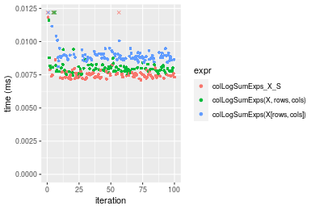
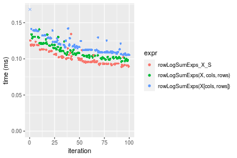

[matrixStats]: Benchmark report

---------------------------------------


# colLogSumExps() and rowLogSumExps() benchmarks on subsetted computation

This report benchmark the performance of colLogSumExps() and rowLogSumExps() on subsetted computation.


## Data
```r
> rmatrix <- function(nrow, ncol, mode = c("logical", "double", "integer", "index"), range = c(-100, 
+     +100), na_prob = 0) {
+     mode <- match.arg(mode)
+     n <- nrow * ncol
+     if (mode == "logical") {
+         x <- sample(c(FALSE, TRUE), size = n, replace = TRUE)
+     }     else if (mode == "index") {
+         x <- seq_len(n)
+         mode <- "integer"
+     }     else {
+         x <- runif(n, min = range[1], max = range[2])
+     }
+     storage.mode(x) <- mode
+     if (na_prob > 0) 
+         x[sample(n, size = na_prob * n)] <- NA
+     dim(x) <- c(nrow, ncol)
+     x
+ }
> rmatrices <- function(scale = 10, seed = 1, ...) {
+     set.seed(seed)
+     data <- list()
+     data[[1]] <- rmatrix(nrow = scale * 1, ncol = scale * 1, ...)
+     data[[2]] <- rmatrix(nrow = scale * 10, ncol = scale * 10, ...)
+     data[[3]] <- rmatrix(nrow = scale * 100, ncol = scale * 1, ...)
+     data[[4]] <- t(data[[3]])
+     data[[5]] <- rmatrix(nrow = scale * 10, ncol = scale * 100, ...)
+     data[[6]] <- t(data[[5]])
+     names(data) <- sapply(data, FUN = function(x) paste(dim(x), collapse = "x"))
+     data
+ }
> data <- rmatrices(mode = "double")
```

## Results

### 10x10 matrix


```r
> X <- data[["10x10"]]
> rows <- sample.int(nrow(X), size = nrow(X) * 0.7)
> cols <- sample.int(ncol(X), size = ncol(X) * 0.7)
> X_S <- X[rows, cols]
> gc()
          used  (Mb) gc trigger  (Mb) max used  (Mb)
Ncells 5022683 268.3   10014072 534.9  6980047 372.8
Vcells 9003631  68.7   15103703 115.3 12519752  95.6
> colStats <- microbenchmark(colLogSumExps_X_S = colLogSumExps(X_S, na.rm = FALSE), `colLogSumExps(X, rows, cols)` = colLogSumExps(X, 
+     rows = rows, cols = cols, na.rm = FALSE), `colLogSumExps(X[rows, cols])` = colLogSumExps(X[rows, 
+     cols], na.rm = FALSE), unit = "ms")
> X <- t(X)
> X_S <- t(X_S)
> gc()
          used  (Mb) gc trigger  (Mb) max used  (Mb)
Ncells 5023202 268.3   10014072 534.9  6980047 372.8
Vcells 9004206  68.7   18204443 138.9 12519752  95.6
> rowStats <- microbenchmark(rowLogSumExps_X_S = rowLogSumExps(X_S, na.rm = FALSE), `rowLogSumExps(X, cols, rows)` = rowLogSumExps(X, 
+     rows = cols, cols = rows, na.rm = FALSE), `rowLogSumExps(X[cols, rows])` = rowLogSumExps(X[cols, 
+     rows], na.rm = FALSE), unit = "ms")
```

_Table: Benchmarking of colLogSumExps_X_S(), colLogSumExps(X, rows, cols)() and colLogSumExps(X[rows, cols])() on 10x10 data. The top panel shows times in milliseconds and the bottom panel shows relative times._


|   |expr                         |      min|        lq|      mean|   median|        uq|      max|
|:--|:----------------------------|--------:|---------:|---------:|--------:|---------:|--------:|
|1  |colLogSumExps_X_S            | 0.003100| 0.0031540| 0.0043832| 0.003201| 0.0033485| 0.112683|
|2  |colLogSumExps(X, rows, cols) | 0.003471| 0.0035450| 0.0036924| 0.003594| 0.0037010| 0.007245|
|3  |colLogSumExps(X[rows, cols]) | 0.004107| 0.0043215| 0.0044888| 0.004406| 0.0045345| 0.009509|


|   |expr                         |      min|       lq|     mean|   median|       uq|       max|
|:--|:----------------------------|--------:|--------:|--------:|--------:|--------:|---------:|
|1  |colLogSumExps_X_S            | 1.000000| 1.000000| 1.000000| 1.000000| 1.000000| 1.0000000|
|2  |colLogSumExps(X, rows, cols) | 1.119677| 1.123970| 0.842396| 1.122774| 1.105271| 0.0642954|
|3  |colLogSumExps(X[rows, cols]) | 1.324839| 1.370165| 1.024097| 1.376445| 1.354188| 0.0843872|

_Table: Benchmarking of rowLogSumExps_X_S(), rowLogSumExps(X, cols, rows)() and rowLogSumExps(X[cols, rows])() on 10x10 data (transposed). The top panel shows times in milliseconds and the bottom panel shows relative times._


|   |expr                         |      min|        lq|      mean|    median|        uq|      max|
|:--|:----------------------------|--------:|---------:|---------:|---------:|---------:|--------:|
|1  |rowLogSumExps_X_S            | 0.003063| 0.0031395| 0.0032742| 0.0031845| 0.0032965| 0.005809|
|2  |rowLogSumExps(X, cols, rows) | 0.003433| 0.0035175| 0.0045646| 0.0036060| 0.0037090| 0.094429|
|3  |rowLogSumExps(X[cols, rows]) | 0.003998| 0.0043095| 0.0045184| 0.0044090| 0.0045475| 0.009603|


|   |expr                         |      min|       lq|     mean|   median|       uq|       max|
|:--|:----------------------------|--------:|--------:|--------:|--------:|--------:|---------:|
|1  |rowLogSumExps_X_S            | 1.000000| 1.000000| 1.000000| 1.000000| 1.000000|  1.000000|
|2  |rowLogSumExps(X, cols, rows) | 1.120797| 1.120401| 1.394105| 1.132360| 1.125133| 16.255638|
|3  |rowLogSumExps(X[cols, rows]) | 1.305256| 1.372671| 1.379986| 1.384519| 1.379493|  1.653125|

_Figure: Benchmarking of colLogSumExps_X_S(), colLogSumExps(X, rows, cols)() and colLogSumExps(X[rows, cols])() on 10x10 data  as well as rowLogSumExps_X_S(), rowLogSumExps(X, cols, rows)() and rowLogSumExps(X[cols, rows])() on the same data transposed.  Outliers are displayed as crosses.  Times are in milliseconds._





_Table: Benchmarking of colLogSumExps_X_S() and rowLogSumExps_X_S() on 10x10 data (original and transposed).  The top panel shows times in milliseconds and the bottom panel shows relative times._


|   |expr              |   min|     lq|   mean| median|     uq|     max|
|:--|:-----------------|-----:|------:|------:|------:|------:|-------:|
|2  |rowLogSumExps_X_S | 3.063| 3.1395| 3.2742| 3.1845| 3.2965|   5.809|
|1  |colLogSumExps_X_S | 3.100| 3.1540| 4.3832| 3.2010| 3.3485| 112.683|


|   |expr              |     min|       lq|     mean|   median|       uq|    max|
|:--|:-----------------|-------:|--------:|--------:|--------:|--------:|------:|
|2  |rowLogSumExps_X_S | 1.00000| 1.000000| 1.000000| 1.000000| 1.000000|  1.000|
|1  |colLogSumExps_X_S | 1.01208| 1.004619| 1.338709| 1.005181| 1.015774| 19.398|

_Figure: Benchmarking of colLogSumExps_X_S() and rowLogSumExps_X_S() on 10x10 data (original and transposed).  Outliers are displayed as crosses. Times are in milliseconds._


### 100x100 matrix


```r
> X <- data[["100x100"]]
> rows <- sample.int(nrow(X), size = nrow(X) * 0.7)
> cols <- sample.int(ncol(X), size = ncol(X) * 0.7)
> X_S <- X[rows, cols]
> gc()
          used  (Mb) gc trigger  (Mb) max used  (Mb)
Ncells 5145403 274.8   10014072 534.9  8370041 447.1
Vcells 9258068  70.7   18204443 138.9 12519752  95.6
> colStats <- microbenchmark(colLogSumExps_X_S = colLogSumExps(X_S, na.rm = FALSE), `colLogSumExps(X, rows, cols)` = colLogSumExps(X, 
+     rows = rows, cols = cols, na.rm = FALSE), `colLogSumExps(X[rows, cols])` = colLogSumExps(X[rows, 
+     cols], na.rm = FALSE), unit = "ms")
> X <- t(X)
> X_S <- t(X_S)
> gc()
          used  (Mb) gc trigger  (Mb) max used  (Mb)
Ncells 5145328 274.8   10014072 534.9  8370041 447.1
Vcells 9268036  70.8   18204443 138.9 12519752  95.6
> rowStats <- microbenchmark(rowLogSumExps_X_S = rowLogSumExps(X_S, na.rm = FALSE), `rowLogSumExps(X, cols, rows)` = rowLogSumExps(X, 
+     rows = cols, cols = rows, na.rm = FALSE), `rowLogSumExps(X[cols, rows])` = rowLogSumExps(X[cols, 
+     rows], na.rm = FALSE), unit = "ms")
```

_Table: Benchmarking of colLogSumExps_X_S(), colLogSumExps(X, rows, cols)() and colLogSumExps(X[rows, cols])() on 100x100 data. The top panel shows times in milliseconds and the bottom panel shows relative times._


|   |expr                         |      min|       lq|      mean|    median|        uq|      max|
|:--|:----------------------------|--------:|--------:|---------:|---------:|---------:|--------:|
|1  |colLogSumExps_X_S            | 0.088146| 0.091477| 0.0993569| 0.0945445| 0.1048845| 0.132308|
|2  |colLogSumExps(X, rows, cols) | 0.092735| 0.096545| 0.1041842| 0.0996565| 0.1101595| 0.130575|
|3  |colLogSumExps(X[rows, cols]) | 0.100678| 0.104521| 0.1141179| 0.1079415| 0.1199095| 0.166457|


|   |expr                         |      min|       lq|     mean|   median|       uq|       max|
|:--|:----------------------------|--------:|--------:|--------:|--------:|--------:|---------:|
|1  |colLogSumExps_X_S            | 1.000000| 1.000000| 1.000000| 1.000000| 1.000000| 1.0000000|
|2  |colLogSumExps(X, rows, cols) | 1.052061| 1.055402| 1.048585| 1.054070| 1.050293| 0.9869018|
|3  |colLogSumExps(X[rows, cols]) | 1.142173| 1.142593| 1.148565| 1.141701| 1.143253| 1.2581023|

_Table: Benchmarking of rowLogSumExps_X_S(), rowLogSumExps(X, cols, rows)() and rowLogSumExps(X[cols, rows])() on 100x100 data (transposed). The top panel shows times in milliseconds and the bottom panel shows relative times._


|   |expr                         |      min|        lq|      mean|    median|        uq|      max|
|:--|:----------------------------|--------:|---------:|---------:|---------:|---------:|--------:|
|1  |rowLogSumExps_X_S            | 0.089932| 0.0959815| 0.1038839| 0.0997910| 0.1115150| 0.132789|
|2  |rowLogSumExps(X, cols, rows) | 0.090969| 0.0968170| 0.1043130| 0.1003315| 0.1111950| 0.155607|
|3  |rowLogSumExps(X[cols, rows]) | 0.102082| 0.1088965| 0.1174310| 0.1131620| 0.1253655| 0.151496|


|   |expr                         |      min|       lq|     mean|   median|        uq|      max|
|:--|:----------------------------|--------:|--------:|--------:|--------:|---------:|--------:|
|1  |rowLogSumExps_X_S            | 1.000000| 1.000000| 1.000000| 1.000000| 1.0000000| 1.000000|
|2  |rowLogSumExps(X, cols, rows) | 1.011531| 1.008705| 1.004131| 1.005416| 0.9971304| 1.171836|
|3  |rowLogSumExps(X[cols, rows]) | 1.135102| 1.134557| 1.130407| 1.133990| 1.1242030| 1.140878|

_Figure: Benchmarking of colLogSumExps_X_S(), colLogSumExps(X, rows, cols)() and colLogSumExps(X[rows, cols])() on 100x100 data  as well as rowLogSumExps_X_S(), rowLogSumExps(X, cols, rows)() and rowLogSumExps(X[cols, rows])() on the same data transposed.  Outliers are displayed as crosses.  Times are in milliseconds._


_Table: Benchmarking of colLogSumExps_X_S() and rowLogSumExps_X_S() on 100x100 data (original and transposed).  The top panel shows times in milliseconds and the bottom panel shows relative times._


|   |expr              |    min|      lq|      mean|  median|       uq|     max|
|:--|:-----------------|------:|-------:|---------:|-------:|--------:|-------:|
|1  |colLogSumExps_X_S | 88.146| 91.4770|  99.35687| 94.5445| 104.8845| 132.308|
|2  |rowLogSumExps_X_S | 89.932| 95.9815| 103.88389| 99.7910| 111.5150| 132.789|


|   |expr              |      min|       lq|     mean|   median|       uq|      max|
|:--|:-----------------|--------:|--------:|--------:|--------:|--------:|--------:|
|1  |colLogSumExps_X_S | 1.000000| 1.000000| 1.000000| 1.000000| 1.000000| 1.000000|
|2  |rowLogSumExps_X_S | 1.020262| 1.049242| 1.045563| 1.055492| 1.063217| 1.003635|

_Figure: Benchmarking of colLogSumExps_X_S() and rowLogSumExps_X_S() on 100x100 data (original and transposed).  Outliers are displayed as crosses. Times are in milliseconds._


### 1000x10 matrix


```r
> X <- data[["1000x10"]]
> rows <- sample.int(nrow(X), size = nrow(X) * 0.7)
> cols <- sample.int(ncol(X), size = ncol(X) * 0.7)
> X_S <- X[rows, cols]
> gc()
          used  (Mb) gc trigger  (Mb) max used  (Mb)
Ncells 5146259 274.9   10014072 534.9  8372899 447.2
Vcells 9262410  70.7   18204443 138.9 12519752  95.6
> colStats <- microbenchmark(colLogSumExps_X_S = colLogSumExps(X_S, na.rm = FALSE), `colLogSumExps(X, rows, cols)` = colLogSumExps(X, 
+     rows = rows, cols = cols, na.rm = FALSE), `colLogSumExps(X[rows, cols])` = colLogSumExps(X[rows, 
+     cols], na.rm = FALSE), unit = "ms")
> X <- t(X)
> X_S <- t(X_S)
> gc()
          used  (Mb) gc trigger  (Mb) max used  (Mb)
Ncells 5146244 274.9   10014072 534.9  8372899 447.2
Vcells 9272478  70.8   18204443 138.9 12519752  95.6
> rowStats <- microbenchmark(rowLogSumExps_X_S = rowLogSumExps(X_S, na.rm = FALSE), `rowLogSumExps(X, cols, rows)` = rowLogSumExps(X, 
+     rows = cols, cols = rows, na.rm = FALSE), `rowLogSumExps(X[cols, rows])` = rowLogSumExps(X[cols, 
+     rows], na.rm = FALSE), unit = "ms")
```

_Table: Benchmarking of colLogSumExps_X_S(), colLogSumExps(X, rows, cols)() and colLogSumExps(X[rows, cols])() on 1000x10 data. The top panel shows times in milliseconds and the bottom panel shows relative times._


|   |expr                         |      min|        lq|      mean|    median|        uq|      max|
|:--|:----------------------------|--------:|---------:|---------:|---------:|---------:|--------:|
|1  |colLogSumExps_X_S            | 0.083737| 0.0892185| 0.0944417| 0.0925800| 0.0995715| 0.120028|
|2  |colLogSumExps(X, rows, cols) | 0.087223| 0.0929035| 0.0994905| 0.0959465| 0.1064420| 0.120006|
|3  |colLogSumExps(X[rows, cols]) | 0.094288| 0.0998945| 0.1077946| 0.1033965| 0.1147315| 0.154737|


|   |expr                         |      min|       lq|     mean|   median|       uq|       max|
|:--|:----------------------------|--------:|--------:|--------:|--------:|--------:|---------:|
|1  |colLogSumExps_X_S            | 1.000000| 1.000000| 1.000000| 1.000000| 1.000000| 1.0000000|
|2  |colLogSumExps(X, rows, cols) | 1.041630| 1.041303| 1.053459| 1.036363| 1.069001| 0.9998167|
|3  |colLogSumExps(X[rows, cols]) | 1.126002| 1.119661| 1.141388| 1.116834| 1.152252| 1.2891742|

_Table: Benchmarking of rowLogSumExps_X_S(), rowLogSumExps(X, cols, rows)() and rowLogSumExps(X[cols, rows])() on 1000x10 data (transposed). The top panel shows times in milliseconds and the bottom panel shows relative times._


|   |expr                         |      min|        lq|      mean|    median|       uq|      max|
|:--|:----------------------------|--------:|---------:|---------:|---------:|--------:|--------:|
|1  |rowLogSumExps_X_S            | 0.088692| 0.0945275| 0.1041454| 0.0954530| 0.109720| 0.188108|
|2  |rowLogSumExps(X, cols, rows) | 0.088812| 0.0946880| 0.1058109| 0.1018035| 0.109465| 0.198118|
|3  |rowLogSumExps(X[cols, rows]) | 0.103045| 0.1084395| 0.1198923| 0.1149055| 0.124218| 0.242629|


|   |expr                         |      min|       lq|     mean|   median|        uq|      max|
|:--|:----------------------------|--------:|--------:|--------:|--------:|---------:|--------:|
|1  |rowLogSumExps_X_S            | 1.000000| 1.000000| 1.000000| 1.000000| 1.0000000| 1.000000|
|2  |rowLogSumExps(X, cols, rows) | 1.001353| 1.001698| 1.015993| 1.066530| 0.9976759| 1.053214|
|3  |rowLogSumExps(X[cols, rows]) | 1.161830| 1.147174| 1.151202| 1.203791| 1.1321363| 1.289839|

_Figure: Benchmarking of colLogSumExps_X_S(), colLogSumExps(X, rows, cols)() and colLogSumExps(X[rows, cols])() on 1000x10 data  as well as rowLogSumExps_X_S(), rowLogSumExps(X, cols, rows)() and rowLogSumExps(X[cols, rows])() on the same data transposed.  Outliers are displayed as crosses.  Times are in milliseconds._



_Table: Benchmarking of colLogSumExps_X_S() and rowLogSumExps_X_S() on 1000x10 data (original and transposed).  The top panel shows times in milliseconds and the bottom panel shows relative times._


|   |expr              |    min|      lq|      mean| median|       uq|     max|
|:--|:-----------------|------:|-------:|---------:|------:|--------:|-------:|
|1  |colLogSumExps_X_S | 83.737| 89.2185|  94.44174| 92.580|  99.5715| 120.028|
|2  |rowLogSumExps_X_S | 88.692| 94.5275| 104.14539| 95.453| 109.7200| 188.108|


|   |expr              |      min|       lq|     mean|   median|       uq|      max|
|:--|:-----------------|--------:|--------:|--------:|--------:|--------:|--------:|
|1  |colLogSumExps_X_S | 1.000000| 1.000000| 1.000000| 1.000000| 1.000000| 1.000000|
|2  |rowLogSumExps_X_S | 1.059173| 1.059506| 1.102747| 1.031033| 1.101922| 1.567201|

_Figure: Benchmarking of colLogSumExps_X_S() and rowLogSumExps_X_S() on 1000x10 data (original and transposed).  Outliers are displayed as crosses. Times are in milliseconds._


### 10x1000 matrix


```r
> X <- data[["10x1000"]]
> rows <- sample.int(nrow(X), size = nrow(X) * 0.7)
> cols <- sample.int(ncol(X), size = ncol(X) * 0.7)
> X_S <- X[rows, cols]
> gc()
          used  (Mb) gc trigger  (Mb) max used  (Mb)
Ncells 5146464 274.9   10014072 534.9  8372899 447.2
Vcells 9263324  70.7   18204443 138.9 12519752  95.6
> colStats <- microbenchmark(colLogSumExps_X_S = colLogSumExps(X_S, na.rm = FALSE), `colLogSumExps(X, rows, cols)` = colLogSumExps(X, 
+     rows = rows, cols = cols, na.rm = FALSE), `colLogSumExps(X[rows, cols])` = colLogSumExps(X[rows, 
+     cols], na.rm = FALSE), unit = "ms")
> X <- t(X)
> X_S <- t(X_S)
> gc()
          used  (Mb) gc trigger  (Mb) max used  (Mb)
Ncells 5146449 274.9   10014072 534.9  8372899 447.2
Vcells 9273392  70.8   18204443 138.9 12519752  95.6
> rowStats <- microbenchmark(rowLogSumExps_X_S = rowLogSumExps(X_S, na.rm = FALSE), `rowLogSumExps(X, cols, rows)` = rowLogSumExps(X, 
+     rows = cols, cols = rows, na.rm = FALSE), `rowLogSumExps(X[cols, rows])` = rowLogSumExps(X[cols, 
+     rows], na.rm = FALSE), unit = "ms")
```

_Table: Benchmarking of colLogSumExps_X_S(), colLogSumExps(X, rows, cols)() and colLogSumExps(X[rows, cols])() on 10x1000 data. The top panel shows times in milliseconds and the bottom panel shows relative times._


|   |expr                         |      min|        lq|      mean|    median|        uq|      max|
|:--|:----------------------------|--------:|---------:|---------:|---------:|---------:|--------:|
|1  |colLogSumExps_X_S            | 0.101740| 0.1116385| 0.1240764| 0.1209750| 0.1346790| 0.175776|
|2  |colLogSumExps(X, rows, cols) | 0.107415| 0.1188935| 0.1282867| 0.1245235| 0.1330225| 0.184638|
|3  |colLogSumExps(X[rows, cols]) | 0.116036| 0.1298870| 0.1393041| 0.1357445| 0.1483320| 0.183984|


|   |expr                         |      min|       lq|     mean|   median|        uq|      max|
|:--|:----------------------------|--------:|--------:|--------:|--------:|---------:|--------:|
|1  |colLogSumExps_X_S            | 1.000000| 1.000000| 1.000000| 1.000000| 1.0000000| 1.000000|
|2  |colLogSumExps(X, rows, cols) | 1.055779| 1.064987| 1.033933| 1.029332| 0.9877004| 1.050416|
|3  |colLogSumExps(X[rows, cols]) | 1.140515| 1.163461| 1.122729| 1.122087| 1.1013744| 1.046696|

_Table: Benchmarking of rowLogSumExps_X_S(), rowLogSumExps(X, cols, rows)() and rowLogSumExps(X[cols, rows])() on 10x1000 data (transposed). The top panel shows times in milliseconds and the bottom panel shows relative times._


|   |expr                         |      min|        lq|      mean|    median|       uq|      max|
|:--|:----------------------------|--------:|---------:|---------:|---------:|--------:|--------:|
|1  |rowLogSumExps_X_S            | 0.100049| 0.1133130| 0.1232920| 0.1187865| 0.130132| 0.183153|
|2  |rowLogSumExps(X, cols, rows) | 0.109639| 0.1211505| 0.1308634| 0.1277995| 0.135978| 0.201403|
|3  |rowLogSumExps(X[cols, rows]) | 0.111974| 0.1269350| 0.1377726| 0.1338580| 0.149178| 0.178487|


|   |expr                         |      min|       lq|     mean|   median|       uq|      max|
|:--|:----------------------------|--------:|--------:|--------:|--------:|--------:|--------:|
|1  |rowLogSumExps_X_S            | 1.000000| 1.000000| 1.000000| 1.000000| 1.000000| 1.000000|
|2  |rowLogSumExps(X, cols, rows) | 1.095853| 1.069167| 1.061411| 1.075876| 1.044924| 1.099643|
|3  |rowLogSumExps(X[cols, rows]) | 1.119192| 1.120216| 1.117450| 1.126879| 1.146359| 0.974524|

_Figure: Benchmarking of colLogSumExps_X_S(), colLogSumExps(X, rows, cols)() and colLogSumExps(X[rows, cols])() on 10x1000 data  as well as rowLogSumExps_X_S(), rowLogSumExps(X, cols, rows)() and rowLogSumExps(X[cols, rows])() on the same data transposed.  Outliers are displayed as crosses.  Times are in milliseconds._


_Table: Benchmarking of colLogSumExps_X_S() and rowLogSumExps_X_S() on 10x1000 data (original and transposed).  The top panel shows times in milliseconds and the bottom panel shows relative times._


|   |expr              |     min|       lq|     mean|   median|      uq|     max|
|:--|:-----------------|-------:|--------:|--------:|--------:|-------:|-------:|
|2  |rowLogSumExps_X_S | 100.049| 113.3130| 123.2920| 118.7865| 130.132| 183.153|
|1  |colLogSumExps_X_S | 101.740| 111.6385| 124.0764| 120.9750| 134.679| 175.776|


|   |expr              |      min|        lq|     mean|   median|       uq|       max|
|:--|:-----------------|--------:|---------:|--------:|--------:|--------:|---------:|
|2  |rowLogSumExps_X_S | 1.000000| 1.0000000| 1.000000| 1.000000| 1.000000| 1.0000000|
|1  |colLogSumExps_X_S | 1.016902| 0.9852223| 1.006362| 1.018424| 1.034941| 0.9597222|

_Figure: Benchmarking of colLogSumExps_X_S() and rowLogSumExps_X_S() on 10x1000 data (original and transposed).  Outliers are displayed as crosses. Times are in milliseconds._


### 100x1000 matrix


```r
> X <- data[["100x1000"]]
> rows <- sample.int(nrow(X), size = nrow(X) * 0.7)
> cols <- sample.int(ncol(X), size = ncol(X) * 0.7)
> X_S <- X[rows, cols]
> gc()
          used  (Mb) gc trigger  (Mb) max used  (Mb)
Ncells 5146674 274.9   10014072 534.9  8372899 447.2
Vcells 9308054  71.1   18204443 138.9 12519752  95.6
> colStats <- microbenchmark(colLogSumExps_X_S = colLogSumExps(X_S, na.rm = FALSE), `colLogSumExps(X, rows, cols)` = colLogSumExps(X, 
+     rows = rows, cols = cols, na.rm = FALSE), `colLogSumExps(X[rows, cols])` = colLogSumExps(X[rows, 
+     cols], na.rm = FALSE), unit = "ms")
> X <- t(X)
> X_S <- t(X_S)
> gc()
          used  (Mb) gc trigger  (Mb) max used  (Mb)
Ncells 5146659 274.9   10014072 534.9  8372899 447.2
Vcells 9408122  71.8   18204443 138.9 14648496 111.8
> rowStats <- microbenchmark(rowLogSumExps_X_S = rowLogSumExps(X_S, na.rm = FALSE), `rowLogSumExps(X, cols, rows)` = rowLogSumExps(X, 
+     rows = cols, cols = rows, na.rm = FALSE), `rowLogSumExps(X[cols, rows])` = rowLogSumExps(X[cols, 
+     rows], na.rm = FALSE), unit = "ms")
```

_Table: Benchmarking of colLogSumExps_X_S(), colLogSumExps(X, rows, cols)() and colLogSumExps(X[rows, cols])() on 100x1000 data. The top panel shows times in milliseconds and the bottom panel shows relative times._


|   |expr                         |      min|        lq|      mean|    median|        uq|      max|
|:--|:----------------------------|--------:|---------:|---------:|---------:|---------:|--------:|
|1  |colLogSumExps_X_S            | 0.715815| 0.7172945| 0.7529849| 0.7184780| 0.7222385| 1.223536|
|2  |colLogSumExps(X, rows, cols) | 0.754243| 0.7554995| 0.7874147| 0.7574910| 0.7689490| 1.321605|
|3  |colLogSumExps(X[rows, cols]) | 0.917846| 0.9225425| 0.9743449| 0.9245825| 0.9555555| 1.461453|


|   |expr                         |      min|       lq|     mean|   median|       uq|      max|
|:--|:----------------------------|--------:|--------:|--------:|--------:|--------:|--------:|
|1  |colLogSumExps_X_S            | 1.000000| 1.000000| 1.000000| 1.000000| 1.000000| 1.000000|
|2  |colLogSumExps(X, rows, cols) | 1.053684| 1.053263| 1.045724| 1.054299| 1.064675| 1.080152|
|3  |colLogSumExps(X[rows, cols]) | 1.282239| 1.286142| 1.293977| 1.286863| 1.323047| 1.194450|

_Table: Benchmarking of rowLogSumExps_X_S(), rowLogSumExps(X, cols, rows)() and rowLogSumExps(X[cols, rows])() on 100x1000 data (transposed). The top panel shows times in milliseconds and the bottom panel shows relative times._


|   |expr                         |      min|        lq|      mean|    median|        uq|      max|
|:--|:----------------------------|--------:|---------:|---------:|---------:|---------:|--------:|
|1  |rowLogSumExps_X_S            | 0.752862| 0.7619565| 0.8120401| 0.7634120| 0.7727360| 1.311829|
|2  |rowLogSumExps(X, cols, rows) | 0.772967| 0.7813065| 0.8094978| 0.7830440| 0.7876340| 1.297254|
|3  |rowLogSumExps(X[cols, rows]) | 0.854509| 0.8631940| 0.9223316| 0.8674165| 0.8825025| 1.386764|


|   |expr                         |      min|       lq|      mean|   median|       uq|       max|
|:--|:----------------------------|--------:|--------:|---------:|--------:|--------:|---------:|
|1  |rowLogSumExps_X_S            | 1.000000| 1.000000| 1.0000000| 1.000000| 1.000000| 1.0000000|
|2  |rowLogSumExps(X, cols, rows) | 1.026705| 1.025395| 0.9968693| 1.025716| 1.019279| 0.9888896|
|3  |rowLogSumExps(X[cols, rows]) | 1.135014| 1.132865| 1.1358203| 1.136236| 1.142049| 1.0571225|

_Figure: Benchmarking of colLogSumExps_X_S(), colLogSumExps(X, rows, cols)() and colLogSumExps(X[rows, cols])() on 100x1000 data  as well as rowLogSumExps_X_S(), rowLogSumExps(X, cols, rows)() and rowLogSumExps(X[cols, rows])() on the same data transposed.  Outliers are displayed as crosses.  Times are in milliseconds._


_Table: Benchmarking of colLogSumExps_X_S() and rowLogSumExps_X_S() on 100x1000 data (original and transposed).  The top panel shows times in milliseconds and the bottom panel shows relative times._


|   |expr              |     min|       lq|     mean|  median|       uq|      max|
|:--|:-----------------|-------:|--------:|--------:|-------:|--------:|--------:|
|1  |colLogSumExps_X_S | 715.815| 717.2945| 752.9849| 718.478| 722.2385| 1223.536|
|2  |rowLogSumExps_X_S | 752.862| 761.9565| 812.0401| 763.412| 772.7360| 1311.829|


|   |expr              |      min|       lq|     mean|   median|       uq|      max|
|:--|:-----------------|--------:|--------:|--------:|--------:|--------:|--------:|
|1  |colLogSumExps_X_S | 1.000000| 1.000000| 1.000000| 1.000000| 1.000000| 1.000000|
|2  |rowLogSumExps_X_S | 1.051755| 1.062264| 1.078428| 1.062541| 1.069918| 1.072162|

_Figure: Benchmarking of colLogSumExps_X_S() and rowLogSumExps_X_S() on 100x1000 data (original and transposed).  Outliers are displayed as crosses. Times are in milliseconds._


### 1000x100 matrix


```r
> X <- data[["1000x100"]]
> rows <- sample.int(nrow(X), size = nrow(X) * 0.7)
> cols <- sample.int(ncol(X), size = ncol(X) * 0.7)
> X_S <- X[rows, cols]
> gc()
          used  (Mb) gc trigger  (Mb) max used  (Mb)
Ncells 5149439 275.1   10014072 534.9  8372899 447.2
Vcells 9314876  71.1   18204443 138.9 15918415 121.5
> colStats <- microbenchmark(colLogSumExps_X_S = colLogSumExps(X_S, na.rm = FALSE), `colLogSumExps(X, rows, cols)` = colLogSumExps(X, 
+     rows = rows, cols = cols, na.rm = FALSE), `colLogSumExps(X[rows, cols])` = colLogSumExps(X[rows, 
+     cols], na.rm = FALSE), unit = "ms")
> X <- t(X)
> X_S <- t(X_S)
> gc()
          used  (Mb) gc trigger  (Mb) max used  (Mb)
Ncells 5149424 275.1   10014072 534.9  8372899 447.2
Vcells 9414944  71.9   18204443 138.9 15918415 121.5
> rowStats <- microbenchmark(rowLogSumExps_X_S = rowLogSumExps(X_S, na.rm = FALSE), `rowLogSumExps(X, cols, rows)` = rowLogSumExps(X, 
+     rows = cols, cols = rows, na.rm = FALSE), `rowLogSumExps(X[cols, rows])` = rowLogSumExps(X[cols, 
+     rows], na.rm = FALSE), unit = "ms")
```

_Table: Benchmarking of colLogSumExps_X_S(), colLogSumExps(X, rows, cols)() and colLogSumExps(X[rows, cols])() on 1000x100 data. The top panel shows times in milliseconds and the bottom panel shows relative times._


|   |expr                         |      min|        lq|      mean|    median|        uq|      max|
|:--|:----------------------------|--------:|---------:|---------:|---------:|---------:|--------:|
|1  |colLogSumExps_X_S            | 0.673958| 0.6770735| 0.7066162| 0.6776375| 0.6802175| 1.087024|
|2  |colLogSumExps(X, rows, cols) | 0.710603| 0.7115490| 0.7481833| 0.7121870| 0.7157705| 1.116039|
|3  |colLogSumExps(X[rows, cols]) | 0.767895| 0.7707760| 0.8016981| 0.7722045| 0.7770320| 1.300814|


|   |expr                         |      min|       lq|     mean|   median|       uq|      max|
|:--|:----------------------------|--------:|--------:|--------:|--------:|--------:|--------:|
|1  |colLogSumExps_X_S            | 1.000000| 1.000000| 1.000000| 1.000000| 1.000000| 1.000000|
|2  |colLogSumExps(X, rows, cols) | 1.054373| 1.050918| 1.058826| 1.050985| 1.052267| 1.026692|
|3  |colLogSumExps(X[rows, cols]) | 1.139381| 1.138393| 1.134559| 1.139554| 1.142329| 1.196675|

_Table: Benchmarking of rowLogSumExps_X_S(), rowLogSumExps(X, cols, rows)() and rowLogSumExps(X[cols, rows])() on 1000x100 data (transposed). The top panel shows times in milliseconds and the bottom panel shows relative times._


|   |expr                         |      min|        lq|      mean|    median|       uq|      max|
|:--|:----------------------------|--------:|---------:|---------:|---------:|--------:|--------:|
|2  |rowLogSumExps(X, cols, rows) | 0.705608| 0.7140655| 0.7465473| 0.7155935| 0.718135| 1.274566|
|1  |rowLogSumExps_X_S            | 0.706548| 0.7153970| 0.7482851| 0.7187925| 0.722868| 1.076060|
|3  |rowLogSumExps(X[cols, rows]) | 0.803881| 0.8172590| 0.8539948| 0.8208350| 0.836837| 1.277435|


|   |expr                         |      min|       lq|     mean|   median|       uq|      max|
|:--|:----------------------------|--------:|--------:|--------:|--------:|--------:|--------:|
|2  |rowLogSumExps(X, cols, rows) | 1.000000| 1.000000| 1.000000| 1.000000| 1.000000| 1.000000|
|1  |rowLogSumExps_X_S            | 1.001332| 1.001865| 1.002328| 1.004470| 1.006591| 0.844256|
|3  |rowLogSumExps(X[cols, rows]) | 1.139274| 1.144516| 1.143926| 1.147069| 1.165292| 1.002251|

_Figure: Benchmarking of colLogSumExps_X_S(), colLogSumExps(X, rows, cols)() and colLogSumExps(X[rows, cols])() on 1000x100 data  as well as rowLogSumExps_X_S(), rowLogSumExps(X, cols, rows)() and rowLogSumExps(X[cols, rows])() on the same data transposed.  Outliers are displayed as crosses.  Times are in milliseconds._


_Table: Benchmarking of colLogSumExps_X_S() and rowLogSumExps_X_S() on 1000x100 data (original and transposed).  The top panel shows times in milliseconds and the bottom panel shows relative times._


|   |expr              |     min|       lq|     mean|   median|       uq|      max|
|:--|:-----------------|-------:|--------:|--------:|--------:|--------:|--------:|
|1  |colLogSumExps_X_S | 673.958| 677.0735| 706.6162| 677.6375| 680.2175| 1087.024|
|2  |rowLogSumExps_X_S | 706.548| 715.3970| 748.2851| 718.7925| 722.8680| 1076.060|


|   |expr              |      min|       lq|    mean|   median|       uq|       max|
|:--|:-----------------|--------:|--------:|-------:|--------:|--------:|---------:|
|1  |colLogSumExps_X_S | 1.000000| 1.000000| 1.00000| 1.000000| 1.000000| 1.0000000|
|2  |rowLogSumExps_X_S | 1.048356| 1.056602| 1.05897| 1.060733| 1.062701| 0.9899137|

_Figure: Benchmarking of colLogSumExps_X_S() and rowLogSumExps_X_S() on 1000x100 data (original and transposed).  Outliers are displayed as crosses. Times are in milliseconds._


## Appendix

### Session information
```r
R version 4.1.1 Patched (2021-08-10 r80727)
Platform: x86_64-pc-linux-gnu (64-bit)
Running under: Ubuntu 18.04.5 LTS

Matrix products: default
BLAS:   /home/hb/software/R-devel/R-4-1-branch/lib/R/lib/libRblas.so
LAPACK: /home/hb/software/R-devel/R-4-1-branch/lib/R/lib/libRlapack.so

locale:
 [1] LC_CTYPE=en_US.UTF-8       LC_NUMERIC=C              
 [3] LC_TIME=en_US.UTF-8        LC_COLLATE=en_US.UTF-8    
 [5] LC_MONETARY=en_US.UTF-8    LC_MESSAGES=en_US.UTF-8   
 [7] LC_PAPER=en_US.UTF-8       LC_NAME=C                 
 [9] LC_ADDRESS=C               LC_TELEPHONE=C            
[11] LC_MEASUREMENT=en_US.UTF-8 LC_IDENTIFICATION=C       

attached base packages:
[1] stats     graphics  grDevices utils     datasets  methods   base     

other attached packages:
[1] microbenchmark_1.4-7   matrixStats_0.60.1     ggplot2_3.3.5         
[4] knitr_1.33             R.devices_2.17.0       R.utils_2.10.1        
[7] R.oo_1.24.0            R.methodsS3_1.8.1-9001 history_0.0.1-9000    

loaded via a namespace (and not attached):
 [1] Biobase_2.52.0          httr_1.4.2              splines_4.1.1          
 [4] bit64_4.0.5             network_1.17.1          assertthat_0.2.1       
 [7] highr_0.9               stats4_4.1.1            blob_1.2.2             
[10] GenomeInfoDbData_1.2.6  robustbase_0.93-8       pillar_1.6.2           
[13] RSQLite_2.2.8           lattice_0.20-44         glue_1.4.2             
[16] digest_0.6.27           XVector_0.32.0          colorspace_2.0-2       
[19] Matrix_1.3-4            XML_3.99-0.7            pkgconfig_2.0.3        
[22] zlibbioc_1.38.0         genefilter_1.74.0       purrr_0.3.4            
[25] ergm_4.1.2              xtable_1.8-4            scales_1.1.1           
[28] tibble_3.1.4            annotate_1.70.0         KEGGREST_1.32.0        
[31] farver_2.1.0            generics_0.1.0          IRanges_2.26.0         
[34] ellipsis_0.3.2          cachem_1.0.6            withr_2.4.2            
[37] BiocGenerics_0.38.0     survival_3.2-13         magrittr_2.0.1         
[40] crayon_1.4.1            statnet.common_4.5.0    memoise_2.0.0          
[43] laeken_0.5.1            fansi_0.5.0             R.cache_0.15.0         
[46] MASS_7.3-54             R.rsp_0.44.0            progressr_0.8.0        
[49] tools_4.1.1             lifecycle_1.0.0         S4Vectors_0.30.0       
[52] trust_0.1-8             munsell_0.5.0           tabby_0.0.1-9001       
[55] AnnotationDbi_1.54.1    Biostrings_2.60.2       compiler_4.1.1         
[58] GenomeInfoDb_1.28.1     rlang_0.4.11            grid_4.1.1             
[61] RCurl_1.98-1.4          cwhmisc_6.6             rappdirs_0.3.3         
[64] startup_0.15.0          labeling_0.4.2          bitops_1.0-7           
[67] base64enc_0.1-3         boot_1.3-28             gtable_0.3.0           
[70] DBI_1.1.1               R6_2.5.1                lpSolveAPI_5.5.2.0-17.7
[73] rle_0.9.2               dplyr_1.0.7             fastmap_1.1.0          
[76] bit_4.0.4               utf8_1.2.2              parallel_4.1.1         
[79] Rcpp_1.0.7              vctrs_0.3.8             png_0.1-7              
[82] DEoptimR_1.0-9          tidyselect_1.1.1        xfun_0.25              
[85] coda_0.19-4            
```
Total processing time was 12 secs.


### Reproducibility
To reproduce this report, do:
```r
html <- matrixStats:::benchmark('colRowLogSumExps_subset')
```

[RSP]: https://cran.r-project.org/package=R.rsp
[matrixStats]: https://cran.r-project.org/package=matrixStats

[StackOverflow:colMins?]: https://stackoverflow.com/questions/13676878 "Stack Overflow: fastest way to get Min from every column in a matrix?"
[StackOverflow:colSds?]: https://stackoverflow.com/questions/17549762 "Stack Overflow: Is there such 'colsd' in R?"
[StackOverflow:rowProds?]: https://stackoverflow.com/questions/20198801/ "Stack Overflow: Row product of matrix and column sum of matrix"

---------------------------------------
Copyright Dongcan Jiang. Last updated on 2021-08-25 18:03:20 (+0200 UTC). Powered by [RSP].

<script>
 var link = document.createElement('link');
 link.rel = 'icon';
 link.href = "data:image/png;base64,iVBORw0KGgoAAAANSUhEUgAAACAAAAAgCAMAAABEpIrGAAAA21BMVEUAAAAAAP8AAP8AAP8AAP8AAP8AAP8AAP8AAP8AAP8AAP8AAP8AAP8AAP8AAP8AAP8AAP8AAP8AAP8AAP8AAP8AAP8AAP8AAP8AAP8AAP8AAP8AAP8AAP8AAP8AAP8AAP8AAP8AAP8AAP8AAP8AAP8AAP8AAP8AAP8AAP8AAP8BAf4CAv0DA/wdHeIeHuEfH+AgIN8hId4lJdomJtknJ9g+PsE/P8BAQL9yco10dIt1dYp3d4h4eIeVlWqWlmmXl2iYmGeZmWabm2Tn5xjo6Bfp6Rb39wj4+Af//wA2M9hbAAAASXRSTlMAAQIJCgsMJSYnKD4/QGRlZmhpamtsbautrrCxuru8y8zN5ebn6Pn6+///////////////////////////////////////////LsUNcQAAAS9JREFUOI29k21XgkAQhVcFytdSMqMETU26UVqGmpaiFbL//xc1cAhhwVNf6n5i5z67M2dmYOyfJZUqlVLhkKucG7cgmUZTybDz6g0iDeq51PUr37Ds2cy2/C9NeES5puDjxuUk1xnToZsg8pfA3avHQ3lLIi7iWRrkv/OYtkScxBIMgDee0ALoyxHQBJ68JLCjOtQIMIANF7QG9G9fNnHvisCHBVMKgSJgiz7nE+AoBKrAPA3MgepvgR9TSCasrCKH0eB1wBGBFdCO+nAGjMVGPcQb5bd6mQRegN6+1axOs9nGfYcCtfi4NQosdtH7dB+txFIpXQqN1p9B/asRHToyS0jRgpV7nk4nwcq1BJ+x3Gl/v7S9Wmpp/aGquum7w3ZDyrADFYrl8vHBH+ev9AUASW1dmU4h4wAAAABJRU5ErkJggg=="
 document.getElementsByTagName('head')[0].appendChild(link);
</script>


