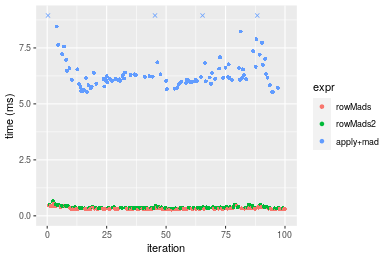
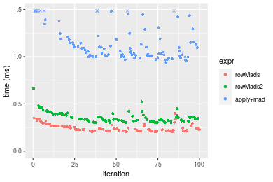
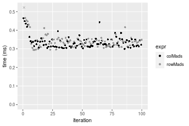
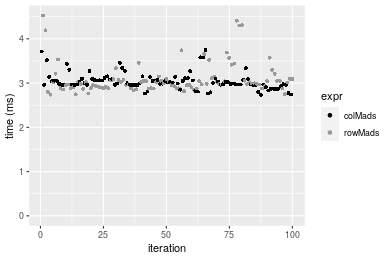
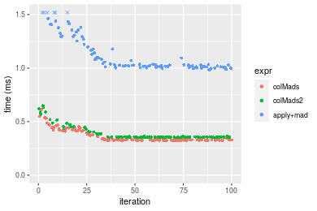
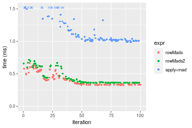
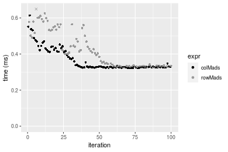
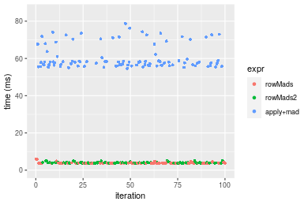

[matrixStats]: Benchmark report

---------------------------------------


# colMads() and rowMads() benchmarks

This report benchmark the performance of colMads() and rowMads() against alternative methods.

## Alternative methods

* apply() + mad()
* colMads2() and rowMads2()

where `rowMads2()` and `colMads2()` are:

```r
> rowMads2 <- function(x, const = 1.4826, na.rm = FALSE) {
+     mu <- rowMedians(x, na.rm = na.rm)
+     x <- abs(x - mu)
+     mad <- rowMedians(x, na.rm = FALSE)
+     const * mad
+ }
> colMads2 <- function(x, const = 1.4826, na.rm = FALSE) {
+     mu <- colMedians(x, na.rm = na.rm)
+     x <- abs(x - mu)
+     mad <- colMedians(x, na.rm = FALSE)
+     const * mad
+ }
```


## Data type "integer"

### Data
```r
> rmatrix <- function(nrow, ncol, mode = c("logical", "double", "integer", "index"), range = c(-100, 
+     +100), na_prob = 0) {
+     mode <- match.arg(mode)
+     n <- nrow * ncol
+     if (mode == "logical") {
+         x <- sample(c(FALSE, TRUE), size = n, replace = TRUE)
+     }     else if (mode == "index") {
+         x <- seq_len(n)
+         mode <- "integer"
+     }     else {
+         x <- runif(n, min = range[1], max = range[2])
+     }
+     storage.mode(x) <- mode
+     if (na_prob > 0) 
+         x[sample(n, size = na_prob * n)] <- NA
+     dim(x) <- c(nrow, ncol)
+     x
+ }
> rmatrices <- function(scale = 10, seed = 1, ...) {
+     set.seed(seed)
+     data <- list()
+     data[[1]] <- rmatrix(nrow = scale * 1, ncol = scale * 1, ...)
+     data[[2]] <- rmatrix(nrow = scale * 10, ncol = scale * 10, ...)
+     data[[3]] <- rmatrix(nrow = scale * 100, ncol = scale * 1, ...)
+     data[[4]] <- t(data[[3]])
+     data[[5]] <- rmatrix(nrow = scale * 10, ncol = scale * 100, ...)
+     data[[6]] <- t(data[[5]])
+     names(data) <- sapply(data, FUN = function(x) paste(dim(x), collapse = "x"))
+     data
+ }
> data <- rmatrices(mode = mode)
```

### Results

#### 10x10 integer matrix

```r
> X <- data[["10x10"]]
> gc()
           used  (Mb) gc trigger  (Mb) max used  (Mb)
Ncells  5250188 280.4    7916910 422.9  7916910 422.9
Vcells 10132068  77.4   33191153 253.3 53339345 407.0
> colStats <- microbenchmark(colMads = colMads(X, na.rm = FALSE), colMads2 = colMads2(X, na.rm = FALSE), 
+     `apply+mad` = apply(X, MARGIN = 2L, FUN = mad, na.rm = FALSE), unit = "ms")
> X <- t(X)
> gc()
           used  (Mb) gc trigger  (Mb) max used  (Mb)
Ncells  5236357 279.7    7916910 422.9  7916910 422.9
Vcells 10086015  77.0   33191153 253.3 53339345 407.0
> rowStats <- microbenchmark(rowMads = rowMads(X, na.rm = FALSE), rowMads2 = rowMads2(X, na.rm = FALSE), 
+     `apply+mad` = apply(X, MARGIN = 1L, FUN = mad, na.rm = FALSE), unit = "ms")
```

_Table: Benchmarking of colMads(), colMads2() and apply+mad() on integer+10x10 data. The top panel shows times in milliseconds and the bottom panel shows relative times._


|   |expr      |      min|        lq|      mean|   median|        uq|      max|
|:--|:---------|--------:|---------:|---------:|--------:|---------:|--------:|
|1  |colMads   | 0.006008| 0.0089390| 0.0128773| 0.011302| 0.0151575| 0.035319|
|2  |colMads2  | 0.007256| 0.0098135| 0.0163289| 0.012464| 0.0175690| 0.159177|
|3  |apply+mad | 0.578038| 0.6448000| 0.7424238| 0.685349| 0.7585050| 1.542347|


|   |expr      |       min|       lq|      mean|    median|        uq|       max|
|:--|:---------|---------:|--------:|---------:|---------:|---------:|---------:|
|1  |colMads   |  1.000000|  1.00000|  1.000000|  1.000000|  1.000000|  1.000000|
|2  |colMads2  |  1.207723|  1.09783|  1.268039|  1.102814|  1.159096|  4.506838|
|3  |apply+mad | 96.211385| 72.13335| 57.653772| 60.639621| 50.041564| 43.669045|

_Table: Benchmarking of rowMads(), rowMads2() and apply+mad() on integer+10x10 data (transposed). The top panel shows times in milliseconds and the bottom panel shows relative times._


|   |expr      |      min|        lq|      mean|   median|        uq|      max|
|:--|:---------|--------:|---------:|---------:|--------:|---------:|--------:|
|1  |rowMads   | 0.005267| 0.0078910| 0.0111999| 0.010449| 0.0135275| 0.033022|
|2  |rowMads2  | 0.007037| 0.0095090| 0.0152600| 0.012227| 0.0169130| 0.171203|
|3  |apply+mad | 0.526914| 0.5933545| 0.6972633| 0.663766| 0.7822795| 1.119822|


|   |expr      |        min|        lq|     mean|   median|        uq|       max|
|:--|:---------|----------:|---------:|--------:|--------:|---------:|---------:|
|1  |rowMads   |   1.000000|  1.000000|  1.00000|  1.00000|  1.000000|  1.000000|
|2  |rowMads2  |   1.336055|  1.205044|  1.36251|  1.17016|  1.250268|  5.184513|
|3  |apply+mad | 100.040630| 75.193828| 62.25621| 63.52436| 57.828830| 33.911392|

_Figure: Benchmarking of colMads(), colMads2() and apply+mad() on integer+10x10 data  as well as rowMads(), rowMads2() and apply+mad() on the same data transposed.  Outliers are displayed as crosses.  Times are in milliseconds._


_Table: Benchmarking of colMads() and rowMads() on integer+10x10 data (original and transposed).  The top panel shows times in milliseconds and the bottom panel shows relative times._


|   |expr    |   min|    lq|     mean| median|      uq|    max|
|:--|:-------|-----:|-----:|--------:|------:|-------:|------:|
|2  |rowMads | 5.267| 7.891| 11.19990| 10.449| 13.5275| 33.022|
|1  |colMads | 6.008| 8.939| 12.87728| 11.302| 15.1575| 35.319|


|   |expr    |      min|      lq|     mean|   median|       uq|     max|
|:--|:-------|--------:|-------:|--------:|--------:|--------:|-------:|
|2  |rowMads | 1.000000| 1.00000| 1.000000| 1.000000| 1.000000| 1.00000|
|1  |colMads | 1.140687| 1.13281| 1.149767| 1.081635| 1.120495| 1.06956|

_Figure: Benchmarking of colMads() and rowMads() on integer+10x10 data (original and transposed).  Outliers are displayed as crosses. Times are in milliseconds._


#### 100x100 integer matrix

```r
> X <- data[["100x100"]]
> gc()
          used  (Mb) gc trigger  (Mb) max used  (Mb)
Ncells 5235065 279.6    7916910 422.9  7916910 422.9
Vcells 9702982  74.1   33191153 253.3 53339345 407.0
> colStats <- microbenchmark(colMads = colMads(X, na.rm = FALSE), colMads2 = colMads2(X, na.rm = FALSE), 
+     `apply+mad` = apply(X, MARGIN = 2L, FUN = mad, na.rm = FALSE), unit = "ms")
> X <- t(X)
> gc()
          used  (Mb) gc trigger  (Mb) max used  (Mb)
Ncells 5235053 279.6    7916910 422.9  7916910 422.9
Vcells 9708015  74.1   33191153 253.3 53339345 407.0
> rowStats <- microbenchmark(rowMads = rowMads(X, na.rm = FALSE), rowMads2 = rowMads2(X, na.rm = FALSE), 
+     `apply+mad` = apply(X, MARGIN = 1L, FUN = mad, na.rm = FALSE), unit = "ms")
```

_Table: Benchmarking of colMads(), colMads2() and apply+mad() on integer+100x100 data. The top panel shows times in milliseconds and the bottom panel shows relative times._


|   |expr      |      min|        lq|      mean|    median|       uq|       max|
|:--|:---------|--------:|---------:|---------:|---------:|--------:|---------:|
|1  |colMads   | 0.288204| 0.3042840| 0.3219376| 0.3093615| 0.324000|  0.540244|
|2  |colMads2  | 0.329864| 0.3517865| 0.3745369| 0.3581860| 0.373225|  0.643909|
|3  |apply+mad | 5.485353| 5.9617085| 6.5075370| 6.1003425| 6.417079| 15.308379|


|   |expr      |      min|        lq|      mean|    median|        uq|       max|
|:--|:---------|--------:|---------:|---------:|---------:|---------:|---------:|
|1  |colMads   |  1.00000|  1.000000|  1.000000|  1.000000|  1.000000|  1.000000|
|2  |colMads2  |  1.14455|  1.156112|  1.163384|  1.157823|  1.151929|  1.191885|
|3  |apply+mad | 19.03288| 19.592580| 20.213663| 19.719139| 19.805801| 28.336046|

_Table: Benchmarking of rowMads(), rowMads2() and apply+mad() on integer+100x100 data (transposed). The top panel shows times in milliseconds and the bottom panel shows relative times._


|   |expr      |      min|        lq|      mean|    median|        uq|       max|
|:--|:---------|--------:|---------:|---------:|---------:|---------:|---------:|
|1  |rowMads   | 0.277340| 0.3005590| 0.3248627| 0.3104560| 0.3224795|  0.550608|
|2  |rowMads2  | 0.324027| 0.3519075| 0.3828661| 0.3659225| 0.3937625|  0.660055|
|3  |apply+mad | 5.529593| 5.9854355| 6.5428063| 6.1587030| 6.5604375| 16.253279|


|   |expr      |       min|        lq|      mean|    median|        uq|       max|
|:--|:---------|---------:|---------:|---------:|---------:|---------:|---------:|
|1  |rowMads   |  1.000000|  1.000000|  1.000000|  1.000000|  1.000000|  1.000000|
|2  |rowMads2  |  1.168338|  1.170843|  1.178547|  1.178661|  1.221047|  1.198775|
|3  |apply+mad | 19.937957| 19.914345| 20.140221| 19.837603| 20.343735| 29.518785|

_Figure: Benchmarking of colMads(), colMads2() and apply+mad() on integer+100x100 data  as well as rowMads(), rowMads2() and apply+mad() on the same data transposed.  Outliers are displayed as crosses.  Times are in milliseconds._



_Table: Benchmarking of colMads() and rowMads() on integer+100x100 data (original and transposed).  The top panel shows times in milliseconds and the bottom panel shows relative times._


|   |expr    |     min|      lq|     mean|   median|       uq|     max|
|:--|:-------|-------:|-------:|--------:|--------:|--------:|-------:|
|1  |colMads | 288.204| 304.284| 321.9375| 309.3615| 324.0000| 540.244|
|2  |rowMads | 277.340| 300.559| 324.8627| 310.4560| 322.4795| 550.608|


|   |expr    |       min|        lq|     mean|   median|        uq|      max|
|:--|:-------|---------:|---------:|--------:|--------:|---------:|--------:|
|1  |colMads | 1.0000000| 1.0000000| 1.000000| 1.000000| 1.0000000| 1.000000|
|2  |rowMads | 0.9623045| 0.9877581| 1.009086| 1.003538| 0.9953071| 1.019184|

_Figure: Benchmarking of colMads() and rowMads() on integer+100x100 data (original and transposed).  Outliers are displayed as crosses. Times are in milliseconds._


#### 1000x10 integer matrix

```r
> X <- data[["1000x10"]]
> gc()
          used  (Mb) gc trigger  (Mb) max used  (Mb)
Ncells 5235818 279.7    7916910 422.9  7916910 422.9
Vcells 9706758  74.1   33191153 253.3 53339345 407.0
> colStats <- microbenchmark(colMads = colMads(X, na.rm = FALSE), colMads2 = colMads2(X, na.rm = FALSE), 
+     `apply+mad` = apply(X, MARGIN = 2L, FUN = mad, na.rm = FALSE), unit = "ms")
> X <- t(X)
> gc()
          used  (Mb) gc trigger  (Mb) max used  (Mb)
Ncells 5235806 279.7    7916910 422.9  7916910 422.9
Vcells 9711791  74.1   33191153 253.3 53339345 407.0
> rowStats <- microbenchmark(rowMads = rowMads(X, na.rm = FALSE), rowMads2 = rowMads2(X, na.rm = FALSE), 
+     `apply+mad` = apply(X, MARGIN = 1L, FUN = mad, na.rm = FALSE), unit = "ms")
```

_Table: Benchmarking of colMads(), colMads2() and apply+mad() on integer+1000x10 data. The top panel shows times in milliseconds and the bottom panel shows relative times._


|   |expr      |      min|        lq|      mean|   median|        uq|      max|
|:--|:---------|--------:|---------:|---------:|--------:|---------:|--------:|
|1  |colMads   | 0.205421| 0.2096165| 0.2285328| 0.215315| 0.2275780| 0.348785|
|2  |colMads2  | 0.292945| 0.2973145| 0.3207022| 0.304180| 0.3163755| 0.497397|
|3  |apply+mad | 0.945397| 0.9828475| 1.0577727| 1.003020| 1.0608850| 1.626488|


|   |expr      |      min|       lq|     mean|   median|       uq|      max|
|:--|:---------|--------:|--------:|--------:|--------:|--------:|--------:|
|1  |colMads   | 1.000000| 1.000000| 1.000000| 1.000000| 1.000000| 1.000000|
|2  |colMads2  | 1.426071| 1.418374| 1.403309| 1.412721| 1.390185| 1.426085|
|3  |apply+mad | 4.602241| 4.688789| 4.628538| 4.658384| 4.661632| 4.663297|

_Table: Benchmarking of rowMads(), rowMads2() and apply+mad() on integer+1000x10 data (transposed). The top panel shows times in milliseconds and the bottom panel shows relative times._


|   |expr      |      min|       lq|      mean|    median|        uq|      max|
|:--|:---------|--------:|--------:|---------:|---------:|---------:|--------:|
|1  |rowMads   | 0.205531| 0.214717| 0.2469517| 0.2315225| 0.2665785| 0.396427|
|2  |rowMads2  | 0.300974| 0.320105| 0.3565909| 0.3386340| 0.3806480| 0.662962|
|3  |apply+mad | 0.936455| 1.011062| 1.1561816| 1.0873200| 1.2314520| 1.721523|


|   |expr      |      min|       lq|     mean|  median|       uq|      max|
|:--|:---------|--------:|--------:|--------:|-------:|--------:|--------:|
|1  |rowMads   | 1.000000| 1.000000| 1.000000| 1.00000| 1.000000| 1.000000|
|2  |rowMads2  | 1.464373| 1.490823| 1.443970| 1.46264| 1.427902| 1.672343|
|3  |apply+mad | 4.556271| 4.708814| 4.681813| 4.69639| 4.619472| 4.342598|

_Figure: Benchmarking of colMads(), colMads2() and apply+mad() on integer+1000x10 data  as well as rowMads(), rowMads2() and apply+mad() on the same data transposed.  Outliers are displayed as crosses.  Times are in milliseconds._



_Table: Benchmarking of colMads() and rowMads() on integer+1000x10 data (original and transposed).  The top panel shows times in milliseconds and the bottom panel shows relative times._


|   |expr    |     min|       lq|     mean|   median|       uq|     max|
|:--|:-------|-------:|--------:|--------:|--------:|--------:|-------:|
|1  |colMads | 205.421| 209.6165| 228.5328| 215.3150| 227.5780| 348.785|
|2  |rowMads | 205.531| 214.7170| 246.9517| 231.5225| 266.5785| 396.427|


|   |expr    |      min|       lq|     mean|   median|       uq|      max|
|:--|:-------|--------:|--------:|--------:|--------:|--------:|--------:|
|1  |colMads | 1.000000| 1.000000| 1.000000| 1.000000| 1.000000| 1.000000|
|2  |rowMads | 1.000536| 1.024333| 1.080596| 1.075273| 1.171372| 1.136594|

_Figure: Benchmarking of colMads() and rowMads() on integer+1000x10 data (original and transposed).  Outliers are displayed as crosses. Times are in milliseconds._


#### 10x1000 integer matrix

```r
> X <- data[["10x1000"]]
> gc()
          used  (Mb) gc trigger  (Mb) max used  (Mb)
Ncells 5236031 279.7    7916910 422.9  7916910 422.9
Vcells 9707203  74.1   33191153 253.3 53339345 407.0
> colStats <- microbenchmark(colMads = colMads(X, na.rm = FALSE), colMads2 = colMads2(X, na.rm = FALSE), 
+     `apply+mad` = apply(X, MARGIN = 2L, FUN = mad, na.rm = FALSE), unit = "ms")
> X <- t(X)
> gc()
          used  (Mb) gc trigger  (Mb) max used  (Mb)
Ncells 5236019 279.7    7916910 422.9  7916910 422.9
Vcells 9712236  74.1   33191153 253.3 53339345 407.0
> rowStats <- microbenchmark(rowMads = rowMads(X, na.rm = FALSE), rowMads2 = rowMads2(X, na.rm = FALSE), 
+     `apply+mad` = apply(X, MARGIN = 1L, FUN = mad, na.rm = FALSE), unit = "ms")
```

_Table: Benchmarking of colMads(), colMads2() and apply+mad() on integer+10x1000 data. The top panel shows times in milliseconds and the bottom panel shows relative times._


|   |expr      |       min|         lq|       mean|     median|         uq|       max|
|:--|:---------|---------:|----------:|----------:|----------:|----------:|---------:|
|1  |colMads   |  0.300013|  0.3129680|  0.3362636|  0.3262210|  0.3472170|  0.464604|
|2  |colMads2  |  0.386706|  0.4063285|  0.4363596|  0.4227135|  0.4488505|  0.608235|
|3  |apply+mad | 53.390469| 55.6037720| 58.9248073| 57.1347870| 61.3852145| 79.644082|


|   |expr      |        min|         lq|       mean|     median|         uq|        max|
|:--|:---------|----------:|----------:|----------:|----------:|----------:|----------:|
|1  |colMads   |   1.000000|   1.000000|   1.000000|   1.000000|   1.000000|   1.000000|
|2  |colMads2  |   1.288964|   1.298307|   1.297671|   1.295789|   1.292709|   1.309147|
|3  |apply+mad | 177.960518| 177.665998| 175.233965| 175.141352| 176.792077| 171.423582|

_Table: Benchmarking of rowMads(), rowMads2() and apply+mad() on integer+10x1000 data (transposed). The top panel shows times in milliseconds and the bottom panel shows relative times._


|   |expr      |       min|         lq|       mean|    median|        uq|        max|
|:--|:---------|---------:|----------:|----------:|---------:|---------:|----------:|
|1  |rowMads   |  0.293525|  0.3190915|  0.3424545|  0.338164|  0.349548|   0.548934|
|2  |rowMads2  |  0.365048|  0.3952690|  0.4366536|  0.421001|  0.447570|   0.682582|
|3  |apply+mad | 52.077990| 55.4750085| 62.1849491| 57.019343| 61.826714| 441.039492|


|   |expr      |        min|         lq|      mean|     median|         uq|        max|
|:--|:---------|----------:|----------:|---------:|----------:|----------:|----------:|
|1  |rowMads   |   1.000000|   1.000000|   1.00000|   1.000000|   1.000000|   1.000000|
|2  |rowMads2  |   1.243669|   1.238733|   1.27507|   1.244961|   1.280425|   1.243468|
|3  |apply+mad | 177.422673| 173.852981| 181.58603| 168.614467| 176.876177| 803.447212|

_Figure: Benchmarking of colMads(), colMads2() and apply+mad() on integer+10x1000 data  as well as rowMads(), rowMads2() and apply+mad() on the same data transposed.  Outliers are displayed as crosses.  Times are in milliseconds._


_Table: Benchmarking of colMads() and rowMads() on integer+10x1000 data (original and transposed).  The top panel shows times in milliseconds and the bottom panel shows relative times._


|   |expr    |     min|       lq|     mean|  median|      uq|     max|
|:--|:-------|-------:|--------:|--------:|-------:|-------:|-------:|
|1  |colMads | 300.013| 312.9680| 336.2636| 326.221| 347.217| 464.604|
|2  |rowMads | 293.525| 319.0915| 342.4545| 338.164| 349.548| 548.934|


|   |expr    |       min|       lq|     mean|  median|       uq|      max|
|:--|:-------|---------:|--------:|--------:|-------:|--------:|--------:|
|1  |colMads | 1.0000000| 1.000000| 1.000000| 1.00000| 1.000000| 1.000000|
|2  |rowMads | 0.9783743| 1.019566| 1.018411| 1.03661| 1.006713| 1.181509|

_Figure: Benchmarking of colMads() and rowMads() on integer+10x1000 data (original and transposed).  Outliers are displayed as crosses. Times are in milliseconds._




#### 100x1000 integer matrix

```r
> X <- data[["100x1000"]]
> gc()
          used  (Mb) gc trigger  (Mb) max used  (Mb)
Ncells 5236235 279.7    7916910 422.9  7916910 422.9
Vcells 9708251  74.1   33191153 253.3 53339345 407.0
> colStats <- microbenchmark(colMads = colMads(X, na.rm = FALSE), colMads2 = colMads2(X, na.rm = FALSE), 
+     `apply+mad` = apply(X, MARGIN = 2L, FUN = mad, na.rm = FALSE), unit = "ms")
> X <- t(X)
> gc()
          used  (Mb) gc trigger  (Mb) max used  (Mb)
Ncells 5236223 279.7    7916910 422.9  7916910 422.9
Vcells 9758284  74.5   33191153 253.3 53339345 407.0
> rowStats <- microbenchmark(rowMads = rowMads(X, na.rm = FALSE), rowMads2 = rowMads2(X, na.rm = FALSE), 
+     `apply+mad` = apply(X, MARGIN = 1L, FUN = mad, na.rm = FALSE), unit = "ms")
```

_Table: Benchmarking of colMads(), colMads2() and apply+mad() on integer+100x1000 data. The top panel shows times in milliseconds and the bottom panel shows relative times._


|   |expr      |       min|        lq|      mean|    median|        uq|       max|
|:--|:---------|---------:|---------:|---------:|---------:|---------:|---------:|
|1  |colMads   |  2.732366|  2.958270|  3.042362|  3.000695|  3.091835|  3.745999|
|2  |colMads2  |  3.190511|  3.452091|  3.658987|  3.510760|  3.724194|  5.686655|
|3  |apply+mad | 57.593631| 60.101595| 65.938331| 62.828356| 71.874273| 89.755145|


|   |expr      |       min|        lq|     mean|    median|        uq|       max|
|:--|:---------|---------:|---------:|--------:|---------:|---------:|---------:|
|1  |colMads   |  1.000000|  1.000000|  1.00000|  1.000000|  1.000000|  1.000000|
|2  |colMads2  |  1.167673|  1.166929|  1.20268|  1.169982|  1.204526|  1.518061|
|3  |apply+mad | 21.078300| 20.316467| 21.67340| 20.937931| 23.246481| 23.960269|

_Table: Benchmarking of rowMads(), rowMads2() and apply+mad() on integer+100x1000 data (transposed). The top panel shows times in milliseconds and the bottom panel shows relative times._


|   |expr      |       min|        lq|      mean|    median|        uq|       max|
|:--|:---------|---------:|---------:|---------:|---------:|---------:|---------:|
|1  |rowMads   |  2.736589|  2.893521|  3.100275|  2.993682|  3.089872|  4.526965|
|2  |rowMads2  |  3.185507|  3.393479|  3.567830|  3.511339|  3.602651|  4.824806|
|3  |apply+mad | 54.651441| 58.901973| 63.772764| 61.090222| 68.626045| 98.092594|


|   |expr      |       min|        lq|      mean|    median|        uq|       max|
|:--|:---------|---------:|---------:|---------:|---------:|---------:|---------:|
|1  |rowMads   |  1.000000|  1.000000|  1.000000|  1.000000|  1.000000|  1.000000|
|2  |rowMads2  |  1.164043|  1.172786|  1.150811|  1.172916|  1.165955|  1.065793|
|3  |apply+mad | 19.970643| 20.356508| 20.570033| 20.406383| 22.209992| 21.668512|

_Figure: Benchmarking of colMads(), colMads2() and apply+mad() on integer+100x1000 data  as well as rowMads(), rowMads2() and apply+mad() on the same data transposed.  Outliers are displayed as crosses.  Times are in milliseconds._


_Table: Benchmarking of colMads() and rowMads() on integer+100x1000 data (original and transposed).  The top panel shows times in milliseconds and the bottom panel shows relative times._


|   |expr    |      min|       lq|     mean|   median|       uq|      max|
|:--|:-------|--------:|--------:|--------:|--------:|--------:|--------:|
|2  |rowMads | 2.736589| 2.893521| 3.100275| 2.993682| 3.089872| 4.526965|
|1  |colMads | 2.732366| 2.958270| 3.042362| 3.000695| 3.091835| 3.745999|


|   |expr    |       min|       lq|      mean|   median|       uq|       max|
|:--|:-------|---------:|--------:|---------:|--------:|--------:|---------:|
|2  |rowMads | 1.0000000| 1.000000| 1.0000000| 1.000000| 1.000000| 1.0000000|
|1  |colMads | 0.9984568| 1.022377| 0.9813199| 1.002343| 1.000635| 0.8274857|

_Figure: Benchmarking of colMads() and rowMads() on integer+100x1000 data (original and transposed).  Outliers are displayed as crosses. Times are in milliseconds._




#### 1000x100 integer matrix

```r
> X <- data[["1000x100"]]
> gc()
          used  (Mb) gc trigger  (Mb) max used  (Mb)
Ncells 5236441 279.7    7916910 422.9  7916910 422.9
Vcells 9708929  74.1   33191153 253.3 53339345 407.0
> colStats <- microbenchmark(colMads = colMads(X, na.rm = FALSE), colMads2 = colMads2(X, na.rm = FALSE), 
+     `apply+mad` = apply(X, MARGIN = 2L, FUN = mad, na.rm = FALSE), unit = "ms")
> X <- t(X)
> gc()
          used  (Mb) gc trigger  (Mb) max used  (Mb)
Ncells 5236429 279.7    7916910 422.9  7916910 422.9
Vcells 9758962  74.5   33191153 253.3 53339345 407.0
> rowStats <- microbenchmark(rowMads = rowMads(X, na.rm = FALSE), rowMads2 = rowMads2(X, na.rm = FALSE), 
+     `apply+mad` = apply(X, MARGIN = 1L, FUN = mad, na.rm = FALSE), unit = "ms")
```

_Table: Benchmarking of colMads(), colMads2() and apply+mad() on integer+1000x100 data. The top panel shows times in milliseconds and the bottom panel shows relative times._


|   |expr      |      min|       lq|      mean|   median|        uq|       max|
|:--|:---------|--------:|--------:|---------:|--------:|---------:|---------:|
|1  |colMads   | 2.149437| 2.268655|  2.403680| 2.297431|  2.368051|  3.833008|
|2  |colMads2  | 2.853136| 3.018869|  3.098946| 3.065358|  3.130867|  3.554206|
|3  |apply+mad | 9.178282| 9.702927| 10.523006| 9.886722| 10.321673| 19.899442|


|   |expr      |      min|       lq|     mean|   median|       uq|       max|
|:--|:---------|--------:|--------:|--------:|--------:|--------:|---------:|
|1  |colMads   | 1.000000| 1.000000| 1.000000| 1.000000| 1.000000| 1.0000000|
|2  |colMads2  | 1.327388| 1.330687| 1.289251| 1.334254| 1.322128| 0.9272629|
|3  |apply+mad | 4.270086| 4.276952| 4.377874| 4.303382| 4.358720| 5.1915994|

_Table: Benchmarking of rowMads(), rowMads2() and apply+mad() on integer+1000x100 data (transposed). The top panel shows times in milliseconds and the bottom panel shows relative times._


|   |expr      |      min|       lq|      mean|   median|        uq|       max|
|:--|:---------|--------:|--------:|---------:|--------:|---------:|---------:|
|1  |rowMads   | 2.167019| 2.293264|  2.378061| 2.332356|  2.394051|  3.319538|
|2  |rowMads2  | 2.914743| 3.069144|  3.148932| 3.105767|  3.151811|  4.700630|
|3  |apply+mad | 9.493770| 9.820789| 10.446945| 9.976705| 10.187645| 20.374530|


|   |expr      |      min|       lq|     mean|   median|       uq|      max|
|:--|:---------|--------:|--------:|--------:|--------:|--------:|--------:|
|1  |rowMads   | 1.000000| 1.000000| 1.000000| 1.000000| 1.000000| 1.000000|
|2  |rowMads2  | 1.345047| 1.338330| 1.324159| 1.331601| 1.316518| 1.416049|
|3  |apply+mad | 4.381028| 4.282449| 4.393052| 4.277521| 4.255400| 6.137761|

_Figure: Benchmarking of colMads(), colMads2() and apply+mad() on integer+1000x100 data  as well as rowMads(), rowMads2() and apply+mad() on the same data transposed.  Outliers are displayed as crosses.  Times are in milliseconds._


_Table: Benchmarking of colMads() and rowMads() on integer+1000x100 data (original and transposed).  The top panel shows times in milliseconds and the bottom panel shows relative times._


|   |expr    |      min|       lq|     mean|   median|       uq|      max|
|:--|:-------|--------:|--------:|--------:|--------:|--------:|--------:|
|1  |colMads | 2.149437| 2.268655| 2.403680| 2.297431| 2.368051| 3.833008|
|2  |rowMads | 2.167019| 2.293264| 2.378061| 2.332356| 2.394051| 3.319538|


|   |expr    |     min|       lq|     mean|   median|       uq|       max|
|:--|:-------|-------:|--------:|--------:|--------:|--------:|---------:|
|1  |colMads | 1.00000| 1.000000| 1.000000| 1.000000| 1.000000| 1.0000000|
|2  |rowMads | 1.00818| 1.010848| 0.989342| 1.015202| 1.010979| 0.8660399|

_Figure: Benchmarking of colMads() and rowMads() on integer+1000x100 data (original and transposed).  Outliers are displayed as crosses. Times are in milliseconds._


## Data type "double"

### Data
```r
> rmatrix <- function(nrow, ncol, mode = c("logical", "double", "integer", "index"), range = c(-100, 
+     +100), na_prob = 0) {
+     mode <- match.arg(mode)
+     n <- nrow * ncol
+     if (mode == "logical") {
+         x <- sample(c(FALSE, TRUE), size = n, replace = TRUE)
+     }     else if (mode == "index") {
+         x <- seq_len(n)
+         mode <- "integer"
+     }     else {
+         x <- runif(n, min = range[1], max = range[2])
+     }
+     storage.mode(x) <- mode
+     if (na_prob > 0) 
+         x[sample(n, size = na_prob * n)] <- NA
+     dim(x) <- c(nrow, ncol)
+     x
+ }
> rmatrices <- function(scale = 10, seed = 1, ...) {
+     set.seed(seed)
+     data <- list()
+     data[[1]] <- rmatrix(nrow = scale * 1, ncol = scale * 1, ...)
+     data[[2]] <- rmatrix(nrow = scale * 10, ncol = scale * 10, ...)
+     data[[3]] <- rmatrix(nrow = scale * 100, ncol = scale * 1, ...)
+     data[[4]] <- t(data[[3]])
+     data[[5]] <- rmatrix(nrow = scale * 10, ncol = scale * 100, ...)
+     data[[6]] <- t(data[[5]])
+     names(data) <- sapply(data, FUN = function(x) paste(dim(x), collapse = "x"))
+     data
+ }
> data <- rmatrices(mode = mode)
```

### Results

#### 10x10 double matrix

```r
> X <- data[["10x10"]]
> gc()
          used  (Mb) gc trigger  (Mb) max used  (Mb)
Ncells 5236649 279.7    7916910 422.9  7916910 422.9
Vcells 9824775  75.0   33191153 253.3 53339345 407.0
> colStats <- microbenchmark(colMads = colMads(X, na.rm = FALSE), colMads2 = colMads2(X, na.rm = FALSE), 
+     `apply+mad` = apply(X, MARGIN = 2L, FUN = mad, na.rm = FALSE), unit = "ms")
> X <- t(X)
> gc()
          used  (Mb) gc trigger  (Mb) max used  (Mb)
Ncells 5236634 279.7    7916910 422.9  7916910 422.9
Vcells 9824903  75.0   33191153 253.3 53339345 407.0
> rowStats <- microbenchmark(rowMads = rowMads(X, na.rm = FALSE), rowMads2 = rowMads2(X, na.rm = FALSE), 
+     `apply+mad` = apply(X, MARGIN = 1L, FUN = mad, na.rm = FALSE), unit = "ms")
```

_Table: Benchmarking of colMads(), colMads2() and apply+mad() on double+10x10 data. The top panel shows times in milliseconds and the bottom panel shows relative times._


|   |expr      |      min|        lq|      mean|    median|        uq|      max|
|:--|:---------|--------:|---------:|---------:|---------:|---------:|--------:|
|1  |colMads   | 0.007301| 0.0091490| 0.0125283| 0.0107825| 0.0141795| 0.035670|
|2  |colMads2  | 0.008105| 0.0098190| 0.0141751| 0.0122500| 0.0156610| 0.055392|
|3  |apply+mad | 0.552625| 0.6012315| 0.6747279| 0.6417020| 0.7154615| 1.131534|


|   |expr      |       min|        lq|     mean|   median|        uq|       max|
|:--|:---------|---------:|---------:|--------:|--------:|---------:|---------:|
|1  |colMads   |  1.000000|  1.000000|  1.00000|  1.00000|  1.000000|  1.000000|
|2  |colMads2  |  1.110122|  1.073232|  1.13145|  1.13610|  1.104482|  1.552902|
|3  |apply+mad | 75.691686| 65.715543| 53.85639| 59.51329| 50.457456| 31.722288|

_Table: Benchmarking of rowMads(), rowMads2() and apply+mad() on double+10x10 data (transposed). The top panel shows times in milliseconds and the bottom panel shows relative times._


|   |expr      |      min|        lq|      mean|    median|        uq|      max|
|:--|:---------|--------:|---------:|---------:|---------:|---------:|--------:|
|1  |rowMads   | 0.006446| 0.0086830| 0.0108839| 0.0107285| 0.0122325| 0.030743|
|2  |rowMads2  | 0.007483| 0.0100635| 0.0131113| 0.0125020| 0.0151265| 0.030781|
|3  |apply+mad | 0.520657| 0.5641715| 0.6454382| 0.6239045| 0.6974975| 1.018438|


|   |expr      |       min|        lq|     mean|    median|        uq|       max|
|:--|:---------|---------:|---------:|--------:|---------:|---------:|---------:|
|1  |rowMads   |  1.000000|  1.000000|  1.00000|  1.000000|  1.000000|  1.000000|
|2  |rowMads2  |  1.160875|  1.158989|  1.20465|  1.165307|  1.236583|  1.001236|
|3  |apply+mad | 80.772107| 64.974260| 59.30199| 58.153936| 57.020029| 33.127476|

_Figure: Benchmarking of colMads(), colMads2() and apply+mad() on double+10x10 data  as well as rowMads(), rowMads2() and apply+mad() on the same data transposed.  Outliers are displayed as crosses.  Times are in milliseconds._


_Table: Benchmarking of colMads() and rowMads() on double+10x10 data (original and transposed).  The top panel shows times in milliseconds and the bottom panel shows relative times._


|   |expr    |   min|    lq|     mean|  median|      uq|    max|
|:--|:-------|-----:|-----:|--------:|-------:|-------:|------:|
|2  |rowMads | 6.446| 8.683| 10.88392| 10.7285| 12.2325| 30.743|
|1  |colMads | 7.301| 9.149| 12.52828| 10.7825| 14.1795| 35.670|


|   |expr    |     min|       lq|     mean|   median|       uq|      max|
|:--|:-------|-------:|--------:|--------:|--------:|--------:|--------:|
|2  |rowMads | 1.00000| 1.000000| 1.000000| 1.000000| 1.000000| 1.000000|
|1  |colMads | 1.13264| 1.053668| 1.151082| 1.005033| 1.159166| 1.160264|

_Figure: Benchmarking of colMads() and rowMads() on double+10x10 data (original and transposed).  Outliers are displayed as crosses. Times are in milliseconds._


#### 100x100 double matrix

```r
> X <- data[["100x100"]]
> gc()
          used  (Mb) gc trigger  (Mb) max used  (Mb)
Ncells 5236851 279.7    7916910 422.9  7916910 422.9
Vcells 9825697  75.0   33191153 253.3 53339345 407.0
> colStats <- microbenchmark(colMads = colMads(X, na.rm = FALSE), colMads2 = colMads2(X, na.rm = FALSE), 
+     `apply+mad` = apply(X, MARGIN = 2L, FUN = mad, na.rm = FALSE), unit = "ms")
> X <- t(X)
> gc()
          used  (Mb) gc trigger  (Mb) max used  (Mb)
Ncells 5236839 279.7    7916910 422.9  7916910 422.9
Vcells 9835730  75.1   33191153 253.3 53339345 407.0
> rowStats <- microbenchmark(rowMads = rowMads(X, na.rm = FALSE), rowMads2 = rowMads2(X, na.rm = FALSE), 
+     `apply+mad` = apply(X, MARGIN = 1L, FUN = mad, na.rm = FALSE), unit = "ms")
```

_Table: Benchmarking of colMads(), colMads2() and apply+mad() on double+100x100 data. The top panel shows times in milliseconds and the bottom panel shows relative times._


|   |expr      |      min|        lq|      mean|    median|        uq|       max|
|:--|:---------|--------:|---------:|---------:|---------:|---------:|---------:|
|1  |colMads   | 0.359134| 0.3713445| 0.3974377| 0.3823495| 0.4008460|  0.714462|
|2  |colMads2  | 0.382480| 0.3948385| 0.4205244| 0.4058825| 0.4208245|  0.801874|
|3  |apply+mad | 5.465700| 5.7846365| 6.3019386| 5.9572075| 6.2228885| 15.371729|


|   |expr      |       min|        lq|      mean|    median|        uq|       max|
|:--|:---------|---------:|---------:|---------:|---------:|---------:|---------:|
|1  |colMads   |  1.000000|  1.000000|  1.000000|  1.000000|  1.000000|  1.000000|
|2  |colMads2  |  1.065006|  1.063267|  1.058089|  1.061548|  1.049841|  1.122347|
|3  |apply+mad | 15.219110| 15.577547| 15.856420| 15.580529| 15.524387| 21.515111|

_Table: Benchmarking of rowMads(), rowMads2() and apply+mad() on double+100x100 data (transposed). The top panel shows times in milliseconds and the bottom panel shows relative times._


|   |expr      |      min|        lq|      mean|   median|       uq|       max|
|:--|:---------|--------:|---------:|---------:|--------:|--------:|---------:|
|1  |rowMads   | 0.359058| 0.3785015| 0.4075618| 0.388182| 0.424616|  0.557033|
|2  |rowMads2  | 0.378043| 0.4006405| 0.4309033| 0.414079| 0.450724|  0.573165|
|3  |apply+mad | 5.478529| 5.8585485| 6.4845089| 6.101722| 6.381883| 15.598265|


|   |expr      |       min|        lq|      mean|    median|        uq|       max|
|:--|:---------|---------:|---------:|---------:|---------:|---------:|---------:|
|1  |rowMads   |  1.000000|  1.000000|  1.000000|  1.000000|  1.000000|  1.000000|
|2  |rowMads2  |  1.052874|  1.058491|  1.057271|  1.066714|  1.061486|  1.028961|
|3  |apply+mad | 15.258061| 15.478270| 15.910493| 15.718713| 15.029776| 28.002407|

_Figure: Benchmarking of colMads(), colMads2() and apply+mad() on double+100x100 data  as well as rowMads(), rowMads2() and apply+mad() on the same data transposed.  Outliers are displayed as crosses.  Times are in milliseconds._


_Table: Benchmarking of colMads() and rowMads() on double+100x100 data (original and transposed).  The top panel shows times in milliseconds and the bottom panel shows relative times._


|   |expr    |     min|       lq|     mean|   median|      uq|     max|
|:--|:-------|-------:|--------:|--------:|--------:|-------:|-------:|
|1  |colMads | 359.134| 371.3445| 397.4377| 382.3495| 400.846| 714.462|
|2  |rowMads | 359.058| 378.5015| 407.5618| 388.1820| 424.616| 557.033|


|   |expr    |       min|       lq|     mean|   median|     uq|       max|
|:--|:-------|---------:|--------:|--------:|--------:|------:|---------:|
|1  |colMads | 1.0000000| 1.000000| 1.000000| 1.000000| 1.0000| 1.0000000|
|2  |rowMads | 0.9997884| 1.019273| 1.025473| 1.015254| 1.0593| 0.7796538|

_Figure: Benchmarking of colMads() and rowMads() on double+100x100 data (original and transposed).  Outliers are displayed as crosses. Times are in milliseconds._


#### 1000x10 double matrix

```r
> X <- data[["1000x10"]]
> gc()
          used  (Mb) gc trigger  (Mb) max used  (Mb)
Ncells 5237060 279.7    7916910 422.9  7916910 422.9
Vcells 9825837  75.0   33191153 253.3 53339345 407.0
> colStats <- microbenchmark(colMads = colMads(X, na.rm = FALSE), colMads2 = colMads2(X, na.rm = FALSE), 
+     `apply+mad` = apply(X, MARGIN = 2L, FUN = mad, na.rm = FALSE), unit = "ms")
> X <- t(X)
> gc()
          used  (Mb) gc trigger  (Mb) max used  (Mb)
Ncells 5237048 279.7    7916910 422.9  7916910 422.9
Vcells 9835870  75.1   33191153 253.3 53339345 407.0
> rowStats <- microbenchmark(rowMads = rowMads(X, na.rm = FALSE), rowMads2 = rowMads2(X, na.rm = FALSE), 
+     `apply+mad` = apply(X, MARGIN = 1L, FUN = mad, na.rm = FALSE), unit = "ms")
```

_Table: Benchmarking of colMads(), colMads2() and apply+mad() on double+1000x10 data. The top panel shows times in milliseconds and the bottom panel shows relative times._


|   |expr      |      min|        lq|      mean|    median|        uq|      max|
|:--|:---------|--------:|---------:|---------:|---------:|---------:|--------:|
|1  |colMads   | 0.323200| 0.3264030| 0.3657205| 0.3290165| 0.4122505| 0.613896|
|2  |colMads2  | 0.350441| 0.3527365| 0.3882815| 0.3565655| 0.3868775| 0.647756|
|3  |apply+mad | 0.982257| 1.0118440| 1.1458180| 1.0289080| 1.2622370| 2.460177|


|   |expr      |      min|       lq|     mean|   median|        uq|      max|
|:--|:---------|--------:|--------:|--------:|--------:|---------:|--------:|
|1  |colMads   | 1.000000| 1.000000| 1.000000| 1.000000| 1.0000000| 1.000000|
|2  |colMads2  | 1.084285| 1.080678| 1.061689| 1.083731| 0.9384525| 1.055156|
|3  |apply+mad | 3.039162| 3.099984| 3.133043| 3.127223| 3.0618204| 4.007482|

_Table: Benchmarking of rowMads(), rowMads2() and apply+mad() on double+1000x10 data (transposed). The top panel shows times in milliseconds and the bottom panel shows relative times._


|   |expr      |      min|        lq|      mean|   median|        uq|      max|
|:--|:---------|--------:|---------:|---------:|--------:|---------:|--------:|
|2  |rowMads2  | 0.356836| 0.3630025| 0.4414221| 0.370424| 0.4699085| 0.715253|
|1  |rowMads   | 0.325514| 0.3309335| 0.4164100| 0.372599| 0.5018485| 0.665517|
|3  |apply+mad | 0.987841| 1.0165795| 1.2594425| 1.049528| 1.3445800| 2.578281|


|   |expr      |      min|        lq|      mean|   median|       uq|       max|
|:--|:---------|--------:|---------:|---------:|--------:|--------:|---------:|
|2  |rowMads2  | 1.000000| 1.0000000| 1.0000000| 1.000000| 1.000000| 1.0000000|
|1  |rowMads   | 0.912223| 0.9116563| 0.9433375| 1.005872| 1.067971| 0.9304638|
|3  |apply+mad | 2.768333| 2.8004752| 2.8531480| 2.833315| 2.861366| 3.6047119|

_Figure: Benchmarking of colMads(), colMads2() and apply+mad() on double+1000x10 data  as well as rowMads(), rowMads2() and apply+mad() on the same data transposed.  Outliers are displayed as crosses.  Times are in milliseconds._





_Table: Benchmarking of colMads() and rowMads() on double+1000x10 data (original and transposed).  The top panel shows times in milliseconds and the bottom panel shows relative times._


|   |expr    |     min|       lq|     mean|   median|       uq|     max|
|:--|:-------|-------:|--------:|--------:|--------:|--------:|-------:|
|1  |colMads | 323.200| 326.4030| 365.7205| 329.0165| 412.2505| 613.896|
|2  |rowMads | 325.514| 330.9335| 416.4100| 372.5990| 501.8485| 665.517|


|   |expr    |     min|      lq|     mean|   median|       uq|      max|
|:--|:-------|-------:|-------:|--------:|--------:|--------:|--------:|
|1  |colMads | 1.00000| 1.00000| 1.000000| 1.000000| 1.000000| 1.000000|
|2  |rowMads | 1.00716| 1.01388| 1.138602| 1.132463| 1.217339| 1.084088|

_Figure: Benchmarking of colMads() and rowMads() on double+1000x10 data (original and transposed).  Outliers are displayed as crosses. Times are in milliseconds._




#### 10x1000 double matrix

```r
> X <- data[["10x1000"]]
> gc()
          used  (Mb) gc trigger  (Mb) max used  (Mb)
Ncells 5237273 279.8    7916910 422.9  7916910 422.9
Vcells 9826923  75.0   33191153 253.3 53339345 407.0
> colStats <- microbenchmark(colMads = colMads(X, na.rm = FALSE), colMads2 = colMads2(X, na.rm = FALSE), 
+     `apply+mad` = apply(X, MARGIN = 2L, FUN = mad, na.rm = FALSE), unit = "ms")
> X <- t(X)
> gc()
          used  (Mb) gc trigger  (Mb) max used  (Mb)
Ncells 5237261 279.7    7916910 422.9  7916910 422.9
Vcells 9836956  75.1   33191153 253.3 53339345 407.0
> rowStats <- microbenchmark(rowMads = rowMads(X, na.rm = FALSE), rowMads2 = rowMads2(X, na.rm = FALSE), 
+     `apply+mad` = apply(X, MARGIN = 1L, FUN = mad, na.rm = FALSE), unit = "ms")
```

_Table: Benchmarking of colMads(), colMads2() and apply+mad() on double+10x1000 data. The top panel shows times in milliseconds and the bottom panel shows relative times._


|   |expr      |       min|         lq|       mean|     median|         uq|       max|
|:--|:---------|---------:|----------:|----------:|----------:|----------:|---------:|
|1  |colMads   |  0.354982|  0.3693505|  0.4034630|  0.3840110|  0.4020530|  0.600879|
|2  |colMads2  |  0.406891|  0.4221795|  0.4625114|  0.4384475|  0.4643095|  0.701584|
|3  |apply+mad | 49.588505| 51.9684120| 55.2081224| 53.0631895| 59.1562110| 69.601091|


|   |expr      |       min|         lq|       mean|     median|         uq|        max|
|:--|:---------|---------:|----------:|----------:|----------:|----------:|----------:|
|1  |colMads   |   1.00000|   1.000000|   1.000000|   1.000000|   1.000000|   1.000000|
|2  |colMads2  |   1.14623|   1.143032|   1.146354|   1.141758|   1.154847|   1.167596|
|3  |apply+mad | 139.69301| 140.702157| 136.835634| 138.181431| 147.135355| 115.832124|

_Table: Benchmarking of rowMads(), rowMads2() and apply+mad() on double+10x1000 data (transposed). The top panel shows times in milliseconds and the bottom panel shows relative times._


|   |expr      |       min|         lq|       mean|     median|        uq|       max|
|:--|:---------|---------:|----------:|----------:|----------:|---------:|---------:|
|1  |rowMads   |  0.352994|  0.3769265|  0.4116897|  0.3906765|  0.421354|  0.629198|
|2  |rowMads2  |  0.406476|  0.4240100|  0.4570114|  0.4440850|  0.461010|  0.771423|
|3  |apply+mad | 50.049250| 51.8938395| 56.0030932| 53.8218575| 60.201223| 76.673614|


|   |expr      |       min|         lq|       mean|     median|         uq|        max|
|:--|:---------|---------:|----------:|----------:|----------:|----------:|----------:|
|1  |rowMads   |   1.00000|   1.000000|   1.000000|   1.000000|   1.000000|   1.000000|
|2  |rowMads2  |   1.15151|   1.124914|   1.110087|   1.136708|   1.094116|   1.226042|
|3  |apply+mad | 141.78499| 137.676283| 136.032298| 137.765792| 142.875641| 121.859278|

_Figure: Benchmarking of colMads(), colMads2() and apply+mad() on double+10x1000 data  as well as rowMads(), rowMads2() and apply+mad() on the same data transposed.  Outliers are displayed as crosses.  Times are in milliseconds._


_Table: Benchmarking of colMads() and rowMads() on double+10x1000 data (original and transposed).  The top panel shows times in milliseconds and the bottom panel shows relative times._


|   |expr    |     min|       lq|     mean|   median|      uq|     max|
|:--|:-------|-------:|--------:|--------:|--------:|-------:|-------:|
|1  |colMads | 354.982| 369.3505| 403.4631| 384.0110| 402.053| 600.879|
|2  |rowMads | 352.994| 376.9265| 411.6897| 390.6765| 421.354| 629.198|


|   |expr    |       min|       lq|    mean|   median|       uq|      max|
|:--|:-------|---------:|--------:|-------:|--------:|--------:|--------:|
|1  |colMads | 1.0000000| 1.000000| 1.00000| 1.000000| 1.000000| 1.000000|
|2  |rowMads | 0.9943997| 1.020512| 1.02039| 1.017358| 1.048006| 1.047129|

_Figure: Benchmarking of colMads() and rowMads() on double+10x1000 data (original and transposed).  Outliers are displayed as crosses. Times are in milliseconds._


#### 100x1000 double matrix

```r
> X <- data[["100x1000"]]
> gc()
          used  (Mb) gc trigger  (Mb) max used  (Mb)
Ncells 5237477 279.8    7916910 422.9  7916910 422.9
Vcells 9827058  75.0   33191153 253.3 53339345 407.0
> colStats <- microbenchmark(colMads = colMads(X, na.rm = FALSE), colMads2 = colMads2(X, na.rm = FALSE), 
+     `apply+mad` = apply(X, MARGIN = 2L, FUN = mad, na.rm = FALSE), unit = "ms")
> X <- t(X)
> gc()
          used  (Mb) gc trigger  (Mb) max used  (Mb)
Ncells 5237465 279.8    7916910 422.9  7916910 422.9
Vcells 9927091  75.8   33191153 253.3 53339345 407.0
> rowStats <- microbenchmark(rowMads = rowMads(X, na.rm = FALSE), rowMads2 = rowMads2(X, na.rm = FALSE), 
+     `apply+mad` = apply(X, MARGIN = 1L, FUN = mad, na.rm = FALSE), unit = "ms")
```

_Table: Benchmarking of colMads(), colMads2() and apply+mad() on double+100x1000 data. The top panel shows times in milliseconds and the bottom panel shows relative times._


|   |expr      |       min|        lq|      mean|    median|        uq|        max|
|:--|:---------|---------:|---------:|---------:|---------:|---------:|----------:|
|1  |colMads   |  3.610391|  3.679383|  3.805536|  3.746309|  3.851326|   4.708104|
|2  |colMads2  |  3.730725|  3.843780|  4.041137|  3.895529|  3.998488|   6.323009|
|3  |apply+mad | 54.997643| 56.781560| 64.271396| 57.845460| 62.692104| 424.452660|


|   |expr      |      min|        lq|     mean|    median|        uq|       max|
|:--|:---------|--------:|---------:|--------:|---------:|---------:|---------:|
|1  |colMads   |  1.00000|  1.000000|  1.00000|  1.000000|  1.000000|  1.000000|
|2  |colMads2  |  1.03333|  1.044681|  1.06191|  1.039831|  1.038211|  1.343005|
|3  |apply+mad | 15.23315| 15.432361| 16.88892| 15.440654| 16.278057| 90.153629|

_Table: Benchmarking of rowMads(), rowMads2() and apply+mad() on double+100x1000 data (transposed). The top panel shows times in milliseconds and the bottom panel shows relative times._


|   |expr      |       min|        lq|      mean|    median|        uq|       max|
|:--|:---------|---------:|---------:|---------:|---------:|---------:|---------:|
|1  |rowMads   |  3.620537|  3.712763|  3.877254|  3.762095|  3.876806|  6.061784|
|2  |rowMads2  |  3.774482|  3.874991|  4.053704|  3.962638|  4.078225|  5.099599|
|3  |apply+mad | 54.672733| 56.408330| 60.612307| 57.967467| 61.591422| 78.752876|


|   |expr      |      min|        lq|      mean|    median|        uq|        max|
|:--|:---------|--------:|---------:|---------:|---------:|---------:|----------:|
|1  |rowMads   |  1.00000|  1.000000|  1.000000|  1.000000|  1.000000|  1.0000000|
|2  |rowMads2  |  1.04252|  1.043695|  1.045509|  1.053306|  1.051955|  0.8412703|
|3  |apply+mad | 15.10072| 15.193089| 15.632791| 15.408294| 15.887158| 12.9916995|

_Figure: Benchmarking of colMads(), colMads2() and apply+mad() on double+100x1000 data  as well as rowMads(), rowMads2() and apply+mad() on the same data transposed.  Outliers are displayed as crosses.  Times are in milliseconds._



_Table: Benchmarking of colMads() and rowMads() on double+100x1000 data (original and transposed).  The top panel shows times in milliseconds and the bottom panel shows relative times._


|   |expr    |      min|       lq|     mean|   median|       uq|      max|
|:--|:-------|--------:|--------:|--------:|--------:|--------:|--------:|
|1  |colMads | 3.610391| 3.679383| 3.805536| 3.746309| 3.851326| 4.708104|
|2  |rowMads | 3.620537| 3.712763| 3.877254| 3.762095| 3.876806| 6.061784|


|   |expr    |     min|       lq|     mean|   median|       uq|      max|
|:--|:-------|-------:|--------:|--------:|--------:|--------:|--------:|
|1  |colMads | 1.00000| 1.000000| 1.000000| 1.000000| 1.000000| 1.000000|
|2  |rowMads | 1.00281| 1.009072| 1.018846| 1.004214| 1.006616| 1.287521|

_Figure: Benchmarking of colMads() and rowMads() on double+100x1000 data (original and transposed).  Outliers are displayed as crosses. Times are in milliseconds._


#### 1000x100 double matrix

```r
> X <- data[["1000x100"]]
> gc()
          used  (Mb) gc trigger  (Mb) max used  (Mb)
Ncells 5237683 279.8    7916910 422.9  7916910 422.9
Vcells 9828355  75.0   33191153 253.3 53339345 407.0
> colStats <- microbenchmark(colMads = colMads(X, na.rm = FALSE), colMads2 = colMads2(X, na.rm = FALSE), 
+     `apply+mad` = apply(X, MARGIN = 2L, FUN = mad, na.rm = FALSE), unit = "ms")
> X <- t(X)
> gc()
          used  (Mb) gc trigger  (Mb) max used  (Mb)
Ncells 5237671 279.8    7916910 422.9  7916910 422.9
Vcells 9928388  75.8   33191153 253.3 53339345 407.0
> rowStats <- microbenchmark(rowMads = rowMads(X, na.rm = FALSE), rowMads2 = rowMads2(X, na.rm = FALSE), 
+     `apply+mad` = apply(X, MARGIN = 1L, FUN = mad, na.rm = FALSE), unit = "ms")
```

_Table: Benchmarking of colMads(), colMads2() and apply+mad() on double+1000x100 data. The top panel shows times in milliseconds and the bottom panel shows relative times._


|   |expr      |      min|       lq|      mean|   median|        uq|       max|
|:--|:---------|--------:|--------:|---------:|--------:|---------:|---------:|
|1  |colMads   | 3.309192| 3.340129|  3.531283| 3.382344|  3.474675|  5.444749|
|2  |colMads2  | 3.501391| 3.537879|  3.748482| 3.609486|  3.705232| 11.490747|
|3  |apply+mad | 9.639740| 9.765279| 10.340336| 9.896778| 10.194869| 19.671879|


|   |expr      |      min|       lq|     mean|   median|       uq|      max|
|:--|:---------|--------:|--------:|--------:|--------:|--------:|--------:|
|1  |colMads   | 1.000000| 1.000000| 1.000000| 1.000000| 1.000000| 1.000000|
|2  |colMads2  | 1.058080| 1.059205| 1.061507| 1.067155| 1.066353| 2.110427|
|3  |apply+mad | 2.913019| 2.923624| 2.928209| 2.926011| 2.934050| 3.613000|

_Table: Benchmarking of rowMads(), rowMads2() and apply+mad() on double+1000x100 data (transposed). The top panel shows times in milliseconds and the bottom panel shows relative times._


|   |expr      |      min|       lq|      mean|   median|        uq|       max|
|:--|:---------|--------:|--------:|---------:|--------:|---------:|---------:|
|1  |rowMads   | 3.341375| 3.368112|  3.530423| 3.420777|  3.482632|  5.431077|
|2  |rowMads2  | 3.499420| 3.533547|  3.658017| 3.572109|  3.621186|  5.883676|
|3  |apply+mad | 9.667425| 9.780869| 10.423393| 9.901760| 10.096395| 19.759984|


|   |expr      |      min|       lq|     mean|   median|       uq|      max|
|:--|:---------|--------:|--------:|--------:|--------:|--------:|--------:|
|1  |rowMads   | 1.000000| 1.000000| 1.000000| 1.000000| 1.000000| 1.000000|
|2  |rowMads2  | 1.047299| 1.049118| 1.036141| 1.044239| 1.039784| 1.083335|
|3  |apply+mad | 2.893248| 2.903962| 2.952449| 2.894594| 2.899071| 3.638318|

_Figure: Benchmarking of colMads(), colMads2() and apply+mad() on double+1000x100 data  as well as rowMads(), rowMads2() and apply+mad() on the same data transposed.  Outliers are displayed as crosses.  Times are in milliseconds._


_Table: Benchmarking of colMads() and rowMads() on double+1000x100 data (original and transposed).  The top panel shows times in milliseconds and the bottom panel shows relative times._


|   |expr    |      min|       lq|     mean|   median|       uq|      max|
|:--|:-------|--------:|--------:|--------:|--------:|--------:|--------:|
|1  |colMads | 3.309192| 3.340129| 3.531283| 3.382344| 3.474675| 5.444749|
|2  |rowMads | 3.341375| 3.368112| 3.530423| 3.420777| 3.482632| 5.431077|


|   |expr    |      min|       lq|      mean|   median|      uq|      max|
|:--|:-------|--------:|--------:|---------:|--------:|-------:|--------:|
|1  |colMads | 1.000000| 1.000000| 1.0000000| 1.000000| 1.00000| 1.000000|
|2  |rowMads | 1.009725| 1.008378| 0.9997565| 1.011363| 1.00229| 0.997489|

_Figure: Benchmarking of colMads() and rowMads() on double+1000x100 data (original and transposed).  Outliers are displayed as crosses. Times are in milliseconds._


## Appendix

### Session information
```r
R version 4.1.1 Patched (2021-08-10 r80727)
Platform: x86_64-pc-linux-gnu (64-bit)
Running under: Ubuntu 18.04.5 LTS

Matrix products: default
BLAS:   /home/hb/software/R-devel/R-4-1-branch/lib/R/lib/libRblas.so
LAPACK: /home/hb/software/R-devel/R-4-1-branch/lib/R/lib/libRlapack.so

locale:
 [1] LC_CTYPE=en_US.UTF-8       LC_NUMERIC=C              
 [3] LC_TIME=en_US.UTF-8        LC_COLLATE=en_US.UTF-8    
 [5] LC_MONETARY=en_US.UTF-8    LC_MESSAGES=en_US.UTF-8   
 [7] LC_PAPER=en_US.UTF-8       LC_NAME=C                 
 [9] LC_ADDRESS=C               LC_TELEPHONE=C            
[11] LC_MEASUREMENT=en_US.UTF-8 LC_IDENTIFICATION=C       

attached base packages:
[1] stats     graphics  grDevices utils     datasets  methods   base     

other attached packages:
[1] microbenchmark_1.4-7   matrixStats_0.60.0     ggplot2_3.3.5         
[4] knitr_1.33             R.devices_2.17.0       R.utils_2.10.1        
[7] R.oo_1.24.0            R.methodsS3_1.8.1-9001 history_0.0.1-9000    

loaded via a namespace (and not attached):
 [1] Biobase_2.52.0          httr_1.4.2              splines_4.1.1          
 [4] bit64_4.0.5             network_1.17.1          assertthat_0.2.1       
 [7] highr_0.9               stats4_4.1.1            blob_1.2.2             
[10] GenomeInfoDbData_1.2.6  robustbase_0.93-8       pillar_1.6.2           
[13] RSQLite_2.2.8           lattice_0.20-44         glue_1.4.2             
[16] digest_0.6.27           XVector_0.32.0          colorspace_2.0-2       
[19] Matrix_1.3-4            XML_3.99-0.7            pkgconfig_2.0.3        
[22] zlibbioc_1.38.0         genefilter_1.74.0       purrr_0.3.4            
[25] ergm_4.1.2              xtable_1.8-4            scales_1.1.1           
[28] tibble_3.1.4            annotate_1.70.0         KEGGREST_1.32.0        
[31] farver_2.1.0            generics_0.1.0          IRanges_2.26.0         
[34] ellipsis_0.3.2          cachem_1.0.6            withr_2.4.2            
[37] BiocGenerics_0.38.0     mime_0.11               survival_3.2-13        
[40] magrittr_2.0.1          crayon_1.4.1            statnet.common_4.5.0   
[43] memoise_2.0.0           laeken_0.5.1            fansi_0.5.0            
[46] R.cache_0.15.0          MASS_7.3-54             R.rsp_0.44.0           
[49] progressr_0.8.0         tools_4.1.1             lifecycle_1.0.0        
[52] S4Vectors_0.30.0        trust_0.1-8             munsell_0.5.0          
[55] tabby_0.0.1-9001        AnnotationDbi_1.54.1    Biostrings_2.60.2      
[58] compiler_4.1.1          GenomeInfoDb_1.28.1     rlang_0.4.11           
[61] grid_4.1.1              RCurl_1.98-1.4          cwhmisc_6.6            
[64] rstudioapi_0.13         rappdirs_0.3.3          startup_0.15.0         
[67] labeling_0.4.2          bitops_1.0-7            base64enc_0.1-3        
[70] boot_1.3-28             gtable_0.3.0            DBI_1.1.1              
[73] markdown_1.1            R6_2.5.1                lpSolveAPI_5.5.2.0-17.7
[76] rle_0.9.2               dplyr_1.0.7             fastmap_1.1.0          
[79] bit_4.0.4               utf8_1.2.2              parallel_4.1.1         
[82] Rcpp_1.0.7              vctrs_0.3.8             png_0.1-7              
[85] DEoptimR_1.0-9          tidyselect_1.1.1        xfun_0.25              
[88] coda_0.19-4            
```
Total processing time was 1.43 mins.


### Reproducibility
To reproduce this report, do:
```r
html <- matrixStats:::benchmark('colMads')
```

[RSP]: https://cran.r-project.org/package=R.rsp
[matrixStats]: https://cran.r-project.org/package=matrixStats

[StackOverflow:colMins?]: https://stackoverflow.com/questions/13676878 "Stack Overflow: fastest way to get Min from every column in a matrix?"
[StackOverflow:colSds?]: https://stackoverflow.com/questions/17549762 "Stack Overflow: Is there such 'colsd' in R?"
[StackOverflow:rowProds?]: https://stackoverflow.com/questions/20198801/ "Stack Overflow: Row product of matrix and column sum of matrix"

---------------------------------------
Copyright Henrik Bengtsson. Last updated on 2021-08-25 22:18:42 (+0200 UTC). Powered by [RSP].

<script>
 var link = document.createElement('link');
 link.rel = 'icon';
 link.href = "data:image/png;base64,iVBORw0KGgoAAAANSUhEUgAAACAAAAAgCAMAAABEpIrGAAAA21BMVEUAAAAAAP8AAP8AAP8AAP8AAP8AAP8AAP8AAP8AAP8AAP8AAP8AAP8AAP8AAP8AAP8AAP8AAP8AAP8AAP8AAP8AAP8AAP8AAP8AAP8AAP8AAP8AAP8AAP8AAP8AAP8AAP8AAP8AAP8AAP8AAP8AAP8AAP8AAP8AAP8AAP8AAP8BAf4CAv0DA/wdHeIeHuEfH+AgIN8hId4lJdomJtknJ9g+PsE/P8BAQL9yco10dIt1dYp3d4h4eIeVlWqWlmmXl2iYmGeZmWabm2Tn5xjo6Bfp6Rb39wj4+Af//wA2M9hbAAAASXRSTlMAAQIJCgsMJSYnKD4/QGRlZmhpamtsbautrrCxuru8y8zN5ebn6Pn6+///////////////////////////////////////////LsUNcQAAAS9JREFUOI29k21XgkAQhVcFytdSMqMETU26UVqGmpaiFbL//xc1cAhhwVNf6n5i5z67M2dmYOyfJZUqlVLhkKucG7cgmUZTybDz6g0iDeq51PUr37Ds2cy2/C9NeES5puDjxuUk1xnToZsg8pfA3avHQ3lLIi7iWRrkv/OYtkScxBIMgDee0ALoyxHQBJ68JLCjOtQIMIANF7QG9G9fNnHvisCHBVMKgSJgiz7nE+AoBKrAPA3MgepvgR9TSCasrCKH0eB1wBGBFdCO+nAGjMVGPcQb5bd6mQRegN6+1axOs9nGfYcCtfi4NQosdtH7dB+txFIpXQqN1p9B/asRHToyS0jRgpV7nk4nwcq1BJ+x3Gl/v7S9Wmpp/aGquum7w3ZDyrADFYrl8vHBH+ev9AUASW1dmU4h4wAAAABJRU5ErkJggg=="
 document.getElementsByTagName('head')[0].appendChild(link);
</script>


