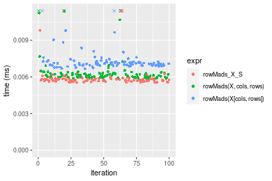
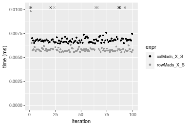
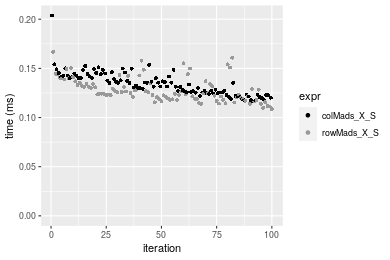
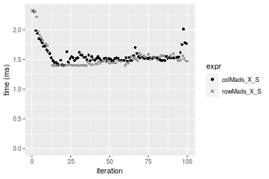
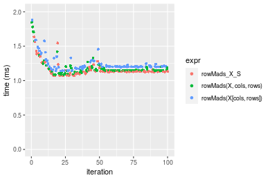
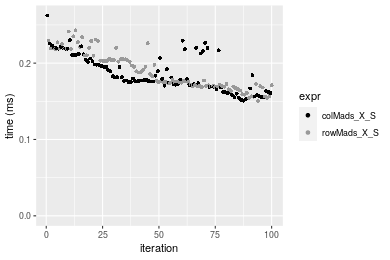
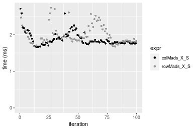

[matrixStats]: Benchmark report

---------------------------------------


# colMads() and rowMads() benchmarks on subsetted computation

This report benchmark the performance of colMads() and rowMads() on subsetted computation.


## Data type "integer"

### Data
```r
> rmatrix <- function(nrow, ncol, mode = c("logical", "double", "integer", "index"), range = c(-100, 
+     +100), na_prob = 0) {
+     mode <- match.arg(mode)
+     n <- nrow * ncol
+     if (mode == "logical") {
+         x <- sample(c(FALSE, TRUE), size = n, replace = TRUE)
+     }     else if (mode == "index") {
+         x <- seq_len(n)
+         mode <- "integer"
+     }     else {
+         x <- runif(n, min = range[1], max = range[2])
+     }
+     storage.mode(x) <- mode
+     if (na_prob > 0) 
+         x[sample(n, size = na_prob * n)] <- NA
+     dim(x) <- c(nrow, ncol)
+     x
+ }
> rmatrices <- function(scale = 10, seed = 1, ...) {
+     set.seed(seed)
+     data <- list()
+     data[[1]] <- rmatrix(nrow = scale * 1, ncol = scale * 1, ...)
+     data[[2]] <- rmatrix(nrow = scale * 10, ncol = scale * 10, ...)
+     data[[3]] <- rmatrix(nrow = scale * 100, ncol = scale * 1, ...)
+     data[[4]] <- t(data[[3]])
+     data[[5]] <- rmatrix(nrow = scale * 10, ncol = scale * 100, ...)
+     data[[6]] <- t(data[[5]])
+     names(data) <- sapply(data, FUN = function(x) paste(dim(x), collapse = "x"))
+     data
+ }
> data <- rmatrices(mode = mode)
```

### Results

#### 10x10 integer matrix

```r
> X <- data[["10x10"]]
> rows <- sample.int(nrow(X), size = nrow(X) * 0.7)
> cols <- sample.int(ncol(X), size = ncol(X) * 0.7)
> X_S <- X[rows, cols]
> gc()
           used  (Mb) gc trigger  (Mb) max used  (Mb)
Ncells  5243906 280.1    7916910 422.9  7916910 422.9
Vcells 10047688  76.7   33191153 253.3 53339345 407.0
> colStats <- microbenchmark(colMads_X_S = colMads(X_S, na.rm = FALSE), `colMads(X, rows, cols)` = colMads(X, 
+     rows = rows, cols = cols, na.rm = FALSE), `colMads(X[rows, cols])` = colMads(X[rows, cols], na.rm = FALSE), 
+     unit = "ms")
> X <- t(X)
> X_S <- t(X_S)
> gc()
           used  (Mb) gc trigger  (Mb) max used  (Mb)
Ncells  5231495 279.4    7916910 422.9  7916910 422.9
Vcells 10006268  76.4   33191153 253.3 53339345 407.0
> rowStats <- microbenchmark(rowMads_X_S = rowMads(X_S, na.rm = FALSE), `rowMads(X, cols, rows)` = rowMads(X, 
+     rows = cols, cols = rows, na.rm = FALSE), `rowMads(X[cols, rows])` = rowMads(X[cols, rows], na.rm = FALSE), 
+     unit = "ms")
```

_Table: Benchmarking of colMads_X_S(), colMads(X, rows, cols)() and colMads(X[rows, cols])() on integer+10x10 data. The top panel shows times in milliseconds and the bottom panel shows relative times._


|   |expr                   |      min|        lq|      mean|    median|        uq|      max|
|:--|:----------------------|--------:|---------:|---------:|---------:|---------:|--------:|
|1  |colMads_X_S            | 0.006461| 0.0066115| 0.0103122| 0.0067700| 0.0069370| 0.322087|
|2  |colMads(X, rows, cols) | 0.006751| 0.0069835| 0.0078828| 0.0072040| 0.0074595| 0.023508|
|3  |colMads(X[rows, cols]) | 0.007859| 0.0081680| 0.0096296| 0.0083655| 0.0088925| 0.022904|


|   |expr                   |      min|       lq|      mean|   median|       uq|       max|
|:--|:----------------------|--------:|--------:|---------:|--------:|--------:|---------:|
|1  |colMads_X_S            | 1.000000| 1.000000| 1.0000000| 1.000000| 1.000000| 1.0000000|
|2  |colMads(X, rows, cols) | 1.044885| 1.056266| 0.7644191| 1.064106| 1.075321| 0.0729865|
|3  |colMads(X[rows, cols]) | 1.216375| 1.235423| 0.9338008| 1.235672| 1.281894| 0.0711112|

_Table: Benchmarking of rowMads_X_S(), rowMads(X, cols, rows)() and rowMads(X[cols, rows])() on integer+10x10 data (transposed). The top panel shows times in milliseconds and the bottom panel shows relative times._


|   |expr                   |      min|        lq|      mean|    median|        uq|      max|
|:--|:----------------------|--------:|---------:|---------:|---------:|---------:|--------:|
|1  |rowMads_X_S            | 0.005541| 0.0056780| 0.0061529| 0.0057750| 0.0058790| 0.016646|
|2  |rowMads(X, cols, rows) | 0.005881| 0.0059870| 0.0095139| 0.0061465| 0.0063030| 0.308944|
|3  |rowMads(X[cols, rows]) | 0.006677| 0.0069645| 0.0075766| 0.0071005| 0.0072495| 0.026886|


|   |expr                   |      min|       lq|     mean|   median|       uq|       max|
|:--|:----------------------|--------:|--------:|--------:|--------:|--------:|---------:|
|1  |rowMads_X_S            | 1.000000| 1.000000| 1.000000| 1.000000| 1.000000|  1.000000|
|2  |rowMads(X, cols, rows) | 1.061361| 1.054421| 1.546228| 1.064329| 1.072121| 18.559654|
|3  |rowMads(X[cols, rows]) | 1.205017| 1.226576| 1.231385| 1.229524| 1.233118|  1.615163|

_Figure: Benchmarking of colMads_X_S(), colMads(X, rows, cols)() and colMads(X[rows, cols])() on integer+10x10 data  as well as rowMads_X_S(), rowMads(X, cols, rows)() and rowMads(X[cols, rows])() on the same data transposed.  Outliers are displayed as crosses.  Times are in milliseconds._



_Table: Benchmarking of colMads_X_S() and rowMads_X_S() on integer+10x10 data (original and transposed).  The top panel shows times in milliseconds and the bottom panel shows relative times._


|   |expr        |   min|     lq|     mean| median|    uq|     max|
|:--|:-----------|-----:|------:|--------:|------:|-----:|-------:|
|2  |rowMads_X_S | 5.541| 5.6780|  6.15294|  5.775| 5.879|  16.646|
|1  |colMads_X_S | 6.461| 6.6115| 10.31221|  6.770| 6.937| 322.087|


|   |expr        |      min|       lq|     mean|   median|       uq|      max|
|:--|:-----------|--------:|--------:|--------:|--------:|--------:|--------:|
|2  |rowMads_X_S | 1.000000| 1.000000| 1.000000| 1.000000| 1.000000|  1.00000|
|1  |colMads_X_S | 1.166035| 1.164406| 1.675981| 1.172294| 1.179963| 19.34921|

_Figure: Benchmarking of colMads_X_S() and rowMads_X_S() on integer+10x10 data (original and transposed).  Outliers are displayed as crosses. Times are in milliseconds._




#### 100x100 integer matrix

```r
> X <- data[["100x100"]]
> rows <- sample.int(nrow(X), size = nrow(X) * 0.7)
> cols <- sample.int(ncol(X), size = ncol(X) * 0.7)
> X_S <- X[rows, cols]
> gc()
          used  (Mb) gc trigger  (Mb) max used  (Mb)
Ncells 5230452 279.4    7916910 422.9  7916910 422.9
Vcells 9675367  73.9   33191153 253.3 53339345 407.0
> colStats <- microbenchmark(colMads_X_S = colMads(X_S, na.rm = FALSE), `colMads(X, rows, cols)` = colMads(X, 
+     rows = rows, cols = cols, na.rm = FALSE), `colMads(X[rows, cols])` = colMads(X[rows, cols], na.rm = FALSE), 
+     unit = "ms")
> X <- t(X)
> X_S <- t(X_S)
> gc()
          used  (Mb) gc trigger  (Mb) max used  (Mb)
Ncells 5230446 279.4    7916910 422.9  7916910 422.9
Vcells 9680450  73.9   33191153 253.3 53339345 407.0
> rowStats <- microbenchmark(rowMads_X_S = rowMads(X_S, na.rm = FALSE), `rowMads(X, cols, rows)` = rowMads(X, 
+     rows = cols, cols = rows, na.rm = FALSE), `rowMads(X[cols, rows])` = rowMads(X[cols, rows], na.rm = FALSE), 
+     unit = "ms")
```

_Table: Benchmarking of colMads_X_S(), colMads(X, rows, cols)() and colMads(X[rows, cols])() on integer+100x100 data. The top panel shows times in milliseconds and the bottom panel shows relative times._


|   |expr                   |      min|        lq|      mean|    median|        uq|      max|
|:--|:----------------------|--------:|---------:|---------:|---------:|---------:|--------:|
|1  |colMads_X_S            | 0.150744| 0.1725660| 0.1883551| 0.1817665| 0.2066325| 0.290421|
|2  |colMads(X, rows, cols) | 0.155053| 0.1769645| 0.1906507| 0.1871850| 0.2014920| 0.284946|
|3  |colMads(X[rows, cols]) | 0.162317| 0.1833385| 0.2039483| 0.1957515| 0.2191250| 0.321468|


|   |expr                   |      min|       lq|     mean|   median|        uq|       max|
|:--|:----------------------|--------:|--------:|--------:|--------:|---------:|---------:|
|1  |colMads_X_S            | 1.000000| 1.000000| 1.000000| 1.000000| 1.0000000| 1.0000000|
|2  |colMads(X, rows, cols) | 1.028585| 1.025489| 1.012188| 1.029810| 0.9751225| 0.9811481|
|3  |colMads(X[rows, cols]) | 1.076772| 1.062425| 1.082786| 1.076939| 1.0604576| 1.1069034|

_Table: Benchmarking of rowMads_X_S(), rowMads(X, cols, rows)() and rowMads(X[cols, rows])() on integer+100x100 data (transposed). The top panel shows times in milliseconds and the bottom panel shows relative times._


|   |expr                   |      min|        lq|      mean|   median|        uq|      max|
|:--|:----------------------|--------:|---------:|---------:|--------:|---------:|--------:|
|1  |rowMads_X_S            | 0.158667| 0.1711335| 0.1888072| 0.179911| 0.1994355| 0.285859|
|2  |rowMads(X, cols, rows) | 0.164316| 0.1754695| 0.1928971| 0.184062| 0.2051630| 0.276354|
|3  |rowMads(X[cols, rows]) | 0.168787| 0.1819430| 0.2041112| 0.191321| 0.2107595| 0.732824|


|   |expr                   |      min|       lq|     mean|   median|       uq|       max|
|:--|:----------------------|--------:|--------:|--------:|--------:|--------:|---------:|
|1  |rowMads_X_S            | 1.000000| 1.000000| 1.000000| 1.000000| 1.000000| 1.0000000|
|2  |rowMads(X, cols, rows) | 1.035603| 1.025337| 1.021662| 1.023073| 1.028719| 0.9667493|
|3  |rowMads(X[cols, rows]) | 1.063781| 1.063164| 1.081056| 1.063420| 1.056780| 2.5635855|

_Figure: Benchmarking of colMads_X_S(), colMads(X, rows, cols)() and colMads(X[rows, cols])() on integer+100x100 data  as well as rowMads_X_S(), rowMads(X, cols, rows)() and rowMads(X[cols, rows])() on the same data transposed.  Outliers are displayed as crosses.  Times are in milliseconds._


_Table: Benchmarking of colMads_X_S() and rowMads_X_S() on integer+100x100 data (original and transposed).  The top panel shows times in milliseconds and the bottom panel shows relative times._


|   |expr        |     min|       lq|     mean|   median|       uq|     max|
|:--|:-----------|-------:|--------:|--------:|--------:|--------:|-------:|
|2  |rowMads_X_S | 158.667| 171.1335| 188.8072| 179.9110| 199.4355| 285.859|
|1  |colMads_X_S | 150.744| 172.5660| 188.3551| 181.7665| 206.6325| 290.421|


|   |expr        |       min|       lq|      mean|   median|       uq|      max|
|:--|:-----------|---------:|--------:|---------:|--------:|--------:|--------:|
|2  |rowMads_X_S | 1.0000000| 1.000000| 1.0000000| 1.000000| 1.000000| 1.000000|
|1  |colMads_X_S | 0.9500652| 1.008371| 0.9976055| 1.010313| 1.036087| 1.015959|

_Figure: Benchmarking of colMads_X_S() and rowMads_X_S() on integer+100x100 data (original and transposed).  Outliers are displayed as crosses. Times are in milliseconds._


#### 1000x10 integer matrix

```r
> X <- data[["1000x10"]]
> rows <- sample.int(nrow(X), size = nrow(X) * 0.7)
> cols <- sample.int(ncol(X), size = ncol(X) * 0.7)
> X_S <- X[rows, cols]
> gc()
          used  (Mb) gc trigger  (Mb) max used  (Mb)
Ncells 5231194 279.4    7916910 422.9  7916910 422.9
Vcells 9679412  73.9   33191153 253.3 53339345 407.0
> colStats <- microbenchmark(colMads_X_S = colMads(X_S, na.rm = FALSE), `colMads(X, rows, cols)` = colMads(X, 
+     rows = rows, cols = cols, na.rm = FALSE), `colMads(X[rows, cols])` = colMads(X[rows, cols], na.rm = FALSE), 
+     unit = "ms")
> X <- t(X)
> X_S <- t(X_S)
> gc()
          used  (Mb) gc trigger  (Mb) max used  (Mb)
Ncells 5231188 279.4    7916910 422.9  7916910 422.9
Vcells 9684495  73.9   33191153 253.3 53339345 407.0
> rowStats <- microbenchmark(rowMads_X_S = rowMads(X_S, na.rm = FALSE), `rowMads(X, cols, rows)` = rowMads(X, 
+     rows = cols, cols = rows, na.rm = FALSE), `rowMads(X[cols, rows])` = rowMads(X[cols, rows], na.rm = FALSE), 
+     unit = "ms")
```

_Table: Benchmarking of colMads_X_S(), colMads(X, rows, cols)() and colMads(X[rows, cols])() on integer+1000x10 data. The top panel shows times in milliseconds and the bottom panel shows relative times._


|   |expr                   |      min|       lq|      mean|    median|        uq|      max|
|:--|:----------------------|--------:|--------:|---------:|---------:|---------:|--------:|
|1  |colMads_X_S            | 0.132375| 0.145282| 0.1571632| 0.1544420| 0.1685910| 0.218577|
|2  |colMads(X, rows, cols) | 0.136071| 0.144580| 0.1607086| 0.1546965| 0.1698660| 0.227247|
|3  |colMads(X[rows, cols]) | 0.142876| 0.151133| 0.1712344| 0.1625450| 0.1852135| 0.309634|


|   |expr                   |      min|       lq|     mean|   median|       uq|      max|
|:--|:----------------------|--------:|--------:|--------:|--------:|--------:|--------:|
|1  |colMads_X_S            | 1.000000| 1.000000| 1.000000| 1.000000| 1.000000| 1.000000|
|2  |colMads(X, rows, cols) | 1.027921| 0.995168| 1.022559| 1.001648| 1.007563| 1.039666|
|3  |colMads(X[rows, cols]) | 1.079328| 1.040273| 1.089532| 1.052466| 1.098597| 1.416590|

_Table: Benchmarking of rowMads_X_S(), rowMads(X, cols, rows)() and rowMads(X[cols, rows])() on integer+1000x10 data (transposed). The top panel shows times in milliseconds and the bottom panel shows relative times._


|   |expr                   |      min|        lq|      mean|    median|        uq|      max|
|:--|:----------------------|--------:|---------:|---------:|---------:|---------:|--------:|
|1  |rowMads_X_S            | 0.133105| 0.1412965| 0.1575030| 0.1494015| 0.1704670| 0.263786|
|2  |rowMads(X, cols, rows) | 0.138331| 0.1486965| 0.1668694| 0.1651235| 0.1814835| 0.220752|
|3  |rowMads(X[cols, rows]) | 0.145450| 0.1533105| 0.1759290| 0.1682140| 0.1897590| 0.269146|


|   |expr                   |      min|       lq|     mean|   median|       uq|       max|
|:--|:----------------------|--------:|--------:|--------:|--------:|--------:|---------:|
|1  |rowMads_X_S            | 1.000000| 1.000000| 1.000000| 1.000000| 1.000000| 1.0000000|
|2  |rowMads(X, cols, rows) | 1.039262| 1.052372| 1.059468| 1.105233| 1.064625| 0.8368602|
|3  |rowMads(X[cols, rows]) | 1.092746| 1.085027| 1.116988| 1.125919| 1.113171| 1.0203195|

_Figure: Benchmarking of colMads_X_S(), colMads(X, rows, cols)() and colMads(X[rows, cols])() on integer+1000x10 data  as well as rowMads_X_S(), rowMads(X, cols, rows)() and rowMads(X[cols, rows])() on the same data transposed.  Outliers are displayed as crosses.  Times are in milliseconds._


_Table: Benchmarking of colMads_X_S() and rowMads_X_S() on integer+1000x10 data (original and transposed).  The top panel shows times in milliseconds and the bottom panel shows relative times._


|   |expr        |     min|       lq|     mean|   median|      uq|     max|
|:--|:-----------|-------:|--------:|--------:|--------:|-------:|-------:|
|2  |rowMads_X_S | 133.105| 141.2965| 157.5030| 149.4015| 170.467| 263.786|
|1  |colMads_X_S | 132.375| 145.2820| 157.1632| 154.4420| 168.591| 218.577|


|   |expr        |       min|       lq|      mean|   median|        uq|       max|
|:--|:-----------|---------:|--------:|---------:|--------:|---------:|---------:|
|2  |rowMads_X_S | 1.0000000| 1.000000| 1.0000000| 1.000000| 1.0000000| 1.0000000|
|1  |colMads_X_S | 0.9945156| 1.028207| 0.9978423| 1.033738| 0.9889949| 0.8286149|

_Figure: Benchmarking of colMads_X_S() and rowMads_X_S() on integer+1000x10 data (original and transposed).  Outliers are displayed as crosses. Times are in milliseconds._


#### 10x1000 integer matrix

```r
> X <- data[["10x1000"]]
> rows <- sample.int(nrow(X), size = nrow(X) * 0.7)
> cols <- sample.int(ncol(X), size = ncol(X) * 0.7)
> X_S <- X[rows, cols]
> gc()
          used  (Mb) gc trigger  (Mb) max used  (Mb)
Ncells 5231398 279.4    7916910 422.9  7916910 422.9
Vcells 9680244  73.9   33191153 253.3 53339345 407.0
> colStats <- microbenchmark(colMads_X_S = colMads(X_S, na.rm = FALSE), `colMads(X, rows, cols)` = colMads(X, 
+     rows = rows, cols = cols, na.rm = FALSE), `colMads(X[rows, cols])` = colMads(X[rows, cols], na.rm = FALSE), 
+     unit = "ms")
> X <- t(X)
> X_S <- t(X_S)
> gc()
          used  (Mb) gc trigger  (Mb) max used  (Mb)
Ncells 5231392 279.4    7916910 422.9  7916910 422.9
Vcells 9685327  73.9   33191153 253.3 53339345 407.0
> rowStats <- microbenchmark(rowMads_X_S = rowMads(X_S, na.rm = FALSE), `rowMads(X, cols, rows)` = rowMads(X, 
+     rows = cols, cols = rows, na.rm = FALSE), `rowMads(X[cols, rows])` = rowMads(X[cols, rows], na.rm = FALSE), 
+     unit = "ms")
```

_Table: Benchmarking of colMads_X_S(), colMads(X, rows, cols)() and colMads(X[rows, cols])() on integer+10x1000 data. The top panel shows times in milliseconds and the bottom panel shows relative times._


|   |expr                   |      min|        lq|      mean|    median|        uq|      max|
|:--|:----------------------|--------:|---------:|---------:|---------:|---------:|--------:|
|1  |colMads_X_S            | 0.116337| 0.1250735| 0.1341516| 0.1331330| 0.1417995| 0.203789|
|2  |colMads(X, rows, cols) | 0.122930| 0.1317790| 0.1402742| 0.1381900| 0.1449090| 0.175553|
|3  |colMads(X[rows, cols]) | 0.129010| 0.1411950| 0.1485621| 0.1472825| 0.1560985| 0.185881|


|   |expr                   |      min|       lq|    mean|   median|       uq|       max|
|:--|:----------------------|--------:|--------:|-------:|--------:|--------:|---------:|
|1  |colMads_X_S            | 1.000000| 1.000000| 1.00000| 1.000000| 1.000000| 1.0000000|
|2  |colMads(X, rows, cols) | 1.056672| 1.053613| 1.04564| 1.037985| 1.021929| 0.8614449|
|3  |colMads(X[rows, cols]) | 1.108934| 1.128896| 1.10742| 1.106281| 1.100840| 0.9121248|

_Table: Benchmarking of rowMads_X_S(), rowMads(X, cols, rows)() and rowMads(X[cols, rows])() on integer+10x1000 data (transposed). The top panel shows times in milliseconds and the bottom panel shows relative times._


|   |expr                   |      min|        lq|      mean|    median|        uq|      max|
|:--|:----------------------|--------:|---------:|---------:|---------:|---------:|--------:|
|1  |rowMads_X_S            | 0.108344| 0.1189930| 0.1282284| 0.1246955| 0.1343735| 0.166795|
|2  |rowMads(X, cols, rows) | 0.111563| 0.1243335| 0.1351196| 0.1306870| 0.1416940| 0.199874|
|3  |rowMads(X[cols, rows]) | 0.118255| 0.1307120| 0.1409377| 0.1370545| 0.1507270| 0.203455|


|   |expr                   |      min|       lq|     mean|   median|       uq|      max|
|:--|:----------------------|--------:|--------:|--------:|--------:|--------:|--------:|
|1  |rowMads_X_S            | 1.000000| 1.000000| 1.000000| 1.000000| 1.000000| 1.000000|
|2  |rowMads(X, cols, rows) | 1.029711| 1.044881| 1.053742| 1.048049| 1.054479| 1.198321|
|3  |rowMads(X[cols, rows]) | 1.091477| 1.098485| 1.099115| 1.099113| 1.121702| 1.219791|

_Figure: Benchmarking of colMads_X_S(), colMads(X, rows, cols)() and colMads(X[rows, cols])() on integer+10x1000 data  as well as rowMads_X_S(), rowMads(X, cols, rows)() and rowMads(X[cols, rows])() on the same data transposed.  Outliers are displayed as crosses.  Times are in milliseconds._


_Table: Benchmarking of colMads_X_S() and rowMads_X_S() on integer+10x1000 data (original and transposed).  The top panel shows times in milliseconds and the bottom panel shows relative times._


|   |expr        |     min|       lq|     mean|   median|       uq|     max|
|:--|:-----------|-------:|--------:|--------:|--------:|--------:|-------:|
|2  |rowMads_X_S | 108.344| 118.9930| 128.2284| 124.6955| 134.3735| 166.795|
|1  |colMads_X_S | 116.337| 125.0735| 134.1516| 133.1330| 141.7995| 203.789|


|   |expr        |      min|     lq|     mean|   median|       uq|      max|
|:--|:-----------|--------:|------:|--------:|--------:|--------:|--------:|
|2  |rowMads_X_S | 1.000000| 1.0000| 1.000000| 1.000000| 1.000000| 1.000000|
|1  |colMads_X_S | 1.073774| 1.0511| 1.046193| 1.067665| 1.055264| 1.221793|

_Figure: Benchmarking of colMads_X_S() and rowMads_X_S() on integer+10x1000 data (original and transposed).  Outliers are displayed as crosses. Times are in milliseconds._




#### 100x1000 integer matrix

```r
> X <- data[["100x1000"]]
> rows <- sample.int(nrow(X), size = nrow(X) * 0.7)
> cols <- sample.int(ncol(X), size = ncol(X) * 0.7)
> X_S <- X[rows, cols]
> gc()
          used  (Mb) gc trigger  (Mb) max used  (Mb)
Ncells 5231611 279.4    7916910 422.9  7916910 422.9
Vcells 9702906  74.1   33191153 253.3 53339345 407.0
> colStats <- microbenchmark(colMads_X_S = colMads(X_S, na.rm = FALSE), `colMads(X, rows, cols)` = colMads(X, 
+     rows = rows, cols = cols, na.rm = FALSE), `colMads(X[rows, cols])` = colMads(X[rows, cols], na.rm = FALSE), 
+     unit = "ms")
> X <- t(X)
> X_S <- t(X_S)
> gc()
          used  (Mb) gc trigger  (Mb) max used  (Mb)
Ncells 5231605 279.4    7916910 422.9  7916910 422.9
Vcells 9752989  74.5   33191153 253.3 53339345 407.0
> rowStats <- microbenchmark(rowMads_X_S = rowMads(X_S, na.rm = FALSE), `rowMads(X, cols, rows)` = rowMads(X, 
+     rows = cols, cols = rows, na.rm = FALSE), `rowMads(X[cols, rows])` = rowMads(X[cols, rows], na.rm = FALSE), 
+     unit = "ms")
```

_Table: Benchmarking of colMads_X_S(), colMads(X, rows, cols)() and colMads(X[rows, cols])() on integer+100x1000 data. The top panel shows times in milliseconds and the bottom panel shows relative times._


|   |expr                   |      min|       lq|     mean|   median|       uq|      max|
|:--|:----------------------|--------:|--------:|--------:|--------:|--------:|--------:|
|1  |colMads_X_S            | 1.400372| 1.486560| 1.569583| 1.524242| 1.559886| 2.352329|
|2  |colMads(X, rows, cols) | 1.413594| 1.505658| 1.573534| 1.540343| 1.567050| 2.504831|
|3  |colMads(X[rows, cols]) | 1.469610| 1.557375| 1.654098| 1.597702| 1.650988| 2.449214|


|   |expr                   |      min|       lq|     mean|   median|       uq|      max|
|:--|:----------------------|--------:|--------:|--------:|--------:|--------:|--------:|
|1  |colMads_X_S            | 1.000000| 1.000000| 1.000000| 1.000000| 1.000000| 1.000000|
|2  |colMads(X, rows, cols) | 1.009442| 1.012847| 1.002517| 1.010563| 1.004592| 1.064830|
|3  |colMads(X[rows, cols]) | 1.049443| 1.047637| 1.053846| 1.048194| 1.058403| 1.041187|

_Table: Benchmarking of rowMads_X_S(), rowMads(X, cols, rows)() and rowMads(X[cols, rows])() on integer+100x1000 data (transposed). The top panel shows times in milliseconds and the bottom panel shows relative times._


|   |expr                   |      min|       lq|     mean|   median|       uq|      max|
|:--|:----------------------|--------:|--------:|--------:|--------:|--------:|--------:|
|1  |rowMads_X_S            | 1.394227| 1.417390| 1.525045| 1.479062| 1.539834| 2.349436|
|2  |rowMads(X, cols, rows) | 1.414948| 1.459517| 1.538112| 1.511899| 1.560473| 2.234901|
|3  |rowMads(X[cols, rows]) | 1.462044| 1.506732| 1.585514| 1.552474| 1.627152| 2.141753|


|   |expr                   |      min|       lq|     mean|   median|       uq|      max|
|:--|:----------------------|--------:|--------:|--------:|--------:|--------:|--------:|
|1  |rowMads_X_S            | 1.000000| 1.000000| 1.000000| 1.000000| 1.000000| 1.000000|
|2  |rowMads(X, cols, rows) | 1.014862| 1.029721| 1.008568| 1.022201| 1.013403| 0.951250|
|3  |rowMads(X[cols, rows]) | 1.048641| 1.063032| 1.039651| 1.049634| 1.056706| 0.911603|

_Figure: Benchmarking of colMads_X_S(), colMads(X, rows, cols)() and colMads(X[rows, cols])() on integer+100x1000 data  as well as rowMads_X_S(), rowMads(X, cols, rows)() and rowMads(X[cols, rows])() on the same data transposed.  Outliers are displayed as crosses.  Times are in milliseconds._


_Table: Benchmarking of colMads_X_S() and rowMads_X_S() on integer+100x1000 data (original and transposed).  The top panel shows times in milliseconds and the bottom panel shows relative times._


|   |expr        |      min|      lq|     mean|   median|       uq|      max|
|:--|:-----------|--------:|-------:|--------:|--------:|--------:|--------:|
|2  |rowMads_X_S | 1.394227| 1.41739| 1.525045| 1.479062| 1.539834| 2.349436|
|1  |colMads_X_S | 1.400372| 1.48656| 1.569583| 1.524242| 1.559886| 2.352329|


|   |expr        |      min|       lq|     mean|   median|       uq|      max|
|:--|:-----------|--------:|--------:|--------:|--------:|--------:|--------:|
|2  |rowMads_X_S | 1.000000| 1.000000| 1.000000| 1.000000| 1.000000| 1.000000|
|1  |colMads_X_S | 1.004407| 1.048801| 1.029204| 1.030546| 1.013022| 1.001231|

_Figure: Benchmarking of colMads_X_S() and rowMads_X_S() on integer+100x1000 data (original and transposed).  Outliers are displayed as crosses. Times are in milliseconds._




#### 1000x100 integer matrix

```r
> X <- data[["1000x100"]]
> rows <- sample.int(nrow(X), size = nrow(X) * 0.7)
> cols <- sample.int(ncol(X), size = ncol(X) * 0.7)
> X_S <- X[rows, cols]
> gc()
          used  (Mb) gc trigger  (Mb) max used  (Mb)
Ncells 5231821 279.5    7916910 422.9  7916910 422.9
Vcells 9703676  74.1   33191153 253.3 53339345 407.0
> colStats <- microbenchmark(colMads_X_S = colMads(X_S, na.rm = FALSE), `colMads(X, rows, cols)` = colMads(X, 
+     rows = rows, cols = cols, na.rm = FALSE), `colMads(X[rows, cols])` = colMads(X[rows, cols], na.rm = FALSE), 
+     unit = "ms")
> X <- t(X)
> X_S <- t(X_S)
> gc()
          used  (Mb) gc trigger  (Mb) max used  (Mb)
Ncells 5231815 279.5    7916910 422.9  7916910 422.9
Vcells 9753759  74.5   33191153 253.3 53339345 407.0
> rowStats <- microbenchmark(rowMads_X_S = rowMads(X_S, na.rm = FALSE), `rowMads(X, cols, rows)` = rowMads(X, 
+     rows = cols, cols = rows, na.rm = FALSE), `rowMads(X[cols, rows])` = rowMads(X[cols, rows], na.rm = FALSE), 
+     unit = "ms")
```

_Table: Benchmarking of colMads_X_S(), colMads(X, rows, cols)() and colMads(X[rows, cols])() on integer+1000x100 data. The top panel shows times in milliseconds and the bottom panel shows relative times._


|   |expr                   |      min|       lq|     mean|   median|       uq|      max|
|:--|:----------------------|--------:|--------:|--------:|--------:|--------:|--------:|
|1  |colMads_X_S            | 1.068531| 1.103423| 1.263605| 1.190616| 1.350091| 2.042932|
|2  |colMads(X, rows, cols) | 1.082369| 1.130214| 1.305716| 1.267970| 1.382912| 2.163751|
|3  |colMads(X[rows, cols]) | 1.131169| 1.179632| 1.356598| 1.344891| 1.445767| 2.318192|


|   |expr                   |      min|       lq|     mean|   median|       uq|      max|
|:--|:----------------------|--------:|--------:|--------:|--------:|--------:|--------:|
|1  |colMads_X_S            | 1.000000| 1.000000| 1.000000| 1.000000| 1.000000| 1.000000|
|2  |colMads(X, rows, cols) | 1.012951| 1.024280| 1.033326| 1.064970| 1.024311| 1.059140|
|3  |colMads(X[rows, cols]) | 1.058621| 1.069066| 1.073594| 1.129576| 1.070866| 1.134738|

_Table: Benchmarking of rowMads_X_S(), rowMads(X, cols, rows)() and rowMads(X[cols, rows])() on integer+1000x100 data (transposed). The top panel shows times in milliseconds and the bottom panel shows relative times._


|   |expr                   |      min|       lq|     mean|   median|       uq|      max|
|:--|:----------------------|--------:|--------:|--------:|--------:|--------:|--------:|
|1  |rowMads_X_S            | 1.069824| 1.125537| 1.162773| 1.131031| 1.144457| 1.634217|
|2  |rowMads(X, cols, rows) | 1.084957| 1.143484| 1.188054| 1.148244| 1.179420| 1.846898|
|3  |rowMads(X[cols, rows]) | 1.139413| 1.198958| 1.242890| 1.201920| 1.237421| 1.880642|


|   |expr                   |      min|       lq|     mean|   median|       uq|      max|
|:--|:----------------------|--------:|--------:|--------:|--------:|--------:|--------:|
|1  |rowMads_X_S            | 1.000000| 1.000000| 1.000000| 1.000000| 1.000000| 1.000000|
|2  |rowMads(X, cols, rows) | 1.014145| 1.015945| 1.021742| 1.015219| 1.030549| 1.130142|
|3  |rowMads(X[cols, rows]) | 1.065047| 1.065232| 1.068902| 1.062676| 1.081230| 1.150791|

_Figure: Benchmarking of colMads_X_S(), colMads(X, rows, cols)() and colMads(X[rows, cols])() on integer+1000x100 data  as well as rowMads_X_S(), rowMads(X, cols, rows)() and rowMads(X[cols, rows])() on the same data transposed.  Outliers are displayed as crosses.  Times are in milliseconds._



_Table: Benchmarking of colMads_X_S() and rowMads_X_S() on integer+1000x100 data (original and transposed).  The top panel shows times in milliseconds and the bottom panel shows relative times._


|   |expr        |      min|       lq|     mean|   median|       uq|      max|
|:--|:-----------|--------:|--------:|--------:|--------:|--------:|--------:|
|2  |rowMads_X_S | 1.069824| 1.125537| 1.162773| 1.131031| 1.144457| 1.634217|
|1  |colMads_X_S | 1.068531| 1.103423| 1.263605| 1.190616| 1.350091| 2.042932|


|   |expr        |       min|        lq|     mean|   median|       uq|      max|
|:--|:-----------|---------:|---------:|--------:|--------:|--------:|--------:|
|2  |rowMads_X_S | 1.0000000| 1.0000000| 1.000000| 1.000000| 1.000000| 1.000000|
|1  |colMads_X_S | 0.9987914| 0.9803525| 1.086717| 1.052682| 1.179678| 1.250098|

_Figure: Benchmarking of colMads_X_S() and rowMads_X_S() on integer+1000x100 data (original and transposed).  Outliers are displayed as crosses. Times are in milliseconds._


## Data type "double"

### Data
```r
> rmatrix <- function(nrow, ncol, mode = c("logical", "double", "integer", "index"), range = c(-100, 
+     +100), na_prob = 0) {
+     mode <- match.arg(mode)
+     n <- nrow * ncol
+     if (mode == "logical") {
+         x <- sample(c(FALSE, TRUE), size = n, replace = TRUE)
+     }     else if (mode == "index") {
+         x <- seq_len(n)
+         mode <- "integer"
+     }     else {
+         x <- runif(n, min = range[1], max = range[2])
+     }
+     storage.mode(x) <- mode
+     if (na_prob > 0) 
+         x[sample(n, size = na_prob * n)] <- NA
+     dim(x) <- c(nrow, ncol)
+     x
+ }
> rmatrices <- function(scale = 10, seed = 1, ...) {
+     set.seed(seed)
+     data <- list()
+     data[[1]] <- rmatrix(nrow = scale * 1, ncol = scale * 1, ...)
+     data[[2]] <- rmatrix(nrow = scale * 10, ncol = scale * 10, ...)
+     data[[3]] <- rmatrix(nrow = scale * 100, ncol = scale * 1, ...)
+     data[[4]] <- t(data[[3]])
+     data[[5]] <- rmatrix(nrow = scale * 10, ncol = scale * 100, ...)
+     data[[6]] <- t(data[[5]])
+     names(data) <- sapply(data, FUN = function(x) paste(dim(x), collapse = "x"))
+     data
+ }
> data <- rmatrices(mode = mode)
```

### Results

#### 10x10 double matrix

```r
> X <- data[["10x10"]]
> rows <- sample.int(nrow(X), size = nrow(X) * 0.7)
> cols <- sample.int(ncol(X), size = ncol(X) * 0.7)
> X_S <- X[rows, cols]
> gc()
          used  (Mb) gc trigger  (Mb) max used  (Mb)
Ncells 5232039 279.5    7916910 422.9  7916910 422.9
Vcells 9794766  74.8   33191153 253.3 53339345 407.0
> colStats <- microbenchmark(colMads_X_S = colMads(X_S, na.rm = FALSE), `colMads(X, rows, cols)` = colMads(X, 
+     rows = rows, cols = cols, na.rm = FALSE), `colMads(X[rows, cols])` = colMads(X[rows, cols], na.rm = FALSE), 
+     unit = "ms")
> X <- t(X)
> X_S <- t(X_S)
> gc()
          used  (Mb) gc trigger  (Mb) max used  (Mb)
Ncells 5232024 279.5    7916910 422.9  7916910 422.9
Vcells 9794934  74.8   33191153 253.3 53339345 407.0
> rowStats <- microbenchmark(rowMads_X_S = rowMads(X_S, na.rm = FALSE), `rowMads(X, cols, rows)` = rowMads(X, 
+     rows = cols, cols = rows, na.rm = FALSE), `rowMads(X[cols, rows])` = rowMads(X[cols, rows], na.rm = FALSE), 
+     unit = "ms")
```

_Table: Benchmarking of colMads_X_S(), colMads(X, rows, cols)() and colMads(X[rows, cols])() on double+10x10 data. The top panel shows times in milliseconds and the bottom panel shows relative times._


|   |expr                   |      min|       lq|      mean|    median|       uq|      max|
|:--|:----------------------|--------:|--------:|---------:|---------:|--------:|--------:|
|1  |colMads_X_S            | 0.006820| 0.007030| 0.0080161| 0.0071670| 0.007302| 0.043344|
|2  |colMads(X, rows, cols) | 0.007211| 0.007546| 0.0077459| 0.0076925| 0.007850| 0.011437|
|3  |colMads(X[rows, cols]) | 0.008061| 0.008479| 0.0087793| 0.0085880| 0.008812| 0.013953|


|   |expr                   |      min|       lq|      mean|   median|       uq|       max|
|:--|:----------------------|--------:|--------:|---------:|--------:|--------:|---------:|
|1  |colMads_X_S            | 1.000000| 1.000000| 1.0000000| 1.000000| 1.000000| 1.0000000|
|2  |colMads(X, rows, cols) | 1.057331| 1.073400| 0.9662843| 1.073322| 1.075048| 0.2638658|
|3  |colMads(X[rows, cols]) | 1.181965| 1.206117| 1.0951979| 1.198270| 1.206793| 0.3219131|

_Table: Benchmarking of rowMads_X_S(), rowMads(X, cols, rows)() and rowMads(X[cols, rows])() on double+10x10 data (transposed). The top panel shows times in milliseconds and the bottom panel shows relative times._


|   |expr                   |      min|        lq|      mean|    median|        uq|      max|
|:--|:----------------------|--------:|---------:|---------:|---------:|---------:|--------:|
|1  |rowMads_X_S            | 0.005948| 0.0062135| 0.0064334| 0.0063220| 0.0064810| 0.014349|
|2  |rowMads(X, cols, rows) | 0.006447| 0.0066480| 0.0071979| 0.0067475| 0.0068950| 0.041921|
|3  |rowMads(X[cols, rows]) | 0.007092| 0.0074300| 0.0076489| 0.0075585| 0.0077265| 0.012075|


|   |expr                   |      min|       lq|     mean|   median|       uq|       max|
|:--|:----------------------|--------:|--------:|--------:|--------:|--------:|---------:|
|1  |rowMads_X_S            | 1.000000| 1.000000| 1.000000| 1.000000| 1.000000| 1.0000000|
|2  |rowMads(X, cols, rows) | 1.083894| 1.069928| 1.118843| 1.067305| 1.063879| 2.9215276|
|3  |rowMads(X[cols, rows]) | 1.192334| 1.195783| 1.188941| 1.195587| 1.192177| 0.8415221|

_Figure: Benchmarking of colMads_X_S(), colMads(X, rows, cols)() and colMads(X[rows, cols])() on double+10x10 data  as well as rowMads_X_S(), rowMads(X, cols, rows)() and rowMads(X[cols, rows])() on the same data transposed.  Outliers are displayed as crosses.  Times are in milliseconds._


_Table: Benchmarking of colMads_X_S() and rowMads_X_S() on double+10x10 data (original and transposed).  The top panel shows times in milliseconds and the bottom panel shows relative times._


|   |expr        |   min|     lq|    mean| median|    uq|    max|
|:--|:-----------|-----:|------:|-------:|------:|-----:|------:|
|2  |rowMads_X_S | 5.948| 6.2135| 6.43337|  6.322| 6.481| 14.349|
|1  |colMads_X_S | 6.820| 7.0300| 8.01614|  7.167| 7.302| 43.344|


|   |expr        |      min|       lq|     mean|  median|       uq|      max|
|:--|:-----------|--------:|--------:|--------:|-------:|--------:|--------:|
|2  |rowMads_X_S | 1.000000| 1.000000| 1.000000| 1.00000| 1.000000| 1.000000|
|1  |colMads_X_S | 1.146604| 1.131407| 1.246025| 1.13366| 1.126678| 3.020698|

_Figure: Benchmarking of colMads_X_S() and rowMads_X_S() on double+10x10 data (original and transposed).  Outliers are displayed as crosses. Times are in milliseconds._


#### 100x100 double matrix

```r
> X <- data[["100x100"]]
> rows <- sample.int(nrow(X), size = nrow(X) * 0.7)
> cols <- sample.int(ncol(X), size = ncol(X) * 0.7)
> X_S <- X[rows, cols]
> gc()
          used  (Mb) gc trigger  (Mb) max used  (Mb)
Ncells 5232237 279.5    7916910 422.9  7916910 422.9
Vcells 9800702  74.8   33191153 253.3 53339345 407.0
> colStats <- microbenchmark(colMads_X_S = colMads(X_S, na.rm = FALSE), `colMads(X, rows, cols)` = colMads(X, 
+     rows = rows, cols = cols, na.rm = FALSE), `colMads(X[rows, cols])` = colMads(X[rows, cols], na.rm = FALSE), 
+     unit = "ms")
> X <- t(X)
> X_S <- t(X_S)
> gc()
          used  (Mb) gc trigger  (Mb) max used  (Mb)
Ncells 5232231 279.5    7916910 422.9  7916910 422.9
Vcells 9810785  74.9   33191153 253.3 53339345 407.0
> rowStats <- microbenchmark(rowMads_X_S = rowMads(X_S, na.rm = FALSE), `rowMads(X, cols, rows)` = rowMads(X, 
+     rows = cols, cols = rows, na.rm = FALSE), `rowMads(X[cols, rows])` = rowMads(X[cols, rows], na.rm = FALSE), 
+     unit = "ms")
```

_Table: Benchmarking of colMads_X_S(), colMads(X, rows, cols)() and colMads(X[rows, cols])() on double+100x100 data. The top panel shows times in milliseconds and the bottom panel shows relative times._


|   |expr                   |      min|        lq|      mean|    median|        uq|      max|
|:--|:----------------------|--------:|---------:|---------:|---------:|---------:|--------:|
|1  |colMads_X_S            | 0.181034| 0.1857450| 0.2217456| 0.2159095| 0.2376490| 0.306645|
|2  |colMads(X, rows, cols) | 0.185944| 0.1943390| 0.2270757| 0.2206815| 0.2441455| 0.313599|
|3  |colMads(X[rows, cols]) | 0.192420| 0.1978665| 0.2360815| 0.2273085| 0.2600040| 0.361669|


|   |expr                   |      min|       lq|     mean|   median|       uq|      max|
|:--|:----------------------|--------:|--------:|--------:|--------:|--------:|--------:|
|1  |colMads_X_S            | 1.000000| 1.000000| 1.000000| 1.000000| 1.000000| 1.000000|
|2  |colMads(X, rows, cols) | 1.027122| 1.046268| 1.024037| 1.022102| 1.027337| 1.022678|
|3  |colMads(X[rows, cols]) | 1.062894| 1.065259| 1.064650| 1.052795| 1.094067| 1.179439|

_Table: Benchmarking of rowMads_X_S(), rowMads(X, cols, rows)() and rowMads(X[cols, rows])() on double+100x100 data (transposed). The top panel shows times in milliseconds and the bottom panel shows relative times._


|   |expr                   |      min|        lq|      mean|    median|        uq|      max|
|:--|:----------------------|--------:|---------:|---------:|---------:|---------:|--------:|
|1  |rowMads_X_S            | 0.180731| 0.1869020| 0.2265100| 0.2222905| 0.2551420| 0.309529|
|2  |rowMads(X, cols, rows) | 0.185157| 0.1957525| 0.2300699| 0.2278440| 0.2462805| 0.345742|
|3  |rowMads(X[cols, rows]) | 0.191981| 0.2089810| 0.2381580| 0.2344965| 0.2535245| 0.324251|


|   |expr                   |      min|       lq|     mean|   median|        uq|      max|
|:--|:----------------------|--------:|--------:|--------:|--------:|---------:|--------:|
|1  |rowMads_X_S            | 1.000000| 1.000000| 1.000000| 1.000000| 1.0000000| 1.000000|
|2  |rowMads(X, cols, rows) | 1.024489| 1.047354| 1.015716| 1.024983| 0.9652684| 1.116994|
|3  |rowMads(X[cols, rows]) | 1.062247| 1.118131| 1.051424| 1.054910| 0.9936604| 1.047563|

_Figure: Benchmarking of colMads_X_S(), colMads(X, rows, cols)() and colMads(X[rows, cols])() on double+100x100 data  as well as rowMads_X_S(), rowMads(X, cols, rows)() and rowMads(X[cols, rows])() on the same data transposed.  Outliers are displayed as crosses.  Times are in milliseconds._


_Table: Benchmarking of colMads_X_S() and rowMads_X_S() on double+100x100 data (original and transposed).  The top panel shows times in milliseconds and the bottom panel shows relative times._


|   |expr        |     min|      lq|     mean|   median|      uq|     max|
|:--|:-----------|-------:|-------:|--------:|--------:|-------:|-------:|
|1  |colMads_X_S | 181.034| 185.745| 221.7457| 215.9095| 237.649| 306.645|
|2  |rowMads_X_S | 180.731| 186.902| 226.5100| 222.2905| 255.142| 309.529|


|   |expr        |       min|       lq|     mean|   median|       uq|      max|
|:--|:-----------|---------:|--------:|--------:|--------:|--------:|--------:|
|1  |colMads_X_S | 1.0000000| 1.000000| 1.000000| 1.000000| 1.000000| 1.000000|
|2  |rowMads_X_S | 0.9983263| 1.006229| 1.021486| 1.029554| 1.073609| 1.009405|

_Figure: Benchmarking of colMads_X_S() and rowMads_X_S() on double+100x100 data (original and transposed).  Outliers are displayed as crosses. Times are in milliseconds._


#### 1000x10 double matrix

```r
> X <- data[["1000x10"]]
> rows <- sample.int(nrow(X), size = nrow(X) * 0.7)
> cols <- sample.int(ncol(X), size = ncol(X) * 0.7)
> X_S <- X[rows, cols]
> gc()
          used  (Mb) gc trigger  (Mb) max used  (Mb)
Ncells 5232436 279.5    7916910 422.9  7916910 422.9
Vcells 9802098  74.8   33191153 253.3 53339345 407.0
> colStats <- microbenchmark(colMads_X_S = colMads(X_S, na.rm = FALSE), `colMads(X, rows, cols)` = colMads(X, 
+     rows = rows, cols = cols, na.rm = FALSE), `colMads(X[rows, cols])` = colMads(X[rows, cols], na.rm = FALSE), 
+     unit = "ms")
> X <- t(X)
> X_S <- t(X_S)
> gc()
          used  (Mb) gc trigger  (Mb) max used  (Mb)
Ncells 5232430 279.5    7916910 422.9  7916910 422.9
Vcells 9812181  74.9   33191153 253.3 53339345 407.0
> rowStats <- microbenchmark(rowMads_X_S = rowMads(X_S, na.rm = FALSE), `rowMads(X, cols, rows)` = rowMads(X, 
+     rows = cols, cols = rows, na.rm = FALSE), `rowMads(X[cols, rows])` = rowMads(X[cols, rows], na.rm = FALSE), 
+     unit = "ms")
```

_Table: Benchmarking of colMads_X_S(), colMads(X, rows, cols)() and colMads(X[rows, cols])() on double+1000x10 data. The top panel shows times in milliseconds and the bottom panel shows relative times._


|   |expr                   |      min|        lq|      mean|    median|       uq|      max|
|:--|:----------------------|--------:|---------:|---------:|---------:|--------:|--------:|
|2  |colMads(X, rows, cols) | 0.185844| 0.2026050| 0.2234706| 0.2167915| 0.235308| 0.293963|
|1  |colMads_X_S            | 0.180837| 0.1986070| 0.2244415| 0.2170095| 0.238893| 0.317030|
|3  |colMads(X[rows, cols]) | 0.192272| 0.2089135| 0.2324122| 0.2212985| 0.248980| 0.345589|


|   |expr                   |      min|       lq|     mean|   median|       uq|      max|
|:--|:----------------------|--------:|--------:|--------:|--------:|--------:|--------:|
|2  |colMads(X, rows, cols) | 1.000000| 1.000000| 1.000000| 1.000000| 1.000000| 1.000000|
|1  |colMads_X_S            | 0.973058| 0.980267| 1.004344| 1.001006| 1.015235| 1.078469|
|3  |colMads(X[rows, cols]) | 1.034588| 1.031137| 1.040012| 1.020790| 1.058103| 1.175621|

_Table: Benchmarking of rowMads_X_S(), rowMads(X, cols, rows)() and rowMads(X[cols, rows])() on double+1000x10 data (transposed). The top panel shows times in milliseconds and the bottom panel shows relative times._


|   |expr                   |      min|        lq|      mean|    median|       uq|      max|
|:--|:----------------------|--------:|---------:|---------:|---------:|--------:|--------:|
|1  |rowMads_X_S            | 0.172049| 0.1858410| 0.2198896| 0.2028665| 0.223965| 0.382953|
|2  |rowMads(X, cols, rows) | 0.175466| 0.1821025| 0.2244618| 0.2156545| 0.240009| 0.378661|
|3  |rowMads(X[cols, rows]) | 0.184379| 0.1902135| 0.2355515| 0.2248160| 0.251848| 0.471076|


|   |expr                   |      min|        lq|     mean|   median|       uq|       max|
|:--|:----------------------|--------:|---------:|--------:|--------:|--------:|---------:|
|1  |rowMads_X_S            | 1.000000| 1.0000000| 1.000000| 1.000000| 1.000000| 1.0000000|
|2  |rowMads(X, cols, rows) | 1.019861| 0.9798833| 1.020793| 1.063036| 1.071636| 0.9887924|
|3  |rowMads(X[cols, rows]) | 1.071666| 1.0235282| 1.071226| 1.108197| 1.124497| 1.2301144|

_Figure: Benchmarking of colMads_X_S(), colMads(X, rows, cols)() and colMads(X[rows, cols])() on double+1000x10 data  as well as rowMads_X_S(), rowMads(X, cols, rows)() and rowMads(X[cols, rows])() on the same data transposed.  Outliers are displayed as crosses.  Times are in milliseconds._


_Table: Benchmarking of colMads_X_S() and rowMads_X_S() on double+1000x10 data (original and transposed).  The top panel shows times in milliseconds and the bottom panel shows relative times._


|   |expr        |     min|      lq|     mean|   median|      uq|     max|
|:--|:-----------|-------:|-------:|--------:|--------:|-------:|-------:|
|2  |rowMads_X_S | 172.049| 185.841| 219.8896| 202.8665| 223.965| 382.953|
|1  |colMads_X_S | 180.837| 198.607| 224.4415| 217.0095| 238.893| 317.030|


|   |expr        |      min|       lq|     mean|   median|       uq|       max|
|:--|:-----------|--------:|--------:|--------:|--------:|--------:|---------:|
|2  |rowMads_X_S | 1.000000| 1.000000| 1.000000| 1.000000| 1.000000| 1.0000000|
|1  |colMads_X_S | 1.051079| 1.068693| 1.020701| 1.069716| 1.066653| 0.8278562|

_Figure: Benchmarking of colMads_X_S() and rowMads_X_S() on double+1000x10 data (original and transposed).  Outliers are displayed as crosses. Times are in milliseconds._


#### 10x1000 double matrix

```r
> X <- data[["10x1000"]]
> rows <- sample.int(nrow(X), size = nrow(X) * 0.7)
> cols <- sample.int(ncol(X), size = ncol(X) * 0.7)
> X_S <- X[rows, cols]
> gc()
          used  (Mb) gc trigger  (Mb) max used  (Mb)
Ncells 5232640 279.5    7916910 422.9  7916910 422.9
Vcells 9802233  74.8   33191153 253.3 53339345 407.0
> colStats <- microbenchmark(colMads_X_S = colMads(X_S, na.rm = FALSE), `colMads(X, rows, cols)` = colMads(X, 
+     rows = rows, cols = cols, na.rm = FALSE), `colMads(X[rows, cols])` = colMads(X[rows, cols], na.rm = FALSE), 
+     unit = "ms")
> X <- t(X)
> X_S <- t(X_S)
> gc()
          used  (Mb) gc trigger  (Mb) max used  (Mb)
Ncells 5232634 279.5    7916910 422.9  7916910 422.9
Vcells 9812316  74.9   33191153 253.3 53339345 407.0
> rowStats <- microbenchmark(rowMads_X_S = rowMads(X_S, na.rm = FALSE), `rowMads(X, cols, rows)` = rowMads(X, 
+     rows = cols, cols = rows, na.rm = FALSE), `rowMads(X[cols, rows])` = rowMads(X[cols, rows], na.rm = FALSE), 
+     unit = "ms")
```

_Table: Benchmarking of colMads_X_S(), colMads(X, rows, cols)() and colMads(X[rows, cols])() on double+10x1000 data. The top panel shows times in milliseconds and the bottom panel shows relative times._


|   |expr                   |      min|        lq|      mean|   median|        uq|      max|
|:--|:----------------------|--------:|---------:|---------:|--------:|---------:|--------:|
|1  |colMads_X_S            | 0.150915| 0.1690890| 0.1867714| 0.179132| 0.2088355| 0.262401|
|2  |colMads(X, rows, cols) | 0.159292| 0.1758265| 0.1938986| 0.184998| 0.2054650| 0.306824|
|3  |colMads(X[rows, cols]) | 0.165582| 0.1879530| 0.2060520| 0.195646| 0.2228385| 0.311156|


|   |expr                   |      min|       lq|     mean|   median|        uq|      max|
|:--|:----------------------|--------:|--------:|--------:|--------:|---------:|--------:|
|1  |colMads_X_S            | 1.000000| 1.000000| 1.000000| 1.000000| 1.0000000| 1.000000|
|2  |colMads(X, rows, cols) | 1.055508| 1.039846| 1.038160| 1.032747| 0.9838605| 1.169294|
|3  |colMads(X[rows, cols]) | 1.097187| 1.111563| 1.103231| 1.092189| 1.0670528| 1.185803|

_Table: Benchmarking of rowMads_X_S(), rowMads(X, cols, rows)() and rowMads(X[cols, rows])() on double+10x1000 data (transposed). The top panel shows times in milliseconds and the bottom panel shows relative times._


|   |expr                   |      min|        lq|      mean|    median|       uq|      max|
|:--|:----------------------|--------:|---------:|---------:|---------:|--------:|--------:|
|1  |rowMads_X_S            | 0.150267| 0.1699290| 0.1893758| 0.1769815| 0.207537| 0.242933|
|2  |rowMads(X, cols, rows) | 0.159441| 0.1732380| 0.1945342| 0.1850940| 0.216090| 0.290576|
|3  |rowMads(X[cols, rows]) | 0.162003| 0.1830045| 0.2048999| 0.2029095| 0.228913| 0.305179|


|   |expr                   |      min|       lq|     mean|   median|       uq|      max|
|:--|:----------------------|--------:|--------:|--------:|--------:|--------:|--------:|
|1  |rowMads_X_S            | 1.000000| 1.000000| 1.000000| 1.000000| 1.000000| 1.000000|
|2  |rowMads(X, cols, rows) | 1.061051| 1.019473| 1.027239| 1.045838| 1.041212| 1.196116|
|3  |rowMads(X[cols, rows]) | 1.078101| 1.076947| 1.081975| 1.146501| 1.102998| 1.256227|

_Figure: Benchmarking of colMads_X_S(), colMads(X, rows, cols)() and colMads(X[rows, cols])() on double+10x1000 data  as well as rowMads_X_S(), rowMads(X, cols, rows)() and rowMads(X[cols, rows])() on the same data transposed.  Outliers are displayed as crosses.  Times are in milliseconds._


_Table: Benchmarking of colMads_X_S() and rowMads_X_S() on double+10x1000 data (original and transposed).  The top panel shows times in milliseconds and the bottom panel shows relative times._


|   |expr        |     min|      lq|     mean|   median|       uq|     max|
|:--|:-----------|-------:|-------:|--------:|--------:|--------:|-------:|
|2  |rowMads_X_S | 150.267| 169.929| 189.3758| 176.9815| 207.5370| 242.933|
|1  |colMads_X_S | 150.915| 169.089| 186.7714| 179.1320| 208.8355| 262.401|


|   |expr        |      min|        lq|      mean|   median|       uq|      max|
|:--|:-----------|--------:|---------:|---------:|--------:|--------:|--------:|
|2  |rowMads_X_S | 1.000000| 1.0000000| 1.0000000| 1.000000| 1.000000| 1.000000|
|1  |colMads_X_S | 1.004312| 0.9950568| 0.9862478| 1.012151| 1.006257| 1.080137|

_Figure: Benchmarking of colMads_X_S() and rowMads_X_S() on double+10x1000 data (original and transposed).  Outliers are displayed as crosses. Times are in milliseconds._




#### 100x1000 double matrix

```r
> X <- data[["100x1000"]]
> rows <- sample.int(nrow(X), size = nrow(X) * 0.7)
> cols <- sample.int(ncol(X), size = ncol(X) * 0.7)
> X_S <- X[rows, cols]
> gc()
          used  (Mb) gc trigger  (Mb) max used  (Mb)
Ncells 5232853 279.5    7916910 422.9  7916910 422.9
Vcells 9847683  75.2   33191153 253.3 53339345 407.0
> colStats <- microbenchmark(colMads_X_S = colMads(X_S, na.rm = FALSE), `colMads(X, rows, cols)` = colMads(X, 
+     rows = rows, cols = cols, na.rm = FALSE), `colMads(X[rows, cols])` = colMads(X[rows, cols], na.rm = FALSE), 
+     unit = "ms")
> X <- t(X)
> X_S <- t(X_S)
> gc()
          used  (Mb) gc trigger  (Mb) max used  (Mb)
Ncells 5232847 279.5    7916910 422.9  7916910 422.9
Vcells 9947766  75.9   33191153 253.3 53339345 407.0
> rowStats <- microbenchmark(rowMads_X_S = rowMads(X_S, na.rm = FALSE), `rowMads(X, cols, rows)` = rowMads(X, 
+     rows = cols, cols = rows, na.rm = FALSE), `rowMads(X[cols, rows])` = rowMads(X[cols, rows], na.rm = FALSE), 
+     unit = "ms")
```

_Table: Benchmarking of colMads_X_S(), colMads(X, rows, cols)() and colMads(X[rows, cols])() on double+100x1000 data. The top panel shows times in milliseconds and the bottom panel shows relative times._


|   |expr                   |      min|       lq|     mean|   median|       uq|      max|
|:--|:----------------------|--------:|--------:|--------:|--------:|--------:|--------:|
|1  |colMads_X_S            | 1.835194| 1.938079| 2.028240| 1.974273| 2.022076| 3.370790|
|2  |colMads(X, rows, cols) | 1.865895| 1.972180| 2.051073| 2.019049| 2.062898| 3.155397|
|3  |colMads(X[rows, cols]) | 1.925984| 2.043358| 2.156455| 2.076226| 2.133806| 3.724922|


|   |expr                   |      min|       lq|     mean|  median|       uq|       max|
|:--|:----------------------|--------:|--------:|--------:|-------:|--------:|---------:|
|1  |colMads_X_S            | 1.000000| 1.000000| 1.000000| 1.00000| 1.000000| 1.0000000|
|2  |colMads(X, rows, cols) | 1.016729| 1.017595| 1.011258| 1.02268| 1.020188| 0.9361001|
|3  |colMads(X[rows, cols]) | 1.049472| 1.054321| 1.063215| 1.05164| 1.055255| 1.1050591|

_Table: Benchmarking of rowMads_X_S(), rowMads(X, cols, rows)() and rowMads(X[cols, rows])() on double+100x1000 data (transposed). The top panel shows times in milliseconds and the bottom panel shows relative times._


|   |expr                   |      min|       lq|     mean|   median|       uq|      max|
|:--|:----------------------|--------:|--------:|--------:|--------:|--------:|--------:|
|1  |rowMads_X_S            | 1.826397| 1.880685| 1.980898| 1.912635| 1.965585| 3.078375|
|2  |rowMads(X, cols, rows) | 1.871696| 1.925647| 2.004012| 1.967893| 2.015769| 2.957353|
|3  |rowMads(X[cols, rows]) | 1.934569| 1.991013| 2.091519| 2.034030| 2.082826| 3.001702|


|   |expr                   |      min|       lq|     mean|   median|       uq|       max|
|:--|:----------------------|--------:|--------:|--------:|--------:|--------:|---------:|
|1  |rowMads_X_S            | 1.000000| 1.000000| 1.000000| 1.000000| 1.000000| 1.0000000|
|2  |rowMads(X, cols, rows) | 1.024802| 1.023908| 1.011669| 1.028891| 1.025531| 0.9606864|
|3  |rowMads(X[cols, rows]) | 1.059227| 1.058664| 1.055844| 1.063470| 1.059647| 0.9750930|

_Figure: Benchmarking of colMads_X_S(), colMads(X, rows, cols)() and colMads(X[rows, cols])() on double+100x1000 data  as well as rowMads_X_S(), rowMads(X, cols, rows)() and rowMads(X[cols, rows])() on the same data transposed.  Outliers are displayed as crosses.  Times are in milliseconds._


_Table: Benchmarking of colMads_X_S() and rowMads_X_S() on double+100x1000 data (original and transposed).  The top panel shows times in milliseconds and the bottom panel shows relative times._


|   |expr        |      min|       lq|     mean|   median|       uq|      max|
|:--|:-----------|--------:|--------:|--------:|--------:|--------:|--------:|
|2  |rowMads_X_S | 1.826397| 1.880685| 1.980898| 1.912635| 1.965585| 3.078375|
|1  |colMads_X_S | 1.835194| 1.938079| 2.028240| 1.974273| 2.022076| 3.370790|


|   |expr        |      min|       lq|     mean|   median|       uq|     max|
|:--|:-----------|--------:|--------:|--------:|--------:|--------:|-------:|
|2  |rowMads_X_S | 1.000000| 1.000000| 1.000000| 1.000000| 1.000000| 1.00000|
|1  |colMads_X_S | 1.004817| 1.030518| 1.023899| 1.032226| 1.028741| 1.09499|

_Figure: Benchmarking of colMads_X_S() and rowMads_X_S() on double+100x1000 data (original and transposed).  Outliers are displayed as crosses. Times are in milliseconds._


#### 1000x100 double matrix

```r
> X <- data[["1000x100"]]
> rows <- sample.int(nrow(X), size = nrow(X) * 0.7)
> cols <- sample.int(ncol(X), size = ncol(X) * 0.7)
> X_S <- X[rows, cols]
> gc()
          used  (Mb) gc trigger  (Mb) max used  (Mb)
Ncells 5233063 279.5    7916910 422.9  7916910 422.9
Vcells 9847824  75.2   33191153 253.3 53339345 407.0
> colStats <- microbenchmark(colMads_X_S = colMads(X_S, na.rm = FALSE), `colMads(X, rows, cols)` = colMads(X, 
+     rows = rows, cols = cols, na.rm = FALSE), `colMads(X[rows, cols])` = colMads(X[rows, cols], na.rm = FALSE), 
+     unit = "ms")
> X <- t(X)
> X_S <- t(X_S)
> gc()
          used  (Mb) gc trigger  (Mb) max used  (Mb)
Ncells 5233057 279.5    7916910 422.9  7916910 422.9
Vcells 9947907  75.9   33191153 253.3 53339345 407.0
> rowStats <- microbenchmark(rowMads_X_S = rowMads(X_S, na.rm = FALSE), `rowMads(X, cols, rows)` = rowMads(X, 
+     rows = cols, cols = rows, na.rm = FALSE), `rowMads(X[cols, rows])` = rowMads(X[cols, rows], na.rm = FALSE), 
+     unit = "ms")
```

_Table: Benchmarking of colMads_X_S(), colMads(X, rows, cols)() and colMads(X[rows, cols])() on double+1000x100 data. The top panel shows times in milliseconds and the bottom panel shows relative times._


|   |expr                   |      min|       lq|     mean|   median|       uq|      max|
|:--|:----------------------|--------:|--------:|--------:|--------:|--------:|--------:|
|1  |colMads_X_S            | 1.662577| 1.764182| 1.881925| 1.812294| 1.962526| 2.706855|
|2  |colMads(X, rows, cols) | 1.698820| 1.795595| 1.928039| 1.838185| 1.986263| 2.907189|
|3  |colMads(X[rows, cols]) | 1.761786| 1.857565| 1.979535| 1.897971| 2.022568| 2.775815|


|   |expr                   |      min|       lq|     mean|   median|       uq|      max|
|:--|:----------------------|--------:|--------:|--------:|--------:|--------:|--------:|
|1  |colMads_X_S            | 1.000000| 1.000000| 1.000000| 1.000000| 1.000000| 1.000000|
|2  |colMads(X, rows, cols) | 1.021799| 1.017806| 1.024503| 1.014286| 1.012095| 1.074010|
|3  |colMads(X[rows, cols]) | 1.059672| 1.052933| 1.051867| 1.047275| 1.030594| 1.025476|

_Table: Benchmarking of rowMads_X_S(), rowMads(X, cols, rows)() and rowMads(X[cols, rows])() on double+1000x100 data (transposed). The top panel shows times in milliseconds and the bottom panel shows relative times._


|   |expr                   |      min|       lq|     mean|   median|       uq|      max|
|:--|:----------------------|--------:|--------:|--------:|--------:|--------:|--------:|
|1  |rowMads_X_S            | 1.675134| 1.816307| 1.982094| 1.892659| 2.108662| 2.734573|
|2  |rowMads(X, cols, rows) | 1.708224| 1.859171| 2.086072| 1.934903| 2.267864| 3.254756|
|3  |rowMads(X[cols, rows]) | 1.783076| 1.935579| 2.138052| 2.032256| 2.269516| 3.282786|


|   |expr                   |      min|       lq|     mean|   median|       uq|      max|
|:--|:----------------------|--------:|--------:|--------:|--------:|--------:|--------:|
|1  |rowMads_X_S            | 1.000000| 1.000000| 1.000000| 1.000000| 1.000000| 1.000000|
|2  |rowMads(X, cols, rows) | 1.019754| 1.023599| 1.052459| 1.022320| 1.075499| 1.190225|
|3  |rowMads(X[cols, rows]) | 1.064438| 1.065667| 1.078683| 1.073757| 1.076283| 1.200475|

_Figure: Benchmarking of colMads_X_S(), colMads(X, rows, cols)() and colMads(X[rows, cols])() on double+1000x100 data  as well as rowMads_X_S(), rowMads(X, cols, rows)() and rowMads(X[cols, rows])() on the same data transposed.  Outliers are displayed as crosses.  Times are in milliseconds._


_Table: Benchmarking of colMads_X_S() and rowMads_X_S() on double+1000x100 data (original and transposed).  The top panel shows times in milliseconds and the bottom panel shows relative times._


|   |expr        |      min|       lq|     mean|   median|       uq|      max|
|:--|:-----------|--------:|--------:|--------:|--------:|--------:|--------:|
|1  |colMads_X_S | 1.662577| 1.764182| 1.881925| 1.812294| 1.962526| 2.706855|
|2  |rowMads_X_S | 1.675134| 1.816307| 1.982094| 1.892659| 2.108662| 2.734573|


|   |expr        |      min|       lq|     mean|   median|       uq|     max|
|:--|:-----------|--------:|--------:|--------:|--------:|--------:|-------:|
|1  |colMads_X_S | 1.000000| 1.000000| 1.000000| 1.000000| 1.000000| 1.00000|
|2  |rowMads_X_S | 1.007553| 1.029547| 1.053227| 1.044344| 1.074463| 1.01024|

_Figure: Benchmarking of colMads_X_S() and rowMads_X_S() on double+1000x100 data (original and transposed).  Outliers are displayed as crosses. Times are in milliseconds._





## Appendix

### Session information
```r
R version 4.1.1 Patched (2021-08-10 r80727)
Platform: x86_64-pc-linux-gnu (64-bit)
Running under: Ubuntu 18.04.5 LTS

Matrix products: default
BLAS:   /home/hb/software/R-devel/R-4-1-branch/lib/R/lib/libRblas.so
LAPACK: /home/hb/software/R-devel/R-4-1-branch/lib/R/lib/libRlapack.so

locale:
 [1] LC_CTYPE=en_US.UTF-8       LC_NUMERIC=C              
 [3] LC_TIME=en_US.UTF-8        LC_COLLATE=en_US.UTF-8    
 [5] LC_MONETARY=en_US.UTF-8    LC_MESSAGES=en_US.UTF-8   
 [7] LC_PAPER=en_US.UTF-8       LC_NAME=C                 
 [9] LC_ADDRESS=C               LC_TELEPHONE=C            
[11] LC_MEASUREMENT=en_US.UTF-8 LC_IDENTIFICATION=C       

attached base packages:
[1] stats     graphics  grDevices utils     datasets  methods   base     

other attached packages:
[1] microbenchmark_1.4-7   matrixStats_0.60.0     ggplot2_3.3.5         
[4] knitr_1.33             R.devices_2.17.0       R.utils_2.10.1        
[7] R.oo_1.24.0            R.methodsS3_1.8.1-9001 history_0.0.1-9000    

loaded via a namespace (and not attached):
 [1] Biobase_2.52.0          httr_1.4.2              splines_4.1.1          
 [4] bit64_4.0.5             network_1.17.1          assertthat_0.2.1       
 [7] highr_0.9               stats4_4.1.1            blob_1.2.2             
[10] GenomeInfoDbData_1.2.6  robustbase_0.93-8       pillar_1.6.2           
[13] RSQLite_2.2.8           lattice_0.20-44         glue_1.4.2             
[16] digest_0.6.27           XVector_0.32.0          colorspace_2.0-2       
[19] Matrix_1.3-4            XML_3.99-0.7            pkgconfig_2.0.3        
[22] zlibbioc_1.38.0         genefilter_1.74.0       purrr_0.3.4            
[25] ergm_4.1.2              xtable_1.8-4            scales_1.1.1           
[28] tibble_3.1.4            annotate_1.70.0         KEGGREST_1.32.0        
[31] farver_2.1.0            generics_0.1.0          IRanges_2.26.0         
[34] ellipsis_0.3.2          cachem_1.0.6            withr_2.4.2            
[37] BiocGenerics_0.38.0     mime_0.11               survival_3.2-13        
[40] magrittr_2.0.1          crayon_1.4.1            statnet.common_4.5.0   
[43] memoise_2.0.0           laeken_0.5.1            fansi_0.5.0            
[46] R.cache_0.15.0          MASS_7.3-54             R.rsp_0.44.0           
[49] progressr_0.8.0         tools_4.1.1             lifecycle_1.0.0        
[52] S4Vectors_0.30.0        trust_0.1-8             munsell_0.5.0          
[55] tabby_0.0.1-9001        AnnotationDbi_1.54.1    Biostrings_2.60.2      
[58] compiler_4.1.1          GenomeInfoDb_1.28.1     rlang_0.4.11           
[61] grid_4.1.1              RCurl_1.98-1.4          cwhmisc_6.6            
[64] rstudioapi_0.13         rappdirs_0.3.3          startup_0.15.0         
[67] labeling_0.4.2          bitops_1.0-7            base64enc_0.1-3        
[70] boot_1.3-28             gtable_0.3.0            DBI_1.1.1              
[73] markdown_1.1            R6_2.5.1                lpSolveAPI_5.5.2.0-17.7
[76] rle_0.9.2               dplyr_1.0.7             fastmap_1.1.0          
[79] bit_4.0.4               utf8_1.2.2              parallel_4.1.1         
[82] Rcpp_1.0.7              vctrs_0.3.8             png_0.1-7              
[85] DEoptimR_1.0-9          tidyselect_1.1.1        xfun_0.25              
[88] coda_0.19-4            
```
Total processing time was 28.5 secs.


### Reproducibility
To reproduce this report, do:
```r
html <- matrixStats:::benchmark('colRowMads_subset')
```

[RSP]: https://cran.r-project.org/package=R.rsp
[matrixStats]: https://cran.r-project.org/package=matrixStats

[StackOverflow:colMins?]: https://stackoverflow.com/questions/13676878 "Stack Overflow: fastest way to get Min from every column in a matrix?"
[StackOverflow:colSds?]: https://stackoverflow.com/questions/17549762 "Stack Overflow: Is there such 'colsd' in R?"
[StackOverflow:rowProds?]: https://stackoverflow.com/questions/20198801/ "Stack Overflow: Row product of matrix and column sum of matrix"

---------------------------------------
Copyright Dongcan Jiang. Last updated on 2021-08-25 22:17:15 (+0200 UTC). Powered by [RSP].

<script>
 var link = document.createElement('link');
 link.rel = 'icon';
 link.href = "data:image/png;base64,iVBORw0KGgoAAAANSUhEUgAAACAAAAAgCAMAAABEpIrGAAAA21BMVEUAAAAAAP8AAP8AAP8AAP8AAP8AAP8AAP8AAP8AAP8AAP8AAP8AAP8AAP8AAP8AAP8AAP8AAP8AAP8AAP8AAP8AAP8AAP8AAP8AAP8AAP8AAP8AAP8AAP8AAP8AAP8AAP8AAP8AAP8AAP8AAP8AAP8AAP8AAP8AAP8AAP8AAP8BAf4CAv0DA/wdHeIeHuEfH+AgIN8hId4lJdomJtknJ9g+PsE/P8BAQL9yco10dIt1dYp3d4h4eIeVlWqWlmmXl2iYmGeZmWabm2Tn5xjo6Bfp6Rb39wj4+Af//wA2M9hbAAAASXRSTlMAAQIJCgsMJSYnKD4/QGRlZmhpamtsbautrrCxuru8y8zN5ebn6Pn6+///////////////////////////////////////////LsUNcQAAAS9JREFUOI29k21XgkAQhVcFytdSMqMETU26UVqGmpaiFbL//xc1cAhhwVNf6n5i5z67M2dmYOyfJZUqlVLhkKucG7cgmUZTybDz6g0iDeq51PUr37Ds2cy2/C9NeES5puDjxuUk1xnToZsg8pfA3avHQ3lLIi7iWRrkv/OYtkScxBIMgDee0ALoyxHQBJ68JLCjOtQIMIANF7QG9G9fNnHvisCHBVMKgSJgiz7nE+AoBKrAPA3MgepvgR9TSCasrCKH0eB1wBGBFdCO+nAGjMVGPcQb5bd6mQRegN6+1axOs9nGfYcCtfi4NQosdtH7dB+txFIpXQqN1p9B/asRHToyS0jRgpV7nk4nwcq1BJ+x3Gl/v7S9Wmpp/aGquum7w3ZDyrADFYrl8vHBH+ev9AUASW1dmU4h4wAAAABJRU5ErkJggg=="
 document.getElementsByTagName('head')[0].appendChild(link);
</script>


