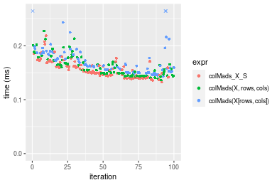
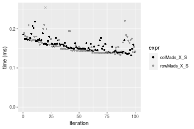
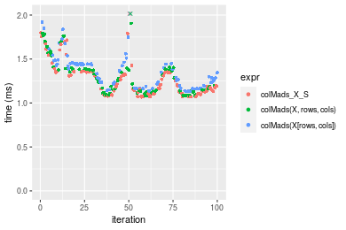
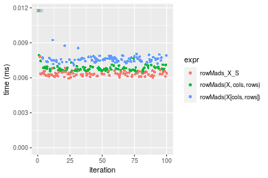
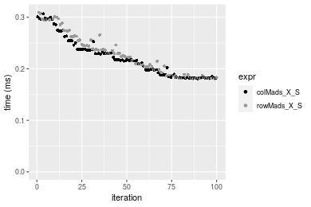
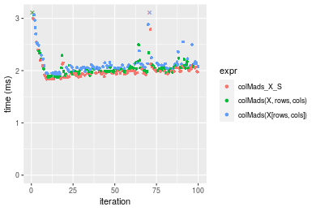

[matrixStats]: Benchmark report

---------------------------------------


# colMads() and rowMads() benchmarks on subsetted computation

This report benchmark the performance of colMads() and rowMads() on subsetted computation.


## Data type "integer"

### Data
```r
> rmatrix <- function(nrow, ncol, mode = c("logical", "double", "integer", "index"), range = c(-100, 
+     +100), na_prob = 0) {
+     mode <- match.arg(mode)
+     n <- nrow * ncol
+     if (mode == "logical") {
+         x <- sample(c(FALSE, TRUE), size = n, replace = TRUE)
+     }     else if (mode == "index") {
+         x <- seq_len(n)
+         mode <- "integer"
+     }     else {
+         x <- runif(n, min = range[1], max = range[2])
+     }
+     storage.mode(x) <- mode
+     if (na_prob > 0) 
+         x[sample(n, size = na_prob * n)] <- NA
+     dim(x) <- c(nrow, ncol)
+     x
+ }
> rmatrices <- function(scale = 10, seed = 1, ...) {
+     set.seed(seed)
+     data <- list()
+     data[[1]] <- rmatrix(nrow = scale * 1, ncol = scale * 1, ...)
+     data[[2]] <- rmatrix(nrow = scale * 10, ncol = scale * 10, ...)
+     data[[3]] <- rmatrix(nrow = scale * 100, ncol = scale * 1, ...)
+     data[[4]] <- t(data[[3]])
+     data[[5]] <- rmatrix(nrow = scale * 10, ncol = scale * 100, ...)
+     data[[6]] <- t(data[[5]])
+     names(data) <- sapply(data, FUN = function(x) paste(dim(x), collapse = "x"))
+     data
+ }
> data <- rmatrices(mode = mode)
```

### Results

#### 10x10 integer matrix

```r
> X <- data[["10x10"]]
> rows <- sample.int(nrow(X), size = nrow(X) * 0.7)
> cols <- sample.int(ncol(X), size = ncol(X) * 0.7)
> X_S <- X[rows, cols]
> gc()
          used  (Mb) gc trigger  (Mb) max used  (Mb)
Ncells 5179465 276.7   10014072 534.9 10014072 534.9
Vcells 9600348  73.3   18204443 138.9 18204443 138.9
> colStats <- microbenchmark(colMads_X_S = colMads(X_S, na.rm = FALSE), `colMads(X, rows, cols)` = colMads(X, 
+     rows = rows, cols = cols, na.rm = FALSE), `colMads(X[rows, cols])` = colMads(X[rows, cols], na.rm = FALSE), 
+     unit = "ms")
> X <- t(X)
> X_S <- t(X_S)
> gc()
          used  (Mb) gc trigger  (Mb) max used  (Mb)
Ncells 5165810 275.9   10014072 534.9 10014072 534.9
Vcells 9555046  72.9   18204443 138.9 18204443 138.9
> rowStats <- microbenchmark(rowMads_X_S = rowMads(X_S, na.rm = FALSE), `rowMads(X, cols, rows)` = rowMads(X, 
+     rows = cols, cols = rows, na.rm = FALSE), `rowMads(X[cols, rows])` = rowMads(X[cols, rows], na.rm = FALSE), 
+     unit = "ms")
```

_Table: Benchmarking of colMads_X_S(), colMads(X, rows, cols)() and colMads(X[rows, cols])() on integer+10x10 data. The top panel shows times in milliseconds and the bottom panel shows relative times._


|   |expr                   |      min|        lq|      mean|    median|        uq|      max|
|:--|:----------------------|--------:|---------:|---------:|---------:|---------:|--------:|
|1  |colMads_X_S            | 0.003022| 0.0031300| 0.0058286| 0.0031835| 0.0032745| 0.261439|
|2  |colMads(X, rows, cols) | 0.003420| 0.0035520| 0.0036843| 0.0036120| 0.0037095| 0.007085|
|3  |colMads(X[rows, cols]) | 0.003880| 0.0041595| 0.0043466| 0.0042790| 0.0043620| 0.009026|


|   |expr                   |      min|       lq|      mean|   median|       uq|       max|
|:--|:----------------------|--------:|--------:|---------:|--------:|--------:|---------:|
|1  |colMads_X_S            | 1.000000| 1.000000| 1.0000000| 1.000000| 1.000000| 1.0000000|
|2  |colMads(X, rows, cols) | 1.131701| 1.134824| 0.6321109| 1.134600| 1.132845| 0.0271000|
|3  |colMads(X[rows, cols]) | 1.283918| 1.328914| 0.7457361| 1.344118| 1.332112| 0.0345243|

_Table: Benchmarking of rowMads_X_S(), rowMads(X, cols, rows)() and rowMads(X[cols, rows])() on integer+10x10 data (transposed). The top panel shows times in milliseconds and the bottom panel shows relative times._


|   |expr                   |      min|        lq|      mean|    median|        uq|      max|
|:--|:----------------------|--------:|---------:|---------:|---------:|---------:|--------:|
|1  |rowMads_X_S            | 0.003052| 0.0031400| 0.0032456| 0.0031945| 0.0032745| 0.005791|
|2  |rowMads(X, cols, rows) | 0.003398| 0.0035080| 0.0062242| 0.0035940| 0.0037425| 0.259897|
|3  |rowMads(X[cols, rows]) | 0.003875| 0.0041185| 0.0043088| 0.0042275| 0.0043270| 0.009134|


|   |expr                   |      min|       lq|     mean|   median|       uq|       max|
|:--|:----------------------|--------:|--------:|--------:|--------:|--------:|---------:|
|1  |rowMads_X_S            | 1.000000| 1.000000| 1.000000| 1.000000| 1.000000|  1.000000|
|2  |rowMads(X, cols, rows) | 1.113368| 1.117198| 1.917762| 1.125059| 1.142923| 44.879468|
|3  |rowMads(X[cols, rows]) | 1.269659| 1.311624| 1.327596| 1.323368| 1.321423|  1.577275|

_Figure: Benchmarking of colMads_X_S(), colMads(X, rows, cols)() and colMads(X[rows, cols])() on integer+10x10 data  as well as rowMads_X_S(), rowMads(X, cols, rows)() and rowMads(X[cols, rows])() on the same data transposed.  Outliers are displayed as crosses.  Times are in milliseconds._


_Table: Benchmarking of colMads_X_S() and rowMads_X_S() on integer+10x10 data (original and transposed).  The top panel shows times in milliseconds and the bottom panel shows relative times._


|   |expr        |   min|   lq|    mean| median|     uq|     max|
|:--|:-----------|-----:|----:|-------:|------:|------:|-------:|
|1  |colMads_X_S | 3.022| 3.13| 5.82855| 3.1835| 3.2745| 261.439|
|2  |rowMads_X_S | 3.052| 3.14| 3.24558| 3.1945| 3.2745|   5.791|


|   |expr        |      min|       lq|      mean|   median| uq|       max|
|:--|:-----------|--------:|--------:|---------:|--------:|--:|---------:|
|1  |colMads_X_S | 1.000000| 1.000000| 1.0000000| 1.000000|  1| 1.0000000|
|2  |rowMads_X_S | 1.009927| 1.003195| 0.5568418| 1.003455|  1| 0.0221505|

_Figure: Benchmarking of colMads_X_S() and rowMads_X_S() on integer+10x10 data (original and transposed).  Outliers are displayed as crosses. Times are in milliseconds._


#### 100x100 integer matrix

```r
> X <- data[["100x100"]]
> rows <- sample.int(nrow(X), size = nrow(X) * 0.7)
> cols <- sample.int(ncol(X), size = ncol(X) * 0.7)
> X_S <- X[rows, cols]
> gc()
          used  (Mb) gc trigger  (Mb) max used  (Mb)
Ncells 5164740 275.9   10014072 534.9 10014072 534.9
Vcells 9224069  70.4   18204443 138.9 18204443 138.9
> colStats <- microbenchmark(colMads_X_S = colMads(X_S, na.rm = FALSE), `colMads(X, rows, cols)` = colMads(X, 
+     rows = rows, cols = cols, na.rm = FALSE), `colMads(X[rows, cols])` = colMads(X[rows, cols], na.rm = FALSE), 
+     unit = "ms")
> X <- t(X)
> X_S <- t(X_S)
> gc()
          used  (Mb) gc trigger  (Mb) max used  (Mb)
Ncells 5164716 275.9   10014072 534.9 10014072 534.9
Vcells 9229122  70.5   18204443 138.9 18204443 138.9
> rowStats <- microbenchmark(rowMads_X_S = rowMads(X_S, na.rm = FALSE), `rowMads(X, cols, rows)` = rowMads(X, 
+     rows = cols, cols = rows, na.rm = FALSE), `rowMads(X[cols, rows])` = rowMads(X[cols, rows], na.rm = FALSE), 
+     unit = "ms")
```

_Table: Benchmarking of colMads_X_S(), colMads(X, rows, cols)() and colMads(X[rows, cols])() on integer+100x100 data. The top panel shows times in milliseconds and the bottom panel shows relative times._


|   |expr                   |      min|        lq|      mean|    median|        uq|      max|
|:--|:----------------------|--------:|---------:|---------:|---------:|---------:|--------:|
|2  |colMads(X, rows, cols) | 0.133968| 0.1465790| 0.1663066| 0.1651210| 0.1781895| 0.224684|
|1  |colMads_X_S            | 0.134396| 0.1462235| 0.1679515| 0.1692430| 0.1812115| 0.229059|
|3  |colMads(X[rows, cols]) | 0.141416| 0.1543305| 0.1766899| 0.1740005| 0.1915485| 0.267464|


|   |expr                   |      min|        lq|     mean|   median|       uq|      max|
|:--|:----------------------|--------:|---------:|--------:|--------:|--------:|--------:|
|2  |colMads(X, rows, cols) | 1.000000| 1.0000000| 1.000000| 1.000000| 1.000000| 1.000000|
|1  |colMads_X_S            | 1.003195| 0.9975747| 1.009890| 1.024963| 1.016960| 1.019472|
|3  |colMads(X[rows, cols]) | 1.055595| 1.0528827| 1.062434| 1.053776| 1.074971| 1.190401|

_Table: Benchmarking of rowMads_X_S(), rowMads(X, cols, rows)() and rowMads(X[cols, rows])() on integer+100x100 data (transposed). The top panel shows times in milliseconds and the bottom panel shows relative times._


|   |expr                   |      min|        lq|      mean|    median|        uq|      max|
|:--|:----------------------|--------:|---------:|---------:|---------:|---------:|--------:|
|2  |rowMads(X, cols, rows) | 0.134394| 0.1486775| 0.1656612| 0.1647245| 0.1759330| 0.240390|
|1  |rowMads_X_S            | 0.137725| 0.1459190| 0.1716026| 0.1687310| 0.1872635| 0.224927|
|3  |rowMads(X[cols, rows]) | 0.144951| 0.1582635| 0.1788516| 0.1775405| 0.1917415| 0.242913|


|   |expr                   |      min|        lq|     mean|   median|       uq|       max|
|:--|:----------------------|--------:|---------:|--------:|--------:|--------:|---------:|
|2  |rowMads(X, cols, rows) | 1.000000| 1.0000000| 1.000000| 1.000000| 1.000000| 1.0000000|
|1  |rowMads_X_S            | 1.024785| 0.9814464| 1.035865| 1.024322| 1.064402| 0.9356754|
|3  |rowMads(X[cols, rows]) | 1.078553| 1.0644751| 1.079623| 1.077803| 1.089855| 1.0104954|

_Figure: Benchmarking of colMads_X_S(), colMads(X, rows, cols)() and colMads(X[rows, cols])() on integer+100x100 data  as well as rowMads_X_S(), rowMads(X, cols, rows)() and rowMads(X[cols, rows])() on the same data transposed.  Outliers are displayed as crosses.  Times are in milliseconds._


_Table: Benchmarking of colMads_X_S() and rowMads_X_S() on integer+100x100 data (original and transposed).  The top panel shows times in milliseconds and the bottom panel shows relative times._


|   |expr        |     min|       lq|     mean|  median|       uq|     max|
|:--|:-----------|-------:|--------:|--------:|-------:|--------:|-------:|
|2  |rowMads_X_S | 137.725| 145.9190| 171.6026| 168.731| 187.2635| 224.927|
|1  |colMads_X_S | 134.396| 146.2235| 167.9515| 169.243| 181.2115| 229.059|


|   |expr        |       min|       lq|      mean|   median|        uq|     max|
|:--|:-----------|---------:|--------:|---------:|--------:|---------:|-------:|
|2  |rowMads_X_S | 1.0000000| 1.000000| 1.0000000| 1.000000| 1.0000000| 1.00000|
|1  |colMads_X_S | 0.9758286| 1.002087| 0.9787231| 1.003034| 0.9676819| 1.01837|

_Figure: Benchmarking of colMads_X_S() and rowMads_X_S() on integer+100x100 data (original and transposed).  Outliers are displayed as crosses. Times are in milliseconds._


#### 1000x10 integer matrix

```r
> X <- data[["1000x10"]]
> rows <- sample.int(nrow(X), size = nrow(X) * 0.7)
> cols <- sample.int(ncol(X), size = ncol(X) * 0.7)
> X_S <- X[rows, cols]
> gc()
          used  (Mb) gc trigger  (Mb) max used  (Mb)
Ncells 5165483 275.9   10014072 534.9 10014072 534.9
Vcells 9228123  70.5   18204443 138.9 18204443 138.9
> colStats <- microbenchmark(colMads_X_S = colMads(X_S, na.rm = FALSE), `colMads(X, rows, cols)` = colMads(X, 
+     rows = rows, cols = cols, na.rm = FALSE), `colMads(X[rows, cols])` = colMads(X[rows, cols], na.rm = FALSE), 
+     unit = "ms")
> X <- t(X)
> X_S <- t(X_S)
> gc()
          used  (Mb) gc trigger  (Mb) max used  (Mb)
Ncells 5165459 275.9   10014072 534.9 10014072 534.9
Vcells 9233176  70.5   18204443 138.9 18204443 138.9
> rowStats <- microbenchmark(rowMads_X_S = rowMads(X_S, na.rm = FALSE), `rowMads(X, cols, rows)` = rowMads(X, 
+     rows = cols, cols = rows, na.rm = FALSE), `rowMads(X[cols, rows])` = rowMads(X[cols, rows], na.rm = FALSE), 
+     unit = "ms")
```

_Table: Benchmarking of colMads_X_S(), colMads(X, rows, cols)() and colMads(X[rows, cols])() on integer+1000x10 data. The top panel shows times in milliseconds and the bottom panel shows relative times._


|   |expr                   |      min|       lq|      mean|    median|        uq|      max|
|:--|:----------------------|--------:|--------:|---------:|---------:|---------:|--------:|
|2  |colMads(X, rows, cols) | 0.120187| 0.132907| 0.1460352| 0.1421515| 0.1531595| 0.206010|
|1  |colMads_X_S            | 0.118506| 0.137703| 0.1470473| 0.1428015| 0.1602545| 0.186551|
|3  |colMads(X[rows, cols]) | 0.126813| 0.135639| 0.1535226| 0.1488860| 0.1652245| 0.243311|


|   |expr                   |       min|       lq|     mean|   median|       uq|       max|
|:--|:----------------------|---------:|--------:|--------:|--------:|--------:|---------:|
|2  |colMads(X, rows, cols) | 1.0000000| 1.000000| 1.000000| 1.000000| 1.000000| 1.0000000|
|1  |colMads_X_S            | 0.9860135| 1.036085| 1.006931| 1.004573| 1.046324| 0.9055434|
|3  |colMads(X[rows, cols]) | 1.0551308| 1.020556| 1.051271| 1.047376| 1.078774| 1.1810640|

_Table: Benchmarking of rowMads_X_S(), rowMads(X, cols, rows)() and rowMads(X[cols, rows])() on integer+1000x10 data (transposed). The top panel shows times in milliseconds and the bottom panel shows relative times._


|   |expr                   |      min|        lq|      mean|    median|        uq|      max|
|:--|:----------------------|--------:|---------:|---------:|---------:|---------:|--------:|
|2  |rowMads(X, cols, rows) | 0.140573| 0.1558640| 0.1653001| 0.1633410| 0.1741790| 0.206982|
|1  |rowMads_X_S            | 0.141905| 0.1585455| 0.1666604| 0.1646155| 0.1728405| 0.205120|
|3  |rowMads(X[cols, rows]) | 0.155102| 0.1710570| 0.1825688| 0.1781140| 0.1918910| 0.241952|


|   |expr                   |      min|       lq|     mean|   median|        uq|      max|
|:--|:----------------------|--------:|--------:|--------:|--------:|---------:|--------:|
|2  |rowMads(X, cols, rows) | 1.000000| 1.000000| 1.000000| 1.000000| 1.0000000| 1.000000|
|1  |rowMads_X_S            | 1.009475| 1.017204| 1.008229| 1.007803| 0.9923154| 0.991004|
|3  |rowMads(X[cols, rows]) | 1.103356| 1.097476| 1.104469| 1.090443| 1.1016885| 1.168952|

_Figure: Benchmarking of colMads_X_S(), colMads(X, rows, cols)() and colMads(X[rows, cols])() on integer+1000x10 data  as well as rowMads_X_S(), rowMads(X, cols, rows)() and rowMads(X[cols, rows])() on the same data transposed.  Outliers are displayed as crosses.  Times are in milliseconds._





_Table: Benchmarking of colMads_X_S() and rowMads_X_S() on integer+1000x10 data (original and transposed).  The top panel shows times in milliseconds and the bottom panel shows relative times._


|   |expr        |     min|       lq|     mean|   median|       uq|     max|
|:--|:-----------|-------:|--------:|--------:|--------:|--------:|-------:|
|1  |colMads_X_S | 118.506| 137.7030| 147.0473| 142.8015| 160.2545| 186.551|
|2  |rowMads_X_S | 141.905| 158.5455| 166.6604| 164.6155| 172.8405| 205.120|


|   |expr        |     min|       lq|     mean|   median|       uq|      max|
|:--|:-----------|-------:|--------:|--------:|--------:|--------:|--------:|
|1  |colMads_X_S | 1.00000| 1.000000| 1.000000| 1.000000| 1.000000| 1.000000|
|2  |rowMads_X_S | 1.19745| 1.151358| 1.133379| 1.152758| 1.078538| 1.099538|

_Figure: Benchmarking of colMads_X_S() and rowMads_X_S() on integer+1000x10 data (original and transposed).  Outliers are displayed as crosses. Times are in milliseconds._




#### 10x1000 integer matrix

```r
> X <- data[["10x1000"]]
> rows <- sample.int(nrow(X), size = nrow(X) * 0.7)
> cols <- sample.int(ncol(X), size = ncol(X) * 0.7)
> X_S <- X[rows, cols]
> gc()
          used  (Mb) gc trigger  (Mb) max used  (Mb)
Ncells 5165688 275.9   10014072 534.9 10014072 534.9
Vcells 9228933  70.5   18204443 138.9 18204443 138.9
> colStats <- microbenchmark(colMads_X_S = colMads(X_S, na.rm = FALSE), `colMads(X, rows, cols)` = colMads(X, 
+     rows = rows, cols = cols, na.rm = FALSE), `colMads(X[rows, cols])` = colMads(X[rows, cols], na.rm = FALSE), 
+     unit = "ms")
> X <- t(X)
> X_S <- t(X_S)
> gc()
          used  (Mb) gc trigger  (Mb) max used  (Mb)
Ncells 5165664 275.9   10014072 534.9 10014072 534.9
Vcells 9233986  70.5   18204443 138.9 18204443 138.9
> rowStats <- microbenchmark(rowMads_X_S = rowMads(X_S, na.rm = FALSE), `rowMads(X, cols, rows)` = rowMads(X, 
+     rows = cols, cols = rows, na.rm = FALSE), `rowMads(X[cols, rows])` = rowMads(X[cols, rows], na.rm = FALSE), 
+     unit = "ms")
```

_Table: Benchmarking of colMads_X_S(), colMads(X, rows, cols)() and colMads(X[rows, cols])() on integer+10x1000 data. The top panel shows times in milliseconds and the bottom panel shows relative times._


|   |expr                   |      min|        lq|      mean|    median|        uq|      max|
|:--|:----------------------|--------:|---------:|---------:|---------:|---------:|--------:|
|2  |colMads(X, rows, cols) | 0.101370| 0.1092050| 0.1174645| 0.1134635| 0.1206145| 0.168119|
|1  |colMads_X_S            | 0.099352| 0.1072460| 0.1186610| 0.1166040| 0.1274160| 0.182027|
|3  |colMads(X[rows, cols]) | 0.110727| 0.1196805| 0.1295450| 0.1258205| 0.1385890| 0.165902|


|   |expr                   |       min|        lq|     mean|   median|       uq|       max|
|:--|:----------------------|---------:|---------:|--------:|--------:|--------:|---------:|
|2  |colMads(X, rows, cols) | 1.0000000| 1.0000000| 1.000000| 1.000000| 1.000000| 1.0000000|
|1  |colMads_X_S            | 0.9800927| 0.9820613| 1.010186| 1.027678| 1.056390| 1.0827271|
|3  |colMads(X[rows, cols]) | 1.0923054| 1.0959251| 1.102844| 1.108907| 1.149024| 0.9868129|

_Table: Benchmarking of rowMads_X_S(), rowMads(X, cols, rows)() and rowMads(X[cols, rows])() on integer+10x1000 data (transposed). The top panel shows times in milliseconds and the bottom panel shows relative times._


|   |expr                   |      min|        lq|      mean|    median|       uq|      max|
|:--|:----------------------|--------:|---------:|---------:|---------:|--------:|--------:|
|2  |rowMads(X, cols, rows) | 0.097518| 0.1087410| 0.1173295| 0.1135770| 0.121397| 0.188649|
|1  |rowMads_X_S            | 0.101815| 0.1114580| 0.1203979| 0.1177295| 0.127181| 0.160421|
|3  |rowMads(X[cols, rows]) | 0.109907| 0.1212245| 0.1312924| 0.1270175| 0.141165| 0.185343|


|   |expr                   |      min|       lq|     mean|   median|       uq|       max|
|:--|:----------------------|--------:|--------:|--------:|--------:|--------:|---------:|
|2  |rowMads(X, cols, rows) | 1.000000| 1.000000| 1.000000| 1.000000| 1.000000| 1.0000000|
|1  |rowMads_X_S            | 1.044064| 1.024986| 1.026153| 1.036561| 1.047645| 0.8503676|
|3  |rowMads(X[cols, rows]) | 1.127043| 1.114800| 1.119006| 1.118338| 1.162838| 0.9824754|

_Figure: Benchmarking of colMads_X_S(), colMads(X, rows, cols)() and colMads(X[rows, cols])() on integer+10x1000 data  as well as rowMads_X_S(), rowMads(X, cols, rows)() and rowMads(X[cols, rows])() on the same data transposed.  Outliers are displayed as crosses.  Times are in milliseconds._


_Table: Benchmarking of colMads_X_S() and rowMads_X_S() on integer+10x1000 data (original and transposed).  The top panel shows times in milliseconds and the bottom panel shows relative times._


|   |expr        |     min|      lq|     mean|   median|      uq|     max|
|:--|:-----------|-------:|-------:|--------:|--------:|-------:|-------:|
|1  |colMads_X_S |  99.352| 107.246| 118.6610| 116.6040| 127.416| 182.027|
|2  |rowMads_X_S | 101.815| 111.458| 120.3979| 117.7295| 127.181| 160.421|


|   |expr        |      min|       lq|     mean|   median|        uq|       max|
|:--|:-----------|--------:|--------:|--------:|--------:|---------:|---------:|
|1  |colMads_X_S | 1.000000| 1.000000| 1.000000| 1.000000| 1.0000000| 1.0000000|
|2  |rowMads_X_S | 1.024791| 1.039274| 1.014638| 1.009652| 0.9981556| 0.8813033|

_Figure: Benchmarking of colMads_X_S() and rowMads_X_S() on integer+10x1000 data (original and transposed).  Outliers are displayed as crosses. Times are in milliseconds._


#### 100x1000 integer matrix

```r
> X <- data[["100x1000"]]
> rows <- sample.int(nrow(X), size = nrow(X) * 0.7)
> cols <- sample.int(ncol(X), size = ncol(X) * 0.7)
> X_S <- X[rows, cols]
> gc()
          used  (Mb) gc trigger  (Mb) max used  (Mb)
Ncells 5165898 275.9   10014072 534.9 10014072 534.9
Vcells 9251601  70.6   18204443 138.9 18204443 138.9
> colStats <- microbenchmark(colMads_X_S = colMads(X_S, na.rm = FALSE), `colMads(X, rows, cols)` = colMads(X, 
+     rows = rows, cols = cols, na.rm = FALSE), `colMads(X[rows, cols])` = colMads(X[rows, cols], na.rm = FALSE), 
+     unit = "ms")
> X <- t(X)
> X_S <- t(X_S)
> gc()
          used  (Mb) gc trigger  (Mb) max used  (Mb)
Ncells 5165874 275.9   10014072 534.9 10014072 534.9
Vcells 9301654  71.0   18204443 138.9 18204443 138.9
> rowStats <- microbenchmark(rowMads_X_S = rowMads(X_S, na.rm = FALSE), `rowMads(X, cols, rows)` = rowMads(X, 
+     rows = cols, cols = rows, na.rm = FALSE), `rowMads(X[cols, rows])` = rowMads(X[cols, rows], na.rm = FALSE), 
+     unit = "ms")
```

_Table: Benchmarking of colMads_X_S(), colMads(X, rows, cols)() and colMads(X[rows, cols])() on integer+100x1000 data. The top panel shows times in milliseconds and the bottom panel shows relative times._


|   |expr                   |      min|       lq|     mean|   median|       uq|      max|
|:--|:----------------------|--------:|--------:|--------:|--------:|--------:|--------:|
|2  |colMads(X, rows, cols) | 1.405943| 1.409642| 1.439051| 1.411548| 1.415118| 2.259891|
|1  |colMads_X_S            | 1.413904| 1.417775| 1.452931| 1.419928| 1.424923| 2.316459|
|3  |colMads(X[rows, cols]) | 1.480678| 1.484336| 1.528549| 1.487646| 1.496636| 2.083211|


|   |expr                   |      min|       lq|     mean|   median|       uq|       max|
|:--|:----------------------|--------:|--------:|--------:|--------:|--------:|---------:|
|2  |colMads(X, rows, cols) | 1.000000| 1.000000| 1.000000| 1.000000| 1.000000| 1.0000000|
|1  |colMads_X_S            | 1.005662| 1.005769| 1.009645| 1.005936| 1.006928| 1.0250313|
|3  |colMads(X[rows, cols]) | 1.053157| 1.052987| 1.062192| 1.053911| 1.057605| 0.9218192|

_Table: Benchmarking of rowMads_X_S(), rowMads(X, cols, rows)() and rowMads(X[cols, rows])() on integer+100x1000 data (transposed). The top panel shows times in milliseconds and the bottom panel shows relative times._


|   |expr                   |      min|       lq|     mean|   median|       uq|      max|
|:--|:----------------------|--------:|--------:|--------:|--------:|--------:|--------:|
|2  |rowMads(X, cols, rows) | 1.421028| 1.425333| 1.444330| 1.426975| 1.431453| 2.104227|
|1  |rowMads_X_S            | 1.448265| 1.453048| 1.507442| 1.455161| 1.463682| 2.390972|
|3  |rowMads(X[cols, rows]) | 1.512916| 1.516829| 1.553871| 1.519821| 1.532201| 2.154666|


|   |expr                   |      min|       lq|     mean|   median|       uq|      max|
|:--|:----------------------|--------:|--------:|--------:|--------:|--------:|--------:|
|2  |rowMads(X, cols, rows) | 1.000000| 1.000000| 1.000000| 1.000000| 1.000000| 1.000000|
|1  |rowMads_X_S            | 1.019167| 1.019445| 1.043696| 1.019752| 1.022514| 1.136271|
|3  |rowMads(X[cols, rows]) | 1.064663| 1.064193| 1.075842| 1.065065| 1.070382| 1.023970|

_Figure: Benchmarking of colMads_X_S(), colMads(X, rows, cols)() and colMads(X[rows, cols])() on integer+100x1000 data  as well as rowMads_X_S(), rowMads(X, cols, rows)() and rowMads(X[cols, rows])() on the same data transposed.  Outliers are displayed as crosses.  Times are in milliseconds._


_Table: Benchmarking of colMads_X_S() and rowMads_X_S() on integer+100x1000 data (original and transposed).  The top panel shows times in milliseconds and the bottom panel shows relative times._


|   |expr        |      min|       lq|     mean|   median|       uq|      max|
|:--|:-----------|--------:|--------:|--------:|--------:|--------:|--------:|
|1  |colMads_X_S | 1.413904| 1.417775| 1.452931| 1.419928| 1.424923| 2.316459|
|2  |rowMads_X_S | 1.448265| 1.453048| 1.507442| 1.455161| 1.463682| 2.390972|


|   |expr        |      min|       lq|     mean|   median|       uq|      max|
|:--|:-----------|--------:|--------:|--------:|--------:|--------:|--------:|
|1  |colMads_X_S | 1.000000| 1.000000| 1.000000| 1.000000| 1.000000| 1.000000|
|2  |rowMads_X_S | 1.024302| 1.024879| 1.037517| 1.024813| 1.027201| 1.032167|

_Figure: Benchmarking of colMads_X_S() and rowMads_X_S() on integer+100x1000 data (original and transposed).  Outliers are displayed as crosses. Times are in milliseconds._


#### 1000x100 integer matrix

```r
> X <- data[["1000x100"]]
> rows <- sample.int(nrow(X), size = nrow(X) * 0.7)
> cols <- sample.int(ncol(X), size = ncol(X) * 0.7)
> X_S <- X[rows, cols]
> gc()
          used  (Mb) gc trigger  (Mb) max used  (Mb)
Ncells 5166111 276.0   10014072 534.9 10014072 534.9
Vcells 9252378  70.6   18204443 138.9 18204443 138.9
> colStats <- microbenchmark(colMads_X_S = colMads(X_S, na.rm = FALSE), `colMads(X, rows, cols)` = colMads(X, 
+     rows = rows, cols = cols, na.rm = FALSE), `colMads(X[rows, cols])` = colMads(X[rows, cols], na.rm = FALSE), 
+     unit = "ms")
> X <- t(X)
> X_S <- t(X_S)
> gc()
          used  (Mb) gc trigger  (Mb) max used  (Mb)
Ncells 5166087 275.9   10014072 534.9 10014072 534.9
Vcells 9302431  71.0   18204443 138.9 18204443 138.9
> rowStats <- microbenchmark(rowMads_X_S = rowMads(X_S, na.rm = FALSE), `rowMads(X, cols, rows)` = rowMads(X, 
+     rows = cols, cols = rows, na.rm = FALSE), `rowMads(X[cols, rows])` = rowMads(X[cols, rows], na.rm = FALSE), 
+     unit = "ms")
```

_Table: Benchmarking of colMads_X_S(), colMads(X, rows, cols)() and colMads(X[rows, cols])() on integer+1000x100 data. The top panel shows times in milliseconds and the bottom panel shows relative times._


|   |expr                   |      min|       lq|     mean|   median|       uq|      max|
|:--|:----------------------|--------:|--------:|--------:|--------:|--------:|--------:|
|2  |colMads(X, rows, cols) | 1.080449| 1.084617| 1.130692| 1.086447| 1.096963| 1.654642|
|1  |colMads_X_S            | 1.088068| 1.090731| 1.127695| 1.092416| 1.096811| 1.807703|
|3  |colMads(X[rows, cols]) | 1.151974| 1.155182| 1.185873| 1.157738| 1.163225| 1.857918|


|   |expr                   |      min|       lq|      mean|   median|       uq|      max|
|:--|:----------------------|--------:|--------:|---------:|--------:|--------:|--------:|
|2  |colMads(X, rows, cols) | 1.000000| 1.000000| 1.0000000| 1.000000| 1.000000| 1.000000|
|1  |colMads_X_S            | 1.007052| 1.005637| 0.9973493| 1.005494| 0.999861| 1.092504|
|3  |colMads(X[rows, cols]) | 1.066199| 1.065059| 1.0488026| 1.065619| 1.060404| 1.122852|

_Table: Benchmarking of rowMads_X_S(), rowMads(X, cols, rows)() and rowMads(X[cols, rows])() on integer+1000x100 data (transposed). The top panel shows times in milliseconds and the bottom panel shows relative times._


|   |expr                   |      min|       lq|     mean|   median|       uq|      max|
|:--|:----------------------|--------:|--------:|--------:|--------:|--------:|--------:|
|2  |rowMads(X, cols, rows) | 1.104502| 1.107260| 1.142965| 1.108846| 1.111857| 1.866087|
|1  |rowMads_X_S            | 1.127215| 1.130114| 1.163644| 1.131283| 1.133665| 1.626809|
|3  |rowMads(X[cols, rows]) | 1.194858| 1.197652| 1.230840| 1.199736| 1.205445| 1.875854|


|   |expr                   |      min|       lq|     mean|   median|       uq|       max|
|:--|:----------------------|--------:|--------:|--------:|--------:|--------:|---------:|
|2  |rowMads(X, cols, rows) | 1.000000| 1.000000| 1.000000| 1.000000| 1.000000| 1.0000000|
|1  |rowMads_X_S            | 1.020564| 1.020641| 1.018093| 1.020235| 1.019615| 0.8717755|
|3  |rowMads(X[cols, rows]) | 1.081807| 1.081636| 1.076883| 1.081968| 1.084173| 1.0052339|

_Figure: Benchmarking of colMads_X_S(), colMads(X, rows, cols)() and colMads(X[rows, cols])() on integer+1000x100 data  as well as rowMads_X_S(), rowMads(X, cols, rows)() and rowMads(X[cols, rows])() on the same data transposed.  Outliers are displayed as crosses.  Times are in milliseconds._





_Table: Benchmarking of colMads_X_S() and rowMads_X_S() on integer+1000x100 data (original and transposed).  The top panel shows times in milliseconds and the bottom panel shows relative times._


|   |expr        |      min|       lq|     mean|   median|       uq|      max|
|:--|:-----------|--------:|--------:|--------:|--------:|--------:|--------:|
|1  |colMads_X_S | 1.088068| 1.090731| 1.127695| 1.092416| 1.096811| 1.807703|
|2  |rowMads_X_S | 1.127215| 1.130114| 1.163644| 1.131283| 1.133665| 1.626809|


|   |expr        |      min|       lq|     mean|   median|       uq|       max|
|:--|:-----------|--------:|--------:|--------:|--------:|--------:|---------:|
|1  |colMads_X_S | 1.000000| 1.000000| 1.000000| 1.000000| 1.000000| 1.0000000|
|2  |rowMads_X_S | 1.035978| 1.036107| 1.031878| 1.035578| 1.033601| 0.8999316|

_Figure: Benchmarking of colMads_X_S() and rowMads_X_S() on integer+1000x100 data (original and transposed).  Outliers are displayed as crosses. Times are in milliseconds._


## Data type "double"

### Data
```r
> rmatrix <- function(nrow, ncol, mode = c("logical", "double", "integer", "index"), range = c(-100, 
+     +100), na_prob = 0) {
+     mode <- match.arg(mode)
+     n <- nrow * ncol
+     if (mode == "logical") {
+         x <- sample(c(FALSE, TRUE), size = n, replace = TRUE)
+     }     else if (mode == "index") {
+         x <- seq_len(n)
+         mode <- "integer"
+     }     else {
+         x <- runif(n, min = range[1], max = range[2])
+     }
+     storage.mode(x) <- mode
+     if (na_prob > 0) 
+         x[sample(n, size = na_prob * n)] <- NA
+     dim(x) <- c(nrow, ncol)
+     x
+ }
> rmatrices <- function(scale = 10, seed = 1, ...) {
+     set.seed(seed)
+     data <- list()
+     data[[1]] <- rmatrix(nrow = scale * 1, ncol = scale * 1, ...)
+     data[[2]] <- rmatrix(nrow = scale * 10, ncol = scale * 10, ...)
+     data[[3]] <- rmatrix(nrow = scale * 100, ncol = scale * 1, ...)
+     data[[4]] <- t(data[[3]])
+     data[[5]] <- rmatrix(nrow = scale * 10, ncol = scale * 100, ...)
+     data[[6]] <- t(data[[5]])
+     names(data) <- sapply(data, FUN = function(x) paste(dim(x), collapse = "x"))
+     data
+ }
> data <- rmatrices(mode = mode)
```

### Results

#### 10x10 double matrix

```r
> X <- data[["10x10"]]
> rows <- sample.int(nrow(X), size = nrow(X) * 0.7)
> cols <- sample.int(ncol(X), size = ncol(X) * 0.7)
> X_S <- X[rows, cols]
> gc()
          used  (Mb) gc trigger  (Mb) max used  (Mb)
Ncells 5166328 276.0   10014072 534.9 10014072 534.9
Vcells 9343469  71.3   18204443 138.9 18204443 138.9
> colStats <- microbenchmark(colMads_X_S = colMads(X_S, na.rm = FALSE), `colMads(X, rows, cols)` = colMads(X, 
+     rows = rows, cols = cols, na.rm = FALSE), `colMads(X[rows, cols])` = colMads(X[rows, cols], na.rm = FALSE), 
+     unit = "ms")
> X <- t(X)
> X_S <- t(X_S)
> gc()
          used  (Mb) gc trigger  (Mb) max used  (Mb)
Ncells 5166295 276.0   10014072 534.9 10014072 534.9
Vcells 9343607  71.3   18204443 138.9 18204443 138.9
> rowStats <- microbenchmark(rowMads_X_S = rowMads(X_S, na.rm = FALSE), `rowMads(X, cols, rows)` = rowMads(X, 
+     rows = cols, cols = rows, na.rm = FALSE), `rowMads(X[cols, rows])` = rowMads(X[cols, rows], na.rm = FALSE), 
+     unit = "ms")
```

_Table: Benchmarking of colMads_X_S(), colMads(X, rows, cols)() and colMads(X[rows, cols])() on double+10x10 data. The top panel shows times in milliseconds and the bottom panel shows relative times._


|   |expr                   |      min|        lq|      mean|    median|       uq|      max|
|:--|:----------------------|--------:|---------:|---------:|---------:|--------:|--------:|
|1  |colMads_X_S            | 0.003770| 0.0038535| 0.0042122| 0.0039155| 0.004046| 0.023215|
|2  |colMads(X, rows, cols) | 0.004170| 0.0043025| 0.0044430| 0.0043750| 0.004512| 0.007321|
|3  |colMads(X[rows, cols]) | 0.004633| 0.0048440| 0.0051421| 0.0050145| 0.005185| 0.010164|


|   |expr                   |      min|       lq|     mean|   median|       uq|       max|
|:--|:----------------------|--------:|--------:|--------:|--------:|--------:|---------:|
|1  |colMads_X_S            | 1.000000| 1.000000| 1.000000| 1.000000| 1.000000| 1.0000000|
|2  |colMads(X, rows, cols) | 1.106101| 1.116518| 1.054806| 1.117354| 1.115176| 0.3153565|
|3  |colMads(X[rows, cols]) | 1.228913| 1.257039| 1.220773| 1.280679| 1.281513| 0.4378204|

_Table: Benchmarking of rowMads_X_S(), rowMads(X, cols, rows)() and rowMads(X[cols, rows])() on double+10x10 data (transposed). The top panel shows times in milliseconds and the bottom panel shows relative times._


|   |expr                   |      min|        lq|      mean|    median|       uq|      max|
|:--|:----------------------|--------:|---------:|---------:|---------:|--------:|--------:|
|1  |rowMads_X_S            | 0.003763| 0.0038465| 0.0040568| 0.0039455| 0.004059| 0.010317|
|2  |rowMads(X, cols, rows) | 0.004099| 0.0043480| 0.0047252| 0.0043980| 0.004508| 0.029800|
|3  |rowMads(X[cols, rows]) | 0.004594| 0.0048290| 0.0051023| 0.0049885| 0.005170| 0.008381|


|   |expr                   |      min|       lq|     mean|   median|       uq|       max|
|:--|:----------------------|--------:|--------:|--------:|--------:|--------:|---------:|
|1  |rowMads_X_S            | 1.000000| 1.000000| 1.000000| 1.000000| 1.000000| 1.0000000|
|2  |rowMads(X, cols, rows) | 1.089290| 1.130378| 1.164753| 1.114688| 1.110618| 2.8884366|
|3  |rowMads(X[cols, rows]) | 1.220834| 1.255427| 1.257715| 1.264352| 1.273713| 0.8123486|

_Figure: Benchmarking of colMads_X_S(), colMads(X, rows, cols)() and colMads(X[rows, cols])() on double+10x10 data  as well as rowMads_X_S(), rowMads(X, cols, rows)() and rowMads(X[cols, rows])() on the same data transposed.  Outliers are displayed as crosses.  Times are in milliseconds._



_Table: Benchmarking of colMads_X_S() and rowMads_X_S() on double+10x10 data (original and transposed).  The top panel shows times in milliseconds and the bottom panel shows relative times._


|   |expr        |   min|     lq|    mean| median|    uq|    max|
|:--|:-----------|-----:|------:|-------:|------:|-----:|------:|
|1  |colMads_X_S | 3.770| 3.8535| 4.21216| 3.9155| 4.046| 23.215|
|2  |rowMads_X_S | 3.763| 3.8465| 4.05680| 3.9455| 4.059| 10.317|


|   |expr        |       min|        lq|      mean|   median|       uq|       max|
|:--|:-----------|---------:|---------:|---------:|--------:|--------:|---------:|
|1  |colMads_X_S | 1.0000000| 1.0000000| 1.0000000| 1.000000| 1.000000| 1.0000000|
|2  |rowMads_X_S | 0.9981432| 0.9981835| 0.9631163| 1.007662| 1.003213| 0.4444109|

_Figure: Benchmarking of colMads_X_S() and rowMads_X_S() on double+10x10 data (original and transposed).  Outliers are displayed as crosses. Times are in milliseconds._


#### 100x100 double matrix

```r
> X <- data[["100x100"]]
> rows <- sample.int(nrow(X), size = nrow(X) * 0.7)
> cols <- sample.int(ncol(X), size = ncol(X) * 0.7)
> X_S <- X[rows, cols]
> gc()
          used  (Mb) gc trigger  (Mb) max used  (Mb)
Ncells 5166525 276.0   10014072 534.9 10014072 534.9
Vcells 9349405  71.4   18204443 138.9 18204443 138.9
> colStats <- microbenchmark(colMads_X_S = colMads(X_S, na.rm = FALSE), `colMads(X, rows, cols)` = colMads(X, 
+     rows = rows, cols = cols, na.rm = FALSE), `colMads(X[rows, cols])` = colMads(X[rows, cols], na.rm = FALSE), 
+     unit = "ms")
> X <- t(X)
> X_S <- t(X_S)
> gc()
          used  (Mb) gc trigger  (Mb) max used  (Mb)
Ncells 5166501 276.0   10014072 534.9 10014072 534.9
Vcells 9359458  71.5   18204443 138.9 18204443 138.9
> rowStats <- microbenchmark(rowMads_X_S = rowMads(X_S, na.rm = FALSE), `rowMads(X, cols, rows)` = rowMads(X, 
+     rows = cols, cols = rows, na.rm = FALSE), `rowMads(X[cols, rows])` = rowMads(X[cols, rows], na.rm = FALSE), 
+     unit = "ms")
```

_Table: Benchmarking of colMads_X_S(), colMads(X, rows, cols)() and colMads(X[rows, cols])() on double+100x100 data. The top panel shows times in milliseconds and the bottom panel shows relative times._


|   |expr                   |      min|        lq|      mean|   median|        uq|      max|
|:--|:----------------------|--------:|---------:|---------:|--------:|---------:|--------:|
|1  |colMads_X_S            | 0.183976| 0.1856725| 0.2200741| 0.212400| 0.2388225| 0.305754|
|2  |colMads(X, rows, cols) | 0.185143| 0.1866065| 0.2205174| 0.213734| 0.2428025| 0.308150|
|3  |colMads(X[rows, cols]) | 0.194517| 0.1965745| 0.2330814| 0.224097| 0.2548065| 0.349353|


|   |expr                   |      min|       lq|     mean|   median|       uq|      max|
|:--|:----------------------|--------:|--------:|--------:|--------:|--------:|--------:|
|1  |colMads_X_S            | 1.000000| 1.000000| 1.000000| 1.000000| 1.000000| 1.000000|
|2  |colMads(X, rows, cols) | 1.006343| 1.005030| 1.002014| 1.006281| 1.016665| 1.007836|
|3  |colMads(X[rows, cols]) | 1.057295| 1.058716| 1.059104| 1.055071| 1.066928| 1.142595|

_Table: Benchmarking of rowMads_X_S(), rowMads(X, cols, rows)() and rowMads(X[cols, rows])() on double+100x100 data (transposed). The top panel shows times in milliseconds and the bottom panel shows relative times._


|   |expr                   |      min|        lq|      mean|    median|        uq|      max|
|:--|:----------------------|--------:|---------:|---------:|---------:|---------:|--------:|
|1  |rowMads_X_S            | 0.182158| 0.1856475| 0.2225457| 0.2171555| 0.2394850| 0.315396|
|2  |rowMads(X, cols, rows) | 0.184610| 0.1908115| 0.2247976| 0.2210495| 0.2426505| 0.337002|
|3  |rowMads(X[cols, rows]) | 0.193084| 0.1985250| 0.2321659| 0.2273370| 0.2523450| 0.320944|


|   |expr                   |      min|       lq|     mean|   median|       uq|      max|
|:--|:----------------------|--------:|--------:|--------:|--------:|--------:|--------:|
|1  |rowMads_X_S            | 1.000000| 1.000000| 1.000000| 1.000000| 1.000000| 1.000000|
|2  |rowMads(X, cols, rows) | 1.013461| 1.027816| 1.010119| 1.017932| 1.013218| 1.068504|
|3  |rowMads(X[cols, rows]) | 1.059981| 1.069365| 1.043228| 1.046886| 1.053699| 1.017591|

_Figure: Benchmarking of colMads_X_S(), colMads(X, rows, cols)() and colMads(X[rows, cols])() on double+100x100 data  as well as rowMads_X_S(), rowMads(X, cols, rows)() and rowMads(X[cols, rows])() on the same data transposed.  Outliers are displayed as crosses.  Times are in milliseconds._


_Table: Benchmarking of colMads_X_S() and rowMads_X_S() on double+100x100 data (original and transposed).  The top panel shows times in milliseconds and the bottom panel shows relative times._


|   |expr        |     min|       lq|     mean|   median|       uq|     max|
|:--|:-----------|-------:|--------:|--------:|--------:|--------:|-------:|
|1  |colMads_X_S | 183.976| 185.6725| 220.0741| 212.4000| 238.8225| 305.754|
|2  |rowMads_X_S | 182.158| 185.6475| 222.5457| 217.1555| 239.4850| 315.396|


|   |expr        |       min|        lq|     mean|   median|       uq|      max|
|:--|:-----------|---------:|---------:|--------:|--------:|--------:|--------:|
|1  |colMads_X_S | 1.0000000| 1.0000000| 1.000000| 1.000000| 1.000000| 1.000000|
|2  |rowMads_X_S | 0.9901183| 0.9998654| 1.011231| 1.022389| 1.002774| 1.031535|

_Figure: Benchmarking of colMads_X_S() and rowMads_X_S() on double+100x100 data (original and transposed).  Outliers are displayed as crosses. Times are in milliseconds._




#### 1000x10 double matrix

```r
> X <- data[["1000x10"]]
> rows <- sample.int(nrow(X), size = nrow(X) * 0.7)
> cols <- sample.int(ncol(X), size = ncol(X) * 0.7)
> X_S <- X[rows, cols]
> gc()
          used  (Mb) gc trigger  (Mb) max used  (Mb)
Ncells 5166725 276.0   10014072 534.9 10014072 534.9
Vcells 9350803  71.4   18204443 138.9 18204443 138.9
> colStats <- microbenchmark(colMads_X_S = colMads(X_S, na.rm = FALSE), `colMads(X, rows, cols)` = colMads(X, 
+     rows = rows, cols = cols, na.rm = FALSE), `colMads(X[rows, cols])` = colMads(X[rows, cols], na.rm = FALSE), 
+     unit = "ms")
> X <- t(X)
> X_S <- t(X_S)
> gc()
          used  (Mb) gc trigger  (Mb) max used  (Mb)
Ncells 5166701 276.0   10014072 534.9 10014072 534.9
Vcells 9360856  71.5   18204443 138.9 18204443 138.9
> rowStats <- microbenchmark(rowMads_X_S = rowMads(X_S, na.rm = FALSE), `rowMads(X, cols, rows)` = rowMads(X, 
+     rows = cols, cols = rows, na.rm = FALSE), `rowMads(X[cols, rows])` = rowMads(X[cols, rows], na.rm = FALSE), 
+     unit = "ms")
```

_Table: Benchmarking of colMads_X_S(), colMads(X, rows, cols)() and colMads(X[rows, cols])() on double+1000x10 data. The top panel shows times in milliseconds and the bottom panel shows relative times._


|   |expr                   |      min|        lq|      mean|    median|        uq|      max|
|:--|:----------------------|--------:|---------:|---------:|---------:|---------:|--------:|
|2  |colMads(X, rows, cols) | 0.175287| 0.1766105| 0.2080609| 0.1989295| 0.2289125| 0.292013|
|3  |colMads(X[rows, cols]) | 0.183511| 0.1848545| 0.2178721| 0.2049510| 0.2394920| 0.343701|
|1  |colMads_X_S            | 0.172530| 0.1819165| 0.2113160| 0.2103250| 0.2263200| 0.284649|


|   |expr                   |       min|       lq|     mean|   median|        uq|       max|
|:--|:----------------------|---------:|--------:|--------:|--------:|---------:|---------:|
|2  |colMads(X, rows, cols) | 1.0000000| 1.000000| 1.000000| 1.000000| 1.0000000| 1.0000000|
|3  |colMads(X[rows, cols]) | 1.0469173| 1.046679| 1.047155| 1.030269| 1.0462163| 1.1770058|
|1  |colMads_X_S            | 0.9842715| 1.030043| 1.015645| 1.057284| 0.9886747| 0.9747819|

_Table: Benchmarking of rowMads_X_S(), rowMads(X, cols, rows)() and rowMads(X[cols, rows])() on double+1000x10 data (transposed). The top panel shows times in milliseconds and the bottom panel shows relative times._


|   |expr                   |      min|       lq|      mean|    median|        uq|      max|
|:--|:----------------------|--------:|--------:|---------:|---------:|---------:|--------:|
|1  |rowMads_X_S            | 0.171804| 0.177101| 0.2033304| 0.1913525| 0.2207825| 0.286833|
|2  |rowMads(X, cols, rows) | 0.175366| 0.176802| 0.2100333| 0.2079850| 0.2304675| 0.280181|
|3  |rowMads(X[cols, rows]) | 0.183978| 0.185622| 0.2170050| 0.2119905| 0.2395360| 0.342044|


|   |expr                   |      min|        lq|     mean|   median|       uq|       max|
|:--|:----------------------|--------:|---------:|--------:|--------:|--------:|---------:|
|1  |rowMads_X_S            | 1.000000| 1.0000000| 1.000000| 1.000000| 1.000000| 1.0000000|
|2  |rowMads(X, cols, rows) | 1.020733| 0.9983117| 1.032965| 1.086921| 1.043867| 0.9768088|
|3  |rowMads(X[cols, rows]) | 1.070860| 1.0481138| 1.067253| 1.107853| 1.084941| 1.1924848|

_Figure: Benchmarking of colMads_X_S(), colMads(X, rows, cols)() and colMads(X[rows, cols])() on double+1000x10 data  as well as rowMads_X_S(), rowMads(X, cols, rows)() and rowMads(X[cols, rows])() on the same data transposed.  Outliers are displayed as crosses.  Times are in milliseconds._


_Table: Benchmarking of colMads_X_S() and rowMads_X_S() on double+1000x10 data (original and transposed).  The top panel shows times in milliseconds and the bottom panel shows relative times._


|   |expr        |     min|       lq|     mean|   median|       uq|     max|
|:--|:-----------|-------:|--------:|--------:|--------:|--------:|-------:|
|2  |rowMads_X_S | 171.804| 177.1010| 203.3304| 191.3525| 220.7825| 286.833|
|1  |colMads_X_S | 172.530| 181.9165| 211.3160| 210.3250| 226.3200| 284.649|


|   |expr        |      min|       lq|     mean|  median|       uq|       max|
|:--|:-----------|--------:|--------:|--------:|-------:|--------:|---------:|
|2  |rowMads_X_S | 1.000000| 1.000000| 1.000000| 1.00000| 1.000000| 1.0000000|
|1  |colMads_X_S | 1.004226| 1.027191| 1.039274| 1.09915| 1.025081| 0.9923858|

_Figure: Benchmarking of colMads_X_S() and rowMads_X_S() on double+1000x10 data (original and transposed).  Outliers are displayed as crosses. Times are in milliseconds._


#### 10x1000 double matrix

```r
> X <- data[["10x1000"]]
> rows <- sample.int(nrow(X), size = nrow(X) * 0.7)
> cols <- sample.int(ncol(X), size = ncol(X) * 0.7)
> X_S <- X[rows, cols]
> gc()
          used  (Mb) gc trigger  (Mb) max used  (Mb)
Ncells 5166930 276.0   10014072 534.9 10014072 534.9
Vcells 9350939  71.4   18204443 138.9 18204443 138.9
> colStats <- microbenchmark(colMads_X_S = colMads(X_S, na.rm = FALSE), `colMads(X, rows, cols)` = colMads(X, 
+     rows = rows, cols = cols, na.rm = FALSE), `colMads(X[rows, cols])` = colMads(X[rows, cols], na.rm = FALSE), 
+     unit = "ms")
> X <- t(X)
> X_S <- t(X_S)
> gc()
          used  (Mb) gc trigger  (Mb) max used  (Mb)
Ncells 5166906 276.0   10014072 534.9 10014072 534.9
Vcells 9360992  71.5   18204443 138.9 18204443 138.9
> rowStats <- microbenchmark(rowMads_X_S = rowMads(X_S, na.rm = FALSE), `rowMads(X, cols, rows)` = rowMads(X, 
+     rows = cols, cols = rows, na.rm = FALSE), `rowMads(X[cols, rows])` = rowMads(X[cols, rows], na.rm = FALSE), 
+     unit = "ms")
```

_Table: Benchmarking of colMads_X_S(), colMads(X, rows, cols)() and colMads(X[rows, cols])() on double+10x1000 data. The top panel shows times in milliseconds and the bottom panel shows relative times._


|   |expr                   |      min|        lq|      mean|    median|       uq|      max|
|:--|:----------------------|--------:|---------:|---------:|---------:|--------:|--------:|
|2  |colMads(X, rows, cols) | 0.141668| 0.1495545| 0.1708230| 0.1683400| 0.183381| 0.253363|
|1  |colMads_X_S            | 0.138957| 0.1479245| 0.1745652| 0.1758285| 0.189011| 0.257674|
|3  |colMads(X[rows, cols]) | 0.151500| 0.1695575| 0.1882586| 0.1871310| 0.201705| 0.261737|


|   |expr                   |       min|       lq|     mean|   median|       uq|      max|
|:--|:----------------------|---------:|--------:|--------:|--------:|--------:|--------:|
|2  |colMads(X, rows, cols) | 1.0000000| 1.000000| 1.000000| 1.000000| 1.000000| 1.000000|
|1  |colMads_X_S            | 0.9808637| 0.989101| 1.021907| 1.044484| 1.030701| 1.017015|
|3  |colMads(X[rows, cols]) | 1.0694017| 1.133751| 1.102068| 1.111625| 1.099923| 1.033051|

_Table: Benchmarking of rowMads_X_S(), rowMads(X, cols, rows)() and rowMads(X[cols, rows])() on double+10x1000 data (transposed). The top panel shows times in milliseconds and the bottom panel shows relative times._


|   |expr                   |      min|        lq|      mean|    median|        uq|      max|
|:--|:----------------------|--------:|---------:|---------:|---------:|---------:|--------:|
|1  |rowMads_X_S            | 0.138668| 0.1503320| 0.1701079| 0.1678480| 0.1826075| 0.223801|
|2  |rowMads(X, cols, rows) | 0.140289| 0.1497250| 0.1706523| 0.1699215| 0.1811665| 0.258750|
|3  |rowMads(X[cols, rows]) | 0.148748| 0.1590705| 0.1832439| 0.1822970| 0.2010525| 0.240152|


|   |expr                   |      min|        lq|     mean|   median|        uq|      max|
|:--|:----------------------|--------:|---------:|--------:|--------:|---------:|--------:|
|1  |rowMads_X_S            | 1.000000| 1.0000000| 1.000000| 1.000000| 1.0000000| 1.000000|
|2  |rowMads(X, cols, rows) | 1.011690| 0.9959623| 1.003201| 1.012353| 0.9921088| 1.156161|
|3  |rowMads(X[cols, rows]) | 1.072692| 1.0581280| 1.077222| 1.086084| 1.1010090| 1.073060|

_Figure: Benchmarking of colMads_X_S(), colMads(X, rows, cols)() and colMads(X[rows, cols])() on double+10x1000 data  as well as rowMads_X_S(), rowMads(X, cols, rows)() and rowMads(X[cols, rows])() on the same data transposed.  Outliers are displayed as crosses.  Times are in milliseconds._


_Table: Benchmarking of colMads_X_S() and rowMads_X_S() on double+10x1000 data (original and transposed).  The top panel shows times in milliseconds and the bottom panel shows relative times._


|   |expr        |     min|       lq|     mean|   median|       uq|     max|
|:--|:-----------|-------:|--------:|--------:|--------:|--------:|-------:|
|2  |rowMads_X_S | 138.668| 150.3320| 170.1079| 167.8480| 182.6075| 223.801|
|1  |colMads_X_S | 138.957| 147.9245| 174.5651| 175.8285| 189.0110| 257.674|


|   |expr        |      min|        lq|     mean|   median|       uq|      max|
|:--|:-----------|--------:|---------:|--------:|--------:|--------:|--------:|
|2  |rowMads_X_S | 1.000000| 1.0000000| 1.000000| 1.000000| 1.000000| 1.000000|
|1  |colMads_X_S | 1.002084| 0.9839854| 1.026203| 1.047546| 1.035067| 1.151353|

_Figure: Benchmarking of colMads_X_S() and rowMads_X_S() on double+10x1000 data (original and transposed).  Outliers are displayed as crosses. Times are in milliseconds._


#### 100x1000 double matrix

```r
> X <- data[["100x1000"]]
> rows <- sample.int(nrow(X), size = nrow(X) * 0.7)
> cols <- sample.int(ncol(X), size = ncol(X) * 0.7)
> X_S <- X[rows, cols]
> gc()
          used  (Mb) gc trigger  (Mb) max used  (Mb)
Ncells 5167140 276.0   10014072 534.9 10014072 534.9
Vcells 9396380  71.7   18204443 138.9 18204443 138.9
> colStats <- microbenchmark(colMads_X_S = colMads(X_S, na.rm = FALSE), `colMads(X, rows, cols)` = colMads(X, 
+     rows = rows, cols = cols, na.rm = FALSE), `colMads(X[rows, cols])` = colMads(X[rows, cols], na.rm = FALSE), 
+     unit = "ms")
> X <- t(X)
> X_S <- t(X_S)
> gc()
          used  (Mb) gc trigger  (Mb) max used  (Mb)
Ncells 5167116 276.0   10014072 534.9 10014072 534.9
Vcells 9496433  72.5   18204443 138.9 18204443 138.9
> rowStats <- microbenchmark(rowMads_X_S = rowMads(X_S, na.rm = FALSE), `rowMads(X, cols, rows)` = rowMads(X, 
+     rows = cols, cols = rows, na.rm = FALSE), `rowMads(X[cols, rows])` = rowMads(X[cols, rows], na.rm = FALSE), 
+     unit = "ms")
```

_Table: Benchmarking of colMads_X_S(), colMads(X, rows, cols)() and colMads(X[rows, cols])() on double+100x1000 data. The top panel shows times in milliseconds and the bottom panel shows relative times._


|   |expr                   |      min|       lq|     mean|   median|       uq|      max|
|:--|:----------------------|--------:|--------:|--------:|--------:|--------:|--------:|
|2  |colMads(X, rows, cols) | 1.867566| 1.872655| 1.910228| 1.876441| 1.880436| 2.973833|
|1  |colMads_X_S            | 1.869350| 1.875434| 1.915841| 1.878199| 1.881342| 3.036389|
|3  |colMads(X[rows, cols]) | 1.962829| 1.970740| 2.020387| 1.972954| 1.977523| 2.652862|


|   |expr                   |      min|       lq|     mean|   median|       uq|       max|
|:--|:----------------------|--------:|--------:|--------:|--------:|--------:|---------:|
|2  |colMads(X, rows, cols) | 1.000000| 1.000000| 1.000000| 1.000000| 1.000000| 1.0000000|
|1  |colMads_X_S            | 1.000955| 1.001484| 1.002938| 1.000937| 1.000482| 1.0210355|
|3  |colMads(X[rows, cols]) | 1.051009| 1.052377| 1.057668| 1.051434| 1.051630| 0.8920682|

_Table: Benchmarking of rowMads_X_S(), rowMads(X, cols, rows)() and rowMads(X[cols, rows])() on double+100x1000 data (transposed). The top panel shows times in milliseconds and the bottom panel shows relative times._


|   |expr                   |      min|       lq|     mean|   median|       uq|      max|
|:--|:----------------------|--------:|--------:|--------:|--------:|--------:|--------:|
|1  |rowMads_X_S            | 1.854756| 1.862129| 1.932503| 1.868138| 1.906947| 2.999890|
|2  |rowMads(X, cols, rows) | 1.877062| 1.882586| 1.908775| 1.886168| 1.890850| 2.693370|
|3  |rowMads(X[cols, rows]) | 1.951415| 1.963095| 2.020221| 1.968211| 1.984325| 2.816034|


|   |expr                   |      min|       lq|      mean|   median|       uq|       max|
|:--|:----------------------|--------:|--------:|---------:|--------:|--------:|---------:|
|1  |rowMads_X_S            | 1.000000| 1.000000| 1.0000000| 1.000000| 1.000000| 1.0000000|
|2  |rowMads(X, cols, rows) | 1.012026| 1.010986| 0.9877219| 1.009651| 0.991559| 0.8978229|
|3  |rowMads(X[cols, rows]) | 1.052114| 1.054221| 1.0453912| 1.053568| 1.040577| 0.9387124|

_Figure: Benchmarking of colMads_X_S(), colMads(X, rows, cols)() and colMads(X[rows, cols])() on double+100x1000 data  as well as rowMads_X_S(), rowMads(X, cols, rows)() and rowMads(X[cols, rows])() on the same data transposed.  Outliers are displayed as crosses.  Times are in milliseconds._





_Table: Benchmarking of colMads_X_S() and rowMads_X_S() on double+100x1000 data (original and transposed).  The top panel shows times in milliseconds and the bottom panel shows relative times._


|   |expr        |      min|       lq|     mean|   median|       uq|      max|
|:--|:-----------|--------:|--------:|--------:|--------:|--------:|--------:|
|2  |rowMads_X_S | 1.854756| 1.862129| 1.932503| 1.868138| 1.906947| 2.999890|
|1  |colMads_X_S | 1.869350| 1.875434| 1.915841| 1.878199| 1.881342| 3.036389|


|   |expr        |      min|       lq|      mean|   median|        uq|      max|
|:--|:-----------|--------:|--------:|---------:|--------:|---------:|--------:|
|2  |rowMads_X_S | 1.000000| 1.000000| 1.0000000| 1.000000| 1.0000000| 1.000000|
|1  |colMads_X_S | 1.007868| 1.007145| 0.9913784| 1.005386| 0.9865728| 1.012167|

_Figure: Benchmarking of colMads_X_S() and rowMads_X_S() on double+100x1000 data (original and transposed).  Outliers are displayed as crosses. Times are in milliseconds._


#### 1000x100 double matrix

```r
> X <- data[["1000x100"]]
> rows <- sample.int(nrow(X), size = nrow(X) * 0.7)
> cols <- sample.int(ncol(X), size = ncol(X) * 0.7)
> X_S <- X[rows, cols]
> gc()
          used  (Mb) gc trigger  (Mb) max used  (Mb)
Ncells 5167353 276.0   10014072 534.9 10014072 534.9
Vcells 9396524  71.7   18204443 138.9 18204443 138.9
> colStats <- microbenchmark(colMads_X_S = colMads(X_S, na.rm = FALSE), `colMads(X, rows, cols)` = colMads(X, 
+     rows = rows, cols = cols, na.rm = FALSE), `colMads(X[rows, cols])` = colMads(X[rows, cols], na.rm = FALSE), 
+     unit = "ms")
> X <- t(X)
> X_S <- t(X_S)
> gc()
          used  (Mb) gc trigger  (Mb) max used  (Mb)
Ncells 5167329 276.0   10014072 534.9 10014072 534.9
Vcells 9496577  72.5   18204443 138.9 18204443 138.9
> rowStats <- microbenchmark(rowMads_X_S = rowMads(X_S, na.rm = FALSE), `rowMads(X, cols, rows)` = rowMads(X, 
+     rows = cols, cols = rows, na.rm = FALSE), `rowMads(X[cols, rows])` = rowMads(X[cols, rows], na.rm = FALSE), 
+     unit = "ms")
```

_Table: Benchmarking of colMads_X_S(), colMads(X, rows, cols)() and colMads(X[rows, cols])() on double+1000x100 data. The top panel shows times in milliseconds and the bottom panel shows relative times._


|   |expr                   |      min|       lq|     mean|   median|       uq|      max|
|:--|:----------------------|--------:|--------:|--------:|--------:|--------:|--------:|
|1  |colMads_X_S            | 1.701698| 1.708541| 1.749275| 1.710958| 1.713248| 2.808682|
|2  |colMads(X, rows, cols) | 1.704286| 1.712554| 1.761870| 1.714617| 1.720249| 2.515720|
|3  |colMads(X[rows, cols]) | 1.795689| 1.802925| 1.830583| 1.804807| 1.808356| 2.775627|


|   |expr                   |      min|       lq|     mean|   median|       uq|       max|
|:--|:----------------------|--------:|--------:|--------:|--------:|--------:|---------:|
|1  |colMads_X_S            | 1.000000| 1.000000| 1.000000| 1.000000| 1.000000| 1.0000000|
|2  |colMads(X, rows, cols) | 1.001521| 1.002349| 1.007200| 1.002139| 1.004086| 0.8956941|
|3  |colMads(X[rows, cols]) | 1.055234| 1.055243| 1.046481| 1.054852| 1.055513| 0.9882311|

_Table: Benchmarking of rowMads_X_S(), rowMads(X, cols, rows)() and rowMads(X[cols, rows])() on double+1000x100 data (transposed). The top panel shows times in milliseconds and the bottom panel shows relative times._


|   |expr                   |      min|       lq|     mean|   median|       uq|      max|
|:--|:----------------------|--------:|--------:|--------:|--------:|--------:|--------:|
|1  |rowMads_X_S            | 1.693379| 1.701054| 1.734140| 1.703545| 1.707046| 2.252325|
|2  |rowMads(X, cols, rows) | 1.713459| 1.722086| 1.767261| 1.724409| 1.727831| 2.827985|
|3  |rowMads(X[cols, rows]) | 1.795026| 1.802360| 1.842020| 1.806984| 1.814044| 2.776445|


|   |expr                   |      min|       lq|    mean|   median|       uq|      max|
|:--|:----------------------|--------:|--------:|-------:|--------:|--------:|--------:|
|1  |rowMads_X_S            | 1.000000| 1.000000| 1.00000| 1.000000| 1.000000| 1.000000|
|2  |rowMads(X, cols, rows) | 1.011858| 1.012364| 1.01910| 1.012247| 1.012176| 1.255585|
|3  |rowMads(X[cols, rows]) | 1.060026| 1.059555| 1.06221| 1.060720| 1.062680| 1.232702|

_Figure: Benchmarking of colMads_X_S(), colMads(X, rows, cols)() and colMads(X[rows, cols])() on double+1000x100 data  as well as rowMads_X_S(), rowMads(X, cols, rows)() and rowMads(X[cols, rows])() on the same data transposed.  Outliers are displayed as crosses.  Times are in milliseconds._


_Table: Benchmarking of colMads_X_S() and rowMads_X_S() on double+1000x100 data (original and transposed).  The top panel shows times in milliseconds and the bottom panel shows relative times._


|   |expr        |      min|       lq|     mean|   median|       uq|      max|
|:--|:-----------|--------:|--------:|--------:|--------:|--------:|--------:|
|2  |rowMads_X_S | 1.693379| 1.701054| 1.734140| 1.703545| 1.707046| 2.252325|
|1  |colMads_X_S | 1.701698| 1.708541| 1.749275| 1.710958| 1.713248| 2.808682|


|   |expr        |      min|       lq|     mean|   median|       uq|      max|
|:--|:-----------|--------:|--------:|--------:|--------:|--------:|--------:|
|2  |rowMads_X_S | 1.000000| 1.000000| 1.000000| 1.000000| 1.000000| 1.000000|
|1  |colMads_X_S | 1.004913| 1.004401| 1.008728| 1.004352| 1.003634| 1.247014|

_Figure: Benchmarking of colMads_X_S() and rowMads_X_S() on double+1000x100 data (original and transposed).  Outliers are displayed as crosses. Times are in milliseconds._


## Appendix

### Session information
```r
R version 4.1.1 Patched (2021-08-10 r80727)
Platform: x86_64-pc-linux-gnu (64-bit)
Running under: Ubuntu 18.04.5 LTS

Matrix products: default
BLAS:   /home/hb/software/R-devel/R-4-1-branch/lib/R/lib/libRblas.so
LAPACK: /home/hb/software/R-devel/R-4-1-branch/lib/R/lib/libRlapack.so

locale:
 [1] LC_CTYPE=en_US.UTF-8       LC_NUMERIC=C              
 [3] LC_TIME=en_US.UTF-8        LC_COLLATE=en_US.UTF-8    
 [5] LC_MONETARY=en_US.UTF-8    LC_MESSAGES=en_US.UTF-8   
 [7] LC_PAPER=en_US.UTF-8       LC_NAME=C                 
 [9] LC_ADDRESS=C               LC_TELEPHONE=C            
[11] LC_MEASUREMENT=en_US.UTF-8 LC_IDENTIFICATION=C       

attached base packages:
[1] stats     graphics  grDevices utils     datasets  methods   base     

other attached packages:
[1] microbenchmark_1.4-7   matrixStats_0.60.1     ggplot2_3.3.5         
[4] knitr_1.33             R.devices_2.17.0       R.utils_2.10.1        
[7] R.oo_1.24.0            R.methodsS3_1.8.1-9001 history_0.0.1-9000    

loaded via a namespace (and not attached):
 [1] Biobase_2.52.0          httr_1.4.2              splines_4.1.1          
 [4] bit64_4.0.5             network_1.17.1          assertthat_0.2.1       
 [7] highr_0.9               stats4_4.1.1            blob_1.2.2             
[10] GenomeInfoDbData_1.2.6  robustbase_0.93-8       pillar_1.6.2           
[13] RSQLite_2.2.8           lattice_0.20-44         glue_1.4.2             
[16] digest_0.6.27           XVector_0.32.0          colorspace_2.0-2       
[19] Matrix_1.3-4            XML_3.99-0.7            pkgconfig_2.0.3        
[22] zlibbioc_1.38.0         genefilter_1.74.0       purrr_0.3.4            
[25] ergm_4.1.2              xtable_1.8-4            scales_1.1.1           
[28] tibble_3.1.4            annotate_1.70.0         KEGGREST_1.32.0        
[31] farver_2.1.0            generics_0.1.0          IRanges_2.26.0         
[34] ellipsis_0.3.2          cachem_1.0.6            withr_2.4.2            
[37] BiocGenerics_0.38.0     mime_0.11               survival_3.2-13        
[40] magrittr_2.0.1          crayon_1.4.1            statnet.common_4.5.0   
[43] memoise_2.0.0           laeken_0.5.1            fansi_0.5.0            
[46] R.cache_0.15.0          MASS_7.3-54             R.rsp_0.44.0           
[49] progressr_0.8.0         tools_4.1.1             lifecycle_1.0.0        
[52] S4Vectors_0.30.0        trust_0.1-8             munsell_0.5.0          
[55] tabby_0.0.1-9001        AnnotationDbi_1.54.1    Biostrings_2.60.2      
[58] compiler_4.1.1          GenomeInfoDb_1.28.1     rlang_0.4.11           
[61] grid_4.1.1              RCurl_1.98-1.4          cwhmisc_6.6            
[64] rappdirs_0.3.3          startup_0.15.0          labeling_0.4.2         
[67] bitops_1.0-7            base64enc_0.1-3         boot_1.3-28            
[70] gtable_0.3.0            DBI_1.1.1               markdown_1.1           
[73] R6_2.5.1                lpSolveAPI_5.5.2.0-17.7 rle_0.9.2              
[76] dplyr_1.0.7             fastmap_1.1.0           bit_4.0.4              
[79] utf8_1.2.2              parallel_4.1.1          Rcpp_1.0.7             
[82] vctrs_0.3.8             png_0.1-7               DEoptimR_1.0-9         
[85] tidyselect_1.1.1        xfun_0.25               coda_0.19-4            
```
Total processing time was 26.07 secs.


### Reproducibility
To reproduce this report, do:
```r
html <- matrixStats:::benchmark('colRowMads_subset')
```

[RSP]: https://cran.r-project.org/package=R.rsp
[matrixStats]: https://cran.r-project.org/package=matrixStats

[StackOverflow:colMins?]: https://stackoverflow.com/questions/13676878 "Stack Overflow: fastest way to get Min from every column in a matrix?"
[StackOverflow:colSds?]: https://stackoverflow.com/questions/17549762 "Stack Overflow: Is there such 'colsd' in R?"
[StackOverflow:rowProds?]: https://stackoverflow.com/questions/20198801/ "Stack Overflow: Row product of matrix and column sum of matrix"

---------------------------------------
Copyright Dongcan Jiang. Last updated on 2021-08-25 18:04:05 (+0200 UTC). Powered by [RSP].

<script>
 var link = document.createElement('link');
 link.rel = 'icon';
 link.href = "data:image/png;base64,iVBORw0KGgoAAAANSUhEUgAAACAAAAAgCAMAAABEpIrGAAAA21BMVEUAAAAAAP8AAP8AAP8AAP8AAP8AAP8AAP8AAP8AAP8AAP8AAP8AAP8AAP8AAP8AAP8AAP8AAP8AAP8AAP8AAP8AAP8AAP8AAP8AAP8AAP8AAP8AAP8AAP8AAP8AAP8AAP8AAP8AAP8AAP8AAP8AAP8AAP8AAP8AAP8AAP8AAP8BAf4CAv0DA/wdHeIeHuEfH+AgIN8hId4lJdomJtknJ9g+PsE/P8BAQL9yco10dIt1dYp3d4h4eIeVlWqWlmmXl2iYmGeZmWabm2Tn5xjo6Bfp6Rb39wj4+Af//wA2M9hbAAAASXRSTlMAAQIJCgsMJSYnKD4/QGRlZmhpamtsbautrrCxuru8y8zN5ebn6Pn6+///////////////////////////////////////////LsUNcQAAAS9JREFUOI29k21XgkAQhVcFytdSMqMETU26UVqGmpaiFbL//xc1cAhhwVNf6n5i5z67M2dmYOyfJZUqlVLhkKucG7cgmUZTybDz6g0iDeq51PUr37Ds2cy2/C9NeES5puDjxuUk1xnToZsg8pfA3avHQ3lLIi7iWRrkv/OYtkScxBIMgDee0ALoyxHQBJ68JLCjOtQIMIANF7QG9G9fNnHvisCHBVMKgSJgiz7nE+AoBKrAPA3MgepvgR9TSCasrCKH0eB1wBGBFdCO+nAGjMVGPcQb5bd6mQRegN6+1axOs9nGfYcCtfi4NQosdtH7dB+txFIpXQqN1p9B/asRHToyS0jRgpV7nk4nwcq1BJ+x3Gl/v7S9Wmpp/aGquum7w3ZDyrADFYrl8vHBH+ev9AUASW1dmU4h4wAAAABJRU5ErkJggg=="
 document.getElementsByTagName('head')[0].appendChild(link);
</script>


