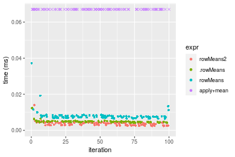
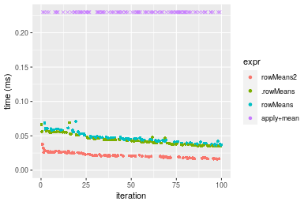
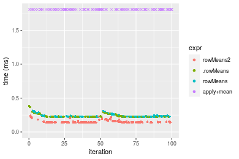
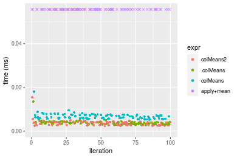
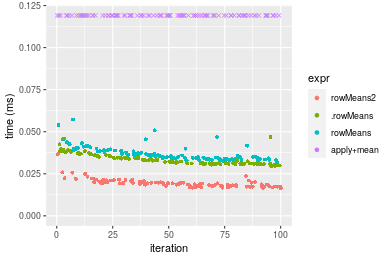
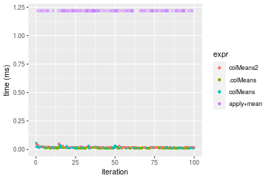

[matrixStats]: Benchmark report

---------------------------------------


# colMeans2() and rowMeans2() benchmarks

This report benchmark the performance of colMeans2() and rowMeans2() against alternative methods.

## Alternative methods

* apply() + mean()
* .colMeans() and .rowMeans()
* colMeans() and rowMeans()


## Data type "integer"

### Data
```r
> rmatrix <- function(nrow, ncol, mode = c("logical", "double", "integer", "index"), range = c(-100, 
+     +100), na_prob = 0) {
+     mode <- match.arg(mode)
+     n <- nrow * ncol
+     if (mode == "logical") {
+         x <- sample(c(FALSE, TRUE), size = n, replace = TRUE)
+     }     else if (mode == "index") {
+         x <- seq_len(n)
+         mode <- "integer"
+     }     else {
+         x <- runif(n, min = range[1], max = range[2])
+     }
+     storage.mode(x) <- mode
+     if (na_prob > 0) 
+         x[sample(n, size = na_prob * n)] <- NA
+     dim(x) <- c(nrow, ncol)
+     x
+ }
> rmatrices <- function(scale = 10, seed = 1, ...) {
+     set.seed(seed)
+     data <- list()
+     data[[1]] <- rmatrix(nrow = scale * 1, ncol = scale * 1, ...)
+     data[[2]] <- rmatrix(nrow = scale * 10, ncol = scale * 10, ...)
+     data[[3]] <- rmatrix(nrow = scale * 100, ncol = scale * 1, ...)
+     data[[4]] <- t(data[[3]])
+     data[[5]] <- rmatrix(nrow = scale * 10, ncol = scale * 100, ...)
+     data[[6]] <- t(data[[5]])
+     names(data) <- sapply(data, FUN = function(x) paste(dim(x), collapse = "x"))
+     data
+ }
> data <- rmatrices(mode = mode)
```

### Results

#### 10x10 integer matrix

```r
> X <- data[["10x10"]]
> gc()
           used  (Mb) gc trigger  (Mb) max used  (Mb)
Ncells  5257921 280.9    7916910 422.9  7916910 422.9
Vcells 10186358  77.8   33191153 253.3 53339345 407.0
> colStats <- microbenchmark(colMeans2 = colMeans2(X, na.rm = FALSE), .colMeans = .colMeans(X, m = nrow(X), 
+     n = ncol(X), na.rm = FALSE), colMeans = colMeans(X, na.rm = FALSE), `apply+mean` = apply(X, MARGIN = 2L, 
+     FUN = mean, na.rm = FALSE), unit = "ms")
> X <- t(X)
> gc()
           used  (Mb) gc trigger  (Mb) max used  (Mb)
Ncells  5244238 280.1    7916910 422.9  7916910 422.9
Vcells 10141213  77.4   33191153 253.3 53339345 407.0
> rowStats <- microbenchmark(rowMeans2 = rowMeans2(X, na.rm = FALSE), .rowMeans = .rowMeans(X, m = nrow(X), 
+     n = ncol(X), na.rm = FALSE), rowMeans = rowMeans(X, na.rm = FALSE), `apply+mean` = apply(X, MARGIN = 1L, 
+     FUN = mean, na.rm = FALSE), unit = "ms")
```

_Table: Benchmarking of colMeans2(), .colMeans(), colMeans() and apply+mean() on integer+10x10 data. The top panel shows times in milliseconds and the bottom panel shows relative times._


|   |expr       |      min|        lq|      mean|    median|        uq|      max|
|:--|:----------|--------:|---------:|---------:|---------:|---------:|--------:|
|2  |.colMeans  | 0.002973| 0.0034290| 0.0045484| 0.0039170| 0.0047025| 0.029963|
|1  |colMeans2  | 0.002586| 0.0032390| 0.0050546| 0.0041735| 0.0057835| 0.018183|
|3  |colMeans   | 0.005649| 0.0064000| 0.0090514| 0.0076845| 0.0109675| 0.031805|
|4  |apply+mean | 0.070580| 0.0741775| 0.0921426| 0.0758115| 0.1013795| 0.227490|


|   |expr       |        min|         lq|      mean|    median|        uq|       max|
|:--|:----------|----------:|----------:|---------:|---------:|---------:|---------:|
|2  |.colMeans  |  1.0000000|  1.0000000|  1.000000|  1.000000|  1.000000| 1.0000000|
|1  |colMeans2  |  0.8698285|  0.9445903|  1.111296|  1.065484|  1.229878| 0.6068484|
|3  |colMeans   |  1.9001009|  1.8664334|  1.990018|  1.961833|  2.332270| 1.0614758|
|4  |apply+mean | 23.7403296| 21.6324001| 20.258283| 19.354481| 21.558639| 7.5923639|

_Table: Benchmarking of rowMeans2(), .rowMeans(), rowMeans() and apply+mean() on integer+10x10 data (transposed). The top panel shows times in milliseconds and the bottom panel shows relative times._


|   |expr       |      min|        lq|      mean|    median|        uq|      max|
|:--|:----------|--------:|---------:|---------:|---------:|---------:|--------:|
|1  |rowMeans2  | 0.002397| 0.0028305| 0.0035766| 0.0035125| 0.0040885| 0.013986|
|2  |.rowMeans  | 0.004117| 0.0045145| 0.0048169| 0.0047230| 0.0049440| 0.012413|
|3  |rowMeans   | 0.006448| 0.0070385| 0.0080657| 0.0075265| 0.0080655| 0.037236|
|4  |apply+mean | 0.067079| 0.0704940| 0.0738455| 0.0736710| 0.0749055| 0.139345|


|   |expr       |       min|        lq|      mean|    median|        uq|       max|
|:--|:----------|---------:|---------:|---------:|---------:|---------:|---------:|
|1  |rowMeans2  |  1.000000|  1.000000|  1.000000|  1.000000|  1.000000| 1.0000000|
|2  |.rowMeans  |  1.717564|  1.594948|  1.346761|  1.344626|  1.209245| 0.8875304|
|3  |rowMeans   |  2.690029|  2.486663|  2.255097|  2.142776|  1.972728| 2.6623767|
|4  |apply+mean | 27.984564| 24.905140| 20.646601| 20.973950| 18.321022| 9.9631775|

_Figure: Benchmarking of colMeans2(), .colMeans(), colMeans() and apply+mean() on integer+10x10 data  as well as rowMeans2(), .rowMeans(), rowMeans() and apply+mean() on the same data transposed.  Outliers are displayed as crosses.  Times are in milliseconds._



_Table: Benchmarking of colMeans2() and rowMeans2() on integer+10x10 data (original and transposed).  The top panel shows times in milliseconds and the bottom panel shows relative times._


|   |expr      |   min|     lq|    mean| median|     uq|    max|
|:--|:---------|-----:|------:|-------:|------:|------:|------:|
|2  |rowMeans2 | 2.397| 2.8305| 3.57664| 3.5125| 4.0885| 13.986|
|1  |colMeans2 | 2.586| 3.2390| 5.05461| 4.1735| 5.7835| 18.183|


|   |expr      |      min|       lq|     mean|   median|       uq|      max|
|:--|:---------|--------:|--------:|--------:|--------:|--------:|--------:|
|2  |rowMeans2 | 1.000000| 1.000000| 1.000000| 1.000000| 1.000000| 1.000000|
|1  |colMeans2 | 1.078849| 1.144321| 1.413229| 1.188185| 1.414578| 1.300086|

_Figure: Benchmarking of colMeans2() and rowMeans2() on integer+10x10 data (original and transposed).  Outliers are displayed as crosses. Times are in milliseconds._


#### 100x100 integer matrix

```r
> X <- data[["100x100"]]
> gc()
          used  (Mb) gc trigger  (Mb) max used  (Mb)
Ncells 5242821 280.0    7916910 422.9  7916910 422.9
Vcells 9758020  74.5   33191153 253.3 53339345 407.0
> colStats <- microbenchmark(colMeans2 = colMeans2(X, na.rm = FALSE), .colMeans = .colMeans(X, m = nrow(X), 
+     n = ncol(X), na.rm = FALSE), colMeans = colMeans(X, na.rm = FALSE), `apply+mean` = apply(X, MARGIN = 2L, 
+     FUN = mean, na.rm = FALSE), unit = "ms")
> X <- t(X)
> gc()
          used  (Mb) gc trigger  (Mb) max used  (Mb)
Ncells 5242815 280.0    7916910 422.9  7916910 422.9
Vcells 9763063  74.5   33191153 253.3 53339345 407.0
> rowStats <- microbenchmark(rowMeans2 = rowMeans2(X, na.rm = FALSE), .rowMeans = .rowMeans(X, m = nrow(X), 
+     n = ncol(X), na.rm = FALSE), rowMeans = rowMeans(X, na.rm = FALSE), `apply+mean` = apply(X, MARGIN = 1L, 
+     FUN = mean, na.rm = FALSE), unit = "ms")
```

_Table: Benchmarking of colMeans2(), .colMeans(), colMeans() and apply+mean() on integer+100x100 data. The top panel shows times in milliseconds and the bottom panel shows relative times._


|   |expr       |      min|        lq|      mean|    median|        uq|      max|
|:--|:----------|--------:|---------:|---------:|---------:|---------:|--------:|
|2  |.colMeans  | 0.012112| 0.0137450| 0.0153540| 0.0146185| 0.0167420| 0.024553|
|3  |colMeans   | 0.014325| 0.0166630| 0.0186439| 0.0177450| 0.0200885| 0.041164|
|1  |colMeans2  | 0.017660| 0.0194840| 0.0213776| 0.0202760| 0.0221845| 0.039210|
|4  |apply+mean | 0.425152| 0.4657975| 0.5208733| 0.4980050| 0.5700890| 0.776684|


|   |expr       |       min|        lq|      mean|    median|        uq|       max|
|:--|:----------|---------:|---------:|---------:|---------:|---------:|---------:|
|2  |.colMeans  |  1.000000|  1.000000|  1.000000|  1.000000|  1.000000|  1.000000|
|3  |colMeans   |  1.182711|  1.212295|  1.214276|  1.213873|  1.199887|  1.676537|
|1  |colMeans2  |  1.458058|  1.417534|  1.392317|  1.387010|  1.325081|  1.596953|
|4  |apply+mean | 35.101717| 33.888505| 33.924361| 34.066765| 34.051428| 31.632957|

_Table: Benchmarking of rowMeans2(), .rowMeans(), rowMeans() and apply+mean() on integer+100x100 data (transposed). The top panel shows times in milliseconds and the bottom panel shows relative times._


|   |expr       |      min|        lq|      mean|    median|        uq|      max|
|:--|:----------|--------:|---------:|---------:|---------:|---------:|--------:|
|1  |rowMeans2  | 0.016040| 0.0187000| 0.0217922| 0.0211005| 0.0254330| 0.037635|
|2  |.rowMeans  | 0.034859| 0.0369595| 0.0433372| 0.0415920| 0.0463565| 0.069092|
|3  |rowMeans   | 0.036387| 0.0418075| 0.0465615| 0.0447965| 0.0486725| 0.070743|
|4  |apply+mean | 0.400687| 0.4319210| 0.4969557| 0.4827705| 0.5341675| 0.750953|


|   |expr       |       min|        lq|      mean|    median|        uq|       max|
|:--|:----------|---------:|---------:|---------:|---------:|---------:|---------:|
|1  |rowMeans2  |  1.000000|  1.000000|  1.000000|  1.000000|  1.000000|  1.000000|
|2  |.rowMeans  |  2.173254|  1.976444|  1.988656|  1.971138|  1.822691|  1.835844|
|3  |rowMeans   |  2.268516|  2.235695|  2.136609|  2.123007|  1.913754|  1.879713|
|4  |apply+mean | 24.980486| 23.097380| 22.804260| 22.879576| 21.002929| 19.953580|

_Figure: Benchmarking of colMeans2(), .colMeans(), colMeans() and apply+mean() on integer+100x100 data  as well as rowMeans2(), .rowMeans(), rowMeans() and apply+mean() on the same data transposed.  Outliers are displayed as crosses.  Times are in milliseconds._



_Table: Benchmarking of colMeans2() and rowMeans2() on integer+100x100 data (original and transposed).  The top panel shows times in milliseconds and the bottom panel shows relative times._


|   |expr      |   min|     lq|     mean|  median|      uq|    max|
|:--|:---------|-----:|------:|--------:|-------:|-------:|------:|
|1  |colMeans2 | 17.66| 19.484| 21.37758| 20.2760| 22.1845| 39.210|
|2  |rowMeans2 | 16.04| 18.700| 21.79223| 21.1005| 25.4330| 37.635|


|   |expr      |       min|        lq|     mean|   median|       uq|       max|
|:--|:---------|---------:|---------:|--------:|--------:|--------:|---------:|
|1  |colMeans2 | 1.0000000| 1.0000000| 1.000000| 1.000000| 1.000000| 1.0000000|
|2  |rowMeans2 | 0.9082673| 0.9597619| 1.019397| 1.040664| 1.146431| 0.9598317|

_Figure: Benchmarking of colMeans2() and rowMeans2() on integer+100x100 data (original and transposed).  Outliers are displayed as crosses. Times are in milliseconds._


#### 1000x10 integer matrix

```r
> X <- data[["1000x10"]]
> gc()
          used  (Mb) gc trigger  (Mb) max used  (Mb)
Ncells 5243591 280.1    7916910 422.9  7916910 422.9
Vcells 9761813  74.5   33191153 253.3 53339345 407.0
> colStats <- microbenchmark(colMeans2 = colMeans2(X, na.rm = FALSE), .colMeans = .colMeans(X, m = nrow(X), 
+     n = ncol(X), na.rm = FALSE), colMeans = colMeans(X, na.rm = FALSE), `apply+mean` = apply(X, MARGIN = 2L, 
+     FUN = mean, na.rm = FALSE), unit = "ms")
> X <- t(X)
> gc()
          used  (Mb) gc trigger  (Mb) max used  (Mb)
Ncells 5243579 280.1    7916910 422.9  7916910 422.9
Vcells 9766846  74.6   33191153 253.3 53339345 407.0
> rowStats <- microbenchmark(rowMeans2 = rowMeans2(X, na.rm = FALSE), .rowMeans = .rowMeans(X, m = nrow(X), 
+     n = ncol(X), na.rm = FALSE), rowMeans = rowMeans(X, na.rm = FALSE), `apply+mean` = apply(X, MARGIN = 1L, 
+     FUN = mean, na.rm = FALSE), unit = "ms")
```

_Table: Benchmarking of colMeans2(), .colMeans(), colMeans() and apply+mean() on integer+1000x10 data. The top panel shows times in milliseconds and the bottom panel shows relative times._


|   |expr       |      min|        lq|      mean|    median|        uq|      max|
|:--|:----------|--------:|---------:|---------:|---------:|---------:|--------:|
|2  |.colMeans  | 0.013293| 0.0148880| 0.0159000| 0.0159465| 0.0166735| 0.022332|
|3  |colMeans   | 0.016158| 0.0181375| 0.0198784| 0.0192400| 0.0205770| 0.048743|
|1  |colMeans2  | 0.021063| 0.0237615| 0.0250283| 0.0249125| 0.0260580| 0.039862|
|4  |apply+mean | 0.140458| 0.1559735| 0.1652961| 0.1653795| 0.1731740| 0.278474|


|   |expr       |       min|        lq|      mean|    median|        uq|       max|
|:--|:----------|---------:|---------:|---------:|---------:|---------:|---------:|
|2  |.colMeans  |  1.000000|  1.000000|  1.000000|  1.000000|  1.000000|  1.000000|
|3  |colMeans   |  1.215527|  1.218263|  1.250215|  1.206534|  1.234114|  2.182653|
|1  |colMeans2  |  1.584518|  1.596017|  1.574109|  1.562255|  1.562839|  1.784972|
|4  |apply+mean | 10.566313| 10.476458| 10.395984| 10.370896| 10.386182| 12.469729|

_Table: Benchmarking of rowMeans2(), .rowMeans(), rowMeans() and apply+mean() on integer+1000x10 data (transposed). The top panel shows times in milliseconds and the bottom panel shows relative times._


|   |expr       |      min|        lq|      mean|    median|        uq|      max|
|:--|:----------|--------:|---------:|---------:|---------:|---------:|--------:|
|1  |rowMeans2  | 0.018759| 0.0205295| 0.0230194| 0.0216080| 0.0234490| 0.043084|
|4  |apply+mean | 0.124769| 0.1375675| 0.1546701| 0.1434855| 0.1663905| 0.291129|
|2  |.rowMeans  | 0.156096| 0.1666985| 0.1835071| 0.1722290| 0.2058055| 0.232899|
|3  |rowMeans   | 0.157676| 0.1692335| 0.1852035| 0.1749680| 0.1966100| 0.259823|


|   |expr       |      min|       lq|     mean|   median|       uq|      max|
|:--|:----------|--------:|--------:|--------:|--------:|--------:|--------:|
|1  |rowMeans2  | 1.000000| 1.000000| 1.000000| 1.000000| 1.000000| 1.000000|
|4  |apply+mean | 6.651154| 6.700967| 6.719132| 6.640388| 7.095846| 6.757242|
|2  |.rowMeans  | 8.321126| 8.119949| 7.971860| 7.970613| 8.776728| 5.405696|
|3  |rowMeans   | 8.405352| 8.243430| 8.045555| 8.097371| 8.384579| 6.030615|

_Figure: Benchmarking of colMeans2(), .colMeans(), colMeans() and apply+mean() on integer+1000x10 data  as well as rowMeans2(), .rowMeans(), rowMeans() and apply+mean() on the same data transposed.  Outliers are displayed as crosses.  Times are in milliseconds._


_Table: Benchmarking of colMeans2() and rowMeans2() on integer+1000x10 data (original and transposed).  The top panel shows times in milliseconds and the bottom panel shows relative times._


|   |expr      |    min|      lq|     mean|  median|     uq|    max|
|:--|:---------|------:|-------:|--------:|-------:|------:|------:|
|2  |rowMeans2 | 18.759| 20.5295| 23.01936| 21.6080| 23.449| 43.084|
|1  |colMeans2 | 21.063| 23.7615| 25.02834| 24.9125| 26.058| 39.862|


|   |expr      |      min|       lq|     mean|   median|       uq|       max|
|:--|:---------|--------:|--------:|--------:|--------:|--------:|---------:|
|2  |rowMeans2 | 1.000000| 1.000000| 1.000000| 1.000000| 1.000000| 1.0000000|
|1  |colMeans2 | 1.122821| 1.157432| 1.087274| 1.152929| 1.111263| 0.9252159|

_Figure: Benchmarking of colMeans2() and rowMeans2() on integer+1000x10 data (original and transposed).  Outliers are displayed as crosses. Times are in milliseconds._


#### 10x1000 integer matrix

```r
> X <- data[["10x1000"]]
> gc()
          used  (Mb) gc trigger  (Mb) max used  (Mb)
Ncells 5243807 280.1    7916910 422.9  7916910 422.9
Vcells 9762612  74.5   33191153 253.3 53339345 407.0
> colStats <- microbenchmark(colMeans2 = colMeans2(X, na.rm = FALSE), .colMeans = .colMeans(X, m = nrow(X), 
+     n = ncol(X), na.rm = FALSE), colMeans = colMeans(X, na.rm = FALSE), `apply+mean` = apply(X, MARGIN = 2L, 
+     FUN = mean, na.rm = FALSE), unit = "ms")
> X <- t(X)
> gc()
          used  (Mb) gc trigger  (Mb) max used  (Mb)
Ncells 5243801 280.1    7916910 422.9  7916910 422.9
Vcells 9767655  74.6   33191153 253.3 53339345 407.0
> rowStats <- microbenchmark(rowMeans2 = rowMeans2(X, na.rm = FALSE), .rowMeans = .rowMeans(X, m = nrow(X), 
+     n = ncol(X), na.rm = FALSE), rowMeans = rowMeans(X, na.rm = FALSE), `apply+mean` = apply(X, MARGIN = 1L, 
+     FUN = mean, na.rm = FALSE), unit = "ms")
```

_Table: Benchmarking of colMeans2(), .colMeans(), colMeans() and apply+mean() on integer+10x1000 data. The top panel shows times in milliseconds and the bottom panel shows relative times._


|   |expr       |      min|        lq|      mean|    median|        uq|      max|
|:--|:----------|--------:|---------:|---------:|---------:|---------:|--------:|
|2  |.colMeans  | 0.012298| 0.0140630| 0.0160430| 0.0157990| 0.0168240| 0.026693|
|3  |colMeans   | 0.014148| 0.0169780| 0.0213489| 0.0190300| 0.0230850| 0.068485|
|1  |colMeans2  | 0.015985| 0.0180765| 0.0211984| 0.0196635| 0.0227085| 0.044537|
|4  |apply+mean | 3.091406| 3.2096035| 3.6078381| 3.4905205| 3.7838090| 8.776626|


|   |expr       |        min|         lq|       mean|     median|         uq|        max|
|:--|:----------|----------:|----------:|----------:|----------:|----------:|----------:|
|2  |.colMeans  |   1.000000|   1.000000|   1.000000|   1.000000|   1.000000|   1.000000|
|3  |colMeans   |   1.150431|   1.207281|   1.330730|   1.204507|   1.372147|   2.565654|
|1  |colMeans2  |   1.299805|   1.285394|   1.321347|   1.244604|   1.349768|   1.668490|
|4  |apply+mean | 251.374695| 228.230356| 224.884938| 220.933002| 224.905433| 328.798786|

_Table: Benchmarking of rowMeans2(), .rowMeans(), rowMeans() and apply+mean() on integer+10x1000 data (transposed). The top panel shows times in milliseconds and the bottom panel shows relative times._


|   |expr       |      min|        lq|      mean|   median|        uq|      max|
|:--|:----------|--------:|---------:|---------:|--------:|---------:|--------:|
|1  |rowMeans2  | 0.015877| 0.0166955| 0.0218266| 0.019220| 0.0250790| 0.064051|
|2  |.rowMeans  | 0.026027| 0.0264320| 0.0293154| 0.028028| 0.0307880| 0.051111|
|3  |rowMeans   | 0.027577| 0.0289865| 0.0340805| 0.031922| 0.0356905| 0.064902|
|4  |apply+mean | 3.082995| 3.2155610| 3.5407100| 3.380379| 3.5959655| 8.124443|


|   |expr       |        min|         lq|       mean|     median|         uq|         max|
|:--|:----------|----------:|----------:|----------:|----------:|----------:|-----------:|
|1  |rowMeans2  |   1.000000|   1.000000|   1.000000|   1.000000|   1.000000|   1.0000000|
|2  |.rowMeans  |   1.639290|   1.583181|   1.343103|   1.458273|   1.227641|   0.7979735|
|3  |rowMeans   |   1.736915|   1.736186|   1.561421|   1.660874|   1.423123|   1.0132863|
|4  |apply+mean | 194.179946| 192.600461| 162.219804| 175.878200| 143.385522| 126.8433436|

_Figure: Benchmarking of colMeans2(), .colMeans(), colMeans() and apply+mean() on integer+10x1000 data  as well as rowMeans2(), .rowMeans(), rowMeans() and apply+mean() on the same data transposed.  Outliers are displayed as crosses.  Times are in milliseconds._


_Table: Benchmarking of colMeans2() and rowMeans2() on integer+10x1000 data (original and transposed).  The top panel shows times in milliseconds and the bottom panel shows relative times._


|   |expr      |    min|      lq|     mean|  median|      uq|    max|
|:--|:---------|------:|-------:|--------:|-------:|-------:|------:|
|2  |rowMeans2 | 15.877| 16.6955| 21.82662| 19.2200| 25.0790| 64.051|
|1  |colMeans2 | 15.985| 18.0765| 21.19842| 19.6635| 22.7085| 44.537|


|   |expr      |      min|       lq|      mean|   median|        uq|       max|
|:--|:---------|--------:|--------:|---------:|--------:|---------:|---------:|
|2  |rowMeans2 | 1.000000| 1.000000| 1.0000000| 1.000000| 1.0000000| 1.0000000|
|1  |colMeans2 | 1.006802| 1.082717| 0.9712186| 1.023075| 0.9054787| 0.6953365|

_Figure: Benchmarking of colMeans2() and rowMeans2() on integer+10x1000 data (original and transposed).  Outliers are displayed as crosses. Times are in milliseconds._


#### 100x1000 integer matrix

```r
> X <- data[["100x1000"]]
> gc()
          used  (Mb) gc trigger  (Mb) max used  (Mb)
Ncells 5244037 280.1    7916910 422.9  7916910 422.9
Vcells 9763204  74.5   33191153 253.3 53339345 407.0
> colStats <- microbenchmark(colMeans2 = colMeans2(X, na.rm = FALSE), .colMeans = .colMeans(X, m = nrow(X), 
+     n = ncol(X), na.rm = FALSE), colMeans = colMeans(X, na.rm = FALSE), `apply+mean` = apply(X, MARGIN = 2L, 
+     FUN = mean, na.rm = FALSE), unit = "ms")
> X <- t(X)
> gc()
          used  (Mb) gc trigger  (Mb) max used  (Mb)
Ncells 5244031 280.1    7916910 422.9  7916910 422.9
Vcells 9813247  74.9   33191153 253.3 53339345 407.0
> rowStats <- microbenchmark(rowMeans2 = rowMeans2(X, na.rm = FALSE), .rowMeans = .rowMeans(X, m = nrow(X), 
+     n = ncol(X), na.rm = FALSE), rowMeans = rowMeans(X, na.rm = FALSE), `apply+mean` = apply(X, MARGIN = 1L, 
+     FUN = mean, na.rm = FALSE), unit = "ms")
```

_Table: Benchmarking of colMeans2(), .colMeans(), colMeans() and apply+mean() on integer+100x1000 data. The top panel shows times in milliseconds and the bottom panel shows relative times._


|   |expr       |      min|        lq|      mean|    median|        uq|       max|
|:--|:----------|--------:|---------:|---------:|---------:|---------:|---------:|
|2  |.colMeans  | 0.088433| 0.0888500| 0.0948695| 0.0903635| 0.0930635|  0.171991|
|3  |colMeans   | 0.090535| 0.0911145| 0.0972239| 0.0930615| 0.0978145|  0.142057|
|1  |colMeans2  | 0.138827| 0.1393920| 0.1472027| 0.1408785| 0.1454935|  0.211462|
|4  |apply+mean | 3.670839| 3.7336380| 4.1002198| 3.8298305| 3.9675910| 16.060589|


|   |expr       |       min|        lq|      mean|    median|        uq|       max|
|:--|:----------|---------:|---------:|---------:|---------:|---------:|---------:|
|2  |.colMeans  |  1.000000|  1.000000|  1.000000|  1.000000|  1.000000|  1.000000|
|3  |colMeans   |  1.023769|  1.025487|  1.024817|  1.029857|  1.051051|  0.825956|
|1  |colMeans2  |  1.569855|  1.568846|  1.551633|  1.559020|  1.563379|  1.229495|
|4  |apply+mean | 41.509832| 42.021812| 43.219574| 42.382494| 42.633159| 93.380404|

_Table: Benchmarking of rowMeans2(), .rowMeans(), rowMeans() and apply+mean() on integer+100x1000 data (transposed). The top panel shows times in milliseconds and the bottom panel shows relative times._


|   |expr       |      min|        lq|      mean|    median|        uq|       max|
|:--|:----------|--------:|---------:|---------:|---------:|---------:|---------:|
|1  |rowMeans2  | 0.139095| 0.1402800| 0.1533820| 0.1429255| 0.1535730|  0.238553|
|2  |.rowMeans  | 0.221425| 0.2220600| 0.2383832| 0.2241970| 0.2349075|  0.381985|
|3  |rowMeans   | 0.223737| 0.2252015| 0.2397627| 0.2293305| 0.2426695|  0.311189|
|4  |apply+mean | 3.674989| 3.7546890| 4.1612656| 3.8256255| 4.0240735| 19.497721|


|   |expr       |       min|        lq|      mean|    median|        uq|       max|
|:--|:----------|---------:|---------:|---------:|---------:|---------:|---------:|
|1  |rowMeans2  |  1.000000|  1.000000|  1.000000|  1.000000|  1.000000|  1.000000|
|2  |.rowMeans  |  1.591898|  1.582977|  1.554180|  1.568628|  1.529615|  1.601258|
|3  |rowMeans   |  1.608519|  1.605371|  1.563173|  1.604546|  1.580157|  1.304486|
|4  |apply+mean | 26.420713| 26.765676| 27.130078| 26.766571| 26.203001| 81.733288|

_Figure: Benchmarking of colMeans2(), .colMeans(), colMeans() and apply+mean() on integer+100x1000 data  as well as rowMeans2(), .rowMeans(), rowMeans() and apply+mean() on the same data transposed.  Outliers are displayed as crosses.  Times are in milliseconds._



_Table: Benchmarking of colMeans2() and rowMeans2() on integer+100x1000 data (original and transposed).  The top panel shows times in milliseconds and the bottom panel shows relative times._


|   |expr      |     min|      lq|     mean|   median|       uq|     max|
|:--|:---------|-------:|-------:|--------:|--------:|--------:|-------:|
|1  |colMeans2 | 138.827| 139.392| 147.2027| 140.8785| 145.4935| 211.462|
|2  |rowMeans2 | 139.095| 140.280| 153.3820| 142.9255| 153.5730| 238.553|


|   |expr      |      min|       lq|     mean|  median|       uq|      max|
|:--|:---------|--------:|--------:|--------:|-------:|--------:|--------:|
|1  |colMeans2 | 1.000000| 1.000000| 1.000000| 1.00000| 1.000000| 1.000000|
|2  |rowMeans2 | 1.001931| 1.006371| 1.041978| 1.01453| 1.055532| 1.128113|

_Figure: Benchmarking of colMeans2() and rowMeans2() on integer+100x1000 data (original and transposed).  Outliers are displayed as crosses. Times are in milliseconds._


#### 1000x100 integer matrix

```r
> X <- data[["1000x100"]]
> gc()
          used  (Mb) gc trigger  (Mb) max used  (Mb)
Ncells 5244261 280.1    7916910 422.9  7916910 422.9
Vcells 9763984  74.5   33191153 253.3 53339345 407.0
> colStats <- microbenchmark(colMeans2 = colMeans2(X, na.rm = FALSE), .colMeans = .colMeans(X, m = nrow(X), 
+     n = ncol(X), na.rm = FALSE), colMeans = colMeans(X, na.rm = FALSE), `apply+mean` = apply(X, MARGIN = 2L, 
+     FUN = mean, na.rm = FALSE), unit = "ms")
> X <- t(X)
> gc()
          used  (Mb) gc trigger  (Mb) max used  (Mb)
Ncells 5244255 280.1    7916910 422.9  7916910 422.9
Vcells 9814027  74.9   33191153 253.3 53339345 407.0
> rowStats <- microbenchmark(rowMeans2 = rowMeans2(X, na.rm = FALSE), .rowMeans = .rowMeans(X, m = nrow(X), 
+     n = ncol(X), na.rm = FALSE), rowMeans = rowMeans(X, na.rm = FALSE), `apply+mean` = apply(X, MARGIN = 1L, 
+     FUN = mean, na.rm = FALSE), unit = "ms")
```

_Table: Benchmarking of colMeans2(), .colMeans(), colMeans() and apply+mean() on integer+1000x100 data. The top panel shows times in milliseconds and the bottom panel shows relative times._


|   |expr       |      min|        lq|      mean|    median|        uq|      max|
|:--|:----------|--------:|---------:|---------:|---------:|---------:|--------:|
|2  |.colMeans  | 0.081000| 0.0813370| 0.0899024| 0.0821110| 0.0887765| 0.148613|
|3  |colMeans   | 0.083234| 0.0838735| 0.0939699| 0.0853420| 0.1025235| 0.146897|
|1  |colMeans2  | 0.132713| 0.1333555| 0.1479354| 0.1344490| 0.1597905| 0.230693|
|4  |apply+mean | 0.893604| 0.9013625| 1.0113902| 0.9101045| 1.0796735| 1.572386|


|   |expr       |       min|        lq|      mean|    median|        uq|        max|
|:--|:----------|---------:|---------:|---------:|---------:|---------:|----------:|
|2  |.colMeans  |  1.000000|  1.000000|  1.000000|  1.000000|  1.000000|  1.0000000|
|3  |colMeans   |  1.027580|  1.031185|  1.045244|  1.039349|  1.154850|  0.9884532|
|1  |colMeans2  |  1.638432|  1.639543|  1.645511|  1.637406|  1.799919|  1.5523070|
|4  |apply+mean | 11.032148| 11.081826| 11.249871| 11.083832| 12.161704| 10.5804068|

_Table: Benchmarking of rowMeans2(), .rowMeans(), rowMeans() and apply+mean() on integer+1000x100 data (transposed). The top panel shows times in milliseconds and the bottom panel shows relative times._


|   |expr       |      min|        lq|      mean|    median|       uq|      max|
|:--|:----------|--------:|---------:|---------:|---------:|--------:|--------:|
|1  |rowMeans2  | 0.134541| 0.1355810| 0.1441573| 0.1367815| 0.139278| 0.225825|
|2  |.rowMeans  | 0.320036| 0.3209695| 0.3420746| 0.3212865| 0.327356| 0.541075|
|3  |rowMeans   | 0.322424| 0.3235910| 0.3447219| 0.3245065| 0.345412| 0.514245|
|4  |apply+mean | 0.893850| 0.9032450| 0.9761286| 0.9099045| 0.950947| 1.584763|


|   |expr       |      min|       lq|     mean|   median|       uq|      max|
|:--|:----------|--------:|--------:|--------:|--------:|--------:|--------:|
|1  |rowMeans2  | 1.000000| 1.000000| 1.000000| 1.000000| 1.000000| 1.000000|
|2  |.rowMeans  | 2.378725| 2.367363| 2.372926| 2.348903| 2.350378| 2.395993|
|3  |rowMeans   | 2.396474| 2.386699| 2.391290| 2.372444| 2.480018| 2.277184|
|4  |apply+mean | 6.643700| 6.662032| 6.771274| 6.652248| 6.827690| 7.017660|

_Figure: Benchmarking of colMeans2(), .colMeans(), colMeans() and apply+mean() on integer+1000x100 data  as well as rowMeans2(), .rowMeans(), rowMeans() and apply+mean() on the same data transposed.  Outliers are displayed as crosses.  Times are in milliseconds._


_Table: Benchmarking of colMeans2() and rowMeans2() on integer+1000x100 data (original and transposed).  The top panel shows times in milliseconds and the bottom panel shows relative times._


|   |expr      |     min|       lq|     mean|   median|       uq|     max|
|:--|:---------|-------:|--------:|--------:|--------:|--------:|-------:|
|1  |colMeans2 | 132.713| 133.3555| 147.9354| 134.4490| 159.7905| 230.693|
|2  |rowMeans2 | 134.541| 135.5810| 144.1573| 136.7815| 139.2780| 225.825|


|   |expr      |      min|       lq|      mean|   median|        uq|       max|
|:--|:---------|--------:|--------:|---------:|--------:|---------:|---------:|
|1  |colMeans2 | 1.000000| 1.000000| 1.0000000| 1.000000| 1.0000000| 1.0000000|
|2  |rowMeans2 | 1.013774| 1.016689| 0.9744613| 1.017349| 0.8716288| 0.9788984|

_Figure: Benchmarking of colMeans2() and rowMeans2() on integer+1000x100 data (original and transposed).  Outliers are displayed as crosses. Times are in milliseconds._


## Data type "double"

### Data
```r
> rmatrix <- function(nrow, ncol, mode = c("logical", "double", "integer", "index"), range = c(-100, 
+     +100), na_prob = 0) {
+     mode <- match.arg(mode)
+     n <- nrow * ncol
+     if (mode == "logical") {
+         x <- sample(c(FALSE, TRUE), size = n, replace = TRUE)
+     }     else if (mode == "index") {
+         x <- seq_len(n)
+         mode <- "integer"
+     }     else {
+         x <- runif(n, min = range[1], max = range[2])
+     }
+     storage.mode(x) <- mode
+     if (na_prob > 0) 
+         x[sample(n, size = na_prob * n)] <- NA
+     dim(x) <- c(nrow, ncol)
+     x
+ }
> rmatrices <- function(scale = 10, seed = 1, ...) {
+     set.seed(seed)
+     data <- list()
+     data[[1]] <- rmatrix(nrow = scale * 1, ncol = scale * 1, ...)
+     data[[2]] <- rmatrix(nrow = scale * 10, ncol = scale * 10, ...)
+     data[[3]] <- rmatrix(nrow = scale * 100, ncol = scale * 1, ...)
+     data[[4]] <- t(data[[3]])
+     data[[5]] <- rmatrix(nrow = scale * 10, ncol = scale * 100, ...)
+     data[[6]] <- t(data[[5]])
+     names(data) <- sapply(data, FUN = function(x) paste(dim(x), collapse = "x"))
+     data
+ }
> data <- rmatrices(mode = mode)
```

### Results

#### 10x10 double matrix

```r
> X <- data[["10x10"]]
> gc()
          used  (Mb) gc trigger  (Mb) max used  (Mb)
Ncells 5244498 280.1    7916910 422.9  7916910 422.9
Vcells 9879920  75.4   33191153 253.3 53339345 407.0
> colStats <- microbenchmark(colMeans2 = colMeans2(X, na.rm = FALSE), .colMeans = .colMeans(X, m = nrow(X), 
+     n = ncol(X), na.rm = FALSE), colMeans = colMeans(X, na.rm = FALSE), `apply+mean` = apply(X, MARGIN = 2L, 
+     FUN = mean, na.rm = FALSE), unit = "ms")
> X <- t(X)
> gc()
          used  (Mb) gc trigger  (Mb) max used  (Mb)
Ncells 5244477 280.1    7916910 422.9  7916910 422.9
Vcells 9880038  75.4   33191153 253.3 53339345 407.0
> rowStats <- microbenchmark(rowMeans2 = rowMeans2(X, na.rm = FALSE), .rowMeans = .rowMeans(X, m = nrow(X), 
+     n = ncol(X), na.rm = FALSE), rowMeans = rowMeans(X, na.rm = FALSE), `apply+mean` = apply(X, MARGIN = 1L, 
+     FUN = mean, na.rm = FALSE), unit = "ms")
```

_Table: Benchmarking of colMeans2(), .colMeans(), colMeans() and apply+mean() on double+10x10 data. The top panel shows times in milliseconds and the bottom panel shows relative times._


|   |expr       |      min|        lq|      mean|   median|        uq|      max|
|:--|:----------|--------:|---------:|---------:|--------:|---------:|--------:|
|2  |.colMeans  | 0.002776| 0.0031885| 0.0037724| 0.003554| 0.0041845| 0.013491|
|1  |colMeans2  | 0.002411| 0.0027805| 0.0036513| 0.003734| 0.0041320| 0.015417|
|3  |colMeans   | 0.005321| 0.0058290| 0.0067177| 0.006375| 0.0074175| 0.018090|
|4  |apply+mean | 0.068469| 0.0712470| 0.0744565| 0.073194| 0.0750125| 0.155593|


|   |expr       |        min|         lq|       mean|    median|         uq|       max|
|:--|:----------|----------:|----------:|----------:|---------:|----------:|---------:|
|2  |.colMeans  |  1.0000000|  1.0000000|  1.0000000|  1.000000|  1.0000000|  1.000000|
|1  |colMeans2  |  0.8685159|  0.8720401|  0.9679089|  1.050647|  0.9874537|  1.142762|
|3  |colMeans   |  1.9167867|  1.8281324|  1.7807697|  1.793754|  1.7726132|  1.340894|
|4  |apply+mean | 24.6646254| 22.3449898| 19.7372720| 20.594823| 17.9262755| 11.533096|

_Table: Benchmarking of rowMeans2(), .rowMeans(), rowMeans() and apply+mean() on double+10x10 data (transposed). The top panel shows times in milliseconds and the bottom panel shows relative times._


|   |expr       |      min|        lq|      mean|    median|        uq|      max|
|:--|:----------|--------:|---------:|---------:|---------:|---------:|--------:|
|2  |.rowMeans  | 0.002426| 0.0027290| 0.0030330| 0.0029570| 0.0031865| 0.007529|
|1  |rowMeans2  | 0.002355| 0.0028005| 0.0035996| 0.0036665| 0.0041455| 0.014751|
|3  |rowMeans   | 0.004684| 0.0051880| 0.0060911| 0.0059685| 0.0063850| 0.027172|
|4  |apply+mean | 0.066863| 0.0715830| 0.0743118| 0.0737275| 0.0747935| 0.135378|


|   |expr       |        min|        lq|      mean|    median|        uq|       max|
|:--|:----------|----------:|---------:|---------:|---------:|---------:|---------:|
|2  |.rowMeans  |  1.0000000|  1.000000|  1.000000|  1.000000|  1.000000|  1.000000|
|1  |rowMeans2  |  0.9707337|  1.026200|  1.186844|  1.239939|  1.300957|  1.959224|
|3  |rowMeans   |  1.9307502|  1.901063|  2.008305|  2.018431|  2.003766|  3.608979|
|4  |apply+mean | 27.5610058| 26.230487| 24.501395| 24.933209| 23.471991| 17.980874|

_Figure: Benchmarking of colMeans2(), .colMeans(), colMeans() and apply+mean() on double+10x10 data  as well as rowMeans2(), .rowMeans(), rowMeans() and apply+mean() on the same data transposed.  Outliers are displayed as crosses.  Times are in milliseconds._





_Table: Benchmarking of colMeans2() and rowMeans2() on double+10x10 data (original and transposed).  The top panel shows times in milliseconds and the bottom panel shows relative times._


|   |expr      |   min|     lq|    mean| median|     uq|    max|
|:--|:---------|-----:|------:|-------:|------:|------:|------:|
|2  |rowMeans2 | 2.355| 2.8005| 3.59965| 3.6665| 4.1455| 14.751|
|1  |colMeans2 | 2.411| 2.7805| 3.65132| 3.7340| 4.1320| 15.417|


|   |expr      |      min|        lq|     mean|  median|        uq|      max|
|:--|:---------|--------:|---------:|--------:|-------:|---------:|--------:|
|2  |rowMeans2 | 1.000000| 1.0000000| 1.000000| 1.00000| 1.0000000| 1.000000|
|1  |colMeans2 | 1.023779| 0.9928584| 1.014354| 1.01841| 0.9967435| 1.045149|

_Figure: Benchmarking of colMeans2() and rowMeans2() on double+10x10 data (original and transposed).  Outliers are displayed as crosses. Times are in milliseconds._


#### 100x100 double matrix

```r
> X <- data[["100x100"]]
> gc()
          used  (Mb) gc trigger  (Mb) max used  (Mb)
Ncells 5244711 280.1    7916910 422.9  7916910 422.9
Vcells 9880943  75.4   33191153 253.3 53339345 407.0
> colStats <- microbenchmark(colMeans2 = colMeans2(X, na.rm = FALSE), .colMeans = .colMeans(X, m = nrow(X), 
+     n = ncol(X), na.rm = FALSE), colMeans = colMeans(X, na.rm = FALSE), `apply+mean` = apply(X, MARGIN = 2L, 
+     FUN = mean, na.rm = FALSE), unit = "ms")
> X <- t(X)
> gc()
          used  (Mb) gc trigger  (Mb) max used  (Mb)
Ncells 5244705 280.1    7916910 422.9  7916910 422.9
Vcells 9890986  75.5   33191153 253.3 53339345 407.0
> rowStats <- microbenchmark(rowMeans2 = rowMeans2(X, na.rm = FALSE), .rowMeans = .rowMeans(X, m = nrow(X), 
+     n = ncol(X), na.rm = FALSE), rowMeans = rowMeans(X, na.rm = FALSE), `apply+mean` = apply(X, MARGIN = 1L, 
+     FUN = mean, na.rm = FALSE), unit = "ms")
```

_Table: Benchmarking of colMeans2(), .colMeans(), colMeans() and apply+mean() on double+100x100 data. The top panel shows times in milliseconds and the bottom panel shows relative times._


|   |expr       |      min|        lq|      mean|    median|        uq|      max|
|:--|:----------|--------:|---------:|---------:|---------:|---------:|--------:|
|2  |.colMeans  | 0.009332| 0.0103345| 0.0116088| 0.0112220| 0.0122990| 0.019403|
|3  |colMeans   | 0.011515| 0.0132410| 0.0149219| 0.0140775| 0.0158050| 0.039144|
|1  |colMeans2  | 0.013225| 0.0147725| 0.0165608| 0.0157235| 0.0170340| 0.034387|
|4  |apply+mean | 0.425886| 0.4646460| 0.5187741| 0.4955835| 0.5462565| 0.796944|


|   |expr       |       min|        lq|      mean|    median|        uq|       max|
|:--|:----------|---------:|---------:|---------:|---------:|---------:|---------:|
|2  |.colMeans  |  1.000000|  1.000000|  1.000000|  1.000000|  1.000000|  1.000000|
|3  |colMeans   |  1.233926|  1.281242|  1.285392|  1.254455|  1.285064|  2.017420|
|1  |colMeans2  |  1.417167|  1.429435|  1.426566|  1.401132|  1.384991|  1.772252|
|4  |apply+mean | 45.637163| 44.960666| 44.687890| 44.161780| 44.414709| 41.073236|

_Table: Benchmarking of rowMeans2(), .rowMeans(), rowMeans() and apply+mean() on double+100x100 data (transposed). The top panel shows times in milliseconds and the bottom panel shows relative times._


|   |expr       |      min|        lq|      mean|    median|        uq|      max|
|:--|:----------|--------:|---------:|---------:|---------:|---------:|--------:|
|1  |rowMeans2  | 0.013392| 0.0159650| 0.0186733| 0.0179485| 0.0203945| 0.032255|
|2  |.rowMeans  | 0.025087| 0.0273720| 0.0308377| 0.0297420| 0.0340090| 0.049206|
|3  |rowMeans   | 0.027367| 0.0300700| 0.0338425| 0.0324820| 0.0369925| 0.053002|
|4  |apply+mean | 0.425429| 0.4658275| 0.5324830| 0.5030520| 0.5608050| 0.929950|


|   |expr       |       min|        lq|      mean|    median|        uq|       max|
|:--|:----------|---------:|---------:|---------:|---------:|---------:|---------:|
|1  |rowMeans2  |  1.000000|  1.000000|  1.000000|  1.000000|  1.000000|  1.000000|
|2  |.rowMeans  |  1.873283|  1.714500|  1.651431|  1.657074|  1.667557|  1.525531|
|3  |rowMeans   |  2.043534|  1.883495|  1.812346|  1.809733|  1.813847|  1.643218|
|4  |apply+mean | 31.767398| 29.178046| 28.515725| 28.027523| 27.497855| 28.831189|

_Figure: Benchmarking of colMeans2(), .colMeans(), colMeans() and apply+mean() on double+100x100 data  as well as rowMeans2(), .rowMeans(), rowMeans() and apply+mean() on the same data transposed.  Outliers are displayed as crosses.  Times are in milliseconds._


_Table: Benchmarking of colMeans2() and rowMeans2() on double+100x100 data (original and transposed).  The top panel shows times in milliseconds and the bottom panel shows relative times._


|   |expr      |    min|      lq|     mean|  median|      uq|    max|
|:--|:---------|------:|-------:|--------:|-------:|-------:|------:|
|1  |colMeans2 | 13.225| 14.7725| 16.56076| 15.7235| 17.0340| 34.387|
|2  |rowMeans2 | 13.392| 15.9650| 18.67331| 17.9485| 20.3945| 32.255|


|   |expr      |      min|       lq|     mean|   median|       uq|       max|
|:--|:---------|--------:|--------:|--------:|--------:|--------:|---------:|
|1  |colMeans2 | 1.000000| 1.000000| 1.000000| 1.000000| 1.000000| 1.0000000|
|2  |rowMeans2 | 1.012628| 1.080724| 1.127564| 1.141508| 1.197282| 0.9379998|

_Figure: Benchmarking of colMeans2() and rowMeans2() on double+100x100 data (original and transposed).  Outliers are displayed as crosses. Times are in milliseconds._


#### 1000x10 double matrix

```r
> X <- data[["1000x10"]]
> gc()
          used  (Mb) gc trigger  (Mb) max used  (Mb)
Ncells 5244941 280.2    7916910 422.9  7916910 422.9
Vcells 9882068  75.4   33191153 253.3 53339345 407.0
> colStats <- microbenchmark(colMeans2 = colMeans2(X, na.rm = FALSE), .colMeans = .colMeans(X, m = nrow(X), 
+     n = ncol(X), na.rm = FALSE), colMeans = colMeans(X, na.rm = FALSE), `apply+mean` = apply(X, MARGIN = 2L, 
+     FUN = mean, na.rm = FALSE), unit = "ms")
> X <- t(X)
> gc()
          used  (Mb) gc trigger  (Mb) max used  (Mb)
Ncells 5244929 280.2    7916910 422.9  7916910 422.9
Vcells 9892101  75.5   33191153 253.3 53339345 407.0
> rowStats <- microbenchmark(rowMeans2 = rowMeans2(X, na.rm = FALSE), .rowMeans = .rowMeans(X, m = nrow(X), 
+     n = ncol(X), na.rm = FALSE), rowMeans = rowMeans(X, na.rm = FALSE), `apply+mean` = apply(X, MARGIN = 1L, 
+     FUN = mean, na.rm = FALSE), unit = "ms")
```

_Table: Benchmarking of colMeans2(), .colMeans(), colMeans() and apply+mean() on double+1000x10 data. The top panel shows times in milliseconds and the bottom panel shows relative times._


|   |expr       |      min|        lq|      mean|    median|        uq|      max|
|:--|:----------|--------:|---------:|---------:|---------:|---------:|--------:|
|2  |.colMeans  | 0.012477| 0.0136280| 0.0150680| 0.0147515| 0.0159775| 0.023577|
|3  |colMeans   | 0.015002| 0.0168430| 0.0191004| 0.0181305| 0.0195950| 0.050398|
|1  |colMeans2  | 0.016514| 0.0184595| 0.0206924| 0.0205380| 0.0215860| 0.035745|
|4  |apply+mean | 0.151964| 0.1621315| 0.1802185| 0.1756700| 0.1934355| 0.320478|


|   |expr       |       min|        lq|      mean|    median|        uq|       max|
|:--|:----------|---------:|---------:|---------:|---------:|---------:|---------:|
|2  |.colMeans  |  1.000000|  1.000000|  1.000000|  1.000000|  1.000000|  1.000000|
|3  |colMeans   |  1.202372|  1.235911|  1.267612|  1.229062|  1.226412|  2.137592|
|1  |colMeans2  |  1.323555|  1.354527|  1.373266|  1.392265|  1.351025|  1.516096|
|4  |apply+mean | 12.179530| 11.896940| 11.960325| 11.908620| 12.106744| 13.592823|

_Table: Benchmarking of rowMeans2(), .rowMeans(), rowMeans() and apply+mean() on double+1000x10 data (transposed). The top panel shows times in milliseconds and the bottom panel shows relative times._


|   |expr       |      min|        lq|      mean|    median|        uq|      max|
|:--|:----------|--------:|---------:|---------:|---------:|---------:|--------:|
|1  |rowMeans2  | 0.016585| 0.0176235| 0.0193872| 0.0190780| 0.0201155| 0.036711|
|2  |.rowMeans  | 0.029477| 0.0310105| 0.0337392| 0.0329205| 0.0356865| 0.046924|
|3  |rowMeans   | 0.031684| 0.0339570| 0.0370014| 0.0355740| 0.0390985| 0.057199|
|4  |apply+mean | 0.146000| 0.1541335| 0.1709902| 0.1683030| 0.1799280| 0.286069|


|   |expr       |      min|       lq|     mean|   median|       uq|      max|
|:--|:----------|--------:|--------:|--------:|--------:|--------:|--------:|
|1  |rowMeans2  | 1.000000| 1.000000| 1.000000| 1.000000| 1.000000| 1.000000|
|2  |.rowMeans  | 1.777329| 1.759611| 1.740279| 1.725574| 1.774080| 1.278200|
|3  |rowMeans   | 1.910401| 1.926802| 1.908546| 1.864661| 1.943700| 1.558089|
|4  |apply+mean | 8.803135| 8.745907| 8.819727| 8.821837| 8.944744| 7.792460|

_Figure: Benchmarking of colMeans2(), .colMeans(), colMeans() and apply+mean() on double+1000x10 data  as well as rowMeans2(), .rowMeans(), rowMeans() and apply+mean() on the same data transposed.  Outliers are displayed as crosses.  Times are in milliseconds._



_Table: Benchmarking of colMeans2() and rowMeans2() on double+1000x10 data (original and transposed).  The top panel shows times in milliseconds and the bottom panel shows relative times._


|   |expr      |    min|      lq|     mean| median|      uq|    max|
|:--|:---------|------:|-------:|--------:|------:|-------:|------:|
|2  |rowMeans2 | 16.585| 17.6235| 19.38724| 19.078| 20.1155| 36.711|
|1  |colMeans2 | 16.514| 18.4595| 20.69241| 20.538| 21.5860| 35.745|


|   |expr      |      min|       lq|     mean|   median|       uq|       max|
|:--|:---------|--------:|--------:|--------:|--------:|--------:|---------:|
|2  |rowMeans2 | 1.000000| 1.000000| 1.000000| 1.000000| 1.000000| 1.0000000|
|1  |colMeans2 | 0.995719| 1.047437| 1.067321| 1.076528| 1.073103| 0.9736864|

_Figure: Benchmarking of colMeans2() and rowMeans2() on double+1000x10 data (original and transposed).  Outliers are displayed as crosses. Times are in milliseconds._


#### 10x1000 double matrix

```r
> X <- data[["10x1000"]]
> gc()
          used  (Mb) gc trigger  (Mb) max used  (Mb)
Ncells 5245157 280.2    7916910 422.9  7916910 422.9
Vcells 9882205  75.4   33191153 253.3 53339345 407.0
> colStats <- microbenchmark(colMeans2 = colMeans2(X, na.rm = FALSE), .colMeans = .colMeans(X, m = nrow(X), 
+     n = ncol(X), na.rm = FALSE), colMeans = colMeans(X, na.rm = FALSE), `apply+mean` = apply(X, MARGIN = 2L, 
+     FUN = mean, na.rm = FALSE), unit = "ms")
> X <- t(X)
> gc()
          used  (Mb) gc trigger  (Mb) max used  (Mb)
Ncells 5245151 280.2    7916910 422.9  7916910 422.9
Vcells 9892248  75.5   33191153 253.3 53339345 407.0
> rowStats <- microbenchmark(rowMeans2 = rowMeans2(X, na.rm = FALSE), .rowMeans = .rowMeans(X, m = nrow(X), 
+     n = ncol(X), na.rm = FALSE), rowMeans = rowMeans(X, na.rm = FALSE), `apply+mean` = apply(X, MARGIN = 1L, 
+     FUN = mean, na.rm = FALSE), unit = "ms")
```

_Table: Benchmarking of colMeans2(), .colMeans(), colMeans() and apply+mean() on double+10x1000 data. The top panel shows times in milliseconds and the bottom panel shows relative times._


|   |expr       |      min|        lq|      mean|    median|        uq|      max|
|:--|:----------|--------:|---------:|---------:|---------:|---------:|--------:|
|2  |.colMeans  | 0.009626| 0.0101775| 0.0120814| 0.0115835| 0.0129925| 0.025867|
|3  |colMeans   | 0.011458| 0.0125005| 0.0162083| 0.0145280| 0.0173725| 0.053365|
|1  |colMeans2  | 0.014976| 0.0158040| 0.0186646| 0.0171290| 0.0194755| 0.048990|
|4  |apply+mean | 3.086088| 3.1559520| 3.4518498| 3.2799350| 3.4935680| 8.668491|


|   |expr       |        min|         lq|       mean|     median|         uq|        max|
|:--|:----------|----------:|----------:|----------:|----------:|----------:|----------:|
|2  |.colMeans  |   1.000000|   1.000000|   1.000000|   1.000000|   1.000000|   1.000000|
|3  |colMeans   |   1.190318|   1.228249|   1.341593|   1.254198|   1.337118|   2.063053|
|1  |colMeans2  |   1.555786|   1.552837|   1.544902|   1.478741|   1.498980|   1.893919|
|4  |apply+mean | 320.599211| 310.091083| 285.715807| 283.155782| 268.891129| 335.117756|

_Table: Benchmarking of rowMeans2(), .rowMeans(), rowMeans() and apply+mean() on double+10x1000 data (transposed). The top panel shows times in milliseconds and the bottom panel shows relative times._


|   |expr       |      min|        lq|      mean|    median|        uq|      max|
|:--|:----------|--------:|---------:|---------:|---------:|---------:|--------:|
|1  |rowMeans2  | 0.015009| 0.0156130| 0.0190411| 0.0169375| 0.0195240| 0.057578|
|2  |.rowMeans  | 0.025013| 0.0254050| 0.0275033| 0.0263310| 0.0281965| 0.048781|
|3  |rowMeans   | 0.026902| 0.0278405| 0.0311949| 0.0295030| 0.0322195| 0.060199|
|4  |apply+mean | 3.069896| 3.1930860| 3.4740875| 3.2728830| 3.4834760| 8.631549|


|   |expr       |        min|         lq|       mean|     median|         uq|        max|
|:--|:----------|----------:|----------:|----------:|----------:|----------:|----------:|
|1  |rowMeans2  |   1.000000|   1.000000|   1.000000|   1.000000|   1.000000|   1.000000|
|2  |.rowMeans  |   1.666533|   1.627170|   1.444414|   1.554598|   1.444197|   0.847216|
|3  |rowMeans   |   1.792391|   1.783162|   1.638293|   1.741874|   1.650251|   1.045521|
|4  |apply+mean | 204.537011| 204.514571| 182.451844| 193.232945| 178.420201| 149.910539|

_Figure: Benchmarking of colMeans2(), .colMeans(), colMeans() and apply+mean() on double+10x1000 data  as well as rowMeans2(), .rowMeans(), rowMeans() and apply+mean() on the same data transposed.  Outliers are displayed as crosses.  Times are in milliseconds._





_Table: Benchmarking of colMeans2() and rowMeans2() on double+10x1000 data (original and transposed).  The top panel shows times in milliseconds and the bottom panel shows relative times._


|   |expr      |    min|     lq|     mean|  median|      uq|    max|
|:--|:---------|------:|------:|--------:|-------:|-------:|------:|
|2  |rowMeans2 | 15.009| 15.613| 19.04112| 16.9375| 19.5240| 57.578|
|1  |colMeans2 | 14.976| 15.804| 18.66459| 17.1290| 19.4755| 48.990|


|   |expr      |       min|       lq|      mean|   median|        uq|       max|
|:--|:---------|---------:|--------:|---------:|--------:|---------:|---------:|
|2  |rowMeans2 | 1.0000000| 1.000000| 1.0000000| 1.000000| 1.0000000| 1.0000000|
|1  |colMeans2 | 0.9978013| 1.012233| 0.9802254| 1.011306| 0.9975159| 0.8508458|

_Figure: Benchmarking of colMeans2() and rowMeans2() on double+10x1000 data (original and transposed).  Outliers are displayed as crosses. Times are in milliseconds._


#### 100x1000 double matrix

```r
> X <- data[["100x1000"]]
> gc()
          used  (Mb) gc trigger  (Mb) max used  (Mb)
Ncells 5245387 280.2    7916910 422.9  7916910 422.9
Vcells 9883526  75.5   33191153 253.3 53339345 407.0
> colStats <- microbenchmark(colMeans2 = colMeans2(X, na.rm = FALSE), .colMeans = .colMeans(X, m = nrow(X), 
+     n = ncol(X), na.rm = FALSE), colMeans = colMeans(X, na.rm = FALSE), `apply+mean` = apply(X, MARGIN = 2L, 
+     FUN = mean, na.rm = FALSE), unit = "ms")
> X <- t(X)
> gc()
          used  (Mb) gc trigger  (Mb) max used  (Mb)
Ncells 5245381 280.2    7916910 422.9  7916910 422.9
Vcells 9983569  76.2   33191153 253.3 53339345 407.0
> rowStats <- microbenchmark(rowMeans2 = rowMeans2(X, na.rm = FALSE), .rowMeans = .rowMeans(X, m = nrow(X), 
+     n = ncol(X), na.rm = FALSE), rowMeans = rowMeans(X, na.rm = FALSE), `apply+mean` = apply(X, MARGIN = 1L, 
+     FUN = mean, na.rm = FALSE), unit = "ms")
```

_Table: Benchmarking of colMeans2(), .colMeans(), colMeans() and apply+mean() on double+100x1000 data. The top panel shows times in milliseconds and the bottom panel shows relative times._


|   |expr       |      min|        lq|      mean|    median|        uq|       max|
|:--|:----------|--------:|---------:|---------:|---------:|---------:|---------:|
|2  |.colMeans  | 0.063167| 0.0638000| 0.0737637| 0.0674975| 0.0780270|  0.159803|
|3  |colMeans   | 0.065253| 0.0660820| 0.0755566| 0.0693515| 0.0817260|  0.142163|
|1  |colMeans2  | 0.104201| 0.1049505| 0.1161812| 0.1094545| 0.1198685|  0.179286|
|4  |apply+mean | 3.785904| 3.8621365| 4.3237555| 4.0004650| 4.1720880| 18.349369|


|   |expr       |       min|        lq|      mean|    median|        uq|         max|
|:--|:----------|---------:|---------:|---------:|---------:|---------:|-----------:|
|2  |.colMeans  |  1.000000|  1.000000|  1.000000|  1.000000|  1.000000|   1.0000000|
|3  |colMeans   |  1.033024|  1.035768|  1.024306|  1.027468|  1.047407|   0.8896141|
|1  |colMeans2  |  1.649611|  1.644992|  1.575044|  1.621608|  1.536244|   1.1219189|
|4  |apply+mean | 59.934839| 60.535055| 58.616272| 59.268343| 53.469799| 114.8249345|

_Table: Benchmarking of rowMeans2(), .rowMeans(), rowMeans() and apply+mean() on double+100x1000 data (transposed). The top panel shows times in milliseconds and the bottom panel shows relative times._


|   |expr       |      min|        lq|      mean|    median|        uq|       max|
|:--|:----------|--------:|---------:|---------:|---------:|---------:|---------:|
|1  |rowMeans2  | 0.109627| 0.1129705| 0.1305515| 0.1195635| 0.1331590|  0.369935|
|2  |.rowMeans  | 0.210915| 0.2115055| 0.2348538| 0.2157175| 0.2437235|  0.409699|
|3  |rowMeans   | 0.213266| 0.2142505| 0.2363136| 0.2187875| 0.2484610|  0.382752|
|4  |apply+mean | 3.804420| 3.8713845| 4.3908263| 3.9796310| 4.1606125| 20.476403|


|   |expr       |       min|        lq|      mean|    median|        uq|       max|
|:--|:----------|---------:|---------:|---------:|---------:|---------:|---------:|
|1  |rowMeans2  |  1.000000|  1.000000|  1.000000|  1.000000|  1.000000|  1.000000|
|2  |.rowMeans  |  1.923933|  1.872219|  1.798936|  1.804209|  1.830319|  1.107489|
|3  |rowMeans   |  1.945378|  1.896517|  1.810118|  1.829885|  1.865897|  1.034647|
|4  |apply+mean | 34.703312| 34.268986| 33.632908| 33.284665| 31.245447| 55.351354|

_Figure: Benchmarking of colMeans2(), .colMeans(), colMeans() and apply+mean() on double+100x1000 data  as well as rowMeans2(), .rowMeans(), rowMeans() and apply+mean() on the same data transposed.  Outliers are displayed as crosses.  Times are in milliseconds._


_Table: Benchmarking of colMeans2() and rowMeans2() on double+100x1000 data (original and transposed).  The top panel shows times in milliseconds and the bottom panel shows relative times._


|   |expr      |     min|       lq|     mean|   median|       uq|     max|
|:--|:---------|-------:|--------:|--------:|--------:|--------:|-------:|
|1  |colMeans2 | 104.201| 104.9505| 116.1812| 109.4545| 119.8685| 179.286|
|2  |rowMeans2 | 109.627| 112.9705| 130.5515| 119.5635| 133.1590| 369.935|


|   |expr      |      min|       lq|     mean|   median|       uq|      max|
|:--|:---------|--------:|--------:|--------:|--------:|--------:|--------:|
|1  |colMeans2 | 1.000000| 1.000000| 1.000000| 1.000000| 1.000000| 1.000000|
|2  |rowMeans2 | 1.052072| 1.076417| 1.123689| 1.092358| 1.110876| 2.063379|

_Figure: Benchmarking of colMeans2() and rowMeans2() on double+100x1000 data (original and transposed).  Outliers are displayed as crosses. Times are in milliseconds._


#### 1000x100 double matrix

```r
> X <- data[["1000x100"]]
> gc()
          used  (Mb) gc trigger  (Mb) max used  (Mb)
Ncells 5245611 280.2    7916910 422.9  7916910 422.9
Vcells 9883675  75.5   33191153 253.3 53339345 407.0
> colStats <- microbenchmark(colMeans2 = colMeans2(X, na.rm = FALSE), .colMeans = .colMeans(X, m = nrow(X), 
+     n = ncol(X), na.rm = FALSE), colMeans = colMeans(X, na.rm = FALSE), `apply+mean` = apply(X, MARGIN = 2L, 
+     FUN = mean, na.rm = FALSE), unit = "ms")
> X <- t(X)
> gc()
          used  (Mb) gc trigger  (Mb) max used  (Mb)
Ncells 5245605 280.2    7916910 422.9  7916910 422.9
Vcells 9983718  76.2   33191153 253.3 53339345 407.0
> rowStats <- microbenchmark(rowMeans2 = rowMeans2(X, na.rm = FALSE), .rowMeans = .rowMeans(X, m = nrow(X), 
+     n = ncol(X), na.rm = FALSE), rowMeans = rowMeans(X, na.rm = FALSE), `apply+mean` = apply(X, MARGIN = 1L, 
+     FUN = mean, na.rm = FALSE), unit = "ms")
```

_Table: Benchmarking of colMeans2(), .colMeans(), colMeans() and apply+mean() on double+1000x100 data. The top panel shows times in milliseconds and the bottom panel shows relative times._


|   |expr       |      min|       lq|      mean|   median|        uq|      max|
|:--|:----------|--------:|--------:|---------:|--------:|---------:|--------:|
|2  |.colMeans  | 0.078013| 0.078512| 0.0923077| 0.080634| 0.1019995| 0.159646|
|3  |colMeans   | 0.080225| 0.081468| 0.0958915| 0.089389| 0.1062610| 0.151461|
|1  |colMeans2  | 0.106241| 0.108208| 0.1251798| 0.118682| 0.1379010| 0.185638|
|4  |apply+mean | 0.999177| 1.033953| 1.2982486| 1.196687| 1.3312755| 8.843105|


|   |expr       |       min|        lq|      mean|    median|        uq|        max|
|:--|:----------|---------:|---------:|---------:|---------:|---------:|----------:|
|2  |.colMeans  |  1.000000|  1.000000|  1.000000|  1.000000|  1.000000|  1.0000000|
|3  |colMeans   |  1.028354|  1.037650|  1.038824|  1.108577|  1.041780|  0.9487303|
|1  |colMeans2  |  1.361837|  1.378235|  1.356114|  1.471861|  1.351977|  1.1628102|
|4  |apply+mean | 12.807827| 13.169356| 14.064354| 14.840979| 13.051785| 55.3919610|

_Table: Benchmarking of rowMeans2(), .rowMeans(), rowMeans() and apply+mean() on double+1000x100 data (transposed). The top panel shows times in milliseconds and the bottom panel shows relative times._


|   |expr       |      min|        lq|      mean|    median|        uq|      max|
|:--|:----------|--------:|---------:|---------:|---------:|---------:|--------:|
|1  |rowMeans2  | 0.110857| 0.1143645| 0.1347093| 0.1257395| 0.1430745| 0.249168|
|2  |.rowMeans  | 0.214976| 0.2158880| 0.2522388| 0.2332150| 0.2794755| 0.396863|
|3  |rowMeans   | 0.217536| 0.2199010| 0.2625061| 0.2465075| 0.2836185| 0.410389|
|4  |apply+mean | 1.028700| 1.0431015| 1.3299909| 1.1217340| 1.3888410| 8.272883|


|   |expr       |      min|       lq|     mean|   median|       uq|       max|
|:--|:----------|--------:|--------:|--------:|--------:|--------:|---------:|
|1  |rowMeans2  | 1.000000| 1.000000| 1.000000| 1.000000| 1.000000|  1.000000|
|2  |.rowMeans  | 1.939219| 1.887719| 1.872468| 1.854747| 1.953356|  1.592753|
|3  |rowMeans   | 1.962312| 1.922808| 1.948686| 1.960462| 1.982313|  1.647037|
|4  |apply+mean | 9.279522| 9.120850| 9.873043| 8.921095| 9.707118| 33.202028|

_Figure: Benchmarking of colMeans2(), .colMeans(), colMeans() and apply+mean() on double+1000x100 data  as well as rowMeans2(), .rowMeans(), rowMeans() and apply+mean() on the same data transposed.  Outliers are displayed as crosses.  Times are in milliseconds._


_Table: Benchmarking of colMeans2() and rowMeans2() on double+1000x100 data (original and transposed).  The top panel shows times in milliseconds and the bottom panel shows relative times._


|   |expr      |     min|       lq|     mean|   median|       uq|     max|
|:--|:---------|-------:|--------:|--------:|--------:|--------:|-------:|
|1  |colMeans2 | 106.241| 108.2080| 125.1798| 118.6820| 137.9010| 185.638|
|2  |rowMeans2 | 110.857| 114.3645| 134.7093| 125.7395| 143.0745| 249.168|


|   |expr      |      min|       lq|     mean|   median|       uq|      max|
|:--|:---------|--------:|--------:|--------:|--------:|--------:|--------:|
|1  |colMeans2 | 1.000000| 1.000000| 1.000000| 1.000000| 1.000000| 1.000000|
|2  |rowMeans2 | 1.043448| 1.056895| 1.076126| 1.059466| 1.037516| 1.342225|

_Figure: Benchmarking of colMeans2() and rowMeans2() on double+1000x100 data (original and transposed).  Outliers are displayed as crosses. Times are in milliseconds._


## Appendix

### Session information
```r
R version 4.1.1 Patched (2021-08-10 r80727)
Platform: x86_64-pc-linux-gnu (64-bit)
Running under: Ubuntu 18.04.5 LTS

Matrix products: default
BLAS:   /home/hb/software/R-devel/R-4-1-branch/lib/R/lib/libRblas.so
LAPACK: /home/hb/software/R-devel/R-4-1-branch/lib/R/lib/libRlapack.so

locale:
 [1] LC_CTYPE=en_US.UTF-8       LC_NUMERIC=C              
 [3] LC_TIME=en_US.UTF-8        LC_COLLATE=en_US.UTF-8    
 [5] LC_MONETARY=en_US.UTF-8    LC_MESSAGES=en_US.UTF-8   
 [7] LC_PAPER=en_US.UTF-8       LC_NAME=C                 
 [9] LC_ADDRESS=C               LC_TELEPHONE=C            
[11] LC_MEASUREMENT=en_US.UTF-8 LC_IDENTIFICATION=C       

attached base packages:
[1] stats     graphics  grDevices utils     datasets  methods   base     

other attached packages:
[1] microbenchmark_1.4-7   matrixStats_0.60.0     ggplot2_3.3.5         
[4] knitr_1.33             R.devices_2.17.0       R.utils_2.10.1        
[7] R.oo_1.24.0            R.methodsS3_1.8.1-9001 history_0.0.1-9000    

loaded via a namespace (and not attached):
 [1] Biobase_2.52.0          httr_1.4.2              splines_4.1.1          
 [4] bit64_4.0.5             network_1.17.1          assertthat_0.2.1       
 [7] highr_0.9               stats4_4.1.1            blob_1.2.2             
[10] GenomeInfoDbData_1.2.6  robustbase_0.93-8       pillar_1.6.2           
[13] RSQLite_2.2.8           lattice_0.20-44         glue_1.4.2             
[16] digest_0.6.27           XVector_0.32.0          colorspace_2.0-2       
[19] Matrix_1.3-4            XML_3.99-0.7            pkgconfig_2.0.3        
[22] zlibbioc_1.38.0         genefilter_1.74.0       purrr_0.3.4            
[25] ergm_4.1.2              xtable_1.8-4            scales_1.1.1           
[28] tibble_3.1.4            annotate_1.70.0         KEGGREST_1.32.0        
[31] farver_2.1.0            generics_0.1.0          IRanges_2.26.0         
[34] ellipsis_0.3.2          cachem_1.0.6            withr_2.4.2            
[37] BiocGenerics_0.38.0     mime_0.11               survival_3.2-13        
[40] magrittr_2.0.1          crayon_1.4.1            statnet.common_4.5.0   
[43] memoise_2.0.0           laeken_0.5.1            fansi_0.5.0            
[46] R.cache_0.15.0          MASS_7.3-54             R.rsp_0.44.0           
[49] progressr_0.8.0         tools_4.1.1             lifecycle_1.0.0        
[52] S4Vectors_0.30.0        trust_0.1-8             munsell_0.5.0          
[55] tabby_0.0.1-9001        AnnotationDbi_1.54.1    Biostrings_2.60.2      
[58] compiler_4.1.1          GenomeInfoDb_1.28.1     rlang_0.4.11           
[61] grid_4.1.1              RCurl_1.98-1.4          cwhmisc_6.6            
[64] rstudioapi_0.13         rappdirs_0.3.3          startup_0.15.0         
[67] labeling_0.4.2          bitops_1.0-7            base64enc_0.1-3        
[70] boot_1.3-28             gtable_0.3.0            DBI_1.1.1              
[73] markdown_1.1            R6_2.5.1                lpSolveAPI_5.5.2.0-17.7
[76] rle_0.9.2               dplyr_1.0.7             fastmap_1.1.0          
[79] bit_4.0.4               utf8_1.2.2              parallel_4.1.1         
[82] Rcpp_1.0.7              vctrs_0.3.8             png_0.1-7              
[85] DEoptimR_1.0-9          tidyselect_1.1.1        xfun_0.25              
[88] coda_0.19-4            
```
Total processing time was 28 secs.


### Reproducibility
To reproduce this report, do:
```r
html <- matrixStats:::benchmark('colMeans2')
```

[RSP]: https://cran.r-project.org/package=R.rsp
[matrixStats]: https://cran.r-project.org/package=matrixStats

[StackOverflow:colMins?]: https://stackoverflow.com/questions/13676878 "Stack Overflow: fastest way to get Min from every column in a matrix?"
[StackOverflow:colSds?]: https://stackoverflow.com/questions/17549762 "Stack Overflow: Is there such 'colsd' in R?"
[StackOverflow:rowProds?]: https://stackoverflow.com/questions/20198801/ "Stack Overflow: Row product of matrix and column sum of matrix"

---------------------------------------
Copyright Henrik Bengtsson. Last updated on 2021-08-25 22:19:37 (+0200 UTC). Powered by [RSP].

<script>
 var link = document.createElement('link');
 link.rel = 'icon';
 link.href = "data:image/png;base64,iVBORw0KGgoAAAANSUhEUgAAACAAAAAgCAMAAABEpIrGAAAA21BMVEUAAAAAAP8AAP8AAP8AAP8AAP8AAP8AAP8AAP8AAP8AAP8AAP8AAP8AAP8AAP8AAP8AAP8AAP8AAP8AAP8AAP8AAP8AAP8AAP8AAP8AAP8AAP8AAP8AAP8AAP8AAP8AAP8AAP8AAP8AAP8AAP8AAP8AAP8AAP8AAP8AAP8AAP8BAf4CAv0DA/wdHeIeHuEfH+AgIN8hId4lJdomJtknJ9g+PsE/P8BAQL9yco10dIt1dYp3d4h4eIeVlWqWlmmXl2iYmGeZmWabm2Tn5xjo6Bfp6Rb39wj4+Af//wA2M9hbAAAASXRSTlMAAQIJCgsMJSYnKD4/QGRlZmhpamtsbautrrCxuru8y8zN5ebn6Pn6+///////////////////////////////////////////LsUNcQAAAS9JREFUOI29k21XgkAQhVcFytdSMqMETU26UVqGmpaiFbL//xc1cAhhwVNf6n5i5z67M2dmYOyfJZUqlVLhkKucG7cgmUZTybDz6g0iDeq51PUr37Ds2cy2/C9NeES5puDjxuUk1xnToZsg8pfA3avHQ3lLIi7iWRrkv/OYtkScxBIMgDee0ALoyxHQBJ68JLCjOtQIMIANF7QG9G9fNnHvisCHBVMKgSJgiz7nE+AoBKrAPA3MgepvgR9TSCasrCKH0eB1wBGBFdCO+nAGjMVGPcQb5bd6mQRegN6+1axOs9nGfYcCtfi4NQosdtH7dB+txFIpXQqN1p9B/asRHToyS0jRgpV7nk4nwcq1BJ+x3Gl/v7S9Wmpp/aGquum7w3ZDyrADFYrl8vHBH+ev9AUASW1dmU4h4wAAAABJRU5ErkJggg=="
 document.getElementsByTagName('head')[0].appendChild(link);
</script>

