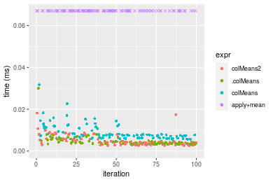
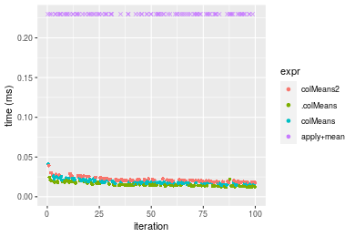
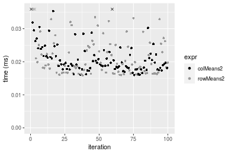
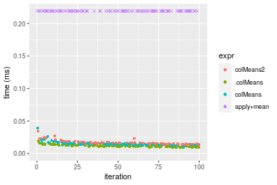
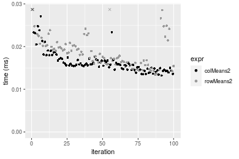
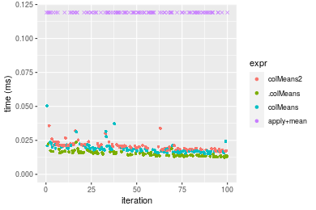
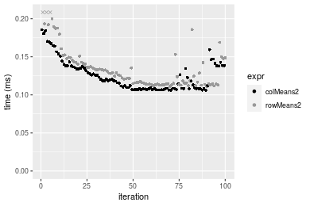

[matrixStats]: Benchmark report

---------------------------------------


# colMeans2() and rowMeans2() benchmarks

This report benchmark the performance of colMeans2() and rowMeans2() against alternative methods.

## Alternative methods

* apply() + mean()
* .colMeans() and .rowMeans()
* colMeans() and rowMeans()


## Data type "integer"

### Data
```r
> rmatrix <- function(nrow, ncol, mode = c("logical", "double", "integer", "index"), range = c(-100, 
+     +100), na_prob = 0) {
+     mode <- match.arg(mode)
+     n <- nrow * ncol
+     if (mode == "logical") {
+         x <- sample(c(FALSE, TRUE), size = n, replace = TRUE)
+     }     else if (mode == "index") {
+         x <- seq_len(n)
+         mode <- "integer"
+     }     else {
+         x <- runif(n, min = range[1], max = range[2])
+     }
+     storage.mode(x) <- mode
+     if (na_prob > 0) 
+         x[sample(n, size = na_prob * n)] <- NA
+     dim(x) <- c(nrow, ncol)
+     x
+ }
> rmatrices <- function(scale = 10, seed = 1, ...) {
+     set.seed(seed)
+     data <- list()
+     data[[1]] <- rmatrix(nrow = scale * 1, ncol = scale * 1, ...)
+     data[[2]] <- rmatrix(nrow = scale * 10, ncol = scale * 10, ...)
+     data[[3]] <- rmatrix(nrow = scale * 100, ncol = scale * 1, ...)
+     data[[4]] <- t(data[[3]])
+     data[[5]] <- rmatrix(nrow = scale * 10, ncol = scale * 100, ...)
+     data[[6]] <- t(data[[5]])
+     names(data) <- sapply(data, FUN = function(x) paste(dim(x), collapse = "x"))
+     data
+ }
> data <- rmatrices(mode = mode)
```

### Results

#### 10x10 integer matrix

```r
> X <- data[["10x10"]]
> gc()
          used  (Mb) gc trigger  (Mb) max used  (Mb)
Ncells 5193639 277.4   10014072 534.9 10014072 534.9
Vcells 9739812  74.4   18204443 138.9 18204443 138.9
> colStats <- microbenchmark(colMeans2 = colMeans2(X, na.rm = FALSE), .colMeans = .colMeans(X, m = nrow(X), 
+     n = ncol(X), na.rm = FALSE), colMeans = colMeans(X, na.rm = FALSE), `apply+mean` = apply(X, MARGIN = 2L, 
+     FUN = mean, na.rm = FALSE), unit = "ms")
> X <- t(X)
> gc()
          used  (Mb) gc trigger  (Mb) max used  (Mb)
Ncells 5178315 276.6   10014072 534.9 10014072 534.9
Vcells 9689481  74.0   18204443 138.9 18204443 138.9
> rowStats <- microbenchmark(rowMeans2 = rowMeans2(X, na.rm = FALSE), .rowMeans = .rowMeans(X, m = nrow(X), 
+     n = ncol(X), na.rm = FALSE), rowMeans = rowMeans(X, na.rm = FALSE), `apply+mean` = apply(X, MARGIN = 1L, 
+     FUN = mean, na.rm = FALSE), unit = "ms")
```

_Table: Benchmarking of colMeans2(), .colMeans(), colMeans() and apply+mean() on integer+10x10 data. The top panel shows times in milliseconds and the bottom panel shows relative times._


|   |expr       |      min|        lq|      mean|    median|        uq|      max|
|:--|:----------|--------:|---------:|---------:|---------:|---------:|--------:|
|1  |colMeans2  | 0.001897| 0.0023090| 0.0029263| 0.0029215| 0.0033175| 0.012455|
|2  |.colMeans  | 0.002820| 0.0031920| 0.0038365| 0.0035285| 0.0041990| 0.017424|
|3  |colMeans   | 0.005142| 0.0059175| 0.0068444| 0.0066015| 0.0074875| 0.018428|
|4  |apply+mean | 0.064928| 0.0678155| 0.0715122| 0.0703075| 0.0720870| 0.155525|


|   |expr       |       min|        lq|      mean|    median|        uq|       max|
|:--|:----------|---------:|---------:|---------:|---------:|---------:|---------:|
|1  |colMeans2  |  1.000000|  1.000000|  1.000000|  1.000000|  1.000000|  1.000000|
|2  |.colMeans  |  1.486558|  1.382417|  1.311025|  1.207770|  1.265712|  1.398956|
|3  |colMeans   |  2.710596|  2.562798|  2.338893|  2.259627|  2.256971|  1.479566|
|4  |apply+mean | 34.226674| 29.370074| 24.437597| 24.065548| 21.729314| 12.486953|

_Table: Benchmarking of rowMeans2(), .rowMeans(), rowMeans() and apply+mean() on integer+10x10 data (transposed). The top panel shows times in milliseconds and the bottom panel shows relative times._


|   |expr       |      min|        lq|      mean|    median|        uq|      max|
|:--|:----------|--------:|---------:|---------:|---------:|---------:|--------:|
|1  |rowMeans2  | 0.001897| 0.0022675| 0.0028915| 0.0027740| 0.0031850| 0.012237|
|2  |.rowMeans  | 0.003990| 0.0043125| 0.0046727| 0.0045905| 0.0048365| 0.011638|
|3  |rowMeans   | 0.005991| 0.0068330| 0.0077704| 0.0073510| 0.0078585| 0.033503|
|4  |apply+mean | 0.062142| 0.0668490| 0.0699148| 0.0685840| 0.0718205| 0.130833|


|   |expr       |       min|        lq|      mean|    median|        uq|        max|
|:--|:----------|---------:|---------:|---------:|---------:|---------:|----------:|
|1  |rowMeans2  |  1.000000|  1.000000|  1.000000|  1.000000|  1.000000|  1.0000000|
|2  |.rowMeans  |  2.103321|  1.901874|  1.616005|  1.654831|  1.518524|  0.9510501|
|3  |rowMeans   |  3.158144|  3.013451|  2.687332|  2.649964|  2.467347|  2.7378442|
|4  |apply+mean | 32.758039| 29.481367| 24.179426| 24.723865| 22.549608| 10.6915911|

_Figure: Benchmarking of colMeans2(), .colMeans(), colMeans() and apply+mean() on integer+10x10 data  as well as rowMeans2(), .rowMeans(), rowMeans() and apply+mean() on the same data transposed.  Outliers are displayed as crosses.  Times are in milliseconds._





_Table: Benchmarking of colMeans2() and rowMeans2() on integer+10x10 data (original and transposed).  The top panel shows times in milliseconds and the bottom panel shows relative times._


|   |expr      |   min|     lq|    mean| median|     uq|    max|
|:--|:---------|-----:|------:|-------:|------:|------:|------:|
|2  |rowMeans2 | 1.897| 2.2675| 2.89150| 2.7740| 3.1850| 12.237|
|1  |colMeans2 | 1.897| 2.3090| 2.92632| 2.9215| 3.3175| 12.455|


|   |expr      | min|       lq|     mean|   median|       uq|      max|
|:--|:---------|---:|--------:|--------:|--------:|--------:|--------:|
|2  |rowMeans2 |   1| 1.000000| 1.000000| 1.000000| 1.000000| 1.000000|
|1  |colMeans2 |   1| 1.018302| 1.012042| 1.053172| 1.041601| 1.017815|

_Figure: Benchmarking of colMeans2() and rowMeans2() on integer+10x10 data (original and transposed).  Outliers are displayed as crosses. Times are in milliseconds._


#### 100x100 integer matrix

```r
> X <- data[["100x100"]]
> gc()
          used  (Mb) gc trigger  (Mb) max used  (Mb)
Ncells 5176929 276.5   10014072 534.9 10014072 534.9
Vcells 9306335  71.1   18204443 138.9 18204443 138.9
> colStats <- microbenchmark(colMeans2 = colMeans2(X, na.rm = FALSE), .colMeans = .colMeans(X, m = nrow(X), 
+     n = ncol(X), na.rm = FALSE), colMeans = colMeans(X, na.rm = FALSE), `apply+mean` = apply(X, MARGIN = 2L, 
+     FUN = mean, na.rm = FALSE), unit = "ms")
> X <- t(X)
> gc()
          used  (Mb) gc trigger  (Mb) max used  (Mb)
Ncells 5176905 276.5   10014072 534.9 10014072 534.9
Vcells 9311348  71.1   18204443 138.9 18204443 138.9
> rowStats <- microbenchmark(rowMeans2 = rowMeans2(X, na.rm = FALSE), .rowMeans = .rowMeans(X, m = nrow(X), 
+     n = ncol(X), na.rm = FALSE), rowMeans = rowMeans(X, na.rm = FALSE), `apply+mean` = apply(X, MARGIN = 1L, 
+     FUN = mean, na.rm = FALSE), unit = "ms")
```

_Table: Benchmarking of colMeans2(), .colMeans(), colMeans() and apply+mean() on integer+100x100 data. The top panel shows times in milliseconds and the bottom panel shows relative times._


|   |expr       |      min|        lq|      mean|    median|        uq|      max|
|:--|:----------|--------:|---------:|---------:|---------:|---------:|--------:|
|2  |.colMeans  | 0.011694| 0.0130425| 0.0147729| 0.0141615| 0.0157085| 0.031256|
|1  |colMeans2  | 0.013906| 0.0150585| 0.0170208| 0.0165795| 0.0176575| 0.031468|
|3  |colMeans   | 0.013391| 0.0158965| 0.0175882| 0.0170660| 0.0186295| 0.036038|
|4  |apply+mean | 0.401827| 0.4317630| 0.4866980| 0.4741485| 0.5209480| 0.722178|


|   |expr       |       min|        lq|      mean|    median|        uq|       max|
|:--|:----------|---------:|---------:|---------:|---------:|---------:|---------:|
|2  |.colMeans  |  1.000000|  1.000000|  1.000000|  1.000000|  1.000000|  1.000000|
|1  |colMeans2  |  1.189157|  1.154572|  1.152162|  1.170745|  1.124073|  1.006783|
|3  |colMeans   |  1.145117|  1.218823|  1.190573|  1.205098|  1.185950|  1.152995|
|4  |apply+mean | 34.361809| 33.104313| 32.945370| 33.481517| 33.163446| 23.105260|

_Table: Benchmarking of rowMeans2(), .rowMeans(), rowMeans() and apply+mean() on integer+100x100 data (transposed). The top panel shows times in milliseconds and the bottom panel shows relative times._


|   |expr       |      min|        lq|      mean|    median|        uq|      max|
|:--|:----------|--------:|---------:|---------:|---------:|---------:|--------:|
|1  |rowMeans2  | 0.015571| 0.0176985| 0.0204333| 0.0199350| 0.0230350| 0.036204|
|2  |.rowMeans  | 0.034387| 0.0366340| 0.0424917| 0.0405005| 0.0447650| 0.079967|
|3  |rowMeans   | 0.036237| 0.0407635| 0.0456809| 0.0444420| 0.0481965| 0.066896|
|4  |apply+mean | 0.388365| 0.4242175| 0.4758470| 0.4632780| 0.4992740| 0.728927|


|   |expr       |       min|        lq|      mean|    median|        uq|       max|
|:--|:----------|---------:|---------:|---------:|---------:|---------:|---------:|
|1  |rowMeans2  |  1.000000|  1.000000|  1.000000|  1.000000|  1.000000|  1.000000|
|2  |.rowMeans  |  2.208400|  2.069893|  2.079530|  2.031628|  1.943347|  2.208789|
|3  |rowMeans   |  2.327211|  2.303218|  2.235609|  2.229345|  2.092316|  1.847752|
|4  |apply+mean | 24.941558| 23.969122| 23.287808| 23.239428| 21.674582| 20.133880|

_Figure: Benchmarking of colMeans2(), .colMeans(), colMeans() and apply+mean() on integer+100x100 data  as well as rowMeans2(), .rowMeans(), rowMeans() and apply+mean() on the same data transposed.  Outliers are displayed as crosses.  Times are in milliseconds._





_Table: Benchmarking of colMeans2() and rowMeans2() on integer+100x100 data (original and transposed).  The top panel shows times in milliseconds and the bottom panel shows relative times._


|   |expr      |    min|      lq|     mean|  median|      uq|    max|
|:--|:---------|------:|-------:|--------:|-------:|-------:|------:|
|1  |colMeans2 | 13.906| 15.0585| 17.02075| 16.5795| 17.6575| 31.468|
|2  |rowMeans2 | 15.571| 17.6985| 20.43331| 19.9350| 23.0350| 36.204|


|   |expr      |      min|       lq|     mean|   median|       uq|      max|
|:--|:---------|--------:|--------:|--------:|--------:|--------:|--------:|
|1  |colMeans2 | 1.000000| 1.000000| 1.000000| 1.000000| 1.000000| 1.000000|
|2  |rowMeans2 | 1.119733| 1.175316| 1.200494| 1.202389| 1.304545| 1.150502|

_Figure: Benchmarking of colMeans2() and rowMeans2() on integer+100x100 data (original and transposed).  Outliers are displayed as crosses. Times are in milliseconds._


#### 1000x10 integer matrix

```r
> X <- data[["1000x10"]]
> gc()
          used  (Mb) gc trigger  (Mb) max used  (Mb)
Ncells 5177692 276.6   10014072 534.9 10014072 534.9
Vcells 9310105  71.1   18204443 138.9 18204443 138.9
> colStats <- microbenchmark(colMeans2 = colMeans2(X, na.rm = FALSE), .colMeans = .colMeans(X, m = nrow(X), 
+     n = ncol(X), na.rm = FALSE), colMeans = colMeans(X, na.rm = FALSE), `apply+mean` = apply(X, MARGIN = 2L, 
+     FUN = mean, na.rm = FALSE), unit = "ms")
> X <- t(X)
> gc()
          used  (Mb) gc trigger  (Mb) max used  (Mb)
Ncells 5177668 276.6   10014072 534.9 10014072 534.9
Vcells 9315118  71.1   18204443 138.9 18204443 138.9
> rowStats <- microbenchmark(rowMeans2 = rowMeans2(X, na.rm = FALSE), .rowMeans = .rowMeans(X, m = nrow(X), 
+     n = ncol(X), na.rm = FALSE), rowMeans = rowMeans(X, na.rm = FALSE), `apply+mean` = apply(X, MARGIN = 1L, 
+     FUN = mean, na.rm = FALSE), unit = "ms")
```

_Table: Benchmarking of colMeans2(), .colMeans(), colMeans() and apply+mean() on integer+1000x10 data. The top panel shows times in milliseconds and the bottom panel shows relative times._


|   |expr       |      min|        lq|      mean|    median|        uq|      max|
|:--|:----------|--------:|---------:|---------:|---------:|---------:|--------:|
|2  |.colMeans  | 0.012841| 0.0138675| 0.0151994| 0.0148625| 0.0159955| 0.030769|
|3  |colMeans   | 0.015627| 0.0168900| 0.0182940| 0.0178980| 0.0193320| 0.034556|
|1  |colMeans2  | 0.015278| 0.0167525| 0.0181089| 0.0180290| 0.0191530| 0.030274|
|4  |apply+mean | 0.133278| 0.1408895| 0.1542142| 0.1545290| 0.1630710| 0.248301|


|   |expr       |       min|        lq|      mean|    median|        uq|       max|
|:--|:----------|---------:|---------:|---------:|---------:|---------:|---------:|
|2  |.colMeans  |  1.000000|  1.000000|  1.000000|  1.000000|  1.000000| 1.0000000|
|3  |colMeans   |  1.216961|  1.217956|  1.203601|  1.204239|  1.208590| 1.1230784|
|1  |colMeans2  |  1.189783|  1.208040|  1.191426|  1.213053|  1.197399| 0.9839124|
|4  |apply+mean | 10.379098| 10.159690| 10.146084| 10.397241| 10.194805| 8.0698430|

_Table: Benchmarking of rowMeans2(), .rowMeans(), rowMeans() and apply+mean() on integer+1000x10 data (transposed). The top panel shows times in milliseconds and the bottom panel shows relative times._


|   |expr       |      min|        lq|      mean|    median|        uq|      max|
|:--|:----------|--------:|---------:|---------:|---------:|---------:|--------:|
|1  |rowMeans2  | 0.014753| 0.0166340| 0.0184213| 0.0180675| 0.0195975| 0.036451|
|4  |apply+mean | 0.107632| 0.1209660| 0.1348618| 0.1315280| 0.1412965| 0.262216|
|2  |.rowMeans  | 0.135769| 0.1505605| 0.1689816| 0.1666175| 0.1841130| 0.225732|
|3  |rowMeans   | 0.137323| 0.1534655| 0.1696916| 0.1684060| 0.1804675| 0.228799|


|   |expr       |      min|       lq|     mean|   median|       uq|      max|
|:--|:----------|--------:|--------:|--------:|--------:|--------:|--------:|
|1  |rowMeans2  | 1.000000| 1.000000| 1.000000| 1.000000| 1.000000| 1.000000|
|4  |apply+mean | 7.295601| 7.272214| 7.320966| 7.279812| 7.209925| 7.193657|
|2  |.rowMeans  | 9.202806| 9.051371| 9.173159| 9.221946| 9.394719| 6.192752|
|3  |rowMeans   | 9.308141| 9.226013| 9.211700| 9.320935| 9.208700| 6.276892|

_Figure: Benchmarking of colMeans2(), .colMeans(), colMeans() and apply+mean() on integer+1000x10 data  as well as rowMeans2(), .rowMeans(), rowMeans() and apply+mean() on the same data transposed.  Outliers are displayed as crosses.  Times are in milliseconds._


_Table: Benchmarking of colMeans2() and rowMeans2() on integer+1000x10 data (original and transposed).  The top panel shows times in milliseconds and the bottom panel shows relative times._


|   |expr      |    min|      lq|     mean|  median|      uq|    max|
|:--|:---------|------:|-------:|--------:|-------:|-------:|------:|
|1  |colMeans2 | 15.278| 16.7525| 18.10893| 18.0290| 19.1530| 30.274|
|2  |rowMeans2 | 14.753| 16.6340| 18.42131| 18.0675| 19.5975| 36.451|


|   |expr      |       min|        lq|    mean|   median|       uq|      max|
|:--|:---------|---------:|---------:|-------:|--------:|--------:|--------:|
|1  |colMeans2 | 1.0000000| 1.0000000| 1.00000| 1.000000| 1.000000| 1.000000|
|2  |rowMeans2 | 0.9656369| 0.9929264| 1.01725| 1.002135| 1.023208| 1.204036|

_Figure: Benchmarking of colMeans2() and rowMeans2() on integer+1000x10 data (original and transposed).  Outliers are displayed as crosses. Times are in milliseconds._


#### 10x1000 integer matrix

```r
> X <- data[["10x1000"]]
> gc()
          used  (Mb) gc trigger  (Mb) max used  (Mb)
Ncells 5177915 276.6   10014072 534.9 10014072 534.9
Vcells 9310921  71.1   18204443 138.9 18204443 138.9
> colStats <- microbenchmark(colMeans2 = colMeans2(X, na.rm = FALSE), .colMeans = .colMeans(X, m = nrow(X), 
+     n = ncol(X), na.rm = FALSE), colMeans = colMeans(X, na.rm = FALSE), `apply+mean` = apply(X, MARGIN = 2L, 
+     FUN = mean, na.rm = FALSE), unit = "ms")
> X <- t(X)
> gc()
          used  (Mb) gc trigger  (Mb) max used  (Mb)
Ncells 5177891 276.6   10014072 534.9 10014072 534.9
Vcells 9315934  71.1   18204443 138.9 18204443 138.9
> rowStats <- microbenchmark(rowMeans2 = rowMeans2(X, na.rm = FALSE), .rowMeans = .rowMeans(X, m = nrow(X), 
+     n = ncol(X), na.rm = FALSE), rowMeans = rowMeans(X, na.rm = FALSE), `apply+mean` = apply(X, MARGIN = 1L, 
+     FUN = mean, na.rm = FALSE), unit = "ms")
```

_Table: Benchmarking of colMeans2(), .colMeans(), colMeans() and apply+mean() on integer+10x1000 data. The top panel shows times in milliseconds and the bottom panel shows relative times._


|   |expr       |      min|       lq|      mean|   median|        uq|      max|
|:--|:----------|--------:|--------:|---------:|--------:|---------:|--------:|
|2  |.colMeans  | 0.011976| 0.012783| 0.0146169| 0.013985| 0.0150585| 0.050446|
|3  |colMeans   | 0.013808| 0.015338| 0.0181689| 0.017198| 0.0195625| 0.054286|
|1  |colMeans2  | 0.016257| 0.016908| 0.0193439| 0.018353| 0.0206485| 0.039274|
|4  |apply+mean | 3.016939| 3.155843| 3.3930871| 3.351742| 3.4086350| 7.880341|


|   |expr       |        min|         lq|       mean|     median|         uq|         max|
|:--|:----------|----------:|----------:|----------:|----------:|----------:|-----------:|
|2  |.colMeans  |   1.000000|   1.000000|   1.000000|   1.000000|   1.000000|   1.0000000|
|3  |colMeans   |   1.152973|   1.199875|   1.243009|   1.229746|   1.299100|   1.0761210|
|1  |colMeans2  |   1.357465|   1.322694|   1.323395|   1.312335|   1.371219|   0.7785355|
|4  |apply+mean | 251.915414| 246.878119| 232.135159| 239.666893| 226.359531| 156.2133965|

_Table: Benchmarking of rowMeans2(), .rowMeans(), rowMeans() and apply+mean() on integer+10x1000 data (transposed). The top panel shows times in milliseconds and the bottom panel shows relative times._


|   |expr       |      min|        lq|      mean|    median|        uq|      max|
|:--|:----------|--------:|---------:|---------:|---------:|---------:|--------:|
|1  |rowMeans2  | 0.016085| 0.0165935| 0.0192571| 0.0182305| 0.0193655| 0.058663|
|2  |.rowMeans  | 0.025824| 0.0268455| 0.0289319| 0.0278710| 0.0291255| 0.064622|
|3  |rowMeans   | 0.027605| 0.0287965| 0.0317508| 0.0306575| 0.0322695| 0.057865|
|4  |apply+mean | 2.983775| 3.1414530| 3.4120721| 3.3598070| 3.3994545| 7.857314|


|   |expr       |        min|         lq|       mean|     median|         uq|         max|
|:--|:----------|----------:|----------:|----------:|----------:|----------:|-----------:|
|1  |rowMeans2  |   1.000000|   1.000000|   1.000000|   1.000000|   1.000000|   1.0000000|
|2  |.rowMeans  |   1.605471|   1.617832|   1.502399|   1.528812|   1.503989|   1.1015802|
|3  |rowMeans   |   1.716195|   1.735408|   1.648782|   1.681660|   1.666340|   0.9863969|
|4  |apply+mean | 185.500466| 189.318287| 177.184781| 184.295933| 175.541788| 133.9398599|

_Figure: Benchmarking of colMeans2(), .colMeans(), colMeans() and apply+mean() on integer+10x1000 data  as well as rowMeans2(), .rowMeans(), rowMeans() and apply+mean() on the same data transposed.  Outliers are displayed as crosses.  Times are in milliseconds._


_Table: Benchmarking of colMeans2() and rowMeans2() on integer+10x1000 data (original and transposed).  The top panel shows times in milliseconds and the bottom panel shows relative times._


|   |expr      |    min|      lq|     mean|  median|      uq|    max|
|:--|:---------|------:|-------:|--------:|-------:|-------:|------:|
|2  |rowMeans2 | 16.085| 16.5935| 19.25714| 18.2305| 19.3655| 58.663|
|1  |colMeans2 | 16.257| 16.9080| 19.34388| 18.3530| 20.6485| 39.274|


|   |expr      |      min|       lq|     mean|   median|       uq|      max|
|:--|:---------|--------:|--------:|--------:|--------:|--------:|--------:|
|2  |rowMeans2 | 1.000000| 1.000000| 1.000000| 1.000000| 1.000000| 1.000000|
|1  |colMeans2 | 1.010693| 1.018953| 1.004504| 1.006719| 1.066252| 0.669485|

_Figure: Benchmarking of colMeans2() and rowMeans2() on integer+10x1000 data (original and transposed).  Outliers are displayed as crosses. Times are in milliseconds._




#### 100x1000 integer matrix

```r
> X <- data[["100x1000"]]
> gc()
          used  (Mb) gc trigger  (Mb) max used  (Mb)
Ncells 5178145 276.6   10014072 534.9 10014072 534.9
Vcells 9311512  71.1   18204443 138.9 18204443 138.9
> colStats <- microbenchmark(colMeans2 = colMeans2(X, na.rm = FALSE), .colMeans = .colMeans(X, m = nrow(X), 
+     n = ncol(X), na.rm = FALSE), colMeans = colMeans(X, na.rm = FALSE), `apply+mean` = apply(X, MARGIN = 2L, 
+     FUN = mean, na.rm = FALSE), unit = "ms")
> X <- t(X)
> gc()
          used  (Mb) gc trigger  (Mb) max used  (Mb)
Ncells 5178121 276.6   10014072 534.9 10014072 534.9
Vcells 9361525  71.5   18204443 138.9 18204443 138.9
> rowStats <- microbenchmark(rowMeans2 = rowMeans2(X, na.rm = FALSE), .rowMeans = .rowMeans(X, m = nrow(X), 
+     n = ncol(X), na.rm = FALSE), rowMeans = rowMeans(X, na.rm = FALSE), `apply+mean` = apply(X, MARGIN = 1L, 
+     FUN = mean, na.rm = FALSE), unit = "ms")
```

_Table: Benchmarking of colMeans2(), .colMeans(), colMeans() and apply+mean() on integer+100x1000 data. The top panel shows times in milliseconds and the bottom panel shows relative times._


|   |expr       |      min|        lq|      mean|    median|       uq|       max|
|:--|:----------|--------:|---------:|---------:|---------:|--------:|---------:|
|2  |.colMeans  | 0.088358| 0.0889450| 0.0954361| 0.0909790| 0.095774|  0.170151|
|3  |colMeans   | 0.090409| 0.0910880| 0.0962446| 0.0931435| 0.097444|  0.137436|
|1  |colMeans2  | 0.115905| 0.1166565| 0.1229971| 0.1187025| 0.122964|  0.172567|
|4  |apply+mean | 3.622637| 3.6883945| 4.0352554| 3.7762120| 3.940264| 15.908646|


|   |expr       |       min|        lq|      mean|    median|        uq|        max|
|:--|:----------|---------:|---------:|---------:|---------:|---------:|----------:|
|2  |.colMeans  |  1.000000|  1.000000|  1.000000|  1.000000|  1.000000|  1.0000000|
|3  |colMeans   |  1.023212|  1.024093|  1.008472|  1.023791|  1.017437|  0.8077296|
|1  |colMeans2  |  1.311766|  1.311558|  1.288790|  1.304724|  1.283897|  1.0141992|
|4  |apply+mean | 40.999536| 41.468261| 42.282288| 41.506414| 41.141270| 93.4972231|

_Table: Benchmarking of rowMeans2(), .rowMeans(), rowMeans() and apply+mean() on integer+100x1000 data (transposed). The top panel shows times in milliseconds and the bottom panel shows relative times._


|   |expr       |      min|        lq|      mean|    median|        uq|       max|
|:--|:----------|--------:|---------:|---------:|---------:|---------:|---------:|
|1  |rowMeans2  | 0.144902| 0.1460105| 0.1524958| 0.1478305| 0.1529005|  0.230728|
|2  |.rowMeans  | 0.221410| 0.2222565| 0.2345144| 0.2248770| 0.2329980|  0.381282|
|3  |rowMeans   | 0.223699| 0.2256110| 0.2360499| 0.2300620| 0.2362670|  0.303274|
|4  |apply+mean | 3.641606| 3.6864645| 3.9984741| 3.7784280| 3.9069930| 15.632299|


|   |expr       |       min|        lq|      mean|    median|        uq|       max|
|:--|:----------|---------:|---------:|---------:|---------:|---------:|---------:|
|1  |rowMeans2  |  1.000000|  1.000000|  1.000000|  1.000000|  1.000000|  1.000000|
|2  |.rowMeans  |  1.527998|  1.522195|  1.537842|  1.521181|  1.523854|  1.652517|
|3  |rowMeans   |  1.543795|  1.545170|  1.547911|  1.556255|  1.545234|  1.314422|
|4  |apply+mean | 25.131510| 25.247941| 26.220231| 25.559191| 25.552519| 67.752067|

_Figure: Benchmarking of colMeans2(), .colMeans(), colMeans() and apply+mean() on integer+100x1000 data  as well as rowMeans2(), .rowMeans(), rowMeans() and apply+mean() on the same data transposed.  Outliers are displayed as crosses.  Times are in milliseconds._


_Table: Benchmarking of colMeans2() and rowMeans2() on integer+100x1000 data (original and transposed).  The top panel shows times in milliseconds and the bottom panel shows relative times._


|   |expr      |     min|       lq|     mean|   median|       uq|     max|
|:--|:---------|-------:|--------:|--------:|--------:|--------:|-------:|
|1  |colMeans2 | 115.905| 116.6565| 122.9971| 118.7025| 122.9640| 172.567|
|2  |rowMeans2 | 144.902| 146.0105| 152.4958| 147.8305| 152.9005| 230.728|


|   |expr      |      min|       lq|     mean|   median|       uq|      max|
|:--|:---------|--------:|--------:|--------:|--------:|--------:|--------:|
|1  |colMeans2 | 1.000000| 1.000000| 1.000000| 1.000000| 1.000000| 1.000000|
|2  |rowMeans2 | 1.250179| 1.251628| 1.239832| 1.245387| 1.243457| 1.337034|

_Figure: Benchmarking of colMeans2() and rowMeans2() on integer+100x1000 data (original and transposed).  Outliers are displayed as crosses. Times are in milliseconds._


#### 1000x100 integer matrix

```r
> X <- data[["1000x100"]]
> gc()
          used  (Mb) gc trigger  (Mb) max used  (Mb)
Ncells 5178351 276.6   10014072 534.9 10014072 534.9
Vcells 9312263  71.1   18204443 138.9 18204443 138.9
> colStats <- microbenchmark(colMeans2 = colMeans2(X, na.rm = FALSE), .colMeans = .colMeans(X, m = nrow(X), 
+     n = ncol(X), na.rm = FALSE), colMeans = colMeans(X, na.rm = FALSE), `apply+mean` = apply(X, MARGIN = 2L, 
+     FUN = mean, na.rm = FALSE), unit = "ms")
> X <- t(X)
> gc()
          used  (Mb) gc trigger  (Mb) max used  (Mb)
Ncells 5178345 276.6   10014072 534.9 10014072 534.9
Vcells 9362306  71.5   18204443 138.9 18204443 138.9
> rowStats <- microbenchmark(rowMeans2 = rowMeans2(X, na.rm = FALSE), .rowMeans = .rowMeans(X, m = nrow(X), 
+     n = ncol(X), na.rm = FALSE), rowMeans = rowMeans(X, na.rm = FALSE), `apply+mean` = apply(X, MARGIN = 1L, 
+     FUN = mean, na.rm = FALSE), unit = "ms")
```

_Table: Benchmarking of colMeans2(), .colMeans(), colMeans() and apply+mean() on integer+1000x100 data. The top panel shows times in milliseconds and the bottom panel shows relative times._


|   |expr       |      min|        lq|      mean|    median|        uq|      max|
|:--|:----------|--------:|---------:|---------:|---------:|---------:|--------:|
|2  |.colMeans  | 0.080981| 0.0822985| 0.0968319| 0.0894925| 0.1019825| 0.187710|
|3  |colMeans   | 0.083347| 0.0858425| 0.1037162| 0.0965365| 0.1114155| 0.197151|
|1  |colMeans2  | 0.106652| 0.1079395| 0.1269050| 0.1188865| 0.1358275| 0.238833|
|4  |apply+mean | 0.893638| 0.9061220| 1.1345887| 0.9899115| 1.1628980| 7.337756|


|   |expr       |       min|        lq|      mean|    median|        uq|       max|
|:--|:----------|---------:|---------:|---------:|---------:|---------:|---------:|
|2  |.colMeans  |  1.000000|  1.000000|  1.000000|  1.000000|  1.000000|  1.000000|
|3  |colMeans   |  1.029217|  1.043063|  1.071095|  1.078710|  1.092496|  1.050296|
|1  |colMeans2  |  1.317000|  1.311561|  1.310569|  1.328452|  1.331871|  1.272351|
|4  |apply+mean | 11.035156| 11.010188| 11.717094| 11.061391| 11.402917| 39.090917|

_Table: Benchmarking of rowMeans2(), .rowMeans(), rowMeans() and apply+mean() on integer+1000x100 data (transposed). The top panel shows times in milliseconds and the bottom panel shows relative times._


|   |expr       |      min|        lq|      mean|    median|        uq|      max|
|:--|:----------|--------:|---------:|---------:|---------:|---------:|--------:|
|1  |rowMeans2  | 0.166175| 0.1672205| 0.1827879| 0.1686265| 0.1898775| 0.289706|
|2  |.rowMeans  | 0.320164| 0.3207015| 0.3485397| 0.3212155| 0.3563825| 0.550292|
|3  |rowMeans   | 0.322515| 0.3233505| 0.3531489| 0.3248100| 0.3720545| 0.536263|
|4  |apply+mean | 0.897721| 0.9097550| 1.0697964| 0.9239860| 1.0483065| 7.126149|


|   |expr       |      min|       lq|     mean|   median|       uq|       max|
|:--|:----------|--------:|--------:|--------:|--------:|--------:|---------:|
|1  |rowMeans2  | 1.000000| 1.000000| 1.000000| 1.000000| 1.000000|  1.000000|
|2  |.rowMeans  | 1.926668| 1.917836| 1.906798| 1.904893| 1.876907|  1.899484|
|3  |rowMeans   | 1.940815| 1.933677| 1.932014| 1.926210| 1.959445|  1.851059|
|4  |apply+mean | 5.402263| 5.440451| 5.852664| 5.479483| 5.520962| 24.597865|

_Figure: Benchmarking of colMeans2(), .colMeans(), colMeans() and apply+mean() on integer+1000x100 data  as well as rowMeans2(), .rowMeans(), rowMeans() and apply+mean() on the same data transposed.  Outliers are displayed as crosses.  Times are in milliseconds._


_Table: Benchmarking of colMeans2() and rowMeans2() on integer+1000x100 data (original and transposed).  The top panel shows times in milliseconds and the bottom panel shows relative times._


|   |expr      |     min|       lq|     mean|   median|       uq|     max|
|:--|:---------|-------:|--------:|--------:|--------:|--------:|-------:|
|1  |colMeans2 | 106.652| 107.9395| 126.9049| 118.8865| 135.8275| 238.833|
|2  |rowMeans2 | 166.175| 167.2205| 182.7879| 168.6265| 189.8775| 289.706|


|   |expr      |      min|       lq|     mean|   median|       uq|      max|
|:--|:---------|--------:|--------:|--------:|--------:|--------:|--------:|
|1  |colMeans2 | 1.000000| 1.000000| 1.000000| 1.000000| 1.000000| 1.000000|
|2  |rowMeans2 | 1.558105| 1.549206| 1.440353| 1.418382| 1.397931| 1.213007|

_Figure: Benchmarking of colMeans2() and rowMeans2() on integer+1000x100 data (original and transposed).  Outliers are displayed as crosses. Times are in milliseconds._


## Data type "double"

### Data
```r
> rmatrix <- function(nrow, ncol, mode = c("logical", "double", "integer", "index"), range = c(-100, 
+     +100), na_prob = 0) {
+     mode <- match.arg(mode)
+     n <- nrow * ncol
+     if (mode == "logical") {
+         x <- sample(c(FALSE, TRUE), size = n, replace = TRUE)
+     }     else if (mode == "index") {
+         x <- seq_len(n)
+         mode <- "integer"
+     }     else {
+         x <- runif(n, min = range[1], max = range[2])
+     }
+     storage.mode(x) <- mode
+     if (na_prob > 0) 
+         x[sample(n, size = na_prob * n)] <- NA
+     dim(x) <- c(nrow, ncol)
+     x
+ }
> rmatrices <- function(scale = 10, seed = 1, ...) {
+     set.seed(seed)
+     data <- list()
+     data[[1]] <- rmatrix(nrow = scale * 1, ncol = scale * 1, ...)
+     data[[2]] <- rmatrix(nrow = scale * 10, ncol = scale * 10, ...)
+     data[[3]] <- rmatrix(nrow = scale * 100, ncol = scale * 1, ...)
+     data[[4]] <- t(data[[3]])
+     data[[5]] <- rmatrix(nrow = scale * 10, ncol = scale * 100, ...)
+     data[[6]] <- t(data[[5]])
+     names(data) <- sapply(data, FUN = function(x) paste(dim(x), collapse = "x"))
+     data
+ }
> data <- rmatrices(mode = mode)
```

### Results

#### 10x10 double matrix

```r
> X <- data[["10x10"]]
> gc()
          used  (Mb) gc trigger  (Mb) max used  (Mb)
Ncells 5178600 276.6   10014072 534.9 10014072 534.9
Vcells 9428220  72.0   18204443 138.9 18204443 138.9
> colStats <- microbenchmark(colMeans2 = colMeans2(X, na.rm = FALSE), .colMeans = .colMeans(X, m = nrow(X), 
+     n = ncol(X), na.rm = FALSE), colMeans = colMeans(X, na.rm = FALSE), `apply+mean` = apply(X, MARGIN = 2L, 
+     FUN = mean, na.rm = FALSE), unit = "ms")
> X <- t(X)
> gc()
          used  (Mb) gc trigger  (Mb) max used  (Mb)
Ncells 5178567 276.6   10014072 534.9 10014072 534.9
Vcells 9428318  72.0   18204443 138.9 18204443 138.9
> rowStats <- microbenchmark(rowMeans2 = rowMeans2(X, na.rm = FALSE), .rowMeans = .rowMeans(X, m = nrow(X), 
+     n = ncol(X), na.rm = FALSE), rowMeans = rowMeans(X, na.rm = FALSE), `apply+mean` = apply(X, MARGIN = 1L, 
+     FUN = mean, na.rm = FALSE), unit = "ms")
```

_Table: Benchmarking of colMeans2(), .colMeans(), colMeans() and apply+mean() on double+10x10 data. The top panel shows times in milliseconds and the bottom panel shows relative times._


|   |expr       |      min|        lq|      mean|    median|        uq|      max|
|:--|:----------|--------:|---------:|---------:|---------:|---------:|--------:|
|1  |colMeans2  | 0.001995| 0.0024425| 0.0030257| 0.0030325| 0.0033150| 0.013773|
|2  |.colMeans  | 0.002676| 0.0031380| 0.0037331| 0.0035140| 0.0041555| 0.013881|
|3  |colMeans   | 0.005099| 0.0056980| 0.0066219| 0.0062670| 0.0072115| 0.016839|
|4  |apply+mean | 0.063620| 0.0669175| 0.0700618| 0.0681180| 0.0699335| 0.149503|


|   |expr       |       min|        lq|      mean|    median|        uq|       max|
|:--|:----------|---------:|---------:|---------:|---------:|---------:|---------:|
|1  |colMeans2  |  1.000000|  1.000000|  1.000000|  1.000000|  1.000000|  1.000000|
|2  |.colMeans  |  1.341353|  1.284749|  1.233791|  1.158780|  1.253545|  1.007841|
|3  |colMeans   |  2.555890|  2.332856|  2.188575|  2.066612|  2.175415|  1.222609|
|4  |apply+mean | 31.889724| 27.397134| 23.155627| 22.462655| 21.096078| 10.854788|

_Table: Benchmarking of rowMeans2(), .rowMeans(), rowMeans() and apply+mean() on double+10x10 data (transposed). The top panel shows times in milliseconds and the bottom panel shows relative times._


|   |expr       |      min|        lq|      mean|    median|        uq|      max|
|:--|:----------|--------:|---------:|---------:|---------:|---------:|--------:|
|1  |rowMeans2  | 0.001986| 0.0022655| 0.0028919| 0.0028730| 0.0031925| 0.013571|
|2  |.rowMeans  | 0.002308| 0.0026605| 0.0030155| 0.0029045| 0.0031780| 0.007636|
|3  |rowMeans   | 0.004435| 0.0049630| 0.0061538| 0.0059250| 0.0063480| 0.031338|
|4  |apply+mean | 0.066391| 0.0674045| 0.0714888| 0.0693640| 0.0723875| 0.133805|


|   |expr       |       min|        lq|     mean|    median|         uq|       max|
|:--|:----------|---------:|---------:|--------:|---------:|----------:|---------:|
|1  |rowMeans2  |  1.000000|  1.000000|  1.00000|  1.000000|  1.0000000| 1.0000000|
|2  |.rowMeans  |  1.162135|  1.174354|  1.04275|  1.010964|  0.9954581| 0.5626704|
|3  |rowMeans   |  2.233132|  2.190686|  2.12794|  2.062304|  1.9884103| 2.3091887|
|4  |apply+mean | 33.429507| 29.752593| 24.72025| 24.143404| 22.6742365| 9.8596271|

_Figure: Benchmarking of colMeans2(), .colMeans(), colMeans() and apply+mean() on double+10x10 data  as well as rowMeans2(), .rowMeans(), rowMeans() and apply+mean() on the same data transposed.  Outliers are displayed as crosses.  Times are in milliseconds._


_Table: Benchmarking of colMeans2() and rowMeans2() on double+10x10 data (original and transposed).  The top panel shows times in milliseconds and the bottom panel shows relative times._


|   |expr      |   min|     lq|    mean| median|     uq|    max|
|:--|:---------|-----:|------:|-------:|------:|------:|------:|
|2  |rowMeans2 | 1.986| 2.2655| 2.89191| 2.8730| 3.1925| 13.571|
|1  |colMeans2 | 1.995| 2.4425| 3.02569| 3.0325| 3.3150| 13.773|


|   |expr      |      min|       lq|    mean|   median|       uq|      max|
|:--|:---------|--------:|--------:|-------:|--------:|--------:|--------:|
|2  |rowMeans2 | 1.000000| 1.000000| 1.00000| 1.000000| 1.000000| 1.000000|
|1  |colMeans2 | 1.004532| 1.078128| 1.04626| 1.055517| 1.038371| 1.014885|

_Figure: Benchmarking of colMeans2() and rowMeans2() on double+10x10 data (original and transposed).  Outliers are displayed as crosses. Times are in milliseconds._


#### 100x100 double matrix

```r
> X <- data[["100x100"]]
> gc()
          used  (Mb) gc trigger  (Mb) max used  (Mb)
Ncells 5178819 276.6   10014072 534.9 10014072 534.9
Vcells 9429252  72.0   18204443 138.9 18204443 138.9
> colStats <- microbenchmark(colMeans2 = colMeans2(X, na.rm = FALSE), .colMeans = .colMeans(X, m = nrow(X), 
+     n = ncol(X), na.rm = FALSE), colMeans = colMeans(X, na.rm = FALSE), `apply+mean` = apply(X, MARGIN = 2L, 
+     FUN = mean, na.rm = FALSE), unit = "ms")
> X <- t(X)
> gc()
          used  (Mb) gc trigger  (Mb) max used  (Mb)
Ncells 5178795 276.6   10014072 534.9 10014072 534.9
Vcells 9439265  72.1   18204443 138.9 18204443 138.9
> rowStats <- microbenchmark(rowMeans2 = rowMeans2(X, na.rm = FALSE), .rowMeans = .rowMeans(X, m = nrow(X), 
+     n = ncol(X), na.rm = FALSE), rowMeans = rowMeans(X, na.rm = FALSE), `apply+mean` = apply(X, MARGIN = 1L, 
+     FUN = mean, na.rm = FALSE), unit = "ms")
```

_Table: Benchmarking of colMeans2(), .colMeans(), colMeans() and apply+mean() on double+100x100 data. The top panel shows times in milliseconds and the bottom panel shows relative times._


|   |expr       |      min|        lq|      mean|    median|        uq|      max|
|:--|:----------|--------:|---------:|---------:|---------:|---------:|--------:|
|2  |.colMeans  | 0.008748| 0.0103155| 0.0111216| 0.0108975| 0.0116150| 0.018068|
|3  |colMeans   | 0.010750| 0.0129110| 0.0142616| 0.0137990| 0.0150270| 0.032208|
|1  |colMeans2  | 0.026310| 0.0293080| 0.0327270| 0.0327515| 0.0343045| 0.051564|
|4  |apply+mean | 0.395916| 0.4350300| 0.4894056| 0.4775380| 0.5162165| 0.720256|


|   |expr       |       min|        lq|      mean|    median|        uq|       max|
|:--|:----------|---------:|---------:|---------:|---------:|---------:|---------:|
|2  |.colMeans  |  1.000000|  1.000000|  1.000000|  1.000000|  1.000000|  1.000000|
|3  |colMeans   |  1.228852|  1.251612|  1.282325|  1.266254|  1.293758|  1.782599|
|1  |colMeans2  |  3.007545|  2.841161|  2.942643|  3.005414|  2.953465|  2.853885|
|4  |apply+mean | 45.257888| 42.172459| 44.004805| 43.820876| 44.443952| 39.863626|

_Table: Benchmarking of rowMeans2(), .rowMeans(), rowMeans() and apply+mean() on double+100x100 data (transposed). The top panel shows times in milliseconds and the bottom panel shows relative times._


|   |expr       |      min|        lq|      mean|    median|        uq|      max|
|:--|:----------|--------:|---------:|---------:|---------:|---------:|--------:|
|1  |rowMeans2  | 0.021726| 0.0250285| 0.0292015| 0.0277135| 0.0322455| 0.066650|
|2  |.rowMeans  | 0.024084| 0.0256510| 0.0302913| 0.0293495| 0.0336585| 0.062566|
|3  |rowMeans   | 0.025566| 0.0294820| 0.0331601| 0.0321800| 0.0352775| 0.055439|
|4  |apply+mean | 0.395464| 0.4540700| 0.5090661| 0.4992675| 0.5368135| 0.720648|


|   |expr       |       min|        lq|      mean|    median|        uq|        max|
|:--|:----------|---------:|---------:|---------:|---------:|---------:|----------:|
|1  |rowMeans2  |  1.000000|  1.000000|  1.000000|  1.000000|  1.000000|  1.0000000|
|2  |.rowMeans  |  1.108534|  1.024872|  1.037321|  1.059033|  1.043820|  0.9387247|
|3  |rowMeans   |  1.176747|  1.177937|  1.135564|  1.161167|  1.094029|  0.8317929|
|4  |apply+mean | 18.202338| 18.142118| 17.432904| 18.015317| 16.647703| 10.8124231|

_Figure: Benchmarking of colMeans2(), .colMeans(), colMeans() and apply+mean() on double+100x100 data  as well as rowMeans2(), .rowMeans(), rowMeans() and apply+mean() on the same data transposed.  Outliers are displayed as crosses.  Times are in milliseconds._





_Table: Benchmarking of colMeans2() and rowMeans2() on double+100x100 data (original and transposed).  The top panel shows times in milliseconds and the bottom panel shows relative times._


|   |expr      |    min|      lq|     mean|  median|      uq|    max|
|:--|:---------|------:|-------:|--------:|-------:|-------:|------:|
|2  |rowMeans2 | 21.726| 25.0285| 29.20145| 27.7135| 32.2455| 66.650|
|1  |colMeans2 | 26.310| 29.3080| 32.72702| 32.7515| 34.3045| 51.564|


|   |expr      |      min|       lq|     mean|   median|       uq|       max|
|:--|:---------|--------:|--------:|--------:|--------:|--------:|---------:|
|2  |rowMeans2 | 1.000000| 1.000000| 1.000000| 1.000000| 1.000000| 1.0000000|
|1  |colMeans2 | 1.210991| 1.170985| 1.120733| 1.181789| 1.063854| 0.7736534|

_Figure: Benchmarking of colMeans2() and rowMeans2() on double+100x100 data (original and transposed).  Outliers are displayed as crosses. Times are in milliseconds._




#### 1000x10 double matrix

```r
> X <- data[["1000x10"]]
> gc()
          used  (Mb) gc trigger  (Mb) max used  (Mb)
Ncells 5179042 276.6   10014072 534.9 10014072 534.9
Vcells 9430373  72.0   18204443 138.9 18204443 138.9
> colStats <- microbenchmark(colMeans2 = colMeans2(X, na.rm = FALSE), .colMeans = .colMeans(X, m = nrow(X), 
+     n = ncol(X), na.rm = FALSE), colMeans = colMeans(X, na.rm = FALSE), `apply+mean` = apply(X, MARGIN = 2L, 
+     FUN = mean, na.rm = FALSE), unit = "ms")
> X <- t(X)
> gc()
          used  (Mb) gc trigger  (Mb) max used  (Mb)
Ncells 5179018 276.6   10014072 534.9 10014072 534.9
Vcells 9440386  72.1   18204443 138.9 18204443 138.9
> rowStats <- microbenchmark(rowMeans2 = rowMeans2(X, na.rm = FALSE), .rowMeans = .rowMeans(X, m = nrow(X), 
+     n = ncol(X), na.rm = FALSE), rowMeans = rowMeans(X, na.rm = FALSE), `apply+mean` = apply(X, MARGIN = 1L, 
+     FUN = mean, na.rm = FALSE), unit = "ms")
```

_Table: Benchmarking of colMeans2(), .colMeans(), colMeans() and apply+mean() on double+1000x10 data. The top panel shows times in milliseconds and the bottom panel shows relative times._


|   |expr       |      min|        lq|      mean|    median|        uq|      max|
|:--|:----------|--------:|---------:|---------:|---------:|---------:|--------:|
|2  |.colMeans  | 0.012580| 0.0130905| 0.0143628| 0.0139910| 0.0152605| 0.020993|
|3  |colMeans   | 0.014885| 0.0161525| 0.0178332| 0.0169770| 0.0184960| 0.034436|
|1  |colMeans2  | 0.032003| 0.0333820| 0.0365651| 0.0359540| 0.0401025| 0.051887|
|4  |apply+mean | 0.150763| 0.1553045| 0.1697115| 0.1641465| 0.1785570| 0.292905|


|   |expr       |       min|        lq|      mean|    median|        uq|       max|
|:--|:----------|---------:|---------:|---------:|---------:|---------:|---------:|
|2  |.colMeans  |  1.000000|  1.000000|  1.000000|  1.000000|  1.000000|  1.000000|
|3  |colMeans   |  1.183227|  1.233910|  1.241622|  1.213423|  1.212018|  1.640356|
|1  |colMeans2  |  2.543959|  2.550094|  2.545815|  2.569795|  2.627863|  2.471633|
|4  |apply+mean | 11.984340| 11.863909| 11.816017| 11.732292| 11.700600| 13.952508|

_Table: Benchmarking of rowMeans2(), .rowMeans(), rowMeans() and apply+mean() on double+1000x10 data (transposed). The top panel shows times in milliseconds and the bottom panel shows relative times._


|   |expr       |      min|        lq|      mean|    median|       uq|      max|
|:--|:----------|--------:|---------:|---------:|---------:|--------:|--------:|
|1  |rowMeans2  | 0.024494| 0.0257580| 0.0277138| 0.0265185| 0.029361| 0.046389|
|2  |.rowMeans  | 0.029397| 0.0307295| 0.0338978| 0.0327680| 0.035772| 0.052319|
|3  |rowMeans   | 0.031855| 0.0331985| 0.0360464| 0.0349230| 0.038172| 0.052057|
|4  |apply+mean | 0.147690| 0.1540110| 0.1675299| 0.1593250| 0.180171| 0.294061|


|   |expr       |      min|       lq|     mean|   median|       uq|      max|
|:--|:----------|--------:|--------:|--------:|--------:|--------:|--------:|
|1  |rowMeans2  | 1.000000| 1.000000| 1.000000| 1.000000| 1.000000| 1.000000|
|2  |.rowMeans  | 1.200171| 1.193008| 1.223136| 1.235666| 1.218351| 1.127832|
|3  |rowMeans   | 1.300523| 1.288862| 1.300664| 1.316930| 1.300092| 1.122184|
|4  |apply+mean | 6.029640| 5.979152| 6.044996| 6.008070| 6.136405| 6.339024|

_Figure: Benchmarking of colMeans2(), .colMeans(), colMeans() and apply+mean() on double+1000x10 data  as well as rowMeans2(), .rowMeans(), rowMeans() and apply+mean() on the same data transposed.  Outliers are displayed as crosses.  Times are in milliseconds._





_Table: Benchmarking of colMeans2() and rowMeans2() on double+1000x10 data (original and transposed).  The top panel shows times in milliseconds and the bottom panel shows relative times._


|   |expr      |    min|     lq|     mean|  median|      uq|    max|
|:--|:---------|------:|------:|--------:|-------:|-------:|------:|
|2  |rowMeans2 | 24.494| 25.758| 27.71382| 26.5185| 29.3610| 46.389|
|1  |colMeans2 | 32.003| 33.382| 36.56511| 35.9540| 40.1025| 51.887|


|   |expr      |      min|       lq|     mean|   median|       uq|     max|
|:--|:---------|--------:|--------:|--------:|--------:|--------:|-------:|
|2  |rowMeans2 | 1.000000| 1.000000| 1.000000| 1.000000| 1.000000| 1.00000|
|1  |colMeans2 | 1.306565| 1.295986| 1.319382| 1.355808| 1.365842| 1.11852|

_Figure: Benchmarking of colMeans2() and rowMeans2() on double+1000x10 data (original and transposed).  Outliers are displayed as crosses. Times are in milliseconds._


#### 10x1000 double matrix

```r
> X <- data[["10x1000"]]
> gc()
          used  (Mb) gc trigger  (Mb) max used  (Mb)
Ncells 5179265 276.7   10014072 534.9 10014072 534.9
Vcells 9430521  72.0   18204443 138.9 18204443 138.9
> colStats <- microbenchmark(colMeans2 = colMeans2(X, na.rm = FALSE), .colMeans = .colMeans(X, m = nrow(X), 
+     n = ncol(X), na.rm = FALSE), colMeans = colMeans(X, na.rm = FALSE), `apply+mean` = apply(X, MARGIN = 2L, 
+     FUN = mean, na.rm = FALSE), unit = "ms")
> X <- t(X)
> gc()
          used  (Mb) gc trigger  (Mb) max used  (Mb)
Ncells 5179241 276.7   10014072 534.9 10014072 534.9
Vcells 9440534  72.1   18204443 138.9 18204443 138.9
> rowStats <- microbenchmark(rowMeans2 = rowMeans2(X, na.rm = FALSE), .rowMeans = .rowMeans(X, m = nrow(X), 
+     n = ncol(X), na.rm = FALSE), rowMeans = rowMeans(X, na.rm = FALSE), `apply+mean` = apply(X, MARGIN = 1L, 
+     FUN = mean, na.rm = FALSE), unit = "ms")
```

_Table: Benchmarking of colMeans2(), .colMeans(), colMeans() and apply+mean() on double+10x1000 data. The top panel shows times in milliseconds and the bottom panel shows relative times._


|   |expr       |      min|        lq|      mean|    median|        uq|      max|
|:--|:----------|--------:|---------:|---------:|---------:|---------:|--------:|
|2  |.colMeans  | 0.009360| 0.0100295| 0.0117797| 0.0113300| 0.0124120| 0.047084|
|3  |colMeans   | 0.011255| 0.0126485| 0.0151635| 0.0142655| 0.0162960| 0.052995|
|1  |colMeans2  | 0.029001| 0.0302325| 0.0329892| 0.0314585| 0.0334065| 0.059914|
|4  |apply+mean | 3.011789| 3.1734255| 3.4257535| 3.3874380| 3.4313015| 8.010074|


|   |expr       |        min|         lq|       mean|     median|         uq|        max|
|:--|:----------|----------:|----------:|----------:|----------:|----------:|----------:|
|2  |.colMeans  |   1.000000|   1.000000|   1.000000|   1.000000|   1.000000|   1.000000|
|3  |colMeans   |   1.202457|   1.261130|   1.287266|   1.259091|   1.312923|   1.125542|
|1  |colMeans2  |   3.098397|   3.014358|   2.800522|   2.776567|   2.691468|   1.272492|
|4  |apply+mean | 321.772329| 316.409143| 290.819631| 298.979523| 276.450330| 170.123057|

_Table: Benchmarking of rowMeans2(), .rowMeans(), rowMeans() and apply+mean() on double+10x1000 data (transposed). The top panel shows times in milliseconds and the bottom panel shows relative times._


|   |expr       |      min|        lq|      mean|    median|        uq|      max|
|:--|:----------|--------:|---------:|---------:|---------:|---------:|--------:|
|1  |rowMeans2  | 0.023836| 0.0250475| 0.0274818| 0.0262920| 0.0282685| 0.059537|
|2  |.rowMeans  | 0.024803| 0.0260910| 0.0278829| 0.0271300| 0.0292165| 0.047787|
|3  |rowMeans   | 0.026548| 0.0283845| 0.0308675| 0.0298135| 0.0317645| 0.052498|
|4  |apply+mean | 3.009684| 3.1690370| 3.4311105| 3.3926355| 3.4326400| 8.056465|


|   |expr       |        min|         lq|       mean|     median|         uq|         max|
|:--|:----------|----------:|----------:|----------:|----------:|----------:|-----------:|
|1  |rowMeans2  |   1.000000|   1.000000|   1.000000|   1.000000|   1.000000|   1.0000000|
|2  |.rowMeans  |   1.040569|   1.041661|   1.014595|   1.031873|   1.033536|   0.8026437|
|3  |rowMeans   |   1.113778|   1.133227|   1.123201|   1.133938|   1.123671|   0.8817710|
|4  |apply+mean | 126.266320| 126.521090| 124.850418| 129.036798| 121.429860| 135.3186254|

_Figure: Benchmarking of colMeans2(), .colMeans(), colMeans() and apply+mean() on double+10x1000 data  as well as rowMeans2(), .rowMeans(), rowMeans() and apply+mean() on the same data transposed.  Outliers are displayed as crosses.  Times are in milliseconds._


_Table: Benchmarking of colMeans2() and rowMeans2() on double+10x1000 data (original and transposed).  The top panel shows times in milliseconds and the bottom panel shows relative times._


|   |expr      |    min|      lq|     mean|  median|      uq|    max|
|:--|:---------|------:|-------:|--------:|-------:|-------:|------:|
|2  |rowMeans2 | 23.836| 25.0475| 27.48177| 26.2920| 28.2685| 59.537|
|1  |colMeans2 | 29.001| 30.2325| 32.98917| 31.4585| 33.4065| 59.914|


|   |expr      |      min|       lq|     mean|   median|       uq|      max|
|:--|:---------|--------:|--------:|--------:|--------:|--------:|--------:|
|2  |rowMeans2 | 1.000000| 1.000000| 1.000000| 1.000000| 1.000000| 1.000000|
|1  |colMeans2 | 1.216689| 1.207007| 1.200402| 1.196505| 1.181757| 1.006332|

_Figure: Benchmarking of colMeans2() and rowMeans2() on double+10x1000 data (original and transposed).  Outliers are displayed as crosses. Times are in milliseconds._


#### 100x1000 double matrix

```r
> X <- data[["100x1000"]]
> gc()
          used  (Mb) gc trigger  (Mb) max used  (Mb)
Ncells 5179495 276.7   10014072 534.9 10014072 534.9
Vcells 9431845  72.0   18204443 138.9 18204443 138.9
> colStats <- microbenchmark(colMeans2 = colMeans2(X, na.rm = FALSE), .colMeans = .colMeans(X, m = nrow(X), 
+     n = ncol(X), na.rm = FALSE), colMeans = colMeans(X, na.rm = FALSE), `apply+mean` = apply(X, MARGIN = 2L, 
+     FUN = mean, na.rm = FALSE), unit = "ms")
> X <- t(X)
> gc()
          used  (Mb) gc trigger  (Mb) max used  (Mb)
Ncells 5179471 276.7   10014072 534.9 10014072 534.9
Vcells 9531858  72.8   18204443 138.9 18204443 138.9
> rowStats <- microbenchmark(rowMeans2 = rowMeans2(X, na.rm = FALSE), .rowMeans = .rowMeans(X, m = nrow(X), 
+     n = ncol(X), na.rm = FALSE), rowMeans = rowMeans(X, na.rm = FALSE), `apply+mean` = apply(X, MARGIN = 1L, 
+     FUN = mean, na.rm = FALSE), unit = "ms")
```

_Table: Benchmarking of colMeans2(), .colMeans(), colMeans() and apply+mean() on double+100x1000 data. The top panel shows times in milliseconds and the bottom panel shows relative times._


|   |expr       |      min|        lq|      mean|    median|       uq|       max|
|:--|:----------|--------:|---------:|---------:|---------:|--------:|---------:|
|2  |.colMeans  | 0.063103| 0.0640300| 0.0729462| 0.0687490| 0.077160|  0.139678|
|3  |colMeans   | 0.065187| 0.0657820| 0.0754642| 0.0694445| 0.081549|  0.224319|
|1  |colMeans2  | 0.247126| 0.2489775| 0.3705387| 0.2526210| 0.277307| 10.175581|
|4  |apply+mean | 3.766148| 4.0120230| 4.3854992| 4.0418170| 4.151484| 15.621279|


|   |expr       |       min|        lq|      mean|    median|        uq|        max|
|:--|:----------|---------:|---------:|---------:|---------:|---------:|----------:|
|2  |.colMeans  |  1.000000|  1.000000|  1.000000|  1.000000|  1.000000|   1.000000|
|3  |colMeans   |  1.033025|  1.027362|  1.034519|  1.010117|  1.056882|   1.605972|
|1  |colMeans2  |  3.916232|  3.888451|  5.079618|  3.674541|  3.593922|  72.850277|
|4  |apply+mean | 59.682551| 62.658488| 60.119664| 58.790921| 53.803584| 111.837791|

_Table: Benchmarking of rowMeans2(), .rowMeans(), rowMeans() and apply+mean() on double+100x1000 data (transposed). The top panel shows times in milliseconds and the bottom panel shows relative times._


|   |expr       |      min|        lq|      mean|    median|       uq|       max|
|:--|:----------|--------:|---------:|---------:|---------:|--------:|---------:|
|1  |rowMeans2  | 0.197878| 0.1988060| 0.2177849| 0.2049085| 0.217143|  0.330369|
|2  |.rowMeans  | 0.210897| 0.2115700| 0.2282164| 0.2165110| 0.235159|  0.370388|
|3  |rowMeans   | 0.212899| 0.2141725| 0.2265369| 0.2191165| 0.230492|  0.293369|
|4  |apply+mean | 3.740794| 3.8198950| 4.3731734| 3.9571425| 4.086346| 14.035951|


|   |expr       |       min|        lq|      mean|    median|        uq|       max|
|:--|:----------|---------:|---------:|---------:|---------:|---------:|---------:|
|1  |rowMeans2  |  1.000000|  1.000000|  1.000000|  1.000000|  1.000000|  1.000000|
|2  |.rowMeans  |  1.065793|  1.064203|  1.047898|  1.056623|  1.082968|  1.121134|
|3  |rowMeans   |  1.075910|  1.077294|  1.040186|  1.069338|  1.061476|  0.888004|
|4  |apply+mean | 18.904547| 19.214184| 20.080238| 19.311754| 18.818684| 42.485678|

_Figure: Benchmarking of colMeans2(), .colMeans(), colMeans() and apply+mean() on double+100x1000 data  as well as rowMeans2(), .rowMeans(), rowMeans() and apply+mean() on the same data transposed.  Outliers are displayed as crosses.  Times are in milliseconds._


_Table: Benchmarking of colMeans2() and rowMeans2() on double+100x1000 data (original and transposed).  The top panel shows times in milliseconds and the bottom panel shows relative times._


|   |expr      |     min|       lq|     mean|   median|      uq|       max|
|:--|:---------|-------:|--------:|--------:|--------:|-------:|---------:|
|2  |rowMeans2 | 197.878| 198.8060| 217.7849| 204.9085| 217.143|   330.369|
|1  |colMeans2 | 247.126| 248.9775| 370.5387| 252.6210| 277.307| 10175.581|


|   |expr      |      min|       lq|     mean|   median|       uq|      max|
|:--|:---------|--------:|--------:|--------:|--------:|--------:|--------:|
|2  |rowMeans2 | 1.000000| 1.000000| 1.000000| 1.000000| 1.000000|  1.00000|
|1  |colMeans2 | 1.248881| 1.252364| 1.701397| 1.232848| 1.277071| 30.80065|

_Figure: Benchmarking of colMeans2() and rowMeans2() on double+100x1000 data (original and transposed).  Outliers are displayed as crosses. Times are in milliseconds._


#### 1000x100 double matrix

```r
> X <- data[["1000x100"]]
> gc()
          used  (Mb) gc trigger  (Mb) max used  (Mb)
Ncells 5179719 276.7   10014072 534.9 10014072 534.9
Vcells 9431994  72.0   18204443 138.9 18204443 138.9
> colStats <- microbenchmark(colMeans2 = colMeans2(X, na.rm = FALSE), .colMeans = .colMeans(X, m = nrow(X), 
+     n = ncol(X), na.rm = FALSE), colMeans = colMeans(X, na.rm = FALSE), `apply+mean` = apply(X, MARGIN = 2L, 
+     FUN = mean, na.rm = FALSE), unit = "ms")
> X <- t(X)
> gc()
          used  (Mb) gc trigger  (Mb) max used  (Mb)
Ncells 5179695 276.7   10014072 534.9 10014072 534.9
Vcells 9532007  72.8   18204443 138.9 18204443 138.9
> rowStats <- microbenchmark(rowMeans2 = rowMeans2(X, na.rm = FALSE), .rowMeans = .rowMeans(X, m = nrow(X), 
+     n = ncol(X), na.rm = FALSE), rowMeans = rowMeans(X, na.rm = FALSE), `apply+mean` = apply(X, MARGIN = 1L, 
+     FUN = mean, na.rm = FALSE), unit = "ms")
```

_Table: Benchmarking of colMeans2(), .colMeans(), colMeans() and apply+mean() on double+1000x100 data. The top panel shows times in milliseconds and the bottom panel shows relative times._


|   |expr       |      min|        lq|      mean|    median|       uq|      max|
|:--|:----------|--------:|---------:|---------:|---------:|--------:|--------:|
|2  |.colMeans  | 0.077940| 0.0796355| 0.0900045| 0.0847365| 0.096801| 0.150443|
|3  |colMeans   | 0.080316| 0.0833640| 0.0939558| 0.0897505| 0.101819| 0.140441|
|1  |colMeans2  | 0.234856| 0.2412900| 0.2691184| 0.2634960| 0.294746| 0.379125|
|4  |apply+mean | 1.014207| 1.0983910| 1.3501417| 1.2131845| 1.366087| 6.758722|


|   |expr       |       min|       lq|      mean|    median|        uq|        max|
|:--|:----------|---------:|--------:|---------:|---------:|---------:|----------:|
|2  |.colMeans  |  1.000000|  1.00000|  1.000000|  1.000000|  1.000000|  1.0000000|
|3  |colMeans   |  1.030485|  1.04682|  1.043902|  1.059172|  1.051838|  0.9335163|
|1  |colMeans2  |  3.013292|  3.02993|  2.990054|  3.109593|  3.044865|  2.5200574|
|4  |apply+mean | 13.012664| 13.79273| 15.000821| 14.317142| 14.112328| 44.9254668|

_Table: Benchmarking of rowMeans2(), .rowMeans(), rowMeans() and apply+mean() on double+1000x100 data (transposed). The top panel shows times in milliseconds and the bottom panel shows relative times._


|   |expr       |      min|       lq|      mean|   median|        uq|      max|
|:--|:----------|--------:|--------:|---------:|--------:|---------:|--------:|
|1  |rowMeans2  | 0.187874| 0.189056| 0.2071221| 0.191549| 0.2232290| 0.306194|
|2  |.rowMeans  | 0.214908| 0.215585| 0.2376009| 0.221024| 0.2543705| 0.373613|
|3  |rowMeans   | 0.217404| 0.219094| 0.2410301| 0.230740| 0.2571040| 0.362042|
|4  |apply+mean | 1.023712| 1.053564| 1.2700563| 1.116815| 1.2345095| 6.673547|


|   |expr       |      min|       lq|     mean|   median|       uq|       max|
|:--|:----------|--------:|--------:|--------:|--------:|--------:|---------:|
|1  |rowMeans2  | 1.000000| 1.000000| 1.000000| 1.000000| 1.000000|  1.000000|
|2  |.rowMeans  | 1.143894| 1.140324| 1.147154| 1.153877| 1.139505|  1.220184|
|3  |rowMeans   | 1.157180| 1.158884| 1.163710| 1.204600| 1.151750|  1.182394|
|4  |apply+mean | 5.448929| 5.572759| 6.131921| 5.830443| 5.530238| 21.795159|

_Figure: Benchmarking of colMeans2(), .colMeans(), colMeans() and apply+mean() on double+1000x100 data  as well as rowMeans2(), .rowMeans(), rowMeans() and apply+mean() on the same data transposed.  Outliers are displayed as crosses.  Times are in milliseconds._


_Table: Benchmarking of colMeans2() and rowMeans2() on double+1000x100 data (original and transposed).  The top panel shows times in milliseconds and the bottom panel shows relative times._


|   |expr      |     min|      lq|     mean|  median|      uq|     max|
|:--|:---------|-------:|-------:|--------:|-------:|-------:|-------:|
|2  |rowMeans2 | 187.874| 189.056| 207.1221| 191.549| 223.229| 306.194|
|1  |colMeans2 | 234.856| 241.290| 269.1184| 263.496| 294.746| 379.125|


|   |expr      |      min|       lq|     mean|   median|       uq|      max|
|:--|:---------|--------:|--------:|--------:|--------:|--------:|--------:|
|2  |rowMeans2 | 1.000000| 1.000000| 1.000000| 1.000000| 1.000000| 1.000000|
|1  |colMeans2 | 1.250072| 1.276288| 1.299323| 1.375606| 1.320375| 1.238186|

_Figure: Benchmarking of colMeans2() and rowMeans2() on double+1000x100 data (original and transposed).  Outliers are displayed as crosses. Times are in milliseconds._





## Appendix

### Session information
```r
R version 4.1.1 Patched (2021-08-10 r80727)
Platform: x86_64-pc-linux-gnu (64-bit)
Running under: Ubuntu 18.04.5 LTS

Matrix products: default
BLAS:   /home/hb/software/R-devel/R-4-1-branch/lib/R/lib/libRblas.so
LAPACK: /home/hb/software/R-devel/R-4-1-branch/lib/R/lib/libRlapack.so

locale:
 [1] LC_CTYPE=en_US.UTF-8       LC_NUMERIC=C              
 [3] LC_TIME=en_US.UTF-8        LC_COLLATE=en_US.UTF-8    
 [5] LC_MONETARY=en_US.UTF-8    LC_MESSAGES=en_US.UTF-8   
 [7] LC_PAPER=en_US.UTF-8       LC_NAME=C                 
 [9] LC_ADDRESS=C               LC_TELEPHONE=C            
[11] LC_MEASUREMENT=en_US.UTF-8 LC_IDENTIFICATION=C       

attached base packages:
[1] stats     graphics  grDevices utils     datasets  methods   base     

other attached packages:
[1] microbenchmark_1.4-7   matrixStats_0.60.1     ggplot2_3.3.5         
[4] knitr_1.33             R.devices_2.17.0       R.utils_2.10.1        
[7] R.oo_1.24.0            R.methodsS3_1.8.1-9001 history_0.0.1-9000    

loaded via a namespace (and not attached):
 [1] Biobase_2.52.0          httr_1.4.2              splines_4.1.1          
 [4] bit64_4.0.5             network_1.17.1          assertthat_0.2.1       
 [7] highr_0.9               stats4_4.1.1            blob_1.2.2             
[10] GenomeInfoDbData_1.2.6  robustbase_0.93-8       pillar_1.6.2           
[13] RSQLite_2.2.8           lattice_0.20-44         glue_1.4.2             
[16] digest_0.6.27           XVector_0.32.0          colorspace_2.0-2       
[19] Matrix_1.3-4            XML_3.99-0.7            pkgconfig_2.0.3        
[22] zlibbioc_1.38.0         genefilter_1.74.0       purrr_0.3.4            
[25] ergm_4.1.2              xtable_1.8-4            scales_1.1.1           
[28] tibble_3.1.4            annotate_1.70.0         KEGGREST_1.32.0        
[31] farver_2.1.0            generics_0.1.0          IRanges_2.26.0         
[34] ellipsis_0.3.2          cachem_1.0.6            withr_2.4.2            
[37] BiocGenerics_0.38.0     mime_0.11               survival_3.2-13        
[40] magrittr_2.0.1          crayon_1.4.1            statnet.common_4.5.0   
[43] memoise_2.0.0           laeken_0.5.1            fansi_0.5.0            
[46] R.cache_0.15.0          MASS_7.3-54             R.rsp_0.44.0           
[49] progressr_0.8.0         tools_4.1.1             lifecycle_1.0.0        
[52] S4Vectors_0.30.0        trust_0.1-8             munsell_0.5.0          
[55] tabby_0.0.1-9001        AnnotationDbi_1.54.1    Biostrings_2.60.2      
[58] compiler_4.1.1          GenomeInfoDb_1.28.1     rlang_0.4.11           
[61] grid_4.1.1              RCurl_1.98-1.4          cwhmisc_6.6            
[64] rappdirs_0.3.3          startup_0.15.0          labeling_0.4.2         
[67] bitops_1.0-7            base64enc_0.1-3         boot_1.3-28            
[70] gtable_0.3.0            DBI_1.1.1               markdown_1.1           
[73] R6_2.5.1                lpSolveAPI_5.5.2.0-17.7 rle_0.9.2              
[76] dplyr_1.0.7             fastmap_1.1.0           bit_4.0.4              
[79] utf8_1.2.2              parallel_4.1.1          Rcpp_1.0.7             
[82] vctrs_0.3.8             png_0.1-7               DEoptimR_1.0-9         
[85] tidyselect_1.1.1        xfun_0.25               coda_0.19-4            
```
Total processing time was 26.43 secs.


### Reproducibility
To reproduce this report, do:
```r
html <- matrixStats:::benchmark('colMeans2')
```

[RSP]: https://cran.r-project.org/package=R.rsp
[matrixStats]: https://cran.r-project.org/package=matrixStats

[StackOverflow:colMins?]: https://stackoverflow.com/questions/13676878 "Stack Overflow: fastest way to get Min from every column in a matrix?"
[StackOverflow:colSds?]: https://stackoverflow.com/questions/17549762 "Stack Overflow: Is there such 'colsd' in R?"
[StackOverflow:rowProds?]: https://stackoverflow.com/questions/20198801/ "Stack Overflow: Row product of matrix and column sum of matrix"

---------------------------------------
Copyright Henrik Bengtsson. Last updated on 2021-08-25 18:06:16 (+0200 UTC). Powered by [RSP].

<script>
 var link = document.createElement('link');
 link.rel = 'icon';
 link.href = "data:image/png;base64,iVBORw0KGgoAAAANSUhEUgAAACAAAAAgCAMAAABEpIrGAAAA21BMVEUAAAAAAP8AAP8AAP8AAP8AAP8AAP8AAP8AAP8AAP8AAP8AAP8AAP8AAP8AAP8AAP8AAP8AAP8AAP8AAP8AAP8AAP8AAP8AAP8AAP8AAP8AAP8AAP8AAP8AAP8AAP8AAP8AAP8AAP8AAP8AAP8AAP8AAP8AAP8AAP8AAP8AAP8BAf4CAv0DA/wdHeIeHuEfH+AgIN8hId4lJdomJtknJ9g+PsE/P8BAQL9yco10dIt1dYp3d4h4eIeVlWqWlmmXl2iYmGeZmWabm2Tn5xjo6Bfp6Rb39wj4+Af//wA2M9hbAAAASXRSTlMAAQIJCgsMJSYnKD4/QGRlZmhpamtsbautrrCxuru8y8zN5ebn6Pn6+///////////////////////////////////////////LsUNcQAAAS9JREFUOI29k21XgkAQhVcFytdSMqMETU26UVqGmpaiFbL//xc1cAhhwVNf6n5i5z67M2dmYOyfJZUqlVLhkKucG7cgmUZTybDz6g0iDeq51PUr37Ds2cy2/C9NeES5puDjxuUk1xnToZsg8pfA3avHQ3lLIi7iWRrkv/OYtkScxBIMgDee0ALoyxHQBJ68JLCjOtQIMIANF7QG9G9fNnHvisCHBVMKgSJgiz7nE+AoBKrAPA3MgepvgR9TSCasrCKH0eB1wBGBFdCO+nAGjMVGPcQb5bd6mQRegN6+1axOs9nGfYcCtfi4NQosdtH7dB+txFIpXQqN1p9B/asRHToyS0jRgpV7nk4nwcq1BJ+x3Gl/v7S9Wmpp/aGquum7w3ZDyrADFYrl8vHBH+ev9AUASW1dmU4h4wAAAABJRU5ErkJggg=="
 document.getElementsByTagName('head')[0].appendChild(link);
</script>

