[matrixStats]: Benchmark report

---------------------------------------


# colMeans2() and rowMeans2() benchmarks  on subsetted computation

This report benchmark the performance of colMeans2() and rowMeans2() on subsetted computation.


## Data type "integer"

### Data
```r
> rmatrix <- function(nrow, ncol, mode = c("logical", "double", "integer", "index"), range = c(-100, 
+     +100), na_prob = 0) {
+     mode <- match.arg(mode)
+     n <- nrow * ncol
+     if (mode == "logical") {
+         x <- sample(c(FALSE, TRUE), size = n, replace = TRUE)
+     }     else if (mode == "index") {
+         x <- seq_len(n)
+         mode <- "integer"
+     }     else {
+         x <- runif(n, min = range[1], max = range[2])
+     }
+     storage.mode(x) <- mode
+     if (na_prob > 0) 
+         x[sample(n, size = na_prob * n)] <- NA
+     dim(x) <- c(nrow, ncol)
+     x
+ }
> rmatrices <- function(scale = 10, seed = 1, ...) {
+     set.seed(seed)
+     data <- list()
+     data[[1]] <- rmatrix(nrow = scale * 1, ncol = scale * 1, ...)
+     data[[2]] <- rmatrix(nrow = scale * 10, ncol = scale * 10, ...)
+     data[[3]] <- rmatrix(nrow = scale * 100, ncol = scale * 1, ...)
+     data[[4]] <- t(data[[3]])
+     data[[5]] <- rmatrix(nrow = scale * 10, ncol = scale * 100, ...)
+     data[[6]] <- t(data[[5]])
+     names(data) <- sapply(data, FUN = function(x) paste(dim(x), collapse = "x"))
+     data
+ }
> data <- rmatrices(mode = mode)
```

### Results

#### 10x10 integer matrix

```r
> X <- data[["10x10"]]
> rows <- sample.int(nrow(X), size = nrow(X) * 0.7)
> cols <- sample.int(ncol(X), size = ncol(X) * 0.7)
> X_S <- X[rows, cols]
> gc()
           used  (Mb) gc trigger  (Mb) max used  (Mb)
Ncells  5252835 280.6    7916910 422.9  7916910 422.9
Vcells 10106300  77.2   33191153 253.3 53339345 407.0
> colStats <- microbenchmark(colMeans2_X_S = colMeans2(X_S, na.rm = FALSE), `colMeans2(X, rows, cols)` = colMeans2(X, 
+     rows = rows, cols = cols, na.rm = FALSE), `colMeans2(X[rows, cols])` = colMeans2(X[rows, cols], 
+     na.rm = FALSE), unit = "ms")
> X <- t(X)
> X_S <- t(X_S)
> gc()
           used  (Mb) gc trigger  (Mb) max used  (Mb)
Ncells  5240507 279.9    7916910 422.9  7916910 422.9
Vcells 10065440  76.8   33191153 253.3 53339345 407.0
> rowStats <- microbenchmark(rowMeans2_X_S = rowMeans2(X_S, na.rm = FALSE), `rowMeans2(X, cols, rows)` = rowMeans2(X, 
+     rows = cols, cols = rows, na.rm = FALSE), `rowMeans2(X[cols, rows])` = rowMeans2(X[cols, rows], 
+     na.rm = FALSE), unit = "ms")
```

_Table: Benchmarking of colMeans2_X_S(), colMeans2(X, rows, cols)() and colMeans2(X[rows, cols])() on integer+10x10 data. The top panel shows times in milliseconds and the bottom panel shows relative times._


|   |expr                     |      min|        lq|      mean|    median|        uq|      max|
|:--|:------------------------|--------:|---------:|---------:|---------:|---------:|--------:|
|1  |colMeans2_X_S            | 0.002294| 0.0024120| 0.0043432| 0.0025045| 0.0025780| 0.170474|
|2  |colMeans2(X, rows, cols) | 0.002652| 0.0027815| 0.0031773| 0.0028690| 0.0029965| 0.012348|
|3  |colMeans2(X[rows, cols]) | 0.003272| 0.0034580| 0.0039271| 0.0035605| 0.0036925| 0.017949|


|   |expr                     |      min|       lq|      mean|   median|       uq|       max|
|:--|:------------------------|--------:|--------:|---------:|--------:|--------:|---------:|
|1  |colMeans2_X_S            | 1.000000| 1.000000| 1.0000000| 1.000000| 1.000000| 1.0000000|
|2  |colMeans2(X, rows, cols) | 1.156059| 1.153192| 0.7315624| 1.145538| 1.162335| 0.0724333|
|3  |colMeans2(X[rows, cols]) | 1.426330| 1.433665| 0.9042105| 1.421641| 1.432312| 0.1052888|

_Table: Benchmarking of rowMeans2_X_S(), rowMeans2(X, cols, rows)() and rowMeans2(X[cols, rows])() on integer+10x10 data (transposed). The top panel shows times in milliseconds and the bottom panel shows relative times._


|   |expr                     |      min|        lq|      mean|    median|        uq|      max|
|:--|:------------------------|--------:|---------:|---------:|---------:|---------:|--------:|
|1  |rowMeans2_X_S            | 0.002446| 0.0025150| 0.0026478| 0.0025895| 0.0026900| 0.005326|
|2  |rowMeans2(X, cols, rows) | 0.002823| 0.0029035| 0.0047946| 0.0029715| 0.0030365| 0.182578|
|3  |rowMeans2(X[cols, rows]) | 0.003349| 0.0035715| 0.0037700| 0.0036675| 0.0037710| 0.009410|


|   |expr                     |      min|       lq|     mean|   median|       uq|       max|
|:--|:------------------------|--------:|--------:|--------:|--------:|--------:|---------:|
|1  |rowMeans2_X_S            | 1.000000| 1.000000| 1.000000| 1.000000| 1.000000|  1.000000|
|2  |rowMeans2(X, cols, rows) | 1.154129| 1.154473| 1.810824| 1.147519| 1.128810| 34.280511|
|3  |rowMeans2(X[cols, rows]) | 1.369174| 1.420079| 1.423869| 1.416297| 1.401859|  1.766804|

_Figure: Benchmarking of colMeans2_X_S(), colMeans2(X, rows, cols)() and colMeans2(X[rows, cols])() on integer+10x10 data  as well as rowMeans2_X_S(), rowMeans2(X, cols, rows)() and rowMeans2(X[cols, rows])() on the same data transposed.  Outliers are displayed as crosses.  Times are in milliseconds._


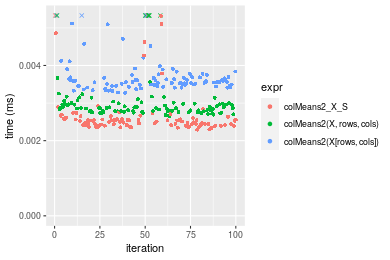


_Table: Benchmarking of colMeans2_X_S() and rowMeans2_X_S() on integer+10x10 data (original and transposed).  The top panel shows times in milliseconds and the bottom panel shows relative times._


|   |expr          |   min|    lq|    mean| median|    uq|     max|
|:--|:-------------|-----:|-----:|-------:|------:|-----:|-------:|
|1  |colMeans2_X_S | 2.294| 2.412| 4.34317| 2.5045| 2.578| 170.474|
|2  |rowMeans2_X_S | 2.446| 2.515| 2.64775| 2.5895| 2.690|   5.326|


|   |expr          |     min|       lq|      mean|   median|       uq|       max|
|:--|:-------------|-------:|--------:|---------:|--------:|--------:|---------:|
|1  |colMeans2_X_S | 1.00000| 1.000000| 1.0000000| 1.000000| 1.000000| 1.0000000|
|2  |rowMeans2_X_S | 1.06626| 1.042703| 0.6096354| 1.033939| 1.043445| 0.0312423|

_Figure: Benchmarking of colMeans2_X_S() and rowMeans2_X_S() on integer+10x10 data (original and transposed).  Outliers are displayed as crosses. Times are in milliseconds._


#### 100x100 integer matrix

```r
> X <- data[["100x100"]]
> rows <- sample.int(nrow(X), size = nrow(X) * 0.7)
> cols <- sample.int(ncol(X), size = ncol(X) * 0.7)
> X_S <- X[rows, cols]
> gc()
          used  (Mb) gc trigger  (Mb) max used  (Mb)
Ncells 5238997 279.8    7916910 422.9  7916910 422.9
Vcells 9733104  74.3   33191153 253.3 53339345 407.0
> colStats <- microbenchmark(colMeans2_X_S = colMeans2(X_S, na.rm = FALSE), `colMeans2(X, rows, cols)` = colMeans2(X, 
+     rows = rows, cols = cols, na.rm = FALSE), `colMeans2(X[rows, cols])` = colMeans2(X[rows, cols], 
+     na.rm = FALSE), unit = "ms")
> X <- t(X)
> X_S <- t(X_S)
> gc()
          used  (Mb) gc trigger  (Mb) max used  (Mb)
Ncells 5238991 279.8    7916910 422.9  7916910 422.9
Vcells 9738187  74.3   33191153 253.3 53339345 407.0
> rowStats <- microbenchmark(rowMeans2_X_S = rowMeans2(X_S, na.rm = FALSE), `rowMeans2(X, cols, rows)` = rowMeans2(X, 
+     rows = cols, cols = rows, na.rm = FALSE), `rowMeans2(X[cols, rows])` = rowMeans2(X[cols, rows], 
+     na.rm = FALSE), unit = "ms")
```

_Table: Benchmarking of colMeans2_X_S(), colMeans2(X, rows, cols)() and colMeans2(X[rows, cols])() on integer+100x100 data. The top panel shows times in milliseconds and the bottom panel shows relative times._


|   |expr                     |      min|        lq|      mean|    median|        uq|      max|
|:--|:------------------------|--------:|---------:|---------:|---------:|---------:|--------:|
|1  |colMeans2_X_S            | 0.013164| 0.0134095| 0.0138760| 0.0135765| 0.0139710| 0.022677|
|2  |colMeans2(X, rows, cols) | 0.016860| 0.0170785| 0.0178900| 0.0172790| 0.0179740| 0.031211|
|3  |colMeans2(X[rows, cols]) | 0.024562| 0.0249020| 0.0262237| 0.0251175| 0.0261345| 0.067093|


|   |expr                     |      min|       lq|     mean|   median|       uq|      max|
|:--|:------------------------|--------:|--------:|--------:|--------:|--------:|--------:|
|1  |colMeans2_X_S            | 1.000000| 1.000000| 1.000000| 1.000000| 1.000000| 1.000000|
|2  |colMeans2(X, rows, cols) | 1.280766| 1.273612| 1.289278| 1.272714| 1.286522| 1.376328|
|3  |colMeans2(X[rows, cols]) | 1.865846| 1.857042| 1.889855| 1.850072| 1.870625| 2.958636|

_Table: Benchmarking of rowMeans2_X_S(), rowMeans2(X, cols, rows)() and rowMeans2(X[cols, rows])() on integer+100x100 data (transposed). The top panel shows times in milliseconds and the bottom panel shows relative times._


|   |expr                     |      min|        lq|      mean|   median|        uq|      max|
|:--|:------------------------|--------:|---------:|---------:|--------:|---------:|--------:|
|1  |rowMeans2_X_S            | 0.013154| 0.0134565| 0.0139070| 0.013717| 0.0141730| 0.022962|
|2  |rowMeans2(X, cols, rows) | 0.016143| 0.0164220| 0.0171836| 0.016903| 0.0171945| 0.038360|
|3  |rowMeans2(X[cols, rows]) | 0.024383| 0.0248665| 0.0257033| 0.025244| 0.0259545| 0.041047|


|   |expr                     |      min|       lq|     mean|   median|       uq|      max|
|:--|:------------------------|--------:|--------:|--------:|--------:|--------:|--------:|
|1  |rowMeans2_X_S            | 1.000000| 1.000000| 1.000000| 1.000000| 1.000000| 1.000000|
|2  |rowMeans2(X, cols, rows) | 1.227231| 1.220377| 1.235610| 1.232266| 1.213187| 1.670586|
|3  |rowMeans2(X[cols, rows]) | 1.853657| 1.847917| 1.848229| 1.840344| 1.831264| 1.787606|

_Figure: Benchmarking of colMeans2_X_S(), colMeans2(X, rows, cols)() and colMeans2(X[rows, cols])() on integer+100x100 data  as well as rowMeans2_X_S(), rowMeans2(X, cols, rows)() and rowMeans2(X[cols, rows])() on the same data transposed.  Outliers are displayed as crosses.  Times are in milliseconds._


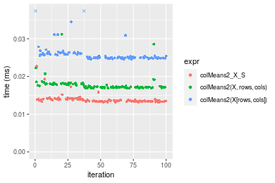


_Table: Benchmarking of colMeans2_X_S() and rowMeans2_X_S() on integer+100x100 data (original and transposed).  The top panel shows times in milliseconds and the bottom panel shows relative times._


|   |expr          |    min|      lq|     mean|  median|     uq|    max|
|:--|:-------------|------:|-------:|--------:|-------:|------:|------:|
|1  |colMeans2_X_S | 13.164| 13.4095| 13.87601| 13.5765| 13.971| 22.677|
|2  |rowMeans2_X_S | 13.154| 13.4565| 13.90698| 13.7170| 14.173| 22.962|


|   |expr          |       min|       lq|     mean|   median|       uq|      max|
|:--|:-------------|---------:|--------:|--------:|--------:|--------:|--------:|
|1  |colMeans2_X_S | 1.0000000| 1.000000| 1.000000| 1.000000| 1.000000| 1.000000|
|2  |rowMeans2_X_S | 0.9992404| 1.003505| 1.002232| 1.010349| 1.014458| 1.012568|

_Figure: Benchmarking of colMeans2_X_S() and rowMeans2_X_S() on integer+100x100 data (original and transposed).  Outliers are displayed as crosses. Times are in milliseconds._


#### 1000x10 integer matrix

```r
> X <- data[["1000x10"]]
> rows <- sample.int(nrow(X), size = nrow(X) * 0.7)
> cols <- sample.int(ncol(X), size = ncol(X) * 0.7)
> X_S <- X[rows, cols]
> gc()
          used  (Mb) gc trigger  (Mb) max used  (Mb)
Ncells 5239739 279.9    7916910 422.9  7916910 422.9
Vcells 9737142  74.3   33191153 253.3 53339345 407.0
> colStats <- microbenchmark(colMeans2_X_S = colMeans2(X_S, na.rm = FALSE), `colMeans2(X, rows, cols)` = colMeans2(X, 
+     rows = rows, cols = cols, na.rm = FALSE), `colMeans2(X[rows, cols])` = colMeans2(X[rows, cols], 
+     na.rm = FALSE), unit = "ms")
> X <- t(X)
> X_S <- t(X_S)
> gc()
          used  (Mb) gc trigger  (Mb) max used  (Mb)
Ncells 5239733 279.9    7916910 422.9  7916910 422.9
Vcells 9742225  74.4   33191153 253.3 53339345 407.0
> rowStats <- microbenchmark(rowMeans2_X_S = rowMeans2(X_S, na.rm = FALSE), `rowMeans2(X, cols, rows)` = rowMeans2(X, 
+     rows = cols, cols = rows, na.rm = FALSE), `rowMeans2(X[cols, rows])` = rowMeans2(X[cols, rows], 
+     na.rm = FALSE), unit = "ms")
```

_Table: Benchmarking of colMeans2_X_S(), colMeans2(X, rows, cols)() and colMeans2(X[rows, cols])() on integer+1000x10 data. The top panel shows times in milliseconds and the bottom panel shows relative times._


|   |expr                     |      min|        lq|      mean|    median|        uq|      max|
|:--|:------------------------|--------:|---------:|---------:|---------:|---------:|--------:|
|1  |colMeans2_X_S            | 0.013525| 0.0138060| 0.0141308| 0.0140575| 0.0143785| 0.017029|
|2  |colMeans2(X, rows, cols) | 0.017440| 0.0177395| 0.0183813| 0.0179230| 0.0184440| 0.033282|
|3  |colMeans2(X[rows, cols]) | 0.025793| 0.0260755| 0.0268971| 0.0263030| 0.0268290| 0.056145|


|   |expr                     |      min|       lq|     mean|   median|       uq|      max|
|:--|:------------------------|--------:|--------:|--------:|--------:|--------:|--------:|
|1  |colMeans2_X_S            | 1.000000| 1.000000| 1.000000| 1.000000| 1.000000| 1.000000|
|2  |colMeans2(X, rows, cols) | 1.289464| 1.284912| 1.300793| 1.274978| 1.282749| 1.954431|
|3  |colMeans2(X[rows, cols]) | 1.907061| 1.888708| 1.903439| 1.871101| 1.865911| 3.297023|

_Table: Benchmarking of rowMeans2_X_S(), rowMeans2(X, cols, rows)() and rowMeans2(X[cols, rows])() on integer+1000x10 data (transposed). The top panel shows times in milliseconds and the bottom panel shows relative times._


|   |expr                     |      min|       lq|      mean|    median|        uq|      max|
|:--|:------------------------|--------:|--------:|---------:|---------:|---------:|--------:|
|1  |rowMeans2_X_S            | 0.013471| 0.013852| 0.0152808| 0.0140745| 0.0145335| 0.027956|
|2  |rowMeans2(X, cols, rows) | 0.017151| 0.017873| 0.0195282| 0.0182540| 0.0191740| 0.037533|
|3  |rowMeans2(X[cols, rows]) | 0.027436| 0.027982| 0.0332071| 0.0286495| 0.0339845| 0.058162|


|   |expr                     |      min|       lq|     mean|   median|       uq|      max|
|:--|:------------------------|--------:|--------:|--------:|--------:|--------:|--------:|
|1  |rowMeans2_X_S            | 1.000000| 1.000000| 1.000000| 1.000000| 1.000000| 1.000000|
|2  |rowMeans2(X, cols, rows) | 1.273179| 1.290283| 1.277957| 1.296955| 1.319297| 1.342574|
|3  |rowMeans2(X[cols, rows]) | 2.036671| 2.020069| 2.173123| 2.035561| 2.338356| 2.080484|

_Figure: Benchmarking of colMeans2_X_S(), colMeans2(X, rows, cols)() and colMeans2(X[rows, cols])() on integer+1000x10 data  as well as rowMeans2_X_S(), rowMeans2(X, cols, rows)() and rowMeans2(X[cols, rows])() on the same data transposed.  Outliers are displayed as crosses.  Times are in milliseconds._


_Table: Benchmarking of colMeans2_X_S() and rowMeans2_X_S() on integer+1000x10 data (original and transposed).  The top panel shows times in milliseconds and the bottom panel shows relative times._


|   |expr          |    min|     lq|     mean|  median|      uq|    max|
|:--|:-------------|------:|------:|--------:|-------:|-------:|------:|
|1  |colMeans2_X_S | 13.525| 13.806| 14.13082| 14.0575| 14.3785| 17.029|
|2  |rowMeans2_X_S | 13.471| 13.852| 15.28083| 14.0745| 14.5335| 27.956|


|   |expr          |       min|       lq|     mean|   median|      uq|     max|
|:--|:-------------|---------:|--------:|--------:|--------:|-------:|-------:|
|1  |colMeans2_X_S | 1.0000000| 1.000000| 1.000000| 1.000000| 1.00000| 1.00000|
|2  |rowMeans2_X_S | 0.9960074| 1.003332| 1.081383| 1.001209| 1.01078| 1.64167|

_Figure: Benchmarking of colMeans2_X_S() and rowMeans2_X_S() on integer+1000x10 data (original and transposed).  Outliers are displayed as crosses. Times are in milliseconds._


#### 10x1000 integer matrix

```r
> X <- data[["10x1000"]]
> rows <- sample.int(nrow(X), size = nrow(X) * 0.7)
> cols <- sample.int(ncol(X), size = ncol(X) * 0.7)
> X_S <- X[rows, cols]
> gc()
          used  (Mb) gc trigger  (Mb) max used  (Mb)
Ncells 5239943 279.9    7916910 422.9  7916910 422.9
Vcells 9738013  74.3   33191153 253.3 53339345 407.0
> colStats <- microbenchmark(colMeans2_X_S = colMeans2(X_S, na.rm = FALSE), `colMeans2(X, rows, cols)` = colMeans2(X, 
+     rows = rows, cols = cols, na.rm = FALSE), `colMeans2(X[rows, cols])` = colMeans2(X[rows, cols], 
+     na.rm = FALSE), unit = "ms")
> X <- t(X)
> X_S <- t(X_S)
> gc()
          used  (Mb) gc trigger  (Mb) max used  (Mb)
Ncells 5239937 279.9    7916910 422.9  7916910 422.9
Vcells 9743096  74.4   33191153 253.3 53339345 407.0
> rowStats <- microbenchmark(rowMeans2_X_S = rowMeans2(X_S, na.rm = FALSE), `rowMeans2(X, cols, rows)` = rowMeans2(X, 
+     rows = cols, cols = rows, na.rm = FALSE), `rowMeans2(X[cols, rows])` = rowMeans2(X[cols, rows], 
+     na.rm = FALSE), unit = "ms")
```

_Table: Benchmarking of colMeans2_X_S(), colMeans2(X, rows, cols)() and colMeans2(X[rows, cols])() on integer+10x1000 data. The top panel shows times in milliseconds and the bottom panel shows relative times._


|   |expr                     |      min|        lq|      mean|    median|        uq|      max|
|:--|:------------------------|--------:|---------:|---------:|---------:|---------:|--------:|
|1  |colMeans2_X_S            | 0.014418| 0.0150675| 0.0157001| 0.0155160| 0.0157495| 0.032616|
|2  |colMeans2(X, rows, cols) | 0.020543| 0.0209690| 0.0217421| 0.0214040| 0.0219145| 0.036509|
|3  |colMeans2(X[rows, cols]) | 0.028129| 0.0289605| 0.0300164| 0.0296105| 0.0300815| 0.045692|


|   |expr                     |      min|       lq|     mean|   median|       uq|      max|
|:--|:------------------------|--------:|--------:|--------:|--------:|--------:|--------:|
|1  |colMeans2_X_S            | 1.000000| 1.000000| 1.000000| 1.000000| 1.000000| 1.000000|
|2  |colMeans2(X, rows, cols) | 1.424816| 1.391671| 1.384839| 1.379479| 1.391441| 1.119359|
|3  |colMeans2(X[rows, cols]) | 1.950964| 1.922051| 1.911863| 1.908385| 1.909997| 1.400907|

_Table: Benchmarking of rowMeans2_X_S(), rowMeans2(X, cols, rows)() and rowMeans2(X[cols, rows])() on integer+10x1000 data (transposed). The top panel shows times in milliseconds and the bottom panel shows relative times._


|   |expr                     |      min|       lq|      mean|    median|        uq|      max|
|:--|:------------------------|--------:|--------:|---------:|---------:|---------:|--------:|
|1  |rowMeans2_X_S            | 0.014402| 0.014888| 0.0152724| 0.0150735| 0.0152415| 0.023331|
|2  |rowMeans2(X, cols, rows) | 0.019989| 0.020267| 0.0208216| 0.0204160| 0.0205635| 0.058464|
|3  |rowMeans2(X[cols, rows]) | 0.026293| 0.026972| 0.0275260| 0.0272370| 0.0275170| 0.037526|


|   |expr                     |      min|       lq|     mean|   median|       uq|      max|
|:--|:------------------------|--------:|--------:|--------:|--------:|--------:|--------:|
|1  |rowMeans2_X_S            | 1.000000| 1.000000| 1.000000| 1.000000| 1.000000| 1.000000|
|2  |rowMeans2(X, cols, rows) | 1.387932| 1.361298| 1.363350| 1.354430| 1.349178| 2.505851|
|3  |rowMeans2(X[cols, rows]) | 1.825649| 1.811660| 1.802339| 1.806946| 1.805400| 1.608418|

_Figure: Benchmarking of colMeans2_X_S(), colMeans2(X, rows, cols)() and colMeans2(X[rows, cols])() on integer+10x1000 data  as well as rowMeans2_X_S(), rowMeans2(X, cols, rows)() and rowMeans2(X[cols, rows])() on the same data transposed.  Outliers are displayed as crosses.  Times are in milliseconds._


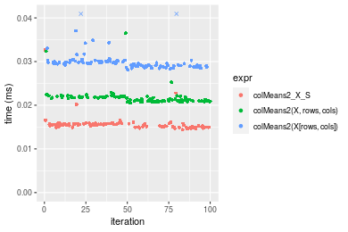

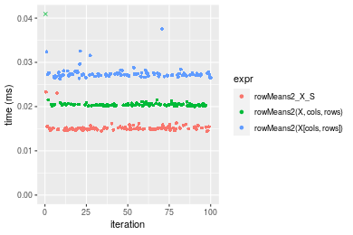
_Table: Benchmarking of colMeans2_X_S() and rowMeans2_X_S() on integer+10x1000 data (original and transposed).  The top panel shows times in milliseconds and the bottom panel shows relative times._


|   |expr          |    min|      lq|     mean|  median|      uq|    max|
|:--|:-------------|------:|-------:|--------:|-------:|-------:|------:|
|2  |rowMeans2_X_S | 14.402| 14.8880| 15.27238| 15.0735| 15.2415| 23.331|
|1  |colMeans2_X_S | 14.418| 15.0675| 15.70009| 15.5160| 15.7495| 32.616|


|   |expr          |      min|       lq|     mean|   median|      uq|      max|
|:--|:-------------|--------:|--------:|--------:|--------:|-------:|--------:|
|2  |rowMeans2_X_S | 1.000000| 1.000000| 1.000000| 1.000000| 1.00000| 1.000000|
|1  |colMeans2_X_S | 1.001111| 1.012057| 1.028005| 1.029356| 1.03333| 1.397968|

_Figure: Benchmarking of colMeans2_X_S() and rowMeans2_X_S() on integer+10x1000 data (original and transposed).  Outliers are displayed as crosses. Times are in milliseconds._


#### 100x1000 integer matrix

```r
> X <- data[["100x1000"]]
> rows <- sample.int(nrow(X), size = nrow(X) * 0.7)
> cols <- sample.int(ncol(X), size = ncol(X) * 0.7)
> X_S <- X[rows, cols]
> gc()
          used  (Mb) gc trigger  (Mb) max used  (Mb)
Ncells 5240156 279.9    7916910 422.9  7916910 422.9
Vcells 9760690  74.5   33191153 253.3 53339345 407.0
> colStats <- microbenchmark(colMeans2_X_S = colMeans2(X_S, na.rm = FALSE), `colMeans2(X, rows, cols)` = colMeans2(X, 
+     rows = rows, cols = cols, na.rm = FALSE), `colMeans2(X[rows, cols])` = colMeans2(X[rows, cols], 
+     na.rm = FALSE), unit = "ms")
> X <- t(X)
> X_S <- t(X_S)
> gc()
          used  (Mb) gc trigger  (Mb) max used  (Mb)
Ncells 5240150 279.9    7916910 422.9  7916910 422.9
Vcells 9810773  74.9   33191153 253.3 53339345 407.0
> rowStats <- microbenchmark(rowMeans2_X_S = rowMeans2(X_S, na.rm = FALSE), `rowMeans2(X, cols, rows)` = rowMeans2(X, 
+     rows = cols, cols = rows, na.rm = FALSE), `rowMeans2(X[cols, rows])` = rowMeans2(X[cols, rows], 
+     na.rm = FALSE), unit = "ms")
```

_Table: Benchmarking of colMeans2_X_S(), colMeans2(X, rows, cols)() and colMeans2(X[rows, cols])() on integer+100x1000 data. The top panel shows times in milliseconds and the bottom panel shows relative times._


|   |expr                     |      min|        lq|      mean|    median|        uq|      max|
|:--|:------------------------|--------:|---------:|---------:|---------:|---------:|--------:|
|1  |colMeans2_X_S            | 0.083261| 0.0862270| 0.0973144| 0.0912025| 0.1077500| 0.174421|
|2  |colMeans2(X, rows, cols) | 0.108624| 0.1124885| 0.1247937| 0.1209180| 0.1402155| 0.206528|
|3  |colMeans2(X[rows, cols]) | 0.166429| 0.1731815| 0.1969018| 0.1919690| 0.2160765| 0.331763|


|   |expr                     |      min|       lq|     mean|   median|       uq|      max|
|:--|:------------------------|--------:|--------:|--------:|--------:|--------:|--------:|
|1  |colMeans2_X_S            | 1.000000| 1.000000| 1.000000| 1.000000| 1.000000| 1.000000|
|2  |colMeans2(X, rows, cols) | 1.304620| 1.304562| 1.282377| 1.325819| 1.301304| 1.184078|
|3  |colMeans2(X[rows, cols]) | 1.998883| 2.008437| 2.023357| 2.104865| 2.005350| 1.902082|

_Table: Benchmarking of rowMeans2_X_S(), rowMeans2(X, cols, rows)() and rowMeans2(X[cols, rows])() on integer+100x1000 data (transposed). The top panel shows times in milliseconds and the bottom panel shows relative times._


|   |expr                     |      min|        lq|      mean|    median|        uq|      max|
|:--|:------------------------|--------:|---------:|---------:|---------:|---------:|--------:|
|1  |rowMeans2_X_S            | 0.083326| 0.0889110| 0.0985526| 0.0968415| 0.1074245| 0.150370|
|2  |rowMeans2(X, cols, rows) | 0.104037| 0.1077665| 0.1187866| 0.1114585| 0.1296540| 0.194352|
|3  |rowMeans2(X[cols, rows]) | 0.162011| 0.1700415| 0.1904480| 0.1888250| 0.2101220| 0.263337|


|   |expr                     |      min|       lq|     mean|   median|       uq|      max|
|:--|:------------------------|--------:|--------:|--------:|--------:|--------:|--------:|
|1  |rowMeans2_X_S            | 1.000000| 1.000000| 1.000000| 1.000000| 1.000000| 1.000000|
|2  |rowMeans2(X, cols, rows) | 1.248554| 1.212072| 1.205311| 1.150937| 1.206931| 1.292492|
|3  |rowMeans2(X[cols, rows]) | 1.944303| 1.912491| 1.932451| 1.949836| 1.955997| 1.751260|

_Figure: Benchmarking of colMeans2_X_S(), colMeans2(X, rows, cols)() and colMeans2(X[rows, cols])() on integer+100x1000 data  as well as rowMeans2_X_S(), rowMeans2(X, cols, rows)() and rowMeans2(X[cols, rows])() on the same data transposed.  Outliers are displayed as crosses.  Times are in milliseconds._


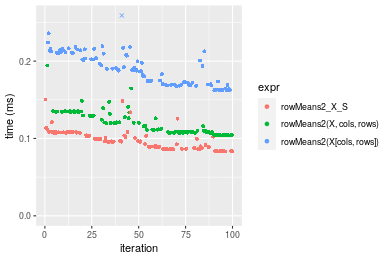
_Table: Benchmarking of colMeans2_X_S() and rowMeans2_X_S() on integer+100x1000 data (original and transposed).  The top panel shows times in milliseconds and the bottom panel shows relative times._


|   |expr          |    min|     lq|     mean|  median|       uq|     max|
|:--|:-------------|------:|------:|--------:|-------:|--------:|-------:|
|1  |colMeans2_X_S | 83.261| 86.227| 97.31441| 91.2025| 107.7500| 174.421|
|2  |rowMeans2_X_S | 83.326| 88.911| 98.55260| 96.8415| 107.4245| 150.370|


|   |expr          |      min|       lq|     mean|   median|        uq|       max|
|:--|:-------------|--------:|--------:|--------:|--------:|---------:|---------:|
|1  |colMeans2_X_S | 1.000000| 1.000000| 1.000000| 1.000000| 1.0000000| 1.0000000|
|2  |rowMeans2_X_S | 1.000781| 1.031127| 1.012724| 1.061829| 0.9969791| 0.8621095|

_Figure: Benchmarking of colMeans2_X_S() and rowMeans2_X_S() on integer+100x1000 data (original and transposed).  Outliers are displayed as crosses. Times are in milliseconds._


#### 1000x100 integer matrix

```r
> X <- data[["1000x100"]]
> rows <- sample.int(nrow(X), size = nrow(X) * 0.7)
> cols <- sample.int(ncol(X), size = ncol(X) * 0.7)
> X_S <- X[rows, cols]
> gc()
          used  (Mb) gc trigger  (Mb) max used  (Mb)
Ncells 5240366 279.9    7916910 422.9  7916910 422.9
Vcells 9761473  74.5   33191153 253.3 53339345 407.0
> colStats <- microbenchmark(colMeans2_X_S = colMeans2(X_S, na.rm = FALSE), `colMeans2(X, rows, cols)` = colMeans2(X, 
+     rows = rows, cols = cols, na.rm = FALSE), `colMeans2(X[rows, cols])` = colMeans2(X[rows, cols], 
+     na.rm = FALSE), unit = "ms")
> X <- t(X)
> X_S <- t(X_S)
> gc()
          used  (Mb) gc trigger  (Mb) max used  (Mb)
Ncells 5240360 279.9    7916910 422.9  7916910 422.9
Vcells 9811556  74.9   33191153 253.3 53339345 407.0
> rowStats <- microbenchmark(rowMeans2_X_S = rowMeans2(X_S, na.rm = FALSE), `rowMeans2(X, cols, rows)` = rowMeans2(X, 
+     rows = cols, cols = rows, na.rm = FALSE), `rowMeans2(X[cols, rows])` = rowMeans2(X[cols, rows], 
+     na.rm = FALSE), unit = "ms")
```

_Table: Benchmarking of colMeans2_X_S(), colMeans2(X, rows, cols)() and colMeans2(X[rows, cols])() on integer+1000x100 data. The top panel shows times in milliseconds and the bottom panel shows relative times._


|   |expr                     |      min|        lq|      mean|    median|        uq|      max|
|:--|:------------------------|--------:|---------:|---------:|---------:|---------:|--------:|
|1  |colMeans2_X_S            | 0.078729| 0.0838265| 0.0904083| 0.0867000| 0.0957645| 0.129325|
|2  |colMeans2(X, rows, cols) | 0.096257| 0.1027300| 0.1125829| 0.1092610| 0.1177165| 0.141283|
|3  |colMeans2(X[rows, cols]) | 0.154079| 0.1642395| 0.1815537| 0.1714335| 0.1961330| 0.266746|


|   |expr                     |      min|       lq|     mean|   median|       uq|      max|
|:--|:------------------------|--------:|--------:|--------:|--------:|--------:|--------:|
|1  |colMeans2_X_S            | 1.000000| 1.000000| 1.000000| 1.000000| 1.000000| 1.000000|
|2  |colMeans2(X, rows, cols) | 1.222637| 1.225507| 1.245272| 1.260219| 1.229229| 1.092465|
|3  |colMeans2(X[rows, cols]) | 1.957081| 1.959279| 2.008154| 1.977318| 2.048076| 2.062602|

_Table: Benchmarking of rowMeans2_X_S(), rowMeans2(X, cols, rows)() and rowMeans2(X[cols, rows])() on integer+1000x100 data (transposed). The top panel shows times in milliseconds and the bottom panel shows relative times._


|   |expr                     |      min|        lq|      mean|    median|        uq|      max|
|:--|:------------------------|--------:|---------:|---------:|---------:|---------:|--------:|
|1  |rowMeans2_X_S            | 0.079396| 0.0852955| 0.0950694| 0.0905880| 0.1035715| 0.136084|
|2  |rowMeans2(X, cols, rows) | 0.097017| 0.1060405| 0.1176491| 0.1104115| 0.1280920| 0.226063|
|3  |rowMeans2(X[cols, rows]) | 0.163346| 0.1743350| 0.1912017| 0.1810720| 0.2131840| 0.246745|


|   |expr                     |      min|       lq|     mean|   median|       uq|      max|
|:--|:------------------------|--------:|--------:|--------:|--------:|--------:|--------:|
|1  |rowMeans2_X_S            | 1.000000| 1.000000| 1.000000| 1.000000| 1.000000| 1.000000|
|2  |rowMeans2(X, cols, rows) | 1.221938| 1.243213| 1.237508| 1.218831| 1.236749| 1.661202|
|3  |rowMeans2(X[cols, rows]) | 2.057358| 2.043894| 2.011181| 1.998852| 2.058327| 1.813182|

_Figure: Benchmarking of colMeans2_X_S(), colMeans2(X, rows, cols)() and colMeans2(X[rows, cols])() on integer+1000x100 data  as well as rowMeans2_X_S(), rowMeans2(X, cols, rows)() and rowMeans2(X[cols, rows])() on the same data transposed.  Outliers are displayed as crosses.  Times are in milliseconds._


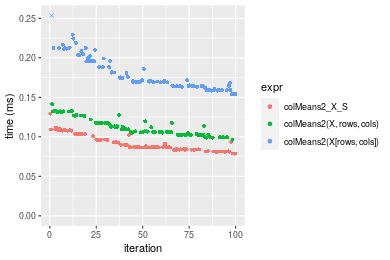

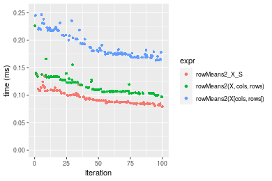
_Table: Benchmarking of colMeans2_X_S() and rowMeans2_X_S() on integer+1000x100 data (original and transposed).  The top panel shows times in milliseconds and the bottom panel shows relative times._


|   |expr          |    min|      lq|     mean| median|       uq|     max|
|:--|:-------------|------:|-------:|--------:|------:|--------:|-------:|
|1  |colMeans2_X_S | 78.729| 83.8265| 90.40829| 86.700|  95.7645| 129.325|
|2  |rowMeans2_X_S | 79.396| 85.2955| 95.06935| 90.588| 103.5715| 136.084|


|   |expr          |      min|       lq|     mean|   median|       uq|      max|
|:--|:-------------|--------:|--------:|--------:|--------:|--------:|--------:|
|1  |colMeans2_X_S | 1.000000| 1.000000| 1.000000| 1.000000| 1.000000| 1.000000|
|2  |rowMeans2_X_S | 1.008472| 1.017524| 1.051556| 1.044844| 1.081523| 1.052264|

_Figure: Benchmarking of colMeans2_X_S() and rowMeans2_X_S() on integer+1000x100 data (original and transposed).  Outliers are displayed as crosses. Times are in milliseconds._


## Data type "double"

### Data
```r
> rmatrix <- function(nrow, ncol, mode = c("logical", "double", "integer", "index"), range = c(-100, 
+     +100), na_prob = 0) {
+     mode <- match.arg(mode)
+     n <- nrow * ncol
+     if (mode == "logical") {
+         x <- sample(c(FALSE, TRUE), size = n, replace = TRUE)
+     }     else if (mode == "index") {
+         x <- seq_len(n)
+         mode <- "integer"
+     }     else {
+         x <- runif(n, min = range[1], max = range[2])
+     }
+     storage.mode(x) <- mode
+     if (na_prob > 0) 
+         x[sample(n, size = na_prob * n)] <- NA
+     dim(x) <- c(nrow, ncol)
+     x
+ }
> rmatrices <- function(scale = 10, seed = 1, ...) {
+     set.seed(seed)
+     data <- list()
+     data[[1]] <- rmatrix(nrow = scale * 1, ncol = scale * 1, ...)
+     data[[2]] <- rmatrix(nrow = scale * 10, ncol = scale * 10, ...)
+     data[[3]] <- rmatrix(nrow = scale * 100, ncol = scale * 1, ...)
+     data[[4]] <- t(data[[3]])
+     data[[5]] <- rmatrix(nrow = scale * 10, ncol = scale * 100, ...)
+     data[[6]] <- t(data[[5]])
+     names(data) <- sapply(data, FUN = function(x) paste(dim(x), collapse = "x"))
+     data
+ }
> data <- rmatrices(mode = mode)
```

### Results

#### 10x10 double matrix

```r
> X <- data[["10x10"]]
> rows <- sample.int(nrow(X), size = nrow(X) * 0.7)
> cols <- sample.int(ncol(X), size = ncol(X) * 0.7)
> X_S <- X[rows, cols]
> gc()
          used  (Mb) gc trigger  (Mb) max used  (Mb)
Ncells 5240584 279.9    7916910 422.9  7916910 422.9
Vcells 9852586  75.2   33191153 253.3 53339345 407.0
> colStats <- microbenchmark(colMeans2_X_S = colMeans2(X_S, na.rm = FALSE), `colMeans2(X, rows, cols)` = colMeans2(X, 
+     rows = rows, cols = cols, na.rm = FALSE), `colMeans2(X[rows, cols])` = colMeans2(X[rows, cols], 
+     na.rm = FALSE), unit = "ms")
> X <- t(X)
> X_S <- t(X_S)
> gc()
          used  (Mb) gc trigger  (Mb) max used  (Mb)
Ncells 5240569 279.9    7916910 422.9  7916910 422.9
Vcells 9852754  75.2   33191153 253.3 53339345 407.0
> rowStats <- microbenchmark(rowMeans2_X_S = rowMeans2(X_S, na.rm = FALSE), `rowMeans2(X, cols, rows)` = rowMeans2(X, 
+     rows = cols, cols = rows, na.rm = FALSE), `rowMeans2(X[cols, rows])` = rowMeans2(X[cols, rows], 
+     na.rm = FALSE), unit = "ms")
```

_Table: Benchmarking of colMeans2_X_S(), colMeans2(X, rows, cols)() and colMeans2(X[rows, cols])() on double+10x10 data. The top panel shows times in milliseconds and the bottom panel shows relative times._


|   |expr                     |      min|       lq|      mean|    median|        uq|      max|
|:--|:------------------------|--------:|--------:|---------:|---------:|---------:|--------:|
|1  |colMeans2_X_S            | 0.002482| 0.002542| 0.0028578| 0.0026080| 0.0027160| 0.022842|
|2  |colMeans2(X, rows, cols) | 0.002821| 0.002966| 0.0030825| 0.0030130| 0.0031275| 0.005631|
|3  |colMeans2(X[rows, cols]) | 0.003461| 0.003654| 0.0038629| 0.0037685| 0.0038890| 0.010141|


|   |expr                     |      min|       lq|     mean|   median|       uq|       max|
|:--|:------------------------|--------:|--------:|--------:|--------:|--------:|---------:|
|1  |colMeans2_X_S            | 1.000000| 1.000000| 1.000000| 1.000000| 1.000000| 1.0000000|
|2  |colMeans2(X, rows, cols) | 1.136583| 1.166798| 1.078598| 1.155291| 1.151510| 0.2465196|
|3  |colMeans2(X[rows, cols]) | 1.394440| 1.437451| 1.351673| 1.444977| 1.431885| 0.4439629|

_Table: Benchmarking of rowMeans2_X_S(), rowMeans2(X, cols, rows)() and rowMeans2(X[cols, rows])() on double+10x10 data (transposed). The top panel shows times in milliseconds and the bottom panel shows relative times._


|   |expr                     |      min|        lq|      mean|    median|        uq|      max|
|:--|:------------------------|--------:|---------:|---------:|---------:|---------:|--------:|
|1  |rowMeans2_X_S            | 0.002389| 0.0024620| 0.0026118| 0.0025515| 0.0026835| 0.005730|
|2  |rowMeans2(X, cols, rows) | 0.002704| 0.0028515| 0.0032448| 0.0029215| 0.0030530| 0.028284|
|3  |rowMeans2(X[cols, rows]) | 0.003285| 0.0035380| 0.0036989| 0.0036060| 0.0037600| 0.008246|


|   |expr                     |      min|       lq|     mean|   median|       uq|      max|
|:--|:------------------------|--------:|--------:|--------:|--------:|--------:|--------:|
|1  |rowMeans2_X_S            | 1.000000| 1.000000| 1.000000| 1.000000| 1.000000| 1.000000|
|2  |rowMeans2(X, cols, rows) | 1.131854| 1.158205| 1.242346| 1.145013| 1.137693| 4.936126|
|3  |rowMeans2(X[cols, rows]) | 1.375052| 1.437043| 1.416224| 1.413286| 1.401155| 1.439093|

_Figure: Benchmarking of colMeans2_X_S(), colMeans2(X, rows, cols)() and colMeans2(X[rows, cols])() on double+10x10 data  as well as rowMeans2_X_S(), rowMeans2(X, cols, rows)() and rowMeans2(X[cols, rows])() on the same data transposed.  Outliers are displayed as crosses.  Times are in milliseconds._


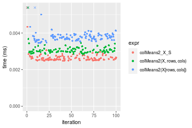

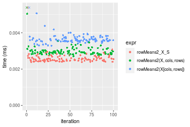
_Table: Benchmarking of colMeans2_X_S() and rowMeans2_X_S() on double+10x10 data (original and transposed).  The top panel shows times in milliseconds and the bottom panel shows relative times._


|   |expr          |   min|    lq|    mean| median|     uq|    max|
|:--|:-------------|-----:|-----:|-------:|------:|------:|------:|
|2  |rowMeans2_X_S | 2.389| 2.462| 2.61184| 2.5515| 2.6835|  5.730|
|1  |colMeans2_X_S | 2.482| 2.542| 2.85785| 2.6080| 2.7160| 22.842|


|   |expr          |      min|       lq|    mean|   median|       uq|      max|
|:--|:-------------|--------:|--------:|-------:|--------:|--------:|--------:|
|2  |rowMeans2_X_S | 1.000000| 1.000000| 1.00000| 1.000000| 1.000000| 1.000000|
|1  |colMeans2_X_S | 1.038928| 1.032494| 1.09419| 1.022144| 1.012111| 3.986387|

_Figure: Benchmarking of colMeans2_X_S() and rowMeans2_X_S() on double+10x10 data (original and transposed).  Outliers are displayed as crosses. Times are in milliseconds._


#### 100x100 double matrix

```r
> X <- data[["100x100"]]
> rows <- sample.int(nrow(X), size = nrow(X) * 0.7)
> cols <- sample.int(ncol(X), size = ncol(X) * 0.7)
> X_S <- X[rows, cols]
> gc()
          used  (Mb) gc trigger  (Mb) max used  (Mb)
Ncells 5240782 279.9    7916910 422.9  7916910 422.9
Vcells 9858541  75.3   33191153 253.3 53339345 407.0
> colStats <- microbenchmark(colMeans2_X_S = colMeans2(X_S, na.rm = FALSE), `colMeans2(X, rows, cols)` = colMeans2(X, 
+     rows = rows, cols = cols, na.rm = FALSE), `colMeans2(X[rows, cols])` = colMeans2(X[rows, cols], 
+     na.rm = FALSE), unit = "ms")
> X <- t(X)
> X_S <- t(X_S)
> gc()
          used  (Mb) gc trigger  (Mb) max used  (Mb)
Ncells 5240776 279.9    7916910 422.9  7916910 422.9
Vcells 9868624  75.3   33191153 253.3 53339345 407.0
> rowStats <- microbenchmark(rowMeans2_X_S = rowMeans2(X_S, na.rm = FALSE), `rowMeans2(X, cols, rows)` = rowMeans2(X, 
+     rows = cols, cols = rows, na.rm = FALSE), `rowMeans2(X[cols, rows])` = rowMeans2(X[cols, rows], 
+     na.rm = FALSE), unit = "ms")
```

_Table: Benchmarking of colMeans2_X_S(), colMeans2(X, rows, cols)() and colMeans2(X[rows, cols])() on double+100x100 data. The top panel shows times in milliseconds and the bottom panel shows relative times._


|   |expr                     |      min|        lq|      mean|    median|        uq|      max|
|:--|:------------------------|--------:|---------:|---------:|---------:|---------:|--------:|
|1  |colMeans2_X_S            | 0.010334| 0.0106855| 0.0132859| 0.0111200| 0.0138825| 0.023145|
|2  |colMeans2(X, rows, cols) | 0.014852| 0.0152460| 0.0186061| 0.0156625| 0.0166375| 0.039959|
|3  |colMeans2(X[rows, cols]) | 0.026213| 0.0266285| 0.0313546| 0.0274930| 0.0280825| 0.097558|


|   |expr                     |      min|       lq|     mean|   median|       uq|      max|
|:--|:------------------------|--------:|--------:|--------:|--------:|--------:|--------:|
|1  |colMeans2_X_S            | 1.000000| 1.000000| 1.000000| 1.000000| 1.000000| 1.000000|
|2  |colMeans2(X, rows, cols) | 1.437198| 1.426793| 1.400439| 1.408498| 1.198451| 1.726464|
|3  |colMeans2(X[rows, cols]) | 2.536578| 2.492022| 2.359983| 2.472392| 2.022870| 4.215079|

_Table: Benchmarking of rowMeans2_X_S(), rowMeans2(X, cols, rows)() and rowMeans2(X[cols, rows])() on double+100x100 data (transposed). The top panel shows times in milliseconds and the bottom panel shows relative times._


|   |expr                     |      min|        lq|      mean|   median|        uq|      max|
|:--|:------------------------|--------:|---------:|---------:|--------:|---------:|--------:|
|1  |rowMeans2_X_S            | 0.010809| 0.0114975| 0.0132233| 0.011789| 0.0124035| 0.037322|
|2  |rowMeans2(X, cols, rows) | 0.015564| 0.0161410| 0.0185190| 0.016456| 0.0172920| 0.059948|
|3  |rowMeans2(X[cols, rows]) | 0.027363| 0.0280370| 0.0313376| 0.028601| 0.0298250| 0.077409|


|   |expr                     |      min|      lq|     mean|   median|       uq|      max|
|:--|:------------------------|--------:|-------:|--------:|--------:|--------:|--------:|
|1  |rowMeans2_X_S            | 1.000000| 1.00000| 1.000000| 1.000000| 1.000000| 1.000000|
|2  |rowMeans2(X, cols, rows) | 1.439911| 1.40387| 1.400480| 1.395878| 1.394123| 1.606238|
|3  |rowMeans2(X[cols, rows]) | 2.531502| 2.43853| 2.369871| 2.426075| 2.404563| 2.074085|

_Figure: Benchmarking of colMeans2_X_S(), colMeans2(X, rows, cols)() and colMeans2(X[rows, cols])() on double+100x100 data  as well as rowMeans2_X_S(), rowMeans2(X, cols, rows)() and rowMeans2(X[cols, rows])() on the same data transposed.  Outliers are displayed as crosses.  Times are in milliseconds._


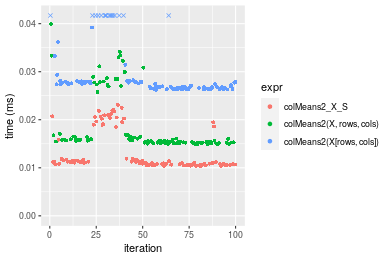


_Table: Benchmarking of colMeans2_X_S() and rowMeans2_X_S() on double+100x100 data (original and transposed).  The top panel shows times in milliseconds and the bottom panel shows relative times._


|   |expr          |    min|      lq|     mean| median|      uq|    max|
|:--|:-------------|------:|-------:|--------:|------:|-------:|------:|
|1  |colMeans2_X_S | 10.334| 10.6855| 13.28593| 11.120| 13.8825| 23.145|
|2  |rowMeans2_X_S | 10.809| 11.4975| 13.22333| 11.789| 12.4035| 37.322|


|   |expr          |      min|       lq|      mean|   median|       uq|     max|
|:--|:-------------|--------:|--------:|---------:|--------:|--------:|-------:|
|1  |colMeans2_X_S | 1.000000| 1.000000| 1.0000000| 1.000000| 1.000000| 1.00000|
|2  |rowMeans2_X_S | 1.045965| 1.075991| 0.9952882| 1.060162| 0.893463| 1.61253|

_Figure: Benchmarking of colMeans2_X_S() and rowMeans2_X_S() on double+100x100 data (original and transposed).  Outliers are displayed as crosses. Times are in milliseconds._


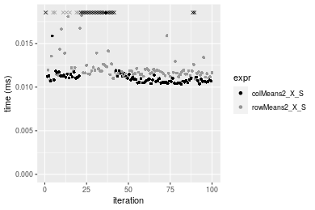

#### 1000x10 double matrix

```r
> X <- data[["1000x10"]]
> rows <- sample.int(nrow(X), size = nrow(X) * 0.7)
> cols <- sample.int(ncol(X), size = ncol(X) * 0.7)
> X_S <- X[rows, cols]
> gc()
          used  (Mb) gc trigger  (Mb) max used  (Mb)
Ncells 5240981 279.9    7916910 422.9  7916910 422.9
Vcells 9859959  75.3   33191153 253.3 53339345 407.0
> colStats <- microbenchmark(colMeans2_X_S = colMeans2(X_S, na.rm = FALSE), `colMeans2(X, rows, cols)` = colMeans2(X, 
+     rows = rows, cols = cols, na.rm = FALSE), `colMeans2(X[rows, cols])` = colMeans2(X[rows, cols], 
+     na.rm = FALSE), unit = "ms")
> X <- t(X)
> X_S <- t(X_S)
> gc()
          used  (Mb) gc trigger  (Mb) max used  (Mb)
Ncells 5240975 279.9    7916910 422.9  7916910 422.9
Vcells 9870042  75.4   33191153 253.3 53339345 407.0
> rowStats <- microbenchmark(rowMeans2_X_S = rowMeans2(X_S, na.rm = FALSE), `rowMeans2(X, cols, rows)` = rowMeans2(X, 
+     rows = cols, cols = rows, na.rm = FALSE), `rowMeans2(X[cols, rows])` = rowMeans2(X[cols, rows], 
+     na.rm = FALSE), unit = "ms")
```

_Table: Benchmarking of colMeans2_X_S(), colMeans2(X, rows, cols)() and colMeans2(X[rows, cols])() on double+1000x10 data. The top panel shows times in milliseconds and the bottom panel shows relative times._


|   |expr                     |      min|       lq|      mean|    median|        uq|      max|
|:--|:------------------------|--------:|--------:|---------:|---------:|---------:|--------:|
|1  |colMeans2_X_S            | 0.010889| 0.011438| 0.0118635| 0.0116950| 0.0118645| 0.026262|
|2  |colMeans2(X, rows, cols) | 0.014526| 0.015511| 0.0160361| 0.0158090| 0.0161345| 0.030255|
|3  |colMeans2(X[rows, cols]) | 0.027583| 0.027943| 0.0289620| 0.0283485| 0.0291410| 0.060104|


|   |expr                     |      min|       lq|     mean|   median|       uq|      max|
|:--|:------------------------|--------:|--------:|--------:|--------:|--------:|--------:|
|1  |colMeans2_X_S            | 1.000000| 1.000000| 1.000000| 1.000000| 1.000000| 1.000000|
|2  |colMeans2(X, rows, cols) | 1.334007| 1.356094| 1.351726| 1.351774| 1.359897| 1.152045|
|3  |colMeans2(X[rows, cols]) | 2.533107| 2.442997| 2.441274| 2.423985| 2.456151| 2.288630|

_Table: Benchmarking of rowMeans2_X_S(), rowMeans2(X, cols, rows)() and rowMeans2(X[cols, rows])() on double+1000x10 data (transposed). The top panel shows times in milliseconds and the bottom panel shows relative times._


|   |expr                     |      min|       lq|      mean|    median|        uq|      max|
|:--|:------------------------|--------:|--------:|---------:|---------:|---------:|--------:|
|1  |rowMeans2_X_S            | 0.010785| 0.011305| 0.0120096| 0.0116590| 0.0119500| 0.025670|
|2  |rowMeans2(X, cols, rows) | 0.014448| 0.015365| 0.0160376| 0.0156750| 0.0159625| 0.026501|
|3  |rowMeans2(X[cols, rows]) | 0.028587| 0.029910| 0.0316715| 0.0307145| 0.0310805| 0.089509|


|   |expr                     |      min|       lq|     mean|   median|       uq|      max|
|:--|:------------------------|--------:|--------:|--------:|--------:|--------:|--------:|
|1  |rowMeans2_X_S            | 1.000000| 1.000000| 1.000000| 1.000000| 1.000000| 1.000000|
|2  |rowMeans2(X, cols, rows) | 1.339638| 1.359133| 1.335405| 1.344455| 1.335774| 1.032372|
|3  |rowMeans2(X[cols, rows]) | 2.650626| 2.645732| 2.637193| 2.634403| 2.600879| 3.486911|

_Figure: Benchmarking of colMeans2_X_S(), colMeans2(X, rows, cols)() and colMeans2(X[rows, cols])() on double+1000x10 data  as well as rowMeans2_X_S(), rowMeans2(X, cols, rows)() and rowMeans2(X[cols, rows])() on the same data transposed.  Outliers are displayed as crosses.  Times are in milliseconds._


_Table: Benchmarking of colMeans2_X_S() and rowMeans2_X_S() on double+1000x10 data (original and transposed).  The top panel shows times in milliseconds and the bottom panel shows relative times._


|   |expr          |    min|     lq|     mean| median|      uq|    max|
|:--|:-------------|------:|------:|--------:|------:|-------:|------:|
|2  |rowMeans2_X_S | 10.785| 11.305| 12.00955| 11.659| 11.9500| 25.670|
|1  |colMeans2_X_S | 10.889| 11.438| 11.86346| 11.695| 11.8645| 26.262|


|   |expr          |      min|       lq|      mean|   median|        uq|      max|
|:--|:-------------|--------:|--------:|---------:|--------:|---------:|--------:|
|2  |rowMeans2_X_S | 1.000000| 1.000000| 1.0000000| 1.000000| 1.0000000| 1.000000|
|1  |colMeans2_X_S | 1.009643| 1.011765| 0.9878355| 1.003088| 0.9928452| 1.023062|

_Figure: Benchmarking of colMeans2_X_S() and rowMeans2_X_S() on double+1000x10 data (original and transposed).  Outliers are displayed as crosses. Times are in milliseconds._


#### 10x1000 double matrix

```r
> X <- data[["10x1000"]]
> rows <- sample.int(nrow(X), size = nrow(X) * 0.7)
> cols <- sample.int(ncol(X), size = ncol(X) * 0.7)
> X_S <- X[rows, cols]
> gc()
          used  (Mb) gc trigger  (Mb) max used  (Mb)
Ncells 5241185 280.0    7916910 422.9  7916910 422.9
Vcells 9860094  75.3   33191153 253.3 53339345 407.0
> colStats <- microbenchmark(colMeans2_X_S = colMeans2(X_S, na.rm = FALSE), `colMeans2(X, rows, cols)` = colMeans2(X, 
+     rows = rows, cols = cols, na.rm = FALSE), `colMeans2(X[rows, cols])` = colMeans2(X[rows, cols], 
+     na.rm = FALSE), unit = "ms")
> X <- t(X)
> X_S <- t(X_S)
> gc()
          used  (Mb) gc trigger  (Mb) max used  (Mb)
Ncells 5241179 280.0    7916910 422.9  7916910 422.9
Vcells 9870177  75.4   33191153 253.3 53339345 407.0
> rowStats <- microbenchmark(rowMeans2_X_S = rowMeans2(X_S, na.rm = FALSE), `rowMeans2(X, cols, rows)` = rowMeans2(X, 
+     rows = cols, cols = rows, na.rm = FALSE), `rowMeans2(X[cols, rows])` = rowMeans2(X[cols, rows], 
+     na.rm = FALSE), unit = "ms")
```

_Table: Benchmarking of colMeans2_X_S(), colMeans2(X, rows, cols)() and colMeans2(X[rows, cols])() on double+10x1000 data. The top panel shows times in milliseconds and the bottom panel shows relative times._


|   |expr                     |      min|        lq|      mean|    median|        uq|      max|
|:--|:------------------------|--------:|---------:|---------:|---------:|---------:|--------:|
|1  |colMeans2_X_S            | 0.014546| 0.0152375| 0.0156257| 0.0153605| 0.0155955| 0.033381|
|2  |colMeans2(X, rows, cols) | 0.021314| 0.0222540| 0.0227571| 0.0224390| 0.0226465| 0.040444|
|3  |colMeans2(X[rows, cols]) | 0.033985| 0.0353185| 0.0357392| 0.0354915| 0.0357630| 0.043462|


|   |expr                     |      min|       lq|     mean|   median|       uq|      max|
|:--|:------------------------|--------:|--------:|--------:|--------:|--------:|--------:|
|1  |colMeans2_X_S            | 1.000000| 1.000000| 1.000000| 1.000000| 1.000000| 1.000000|
|2  |colMeans2(X, rows, cols) | 1.465283| 1.460476| 1.456389| 1.460825| 1.452118| 1.211587|
|3  |colMeans2(X[rows, cols]) | 2.336381| 2.317867| 2.287208| 2.310569| 2.293162| 1.301998|

_Table: Benchmarking of rowMeans2_X_S(), rowMeans2(X, cols, rows)() and rowMeans2(X[cols, rows])() on double+10x1000 data (transposed). The top panel shows times in milliseconds and the bottom panel shows relative times._


|   |expr                     |      min|        lq|      mean|    median|        uq|      max|
|:--|:------------------------|--------:|---------:|---------:|---------:|---------:|--------:|
|1  |rowMeans2_X_S            | 0.013485| 0.0141825| 0.0147644| 0.0144765| 0.0147680| 0.028325|
|2  |rowMeans2(X, cols, rows) | 0.019153| 0.0199835| 0.0211735| 0.0204265| 0.0206745| 0.061564|
|3  |rowMeans2(X[cols, rows]) | 0.028680| 0.0300200| 0.0312564| 0.0304030| 0.0311810| 0.045597|


|   |expr                     |      min|       lq|     mean|   median|       uq|      max|
|:--|:------------------------|--------:|--------:|--------:|--------:|--------:|--------:|
|1  |rowMeans2_X_S            | 1.000000| 1.000000| 1.000000| 1.000000| 1.000000| 1.000000|
|2  |rowMeans2(X, cols, rows) | 1.420319| 1.409025| 1.434093| 1.411011| 1.399953| 2.173486|
|3  |rowMeans2(X[cols, rows]) | 2.126808| 2.116693| 2.117015| 2.100162| 2.111390| 1.609779|

_Figure: Benchmarking of colMeans2_X_S(), colMeans2(X, rows, cols)() and colMeans2(X[rows, cols])() on double+10x1000 data  as well as rowMeans2_X_S(), rowMeans2(X, cols, rows)() and rowMeans2(X[cols, rows])() on the same data transposed.  Outliers are displayed as crosses.  Times are in milliseconds._


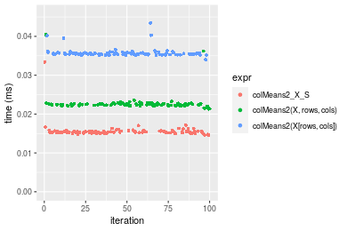


_Table: Benchmarking of colMeans2_X_S() and rowMeans2_X_S() on double+10x1000 data (original and transposed).  The top panel shows times in milliseconds and the bottom panel shows relative times._


|   |expr          |    min|      lq|     mean|  median|      uq|    max|
|:--|:-------------|------:|-------:|--------:|-------:|-------:|------:|
|2  |rowMeans2_X_S | 13.485| 14.1825| 14.76439| 14.4765| 14.7680| 28.325|
|1  |colMeans2_X_S | 14.546| 15.2375| 15.62570| 15.3605| 15.5955| 33.381|


|   |expr          |     min|       lq|     mean|   median|       uq|    max|
|:--|:-------------|-------:|--------:|--------:|--------:|--------:|------:|
|2  |rowMeans2_X_S | 1.00000| 1.000000| 1.000000| 1.000000| 1.000000| 1.0000|
|1  |colMeans2_X_S | 1.07868| 1.074387| 1.058337| 1.061065| 1.056033| 1.1785|

_Figure: Benchmarking of colMeans2_X_S() and rowMeans2_X_S() on double+10x1000 data (original and transposed).  Outliers are displayed as crosses. Times are in milliseconds._


#### 100x1000 double matrix

```r
> X <- data[["100x1000"]]
> rows <- sample.int(nrow(X), size = nrow(X) * 0.7)
> cols <- sample.int(ncol(X), size = ncol(X) * 0.7)
> X_S <- X[rows, cols]
> gc()
          used  (Mb) gc trigger  (Mb) max used  (Mb)
Ncells 5241398 280.0    7916910 422.9  7916910 422.9
Vcells 9905566  75.6   33191153 253.3 53339345 407.0
> colStats <- microbenchmark(colMeans2_X_S = colMeans2(X_S, na.rm = FALSE), `colMeans2(X, rows, cols)` = colMeans2(X, 
+     rows = rows, cols = cols, na.rm = FALSE), `colMeans2(X[rows, cols])` = colMeans2(X[rows, cols], 
+     na.rm = FALSE), unit = "ms")
> X <- t(X)
> X_S <- t(X_S)
> gc()
           used  (Mb) gc trigger  (Mb) max used  (Mb)
Ncells  5241392 280.0    7916910 422.9  7916910 422.9
Vcells 10005649  76.4   33191153 253.3 53339345 407.0
> rowStats <- microbenchmark(rowMeans2_X_S = rowMeans2(X_S, na.rm = FALSE), `rowMeans2(X, cols, rows)` = rowMeans2(X, 
+     rows = cols, cols = rows, na.rm = FALSE), `rowMeans2(X[cols, rows])` = rowMeans2(X[cols, rows], 
+     na.rm = FALSE), unit = "ms")
```

_Table: Benchmarking of colMeans2_X_S(), colMeans2(X, rows, cols)() and colMeans2(X[rows, cols])() on double+100x1000 data. The top panel shows times in milliseconds and the bottom panel shows relative times._


|   |expr                     |      min|       lq|      mean|    median|        uq|      max|
|:--|:------------------------|--------:|--------:|---------:|---------:|---------:|--------:|
|1  |colMeans2_X_S            | 0.062106| 0.065537| 0.0725551| 0.0688215| 0.0795305| 0.112613|
|2  |colMeans2(X, rows, cols) | 0.096242| 0.101563| 0.1130196| 0.1063970| 0.1281875| 0.215617|
|3  |colMeans2(X[rows, cols]) | 0.177671| 0.190052| 0.2093418| 0.2050015| 0.2291870| 0.257966|


|   |expr                     |      min|       lq|     mean|   median|       uq|      max|
|:--|:------------------------|--------:|--------:|--------:|--------:|--------:|--------:|
|1  |colMeans2_X_S            | 1.000000| 1.000000| 1.000000| 1.000000| 1.000000| 1.000000|
|2  |colMeans2(X, rows, cols) | 1.549641| 1.549705| 1.557708| 1.545985| 1.611803| 1.914672|
|3  |colMeans2(X[rows, cols]) | 2.860770| 2.899919| 2.885282| 2.978742| 2.881750| 2.290730|

_Table: Benchmarking of rowMeans2_X_S(), rowMeans2(X, cols, rows)() and rowMeans2(X[cols, rows])() on double+100x1000 data (transposed). The top panel shows times in milliseconds and the bottom panel shows relative times._


|   |expr                     |      min|        lq|      mean|    median|        uq|      max|
|:--|:------------------------|--------:|---------:|---------:|---------:|---------:|--------:|
|1  |rowMeans2_X_S            | 0.065601| 0.0686490| 0.0772700| 0.0720610| 0.0807190| 0.170813|
|2  |rowMeans2(X, cols, rows) | 0.115845| 0.1203110| 0.1293163| 0.1243680| 0.1337185| 0.246570|
|3  |rowMeans2(X[cols, rows]) | 0.187867| 0.1977165| 0.2149916| 0.2057115| 0.2280220| 0.354159|


|   |expr                     |      min|       lq|     mean|   median|       uq|      max|
|:--|:------------------------|--------:|--------:|--------:|--------:|--------:|--------:|
|1  |rowMeans2_X_S            | 1.000000| 1.000000| 1.000000| 1.000000| 1.000000| 1.000000|
|2  |rowMeans2(X, cols, rows) | 1.765903| 1.752553| 1.673564| 1.725871| 1.656593| 1.443508|
|3  |rowMeans2(X[cols, rows]) | 2.863783| 2.880107| 2.782342| 2.854686| 2.824886| 2.073373|

_Figure: Benchmarking of colMeans2_X_S(), colMeans2(X, rows, cols)() and colMeans2(X[rows, cols])() on double+100x1000 data  as well as rowMeans2_X_S(), rowMeans2(X, cols, rows)() and rowMeans2(X[cols, rows])() on the same data transposed.  Outliers are displayed as crosses.  Times are in milliseconds._


_Table: Benchmarking of colMeans2_X_S() and rowMeans2_X_S() on double+100x1000 data (original and transposed).  The top panel shows times in milliseconds and the bottom panel shows relative times._


|   |expr          |    min|     lq|     mean|  median|      uq|     max|
|:--|:-------------|------:|------:|--------:|-------:|-------:|-------:|
|1  |colMeans2_X_S | 62.106| 65.537| 72.55507| 68.8215| 79.5305| 112.613|
|2  |rowMeans2_X_S | 65.601| 68.649| 77.27002| 72.0610| 80.7190| 170.813|


|   |expr          |      min|       lq|     mean|   median|       uq|      max|
|:--|:-------------|--------:|--------:|--------:|--------:|--------:|--------:|
|1  |colMeans2_X_S | 1.000000| 1.000000| 1.000000| 1.000000| 1.000000| 1.000000|
|2  |rowMeans2_X_S | 1.056275| 1.047485| 1.064984| 1.047071| 1.014944| 1.516814|

_Figure: Benchmarking of colMeans2_X_S() and rowMeans2_X_S() on double+100x1000 data (original and transposed).  Outliers are displayed as crosses. Times are in milliseconds._


#### 1000x100 double matrix

```r
> X <- data[["1000x100"]]
> rows <- sample.int(nrow(X), size = nrow(X) * 0.7)
> cols <- sample.int(ncol(X), size = ncol(X) * 0.7)
> X_S <- X[rows, cols]
> gc()
          used  (Mb) gc trigger  (Mb) max used  (Mb)
Ncells 5241608 280.0    7916910 422.9  7916910 422.9
Vcells 9905707  75.6   33191153 253.3 53339345 407.0
> colStats <- microbenchmark(colMeans2_X_S = colMeans2(X_S, na.rm = FALSE), `colMeans2(X, rows, cols)` = colMeans2(X, 
+     rows = rows, cols = cols, na.rm = FALSE), `colMeans2(X[rows, cols])` = colMeans2(X[rows, cols], 
+     na.rm = FALSE), unit = "ms")
> X <- t(X)
> X_S <- t(X_S)
> gc()
           used  (Mb) gc trigger  (Mb) max used  (Mb)
Ncells  5241602 280.0    7916910 422.9  7916910 422.9
Vcells 10005790  76.4   33191153 253.3 53339345 407.0
> rowStats <- microbenchmark(rowMeans2_X_S = rowMeans2(X_S, na.rm = FALSE), `rowMeans2(X, cols, rows)` = rowMeans2(X, 
+     rows = cols, cols = rows, na.rm = FALSE), `rowMeans2(X[cols, rows])` = rowMeans2(X[cols, rows], 
+     na.rm = FALSE), unit = "ms")
```

_Table: Benchmarking of colMeans2_X_S(), colMeans2(X, rows, cols)() and colMeans2(X[rows, cols])() on double+1000x100 data. The top panel shows times in milliseconds and the bottom panel shows relative times._


|   |expr                     |      min|        lq|      mean|    median|        uq|      max|
|:--|:------------------------|--------:|---------:|---------:|---------:|---------:|--------:|
|1  |colMeans2_X_S            | 0.063284| 0.0674915| 0.0728476| 0.0697015| 0.0740970| 0.127155|
|2  |colMeans2(X, rows, cols) | 0.084262| 0.0899585| 0.0978887| 0.0933055| 0.1058415| 0.143755|
|3  |colMeans2(X[rows, cols]) | 0.173459| 0.1859725| 0.2027362| 0.1939840| 0.2198335| 0.326939|


|   |expr                     |      min|       lq|     mean|   median|       uq|      max|
|:--|:------------------------|--------:|--------:|--------:|--------:|--------:|--------:|
|1  |colMeans2_X_S            | 1.000000| 1.000000| 1.000000| 1.000000| 1.000000| 1.000000|
|2  |colMeans2(X, rows, cols) | 1.331490| 1.332886| 1.343746| 1.338644| 1.428418| 1.130549|
|3  |colMeans2(X[rows, cols]) | 2.740961| 2.755495| 2.783018| 2.783068| 2.966834| 2.571185|

_Table: Benchmarking of rowMeans2_X_S(), rowMeans2(X, cols, rows)() and rowMeans2(X[cols, rows])() on double+1000x100 data (transposed). The top panel shows times in milliseconds and the bottom panel shows relative times._


|   |expr                     |      min|        lq|      mean|    median|        uq|      max|
|:--|:------------------------|--------:|---------:|---------:|---------:|---------:|--------:|
|1  |rowMeans2_X_S            | 0.066900| 0.0702755| 0.0770423| 0.0729595| 0.0826495| 0.134242|
|2  |rowMeans2(X, cols, rows) | 0.109936| 0.1160740| 0.1268164| 0.1186395| 0.1314250| 0.301125|
|3  |rowMeans2(X[cols, rows]) | 0.186958| 0.1997405| 0.2180105| 0.2069390| 0.2358975| 0.306135|


|   |expr                     |      min|       lq|     mean|   median|       uq|      max|
|:--|:------------------------|--------:|--------:|--------:|--------:|--------:|--------:|
|1  |rowMeans2_X_S            | 1.000000| 1.000000| 1.000000| 1.000000| 1.000000| 1.000000|
|2  |rowMeans2(X, cols, rows) | 1.643288| 1.651699| 1.646062| 1.626101| 1.590149| 2.243150|
|3  |rowMeans2(X[cols, rows]) | 2.794589| 2.842249| 2.829752| 2.836354| 2.854192| 2.280471|

_Figure: Benchmarking of colMeans2_X_S(), colMeans2(X, rows, cols)() and colMeans2(X[rows, cols])() on double+1000x100 data  as well as rowMeans2_X_S(), rowMeans2(X, cols, rows)() and rowMeans2(X[cols, rows])() on the same data transposed.  Outliers are displayed as crosses.  Times are in milliseconds._


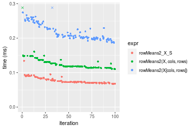
_Table: Benchmarking of colMeans2_X_S() and rowMeans2_X_S() on double+1000x100 data (original and transposed).  The top panel shows times in milliseconds and the bottom panel shows relative times._


|   |expr          |    min|      lq|     mean|  median|      uq|     max|
|:--|:-------------|------:|-------:|--------:|-------:|-------:|-------:|
|1  |colMeans2_X_S | 63.284| 67.4915| 72.84759| 69.7015| 74.0970| 127.155|
|2  |rowMeans2_X_S | 66.900| 70.2755| 77.04228| 72.9595| 82.6495| 134.242|


|   |expr          |      min|      lq|     mean|   median|       uq|      max|
|:--|:-------------|--------:|-------:|--------:|--------:|--------:|--------:|
|1  |colMeans2_X_S | 1.000000| 1.00000| 1.000000| 1.000000| 1.000000| 1.000000|
|2  |rowMeans2_X_S | 1.057139| 1.04125| 1.057582| 1.046742| 1.115423| 1.055735|

_Figure: Benchmarking of colMeans2_X_S() and rowMeans2_X_S() on double+1000x100 data (original and transposed).  Outliers are displayed as crosses. Times are in milliseconds._


## Appendix

### Session information
```r
R version 4.1.1 Patched (2021-08-10 r80727)
Platform: x86_64-pc-linux-gnu (64-bit)
Running under: Ubuntu 18.04.5 LTS

Matrix products: default
BLAS:   /home/hb/software/R-devel/R-4-1-branch/lib/R/lib/libRblas.so
LAPACK: /home/hb/software/R-devel/R-4-1-branch/lib/R/lib/libRlapack.so

locale:
 [1] LC_CTYPE=en_US.UTF-8       LC_NUMERIC=C              
 [3] LC_TIME=en_US.UTF-8        LC_COLLATE=en_US.UTF-8    
 [5] LC_MONETARY=en_US.UTF-8    LC_MESSAGES=en_US.UTF-8   
 [7] LC_PAPER=en_US.UTF-8       LC_NAME=C                 
 [9] LC_ADDRESS=C               LC_TELEPHONE=C            
[11] LC_MEASUREMENT=en_US.UTF-8 LC_IDENTIFICATION=C       

attached base packages:
[1] stats     graphics  grDevices utils     datasets  methods   base     

other attached packages:
[1] microbenchmark_1.4-7   matrixStats_0.60.0     ggplot2_3.3.5         
[4] knitr_1.33             R.devices_2.17.0       R.utils_2.10.1        
[7] R.oo_1.24.0            R.methodsS3_1.8.1-9001 history_0.0.1-9000    

loaded via a namespace (and not attached):
 [1] Biobase_2.52.0          httr_1.4.2              splines_4.1.1          
 [4] bit64_4.0.5             network_1.17.1          assertthat_0.2.1       
 [7] highr_0.9               stats4_4.1.1            blob_1.2.2             
[10] GenomeInfoDbData_1.2.6  robustbase_0.93-8       pillar_1.6.2           
[13] RSQLite_2.2.8           lattice_0.20-44         glue_1.4.2             
[16] digest_0.6.27           XVector_0.32.0          colorspace_2.0-2       
[19] Matrix_1.3-4            XML_3.99-0.7            pkgconfig_2.0.3        
[22] zlibbioc_1.38.0         genefilter_1.74.0       purrr_0.3.4            
[25] ergm_4.1.2              xtable_1.8-4            scales_1.1.1           
[28] tibble_3.1.4            annotate_1.70.0         KEGGREST_1.32.0        
[31] farver_2.1.0            generics_0.1.0          IRanges_2.26.0         
[34] ellipsis_0.3.2          cachem_1.0.6            withr_2.4.2            
[37] BiocGenerics_0.38.0     mime_0.11               survival_3.2-13        
[40] magrittr_2.0.1          crayon_1.4.1            statnet.common_4.5.0   
[43] memoise_2.0.0           laeken_0.5.1            fansi_0.5.0            
[46] R.cache_0.15.0          MASS_7.3-54             R.rsp_0.44.0           
[49] progressr_0.8.0         tools_4.1.1             lifecycle_1.0.0        
[52] S4Vectors_0.30.0        trust_0.1-8             munsell_0.5.0          
[55] tabby_0.0.1-9001        AnnotationDbi_1.54.1    Biostrings_2.60.2      
[58] compiler_4.1.1          GenomeInfoDb_1.28.1     rlang_0.4.11           
[61] grid_4.1.1              RCurl_1.98-1.4          cwhmisc_6.6            
[64] rstudioapi_0.13         rappdirs_0.3.3          startup_0.15.0         
[67] labeling_0.4.2          bitops_1.0-7            base64enc_0.1-3        
[70] boot_1.3-28             gtable_0.3.0            DBI_1.1.1              
[73] markdown_1.1            R6_2.5.1                lpSolveAPI_5.5.2.0-17.7
[76] rle_0.9.2               dplyr_1.0.7             fastmap_1.1.0          
[79] bit_4.0.4               utf8_1.2.2              parallel_4.1.1         
[82] Rcpp_1.0.7              vctrs_0.3.8             png_0.1-7              
[85] DEoptimR_1.0-9          tidyselect_1.1.1        xfun_0.25              
[88] coda_0.19-4            
```
Total processing time was 24.22 secs.


### Reproducibility
To reproduce this report, do:
```r
html <- matrixStats:::benchmark('colRowMeans2_subset')
```

[RSP]: https://cran.r-project.org/package=R.rsp
[matrixStats]: https://cran.r-project.org/package=matrixStats

[StackOverflow:colMins?]: https://stackoverflow.com/questions/13676878 "Stack Overflow: fastest way to get Min from every column in a matrix?"
[StackOverflow:colSds?]: https://stackoverflow.com/questions/17549762 "Stack Overflow: Is there such 'colsd' in R?"
[StackOverflow:rowProds?]: https://stackoverflow.com/questions/20198801/ "Stack Overflow: Row product of matrix and column sum of matrix"

---------------------------------------
Copyright Henrik Bengtsson. Last updated on 2021-08-25 22:19:08 (+0200 UTC). Powered by [RSP].

<script>
 var link = document.createElement('link');
 link.rel = 'icon';
 link.href = "data:image/png;base64,iVBORw0KGgoAAAANSUhEUgAAACAAAAAgCAMAAABEpIrGAAAA21BMVEUAAAAAAP8AAP8AAP8AAP8AAP8AAP8AAP8AAP8AAP8AAP8AAP8AAP8AAP8AAP8AAP8AAP8AAP8AAP8AAP8AAP8AAP8AAP8AAP8AAP8AAP8AAP8AAP8AAP8AAP8AAP8AAP8AAP8AAP8AAP8AAP8AAP8AAP8AAP8AAP8AAP8AAP8BAf4CAv0DA/wdHeIeHuEfH+AgIN8hId4lJdomJtknJ9g+PsE/P8BAQL9yco10dIt1dYp3d4h4eIeVlWqWlmmXl2iYmGeZmWabm2Tn5xjo6Bfp6Rb39wj4+Af//wA2M9hbAAAASXRSTlMAAQIJCgsMJSYnKD4/QGRlZmhpamtsbautrrCxuru8y8zN5ebn6Pn6+///////////////////////////////////////////LsUNcQAAAS9JREFUOI29k21XgkAQhVcFytdSMqMETU26UVqGmpaiFbL//xc1cAhhwVNf6n5i5z67M2dmYOyfJZUqlVLhkKucG7cgmUZTybDz6g0iDeq51PUr37Ds2cy2/C9NeES5puDjxuUk1xnToZsg8pfA3avHQ3lLIi7iWRrkv/OYtkScxBIMgDee0ALoyxHQBJ68JLCjOtQIMIANF7QG9G9fNnHvisCHBVMKgSJgiz7nE+AoBKrAPA3MgepvgR9TSCasrCKH0eB1wBGBFdCO+nAGjMVGPcQb5bd6mQRegN6+1axOs9nGfYcCtfi4NQosdtH7dB+txFIpXQqN1p9B/asRHToyS0jRgpV7nk4nwcq1BJ+x3Gl/v7S9Wmpp/aGquum7w3ZDyrADFYrl8vHBH+ev9AUASW1dmU4h4wAAAABJRU5ErkJggg=="
 document.getElementsByTagName('head')[0].appendChild(link);
</script>

