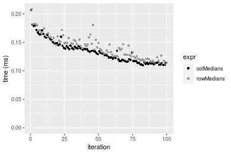
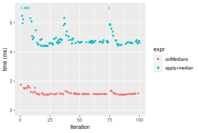
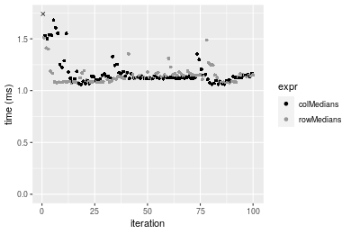
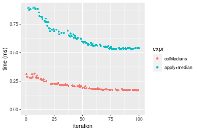
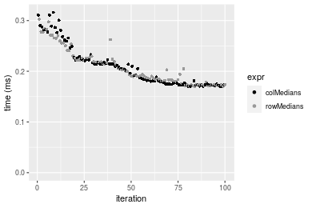

[matrixStats]: Benchmark report

---------------------------------------


# colMedians() and rowMedians() benchmarks

This report benchmark the performance of colMedians() and rowMedians() against alternative methods.

## Alternative methods

* apply() + median()


## Data type "integer"

### Data
```r
> rmatrix <- function(nrow, ncol, mode = c("logical", "double", "integer", "index"), range = c(-100, 
+     +100), na_prob = 0) {
+     mode <- match.arg(mode)
+     n <- nrow * ncol
+     if (mode == "logical") {
+         x <- sample(c(FALSE, TRUE), size = n, replace = TRUE)
+     }     else if (mode == "index") {
+         x <- seq_len(n)
+         mode <- "integer"
+     }     else {
+         x <- runif(n, min = range[1], max = range[2])
+     }
+     storage.mode(x) <- mode
+     if (na_prob > 0) 
+         x[sample(n, size = na_prob * n)] <- NA
+     dim(x) <- c(nrow, ncol)
+     x
+ }
> rmatrices <- function(scale = 10, seed = 1, ...) {
+     set.seed(seed)
+     data <- list()
+     data[[1]] <- rmatrix(nrow = scale * 1, ncol = scale * 1, ...)
+     data[[2]] <- rmatrix(nrow = scale * 10, ncol = scale * 10, ...)
+     data[[3]] <- rmatrix(nrow = scale * 100, ncol = scale * 1, ...)
+     data[[4]] <- t(data[[3]])
+     data[[5]] <- rmatrix(nrow = scale * 10, ncol = scale * 100, ...)
+     data[[6]] <- t(data[[5]])
+     names(data) <- sapply(data, FUN = function(x) paste(dim(x), collapse = "x"))
+     data
+ }
> data <- rmatrices(mode = mode)
```

### Results

#### 10x10 integer matrix


```r
> X <- data[["10x10"]]
> gc()
           used  (Mb) gc trigger  (Mb) max used  (Mb)
Ncells  5252365 280.6    7916910 422.9  7916910 422.9
Vcells 10194931  77.8   33191153 253.3 53339345 407.0
> colStats <- microbenchmark(colMedians = colMedians(X, na.rm = FALSE), `apply+median` = apply(X, MARGIN = 2L, 
+     FUN = median, na.rm = FALSE), unit = "ms")
> X <- t(X)
> gc()
           used  (Mb) gc trigger  (Mb) max used  (Mb)
Ncells  5252172 280.5    7916910 422.9  7916910 422.9
Vcells 10194651  77.8   33191153 253.3 53339345 407.0
> rowStats <- microbenchmark(rowMedians = rowMedians(X, na.rm = FALSE), `apply+median` = apply(X, MARGIN = 1L, 
+     FUN = median, na.rm = FALSE), unit = "ms")
```

_Table: Benchmarking of colMedians() and apply+median() on integer+10x10 data. The top panel shows times in milliseconds and the bottom panel shows relative times._


|   |expr         |      min|        lq|      mean|    median|        uq|      max|
|:--|:------------|--------:|---------:|---------:|---------:|---------:|--------:|
|1  |colMedians   | 0.002242| 0.0028040| 0.0046619| 0.0041435| 0.0053185| 0.017579|
|2  |apply+median | 0.301536| 0.3285055| 0.3668008| 0.3471615| 0.3814220| 0.597683|


|   |expr         |      min|      lq|     mean|  median|       uq|      max|
|:--|:------------|--------:|-------:|--------:|-------:|--------:|--------:|
|1  |colMedians   |   1.0000|   1.000|  1.00000|  1.0000|  1.00000|  1.00000|
|2  |apply+median | 134.4942| 117.156| 78.67969| 83.7846| 71.71609| 33.99983|

_Table: Benchmarking of rowMedians() and apply+median() on integer+10x10 data (transposed). The top panel shows times in milliseconds and the bottom panel shows relative times._


|   |expr         |      min|        lq|      mean|    median|        uq|      max|
|:--|:------------|--------:|---------:|---------:|---------:|---------:|--------:|
|1  |rowMedians   | 0.002414| 0.0034080| 0.0056612| 0.0049215| 0.0065285| 0.017593|
|2  |apply+median | 0.311920| 0.3353535| 0.4024843| 0.3581320| 0.4088450| 0.694812|


|   |expr         |      min|       lq|     mean|   median|       uq|      max|
|:--|:------------|--------:|--------:|--------:|--------:|--------:|--------:|
|1  |rowMedians   |   1.0000|  1.00000|  1.00000|  1.00000|  1.00000|  1.00000|
|2  |apply+median | 129.2129| 98.40185| 71.09523| 72.76887| 62.62465| 39.49366|

_Figure: Benchmarking of colMedians() and apply+median() on integer+10x10 data  as well as rowMedians() and apply+median() on the same data transposed.  Outliers are displayed as crosses.  Times are in milliseconds._


_Table: Benchmarking of colMedians() and rowMedians() on integer+10x10 data (original and transposed).  The top panel shows times in milliseconds and the bottom panel shows relative times._


|   |expr       |   min|    lq|    mean| median|     uq|    max|
|:--|:----------|-----:|-----:|-------:|------:|------:|------:|
|1  |colMedians | 2.242| 2.804| 4.66195| 4.1435| 5.3185| 17.579|
|2  |rowMedians | 2.414| 3.408| 5.66120| 4.9215| 6.5285| 17.593|


|   |expr       |      min|       lq|     mean|   median|       uq|      max|
|:--|:----------|--------:|--------:|--------:|--------:|--------:|--------:|
|1  |colMedians | 1.000000| 1.000000| 1.000000| 1.000000| 1.000000| 1.000000|
|2  |rowMedians | 1.076717| 1.215407| 1.214342| 1.187764| 1.227508| 1.000796|

_Figure: Benchmarking of colMedians() and rowMedians() on integer+10x10 data (original and transposed).  Outliers are displayed as crosses. Times are in milliseconds._


#### 100x100 integer matrix


```r
> X <- data[["100x100"]]
> gc()
          used  (Mb) gc trigger  (Mb) max used  (Mb)
Ncells 5250734 280.5    7916910 422.9  7916910 422.9
Vcells 9811143  74.9   33191153 253.3 53339345 407.0
> colStats <- microbenchmark(colMedians = colMedians(X, na.rm = FALSE), `apply+median` = apply(X, MARGIN = 2L, 
+     FUN = median, na.rm = FALSE), unit = "ms")
> X <- t(X)
> gc()
          used  (Mb) gc trigger  (Mb) max used  (Mb)
Ncells 5250728 280.5    7916910 422.9  7916910 422.9
Vcells 9816186  74.9   33191153 253.3 53339345 407.0
> rowStats <- microbenchmark(rowMedians = rowMedians(X, na.rm = FALSE), `apply+median` = apply(X, MARGIN = 1L, 
+     FUN = median, na.rm = FALSE), unit = "ms")
```

_Table: Benchmarking of colMedians() and apply+median() on integer+100x100 data. The top panel shows times in milliseconds and the bottom panel shows relative times._


|   |expr         |      min|       lq|      mean|    median|       uq|       max|
|:--|:------------|--------:|--------:|---------:|---------:|--------:|---------:|
|1  |colMedians   | 0.122332| 0.132504| 0.1460149| 0.1434325| 0.153560|  0.280636|
|2  |apply+median | 2.631018| 2.828682| 3.2377973| 3.0835700| 3.355971| 11.141453|


|   |expr         |      min|      lq|     mean|   median|       uq|      max|
|:--|:------------|--------:|-------:|--------:|--------:|--------:|--------:|
|1  |colMedians   |  1.00000|  1.0000|  1.00000|  1.00000|  1.00000|  1.00000|
|2  |apply+median | 21.50719| 21.3479| 22.17443| 21.49841| 21.85446| 39.70073|

_Table: Benchmarking of rowMedians() and apply+median() on integer+100x100 data (transposed). The top panel shows times in milliseconds and the bottom panel shows relative times._


|   |expr         |      min|       lq|      mean|    median|        uq|       max|
|:--|:------------|--------:|--------:|---------:|---------:|---------:|---------:|
|1  |rowMedians   | 0.122275| 0.125206| 0.1336632| 0.1298365| 0.1347545|  0.188559|
|2  |apply+median | 2.662727| 2.726279| 3.0154816| 2.8214735| 3.0111140| 12.106425|


|   |expr         |      min|       lq|    mean|   median|       uq|      max|
|:--|:------------|--------:|--------:|-------:|--------:|--------:|--------:|
|1  |rowMedians   |  1.00000|  1.00000|  1.0000|  1.00000|  1.00000|  1.00000|
|2  |apply+median | 21.77654| 21.77435| 22.5603| 21.73097| 22.34518| 64.20497|

_Figure: Benchmarking of colMedians() and apply+median() on integer+100x100 data  as well as rowMedians() and apply+median() on the same data transposed.  Outliers are displayed as crosses.  Times are in milliseconds._


_Table: Benchmarking of colMedians() and rowMedians() on integer+100x100 data (original and transposed).  The top panel shows times in milliseconds and the bottom panel shows relative times._


|   |expr       |     min|      lq|     mean|   median|       uq|     max|
|:--|:----------|-------:|-------:|--------:|--------:|--------:|-------:|
|2  |rowMedians | 122.275| 125.206| 133.6632| 129.8365| 134.7545| 188.559|
|1  |colMedians | 122.332| 132.504| 146.0149| 143.4325| 153.5600| 280.636|


|   |expr       |      min|       lq|    mean|   median|       uq|      max|
|:--|:----------|--------:|--------:|-------:|--------:|--------:|--------:|
|2  |rowMedians | 1.000000| 1.000000| 1.00000| 1.000000| 1.000000| 1.000000|
|1  |colMedians | 1.000466| 1.058288| 1.09241| 1.104716| 1.139554| 1.488319|

_Figure: Benchmarking of colMedians() and rowMedians() on integer+100x100 data (original and transposed).  Outliers are displayed as crosses. Times are in milliseconds._


#### 1000x10 integer matrix


```r
> X <- data[["1000x10"]]
> gc()
          used  (Mb) gc trigger  (Mb) max used  (Mb)
Ncells 5251465 280.5    7916910 422.9  7916910 422.9
Vcells 9814650  74.9   33191153 253.3 53339345 407.0
> colStats <- microbenchmark(colMedians = colMedians(X, na.rm = FALSE), `apply+median` = apply(X, MARGIN = 2L, 
+     FUN = median, na.rm = FALSE), unit = "ms")
> X <- t(X)
> gc()
          used  (Mb) gc trigger  (Mb) max used  (Mb)
Ncells 5251459 280.5    7916910 422.9  7916910 422.9
Vcells 9819693  75.0   33191153 253.3 53339345 407.0
> rowStats <- microbenchmark(rowMedians = rowMedians(X, na.rm = FALSE), `apply+median` = apply(X, MARGIN = 1L, 
+     FUN = median, na.rm = FALSE), unit = "ms")
```

_Table: Benchmarking of colMedians() and apply+median() on integer+1000x10 data. The top panel shows times in milliseconds and the bottom panel shows relative times._


|   |expr         |      min|       lq|      mean|    median|       uq|      max|
|:--|:------------|--------:|--------:|---------:|---------:|--------:|--------:|
|1  |colMedians   | 0.109616| 0.116921| 0.1339929| 0.1326660| 0.143601| 0.206983|
|2  |apply+median | 0.465915| 0.496989| 0.5680558| 0.5575435| 0.618175| 0.923000|


|   |expr         |      min|       lq|     mean|  median|      uq|      max|
|:--|:------------|--------:|--------:|--------:|-------:|-------:|--------:|
|1  |colMedians   | 1.000000| 1.000000| 1.000000| 1.00000| 1.00000| 1.000000|
|2  |apply+median | 4.250429| 4.250639| 4.239446| 4.20261| 4.30481| 4.459303|

_Table: Benchmarking of rowMedians() and apply+median() on integer+1000x10 data (transposed). The top panel shows times in milliseconds and the bottom panel shows relative times._


|   |expr         |      min|       lq|      mean|   median|        uq|      max|
|:--|:------------|--------:|--------:|---------:|--------:|---------:|--------:|
|1  |rowMedians   | 0.111902| 0.125378| 0.1417642| 0.140505| 0.1542630| 0.208260|
|2  |apply+median | 0.466662| 0.521155| 0.5982859| 0.588065| 0.6497965| 0.937122|


|   |expr         |      min|      lq|     mean|   median|       uq|     max|
|:--|:------------|--------:|-------:|--------:|--------:|--------:|-------:|
|1  |rowMedians   | 1.000000| 1.00000| 1.000000| 1.000000| 1.000000| 1.00000|
|2  |apply+median | 4.170274| 4.15667| 4.220288| 4.185367| 4.212264| 4.49977|

_Figure: Benchmarking of colMedians() and apply+median() on integer+1000x10 data  as well as rowMedians() and apply+median() on the same data transposed.  Outliers are displayed as crosses.  Times are in milliseconds._


_Table: Benchmarking of colMedians() and rowMedians() on integer+1000x10 data (original and transposed).  The top panel shows times in milliseconds and the bottom panel shows relative times._


|   |expr       |     min|      lq|     mean|  median|      uq|     max|
|:--|:----------|-------:|-------:|--------:|-------:|-------:|-------:|
|1  |colMedians | 109.616| 116.921| 133.9929| 132.666| 143.601| 206.983|
|2  |rowMedians | 111.902| 125.378| 141.7643| 140.505| 154.263| 208.260|


|   |expr       |      min|       lq|     mean|   median|       uq|     max|
|:--|:----------|--------:|--------:|--------:|--------:|--------:|-------:|
|1  |colMedians | 1.000000| 1.000000| 1.000000| 1.000000| 1.000000| 1.00000|
|2  |rowMedians | 1.020855| 1.072331| 1.057998| 1.059088| 1.074247| 1.00617|

_Figure: Benchmarking of colMedians() and rowMedians() on integer+1000x10 data (original and transposed).  Outliers are displayed as crosses. Times are in milliseconds._




#### 10x1000 integer matrix


```r
> X <- data[["10x1000"]]
> gc()
          used  (Mb) gc trigger  (Mb) max used  (Mb)
Ncells 5251653 280.5    7916910 422.9  7916910 422.9
Vcells 9815325  74.9   33191153 253.3 53339345 407.0
> colStats <- microbenchmark(colMedians = colMedians(X, na.rm = FALSE), `apply+median` = apply(X, MARGIN = 2L, 
+     FUN = median, na.rm = FALSE), unit = "ms")
> X <- t(X)
> gc()
          used  (Mb) gc trigger  (Mb) max used  (Mb)
Ncells 5251647 280.5    7916910 422.9  7916910 422.9
Vcells 9820368  75.0   33191153 253.3 53339345 407.0
> rowStats <- microbenchmark(rowMedians = rowMedians(X, na.rm = FALSE), `apply+median` = apply(X, MARGIN = 1L, 
+     FUN = median, na.rm = FALSE), unit = "ms")
```

_Table: Benchmarking of colMedians() and apply+median() on integer+10x1000 data. The top panel shows times in milliseconds and the bottom panel shows relative times._


|   |expr         |       min|         lq|      mean|     median|        uq|       max|
|:--|:------------|---------:|----------:|---------:|----------:|---------:|---------:|
|1  |colMedians   |  0.131982|  0.1396325|  0.159328|  0.1586865|  0.164361|  0.651198|
|2  |apply+median | 24.277239| 24.8847200| 26.678439| 25.8006730| 26.610819| 37.838270|


|   |expr         |      min|       lq|     mean|  median|       uq|      max|
|:--|:------------|--------:|--------:|--------:|-------:|--------:|--------:|
|1  |colMedians   |   1.0000|   1.0000|   1.0000|   1.000|   1.0000|  1.00000|
|2  |apply+median | 183.9436| 178.2158| 167.4435| 162.589| 161.9047| 58.10563|

_Table: Benchmarking of rowMedians() and apply+median() on integer+10x1000 data (transposed). The top panel shows times in milliseconds and the bottom panel shows relative times._


|   |expr         |       min|         lq|       mean|     median|         uq|       max|
|:--|:------------|---------:|----------:|----------:|----------:|----------:|---------:|
|1  |rowMedians   |  0.132675|  0.1409135|  0.1565327|  0.1614335|  0.1688645|  0.198457|
|2  |apply+median | 24.261659| 25.1337500| 26.6236012| 25.6448825| 26.3032430| 34.410864|


|   |expr         |      min|      lq|     mean|   median|       uq|     max|
|:--|:------------|--------:|-------:|--------:|--------:|--------:|-------:|
|1  |rowMedians   |   1.0000|   1.000|   1.0000|   1.0000|   1.0000|   1.000|
|2  |apply+median | 182.8653| 178.363| 170.0833| 158.8573| 155.7654| 173.392|

_Figure: Benchmarking of colMedians() and apply+median() on integer+10x1000 data  as well as rowMedians() and apply+median() on the same data transposed.  Outliers are displayed as crosses.  Times are in milliseconds._


_Table: Benchmarking of colMedians() and rowMedians() on integer+10x1000 data (original and transposed).  The top panel shows times in milliseconds and the bottom panel shows relative times._


|   |expr       |     min|       lq|     mean|   median|       uq|     max|
|:--|:----------|-------:|--------:|--------:|--------:|--------:|-------:|
|1  |colMedians | 131.982| 139.6325| 159.3280| 158.6865| 164.3610| 651.198|
|2  |rowMedians | 132.675| 140.9135| 156.5327| 161.4335| 168.8645| 198.457|


|   |expr       |      min|       lq|      mean|   median|     uq|       max|
|:--|:----------|--------:|--------:|---------:|--------:|------:|---------:|
|1  |colMedians | 1.000000| 1.000000| 1.0000000| 1.000000| 1.0000| 1.0000000|
|2  |rowMedians | 1.005251| 1.009174| 0.9824554| 1.017311| 1.0274| 0.3047568|

_Figure: Benchmarking of colMedians() and rowMedians() on integer+10x1000 data (original and transposed).  Outliers are displayed as crosses. Times are in milliseconds._


#### 100x1000 integer matrix


```r
> X <- data[["100x1000"]]
> gc()
          used  (Mb) gc trigger  (Mb) max used  (Mb)
Ncells 5251834 280.5    7916910 422.9  7916910 422.9
Vcells 9815806  74.9   33191153 253.3 53339345 407.0
> colStats <- microbenchmark(colMedians = colMedians(X, na.rm = FALSE), `apply+median` = apply(X, MARGIN = 2L, 
+     FUN = median, na.rm = FALSE), unit = "ms")
> X <- t(X)
> gc()
          used  (Mb) gc trigger  (Mb) max used  (Mb)
Ncells 5251828 280.5    7916910 422.9  7916910 422.9
Vcells 9865849  75.3   33191153 253.3 53339345 407.0
> rowStats <- microbenchmark(rowMedians = rowMedians(X, na.rm = FALSE), `apply+median` = apply(X, MARGIN = 1L, 
+     FUN = median, na.rm = FALSE), unit = "ms")
```

_Table: Benchmarking of colMedians() and apply+median() on integer+100x1000 data. The top panel shows times in milliseconds and the bottom panel shows relative times._


|   |expr         |       min|        lq|      mean|    median|        uq|        max|
|:--|:------------|---------:|---------:|---------:|---------:|---------:|----------:|
|1  |colMedians   |  1.211458|  1.250171|  1.296478|  1.288948|  1.316439|   1.506328|
|2  |apply+median | 26.522826| 27.794670| 33.481847| 28.772193| 29.446193| 394.031374|


|   |expr         |      min|       lq|     mean|   median|       uq|     max|
|:--|:------------|--------:|--------:|--------:|--------:|--------:|-------:|
|1  |colMedians   |  1.00000|  1.00000|  1.00000|  1.00000|  1.00000|   1.000|
|2  |apply+median | 21.89331| 22.23269| 25.82524| 22.32223| 22.36807| 261.584|

_Table: Benchmarking of rowMedians() and apply+median() on integer+100x1000 data (transposed). The top panel shows times in milliseconds and the bottom panel shows relative times._


|   |expr         |       min|        lq|     mean|    median|        uq|       max|
|:--|:------------|---------:|---------:|--------:|---------:|---------:|---------:|
|1  |rowMedians   |  1.221957|  1.288993|  1.34172|  1.339344|  1.371976|  1.596619|
|2  |apply+median | 26.951488| 28.553535| 30.57973| 29.152181| 29.917817| 43.257642|


|   |expr         |    min|       lq|     mean|   median|       uq|      max|
|:--|:------------|------:|--------:|--------:|--------:|--------:|--------:|
|1  |rowMedians   |  1.000|  1.00000|  1.00000|  1.00000|  1.00000|  1.00000|
|2  |apply+median | 22.056| 22.15181| 22.79143| 21.76602| 21.80638| 27.09328|

_Figure: Benchmarking of colMedians() and apply+median() on integer+100x1000 data  as well as rowMedians() and apply+median() on the same data transposed.  Outliers are displayed as crosses.  Times are in milliseconds._


_Table: Benchmarking of colMedians() and rowMedians() on integer+100x1000 data (original and transposed).  The top panel shows times in milliseconds and the bottom panel shows relative times._


|   |expr       |      min|       lq|     mean|   median|       uq|      max|
|:--|:----------|--------:|--------:|--------:|--------:|--------:|--------:|
|1  |colMedians | 1.211458| 1.250171| 1.296478| 1.288948| 1.316439| 1.506328|
|2  |rowMedians | 1.221957| 1.288993| 1.341720| 1.339344| 1.371976| 1.596619|


|   |expr       |      min|       lq|     mean|   median|       uq|      max|
|:--|:----------|--------:|--------:|--------:|--------:|--------:|--------:|
|1  |colMedians | 1.000000| 1.000000| 1.000000| 1.000000| 1.000000| 1.000000|
|2  |rowMedians | 1.008666| 1.031054| 1.034896| 1.039098| 1.042187| 1.059941|

_Figure: Benchmarking of colMedians() and rowMedians() on integer+100x1000 data (original and transposed).  Outliers are displayed as crosses. Times are in milliseconds._


#### 1000x100 integer matrix


```r
> X <- data[["1000x100"]]
> gc()
          used  (Mb) gc trigger  (Mb) max used  (Mb)
Ncells 5252030 280.5    7916910 422.9  7916910 422.9
Vcells 9816385  74.9   33191153 253.3 53339345 407.0
> colStats <- microbenchmark(colMedians = colMedians(X, na.rm = FALSE), `apply+median` = apply(X, MARGIN = 2L, 
+     FUN = median, na.rm = FALSE), unit = "ms")
> X <- t(X)
> gc()
          used  (Mb) gc trigger  (Mb) max used  (Mb)
Ncells 5252024 280.5    7916910 422.9  7916910 422.9
Vcells 9866428  75.3   33191153 253.3 53339345 407.0
> rowStats <- microbenchmark(rowMedians = rowMedians(X, na.rm = FALSE), `apply+median` = apply(X, MARGIN = 1L, 
+     FUN = median, na.rm = FALSE), unit = "ms")
```

_Table: Benchmarking of colMedians() and apply+median() on integer+1000x100 data. The top panel shows times in milliseconds and the bottom panel shows relative times._


|   |expr         |      min|       lq|     mean|   median|       uq|       max|
|:--|:------------|--------:|--------:|--------:|--------:|--------:|---------:|
|1  |colMedians   | 1.060225| 1.116370| 1.176325| 1.125428| 1.163722|  1.755365|
|2  |apply+median | 4.404879| 4.618464| 5.186349| 4.710299| 4.974653| 15.663975|


|   |expr         |      min|       lq|     mean|   median|       uq|      max|
|:--|:------------|--------:|--------:|--------:|--------:|--------:|--------:|
|1  |colMedians   | 1.000000| 1.000000| 1.000000| 1.000000| 1.000000| 1.000000|
|2  |apply+median | 4.154664| 4.137035| 4.408942| 4.185338| 4.274776| 8.923486|

_Table: Benchmarking of rowMedians() and apply+median() on integer+1000x100 data (transposed). The top panel shows times in milliseconds and the bottom panel shows relative times._


|   |expr         |      min|       lq|     mean|   median|       uq|       max|
|:--|:------------|--------:|--------:|--------:|--------:|--------:|---------:|
|1  |rowMedians   | 1.075615| 1.086423| 1.146017| 1.136283| 1.157306|  1.512098|
|2  |apply+median | 4.367497| 4.561608| 4.863605| 4.663398| 4.738879| 14.860419|


|   |expr         |      min|       lq|     mean|   median|       uq|      max|
|:--|:------------|--------:|--------:|--------:|--------:|--------:|--------:|
|1  |rowMedians   | 1.000000| 1.000000| 1.000000| 1.000000| 1.000000| 1.000000|
|2  |apply+median | 4.060465| 4.198742| 4.243921| 4.104083| 4.094752| 9.827682|

_Figure: Benchmarking of colMedians() and apply+median() on integer+1000x100 data  as well as rowMedians() and apply+median() on the same data transposed.  Outliers are displayed as crosses.  Times are in milliseconds._





_Table: Benchmarking of colMedians() and rowMedians() on integer+1000x100 data (original and transposed).  The top panel shows times in milliseconds and the bottom panel shows relative times._


|   |expr       |      min|       lq|     mean|   median|       uq|      max|
|:--|:----------|--------:|--------:|--------:|--------:|--------:|--------:|
|1  |colMedians | 1.060225| 1.116370| 1.176325| 1.125428| 1.163722| 1.755365|
|2  |rowMedians | 1.075615| 1.086423| 1.146017| 1.136283| 1.157306| 1.512098|


|   |expr       |      min|        lq|      mean|   median|        uq|       max|
|:--|:----------|--------:|---------:|---------:|--------:|---------:|---------:|
|1  |colMedians | 1.000000| 1.0000000| 1.0000000| 1.000000| 1.0000000| 1.0000000|
|2  |rowMedians | 1.014516| 0.9731738| 0.9742349| 1.009644| 0.9944858| 0.8614151|

_Figure: Benchmarking of colMedians() and rowMedians() on integer+1000x100 data (original and transposed).  Outliers are displayed as crosses. Times are in milliseconds._





## Data type "double"

### Data
```r
> rmatrix <- function(nrow, ncol, mode = c("logical", "double", "integer", "index"), range = c(-100, 
+     +100), na_prob = 0) {
+     mode <- match.arg(mode)
+     n <- nrow * ncol
+     if (mode == "logical") {
+         x <- sample(c(FALSE, TRUE), size = n, replace = TRUE)
+     }     else if (mode == "index") {
+         x <- seq_len(n)
+         mode <- "integer"
+     }     else {
+         x <- runif(n, min = range[1], max = range[2])
+     }
+     storage.mode(x) <- mode
+     if (na_prob > 0) 
+         x[sample(n, size = na_prob * n)] <- NA
+     dim(x) <- c(nrow, ncol)
+     x
+ }
> rmatrices <- function(scale = 10, seed = 1, ...) {
+     set.seed(seed)
+     data <- list()
+     data[[1]] <- rmatrix(nrow = scale * 1, ncol = scale * 1, ...)
+     data[[2]] <- rmatrix(nrow = scale * 10, ncol = scale * 10, ...)
+     data[[3]] <- rmatrix(nrow = scale * 100, ncol = scale * 1, ...)
+     data[[4]] <- t(data[[3]])
+     data[[5]] <- rmatrix(nrow = scale * 10, ncol = scale * 100, ...)
+     data[[6]] <- t(data[[5]])
+     names(data) <- sapply(data, FUN = function(x) paste(dim(x), collapse = "x"))
+     data
+ }
> data <- rmatrices(mode = mode)
```

### Results

#### 10x10 double matrix


```r
> X <- data[["10x10"]]
> gc()
          used  (Mb) gc trigger  (Mb) max used  (Mb)
Ncells 5252236 280.5    7916910 422.9  7916910 422.9
Vcells 9932799  75.8   33191153 253.3 53339345 407.0
> colStats <- microbenchmark(colMedians = colMedians(X, na.rm = FALSE), `apply+median` = apply(X, MARGIN = 2L, 
+     FUN = median, na.rm = FALSE), unit = "ms")
> X <- t(X)
> gc()
          used  (Mb) gc trigger  (Mb) max used  (Mb)
Ncells 5252215 280.5    7916910 422.9  7916910 422.9
Vcells 9932917  75.8   33191153 253.3 53339345 407.0
> rowStats <- microbenchmark(rowMedians = rowMedians(X, na.rm = FALSE), `apply+median` = apply(X, MARGIN = 1L, 
+     FUN = median, na.rm = FALSE), unit = "ms")
```

_Table: Benchmarking of colMedians() and apply+median() on double+10x10 data. The top panel shows times in milliseconds and the bottom panel shows relative times._


|   |expr         |      min|        lq|      mean|    median|       uq|      max|
|:--|:------------|--------:|---------:|---------:|---------:|--------:|--------:|
|1  |colMedians   | 0.003102| 0.0037710| 0.0052201| 0.0047445| 0.006130| 0.019869|
|2  |apply+median | 0.307751| 0.3289145| 0.3585106| 0.3435010| 0.375892| 0.648243|


|   |expr         |      min|       lq|     mean|   median|       uq|      max|
|:--|:------------|--------:|--------:|--------:|--------:|--------:|--------:|
|1  |colMedians   |  1.00000|  1.00000|  1.00000|  1.00000|  1.00000|  1.00000|
|2  |apply+median | 99.21051| 87.22209| 68.67874| 72.39983| 61.32007| 32.62585|

_Table: Benchmarking of rowMedians() and apply+median() on double+10x10 data (transposed). The top panel shows times in milliseconds and the bottom panel shows relative times._


|   |expr         |      min|        lq|      mean|    median|        uq|      max|
|:--|:------------|--------:|---------:|---------:|---------:|---------:|--------:|
|1  |rowMedians   | 0.003381| 0.0042770| 0.0058312| 0.0059115| 0.0066925| 0.019572|
|2  |apply+median | 0.325495| 0.3390405| 0.3764986| 0.3631345| 0.4141270| 0.617893|


|   |expr         |      min|       lq|     mean|   median|       uq|      max|
|:--|:------------|--------:|--------:|--------:|--------:|--------:|--------:|
|1  |rowMedians   |  1.00000|  1.00000|  1.00000|  1.00000|  1.00000|  1.00000|
|2  |apply+median | 96.27181| 79.27063| 64.56568| 61.42849| 61.87927| 31.57025|

_Figure: Benchmarking of colMedians() and apply+median() on double+10x10 data  as well as rowMedians() and apply+median() on the same data transposed.  Outliers are displayed as crosses.  Times are in milliseconds._


_Table: Benchmarking of colMedians() and rowMedians() on double+10x10 data (original and transposed).  The top panel shows times in milliseconds and the bottom panel shows relative times._


|   |expr       |   min|    lq|    mean| median|     uq|    max|
|:--|:----------|-----:|-----:|-------:|------:|------:|------:|
|1  |colMedians | 3.102| 3.771| 5.22011| 4.7445| 6.1300| 19.869|
|2  |rowMedians | 3.381| 4.277| 5.83125| 5.9115| 6.6925| 19.572|


|   |expr       |      min|       lq|     mean|   median|       uq|       max|
|:--|:----------|--------:|--------:|--------:|--------:|--------:|---------:|
|1  |colMedians | 1.000000| 1.000000| 1.000000| 1.000000| 1.000000| 1.0000000|
|2  |rowMedians | 1.089942| 1.134182| 1.117074| 1.245969| 1.091762| 0.9850521|

_Figure: Benchmarking of colMedians() and rowMedians() on double+10x10 data (original and transposed).  Outliers are displayed as crosses. Times are in milliseconds._


#### 100x100 double matrix


```r
> X <- data[["100x100"]]
> gc()
          used  (Mb) gc trigger  (Mb) max used  (Mb)
Ncells 5252408 280.6    7916910 422.9  7916910 422.9
Vcells 9932899  75.8   33191153 253.3 53339345 407.0
> colStats <- microbenchmark(colMedians = colMedians(X, na.rm = FALSE), `apply+median` = apply(X, MARGIN = 2L, 
+     FUN = median, na.rm = FALSE), unit = "ms")
> X <- t(X)
> gc()
          used  (Mb) gc trigger  (Mb) max used  (Mb)
Ncells 5252402 280.6    7916910 422.9  7916910 422.9
Vcells 9942942  75.9   33191153 253.3 53339345 407.0
> rowStats <- microbenchmark(rowMedians = rowMedians(X, na.rm = FALSE), `apply+median` = apply(X, MARGIN = 1L, 
+     FUN = median, na.rm = FALSE), unit = "ms")
```

_Table: Benchmarking of colMedians() and apply+median() on double+100x100 data. The top panel shows times in milliseconds and the bottom panel shows relative times._


|   |expr         |      min|        lq|      mean|   median|        uq|      max|
|:--|:------------|--------:|---------:|---------:|--------:|---------:|--------:|
|1  |colMedians   | 0.182377| 0.1866275| 0.2042947| 0.191434| 0.2238895|  0.33058|
|2  |apply+median | 2.738506| 2.7896065| 3.1864199| 2.937558| 3.2481650| 12.31540|


|   |expr         |      min|       lq|     mean|   median|       uq|      max|
|:--|:------------|--------:|--------:|--------:|--------:|--------:|--------:|
|1  |colMedians   |  1.00000|  1.00000|  1.00000|  1.00000|  1.00000|  1.00000|
|2  |apply+median | 15.01563| 14.94746| 15.59717| 15.34501| 14.50789| 37.25391|

_Table: Benchmarking of rowMedians() and apply+median() on double+100x100 data (transposed). The top panel shows times in milliseconds and the bottom panel shows relative times._


|   |expr         |      min|        lq|      mean|   median|       uq|      max|
|:--|:------------|--------:|---------:|---------:|--------:|--------:|--------:|
|1  |rowMedians   | 0.182541| 0.1863345| 0.2039631| 0.192911| 0.220481|  0.27028|
|2  |apply+median | 2.741946| 2.7972355| 3.1691965| 2.912469| 3.183548| 12.31023|


|   |expr         |      min|      lq|     mean|   median|      uq|      max|
|:--|:------------|--------:|-------:|--------:|--------:|-------:|--------:|
|1  |rowMedians   |  1.00000|  1.0000|  1.00000|  1.00000|  1.0000|  1.00000|
|2  |apply+median | 15.02099| 15.0119| 15.53809| 15.09747| 14.4391| 45.54621|

_Figure: Benchmarking of colMedians() and apply+median() on double+100x100 data  as well as rowMedians() and apply+median() on the same data transposed.  Outliers are displayed as crosses.  Times are in milliseconds._


_Table: Benchmarking of colMedians() and rowMedians() on double+100x100 data (original and transposed).  The top panel shows times in milliseconds and the bottom panel shows relative times._


|   |expr       |     min|       lq|     mean|  median|       uq|    max|
|:--|:----------|-------:|--------:|--------:|-------:|--------:|------:|
|1  |colMedians | 182.377| 186.6275| 204.2947| 191.434| 223.8895| 330.58|
|2  |rowMedians | 182.541| 186.3345| 203.9631| 192.911| 220.4810| 270.28|


|   |expr       |      min|      lq|      mean|   median|       uq|       max|
|:--|:----------|--------:|-------:|---------:|--------:|--------:|---------:|
|1  |colMedians | 1.000000| 1.00000| 1.0000000| 1.000000| 1.000000| 1.0000000|
|2  |rowMedians | 1.000899| 0.99843| 0.9983767| 1.007715| 0.984776| 0.8175933|

_Figure: Benchmarking of colMedians() and rowMedians() on double+100x100 data (original and transposed).  Outliers are displayed as crosses. Times are in milliseconds._


#### 1000x10 double matrix


```r
> X <- data[["1000x10"]]
> gc()
          used  (Mb) gc trigger  (Mb) max used  (Mb)
Ncells 5252599 280.6    7916910 422.9  7916910 422.9
Vcells 9933796  75.8   33191153 253.3 53339345 407.0
> colStats <- microbenchmark(colMedians = colMedians(X, na.rm = FALSE), `apply+median` = apply(X, MARGIN = 2L, 
+     FUN = median, na.rm = FALSE), unit = "ms")
> X <- t(X)
> gc()
          used  (Mb) gc trigger  (Mb) max used  (Mb)
Ncells 5252593 280.6    7916910 422.9  7916910 422.9
Vcells 9943839  75.9   33191153 253.3 53339345 407.0
> rowStats <- microbenchmark(rowMedians = rowMedians(X, na.rm = FALSE), `apply+median` = apply(X, MARGIN = 1L, 
+     FUN = median, na.rm = FALSE), unit = "ms")
```

_Table: Benchmarking of colMedians() and apply+median() on double+1000x10 data. The top panel shows times in milliseconds and the bottom panel shows relative times._


|   |expr         |      min|        lq|      mean|   median|        uq|      max|
|:--|:------------|--------:|---------:|---------:|--------:|---------:|--------:|
|1  |colMedians   | 0.169833| 0.1745720| 0.2093347| 0.202332| 0.2230540| 0.316110|
|2  |apply+median | 0.528834| 0.5411475| 0.6521944| 0.592137| 0.7022785| 1.435467|


|   |expr         |      min|       lq|     mean|   median|       uq|      max|
|:--|:------------|--------:|--------:|--------:|--------:|--------:|--------:|
|1  |colMedians   | 1.000000| 1.000000| 1.000000| 1.000000| 1.000000| 1.000000|
|2  |apply+median | 3.113847| 3.099853| 3.115558| 2.926561| 3.148468| 4.541036|

_Table: Benchmarking of rowMedians() and apply+median() on double+1000x10 data (transposed). The top panel shows times in milliseconds and the bottom panel shows relative times._


|   |expr         |      min|        lq|      mean|    median|        uq|      max|
|:--|:------------|--------:|---------:|---------:|---------:|---------:|--------:|
|1  |rowMedians   | 0.170217| 0.1801315| 0.2080748| 0.1969065| 0.2254305| 0.302917|
|2  |apply+median | 0.527815| 0.5518570| 0.6374527| 0.6040875| 0.6901700| 1.032708|


|   |expr         |      min|       lq|     mean|  median|       uq|      max|
|:--|:------------|--------:|--------:|--------:|-------:|--------:|--------:|
|1  |rowMedians   | 1.000000| 1.000000| 1.000000| 1.00000| 1.000000| 1.000000|
|2  |apply+median | 3.100836| 3.063634| 3.063575| 3.06789| 3.061564| 3.409211|

_Figure: Benchmarking of colMedians() and apply+median() on double+1000x10 data  as well as rowMedians() and apply+median() on the same data transposed.  Outliers are displayed as crosses.  Times are in milliseconds._





_Table: Benchmarking of colMedians() and rowMedians() on double+1000x10 data (original and transposed).  The top panel shows times in milliseconds and the bottom panel shows relative times._


|   |expr       |     min|       lq|     mean|   median|       uq|     max|
|:--|:----------|-------:|--------:|--------:|--------:|--------:|-------:|
|2  |rowMedians | 170.217| 180.1315| 208.0748| 196.9065| 225.4305| 302.917|
|1  |colMedians | 169.833| 174.5720| 209.3347| 202.3320| 223.0540| 316.110|


|   |expr       |       min|        lq|     mean|   median|        uq|      max|
|:--|:----------|---------:|---------:|--------:|--------:|---------:|--------:|
|2  |rowMedians | 1.0000000| 1.0000000| 1.000000| 1.000000| 1.0000000| 1.000000|
|1  |colMedians | 0.9977441| 0.9691364| 1.006055| 1.027554| 0.9894579| 1.043553|

_Figure: Benchmarking of colMedians() and rowMedians() on double+1000x10 data (original and transposed).  Outliers are displayed as crosses. Times are in milliseconds._




#### 10x1000 double matrix


```r
> X <- data[["10x1000"]]
> gc()
          used  (Mb) gc trigger  (Mb) max used  (Mb)
Ncells 5252787 280.6    7916910 422.9  7916910 422.9
Vcells 9934842  75.8   33191153 253.3 53339345 407.0
> colStats <- microbenchmark(colMedians = colMedians(X, na.rm = FALSE), `apply+median` = apply(X, MARGIN = 2L, 
+     FUN = median, na.rm = FALSE), unit = "ms")
> X <- t(X)
> gc()
          used  (Mb) gc trigger  (Mb) max used  (Mb)
Ncells 5252781 280.6    7916910 422.9  7916910 422.9
Vcells 9944885  75.9   33191153 253.3 53339345 407.0
> rowStats <- microbenchmark(rowMedians = rowMedians(X, na.rm = FALSE), `apply+median` = apply(X, MARGIN = 1L, 
+     FUN = median, na.rm = FALSE), unit = "ms")
```

_Table: Benchmarking of colMedians() and apply+median() on double+10x1000 data. The top panel shows times in milliseconds and the bottom panel shows relative times._


|   |expr         |       min|        lq|       mean|    median|         uq|       max|
|:--|:------------|---------:|---------:|----------:|---------:|----------:|---------:|
|1  |colMedians   |  0.192799|  0.199092|  0.2134576|  0.211814|  0.2179785|  0.305906|
|2  |apply+median | 24.453860| 25.212035| 26.7656468| 25.614391| 26.2556555| 36.038124|


|   |expr         |     min|       lq|     mean|   median|       uq|      max|
|:--|:------------|-------:|--------:|--------:|--------:|--------:|--------:|
|1  |colMedians   |   1.000|   1.0000|   1.0000|   1.0000|   1.0000|   1.0000|
|2  |apply+median | 126.836| 126.6351| 125.3909| 120.9287| 120.4507| 117.8078|

_Table: Benchmarking of rowMedians() and apply+median() on double+10x1000 data (transposed). The top panel shows times in milliseconds and the bottom panel shows relative times._


|   |expr         |      min|        lq|       mean|     median|        uq|       max|
|:--|:------------|--------:|---------:|----------:|----------:|---------:|---------:|
|1  |rowMedians   |  0.19287|  0.199287|  0.2125211|  0.2126835|  0.218602|  0.275648|
|2  |apply+median | 24.39521| 25.258805| 26.8713863| 25.9733350| 26.334249| 36.129646|


|   |expr         |      min|       lq|    mean|  median|       uq|      max|
|:--|:------------|--------:|--------:|-------:|-------:|--------:|--------:|
|1  |rowMedians   |   1.0000|   1.0000|   1.000|   1.000|   1.0000|   1.0000|
|2  |apply+median | 126.4853| 126.7459| 126.441| 122.122| 120.4666| 131.0717|

_Figure: Benchmarking of colMedians() and apply+median() on double+10x1000 data  as well as rowMedians() and apply+median() on the same data transposed.  Outliers are displayed as crosses.  Times are in milliseconds._


_Table: Benchmarking of colMedians() and rowMedians() on double+10x1000 data (original and transposed).  The top panel shows times in milliseconds and the bottom panel shows relative times._


|   |expr       |     min|      lq|     mean|   median|       uq|     max|
|:--|:----------|-------:|-------:|--------:|--------:|--------:|-------:|
|1  |colMedians | 192.799| 199.092| 213.4576| 211.8140| 217.9785| 305.906|
|2  |rowMedians | 192.870| 199.287| 212.5211| 212.6835| 218.6020| 275.648|


|   |expr       |      min|       lq|      mean|   median|      uq|       max|
|:--|:----------|--------:|--------:|---------:|--------:|-------:|---------:|
|1  |colMedians | 1.000000| 1.000000| 1.0000000| 1.000000| 1.00000| 1.0000000|
|2  |rowMedians | 1.000368| 1.000979| 0.9956129| 1.004105| 1.00286| 0.9010873|

_Figure: Benchmarking of colMedians() and rowMedians() on double+10x1000 data (original and transposed).  Outliers are displayed as crosses. Times are in milliseconds._


#### 100x1000 double matrix


```r
> X <- data[["100x1000"]]
> gc()
          used  (Mb) gc trigger  (Mb) max used  (Mb)
Ncells 5252968 280.6    7916910 422.9  7916910 422.9
Vcells 9934960  75.8   33191153 253.3 53339345 407.0
> colStats <- microbenchmark(colMedians = colMedians(X, na.rm = FALSE), `apply+median` = apply(X, MARGIN = 2L, 
+     FUN = median, na.rm = FALSE), unit = "ms")
> X <- t(X)
> gc()
           used  (Mb) gc trigger  (Mb) max used  (Mb)
Ncells  5252962 280.6    7916910 422.9  7916910 422.9
Vcells 10035003  76.6   33191153 253.3 53339345 407.0
> rowStats <- microbenchmark(rowMedians = rowMedians(X, na.rm = FALSE), `apply+median` = apply(X, MARGIN = 1L, 
+     FUN = median, na.rm = FALSE), unit = "ms")
```

_Table: Benchmarking of colMedians() and apply+median() on double+100x1000 data. The top panel shows times in milliseconds and the bottom panel shows relative times._


|   |expr         |       min|        lq|     mean|    median|       uq|       max|
|:--|:------------|---------:|---------:|--------:|---------:|--------:|---------:|
|1  |colMedians   |  1.788286|  1.847881|  1.90678|  1.884424|  1.92834|  2.272694|
|2  |apply+median | 27.450899| 28.380057| 30.94689| 29.288891| 30.05219| 46.750083|


|   |expr         |     min|       lq|     mean|   median|       uq|      max|
|:--|:------------|-------:|--------:|--------:|--------:|--------:|--------:|
|1  |colMedians   |  1.0000|  1.00000|  1.00000|  1.00000|  1.00000|  1.00000|
|2  |apply+median | 15.3504| 15.35816| 16.22991| 15.54262| 15.58449| 20.57034|

_Table: Benchmarking of rowMedians() and apply+median() on double+100x1000 data (transposed). The top panel shows times in milliseconds and the bottom panel shows relative times._


|   |expr         |       min|        lq|      mean|    median|        uq|       max|
|:--|:------------|---------:|---------:|---------:|---------:|---------:|---------:|
|1  |rowMedians   |  1.830289|  1.928441|  1.995154|  1.979102|  2.042293|  2.365565|
|2  |apply+median | 27.513177| 28.842820| 31.300535| 29.459474| 30.431528| 57.828117|


|   |expr         |      min|       lq|     mean|   median|       uq|     max|
|:--|:------------|--------:|--------:|--------:|--------:|--------:|-------:|
|1  |rowMedians   |  1.00000|  1.00000|  1.00000|  1.00000|  1.00000|  1.0000|
|2  |apply+median | 15.03215| 14.95655| 15.68828| 14.88527| 14.90067| 24.4458|

_Figure: Benchmarking of colMedians() and apply+median() on double+100x1000 data  as well as rowMedians() and apply+median() on the same data transposed.  Outliers are displayed as crosses.  Times are in milliseconds._


_Table: Benchmarking of colMedians() and rowMedians() on double+100x1000 data (original and transposed).  The top panel shows times in milliseconds and the bottom panel shows relative times._


|   |expr       |      min|       lq|     mean|   median|       uq|      max|
|:--|:----------|--------:|--------:|--------:|--------:|--------:|--------:|
|1  |colMedians | 1.788286| 1.847881| 1.906780| 1.884424| 1.928340| 2.272694|
|2  |rowMedians | 1.830289| 1.928441| 1.995154| 1.979102| 2.042293| 2.365565|


|   |expr       |      min|       lq|     mean|   median|       uq|      max|
|:--|:----------|--------:|--------:|--------:|--------:|--------:|--------:|
|1  |colMedians | 1.000000| 1.000000| 1.000000| 1.000000| 1.000000| 1.000000|
|2  |rowMedians | 1.023488| 1.043596| 1.046347| 1.050242| 1.059094| 1.040864|

_Figure: Benchmarking of colMedians() and rowMedians() on double+100x1000 data (original and transposed).  Outliers are displayed as crosses. Times are in milliseconds._


#### 1000x100 double matrix


```r
> X <- data[["1000x100"]]
> gc()
          used  (Mb) gc trigger  (Mb) max used  (Mb)
Ncells 5253164 280.6    7916910 422.9  7916910 422.9
Vcells 9936196  75.9   33191153 253.3 53339345 407.0
> colStats <- microbenchmark(colMedians = colMedians(X, na.rm = FALSE), `apply+median` = apply(X, MARGIN = 2L, 
+     FUN = median, na.rm = FALSE), unit = "ms")
> X <- t(X)
> gc()
           used  (Mb) gc trigger  (Mb) max used  (Mb)
Ncells  5253158 280.6    7916910 422.9  7916910 422.9
Vcells 10036239  76.6   33191153 253.3 53339345 407.0
> rowStats <- microbenchmark(rowMedians = rowMedians(X, na.rm = FALSE), `apply+median` = apply(X, MARGIN = 1L, 
+     FUN = median, na.rm = FALSE), unit = "ms")
```

_Table: Benchmarking of colMedians() and apply+median() on double+1000x100 data. The top panel shows times in milliseconds and the bottom panel shows relative times._


|   |expr         |      min|       lq|     mean|   median|       uq|       max|
|:--|:------------|--------:|--------:|--------:|--------:|--------:|---------:|
|1  |colMedians   | 1.669742| 1.711053| 1.807156| 1.755450| 1.793972|  2.815782|
|2  |apply+median | 5.022684| 5.148174| 5.525504| 5.247178| 5.320824| 15.706835|


|   |expr         |     min|       lq|     mean|   median|       uq|      max|
|:--|:------------|-------:|--------:|--------:|--------:|--------:|--------:|
|1  |colMedians   | 1.00000| 1.000000| 1.000000| 1.000000| 1.000000| 1.000000|
|2  |apply+median | 3.00806| 3.008776| 3.057569| 2.989079| 2.965947| 5.578143|

_Table: Benchmarking of rowMedians() and apply+median() on double+1000x100 data (transposed). The top panel shows times in milliseconds and the bottom panel shows relative times._


|   |expr         |      min|       lq|     mean|   median|       uq|       max|
|:--|:------------|--------:|--------:|--------:|--------:|--------:|---------:|
|1  |rowMedians   | 1.687571| 1.730504| 1.819095| 1.761198| 1.807409|  3.171408|
|2  |apply+median | 5.078287| 5.193276| 5.703436| 5.274445| 5.370983| 14.610601|


|   |expr         |      min|       lq|     mean|   median|       uq|      max|
|:--|:------------|--------:|--------:|--------:|--------:|--------:|--------:|
|1  |rowMedians   | 1.000000| 1.000000| 1.000000| 1.000000| 1.000000| 1.000000|
|2  |apply+median | 3.009229| 3.001019| 3.135315| 2.994804| 2.971647| 4.606976|

_Figure: Benchmarking of colMedians() and apply+median() on double+1000x100 data  as well as rowMedians() and apply+median() on the same data transposed.  Outliers are displayed as crosses.  Times are in milliseconds._


_Table: Benchmarking of colMedians() and rowMedians() on double+1000x100 data (original and transposed).  The top panel shows times in milliseconds and the bottom panel shows relative times._


|   |expr       |      min|       lq|     mean|   median|       uq|      max|
|:--|:----------|--------:|--------:|--------:|--------:|--------:|--------:|
|1  |colMedians | 1.669742| 1.711053| 1.807156| 1.755450| 1.793972| 2.815782|
|2  |rowMedians | 1.687571| 1.730504| 1.819095| 1.761198| 1.807409| 3.171408|


|   |expr       |      min|       lq|     mean|   median|       uq|      max|
|:--|:----------|--------:|--------:|--------:|--------:|--------:|--------:|
|1  |colMedians | 1.000000| 1.000000| 1.000000| 1.000000| 1.000000| 1.000000|
|2  |rowMedians | 1.010678| 1.011368| 1.006607| 1.003275| 1.007491| 1.126297|

_Figure: Benchmarking of colMedians() and rowMedians() on double+1000x100 data (original and transposed).  Outliers are displayed as crosses. Times are in milliseconds._


## Appendix

### Session information
```r
R version 4.1.1 Patched (2021-08-10 r80727)
Platform: x86_64-pc-linux-gnu (64-bit)
Running under: Ubuntu 18.04.5 LTS

Matrix products: default
BLAS:   /home/hb/software/R-devel/R-4-1-branch/lib/R/lib/libRblas.so
LAPACK: /home/hb/software/R-devel/R-4-1-branch/lib/R/lib/libRlapack.so

locale:
 [1] LC_CTYPE=en_US.UTF-8       LC_NUMERIC=C              
 [3] LC_TIME=en_US.UTF-8        LC_COLLATE=en_US.UTF-8    
 [5] LC_MONETARY=en_US.UTF-8    LC_MESSAGES=en_US.UTF-8   
 [7] LC_PAPER=en_US.UTF-8       LC_NAME=C                 
 [9] LC_ADDRESS=C               LC_TELEPHONE=C            
[11] LC_MEASUREMENT=en_US.UTF-8 LC_IDENTIFICATION=C       

attached base packages:
[1] stats     graphics  grDevices utils     datasets  methods   base     

other attached packages:
[1] microbenchmark_1.4-7   matrixStats_0.60.0     ggplot2_3.3.5         
[4] knitr_1.33             R.devices_2.17.0       R.utils_2.10.1        
[7] R.oo_1.24.0            R.methodsS3_1.8.1-9001 history_0.0.1-9000    

loaded via a namespace (and not attached):
 [1] Biobase_2.52.0          httr_1.4.2              splines_4.1.1          
 [4] bit64_4.0.5             network_1.17.1          assertthat_0.2.1       
 [7] highr_0.9               stats4_4.1.1            blob_1.2.2             
[10] GenomeInfoDbData_1.2.6  robustbase_0.93-8       pillar_1.6.2           
[13] RSQLite_2.2.8           lattice_0.20-44         glue_1.4.2             
[16] digest_0.6.27           XVector_0.32.0          colorspace_2.0-2       
[19] Matrix_1.3-4            XML_3.99-0.7            pkgconfig_2.0.3        
[22] zlibbioc_1.38.0         genefilter_1.74.0       purrr_0.3.4            
[25] ergm_4.1.2              xtable_1.8-4            scales_1.1.1           
[28] tibble_3.1.4            annotate_1.70.0         KEGGREST_1.32.0        
[31] farver_2.1.0            generics_0.1.0          IRanges_2.26.0         
[34] ellipsis_0.3.2          cachem_1.0.6            withr_2.4.2            
[37] BiocGenerics_0.38.0     mime_0.11               survival_3.2-13        
[40] magrittr_2.0.1          crayon_1.4.1            statnet.common_4.5.0   
[43] memoise_2.0.0           laeken_0.5.1            fansi_0.5.0            
[46] R.cache_0.15.0          MASS_7.3-54             R.rsp_0.44.0           
[49] progressr_0.8.0         tools_4.1.1             lifecycle_1.0.0        
[52] S4Vectors_0.30.0        trust_0.1-8             munsell_0.5.0          
[55] tabby_0.0.1-9001        AnnotationDbi_1.54.1    Biostrings_2.60.2      
[58] compiler_4.1.1          GenomeInfoDb_1.28.1     rlang_0.4.11           
[61] grid_4.1.1              RCurl_1.98-1.4          cwhmisc_6.6            
[64] rstudioapi_0.13         rappdirs_0.3.3          startup_0.15.0         
[67] labeling_0.4.2          bitops_1.0-7            base64enc_0.1-3        
[70] boot_1.3-28             gtable_0.3.0            DBI_1.1.1              
[73] markdown_1.1            R6_2.5.1                lpSolveAPI_5.5.2.0-17.7
[76] rle_0.9.2               dplyr_1.0.7             fastmap_1.1.0          
[79] bit_4.0.4               utf8_1.2.2              parallel_4.1.1         
[82] Rcpp_1.0.7              vctrs_0.3.8             png_0.1-7              
[85] DEoptimR_1.0-9          tidyselect_1.1.1        xfun_0.25              
[88] coda_0.19-4            
```
Total processing time was 51.72 secs.


### Reproducibility
To reproduce this report, do:
```r
html <- matrixStats:::benchmark('colMedians')
```

[RSP]: https://cran.r-project.org/package=R.rsp
[matrixStats]: https://cran.r-project.org/package=matrixStats

[StackOverflow:colMins?]: https://stackoverflow.com/questions/13676878 "Stack Overflow: fastest way to get Min from every column in a matrix?"
[StackOverflow:colSds?]: https://stackoverflow.com/questions/17549762 "Stack Overflow: Is there such 'colsd' in R?"
[StackOverflow:rowProds?]: https://stackoverflow.com/questions/20198801/ "Stack Overflow: Row product of matrix and column sum of matrix"

---------------------------------------
Copyright Henrik Bengtsson. Last updated on 2021-08-25 22:20:57 (+0200 UTC). Powered by [RSP].

<script>
 var link = document.createElement('link');
 link.rel = 'icon';
 link.href = "data:image/png;base64,iVBORw0KGgoAAAANSUhEUgAAACAAAAAgCAMAAABEpIrGAAAA21BMVEUAAAAAAP8AAP8AAP8AAP8AAP8AAP8AAP8AAP8AAP8AAP8AAP8AAP8AAP8AAP8AAP8AAP8AAP8AAP8AAP8AAP8AAP8AAP8AAP8AAP8AAP8AAP8AAP8AAP8AAP8AAP8AAP8AAP8AAP8AAP8AAP8AAP8AAP8AAP8AAP8AAP8AAP8BAf4CAv0DA/wdHeIeHuEfH+AgIN8hId4lJdomJtknJ9g+PsE/P8BAQL9yco10dIt1dYp3d4h4eIeVlWqWlmmXl2iYmGeZmWabm2Tn5xjo6Bfp6Rb39wj4+Af//wA2M9hbAAAASXRSTlMAAQIJCgsMJSYnKD4/QGRlZmhpamtsbautrrCxuru8y8zN5ebn6Pn6+///////////////////////////////////////////LsUNcQAAAS9JREFUOI29k21XgkAQhVcFytdSMqMETU26UVqGmpaiFbL//xc1cAhhwVNf6n5i5z67M2dmYOyfJZUqlVLhkKucG7cgmUZTybDz6g0iDeq51PUr37Ds2cy2/C9NeES5puDjxuUk1xnToZsg8pfA3avHQ3lLIi7iWRrkv/OYtkScxBIMgDee0ALoyxHQBJ68JLCjOtQIMIANF7QG9G9fNnHvisCHBVMKgSJgiz7nE+AoBKrAPA3MgepvgR9TSCasrCKH0eB1wBGBFdCO+nAGjMVGPcQb5bd6mQRegN6+1axOs9nGfYcCtfi4NQosdtH7dB+txFIpXQqN1p9B/asRHToyS0jRgpV7nk4nwcq1BJ+x3Gl/v7S9Wmpp/aGquum7w3ZDyrADFYrl8vHBH+ev9AUASW1dmU4h4wAAAABJRU5ErkJggg=="
 document.getElementsByTagName('head')[0].appendChild(link);
</script>


