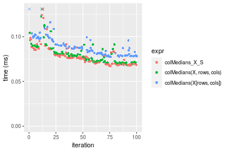
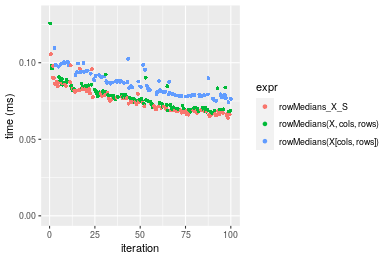
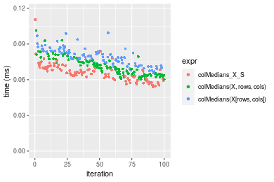
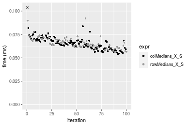
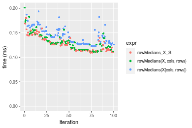
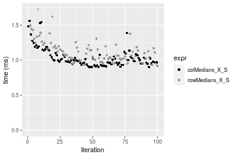

[matrixStats]: Benchmark report

---------------------------------------


# colMedians() and rowMedians() benchmarks on subsetted computation

This report benchmark the performance of colMedians() and rowMedians() on subsetted computation.


## Data type "integer"

### Data
```r
> rmatrix <- function(nrow, ncol, mode = c("logical", "double", "integer", "index"), range = c(-100, 
+     +100), na_prob = 0) {
+     mode <- match.arg(mode)
+     n <- nrow * ncol
+     if (mode == "logical") {
+         x <- sample(c(FALSE, TRUE), size = n, replace = TRUE)
+     }     else if (mode == "index") {
+         x <- seq_len(n)
+         mode <- "integer"
+     }     else {
+         x <- runif(n, min = range[1], max = range[2])
+     }
+     storage.mode(x) <- mode
+     if (na_prob > 0) 
+         x[sample(n, size = na_prob * n)] <- NA
+     dim(x) <- c(nrow, ncol)
+     x
+ }
> rmatrices <- function(scale = 10, seed = 1, ...) {
+     set.seed(seed)
+     data <- list()
+     data[[1]] <- rmatrix(nrow = scale * 1, ncol = scale * 1, ...)
+     data[[2]] <- rmatrix(nrow = scale * 10, ncol = scale * 10, ...)
+     data[[3]] <- rmatrix(nrow = scale * 100, ncol = scale * 1, ...)
+     data[[4]] <- t(data[[3]])
+     data[[5]] <- rmatrix(nrow = scale * 10, ncol = scale * 100, ...)
+     data[[6]] <- t(data[[5]])
+     names(data) <- sapply(data, FUN = function(x) paste(dim(x), collapse = "x"))
+     data
+ }
> data <- rmatrices(mode = mode)
```

### Results

#### 10x10 integer matrix


```r
> X <- data[["10x10"]]
> rows <- sample.int(nrow(X), size = nrow(X) * 0.7)
> cols <- sample.int(ncol(X), size = ncol(X) * 0.7)
> X_S <- X[rows, cols]
> gc()
          used  (Mb) gc trigger  (Mb) max used  (Mb)
Ncells 5196680 277.6   10014072 534.9 10014072 534.9
Vcells 9714775  74.2   18204443 138.9 18204443 138.9
> colStats <- microbenchmark(colMedians_X_S = colMedians(X_S, na.rm = FALSE), `colMedians(X, rows, cols)` = colMedians(X, 
+     rows = rows, cols = cols, na.rm = FALSE), `colMedians(X[rows, cols])` = colMedians(X[rows, cols], 
+     na.rm = FALSE), unit = "ms")
> X <- t(X)
> X_S <- t(X_S)
> gc()
          used  (Mb) gc trigger  (Mb) max used  (Mb)
Ncells 5182571 276.8   10014072 534.9 10014072 534.9
Vcells 9668402  73.8   18204443 138.9 18204443 138.9
> rowStats <- microbenchmark(rowMedians_X_S = rowMedians(X_S, na.rm = FALSE), `rowMedians(X, cols, rows)` = rowMedians(X, 
+     rows = cols, cols = rows, na.rm = FALSE), `rowMedians(X[cols, rows])` = rowMedians(X[cols, rows], 
+     na.rm = FALSE), unit = "ms")
```

_Table: Benchmarking of colMedians_X_S(), colMedians(X, rows, cols)() and colMedians(X[rows, cols])() on integer+10x10 data. The top panel shows times in milliseconds and the bottom panel shows relative times._


|   |expr                      |      min|        lq|      mean|    median|        uq|      max|
|:--|:-------------------------|--------:|---------:|---------:|---------:|---------:|--------:|
|1  |colMedians_X_S            | 0.002174| 0.0022065| 0.0025157| 0.0022495| 0.0023185| 0.019440|
|2  |colMedians(X, rows, cols) | 0.002503| 0.0025945| 0.0026968| 0.0026295| 0.0026940| 0.005564|
|3  |colMedians(X[rows, cols]) | 0.003014| 0.0032035| 0.0034162| 0.0033160| 0.0034615| 0.007157|


|   |expr                      |      min|       lq|     mean|   median|       uq|       max|
|:--|:-------------------------|--------:|--------:|--------:|--------:|--------:|---------:|
|1  |colMedians_X_S            | 1.000000| 1.000000| 1.000000| 1.000000| 1.000000| 1.0000000|
|2  |colMedians(X, rows, cols) | 1.151334| 1.175844| 1.071988| 1.168926| 1.161958| 0.2862140|
|3  |colMedians(X[rows, cols]) | 1.386384| 1.451847| 1.357943| 1.474105| 1.492991| 0.3681584|

_Table: Benchmarking of rowMedians_X_S(), rowMedians(X, cols, rows)() and rowMedians(X[cols, rows])() on integer+10x10 data (transposed). The top panel shows times in milliseconds and the bottom panel shows relative times._


|   |expr                      |      min|        lq|      mean|    median|        uq|      max|
|:--|:-------------------------|--------:|---------:|---------:|---------:|---------:|--------:|
|1  |rowMedians_X_S            | 0.002103| 0.0022015| 0.0024566| 0.0022325| 0.0023830| 0.016748|
|2  |rowMedians(X, cols, rows) | 0.002458| 0.0025755| 0.0028581| 0.0026185| 0.0027445| 0.020989|
|3  |rowMedians(X[cols, rows]) | 0.002991| 0.0031680| 0.0033960| 0.0033205| 0.0034320| 0.006162|


|   |expr                      |      min|       lq|     mean|   median|       uq|       max|
|:--|:-------------------------|--------:|--------:|--------:|--------:|--------:|---------:|
|1  |rowMedians_X_S            | 1.000000| 1.000000| 1.000000| 1.000000| 1.000000| 1.0000000|
|2  |rowMedians(X, cols, rows) | 1.168807| 1.169884| 1.163443| 1.172900| 1.151700| 1.2532243|
|3  |rowMedians(X[cols, rows]) | 1.422254| 1.439019| 1.382398| 1.487346| 1.440201| 0.3679245|

_Figure: Benchmarking of colMedians_X_S(), colMedians(X, rows, cols)() and colMedians(X[rows, cols])() on integer+10x10 data  as well as rowMedians_X_S(), rowMedians(X, cols, rows)() and rowMedians(X[cols, rows])() on the same data transposed.  Outliers are displayed as crosses.  Times are in milliseconds._


_Table: Benchmarking of colMedians_X_S() and rowMedians_X_S() on integer+10x10 data (original and transposed).  The top panel shows times in milliseconds and the bottom panel shows relative times._


|   |expr           |   min|     lq|    mean| median|     uq|    max|
|:--|:--------------|-----:|------:|-------:|------:|------:|------:|
|2  |rowMedians_X_S | 2.103| 2.2015| 2.45663| 2.2325| 2.3830| 16.748|
|1  |colMedians_X_S | 2.174| 2.2065| 2.51571| 2.2495| 2.3185| 19.440|


|   |expr           |      min|       lq|     mean|   median|        uq|      max|
|:--|:--------------|--------:|--------:|--------:|--------:|---------:|--------:|
|2  |rowMedians_X_S | 1.000000| 1.000000| 1.000000| 1.000000| 1.0000000| 1.000000|
|1  |colMedians_X_S | 1.033761| 1.002271| 1.024049| 1.007615| 0.9729333| 1.160736|

_Figure: Benchmarking of colMedians_X_S() and rowMedians_X_S() on integer+10x10 data (original and transposed).  Outliers are displayed as crosses. Times are in milliseconds._


#### 100x100 integer matrix


```r
> X <- data[["100x100"]]
> rows <- sample.int(nrow(X), size = nrow(X) * 0.7)
> cols <- sample.int(ncol(X), size = ncol(X) * 0.7)
> X_S <- X[rows, cols]
> gc()
          used  (Mb) gc trigger  (Mb) max used  (Mb)
Ncells 5181174 276.8   10014072 534.9 10014072 534.9
Vcells 9336635  71.3   18204443 138.9 18204443 138.9
> colStats <- microbenchmark(colMedians_X_S = colMedians(X_S, na.rm = FALSE), `colMedians(X, rows, cols)` = colMedians(X, 
+     rows = rows, cols = cols, na.rm = FALSE), `colMedians(X[rows, cols])` = colMedians(X[rows, cols], 
+     na.rm = FALSE), unit = "ms")
> X <- t(X)
> X_S <- t(X_S)
> gc()
          used  (Mb) gc trigger  (Mb) max used  (Mb)
Ncells 5181150 276.8   10014072 534.9 10014072 534.9
Vcells 9341688  71.3   18204443 138.9 18204443 138.9
> rowStats <- microbenchmark(rowMedians_X_S = rowMedians(X_S, na.rm = FALSE), `rowMedians(X, cols, rows)` = rowMedians(X, 
+     rows = cols, cols = rows, na.rm = FALSE), `rowMedians(X[cols, rows])` = rowMedians(X[cols, rows], 
+     na.rm = FALSE), unit = "ms")
```

_Table: Benchmarking of colMedians_X_S(), colMedians(X, rows, cols)() and colMedians(X[rows, cols])() on integer+100x100 data. The top panel shows times in milliseconds and the bottom panel shows relative times._


|   |expr                      |      min|        lq|      mean|    median|        uq|      max|
|:--|:-------------------------|--------:|---------:|---------:|---------:|---------:|--------:|
|1  |colMedians_X_S            | 0.067922| 0.0713380| 0.0767179| 0.0743660| 0.0805590| 0.098023|
|2  |colMedians(X, rows, cols) | 0.068533| 0.0719635| 0.0780336| 0.0752720| 0.0834805| 0.104846|
|3  |colMedians(X[rows, cols]) | 0.077800| 0.0813205| 0.0879097| 0.0843645| 0.0937805| 0.145726|


|   |expr                      |      min|       lq|     mean|   median|       uq|      max|
|:--|:-------------------------|--------:|--------:|--------:|--------:|--------:|--------:|
|1  |colMedians_X_S            | 1.000000| 1.000000| 1.000000| 1.000000| 1.000000| 1.000000|
|2  |colMedians(X, rows, cols) | 1.008996| 1.008768| 1.017150| 1.012183| 1.036265| 1.069606|
|3  |colMedians(X[rows, cols]) | 1.145431| 1.139932| 1.145882| 1.134450| 1.164122| 1.486651|

_Table: Benchmarking of rowMedians_X_S(), rowMedians(X, cols, rows)() and rowMedians(X[cols, rows])() on integer+100x100 data (transposed). The top panel shows times in milliseconds and the bottom panel shows relative times._


|   |expr                      |      min|        lq|      mean|    median|        uq|      max|
|:--|:-------------------------|--------:|---------:|---------:|---------:|---------:|--------:|
|2  |rowMedians(X, cols, rows) | 0.068032| 0.0717120| 0.0772793| 0.0751005| 0.0814995| 0.124429|
|1  |rowMedians_X_S            | 0.069498| 0.0727255| 0.0793976| 0.0762080| 0.0845155| 0.109531|
|3  |rowMedians(X[cols, rows]) | 0.078942| 0.0826970| 0.0896605| 0.0868435| 0.0952900| 0.118050|


|   |expr                      |      min|       lq|     mean|   median|       uq|       max|
|:--|:-------------------------|--------:|--------:|--------:|--------:|--------:|---------:|
|2  |rowMedians(X, cols, rows) | 1.000000| 1.000000| 1.000000| 1.000000| 1.000000| 1.0000000|
|1  |rowMedians_X_S            | 1.021549| 1.014133| 1.027411| 1.014747| 1.037006| 0.8802691|
|3  |rowMedians(X[cols, rows]) | 1.160366| 1.153182| 1.160213| 1.156364| 1.169210| 0.9487338|

_Figure: Benchmarking of colMedians_X_S(), colMedians(X, rows, cols)() and colMedians(X[rows, cols])() on integer+100x100 data  as well as rowMedians_X_S(), rowMedians(X, cols, rows)() and rowMedians(X[cols, rows])() on the same data transposed.  Outliers are displayed as crosses.  Times are in milliseconds._





_Table: Benchmarking of colMedians_X_S() and rowMedians_X_S() on integer+100x100 data (original and transposed).  The top panel shows times in milliseconds and the bottom panel shows relative times._


|   |expr           |    min|      lq|     mean| median|      uq|     max|
|:--|:--------------|------:|-------:|--------:|------:|-------:|-------:|
|1  |colMedians_X_S | 67.922| 71.3380| 76.71790| 74.366| 80.5590|  98.023|
|2  |rowMedians_X_S | 69.498| 72.7255| 79.39757| 76.208| 84.5155| 109.531|


|   |expr           |      min|      lq|     mean|   median|       uq|      max|
|:--|:--------------|--------:|-------:|--------:|--------:|--------:|--------:|
|1  |colMedians_X_S | 1.000000| 1.00000| 1.000000| 1.000000| 1.000000| 1.000000|
|2  |rowMedians_X_S | 1.023203| 1.01945| 1.034929| 1.024769| 1.049113| 1.117401|

_Figure: Benchmarking of colMedians_X_S() and rowMedians_X_S() on integer+100x100 data (original and transposed).  Outliers are displayed as crosses. Times are in milliseconds._


#### 1000x10 integer matrix


```r
> X <- data[["1000x10"]]
> rows <- sample.int(nrow(X), size = nrow(X) * 0.7)
> cols <- sample.int(ncol(X), size = ncol(X) * 0.7)
> X_S <- X[rows, cols]
> gc()
          used  (Mb) gc trigger  (Mb) max used  (Mb)
Ncells 5181917 276.8   10014072 534.9 10014072 534.9
Vcells 9340688  71.3   18204443 138.9 18204443 138.9
> colStats <- microbenchmark(colMedians_X_S = colMedians(X_S, na.rm = FALSE), `colMedians(X, rows, cols)` = colMedians(X, 
+     rows = rows, cols = cols, na.rm = FALSE), `colMedians(X[rows, cols])` = colMedians(X[rows, cols], 
+     na.rm = FALSE), unit = "ms")
> X <- t(X)
> X_S <- t(X_S)
> gc()
          used  (Mb) gc trigger  (Mb) max used  (Mb)
Ncells 5181893 276.8   10014072 534.9 10014072 534.9
Vcells 9345741  71.4   18204443 138.9 18204443 138.9
> rowStats <- microbenchmark(rowMedians_X_S = rowMedians(X_S, na.rm = FALSE), `rowMedians(X, cols, rows)` = rowMedians(X, 
+     rows = cols, cols = rows, na.rm = FALSE), `rowMedians(X[cols, rows])` = rowMedians(X[cols, rows], 
+     na.rm = FALSE), unit = "ms")
```

_Table: Benchmarking of colMedians_X_S(), colMedians(X, rows, cols)() and colMedians(X[rows, cols])() on integer+1000x10 data. The top panel shows times in milliseconds and the bottom panel shows relative times._


|   |expr                      |      min|        lq|      mean|    median|        uq|      max|
|:--|:-------------------------|--------:|---------:|---------:|---------:|---------:|--------:|
|1  |colMedians_X_S            | 0.053826| 0.0570435| 0.0614137| 0.0605315| 0.0653485| 0.080074|
|2  |colMedians(X, rows, cols) | 0.055128| 0.0579095| 0.0624135| 0.0607905| 0.0653515| 0.086371|
|3  |colMedians(X[rows, cols]) | 0.063684| 0.0654055| 0.0716143| 0.0694305| 0.0751920| 0.127035|


|   |expr                      |      min|       lq|     mean|   median|       uq|     max|
|:--|:-------------------------|--------:|--------:|--------:|--------:|--------:|-------:|
|1  |colMedians_X_S            | 1.000000| 1.000000| 1.000000| 1.000000| 1.000000| 1.00000|
|2  |colMedians(X, rows, cols) | 1.024189| 1.015181| 1.016278| 1.004279| 1.000046| 1.07864|
|3  |colMedians(X[rows, cols]) | 1.183146| 1.146590| 1.166095| 1.147014| 1.150631| 1.58647|

_Table: Benchmarking of rowMedians_X_S(), rowMedians(X, cols, rows)() and rowMedians(X[cols, rows])() on integer+1000x10 data (transposed). The top panel shows times in milliseconds and the bottom panel shows relative times._


|   |expr                      |      min|       lq|      mean|    median|        uq|      max|
|:--|:-------------------------|--------:|--------:|---------:|---------:|---------:|--------:|
|1  |rowMedians_X_S            | 0.055470| 0.057623| 0.0626324| 0.0610295| 0.0660825| 0.087608|
|2  |rowMedians(X, cols, rows) | 0.056186| 0.058245| 0.0632394| 0.0636200| 0.0672000| 0.077478|
|3  |rowMedians(X[cols, rows]) | 0.067292| 0.068919| 0.0761266| 0.0752275| 0.0795540| 0.131223|


|   |expr                      |      min|       lq|     mean|   median|       uq|       max|
|:--|:-------------------------|--------:|--------:|--------:|--------:|--------:|---------:|
|1  |rowMedians_X_S            | 1.000000| 1.000000| 1.000000| 1.000000| 1.000000| 1.0000000|
|2  |rowMedians(X, cols, rows) | 1.012908| 1.010794| 1.009692| 1.042447| 1.016911| 0.8843713|
|3  |rowMedians(X[cols, rows]) | 1.213124| 1.196033| 1.215451| 1.232642| 1.203859| 1.4978427|

_Figure: Benchmarking of colMedians_X_S(), colMedians(X, rows, cols)() and colMedians(X[rows, cols])() on integer+1000x10 data  as well as rowMedians_X_S(), rowMedians(X, cols, rows)() and rowMedians(X[cols, rows])() on the same data transposed.  Outliers are displayed as crosses.  Times are in milliseconds._


_Table: Benchmarking of colMedians_X_S() and rowMedians_X_S() on integer+1000x10 data (original and transposed).  The top panel shows times in milliseconds and the bottom panel shows relative times._


|   |expr           |    min|      lq|     mean|  median|      uq|    max|
|:--|:--------------|------:|-------:|--------:|-------:|-------:|------:|
|1  |colMedians_X_S | 53.826| 57.0435| 61.41374| 60.5315| 65.3485| 80.074|
|2  |rowMedians_X_S | 55.470| 57.6230| 62.63237| 61.0295| 66.0825| 87.608|


|   |expr           |      min|       lq|     mean|   median|       uq|      max|
|:--|:--------------|--------:|--------:|--------:|--------:|--------:|--------:|
|1  |colMedians_X_S | 1.000000| 1.000000| 1.000000| 1.000000| 1.000000| 1.000000|
|2  |rowMedians_X_S | 1.030543| 1.010159| 1.019843| 1.008227| 1.011232| 1.094088|

_Figure: Benchmarking of colMedians_X_S() and rowMedians_X_S() on integer+1000x10 data (original and transposed).  Outliers are displayed as crosses. Times are in milliseconds._


#### 10x1000 integer matrix


```r
> X <- data[["10x1000"]]
> rows <- sample.int(nrow(X), size = nrow(X) * 0.7)
> cols <- sample.int(ncol(X), size = ncol(X) * 0.7)
> X_S <- X[rows, cols]
> gc()
          used  (Mb) gc trigger  (Mb) max used  (Mb)
Ncells 5182122 276.8   10014072 534.9 10014072 534.9
Vcells 9341570  71.3   18204443 138.9 18204443 138.9
> colStats <- microbenchmark(colMedians_X_S = colMedians(X_S, na.rm = FALSE), `colMedians(X, rows, cols)` = colMedians(X, 
+     rows = rows, cols = cols, na.rm = FALSE), `colMedians(X[rows, cols])` = colMedians(X[rows, cols], 
+     na.rm = FALSE), unit = "ms")
> X <- t(X)
> X_S <- t(X_S)
> gc()
          used  (Mb) gc trigger  (Mb) max used  (Mb)
Ncells 5182098 276.8   10014072 534.9 10014072 534.9
Vcells 9346623  71.4   18204443 138.9 18204443 138.9
> rowStats <- microbenchmark(rowMedians_X_S = rowMedians(X_S, na.rm = FALSE), `rowMedians(X, cols, rows)` = rowMedians(X, 
+     rows = cols, cols = rows, na.rm = FALSE), `rowMedians(X[cols, rows])` = rowMedians(X[cols, rows], 
+     na.rm = FALSE), unit = "ms")
```

_Table: Benchmarking of colMedians_X_S(), colMedians(X, rows, cols)() and colMedians(X[rows, cols])() on integer+10x1000 data. The top panel shows times in milliseconds and the bottom panel shows relative times._


|   |expr                      |      min|        lq|      mean|    median|        uq|      max|
|:--|:-------------------------|--------:|---------:|---------:|---------:|---------:|--------:|
|2  |colMedians(X, rows, cols) | 0.058550| 0.0637025| 0.0691570| 0.0665220| 0.0751450| 0.101076|
|1  |colMedians_X_S            | 0.058302| 0.0635725| 0.0691944| 0.0685485| 0.0732130| 0.114861|
|3  |colMedians(X[rows, cols]) | 0.069883| 0.0763320| 0.0821655| 0.0813615| 0.0861525| 0.108260|


|   |expr                      |       min|        lq|     mean|   median|        uq|      max|
|:--|:-------------------------|---------:|---------:|--------:|--------:|---------:|--------:|
|2  |colMedians(X, rows, cols) | 1.0000000| 1.0000000| 1.000000| 1.000000| 1.0000000| 1.000000|
|1  |colMedians_X_S            | 0.9957643| 0.9979593| 1.000541| 1.030464| 0.9742897| 1.136383|
|3  |colMedians(X[rows, cols]) | 1.1935611| 1.1982575| 1.188101| 1.223077| 1.1464835| 1.071075|

_Table: Benchmarking of rowMedians_X_S(), rowMedians(X, cols, rows)() and rowMedians(X[cols, rows])() on integer+10x1000 data (transposed). The top panel shows times in milliseconds and the bottom panel shows relative times._


|   |expr                      |      min|        lq|      mean|    median|        uq|      max|
|:--|:-------------------------|--------:|---------:|---------:|---------:|---------:|--------:|
|1  |rowMedians_X_S            | 0.057334| 0.0628475| 0.0678032| 0.0668150| 0.0724650| 0.095108|
|2  |rowMedians(X, cols, rows) | 0.057151| 0.0644545| 0.0688338| 0.0672115| 0.0725845| 0.117625|
|3  |rowMedians(X[cols, rows]) | 0.067570| 0.0738170| 0.0797269| 0.0775265| 0.0854600| 0.110360|


|   |expr                      |       min|       lq|     mean|   median|       uq|      max|
|:--|:-------------------------|---------:|--------:|--------:|--------:|--------:|--------:|
|1  |rowMedians_X_S            | 1.0000000| 1.000000| 1.000000| 1.000000| 1.000000| 1.000000|
|2  |rowMedians(X, cols, rows) | 0.9968082| 1.025570| 1.015200| 1.005934| 1.001649| 1.236752|
|3  |rowMedians(X[cols, rows]) | 1.1785328| 1.174541| 1.175858| 1.160316| 1.179328| 1.160365|

_Figure: Benchmarking of colMedians_X_S(), colMedians(X, rows, cols)() and colMedians(X[rows, cols])() on integer+10x1000 data  as well as rowMedians_X_S(), rowMedians(X, cols, rows)() and rowMedians(X[cols, rows])() on the same data transposed.  Outliers are displayed as crosses.  Times are in milliseconds._





_Table: Benchmarking of colMedians_X_S() and rowMedians_X_S() on integer+10x1000 data (original and transposed).  The top panel shows times in milliseconds and the bottom panel shows relative times._


|   |expr           |    min|      lq|     mean|  median|     uq|     max|
|:--|:--------------|------:|-------:|--------:|-------:|------:|-------:|
|2  |rowMedians_X_S | 57.334| 62.8475| 67.80319| 66.8150| 72.465|  95.108|
|1  |colMedians_X_S | 58.302| 63.5725| 69.19440| 68.5485| 73.213| 114.861|


|   |expr           |      min|       lq|     mean|   median|       uq|     max|
|:--|:--------------|--------:|--------:|--------:|--------:|--------:|-------:|
|2  |rowMedians_X_S | 1.000000| 1.000000| 1.000000| 1.000000| 1.000000| 1.00000|
|1  |colMedians_X_S | 1.016884| 1.011536| 1.020518| 1.025945| 1.010322| 1.20769|

_Figure: Benchmarking of colMedians_X_S() and rowMedians_X_S() on integer+10x1000 data (original and transposed).  Outliers are displayed as crosses. Times are in milliseconds._




#### 100x1000 integer matrix


```r
> X <- data[["100x1000"]]
> rows <- sample.int(nrow(X), size = nrow(X) * 0.7)
> cols <- sample.int(ncol(X), size = ncol(X) * 0.7)
> X_S <- X[rows, cols]
> gc()
          used  (Mb) gc trigger  (Mb) max used  (Mb)
Ncells 5182332 276.8   10014072 534.9 10014072 534.9
Vcells 9364252  71.5   18204443 138.9 18204443 138.9
> colStats <- microbenchmark(colMedians_X_S = colMedians(X_S, na.rm = FALSE), `colMedians(X, rows, cols)` = colMedians(X, 
+     rows = rows, cols = cols, na.rm = FALSE), `colMedians(X[rows, cols])` = colMedians(X[rows, cols], 
+     na.rm = FALSE), unit = "ms")
> X <- t(X)
> X_S <- t(X_S)
> gc()
          used  (Mb) gc trigger  (Mb) max used  (Mb)
Ncells 5182308 276.8   10014072 534.9 10014072 534.9
Vcells 9414305  71.9   18204443 138.9 18204443 138.9
> rowStats <- microbenchmark(rowMedians_X_S = rowMedians(X_S, na.rm = FALSE), `rowMedians(X, cols, rows)` = rowMedians(X, 
+     rows = cols, cols = rows, na.rm = FALSE), `rowMedians(X[cols, rows])` = rowMedians(X[cols, rows], 
+     na.rm = FALSE), unit = "ms")
```

_Table: Benchmarking of colMedians_X_S(), colMedians(X, rows, cols)() and colMedians(X[rows, cols])() on integer+100x1000 data. The top panel shows times in milliseconds and the bottom panel shows relative times._


|   |expr                      |      min|        lq|      mean|    median|       uq|      max|
|:--|:-------------------------|--------:|---------:|---------:|---------:|--------:|--------:|
|2  |colMedians(X, rows, cols) | 0.641636| 0.6433855| 0.6751624| 0.6447565| 0.649610| 1.100555|
|1  |colMedians_X_S            | 0.644590| 0.6464800| 0.6839102| 0.6480340| 0.660054| 1.072875|
|3  |colMedians(X[rows, cols]) | 0.711779| 0.7141165| 0.7618441| 0.7182110| 0.728960| 1.160574|


|   |expr                      |      min|       lq|     mean|   median|       uq|       max|
|:--|:-------------------------|--------:|--------:|--------:|--------:|--------:|---------:|
|2  |colMedians(X, rows, cols) | 1.000000| 1.000000| 1.000000| 1.000000| 1.000000| 1.0000000|
|1  |colMedians_X_S            | 1.004604| 1.004810| 1.012957| 1.005083| 1.016077| 0.9748491|
|3  |colMedians(X[rows, cols]) | 1.109319| 1.109936| 1.128386| 1.113926| 1.122150| 1.0545352|

_Table: Benchmarking of rowMedians_X_S(), rowMedians(X, cols, rows)() and rowMedians(X[cols, rows])() on integer+100x1000 data (transposed). The top panel shows times in milliseconds and the bottom panel shows relative times._


|   |expr                      |      min|       lq|      mean|    median|        uq|      max|
|:--|:-------------------------|--------:|--------:|---------:|---------:|---------:|--------:|
|2  |rowMedians(X, cols, rows) | 0.651544| 0.653609| 0.6768917| 0.6551245| 0.6581280| 1.081896|
|1  |rowMedians_X_S            | 0.653874| 0.656539| 0.7029894| 0.6582925| 0.6721540| 1.129902|
|3  |rowMedians(X[cols, rows]) | 0.719636| 0.722066| 0.7648408| 0.7275005| 0.7407165| 1.093086|


|   |expr                      |      min|       lq|     mean|   median|       uq|      max|
|:--|:-------------------------|--------:|--------:|--------:|--------:|--------:|--------:|
|2  |rowMedians(X, cols, rows) | 1.000000| 1.000000| 1.000000| 1.000000| 1.000000| 1.000000|
|1  |rowMedians_X_S            | 1.003576| 1.004483| 1.038555| 1.004836| 1.021312| 1.044372|
|3  |rowMedians(X[cols, rows]) | 1.104509| 1.104737| 1.129931| 1.110477| 1.125490| 1.010343|

_Figure: Benchmarking of colMedians_X_S(), colMedians(X, rows, cols)() and colMedians(X[rows, cols])() on integer+100x1000 data  as well as rowMedians_X_S(), rowMedians(X, cols, rows)() and rowMedians(X[cols, rows])() on the same data transposed.  Outliers are displayed as crosses.  Times are in milliseconds._


_Table: Benchmarking of colMedians_X_S() and rowMedians_X_S() on integer+100x1000 data (original and transposed).  The top panel shows times in milliseconds and the bottom panel shows relative times._


|   |expr           |     min|      lq|     mean|   median|      uq|      max|
|:--|:--------------|-------:|-------:|--------:|--------:|-------:|--------:|
|1  |colMedians_X_S | 644.590| 646.480| 683.9102| 648.0340| 660.054| 1072.875|
|2  |rowMedians_X_S | 653.874| 656.539| 702.9894| 658.2925| 672.154| 1129.902|


|   |expr           |      min|      lq|     mean|  median|       uq|      max|
|:--|:--------------|--------:|-------:|--------:|-------:|--------:|--------:|
|1  |colMedians_X_S | 1.000000| 1.00000| 1.000000| 1.00000| 1.000000| 1.000000|
|2  |rowMedians_X_S | 1.014403| 1.01556| 1.027897| 1.01583| 1.018332| 1.053153|

_Figure: Benchmarking of colMedians_X_S() and rowMedians_X_S() on integer+100x1000 data (original and transposed).  Outliers are displayed as crosses. Times are in milliseconds._


#### 1000x100 integer matrix


```r
> X <- data[["1000x100"]]
> rows <- sample.int(nrow(X), size = nrow(X) * 0.7)
> cols <- sample.int(ncol(X), size = ncol(X) * 0.7)
> X_S <- X[rows, cols]
> gc()
          used  (Mb) gc trigger  (Mb) max used  (Mb)
Ncells 5182545 276.8   10014072 534.9 10014072 534.9
Vcells 9365050  71.5   18204443 138.9 18204443 138.9
> colStats <- microbenchmark(colMedians_X_S = colMedians(X_S, na.rm = FALSE), `colMedians(X, rows, cols)` = colMedians(X, 
+     rows = rows, cols = cols, na.rm = FALSE), `colMedians(X[rows, cols])` = colMedians(X[rows, cols], 
+     na.rm = FALSE), unit = "ms")
> X <- t(X)
> X_S <- t(X_S)
> gc()
          used  (Mb) gc trigger  (Mb) max used  (Mb)
Ncells 5182521 276.8   10014072 534.9 10014072 534.9
Vcells 9415103  71.9   18204443 138.9 18204443 138.9
> rowStats <- microbenchmark(rowMedians_X_S = rowMedians(X_S, na.rm = FALSE), `rowMedians(X, cols, rows)` = rowMedians(X, 
+     rows = cols, cols = rows, na.rm = FALSE), `rowMedians(X[cols, rows])` = rowMedians(X[cols, rows], 
+     na.rm = FALSE), unit = "ms")
```

_Table: Benchmarking of colMedians_X_S(), colMedians(X, rows, cols)() and colMedians(X[rows, cols])() on integer+1000x100 data. The top panel shows times in milliseconds and the bottom panel shows relative times._


|   |expr                      |      min|        lq|      mean|    median|        uq|      max|
|:--|:-------------------------|--------:|---------:|---------:|---------:|---------:|--------:|
|2  |colMedians(X, rows, cols) | 0.542302| 0.5444950| 0.5828454| 0.5455490| 0.5504320| 0.896537|
|1  |colMedians_X_S            | 0.549096| 0.5509370| 0.5870593| 0.5533565| 0.5653340| 0.918822|
|3  |colMedians(X[rows, cols]) | 0.613419| 0.6155765| 0.6562243| 0.6219400| 0.6503215| 1.055996|


|   |expr                      |      min|       lq|     mean|   median|       uq|      max|
|:--|:-------------------------|--------:|--------:|--------:|--------:|--------:|--------:|
|2  |colMedians(X, rows, cols) | 1.000000| 1.000000| 1.000000| 1.000000| 1.000000| 1.000000|
|1  |colMedians_X_S            | 1.012528| 1.011831| 1.007230| 1.014311| 1.027073| 1.024857|
|3  |colMedians(X[rows, cols]) | 1.131139| 1.130546| 1.125898| 1.140026| 1.181475| 1.177861|

_Table: Benchmarking of rowMedians_X_S(), rowMedians(X, cols, rows)() and rowMedians(X[cols, rows])() on integer+1000x100 data (transposed). The top panel shows times in milliseconds and the bottom panel shows relative times._


|   |expr                      |      min|        lq|      mean|    median|        uq|      max|
|:--|:-------------------------|--------:|---------:|---------:|---------:|---------:|--------:|
|2  |rowMedians(X, cols, rows) | 0.561385| 0.5642720| 0.5983768| 0.5655515| 0.5726525| 0.989849|
|1  |rowMedians_X_S            | 0.562010| 0.5645900| 0.6002289| 0.5668670| 0.5810320| 0.869672|
|3  |rowMedians(X[cols, rows]) | 0.630054| 0.6349735| 0.6760368| 0.6408980| 0.6615010| 1.036591|


|   |expr                      |      min|       lq|     mean|   median|       uq|       max|
|:--|:-------------------------|--------:|--------:|--------:|--------:|--------:|---------:|
|2  |rowMedians(X, cols, rows) | 1.000000| 1.000000| 1.000000| 1.000000| 1.000000| 1.0000000|
|1  |rowMedians_X_S            | 1.001113| 1.000564| 1.003095| 1.002326| 1.014633| 0.8785906|
|3  |rowMedians(X[cols, rows]) | 1.122321| 1.125297| 1.129784| 1.133227| 1.155153| 1.0472213|

_Figure: Benchmarking of colMedians_X_S(), colMedians(X, rows, cols)() and colMedians(X[rows, cols])() on integer+1000x100 data  as well as rowMedians_X_S(), rowMedians(X, cols, rows)() and rowMedians(X[cols, rows])() on the same data transposed.  Outliers are displayed as crosses.  Times are in milliseconds._


_Table: Benchmarking of colMedians_X_S() and rowMedians_X_S() on integer+1000x100 data (original and transposed).  The top panel shows times in milliseconds and the bottom panel shows relative times._


|   |expr           |     min|      lq|     mean|   median|      uq|     max|
|:--|:--------------|-------:|-------:|--------:|--------:|-------:|-------:|
|1  |colMedians_X_S | 549.096| 550.937| 587.0593| 553.3565| 565.334| 918.822|
|2  |rowMedians_X_S | 562.010| 564.590| 600.2289| 566.8670| 581.032| 869.672|


|   |expr           |      min|       lq|     mean|   median|       uq|       max|
|:--|:--------------|--------:|--------:|--------:|--------:|--------:|---------:|
|1  |colMedians_X_S | 1.000000| 1.000000| 1.000000| 1.000000| 1.000000| 1.0000000|
|2  |rowMedians_X_S | 1.023519| 1.024781| 1.022433| 1.024415| 1.027768| 0.9465076|

_Figure: Benchmarking of colMedians_X_S() and rowMedians_X_S() on integer+1000x100 data (original and transposed).  Outliers are displayed as crosses. Times are in milliseconds._


## Data type "double"

### Data
```r
> rmatrix <- function(nrow, ncol, mode = c("logical", "double", "integer", "index"), range = c(-100, 
+     +100), na_prob = 0) {
+     mode <- match.arg(mode)
+     n <- nrow * ncol
+     if (mode == "logical") {
+         x <- sample(c(FALSE, TRUE), size = n, replace = TRUE)
+     }     else if (mode == "index") {
+         x <- seq_len(n)
+         mode <- "integer"
+     }     else {
+         x <- runif(n, min = range[1], max = range[2])
+     }
+     storage.mode(x) <- mode
+     if (na_prob > 0) 
+         x[sample(n, size = na_prob * n)] <- NA
+     dim(x) <- c(nrow, ncol)
+     x
+ }
> rmatrices <- function(scale = 10, seed = 1, ...) {
+     set.seed(seed)
+     data <- list()
+     data[[1]] <- rmatrix(nrow = scale * 1, ncol = scale * 1, ...)
+     data[[2]] <- rmatrix(nrow = scale * 10, ncol = scale * 10, ...)
+     data[[3]] <- rmatrix(nrow = scale * 100, ncol = scale * 1, ...)
+     data[[4]] <- t(data[[3]])
+     data[[5]] <- rmatrix(nrow = scale * 10, ncol = scale * 100, ...)
+     data[[6]] <- t(data[[5]])
+     names(data) <- sapply(data, FUN = function(x) paste(dim(x), collapse = "x"))
+     data
+ }
> data <- rmatrices(mode = mode)
```

### Results

#### 10x10 double matrix


```r
> X <- data[["10x10"]]
> rows <- sample.int(nrow(X), size = nrow(X) * 0.7)
> cols <- sample.int(ncol(X), size = ncol(X) * 0.7)
> X_S <- X[rows, cols]
> gc()
          used  (Mb) gc trigger  (Mb) max used  (Mb)
Ncells 5182762 276.8   10014072 534.9 10014072 534.9
Vcells 9456169  72.2   18204443 138.9 18204443 138.9
> colStats <- microbenchmark(colMedians_X_S = colMedians(X_S, na.rm = FALSE), `colMedians(X, rows, cols)` = colMedians(X, 
+     rows = rows, cols = cols, na.rm = FALSE), `colMedians(X[rows, cols])` = colMedians(X[rows, cols], 
+     na.rm = FALSE), unit = "ms")
> X <- t(X)
> X_S <- t(X_S)
> gc()
          used  (Mb) gc trigger  (Mb) max used  (Mb)
Ncells 5182729 276.8   10014072 534.9 10014072 534.9
Vcells 9456307  72.2   18204443 138.9 18204443 138.9
> rowStats <- microbenchmark(rowMedians_X_S = rowMedians(X_S, na.rm = FALSE), `rowMedians(X, cols, rows)` = rowMedians(X, 
+     rows = cols, cols = rows, na.rm = FALSE), `rowMedians(X[cols, rows])` = rowMedians(X[cols, rows], 
+     na.rm = FALSE), unit = "ms")
```

_Table: Benchmarking of colMedians_X_S(), colMedians(X, rows, cols)() and colMedians(X[rows, cols])() on double+10x10 data. The top panel shows times in milliseconds and the bottom panel shows relative times._


|   |expr                      |      min|        lq|      mean|    median|        uq|      max|
|:--|:-------------------------|--------:|---------:|---------:|---------:|---------:|--------:|
|1  |colMedians_X_S            | 0.002483| 0.0025190| 0.0027969| 0.0025615| 0.0026540| 0.021153|
|2  |colMedians(X, rows, cols) | 0.002826| 0.0029655| 0.0030827| 0.0030390| 0.0031235| 0.005823|
|3  |colMedians(X[rows, cols]) | 0.003347| 0.0035210| 0.0038329| 0.0037060| 0.0038585| 0.009953|


|   |expr                      |      min|       lq|     mean|   median|       uq|       max|
|:--|:-------------------------|--------:|--------:|--------:|--------:|--------:|---------:|
|1  |colMedians_X_S            | 1.000000| 1.000000| 1.000000| 1.000000| 1.000000| 1.0000000|
|2  |colMedians(X, rows, cols) | 1.138139| 1.177253| 1.102177| 1.186414| 1.176903| 0.2752801|
|3  |colMedians(X[rows, cols]) | 1.347966| 1.397777| 1.370423| 1.446808| 1.453843| 0.4705243|

_Table: Benchmarking of rowMedians_X_S(), rowMedians(X, cols, rows)() and rowMedians(X[cols, rows])() on double+10x10 data (transposed). The top panel shows times in milliseconds and the bottom panel shows relative times._


|   |expr                      |      min|        lq|      mean|    median|        uq|      max|
|:--|:-------------------------|--------:|---------:|---------:|---------:|---------:|--------:|
|1  |rowMedians_X_S            | 0.002372| 0.0024280| 0.0025605| 0.0025040| 0.0026150| 0.005374|
|2  |rowMedians(X, cols, rows) | 0.002719| 0.0028705| 0.0031887| 0.0029285| 0.0030175| 0.023324|
|3  |rowMedians(X[cols, rows]) | 0.003206| 0.0034530| 0.0038643| 0.0035615| 0.0037285| 0.017906|


|   |expr                      |      min|       lq|     mean|   median|       uq|      max|
|:--|:-------------------------|--------:|--------:|--------:|--------:|--------:|--------:|
|1  |rowMedians_X_S            | 1.000000| 1.000000| 1.000000| 1.000000| 1.000000| 1.000000|
|2  |rowMedians(X, cols, rows) | 1.146290| 1.182249| 1.245329| 1.169529| 1.153920| 4.340156|
|3  |rowMedians(X[cols, rows]) | 1.351602| 1.422158| 1.509182| 1.422324| 1.425813| 3.331969|

_Figure: Benchmarking of colMedians_X_S(), colMedians(X, rows, cols)() and colMedians(X[rows, cols])() on double+10x10 data  as well as rowMedians_X_S(), rowMedians(X, cols, rows)() and rowMedians(X[cols, rows])() on the same data transposed.  Outliers are displayed as crosses.  Times are in milliseconds._


_Table: Benchmarking of colMedians_X_S() and rowMedians_X_S() on double+10x10 data (original and transposed).  The top panel shows times in milliseconds and the bottom panel shows relative times._


|   |expr           |   min|    lq|    mean| median|    uq|    max|
|:--|:--------------|-----:|-----:|-------:|------:|-----:|------:|
|2  |rowMedians_X_S | 2.372| 2.428| 2.56052| 2.5040| 2.615|  5.374|
|1  |colMedians_X_S | 2.483| 2.519| 2.79691| 2.5615| 2.654| 21.153|


|   |expr           |      min|       lq|     mean|   median|       uq|      max|
|:--|:--------------|--------:|--------:|--------:|--------:|--------:|--------:|
|2  |rowMedians_X_S | 1.000000| 1.000000| 1.000000| 1.000000| 1.000000| 1.000000|
|1  |colMedians_X_S | 1.046796| 1.037479| 1.092321| 1.022963| 1.014914| 3.936174|

_Figure: Benchmarking of colMedians_X_S() and rowMedians_X_S() on double+10x10 data (original and transposed).  Outliers are displayed as crosses. Times are in milliseconds._


#### 100x100 double matrix


```r
> X <- data[["100x100"]]
> rows <- sample.int(nrow(X), size = nrow(X) * 0.7)
> cols <- sample.int(ncol(X), size = ncol(X) * 0.7)
> X_S <- X[rows, cols]
> gc()
          used  (Mb) gc trigger  (Mb) max used  (Mb)
Ncells 5182959 276.8   10014072 534.9 10014072 534.9
Vcells 9462135  72.2   18204443 138.9 18204443 138.9
> colStats <- microbenchmark(colMedians_X_S = colMedians(X_S, na.rm = FALSE), `colMedians(X, rows, cols)` = colMedians(X, 
+     rows = rows, cols = cols, na.rm = FALSE), `colMedians(X[rows, cols])` = colMedians(X[rows, cols], 
+     na.rm = FALSE), unit = "ms")
> X <- t(X)
> X_S <- t(X_S)
> gc()
          used  (Mb) gc trigger  (Mb) max used  (Mb)
Ncells 5182935 276.8   10014072 534.9 10014072 534.9
Vcells 9472188  72.3   18204443 138.9 18204443 138.9
> rowStats <- microbenchmark(rowMedians_X_S = rowMedians(X_S, na.rm = FALSE), `rowMedians(X, cols, rows)` = rowMedians(X, 
+     rows = cols, cols = rows, na.rm = FALSE), `rowMedians(X[cols, rows])` = rowMedians(X[cols, rows], 
+     na.rm = FALSE), unit = "ms")
```

_Table: Benchmarking of colMedians_X_S(), colMedians(X, rows, cols)() and colMedians(X[rows, cols])() on double+100x100 data. The top panel shows times in milliseconds and the bottom panel shows relative times._


|   |expr                      |      min|        lq|      mean|    median|       uq|      max|
|:--|:-------------------------|--------:|---------:|---------:|---------:|--------:|--------:|
|2  |colMedians(X, rows, cols) | 0.098791| 0.1100660| 0.1185886| 0.1165740| 0.125439| 0.159360|
|1  |colMedians_X_S            | 0.101181| 0.1109935| 0.1204460| 0.1184665| 0.126605| 0.151809|
|3  |colMedians(X[rows, cols]) | 0.112686| 0.1236485| 0.1345599| 0.1318450| 0.143464| 0.192535|


|   |expr                      |      min|       lq|     mean|   median|       uq|       max|
|:--|:-------------------------|--------:|--------:|--------:|--------:|--------:|---------:|
|2  |colMedians(X, rows, cols) | 1.000000| 1.000000| 1.000000| 1.000000| 1.000000| 1.0000000|
|1  |colMedians_X_S            | 1.024193| 1.008427| 1.015662| 1.016234| 1.009295| 0.9526167|
|3  |colMedians(X[rows, cols]) | 1.140651| 1.123403| 1.134678| 1.130998| 1.143695| 1.2081765|

_Table: Benchmarking of rowMedians_X_S(), rowMedians(X, cols, rows)() and rowMedians(X[cols, rows])() on double+100x100 data (transposed). The top panel shows times in milliseconds and the bottom panel shows relative times._


|   |expr                      |      min|       lq|      mean|    median|        uq|      max|
|:--|:-------------------------|--------:|--------:|---------:|---------:|---------:|--------:|
|2  |rowMedians(X, cols, rows) | 0.099023| 0.110926| 0.1194382| 0.1167710| 0.1284485| 0.174646|
|1  |rowMedians_X_S            | 0.100736| 0.110686| 0.1207495| 0.1179685| 0.1309570| 0.156523|
|3  |rowMedians(X[cols, rows]) | 0.112073| 0.126479| 0.1329905| 0.1311500| 0.1409745| 0.168122|


|   |expr                      |      min|        lq|     mean|   median|       uq|       max|
|:--|:-------------------------|--------:|---------:|--------:|--------:|--------:|---------:|
|2  |rowMedians(X, cols, rows) | 1.000000| 1.0000000| 1.000000| 1.000000| 1.000000| 1.0000000|
|1  |rowMedians_X_S            | 1.017299| 0.9978364| 1.010979| 1.010255| 1.019529| 0.8962301|
|3  |rowMedians(X[cols, rows]) | 1.131788| 1.1402106| 1.113467| 1.123139| 1.097518| 0.9626444|

_Figure: Benchmarking of colMedians_X_S(), colMedians(X, rows, cols)() and colMedians(X[rows, cols])() on double+100x100 data  as well as rowMedians_X_S(), rowMedians(X, cols, rows)() and rowMedians(X[cols, rows])() on the same data transposed.  Outliers are displayed as crosses.  Times are in milliseconds._



_Table: Benchmarking of colMedians_X_S() and rowMedians_X_S() on double+100x100 data (original and transposed).  The top panel shows times in milliseconds and the bottom panel shows relative times._


|   |expr           |     min|       lq|     mean|   median|      uq|     max|
|:--|:--------------|-------:|--------:|--------:|--------:|-------:|-------:|
|2  |rowMedians_X_S | 100.736| 110.6860| 120.7495| 117.9685| 130.957| 156.523|
|1  |colMedians_X_S | 101.181| 110.9935| 120.4460| 118.4665| 126.605| 151.809|


|   |expr           |      min|       lq|      mean|   median|        uq|      max|
|:--|:--------------|--------:|--------:|---------:|--------:|---------:|--------:|
|2  |rowMedians_X_S | 1.000000| 1.000000| 1.0000000| 1.000000| 1.0000000| 1.000000|
|1  |colMedians_X_S | 1.004417| 1.002778| 0.9974862| 1.004222| 0.9667677| 0.969883|

_Figure: Benchmarking of colMedians_X_S() and rowMedians_X_S() on double+100x100 data (original and transposed).  Outliers are displayed as crosses. Times are in milliseconds._


#### 1000x10 double matrix


```r
> X <- data[["1000x10"]]
> rows <- sample.int(nrow(X), size = nrow(X) * 0.7)
> cols <- sample.int(ncol(X), size = ncol(X) * 0.7)
> X_S <- X[rows, cols]
> gc()
          used  (Mb) gc trigger  (Mb) max used  (Mb)
Ncells 5183159 276.9   10014072 534.9 10014072 534.9
Vcells 9463568  72.3   18204443 138.9 18204443 138.9
> colStats <- microbenchmark(colMedians_X_S = colMedians(X_S, na.rm = FALSE), `colMedians(X, rows, cols)` = colMedians(X, 
+     rows = rows, cols = cols, na.rm = FALSE), `colMedians(X[rows, cols])` = colMedians(X[rows, cols], 
+     na.rm = FALSE), unit = "ms")
> X <- t(X)
> X_S <- t(X_S)
> gc()
          used  (Mb) gc trigger  (Mb) max used  (Mb)
Ncells 5183135 276.9   10014072 534.9 10014072 534.9
Vcells 9473621  72.3   18204443 138.9 18204443 138.9
> rowStats <- microbenchmark(rowMedians_X_S = rowMedians(X_S, na.rm = FALSE), `rowMedians(X, cols, rows)` = rowMedians(X, 
+     rows = cols, cols = rows, na.rm = FALSE), `rowMedians(X[cols, rows])` = rowMedians(X[cols, rows], 
+     na.rm = FALSE), unit = "ms")
```

_Table: Benchmarking of colMedians_X_S(), colMedians(X, rows, cols)() and colMedians(X[rows, cols])() on double+1000x10 data. The top panel shows times in milliseconds and the bottom panel shows relative times._


|   |expr                      |      min|        lq|      mean|    median|        uq|      max|
|:--|:-------------------------|--------:|---------:|---------:|---------:|---------:|--------:|
|1  |colMedians_X_S            | 0.101067| 0.1104610| 0.1199452| 0.1140005| 0.1304930| 0.149186|
|2  |colMedians(X, rows, cols) | 0.100475| 0.1104570| 0.1180528| 0.1142640| 0.1275185| 0.147039|
|3  |colMedians(X[rows, cols]) | 0.112116| 0.1198055| 0.1314218| 0.1270840| 0.1417455| 0.191592|


|   |expr                      |       min|        lq|      mean|   median|        uq|       max|
|:--|:-------------------------|---------:|---------:|---------:|--------:|---------:|---------:|
|1  |colMedians_X_S            | 1.0000000| 1.0000000| 1.0000000| 1.000000| 1.0000000| 1.0000000|
|2  |colMedians(X, rows, cols) | 0.9941425| 0.9999638| 0.9842231| 1.002311| 0.9772057| 0.9856086|
|3  |colMedians(X[rows, cols]) | 1.1093235| 1.0845955| 1.0956821| 1.114767| 1.0862307| 1.2842492|

_Table: Benchmarking of rowMedians_X_S(), rowMedians(X, cols, rows)() and rowMedians(X[cols, rows])() on double+1000x10 data (transposed). The top panel shows times in milliseconds and the bottom panel shows relative times._


|   |expr                      |      min|        lq|      mean|    median|        uq|      max|
|:--|:-------------------------|--------:|---------:|---------:|---------:|---------:|--------:|
|1  |rowMedians_X_S            | 0.097372| 0.1100165| 0.1173209| 0.1138955| 0.1235340| 0.150493|
|2  |rowMedians(X, cols, rows) | 0.101385| 0.1098145| 0.1197408| 0.1156610| 0.1297235| 0.158539|
|3  |rowMedians(X[cols, rows]) | 0.111742| 0.1224520| 0.1348226| 0.1302795| 0.1449115| 0.205625|


|   |expr                      |      min|        lq|     mean|   median|       uq|      max|
|:--|:-------------------------|--------:|---------:|--------:|--------:|--------:|--------:|
|1  |rowMedians_X_S            | 1.000000| 1.0000000| 1.000000| 1.000000| 1.000000| 1.000000|
|2  |rowMedians(X, cols, rows) | 1.041213| 0.9981639| 1.020627| 1.015501| 1.050104| 1.053464|
|3  |rowMedians(X[cols, rows]) | 1.147578| 1.1130330| 1.149178| 1.143851| 1.173050| 1.366343|

_Figure: Benchmarking of colMedians_X_S(), colMedians(X, rows, cols)() and colMedians(X[rows, cols])() on double+1000x10 data  as well as rowMedians_X_S(), rowMedians(X, cols, rows)() and rowMedians(X[cols, rows])() on the same data transposed.  Outliers are displayed as crosses.  Times are in milliseconds._


_Table: Benchmarking of colMedians_X_S() and rowMedians_X_S() on double+1000x10 data (original and transposed).  The top panel shows times in milliseconds and the bottom panel shows relative times._


|   |expr           |     min|       lq|     mean|   median|      uq|     max|
|:--|:--------------|-------:|--------:|--------:|--------:|-------:|-------:|
|2  |rowMedians_X_S |  97.372| 110.0165| 117.3209| 113.8955| 123.534| 150.493|
|1  |colMedians_X_S | 101.067| 110.4610| 119.9452| 114.0005| 130.493| 149.186|


|   |expr           |      min|      lq|     mean|   median|       uq|       max|
|:--|:--------------|--------:|-------:|--------:|--------:|--------:|---------:|
|2  |rowMedians_X_S | 1.000000| 1.00000| 1.000000| 1.000000| 1.000000| 1.0000000|
|1  |colMedians_X_S | 1.037947| 1.00404| 1.022369| 1.000922| 1.056333| 0.9913152|

_Figure: Benchmarking of colMedians_X_S() and rowMedians_X_S() on double+1000x10 data (original and transposed).  Outliers are displayed as crosses. Times are in milliseconds._


#### 10x1000 double matrix


```r
> X <- data[["10x1000"]]
> rows <- sample.int(nrow(X), size = nrow(X) * 0.7)
> cols <- sample.int(ncol(X), size = ncol(X) * 0.7)
> X_S <- X[rows, cols]
> gc()
          used  (Mb) gc trigger  (Mb) max used  (Mb)
Ncells 5183364 276.9   10014072 534.9 10014072 534.9
Vcells 9463704  72.3   18204443 138.9 18204443 138.9
> colStats <- microbenchmark(colMedians_X_S = colMedians(X_S, na.rm = FALSE), `colMedians(X, rows, cols)` = colMedians(X, 
+     rows = rows, cols = cols, na.rm = FALSE), `colMedians(X[rows, cols])` = colMedians(X[rows, cols], 
+     na.rm = FALSE), unit = "ms")
> X <- t(X)
> X_S <- t(X_S)
> gc()
          used  (Mb) gc trigger  (Mb) max used  (Mb)
Ncells 5183340 276.9   10014072 534.9 10014072 534.9
Vcells 9473757  72.3   18204443 138.9 18204443 138.9
> rowStats <- microbenchmark(rowMedians_X_S = rowMedians(X_S, na.rm = FALSE), `rowMedians(X, cols, rows)` = rowMedians(X, 
+     rows = cols, cols = rows, na.rm = FALSE), `rowMedians(X[cols, rows])` = rowMedians(X[cols, rows], 
+     na.rm = FALSE), unit = "ms")
```

_Table: Benchmarking of colMedians_X_S(), colMedians(X, rows, cols)() and colMedians(X[rows, cols])() on double+10x1000 data. The top panel shows times in milliseconds and the bottom panel shows relative times._


|   |expr                      |      min|       lq|      mean|    median|        uq|      max|
|:--|:-------------------------|--------:|--------:|---------:|---------:|---------:|--------:|
|2  |colMedians(X, rows, cols) | 0.090003| 0.094519| 0.1014696| 0.0978075| 0.1026785| 0.144005|
|1  |colMedians_X_S            | 0.088707| 0.094191| 0.1045241| 0.1013055| 0.1130635| 0.146814|
|3  |colMedians(X[rows, cols]) | 0.104835| 0.111378| 0.1197998| 0.1158900| 0.1293695| 0.147209|


|   |expr                      |       min|        lq|     mean|   median|       uq|      max|
|:--|:-------------------------|---------:|---------:|--------:|--------:|--------:|--------:|
|2  |colMedians(X, rows, cols) | 1.0000000| 1.0000000| 1.000000| 1.000000| 1.000000| 1.000000|
|1  |colMedians_X_S            | 0.9856005| 0.9965298| 1.030102| 1.035764| 1.101141| 1.019506|
|3  |colMedians(X[rows, cols]) | 1.1647945| 1.1783663| 1.180647| 1.184878| 1.259947| 1.022249|

_Table: Benchmarking of rowMedians_X_S(), rowMedians(X, cols, rows)() and rowMedians(X[cols, rows])() on double+10x1000 data (transposed). The top panel shows times in milliseconds and the bottom panel shows relative times._


|   |expr                      |      min|        lq|      mean|    median|        uq|      max|
|:--|:-------------------------|--------:|---------:|---------:|---------:|---------:|--------:|
|2  |rowMedians(X, cols, rows) | 0.091449| 0.0977910| 0.1061736| 0.0998515| 0.1133700| 0.173333|
|1  |rowMedians_X_S            | 0.092464| 0.0971355| 0.1070987| 0.1034415| 0.1159620| 0.139192|
|3  |rowMedians(X[cols, rows]) | 0.106387| 0.1106520| 0.1229203| 0.1198395| 0.1370345| 0.160572|


|   |expr                      |      min|        lq|     mean|   median|       uq|       max|
|:--|:-------------------------|--------:|---------:|--------:|--------:|--------:|---------:|
|2  |rowMedians(X, cols, rows) | 1.000000| 1.0000000| 1.000000| 1.000000| 1.000000| 1.0000000|
|1  |rowMedians_X_S            | 1.011099| 0.9932969| 1.008713| 1.035953| 1.022863| 0.8030323|
|3  |rowMedians(X[cols, rows]) | 1.163348| 1.1315152| 1.157729| 1.200177| 1.208737| 0.9263787|

_Figure: Benchmarking of colMedians_X_S(), colMedians(X, rows, cols)() and colMedians(X[rows, cols])() on double+10x1000 data  as well as rowMedians_X_S(), rowMedians(X, cols, rows)() and rowMedians(X[cols, rows])() on the same data transposed.  Outliers are displayed as crosses.  Times are in milliseconds._


_Table: Benchmarking of colMedians_X_S() and rowMedians_X_S() on double+10x1000 data (original and transposed).  The top panel shows times in milliseconds and the bottom panel shows relative times._


|   |expr           |    min|      lq|     mean|   median|       uq|     max|
|:--|:--------------|------:|-------:|--------:|--------:|--------:|-------:|
|1  |colMedians_X_S | 88.707| 94.1910| 104.5241| 101.3055| 113.0635| 146.814|
|2  |rowMedians_X_S | 92.464| 97.1355| 107.0987| 103.4415| 115.9620| 139.192|


|   |expr           |      min|       lq|     mean|   median|       uq|      max|
|:--|:--------------|--------:|--------:|--------:|--------:|--------:|--------:|
|1  |colMedians_X_S | 1.000000| 1.000000| 1.000000| 1.000000| 1.000000| 1.000000|
|2  |rowMedians_X_S | 1.042353| 1.031261| 1.024632| 1.021085| 1.025636| 0.948084|

_Figure: Benchmarking of colMedians_X_S() and rowMedians_X_S() on double+10x1000 data (original and transposed).  Outliers are displayed as crosses. Times are in milliseconds._


#### 100x1000 double matrix


```r
> X <- data[["100x1000"]]
> rows <- sample.int(nrow(X), size = nrow(X) * 0.7)
> cols <- sample.int(ncol(X), size = ncol(X) * 0.7)
> X_S <- X[rows, cols]
> gc()
          used  (Mb) gc trigger  (Mb) max used  (Mb)
Ncells 5183574 276.9   10014072 534.9 10014072 534.9
Vcells 9509187  72.6   18204443 138.9 18204443 138.9
> colStats <- microbenchmark(colMedians_X_S = colMedians(X_S, na.rm = FALSE), `colMedians(X, rows, cols)` = colMedians(X, 
+     rows = rows, cols = cols, na.rm = FALSE), `colMedians(X[rows, cols])` = colMedians(X[rows, cols], 
+     na.rm = FALSE), unit = "ms")
> X <- t(X)
> X_S <- t(X_S)
> gc()
          used  (Mb) gc trigger  (Mb) max used  (Mb)
Ncells 5183550 276.9   10014072 534.9 10014072 534.9
Vcells 9609240  73.4   18204443 138.9 18204443 138.9
> rowStats <- microbenchmark(rowMedians_X_S = rowMedians(X_S, na.rm = FALSE), `rowMedians(X, cols, rows)` = rowMedians(X, 
+     rows = cols, cols = rows, na.rm = FALSE), `rowMedians(X[cols, rows])` = rowMedians(X[cols, rows], 
+     na.rm = FALSE), unit = "ms")
```

_Table: Benchmarking of colMedians_X_S(), colMedians(X, rows, cols)() and colMedians(X[rows, cols])() on double+100x1000 data. The top panel shows times in milliseconds and the bottom panel shows relative times._


|   |expr                      |      min|       lq|      mean|    median|       uq|      max|
|:--|:-------------------------|--------:|--------:|---------:|---------:|--------:|--------:|
|2  |colMedians(X, rows, cols) | 0.925595| 0.928728| 0.9582757| 0.9302515| 0.932439| 1.611927|
|1  |colMedians_X_S            | 0.938752| 0.943093| 0.9806483| 0.9447770| 0.947354| 1.563775|
|3  |colMedians(X[rows, cols]) | 1.035171| 1.039205| 1.0895215| 1.0414320| 1.046107| 1.594206|


|   |expr                      |      min|       lq|     mean|   median|       uq|       max|
|:--|:-------------------------|--------:|--------:|--------:|--------:|--------:|---------:|
|2  |colMedians(X, rows, cols) | 1.000000| 1.000000| 1.000000| 1.000000| 1.000000| 1.0000000|
|1  |colMedians_X_S            | 1.014215| 1.015467| 1.023347| 1.015615| 1.015996| 0.9701277|
|3  |colMedians(X[rows, cols]) | 1.118384| 1.118955| 1.136960| 1.119517| 1.121904| 0.9890063|

_Table: Benchmarking of rowMedians_X_S(), rowMedians(X, cols, rows)() and rowMedians(X[cols, rows])() on double+100x1000 data (transposed). The top panel shows times in milliseconds and the bottom panel shows relative times._


|   |expr                      |      min|        lq|      mean|   median|        uq|      max|
|:--|:-------------------------|--------:|---------:|---------:|--------:|---------:|--------:|
|1  |rowMedians_X_S            | 0.936823| 0.9406570| 0.9946235| 0.943358| 0.9698065| 1.634674|
|2  |rowMedians(X, cols, rows) | 0.947208| 0.9504405| 0.9711060| 0.952405| 0.9565780| 1.521328|
|3  |rowMedians(X[cols, rows]) | 1.031641| 1.0415750| 1.0871180| 1.046970| 1.0627035| 1.590101|


|   |expr                      |      min|       lq|      mean|   median|        uq|       max|
|:--|:-------------------------|--------:|--------:|---------:|--------:|---------:|---------:|
|1  |rowMedians_X_S            | 1.000000| 1.000000| 1.0000000| 1.000000| 1.0000000| 1.0000000|
|2  |rowMedians(X, cols, rows) | 1.011085| 1.010401| 0.9763554| 1.009590| 0.9863597| 0.9306614|
|3  |rowMedians(X[cols, rows]) | 1.101212| 1.107285| 1.0929944| 1.109833| 1.0957892| 0.9727328|

_Figure: Benchmarking of colMedians_X_S(), colMedians(X, rows, cols)() and colMedians(X[rows, cols])() on double+100x1000 data  as well as rowMedians_X_S(), rowMedians(X, cols, rows)() and rowMedians(X[cols, rows])() on the same data transposed.  Outliers are displayed as crosses.  Times are in milliseconds._


_Table: Benchmarking of colMedians_X_S() and rowMedians_X_S() on double+100x1000 data (original and transposed).  The top panel shows times in milliseconds and the bottom panel shows relative times._


|   |expr           |     min|      lq|     mean|  median|       uq|      max|
|:--|:--------------|-------:|-------:|--------:|-------:|--------:|--------:|
|2  |rowMedians_X_S | 936.823| 940.657| 994.6235| 943.358| 969.8065| 1634.674|
|1  |colMedians_X_S | 938.752| 943.093| 980.6483| 944.777| 947.3540| 1563.775|


|   |expr           |      min|      lq|      mean|   median|        uq|      max|
|:--|:--------------|--------:|-------:|---------:|--------:|---------:|--------:|
|2  |rowMedians_X_S | 1.000000| 1.00000| 1.0000000| 1.000000| 1.0000000| 1.000000|
|1  |colMedians_X_S | 1.002059| 1.00259| 0.9859493| 1.001504| 0.9768485| 0.956628|

_Figure: Benchmarking of colMedians_X_S() and rowMedians_X_S() on double+100x1000 data (original and transposed).  Outliers are displayed as crosses. Times are in milliseconds._




#### 1000x100 double matrix


```r
> X <- data[["1000x100"]]
> rows <- sample.int(nrow(X), size = nrow(X) * 0.7)
> cols <- sample.int(ncol(X), size = ncol(X) * 0.7)
> X_S <- X[rows, cols]
> gc()
          used  (Mb) gc trigger  (Mb) max used  (Mb)
Ncells 5183787 276.9   10014072 534.9 10014072 534.9
Vcells 9509331  72.6   18204443 138.9 18204443 138.9
> colStats <- microbenchmark(colMedians_X_S = colMedians(X_S, na.rm = FALSE), `colMedians(X, rows, cols)` = colMedians(X, 
+     rows = rows, cols = cols, na.rm = FALSE), `colMedians(X[rows, cols])` = colMedians(X[rows, cols], 
+     na.rm = FALSE), unit = "ms")
> X <- t(X)
> X_S <- t(X_S)
> gc()
          used  (Mb) gc trigger  (Mb) max used  (Mb)
Ncells 5183763 276.9   10014072 534.9 10014072 534.9
Vcells 9609384  73.4   18204443 138.9 18204443 138.9
> rowStats <- microbenchmark(rowMedians_X_S = rowMedians(X_S, na.rm = FALSE), `rowMedians(X, cols, rows)` = rowMedians(X, 
+     rows = cols, cols = rows, na.rm = FALSE), `rowMedians(X[cols, rows])` = rowMedians(X[cols, rows], 
+     na.rm = FALSE), unit = "ms")
```

_Table: Benchmarking of colMedians_X_S(), colMedians(X, rows, cols)() and colMedians(X[rows, cols])() on double+1000x100 data. The top panel shows times in milliseconds and the bottom panel shows relative times._


|   |expr                      |      min|        lq|      mean|    median|        uq|      max|
|:--|:-------------------------|--------:|---------:|---------:|---------:|---------:|--------:|
|2  |colMedians(X, rows, cols) | 0.846222| 0.8495785| 0.9168000| 0.8516795| 0.8580505| 1.434930|
|1  |colMedians_X_S            | 0.861820| 0.8651205| 0.9249602| 0.8674370| 0.8769135| 1.485600|
|3  |colMedians(X[rows, cols]) | 0.955359| 0.9594185| 1.0305594| 0.9623825| 1.0070955| 1.693016|


|   |expr                      |      min|       lq|     mean|   median|       uq|      max|
|:--|:-------------------------|--------:|--------:|--------:|--------:|--------:|--------:|
|2  |colMedians(X, rows, cols) | 1.000000| 1.000000| 1.000000| 1.000000| 1.000000| 1.000000|
|1  |colMedians_X_S            | 1.018433| 1.018294| 1.008901| 1.018502| 1.021984| 1.035312|
|3  |colMedians(X[rows, cols]) | 1.128970| 1.129288| 1.124083| 1.129982| 1.173702| 1.179860|

_Table: Benchmarking of rowMedians_X_S(), rowMedians(X, cols, rows)() and rowMedians(X[cols, rows])() on double+1000x100 data (transposed). The top panel shows times in milliseconds and the bottom panel shows relative times._


|   |expr                      |      min|        lq|      mean|    median|        uq|      max|
|:--|:-------------------------|--------:|---------:|---------:|---------:|---------:|--------:|
|1  |rowMedians_X_S            | 0.861959| 0.8661280| 0.9214288| 0.8680560| 0.8774515| 1.508327|
|2  |rowMedians(X, cols, rows) | 0.876102| 0.8791985| 0.9328414| 0.8808025| 0.8853900| 1.599710|
|3  |rowMedians(X[cols, rows]) | 0.961269| 0.9673215| 1.0361266| 0.9717435| 0.9971810| 1.614493|


|   |expr                      |      min|       lq|     mean|   median|       uq|      max|
|:--|:-------------------------|--------:|--------:|--------:|--------:|--------:|--------:|
|1  |rowMedians_X_S            | 1.000000| 1.000000| 1.000000| 1.000000| 1.000000| 1.000000|
|2  |rowMedians(X, cols, rows) | 1.016408| 1.015091| 1.012386| 1.014684| 1.009047| 1.060586|
|3  |rowMedians(X[cols, rows]) | 1.115214| 1.116834| 1.124478| 1.119448| 1.136451| 1.070387|

_Figure: Benchmarking of colMedians_X_S(), colMedians(X, rows, cols)() and colMedians(X[rows, cols])() on double+1000x100 data  as well as rowMedians_X_S(), rowMedians(X, cols, rows)() and rowMedians(X[cols, rows])() on the same data transposed.  Outliers are displayed as crosses.  Times are in milliseconds._


_Table: Benchmarking of colMedians_X_S() and rowMedians_X_S() on double+1000x100 data (original and transposed).  The top panel shows times in milliseconds and the bottom panel shows relative times._


|   |expr           |     min|       lq|     mean|  median|       uq|      max|
|:--|:--------------|-------:|--------:|--------:|-------:|--------:|--------:|
|1  |colMedians_X_S | 861.820| 865.1205| 924.9602| 867.437| 876.9135| 1485.600|
|2  |rowMedians_X_S | 861.959| 866.1280| 921.4288| 868.056| 877.4515| 1508.327|


|   |expr           |      min|       lq|      mean|   median|       uq|      max|
|:--|:--------------|--------:|--------:|---------:|--------:|--------:|--------:|
|1  |colMedians_X_S | 1.000000| 1.000000| 1.0000000| 1.000000| 1.000000| 1.000000|
|2  |rowMedians_X_S | 1.000161| 1.001165| 0.9961821| 1.000714| 1.000614| 1.015298|

_Figure: Benchmarking of colMedians_X_S() and rowMedians_X_S() on double+1000x100 data (original and transposed).  Outliers are displayed as crosses. Times are in milliseconds._


## Appendix

### Session information
```r
R version 4.1.1 Patched (2021-08-10 r80727)
Platform: x86_64-pc-linux-gnu (64-bit)
Running under: Ubuntu 18.04.5 LTS

Matrix products: default
BLAS:   /home/hb/software/R-devel/R-4-1-branch/lib/R/lib/libRblas.so
LAPACK: /home/hb/software/R-devel/R-4-1-branch/lib/R/lib/libRlapack.so

locale:
 [1] LC_CTYPE=en_US.UTF-8       LC_NUMERIC=C              
 [3] LC_TIME=en_US.UTF-8        LC_COLLATE=en_US.UTF-8    
 [5] LC_MONETARY=en_US.UTF-8    LC_MESSAGES=en_US.UTF-8   
 [7] LC_PAPER=en_US.UTF-8       LC_NAME=C                 
 [9] LC_ADDRESS=C               LC_TELEPHONE=C            
[11] LC_MEASUREMENT=en_US.UTF-8 LC_IDENTIFICATION=C       

attached base packages:
[1] stats     graphics  grDevices utils     datasets  methods   base     

other attached packages:
[1] microbenchmark_1.4-7   matrixStats_0.60.1     ggplot2_3.3.5         
[4] knitr_1.33             R.devices_2.17.0       R.utils_2.10.1        
[7] R.oo_1.24.0            R.methodsS3_1.8.1-9001 history_0.0.1-9000    

loaded via a namespace (and not attached):
 [1] Biobase_2.52.0          httr_1.4.2              splines_4.1.1          
 [4] bit64_4.0.5             network_1.17.1          assertthat_0.2.1       
 [7] highr_0.9               stats4_4.1.1            blob_1.2.2             
[10] GenomeInfoDbData_1.2.6  robustbase_0.93-8       pillar_1.6.2           
[13] RSQLite_2.2.8           lattice_0.20-44         glue_1.4.2             
[16] digest_0.6.27           XVector_0.32.0          colorspace_2.0-2       
[19] Matrix_1.3-4            XML_3.99-0.7            pkgconfig_2.0.3        
[22] zlibbioc_1.38.0         genefilter_1.74.0       purrr_0.3.4            
[25] ergm_4.1.2              xtable_1.8-4            scales_1.1.1           
[28] tibble_3.1.4            annotate_1.70.0         KEGGREST_1.32.0        
[31] farver_2.1.0            generics_0.1.0          IRanges_2.26.0         
[34] ellipsis_0.3.2          cachem_1.0.6            withr_2.4.2            
[37] BiocGenerics_0.38.0     mime_0.11               survival_3.2-13        
[40] magrittr_2.0.1          crayon_1.4.1            statnet.common_4.5.0   
[43] memoise_2.0.0           laeken_0.5.1            fansi_0.5.0            
[46] R.cache_0.15.0          MASS_7.3-54             R.rsp_0.44.0           
[49] progressr_0.8.0         tools_4.1.1             lifecycle_1.0.0        
[52] S4Vectors_0.30.0        trust_0.1-8             munsell_0.5.0          
[55] tabby_0.0.1-9001        AnnotationDbi_1.54.1    Biostrings_2.60.2      
[58] compiler_4.1.1          GenomeInfoDb_1.28.1     rlang_0.4.11           
[61] grid_4.1.1              RCurl_1.98-1.4          cwhmisc_6.6            
[64] rappdirs_0.3.3          startup_0.15.0          labeling_0.4.2         
[67] bitops_1.0-7            base64enc_0.1-3         boot_1.3-28            
[70] gtable_0.3.0            DBI_1.1.1               markdown_1.1           
[73] R6_2.5.1                lpSolveAPI_5.5.2.0-17.7 rle_0.9.2              
[76] dplyr_1.0.7             fastmap_1.1.0           bit_4.0.4              
[79] utf8_1.2.2              parallel_4.1.1          Rcpp_1.0.7             
[82] vctrs_0.3.8             png_0.1-7               DEoptimR_1.0-9         
[85] tidyselect_1.1.1        xfun_0.25               coda_0.19-4            
```
Total processing time was 24.07 secs.


### Reproducibility
To reproduce this report, do:
```r
html <- matrixStats:::benchmark('colRowMedians_subset')
```

[RSP]: https://cran.r-project.org/package=R.rsp
[matrixStats]: https://cran.r-project.org/package=matrixStats

[StackOverflow:colMins?]: https://stackoverflow.com/questions/13676878 "Stack Overflow: fastest way to get Min from every column in a matrix?"
[StackOverflow:colSds?]: https://stackoverflow.com/questions/17549762 "Stack Overflow: Is there such 'colsd' in R?"
[StackOverflow:rowProds?]: https://stackoverflow.com/questions/20198801/ "Stack Overflow: Row product of matrix and column sum of matrix"

---------------------------------------
Copyright Dongcan Jiang. Last updated on 2021-08-25 18:06:42 (+0200 UTC). Powered by [RSP].

<script>
 var link = document.createElement('link');
 link.rel = 'icon';
 link.href = "data:image/png;base64,iVBORw0KGgoAAAANSUhEUgAAACAAAAAgCAMAAABEpIrGAAAA21BMVEUAAAAAAP8AAP8AAP8AAP8AAP8AAP8AAP8AAP8AAP8AAP8AAP8AAP8AAP8AAP8AAP8AAP8AAP8AAP8AAP8AAP8AAP8AAP8AAP8AAP8AAP8AAP8AAP8AAP8AAP8AAP8AAP8AAP8AAP8AAP8AAP8AAP8AAP8AAP8AAP8AAP8AAP8BAf4CAv0DA/wdHeIeHuEfH+AgIN8hId4lJdomJtknJ9g+PsE/P8BAQL9yco10dIt1dYp3d4h4eIeVlWqWlmmXl2iYmGeZmWabm2Tn5xjo6Bfp6Rb39wj4+Af//wA2M9hbAAAASXRSTlMAAQIJCgsMJSYnKD4/QGRlZmhpamtsbautrrCxuru8y8zN5ebn6Pn6+///////////////////////////////////////////LsUNcQAAAS9JREFUOI29k21XgkAQhVcFytdSMqMETU26UVqGmpaiFbL//xc1cAhhwVNf6n5i5z67M2dmYOyfJZUqlVLhkKucG7cgmUZTybDz6g0iDeq51PUr37Ds2cy2/C9NeES5puDjxuUk1xnToZsg8pfA3avHQ3lLIi7iWRrkv/OYtkScxBIMgDee0ALoyxHQBJ68JLCjOtQIMIANF7QG9G9fNnHvisCHBVMKgSJgiz7nE+AoBKrAPA3MgepvgR9TSCasrCKH0eB1wBGBFdCO+nAGjMVGPcQb5bd6mQRegN6+1axOs9nGfYcCtfi4NQosdtH7dB+txFIpXQqN1p9B/asRHToyS0jRgpV7nk4nwcq1BJ+x3Gl/v7S9Wmpp/aGquum7w3ZDyrADFYrl8vHBH+ev9AUASW1dmU4h4wAAAABJRU5ErkJggg=="
 document.getElementsByTagName('head')[0].appendChild(link);
</script>


