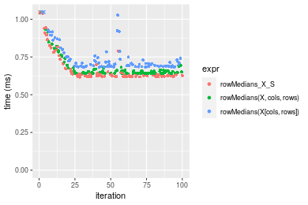
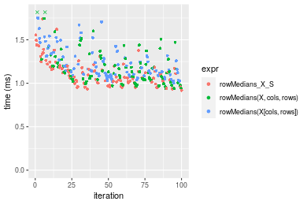
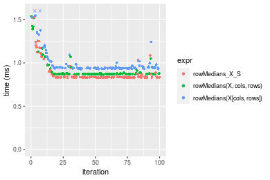

[matrixStats]: Benchmark report

---------------------------------------


# colMedians() and rowMedians() benchmarks on subsetted computation

This report benchmark the performance of colMedians() and rowMedians() on subsetted computation.


## Data type "integer"

### Data
```r
> rmatrix <- function(nrow, ncol, mode = c("logical", "double", "integer", "index"), range = c(-100, 
+     +100), na_prob = 0) {
+     mode <- match.arg(mode)
+     n <- nrow * ncol
+     if (mode == "logical") {
+         x <- sample(c(FALSE, TRUE), size = n, replace = TRUE)
+     }     else if (mode == "index") {
+         x <- seq_len(n)
+         mode <- "integer"
+     }     else {
+         x <- runif(n, min = range[1], max = range[2])
+     }
+     storage.mode(x) <- mode
+     if (na_prob > 0) 
+         x[sample(n, size = na_prob * n)] <- NA
+     dim(x) <- c(nrow, ncol)
+     x
+ }
> rmatrices <- function(scale = 10, seed = 1, ...) {
+     set.seed(seed)
+     data <- list()
+     data[[1]] <- rmatrix(nrow = scale * 1, ncol = scale * 1, ...)
+     data[[2]] <- rmatrix(nrow = scale * 10, ncol = scale * 10, ...)
+     data[[3]] <- rmatrix(nrow = scale * 100, ncol = scale * 1, ...)
+     data[[4]] <- t(data[[3]])
+     data[[5]] <- rmatrix(nrow = scale * 10, ncol = scale * 100, ...)
+     data[[6]] <- t(data[[5]])
+     names(data) <- sapply(data, FUN = function(x) paste(dim(x), collapse = "x"))
+     data
+ }
> data <- rmatrices(mode = mode)
```

### Results

#### 10x10 integer matrix


```r
> X <- data[["10x10"]]
> rows <- sample.int(nrow(X), size = nrow(X) * 0.7)
> cols <- sample.int(ncol(X), size = ncol(X) * 0.7)
> X_S <- X[rows, cols]
> gc()
           used  (Mb) gc trigger  (Mb) max used  (Mb)
Ncells  5261358 281.0    7916910 422.9  7916910 422.9
Vcells 10162638  77.6   33191153 253.3 53339345 407.0
> colStats <- microbenchmark(colMedians_X_S = colMedians(X_S, na.rm = FALSE), `colMedians(X, rows, cols)` = colMedians(X, 
+     rows = rows, cols = cols, na.rm = FALSE), `colMedians(X[rows, cols])` = colMedians(X[rows, cols], 
+     na.rm = FALSE), unit = "ms")
> X <- t(X)
> X_S <- t(X_S)
> gc()
           used  (Mb) gc trigger  (Mb) max used  (Mb)
Ncells  5248479 280.3    7916910 422.9  7916910 422.9
Vcells 10120101  77.3   33191153 253.3 53339345 407.0
> rowStats <- microbenchmark(rowMedians_X_S = rowMedians(X_S, na.rm = FALSE), `rowMedians(X, cols, rows)` = rowMedians(X, 
+     rows = cols, cols = rows, na.rm = FALSE), `rowMedians(X[cols, rows])` = rowMedians(X[cols, rows], 
+     na.rm = FALSE), unit = "ms")
```

_Table: Benchmarking of colMedians_X_S(), colMedians(X, rows, cols)() and colMedians(X[rows, cols])() on integer+10x10 data. The top panel shows times in milliseconds and the bottom panel shows relative times._


|   |expr                      |      min|        lq|      mean|    median|        uq|      max|
|:--|:-------------------------|--------:|---------:|---------:|---------:|---------:|--------:|
|1  |colMedians_X_S            | 0.002539| 0.0026150| 0.0029159| 0.0026825| 0.0028075| 0.020596|
|2  |colMedians(X, rows, cols) | 0.002845| 0.0029630| 0.0030915| 0.0030270| 0.0031540| 0.005979|
|3  |colMedians(X[rows, cols]) | 0.003396| 0.0036455| 0.0038512| 0.0037765| 0.0038855| 0.008260|


|   |expr                      |      min|       lq|     mean|   median|       uq|       max|
|:--|:-------------------------|--------:|--------:|--------:|--------:|--------:|---------:|
|1  |colMedians_X_S            | 1.000000| 1.000000| 1.000000| 1.000000| 1.000000| 1.0000000|
|2  |colMedians(X, rows, cols) | 1.120520| 1.133078| 1.060207| 1.128425| 1.123419| 0.2902991|
|3  |colMedians(X[rows, cols]) | 1.337535| 1.394073| 1.320767| 1.407828| 1.383971| 0.4010487|

_Table: Benchmarking of rowMedians_X_S(), rowMedians(X, cols, rows)() and rowMedians(X[cols, rows])() on integer+10x10 data (transposed). The top panel shows times in milliseconds and the bottom panel shows relative times._


|   |expr                      |      min|        lq|      mean|    median|        uq|      max|
|:--|:-------------------------|--------:|---------:|---------:|---------:|---------:|--------:|
|1  |rowMedians_X_S            | 0.002582| 0.0026555| 0.0027794| 0.0027055| 0.0028280| 0.005478|
|2  |rowMedians(X, cols, rows) | 0.002927| 0.0030785| 0.0033691| 0.0031330| 0.0032205| 0.022349|
|3  |rowMedians(X[cols, rows]) | 0.003506| 0.0037010| 0.0038899| 0.0037835| 0.0039360| 0.006272|


|   |expr                      |      min|       lq|     mean|   median|       uq|      max|
|:--|:-------------------------|--------:|--------:|--------:|--------:|--------:|--------:|
|1  |rowMedians_X_S            | 1.000000| 1.000000| 1.000000| 1.000000| 1.000000| 1.000000|
|2  |rowMedians(X, cols, rows) | 1.133617| 1.159292| 1.212178| 1.158011| 1.138791| 4.079774|
|3  |rowMedians(X[cols, rows]) | 1.357862| 1.393711| 1.399545| 1.398448| 1.391796| 1.144943|

_Figure: Benchmarking of colMedians_X_S(), colMedians(X, rows, cols)() and colMedians(X[rows, cols])() on integer+10x10 data  as well as rowMedians_X_S(), rowMedians(X, cols, rows)() and rowMedians(X[cols, rows])() on the same data transposed.  Outliers are displayed as crosses.  Times are in milliseconds._


_Table: Benchmarking of colMedians_X_S() and rowMedians_X_S() on integer+10x10 data (original and transposed).  The top panel shows times in milliseconds and the bottom panel shows relative times._


|   |expr           |   min|     lq|    mean| median|     uq|    max|
|:--|:--------------|-----:|------:|-------:|------:|------:|------:|
|1  |colMedians_X_S | 2.539| 2.6150| 2.91592| 2.6825| 2.8075| 20.596|
|2  |rowMedians_X_S | 2.582| 2.6555| 2.77941| 2.7055| 2.8280|  5.478|


|   |expr           |      min|       lq|      mean|   median|       uq|      max|
|:--|:--------------|--------:|--------:|---------:|--------:|--------:|--------:|
|1  |colMedians_X_S | 1.000000| 1.000000| 1.0000000| 1.000000| 1.000000| 1.000000|
|2  |rowMedians_X_S | 1.016936| 1.015488| 0.9531846| 1.008574| 1.007302| 0.265974|

_Figure: Benchmarking of colMedians_X_S() and rowMedians_X_S() on integer+10x10 data (original and transposed).  Outliers are displayed as crosses. Times are in milliseconds._


#### 100x100 integer matrix


```r
> X <- data[["100x100"]]
> rows <- sample.int(nrow(X), size = nrow(X) * 0.7)
> cols <- sample.int(ncol(X), size = ncol(X) * 0.7)
> X_S <- X[rows, cols]
> gc()
          used  (Mb) gc trigger  (Mb) max used  (Mb)
Ncells 5247066 280.3    7916910 422.9  7916910 422.9
Vcells 9788306  74.7   33191153 253.3 53339345 407.0
> colStats <- microbenchmark(colMedians_X_S = colMedians(X_S, na.rm = FALSE), `colMedians(X, rows, cols)` = colMedians(X, 
+     rows = rows, cols = cols, na.rm = FALSE), `colMedians(X[rows, cols])` = colMedians(X[rows, cols], 
+     na.rm = FALSE), unit = "ms")
> X <- t(X)
> X_S <- t(X_S)
> gc()
          used  (Mb) gc trigger  (Mb) max used  (Mb)
Ncells 5247060 280.3    7916910 422.9  7916910 422.9
Vcells 9793389  74.8   33191153 253.3 53339345 407.0
> rowStats <- microbenchmark(rowMedians_X_S = rowMedians(X_S, na.rm = FALSE), `rowMedians(X, cols, rows)` = rowMedians(X, 
+     rows = cols, cols = rows, na.rm = FALSE), `rowMedians(X[cols, rows])` = rowMedians(X[cols, rows], 
+     na.rm = FALSE), unit = "ms")
```

_Table: Benchmarking of colMedians_X_S(), colMedians(X, rows, cols)() and colMedians(X[rows, cols])() on integer+100x100 data. The top panel shows times in milliseconds and the bottom panel shows relative times._


|   |expr                      |      min|        lq|      mean|    median|        uq|      max|
|:--|:-------------------------|--------:|---------:|---------:|---------:|---------:|--------:|
|1  |colMedians_X_S            | 0.067030| 0.0697475| 0.0793841| 0.0764250| 0.0835475| 0.137287|
|2  |colMedians(X, rows, cols) | 0.068161| 0.0714950| 0.0804575| 0.0780000| 0.0861465| 0.133461|
|3  |colMedians(X[rows, cols]) | 0.077466| 0.0805995| 0.0896371| 0.0872435| 0.0966095| 0.148208|


|   |expr                      |      min|       lq|     mean|   median|       uq|       max|
|:--|:-------------------------|--------:|--------:|--------:|--------:|--------:|---------:|
|1  |colMedians_X_S            | 1.000000| 1.000000| 1.000000| 1.000000| 1.000000| 1.0000000|
|2  |colMedians(X, rows, cols) | 1.016873| 1.025055| 1.013521| 1.020608| 1.031108| 0.9721314|
|3  |colMedians(X[rows, cols]) | 1.155692| 1.155590| 1.129157| 1.141557| 1.156342| 1.0795487|

_Table: Benchmarking of rowMedians_X_S(), rowMedians(X, cols, rows)() and rowMedians(X[cols, rows])() on integer+100x100 data (transposed). The top panel shows times in milliseconds and the bottom panel shows relative times._


|   |expr                      |      min|       lq|      mean|    median|        uq|      max|
|:--|:-------------------------|--------:|--------:|---------:|---------:|---------:|--------:|
|1  |rowMedians_X_S            | 0.064076| 0.068283| 0.0754529| 0.0738020| 0.0816530| 0.105578|
|2  |rowMedians(X, cols, rows) | 0.067314| 0.070207| 0.0774424| 0.0762515| 0.0825315| 0.125626|
|3  |rowMedians(X[cols, rows]) | 0.074273| 0.078959| 0.0861093| 0.0847715| 0.0915495| 0.109607|


|   |expr                      |      min|       lq|     mean|   median|       uq|      max|
|:--|:-------------------------|--------:|--------:|--------:|--------:|--------:|--------:|
|1  |rowMedians_X_S            | 1.000000| 1.000000| 1.000000| 1.000000| 1.000000| 1.000000|
|2  |rowMedians(X, cols, rows) | 1.050534| 1.028177| 1.026368| 1.033190| 1.010759| 1.189888|
|3  |rowMedians(X[cols, rows]) | 1.159139| 1.156349| 1.141233| 1.148634| 1.121202| 1.038161|

_Figure: Benchmarking of colMedians_X_S(), colMedians(X, rows, cols)() and colMedians(X[rows, cols])() on integer+100x100 data  as well as rowMedians_X_S(), rowMedians(X, cols, rows)() and rowMedians(X[cols, rows])() on the same data transposed.  Outliers are displayed as crosses.  Times are in milliseconds._


_Table: Benchmarking of colMedians_X_S() and rowMedians_X_S() on integer+100x100 data (original and transposed).  The top panel shows times in milliseconds and the bottom panel shows relative times._


|   |expr           |    min|      lq|     mean| median|      uq|     max|
|:--|:--------------|------:|-------:|--------:|------:|-------:|-------:|
|2  |rowMedians_X_S | 64.076| 68.2830| 75.45288| 73.802| 81.6530| 105.578|
|1  |colMedians_X_S | 67.030| 69.7475| 79.38413| 76.425| 83.5475| 137.287|


|   |expr           |      min|       lq|     mean|   median|       uq|      max|
|:--|:--------------|--------:|--------:|--------:|--------:|--------:|--------:|
|2  |rowMedians_X_S | 1.000000| 1.000000| 1.000000| 1.000000| 1.000000| 1.000000|
|1  |colMedians_X_S | 1.046102| 1.021448| 1.052102| 1.035541| 1.023202| 1.300337|

_Figure: Benchmarking of colMedians_X_S() and rowMedians_X_S() on integer+100x100 data (original and transposed).  Outliers are displayed as crosses. Times are in milliseconds._


#### 1000x10 integer matrix


```r
> X <- data[["1000x10"]]
> rows <- sample.int(nrow(X), size = nrow(X) * 0.7)
> cols <- sample.int(ncol(X), size = ncol(X) * 0.7)
> X_S <- X[rows, cols]
> gc()
          used  (Mb) gc trigger  (Mb) max used  (Mb)
Ncells 5247808 280.3    7916910 422.9  7916910 422.9
Vcells 9792357  74.8   33191153 253.3 53339345 407.0
> colStats <- microbenchmark(colMedians_X_S = colMedians(X_S, na.rm = FALSE), `colMedians(X, rows, cols)` = colMedians(X, 
+     rows = rows, cols = cols, na.rm = FALSE), `colMedians(X[rows, cols])` = colMedians(X[rows, cols], 
+     na.rm = FALSE), unit = "ms")
> X <- t(X)
> X_S <- t(X_S)
> gc()
          used  (Mb) gc trigger  (Mb) max used  (Mb)
Ncells 5247802 280.3    7916910 422.9  7916910 422.9
Vcells 9797440  74.8   33191153 253.3 53339345 407.0
> rowStats <- microbenchmark(rowMedians_X_S = rowMedians(X_S, na.rm = FALSE), `rowMedians(X, cols, rows)` = rowMedians(X, 
+     rows = cols, cols = rows, na.rm = FALSE), `rowMedians(X[cols, rows])` = rowMedians(X[cols, rows], 
+     na.rm = FALSE), unit = "ms")
```

_Table: Benchmarking of colMedians_X_S(), colMedians(X, rows, cols)() and colMedians(X[rows, cols])() on integer+1000x10 data. The top panel shows times in milliseconds and the bottom panel shows relative times._


|   |expr                      |      min|        lq|      mean|    median|        uq|      max|
|:--|:-------------------------|--------:|---------:|---------:|---------:|---------:|--------:|
|1  |colMedians_X_S            | 0.051732| 0.0562565| 0.0601103| 0.0592305| 0.0639270| 0.076885|
|2  |colMedians(X, rows, cols) | 0.053468| 0.0567755| 0.0621583| 0.0610460| 0.0652130| 0.085031|
|3  |colMedians(X[rows, cols]) | 0.061557| 0.0647875| 0.0720022| 0.0692910| 0.0763975| 0.125133|


|   |expr                      |      min|       lq|     mean|   median|       uq|      max|
|:--|:-------------------------|--------:|--------:|--------:|--------:|--------:|--------:|
|1  |colMedians_X_S            | 1.000000| 1.000000| 1.000000| 1.000000| 1.000000| 1.000000|
|2  |colMedians(X, rows, cols) | 1.033558| 1.009226| 1.034070| 1.030651| 1.020117| 1.105950|
|3  |colMedians(X[rows, cols]) | 1.189921| 1.151645| 1.197834| 1.169853| 1.195074| 1.627535|

_Table: Benchmarking of rowMedians_X_S(), rowMedians(X, cols, rows)() and rowMedians(X[cols, rows])() on integer+1000x10 data (transposed). The top panel shows times in milliseconds and the bottom panel shows relative times._


|   |expr                      |      min|       lq|      mean|    median|        uq|      max|
|:--|:-------------------------|--------:|--------:|---------:|---------:|---------:|--------:|
|1  |rowMedians_X_S            | 0.051167| 0.055490| 0.0597463| 0.0583290| 0.0625435| 0.083070|
|2  |rowMedians(X, cols, rows) | 0.053707| 0.058568| 0.0627956| 0.0630935| 0.0667320| 0.076504|
|3  |rowMedians(X[cols, rows]) | 0.063305| 0.068806| 0.0744493| 0.0742565| 0.0788030| 0.131429|


|   |expr                      |      min|       lq|     mean|   median|       uq|       max|
|:--|:-------------------------|--------:|--------:|--------:|--------:|--------:|---------:|
|1  |rowMedians_X_S            | 1.000000| 1.000000| 1.000000| 1.000000| 1.000000| 1.0000000|
|2  |rowMedians(X, cols, rows) | 1.049641| 1.055470| 1.051037| 1.081683| 1.066969| 0.9209582|
|3  |rowMedians(X[cols, rows]) | 1.237223| 1.239971| 1.246091| 1.273063| 1.259971| 1.5821476|

_Figure: Benchmarking of colMedians_X_S(), colMedians(X, rows, cols)() and colMedians(X[rows, cols])() on integer+1000x10 data  as well as rowMedians_X_S(), rowMedians(X, cols, rows)() and rowMedians(X[cols, rows])() on the same data transposed.  Outliers are displayed as crosses.  Times are in milliseconds._


_Table: Benchmarking of colMedians_X_S() and rowMedians_X_S() on integer+1000x10 data (original and transposed).  The top panel shows times in milliseconds and the bottom panel shows relative times._


|   |expr           |    min|      lq|     mean|  median|      uq|    max|
|:--|:--------------|------:|-------:|--------:|-------:|-------:|------:|
|2  |rowMedians_X_S | 51.167| 55.4900| 59.74629| 58.3290| 62.5435| 83.070|
|1  |colMedians_X_S | 51.732| 56.2565| 60.11033| 59.2305| 63.9270| 76.885|


|   |expr           |      min|       lq|     mean|   median|       uq|       max|
|:--|:--------------|--------:|--------:|--------:|--------:|--------:|---------:|
|2  |rowMedians_X_S | 1.000000| 1.000000| 1.000000| 1.000000| 1.000000| 1.0000000|
|1  |colMedians_X_S | 1.011042| 1.013813| 1.006093| 1.015455| 1.022121| 0.9255447|

_Figure: Benchmarking of colMedians_X_S() and rowMedians_X_S() on integer+1000x10 data (original and transposed).  Outliers are displayed as crosses. Times are in milliseconds._


#### 10x1000 integer matrix


```r
> X <- data[["10x1000"]]
> rows <- sample.int(nrow(X), size = nrow(X) * 0.7)
> cols <- sample.int(ncol(X), size = ncol(X) * 0.7)
> X_S <- X[rows, cols]
> gc()
          used  (Mb) gc trigger  (Mb) max used  (Mb)
Ncells 5248012 280.3    7916910 422.9  7916910 422.9
Vcells 9793238  74.8   33191153 253.3 53339345 407.0
> colStats <- microbenchmark(colMedians_X_S = colMedians(X_S, na.rm = FALSE), `colMedians(X, rows, cols)` = colMedians(X, 
+     rows = rows, cols = cols, na.rm = FALSE), `colMedians(X[rows, cols])` = colMedians(X[rows, cols], 
+     na.rm = FALSE), unit = "ms")
> X <- t(X)
> X_S <- t(X_S)
> gc()
          used  (Mb) gc trigger  (Mb) max used  (Mb)
Ncells 5248006 280.3    7916910 422.9  7916910 422.9
Vcells 9798321  74.8   33191153 253.3 53339345 407.0
> rowStats <- microbenchmark(rowMedians_X_S = rowMedians(X_S, na.rm = FALSE), `rowMedians(X, cols, rows)` = rowMedians(X, 
+     rows = cols, cols = rows, na.rm = FALSE), `rowMedians(X[cols, rows])` = rowMedians(X[cols, rows], 
+     na.rm = FALSE), unit = "ms")
```

_Table: Benchmarking of colMedians_X_S(), colMedians(X, rows, cols)() and colMedians(X[rows, cols])() on integer+10x1000 data. The top panel shows times in milliseconds and the bottom panel shows relative times._


|   |expr                      |      min|        lq|      mean|   median|       uq|      max|
|:--|:-------------------------|--------:|---------:|---------:|--------:|--------:|--------:|
|1  |colMedians_X_S            | 0.053946| 0.0605370| 0.0657424| 0.065430| 0.069156| 0.110516|
|2  |colMedians(X, rows, cols) | 0.060174| 0.0642105| 0.0707670| 0.069485| 0.075568| 0.101287|
|3  |colMedians(X[rows, cols]) | 0.065230| 0.0734625| 0.0791696| 0.079116| 0.084034| 0.099485|


|   |expr                      |      min|       lq|     mean|   median|       uq|       max|
|:--|:-------------------------|--------:|--------:|--------:|--------:|--------:|---------:|
|1  |colMedians_X_S            | 1.000000| 1.000000| 1.000000| 1.000000| 1.000000| 1.0000000|
|2  |colMedians(X, rows, cols) | 1.115449| 1.060682| 1.076428| 1.061975| 1.092718| 0.9164917|
|3  |colMedians(X[rows, cols]) | 1.209172| 1.213514| 1.204239| 1.209170| 1.215137| 0.9001864|

_Table: Benchmarking of rowMedians_X_S(), rowMedians(X, cols, rows)() and rowMedians(X[cols, rows])() on integer+10x1000 data (transposed). The top panel shows times in milliseconds and the bottom panel shows relative times._


|   |expr                      |      min|        lq|      mean|    median|        uq|      max|
|:--|:-------------------------|--------:|---------:|---------:|---------:|---------:|--------:|
|1  |rowMedians_X_S            | 0.055236| 0.0613350| 0.0655234| 0.0646645| 0.0693605| 0.092072|
|2  |rowMedians(X, cols, rows) | 0.056363| 0.0670275| 0.0725988| 0.0713910| 0.0785210| 0.118767|
|3  |rowMedians(X[cols, rows]) | 0.064038| 0.0714920| 0.0778549| 0.0770710| 0.0842430| 0.099946|


|   |expr                      |      min|       lq|     mean|   median|       uq|      max|
|:--|:-------------------------|--------:|--------:|--------:|--------:|--------:|--------:|
|1  |rowMedians_X_S            | 1.000000| 1.000000| 1.000000| 1.000000| 1.000000| 1.000000|
|2  |rowMedians(X, cols, rows) | 1.020403| 1.092810| 1.107983| 1.104021| 1.132071| 1.289936|
|3  |rowMedians(X[cols, rows]) | 1.159353| 1.165599| 1.188201| 1.191860| 1.214567| 1.085520|

_Figure: Benchmarking of colMedians_X_S(), colMedians(X, rows, cols)() and colMedians(X[rows, cols])() on integer+10x1000 data  as well as rowMedians_X_S(), rowMedians(X, cols, rows)() and rowMedians(X[cols, rows])() on the same data transposed.  Outliers are displayed as crosses.  Times are in milliseconds._


_Table: Benchmarking of colMedians_X_S() and rowMedians_X_S() on integer+10x1000 data (original and transposed).  The top panel shows times in milliseconds and the bottom panel shows relative times._


|   |expr           |    min|     lq|     mean|  median|      uq|     max|
|:--|:--------------|------:|------:|--------:|-------:|-------:|-------:|
|2  |rowMedians_X_S | 55.236| 61.335| 65.52338| 64.6645| 69.3605|  92.072|
|1  |colMedians_X_S | 53.946| 60.537| 65.74241| 65.4300| 69.1560| 110.516|


|   |expr           |       min|        lq|     mean|   median|        uq|      max|
|:--|:--------------|---------:|---------:|--------:|--------:|---------:|--------:|
|2  |rowMedians_X_S | 1.0000000| 1.0000000| 1.000000| 1.000000| 1.0000000| 1.000000|
|1  |colMedians_X_S | 0.9766457| 0.9869895| 1.003343| 1.011838| 0.9970516| 1.200322|

_Figure: Benchmarking of colMedians_X_S() and rowMedians_X_S() on integer+10x1000 data (original and transposed).  Outliers are displayed as crosses. Times are in milliseconds._


#### 100x1000 integer matrix


```r
> X <- data[["100x1000"]]
> rows <- sample.int(nrow(X), size = nrow(X) * 0.7)
> cols <- sample.int(ncol(X), size = ncol(X) * 0.7)
> X_S <- X[rows, cols]
> gc()
          used  (Mb) gc trigger  (Mb) max used  (Mb)
Ncells 5248225 280.3    7916910 422.9  7916910 422.9
Vcells 9815924  74.9   33191153 253.3 53339345 407.0
> colStats <- microbenchmark(colMedians_X_S = colMedians(X_S, na.rm = FALSE), `colMedians(X, rows, cols)` = colMedians(X, 
+     rows = rows, cols = cols, na.rm = FALSE), `colMedians(X[rows, cols])` = colMedians(X[rows, cols], 
+     na.rm = FALSE), unit = "ms")
> X <- t(X)
> X_S <- t(X_S)
> gc()
          used  (Mb) gc trigger  (Mb) max used  (Mb)
Ncells 5248219 280.3    7916910 422.9  7916910 422.9
Vcells 9866007  75.3   33191153 253.3 53339345 407.0
> rowStats <- microbenchmark(rowMedians_X_S = rowMedians(X_S, na.rm = FALSE), `rowMedians(X, cols, rows)` = rowMedians(X, 
+     rows = cols, cols = rows, na.rm = FALSE), `rowMedians(X[cols, rows])` = rowMedians(X[cols, rows], 
+     na.rm = FALSE), unit = "ms")
```

_Table: Benchmarking of colMedians_X_S(), colMedians(X, rows, cols)() and colMedians(X[rows, cols])() on integer+100x1000 data. The top panel shows times in milliseconds and the bottom panel shows relative times._


|   |expr                      |      min|        lq|      mean|    median|       uq|      max|
|:--|:-------------------------|--------:|---------:|---------:|---------:|--------:|--------:|
|1  |colMedians_X_S            | 0.617813| 0.6192955| 0.6433942| 0.6204390| 0.625912| 0.866421|
|2  |colMedians(X, rows, cols) | 0.625488| 0.6277925| 0.6480555| 0.6292565| 0.635836| 0.913809|
|3  |colMedians(X[rows, cols]) | 0.685097| 0.6870250| 0.7164150| 0.6883195| 0.703381| 0.916572|


|   |expr                      |      min|       lq|     mean|   median|       uq|      max|
|:--|:-------------------------|--------:|--------:|--------:|--------:|--------:|--------:|
|1  |colMedians_X_S            | 1.000000| 1.000000| 1.000000| 1.000000| 1.000000| 1.000000|
|2  |colMedians(X, rows, cols) | 1.012423| 1.013720| 1.007245| 1.014212| 1.015855| 1.054694|
|3  |colMedians(X[rows, cols]) | 1.108907| 1.109365| 1.113493| 1.109407| 1.123770| 1.057883|

_Table: Benchmarking of rowMedians_X_S(), rowMedians(X, cols, rows)() and rowMedians(X[cols, rows])() on integer+100x1000 data (transposed). The top panel shows times in milliseconds and the bottom panel shows relative times._


|   |expr                      |      min|        lq|      mean|    median|        uq|      max|
|:--|:-------------------------|--------:|---------:|---------:|---------:|---------:|--------:|
|1  |rowMedians_X_S            | 0.617588| 0.6217030| 0.6845461| 0.6335880| 0.6729925| 1.095878|
|2  |rowMedians(X, cols, rows) | 0.639315| 0.6420035| 0.6794513| 0.6485915| 0.6680865| 1.266033|
|3  |rowMedians(X[cols, rows]) | 0.682908| 0.6888280| 0.7544767| 0.7046215| 0.7500345| 1.149237|


|   |expr                      |      min|       lq|      mean|   median|        uq|      max|
|:--|:-------------------------|--------:|--------:|---------:|--------:|---------:|--------:|
|1  |rowMedians_X_S            | 1.000000| 1.000000| 1.0000000| 1.000000| 1.0000000| 1.000000|
|2  |rowMedians(X, cols, rows) | 1.035180| 1.032653| 0.9925574| 1.023680| 0.9927102| 1.155268|
|3  |rowMedians(X[cols, rows]) | 1.105766| 1.107970| 1.1021562| 1.112113| 1.1144768| 1.048691|

_Figure: Benchmarking of colMedians_X_S(), colMedians(X, rows, cols)() and colMedians(X[rows, cols])() on integer+100x1000 data  as well as rowMedians_X_S(), rowMedians(X, cols, rows)() and rowMedians(X[cols, rows])() on the same data transposed.  Outliers are displayed as crosses.  Times are in milliseconds._



_Table: Benchmarking of colMedians_X_S() and rowMedians_X_S() on integer+100x1000 data (original and transposed).  The top panel shows times in milliseconds and the bottom panel shows relative times._


|   |expr           |     min|       lq|     mean|  median|       uq|      max|
|:--|:--------------|-------:|--------:|--------:|-------:|--------:|--------:|
|1  |colMedians_X_S | 617.813| 619.2955| 643.3942| 620.439| 625.9120|  866.421|
|2  |rowMedians_X_S | 617.588| 621.7030| 684.5461| 633.588| 672.9925| 1095.878|


|   |expr           |       min|       lq|     mean|   median|       uq|      max|
|:--|:--------------|---------:|--------:|--------:|--------:|--------:|--------:|
|1  |colMedians_X_S | 1.0000000| 1.000000| 1.000000| 1.000000| 1.000000| 1.000000|
|2  |rowMedians_X_S | 0.9996358| 1.003888| 1.063961| 1.021193| 1.075219| 1.264833|

_Figure: Benchmarking of colMedians_X_S() and rowMedians_X_S() on integer+100x1000 data (original and transposed).  Outliers are displayed as crosses. Times are in milliseconds._


#### 1000x100 integer matrix


```r
> X <- data[["1000x100"]]
> rows <- sample.int(nrow(X), size = nrow(X) * 0.7)
> cols <- sample.int(ncol(X), size = ncol(X) * 0.7)
> X_S <- X[rows, cols]
> gc()
          used  (Mb) gc trigger  (Mb) max used  (Mb)
Ncells 5248435 280.3    7916910 422.9  7916910 422.9
Vcells 9816719  74.9   33191153 253.3 53339345 407.0
> colStats <- microbenchmark(colMedians_X_S = colMedians(X_S, na.rm = FALSE), `colMedians(X, rows, cols)` = colMedians(X, 
+     rows = rows, cols = cols, na.rm = FALSE), `colMedians(X[rows, cols])` = colMedians(X[rows, cols], 
+     na.rm = FALSE), unit = "ms")
> X <- t(X)
> X_S <- t(X_S)
> gc()
          used  (Mb) gc trigger  (Mb) max used  (Mb)
Ncells 5248429 280.3    7916910 422.9  7916910 422.9
Vcells 9866802  75.3   33191153 253.3 53339345 407.0
> rowStats <- microbenchmark(rowMedians_X_S = rowMedians(X_S, na.rm = FALSE), `rowMedians(X, cols, rows)` = rowMedians(X, 
+     rows = cols, cols = rows, na.rm = FALSE), `rowMedians(X[cols, rows])` = rowMedians(X[cols, rows], 
+     na.rm = FALSE), unit = "ms")
```

_Table: Benchmarking of colMedians_X_S(), colMedians(X, rows, cols)() and colMedians(X[rows, cols])() on integer+1000x100 data. The top panel shows times in milliseconds and the bottom panel shows relative times._


|   |expr                      |      min|        lq|      mean|    median|        uq|      max|
|:--|:-------------------------|--------:|---------:|---------:|---------:|---------:|--------:|
|1  |colMedians_X_S            | 0.524673| 0.5284170| 0.6080464| 0.5625435| 0.6194565| 1.118931|
|2  |colMedians(X, rows, cols) | 0.531137| 0.5425495| 0.6333145| 0.5776520| 0.6754200| 1.172393|
|3  |colMedians(X[rows, cols]) | 0.588329| 0.6008250| 0.7059546| 0.6505860| 0.7684900| 1.324848|


|   |expr                      |      min|       lq|     mean|   median|       uq|     max|
|:--|:-------------------------|--------:|--------:|--------:|--------:|--------:|-------:|
|1  |colMedians_X_S            | 1.000000| 1.000000| 1.000000| 1.000000| 1.000000| 1.00000|
|2  |colMedians(X, rows, cols) | 1.012320| 1.026745| 1.041556| 1.026857| 1.090343| 1.04778|
|3  |colMedians(X[rows, cols]) | 1.121325| 1.137028| 1.161021| 1.156508| 1.240587| 1.18403|

_Table: Benchmarking of rowMedians_X_S(), rowMedians(X, cols, rows)() and rowMedians(X[cols, rows])() on integer+1000x100 data (transposed). The top panel shows times in milliseconds and the bottom panel shows relative times._


|   |expr                      |      min|        lq|      mean|    median|        uq|      max|
|:--|:-------------------------|--------:|---------:|---------:|---------:|---------:|--------:|
|1  |rowMedians_X_S            | 0.526715| 0.5290245| 0.5710529| 0.5335425| 0.5847075| 0.836033|
|2  |rowMedians(X, cols, rows) | 0.551788| 0.5546635| 0.5970884| 0.5592390| 0.5949400| 0.969852|
|3  |rowMedians(X[cols, rows]) | 0.595780| 0.6022510| 0.6614477| 0.6136995| 0.6897845| 1.015102|


|   |expr                      |      min|       lq|     mean|   median|       uq|      max|
|:--|:-------------------------|--------:|--------:|--------:|--------:|--------:|--------:|
|1  |rowMedians_X_S            | 1.000000| 1.000000| 1.000000| 1.000000| 1.000000| 1.000000|
|2  |rowMedians(X, cols, rows) | 1.047603| 1.048465| 1.045592| 1.048162| 1.017500| 1.160064|
|3  |rowMedians(X[cols, rows]) | 1.131124| 1.138418| 1.158295| 1.150235| 1.179709| 1.214189|

_Figure: Benchmarking of colMedians_X_S(), colMedians(X, rows, cols)() and colMedians(X[rows, cols])() on integer+1000x100 data  as well as rowMedians_X_S(), rowMedians(X, cols, rows)() and rowMedians(X[cols, rows])() on the same data transposed.  Outliers are displayed as crosses.  Times are in milliseconds._


_Table: Benchmarking of colMedians_X_S() and rowMedians_X_S() on integer+1000x100 data (original and transposed).  The top panel shows times in milliseconds and the bottom panel shows relative times._


|   |expr           |     min|       lq|     mean|   median|       uq|      max|
|:--|:--------------|-------:|--------:|--------:|--------:|--------:|--------:|
|2  |rowMedians_X_S | 526.715| 529.0245| 571.0529| 533.5425| 584.7075|  836.033|
|1  |colMedians_X_S | 524.673| 528.4170| 608.0465| 562.5435| 619.4565| 1118.931|


|   |expr           |       min|        lq|     mean|   median|      uq|      max|
|:--|:--------------|---------:|---------:|--------:|--------:|-------:|--------:|
|2  |rowMedians_X_S | 1.0000000| 1.0000000| 1.000000| 1.000000| 1.00000| 1.000000|
|1  |colMedians_X_S | 0.9961231| 0.9988517| 1.064781| 1.054356| 1.05943| 1.338381|

_Figure: Benchmarking of colMedians_X_S() and rowMedians_X_S() on integer+1000x100 data (original and transposed).  Outliers are displayed as crosses. Times are in milliseconds._


## Data type "double"

### Data
```r
> rmatrix <- function(nrow, ncol, mode = c("logical", "double", "integer", "index"), range = c(-100, 
+     +100), na_prob = 0) {
+     mode <- match.arg(mode)
+     n <- nrow * ncol
+     if (mode == "logical") {
+         x <- sample(c(FALSE, TRUE), size = n, replace = TRUE)
+     }     else if (mode == "index") {
+         x <- seq_len(n)
+         mode <- "integer"
+     }     else {
+         x <- runif(n, min = range[1], max = range[2])
+     }
+     storage.mode(x) <- mode
+     if (na_prob > 0) 
+         x[sample(n, size = na_prob * n)] <- NA
+     dim(x) <- c(nrow, ncol)
+     x
+ }
> rmatrices <- function(scale = 10, seed = 1, ...) {
+     set.seed(seed)
+     data <- list()
+     data[[1]] <- rmatrix(nrow = scale * 1, ncol = scale * 1, ...)
+     data[[2]] <- rmatrix(nrow = scale * 10, ncol = scale * 10, ...)
+     data[[3]] <- rmatrix(nrow = scale * 100, ncol = scale * 1, ...)
+     data[[4]] <- t(data[[3]])
+     data[[5]] <- rmatrix(nrow = scale * 10, ncol = scale * 100, ...)
+     data[[6]] <- t(data[[5]])
+     names(data) <- sapply(data, FUN = function(x) paste(dim(x), collapse = "x"))
+     data
+ }
> data <- rmatrices(mode = mode)
```

### Results

#### 10x10 double matrix


```r
> X <- data[["10x10"]]
> rows <- sample.int(nrow(X), size = nrow(X) * 0.7)
> cols <- sample.int(ncol(X), size = ncol(X) * 0.7)
> X_S <- X[rows, cols]
> gc()
          used  (Mb) gc trigger  (Mb) max used  (Mb)
Ncells 5248654 280.4    7916910 422.9  7916910 422.9
Vcells 9907851  75.6   33191153 253.3 53339345 407.0
> colStats <- microbenchmark(colMedians_X_S = colMedians(X_S, na.rm = FALSE), `colMedians(X, rows, cols)` = colMedians(X, 
+     rows = rows, cols = cols, na.rm = FALSE), `colMedians(X[rows, cols])` = colMedians(X[rows, cols], 
+     na.rm = FALSE), unit = "ms")
> X <- t(X)
> X_S <- t(X_S)
> gc()
          used  (Mb) gc trigger  (Mb) max used  (Mb)
Ncells 5248639 280.4    7916910 422.9  7916910 422.9
Vcells 9908019  75.6   33191153 253.3 53339345 407.0
> rowStats <- microbenchmark(rowMedians_X_S = rowMedians(X_S, na.rm = FALSE), `rowMedians(X, cols, rows)` = rowMedians(X, 
+     rows = cols, cols = rows, na.rm = FALSE), `rowMedians(X[cols, rows])` = rowMedians(X[cols, rows], 
+     na.rm = FALSE), unit = "ms")
```

_Table: Benchmarking of colMedians_X_S(), colMedians(X, rows, cols)() and colMedians(X[rows, cols])() on double+10x10 data. The top panel shows times in milliseconds and the bottom panel shows relative times._


|   |expr                      |      min|        lq|      mean|    median|        uq|      max|
|:--|:-------------------------|--------:|---------:|---------:|---------:|---------:|--------:|
|1  |colMedians_X_S            | 0.002866| 0.0029550| 0.0032791| 0.0030360| 0.0031385| 0.022626|
|2  |colMedians(X, rows, cols) | 0.003050| 0.0032545| 0.0034643| 0.0033360| 0.0034415| 0.010705|
|3  |colMedians(X[rows, cols]) | 0.003830| 0.0040550| 0.0043854| 0.0041545| 0.0042640| 0.019014|


|   |expr                      |      min|       lq|     mean|   median|       uq|       max|
|:--|:-------------------------|--------:|--------:|--------:|--------:|--------:|---------:|
|1  |colMedians_X_S            | 1.000000| 1.000000| 1.000000| 1.000000| 1.000000| 1.0000000|
|2  |colMedians(X, rows, cols) | 1.064201| 1.101354| 1.056488| 1.098814| 1.096543| 0.4731283|
|3  |colMedians(X[rows, cols]) | 1.336357| 1.372250| 1.337369| 1.368412| 1.358611| 0.8403606|

_Table: Benchmarking of rowMedians_X_S(), rowMedians(X, cols, rows)() and rowMedians(X[cols, rows])() on double+10x10 data (transposed). The top panel shows times in milliseconds and the bottom panel shows relative times._


|   |expr                      |      min|        lq|      mean|    median|        uq|      max|
|:--|:-------------------------|--------:|---------:|---------:|---------:|---------:|--------:|
|1  |rowMedians_X_S            | 0.002877| 0.0030065| 0.0031335| 0.0030585| 0.0031765| 0.006756|
|2  |rowMedians(X, cols, rows) | 0.003057| 0.0033045| 0.0036690| 0.0033760| 0.0035090| 0.027124|
|3  |rowMedians(X[cols, rows]) | 0.003871| 0.0041005| 0.0042870| 0.0041935| 0.0043220| 0.007832|


|   |expr                      |      min|       lq|     mean|   median|       uq|      max|
|:--|:-------------------------|--------:|--------:|--------:|--------:|--------:|--------:|
|1  |rowMedians_X_S            | 1.000000| 1.000000| 1.000000| 1.000000| 1.000000| 1.000000|
|2  |rowMedians(X, cols, rows) | 1.062565| 1.099119| 1.170893| 1.103809| 1.104675| 4.014802|
|3  |rowMedians(X[cols, rows]) | 1.345499| 1.363878| 1.368101| 1.371097| 1.360617| 1.159266|

_Figure: Benchmarking of colMedians_X_S(), colMedians(X, rows, cols)() and colMedians(X[rows, cols])() on double+10x10 data  as well as rowMedians_X_S(), rowMedians(X, cols, rows)() and rowMedians(X[cols, rows])() on the same data transposed.  Outliers are displayed as crosses.  Times are in milliseconds._


_Table: Benchmarking of colMedians_X_S() and rowMedians_X_S() on double+10x10 data (original and transposed).  The top panel shows times in milliseconds and the bottom panel shows relative times._


|   |expr           |   min|     lq|    mean| median|     uq|    max|
|:--|:--------------|-----:|------:|-------:|------:|------:|------:|
|1  |colMedians_X_S | 2.866| 2.9550| 3.27911| 3.0360| 3.1385| 22.626|
|2  |rowMedians_X_S | 2.877| 3.0065| 3.13354| 3.0585| 3.1765|  6.756|


|   |expr           |      min|       lq|      mean|   median|       uq|       max|
|:--|:--------------|--------:|--------:|---------:|--------:|--------:|---------:|
|1  |colMedians_X_S | 1.000000| 1.000000| 1.0000000| 1.000000| 1.000000| 1.0000000|
|2  |rowMedians_X_S | 1.003838| 1.017428| 0.9556069| 1.007411| 1.012108| 0.2985945|

_Figure: Benchmarking of colMedians_X_S() and rowMedians_X_S() on double+10x10 data (original and transposed).  Outliers are displayed as crosses. Times are in milliseconds._


#### 100x100 double matrix


```r
> X <- data[["100x100"]]
> rows <- sample.int(nrow(X), size = nrow(X) * 0.7)
> cols <- sample.int(ncol(X), size = ncol(X) * 0.7)
> X_S <- X[rows, cols]
> gc()
          used  (Mb) gc trigger  (Mb) max used  (Mb)
Ncells 5248852 280.4    7916910 422.9  7916910 422.9
Vcells 9913818  75.7   33191153 253.3 53339345 407.0
> colStats <- microbenchmark(colMedians_X_S = colMedians(X_S, na.rm = FALSE), `colMedians(X, rows, cols)` = colMedians(X, 
+     rows = rows, cols = cols, na.rm = FALSE), `colMedians(X[rows, cols])` = colMedians(X[rows, cols], 
+     na.rm = FALSE), unit = "ms")
> X <- t(X)
> X_S <- t(X_S)
> gc()
          used  (Mb) gc trigger  (Mb) max used  (Mb)
Ncells 5248846 280.4    7916910 422.9  7916910 422.9
Vcells 9923901  75.8   33191153 253.3 53339345 407.0
> rowStats <- microbenchmark(rowMedians_X_S = rowMedians(X_S, na.rm = FALSE), `rowMedians(X, cols, rows)` = rowMedians(X, 
+     rows = cols, cols = rows, na.rm = FALSE), `rowMedians(X[cols, rows])` = rowMedians(X[cols, rows], 
+     na.rm = FALSE), unit = "ms")
```

_Table: Benchmarking of colMedians_X_S(), colMedians(X, rows, cols)() and colMedians(X[rows, cols])() on double+100x100 data. The top panel shows times in milliseconds and the bottom panel shows relative times._


|   |expr                      |      min|       lq|      mean|    median|        uq|      max|
|:--|:-------------------------|--------:|--------:|---------:|---------:|---------:|--------:|
|1  |colMedians_X_S            | 0.103994| 0.110689| 0.1200387| 0.1141755| 0.1265470| 0.157468|
|2  |colMedians(X, rows, cols) | 0.106586| 0.111645| 0.1205535| 0.1155800| 0.1283115| 0.152400|
|3  |colMedians(X[rows, cols]) | 0.116216| 0.123479| 0.1347654| 0.1280850| 0.1460190| 0.195296|


|   |expr                      |      min|       lq|     mean|   median|       uq|       max|
|:--|:-------------------------|--------:|--------:|--------:|--------:|--------:|---------:|
|1  |colMedians_X_S            | 1.000000| 1.000000| 1.000000| 1.000000| 1.000000| 1.0000000|
|2  |colMedians(X, rows, cols) | 1.024925| 1.008637| 1.004289| 1.012301| 1.013943| 0.9678157|
|3  |colMedians(X[rows, cols]) | 1.117526| 1.115549| 1.122683| 1.121826| 1.153872| 1.2402266|

_Table: Benchmarking of rowMedians_X_S(), rowMedians(X, cols, rows)() and rowMedians(X[cols, rows])() on double+100x100 data (transposed). The top panel shows times in milliseconds and the bottom panel shows relative times._


|   |expr                      |      min|        lq|      mean|    median|        uq|      max|
|:--|:-------------------------|--------:|---------:|---------:|---------:|---------:|--------:|
|1  |rowMedians_X_S            | 0.109658| 0.1139415| 0.1283539| 0.1256335| 0.1385855| 0.179993|
|2  |rowMedians(X, cols, rows) | 0.110766| 0.1156400| 0.1304482| 0.1278560| 0.1392520| 0.201395|
|3  |rowMedians(X[cols, rows]) | 0.122515| 0.1281795| 0.1444028| 0.1414955| 0.1576605| 0.193491|


|   |expr                      |      min|       lq|     mean|   median|       uq|      max|
|:--|:-------------------------|--------:|--------:|--------:|--------:|--------:|--------:|
|1  |rowMedians_X_S            | 1.000000| 1.000000| 1.000000| 1.000000| 1.000000| 1.000000|
|2  |rowMedians(X, cols, rows) | 1.010104| 1.014907| 1.016317| 1.017690| 1.004809| 1.118905|
|3  |rowMedians(X[cols, rows]) | 1.117246| 1.124959| 1.125037| 1.126256| 1.137641| 1.074992|

_Figure: Benchmarking of colMedians_X_S(), colMedians(X, rows, cols)() and colMedians(X[rows, cols])() on double+100x100 data  as well as rowMedians_X_S(), rowMedians(X, cols, rows)() and rowMedians(X[cols, rows])() on the same data transposed.  Outliers are displayed as crosses.  Times are in milliseconds._


_Table: Benchmarking of colMedians_X_S() and rowMedians_X_S() on double+100x100 data (original and transposed).  The top panel shows times in milliseconds and the bottom panel shows relative times._


|   |expr           |     min|       lq|     mean|   median|       uq|     max|
|:--|:--------------|-------:|--------:|--------:|--------:|--------:|-------:|
|1  |colMedians_X_S | 103.994| 110.6890| 120.0387| 114.1755| 126.5470| 157.468|
|2  |rowMedians_X_S | 109.658| 113.9415| 128.3539| 125.6335| 138.5855| 179.993|


|   |expr           |      min|       lq|     mean|   median|       uq|      max|
|:--|:--------------|--------:|--------:|--------:|--------:|--------:|--------:|
|1  |colMedians_X_S | 1.000000| 1.000000| 1.000000| 1.000000| 1.000000| 1.000000|
|2  |rowMedians_X_S | 1.054465| 1.029384| 1.069271| 1.100354| 1.095131| 1.143045|

_Figure: Benchmarking of colMedians_X_S() and rowMedians_X_S() on double+100x100 data (original and transposed).  Outliers are displayed as crosses. Times are in milliseconds._


#### 1000x10 double matrix


```r
> X <- data[["1000x10"]]
> rows <- sample.int(nrow(X), size = nrow(X) * 0.7)
> cols <- sample.int(ncol(X), size = ncol(X) * 0.7)
> X_S <- X[rows, cols]
> gc()
          used  (Mb) gc trigger  (Mb) max used  (Mb)
Ncells 5249051 280.4    7916910 422.9  7916910 422.9
Vcells 9915238  75.7   33191153 253.3 53339345 407.0
> colStats <- microbenchmark(colMedians_X_S = colMedians(X_S, na.rm = FALSE), `colMedians(X, rows, cols)` = colMedians(X, 
+     rows = rows, cols = cols, na.rm = FALSE), `colMedians(X[rows, cols])` = colMedians(X[rows, cols], 
+     na.rm = FALSE), unit = "ms")
> X <- t(X)
> X_S <- t(X_S)
> gc()
          used  (Mb) gc trigger  (Mb) max used  (Mb)
Ncells 5249045 280.4    7916910 422.9  7916910 422.9
Vcells 9925321  75.8   33191153 253.3 53339345 407.0
> rowStats <- microbenchmark(rowMedians_X_S = rowMedians(X_S, na.rm = FALSE), `rowMedians(X, cols, rows)` = rowMedians(X, 
+     rows = cols, cols = rows, na.rm = FALSE), `rowMedians(X[cols, rows])` = rowMedians(X[cols, rows], 
+     na.rm = FALSE), unit = "ms")
```

_Table: Benchmarking of colMedians_X_S(), colMedians(X, rows, cols)() and colMedians(X[rows, cols])() on double+1000x10 data. The top panel shows times in milliseconds and the bottom panel shows relative times._


|   |expr                      |      min|       lq|      mean|    median|        uq|      max|
|:--|:-------------------------|--------:|--------:|---------:|---------:|---------:|--------:|
|2  |colMedians(X, rows, cols) | 0.101813| 0.108786| 0.1170997| 0.1125975| 0.1253585| 0.152606|
|1  |colMedians_X_S            | 0.099749| 0.107163| 0.1173915| 0.1126875| 0.1271455| 0.141702|
|3  |colMedians(X[rows, cols]) | 0.112376| 0.116818| 0.1292413| 0.1242275| 0.1409765| 0.192323|


|   |expr                      |       min|        lq|     mean|   median|       uq|      max|
|:--|:-------------------------|---------:|---------:|--------:|--------:|--------:|--------:|
|2  |colMedians(X, rows, cols) | 1.0000000| 1.0000000| 1.000000| 1.000000| 1.000000| 1.000000|
|1  |colMedians_X_S            | 0.9797275| 0.9850808| 1.002492| 1.000799| 1.014255| 0.928548|
|3  |colMedians(X[rows, cols]) | 1.1037490| 1.0738330| 1.103687| 1.103288| 1.124587| 1.260258|

_Table: Benchmarking of rowMedians_X_S(), rowMedians(X, cols, rows)() and rowMedians(X[cols, rows])() on double+1000x10 data (transposed). The top panel shows times in milliseconds and the bottom panel shows relative times._


|   |expr                      |      min|        lq|      mean|    median|        uq|      max|
|:--|:-------------------------|--------:|---------:|---------:|---------:|---------:|--------:|
|1  |rowMedians_X_S            | 0.097308| 0.1070735| 0.1136451| 0.1103630| 0.1178175| 0.144058|
|2  |rowMedians(X, cols, rows) | 0.100292| 0.1094890| 0.1177984| 0.1139905| 0.1283830| 0.155317|
|3  |rowMedians(X[cols, rows]) | 0.112283| 0.1227505| 0.1311003| 0.1270895| 0.1399430| 0.200809|


|   |expr                      |      min|       lq|     mean|   median|       uq|      max|
|:--|:-------------------------|--------:|--------:|--------:|--------:|--------:|--------:|
|1  |rowMedians_X_S            | 1.000000| 1.000000| 1.000000| 1.000000| 1.000000| 1.000000|
|2  |rowMedians(X, cols, rows) | 1.030666| 1.022559| 1.036546| 1.032869| 1.089677| 1.078156|
|3  |rowMedians(X[cols, rows]) | 1.153893| 1.146413| 1.153593| 1.151559| 1.187795| 1.393946|

_Figure: Benchmarking of colMedians_X_S(), colMedians(X, rows, cols)() and colMedians(X[rows, cols])() on double+1000x10 data  as well as rowMedians_X_S(), rowMedians(X, cols, rows)() and rowMedians(X[cols, rows])() on the same data transposed.  Outliers are displayed as crosses.  Times are in milliseconds._


_Table: Benchmarking of colMedians_X_S() and rowMedians_X_S() on double+1000x10 data (original and transposed).  The top panel shows times in milliseconds and the bottom panel shows relative times._


|   |expr           |    min|       lq|     mean|   median|       uq|     max|
|:--|:--------------|------:|--------:|--------:|--------:|--------:|-------:|
|2  |rowMedians_X_S | 97.308| 107.0735| 113.6451| 110.3630| 117.8175| 144.058|
|1  |colMedians_X_S | 99.749| 107.1630| 117.3915| 112.6875| 127.1455| 141.702|


|   |expr           |      min|       lq|     mean|   median|       uq|       max|
|:--|:--------------|--------:|--------:|--------:|--------:|--------:|---------:|
|2  |rowMedians_X_S | 1.000000| 1.000000| 1.000000| 1.000000| 1.000000| 1.0000000|
|1  |colMedians_X_S | 1.025085| 1.000836| 1.032965| 1.021062| 1.079173| 0.9836455|

_Figure: Benchmarking of colMedians_X_S() and rowMedians_X_S() on double+1000x10 data (original and transposed).  Outliers are displayed as crosses. Times are in milliseconds._


#### 10x1000 double matrix


```r
> X <- data[["10x1000"]]
> rows <- sample.int(nrow(X), size = nrow(X) * 0.7)
> cols <- sample.int(ncol(X), size = ncol(X) * 0.7)
> X_S <- X[rows, cols]
> gc()
          used  (Mb) gc trigger  (Mb) max used  (Mb)
Ncells 5249255 280.4    7916910 422.9  7916910 422.9
Vcells 9915373  75.7   33191153 253.3 53339345 407.0
> colStats <- microbenchmark(colMedians_X_S = colMedians(X_S, na.rm = FALSE), `colMedians(X, rows, cols)` = colMedians(X, 
+     rows = rows, cols = cols, na.rm = FALSE), `colMedians(X[rows, cols])` = colMedians(X[rows, cols], 
+     na.rm = FALSE), unit = "ms")
> X <- t(X)
> X_S <- t(X_S)
> gc()
          used  (Mb) gc trigger  (Mb) max used  (Mb)
Ncells 5249249 280.4    7916910 422.9  7916910 422.9
Vcells 9925456  75.8   33191153 253.3 53339345 407.0
> rowStats <- microbenchmark(rowMedians_X_S = rowMedians(X_S, na.rm = FALSE), `rowMedians(X, cols, rows)` = rowMedians(X, 
+     rows = cols, cols = rows, na.rm = FALSE), `rowMedians(X[cols, rows])` = rowMedians(X[cols, rows], 
+     na.rm = FALSE), unit = "ms")
```

_Table: Benchmarking of colMedians_X_S(), colMedians(X, rows, cols)() and colMedians(X[rows, cols])() on double+10x1000 data. The top panel shows times in milliseconds and the bottom panel shows relative times._


|   |expr                      |      min|        lq|      mean|    median|        uq|      max|
|:--|:-------------------------|--------:|---------:|---------:|---------:|---------:|--------:|
|1  |colMedians_X_S            | 0.083126| 0.0901515| 0.0967791| 0.0940785| 0.1018675| 0.147479|
|2  |colMedians(X, rows, cols) | 0.085603| 0.0920450| 0.0980304| 0.0949215| 0.1020990| 0.137271|
|3  |colMedians(X[rows, cols]) | 0.101828| 0.1068940| 0.1134429| 0.1098645| 0.1177940| 0.156936|


|   |expr                      |      min|       lq|     mean|   median|       uq|       max|
|:--|:-------------------------|--------:|--------:|--------:|--------:|--------:|---------:|
|1  |colMedians_X_S            | 1.000000| 1.000000| 1.000000| 1.000000| 1.000000| 1.0000000|
|2  |colMedians(X, rows, cols) | 1.029798| 1.021003| 1.012930| 1.008961| 1.002273| 0.9307834|
|3  |colMedians(X[rows, cols]) | 1.224984| 1.185715| 1.172184| 1.167796| 1.156345| 1.0641244|

_Table: Benchmarking of rowMedians_X_S(), rowMedians(X, cols, rows)() and rowMedians(X[cols, rows])() on double+10x1000 data (transposed). The top panel shows times in milliseconds and the bottom panel shows relative times._


|   |expr                      |      min|        lq|      mean|    median|        uq|      max|
|:--|:-------------------------|--------:|---------:|---------:|---------:|---------:|--------:|
|1  |rowMedians_X_S            | 0.083556| 0.0913700| 0.0999967| 0.0953660| 0.1068230| 0.167358|
|2  |rowMedians(X, cols, rows) | 0.086561| 0.0925225| 0.0998162| 0.0959085| 0.1024865| 0.161939|
|3  |rowMedians(X[cols, rows]) | 0.096264| 0.1044415| 0.1163377| 0.1112965| 0.1236995| 0.204862|


|   |expr                      |      min|       lq|      mean|   median|        uq|       max|
|:--|:-------------------------|--------:|--------:|---------:|--------:|---------:|---------:|
|1  |rowMedians_X_S            | 1.000000| 1.000000| 1.0000000| 1.000000| 1.0000000| 1.0000000|
|2  |rowMedians(X, cols, rows) | 1.035964| 1.012614| 0.9981943| 1.005689| 0.9594048| 0.9676203|
|3  |rowMedians(X[cols, rows]) | 1.152090| 1.143061| 1.1634150| 1.167046| 1.1579856| 1.2240945|

_Figure: Benchmarking of colMedians_X_S(), colMedians(X, rows, cols)() and colMedians(X[rows, cols])() on double+10x1000 data  as well as rowMedians_X_S(), rowMedians(X, cols, rows)() and rowMedians(X[cols, rows])() on the same data transposed.  Outliers are displayed as crosses.  Times are in milliseconds._


_Table: Benchmarking of colMedians_X_S() and rowMedians_X_S() on double+10x1000 data (original and transposed).  The top panel shows times in milliseconds and the bottom panel shows relative times._


|   |expr           |    min|      lq|     mean|  median|       uq|     max|
|:--|:--------------|------:|-------:|--------:|-------:|--------:|-------:|
|1  |colMedians_X_S | 83.126| 90.1515| 96.77906| 94.0785| 101.8675| 147.479|
|2  |rowMedians_X_S | 83.556| 91.3700| 99.99674| 95.3660| 106.8230| 167.358|


|   |expr           |      min|       lq|     mean|   median|       uq|      max|
|:--|:--------------|--------:|--------:|--------:|--------:|--------:|--------:|
|1  |colMedians_X_S | 1.000000| 1.000000| 1.000000| 1.000000| 1.000000| 1.000000|
|2  |rowMedians_X_S | 1.005173| 1.013516| 1.033248| 1.013685| 1.048647| 1.134792|

_Figure: Benchmarking of colMedians_X_S() and rowMedians_X_S() on double+10x1000 data (original and transposed).  Outliers are displayed as crosses. Times are in milliseconds._


#### 100x1000 double matrix


```r
> X <- data[["100x1000"]]
> rows <- sample.int(nrow(X), size = nrow(X) * 0.7)
> cols <- sample.int(ncol(X), size = ncol(X) * 0.7)
> X_S <- X[rows, cols]
> gc()
          used  (Mb) gc trigger  (Mb) max used  (Mb)
Ncells 5249468 280.4    7916910 422.9  7916910 422.9
Vcells 9960869  76.0   33191153 253.3 53339345 407.0
> colStats <- microbenchmark(colMedians_X_S = colMedians(X_S, na.rm = FALSE), `colMedians(X, rows, cols)` = colMedians(X, 
+     rows = rows, cols = cols, na.rm = FALSE), `colMedians(X[rows, cols])` = colMedians(X[rows, cols], 
+     na.rm = FALSE), unit = "ms")
> X <- t(X)
> X_S <- t(X_S)
> gc()
           used  (Mb) gc trigger  (Mb) max used  (Mb)
Ncells  5249462 280.4    7916910 422.9  7916910 422.9
Vcells 10060952  76.8   33191153 253.3 53339345 407.0
> rowStats <- microbenchmark(rowMedians_X_S = rowMedians(X_S, na.rm = FALSE), `rowMedians(X, cols, rows)` = rowMedians(X, 
+     rows = cols, cols = rows, na.rm = FALSE), `rowMedians(X[cols, rows])` = rowMedians(X[cols, rows], 
+     na.rm = FALSE), unit = "ms")
```

_Table: Benchmarking of colMedians_X_S(), colMedians(X, rows, cols)() and colMedians(X[rows, cols])() on double+100x1000 data. The top panel shows times in milliseconds and the bottom panel shows relative times._


|   |expr                      |      min|        lq|     mean|    median|       uq|      max|
|:--|:-------------------------|--------:|---------:|--------:|---------:|--------:|--------:|
|1  |colMedians_X_S            | 0.899679| 0.9511215| 1.038798| 0.9962655| 1.074001| 1.561260|
|2  |colMedians(X, rows, cols) | 0.913745| 0.9796190| 1.079340| 1.0483620| 1.136159| 1.808542|
|3  |colMedians(X[rows, cols]) | 0.996477| 1.0448190| 1.199718| 1.1293160| 1.288202| 1.919176|


|   |expr                      |      min|       lq|     mean|   median|       uq|      max|
|:--|:-------------------------|--------:|--------:|--------:|--------:|--------:|--------:|
|1  |colMedians_X_S            | 1.000000| 1.000000| 1.000000| 1.000000| 1.000000| 1.000000|
|2  |colMedians(X, rows, cols) | 1.015634| 1.029962| 1.039027| 1.052292| 1.057875| 1.158386|
|3  |colMedians(X[rows, cols]) | 1.107592| 1.098513| 1.154909| 1.133549| 1.199442| 1.229248|

_Table: Benchmarking of rowMedians_X_S(), rowMedians(X, cols, rows)() and rowMedians(X[cols, rows])() on double+100x1000 data (transposed). The top panel shows times in milliseconds and the bottom panel shows relative times._


|   |expr                      |      min|       lq|     mean|   median|       uq|      max|
|:--|:-------------------------|--------:|--------:|--------:|--------:|--------:|--------:|
|1  |rowMedians_X_S            | 0.917956| 1.004488| 1.117562| 1.072184| 1.185041| 1.739220|
|2  |rowMedians(X, cols, rows) | 0.940122| 1.036550| 1.175913| 1.130084| 1.273694| 2.034522|
|3  |rowMedians(X[cols, rows]) | 1.002727| 1.095776| 1.236680| 1.174289| 1.328539| 1.753591|


|   |expr                      |      min|       lq|     mean|   median|       uq|      max|
|:--|:-------------------------|--------:|--------:|--------:|--------:|--------:|--------:|
|1  |rowMedians_X_S            | 1.000000| 1.000000| 1.000000| 1.000000| 1.000000| 1.000000|
|2  |rowMedians(X, cols, rows) | 1.024147| 1.031919| 1.052212| 1.054002| 1.074810| 1.169790|
|3  |rowMedians(X[cols, rows]) | 1.092348| 1.090880| 1.106587| 1.095231| 1.121091| 1.008263|

_Figure: Benchmarking of colMedians_X_S(), colMedians(X, rows, cols)() and colMedians(X[rows, cols])() on double+100x1000 data  as well as rowMedians_X_S(), rowMedians(X, cols, rows)() and rowMedians(X[cols, rows])() on the same data transposed.  Outliers are displayed as crosses.  Times are in milliseconds._



_Table: Benchmarking of colMedians_X_S() and rowMedians_X_S() on double+100x1000 data (original and transposed).  The top panel shows times in milliseconds and the bottom panel shows relative times._


|   |expr           |     min|        lq|     mean|    median|       uq|     max|
|:--|:--------------|-------:|---------:|--------:|---------:|--------:|-------:|
|1  |colMedians_X_S | 899.679|  951.1215| 1038.799|  996.2655| 1074.001| 1561.26|
|2  |rowMedians_X_S | 917.956| 1004.4880| 1117.562| 1072.1840| 1185.041| 1739.22|


|   |expr           |      min|       lq|     mean|   median|       uq|      max|
|:--|:--------------|--------:|--------:|--------:|--------:|--------:|--------:|
|1  |colMedians_X_S | 1.000000| 1.000000| 1.000000| 1.000000| 1.000000| 1.000000|
|2  |rowMedians_X_S | 1.020315| 1.056109| 1.075822| 1.076203| 1.103389| 1.113985|

_Figure: Benchmarking of colMedians_X_S() and rowMedians_X_S() on double+100x1000 data (original and transposed).  Outliers are displayed as crosses. Times are in milliseconds._


#### 1000x100 double matrix


```r
> X <- data[["1000x100"]]
> rows <- sample.int(nrow(X), size = nrow(X) * 0.7)
> cols <- sample.int(ncol(X), size = ncol(X) * 0.7)
> X_S <- X[rows, cols]
> gc()
          used  (Mb) gc trigger  (Mb) max used  (Mb)
Ncells 5249678 280.4    7916910 422.9  7916910 422.9
Vcells 9961010  76.0   33191153 253.3 53339345 407.0
> colStats <- microbenchmark(colMedians_X_S = colMedians(X_S, na.rm = FALSE), `colMedians(X, rows, cols)` = colMedians(X, 
+     rows = rows, cols = cols, na.rm = FALSE), `colMedians(X[rows, cols])` = colMedians(X[rows, cols], 
+     na.rm = FALSE), unit = "ms")
> X <- t(X)
> X_S <- t(X_S)
> gc()
           used  (Mb) gc trigger  (Mb) max used  (Mb)
Ncells  5249672 280.4    7916910 422.9  7916910 422.9
Vcells 10061093  76.8   33191153 253.3 53339345 407.0
> rowStats <- microbenchmark(rowMedians_X_S = rowMedians(X_S, na.rm = FALSE), `rowMedians(X, cols, rows)` = rowMedians(X, 
+     rows = cols, cols = rows, na.rm = FALSE), `rowMedians(X[cols, rows])` = rowMedians(X[cols, rows], 
+     na.rm = FALSE), unit = "ms")
```

_Table: Benchmarking of colMedians_X_S(), colMedians(X, rows, cols)() and colMedians(X[rows, cols])() on double+1000x100 data. The top panel shows times in milliseconds and the bottom panel shows relative times._


|   |expr                      |      min|       lq|      mean|    median|       uq|      max|
|:--|:-------------------------|--------:|--------:|---------:|---------:|--------:|--------:|
|1  |colMedians_X_S            | 0.826431| 0.875139| 0.9632611| 0.9171335| 1.010642| 1.482132|
|2  |colMedians(X, rows, cols) | 0.834494| 0.927260| 1.0432954| 0.9840365| 1.090420| 1.895048|
|3  |colMedians(X[rows, cols]) | 0.919544| 1.021737| 1.1578928| 1.1212815| 1.274457| 2.079346|


|   |expr                      |      min|       lq|     mean|   median|       uq|      max|
|:--|:-------------------------|--------:|--------:|--------:|--------:|--------:|--------:|
|1  |colMedians_X_S            | 1.000000| 1.000000| 1.000000| 1.000000| 1.000000| 1.000000|
|2  |colMedians(X, rows, cols) | 1.009756| 1.059557| 1.083087| 1.072948| 1.078937| 1.278596|
|3  |colMedians(X[rows, cols]) | 1.112669| 1.167515| 1.202055| 1.222594| 1.261037| 1.402942|

_Table: Benchmarking of rowMedians_X_S(), rowMedians(X, cols, rows)() and rowMedians(X[cols, rows])() on double+1000x100 data (transposed). The top panel shows times in milliseconds and the bottom panel shows relative times._


|   |expr                      |      min|        lq|      mean|    median|        uq|      max|
|:--|:-------------------------|--------:|---------:|---------:|---------:|---------:|--------:|
|1  |rowMedians_X_S            | 0.827908| 0.8323610| 0.8929356| 0.8347095| 0.8697840| 1.533365|
|2  |rowMedians(X, cols, rows) | 0.864646| 0.8697185| 0.9246822| 0.8722690| 0.8823855| 1.538825|
|3  |rowMedians(X[cols, rows]) | 0.928314| 0.9371655| 1.0057969| 0.9427665| 0.9748030| 1.642082|


|   |expr                      |      min|       lq|     mean|   median|       uq|      max|
|:--|:-------------------------|--------:|--------:|--------:|--------:|--------:|--------:|
|1  |rowMedians_X_S            | 1.000000| 1.000000| 1.000000| 1.000000| 1.000000| 1.000000|
|2  |rowMedians(X, cols, rows) | 1.044374| 1.044881| 1.035553| 1.044997| 1.014488| 1.003561|
|3  |rowMedians(X[cols, rows]) | 1.121277| 1.125912| 1.126394| 1.129455| 1.120742| 1.070901|

_Figure: Benchmarking of colMedians_X_S(), colMedians(X, rows, cols)() and colMedians(X[rows, cols])() on double+1000x100 data  as well as rowMedians_X_S(), rowMedians(X, cols, rows)() and rowMedians(X[cols, rows])() on the same data transposed.  Outliers are displayed as crosses.  Times are in milliseconds._



_Table: Benchmarking of colMedians_X_S() and rowMedians_X_S() on double+1000x100 data (original and transposed).  The top panel shows times in milliseconds and the bottom panel shows relative times._


|   |expr           |     min|      lq|     mean|   median|       uq|      max|
|:--|:--------------|-------:|-------:|--------:|--------:|--------:|--------:|
|2  |rowMedians_X_S | 827.908| 832.361| 892.9356| 834.7095|  869.784| 1533.365|
|1  |colMedians_X_S | 826.431| 875.139| 963.2611| 917.1335| 1010.642| 1482.132|


|   |expr           |      min|       lq|     mean|   median|       uq|       max|
|:--|:--------------|--------:|--------:|--------:|--------:|--------:|---------:|
|2  |rowMedians_X_S | 1.000000| 1.000000| 1.000000| 1.000000| 1.000000| 1.0000000|
|1  |colMedians_X_S | 0.998216| 1.051394| 1.078758| 1.098746| 1.161946| 0.9665879|

_Figure: Benchmarking of colMedians_X_S() and rowMedians_X_S() on double+1000x100 data (original and transposed).  Outliers are displayed as crosses. Times are in milliseconds._


## Appendix

### Session information
```r
R version 4.1.1 Patched (2021-08-10 r80727)
Platform: x86_64-pc-linux-gnu (64-bit)
Running under: Ubuntu 18.04.5 LTS

Matrix products: default
BLAS:   /home/hb/software/R-devel/R-4-1-branch/lib/R/lib/libRblas.so
LAPACK: /home/hb/software/R-devel/R-4-1-branch/lib/R/lib/libRlapack.so

locale:
 [1] LC_CTYPE=en_US.UTF-8       LC_NUMERIC=C              
 [3] LC_TIME=en_US.UTF-8        LC_COLLATE=en_US.UTF-8    
 [5] LC_MONETARY=en_US.UTF-8    LC_MESSAGES=en_US.UTF-8   
 [7] LC_PAPER=en_US.UTF-8       LC_NAME=C                 
 [9] LC_ADDRESS=C               LC_TELEPHONE=C            
[11] LC_MEASUREMENT=en_US.UTF-8 LC_IDENTIFICATION=C       

attached base packages:
[1] stats     graphics  grDevices utils     datasets  methods   base     

other attached packages:
[1] microbenchmark_1.4-7   matrixStats_0.60.0     ggplot2_3.3.5         
[4] knitr_1.33             R.devices_2.17.0       R.utils_2.10.1        
[7] R.oo_1.24.0            R.methodsS3_1.8.1-9001 history_0.0.1-9000    

loaded via a namespace (and not attached):
 [1] Biobase_2.52.0          httr_1.4.2              splines_4.1.1          
 [4] bit64_4.0.5             network_1.17.1          assertthat_0.2.1       
 [7] highr_0.9               stats4_4.1.1            blob_1.2.2             
[10] GenomeInfoDbData_1.2.6  robustbase_0.93-8       pillar_1.6.2           
[13] RSQLite_2.2.8           lattice_0.20-44         glue_1.4.2             
[16] digest_0.6.27           XVector_0.32.0          colorspace_2.0-2       
[19] Matrix_1.3-4            XML_3.99-0.7            pkgconfig_2.0.3        
[22] zlibbioc_1.38.0         genefilter_1.74.0       purrr_0.3.4            
[25] ergm_4.1.2              xtable_1.8-4            scales_1.1.1           
[28] tibble_3.1.4            annotate_1.70.0         KEGGREST_1.32.0        
[31] farver_2.1.0            generics_0.1.0          IRanges_2.26.0         
[34] ellipsis_0.3.2          cachem_1.0.6            withr_2.4.2            
[37] BiocGenerics_0.38.0     mime_0.11               survival_3.2-13        
[40] magrittr_2.0.1          crayon_1.4.1            statnet.common_4.5.0   
[43] memoise_2.0.0           laeken_0.5.1            fansi_0.5.0            
[46] R.cache_0.15.0          MASS_7.3-54             R.rsp_0.44.0           
[49] progressr_0.8.0         tools_4.1.1             lifecycle_1.0.0        
[52] S4Vectors_0.30.0        trust_0.1-8             munsell_0.5.0          
[55] tabby_0.0.1-9001        AnnotationDbi_1.54.1    Biostrings_2.60.2      
[58] compiler_4.1.1          GenomeInfoDb_1.28.1     rlang_0.4.11           
[61] grid_4.1.1              RCurl_1.98-1.4          cwhmisc_6.6            
[64] rstudioapi_0.13         rappdirs_0.3.3          startup_0.15.0         
[67] labeling_0.4.2          bitops_1.0-7            base64enc_0.1-3        
[70] boot_1.3-28             gtable_0.3.0            DBI_1.1.1              
[73] markdown_1.1            R6_2.5.1                lpSolveAPI_5.5.2.0-17.7
[76] rle_0.9.2               dplyr_1.0.7             fastmap_1.1.0          
[79] bit_4.0.4               utf8_1.2.2              parallel_4.1.1         
[82] Rcpp_1.0.7              vctrs_0.3.8             png_0.1-7              
[85] DEoptimR_1.0-9          tidyselect_1.1.1        xfun_0.25              
[88] coda_0.19-4            
```
Total processing time was 25.56 secs.


### Reproducibility
To reproduce this report, do:
```r
html <- matrixStats:::benchmark('colRowMedians_subset')
```

[RSP]: https://cran.r-project.org/package=R.rsp
[matrixStats]: https://cran.r-project.org/package=matrixStats

[StackOverflow:colMins?]: https://stackoverflow.com/questions/13676878 "Stack Overflow: fastest way to get Min from every column in a matrix?"
[StackOverflow:colSds?]: https://stackoverflow.com/questions/17549762 "Stack Overflow: Is there such 'colsd' in R?"
[StackOverflow:rowProds?]: https://stackoverflow.com/questions/20198801/ "Stack Overflow: Row product of matrix and column sum of matrix"

---------------------------------------
Copyright Dongcan Jiang. Last updated on 2021-08-25 22:20:04 (+0200 UTC). Powered by [RSP].

<script>
 var link = document.createElement('link');
 link.rel = 'icon';
 link.href = "data:image/png;base64,iVBORw0KGgoAAAANSUhEUgAAACAAAAAgCAMAAABEpIrGAAAA21BMVEUAAAAAAP8AAP8AAP8AAP8AAP8AAP8AAP8AAP8AAP8AAP8AAP8AAP8AAP8AAP8AAP8AAP8AAP8AAP8AAP8AAP8AAP8AAP8AAP8AAP8AAP8AAP8AAP8AAP8AAP8AAP8AAP8AAP8AAP8AAP8AAP8AAP8AAP8AAP8AAP8AAP8AAP8BAf4CAv0DA/wdHeIeHuEfH+AgIN8hId4lJdomJtknJ9g+PsE/P8BAQL9yco10dIt1dYp3d4h4eIeVlWqWlmmXl2iYmGeZmWabm2Tn5xjo6Bfp6Rb39wj4+Af//wA2M9hbAAAASXRSTlMAAQIJCgsMJSYnKD4/QGRlZmhpamtsbautrrCxuru8y8zN5ebn6Pn6+///////////////////////////////////////////LsUNcQAAAS9JREFUOI29k21XgkAQhVcFytdSMqMETU26UVqGmpaiFbL//xc1cAhhwVNf6n5i5z67M2dmYOyfJZUqlVLhkKucG7cgmUZTybDz6g0iDeq51PUr37Ds2cy2/C9NeES5puDjxuUk1xnToZsg8pfA3avHQ3lLIi7iWRrkv/OYtkScxBIMgDee0ALoyxHQBJ68JLCjOtQIMIANF7QG9G9fNnHvisCHBVMKgSJgiz7nE+AoBKrAPA3MgepvgR9TSCasrCKH0eB1wBGBFdCO+nAGjMVGPcQb5bd6mQRegN6+1axOs9nGfYcCtfi4NQosdtH7dB+txFIpXQqN1p9B/asRHToyS0jRgpV7nk4nwcq1BJ+x3Gl/v7S9Wmpp/aGquum7w3ZDyrADFYrl8vHBH+ev9AUASW1dmU4h4wAAAABJRU5ErkJggg=="
 document.getElementsByTagName('head')[0].appendChild(link);
</script>


