[matrixStats]: Benchmark report

---------------------------------------


# colMins() and rowMins() benchmarks

This report benchmark the performance of colMins() and rowMins() against alternative methods.

## Alternative methods

* apply() + min()
* lapply() + pmin()
* lapply() + pmin.int()

See also [StackOverflow:colMins?].


## Data type "integer"

### Data
```r
> rmatrix <- function(nrow, ncol, mode = c("logical", "double", "integer", "index"), range = c(-100, 
+     +100), na_prob = 0) {
+     mode <- match.arg(mode)
+     n <- nrow * ncol
+     if (mode == "logical") {
+         x <- sample(c(FALSE, TRUE), size = n, replace = TRUE)
+     }     else if (mode == "index") {
+         x <- seq_len(n)
+         mode <- "integer"
+     }     else {
+         x <- runif(n, min = range[1], max = range[2])
+     }
+     storage.mode(x) <- mode
+     if (na_prob > 0) 
+         x[sample(n, size = na_prob * n)] <- NA
+     dim(x) <- c(nrow, ncol)
+     x
+ }
> rmatrices <- function(scale = 10, seed = 1, ...) {
+     set.seed(seed)
+     data <- list()
+     data[[1]] <- rmatrix(nrow = scale * 1, ncol = scale * 1, ...)
+     data[[2]] <- rmatrix(nrow = scale * 10, ncol = scale * 10, ...)
+     data[[3]] <- rmatrix(nrow = scale * 100, ncol = scale * 1, ...)
+     data[[4]] <- t(data[[3]])
+     data[[5]] <- rmatrix(nrow = scale * 10, ncol = scale * 100, ...)
+     data[[6]] <- t(data[[5]])
+     names(data) <- sapply(data, FUN = function(x) paste(dim(x), collapse = "x"))
+     data
+ }
> data <- rmatrices(mode = mode)
```

### Results

#### 10x10 integer matrix


```r
> X <- data[["10x10"]]
> gc()
           used  (Mb) gc trigger  (Mb) max used  (Mb)
Ncells  5260520 281.0    7916910 422.9  7916910 422.9
Vcells 10252251  78.3   33191153 253.3 53339345 407.0
> colStats <- microbenchmark(colMins = colMins(X, na.rm = FALSE), `apply+min` = apply(X, MARGIN = 2L, 
+     FUN = min, na.rm = FALSE), `lapply+pmin` = do.call(pmin, lapply(seq_len(nrow(X)), function(i) X[i, 
+     ])), `lapply+pmin.int` = do.call(pmin.int, lapply(seq_len(nrow(X)), function(i) X[i, ])), unit = "ms")
> X <- t(X)
> gc()
           used  (Mb) gc trigger  (Mb) max used  (Mb)
Ncells  5260328 281.0    7916910 422.9  7916910 422.9
Vcells 10252337  78.3   33191153 253.3 53339345 407.0
> rowStats <- microbenchmark(rowMins = rowMins(X, na.rm = FALSE), `apply+min` = apply(X, MARGIN = 1L, 
+     FUN = min, na.rm = FALSE), `lapply+pmin` = do.call(pmin, lapply(seq_len(ncol(X)), function(i) X[, 
+     i])), `lapply+pmin.int` = do.call(pmin.int, lapply(seq_len(ncol(X)), function(i) X[, i])), unit = "ms")
```

_Table: Benchmarking of colMins(), apply+min(), lapply+pmin() and lapply+pmin.int() on integer+10x10 data. The top panel shows times in milliseconds and the bottom panel shows relative times._


|   |expr            |      min|        lq|      mean|    median|        uq|      max|
|:--|:---------------|--------:|---------:|---------:|---------:|---------:|--------:|
|1  |colMins         | 0.002378| 0.0028950| 0.0035735| 0.0034215| 0.0038475| 0.016397|
|4  |lapply+pmin.int | 0.018538| 0.0201950| 0.0217514| 0.0208230| 0.0221110| 0.066468|
|3  |lapply+pmin     | 0.030322| 0.0325930| 0.0340012| 0.0334305| 0.0347640| 0.054249|
|2  |apply+min       | 0.031949| 0.0346265| 0.0376096| 0.0359045| 0.0387025| 0.099151|


|   |expr            |       min|       lq|      mean|    median|        uq|      max|
|:--|:---------------|---------:|--------:|---------:|---------:|---------:|--------:|
|1  |colMins         |  1.000000|  1.00000|  1.000000|  1.000000|  1.000000| 1.000000|
|4  |lapply+pmin.int |  7.795627|  6.97582|  6.086870|  6.085927|  5.746849| 4.053668|
|3  |lapply+pmin     | 12.751051| 11.25838|  9.514829|  9.770715|  9.035478| 3.308471|
|2  |apply+min       | 13.435240| 11.96079| 10.524589| 10.493789| 10.059129| 6.046899|

_Table: Benchmarking of rowMins(), apply+min(), lapply+pmin() and lapply+pmin.int() on integer+10x10 data (transposed). The top panel shows times in milliseconds and the bottom panel shows relative times._


|   |expr            |      min|        lq|      mean|    median|        uq|      max|
|:--|:---------------|--------:|---------:|---------:|---------:|---------:|--------:|
|1  |rowMins         | 0.002335| 0.0028945| 0.0035748| 0.0034300| 0.0039830| 0.015571|
|4  |lapply+pmin.int | 0.018434| 0.0191985| 0.0203179| 0.0198125| 0.0209715| 0.035603|
|3  |lapply+pmin     | 0.029785| 0.0314305| 0.0337356| 0.0329995| 0.0338185| 0.084097|
|2  |apply+min       | 0.032904| 0.0349735| 0.0374044| 0.0362240| 0.0378260| 0.092718|


|   |expr            |       min|        lq|      mean|    median|       uq|      max|
|:--|:---------------|---------:|---------:|---------:|---------:|--------:|--------:|
|1  |rowMins         |  1.000000|  1.000000|  1.000000|  1.000000| 1.000000| 1.000000|
|4  |lapply+pmin.int |  7.894647|  6.632752|  5.683564|  5.776239| 5.265252| 2.286494|
|3  |lapply+pmin     | 12.755889| 10.858697|  9.436919|  9.620845| 8.490711| 5.400873|
|2  |apply+min       | 14.091649| 12.082743| 10.463203| 10.560933| 9.496862| 5.954531|

_Figure: Benchmarking of colMins(), apply+min(), lapply+pmin() and lapply+pmin.int() on integer+10x10 data  as well as rowMins(), apply+min(), lapply+pmin() and lapply+pmin.int() on the same data transposed.  Outliers are displayed as crosses.  Times are in milliseconds._


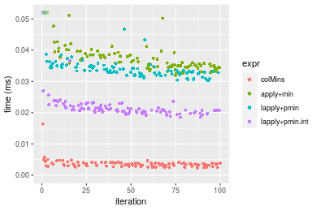


_Table: Benchmarking of colMins() and rowMins() on integer+10x10 data (original and transposed).  The top panel shows times in milliseconds and the bottom panel shows relative times._


|   |expr    |   min|     lq|    mean| median|     uq|    max|
|:--|:-------|-----:|------:|-------:|------:|------:|------:|
|1  |colMins | 2.378| 2.8950| 3.57350| 3.4215| 3.8475| 16.397|
|2  |rowMins | 2.335| 2.8945| 3.57485| 3.4300| 3.9830| 15.571|


|   |expr    |       min|        lq|     mean|   median|       uq|       max|
|:--|:-------|---------:|---------:|--------:|--------:|--------:|---------:|
|1  |colMins | 1.0000000| 1.0000000| 1.000000| 1.000000| 1.000000| 1.0000000|
|2  |rowMins | 0.9819176| 0.9998273| 1.000378| 1.002484| 1.035218| 0.9496249|

_Figure: Benchmarking of colMins() and rowMins() on integer+10x10 data (original and transposed).  Outliers are displayed as crosses. Times are in milliseconds._


#### 100x100 integer matrix


```r
> X <- data[["100x100"]]
> gc()
          used  (Mb) gc trigger  (Mb) max used  (Mb)
Ncells 5258907 280.9    7916910 422.9  7916910 422.9
Vcells 9869084  75.3   33191153 253.3 53339345 407.0
> colStats <- microbenchmark(colMins = colMins(X, na.rm = FALSE), `apply+min` = apply(X, MARGIN = 2L, 
+     FUN = min, na.rm = FALSE), `lapply+pmin` = do.call(pmin, lapply(seq_len(nrow(X)), function(i) X[i, 
+     ])), `lapply+pmin.int` = do.call(pmin.int, lapply(seq_len(nrow(X)), function(i) X[i, ])), unit = "ms")
> X <- t(X)
> gc()
          used  (Mb) gc trigger  (Mb) max used  (Mb)
Ncells 5258901 280.9    7916910 422.9  7916910 422.9
Vcells 9874191  75.4   33191153 253.3 53339345 407.0
> rowStats <- microbenchmark(rowMins = rowMins(X, na.rm = FALSE), `apply+min` = apply(X, MARGIN = 1L, 
+     FUN = min, na.rm = FALSE), `lapply+pmin` = do.call(pmin, lapply(seq_len(ncol(X)), function(i) X[, 
+     i])), `lapply+pmin.int` = do.call(pmin.int, lapply(seq_len(ncol(X)), function(i) X[, i])), unit = "ms")
```

_Table: Benchmarking of colMins(), apply+min(), lapply+pmin() and lapply+pmin.int() on integer+100x100 data. The top panel shows times in milliseconds and the bottom panel shows relative times._


|   |expr            |      min|        lq|      mean|    median|        uq|      max|
|:--|:---------------|--------:|---------:|---------:|---------:|---------:|--------:|
|1  |colMins         | 0.019092| 0.0208085| 0.0250486| 0.0231260| 0.0260610| 0.055158|
|4  |lapply+pmin.int | 0.162959| 0.1747140| 0.1993368| 0.1883025| 0.2079535| 0.380376|
|2  |apply+min       | 0.163356| 0.1783380| 0.2085342| 0.2009140| 0.2189795| 0.382003|
|3  |lapply+pmin     | 0.216376| 0.2347825| 0.2672773| 0.2579365| 0.2734245| 0.525389|


|   |expr            |       min|       lq|      mean|    median|        uq|      max|
|:--|:---------------|---------:|--------:|---------:|---------:|---------:|--------:|
|1  |colMins         |  1.000000|  1.00000|  1.000000|  1.000000|  1.000000| 1.000000|
|4  |lapply+pmin.int |  8.535460|  8.39628|  7.957991|  8.142459|  7.979490| 6.896117|
|2  |apply+min       |  8.556254|  8.57044|  8.325172|  8.687797|  8.402575| 6.925614|
|3  |lapply+pmin     | 11.333333| 11.28301| 10.670336| 11.153529| 10.491712| 9.525164|

_Table: Benchmarking of rowMins(), apply+min(), lapply+pmin() and lapply+pmin.int() on integer+100x100 data (transposed). The top panel shows times in milliseconds and the bottom panel shows relative times._


|   |expr            |      min|        lq|      mean|    median|        uq|      max|
|:--|:---------------|--------:|---------:|---------:|---------:|---------:|--------:|
|1  |rowMins         | 0.021189| 0.0241980| 0.0273833| 0.0275665| 0.0292965| 0.045254|
|4  |lapply+pmin.int | 0.140113| 0.1514660| 0.1689246| 0.1665185| 0.1780995| 0.278341|
|2  |apply+min       | 0.167289| 0.1788965| 0.2029122| 0.1932630| 0.2155980| 0.359967|
|3  |lapply+pmin     | 0.192182| 0.2099030| 0.2338272| 0.2327380| 0.2460980| 0.327113|


|   |expr            |      min|       lq|     mean|   median|       uq|      max|
|:--|:---------------|--------:|--------:|--------:|--------:|--------:|--------:|
|1  |rowMins         | 1.000000| 1.000000| 1.000000| 1.000000| 1.000000| 1.000000|
|4  |lapply+pmin.int | 6.612535| 6.259443| 6.168889| 6.040611| 6.079207| 6.150639|
|2  |apply+min       | 7.895087| 7.393028| 7.410069| 7.010792| 7.359173| 7.954369|
|3  |lapply+pmin     | 9.069895| 8.674395| 8.539039| 8.442784| 8.400253| 7.228378|

_Figure: Benchmarking of colMins(), apply+min(), lapply+pmin() and lapply+pmin.int() on integer+100x100 data  as well as rowMins(), apply+min(), lapply+pmin() and lapply+pmin.int() on the same data transposed.  Outliers are displayed as crosses.  Times are in milliseconds._


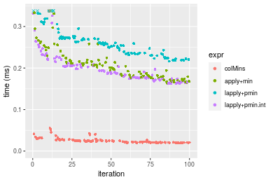

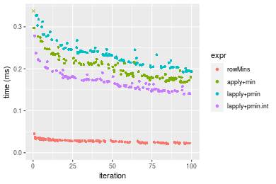
_Table: Benchmarking of colMins() and rowMins() on integer+100x100 data (original and transposed).  The top panel shows times in milliseconds and the bottom panel shows relative times._


|   |expr    |    min|      lq|     mean|  median|      uq|    max|
|:--|:-------|------:|-------:|--------:|-------:|-------:|------:|
|1  |colMins | 19.092| 20.8085| 25.04863| 23.1260| 26.0610| 55.158|
|2  |rowMins | 21.189| 24.1980| 27.38331| 27.5665| 29.2965| 45.254|


|   |expr    |      min|      lq|     mean|   median|       uq|       max|
|:--|:-------|--------:|-------:|--------:|--------:|--------:|---------:|
|1  |colMins | 1.000000| 1.00000| 1.000000| 1.000000| 1.000000| 1.0000000|
|2  |rowMins | 1.109837| 1.16289| 1.093206| 1.192013| 1.124151| 0.8204431|

_Figure: Benchmarking of colMins() and rowMins() on integer+100x100 data (original and transposed).  Outliers are displayed as crosses. Times are in milliseconds._


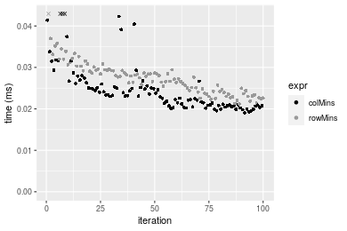

#### 1000x10 integer matrix


```r
> X <- data[["1000x10"]]
> gc()
          used  (Mb) gc trigger  (Mb) max used  (Mb)
Ncells 5259677 280.9    7916910 422.9  7916910 422.9
Vcells 9872876  75.4   33191153 253.3 53339345 407.0
> colStats <- microbenchmark(colMins = colMins(X, na.rm = FALSE), `apply+min` = apply(X, MARGIN = 2L, 
+     FUN = min, na.rm = FALSE), `lapply+pmin` = do.call(pmin, lapply(seq_len(nrow(X)), function(i) X[i, 
+     ])), `lapply+pmin.int` = do.call(pmin.int, lapply(seq_len(nrow(X)), function(i) X[i, ])), unit = "ms")
> X <- t(X)
> gc()
          used  (Mb) gc trigger  (Mb) max used  (Mb)
Ncells 5259665 280.9    7916910 422.9  7916910 422.9
Vcells 9877973  75.4   33191153 253.3 53339345 407.0
> rowStats <- microbenchmark(rowMins = rowMins(X, na.rm = FALSE), `apply+min` = apply(X, MARGIN = 1L, 
+     FUN = min, na.rm = FALSE), `lapply+pmin` = do.call(pmin, lapply(seq_len(ncol(X)), function(i) X[, 
+     i])), `lapply+pmin.int` = do.call(pmin.int, lapply(seq_len(ncol(X)), function(i) X[, i])), unit = "ms")
```

_Table: Benchmarking of colMins(), apply+min(), lapply+pmin() and lapply+pmin.int() on integer+1000x10 data. The top panel shows times in milliseconds and the bottom panel shows relative times._


|   |expr            |      min|       lq|      mean|   median|        uq|      max|
|:--|:---------------|--------:|--------:|---------:|--------:|---------:|--------:|
|1  |colMins         | 0.015204| 0.017997| 0.0211080| 0.019834| 0.0228425| 0.051227|
|2  |apply+min       | 0.083499| 0.095359| 0.1079905| 0.105140| 0.1160725| 0.178032|
|4  |lapply+pmin.int | 1.013110| 1.084493| 1.1475571| 1.130878| 1.1718020| 1.857980|
|3  |lapply+pmin     | 1.499132| 1.592197| 1.7595750| 1.688099| 1.7522765| 7.066660|


|   |expr            |      min|        lq|      mean|    median|        uq|        max|
|:--|:---------------|--------:|---------:|---------:|---------:|---------:|----------:|
|1  |colMins         |  1.00000|  1.000000|  1.000000|  1.000000|  1.000000|   1.000000|
|2  |apply+min       |  5.49191|  5.298605|  5.116095|  5.300998|  5.081427|   3.475355|
|4  |lapply+pmin.int | 66.63444| 60.259682| 54.366005| 57.017167| 51.299201|  36.269545|
|3  |lapply+pmin     | 98.60116| 88.470134| 83.360612| 85.111374| 76.711240| 137.947957|

_Table: Benchmarking of rowMins(), apply+min(), lapply+pmin() and lapply+pmin.int() on integer+1000x10 data (transposed). The top panel shows times in milliseconds and the bottom panel shows relative times._


|   |expr            |      min|       lq|      mean|    median|       uq|      max|
|:--|:---------------|--------:|--------:|---------:|---------:|--------:|--------:|
|1  |rowMins         | 0.018456| 0.021255| 0.0262313| 0.0244300| 0.028759| 0.066980|
|2  |apply+min       | 0.085855| 0.099826| 0.1168604| 0.1114285| 0.127582| 0.267035|
|4  |lapply+pmin.int | 0.968886| 1.052808| 1.1880199| 1.1138560| 1.168856| 6.644591|
|3  |lapply+pmin     | 1.483855| 1.588378| 1.6993377| 1.6673565| 1.782304| 2.461269|


|   |expr            |       min|        lq|      mean|    median|        uq|       max|
|:--|:---------------|---------:|---------:|---------:|---------:|---------:|---------:|
|1  |rowMins         |  1.000000|  1.000000|  1.000000|  1.000000|  1.000000|  1.000000|
|2  |apply+min       |  4.651875|  4.696589|  4.454992|  4.561134|  4.436246|  3.986787|
|4  |lapply+pmin.int | 52.497074| 49.532251| 45.290098| 45.593778| 40.643138| 99.202613|
|3  |lapply+pmin     | 80.399599| 74.729617| 64.782725| 68.250368| 61.973782| 36.746327|

_Figure: Benchmarking of colMins(), apply+min(), lapply+pmin() and lapply+pmin.int() on integer+1000x10 data  as well as rowMins(), apply+min(), lapply+pmin() and lapply+pmin.int() on the same data transposed.  Outliers are displayed as crosses.  Times are in milliseconds._


_Table: Benchmarking of colMins() and rowMins() on integer+1000x10 data (original and transposed).  The top panel shows times in milliseconds and the bottom panel shows relative times._


|   |expr    |    min|     lq|     mean| median|      uq|    max|
|:--|:-------|------:|------:|--------:|------:|-------:|------:|
|1  |colMins | 15.204| 17.997| 21.10799| 19.834| 22.8425| 51.227|
|2  |rowMins | 18.456| 21.255| 26.23134| 24.430| 28.7590| 66.980|


|   |expr    |      min|      lq|     mean|   median|       uq|      max|
|:--|:-------|--------:|-------:|--------:|--------:|--------:|--------:|
|1  |colMins | 1.000000| 1.00000| 1.000000| 1.000000| 1.000000| 1.000000|
|2  |rowMins | 1.213891| 1.18103| 1.242721| 1.231723| 1.259013| 1.307514|

_Figure: Benchmarking of colMins() and rowMins() on integer+1000x10 data (original and transposed).  Outliers are displayed as crosses. Times are in milliseconds._


#### 10x1000 integer matrix


```r
> X <- data[["10x1000"]]
> gc()
          used  (Mb) gc trigger  (Mb) max used  (Mb)
Ncells 5259893 281.0    7916910 422.9  7916910 422.9
Vcells 9873763  75.4   33191153 253.3 53339345 407.0
> colStats <- microbenchmark(colMins = colMins(X, na.rm = FALSE), `apply+min` = apply(X, MARGIN = 2L, 
+     FUN = min, na.rm = FALSE), `lapply+pmin` = do.call(pmin, lapply(seq_len(nrow(X)), function(i) X[i, 
+     ])), `lapply+pmin.int` = do.call(pmin.int, lapply(seq_len(nrow(X)), function(i) X[i, ])), unit = "ms")
> X <- t(X)
> gc()
          used  (Mb) gc trigger  (Mb) max used  (Mb)
Ncells 5259887 281.0    7916910 422.9  7916910 422.9
Vcells 9878870  75.4   33191153 253.3 53339345 407.0
> rowStats <- microbenchmark(rowMins = rowMins(X, na.rm = FALSE), `apply+min` = apply(X, MARGIN = 1L, 
+     FUN = min, na.rm = FALSE), `lapply+pmin` = do.call(pmin, lapply(seq_len(ncol(X)), function(i) X[, 
+     i])), `lapply+pmin.int` = do.call(pmin.int, lapply(seq_len(ncol(X)), function(i) X[, i])), unit = "ms")
```

_Table: Benchmarking of colMins(), apply+min(), lapply+pmin() and lapply+pmin.int() on integer+10x1000 data. The top panel shows times in milliseconds and the bottom panel shows relative times._


|   |expr            |      min|        lq|      mean|    median|        uq|      max|
|:--|:---------------|--------:|---------:|---------:|---------:|---------:|--------:|
|1  |colMins         | 0.033876| 0.0401855| 0.0473595| 0.0455700| 0.0518715| 0.073317|
|4  |lapply+pmin.int | 0.088449| 0.1019290| 0.1224060| 0.1136535| 0.1308815| 0.247705|
|3  |lapply+pmin     | 0.100228| 0.1143980| 0.1288952| 0.1229210| 0.1378105| 0.240051|
|2  |apply+min       | 0.966494| 1.0888590| 1.2126394| 1.1751415| 1.2805590| 1.900782|


|   |expr            |       min|        lq|      mean|    median|        uq|       max|
|:--|:---------------|---------:|---------:|---------:|---------:|---------:|---------:|
|1  |colMins         |  1.000000|  1.000000|  1.000000|  1.000000|  1.000000|  1.000000|
|4  |lapply+pmin.int |  2.610963|  2.536462|  2.584612|  2.494042|  2.523187|  3.378548|
|3  |lapply+pmin     |  2.958673|  2.846748|  2.721633|  2.697411|  2.656767|  3.274152|
|2  |apply+min       | 28.530346| 27.095818| 25.604976| 25.787613| 24.687140| 25.925529|

_Table: Benchmarking of rowMins(), apply+min(), lapply+pmin() and lapply+pmin.int() on integer+10x1000 data (transposed). The top panel shows times in milliseconds and the bottom panel shows relative times._


|   |expr            |      min|        lq|      mean|    median|        uq|      max|
|:--|:---------------|--------:|---------:|---------:|---------:|---------:|--------:|
|1  |rowMins         | 0.034944| 0.0400575| 0.0449176| 0.0436105| 0.0479255| 0.084419|
|4  |lapply+pmin.int | 0.067814| 0.0753215| 0.0857738| 0.0837045| 0.0914050| 0.124539|
|3  |lapply+pmin     | 0.074270| 0.0863680| 0.0975050| 0.0936825| 0.1012875| 0.194381|
|2  |apply+min       | 0.949017| 1.0237465| 1.1477589| 1.1101285| 1.2040955| 1.927425|


|   |expr            |       min|        lq|      mean|    median|        uq|       max|
|:--|:---------------|---------:|---------:|---------:|---------:|---------:|---------:|
|1  |rowMins         |  1.000000|  1.000000|  1.000000|  1.000000|  1.000000|  1.000000|
|4  |lapply+pmin.int |  1.940648|  1.880335|  1.909584|  1.919366|  1.907231|  1.475248|
|3  |lapply+pmin     |  2.125401|  2.156101|  2.170755|  2.148164|  2.113437|  2.302574|
|2  |apply+min       | 27.158225| 25.556924| 25.552571| 25.455533| 25.124318| 22.831649|

_Figure: Benchmarking of colMins(), apply+min(), lapply+pmin() and lapply+pmin.int() on integer+10x1000 data  as well as rowMins(), apply+min(), lapply+pmin() and lapply+pmin.int() on the same data transposed.  Outliers are displayed as crosses.  Times are in milliseconds._


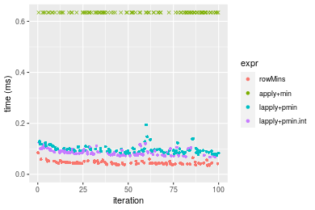
_Table: Benchmarking of colMins() and rowMins() on integer+10x1000 data (original and transposed).  The top panel shows times in milliseconds and the bottom panel shows relative times._


|   |expr    |    min|      lq|     mean|  median|      uq|    max|
|:--|:-------|------:|-------:|--------:|-------:|-------:|------:|
|2  |rowMins | 34.944| 40.0575| 44.91755| 43.6105| 47.9255| 84.419|
|1  |colMins | 33.876| 40.1855| 47.35952| 45.5700| 51.8715| 73.317|


|   |expr    |       min|       lq|     mean|   median|       uq|       max|
|:--|:-------|---------:|--------:|--------:|--------:|--------:|---------:|
|2  |rowMins | 1.0000000| 1.000000| 1.000000| 1.000000| 1.000000| 1.0000000|
|1  |colMins | 0.9694368| 1.003195| 1.054366| 1.044932| 1.082336| 0.8684893|

_Figure: Benchmarking of colMins() and rowMins() on integer+10x1000 data (original and transposed).  Outliers are displayed as crosses. Times are in milliseconds._


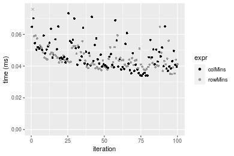

#### 100x1000 integer matrix


```r
> X <- data[["100x1000"]]
> gc()
          used  (Mb) gc trigger  (Mb) max used  (Mb)
Ncells 5260135 281.0    7916910 422.9  7916910 422.9
Vcells 9874394  75.4   33191153 253.3 53339345 407.0
> colStats <- microbenchmark(colMins = colMins(X, na.rm = FALSE), `apply+min` = apply(X, MARGIN = 2L, 
+     FUN = min, na.rm = FALSE), `lapply+pmin` = do.call(pmin, lapply(seq_len(nrow(X)), function(i) X[i, 
+     ])), `lapply+pmin.int` = do.call(pmin.int, lapply(seq_len(nrow(X)), function(i) X[i, ])), unit = "ms")
> X <- t(X)
> gc()
          used  (Mb) gc trigger  (Mb) max used  (Mb)
Ncells 5260117 281.0    7916910 422.9  7916910 422.9
Vcells 9924481  75.8   33191153 253.3 53339345 407.0
> rowStats <- microbenchmark(rowMins = rowMins(X, na.rm = FALSE), `apply+min` = apply(X, MARGIN = 1L, 
+     FUN = min, na.rm = FALSE), `lapply+pmin` = do.call(pmin, lapply(seq_len(ncol(X)), function(i) X[, 
+     i])), `lapply+pmin.int` = do.call(pmin.int, lapply(seq_len(ncol(X)), function(i) X[, i])), unit = "ms")
```

_Table: Benchmarking of colMins(), apply+min(), lapply+pmin() and lapply+pmin.int() on integer+100x1000 data. The top panel shows times in milliseconds and the bottom panel shows relative times._


|   |expr            |      min|        lq|      mean|    median|        uq|       max|
|:--|:---------------|--------:|---------:|---------:|---------:|---------:|---------:|
|1  |colMins         | 0.173151| 0.1837955| 0.2023116| 0.1893960| 0.2087765|  0.354524|
|4  |lapply+pmin.int | 0.704513| 0.7437555| 0.8466216| 0.7748180| 0.8585805|  1.739525|
|3  |lapply+pmin     | 0.746105| 0.7785445| 0.8749611| 0.8182535| 0.8979790|  1.474941|
|2  |apply+min       | 1.497374| 1.5675940| 1.9411797| 1.6268280| 1.8791445| 17.475682|


|   |expr            |      min|       lq|     mean|   median|       uq|       max|
|:--|:---------------|--------:|--------:|--------:|--------:|--------:|---------:|
|1  |colMins         | 1.000000| 1.000000| 1.000000| 1.000000| 1.000000|  1.000000|
|4  |lapply+pmin.int | 4.068778| 4.046647| 4.184741| 4.090994| 4.112438|  4.906650|
|3  |lapply+pmin     | 4.308985| 4.235928| 4.324819| 4.320331| 4.301150|  4.160342|
|2  |apply+min       | 8.647793| 8.529012| 9.594999| 8.589558| 9.000747| 49.293368|

_Table: Benchmarking of rowMins(), apply+min(), lapply+pmin() and lapply+pmin.int() on integer+100x1000 data (transposed). The top panel shows times in milliseconds and the bottom panel shows relative times._


|   |expr            |      min|        lq|      mean|    median|        uq|       max|
|:--|:---------------|--------:|---------:|---------:|---------:|---------:|---------:|
|1  |rowMins         | 0.189489| 0.1975455| 0.2131814| 0.2053355| 0.2170535|  0.320012|
|4  |lapply+pmin.int | 0.468702| 0.4916095| 0.5383268| 0.5107885| 0.5656335|  0.823576|
|3  |lapply+pmin     | 0.525118| 0.5532100| 0.6033865| 0.5771825| 0.6289020|  0.843668|
|2  |apply+min       | 1.480868| 1.5417425| 1.8505077| 1.5998610| 1.7850685| 17.184817|


|   |expr            |      min|       lq|     mean|   median|       uq|       max|
|:--|:---------------|--------:|--------:|--------:|--------:|--------:|---------:|
|1  |rowMins         | 1.000000| 1.000000| 1.000000| 1.000000| 1.000000|  1.000000|
|4  |lapply+pmin.int | 2.473505| 2.488589| 2.525206| 2.487580| 2.605964|  2.573578|
|3  |lapply+pmin     | 2.771232| 2.800418| 2.830391| 2.810924| 2.897451|  2.636364|
|2  |apply+min       | 7.815061| 7.804493| 8.680439| 7.791449| 8.224094| 53.700539|

_Figure: Benchmarking of colMins(), apply+min(), lapply+pmin() and lapply+pmin.int() on integer+100x1000 data  as well as rowMins(), apply+min(), lapply+pmin() and lapply+pmin.int() on the same data transposed.  Outliers are displayed as crosses.  Times are in milliseconds._


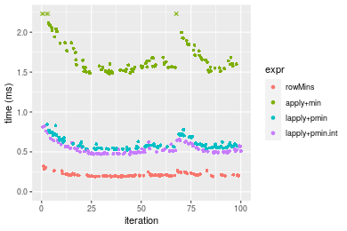
_Table: Benchmarking of colMins() and rowMins() on integer+100x1000 data (original and transposed).  The top panel shows times in milliseconds and the bottom panel shows relative times._


|   |expr    |     min|       lq|     mean|   median|       uq|     max|
|:--|:-------|-------:|--------:|--------:|--------:|--------:|-------:|
|1  |colMins | 173.151| 183.7955| 202.3116| 189.3960| 208.7765| 354.524|
|2  |rowMins | 189.489| 197.5455| 213.1814| 205.3355| 217.0535| 320.012|


|   |expr    |      min|       lq|     mean|  median|       uq|       max|
|:--|:-------|--------:|--------:|--------:|-------:|--------:|---------:|
|1  |colMins | 1.000000| 1.000000| 1.000000| 1.00000| 1.000000| 1.0000000|
|2  |rowMins | 1.094357| 1.074811| 1.053728| 1.08416| 1.039645| 0.9026526|

_Figure: Benchmarking of colMins() and rowMins() on integer+100x1000 data (original and transposed).  Outliers are displayed as crosses. Times are in milliseconds._


#### 1000x100 integer matrix


```r
> X <- data[["1000x100"]]
> gc()
          used  (Mb) gc trigger  (Mb) max used  (Mb)
Ncells 5260353 281.0    7916910 422.9  7916910 422.9
Vcells 9875181  75.4   33191153 253.3 53339345 407.0
> colStats <- microbenchmark(colMins = colMins(X, na.rm = FALSE), `apply+min` = apply(X, MARGIN = 2L, 
+     FUN = min, na.rm = FALSE), `lapply+pmin` = do.call(pmin, lapply(seq_len(nrow(X)), function(i) X[i, 
+     ])), `lapply+pmin.int` = do.call(pmin.int, lapply(seq_len(nrow(X)), function(i) X[i, ])), unit = "ms")
> X <- t(X)
> gc()
          used  (Mb) gc trigger  (Mb) max used  (Mb)
Ncells 5260341 281.0    7916910 422.9  7916910 422.9
Vcells 9925278  75.8   33191153 253.3 53339345 407.0
> rowStats <- microbenchmark(rowMins = rowMins(X, na.rm = FALSE), `apply+min` = apply(X, MARGIN = 1L, 
+     FUN = min, na.rm = FALSE), `lapply+pmin` = do.call(pmin, lapply(seq_len(ncol(X)), function(i) X[, 
+     i])), `lapply+pmin.int` = do.call(pmin.int, lapply(seq_len(ncol(X)), function(i) X[, i])), unit = "ms")
```

_Table: Benchmarking of colMins(), apply+min(), lapply+pmin() and lapply+pmin.int() on integer+1000x100 data. The top panel shows times in milliseconds and the bottom panel shows relative times._


|   |expr            |      min|        lq|      mean|    median|       uq|       max|
|:--|:---------------|--------:|---------:|---------:|---------:|--------:|---------:|
|1  |colMins         | 0.136101| 0.1503335| 0.1573457| 0.1537545| 0.161151|  0.223754|
|2  |apply+min       | 0.685892| 0.7400800| 0.7827800| 0.7549980| 0.783667|  1.135333|
|4  |lapply+pmin.int | 1.542049| 1.7352045| 1.8195725| 1.7817705| 1.845368|  3.037280|
|3  |lapply+pmin     | 2.064401| 2.2727160| 2.5680116| 2.3579955| 2.448529| 18.779174|


|   |expr            |       min|        lq|      mean|    median|        uq|       max|
|:--|:---------------|---------:|---------:|---------:|---------:|---------:|---------:|
|1  |colMins         |  1.000000|  1.000000|  1.000000|  1.000000|  1.000000|  1.000000|
|2  |apply+min       |  5.039581|  4.922921|  4.974906|  4.910412|  4.862936|  5.074023|
|4  |lapply+pmin.int | 11.330181| 11.542367| 11.564172| 11.588412| 11.451170| 13.574193|
|3  |lapply+pmin     | 15.168154| 15.117828| 16.320827| 15.336107| 15.194004| 83.927769|

_Table: Benchmarking of rowMins(), apply+min(), lapply+pmin() and lapply+pmin.int() on integer+1000x100 data (transposed). The top panel shows times in milliseconds and the bottom panel shows relative times._


|   |expr            |      min|        lq|      mean|    median|        uq|       max|
|:--|:---------------|--------:|---------:|---------:|---------:|---------:|---------:|
|1  |rowMins         | 0.168151| 0.1827725| 0.1953922| 0.1896045| 0.1994725|  0.282647|
|2  |apply+min       | 0.671201| 0.7403345| 0.8154171| 0.7745820| 0.8492855|  1.305584|
|4  |lapply+pmin.int | 1.316031| 1.4738265| 1.5586782| 1.5223385| 1.5858250|  2.465012|
|3  |lapply+pmin     | 1.793270| 1.9826560| 2.2973394| 2.0594770| 2.1693160| 19.665516|


|   |expr            |       min|        lq|      mean|    median|        uq|       max|
|:--|:---------------|---------:|---------:|---------:|---------:|---------:|---------:|
|1  |rowMins         |  1.000000|  1.000000|  1.000000|  1.000000|  1.000000|  1.000000|
|2  |apply+min       |  3.991656|  4.050579|  4.173233|  4.085251|  4.257657|  4.619133|
|4  |lapply+pmin.int |  7.826483|  8.063721|  7.977178|  8.029021|  7.950093|  8.721168|
|3  |lapply+pmin     | 10.664641| 10.847671| 11.757581| 10.861963| 10.875264| 69.576242|

_Figure: Benchmarking of colMins(), apply+min(), lapply+pmin() and lapply+pmin.int() on integer+1000x100 data  as well as rowMins(), apply+min(), lapply+pmin() and lapply+pmin.int() on the same data transposed.  Outliers are displayed as crosses.  Times are in milliseconds._


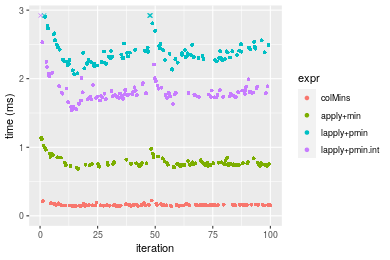


_Table: Benchmarking of colMins() and rowMins() on integer+1000x100 data (original and transposed).  The top panel shows times in milliseconds and the bottom panel shows relative times._


|   |expr    |     min|       lq|     mean|   median|       uq|     max|
|:--|:-------|-------:|--------:|--------:|--------:|--------:|-------:|
|1  |colMins | 136.101| 150.3335| 157.3457| 153.7545| 161.1510| 223.754|
|2  |rowMins | 168.151| 182.7725| 195.3922| 189.6045| 199.4725| 282.647|


|   |expr    |      min|      lq|     mean|   median|       uq|      max|
|:--|:-------|--------:|-------:|--------:|--------:|--------:|--------:|
|1  |colMins | 1.000000| 1.00000| 1.000000| 1.000000| 1.000000| 1.000000|
|2  |rowMins | 1.235487| 1.21578| 1.241802| 1.233164| 1.237799| 1.263204|

_Figure: Benchmarking of colMins() and rowMins() on integer+1000x100 data (original and transposed).  Outliers are displayed as crosses. Times are in milliseconds._


## Data type "double"

### Data
```r
> rmatrix <- function(nrow, ncol, mode = c("logical", "double", "integer", "index"), range = c(-100, 
+     +100), na_prob = 0) {
+     mode <- match.arg(mode)
+     n <- nrow * ncol
+     if (mode == "logical") {
+         x <- sample(c(FALSE, TRUE), size = n, replace = TRUE)
+     }     else if (mode == "index") {
+         x <- seq_len(n)
+         mode <- "integer"
+     }     else {
+         x <- runif(n, min = range[1], max = range[2])
+     }
+     storage.mode(x) <- mode
+     if (na_prob > 0) 
+         x[sample(n, size = na_prob * n)] <- NA
+     dim(x) <- c(nrow, ncol)
+     x
+ }
> rmatrices <- function(scale = 10, seed = 1, ...) {
+     set.seed(seed)
+     data <- list()
+     data[[1]] <- rmatrix(nrow = scale * 1, ncol = scale * 1, ...)
+     data[[2]] <- rmatrix(nrow = scale * 10, ncol = scale * 10, ...)
+     data[[3]] <- rmatrix(nrow = scale * 100, ncol = scale * 1, ...)
+     data[[4]] <- t(data[[3]])
+     data[[5]] <- rmatrix(nrow = scale * 10, ncol = scale * 100, ...)
+     data[[6]] <- t(data[[5]])
+     names(data) <- sapply(data, FUN = function(x) paste(dim(x), collapse = "x"))
+     data
+ }
> data <- rmatrices(mode = mode)
```

### Results

#### 10x10 double matrix


```r
> X <- data[["10x10"]]
> gc()
          used  (Mb) gc trigger  (Mb) max used  (Mb)
Ncells 5260578 281.0    7916910 422.9  7916910 422.9
Vcells 9991121  76.3   33191153 253.3 53339345 407.0
> colStats <- microbenchmark(colMins = colMins(X, na.rm = FALSE), `apply+min` = apply(X, MARGIN = 2L, 
+     FUN = min, na.rm = FALSE), `lapply+pmin` = do.call(pmin, lapply(seq_len(nrow(X)), function(i) X[i, 
+     ])), `lapply+pmin.int` = do.call(pmin.int, lapply(seq_len(nrow(X)), function(i) X[i, ])), unit = "ms")
> X <- t(X)
> gc()
          used  (Mb) gc trigger  (Mb) max used  (Mb)
Ncells 5260563 281.0    7916910 422.9  7916910 422.9
Vcells 9991313  76.3   33191153 253.3 53339345 407.0
> rowStats <- microbenchmark(rowMins = rowMins(X, na.rm = FALSE), `apply+min` = apply(X, MARGIN = 1L, 
+     FUN = min, na.rm = FALSE), `lapply+pmin` = do.call(pmin, lapply(seq_len(ncol(X)), function(i) X[, 
+     i])), `lapply+pmin.int` = do.call(pmin.int, lapply(seq_len(ncol(X)), function(i) X[, i])), unit = "ms")
```

_Table: Benchmarking of colMins(), apply+min(), lapply+pmin() and lapply+pmin.int() on double+10x10 data. The top panel shows times in milliseconds and the bottom panel shows relative times._


|   |expr            |      min|        lq|      mean|    median|       uq|      max|
|:--|:---------------|--------:|---------:|---------:|---------:|--------:|--------:|
|1  |colMins         | 0.002559| 0.0031140| 0.0040405| 0.0039365| 0.004402| 0.016816|
|4  |lapply+pmin.int | 0.020488| 0.0215480| 0.0243013| 0.0222940| 0.023612| 0.066716|
|3  |lapply+pmin     | 0.033412| 0.0346730| 0.0366451| 0.0360750| 0.036895| 0.063086|
|2  |apply+min       | 0.036128| 0.0383625| 0.0420743| 0.0393625| 0.040843| 0.096656|


|   |expr            |       min|        lq|      mean|   median|       uq|      max|
|:--|:---------------|---------:|---------:|---------:|--------:|--------:|--------:|
|1  |colMins         |  1.000000|  1.000000|  1.000000| 1.000000| 1.000000| 1.000000|
|4  |lapply+pmin.int |  8.006252|  6.919717|  6.014389| 5.663407| 5.363925| 3.967412|
|3  |lapply+pmin     | 13.056663| 11.134554|  9.069387| 9.164232| 8.381417| 3.751546|
|2  |apply+min       | 14.118015| 12.319364| 10.413062| 9.999365| 9.278283| 5.747859|

_Table: Benchmarking of rowMins(), apply+min(), lapply+pmin() and lapply+pmin.int() on double+10x10 data (transposed). The top panel shows times in milliseconds and the bottom panel shows relative times._


|   |expr            |      min|        lq|      mean|    median|        uq|      max|
|:--|:---------------|--------:|---------:|---------:|---------:|---------:|--------:|
|1  |rowMins         | 0.004152| 0.0055465| 0.0079116| 0.0074035| 0.0095270| 0.022584|
|4  |lapply+pmin.int | 0.030853| 0.0366285| 0.0393853| 0.0391410| 0.0413905| 0.064172|
|3  |lapply+pmin     | 0.051094| 0.0604975| 0.0642979| 0.0639605| 0.0668780| 0.144046|
|2  |apply+min       | 0.057760| 0.0670640| 0.0731486| 0.0711605| 0.0776280| 0.133239|


|   |expr            |       min|        lq|     mean|   median|       uq|      max|
|:--|:---------------|---------:|---------:|--------:|--------:|--------:|--------:|
|1  |rowMins         |  1.000000|  1.000000| 1.000000| 1.000000| 1.000000| 1.000000|
|4  |lapply+pmin.int |  7.430877|  6.603894| 4.978191| 5.286824| 4.344547| 2.841481|
|3  |lapply+pmin     | 12.305877| 10.907329| 8.127081| 8.639225| 7.019838| 6.378232|
|2  |apply+min       | 13.911368| 12.091229| 9.245791| 9.611738| 8.148210| 5.899708|

_Figure: Benchmarking of colMins(), apply+min(), lapply+pmin() and lapply+pmin.int() on double+10x10 data  as well as rowMins(), apply+min(), lapply+pmin() and lapply+pmin.int() on the same data transposed.  Outliers are displayed as crosses.  Times are in milliseconds._


_Table: Benchmarking of colMins() and rowMins() on double+10x10 data (original and transposed).  The top panel shows times in milliseconds and the bottom panel shows relative times._


|   |expr    |   min|     lq|    mean| median|    uq|    max|
|:--|:-------|-----:|------:|-------:|------:|-----:|------:|
|1  |colMins | 2.559| 3.1140| 4.04053| 3.9365| 4.402| 16.816|
|2  |rowMins | 4.152| 5.5465| 7.91156| 7.4035| 9.527| 22.584|


|   |expr    |      min|      lq|    mean|   median|       uq|      max|
|:--|:-------|--------:|-------:|-------:|--------:|--------:|--------:|
|1  |colMins | 1.000000| 1.00000| 1.00000| 1.000000| 1.000000| 1.000000|
|2  |rowMins | 1.622509| 1.78115| 1.95805| 1.880732| 2.164243| 1.343007|

_Figure: Benchmarking of colMins() and rowMins() on double+10x10 data (original and transposed).  Outliers are displayed as crosses. Times are in milliseconds._


#### 100x100 double matrix


```r
> X <- data[["100x100"]]
> gc()
          used  (Mb) gc trigger  (Mb) max used  (Mb)
Ncells 5260797 281.0    7916910 422.9  7916910 422.9
Vcells 9992189  76.3   33191153 253.3 53339345 407.0
> colStats <- microbenchmark(colMins = colMins(X, na.rm = FALSE), `apply+min` = apply(X, MARGIN = 2L, 
+     FUN = min, na.rm = FALSE), `lapply+pmin` = do.call(pmin, lapply(seq_len(nrow(X)), function(i) X[i, 
+     ])), `lapply+pmin.int` = do.call(pmin.int, lapply(seq_len(nrow(X)), function(i) X[i, ])), unit = "ms")
> X <- t(X)
> gc()
           used  (Mb) gc trigger  (Mb) max used  (Mb)
Ncells  5260791 281.0    7916910 422.9  7916910 422.9
Vcells 10002296  76.4   33191153 253.3 53339345 407.0
> rowStats <- microbenchmark(rowMins = rowMins(X, na.rm = FALSE), `apply+min` = apply(X, MARGIN = 1L, 
+     FUN = min, na.rm = FALSE), `lapply+pmin` = do.call(pmin, lapply(seq_len(ncol(X)), function(i) X[, 
+     i])), `lapply+pmin.int` = do.call(pmin.int, lapply(seq_len(ncol(X)), function(i) X[, i])), unit = "ms")
```

_Table: Benchmarking of colMins(), apply+min(), lapply+pmin() and lapply+pmin.int() on double+100x100 data. The top panel shows times in milliseconds and the bottom panel shows relative times._


|   |expr            |      min|        lq|      mean|    median|        uq|      max|
|:--|:---------------|--------:|---------:|---------:|---------:|---------:|--------:|
|1  |colMins         | 0.014245| 0.0161605| 0.0187732| 0.0176050| 0.0197225| 0.038535|
|2  |apply+min       | 0.169881| 0.1887915| 0.2171170| 0.2124155| 0.2254880| 0.369419|
|4  |lapply+pmin.int | 0.178860| 0.1962625| 0.2260470| 0.2163410| 0.2466915| 0.376520|
|3  |lapply+pmin     | 0.234848| 0.2671490| 0.2966658| 0.2866140| 0.3142840| 0.441471|


|   |expr            |      min|       lq|     mean|   median|       uq|       max|
|:--|:---------------|--------:|--------:|--------:|--------:|--------:|---------:|
|1  |colMins         |  1.00000|  1.00000|  1.00000|  1.00000|  1.00000|  1.000000|
|2  |apply+min       | 11.92566| 11.68228| 11.56527| 12.06563| 11.43303|  9.586584|
|4  |lapply+pmin.int | 12.55598| 12.14458| 12.04095| 12.28861| 12.50813|  9.770858|
|3  |lapply+pmin     | 16.48635| 16.53099| 15.80263| 16.28026| 15.93530| 11.456364|

_Table: Benchmarking of rowMins(), apply+min(), lapply+pmin() and lapply+pmin.int() on double+100x100 data (transposed). The top panel shows times in milliseconds and the bottom panel shows relative times._


|   |expr            |      min|        lq|      mean|    median|        uq|      max|
|:--|:---------------|--------:|---------:|---------:|---------:|---------:|--------:|
|1  |rowMins         | 0.025081| 0.0284690| 0.0331240| 0.0325100| 0.0364080| 0.052407|
|4  |lapply+pmin.int | 0.144802| 0.1667395| 0.1900562| 0.1842575| 0.2066830| 0.294848|
|2  |apply+min       | 0.170805| 0.1862275| 0.2179104| 0.2091380| 0.2355375| 0.406395|
|3  |lapply+pmin     | 0.197326| 0.2304875| 0.2581022| 0.2524005| 0.2823025| 0.359785|


|   |expr            |      min|       lq|     mean|   median|       uq|      max|
|:--|:---------------|--------:|--------:|--------:|--------:|--------:|--------:|
|1  |rowMins         | 1.000000| 1.000000| 1.000000| 1.000000| 1.000000| 1.000000|
|4  |lapply+pmin.int | 5.773374| 5.856879| 5.737728| 5.667718| 5.676857| 5.626119|
|2  |apply+min       | 6.810135| 6.541413| 6.578637| 6.433036| 6.469389| 7.754594|
|3  |lapply+pmin     | 7.867549| 8.096087| 7.792011| 7.763780| 7.753859| 6.865209|

_Figure: Benchmarking of colMins(), apply+min(), lapply+pmin() and lapply+pmin.int() on double+100x100 data  as well as rowMins(), apply+min(), lapply+pmin() and lapply+pmin.int() on the same data transposed.  Outliers are displayed as crosses.  Times are in milliseconds._


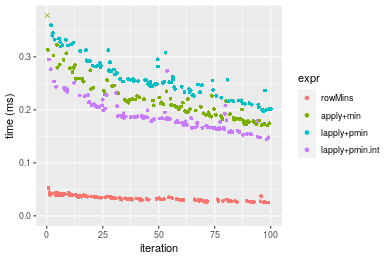
_Table: Benchmarking of colMins() and rowMins() on double+100x100 data (original and transposed).  The top panel shows times in milliseconds and the bottom panel shows relative times._


|   |expr    |    min|      lq|     mean| median|      uq|    max|
|:--|:-------|------:|-------:|--------:|------:|-------:|------:|
|1  |colMins | 14.245| 16.1605| 18.77319| 17.605| 19.7225| 38.535|
|2  |rowMins | 25.081| 28.4690| 33.12395| 32.510| 36.4080| 52.407|


|   |expr    |      min|       lq|     mean|   median|       uq|      max|
|:--|:-------|--------:|--------:|--------:|--------:|--------:|--------:|
|1  |colMins | 1.000000| 1.000000| 1.000000| 1.000000| 1.000000| 1.000000|
|2  |rowMins | 1.760688| 1.761641| 1.764428| 1.846634| 1.846013| 1.359984|

_Figure: Benchmarking of colMins() and rowMins() on double+100x100 data (original and transposed).  Outliers are displayed as crosses. Times are in milliseconds._


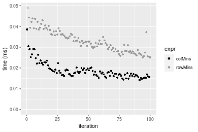

#### 1000x10 double matrix


```r
> X <- data[["1000x10"]]
> gc()
          used  (Mb) gc trigger  (Mb) max used  (Mb)
Ncells 5261027 281.0    7916910 422.9  7916910 422.9
Vcells 9993356  76.3   33191153 253.3 53339345 407.0
> colStats <- microbenchmark(colMins = colMins(X, na.rm = FALSE), `apply+min` = apply(X, MARGIN = 2L, 
+     FUN = min, na.rm = FALSE), `lapply+pmin` = do.call(pmin, lapply(seq_len(nrow(X)), function(i) X[i, 
+     ])), `lapply+pmin.int` = do.call(pmin.int, lapply(seq_len(nrow(X)), function(i) X[i, ])), unit = "ms")
> X <- t(X)
> gc()
           used  (Mb) gc trigger  (Mb) max used  (Mb)
Ncells  5261015 281.0    7916910 422.9  7916910 422.9
Vcells 10003453  76.4   33191153 253.3 53339345 407.0
> rowStats <- microbenchmark(rowMins = rowMins(X, na.rm = FALSE), `apply+min` = apply(X, MARGIN = 1L, 
+     FUN = min, na.rm = FALSE), `lapply+pmin` = do.call(pmin, lapply(seq_len(ncol(X)), function(i) X[, 
+     i])), `lapply+pmin.int` = do.call(pmin.int, lapply(seq_len(ncol(X)), function(i) X[, i])), unit = "ms")
```

_Table: Benchmarking of colMins(), apply+min(), lapply+pmin() and lapply+pmin.int() on double+1000x10 data. The top panel shows times in milliseconds and the bottom panel shows relative times._


|   |expr            |      min|        lq|      mean|    median|        uq|      max|
|:--|:---------------|--------:|---------:|---------:|---------:|---------:|--------:|
|1  |colMins         | 0.010171| 0.0127705| 0.0151684| 0.0138865| 0.0156765| 0.037325|
|2  |apply+min       | 0.094885| 0.1024595| 0.1135641| 0.1085090| 0.1193030| 0.203318|
|4  |lapply+pmin.int | 0.983094| 1.0817250| 1.1584047| 1.1319085| 1.1808190| 1.937538|
|3  |lapply+pmin     | 1.491201| 1.6045695| 1.7541474| 1.6675530| 1.7674035| 6.749631|


|   |expr            |        min|         lq|       mean|     median|         uq|        max|
|:--|:---------------|----------:|----------:|----------:|----------:|----------:|----------:|
|1  |colMins         |   1.000000|   1.000000|   1.000000|   1.000000|   1.000000|   1.000000|
|2  |apply+min       |   9.328974|   8.023139|   7.486877|   7.813992|   7.610308|   5.447234|
|4  |lapply+pmin.int |  96.656573|  84.704984|  76.369505|  81.511432|  75.324148|  51.909926|
|3  |lapply+pmin     | 146.613017| 125.646568| 115.644699| 120.084470| 112.742226| 180.834052|

_Table: Benchmarking of rowMins(), apply+min(), lapply+pmin() and lapply+pmin.int() on double+1000x10 data (transposed). The top panel shows times in milliseconds and the bottom panel shows relative times._


|   |expr            |      min|        lq|      mean|    median|       uq|      max|
|:--|:---------------|--------:|---------:|---------:|---------:|--------:|--------:|
|1  |rowMins         | 0.021171| 0.0235035| 0.0263587| 0.0249765| 0.027178| 0.049838|
|2  |apply+min       | 0.091676| 0.1012805| 0.1140803| 0.1080480| 0.118503| 0.202495|
|4  |lapply+pmin.int | 0.985767| 1.0501180| 1.1722938| 1.1027315| 1.154998| 6.566454|
|3  |lapply+pmin     | 1.473725| 1.5633845| 1.6783980| 1.6493110| 1.751914| 2.322945|


|   |expr            |       min|        lq|      mean|    median|        uq|        max|
|:--|:---------------|---------:|---------:|---------:|---------:|---------:|----------:|
|1  |rowMins         |  1.000000|  1.000000|  1.000000|  1.000000|  1.000000|   1.000000|
|2  |apply+min       |  4.330263|  4.309167|  4.327991|  4.325986|  4.360255|   4.063064|
|4  |lapply+pmin.int | 46.562137| 44.679218| 44.474628| 44.150762| 42.497535| 131.755969|
|3  |lapply+pmin     | 69.610552| 66.517093| 63.675272| 66.034512| 64.460740|  46.609916|

_Figure: Benchmarking of colMins(), apply+min(), lapply+pmin() and lapply+pmin.int() on double+1000x10 data  as well as rowMins(), apply+min(), lapply+pmin() and lapply+pmin.int() on the same data transposed.  Outliers are displayed as crosses.  Times are in milliseconds._


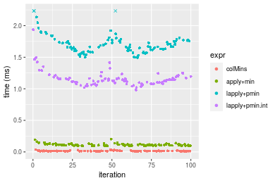


_Table: Benchmarking of colMins() and rowMins() on double+1000x10 data (original and transposed).  The top panel shows times in milliseconds and the bottom panel shows relative times._


|   |expr    |    min|      lq|     mean|  median|      uq|    max|
|:--|:-------|------:|-------:|--------:|-------:|-------:|------:|
|1  |colMins | 10.171| 12.7705| 15.16842| 13.8865| 15.6765| 37.325|
|2  |rowMins | 21.171| 23.5035| 26.35871| 24.9765| 27.1780| 49.838|


|   |expr    |      min|       lq|     mean|   median|       uq|      max|
|:--|:-------|--------:|--------:|--------:|--------:|--------:|--------:|
|1  |colMins | 1.000000| 1.000000| 1.000000| 1.000000| 1.000000| 1.000000|
|2  |rowMins | 2.081506| 1.840453| 1.737736| 1.798617| 1.733678| 1.335244|

_Figure: Benchmarking of colMins() and rowMins() on double+1000x10 data (original and transposed).  Outliers are displayed as crosses. Times are in milliseconds._


#### 10x1000 double matrix


```r
> X <- data[["10x1000"]]
> gc()
          used  (Mb) gc trigger  (Mb) max used  (Mb)
Ncells 5261243 281.0    7916910 422.9  7916910 422.9
Vcells 9993493  76.3   33191153 253.3 53339345 407.0
> colStats <- microbenchmark(colMins = colMins(X, na.rm = FALSE), `apply+min` = apply(X, MARGIN = 2L, 
+     FUN = min, na.rm = FALSE), `lapply+pmin` = do.call(pmin, lapply(seq_len(nrow(X)), function(i) X[i, 
+     ])), `lapply+pmin.int` = do.call(pmin.int, lapply(seq_len(nrow(X)), function(i) X[i, ])), unit = "ms")
> X <- t(X)
> gc()
           used  (Mb) gc trigger  (Mb) max used  (Mb)
Ncells  5261237 281.0    7916910 422.9  7916910 422.9
Vcells 10003600  76.4   33191153 253.3 53339345 407.0
> rowStats <- microbenchmark(rowMins = rowMins(X, na.rm = FALSE), `apply+min` = apply(X, MARGIN = 1L, 
+     FUN = min, na.rm = FALSE), `lapply+pmin` = do.call(pmin, lapply(seq_len(ncol(X)), function(i) X[, 
+     i])), `lapply+pmin.int` = do.call(pmin.int, lapply(seq_len(ncol(X)), function(i) X[, i])), unit = "ms")
```

_Table: Benchmarking of colMins(), apply+min(), lapply+pmin() and lapply+pmin.int() on double+10x1000 data. The top panel shows times in milliseconds and the bottom panel shows relative times._


|   |expr            |      min|        lq|      mean|   median|        uq|      max|
|:--|:---------------|--------:|---------:|---------:|--------:|---------:|--------:|
|1  |colMins         | 0.025067| 0.0296085| 0.0346065| 0.031992| 0.0376200| 0.062044|
|4  |lapply+pmin.int | 0.097867| 0.1034770| 0.1156185| 0.108960| 0.1237030| 0.202144|
|3  |lapply+pmin     | 0.107130| 0.1137945| 0.1311495| 0.118408| 0.1443055| 0.251911|
|2  |apply+min       | 0.932091| 0.9844785| 1.0660914| 1.020206| 1.1126960| 1.471314|


|   |expr            |       min|        lq|      mean|    median|        uq|       max|
|:--|:---------------|---------:|---------:|---------:|---------:|---------:|---------:|
|1  |colMins         |  1.000000|  1.000000|  1.000000|  1.000000|  1.000000|  1.000000|
|4  |lapply+pmin.int |  3.904217|  3.494841|  3.340946|  3.405851|  3.288224|  3.258075|
|3  |lapply+pmin     |  4.273746|  3.843305|  3.789734|  3.701175|  3.835872|  4.060199|
|2  |apply+min       | 37.183987| 33.249861| 30.806084| 31.889394| 29.577246| 23.714042|

_Table: Benchmarking of rowMins(), apply+min(), lapply+pmin() and lapply+pmin.int() on double+10x1000 data (transposed). The top panel shows times in milliseconds and the bottom panel shows relative times._


|   |expr            |      min|        lq|      mean|    median|        uq|      max|
|:--|:---------------|--------:|---------:|---------:|---------:|---------:|--------:|
|1  |rowMins         | 0.042748| 0.0472885| 0.0545116| 0.0511535| 0.0580690| 0.102756|
|4  |lapply+pmin.int | 0.083369| 0.0894075| 0.1006704| 0.0946780| 0.1087155| 0.170449|
|3  |lapply+pmin     | 0.095375| 0.1024595| 0.1160465| 0.1102000| 0.1241225| 0.193722|
|2  |apply+min       | 1.079917| 1.1519850| 1.2618139| 1.1978620| 1.3460985| 1.812822|


|   |expr            |       min|        lq|      mean|    median|        uq|       max|
|:--|:---------------|---------:|---------:|---------:|---------:|---------:|---------:|
|1  |rowMins         |  1.000000|  1.000000|  1.000000|  1.000000|  1.000000|  1.000000|
|4  |lapply+pmin.int |  1.950243|  1.890682|  1.846771|  1.850861|  1.872178|  1.658774|
|3  |lapply+pmin     |  2.231098|  2.166690|  2.128841|  2.154300|  2.137500|  1.885262|
|2  |apply+min       | 25.262398| 24.360785| 23.147626| 23.417010| 23.181017| 17.642006|

_Figure: Benchmarking of colMins(), apply+min(), lapply+pmin() and lapply+pmin.int() on double+10x1000 data  as well as rowMins(), apply+min(), lapply+pmin() and lapply+pmin.int() on the same data transposed.  Outliers are displayed as crosses.  Times are in milliseconds._


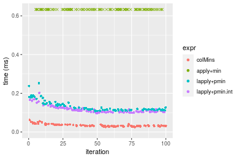


_Table: Benchmarking of colMins() and rowMins() on double+10x1000 data (original and transposed).  The top panel shows times in milliseconds and the bottom panel shows relative times._


|   |expr    |    min|      lq|     mean|  median|     uq|     max|
|:--|:-------|------:|-------:|--------:|-------:|------:|-------:|
|1  |colMins | 25.067| 29.6085| 34.60652| 31.9920| 37.620|  62.044|
|2  |rowMins | 42.748| 47.2885| 54.51159| 51.1535| 58.069| 102.756|


|   |expr    |     min|       lq|     mean|   median|       uq|      max|
|:--|:-------|-------:|--------:|--------:|--------:|--------:|--------:|
|1  |colMins | 1.00000| 1.000000| 1.000000| 1.000000| 1.000000| 1.000000|
|2  |rowMins | 1.70535| 1.597126| 1.575183| 1.598947| 1.543567| 1.656179|

_Figure: Benchmarking of colMins() and rowMins() on double+10x1000 data (original and transposed).  Outliers are displayed as crosses. Times are in milliseconds._


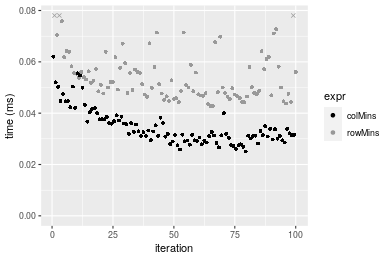

#### 100x1000 double matrix


```r
> X <- data[["100x1000"]]
> gc()
          used  (Mb) gc trigger  (Mb) max used  (Mb)
Ncells 5261485 281.0    7916910 422.9  7916910 422.9
Vcells 9994877  76.3   33191153 253.3 53339345 407.0
> colStats <- microbenchmark(colMins = colMins(X, na.rm = FALSE), `apply+min` = apply(X, MARGIN = 2L, 
+     FUN = min, na.rm = FALSE), `lapply+pmin` = do.call(pmin, lapply(seq_len(nrow(X)), function(i) X[i, 
+     ])), `lapply+pmin.int` = do.call(pmin.int, lapply(seq_len(nrow(X)), function(i) X[i, ])), unit = "ms")
> X <- t(X)
> gc()
           used  (Mb) gc trigger  (Mb) max used  (Mb)
Ncells  5261467 281.0    7916910 422.9  7916910 422.9
Vcells 10094964  77.1   33191153 253.3 53339345 407.0
> rowStats <- microbenchmark(rowMins = rowMins(X, na.rm = FALSE), `apply+min` = apply(X, MARGIN = 1L, 
+     FUN = min, na.rm = FALSE), `lapply+pmin` = do.call(pmin, lapply(seq_len(ncol(X)), function(i) X[, 
+     i])), `lapply+pmin.int` = do.call(pmin.int, lapply(seq_len(ncol(X)), function(i) X[, i])), unit = "ms")
```

_Table: Benchmarking of colMins(), apply+min(), lapply+pmin() and lapply+pmin.int() on double+100x1000 data. The top panel shows times in milliseconds and the bottom panel shows relative times._


|   |expr            |      min|        lq|      mean|    median|        uq|       max|
|:--|:---------------|--------:|---------:|---------:|---------:|---------:|---------:|
|1  |colMins         | 0.127265| 0.1349055| 0.1486744| 0.1405395| 0.1616905|  0.222179|
|4  |lapply+pmin.int | 0.828202| 0.8813465| 1.0957530| 0.9127240| 1.0373565| 13.710847|
|3  |lapply+pmin     | 0.881749| 0.9218375| 1.0259031| 0.9729400| 1.1231360|  1.514968|
|2  |apply+min       | 1.456139| 1.5760315| 1.8804393| 1.6519590| 1.8856640| 15.256789|


|   |expr            |       min|        lq|      mean|    median|        uq|       max|
|:--|:---------------|---------:|---------:|---------:|---------:|---------:|---------:|
|1  |colMins         |  1.000000|  1.000000|  1.000000|  1.000000|  1.000000|  1.000000|
|4  |lapply+pmin.int |  6.507696|  6.533066|  7.370152|  6.494430|  6.415692| 61.710814|
|3  |lapply+pmin     |  6.928449|  6.833209|  6.900334|  6.922894|  6.946209|  6.818682|
|2  |apply+min       | 11.441787| 11.682485| 12.648036| 11.754411| 11.662182| 68.668907|

_Table: Benchmarking of rowMins(), apply+min(), lapply+pmin() and lapply+pmin.int() on double+100x1000 data (transposed). The top panel shows times in milliseconds and the bottom panel shows relative times._


|   |expr            |      min|        lq|      mean|    median|        uq|       max|
|:--|:---------------|--------:|---------:|---------:|---------:|---------:|---------:|
|1  |rowMins         | 0.217670| 0.2241645| 0.2422804| 0.2308085| 0.2469435|  0.330212|
|4  |lapply+pmin.int | 0.549340| 0.5712525| 0.6252280| 0.5996425| 0.6684070|  0.894148|
|3  |lapply+pmin     | 0.609355| 0.6427005| 0.8184364| 0.6692155| 0.7685150| 13.080882|
|2  |apply+min       | 1.462504| 1.5650950| 1.8555314| 1.6297425| 1.8673170| 15.008537|


|   |expr            |      min|       lq|     mean|   median|       uq|      max|
|:--|:---------------|--------:|--------:|--------:|--------:|--------:|--------:|
|1  |rowMins         | 1.000000| 1.000000| 1.000000| 1.000000| 1.000000|  1.00000|
|4  |lapply+pmin.int | 2.523729| 2.548363| 2.580596| 2.598009| 2.706720|  2.70780|
|3  |lapply+pmin     | 2.799444| 2.867093| 3.378054| 2.899440| 3.112109| 39.61359|
|2  |apply+min       | 6.718905| 6.981904| 7.658610| 7.061016| 7.561718| 45.45122|

_Figure: Benchmarking of colMins(), apply+min(), lapply+pmin() and lapply+pmin.int() on double+100x1000 data  as well as rowMins(), apply+min(), lapply+pmin() and lapply+pmin.int() on the same data transposed.  Outliers are displayed as crosses.  Times are in milliseconds._


_Table: Benchmarking of colMins() and rowMins() on double+100x1000 data (original and transposed).  The top panel shows times in milliseconds and the bottom panel shows relative times._


|   |expr    |     min|       lq|     mean|   median|       uq|     max|
|:--|:-------|-------:|--------:|--------:|--------:|--------:|-------:|
|1  |colMins | 127.265| 134.9055| 148.6744| 140.5395| 161.6905| 222.179|
|2  |rowMins | 217.670| 224.1645| 242.2804| 230.8085| 246.9435| 330.212|


|   |expr    |      min|       lq|     mean|   median|      uq|      max|
|:--|:-------|--------:|--------:|--------:|--------:|-------:|--------:|
|1  |colMins | 1.000000| 1.000000| 1.000000| 1.000000| 1.00000| 1.000000|
|2  |rowMins | 1.710368| 1.661641| 1.629604| 1.642303| 1.52726| 1.486243|

_Figure: Benchmarking of colMins() and rowMins() on double+100x1000 data (original and transposed).  Outliers are displayed as crosses. Times are in milliseconds._


#### 1000x100 double matrix


```r
> X <- data[["1000x100"]]
> gc()
          used  (Mb) gc trigger  (Mb) max used  (Mb)
Ncells 5261697 281.1    7916910 422.9  7916910 422.9
Vcells 9995006  76.3   33191153 253.3 53339345 407.0
> colStats <- microbenchmark(colMins = colMins(X, na.rm = FALSE), `apply+min` = apply(X, MARGIN = 2L, 
+     FUN = min, na.rm = FALSE), `lapply+pmin` = do.call(pmin, lapply(seq_len(nrow(X)), function(i) X[i, 
+     ])), `lapply+pmin.int` = do.call(pmin.int, lapply(seq_len(nrow(X)), function(i) X[i, ])), unit = "ms")
> X <- t(X)
> gc()
           used  (Mb) gc trigger  (Mb) max used  (Mb)
Ncells  5261691 281.1    7916910 422.9  7916910 422.9
Vcells 10095113  77.1   33191153 253.3 53339345 407.0
> rowStats <- microbenchmark(rowMins = rowMins(X, na.rm = FALSE), `apply+min` = apply(X, MARGIN = 1L, 
+     FUN = min, na.rm = FALSE), `lapply+pmin` = do.call(pmin, lapply(seq_len(ncol(X)), function(i) X[, 
+     i])), `lapply+pmin.int` = do.call(pmin.int, lapply(seq_len(ncol(X)), function(i) X[, i])), unit = "ms")
```

_Table: Benchmarking of colMins(), apply+min(), lapply+pmin() and lapply+pmin.int() on double+1000x100 data. The top panel shows times in milliseconds and the bottom panel shows relative times._


|   |expr            |      min|        lq|      mean|    median|       uq|       max|
|:--|:---------------|--------:|---------:|---------:|---------:|--------:|---------:|
|1  |colMins         | 0.089180| 0.0981350| 0.1067731| 0.1015805| 0.109393|  0.164375|
|2  |apply+min       | 0.733633| 0.7785275| 1.0328662| 0.8040005| 0.899850| 19.219543|
|4  |lapply+pmin.int | 1.681829| 1.8202495| 1.9878918| 1.9013125| 2.084604|  3.414818|
|3  |lapply+pmin     | 2.181463| 2.3605590| 2.6874884| 2.4375815| 2.667784| 19.271342|


|   |expr            |      min|       lq|      mean|   median|        uq|       max|
|:--|:---------------|--------:|--------:|---------:|--------:|---------:|---------:|
|1  |colMins         |  1.00000|  1.00000|  1.000000|  1.00000|  1.000000|   1.00000|
|2  |apply+min       |  8.22643|  7.93323|  9.673467|  7.91491|  8.225846| 116.92498|
|4  |lapply+pmin.int | 18.85881| 18.54842| 18.617907| 18.71730| 19.056100|  20.77456|
|3  |lapply+pmin     | 24.46135| 24.05420| 25.170087| 23.99655| 24.387159| 117.24010|

_Table: Benchmarking of rowMins(), apply+min(), lapply+pmin() and lapply+pmin.int() on double+1000x100 data (transposed). The top panel shows times in milliseconds and the bottom panel shows relative times._


|   |expr            |      min|        lq|      mean|    median|        uq|       max|
|:--|:---------------|--------:|---------:|---------:|---------:|---------:|---------:|
|1  |rowMins         | 0.194110| 0.2055925| 0.2247365| 0.2121715| 0.2282480|  0.386047|
|2  |apply+min       | 0.734856| 0.7807880| 1.0438740| 0.8124760| 0.9384715| 17.674332|
|4  |lapply+pmin.int | 1.395158| 1.4954840| 1.6229063| 1.5350885| 1.7286160|  2.635179|
|3  |lapply+pmin     | 1.881986| 1.9766720| 2.3272536| 2.0611610| 2.1800355| 20.420684|


|   |expr            |      min|       lq|      mean|   median|       uq|       max|
|:--|:---------------|--------:|--------:|---------:|--------:|--------:|---------:|
|1  |rowMins         | 1.000000| 1.000000|  1.000000| 1.000000| 1.000000|  1.000000|
|2  |apply+min       | 3.785771| 3.797745|  4.644879| 3.829336| 4.111631| 45.782850|
|4  |lapply+pmin.int | 7.187461| 7.274020|  7.221373| 7.235131| 7.573411|  6.826057|
|3  |lapply+pmin     | 9.695461| 9.614514| 10.355476| 9.714599| 9.551170| 52.896886|

_Figure: Benchmarking of colMins(), apply+min(), lapply+pmin() and lapply+pmin.int() on double+1000x100 data  as well as rowMins(), apply+min(), lapply+pmin() and lapply+pmin.int() on the same data transposed.  Outliers are displayed as crosses.  Times are in milliseconds._


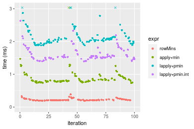
_Table: Benchmarking of colMins() and rowMins() on double+1000x100 data (original and transposed).  The top panel shows times in milliseconds and the bottom panel shows relative times._


|   |expr    |    min|       lq|     mean|   median|      uq|     max|
|:--|:-------|------:|--------:|--------:|--------:|-------:|-------:|
|1  |colMins |  89.18|  98.1350| 106.7731| 101.5805| 109.393| 164.375|
|2  |rowMins | 194.11| 205.5925| 224.7365| 212.1715| 228.248| 386.047|


|   |expr    |      min|       lq|     mean|   median|       uq|      max|
|:--|:-------|--------:|--------:|--------:|--------:|--------:|--------:|
|1  |colMins | 1.000000| 1.000000| 1.000000| 1.000000| 1.000000| 1.000000|
|2  |rowMins | 2.176609| 2.094997| 2.104804| 2.088703| 2.086495| 2.348575|

_Figure: Benchmarking of colMins() and rowMins() on double+1000x100 data (original and transposed).  Outliers are displayed as crosses. Times are in milliseconds._


## Appendix

### Session information
```r
R version 4.1.1 Patched (2021-08-10 r80727)
Platform: x86_64-pc-linux-gnu (64-bit)
Running under: Ubuntu 18.04.5 LTS

Matrix products: default
BLAS:   /home/hb/software/R-devel/R-4-1-branch/lib/R/lib/libRblas.so
LAPACK: /home/hb/software/R-devel/R-4-1-branch/lib/R/lib/libRlapack.so

locale:
 [1] LC_CTYPE=en_US.UTF-8       LC_NUMERIC=C              
 [3] LC_TIME=en_US.UTF-8        LC_COLLATE=en_US.UTF-8    
 [5] LC_MONETARY=en_US.UTF-8    LC_MESSAGES=en_US.UTF-8   
 [7] LC_PAPER=en_US.UTF-8       LC_NAME=C                 
 [9] LC_ADDRESS=C               LC_TELEPHONE=C            
[11] LC_MEASUREMENT=en_US.UTF-8 LC_IDENTIFICATION=C       

attached base packages:
[1] stats     graphics  grDevices utils     datasets  methods   base     

other attached packages:
[1] microbenchmark_1.4-7   matrixStats_0.60.0     ggplot2_3.3.5         
[4] knitr_1.33             R.devices_2.17.0       R.utils_2.10.1        
[7] R.oo_1.24.0            R.methodsS3_1.8.1-9001 history_0.0.1-9000    

loaded via a namespace (and not attached):
 [1] Biobase_2.52.0          httr_1.4.2              splines_4.1.1          
 [4] bit64_4.0.5             network_1.17.1          assertthat_0.2.1       
 [7] highr_0.9               stats4_4.1.1            blob_1.2.2             
[10] GenomeInfoDbData_1.2.6  robustbase_0.93-8       pillar_1.6.2           
[13] RSQLite_2.2.8           lattice_0.20-44         glue_1.4.2             
[16] digest_0.6.27           XVector_0.32.0          colorspace_2.0-2       
[19] Matrix_1.3-4            XML_3.99-0.7            pkgconfig_2.0.3        
[22] zlibbioc_1.38.0         genefilter_1.74.0       purrr_0.3.4            
[25] ergm_4.1.2              xtable_1.8-4            scales_1.1.1           
[28] tibble_3.1.4            annotate_1.70.0         KEGGREST_1.32.0        
[31] farver_2.1.0            generics_0.1.0          IRanges_2.26.0         
[34] ellipsis_0.3.2          cachem_1.0.6            withr_2.4.2            
[37] BiocGenerics_0.38.0     mime_0.11               survival_3.2-13        
[40] magrittr_2.0.1          crayon_1.4.1            statnet.common_4.5.0   
[43] memoise_2.0.0           laeken_0.5.1            fansi_0.5.0            
[46] R.cache_0.15.0          MASS_7.3-54             R.rsp_0.44.0           
[49] progressr_0.8.0         tools_4.1.1             lifecycle_1.0.0        
[52] S4Vectors_0.30.0        trust_0.1-8             munsell_0.5.0          
[55] tabby_0.0.1-9001        AnnotationDbi_1.54.1    Biostrings_2.60.2      
[58] compiler_4.1.1          GenomeInfoDb_1.28.1     rlang_0.4.11           
[61] grid_4.1.1              RCurl_1.98-1.4          cwhmisc_6.6            
[64] rstudioapi_0.13         rappdirs_0.3.3          startup_0.15.0         
[67] labeling_0.4.2          bitops_1.0-7            base64enc_0.1-3        
[70] boot_1.3-28             gtable_0.3.0            DBI_1.1.1              
[73] markdown_1.1            R6_2.5.1                lpSolveAPI_5.5.2.0-17.7
[76] rle_0.9.2               dplyr_1.0.7             fastmap_1.1.0          
[79] bit_4.0.4               utf8_1.2.2              parallel_4.1.1         
[82] Rcpp_1.0.7              vctrs_0.3.8             png_0.1-7              
[85] DEoptimR_1.0-9          tidyselect_1.1.1        xfun_0.25              
[88] coda_0.19-4            
```
Total processing time was 29.38 secs.


### Reproducibility
To reproduce this report, do:
```r
html <- matrixStats:::benchmark('colMins')
```

[RSP]: https://cran.r-project.org/package=R.rsp
[matrixStats]: https://cran.r-project.org/package=matrixStats

[StackOverflow:colMins?]: https://stackoverflow.com/questions/13676878 "Stack Overflow: fastest way to get Min from every column in a matrix?"
[StackOverflow:colSds?]: https://stackoverflow.com/questions/17549762 "Stack Overflow: Is there such 'colsd' in R?"
[StackOverflow:rowProds?]: https://stackoverflow.com/questions/20198801/ "Stack Overflow: Row product of matrix and column sum of matrix"

---------------------------------------
Copyright Henrik Bengtsson. Last updated on 2021-08-25 22:21:53 (+0200 UTC). Powered by [RSP].

<script>
 var link = document.createElement('link');
 link.rel = 'icon';
 link.href = "data:image/png;base64,iVBORw0KGgoAAAANSUhEUgAAACAAAAAgCAMAAABEpIrGAAAA21BMVEUAAAAAAP8AAP8AAP8AAP8AAP8AAP8AAP8AAP8AAP8AAP8AAP8AAP8AAP8AAP8AAP8AAP8AAP8AAP8AAP8AAP8AAP8AAP8AAP8AAP8AAP8AAP8AAP8AAP8AAP8AAP8AAP8AAP8AAP8AAP8AAP8AAP8AAP8AAP8AAP8AAP8AAP8BAf4CAv0DA/wdHeIeHuEfH+AgIN8hId4lJdomJtknJ9g+PsE/P8BAQL9yco10dIt1dYp3d4h4eIeVlWqWlmmXl2iYmGeZmWabm2Tn5xjo6Bfp6Rb39wj4+Af//wA2M9hbAAAASXRSTlMAAQIJCgsMJSYnKD4/QGRlZmhpamtsbautrrCxuru8y8zN5ebn6Pn6+///////////////////////////////////////////LsUNcQAAAS9JREFUOI29k21XgkAQhVcFytdSMqMETU26UVqGmpaiFbL//xc1cAhhwVNf6n5i5z67M2dmYOyfJZUqlVLhkKucG7cgmUZTybDz6g0iDeq51PUr37Ds2cy2/C9NeES5puDjxuUk1xnToZsg8pfA3avHQ3lLIi7iWRrkv/OYtkScxBIMgDee0ALoyxHQBJ68JLCjOtQIMIANF7QG9G9fNnHvisCHBVMKgSJgiz7nE+AoBKrAPA3MgepvgR9TSCasrCKH0eB1wBGBFdCO+nAGjMVGPcQb5bd6mQRegN6+1axOs9nGfYcCtfi4NQosdtH7dB+txFIpXQqN1p9B/asRHToyS0jRgpV7nk4nwcq1BJ+x3Gl/v7S9Wmpp/aGquum7w3ZDyrADFYrl8vHBH+ev9AUASW1dmU4h4wAAAABJRU5ErkJggg=="
 document.getElementsByTagName('head')[0].appendChild(link);
</script>


