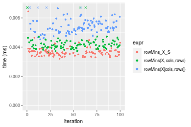
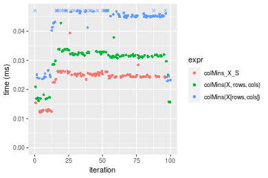
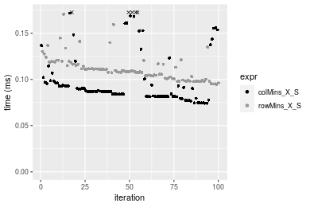
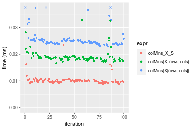
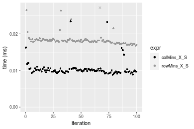
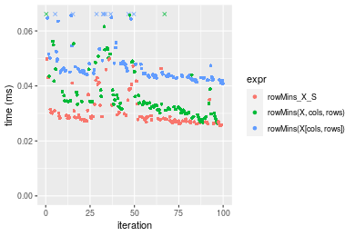
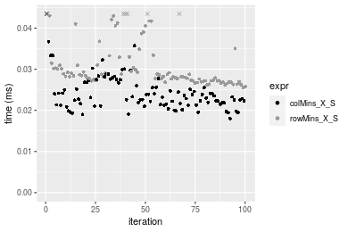
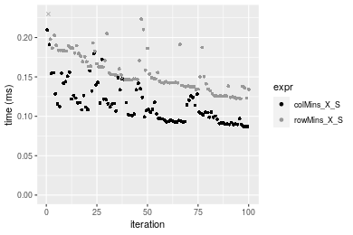
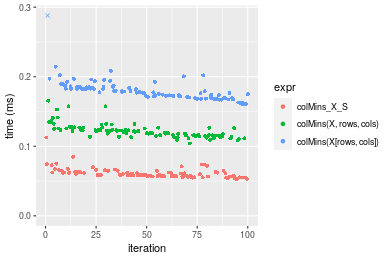
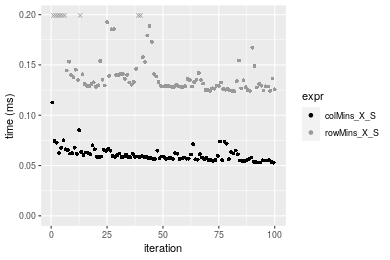

[matrixStats]: Benchmark report

---------------------------------------


# colMins() and rowMins() benchmarks on subsetted computation

This report benchmark the performance of colMins() and rowMins() on subsetted computation.


## Data type "integer"

### Data
```r
> rmatrix <- function(nrow, ncol, mode = c("logical", "double", "integer", "index"), range = c(-100, 
+     +100), na_prob = 0) {
+     mode <- match.arg(mode)
+     n <- nrow * ncol
+     if (mode == "logical") {
+         x <- sample(c(FALSE, TRUE), size = n, replace = TRUE)
+     }     else if (mode == "index") {
+         x <- seq_len(n)
+         mode <- "integer"
+     }     else {
+         x <- runif(n, min = range[1], max = range[2])
+     }
+     storage.mode(x) <- mode
+     if (na_prob > 0) 
+         x[sample(n, size = na_prob * n)] <- NA
+     dim(x) <- c(nrow, ncol)
+     x
+ }
> rmatrices <- function(scale = 10, seed = 1, ...) {
+     set.seed(seed)
+     data <- list()
+     data[[1]] <- rmatrix(nrow = scale * 1, ncol = scale * 1, ...)
+     data[[2]] <- rmatrix(nrow = scale * 10, ncol = scale * 10, ...)
+     data[[3]] <- rmatrix(nrow = scale * 100, ncol = scale * 1, ...)
+     data[[4]] <- t(data[[3]])
+     data[[5]] <- rmatrix(nrow = scale * 10, ncol = scale * 100, ...)
+     data[[6]] <- t(data[[5]])
+     names(data) <- sapply(data, FUN = function(x) paste(dim(x), collapse = "x"))
+     data
+ }
> data <- rmatrices(mode = mode)
```

### Results

#### 10x10 integer matrix


```r
> X <- data[["10x10"]]
> rows <- sample.int(nrow(X), size = nrow(X) * 0.7)
> cols <- sample.int(ncol(X), size = ncol(X) * 0.7)
> X_S <- X[rows, cols]
> gc()
           used  (Mb) gc trigger  (Mb) max used  (Mb)
Ncells  5268973 281.4    7916910 422.9  7916910 422.9
Vcells 10216448  78.0   33191153 253.3 53339345 407.0
> colStats <- microbenchmark(colMins_X_S = colMins(X_S, na.rm = FALSE), `colMins(X, rows, cols)` = colMins(X, 
+     rows = rows, cols = cols, na.rm = FALSE), `colMins(X[rows, cols])` = colMins(X[rows, cols], na.rm = FALSE), 
+     unit = "ms")
> X <- t(X)
> X_S <- t(X_S)
> gc()
           used  (Mb) gc trigger  (Mb) max used  (Mb)
Ncells  5256234 280.8    7916910 422.9  7916910 422.9
Vcells 10174214  77.7   33191153 253.3 53339345 407.0
> rowStats <- microbenchmark(rowMins_X_S = rowMins(X_S, na.rm = FALSE), `rowMins(X, cols, rows)` = rowMins(X, 
+     rows = cols, cols = rows, na.rm = FALSE), `rowMins(X[cols, rows])` = rowMins(X[cols, rows], na.rm = FALSE), 
+     unit = "ms")
```

_Table: Benchmarking of colMins_X_S(), colMins(X, rows, cols)() and colMins(X[rows, cols])() on integer+10x10 data. The top panel shows times in milliseconds and the bottom panel shows relative times._


|   |expr                   |      min|        lq|      mean|    median|        uq|      max|
|:--|:----------------------|--------:|---------:|---------:|---------:|---------:|--------:|
|1  |colMins_X_S            | 0.002035| 0.0021205| 0.0043266| 0.0021885| 0.0024690| 0.179827|
|2  |colMins(X, rows, cols) | 0.002415| 0.0025015| 0.0029077| 0.0026065| 0.0027655| 0.005682|
|3  |colMins(X[rows, cols]) | 0.002798| 0.0031070| 0.0037563| 0.0032395| 0.0035045| 0.010028|


|   |expr                   |      min|       lq|      mean|   median|       uq|       max|
|:--|:----------------------|--------:|--------:|---------:|--------:|--------:|---------:|
|1  |colMins_X_S            | 1.000000| 1.000000| 1.0000000| 1.000000| 1.000000| 1.0000000|
|2  |colMins(X, rows, cols) | 1.186732| 1.179675| 0.6720504| 1.190998| 1.120089| 0.0315970|
|3  |colMins(X[rows, cols]) | 1.374939| 1.465221| 0.8681892| 1.480238| 1.419401| 0.0557647|

_Table: Benchmarking of rowMins_X_S(), rowMins(X, cols, rows)() and rowMins(X[cols, rows])() on integer+10x10 data (transposed). The top panel shows times in milliseconds and the bottom panel shows relative times._


|   |expr                   |      min|        lq|      mean|    median|        uq|      max|
|:--|:----------------------|--------:|---------:|---------:|---------:|---------:|--------:|
|1  |rowMins_X_S            | 0.003193| 0.0034715| 0.0036700| 0.0036100| 0.0037365| 0.006445|
|2  |rowMins(X, cols, rows) | 0.003682| 0.0039600| 0.0065779| 0.0041345| 0.0043695| 0.226264|
|3  |rowMins(X[cols, rows]) | 0.004535| 0.0050790| 0.0055550| 0.0053325| 0.0057570| 0.012191|


|   |expr                   |      min|       lq|     mean|   median|       uq|       max|
|:--|:----------------------|--------:|--------:|--------:|--------:|--------:|---------:|
|1  |rowMins_X_S            | 1.000000| 1.000000| 1.000000| 1.000000| 1.000000|  1.000000|
|2  |rowMins(X, cols, rows) | 1.153147| 1.140717| 1.792318| 1.145291| 1.169410| 35.106905|
|3  |rowMins(X[cols, rows]) | 1.420294| 1.463056| 1.513617| 1.477147| 1.540747|  1.891544|

_Figure: Benchmarking of colMins_X_S(), colMins(X, rows, cols)() and colMins(X[rows, cols])() on integer+10x10 data  as well as rowMins_X_S(), rowMins(X, cols, rows)() and rowMins(X[cols, rows])() on the same data transposed.  Outliers are displayed as crosses.  Times are in milliseconds._



_Table: Benchmarking of colMins_X_S() and rowMins_X_S() on integer+10x10 data (original and transposed).  The top panel shows times in milliseconds and the bottom panel shows relative times._


|   |expr        |   min|     lq|    mean| median|     uq|     max|
|:--|:-----------|-----:|------:|-------:|------:|------:|-------:|
|1  |colMins_X_S | 2.035| 2.1205| 4.32658| 2.1885| 2.4690| 179.827|
|2  |rowMins_X_S | 3.193| 3.4715| 3.67003| 3.6100| 3.7365|   6.445|


|   |expr        |      min|       lq|     mean|   median|       uq|     max|
|:--|:-----------|--------:|--------:|--------:|--------:|--------:|-------:|
|1  |colMins_X_S | 1.000000| 1.000000| 1.000000| 1.000000| 1.000000| 1.00000|
|2  |rowMins_X_S | 1.569042| 1.637114| 0.848252| 1.649532| 1.513366| 0.03584|

_Figure: Benchmarking of colMins_X_S() and rowMins_X_S() on integer+10x10 data (original and transposed).  Outliers are displayed as crosses. Times are in milliseconds._


#### 100x100 integer matrix


```r
> X <- data[["100x100"]]
> rows <- sample.int(nrow(X), size = nrow(X) * 0.7)
> cols <- sample.int(ncol(X), size = ncol(X) * 0.7)
> X_S <- X[rows, cols]
> gc()
          used  (Mb) gc trigger  (Mb) max used  (Mb)
Ncells 5254937 280.7    7916910 422.9  7916910 422.9
Vcells 9843298  75.1   33191153 253.3 53339345 407.0
> colStats <- microbenchmark(colMins_X_S = colMins(X_S, na.rm = FALSE), `colMins(X, rows, cols)` = colMins(X, 
+     rows = rows, cols = cols, na.rm = FALSE), `colMins(X[rows, cols])` = colMins(X[rows, cols], na.rm = FALSE), 
+     unit = "ms")
> X <- t(X)
> X_S <- t(X_S)
> gc()
          used  (Mb) gc trigger  (Mb) max used  (Mb)
Ncells 5254931 280.7    7916910 422.9  7916910 422.9
Vcells 9848381  75.2   33191153 253.3 53339345 407.0
> rowStats <- microbenchmark(rowMins_X_S = rowMins(X_S, na.rm = FALSE), `rowMins(X, cols, rows)` = rowMins(X, 
+     rows = cols, cols = rows, na.rm = FALSE), `rowMins(X[cols, rows])` = rowMins(X[cols, rows], na.rm = FALSE), 
+     unit = "ms")
```

_Table: Benchmarking of colMins_X_S(), colMins(X, rows, cols)() and colMins(X[rows, cols])() on integer+100x100 data. The top panel shows times in milliseconds and the bottom panel shows relative times._


|   |expr                   |      min|        lq|      mean|    median|        uq|      max|
|:--|:----------------------|--------:|---------:|---------:|---------:|---------:|--------:|
|1  |colMins_X_S            | 0.013694| 0.0141990| 0.0153610| 0.0145165| 0.0149595| 0.031697|
|2  |colMins(X, rows, cols) | 0.017540| 0.0180960| 0.0201012| 0.0187155| 0.0195865| 0.049373|
|3  |colMins(X[rows, cols]) | 0.023019| 0.0238335| 0.0261700| 0.0245290| 0.0257800| 0.070284|


|   |expr                   |      min|       lq|     mean|   median|       uq|      max|
|:--|:----------------------|--------:|--------:|--------:|--------:|--------:|--------:|
|1  |colMins_X_S            | 1.000000| 1.000000| 1.000000| 1.000000| 1.000000| 1.000000|
|2  |colMins(X, rows, cols) | 1.280853| 1.274456| 1.308585| 1.289257| 1.309302| 1.557655|
|3  |colMins(X[rows, cols]) | 1.680955| 1.678534| 1.703663| 1.689732| 1.723320| 2.217371|

_Table: Benchmarking of rowMins_X_S(), rowMins(X, cols, rows)() and rowMins(X[cols, rows])() on integer+100x100 data (transposed). The top panel shows times in milliseconds and the bottom panel shows relative times._


|   |expr                   |      min|       lq|      mean|    median|        uq|      max|
|:--|:----------------------|--------:|--------:|---------:|---------:|---------:|--------:|
|1  |rowMins_X_S            | 0.016432| 0.017082| 0.0177373| 0.0173750| 0.0179165| 0.027156|
|2  |rowMins(X, cols, rows) | 0.019507| 0.020242| 0.0218397| 0.0206080| 0.0212705| 0.059040|
|3  |rowMins(X[cols, rows]) | 0.027337| 0.027821| 0.0289056| 0.0283285| 0.0292650| 0.042700|


|   |expr                   |      min|       lq|     mean|   median|       uq|      max|
|:--|:----------------------|--------:|--------:|--------:|--------:|--------:|--------:|
|1  |rowMins_X_S            | 1.000000| 1.000000| 1.000000| 1.000000| 1.000000| 1.000000|
|2  |rowMins(X, cols, rows) | 1.187135| 1.184990| 1.231288| 1.186072| 1.187202| 2.174105|
|3  |rowMins(X[cols, rows]) | 1.663644| 1.628674| 1.629650| 1.630417| 1.633411| 1.572396|

_Figure: Benchmarking of colMins_X_S(), colMins(X, rows, cols)() and colMins(X[rows, cols])() on integer+100x100 data  as well as rowMins_X_S(), rowMins(X, cols, rows)() and rowMins(X[cols, rows])() on the same data transposed.  Outliers are displayed as crosses.  Times are in milliseconds._


_Table: Benchmarking of colMins_X_S() and rowMins_X_S() on integer+100x100 data (original and transposed).  The top panel shows times in milliseconds and the bottom panel shows relative times._


|   |expr        |    min|     lq|     mean|  median|      uq|    max|
|:--|:-----------|------:|------:|--------:|-------:|-------:|------:|
|1  |colMins_X_S | 13.694| 14.199| 15.36103| 14.5165| 14.9595| 31.697|
|2  |rowMins_X_S | 16.432| 17.082| 17.73731| 17.3750| 17.9165| 27.156|


|   |expr        |      min|       lq|     mean|   median|       uq|       max|
|:--|:-----------|--------:|--------:|--------:|--------:|--------:|---------:|
|1  |colMins_X_S | 1.000000| 1.000000| 1.000000| 1.000000| 1.000000| 1.0000000|
|2  |rowMins_X_S | 1.199942| 1.203043| 1.154695| 1.196914| 1.197667| 0.8567372|

_Figure: Benchmarking of colMins_X_S() and rowMins_X_S() on integer+100x100 data (original and transposed).  Outliers are displayed as crosses. Times are in milliseconds._


#### 1000x10 integer matrix


```r
> X <- data[["1000x10"]]
> rows <- sample.int(nrow(X), size = nrow(X) * 0.7)
> cols <- sample.int(ncol(X), size = ncol(X) * 0.7)
> X_S <- X[rows, cols]
> gc()
          used  (Mb) gc trigger  (Mb) max used  (Mb)
Ncells 5255679 280.7    7916910 422.9  7916910 422.9
Vcells 9847340  75.2   33191153 253.3 53339345 407.0
> colStats <- microbenchmark(colMins_X_S = colMins(X_S, na.rm = FALSE), `colMins(X, rows, cols)` = colMins(X, 
+     rows = rows, cols = cols, na.rm = FALSE), `colMins(X[rows, cols])` = colMins(X[rows, cols], na.rm = FALSE), 
+     unit = "ms")
> X <- t(X)
> X_S <- t(X_S)
> gc()
          used  (Mb) gc trigger  (Mb) max used  (Mb)
Ncells 5255673 280.7    7916910 422.9  7916910 422.9
Vcells 9852423  75.2   33191153 253.3 53339345 407.0
> rowStats <- microbenchmark(rowMins_X_S = rowMins(X_S, na.rm = FALSE), `rowMins(X, cols, rows)` = rowMins(X, 
+     rows = cols, cols = rows, na.rm = FALSE), `rowMins(X[cols, rows])` = rowMins(X[cols, rows], na.rm = FALSE), 
+     unit = "ms")
```

_Table: Benchmarking of colMins_X_S(), colMins(X, rows, cols)() and colMins(X[rows, cols])() on integer+1000x10 data. The top panel shows times in milliseconds and the bottom panel shows relative times._


|   |expr                   |      min|        lq|      mean|    median|        uq|      max|
|:--|:----------------------|--------:|---------:|---------:|---------:|---------:|--------:|
|1  |colMins_X_S            | 0.012131| 0.0241615| 0.0232703| 0.0247145| 0.0252980| 0.039351|
|2  |colMins(X, rows, cols) | 0.015570| 0.0311600| 0.0302342| 0.0316410| 0.0325550| 0.049335|
|3  |colMins(X[rows, cols]) | 0.022870| 0.0448585| 0.0434025| 0.0453020| 0.0471425| 0.081244|


|   |expr                   |      min|       lq|     mean|   median|       uq|      max|
|:--|:----------------------|--------:|--------:|--------:|--------:|--------:|--------:|
|1  |colMins_X_S            | 1.000000| 1.000000| 1.000000| 1.000000| 1.000000| 1.000000|
|2  |colMins(X, rows, cols) | 1.283489| 1.289655| 1.299261| 1.280261| 1.286861| 1.253717|
|3  |colMins(X[rows, cols]) | 1.885253| 1.856611| 1.865144| 1.833013| 1.863487| 2.064598|

_Table: Benchmarking of rowMins_X_S(), rowMins(X, cols, rows)() and rowMins(X[cols, rows])() on integer+1000x10 data (transposed). The top panel shows times in milliseconds and the bottom panel shows relative times._


|   |expr                   |      min|        lq|      mean|    median|        uq|      max|
|:--|:----------------------|--------:|---------:|---------:|---------:|---------:|--------:|
|1  |rowMins_X_S            | 0.012845| 0.0131460| 0.0139520| 0.0133030| 0.0134370| 0.027972|
|2  |rowMins(X, cols, rows) | 0.016323| 0.0165285| 0.0169706| 0.0166870| 0.0169000| 0.026606|
|3  |rowMins(X[cols, rows]) | 0.024136| 0.0244920| 0.0254436| 0.0246795| 0.0249525| 0.071586|


|   |expr                   |      min|       lq|     mean|   median|       uq|       max|
|:--|:----------------------|--------:|--------:|--------:|--------:|--------:|---------:|
|1  |rowMins_X_S            | 1.000000| 1.000000| 1.000000| 1.000000| 1.000000| 1.0000000|
|2  |rowMins(X, cols, rows) | 1.270767| 1.257303| 1.216359| 1.254379| 1.257721| 0.9511655|
|3  |rowMins(X[cols, rows]) | 1.879019| 1.863076| 1.823656| 1.855183| 1.856999| 2.5592021|

_Figure: Benchmarking of colMins_X_S(), colMins(X, rows, cols)() and colMins(X[rows, cols])() on integer+1000x10 data  as well as rowMins_X_S(), rowMins(X, cols, rows)() and rowMins(X[cols, rows])() on the same data transposed.  Outliers are displayed as crosses.  Times are in milliseconds._





_Table: Benchmarking of colMins_X_S() and rowMins_X_S() on integer+1000x10 data (original and transposed).  The top panel shows times in milliseconds and the bottom panel shows relative times._


|   |expr        |    min|      lq|     mean|  median|     uq|    max|
|:--|:-----------|------:|-------:|--------:|-------:|------:|------:|
|2  |rowMins_X_S | 12.845| 13.1460| 13.95198| 13.3030| 13.437| 27.972|
|1  |colMins_X_S | 12.131| 24.1615| 23.27031| 24.7145| 25.298| 39.351|


|   |expr        |       min|       lq|     mean|   median|       uq|    max|
|:--|:-----------|---------:|--------:|--------:|--------:|--------:|------:|
|2  |rowMins_X_S | 1.0000000| 1.000000| 1.000000| 1.000000| 1.000000| 1.0000|
|1  |colMins_X_S | 0.9444142| 1.837935| 1.667886| 1.857814| 1.882712| 1.4068|

_Figure: Benchmarking of colMins_X_S() and rowMins_X_S() on integer+1000x10 data (original and transposed).  Outliers are displayed as crosses. Times are in milliseconds._


#### 10x1000 integer matrix


```r
> X <- data[["10x1000"]]
> rows <- sample.int(nrow(X), size = nrow(X) * 0.7)
> cols <- sample.int(ncol(X), size = ncol(X) * 0.7)
> X_S <- X[rows, cols]
> gc()
          used  (Mb) gc trigger  (Mb) max used  (Mb)
Ncells 5255883 280.7    7916910 422.9  7916910 422.9
Vcells 9848159  75.2   33191153 253.3 53339345 407.0
> colStats <- microbenchmark(colMins_X_S = colMins(X_S, na.rm = FALSE), `colMins(X, rows, cols)` = colMins(X, 
+     rows = rows, cols = cols, na.rm = FALSE), `colMins(X[rows, cols])` = colMins(X[rows, cols], na.rm = FALSE), 
+     unit = "ms")
> X <- t(X)
> X_S <- t(X_S)
> gc()
          used  (Mb) gc trigger  (Mb) max used  (Mb)
Ncells 5255877 280.7    7916910 422.9  7916910 422.9
Vcells 9853242  75.2   33191153 253.3 53339345 407.0
> rowStats <- microbenchmark(rowMins_X_S = rowMins(X_S, na.rm = FALSE), `rowMins(X, cols, rows)` = rowMins(X, 
+     rows = cols, cols = rows, na.rm = FALSE), `rowMins(X[cols, rows])` = rowMins(X[cols, rows], na.rm = FALSE), 
+     unit = "ms")
```

_Table: Benchmarking of colMins_X_S(), colMins(X, rows, cols)() and colMins(X[rows, cols])() on integer+10x1000 data. The top panel shows times in milliseconds and the bottom panel shows relative times._


|   |expr                   |      min|        lq|      mean|    median|        uq|      max|
|:--|:----------------------|--------:|---------:|---------:|---------:|---------:|--------:|
|1  |colMins_X_S            | 0.021281| 0.0220745| 0.0248124| 0.0227165| 0.0242525| 0.060299|
|2  |colMins(X, rows, cols) | 0.024593| 0.0252180| 0.0283586| 0.0259455| 0.0268240| 0.067430|
|3  |colMins(X[rows, cols]) | 0.030502| 0.0316420| 0.0362147| 0.0326805| 0.0368075| 0.059531|


|   |expr                   |      min|       lq|     mean|   median|       uq|       max|
|:--|:----------------------|--------:|--------:|--------:|--------:|--------:|---------:|
|1  |colMins_X_S            | 1.000000| 1.000000| 1.000000| 1.000000| 1.000000| 1.0000000|
|2  |colMins(X, rows, cols) | 1.155632| 1.142404| 1.142919| 1.142143| 1.106030| 1.1182607|
|3  |colMins(X[rows, cols]) | 1.433297| 1.433419| 1.459539| 1.438624| 1.517679| 0.9872635|

_Table: Benchmarking of rowMins_X_S(), rowMins(X, cols, rows)() and rowMins(X[cols, rows])() on integer+10x1000 data (transposed). The top panel shows times in milliseconds and the bottom panel shows relative times._


|   |expr                   |      min|        lq|      mean|    median|        uq|      max|
|:--|:----------------------|--------:|---------:|---------:|---------:|---------:|--------:|
|1  |rowMins_X_S            | 0.021779| 0.0228345| 0.0243946| 0.0235275| 0.0243565| 0.060428|
|2  |rowMins(X, cols, rows) | 0.027299| 0.0288975| 0.0306052| 0.0296830| 0.0301040| 0.063419|
|3  |rowMins(X[cols, rows]) | 0.031499| 0.0326040| 0.0336025| 0.0332335| 0.0338295| 0.048796|


|   |expr                   |      min|       lq|     mean|   median|       uq|       max|
|:--|:----------------------|--------:|--------:|--------:|--------:|--------:|---------:|
|1  |rowMins_X_S            | 1.000000| 1.000000| 1.000000| 1.000000| 1.000000| 1.0000000|
|2  |rowMins(X, cols, rows) | 1.253455| 1.265519| 1.254586| 1.261630| 1.235974| 1.0494969|
|3  |rowMins(X[cols, rows]) | 1.446301| 1.427839| 1.377456| 1.412538| 1.388931| 0.8075065|

_Figure: Benchmarking of colMins_X_S(), colMins(X, rows, cols)() and colMins(X[rows, cols])() on integer+10x1000 data  as well as rowMins_X_S(), rowMins(X, cols, rows)() and rowMins(X[cols, rows])() on the same data transposed.  Outliers are displayed as crosses.  Times are in milliseconds._


_Table: Benchmarking of colMins_X_S() and rowMins_X_S() on integer+10x1000 data (original and transposed).  The top panel shows times in milliseconds and the bottom panel shows relative times._


|   |expr        |    min|      lq|     mean|  median|      uq|    max|
|:--|:-----------|------:|-------:|--------:|-------:|-------:|------:|
|1  |colMins_X_S | 21.281| 22.0745| 24.81245| 22.7165| 24.2525| 60.299|
|2  |rowMins_X_S | 21.779| 22.8345| 24.39463| 23.5275| 24.3565| 60.428|


|   |expr        |      min|       lq|      mean|   median|       uq|      max|
|:--|:-----------|--------:|--------:|---------:|--------:|--------:|--------:|
|1  |colMins_X_S | 1.000000| 1.000000| 1.0000000| 1.000000| 1.000000| 1.000000|
|2  |rowMins_X_S | 1.023401| 1.034429| 0.9831609| 1.035701| 1.004288| 1.002139|

_Figure: Benchmarking of colMins_X_S() and rowMins_X_S() on integer+10x1000 data (original and transposed).  Outliers are displayed as crosses. Times are in milliseconds._


#### 100x1000 integer matrix


```r
> X <- data[["100x1000"]]
> rows <- sample.int(nrow(X), size = nrow(X) * 0.7)
> cols <- sample.int(ncol(X), size = ncol(X) * 0.7)
> X_S <- X[rows, cols]
> gc()
          used  (Mb) gc trigger  (Mb) max used  (Mb)
Ncells 5256096 280.8    7916910 422.9  7916910 422.9
Vcells 9870825  75.4   33191153 253.3 53339345 407.0
> colStats <- microbenchmark(colMins_X_S = colMins(X_S, na.rm = FALSE), `colMins(X, rows, cols)` = colMins(X, 
+     rows = rows, cols = cols, na.rm = FALSE), `colMins(X[rows, cols])` = colMins(X[rows, cols], na.rm = FALSE), 
+     unit = "ms")
> X <- t(X)
> X_S <- t(X_S)
> gc()
          used  (Mb) gc trigger  (Mb) max used  (Mb)
Ncells 5256090 280.8    7916910 422.9  7916910 422.9
Vcells 9920908  75.7   33191153 253.3 53339345 407.0
> rowStats <- microbenchmark(rowMins_X_S = rowMins(X_S, na.rm = FALSE), `rowMins(X, cols, rows)` = rowMins(X, 
+     rows = cols, cols = rows, na.rm = FALSE), `rowMins(X[cols, rows])` = rowMins(X[cols, rows], na.rm = FALSE), 
+     unit = "ms")
```

_Table: Benchmarking of colMins_X_S(), colMins(X, rows, cols)() and colMins(X[rows, cols])() on integer+100x1000 data. The top panel shows times in milliseconds and the bottom panel shows relative times._


|   |expr                   |      min|       lq|      mean|    median|        uq|      max|
|:--|:----------------------|--------:|--------:|---------:|---------:|---------:|--------:|
|1  |colMins_X_S            | 0.110041| 0.118681| 0.1325330| 0.1268325| 0.1416945| 0.251385|
|2  |colMins(X, rows, cols) | 0.137480| 0.147516| 0.1631676| 0.1559895| 0.1750660| 0.265372|
|3  |colMins(X[rows, cols]) | 0.188574| 0.205857| 0.2344054| 0.2208370| 0.2430135| 0.509236|


|   |expr                   |      min|       lq|     mean|   median|       uq|      max|
|:--|:----------------------|--------:|--------:|--------:|--------:|--------:|--------:|
|1  |colMins_X_S            | 1.000000| 1.000000| 1.000000| 1.000000| 1.000000| 1.000000|
|2  |colMins(X, rows, cols) | 1.249353| 1.242962| 1.231146| 1.229886| 1.235517| 1.055640|
|3  |colMins(X[rows, cols]) | 1.713670| 1.734541| 1.768657| 1.741170| 1.715053| 2.025721|

_Table: Benchmarking of rowMins_X_S(), rowMins(X, cols, rows)() and rowMins(X[cols, rows])() on integer+100x1000 data (transposed). The top panel shows times in milliseconds and the bottom panel shows relative times._


|   |expr                   |      min|        lq|      mean|    median|        uq|      max|
|:--|:----------------------|--------:|---------:|---------:|---------:|---------:|--------:|
|1  |rowMins_X_S            | 0.115127| 0.1255520| 0.1358057| 0.1305705| 0.1400010| 0.239547|
|2  |rowMins(X, cols, rows) | 0.135884| 0.1446415| 0.1612695| 0.1535720| 0.1663995| 0.278447|
|3  |rowMins(X[cols, rows]) | 0.186785| 0.2042905| 0.2251474| 0.2156145| 0.2345030| 0.417285|


|   |expr                   |      min|       lq|     mean|   median|       uq|      max|
|:--|:----------------------|--------:|--------:|--------:|--------:|--------:|--------:|
|1  |rowMins_X_S            | 1.000000| 1.000000| 1.000000| 1.000000| 1.000000| 1.000000|
|2  |rowMins(X, cols, rows) | 1.180297| 1.152045| 1.187502| 1.176162| 1.188559| 1.162390|
|3  |rowMins(X[cols, rows]) | 1.622426| 1.627139| 1.657865| 1.651326| 1.675010| 1.741975|

_Figure: Benchmarking of colMins_X_S(), colMins(X, rows, cols)() and colMins(X[rows, cols])() on integer+100x1000 data  as well as rowMins_X_S(), rowMins(X, cols, rows)() and rowMins(X[cols, rows])() on the same data transposed.  Outliers are displayed as crosses.  Times are in milliseconds._


_Table: Benchmarking of colMins_X_S() and rowMins_X_S() on integer+100x1000 data (original and transposed).  The top panel shows times in milliseconds and the bottom panel shows relative times._


|   |expr        |     min|      lq|     mean|   median|       uq|     max|
|:--|:-----------|-------:|-------:|--------:|--------:|--------:|-------:|
|1  |colMins_X_S | 110.041| 118.681| 132.5330| 126.8325| 141.6945| 251.385|
|2  |rowMins_X_S | 115.127| 125.552| 135.8057| 130.5705| 140.0010| 239.547|


|   |expr        |      min|       lq|     mean|   median|        uq|       max|
|:--|:-----------|--------:|--------:|--------:|--------:|---------:|---------:|
|1  |colMins_X_S | 1.000000| 1.000000| 1.000000| 1.000000| 1.0000000| 1.0000000|
|2  |rowMins_X_S | 1.046219| 1.057895| 1.024693| 1.029472| 0.9880482| 0.9529089|

_Figure: Benchmarking of colMins_X_S() and rowMins_X_S() on integer+100x1000 data (original and transposed).  Outliers are displayed as crosses. Times are in milliseconds._


#### 1000x100 integer matrix


```r
> X <- data[["1000x100"]]
> rows <- sample.int(nrow(X), size = nrow(X) * 0.7)
> cols <- sample.int(ncol(X), size = ncol(X) * 0.7)
> X_S <- X[rows, cols]
> gc()
          used  (Mb) gc trigger  (Mb) max used  (Mb)
Ncells 5256306 280.8    7916910 422.9  7916910 422.9
Vcells 9871596  75.4   33191153 253.3 53339345 407.0
> colStats <- microbenchmark(colMins_X_S = colMins(X_S, na.rm = FALSE), `colMins(X, rows, cols)` = colMins(X, 
+     rows = rows, cols = cols, na.rm = FALSE), `colMins(X[rows, cols])` = colMins(X[rows, cols], na.rm = FALSE), 
+     unit = "ms")
> X <- t(X)
> X_S <- t(X_S)
> gc()
          used  (Mb) gc trigger  (Mb) max used  (Mb)
Ncells 5256300 280.8    7916910 422.9  7916910 422.9
Vcells 9921679  75.7   33191153 253.3 53339345 407.0
> rowStats <- microbenchmark(rowMins_X_S = rowMins(X_S, na.rm = FALSE), `rowMins(X, cols, rows)` = rowMins(X, 
+     rows = cols, cols = rows, na.rm = FALSE), `rowMins(X[cols, rows])` = rowMins(X[cols, rows], na.rm = FALSE), 
+     unit = "ms")
```

_Table: Benchmarking of colMins_X_S(), colMins(X, rows, cols)() and colMins(X[rows, cols])() on integer+1000x100 data. The top panel shows times in milliseconds and the bottom panel shows relative times._


|   |expr                   |      min|        lq|      mean|    median|       uq|      max|
|:--|:----------------------|--------:|---------:|---------:|---------:|--------:|--------:|
|1  |colMins_X_S            | 0.074310| 0.0817675| 0.1015839| 0.0872670| 0.101372| 0.182153|
|2  |colMins(X, rows, cols) | 0.091755| 0.1009640| 0.1219759| 0.1078535| 0.121287| 0.213577|
|3  |colMins(X[rows, cols]) | 0.143374| 0.1593630| 0.2027460| 0.1795150| 0.246886| 0.333111|


|   |expr                   |      min|       lq|     mean|   median|       uq|      max|
|:--|:----------------------|--------:|--------:|--------:|--------:|--------:|--------:|
|1  |colMins_X_S            | 1.000000| 1.000000| 1.000000| 1.000000| 1.000000| 1.000000|
|2  |colMins(X, rows, cols) | 1.234760| 1.234769| 1.200740| 1.235902| 1.196455| 1.172514|
|3  |colMins(X[rows, cols]) | 1.929404| 1.948977| 1.995847| 2.057078| 2.435446| 1.828743|

_Table: Benchmarking of rowMins_X_S(), rowMins(X, cols, rows)() and rowMins(X[cols, rows])() on integer+1000x100 data (transposed). The top panel shows times in milliseconds and the bottom panel shows relative times._


|   |expr                   |      min|        lq|      mean|    median|        uq|      max|
|:--|:----------------------|--------:|---------:|---------:|---------:|---------:|--------:|
|1  |rowMins_X_S            | 0.094571| 0.1014880| 0.1111650| 0.1088595| 0.1165130| 0.170661|
|2  |rowMins(X, cols, rows) | 0.115155| 0.1253245| 0.1340328| 0.1307110| 0.1358840| 0.260444|
|3  |rowMins(X[cols, rows]) | 0.169438| 0.1845415| 0.1986710| 0.1942370| 0.2105265| 0.252262|


|   |expr                   |      min|       lq|     mean|   median|       uq|      max|
|:--|:----------------------|--------:|--------:|--------:|--------:|--------:|--------:|
|1  |rowMins_X_S            | 1.000000| 1.000000| 1.000000| 1.000000| 1.000000| 1.000000|
|2  |rowMins(X, cols, rows) | 1.217657| 1.234870| 1.205711| 1.200731| 1.166256| 1.526090|
|3  |rowMins(X[cols, rows]) | 1.791649| 1.818358| 1.787173| 1.784291| 1.806893| 1.478147|

_Figure: Benchmarking of colMins_X_S(), colMins(X, rows, cols)() and colMins(X[rows, cols])() on integer+1000x100 data  as well as rowMins_X_S(), rowMins(X, cols, rows)() and rowMins(X[cols, rows])() on the same data transposed.  Outliers are displayed as crosses.  Times are in milliseconds._


_Table: Benchmarking of colMins_X_S() and rowMins_X_S() on integer+1000x100 data (original and transposed).  The top panel shows times in milliseconds and the bottom panel shows relative times._


|   |expr        |    min|       lq|     mean|   median|      uq|     max|
|:--|:-----------|------:|--------:|--------:|--------:|-------:|-------:|
|1  |colMins_X_S | 74.310|  81.7675| 101.5839|  87.2670| 101.372| 182.153|
|2  |rowMins_X_S | 94.571| 101.4880| 111.1650| 108.8595| 116.513| 170.661|


|   |expr        |      min|       lq|     mean|  median|       uq|       max|
|:--|:-----------|--------:|--------:|--------:|-------:|--------:|---------:|
|1  |colMins_X_S | 1.000000| 1.000000| 1.000000| 1.00000| 1.000000| 1.0000000|
|2  |rowMins_X_S | 1.272655| 1.241178| 1.094316| 1.24743| 1.149361| 0.9369102|

_Figure: Benchmarking of colMins_X_S() and rowMins_X_S() on integer+1000x100 data (original and transposed).  Outliers are displayed as crosses. Times are in milliseconds._





## Data type "double"

### Data
```r
> rmatrix <- function(nrow, ncol, mode = c("logical", "double", "integer", "index"), range = c(-100, 
+     +100), na_prob = 0) {
+     mode <- match.arg(mode)
+     n <- nrow * ncol
+     if (mode == "logical") {
+         x <- sample(c(FALSE, TRUE), size = n, replace = TRUE)
+     }     else if (mode == "index") {
+         x <- seq_len(n)
+         mode <- "integer"
+     }     else {
+         x <- runif(n, min = range[1], max = range[2])
+     }
+     storage.mode(x) <- mode
+     if (na_prob > 0) 
+         x[sample(n, size = na_prob * n)] <- NA
+     dim(x) <- c(nrow, ncol)
+     x
+ }
> rmatrices <- function(scale = 10, seed = 1, ...) {
+     set.seed(seed)
+     data <- list()
+     data[[1]] <- rmatrix(nrow = scale * 1, ncol = scale * 1, ...)
+     data[[2]] <- rmatrix(nrow = scale * 10, ncol = scale * 10, ...)
+     data[[3]] <- rmatrix(nrow = scale * 100, ncol = scale * 1, ...)
+     data[[4]] <- t(data[[3]])
+     data[[5]] <- rmatrix(nrow = scale * 10, ncol = scale * 100, ...)
+     data[[6]] <- t(data[[5]])
+     names(data) <- sapply(data, FUN = function(x) paste(dim(x), collapse = "x"))
+     data
+ }
> data <- rmatrices(mode = mode)
```

### Results

#### 10x10 double matrix


```r
> X <- data[["10x10"]]
> rows <- sample.int(nrow(X), size = nrow(X) * 0.7)
> cols <- sample.int(ncol(X), size = ncol(X) * 0.7)
> X_S <- X[rows, cols]
> gc()
          used  (Mb) gc trigger  (Mb) max used  (Mb)
Ncells 5256524 280.8    7916910 422.9  7916910 422.9
Vcells 9962691  76.1   33191153 253.3 53339345 407.0
> colStats <- microbenchmark(colMins_X_S = colMins(X_S, na.rm = FALSE), `colMins(X, rows, cols)` = colMins(X, 
+     rows = rows, cols = cols, na.rm = FALSE), `colMins(X[rows, cols])` = colMins(X[rows, cols], na.rm = FALSE), 
+     unit = "ms")
> X <- t(X)
> X_S <- t(X_S)
> gc()
          used  (Mb) gc trigger  (Mb) max used  (Mb)
Ncells 5256509 280.8    7916910 422.9  7916910 422.9
Vcells 9962859  76.1   33191153 253.3 53339345 407.0
> rowStats <- microbenchmark(rowMins_X_S = rowMins(X_S, na.rm = FALSE), `rowMins(X, cols, rows)` = rowMins(X, 
+     rows = cols, cols = rows, na.rm = FALSE), `rowMins(X[cols, rows])` = rowMins(X[cols, rows], na.rm = FALSE), 
+     unit = "ms")
```

_Table: Benchmarking of colMins_X_S(), colMins(X, rows, cols)() and colMins(X[rows, cols])() on double+10x10 data. The top panel shows times in milliseconds and the bottom panel shows relative times._


|   |expr                   |      min|        lq|      mean|    median|        uq|      max|
|:--|:----------------------|--------:|---------:|---------:|---------:|---------:|--------:|
|1  |colMins_X_S            | 0.001837| 0.0018845| 0.0024692| 0.0019720| 0.0020620| 0.030017|
|2  |colMins(X, rows, cols) | 0.002124| 0.0021990| 0.0024274| 0.0022725| 0.0024245| 0.004709|
|3  |colMins(X[rows, cols]) | 0.002675| 0.0029210| 0.0032631| 0.0030290| 0.0031390| 0.012697|


|   |expr                   |      min|       lq|      mean|   median|       uq|       max|
|:--|:----------------------|--------:|--------:|---------:|--------:|--------:|---------:|
|1  |colMins_X_S            | 1.000000| 1.000000| 1.0000000| 1.000000| 1.000000| 1.0000000|
|2  |colMins(X, rows, cols) | 1.156233| 1.166888| 0.9830715| 1.152383| 1.175800| 0.1568778|
|3  |colMins(X[rows, cols]) | 1.456179| 1.550013| 1.3215158| 1.536004| 1.522308| 0.4229936|

_Table: Benchmarking of rowMins_X_S(), rowMins(X, cols, rows)() and rowMins(X[cols, rows])() on double+10x10 data (transposed). The top panel shows times in milliseconds and the bottom panel shows relative times._


|   |expr                   |      min|        lq|      mean|    median|        uq|      max|
|:--|:----------------------|--------:|---------:|---------:|---------:|---------:|--------:|
|1  |rowMins_X_S            | 0.001881| 0.0019400| 0.0025046| 0.0020475| 0.0034925| 0.004653|
|2  |rowMins(X, cols, rows) | 0.002113| 0.0022285| 0.0030957| 0.0023540| 0.0037055| 0.032021|
|3  |rowMins(X[cols, rows]) | 0.002647| 0.0029060| 0.0037384| 0.0030655| 0.0049565| 0.008525|


|   |expr                   |      min|       lq|     mean|   median|       uq|      max|
|:--|:----------------------|--------:|--------:|--------:|--------:|--------:|--------:|
|1  |rowMins_X_S            | 1.000000| 1.000000| 1.000000| 1.000000| 1.000000| 1.000000|
|2  |rowMins(X, cols, rows) | 1.123339| 1.148711| 1.235991| 1.149695| 1.060988| 6.881797|
|3  |rowMins(X[cols, rows]) | 1.407230| 1.497938| 1.492604| 1.497192| 1.419184| 1.832151|

_Figure: Benchmarking of colMins_X_S(), colMins(X, rows, cols)() and colMins(X[rows, cols])() on double+10x10 data  as well as rowMins_X_S(), rowMins(X, cols, rows)() and rowMins(X[cols, rows])() on the same data transposed.  Outliers are displayed as crosses.  Times are in milliseconds._


_Table: Benchmarking of colMins_X_S() and rowMins_X_S() on double+10x10 data (original and transposed).  The top panel shows times in milliseconds and the bottom panel shows relative times._


|   |expr        |   min|     lq|    mean| median|     uq|    max|
|:--|:-----------|-----:|------:|-------:|------:|------:|------:|
|1  |colMins_X_S | 1.837| 1.8845| 2.46921| 1.9720| 2.0620| 30.017|
|2  |rowMins_X_S | 1.881| 1.9400| 2.50463| 2.0475| 3.4925|  4.653|


|   |expr        |      min|       lq|     mean|   median|       uq|       max|
|:--|:-----------|--------:|--------:|--------:|--------:|--------:|---------:|
|1  |colMins_X_S | 1.000000| 1.000000| 1.000000| 1.000000| 1.000000| 1.0000000|
|2  |rowMins_X_S | 1.023952| 1.029451| 1.014345| 1.038286| 1.693744| 0.1550122|

_Figure: Benchmarking of colMins_X_S() and rowMins_X_S() on double+10x10 data (original and transposed).  Outliers are displayed as crosses. Times are in milliseconds._


#### 100x100 double matrix


```r
> X <- data[["100x100"]]
> rows <- sample.int(nrow(X), size = nrow(X) * 0.7)
> cols <- sample.int(ncol(X), size = ncol(X) * 0.7)
> X_S <- X[rows, cols]
> gc()
          used  (Mb) gc trigger  (Mb) max used  (Mb)
Ncells 5256722 280.8    7916910 422.9  7916910 422.9
Vcells 9968629  76.1   33191153 253.3 53339345 407.0
> colStats <- microbenchmark(colMins_X_S = colMins(X_S, na.rm = FALSE), `colMins(X, rows, cols)` = colMins(X, 
+     rows = rows, cols = cols, na.rm = FALSE), `colMins(X[rows, cols])` = colMins(X[rows, cols], na.rm = FALSE), 
+     unit = "ms")
> X <- t(X)
> X_S <- t(X_S)
> gc()
          used  (Mb) gc trigger  (Mb) max used  (Mb)
Ncells 5256716 280.8    7916910 422.9  7916910 422.9
Vcells 9978712  76.2   33191153 253.3 53339345 407.0
> rowStats <- microbenchmark(rowMins_X_S = rowMins(X_S, na.rm = FALSE), `rowMins(X, cols, rows)` = rowMins(X, 
+     rows = cols, cols = rows, na.rm = FALSE), `rowMins(X[cols, rows])` = rowMins(X[cols, rows], na.rm = FALSE), 
+     unit = "ms")
```

_Table: Benchmarking of colMins_X_S(), colMins(X, rows, cols)() and colMins(X[rows, cols])() on double+100x100 data. The top panel shows times in milliseconds and the bottom panel shows relative times._


|   |expr                   |      min|        lq|      mean|    median|        uq|      max|
|:--|:----------------------|--------:|---------:|---------:|---------:|---------:|--------:|
|1  |colMins_X_S            | 0.008826| 0.0096035| 0.0104460| 0.0099655| 0.0104175| 0.023403|
|2  |colMins(X, rows, cols) | 0.016654| 0.0180305| 0.0191589| 0.0185955| 0.0190825| 0.032819|
|3  |colMins(X[rows, cols]) | 0.023022| 0.0240960| 0.0262701| 0.0246680| 0.0254220| 0.095363|


|   |expr                   |      min|       lq|     mean|   median|       uq|      max|
|:--|:----------------------|--------:|--------:|--------:|--------:|--------:|--------:|
|1  |colMins_X_S            | 1.000000| 1.000000| 1.000000| 1.000000| 1.000000| 1.000000|
|2  |colMins(X, rows, cols) | 1.886925| 1.877493| 1.834093| 1.865988| 1.831773| 1.402342|
|3  |colMins(X[rows, cols]) | 2.608430| 2.509085| 2.514850| 2.475340| 2.440317| 4.074820|

_Table: Benchmarking of rowMins_X_S(), rowMins(X, cols, rows)() and rowMins(X[cols, rows])() on double+100x100 data (transposed). The top panel shows times in milliseconds and the bottom panel shows relative times._


|   |expr                   |      min|        lq|      mean|   median|        uq|      max|
|:--|:----------------------|--------:|---------:|---------:|--------:|---------:|--------:|
|1  |rowMins_X_S            | 0.016744| 0.0177420| 0.0183832| 0.018066| 0.0183355| 0.028048|
|2  |rowMins(X, cols, rows) | 0.018139| 0.0188500| 0.0203472| 0.019257| 0.0197620| 0.079672|
|3  |rowMins(X[cols, rows]) | 0.031464| 0.0327365| 0.0342872| 0.033136| 0.0335485| 0.075699|


|   |expr                   |      min|       lq|     mean|   median|       uq|      max|
|:--|:----------------------|--------:|--------:|--------:|--------:|--------:|--------:|
|1  |rowMins_X_S            | 1.000000| 1.000000| 1.000000| 1.000000| 1.000000| 1.000000|
|2  |rowMins(X, cols, rows) | 1.083313| 1.062451| 1.106836| 1.065925| 1.077800| 2.840559|
|3  |rowMins(X[cols, rows]) | 1.879121| 1.845141| 1.865135| 1.834164| 1.829702| 2.698909|

_Figure: Benchmarking of colMins_X_S(), colMins(X, rows, cols)() and colMins(X[rows, cols])() on double+100x100 data  as well as rowMins_X_S(), rowMins(X, cols, rows)() and rowMins(X[cols, rows])() on the same data transposed.  Outliers are displayed as crosses.  Times are in milliseconds._





_Table: Benchmarking of colMins_X_S() and rowMins_X_S() on double+100x100 data (original and transposed).  The top panel shows times in milliseconds and the bottom panel shows relative times._


|   |expr        |    min|      lq|     mean|  median|      uq|    max|
|:--|:-----------|------:|-------:|--------:|-------:|-------:|------:|
|1  |colMins_X_S |  8.826|  9.6035| 10.44598|  9.9655| 10.4175| 23.403|
|2  |rowMins_X_S | 16.744| 17.7420| 18.38324| 18.0660| 18.3355| 28.048|


|   |expr        |      min|       lq|     mean|   median|       uq|      max|
|:--|:-----------|--------:|--------:|--------:|--------:|--------:|--------:|
|1  |colMins_X_S | 1.000000| 1.000000| 1.000000| 1.000000| 1.000000| 1.000000|
|2  |rowMins_X_S | 1.897122| 1.847451| 1.759839| 1.812854| 1.760067| 1.198479|

_Figure: Benchmarking of colMins_X_S() and rowMins_X_S() on double+100x100 data (original and transposed).  Outliers are displayed as crosses. Times are in milliseconds._




#### 1000x10 double matrix


```r
> X <- data[["1000x10"]]
> rows <- sample.int(nrow(X), size = nrow(X) * 0.7)
> cols <- sample.int(ncol(X), size = ncol(X) * 0.7)
> X_S <- X[rows, cols]
> gc()
          used  (Mb) gc trigger  (Mb) max used  (Mb)
Ncells 5256921 280.8    7916910 422.9  7916910 422.9
Vcells 9970027  76.1   33191153 253.3 53339345 407.0
> colStats <- microbenchmark(colMins_X_S = colMins(X_S, na.rm = FALSE), `colMins(X, rows, cols)` = colMins(X, 
+     rows = rows, cols = cols, na.rm = FALSE), `colMins(X[rows, cols])` = colMins(X[rows, cols], na.rm = FALSE), 
+     unit = "ms")
> X <- t(X)
> X_S <- t(X_S)
> gc()
          used  (Mb) gc trigger  (Mb) max used  (Mb)
Ncells 5256915 280.8    7916910 422.9  7916910 422.9
Vcells 9980110  76.2   33191153 253.3 53339345 407.0
> rowStats <- microbenchmark(rowMins_X_S = rowMins(X_S, na.rm = FALSE), `rowMins(X, cols, rows)` = rowMins(X, 
+     rows = cols, cols = rows, na.rm = FALSE), `rowMins(X[cols, rows])` = rowMins(X[cols, rows], na.rm = FALSE), 
+     unit = "ms")
```

_Table: Benchmarking of colMins_X_S(), colMins(X, rows, cols)() and colMins(X[rows, cols])() on double+1000x10 data. The top panel shows times in milliseconds and the bottom panel shows relative times._


|   |expr                   |      min|       lq|      mean|    median|        uq|      max|
|:--|:----------------------|--------:|--------:|---------:|---------:|---------:|--------:|
|1  |colMins_X_S            | 0.007975| 0.008264| 0.0090750| 0.0084315| 0.0086075| 0.022445|
|2  |colMins(X, rows, cols) | 0.014711| 0.015122| 0.0171978| 0.0154695| 0.0158285| 0.030674|
|3  |colMins(X[rows, cols]) | 0.022820| 0.023247| 0.0259668| 0.0239035| 0.0242010| 0.071655|


|   |expr                   |      min|       lq|     mean|   median|       uq|      max|
|:--|:----------------------|--------:|--------:|--------:|--------:|--------:|--------:|
|1  |colMins_X_S            | 1.000000| 1.000000| 1.000000| 1.000000| 1.000000| 1.000000|
|2  |colMins(X, rows, cols) | 1.844639| 1.829865| 1.895080| 1.834727| 1.838920| 1.366629|
|3  |colMins(X[rows, cols]) | 2.861442| 2.813045| 2.861362| 2.835023| 2.811618| 3.192471|

_Table: Benchmarking of rowMins_X_S(), rowMins(X, cols, rows)() and rowMins(X[cols, rows])() on double+1000x10 data (transposed). The top panel shows times in milliseconds and the bottom panel shows relative times._


|   |expr                   |      min|        lq|      mean|    median|        uq|      max|
|:--|:----------------------|--------:|---------:|---------:|---------:|---------:|--------:|
|1  |rowMins_X_S            | 0.015009| 0.0155105| 0.0165006| 0.0157930| 0.0160465| 0.027362|
|2  |rowMins(X, cols, rows) | 0.017131| 0.0179790| 0.0191335| 0.0183005| 0.0188200| 0.033497|
|3  |rowMins(X[cols, rows]) | 0.031724| 0.0323215| 0.0352720| 0.0332405| 0.0340575| 0.085921|


|   |expr                   |      min|       lq|     mean|   median|       uq|      max|
|:--|:----------------------|--------:|--------:|--------:|--------:|--------:|--------:|
|1  |rowMins_X_S            | 1.000000| 1.000000| 1.000000| 1.000000| 1.000000| 1.000000|
|2  |rowMins(X, cols, rows) | 1.141382| 1.159150| 1.159566| 1.158773| 1.172841| 1.224216|
|3  |rowMins(X[cols, rows]) | 2.113665| 2.083846| 2.137622| 2.104762| 2.122425| 3.140158|

_Figure: Benchmarking of colMins_X_S(), colMins(X, rows, cols)() and colMins(X[rows, cols])() on double+1000x10 data  as well as rowMins_X_S(), rowMins(X, cols, rows)() and rowMins(X[cols, rows])() on the same data transposed.  Outliers are displayed as crosses.  Times are in milliseconds._


_Table: Benchmarking of colMins_X_S() and rowMins_X_S() on double+1000x10 data (original and transposed).  The top panel shows times in milliseconds and the bottom panel shows relative times._


|   |expr        |    min|      lq|     mean|  median|      uq|    max|
|:--|:-----------|------:|-------:|--------:|-------:|-------:|------:|
|1  |colMins_X_S |  7.975|  8.2640|  9.07499|  8.4315|  8.6075| 22.445|
|2  |rowMins_X_S | 15.009| 15.5105| 16.50056| 15.7930| 16.0465| 27.362|


|   |expr        |      min|       lq|     mean|   median|       uq|      max|
|:--|:-----------|--------:|--------:|--------:|--------:|--------:|--------:|
|1  |colMins_X_S | 1.000000| 1.000000| 1.000000| 1.000000| 1.000000| 1.000000|
|2  |rowMins_X_S | 1.882006| 1.876876| 1.818245| 1.873095| 1.864246| 1.219069|

_Figure: Benchmarking of colMins_X_S() and rowMins_X_S() on double+1000x10 data (original and transposed).  Outliers are displayed as crosses. Times are in milliseconds._


#### 10x1000 double matrix


```r
> X <- data[["10x1000"]]
> rows <- sample.int(nrow(X), size = nrow(X) * 0.7)
> cols <- sample.int(ncol(X), size = ncol(X) * 0.7)
> X_S <- X[rows, cols]
> gc()
          used  (Mb) gc trigger  (Mb) max used  (Mb)
Ncells 5257125 280.8    7916910 422.9  7916910 422.9
Vcells 9970162  76.1   33191153 253.3 53339345 407.0
> colStats <- microbenchmark(colMins_X_S = colMins(X_S, na.rm = FALSE), `colMins(X, rows, cols)` = colMins(X, 
+     rows = rows, cols = cols, na.rm = FALSE), `colMins(X[rows, cols])` = colMins(X[rows, cols], na.rm = FALSE), 
+     unit = "ms")
> X <- t(X)
> X_S <- t(X_S)
> gc()
          used  (Mb) gc trigger  (Mb) max used  (Mb)
Ncells 5257119 280.8    7916910 422.9  7916910 422.9
Vcells 9980245  76.2   33191153 253.3 53339345 407.0
> rowStats <- microbenchmark(rowMins_X_S = rowMins(X_S, na.rm = FALSE), `rowMins(X, cols, rows)` = rowMins(X, 
+     rows = cols, cols = rows, na.rm = FALSE), `rowMins(X[cols, rows])` = rowMins(X[cols, rows], na.rm = FALSE), 
+     unit = "ms")
```

_Table: Benchmarking of colMins_X_S(), colMins(X, rows, cols)() and colMins(X[rows, cols])() on double+10x1000 data. The top panel shows times in milliseconds and the bottom panel shows relative times._


|   |expr                   |      min|        lq|      mean|   median|        uq|      max|
|:--|:----------------------|--------:|---------:|---------:|--------:|---------:|--------:|
|1  |colMins_X_S            | 0.018037| 0.0214340| 0.0244914| 0.023148| 0.0263780| 0.070856|
|2  |colMins(X, rows, cols) | 0.029407| 0.0358425| 0.0403879| 0.037750| 0.0420305| 0.078423|
|3  |colMins(X[rows, cols]) | 0.036084| 0.0412110| 0.0471068| 0.043300| 0.0511825| 0.108447|


|   |expr                   |      min|       lq|     mean|   median|       uq|      max|
|:--|:----------------------|--------:|--------:|--------:|--------:|--------:|--------:|
|1  |colMins_X_S            | 1.000000| 1.000000| 1.000000| 1.000000| 1.000000| 1.000000|
|2  |colMins(X, rows, cols) | 1.630371| 1.672226| 1.649063| 1.630810| 1.593392| 1.106794|
|3  |colMins(X[rows, cols]) | 2.000554| 1.922693| 1.923401| 1.870572| 1.940348| 1.530527|

_Table: Benchmarking of rowMins_X_S(), rowMins(X, cols, rows)() and rowMins(X[cols, rows])() on double+10x1000 data (transposed). The top panel shows times in milliseconds and the bottom panel shows relative times._


|   |expr                   |      min|        lq|      mean|    median|       uq|      max|
|:--|:----------------------|--------:|---------:|---------:|---------:|--------:|--------:|
|1  |rowMins_X_S            | 0.025561| 0.0272320| 0.0311482| 0.0285550| 0.031266| 0.049964|
|2  |rowMins(X, cols, rows) | 0.026252| 0.0304295| 0.0369572| 0.0336225| 0.038519| 0.078634|
|3  |rowMins(X[cols, rows]) | 0.040895| 0.0432040| 0.0485048| 0.0451035| 0.048643| 0.073594|


|   |expr                   |      min|       lq|     mean|   median|       uq|      max|
|:--|:----------------------|--------:|--------:|--------:|--------:|--------:|--------:|
|1  |rowMins_X_S            | 1.000000| 1.000000| 1.000000| 1.000000| 1.000000| 1.000000|
|2  |rowMins(X, cols, rows) | 1.027033| 1.117417| 1.186496| 1.177464| 1.231977| 1.573813|
|3  |rowMins(X[cols, rows]) | 1.599898| 1.586516| 1.557228| 1.579531| 1.555779| 1.472940|

_Figure: Benchmarking of colMins_X_S(), colMins(X, rows, cols)() and colMins(X[rows, cols])() on double+10x1000 data  as well as rowMins_X_S(), rowMins(X, cols, rows)() and rowMins(X[cols, rows])() on the same data transposed.  Outliers are displayed as crosses.  Times are in milliseconds._



_Table: Benchmarking of colMins_X_S() and rowMins_X_S() on double+10x1000 data (original and transposed).  The top panel shows times in milliseconds and the bottom panel shows relative times._


|   |expr        |    min|     lq|     mean| median|     uq|    max|
|:--|:-----------|------:|------:|--------:|------:|------:|------:|
|1  |colMins_X_S | 18.037| 21.434| 24.49141| 23.148| 26.378| 70.856|
|2  |rowMins_X_S | 25.561| 27.232| 31.14820| 28.555| 31.266| 49.964|


|   |expr        |      min|       lq|     mean|   median|       uq|       max|
|:--|:-----------|--------:|--------:|--------:|--------:|--------:|---------:|
|1  |colMins_X_S | 1.000000| 1.000000| 1.000000| 1.000000| 1.000000| 1.0000000|
|2  |rowMins_X_S | 1.417142| 1.270505| 1.271801| 1.233584| 1.185306| 0.7051485|

_Figure: Benchmarking of colMins_X_S() and rowMins_X_S() on double+10x1000 data (original and transposed).  Outliers are displayed as crosses. Times are in milliseconds._




#### 100x1000 double matrix


```r
> X <- data[["100x1000"]]
> rows <- sample.int(nrow(X), size = nrow(X) * 0.7)
> cols <- sample.int(ncol(X), size = ncol(X) * 0.7)
> X_S <- X[rows, cols]
> gc()
           used  (Mb) gc trigger  (Mb) max used  (Mb)
Ncells  5257338 280.8    7916910 422.9  7916910 422.9
Vcells 10015606  76.5   33191153 253.3 53339345 407.0
> colStats <- microbenchmark(colMins_X_S = colMins(X_S, na.rm = FALSE), `colMins(X, rows, cols)` = colMins(X, 
+     rows = rows, cols = cols, na.rm = FALSE), `colMins(X[rows, cols])` = colMins(X[rows, cols], na.rm = FALSE), 
+     unit = "ms")
> X <- t(X)
> X_S <- t(X_S)
> gc()
           used  (Mb) gc trigger  (Mb) max used  (Mb)
Ncells  5257332 280.8    7916910 422.9  7916910 422.9
Vcells 10115689  77.2   33191153 253.3 53339345 407.0
> rowStats <- microbenchmark(rowMins_X_S = rowMins(X_S, na.rm = FALSE), `rowMins(X, cols, rows)` = rowMins(X, 
+     rows = cols, cols = rows, na.rm = FALSE), `rowMins(X[cols, rows])` = rowMins(X[cols, rows], na.rm = FALSE), 
+     unit = "ms")
```

_Table: Benchmarking of colMins_X_S(), colMins(X, rows, cols)() and colMins(X[rows, cols])() on double+100x1000 data. The top panel shows times in milliseconds and the bottom panel shows relative times._


|   |expr                   |      min|        lq|      mean|    median|        uq|      max|
|:--|:----------------------|--------:|---------:|---------:|---------:|---------:|--------:|
|1  |colMins_X_S            | 0.086758| 0.0959010| 0.1153490| 0.1084845| 0.1264815| 0.209635|
|2  |colMins(X, rows, cols) | 0.163238| 0.1762275| 0.2194041| 0.2009445| 0.2484930| 0.464252|
|3  |colMins(X[rows, cols]) | 0.202229| 0.2249270| 0.2879682| 0.2726865| 0.3361585| 0.458204|


|   |expr                   |      min|       lq|     mean|   median|       uq|      max|
|:--|:----------------------|--------:|--------:|--------:|--------:|--------:|--------:|
|1  |colMins_X_S            | 1.000000| 1.000000| 1.000000| 1.000000| 1.000000| 1.000000|
|2  |colMins(X, rows, cols) | 1.881533| 1.837598| 1.902090| 1.852288| 1.964659| 2.214573|
|3  |colMins(X[rows, cols]) | 2.330955| 2.345408| 2.496496| 2.513599| 2.657768| 2.185723|

_Table: Benchmarking of rowMins_X_S(), rowMins(X, cols, rows)() and rowMins(X[cols, rows])() on double+100x1000 data (transposed). The top panel shows times in milliseconds and the bottom panel shows relative times._


|   |expr                   |      min|       lq|      mean|    median|        uq|      max|
|:--|:----------------------|--------:|--------:|---------:|---------:|---------:|--------:|
|1  |rowMins_X_S            | 0.122137| 0.137787| 0.1559285| 0.1477625| 0.1759455| 0.234144|
|2  |rowMins(X, cols, rows) | 0.139865| 0.152498| 0.1723866| 0.1673790| 0.1845905| 0.359318|
|3  |rowMins(X[cols, rows]) | 0.217620| 0.244753| 0.2799769| 0.2679955| 0.3001220| 0.430181|


|   |expr                   |      min|       lq|     mean|   median|       uq|      max|
|:--|:----------------------|--------:|--------:|--------:|--------:|--------:|--------:|
|1  |rowMins_X_S            | 1.000000| 1.000000| 1.000000| 1.000000| 1.000000| 1.000000|
|2  |rowMins(X, cols, rows) | 1.145148| 1.106766| 1.105549| 1.132757| 1.049135| 1.534603|
|3  |rowMins(X[cols, rows]) | 1.781770| 1.776314| 1.795547| 1.813691| 1.705767| 1.837250|

_Figure: Benchmarking of colMins_X_S(), colMins(X, rows, cols)() and colMins(X[rows, cols])() on double+100x1000 data  as well as rowMins_X_S(), rowMins(X, cols, rows)() and rowMins(X[cols, rows])() on the same data transposed.  Outliers are displayed as crosses.  Times are in milliseconds._


_Table: Benchmarking of colMins_X_S() and rowMins_X_S() on double+100x1000 data (original and transposed).  The top panel shows times in milliseconds and the bottom panel shows relative times._


|   |expr        |     min|      lq|     mean|   median|       uq|     max|
|:--|:-----------|-------:|-------:|--------:|--------:|--------:|-------:|
|1  |colMins_X_S |  86.758|  95.901| 115.3490| 108.4845| 126.4815| 209.635|
|2  |rowMins_X_S | 122.137| 137.787| 155.9285| 147.7625| 175.9455| 234.144|


|   |expr        |     min|       lq|     mean|   median|       uq|      max|
|:--|:-----------|-------:|--------:|--------:|--------:|--------:|--------:|
|1  |colMins_X_S | 1.00000| 1.000000| 1.000000| 1.000000| 1.000000| 1.000000|
|2  |rowMins_X_S | 1.40779| 1.436763| 1.351798| 1.362061| 1.391077| 1.116913|

_Figure: Benchmarking of colMins_X_S() and rowMins_X_S() on double+100x1000 data (original and transposed).  Outliers are displayed as crosses. Times are in milliseconds._




#### 1000x100 double matrix


```r
> X <- data[["1000x100"]]
> rows <- sample.int(nrow(X), size = nrow(X) * 0.7)
> cols <- sample.int(ncol(X), size = ncol(X) * 0.7)
> X_S <- X[rows, cols]
> gc()
           used  (Mb) gc trigger  (Mb) max used  (Mb)
Ncells  5257548 280.8    7916910 422.9  7916910 422.9
Vcells 10015747  76.5   33191153 253.3 53339345 407.0
> colStats <- microbenchmark(colMins_X_S = colMins(X_S, na.rm = FALSE), `colMins(X, rows, cols)` = colMins(X, 
+     rows = rows, cols = cols, na.rm = FALSE), `colMins(X[rows, cols])` = colMins(X[rows, cols], na.rm = FALSE), 
+     unit = "ms")
> X <- t(X)
> X_S <- t(X_S)
> gc()
           used  (Mb) gc trigger  (Mb) max used  (Mb)
Ncells  5257542 280.8    7916910 422.9  7916910 422.9
Vcells 10115830  77.2   33191153 253.3 53339345 407.0
> rowStats <- microbenchmark(rowMins_X_S = rowMins(X_S, na.rm = FALSE), `rowMins(X, cols, rows)` = rowMins(X, 
+     rows = cols, cols = rows, na.rm = FALSE), `rowMins(X[cols, rows])` = rowMins(X[cols, rows], na.rm = FALSE), 
+     unit = "ms")
```

_Table: Benchmarking of colMins_X_S(), colMins(X, rows, cols)() and colMins(X[rows, cols])() on double+1000x100 data. The top panel shows times in milliseconds and the bottom panel shows relative times._


|   |expr                   |      min|        lq|      mean|    median|        uq|      max|
|:--|:----------------------|--------:|---------:|---------:|---------:|---------:|--------:|
|1  |colMins_X_S            | 0.052913| 0.0565530| 0.0608817| 0.0586755| 0.0624805| 0.112666|
|2  |colMins(X, rows, cols) | 0.104066| 0.1155635| 0.1218716| 0.1197615| 0.1256415| 0.165575|
|3  |colMins(X[rows, cols]) | 0.160332| 0.1713425| 0.1807807| 0.1785245| 0.1848305| 0.338876|


|   |expr                   |      min|       lq|     mean|   median|       uq|      max|
|:--|:----------------------|--------:|--------:|--------:|--------:|--------:|--------:|
|1  |colMins_X_S            | 1.000000| 1.000000| 1.000000| 1.000000| 1.000000| 1.000000|
|2  |colMins(X, rows, cols) | 1.966738| 2.043455| 2.001777| 2.041082| 2.010891| 1.469609|
|3  |colMins(X[rows, cols]) | 3.030106| 3.029768| 2.969378| 3.042573| 2.958211| 3.007793|

_Table: Benchmarking of rowMins_X_S(), rowMins(X, cols, rows)() and rowMins(X[cols, rows])() on double+1000x100 data (transposed). The top panel shows times in milliseconds and the bottom panel shows relative times._


|   |expr                   |      min|        lq|      mean|    median|        uq|      max|
|:--|:----------------------|--------:|---------:|---------:|---------:|---------:|--------:|
|1  |rowMins_X_S            | 0.123836| 0.1284510| 0.1471246| 0.1328070| 0.1432425| 0.268057|
|2  |rowMins(X, cols, rows) | 0.134520| 0.1441380| 0.1781831| 0.1504295| 0.1958260| 0.503150|
|3  |rowMins(X[cols, rows]) | 0.243379| 0.2537985| 0.2974348| 0.2649060| 0.2928030| 0.650017|


|   |expr                   |      min|       lq|     mean|   median|       uq|      max|
|:--|:----------------------|--------:|--------:|--------:|--------:|--------:|--------:|
|1  |rowMins_X_S            | 1.000000| 1.000000| 1.000000| 1.000000| 1.000000| 1.000000|
|2  |rowMins(X, cols, rows) | 1.086275| 1.122124| 1.211103| 1.132693| 1.367094| 1.877026|
|3  |rowMins(X[cols, rows]) | 1.965333| 1.975839| 2.021652| 1.994669| 2.044107| 2.424921|

_Figure: Benchmarking of colMins_X_S(), colMins(X, rows, cols)() and colMins(X[rows, cols])() on double+1000x100 data  as well as rowMins_X_S(), rowMins(X, cols, rows)() and rowMins(X[cols, rows])() on the same data transposed.  Outliers are displayed as crosses.  Times are in milliseconds._





_Table: Benchmarking of colMins_X_S() and rowMins_X_S() on double+1000x100 data (original and transposed).  The top panel shows times in milliseconds and the bottom panel shows relative times._


|   |expr        |     min|      lq|      mean|   median|       uq|     max|
|:--|:-----------|-------:|-------:|---------:|--------:|--------:|-------:|
|1  |colMins_X_S |  52.913|  56.553|  60.88169|  58.6755|  62.4805| 112.666|
|2  |rowMins_X_S | 123.836| 128.451| 147.12465| 132.8070| 143.2425| 268.057|


|   |expr        |     min|       lq|     mean|   median|       uq|      max|
|:--|:-----------|-------:|--------:|--------:|--------:|--------:|--------:|
|1  |colMins_X_S | 1.00000| 1.000000| 1.000000| 1.000000| 1.000000| 1.000000|
|2  |rowMins_X_S | 2.34037| 2.271338| 2.416567| 2.263415| 2.292595| 2.379218|

_Figure: Benchmarking of colMins_X_S() and rowMins_X_S() on double+1000x100 data (original and transposed).  Outliers are displayed as crosses. Times are in milliseconds._





## Appendix

### Session information
```r
R version 4.1.1 Patched (2021-08-10 r80727)
Platform: x86_64-pc-linux-gnu (64-bit)
Running under: Ubuntu 18.04.5 LTS

Matrix products: default
BLAS:   /home/hb/software/R-devel/R-4-1-branch/lib/R/lib/libRblas.so
LAPACK: /home/hb/software/R-devel/R-4-1-branch/lib/R/lib/libRlapack.so

locale:
 [1] LC_CTYPE=en_US.UTF-8       LC_NUMERIC=C              
 [3] LC_TIME=en_US.UTF-8        LC_COLLATE=en_US.UTF-8    
 [5] LC_MONETARY=en_US.UTF-8    LC_MESSAGES=en_US.UTF-8   
 [7] LC_PAPER=en_US.UTF-8       LC_NAME=C                 
 [9] LC_ADDRESS=C               LC_TELEPHONE=C            
[11] LC_MEASUREMENT=en_US.UTF-8 LC_IDENTIFICATION=C       

attached base packages:
[1] stats     graphics  grDevices utils     datasets  methods   base     

other attached packages:
[1] microbenchmark_1.4-7   matrixStats_0.60.0     ggplot2_3.3.5         
[4] knitr_1.33             R.devices_2.17.0       R.utils_2.10.1        
[7] R.oo_1.24.0            R.methodsS3_1.8.1-9001 history_0.0.1-9000    

loaded via a namespace (and not attached):
 [1] Biobase_2.52.0          httr_1.4.2              splines_4.1.1          
 [4] bit64_4.0.5             network_1.17.1          assertthat_0.2.1       
 [7] highr_0.9               stats4_4.1.1            blob_1.2.2             
[10] GenomeInfoDbData_1.2.6  robustbase_0.93-8       pillar_1.6.2           
[13] RSQLite_2.2.8           lattice_0.20-44         glue_1.4.2             
[16] digest_0.6.27           XVector_0.32.0          colorspace_2.0-2       
[19] Matrix_1.3-4            XML_3.99-0.7            pkgconfig_2.0.3        
[22] zlibbioc_1.38.0         genefilter_1.74.0       purrr_0.3.4            
[25] ergm_4.1.2              xtable_1.8-4            scales_1.1.1           
[28] tibble_3.1.4            annotate_1.70.0         KEGGREST_1.32.0        
[31] farver_2.1.0            generics_0.1.0          IRanges_2.26.0         
[34] ellipsis_0.3.2          cachem_1.0.6            withr_2.4.2            
[37] BiocGenerics_0.38.0     mime_0.11               survival_3.2-13        
[40] magrittr_2.0.1          crayon_1.4.1            statnet.common_4.5.0   
[43] memoise_2.0.0           laeken_0.5.1            fansi_0.5.0            
[46] R.cache_0.15.0          MASS_7.3-54             R.rsp_0.44.0           
[49] progressr_0.8.0         tools_4.1.1             lifecycle_1.0.0        
[52] S4Vectors_0.30.0        trust_0.1-8             munsell_0.5.0          
[55] tabby_0.0.1-9001        AnnotationDbi_1.54.1    Biostrings_2.60.2      
[58] compiler_4.1.1          GenomeInfoDb_1.28.1     rlang_0.4.11           
[61] grid_4.1.1              RCurl_1.98-1.4          cwhmisc_6.6            
[64] rstudioapi_0.13         rappdirs_0.3.3          startup_0.15.0         
[67] labeling_0.4.2          bitops_1.0-7            base64enc_0.1-3        
[70] boot_1.3-28             gtable_0.3.0            DBI_1.1.1              
[73] markdown_1.1            R6_2.5.1                lpSolveAPI_5.5.2.0-17.7
[76] rle_0.9.2               dplyr_1.0.7             fastmap_1.1.0          
[79] bit_4.0.4               utf8_1.2.2              parallel_4.1.1         
[82] Rcpp_1.0.7              vctrs_0.3.8             png_0.1-7              
[85] DEoptimR_1.0-9          tidyselect_1.1.1        xfun_0.25              
[88] coda_0.19-4            
```
Total processing time was 24.14 secs.


### Reproducibility
To reproduce this report, do:
```r
html <- matrixStats:::benchmark('colRowMins_subset')
```

[RSP]: https://cran.r-project.org/package=R.rsp
[matrixStats]: https://cran.r-project.org/package=matrixStats

[StackOverflow:colMins?]: https://stackoverflow.com/questions/13676878 "Stack Overflow: fastest way to get Min from every column in a matrix?"
[StackOverflow:colSds?]: https://stackoverflow.com/questions/17549762 "Stack Overflow: Is there such 'colsd' in R?"
[StackOverflow:rowProds?]: https://stackoverflow.com/questions/20198801/ "Stack Overflow: Row product of matrix and column sum of matrix"

---------------------------------------
Copyright Dongcan Jiang. Last updated on 2021-08-25 22:21:22 (+0200 UTC). Powered by [RSP].

<script>
 var link = document.createElement('link');
 link.rel = 'icon';
 link.href = "data:image/png;base64,iVBORw0KGgoAAAANSUhEUgAAACAAAAAgCAMAAABEpIrGAAAA21BMVEUAAAAAAP8AAP8AAP8AAP8AAP8AAP8AAP8AAP8AAP8AAP8AAP8AAP8AAP8AAP8AAP8AAP8AAP8AAP8AAP8AAP8AAP8AAP8AAP8AAP8AAP8AAP8AAP8AAP8AAP8AAP8AAP8AAP8AAP8AAP8AAP8AAP8AAP8AAP8AAP8AAP8AAP8BAf4CAv0DA/wdHeIeHuEfH+AgIN8hId4lJdomJtknJ9g+PsE/P8BAQL9yco10dIt1dYp3d4h4eIeVlWqWlmmXl2iYmGeZmWabm2Tn5xjo6Bfp6Rb39wj4+Af//wA2M9hbAAAASXRSTlMAAQIJCgsMJSYnKD4/QGRlZmhpamtsbautrrCxuru8y8zN5ebn6Pn6+///////////////////////////////////////////LsUNcQAAAS9JREFUOI29k21XgkAQhVcFytdSMqMETU26UVqGmpaiFbL//xc1cAhhwVNf6n5i5z67M2dmYOyfJZUqlVLhkKucG7cgmUZTybDz6g0iDeq51PUr37Ds2cy2/C9NeES5puDjxuUk1xnToZsg8pfA3avHQ3lLIi7iWRrkv/OYtkScxBIMgDee0ALoyxHQBJ68JLCjOtQIMIANF7QG9G9fNnHvisCHBVMKgSJgiz7nE+AoBKrAPA3MgepvgR9TSCasrCKH0eB1wBGBFdCO+nAGjMVGPcQb5bd6mQRegN6+1axOs9nGfYcCtfi4NQosdtH7dB+txFIpXQqN1p9B/asRHToyS0jRgpV7nk4nwcq1BJ+x3Gl/v7S9Wmpp/aGquum7w3ZDyrADFYrl8vHBH+ev9AUASW1dmU4h4wAAAABJRU5ErkJggg=="
 document.getElementsByTagName('head')[0].appendChild(link);
</script>


