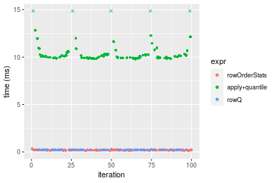
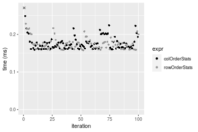

[matrixStats]: Benchmark report

---------------------------------------


# colOrderStats() and rowOrderStats() benchmarks

This report benchmark the performance of colOrderStats() and rowOrderStats() against alternative methods.

## Alternative methods

* apply() + quantile(..., type = 3L)
* Biobase::rowQ()


## Data type "integer"

### Data
```r
> rmatrix <- function(nrow, ncol, mode = c("logical", "double", "integer", "index"), range = c(-100, 
+     +100), na_prob = 0) {
+     mode <- match.arg(mode)
+     n <- nrow * ncol
+     if (mode == "logical") {
+         x <- sample(c(FALSE, TRUE), size = n, replace = TRUE)
+     }     else if (mode == "index") {
+         x <- seq_len(n)
+         mode <- "integer"
+     }     else {
+         x <- runif(n, min = range[1], max = range[2])
+     }
+     storage.mode(x) <- mode
+     if (na_prob > 0) 
+         x[sample(n, size = na_prob * n)] <- NA
+     dim(x) <- c(nrow, ncol)
+     x
+ }
> rmatrices <- function(scale = 10, seed = 1, ...) {
+     set.seed(seed)
+     data <- list()
+     data[[1]] <- rmatrix(nrow = scale * 1, ncol = scale * 1, ...)
+     data[[2]] <- rmatrix(nrow = scale * 10, ncol = scale * 10, ...)
+     data[[3]] <- rmatrix(nrow = scale * 100, ncol = scale * 1, ...)
+     data[[4]] <- t(data[[3]])
+     data[[5]] <- rmatrix(nrow = scale * 10, ncol = scale * 100, ...)
+     data[[6]] <- t(data[[5]])
+     names(data) <- sapply(data, FUN = function(x) paste(dim(x), collapse = "x"))
+     data
+ }
> data <- rmatrices(mode = mode)
```

### Results

#### 10x10 integer matrix


```r
> X <- data[["10x10"]]
> gc()
          used  (Mb) gc trigger  (Mb) max used  (Mb)
Ncells 5217850 278.7   10014072 534.9 10014072 534.9
Vcells 9906684  75.6   18204443 138.9 18204443 138.9
> probs <- 0.3
> which <- round(probs * nrow(X))
> colStats <- microbenchmark(colOrderStats = colOrderStats(X, which = which, na.rm = FALSE), `apply+quantile` = apply(X, 
+     MARGIN = 2L, FUN = quantile, probs = probs, na.rm = FALSE, type = 3L), `rowQ(t(X))` = rowQ(t(X), 
+     which = which), unit = "ms")
> X <- t(X)
> gc()
          used  (Mb) gc trigger  (Mb) max used  (Mb)
Ncells 5202317 277.9   10014072 534.9 10014072 534.9
Vcells 9855579  75.2   18204443 138.9 18204443 138.9
> rowStats <- microbenchmark(rowOrderStats = rowOrderStats(X, which = which, na.rm = FALSE), `apply+quantile` = apply(X, 
+     MARGIN = 1L, FUN = quantile, probs = probs, na.rm = FALSE, type = 3L), rowQ = rowQ(X, which = which), 
+     unit = "ms")
```


_Table: Benchmarking of colOrderStats(), apply+quantile() and rowQ(t(X))() on integer+10x10 data. The top panel shows times in milliseconds and the bottom panel shows relative times._


|   |expr           |      min|        lq|      mean|    median|        uq|      max|
|:--|:--------------|--------:|---------:|---------:|---------:|---------:|--------:|
|1  |colOrderStats  | 0.002277| 0.0037095| 0.0062338| 0.0069905| 0.0075335| 0.022869|
|3  |rowQ(t(X))     | 0.012875| 0.0169205| 0.0226490| 0.0227330| 0.0257480| 0.088824|
|2  |apply+quantile | 0.979853| 0.9971835| 1.1217904| 1.0213070| 1.2209520| 1.879289|


|   |expr           |       min|         lq|       mean|     median|       uq|       max|
|:--|:--------------|---------:|----------:|----------:|----------:|--------:|---------:|
|1  |colOrderStats  |   1.00000|   1.000000|   1.000000|   1.000000|   1.0000|  1.000000|
|3  |rowQ(t(X))     |   5.65437|   4.561396|   3.633228|   3.251985|   3.4178|  3.884035|
|2  |apply+quantile | 430.32631| 268.818844| 179.951755| 146.099278| 162.0697| 82.176265|

_Table: Benchmarking of rowOrderStats(), apply+quantile() and rowQ() on integer+10x10 data (transposed). The top panel shows times in milliseconds and the bottom panel shows relative times._


|   |expr           |      min|        lq|      mean|    median|        uq|      max|
|:--|:--------------|--------:|---------:|---------:|---------:|---------:|--------:|
|1  |rowOrderStats  | 0.002720| 0.0040365| 0.0065744| 0.0070375| 0.0077355| 0.021098|
|3  |rowQ           | 0.009198| 0.0124940| 0.0177217| 0.0184255| 0.0206645| 0.064325|
|2  |apply+quantile | 0.977569| 0.9968520| 1.1177035| 1.0328565| 1.2173570| 1.945734|


|   |expr           |        min|         lq|       mean|     median|         uq|       max|
|:--|:--------------|----------:|----------:|----------:|----------:|----------:|---------:|
|1  |rowOrderStats  |   1.000000|   1.000000|   1.000000|   1.000000|   1.000000|  1.000000|
|3  |rowQ           |   3.381618|   3.095256|   2.695571|   2.618188|   2.671385|  3.048867|
|2  |apply+quantile | 359.400368| 246.959495| 170.008964| 146.764689| 157.372762| 92.223623|

_Figure: Benchmarking of colOrderStats(), apply+quantile() and rowQ(t(X))() on integer+10x10 data  as well as rowOrderStats(), apply+quantile() and rowQ() on the same data transposed.  Outliers are displayed as crosses.  Times are in milliseconds._


_Table: Benchmarking of colOrderStats() and rowOrderStats() on integer+10x10 data (original and transposed).  The top panel shows times in milliseconds and the bottom panel shows relative times._


|   |expr          |   min|     lq|    mean| median|     uq|    max|
|:--|:-------------|-----:|------:|-------:|------:|------:|------:|
|1  |colOrderStats | 2.277| 3.7095| 6.23384| 6.9905| 7.5335| 22.869|
|2  |rowOrderStats | 2.720| 4.0365| 6.57438| 7.0375| 7.7355| 21.098|


|   |expr          |      min|       lq|     mean|   median|       uq|       max|
|:--|:-------------|--------:|--------:|--------:|--------:|--------:|---------:|
|1  |colOrderStats | 1.000000| 1.000000| 1.000000| 1.000000| 1.000000| 1.0000000|
|2  |rowOrderStats | 1.194554| 1.088152| 1.054628| 1.006723| 1.026814| 0.9225589|

_Figure: Benchmarking of colOrderStats() and rowOrderStats() on integer+10x10 data (original and transposed).  Outliers are displayed as crosses. Times are in milliseconds._


#### 100x100 integer matrix


```r
> X <- data[["100x100"]]
> gc()
          used  (Mb) gc trigger  (Mb) max used  (Mb)
Ncells 5200890 277.8   10014072 534.9 10014072 534.9
Vcells 9472172  72.3   18204443 138.9 18204443 138.9
> probs <- 0.3
> which <- round(probs * nrow(X))
> colStats <- microbenchmark(colOrderStats = colOrderStats(X, which = which, na.rm = FALSE), `apply+quantile` = apply(X, 
+     MARGIN = 2L, FUN = quantile, probs = probs, na.rm = FALSE, type = 3L), `rowQ(t(X))` = rowQ(t(X), 
+     which = which), unit = "ms")
> X <- t(X)
> gc()
          used  (Mb) gc trigger  (Mb) max used  (Mb)
Ncells 5200865 277.8   10014072 534.9 10014072 534.9
Vcells 9477248  72.4   18204443 138.9 18204443 138.9
> rowStats <- microbenchmark(rowOrderStats = rowOrderStats(X, which = which, na.rm = FALSE), `apply+quantile` = apply(X, 
+     MARGIN = 1L, FUN = quantile, probs = probs, na.rm = FALSE, type = 3L), rowQ = rowQ(X, which = which), 
+     unit = "ms")
```


_Table: Benchmarking of colOrderStats(), apply+quantile() and rowQ(t(X))() on integer+100x100 data. The top panel shows times in milliseconds and the bottom panel shows relative times._


|   |expr           |      min|         lq|       mean|    median|         uq|       max|
|:--|:--------------|--------:|----------:|----------:|---------:|----------:|---------:|
|1  |colOrderStats  | 0.117390|  0.1224335|  0.1308260|  0.128500|  0.1348435|  0.220342|
|3  |rowQ(t(X))     | 0.262537|  0.2726975|  0.2950904|  0.291378|  0.3067820|  0.499846|
|2  |apply+quantile | 9.843446| 10.0718040| 10.6472955| 10.352370| 10.6585710| 20.540022|


|   |expr           |       min|        lq|      mean|    median|        uq|       max|
|:--|:--------------|---------:|---------:|---------:|---------:|---------:|---------:|
|1  |colOrderStats  |  1.000000|  1.000000|  1.000000|  1.000000|  1.000000|  1.000000|
|3  |rowQ(t(X))     |  2.236451|  2.227311|  2.255595|  2.267533|  2.275097|  2.268501|
|2  |apply+quantile | 83.852509| 82.263465| 81.385177| 80.563191| 79.044010| 93.218823|

_Table: Benchmarking of rowOrderStats(), apply+quantile() and rowQ() on integer+100x100 data (transposed). The top panel shows times in milliseconds and the bottom panel shows relative times._


|   |expr           |      min|        lq|       mean|    median|        uq|       max|
|:--|:--------------|--------:|---------:|----------:|---------:|---------:|---------:|
|1  |rowOrderStats  | 0.115980|  0.119652|  0.1296522|  0.127189|  0.134426|  0.209684|
|3  |rowQ           | 0.248259|  0.254860|  0.2707108|  0.263823|  0.279873|  0.460877|
|2  |apply+quantile | 9.850088| 10.070405| 10.6494615| 10.337008| 10.667867| 20.484820|


|   |expr           |       min|       lq|      mean|   median|        uq|      max|
|:--|:--------------|---------:|--------:|---------:|--------:|---------:|--------:|
|1  |rowOrderStats  |  1.000000|  1.00000|  1.000000|  1.00000|  1.000000|  1.00000|
|3  |rowQ           |  2.140533|  2.13001|  2.087977|  2.07426|  2.081986|  2.19796|
|2  |apply+quantile | 84.929195| 84.16412| 82.138687| 81.27282| 79.358662| 97.69377|

_Figure: Benchmarking of colOrderStats(), apply+quantile() and rowQ(t(X))() on integer+100x100 data  as well as rowOrderStats(), apply+quantile() and rowQ() on the same data transposed.  Outliers are displayed as crosses.  Times are in milliseconds._


_Table: Benchmarking of colOrderStats() and rowOrderStats() on integer+100x100 data (original and transposed).  The top panel shows times in milliseconds and the bottom panel shows relative times._


|   |expr          |    min|       lq|     mean|  median|       uq|     max|
|:--|:-------------|------:|--------:|--------:|-------:|--------:|-------:|
|2  |rowOrderStats | 115.98| 119.6520| 129.6522| 127.189| 134.4260| 209.684|
|1  |colOrderStats | 117.39| 122.4335| 130.8260| 128.500| 134.8435| 220.342|


|   |expr          |      min|       lq|     mean|   median|       uq|      max|
|:--|:-------------|--------:|--------:|--------:|--------:|--------:|--------:|
|2  |rowOrderStats | 1.000000| 1.000000| 1.000000| 1.000000| 1.000000| 1.000000|
|1  |colOrderStats | 1.012157| 1.023247| 1.009053| 1.010307| 1.003106| 1.050829|

_Figure: Benchmarking of colOrderStats() and rowOrderStats() on integer+100x100 data (original and transposed).  Outliers are displayed as crosses. Times are in milliseconds._


#### 1000x10 integer matrix


```r
> X <- data[["1000x10"]]
> gc()
          used  (Mb) gc trigger  (Mb) max used  (Mb)
Ncells 5201643 277.8   10014072 534.9 10014072 534.9
Vcells 9475938  72.3   18204443 138.9 18204443 138.9
> probs <- 0.3
> which <- round(probs * nrow(X))
> colStats <- microbenchmark(colOrderStats = colOrderStats(X, which = which, na.rm = FALSE), `apply+quantile` = apply(X, 
+     MARGIN = 2L, FUN = quantile, probs = probs, na.rm = FALSE, type = 3L), `rowQ(t(X))` = rowQ(t(X), 
+     which = which), unit = "ms")
> X <- t(X)
> gc()
          used  (Mb) gc trigger  (Mb) max used  (Mb)
Ncells 5201618 277.8   10014072 534.9 10014072 534.9
Vcells 9481014  72.4   18204443 138.9 18204443 138.9
> rowStats <- microbenchmark(rowOrderStats = rowOrderStats(X, which = which, na.rm = FALSE), `apply+quantile` = apply(X, 
+     MARGIN = 1L, FUN = quantile, probs = probs, na.rm = FALSE, type = 3L), rowQ = rowQ(X, which = which), 
+     unit = "ms")
```


_Table: Benchmarking of colOrderStats(), apply+quantile() and rowQ(t(X))() on integer+1000x10 data. The top panel shows times in milliseconds and the bottom panel shows relative times._


|   |expr           |      min|        lq|      mean|    median|        uq|      max|
|:--|:--------------|--------:|---------:|---------:|---------:|---------:|--------:|
|1  |colOrderStats  | 0.105066| 0.1104105| 0.1186371| 0.1118315| 0.1198820| 0.193480|
|3  |rowQ(t(X))     | 0.248991| 0.2559815| 0.2761120| 0.2607885| 0.2831995| 0.429521|
|2  |apply+quantile | 1.300855| 1.3281655| 1.4193031| 1.3402580| 1.3649095| 2.418032|


|   |expr           |       min|        lq|      mean|    median|        uq|       max|
|:--|:--------------|---------:|---------:|---------:|---------:|---------:|---------:|
|1  |colOrderStats  |  1.000000|  1.000000|  1.000000|  1.000000|  1.000000|  1.000000|
|3  |rowQ(t(X))     |  2.369853|  2.318452|  2.327366|  2.331977|  2.362319|  2.219976|
|2  |apply+quantile | 12.381313| 12.029340| 11.963398| 11.984620| 11.385442| 12.497581|

_Table: Benchmarking of rowOrderStats(), apply+quantile() and rowQ() on integer+1000x10 data (transposed). The top panel shows times in milliseconds and the bottom panel shows relative times._


|   |expr           |      min|        lq|      mean|    median|        uq|      max|
|:--|:--------------|--------:|---------:|---------:|---------:|---------:|--------:|
|1  |rowOrderStats  | 0.103968| 0.1079900| 0.1204027| 0.1107330| 0.1307580| 0.203923|
|3  |rowQ           | 0.234099| 0.2404655| 0.2581090| 0.2449645| 0.2507585| 0.425593|
|2  |apply+quantile | 1.299901| 1.3311475| 1.4307268| 1.3486175| 1.4576280| 2.387854|


|   |expr           |       min|        lq|      mean|    median|       uq|       max|
|:--|:--------------|---------:|---------:|---------:|---------:|--------:|---------:|
|1  |rowOrderStats  |  1.000000|  1.000000|  1.000000|  1.000000|  1.00000|  1.000000|
|3  |rowQ           |  2.251645|  2.226739|  2.143714|  2.212209|  1.91773|  2.087028|
|2  |apply+quantile | 12.502895| 12.326581| 11.882847| 12.179003| 11.14752| 11.709587|

_Figure: Benchmarking of colOrderStats(), apply+quantile() and rowQ(t(X))() on integer+1000x10 data  as well as rowOrderStats(), apply+quantile() and rowQ() on the same data transposed.  Outliers are displayed as crosses.  Times are in milliseconds._


_Table: Benchmarking of colOrderStats() and rowOrderStats() on integer+1000x10 data (original and transposed).  The top panel shows times in milliseconds and the bottom panel shows relative times._


|   |expr          |     min|       lq|     mean|   median|      uq|     max|
|:--|:-------------|-------:|--------:|--------:|--------:|-------:|-------:|
|2  |rowOrderStats | 103.968| 107.9900| 120.4027| 110.7330| 130.758| 203.923|
|1  |colOrderStats | 105.066| 110.4105| 118.6371| 111.8315| 119.882| 193.480|


|   |expr          |      min|       lq|      mean|  median|        uq|       max|
|:--|:-------------|--------:|--------:|---------:|-------:|---------:|---------:|
|2  |rowOrderStats | 1.000000| 1.000000| 1.0000000| 1.00000| 1.0000000| 1.0000000|
|1  |colOrderStats | 1.010561| 1.022414| 0.9853361| 1.00992| 0.9168234| 0.9487895|

_Figure: Benchmarking of colOrderStats() and rowOrderStats() on integer+1000x10 data (original and transposed).  Outliers are displayed as crosses. Times are in milliseconds._


#### 10x1000 integer matrix


```r
> X <- data[["10x1000"]]
> gc()
          used  (Mb) gc trigger  (Mb) max used  (Mb)
Ncells 5201853 277.9   10014072 534.9 10014072 534.9
Vcells 9476729  72.4   18204443 138.9 18204443 138.9
> probs <- 0.3
> which <- round(probs * nrow(X))
> colStats <- microbenchmark(colOrderStats = colOrderStats(X, which = which, na.rm = FALSE), `apply+quantile` = apply(X, 
+     MARGIN = 2L, FUN = quantile, probs = probs, na.rm = FALSE, type = 3L), `rowQ(t(X))` = rowQ(t(X), 
+     which = which), unit = "ms")
> X <- t(X)
> gc()
          used  (Mb) gc trigger  (Mb) max used  (Mb)
Ncells 5201828 277.9   10014072 534.9 10014072 534.9
Vcells 9481805  72.4   18204443 138.9 18204443 138.9
> rowStats <- microbenchmark(rowOrderStats = rowOrderStats(X, which = which, na.rm = FALSE), `apply+quantile` = apply(X, 
+     MARGIN = 1L, FUN = quantile, probs = probs, na.rm = FALSE, type = 3L), rowQ = rowQ(X, which = which), 
+     unit = "ms")
```


_Table: Benchmarking of colOrderStats(), apply+quantile() and rowQ(t(X))() on integer+10x1000 data. The top panel shows times in milliseconds and the bottom panel shows relative times._


|   |expr           |       min|         lq|        mean|      median|         uq|        max|
|:--|:--------------|---------:|----------:|-----------:|-----------:|----------:|----------:|
|1  |colOrderStats  |  0.109928|  0.1185525|   0.1417330|   0.1286855|   0.141222|   1.288544|
|3  |rowQ(t(X))     |  0.259257|  0.2732155|   0.2997709|   0.3064275|   0.315101|   0.426096|
|2  |apply+quantile | 93.518097| 98.1598435| 101.3663394| 100.0871905| 104.034092| 143.538878|


|   |expr           |        min|         lq|       mean|     median|         uq|         max|
|:--|:--------------|----------:|----------:|----------:|----------:|----------:|-----------:|
|1  |colOrderStats  |   1.000000|   1.000000|   1.000000|   1.000000|   1.000000|   1.0000000|
|3  |rowQ(t(X))     |   2.358426|   2.304595|   2.115039|   2.381212|   2.231246|   0.3306802|
|2  |apply+quantile | 850.721354| 827.986280| 715.192274| 777.765875| 736.670575| 111.3961789|

_Table: Benchmarking of rowOrderStats(), apply+quantile() and rowQ() on integer+10x1000 data (transposed). The top panel shows times in milliseconds and the bottom panel shows relative times._


|   |expr           |       min|         lq|        mean|      median|          uq|        max|
|:--|:--------------|---------:|----------:|-----------:|-----------:|-----------:|----------:|
|1  |rowOrderStats  |  0.109617|  0.1201490|   0.1334914|   0.1363200|   0.1415175|   0.220985|
|3  |rowQ           |  0.249495|  0.2567665|   0.2768149|   0.2811095|   0.2915915|   0.339734|
|2  |apply+quantile | 94.255153| 98.4414970| 101.4256367| 100.0950190| 102.6840910| 124.025919|


|   |expr           |        min|         lq|       mean|    median|         uq|        max|
|:--|:--------------|----------:|----------:|----------:|---------:|----------:|----------:|
|1  |rowOrderStats  |   1.000000|   1.000000|   1.000000|   1.00000|   1.000000|   1.000000|
|3  |rowQ           |   2.276061|   2.137067|   2.073653|   2.06213|   2.060462|   1.537362|
|2  |apply+quantile | 859.858900| 819.328475| 759.791429| 734.26510| 725.592884| 561.241347|

_Figure: Benchmarking of colOrderStats(), apply+quantile() and rowQ(t(X))() on integer+10x1000 data  as well as rowOrderStats(), apply+quantile() and rowQ() on the same data transposed.  Outliers are displayed as crosses.  Times are in milliseconds._


_Table: Benchmarking of colOrderStats() and rowOrderStats() on integer+10x1000 data (original and transposed).  The top panel shows times in milliseconds and the bottom panel shows relative times._


|   |expr          |     min|       lq|     mean|   median|       uq|      max|
|:--|:-------------|-------:|--------:|--------:|--------:|--------:|--------:|
|1  |colOrderStats | 109.928| 118.5525| 141.7330| 128.6855| 141.2220| 1288.544|
|2  |rowOrderStats | 109.617| 120.1490| 133.4914| 136.3200| 141.5175|  220.985|


|   |expr          |       min|       lq|      mean|   median|       uq|       max|
|:--|:-------------|---------:|--------:|---------:|--------:|--------:|---------:|
|1  |colOrderStats | 1.0000000| 1.000000| 1.0000000| 1.000000| 1.000000| 1.0000000|
|2  |rowOrderStats | 0.9971709| 1.013467| 0.9418514| 1.059327| 1.002093| 0.1714998|

_Figure: Benchmarking of colOrderStats() and rowOrderStats() on integer+10x1000 data (original and transposed).  Outliers are displayed as crosses. Times are in milliseconds._


#### 100x1000 integer matrix


```r
> X <- data[["100x1000"]]
> gc()
          used  (Mb) gc trigger  (Mb) max used  (Mb)
Ncells 5202041 277.9   10014072 534.9 10014072 534.9
Vcells 9477266  72.4   18204443 138.9 18204443 138.9
> probs <- 0.3
> which <- round(probs * nrow(X))
> colStats <- microbenchmark(colOrderStats = colOrderStats(X, which = which, na.rm = FALSE), `apply+quantile` = apply(X, 
+     MARGIN = 2L, FUN = quantile, probs = probs, na.rm = FALSE, type = 3L), `rowQ(t(X))` = rowQ(t(X), 
+     which = which), unit = "ms")
> X <- t(X)
> gc()
          used  (Mb) gc trigger  (Mb) max used  (Mb)
Ncells 5202034 277.9   10014072 534.9 10014072 534.9
Vcells 9527372  72.7   18204443 138.9 18204443 138.9
> rowStats <- microbenchmark(rowOrderStats = rowOrderStats(X, which = which, na.rm = FALSE), `apply+quantile` = apply(X, 
+     MARGIN = 1L, FUN = quantile, probs = probs, na.rm = FALSE, type = 3L), rowQ = rowQ(X, which = which), 
+     unit = "ms")
```


_Table: Benchmarking of colOrderStats(), apply+quantile() and rowQ(t(X))() on integer+100x1000 data. The top panel shows times in milliseconds and the bottom panel shows relative times._


|   |expr           |       min|         lq|       mean|     median|         uq|        max|
|:--|:--------------|---------:|----------:|----------:|----------:|----------:|----------:|
|1  |colOrderStats  |  1.157845|   1.213953|   1.234198|   1.224630|   1.245397|   1.432396|
|3  |rowQ(t(X))     |  2.597985|   2.739488|   2.786799|   2.780934|   2.822903|   3.370532|
|2  |apply+quantile | 99.890458| 104.622961| 111.669022| 106.378083| 109.481696| 501.989168|


|   |expr           |       min|        lq|      mean|    median|        uq|        max|
|:--|:--------------|---------:|---------:|---------:|---------:|---------:|----------:|
|1  |colOrderStats  |  1.000000|  1.000000|  1.000000|  1.000000|  1.000000|   1.000000|
|3  |rowQ(t(X))     |  2.243811|  2.256667|  2.257983|  2.270836|  2.266668|   2.353073|
|2  |apply+quantile | 86.272738| 86.183700| 90.478991| 86.865488| 87.909038| 350.454182|

_Table: Benchmarking of rowOrderStats(), apply+quantile() and rowQ() on integer+100x1000 data (transposed). The top panel shows times in milliseconds and the bottom panel shows relative times._


|   |expr           |        min|         lq|       mean|     median|         uq|        max|
|:--|:--------------|----------:|----------:|----------:|----------:|----------:|----------:|
|1  |rowOrderStats  |   1.137886|   1.177669|   1.231614|   1.202450|   1.230497|   1.835848|
|3  |rowQ           |   2.471096|   2.610102|   2.700019|   2.667047|   2.734402|   3.588285|
|2  |apply+quantile | 100.859321| 104.295258| 108.024195| 105.967891| 108.328292| 129.970021|


|   |expr           |       min|        lq|      mean|    median|        uq|       max|
|:--|:--------------|---------:|---------:|---------:|---------:|---------:|---------:|
|1  |rowOrderStats  |  1.000000|  1.000000|  1.000000|  1.000000|  1.000000|  1.000000|
|3  |rowQ           |  2.171655|  2.216328|  2.192261|  2.218011|  2.222194|  1.954565|
|2  |apply+quantile | 88.637457| 88.560719| 87.709473| 88.126651| 88.036246| 70.795633|

_Figure: Benchmarking of colOrderStats(), apply+quantile() and rowQ(t(X))() on integer+100x1000 data  as well as rowOrderStats(), apply+quantile() and rowQ() on the same data transposed.  Outliers are displayed as crosses.  Times are in milliseconds._


_Table: Benchmarking of colOrderStats() and rowOrderStats() on integer+100x1000 data (original and transposed).  The top panel shows times in milliseconds and the bottom panel shows relative times._


|   |expr          |      min|       lq|     mean|  median|       uq|      max|
|:--|:-------------|--------:|--------:|--------:|-------:|--------:|--------:|
|2  |rowOrderStats | 1.137886| 1.177669| 1.231614| 1.20245| 1.230497| 1.835848|
|1  |colOrderStats | 1.157845| 1.213953| 1.234198| 1.22463| 1.245397| 1.432396|


|   |expr          |     min|      lq|     mean|   median|      uq|       max|
|:--|:-------------|-------:|-------:|--------:|--------:|-------:|---------:|
|2  |rowOrderStats | 1.00000| 1.00000| 1.000000| 1.000000| 1.00000| 1.0000000|
|1  |colOrderStats | 1.01754| 1.03081| 1.002099| 1.018446| 1.01211| 0.7802367|

_Figure: Benchmarking of colOrderStats() and rowOrderStats() on integer+100x1000 data (original and transposed).  Outliers are displayed as crosses. Times are in milliseconds._


#### 1000x100 integer matrix


```r
> X <- data[["1000x100"]]
> gc()
          used  (Mb) gc trigger  (Mb) max used  (Mb)
Ncells 5202245 277.9   10014072 534.9 10014072 534.9
Vcells 9477983  72.4   18204443 138.9 18204443 138.9
> probs <- 0.3
> which <- round(probs * nrow(X))
> colStats <- microbenchmark(colOrderStats = colOrderStats(X, which = which, na.rm = FALSE), `apply+quantile` = apply(X, 
+     MARGIN = 2L, FUN = quantile, probs = probs, na.rm = FALSE, type = 3L), `rowQ(t(X))` = rowQ(t(X), 
+     which = which), unit = "ms")
> X <- t(X)
> gc()
          used  (Mb) gc trigger  (Mb) max used  (Mb)
Ncells 5202238 277.9   10014072 534.9 10014072 534.9
Vcells 9528089  72.7   18204443 138.9 18204443 138.9
> rowStats <- microbenchmark(rowOrderStats = rowOrderStats(X, which = which, na.rm = FALSE), `apply+quantile` = apply(X, 
+     MARGIN = 1L, FUN = quantile, probs = probs, na.rm = FALSE, type = 3L), rowQ = rowQ(X, which = which), 
+     unit = "ms")
```


_Table: Benchmarking of colOrderStats(), apply+quantile() and rowQ(t(X))() on integer+1000x100 data. The top panel shows times in milliseconds and the bottom panel shows relative times._


|   |expr           |       min|        lq|      mean|    median|        uq|       max|
|:--|:--------------|---------:|---------:|---------:|---------:|---------:|---------:|
|1  |colOrderStats  |  1.074953|  1.102823|  1.172822|  1.133409|  1.163547|  1.791877|
|3  |rowQ(t(X))     |  2.455245|  2.579754|  2.898464|  2.657698|  2.712531| 10.259204|
|2  |apply+quantile | 12.745655| 12.996520| 13.556921| 13.178492| 13.356571| 23.253353|


|   |expr           |       min|        lq|      mean|    median|       uq|       max|
|:--|:--------------|---------:|---------:|---------:|---------:|--------:|---------:|
|1  |colOrderStats  |  1.000000|  1.000000|  1.000000|  1.000000|  1.00000|  1.000000|
|3  |rowQ(t(X))     |  2.284049|  2.339229|  2.471359|  2.344872|  2.33126|  5.725395|
|2  |apply+quantile | 11.856942| 11.784780| 11.559233| 11.627310| 11.47918| 12.977092|

_Table: Benchmarking of rowOrderStats(), apply+quantile() and rowQ() on integer+1000x100 data (transposed). The top panel shows times in milliseconds and the bottom panel shows relative times._


|   |expr           |       min|        lq|      mean|    median|        uq|       max|
|:--|:--------------|---------:|---------:|---------:|---------:|---------:|---------:|
|1  |rowOrderStats  |  1.064912|  1.092694|  1.131035|  1.117860|  1.139615|  1.409038|
|3  |rowQ           |  2.317403|  2.417442|  2.562800|  2.462683|  2.511760| 10.417455|
|2  |apply+quantile | 12.699172| 13.037314| 13.637346| 13.196927| 13.361855| 22.798941|


|   |expr           |       min|        lq|      mean|    median|        uq|      max|
|:--|:--------------|---------:|---------:|---------:|---------:|---------:|--------:|
|1  |rowOrderStats  |  1.000000|  1.000000|  1.000000|  1.000000|  1.000000|  1.00000|
|3  |rowQ           |  2.176145|  2.212368|  2.265889|  2.203034|  2.204042|  7.39331|
|2  |apply+quantile | 11.925090| 11.931344| 12.057405| 11.805532| 11.724880| 16.18050|

_Figure: Benchmarking of colOrderStats(), apply+quantile() and rowQ(t(X))() on integer+1000x100 data  as well as rowOrderStats(), apply+quantile() and rowQ() on the same data transposed.  Outliers are displayed as crosses.  Times are in milliseconds._


_Table: Benchmarking of colOrderStats() and rowOrderStats() on integer+1000x100 data (original and transposed).  The top panel shows times in milliseconds and the bottom panel shows relative times._


|   |expr          |      min|       lq|     mean|   median|       uq|      max|
|:--|:-------------|--------:|--------:|--------:|--------:|--------:|--------:|
|2  |rowOrderStats | 1.064912| 1.092694| 1.131035| 1.117860| 1.139615| 1.409038|
|1  |colOrderStats | 1.074953| 1.102823| 1.172822| 1.133409| 1.163547| 1.791877|


|   |expr          |      min|       lq|     mean|  median|    uq|      max|
|:--|:-------------|--------:|--------:|--------:|-------:|-----:|--------:|
|2  |rowOrderStats | 1.000000| 1.000000| 1.000000| 1.00000| 1.000| 1.000000|
|1  |colOrderStats | 1.009429| 1.009269| 1.036946| 1.01391| 1.021| 1.271702|

_Figure: Benchmarking of colOrderStats() and rowOrderStats() on integer+1000x100 data (original and transposed).  Outliers are displayed as crosses. Times are in milliseconds._


## Data type "double"

### Data
```r
> rmatrix <- function(nrow, ncol, mode = c("logical", "double", "integer", "index"), range = c(-100, 
+     +100), na_prob = 0) {
+     mode <- match.arg(mode)
+     n <- nrow * ncol
+     if (mode == "logical") {
+         x <- sample(c(FALSE, TRUE), size = n, replace = TRUE)
+     }     else if (mode == "index") {
+         x <- seq_len(n)
+         mode <- "integer"
+     }     else {
+         x <- runif(n, min = range[1], max = range[2])
+     }
+     storage.mode(x) <- mode
+     if (na_prob > 0) 
+         x[sample(n, size = na_prob * n)] <- NA
+     dim(x) <- c(nrow, ncol)
+     x
+ }
> rmatrices <- function(scale = 10, seed = 1, ...) {
+     set.seed(seed)
+     data <- list()
+     data[[1]] <- rmatrix(nrow = scale * 1, ncol = scale * 1, ...)
+     data[[2]] <- rmatrix(nrow = scale * 10, ncol = scale * 10, ...)
+     data[[3]] <- rmatrix(nrow = scale * 100, ncol = scale * 1, ...)
+     data[[4]] <- t(data[[3]])
+     data[[5]] <- rmatrix(nrow = scale * 10, ncol = scale * 100, ...)
+     data[[6]] <- t(data[[5]])
+     names(data) <- sapply(data, FUN = function(x) paste(dim(x), collapse = "x"))
+     data
+ }
> data <- rmatrices(mode = mode)
```

### Results

#### 10x10 double matrix


```r
> X <- data[["10x10"]]
> gc()
          used  (Mb) gc trigger  (Mb) max used  (Mb)
Ncells 5202478 277.9   10014072 534.9 10014072 534.9
Vcells 9593912  73.2   18204443 138.9 18204443 138.9
> probs <- 0.3
> which <- round(probs * nrow(X))
> colStats <- microbenchmark(colOrderStats = colOrderStats(X, which = which, na.rm = FALSE), `apply+quantile` = apply(X, 
+     MARGIN = 2L, FUN = quantile, probs = probs, na.rm = FALSE, type = 3L), `rowQ(t(X))` = rowQ(t(X), 
+     which = which), unit = "ms")
> X <- t(X)
> gc()
          used  (Mb) gc trigger  (Mb) max used  (Mb)
Ncells 5202444 277.9   10014072 534.9 10014072 534.9
Vcells 9594073  73.2   18204443 138.9 18204443 138.9
> rowStats <- microbenchmark(rowOrderStats = rowOrderStats(X, which = which, na.rm = FALSE), `apply+quantile` = apply(X, 
+     MARGIN = 1L, FUN = quantile, probs = probs, na.rm = FALSE, type = 3L), rowQ = rowQ(X, which = which), 
+     unit = "ms")
```


_Table: Benchmarking of colOrderStats(), apply+quantile() and rowQ(t(X))() on double+10x10 data. The top panel shows times in milliseconds and the bottom panel shows relative times._


|   |expr           |      min|        lq|      mean|    median|        uq|      max|
|:--|:--------------|--------:|---------:|---------:|---------:|---------:|--------:|
|1  |colOrderStats  | 0.002742| 0.0041260| 0.0065636| 0.0070555| 0.0080860| 0.023024|
|3  |rowQ(t(X))     | 0.007021| 0.0096015| 0.0142159| 0.0144080| 0.0165855| 0.065153|
|2  |apply+quantile | 0.981140| 1.0022785| 1.1302159| 1.0295235| 1.2150130| 1.920563|


|   |expr           |       min|         lq|       mean|     median|         uq|       max|
|:--|:--------------|---------:|----------:|----------:|----------:|----------:|---------:|
|1  |colOrderStats  |   1.00000|   1.000000|   1.000000|   1.000000|   1.000000|  1.000000|
|3  |rowQ(t(X))     |   2.56054|   2.327072|   2.165862|   2.042095|   2.051138|  2.829786|
|2  |apply+quantile | 357.81911| 242.917717| 172.193728| 145.917866| 150.261316| 83.415697|

_Table: Benchmarking of rowOrderStats(), apply+quantile() and rowQ() on double+10x10 data (transposed). The top panel shows times in milliseconds and the bottom panel shows relative times._


|   |expr           |      min|        lq|      mean|   median|       uq|      max|
|:--|:--------------|--------:|---------:|---------:|--------:|--------:|--------:|
|1  |rowOrderStats  | 0.002753| 0.0043340| 0.0069728| 0.007167| 0.008300| 0.023902|
|3  |rowQ           | 0.004336| 0.0059390| 0.0093762| 0.009142| 0.011591| 0.041073|
|2  |apply+quantile | 0.981800| 0.9991015| 1.1284831| 1.025079| 1.221162| 2.305244|


|   |expr           |        min|         lq|       mean|     median|         uq|       max|
|:--|:--------------|----------:|----------:|----------:|----------:|----------:|---------:|
|1  |rowOrderStats  |   1.000000|   1.000000|   1.000000|   1.000000|   1.000000|  1.000000|
|3  |rowQ           |   1.575009|   1.370328|   1.344692|   1.275569|   1.396506|  1.718392|
|2  |apply+quantile | 356.629132| 230.526419| 161.841195| 143.027557| 147.127892| 96.445653|

_Figure: Benchmarking of colOrderStats(), apply+quantile() and rowQ(t(X))() on double+10x10 data  as well as rowOrderStats(), apply+quantile() and rowQ() on the same data transposed.  Outliers are displayed as crosses.  Times are in milliseconds._


_Table: Benchmarking of colOrderStats() and rowOrderStats() on double+10x10 data (original and transposed).  The top panel shows times in milliseconds and the bottom panel shows relative times._


|   |expr          |   min|    lq|    mean| median|    uq|    max|
|:--|:-------------|-----:|-----:|-------:|------:|-----:|------:|
|1  |colOrderStats | 2.742| 4.126| 6.56363| 7.0555| 8.086| 23.024|
|2  |rowOrderStats | 2.753| 4.334| 6.97278| 7.1670| 8.300| 23.902|


|   |expr          |      min|       lq|     mean|   median|       uq|      max|
|:--|:-------------|--------:|--------:|--------:|--------:|--------:|--------:|
|1  |colOrderStats | 1.000000| 1.000000| 1.000000| 1.000000| 1.000000| 1.000000|
|2  |rowOrderStats | 1.004012| 1.050412| 1.062336| 1.015803| 1.026466| 1.038134|

_Figure: Benchmarking of colOrderStats() and rowOrderStats() on double+10x10 data (original and transposed).  Outliers are displayed as crosses. Times are in milliseconds._


#### 100x100 double matrix


```r
> X <- data[["100x100"]]
> gc()
          used  (Mb) gc trigger  (Mb) max used  (Mb)
Ncells 5202675 277.9   10014072 534.9 10014072 534.9
Vcells 9594904  73.3   18204443 138.9 18204443 138.9
> probs <- 0.3
> which <- round(probs * nrow(X))
> colStats <- microbenchmark(colOrderStats = colOrderStats(X, which = which, na.rm = FALSE), `apply+quantile` = apply(X, 
+     MARGIN = 2L, FUN = quantile, probs = probs, na.rm = FALSE, type = 3L), `rowQ(t(X))` = rowQ(t(X), 
+     which = which), unit = "ms")
> X <- t(X)
> gc()
          used  (Mb) gc trigger  (Mb) max used  (Mb)
Ncells 5202650 277.9   10014072 534.9 10014072 534.9
Vcells 9604980  73.3   18204443 138.9 18204443 138.9
> rowStats <- microbenchmark(rowOrderStats = rowOrderStats(X, which = which, na.rm = FALSE), `apply+quantile` = apply(X, 
+     MARGIN = 1L, FUN = quantile, probs = probs, na.rm = FALSE, type = 3L), rowQ = rowQ(X, which = which), 
+     unit = "ms")
```


_Table: Benchmarking of colOrderStats(), apply+quantile() and rowQ(t(X))() on double+100x100 data. The top panel shows times in milliseconds and the bottom panel shows relative times._


|   |expr           |       min|         lq|       mean|     median|         uq|       max|
|:--|:--------------|---------:|----------:|----------:|----------:|----------:|---------:|
|1  |colOrderStats  |  0.161637|  0.1666510|  0.1781173|  0.1735935|  0.1827015|  0.291775|
|3  |rowQ(t(X))     |  0.201080|  0.2137145|  0.2314542|  0.2290115|  0.2427635|  0.378546|
|2  |apply+quantile | 10.001547| 10.2965930| 10.9614352| 10.6640075| 10.9505975| 21.385853|


|   |expr           |       min|        lq|      mean|   median|        uq|      max|
|:--|:--------------|---------:|---------:|---------:|--------:|---------:|--------:|
|1  |colOrderStats  |  1.000000|  1.000000|  1.000000|  1.00000|  1.000000|  1.00000|
|3  |rowQ(t(X))     |  1.244022|  1.282407|  1.299449|  1.31924|  1.328744|  1.29739|
|2  |apply+quantile | 61.876594| 61.785366| 61.540556| 61.43091| 59.937097| 73.29570|

_Table: Benchmarking of rowOrderStats(), apply+quantile() and rowQ() on double+100x100 data (transposed). The top panel shows times in milliseconds and the bottom panel shows relative times._


|   |expr           |      min|         lq|       mean|     median|         uq|       max|
|:--|:--------------|--------:|----------:|----------:|----------:|----------:|---------:|
|1  |rowOrderStats  | 0.163738|  0.1663495|  0.1793452|  0.1747645|  0.1823795|  0.288053|
|3  |rowQ           | 0.182006|  0.1853900|  0.2025034|  0.1993070|  0.2114665|  0.337959|
|2  |apply+quantile | 9.951751| 10.1658505| 11.1339476| 10.7597475| 10.9634590| 40.452476|


|   |expr           |       min|        lq|      mean|    median|        uq|        max|
|:--|:--------------|---------:|---------:|---------:|---------:|---------:|----------:|
|1  |rowOrderStats  |  1.000000|  1.000000|  1.000000|  1.000000|  1.000000|   1.000000|
|3  |rowQ           |  1.111568|  1.114461|  1.129127|  1.140432|  1.159486|   1.173253|
|2  |apply+quantile | 60.778506| 61.111398| 62.081119| 61.567123| 60.113439| 140.434142|

_Figure: Benchmarking of colOrderStats(), apply+quantile() and rowQ(t(X))() on double+100x100 data  as well as rowOrderStats(), apply+quantile() and rowQ() on the same data transposed.  Outliers are displayed as crosses.  Times are in milliseconds._



_Table: Benchmarking of colOrderStats() and rowOrderStats() on double+100x100 data (original and transposed).  The top panel shows times in milliseconds and the bottom panel shows relative times._


|   |expr          |     min|       lq|     mean|   median|       uq|     max|
|:--|:-------------|-------:|--------:|--------:|--------:|--------:|-------:|
|1  |colOrderStats | 161.637| 166.6510| 178.1173| 173.5935| 182.7015| 291.775|
|2  |rowOrderStats | 163.738| 166.3495| 179.3451| 174.7645| 182.3795| 288.053|


|   |expr          |      min|        lq|     mean|   median|        uq|       max|
|:--|:-------------|--------:|---------:|--------:|--------:|---------:|---------:|
|1  |colOrderStats | 1.000000| 1.0000000| 1.000000| 1.000000| 1.0000000| 1.0000000|
|2  |rowOrderStats | 1.012998| 0.9981908| 1.006894| 1.006746| 0.9982376| 0.9872436|

_Figure: Benchmarking of colOrderStats() and rowOrderStats() on double+100x100 data (original and transposed).  Outliers are displayed as crosses. Times are in milliseconds._




#### 1000x10 double matrix


```r
> X <- data[["1000x10"]]
> gc()
          used  (Mb) gc trigger  (Mb) max used  (Mb)
Ncells 5202885 277.9   10014072 534.9 10014072 534.9
Vcells 9595998  73.3   18204443 138.9 18204443 138.9
> probs <- 0.3
> which <- round(probs * nrow(X))
> colStats <- microbenchmark(colOrderStats = colOrderStats(X, which = which, na.rm = FALSE), `apply+quantile` = apply(X, 
+     MARGIN = 2L, FUN = quantile, probs = probs, na.rm = FALSE, type = 3L), `rowQ(t(X))` = rowQ(t(X), 
+     which = which), unit = "ms")
> X <- t(X)
> gc()
          used  (Mb) gc trigger  (Mb) max used  (Mb)
Ncells 5202860 277.9   10014072 534.9 10014072 534.9
Vcells 9606074  73.3   18204443 138.9 18204443 138.9
> rowStats <- microbenchmark(rowOrderStats = rowOrderStats(X, which = which, na.rm = FALSE), `apply+quantile` = apply(X, 
+     MARGIN = 1L, FUN = quantile, probs = probs, na.rm = FALSE, type = 3L), rowQ = rowQ(X, which = which), 
+     unit = "ms")
```


_Table: Benchmarking of colOrderStats(), apply+quantile() and rowQ(t(X))() on double+1000x10 data. The top panel shows times in milliseconds and the bottom panel shows relative times._


|   |expr           |      min|        lq|      mean|   median|        uq|      max|
|:--|:--------------|--------:|---------:|---------:|--------:|---------:|--------:|
|1  |colOrderStats  | 0.143297| 0.1488795| 0.1658540| 0.157431| 0.1782210| 0.249518|
|3  |rowQ(t(X))     | 0.183885| 0.1933230| 0.2153411| 0.207059| 0.2311905| 0.303121|
|2  |apply+quantile | 1.363168| 1.3905470| 1.5639195| 1.481826| 1.6482725| 2.845490|


|   |expr           |      min|       lq|     mean|   median|       uq|       max|
|:--|:--------------|--------:|--------:|--------:|--------:|--------:|---------:|
|1  |colOrderStats  | 1.000000| 1.000000| 1.000000| 1.000000| 1.000000|  1.000000|
|3  |rowQ(t(X))     | 1.283244| 1.298520| 1.298378| 1.315236| 1.297212|  1.214826|
|2  |apply+quantile | 9.512886| 9.340084| 9.429497| 9.412543| 9.248475| 11.403947|

_Table: Benchmarking of rowOrderStats(), apply+quantile() and rowQ() on double+1000x10 data (transposed). The top panel shows times in milliseconds and the bottom panel shows relative times._


|   |expr           |      min|        lq|      mean|    median|        uq|      max|
|:--|:--------------|--------:|---------:|---------:|---------:|---------:|--------:|
|1  |rowOrderStats  | 0.146327| 0.1501025| 0.1675792| 0.1522760| 0.1776965| 0.324316|
|3  |rowQ           | 0.165925| 0.1680990| 0.1835545| 0.1719295| 0.1760880| 0.392308|
|2  |apply+quantile | 1.345456| 1.3708010| 1.4856172| 1.3855640| 1.4797415| 2.660331|


|   |expr           |      min|       lq|     mean|   median|       uq|      max|
|:--|:--------------|--------:|--------:|--------:|--------:|--------:|--------:|
|1  |rowOrderStats  | 1.000000| 1.000000| 1.000000| 1.000000| 1.000000| 1.000000|
|3  |rowQ           | 1.133933| 1.119895| 1.095330| 1.129065| 0.990948| 1.209647|
|2  |apply+quantile | 9.194858| 9.132433| 8.865167| 9.099031| 8.327353| 8.202898|

_Figure: Benchmarking of colOrderStats(), apply+quantile() and rowQ(t(X))() on double+1000x10 data  as well as rowOrderStats(), apply+quantile() and rowQ() on the same data transposed.  Outliers are displayed as crosses.  Times are in milliseconds._


_Table: Benchmarking of colOrderStats() and rowOrderStats() on double+1000x10 data (original and transposed).  The top panel shows times in milliseconds and the bottom panel shows relative times._


|   |expr          |     min|       lq|     mean|  median|       uq|     max|
|:--|:-------------|-------:|--------:|--------:|-------:|--------:|-------:|
|2  |rowOrderStats | 146.327| 150.1025| 167.5792| 152.276| 177.6965| 324.316|
|1  |colOrderStats | 143.297| 148.8795| 165.8540| 157.431| 178.2210| 249.518|


|   |expr          |      min|        lq|      mean|   median|       uq|       max|
|:--|:-------------|--------:|---------:|---------:|--------:|--------:|---------:|
|2  |rowOrderStats | 1.000000| 1.0000000| 1.0000000| 1.000000| 1.000000| 1.0000000|
|1  |colOrderStats | 0.979293| 0.9918522| 0.9897052| 1.033853| 1.002952| 0.7693669|

_Figure: Benchmarking of colOrderStats() and rowOrderStats() on double+1000x10 data (original and transposed).  Outliers are displayed as crosses. Times are in milliseconds._


#### 10x1000 double matrix


```r
> X <- data[["10x1000"]]
> gc()
          used  (Mb) gc trigger  (Mb) max used  (Mb)
Ncells 5203095 277.9   10014072 534.9 10014072 534.9
Vcells 9596139  73.3   18204443 138.9 18204443 138.9
> probs <- 0.3
> which <- round(probs * nrow(X))
> colStats <- microbenchmark(colOrderStats = colOrderStats(X, which = which, na.rm = FALSE), `apply+quantile` = apply(X, 
+     MARGIN = 2L, FUN = quantile, probs = probs, na.rm = FALSE, type = 3L), `rowQ(t(X))` = rowQ(t(X), 
+     which = which), unit = "ms")
> X <- t(X)
> gc()
          used  (Mb) gc trigger  (Mb) max used  (Mb)
Ncells 5203070 277.9   10014072 534.9 10014072 534.9
Vcells 9606215  73.3   18204443 138.9 18204443 138.9
> rowStats <- microbenchmark(rowOrderStats = rowOrderStats(X, which = which, na.rm = FALSE), `apply+quantile` = apply(X, 
+     MARGIN = 1L, FUN = quantile, probs = probs, na.rm = FALSE, type = 3L), rowQ = rowQ(X, which = which), 
+     unit = "ms")
```


_Table: Benchmarking of colOrderStats(), apply+quantile() and rowQ(t(X))() on double+10x1000 data. The top panel shows times in milliseconds and the bottom panel shows relative times._


|   |expr           |       min|         lq|        mean|     median|         uq|        max|
|:--|:--------------|---------:|----------:|-----------:|----------:|----------:|----------:|
|1  |colOrderStats  |  0.155995|  0.1623235|   0.1740644|  0.1709410|   0.184274|   0.243185|
|3  |rowQ(t(X))     |  0.196044|  0.2052960|   0.2296766|  0.2335985|   0.245024|   0.326073|
|2  |apply+quantile | 94.204933| 98.0530615| 101.3089040| 99.9628065| 103.910623| 121.773068|


|   |expr           |        min|         lq|       mean|     median|         uq|        max|
|:--|:--------------|----------:|----------:|----------:|----------:|----------:|----------:|
|1  |colOrderStats  |   1.000000|   1.000000|   1.000000|   1.000000|   1.000000|   1.000000|
|3  |rowQ(t(X))     |   1.256733|   1.264734|   1.319492|   1.366545|   1.329672|   1.340843|
|2  |apply+quantile | 603.897131| 604.059557| 582.019599| 584.779582| 563.891938| 500.742513|

_Table: Benchmarking of rowOrderStats(), apply+quantile() and rowQ() on double+10x1000 data (transposed). The top panel shows times in milliseconds and the bottom panel shows relative times._


|   |expr           |       min|         lq|        mean|     median|          uq|        max|
|:--|:--------------|---------:|----------:|-----------:|----------:|-----------:|----------:|
|1  |rowOrderStats  |  0.156893|  0.1640635|   0.1793138|  0.1761895|   0.1860925|   0.292306|
|3  |rowQ           |  0.180294|  0.1854920|   0.2019398|  0.2019455|   0.2170060|   0.250631|
|2  |apply+quantile | 93.920465| 98.5095640| 101.7649902| 99.9045750| 105.1572530| 144.579025|


|   |expr           |        min|         lq|       mean|     median|         uq|         max|
|:--|:--------------|----------:|----------:|----------:|----------:|----------:|-----------:|
|1  |rowOrderStats  |   1.000000|   1.000000|   1.000000|   1.000000|   1.000000|   1.0000000|
|3  |rowQ           |   1.149153|   1.130611|   1.126181|   1.146184|   1.166119|   0.8574268|
|2  |apply+quantile | 598.627504| 600.435587| 567.524460| 567.029108| 565.080554| 494.6153175|

_Figure: Benchmarking of colOrderStats(), apply+quantile() and rowQ(t(X))() on double+10x1000 data  as well as rowOrderStats(), apply+quantile() and rowQ() on the same data transposed.  Outliers are displayed as crosses.  Times are in milliseconds._


_Table: Benchmarking of colOrderStats() and rowOrderStats() on double+10x1000 data (original and transposed).  The top panel shows times in milliseconds and the bottom panel shows relative times._


|   |expr          |     min|       lq|     mean|   median|       uq|     max|
|:--|:-------------|-------:|--------:|--------:|--------:|--------:|-------:|
|1  |colOrderStats | 155.995| 162.3235| 174.0644| 170.9410| 184.2740| 243.185|
|2  |rowOrderStats | 156.893| 164.0635| 179.3138| 176.1895| 186.0925| 292.306|


|   |expr          |      min|       lq|     mean|   median|       uq|     max|
|:--|:-------------|--------:|--------:|--------:|--------:|--------:|-------:|
|1  |colOrderStats | 1.000000| 1.000000| 1.000000| 1.000000| 1.000000| 1.00000|
|2  |rowOrderStats | 1.005757| 1.010719| 1.030158| 1.030704| 1.009869| 1.20199|

_Figure: Benchmarking of colOrderStats() and rowOrderStats() on double+10x1000 data (original and transposed).  Outliers are displayed as crosses. Times are in milliseconds._


#### 100x1000 double matrix


```r
> X <- data[["100x1000"]]
> gc()
          used  (Mb) gc trigger  (Mb) max used  (Mb)
Ncells 5203283 277.9   10014072 534.9 10014072 534.9
Vcells 9597384  73.3   18204443 138.9 18204443 138.9
> probs <- 0.3
> which <- round(probs * nrow(X))
> colStats <- microbenchmark(colOrderStats = colOrderStats(X, which = which, na.rm = FALSE), `apply+quantile` = apply(X, 
+     MARGIN = 2L, FUN = quantile, probs = probs, na.rm = FALSE, type = 3L), `rowQ(t(X))` = rowQ(t(X), 
+     which = which), unit = "ms")
> X <- t(X)
> gc()
          used  (Mb) gc trigger  (Mb) max used  (Mb)
Ncells 5203276 277.9   10014072 534.9 10014072 534.9
Vcells 9697490  74.0   18204443 138.9 18204443 138.9
> rowStats <- microbenchmark(rowOrderStats = rowOrderStats(X, which = which, na.rm = FALSE), `apply+quantile` = apply(X, 
+     MARGIN = 1L, FUN = quantile, probs = probs, na.rm = FALSE, type = 3L), rowQ = rowQ(X, which = which), 
+     unit = "ms")
```


_Table: Benchmarking of colOrderStats(), apply+quantile() and rowQ(t(X))() on double+100x1000 data. The top panel shows times in milliseconds and the bottom panel shows relative times._


|   |expr           |       min|         lq|       mean|     median|         uq|        max|
|:--|:--------------|---------:|----------:|----------:|----------:|----------:|----------:|
|1  |colOrderStats  |  1.588688|   1.653754|   1.699227|   1.681342|   1.712535|   2.128049|
|3  |rowQ(t(X))     |  2.009317|   2.100964|   2.194944|   2.152049|   2.288346|   2.683397|
|2  |apply+quantile | 99.857959| 104.917203| 108.852521| 106.433538| 112.336720| 133.604193|


|   |expr           |       min|        lq|      mean|    median|        uq|       max|
|:--|:--------------|---------:|---------:|---------:|---------:|---------:|---------:|
|1  |colOrderStats  |  1.000000|  1.000000|  1.000000|  1.000000|  1.000000|  1.000000|
|3  |rowQ(t(X))     |  1.264765|  1.270421|  1.291731|  1.279959|  1.336233|  1.260966|
|2  |apply+quantile | 62.855614| 63.441844| 64.060009| 63.302711| 65.596744| 62.782480|

_Table: Benchmarking of rowOrderStats(), apply+quantile() and rowQ() on double+100x1000 data (transposed). The top panel shows times in milliseconds and the bottom panel shows relative times._


|   |expr           |       min|         lq|       mean|     median|         uq|        max|
|:--|:--------------|---------:|----------:|----------:|----------:|----------:|----------:|
|1  |rowOrderStats  |  1.611538|   1.676751|   1.759398|   1.711192|   1.759205|   2.698358|
|3  |rowQ           |  1.781139|   1.871182|   1.990476|   1.960216|   2.060423|   2.722695|
|2  |apply+quantile | 99.793524| 105.523846| 112.699275| 107.067109| 111.471564| 497.401334|


|   |expr           |       min|        lq|      mean|    median|        uq|        max|
|:--|:--------------|---------:|---------:|---------:|---------:|---------:|----------:|
|1  |rowOrderStats  |  1.000000|  1.000000|  1.000000|  1.000000|  1.000000|   1.000000|
|3  |rowQ           |  1.105242|  1.115957|  1.131339|  1.145526|  1.171224|   1.009019|
|2  |apply+quantile | 61.924400| 62.933541| 64.055578| 62.568711| 63.364720| 184.334819|

_Figure: Benchmarking of colOrderStats(), apply+quantile() and rowQ(t(X))() on double+100x1000 data  as well as rowOrderStats(), apply+quantile() and rowQ() on the same data transposed.  Outliers are displayed as crosses.  Times are in milliseconds._


_Table: Benchmarking of colOrderStats() and rowOrderStats() on double+100x1000 data (original and transposed).  The top panel shows times in milliseconds and the bottom panel shows relative times._


|   |expr          |      min|       lq|     mean|   median|       uq|      max|
|:--|:-------------|--------:|--------:|--------:|--------:|--------:|--------:|
|1  |colOrderStats | 1.588688| 1.653754| 1.699227| 1.681342| 1.712535| 2.128049|
|2  |rowOrderStats | 1.611538| 1.676751| 1.759398| 1.711192| 1.759205| 2.698358|


|   |expr          |      min|       lq|     mean|   median|       uq|      max|
|:--|:-------------|--------:|--------:|--------:|--------:|--------:|--------:|
|1  |colOrderStats | 1.000000| 1.000000| 1.000000| 1.000000| 1.000000| 1.000000|
|2  |rowOrderStats | 1.014383| 1.013906| 1.035411| 1.017754| 1.027252| 1.267996|

_Figure: Benchmarking of colOrderStats() and rowOrderStats() on double+100x1000 data (original and transposed).  Outliers are displayed as crosses. Times are in milliseconds._


#### 1000x100 double matrix


```r
> X <- data[["1000x100"]]
> gc()
          used  (Mb) gc trigger  (Mb) max used  (Mb)
Ncells 5203487 277.9   10014072 534.9 10014072 534.9
Vcells 9597519  73.3   18204443 138.9 18204443 138.9
> probs <- 0.3
> which <- round(probs * nrow(X))
> colStats <- microbenchmark(colOrderStats = colOrderStats(X, which = which, na.rm = FALSE), `apply+quantile` = apply(X, 
+     MARGIN = 2L, FUN = quantile, probs = probs, na.rm = FALSE, type = 3L), `rowQ(t(X))` = rowQ(t(X), 
+     which = which), unit = "ms")
> X <- t(X)
> gc()
          used  (Mb) gc trigger  (Mb) max used  (Mb)
Ncells 5203480 277.9   10014072 534.9 10014072 534.9
Vcells 9697625  74.0   18204443 138.9 18204443 138.9
> rowStats <- microbenchmark(rowOrderStats = rowOrderStats(X, which = which, na.rm = FALSE), `apply+quantile` = apply(X, 
+     MARGIN = 1L, FUN = quantile, probs = probs, na.rm = FALSE, type = 3L), rowQ = rowQ(X, which = which), 
+     unit = "ms")
```


_Table: Benchmarking of colOrderStats(), apply+quantile() and rowQ(t(X))() on double+1000x100 data. The top panel shows times in milliseconds and the bottom panel shows relative times._


|   |expr           |       min|        lq|      mean|    median|        uq|       max|
|:--|:--------------|---------:|---------:|---------:|---------:|---------:|---------:|
|1  |colOrderStats  |  1.562944|  1.610527|  1.703747|  1.659879|  1.693137|  2.594458|
|3  |rowQ(t(X))     |  1.972797|  2.079943|  2.324106|  2.170528|  2.259642|  9.127260|
|2  |apply+quantile | 13.205669| 13.428299| 14.225447| 13.652881| 13.849725| 23.153676|


|   |expr           |      min|       lq|     mean|   median|       uq|      max|
|:--|:--------------|--------:|--------:|--------:|--------:|--------:|--------:|
|1  |colOrderStats  | 1.000000| 1.000000| 1.000000| 1.000000| 1.000000| 1.000000|
|3  |rowQ(t(X))     | 1.262231| 1.291467| 1.364115| 1.307642| 1.334589| 3.517983|
|2  |apply+quantile | 8.449227| 8.337829| 8.349508| 8.225224| 8.179920| 8.924283|

_Table: Benchmarking of rowOrderStats(), apply+quantile() and rowQ() on double+1000x100 data (transposed). The top panel shows times in milliseconds and the bottom panel shows relative times._


|   |expr           |       min|        lq|      mean|    median|        uq|       max|
|:--|:--------------|---------:|---------:|---------:|---------:|---------:|---------:|
|1  |rowOrderStats  |  1.591957|  1.640457|  1.692097|  1.662904|  1.703416|  2.269126|
|3  |rowQ           |  1.774648|  1.831710|  1.906126|  1.879911|  1.941709|  2.794412|
|2  |apply+quantile | 13.291173| 13.540199| 14.396198| 13.714916| 13.981152| 23.418167|


|   |expr           |      min|       lq|     mean|   median|       uq|       max|
|:--|:--------------|--------:|--------:|--------:|--------:|--------:|---------:|
|1  |rowOrderStats  | 1.000000| 1.000000| 1.000000| 1.000000| 1.000000|  1.000000|
|3  |rowQ           | 1.114759| 1.116585| 1.126487| 1.130499| 1.139892|  1.231493|
|2  |apply+quantile | 8.348952| 8.253917| 8.507903| 8.247570| 8.207714| 10.320347|

_Figure: Benchmarking of colOrderStats(), apply+quantile() and rowQ(t(X))() on double+1000x100 data  as well as rowOrderStats(), apply+quantile() and rowQ() on the same data transposed.  Outliers are displayed as crosses.  Times are in milliseconds._


_Table: Benchmarking of colOrderStats() and rowOrderStats() on double+1000x100 data (original and transposed).  The top panel shows times in milliseconds and the bottom panel shows relative times._


|   |expr          |      min|       lq|     mean|   median|       uq|      max|
|:--|:-------------|--------:|--------:|--------:|--------:|--------:|--------:|
|1  |colOrderStats | 1.562944| 1.610527| 1.703747| 1.659879| 1.693137| 2.594458|
|2  |rowOrderStats | 1.591957| 1.640457| 1.692097| 1.662904| 1.703416| 2.269126|


|   |expr          |      min|       lq|      mean|   median|       uq|      max|
|:--|:-------------|--------:|--------:|---------:|--------:|--------:|--------:|
|1  |colOrderStats | 1.000000| 1.000000| 1.0000000| 1.000000| 1.000000| 1.000000|
|2  |rowOrderStats | 1.018563| 1.018584| 0.9931623| 1.001822| 1.006071| 0.874605|

_Figure: Benchmarking of colOrderStats() and rowOrderStats() on double+1000x100 data (original and transposed).  Outliers are displayed as crosses. Times are in milliseconds._


## Appendix

### Session information
```r
R version 4.1.1 Patched (2021-08-10 r80727)
Platform: x86_64-pc-linux-gnu (64-bit)
Running under: Ubuntu 18.04.5 LTS

Matrix products: default
BLAS:   /home/hb/software/R-devel/R-4-1-branch/lib/R/lib/libRblas.so
LAPACK: /home/hb/software/R-devel/R-4-1-branch/lib/R/lib/libRlapack.so

locale:
 [1] LC_CTYPE=en_US.UTF-8       LC_NUMERIC=C              
 [3] LC_TIME=en_US.UTF-8        LC_COLLATE=en_US.UTF-8    
 [5] LC_MONETARY=en_US.UTF-8    LC_MESSAGES=en_US.UTF-8   
 [7] LC_PAPER=en_US.UTF-8       LC_NAME=C                 
 [9] LC_ADDRESS=C               LC_TELEPHONE=C            
[11] LC_MEASUREMENT=en_US.UTF-8 LC_IDENTIFICATION=C       

attached base packages:
[1] stats     graphics  grDevices utils     datasets  methods   base     

other attached packages:
[1] microbenchmark_1.4-7   matrixStats_0.60.1     ggplot2_3.3.5         
[4] knitr_1.33             R.devices_2.17.0       R.utils_2.10.1        
[7] R.oo_1.24.0            R.methodsS3_1.8.1-9001 history_0.0.1-9000    

loaded via a namespace (and not attached):
 [1] Biobase_2.52.0          httr_1.4.2              splines_4.1.1          
 [4] bit64_4.0.5             network_1.17.1          assertthat_0.2.1       
 [7] highr_0.9               stats4_4.1.1            blob_1.2.2             
[10] GenomeInfoDbData_1.2.6  robustbase_0.93-8       pillar_1.6.2           
[13] RSQLite_2.2.8           lattice_0.20-44         glue_1.4.2             
[16] digest_0.6.27           XVector_0.32.0          colorspace_2.0-2       
[19] Matrix_1.3-4            XML_3.99-0.7            pkgconfig_2.0.3        
[22] zlibbioc_1.38.0         genefilter_1.74.0       purrr_0.3.4            
[25] ergm_4.1.2              xtable_1.8-4            scales_1.1.1           
[28] tibble_3.1.4            annotate_1.70.0         KEGGREST_1.32.0        
[31] farver_2.1.0            generics_0.1.0          IRanges_2.26.0         
[34] ellipsis_0.3.2          cachem_1.0.6            withr_2.4.2            
[37] BiocGenerics_0.38.0     mime_0.11               survival_3.2-13        
[40] magrittr_2.0.1          crayon_1.4.1            statnet.common_4.5.0   
[43] memoise_2.0.0           laeken_0.5.1            fansi_0.5.0            
[46] R.cache_0.15.0          MASS_7.3-54             R.rsp_0.44.0           
[49] progressr_0.8.0         tools_4.1.1             lifecycle_1.0.0        
[52] S4Vectors_0.30.0        trust_0.1-8             munsell_0.5.0          
[55] tabby_0.0.1-9001        AnnotationDbi_1.54.1    Biostrings_2.60.2      
[58] compiler_4.1.1          GenomeInfoDb_1.28.1     rlang_0.4.11           
[61] grid_4.1.1              RCurl_1.98-1.4          cwhmisc_6.6            
[64] rappdirs_0.3.3          startup_0.15.0          labeling_0.4.2         
[67] bitops_1.0-7            base64enc_0.1-3         boot_1.3-28            
[70] gtable_0.3.0            DBI_1.1.1               markdown_1.1           
[73] R6_2.5.1                lpSolveAPI_5.5.2.0-17.7 rle_0.9.2              
[76] dplyr_1.0.7             fastmap_1.1.0           bit_4.0.4              
[79] utf8_1.2.2              parallel_4.1.1          Rcpp_1.0.7             
[82] vctrs_0.3.8             png_0.1-7               DEoptimR_1.0-9         
[85] tidyselect_1.1.1        xfun_0.25               coda_0.19-4            
```
Total processing time was 2.03 mins.


### Reproducibility
To reproduce this report, do:
```r
html <- matrixStats:::benchmark('colOrderStats')
```

[RSP]: https://cran.r-project.org/package=R.rsp
[matrixStats]: https://cran.r-project.org/package=matrixStats

[StackOverflow:colMins?]: https://stackoverflow.com/questions/13676878 "Stack Overflow: fastest way to get Min from every column in a matrix?"
[StackOverflow:colSds?]: https://stackoverflow.com/questions/17549762 "Stack Overflow: Is there such 'colsd' in R?"
[StackOverflow:rowProds?]: https://stackoverflow.com/questions/20198801/ "Stack Overflow: Row product of matrix and column sum of matrix"

---------------------------------------
Copyright Henrik Bengtsson. Last updated on 2021-08-25 18:10:53 (+0200 UTC). Powered by [RSP].

<script>
 var link = document.createElement('link');
 link.rel = 'icon';
 link.href = "data:image/png;base64,iVBORw0KGgoAAAANSUhEUgAAACAAAAAgCAMAAABEpIrGAAAA21BMVEUAAAAAAP8AAP8AAP8AAP8AAP8AAP8AAP8AAP8AAP8AAP8AAP8AAP8AAP8AAP8AAP8AAP8AAP8AAP8AAP8AAP8AAP8AAP8AAP8AAP8AAP8AAP8AAP8AAP8AAP8AAP8AAP8AAP8AAP8AAP8AAP8AAP8AAP8AAP8AAP8AAP8AAP8BAf4CAv0DA/wdHeIeHuEfH+AgIN8hId4lJdomJtknJ9g+PsE/P8BAQL9yco10dIt1dYp3d4h4eIeVlWqWlmmXl2iYmGeZmWabm2Tn5xjo6Bfp6Rb39wj4+Af//wA2M9hbAAAASXRSTlMAAQIJCgsMJSYnKD4/QGRlZmhpamtsbautrrCxuru8y8zN5ebn6Pn6+///////////////////////////////////////////LsUNcQAAAS9JREFUOI29k21XgkAQhVcFytdSMqMETU26UVqGmpaiFbL//xc1cAhhwVNf6n5i5z67M2dmYOyfJZUqlVLhkKucG7cgmUZTybDz6g0iDeq51PUr37Ds2cy2/C9NeES5puDjxuUk1xnToZsg8pfA3avHQ3lLIi7iWRrkv/OYtkScxBIMgDee0ALoyxHQBJ68JLCjOtQIMIANF7QG9G9fNnHvisCHBVMKgSJgiz7nE+AoBKrAPA3MgepvgR9TSCasrCKH0eB1wBGBFdCO+nAGjMVGPcQb5bd6mQRegN6+1axOs9nGfYcCtfi4NQosdtH7dB+txFIpXQqN1p9B/asRHToyS0jRgpV7nk4nwcq1BJ+x3Gl/v7S9Wmpp/aGquum7w3ZDyrADFYrl8vHBH+ev9AUASW1dmU4h4wAAAABJRU5ErkJggg=="
 document.getElementsByTagName('head')[0].appendChild(link);
</script>


