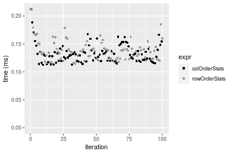
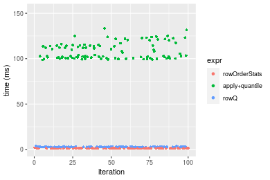
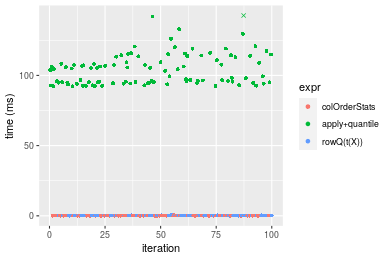
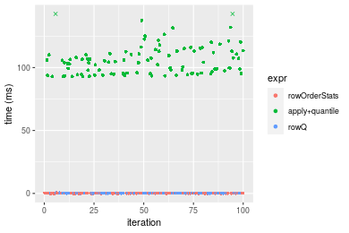

[matrixStats]: Benchmark report

---------------------------------------


# colOrderStats() and rowOrderStats() benchmarks

This report benchmark the performance of colOrderStats() and rowOrderStats() against alternative methods.

## Alternative methods

* apply() + quantile(..., type = 3L)
* Biobase::rowQ()


## Data type "integer"

### Data
```r
> rmatrix <- function(nrow, ncol, mode = c("logical", "double", "integer", "index"), range = c(-100, 
+     +100), na_prob = 0) {
+     mode <- match.arg(mode)
+     n <- nrow * ncol
+     if (mode == "logical") {
+         x <- sample(c(FALSE, TRUE), size = n, replace = TRUE)
+     }     else if (mode == "index") {
+         x <- seq_len(n)
+         mode <- "integer"
+     }     else {
+         x <- runif(n, min = range[1], max = range[2])
+     }
+     storage.mode(x) <- mode
+     if (na_prob > 0) 
+         x[sample(n, size = na_prob * n)] <- NA
+     dim(x) <- c(nrow, ncol)
+     x
+ }
> rmatrices <- function(scale = 10, seed = 1, ...) {
+     set.seed(seed)
+     data <- list()
+     data[[1]] <- rmatrix(nrow = scale * 1, ncol = scale * 1, ...)
+     data[[2]] <- rmatrix(nrow = scale * 10, ncol = scale * 10, ...)
+     data[[3]] <- rmatrix(nrow = scale * 100, ncol = scale * 1, ...)
+     data[[4]] <- t(data[[3]])
+     data[[5]] <- rmatrix(nrow = scale * 10, ncol = scale * 100, ...)
+     data[[6]] <- t(data[[5]])
+     names(data) <- sapply(data, FUN = function(x) paste(dim(x), collapse = "x"))
+     data
+ }
> data <- rmatrices(mode = mode)
```

### Results

#### 10x10 integer matrix


```r
> X <- data[["10x10"]]
> gc()
           used  (Mb) gc trigger  (Mb) max used  (Mb)
Ncells  5268993 281.4    7916910 422.9  7916910 422.9
Vcells 10308904  78.7   33191153 253.3 53339345 407.0
> probs <- 0.3
> which <- round(probs * nrow(X))
> colStats <- microbenchmark(colOrderStats = colOrderStats(X, which = which, na.rm = FALSE), `apply+quantile` = apply(X, 
+     MARGIN = 2L, FUN = quantile, probs = probs, na.rm = FALSE, type = 3L), `rowQ(t(X))` = rowQ(t(X), 
+     which = which), unit = "ms")
> X <- t(X)
> gc()
           used  (Mb) gc trigger  (Mb) max used  (Mb)
Ncells  5268593 281.4    7916910 422.9  7916910 422.9
Vcells 10308148  78.7   33191153 253.3 53339345 407.0
> rowStats <- microbenchmark(rowOrderStats = rowOrderStats(X, which = which, na.rm = FALSE), `apply+quantile` = apply(X, 
+     MARGIN = 1L, FUN = quantile, probs = probs, na.rm = FALSE, type = 3L), rowQ = rowQ(X, which = which), 
+     unit = "ms")
```


_Table: Benchmarking of colOrderStats(), apply+quantile() and rowQ(t(X))() on integer+10x10 data. The top panel shows times in milliseconds and the bottom panel shows relative times._


|   |expr           |      min|        lq|      mean|    median|        uq|      max|
|:--|:--------------|--------:|---------:|---------:|---------:|---------:|--------:|
|1  |colOrderStats  | 0.002696| 0.0040795| 0.0068101| 0.0076690| 0.0082185| 0.023402|
|3  |rowQ(t(X))     | 0.012791| 0.0170745| 0.0231401| 0.0242875| 0.0264040| 0.095805|
|2  |apply+quantile | 0.967434| 0.9957945| 1.1205770| 1.0281635| 1.2197775| 1.863193|


|   |expr           |        min|         lq|       mean|     median|         uq|       max|
|:--|:--------------|----------:|----------:|----------:|----------:|----------:|---------:|
|1  |colOrderStats  |   1.000000|   1.000000|   1.000000|   1.000000|   1.000000|  1.000000|
|3  |rowQ(t(X))     |   4.744436|   4.185439|   3.397911|   3.166971|   3.212752|  4.093881|
|2  |apply+quantile | 358.840505| 244.097193| 164.546098| 134.067479| 148.418507| 79.616828|

_Table: Benchmarking of rowOrderStats(), apply+quantile() and rowQ() on integer+10x10 data (transposed). The top panel shows times in milliseconds and the bottom panel shows relative times._


|   |expr           |      min|        lq|      mean|    median|        uq|      max|
|:--|:--------------|--------:|---------:|---------:|---------:|---------:|--------:|
|1  |rowOrderStats  | 0.003241| 0.0047355| 0.0073055| 0.0078115| 0.0086075| 0.025496|
|3  |rowQ           | 0.009712| 0.0126775| 0.0182256| 0.0182200| 0.0215470| 0.085881|
|2  |apply+quantile | 0.971351| 0.9916710| 1.1221177| 1.0329925| 1.2133460| 1.988212|


|   |expr           |        min|        lq|       mean|     median|         uq|       max|
|:--|:--------------|----------:|---------:|----------:|----------:|----------:|---------:|
|1  |rowOrderStats  |   1.000000|   1.00000|   1.000000|   1.000000|   1.000000|  1.000000|
|3  |rowQ           |   2.996606|   2.67712|   2.494763|   2.332459|   2.503282|  3.368411|
|2  |apply+quantile | 299.707189| 209.41210| 153.598182| 132.239967| 140.963811| 77.981330|

_Figure: Benchmarking of colOrderStats(), apply+quantile() and rowQ(t(X))() on integer+10x10 data  as well as rowOrderStats(), apply+quantile() and rowQ() on the same data transposed.  Outliers are displayed as crosses.  Times are in milliseconds._


_Table: Benchmarking of colOrderStats() and rowOrderStats() on integer+10x10 data (original and transposed).  The top panel shows times in milliseconds and the bottom panel shows relative times._


|   |expr          |   min|     lq|    mean| median|     uq|    max|
|:--|:-------------|-----:|------:|-------:|------:|------:|------:|
|1  |colOrderStats | 2.696| 4.0795| 6.81011| 7.6690| 8.2185| 23.402|
|2  |rowOrderStats | 3.241| 4.7355| 7.30554| 7.8115| 8.6075| 25.496|


|   |expr          |      min|       lq|     mean|   median|       uq|      max|
|:--|:-------------|--------:|--------:|--------:|--------:|--------:|--------:|
|1  |colOrderStats | 1.000000| 1.000000| 1.000000| 1.000000| 1.000000| 1.000000|
|2  |rowOrderStats | 1.202151| 1.160804| 1.072749| 1.018581| 1.047332| 1.089479|

_Figure: Benchmarking of colOrderStats() and rowOrderStats() on integer+10x10 data (original and transposed).  Outliers are displayed as crosses. Times are in milliseconds._


#### 100x100 integer matrix


```r
> X <- data[["100x100"]]
> gc()
          used  (Mb) gc trigger  (Mb) max used  (Mb)
Ncells 5267154 281.3    7916910 422.9  7916910 422.9
Vcells 9924721  75.8   33191153 253.3 53339345 407.0
> probs <- 0.3
> which <- round(probs * nrow(X))
> colStats <- microbenchmark(colOrderStats = colOrderStats(X, which = which, na.rm = FALSE), `apply+quantile` = apply(X, 
+     MARGIN = 2L, FUN = quantile, probs = probs, na.rm = FALSE, type = 3L), `rowQ(t(X))` = rowQ(t(X), 
+     which = which), unit = "ms")
> X <- t(X)
> gc()
          used  (Mb) gc trigger  (Mb) max used  (Mb)
Ncells 5267141 281.3    7916910 422.9  7916910 422.9
Vcells 9929817  75.8   33191153 253.3 53339345 407.0
> rowStats <- microbenchmark(rowOrderStats = rowOrderStats(X, which = which, na.rm = FALSE), `apply+quantile` = apply(X, 
+     MARGIN = 1L, FUN = quantile, probs = probs, na.rm = FALSE, type = 3L), rowQ = rowQ(X, which = which), 
+     unit = "ms")
```


_Table: Benchmarking of colOrderStats(), apply+quantile() and rowQ(t(X))() on integer+100x100 data. The top panel shows times in milliseconds and the bottom panel shows relative times._


|   |expr           |      min|         lq|       mean|     median|        uq|       max|
|:--|:--------------|--------:|----------:|----------:|----------:|---------:|---------:|
|1  |colOrderStats  | 0.112696|  0.1198725|  0.1333702|  0.1301970|  0.139149|  0.228078|
|3  |rowQ(t(X))     | 0.262352|  0.2933835|  0.3195194|  0.3156015|  0.338109|  0.516138|
|2  |apply+quantile | 9.852266| 10.3477290| 11.2146593| 10.6187180| 10.960147| 21.946198|


|   |expr           |       min|        lq|      mean|    median|        uq|       max|
|:--|:--------------|---------:|---------:|---------:|---------:|---------:|---------:|
|1  |colOrderStats  |  1.000000|  1.000000|  1.000000|  1.000000|  1.000000|  1.000000|
|3  |rowQ(t(X))     |  2.327962|  2.447463|  2.395733|  2.424031|  2.429834|  2.262989|
|2  |apply+quantile | 87.423387| 86.322793| 84.086682| 81.558853| 78.765543| 96.222336|

_Table: Benchmarking of rowOrderStats(), apply+quantile() and rowQ() on integer+100x100 data (transposed). The top panel shows times in milliseconds and the bottom panel shows relative times._


|   |expr           |      min|        lq|       mean|     median|        uq|       max|
|:--|:--------------|--------:|---------:|----------:|----------:|---------:|---------:|
|1  |rowOrderStats  | 0.114631|  0.123835|  0.1378341|  0.1363480|  0.143007|  0.216123|
|3  |rowQ           | 0.251249|  0.267076|  0.2964444|  0.2872305|  0.308534|  0.480030|
|2  |apply+quantile | 9.892499| 10.383088| 11.3716474| 10.6375765| 11.341401| 31.489385|


|   |expr           |       min|        lq|      mean|    median|        uq|        max|
|:--|:--------------|---------:|---------:|---------:|---------:|---------:|----------:|
|1  |rowOrderStats  |  1.000000|  1.000000|  1.000000|  1.000000|  1.000000|   1.000000|
|3  |rowQ           |  2.191807|  2.156709|  2.150733|  2.106599|  2.157475|   2.221096|
|2  |apply+quantile | 86.298637| 83.846146| 82.502430| 78.017840| 79.306611| 145.701221|

_Figure: Benchmarking of colOrderStats(), apply+quantile() and rowQ(t(X))() on integer+100x100 data  as well as rowOrderStats(), apply+quantile() and rowQ() on the same data transposed.  Outliers are displayed as crosses.  Times are in milliseconds._


_Table: Benchmarking of colOrderStats() and rowOrderStats() on integer+100x100 data (original and transposed).  The top panel shows times in milliseconds and the bottom panel shows relative times._


|   |expr          |     min|       lq|     mean|  median|      uq|     max|
|:--|:-------------|-------:|--------:|--------:|-------:|-------:|-------:|
|1  |colOrderStats | 112.696| 119.8725| 133.3702| 130.197| 139.149| 228.078|
|2  |rowOrderStats | 114.631| 123.8350| 137.8341| 136.348| 143.007| 216.123|


|   |expr          |     min|       lq|    mean|   median|       uq|       max|
|:--|:-------------|-------:|--------:|-------:|--------:|--------:|---------:|
|1  |colOrderStats | 1.00000| 1.000000| 1.00000| 1.000000| 1.000000| 1.0000000|
|2  |rowOrderStats | 1.01717| 1.033056| 1.03347| 1.047244| 1.027726| 0.9475837|

_Figure: Benchmarking of colOrderStats() and rowOrderStats() on integer+100x100 data (original and transposed).  Outliers are displayed as crosses. Times are in milliseconds._




#### 1000x10 integer matrix


```r
> X <- data[["1000x10"]]
> gc()
          used  (Mb) gc trigger  (Mb) max used  (Mb)
Ncells 5267906 281.4    7916910 422.9  7916910 422.9
Vcells 9928491  75.8   33191153 253.3 53339345 407.0
> probs <- 0.3
> which <- round(probs * nrow(X))
> colStats <- microbenchmark(colOrderStats = colOrderStats(X, which = which, na.rm = FALSE), `apply+quantile` = apply(X, 
+     MARGIN = 2L, FUN = quantile, probs = probs, na.rm = FALSE, type = 3L), `rowQ(t(X))` = rowQ(t(X), 
+     which = which), unit = "ms")
> X <- t(X)
> gc()
          used  (Mb) gc trigger  (Mb) max used  (Mb)
Ncells 5267893 281.4    7916910 422.9  7916910 422.9
Vcells 9933587  75.8   33191153 253.3 53339345 407.0
> rowStats <- microbenchmark(rowOrderStats = rowOrderStats(X, which = which, na.rm = FALSE), `apply+quantile` = apply(X, 
+     MARGIN = 1L, FUN = quantile, probs = probs, na.rm = FALSE, type = 3L), rowQ = rowQ(X, which = which), 
+     unit = "ms")
```


_Table: Benchmarking of colOrderStats(), apply+quantile() and rowQ(t(X))() on integer+1000x10 data. The top panel shows times in milliseconds and the bottom panel shows relative times._


|   |expr           |      min|       lq|     mean|    median|        uq|      max|
|:--|:--------------|--------:|--------:|--------:|---------:|---------:|--------:|
|1  |colOrderStats  | 0.098422| 0.104614| 0.118827| 0.1064520| 0.1326415| 0.187660|
|3  |rowQ(t(X))     | 0.248614| 0.259805| 0.293965| 0.2642845| 0.3266160| 0.467678|
|2  |apply+quantile | 1.296365| 1.330771| 1.483508| 1.3457475| 1.5813485| 2.455765|


|   |expr           |     min|        lq|     mean|    median|        uq|       max|
|:--|:--------------|-------:|---------:|--------:|---------:|---------:|---------:|
|1  |colOrderStats  |  1.0000|  1.000000|  1.00000|  1.000000|  1.000000|  1.000000|
|3  |rowQ(t(X))     |  2.5260|  2.483463|  2.47389|  2.482664|  2.462397|  2.492156|
|2  |apply+quantile | 13.1715| 12.720773| 12.48460| 12.641825| 11.921974| 13.086246|

_Table: Benchmarking of rowOrderStats(), apply+quantile() and rowQ() on integer+1000x10 data (transposed). The top panel shows times in milliseconds and the bottom panel shows relative times._


|   |expr           |      min|        lq|      mean|   median|        uq|      max|
|:--|:--------------|--------:|---------:|---------:|--------:|---------:|--------:|
|1  |rowOrderStats  | 0.102752| 0.1091865| 0.1258468| 0.118961| 0.1349435| 0.199299|
|3  |rowQ           | 0.234847| 0.2428325| 0.2709517| 0.247500| 0.2789235| 0.437303|
|2  |apply+quantile | 1.287010| 1.3353315| 1.5055949| 1.393209| 1.6603835| 2.479970|


|   |expr           |       min|        lq|      mean|    median|        uq|       max|
|:--|:--------------|---------:|---------:|---------:|---------:|---------:|---------:|
|1  |rowOrderStats  |  1.000000|  1.000000|  1.000000|  1.000000|  1.000000|  1.000000|
|3  |rowQ           |  2.285571|  2.224016|  2.153028|  2.080514|  2.066965|  2.194206|
|2  |apply+quantile | 12.525401| 12.229822| 11.963714| 11.711477| 12.304287| 12.443464|

_Figure: Benchmarking of colOrderStats(), apply+quantile() and rowQ(t(X))() on integer+1000x10 data  as well as rowOrderStats(), apply+quantile() and rowQ() on the same data transposed.  Outliers are displayed as crosses.  Times are in milliseconds._


_Table: Benchmarking of colOrderStats() and rowOrderStats() on integer+1000x10 data (original and transposed).  The top panel shows times in milliseconds and the bottom panel shows relative times._


|   |expr          |     min|       lq|     mean|  median|       uq|     max|
|:--|:-------------|-------:|--------:|--------:|-------:|--------:|-------:|
|1  |colOrderStats |  98.422| 104.6140| 118.8270| 106.452| 132.6415| 187.660|
|2  |rowOrderStats | 102.752| 109.1865| 125.8468| 118.961| 134.9435| 199.299|


|   |expr          |      min|       lq|     mean|   median|       uq|      max|
|:--|:-------------|--------:|--------:|--------:|--------:|--------:|--------:|
|1  |colOrderStats | 1.000000| 1.000000| 1.000000| 1.000000| 1.000000| 1.000000|
|2  |rowOrderStats | 1.043994| 1.043708| 1.059076| 1.117508| 1.017355| 1.062022|

_Figure: Benchmarking of colOrderStats() and rowOrderStats() on integer+1000x10 data (original and transposed).  Outliers are displayed as crosses. Times are in milliseconds._


#### 10x1000 integer matrix


```r
> X <- data[["10x1000"]]
> gc()
          used  (Mb) gc trigger  (Mb) max used  (Mb)
Ncells 5268119 281.4    7916910 422.9  7916910 422.9
Vcells 9929302  75.8   33191153 253.3 53339345 407.0
> probs <- 0.3
> which <- round(probs * nrow(X))
> colStats <- microbenchmark(colOrderStats = colOrderStats(X, which = which, na.rm = FALSE), `apply+quantile` = apply(X, 
+     MARGIN = 2L, FUN = quantile, probs = probs, na.rm = FALSE, type = 3L), `rowQ(t(X))` = rowQ(t(X), 
+     which = which), unit = "ms")
> X <- t(X)
> gc()
          used  (Mb) gc trigger  (Mb) max used  (Mb)
Ncells 5268106 281.4    7916910 422.9  7916910 422.9
Vcells 9934398  75.8   33191153 253.3 53339345 407.0
> rowStats <- microbenchmark(rowOrderStats = rowOrderStats(X, which = which, na.rm = FALSE), `apply+quantile` = apply(X, 
+     MARGIN = 1L, FUN = quantile, probs = probs, na.rm = FALSE, type = 3L), rowQ = rowQ(X, which = which), 
+     unit = "ms")
```


_Table: Benchmarking of colOrderStats(), apply+quantile() and rowQ(t(X))() on integer+10x1000 data. The top panel shows times in milliseconds and the bottom panel shows relative times._


|   |expr           |       min|         lq|        mean|      median|          uq|        max|
|:--|:--------------|---------:|----------:|-----------:|-----------:|-----------:|----------:|
|1  |colOrderStats  |  0.106230|  0.1184025|   0.1325111|   0.1353985|   0.1408785|   0.169106|
|3  |rowQ(t(X))     |  0.262032|  0.2868610|   0.3188044|   0.3226335|   0.3341315|   0.626759|
|2  |apply+quantile | 96.181601| 99.3469295| 106.3187530| 101.5473330| 113.0622695| 155.929175|


|   |expr           |        min|         lq|       mean|     median|         uq|        max|
|:--|:--------------|----------:|----------:|----------:|----------:|----------:|----------:|
|1  |colOrderStats  |   1.000000|   1.000000|   1.000000|   1.000000|   1.000000|   1.000000|
|3  |rowQ(t(X))     |   2.466648|   2.422761|   2.405869|   2.382844|   2.371771|   3.706309|
|2  |apply+quantile | 905.409028| 839.061080| 802.338408| 749.988611| 802.551628| 922.079495|

_Table: Benchmarking of rowOrderStats(), apply+quantile() and rowQ() on integer+10x1000 data (transposed). The top panel shows times in milliseconds and the bottom panel shows relative times._


|   |expr           |       min|        lq|        mean|      median|          uq|        max|
|:--|:--------------|---------:|---------:|-----------:|-----------:|-----------:|----------:|
|1  |rowOrderStats  |  0.110268|  0.119608|   0.1342096|   0.1360050|   0.1418945|   0.224281|
|3  |rowQ           |  0.244519|  0.267329|   0.2898009|   0.2979575|   0.3066390|   0.363698|
|2  |apply+quantile | 95.641533| 98.592619| 105.7131246| 102.1516005| 110.3810980| 139.159159|


|   |expr           |        min|         lq|       mean|     median|         uq|        max|
|:--|:--------------|----------:|----------:|----------:|----------:|----------:|----------:|
|1  |rowOrderStats  |   1.000000|   1.000000|   1.000000|   1.000000|   1.000000|   1.000000|
|3  |rowQ           |   2.217497|   2.235043|   2.159316|   2.190783|   2.161035|   1.621617|
|2  |apply+quantile | 867.355289| 824.297860| 787.671797| 751.087096| 777.909630| 620.467891|

_Figure: Benchmarking of colOrderStats(), apply+quantile() and rowQ(t(X))() on integer+10x1000 data  as well as rowOrderStats(), apply+quantile() and rowQ() on the same data transposed.  Outliers are displayed as crosses.  Times are in milliseconds._


_Table: Benchmarking of colOrderStats() and rowOrderStats() on integer+10x1000 data (original and transposed).  The top panel shows times in milliseconds and the bottom panel shows relative times._


|   |expr          |     min|       lq|     mean|   median|       uq|     max|
|:--|:-------------|-------:|--------:|--------:|--------:|--------:|-------:|
|1  |colOrderStats | 106.230| 118.4025| 132.5111| 135.3985| 140.8785| 169.106|
|2  |rowOrderStats | 110.268| 119.6080| 134.2096| 136.0050| 141.8945| 224.281|


|   |expr          |      min|       lq|     mean|   median|       uq|      max|
|:--|:-------------|--------:|--------:|--------:|--------:|--------:|--------:|
|1  |colOrderStats | 1.000000| 1.000000| 1.000000| 1.000000| 1.000000| 1.000000|
|2  |rowOrderStats | 1.038012| 1.010181| 1.012818| 1.004479| 1.007212| 1.326275|

_Figure: Benchmarking of colOrderStats() and rowOrderStats() on integer+10x1000 data (original and transposed).  Outliers are displayed as crosses. Times are in milliseconds._


#### 100x1000 integer matrix


```r
> X <- data[["100x1000"]]
> gc()
          used  (Mb) gc trigger  (Mb) max used  (Mb)
Ncells 5268317 281.4    7916910 422.9  7916910 422.9
Vcells 9929864  75.8   33191153 253.3 53339345 407.0
> probs <- 0.3
> which <- round(probs * nrow(X))
> colStats <- microbenchmark(colOrderStats = colOrderStats(X, which = which, na.rm = FALSE), `apply+quantile` = apply(X, 
+     MARGIN = 2L, FUN = quantile, probs = probs, na.rm = FALSE, type = 3L), `rowQ(t(X))` = rowQ(t(X), 
+     which = which), unit = "ms")
> X <- t(X)
> gc()
          used  (Mb) gc trigger  (Mb) max used  (Mb)
Ncells 5268310 281.4    7916910 422.9  7916910 422.9
Vcells 9979970  76.2   33191153 253.3 53339345 407.0
> rowStats <- microbenchmark(rowOrderStats = rowOrderStats(X, which = which, na.rm = FALSE), `apply+quantile` = apply(X, 
+     MARGIN = 1L, FUN = quantile, probs = probs, na.rm = FALSE, type = 3L), rowQ = rowQ(X, which = which), 
+     unit = "ms")
```


_Table: Benchmarking of colOrderStats(), apply+quantile() and rowQ(t(X))() on integer+100x1000 data. The top panel shows times in milliseconds and the bottom panel shows relative times._


|   |expr           |       min|         lq|       mean|     median|         uq|        max|
|:--|:--------------|---------:|----------:|----------:|----------:|----------:|----------:|
|1  |colOrderStats  |  1.094231|   1.136381|   1.163202|   1.147848|   1.169412|   1.408941|
|3  |rowQ(t(X))     |  2.580665|   2.743460|   2.815210|   2.796856|   2.857670|   3.469139|
|2  |apply+quantile | 99.850530| 102.400393| 111.541354| 105.009742| 113.243274| 479.710773|


|   |expr           |       min|        lq|      mean|    median|       uq|        max|
|:--|:--------------|---------:|---------:|---------:|---------:|--------:|----------:|
|1  |colOrderStats  |  1.000000|  1.000000|  1.000000|  1.000000|  1.00000|   1.000000|
|3  |rowQ(t(X))     |  2.358428|  2.414207|  2.420225|  2.436608|  2.44368|   2.462232|
|2  |apply+quantile | 91.251783| 90.110929| 95.891670| 91.484014| 96.83775| 340.476126|

_Table: Benchmarking of rowOrderStats(), apply+quantile() and rowQ() on integer+100x1000 data (transposed). The top panel shows times in milliseconds and the bottom panel shows relative times._


|   |expr           |       min|         lq|       mean|     median|         uq|        max|
|:--|:--------------|---------:|----------:|----------:|----------:|----------:|----------:|
|1  |rowOrderStats  |  1.106748|   1.143976|   1.257766|   1.178274|   1.361804|   1.843151|
|3  |rowQ           |  2.467096|   2.595877|   2.759856|   2.657094|   2.731810|   3.781953|
|2  |apply+quantile | 98.673225| 101.006087| 108.751764| 103.918194| 114.444600| 133.235542|


|   |expr           |      min|        lq|      mean|    median|        uq|       max|
|:--|:--------------|--------:|---------:|---------:|---------:|---------:|---------:|
|1  |rowOrderStats  |  1.00000|  1.000000|  1.000000|  1.000000|  1.000000|  1.000000|
|3  |rowQ           |  2.22914|  2.269171|  2.194252|  2.255073|  2.006023|  2.051895|
|2  |apply+quantile | 89.15600| 88.293886| 86.464198| 88.195270| 84.038966| 72.286829|

_Figure: Benchmarking of colOrderStats(), apply+quantile() and rowQ(t(X))() on integer+100x1000 data  as well as rowOrderStats(), apply+quantile() and rowQ() on the same data transposed.  Outliers are displayed as crosses.  Times are in milliseconds._



_Table: Benchmarking of colOrderStats() and rowOrderStats() on integer+100x1000 data (original and transposed).  The top panel shows times in milliseconds and the bottom panel shows relative times._


|   |expr          |      min|       lq|     mean|   median|       uq|      max|
|:--|:-------------|--------:|--------:|--------:|--------:|--------:|--------:|
|1  |colOrderStats | 1.094231| 1.136381| 1.163202| 1.147848| 1.169412| 1.408941|
|2  |rowOrderStats | 1.106748| 1.143976| 1.257766| 1.178274| 1.361804| 1.843151|


|   |expr          |      min|       lq|     mean|   median|      uq|      max|
|:--|:-------------|--------:|--------:|--------:|--------:|-------:|--------:|
|1  |colOrderStats | 1.000000| 1.000000| 1.000000| 1.000000| 1.00000| 1.000000|
|2  |rowOrderStats | 1.011439| 1.006683| 1.081297| 1.026507| 1.16452| 1.308182|

_Figure: Benchmarking of colOrderStats() and rowOrderStats() on integer+100x1000 data (original and transposed).  Outliers are displayed as crosses. Times are in milliseconds._


#### 1000x100 integer matrix


```r
> X <- data[["1000x100"]]
> gc()
          used  (Mb) gc trigger  (Mb) max used  (Mb)
Ncells 5268523 281.4    7916910 422.9  7916910 422.9
Vcells 9930551  75.8   33191153 253.3 53339345 407.0
> probs <- 0.3
> which <- round(probs * nrow(X))
> colStats <- microbenchmark(colOrderStats = colOrderStats(X, which = which, na.rm = FALSE), `apply+quantile` = apply(X, 
+     MARGIN = 2L, FUN = quantile, probs = probs, na.rm = FALSE, type = 3L), `rowQ(t(X))` = rowQ(t(X), 
+     which = which), unit = "ms")
> X <- t(X)
> gc()
          used  (Mb) gc trigger  (Mb) max used  (Mb)
Ncells 5268516 281.4    7916910 422.9  7916910 422.9
Vcells 9980657  76.2   33191153 253.3 53339345 407.0
> rowStats <- microbenchmark(rowOrderStats = rowOrderStats(X, which = which, na.rm = FALSE), `apply+quantile` = apply(X, 
+     MARGIN = 1L, FUN = quantile, probs = probs, na.rm = FALSE, type = 3L), rowQ = rowQ(X, which = which), 
+     unit = "ms")
```


_Table: Benchmarking of colOrderStats(), apply+quantile() and rowQ(t(X))() on integer+1000x100 data. The top panel shows times in milliseconds and the bottom panel shows relative times._


|   |expr           |       min|        lq|      mean|    median|        uq|       max|
|:--|:--------------|---------:|---------:|---------:|---------:|---------:|---------:|
|1  |colOrderStats  |  1.000228|  1.031149|  1.085712|  1.049727|  1.064769|  1.664438|
|3  |rowQ(t(X))     |  2.456597|  2.544971|  2.637770|  2.604957|  2.641396|  3.699383|
|2  |apply+quantile | 12.478874| 12.736728| 13.620464| 13.066946| 13.445725| 23.872654|


|   |expr           |       min|        lq|      mean|    median|        uq|       max|
|:--|:--------------|---------:|---------:|---------:|---------:|---------:|---------:|
|1  |colOrderStats  |  1.000000|  1.000000|  1.000000|  1.000000|  1.000000|  1.000000|
|3  |rowQ(t(X))     |  2.456037|  2.468091|  2.429529|  2.481556|  2.480721|  2.222602|
|2  |apply+quantile | 12.476029| 12.351970| 12.545187| 12.447947| 12.627827| 14.342772|

_Table: Benchmarking of rowOrderStats(), apply+quantile() and rowQ() on integer+1000x100 data (transposed). The top panel shows times in milliseconds and the bottom panel shows relative times._


|   |expr           |       min|        lq|      mean|    median|        uq|       max|
|:--|:--------------|---------:|---------:|---------:|---------:|---------:|---------:|
|1  |rowOrderStats  |  1.048300|  1.066629|  1.108719|  1.080034|  1.098993|  1.391298|
|3  |rowQ           |  2.315365|  2.386404|  2.474760|  2.419234|  2.468002|  3.200212|
|2  |apply+quantile | 12.497515| 12.707541| 13.419533| 12.870615| 13.129853| 24.063661|


|   |expr           |       min|        lq|     mean|    median|        uq|       max|
|:--|:--------------|---------:|---------:|--------:|---------:|---------:|---------:|
|1  |rowOrderStats  |  1.000000|  1.000000|  1.00000|  1.000000|  1.000000|  1.000000|
|3  |rowQ           |  2.208686|  2.237332|  2.23209|  2.239962|  2.245694|  2.300163|
|2  |apply+quantile | 11.921697| 11.913735| 12.10364| 11.916866| 11.947167| 17.295835|

_Figure: Benchmarking of colOrderStats(), apply+quantile() and rowQ(t(X))() on integer+1000x100 data  as well as rowOrderStats(), apply+quantile() and rowQ() on the same data transposed.  Outliers are displayed as crosses.  Times are in milliseconds._


_Table: Benchmarking of colOrderStats() and rowOrderStats() on integer+1000x100 data (original and transposed).  The top panel shows times in milliseconds and the bottom panel shows relative times._


|   |expr          |      min|       lq|     mean|   median|       uq|      max|
|:--|:-------------|--------:|--------:|--------:|--------:|--------:|--------:|
|1  |colOrderStats | 1.000228| 1.031149| 1.085712| 1.049727| 1.064769| 1.664438|
|2  |rowOrderStats | 1.048300| 1.066629| 1.108719| 1.080034| 1.098993| 1.391298|


|   |expr          |      min|       lq|    mean|   median|       uq|       max|
|:--|:-------------|--------:|--------:|-------:|--------:|--------:|---------:|
|1  |colOrderStats | 1.000000| 1.000000| 1.00000| 1.000000| 1.000000| 1.0000000|
|2  |rowOrderStats | 1.048061| 1.034408| 1.02119| 1.028871| 1.032142| 0.8358966|

_Figure: Benchmarking of colOrderStats() and rowOrderStats() on integer+1000x100 data (original and transposed).  Outliers are displayed as crosses. Times are in milliseconds._


## Data type "double"

### Data
```r
> rmatrix <- function(nrow, ncol, mode = c("logical", "double", "integer", "index"), range = c(-100, 
+     +100), na_prob = 0) {
+     mode <- match.arg(mode)
+     n <- nrow * ncol
+     if (mode == "logical") {
+         x <- sample(c(FALSE, TRUE), size = n, replace = TRUE)
+     }     else if (mode == "index") {
+         x <- seq_len(n)
+         mode <- "integer"
+     }     else {
+         x <- runif(n, min = range[1], max = range[2])
+     }
+     storage.mode(x) <- mode
+     if (na_prob > 0) 
+         x[sample(n, size = na_prob * n)] <- NA
+     dim(x) <- c(nrow, ncol)
+     x
+ }
> rmatrices <- function(scale = 10, seed = 1, ...) {
+     set.seed(seed)
+     data <- list()
+     data[[1]] <- rmatrix(nrow = scale * 1, ncol = scale * 1, ...)
+     data[[2]] <- rmatrix(nrow = scale * 10, ncol = scale * 10, ...)
+     data[[3]] <- rmatrix(nrow = scale * 100, ncol = scale * 1, ...)
+     data[[4]] <- t(data[[3]])
+     data[[5]] <- rmatrix(nrow = scale * 10, ncol = scale * 100, ...)
+     data[[6]] <- t(data[[5]])
+     names(data) <- sapply(data, FUN = function(x) paste(dim(x), collapse = "x"))
+     data
+ }
> data <- rmatrices(mode = mode)
```

### Results

#### 10x10 double matrix


```r
> X <- data[["10x10"]]
> gc()
           used  (Mb) gc trigger  (Mb) max used  (Mb)
Ncells  5268737 281.4    7916910 422.9  7916910 422.9
Vcells 10046448  76.7   33191153 253.3 53339345 407.0
> probs <- 0.3
> which <- round(probs * nrow(X))
> colStats <- microbenchmark(colOrderStats = colOrderStats(X, which = which, na.rm = FALSE), `apply+quantile` = apply(X, 
+     MARGIN = 2L, FUN = quantile, probs = probs, na.rm = FALSE, type = 3L), `rowQ(t(X))` = rowQ(t(X), 
+     which = which), unit = "ms")
> X <- t(X)
> gc()
           used  (Mb) gc trigger  (Mb) max used  (Mb)
Ncells  5268721 281.4    7916910 422.9  7916910 422.9
Vcells 10046639  76.7   33191153 253.3 53339345 407.0
> rowStats <- microbenchmark(rowOrderStats = rowOrderStats(X, which = which, na.rm = FALSE), `apply+quantile` = apply(X, 
+     MARGIN = 1L, FUN = quantile, probs = probs, na.rm = FALSE, type = 3L), rowQ = rowQ(X, which = which), 
+     unit = "ms")
```


_Table: Benchmarking of colOrderStats(), apply+quantile() and rowQ(t(X))() on double+10x10 data. The top panel shows times in milliseconds and the bottom panel shows relative times._


|   |expr           |      min|        lq|      mean|    median|       uq|      max|
|:--|:--------------|--------:|---------:|---------:|---------:|--------:|--------:|
|1  |colOrderStats  | 0.003037| 0.0045715| 0.0076381| 0.0077320| 0.009290| 0.023805|
|3  |rowQ(t(X))     | 0.007160| 0.0099600| 0.0155814| 0.0153995| 0.017574| 0.063005|
|2  |apply+quantile | 0.973489| 0.9986500| 1.1800871| 1.0863325| 1.255721| 2.261965|


|   |expr           |       min|         lq|       mean|     median|         uq|       max|
|:--|:--------------|---------:|----------:|----------:|----------:|----------:|---------:|
|1  |colOrderStats  |   1.00000|   1.000000|   1.000000|   1.000000|   1.000000|  1.000000|
|3  |rowQ(t(X))     |   2.35759|   2.178716|   2.039951|   1.991658|   1.891711|  2.646713|
|2  |apply+quantile | 320.54297| 218.451274| 154.499481| 140.498254| 135.169107| 95.020584|

_Table: Benchmarking of rowOrderStats(), apply+quantile() and rowQ() on double+10x10 data (transposed). The top panel shows times in milliseconds and the bottom panel shows relative times._


|   |expr           |      min|        lq|      mean|   median|        uq|      max|
|:--|:--------------|--------:|---------:|---------:|--------:|---------:|--------:|
|1  |rowOrderStats  | 0.003124| 0.0049355| 0.0074758| 0.007844| 0.0088045| 0.024017|
|3  |rowQ           | 0.004296| 0.0057030| 0.0094352| 0.008322| 0.0117090| 0.041540|
|2  |apply+quantile | 0.962671| 0.9832850| 1.1041419| 1.003078| 1.2174365| 1.869213|


|   |expr           |       min|         lq|       mean|     median|         uq|       max|
|:--|:--------------|---------:|----------:|----------:|----------:|----------:|---------:|
|1  |rowOrderStats  |   1.00000|   1.000000|   1.000000|   1.000000|   1.000000|  1.000000|
|3  |rowQ           |   1.37516|   1.155506|   1.262093|   1.060938|   1.329888|  1.729608|
|2  |apply+quantile | 308.15333| 199.227029| 147.695090| 127.878442| 138.274348| 77.828746|

_Figure: Benchmarking of colOrderStats(), apply+quantile() and rowQ(t(X))() on double+10x10 data  as well as rowOrderStats(), apply+quantile() and rowQ() on the same data transposed.  Outliers are displayed as crosses.  Times are in milliseconds._


_Table: Benchmarking of colOrderStats() and rowOrderStats() on double+10x10 data (original and transposed).  The top panel shows times in milliseconds and the bottom panel shows relative times._


|   |expr          |   min|     lq|    mean| median|     uq|    max|
|:--|:-------------|-----:|------:|-------:|------:|------:|------:|
|1  |colOrderStats | 3.037| 4.5715| 7.63813|  7.732| 9.2900| 23.805|
|2  |rowOrderStats | 3.124| 4.9355| 7.47582|  7.844| 8.8045| 24.017|


|   |expr          |      min|       lq|    mean|   median|        uq|      max|
|:--|:-------------|--------:|--------:|-------:|--------:|---------:|--------:|
|1  |colOrderStats | 1.000000| 1.000000| 1.00000| 1.000000| 1.0000000| 1.000000|
|2  |rowOrderStats | 1.028647| 1.079624| 0.97875| 1.014485| 0.9477395| 1.008906|

_Figure: Benchmarking of colOrderStats() and rowOrderStats() on double+10x10 data (original and transposed).  Outliers are displayed as crosses. Times are in milliseconds._


#### 100x100 double matrix


```r
> X <- data[["100x100"]]
> gc()
           used  (Mb) gc trigger  (Mb) max used  (Mb)
Ncells  5268939 281.4    7916910 422.9  7916910 422.9
Vcells 10047454  76.7   33191153 253.3 53339345 407.0
> probs <- 0.3
> which <- round(probs * nrow(X))
> colStats <- microbenchmark(colOrderStats = colOrderStats(X, which = which, na.rm = FALSE), `apply+quantile` = apply(X, 
+     MARGIN = 2L, FUN = quantile, probs = probs, na.rm = FALSE, type = 3L), `rowQ(t(X))` = rowQ(t(X), 
+     which = which), unit = "ms")
> X <- t(X)
> gc()
           used  (Mb) gc trigger  (Mb) max used  (Mb)
Ncells  5268926 281.4    7916910 422.9  7916910 422.9
Vcells 10057550  76.8   33191153 253.3 53339345 407.0
> rowStats <- microbenchmark(rowOrderStats = rowOrderStats(X, which = which, na.rm = FALSE), `apply+quantile` = apply(X, 
+     MARGIN = 1L, FUN = quantile, probs = probs, na.rm = FALSE, type = 3L), rowQ = rowQ(X, which = which), 
+     unit = "ms")
```


_Table: Benchmarking of colOrderStats(), apply+quantile() and rowQ(t(X))() on double+100x100 data. The top panel shows times in milliseconds and the bottom panel shows relative times._


|   |expr           |      min|       lq|       mean|    median|         uq|       max|
|:--|:--------------|--------:|--------:|----------:|---------:|----------:|---------:|
|1  |colOrderStats  | 0.159234| 0.164046|  0.1781320|  0.171400|  0.1813475|  0.296304|
|3  |rowQ(t(X))     | 0.200370| 0.207436|  0.2308721|  0.228722|  0.2434720|  0.389825|
|2  |apply+quantile | 9.790375| 9.918190| 10.6659672| 10.095773| 10.4156785| 19.801831|


|   |expr           |       min|        lq|      mean|    median|        uq|       max|
|:--|:--------------|---------:|---------:|---------:|---------:|---------:|---------:|
|1  |colOrderStats  |  1.000000|  1.000000|  1.000000|  1.000000|  1.000000|  1.000000|
|3  |rowQ(t(X))     |  1.258337|  1.264499|  1.296073|  1.334434|  1.342572|  1.315625|
|2  |apply+quantile | 61.484199| 60.459813| 59.876751| 58.901829| 57.434916| 66.829442|

_Table: Benchmarking of rowOrderStats(), apply+quantile() and rowQ() on double+100x100 data (transposed). The top panel shows times in milliseconds and the bottom panel shows relative times._


|   |expr           |      min|        lq|       mean|     median|        uq|       max|
|:--|:--------------|--------:|---------:|----------:|----------:|---------:|---------:|
|1  |rowOrderStats  | 0.158055| 0.1641440|  0.1756856|  0.1724485|  0.178935|  0.279081|
|3  |rowQ           | 0.182181| 0.1850165|  0.2008740|  0.1970900|  0.208571|  0.340016|
|2  |apply+quantile | 9.799377| 9.9113060| 10.6413272| 10.0514415| 10.304956| 19.579858|


|   |expr           |       min|       lq|      mean|    median|        uq|       max|
|:--|:--------------|---------:|--------:|---------:|---------:|---------:|---------:|
|1  |rowOrderStats  |  1.000000|  1.00000|  1.000000|  1.000000|  1.000000|  1.000000|
|3  |rowQ           |  1.152643|  1.12716|  1.143371|  1.142892|  1.165624|  1.218342|
|2  |apply+quantile | 61.999791| 60.38177| 60.570273| 58.286628| 57.590497| 70.158334|

_Figure: Benchmarking of colOrderStats(), apply+quantile() and rowQ(t(X))() on double+100x100 data  as well as rowOrderStats(), apply+quantile() and rowQ() on the same data transposed.  Outliers are displayed as crosses.  Times are in milliseconds._


_Table: Benchmarking of colOrderStats() and rowOrderStats() on double+100x100 data (original and transposed).  The top panel shows times in milliseconds and the bottom panel shows relative times._


|   |expr          |     min|      lq|     mean|   median|       uq|     max|
|:--|:-------------|-------:|-------:|--------:|--------:|--------:|-------:|
|1  |colOrderStats | 159.234| 164.046| 178.1320| 171.4000| 181.3475| 296.304|
|2  |rowOrderStats | 158.055| 164.144| 175.6856| 172.4485| 178.9350| 279.081|


|   |expr          |       min|       lq|      mean|   median|        uq|       max|
|:--|:-------------|---------:|--------:|---------:|--------:|---------:|---------:|
|1  |colOrderStats | 1.0000000| 1.000000| 1.0000000| 1.000000| 1.0000000| 1.0000000|
|2  |rowOrderStats | 0.9925958| 1.000597| 0.9862664| 1.006117| 0.9866968| 0.9418739|

_Figure: Benchmarking of colOrderStats() and rowOrderStats() on double+100x100 data (original and transposed).  Outliers are displayed as crosses. Times are in milliseconds._


#### 1000x10 double matrix


```r
> X <- data[["1000x10"]]
> gc()
           used  (Mb) gc trigger  (Mb) max used  (Mb)
Ncells  5269142 281.5    7916910 422.9  7916910 422.9
Vcells 10048535  76.7   33191153 253.3 53339345 407.0
> probs <- 0.3
> which <- round(probs * nrow(X))
> colStats <- microbenchmark(colOrderStats = colOrderStats(X, which = which, na.rm = FALSE), `apply+quantile` = apply(X, 
+     MARGIN = 2L, FUN = quantile, probs = probs, na.rm = FALSE, type = 3L), `rowQ(t(X))` = rowQ(t(X), 
+     which = which), unit = "ms")
> X <- t(X)
> gc()
           used  (Mb) gc trigger  (Mb) max used  (Mb)
Ncells  5269135 281.5    7916910 422.9  7916910 422.9
Vcells 10058641  76.8   33191153 253.3 53339345 407.0
> rowStats <- microbenchmark(rowOrderStats = rowOrderStats(X, which = which, na.rm = FALSE), `apply+quantile` = apply(X, 
+     MARGIN = 1L, FUN = quantile, probs = probs, na.rm = FALSE, type = 3L), rowQ = rowQ(X, which = which), 
+     unit = "ms")
```


_Table: Benchmarking of colOrderStats(), apply+quantile() and rowQ(t(X))() on double+1000x10 data. The top panel shows times in milliseconds and the bottom panel shows relative times._


|   |expr           |      min|        lq|      mean|    median|        uq|      max|
|:--|:--------------|--------:|---------:|---------:|---------:|---------:|--------:|
|1  |colOrderStats  | 0.142024| 0.1461710| 0.1578909| 0.1475745| 0.1641990| 0.239373|
|3  |rowQ(t(X))     | 0.183253| 0.1886075| 0.2020745| 0.1912965| 0.2098465| 0.314868|
|2  |apply+quantile | 1.336363| 1.3544730| 1.4502797| 1.3682845| 1.4041375| 2.435306|


|   |expr           |      min|       lq|     mean|   median|       uq|       max|
|:--|:--------------|--------:|--------:|--------:|--------:|--------:|---------:|
|1  |colOrderStats  | 1.000000| 1.000000| 1.000000| 1.000000| 1.000000|  1.000000|
|3  |rowQ(t(X))     | 1.290296| 1.290321| 1.279836| 1.296271| 1.278001|  1.315386|
|2  |apply+quantile | 9.409417| 9.266359| 9.185327| 9.271822| 8.551438| 10.173687|

_Table: Benchmarking of rowOrderStats(), apply+quantile() and rowQ() on double+1000x10 data (transposed). The top panel shows times in milliseconds and the bottom panel shows relative times._


|   |expr           |      min|        lq|      mean|    median|        uq|      max|
|:--|:--------------|--------:|---------:|---------:|---------:|---------:|--------:|
|1  |rowOrderStats  | 0.143845| 0.1473475| 0.1602536| 0.1504175| 0.1648415| 0.235791|
|3  |rowQ           | 0.165287| 0.1677205| 0.1785729| 0.1710720| 0.1724895| 0.273577|
|2  |apply+quantile | 1.337604| 1.3558695| 1.4447214| 1.3651035| 1.4166895| 2.374248|


|   |expr           |      min|       lq|     mean|   median|       uq|       max|
|:--|:--------------|--------:|--------:|--------:|--------:|--------:|---------:|
|1  |rowOrderStats  | 1.000000| 1.000000| 1.000000| 1.000000| 1.000000|  1.000000|
|3  |rowQ           | 1.149063| 1.138265| 1.114314| 1.137315| 1.046396|  1.160252|
|2  |apply+quantile | 9.298926| 9.201849| 9.015218| 9.075430| 8.594253| 10.069290|

_Figure: Benchmarking of colOrderStats(), apply+quantile() and rowQ(t(X))() on double+1000x10 data  as well as rowOrderStats(), apply+quantile() and rowQ() on the same data transposed.  Outliers are displayed as crosses.  Times are in milliseconds._


_Table: Benchmarking of colOrderStats() and rowOrderStats() on double+1000x10 data (original and transposed).  The top panel shows times in milliseconds and the bottom panel shows relative times._


|   |expr          |     min|       lq|     mean|   median|       uq|     max|
|:--|:-------------|-------:|--------:|--------:|--------:|--------:|-------:|
|1  |colOrderStats | 142.024| 146.1710| 157.8909| 147.5745| 164.1990| 239.373|
|2  |rowOrderStats | 143.845| 147.3475| 160.2536| 150.4175| 164.8415| 235.791|


|   |expr          |      min|       lq|     mean|   median|       uq|       max|
|:--|:-------------|--------:|--------:|--------:|--------:|--------:|---------:|
|1  |colOrderStats | 1.000000| 1.000000| 1.000000| 1.000000| 1.000000| 1.0000000|
|2  |rowOrderStats | 1.012822| 1.008049| 1.014964| 1.019265| 1.003913| 0.9850359|

_Figure: Benchmarking of colOrderStats() and rowOrderStats() on double+1000x10 data (original and transposed).  Outliers are displayed as crosses. Times are in milliseconds._


#### 10x1000 double matrix


```r
> X <- data[["10x1000"]]
> gc()
           used  (Mb) gc trigger  (Mb) max used  (Mb)
Ncells  5269361 281.5    7916910 422.9  7916910 422.9
Vcells 10048689  76.7   33191153 253.3 53339345 407.0
> probs <- 0.3
> which <- round(probs * nrow(X))
> colStats <- microbenchmark(colOrderStats = colOrderStats(X, which = which, na.rm = FALSE), `apply+quantile` = apply(X, 
+     MARGIN = 2L, FUN = quantile, probs = probs, na.rm = FALSE, type = 3L), `rowQ(t(X))` = rowQ(t(X), 
+     which = which), unit = "ms")
> X <- t(X)
> gc()
           used  (Mb) gc trigger  (Mb) max used  (Mb)
Ncells  5269348 281.5    7916910 422.9  7916910 422.9
Vcells 10058785  76.8   33191153 253.3 53339345 407.0
> rowStats <- microbenchmark(rowOrderStats = rowOrderStats(X, which = which, na.rm = FALSE), `apply+quantile` = apply(X, 
+     MARGIN = 1L, FUN = quantile, probs = probs, na.rm = FALSE, type = 3L), rowQ = rowQ(X, which = which), 
+     unit = "ms")
```


_Table: Benchmarking of colOrderStats(), apply+quantile() and rowQ(t(X))() on double+10x1000 data. The top panel shows times in milliseconds and the bottom panel shows relative times._


|   |expr           |       min|        lq|        mean|     median|          uq|        max|
|:--|:--------------|---------:|---------:|-----------:|----------:|-----------:|----------:|
|1  |colOrderStats  |  0.154163|  0.162138|   0.1819935|   0.177852|   0.1932265|   0.381979|
|3  |rowQ(t(X))     |  0.195936|  0.202935|   0.2373036|   0.238204|   0.2505650|   0.420127|
|2  |apply+quantile | 92.160882| 94.907494| 104.1634842| 103.480934| 111.8881590| 147.368139|


|   |expr           |        min|         lq|       mean|     median|         uq|        max|
|:--|:--------------|----------:|----------:|----------:|----------:|----------:|----------:|
|1  |colOrderStats  |   1.000000|   1.000000|   1.000000|   1.000000|   1.000000|   1.000000|
|3  |rowQ(t(X))     |   1.270966|   1.251619|   1.303913|   1.339338|   1.296742|   1.099869|
|2  |apply+quantile | 597.814534| 585.350097| 572.347246| 581.837334| 579.051833| 385.801678|

_Table: Benchmarking of rowOrderStats(), apply+quantile() and rowQ() on double+10x1000 data (transposed). The top panel shows times in milliseconds and the bottom panel shows relative times._


|   |expr           |       min|        lq|        mean|      median|          uq|        max|
|:--|:--------------|---------:|---------:|-----------:|-----------:|-----------:|----------:|
|1  |rowOrderStats  |  0.152145|  0.155938|   0.1818978|   0.1711180|   0.1938690|   0.284398|
|3  |rowQ           |  0.178293|  0.185625|   0.2130232|   0.2082955|   0.2244185|   0.374109|
|2  |apply+quantile | 92.913468| 95.367881| 109.1533500| 104.0716180| 112.7420030| 469.248856|


|   |expr           |        min|         lq|       mean|     median|         uq|         max|
|:--|:--------------|----------:|----------:|----------:|----------:|----------:|-----------:|
|1  |rowOrderStats  |   1.000000|   1.000000|   1.000000|   1.000000|   1.000000|    1.000000|
|3  |rowQ           |   1.171862|   1.190377|   1.171115|   1.217262|   1.157578|    1.315442|
|2  |apply+quantile | 610.690249| 611.575636| 600.080749| 608.186269| 581.537033| 1649.972419|

_Figure: Benchmarking of colOrderStats(), apply+quantile() and rowQ(t(X))() on double+10x1000 data  as well as rowOrderStats(), apply+quantile() and rowQ() on the same data transposed.  Outliers are displayed as crosses.  Times are in milliseconds._





_Table: Benchmarking of colOrderStats() and rowOrderStats() on double+10x1000 data (original and transposed).  The top panel shows times in milliseconds and the bottom panel shows relative times._


|   |expr          |     min|      lq|     mean|  median|       uq|     max|
|:--|:-------------|-------:|-------:|--------:|-------:|--------:|-------:|
|2  |rowOrderStats | 152.145| 155.938| 181.8978| 171.118| 193.8690| 284.398|
|1  |colOrderStats | 154.163| 162.138| 181.9935| 177.852| 193.2265| 381.979|


|   |expr          |      min|       lq|     mean|   median|        uq|      max|
|:--|:-------------|--------:|--------:|--------:|--------:|---------:|--------:|
|2  |rowOrderStats | 1.000000| 1.000000| 1.000000| 1.000000| 1.0000000| 1.000000|
|1  |colOrderStats | 1.013264| 1.039759| 1.000526| 1.039353| 0.9966859| 1.343114|

_Figure: Benchmarking of colOrderStats() and rowOrderStats() on double+10x1000 data (original and transposed).  Outliers are displayed as crosses. Times are in milliseconds._


#### 100x1000 double matrix


```r
> X <- data[["100x1000"]]
> gc()
           used  (Mb) gc trigger  (Mb) max used  (Mb)
Ncells  5269559 281.5    7916910 422.9  7916910 422.9
Vcells 10049953  76.7   33191153 253.3 53339345 407.0
> probs <- 0.3
> which <- round(probs * nrow(X))
> colStats <- microbenchmark(colOrderStats = colOrderStats(X, which = which, na.rm = FALSE), `apply+quantile` = apply(X, 
+     MARGIN = 2L, FUN = quantile, probs = probs, na.rm = FALSE, type = 3L), `rowQ(t(X))` = rowQ(t(X), 
+     which = which), unit = "ms")
> X <- t(X)
> gc()
           used  (Mb) gc trigger  (Mb) max used  (Mb)
Ncells  5269552 281.5    7916910 422.9  7916910 422.9
Vcells 10150059  77.5   33191153 253.3 53339345 407.0
> rowStats <- microbenchmark(rowOrderStats = rowOrderStats(X, which = which, na.rm = FALSE), `apply+quantile` = apply(X, 
+     MARGIN = 1L, FUN = quantile, probs = probs, na.rm = FALSE, type = 3L), rowQ = rowQ(X, which = which), 
+     unit = "ms")
```


_Table: Benchmarking of colOrderStats(), apply+quantile() and rowQ(t(X))() on double+100x1000 data. The top panel shows times in milliseconds and the bottom panel shows relative times._


|   |expr           |       min|         lq|       mean|     median|         uq|        max|
|:--|:--------------|---------:|----------:|----------:|----------:|----------:|----------:|
|1  |colOrderStats  |  1.555946|   1.593685|   1.705558|   1.639018|   1.762477|   2.196162|
|3  |rowQ(t(X))     |  1.977714|   2.047141|   2.196313|   2.124277|   2.263879|   2.796600|
|2  |apply+quantile | 99.757448| 102.091683| 112.674087| 111.503829| 120.630390| 141.425606|


|   |expr           |       min|        lq|      mean|    median|        uq|       max|
|:--|:--------------|---------:|---------:|---------:|---------:|---------:|---------:|
|1  |colOrderStats  |  1.000000|  1.000000|  1.000000|  1.000000|  1.000000|  1.000000|
|3  |rowQ(t(X))     |  1.271068|  1.284533|  1.287738|  1.296067|  1.284488|  1.273403|
|2  |apply+quantile | 64.113696| 64.060139| 66.062878| 68.030896| 68.443687| 64.396709|

_Table: Benchmarking of rowOrderStats(), apply+quantile() and rowQ() on double+100x1000 data (transposed). The top panel shows times in milliseconds and the bottom panel shows relative times._


|   |expr           |       min|         lq|       mean|     median|         uq|        max|
|:--|:--------------|---------:|----------:|----------:|----------:|----------:|----------:|
|1  |rowOrderStats  |  1.554991|   1.632132|   1.830091|   1.796809|   1.974303|   2.697267|
|3  |rowQ           |  1.784679|   1.919428|   2.117967|   2.011407|   2.316472|   2.942045|
|2  |apply+quantile | 99.274605| 102.748784| 113.301328| 109.262997| 122.898668| 153.237316|


|   |expr           |      min|        lq|      mean|    median|        uq|      max|
|:--|:--------------|--------:|---------:|---------:|---------:|---------:|--------:|
|1  |rowOrderStats  |  1.00000|  1.000000|  1.000000|  1.000000|  1.000000|  1.00000|
|3  |rowQ           |  1.14771|  1.176025|  1.157301|  1.119433|  1.173311|  1.09075|
|2  |apply+quantile | 63.84256| 62.953722| 61.910211| 60.809484| 62.249126| 56.81207|

_Figure: Benchmarking of colOrderStats(), apply+quantile() and rowQ(t(X))() on double+100x1000 data  as well as rowOrderStats(), apply+quantile() and rowQ() on the same data transposed.  Outliers are displayed as crosses.  Times are in milliseconds._


_Table: Benchmarking of colOrderStats() and rowOrderStats() on double+100x1000 data (original and transposed).  The top panel shows times in milliseconds and the bottom panel shows relative times._


|   |expr          |      min|       lq|     mean|   median|       uq|      max|
|:--|:-------------|--------:|--------:|--------:|--------:|--------:|--------:|
|1  |colOrderStats | 1.555946| 1.593685| 1.705558| 1.639018| 1.762477| 2.196162|
|2  |rowOrderStats | 1.554991| 1.632132| 1.830091| 1.796809| 1.974303| 2.697267|


|   |expr          |       min|       lq|     mean|   median|       uq|      max|
|:--|:-------------|---------:|--------:|--------:|--------:|--------:|--------:|
|1  |colOrderStats | 1.0000000| 1.000000| 1.000000| 1.000000| 1.000000| 1.000000|
|2  |rowOrderStats | 0.9993862| 1.024125| 1.073016| 1.096272| 1.120187| 1.228173|

_Figure: Benchmarking of colOrderStats() and rowOrderStats() on double+100x1000 data (original and transposed).  Outliers are displayed as crosses. Times are in milliseconds._


#### 1000x100 double matrix


```r
> X <- data[["1000x100"]]
> gc()
           used  (Mb) gc trigger  (Mb) max used  (Mb)
Ncells  5269765 281.5    7916910 422.9  7916910 422.9
Vcells 10050090  76.7   33191153 253.3 53339345 407.0
> probs <- 0.3
> which <- round(probs * nrow(X))
> colStats <- microbenchmark(colOrderStats = colOrderStats(X, which = which, na.rm = FALSE), `apply+quantile` = apply(X, 
+     MARGIN = 2L, FUN = quantile, probs = probs, na.rm = FALSE, type = 3L), `rowQ(t(X))` = rowQ(t(X), 
+     which = which), unit = "ms")
> X <- t(X)
> gc()
           used  (Mb) gc trigger  (Mb) max used  (Mb)
Ncells  5269758 281.5    7916910 422.9  7916910 422.9
Vcells 10150196  77.5   33191153 253.3 53339345 407.0
> rowStats <- microbenchmark(rowOrderStats = rowOrderStats(X, which = which, na.rm = FALSE), `apply+quantile` = apply(X, 
+     MARGIN = 1L, FUN = quantile, probs = probs, na.rm = FALSE, type = 3L), rowQ = rowQ(X, which = which), 
+     unit = "ms")
```


_Table: Benchmarking of colOrderStats(), apply+quantile() and rowQ(t(X))() on double+1000x100 data. The top panel shows times in milliseconds and the bottom panel shows relative times._


|   |expr           |       min|        lq|      mean|    median|        uq|        max|
|:--|:--------------|---------:|---------:|---------:|---------:|---------:|----------:|
|1  |colOrderStats  |  1.539583|  1.578974|  1.684997|  1.616098|  1.686859|   2.587708|
|3  |rowQ(t(X))     |  1.947817|  2.044525|  2.186409|  2.152943|  2.250532|   2.861674|
|2  |apply+quantile | 13.097905| 13.304177| 18.186724| 13.550524| 14.384415| 401.092755|


|   |expr           |      min|       lq|      mean|   median|       uq|        max|
|:--|:--------------|--------:|--------:|---------:|--------:|--------:|----------:|
|1  |colOrderStats  | 1.000000| 1.000000|  1.000000| 1.000000| 1.000000|   1.000000|
|3  |rowQ(t(X))     | 1.265159| 1.294844|  1.297574| 1.332186| 1.334155|   1.105872|
|2  |apply+quantile | 8.507437| 8.425834| 10.793326| 8.384717| 8.527335| 154.999233|

_Table: Benchmarking of rowOrderStats(), apply+quantile() and rowQ() on double+1000x100 data (transposed). The top panel shows times in milliseconds and the bottom panel shows relative times._


|   |expr           |       min|        lq|      mean|    median|        uq|      max|
|:--|:--------------|---------:|---------:|---------:|---------:|---------:|--------:|
|1  |rowOrderStats  |  1.568821|  1.602634|  1.728957|  1.660126|  1.802472|  2.20168|
|3  |rowQ           |  1.769227|  1.788807|  1.941000|  1.904701|  2.020622|  2.48365|
|2  |apply+quantile | 13.182057| 13.385584| 14.576939| 13.653866| 14.562729| 26.42372|


|   |expr           |      min|       lq|     mean|   median|       uq|      max|
|:--|:--------------|--------:|--------:|--------:|--------:|--------:|--------:|
|1  |rowOrderStats  | 1.000000| 1.000000| 1.000000| 1.000000| 1.000000|  1.00000|
|3  |rowQ           | 1.127743| 1.116167| 1.122642| 1.147323| 1.121028|  1.12807|
|2  |apply+quantile | 8.402525| 8.352240| 8.431058| 8.224597| 8.079308| 12.00162|

_Figure: Benchmarking of colOrderStats(), apply+quantile() and rowQ(t(X))() on double+1000x100 data  as well as rowOrderStats(), apply+quantile() and rowQ() on the same data transposed.  Outliers are displayed as crosses.  Times are in milliseconds._


_Table: Benchmarking of colOrderStats() and rowOrderStats() on double+1000x100 data (original and transposed).  The top panel shows times in milliseconds and the bottom panel shows relative times._


|   |expr          |      min|       lq|     mean|   median|       uq|      max|
|:--|:-------------|--------:|--------:|--------:|--------:|--------:|--------:|
|1  |colOrderStats | 1.539583| 1.578974| 1.684997| 1.616098| 1.686859| 2.587708|
|2  |rowOrderStats | 1.568821| 1.602634| 1.728957| 1.660126| 1.802472| 2.201680|


|   |expr          |      min|       lq|     mean|   median|       uq|       max|
|:--|:-------------|--------:|--------:|--------:|--------:|--------:|---------:|
|1  |colOrderStats | 1.000000| 1.000000| 1.000000| 1.000000| 1.000000| 1.0000000|
|2  |rowOrderStats | 1.018991| 1.014984| 1.026089| 1.027243| 1.068537| 0.8508224|

_Figure: Benchmarking of colOrderStats() and rowOrderStats() on double+1000x100 data (original and transposed).  Outliers are displayed as crosses. Times are in milliseconds._


## Appendix

### Session information
```r
R version 4.1.1 Patched (2021-08-10 r80727)
Platform: x86_64-pc-linux-gnu (64-bit)
Running under: Ubuntu 18.04.5 LTS

Matrix products: default
BLAS:   /home/hb/software/R-devel/R-4-1-branch/lib/R/lib/libRblas.so
LAPACK: /home/hb/software/R-devel/R-4-1-branch/lib/R/lib/libRlapack.so

locale:
 [1] LC_CTYPE=en_US.UTF-8       LC_NUMERIC=C              
 [3] LC_TIME=en_US.UTF-8        LC_COLLATE=en_US.UTF-8    
 [5] LC_MONETARY=en_US.UTF-8    LC_MESSAGES=en_US.UTF-8   
 [7] LC_PAPER=en_US.UTF-8       LC_NAME=C                 
 [9] LC_ADDRESS=C               LC_TELEPHONE=C            
[11] LC_MEASUREMENT=en_US.UTF-8 LC_IDENTIFICATION=C       

attached base packages:
[1] stats     graphics  grDevices utils     datasets  methods   base     

other attached packages:
[1] microbenchmark_1.4-7   matrixStats_0.60.0     ggplot2_3.3.5         
[4] knitr_1.33             R.devices_2.17.0       R.utils_2.10.1        
[7] R.oo_1.24.0            R.methodsS3_1.8.1-9001 history_0.0.1-9000    

loaded via a namespace (and not attached):
 [1] Biobase_2.52.0          httr_1.4.2              splines_4.1.1          
 [4] bit64_4.0.5             network_1.17.1          assertthat_0.2.1       
 [7] highr_0.9               stats4_4.1.1            blob_1.2.2             
[10] GenomeInfoDbData_1.2.6  robustbase_0.93-8       pillar_1.6.2           
[13] RSQLite_2.2.8           lattice_0.20-44         glue_1.4.2             
[16] digest_0.6.27           XVector_0.32.0          colorspace_2.0-2       
[19] Matrix_1.3-4            XML_3.99-0.7            pkgconfig_2.0.3        
[22] zlibbioc_1.38.0         genefilter_1.74.0       purrr_0.3.4            
[25] ergm_4.1.2              xtable_1.8-4            scales_1.1.1           
[28] tibble_3.1.4            annotate_1.70.0         KEGGREST_1.32.0        
[31] farver_2.1.0            generics_0.1.0          IRanges_2.26.0         
[34] ellipsis_0.3.2          cachem_1.0.6            withr_2.4.2            
[37] BiocGenerics_0.38.0     mime_0.11               survival_3.2-13        
[40] magrittr_2.0.1          crayon_1.4.1            statnet.common_4.5.0   
[43] memoise_2.0.0           laeken_0.5.1            fansi_0.5.0            
[46] R.cache_0.15.0          MASS_7.3-54             R.rsp_0.44.0           
[49] progressr_0.8.0         tools_4.1.1             lifecycle_1.0.0        
[52] S4Vectors_0.30.0        trust_0.1-8             munsell_0.5.0          
[55] tabby_0.0.1-9001        AnnotationDbi_1.54.1    Biostrings_2.60.2      
[58] compiler_4.1.1          GenomeInfoDb_1.28.1     rlang_0.4.11           
[61] grid_4.1.1              RCurl_1.98-1.4          cwhmisc_6.6            
[64] rstudioapi_0.13         rappdirs_0.3.3          startup_0.15.0         
[67] labeling_0.4.2          bitops_1.0-7            base64enc_0.1-3        
[70] boot_1.3-28             gtable_0.3.0            DBI_1.1.1              
[73] markdown_1.1            R6_2.5.1                lpSolveAPI_5.5.2.0-17.7
[76] rle_0.9.2               dplyr_1.0.7             fastmap_1.1.0          
[79] bit_4.0.4               utf8_1.2.2              parallel_4.1.1         
[82] Rcpp_1.0.7              vctrs_0.3.8             png_0.1-7              
[85] DEoptimR_1.0-9          tidyselect_1.1.1        xfun_0.25              
[88] coda_0.19-4            
```
Total processing time was 2.09 mins.


### Reproducibility
To reproduce this report, do:
```r
html <- matrixStats:::benchmark('colOrderStats')
```

[RSP]: https://cran.r-project.org/package=R.rsp
[matrixStats]: https://cran.r-project.org/package=matrixStats

[StackOverflow:colMins?]: https://stackoverflow.com/questions/13676878 "Stack Overflow: fastest way to get Min from every column in a matrix?"
[StackOverflow:colSds?]: https://stackoverflow.com/questions/17549762 "Stack Overflow: Is there such 'colsd' in R?"
[StackOverflow:rowProds?]: https://stackoverflow.com/questions/20198801/ "Stack Overflow: Row product of matrix and column sum of matrix"

---------------------------------------
Copyright Henrik Bengtsson. Last updated on 2021-08-25 22:24:27 (+0200 UTC). Powered by [RSP].

<script>
 var link = document.createElement('link');
 link.rel = 'icon';
 link.href = "data:image/png;base64,iVBORw0KGgoAAAANSUhEUgAAACAAAAAgCAMAAABEpIrGAAAA21BMVEUAAAAAAP8AAP8AAP8AAP8AAP8AAP8AAP8AAP8AAP8AAP8AAP8AAP8AAP8AAP8AAP8AAP8AAP8AAP8AAP8AAP8AAP8AAP8AAP8AAP8AAP8AAP8AAP8AAP8AAP8AAP8AAP8AAP8AAP8AAP8AAP8AAP8AAP8AAP8AAP8AAP8AAP8BAf4CAv0DA/wdHeIeHuEfH+AgIN8hId4lJdomJtknJ9g+PsE/P8BAQL9yco10dIt1dYp3d4h4eIeVlWqWlmmXl2iYmGeZmWabm2Tn5xjo6Bfp6Rb39wj4+Af//wA2M9hbAAAASXRSTlMAAQIJCgsMJSYnKD4/QGRlZmhpamtsbautrrCxuru8y8zN5ebn6Pn6+///////////////////////////////////////////LsUNcQAAAS9JREFUOI29k21XgkAQhVcFytdSMqMETU26UVqGmpaiFbL//xc1cAhhwVNf6n5i5z67M2dmYOyfJZUqlVLhkKucG7cgmUZTybDz6g0iDeq51PUr37Ds2cy2/C9NeES5puDjxuUk1xnToZsg8pfA3avHQ3lLIi7iWRrkv/OYtkScxBIMgDee0ALoyxHQBJ68JLCjOtQIMIANF7QG9G9fNnHvisCHBVMKgSJgiz7nE+AoBKrAPA3MgepvgR9TSCasrCKH0eB1wBGBFdCO+nAGjMVGPcQb5bd6mQRegN6+1axOs9nGfYcCtfi4NQosdtH7dB+txFIpXQqN1p9B/asRHToyS0jRgpV7nk4nwcq1BJ+x3Gl/v7S9Wmpp/aGquum7w3ZDyrADFYrl8vHBH+ev9AUASW1dmU4h4wAAAABJRU5ErkJggg=="
 document.getElementsByTagName('head')[0].appendChild(link);
</script>


